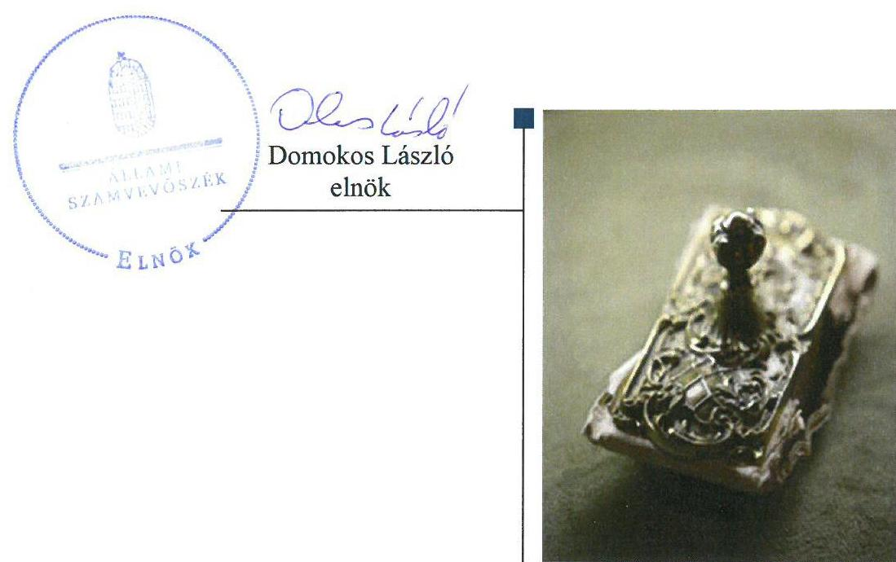
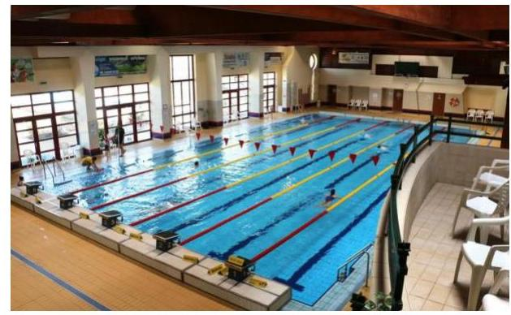
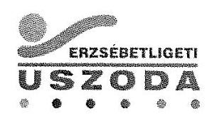
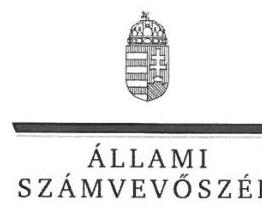
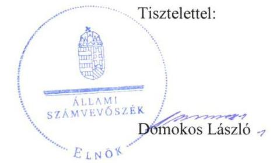
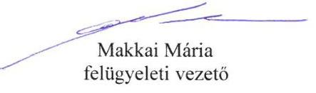

# Jelentés 

## Az önkormányzatok gazdasági társaságai

Az önkormányzatok többségi tulajdonában lévő gazdasági társaságok gazdálkodásának ellenőrzése - Kertvárosi Sportlétesítményeket Üzemeltető Kft.
2018.

---

# Jelentés 

## Az önkormányzatok gazdasági társaságai

Az önkormányzatok többségi tulajdonában lévő gazdasági társaságok gazdálkodásának ellenőrzése - Kertvárosi Sportlétesítményeket Üzemeltető Kft.
2018. 06. hó 12. nap

---

# AZ ELLENŐRZÉST FELÜGYELTE:

## MAKKAI MÁRIA felügyeleti vezető

## AZ ELLENŐRZÉST VEZETTE ÉS A VÉGREHAJTÁSÁÉRT FELELŐS:

### VERTKOVCZI MÁRIA ellenőrzésvezető

## A PROGRAM ÖSSZEÁLLÍTÁSÁÉRT FELELŐS:

### TÓTPÁL SZABOLCS osztályvezető

---

**IKTATÓSZÁM: V-1402-032/2016.**

**TÉMASZÁM: 2447**

---

**ELLENŐRZÉS-AZONOSÍTÓ SZÁM: V079355**

---

Jelentéseink az Országgyűlés számítógépes hálózatán és az Interneta a www.asz.hu címen is olvashatóak.

---

# TARTALOMJEGYZÉK 

■ ÖSSZEGZÉS ..... 5
■ AZ ELLENŐRZÉS CÉLJA ..... 6
■ AZ ELLENŐRZÉS TERÜLETE ..... 7
■ AZ ELLENŐRZÉS HÁTTERE, INDOKOLTSÁGA ..... 8
■ A JELENTÉS LÉNYEGES KÉRDÉSKÖREI ..... 9
■ AZ ELLENŐRZÉS HATÓKÖRE ÉS MÓDSZEREI ..... 10
■ MEGÁLLAPÍTÁSOK ..... 12
■ JAVASLATOK ..... 15
■ MELLÉKLETEK ..... 17
I. sz. melléklet: Értelmező szótár ..... 17
■ FÜGGELÉK: ÉSZREVÉTELEK ..... 19
■ RÖVIDÍTÉSEK JEGYZÉKE ..... 23

---

.

---

# ÖSSZEGZÉS 

A Kertvárosi Sportlétesítményeket Üzemeltető Kft. gazdálkodása nem volt szabályozott, azonban a 2016. évre a szabályozottság javult. A gazdálkodás, vagyongazdálkodás nem volt szabályszerű. A Társaság nem biztosította müködésének, gazdálkodásának átláthatóságát.

## Az ellenőrzés társadalmi indokoltsága

Magyarországon az önkormányzatok kötelező és önként vállalt feladataik vonatkozásában is egyre szélesebb körben alkalmazzák a költségvetésen kívüli feladatellátást, ezáltal - a nonprofit szervezetek mellett - az önkormányzati tulajdonú gazdasági társaságok is kiemelt fontosságú szerephez jutottak.

Az Állami Számvevőszék által a sportlétesítmények müködtetéséhez kapcsolódó tevékenységet folytató Kertvárosi Sportlétesítményeket Üzemeltető Kft.-nél végzett ellenőrzést az a társadalmi elvárás is indokolja, hogy a feladatellátásából adódóan a tevékenységén keresztül a Budapest XVI. kerület lakosságának széles köre kerülhet kapcsolatba a Társasággal az általa nyújtott szolgáltatásokkal.

## Főbb megállapítások, következtetések, javaslatok

Budapest Főváros XVI. kerületi Önkormányzat a tulajdonosi joggyakorlás kereteit kialakította, szabályozta a Társaság feladatellátását és rendszeres beszámolási kötelezettségeket írt elő a Társaság részére. Az év végi beszámolókat szabályszerűen megtárgyalta és elfogadta. Az önkormányzat tulajdonosi joggyakorlása szabályszerű volt.

A Társaság a 2013-2015. években nem rendelkezett az előírt számviteli szabályzatokkal, ezáltal nem biztosította a szabályszerű működést, számviteli elszámolásokat. A 2016. évben elkészítette a szabályzatait, amelyek a számlarend kivételével szabályszerűek voltak. A Társaság számviteli beszámolóiban szereplő mérleg adatokat nem támasztotta alá leltárral, ezáltal nem volt biztosított a mérlegben szereplő eszköz és forrás értékek valódiságának alátámasztása. A Társaság a tulajdonosi joggyakorló által előírt rendszeres beszámolási kötelezettségeket teljesítette. A Társaság vagyongazdálkodása nem volt szabályszerű, ezáltal nem biztosította a vagyon védelmét, megőrzését.

A Társaság a közérdekű adatait nem tette közzé az előírt tartalommal, ezáltal nem biztosította a gazdálkodásának, működésének az átláthatóságát.

A megállapítások alapján az Állami Számvevőszék a Kertvárosi Sportlétesítményeket Üzemeltető Kft. ügyvezetőjének 6 javaslatot fogalmazott meg.

---

# AZ ELLENŐRZÉS CÉLJA 

önköltségszámítással.

Az ellenőrzés célja annak értékelése volt, hogy az önkormányzat vagyongazdálkodási tevékenysége során szabályszerűen gyakorolta-e tulajdonosi jogait; a gazdasági társaság szabályozottsága, gazdálkodása és vagyongazdálkodási tevékenysége, bevételeinek és ráfordításainak elszámolása megfelelt-e a jogszabályi és tulajdonosi előírásoknak; a gazdasági társaság kötelezettségállománya jelent-e kockázatot a múködésre, valamint a gazdálkodás átláthatósága és elszámoltathatósága érdekében biztosítva volt-e a szolgáltatás dijának megalapozottsága szabályszerű

---

# AZ ELLENŐRZÉS TERÜLETE 

## Kertvárosi Sportlétesítményeket Üzemeltető Kft. és a tulajdonosi jogokat gyakorló Budapest Főváros XVI. kerületi Önkormányzat

Budapest Főváros XVI. kerületi Önkormányzat 2006. évben alapította a 100 \%-ban tulajdonában lévő Kertvárosi Sportlétesítményeket Üzemeltető Kft.-t, 50,0 M Ft pénzbeli hozzájárulással.

A Társaság ${ }^{1}$ az ellenőrzött időszakban közfeladatként látta el az Önkormányzat² tulajdonában lévő sportlétesítmények üzemeltetését.

Az Önkormányzat a közfeladat ellátásra Közszolgáltatási Szerződést ${ }^{3}$ kötött a Társasággal ingatlanok (uszodák) működtetésére, üzemeltetésére. Az Önkormányzat a közfeladat ellátására a szolgáltatás díjait, illetve a szolgáltatásra vonatkozó követelményeit az Alapító Okiratban, illetve a Közszolgáltatási szerződésben szabályozta.

A Polgármester ${ }^{4}$ és a Jegyzö5 személyében nem történt változás az ellenőrzött időszakban. A Társaság Ügyvezetőjének ${ }^{6}$ személye az ellenőrzött időszakban nem változott.

A foglalkoztatottak száma a Társaságnál 2013. év végén 34 fő, 2016. év végén 35 fő volt.

Könyvvizsgálatra a Társaság nem volt kötelezett, ugyanakkor az Alapító a Társaság Alapító Okiratában Könyvvizsgálót ${ }^{7}$ jelölt ki.

A Társaság a tevékenységét az Önkormányzattól üzemeltetésre átvett és saját eszközökkel látta el, vagyonkezelt eszköze nem volt. A Társaság az ellenőrzött időszakban nem került besorolásra a kormányzati szektorba sorolt egyéb szervezetek közé.

---

# AZ ELLENŐRZÉS HÁTTERE, INDOKOLTSÁGA 

Az önkormányzatok többségi tulajdonában álló gazdasági társaságok ellenőrzése kiemelten fontos a vagyon megőrzése, megóvása érdekében. A feladatellátás költségeinek, ráfordításainak alakulása a lakosság széles rétegét érinti.

Az ellenőrzés feltárhatja, hogy az önkormányzat a feladatellátásához rendelt vagyon működtetését a tulajdonostól elvárható gondossággal végezte-e, a feladatot ellátó gazdasági társaság a létesítő okiratban, szolgáltatási szerződésben foglaltak betartásával biztosította-e a feladat ellátását. Az ellenőrzés eredményeképp meghatározhatóvá válnak a költségvetési hiányt befolyásoló szervezetek kockázatai, lehetővé válik ezen kockázatok csökkentése. Az ellenőrzés rávilágíthat arra, hogy a gazdasági társaság a vagyon használatával biztosította-e a szolgáltatás folytatásának feltételeit, az önkormányzat tulajdonosi felügyelete hozzájárult-e a szabályszerű gazdálkodáshoz és feladatellátáshoz. A megállapítások alapján megfogalmazott számvevőszéki javaslatok hasznosítása elősegítheti a meglévő hibák megszüntetését. A jó gyakorlatok bemutatásával az ÁSZ ${ }^{8}$ hozzájárulhat a követendő megoldások megismertetéséhez, terjesztéséhez.

---

# A JELENTÉS LÉNYEGES KÉRDÉSKÖREI 

1. Az önkormányzat tulajdonosi joggyakorlása szabályszerű volt-e?
2. A gazdasági társaság szabályozottsága, gazdálkodása és vagyongazdálkodási tevékenysége szabályszerű volt-e?

---

# AZ ELLENŐRZÉS HATÓKÖRE ÉS MÓDSZEREI 

## Az ellenőrzés típusa

Megfelelőségi ellenőrzés.

## Az ellenőrzött időszak

2013. január 1 - 2016. december 31.

## Az ellenőrzés tárgya

Budapest Főváros XVI. kerületi Önkormányzat tulajdonosi joggyakorlása, valamint a Kertvárosi Sportlétesítményeket Üzemeltető Kft. gazdálkodásának szabályozottsága és szabályszerűsége.

Az ellenőrzés kiterjedt minden olyan körülményre és adatra, amely az ÁSZ jogszabályban meghatározott feladatainak teljesítéséhez, valamint a program végrehajtása folyamán felmerült újabb összefüggések feltárásához szükséges.

## Az ellenőrzött szervezet

- Kertvárosi Sportlétesítményeket Üzemeltető Kft.
- Budapest Főváros XVI. kerületi Önkormányzat

## Az ellenőrzés jogalapja

Az ellenőrzés jogalapját az ÁSZ tv. ${ }^{9}$ 1. § (3) bekezdése és 5. § (3)-(5) bekezdései képezték.

## Az ellenőrzés módszerei

Az ellenőrzést a nemzetközi standardokat irányadónak tekintve az ellenőrzési program ellenőrzési kérdései, az ellenőrzött időszakban hatályos jogszabályok, az ellenőrzés szakmai szabályok és módszertanok figyelembe vételével végeztük.

Az ellenőrzés ideje alatt az ellenőrzött szervezettel történő kapcsolattartást az ÁSZ Szervezeti és Működési Szabályzatának vonatkozó előírásai alapján biztosítottuk.

---

Az ellenőrzés a tulajdonosi jogokat gyakorló önkormányzatra és az ellenőrzött gazdasági társaságra terjedt ki.

A gazdasági társaságnál mintavétellel ellenőriztük a ráfordításokat és a bevételeket, ezen belül az anyagjellegú ráfordításokat, az egyéb ráfordításokat, a pénzügyi műveletek ráfordításait és a rendkívüli ráfordításokat, illetve az értékesítés nettó árbevételét, az egyéb bevételeket, a pénzügyi műveletek bevételeit valamint a rendkívüli bevételeket. Mintavétel történt továbbá a tárgyi eszközök növekedési tételeiből. A minták kiválasztása rétegzett mintavétel alkalmazásával történt.

Az ellenőrzési kérdések megválaszolásához szükséges bizonyítékok megszerzése a következő ellenőrzési eljárások alkalmazásával történt: megfigyelés, kérdésfeltevés (információkérés), összehasonlítás, valamint elemző eljárás. Az ellenőrzési bizonyítékként felhasználható adatforrások közé tartoztak egyrészt az ellenőrzési programban felsorolt adatforrások, másrészt adatforrás lehet még minden - az ellenőrzés folyamán - feltárt, az ellenőrzés szempontjából információkat tartalmazó dokumentum.

Az ellenőrzést a kérdésekre adott válaszok kiértékelésével, valamint a megjelölt adatforrások, a csatolt tanúsítványok felhasználásával, továbbá az adott időszakban hatályos jogszabályok figyelembe vételével folytattuk le.

A mintavétellel ellenőrzött területek esetében minden egyes tétel vonatkozásában a szabályszerűségre vonatkozó kérdéseket tettünk fel, amelyek eredménye összesítésre került. Szabályszerűnek értékeltünk egy ellenőrzött területet, amennyiben 95\%-os bizonyossággal a teljes sokaságban az átlagos hibaarány legfeljebb 10\%, nem szabályszerűnek, amennyiben 10\%-nál magasabb arányt képviselt. A ráfordítások elszámolására és a vagyonnyilvántartásra vonatkozó véletlen mintavételt kockázati alapú kiválasztással egészítettük ki, amelynek során évente a három legnagyobb összegű tételt választottuk ki.

---

# 1. Az önkormányzat tulajdonosi joggyakorlása szabályszerű volt-e? 

Összegző megállapítás Az Önkormányzat tulajdonosi joggyakorlása szabályszerű volt.

A TÁRSASÁG FELETTI TULAJDONOSI JOGOKAT az önkormányzati SZMSZ ${ }^{10}$ és a Vagyongazdálkodási rendelet ${ }^{11}$ alapján a Képviselő-testület ${ }^{12}$ gyakorolta. A Gt. ${ }^{13}$, a Ptk. ${ }^{14}$, valamint a Taktv. ${ }^{15}$ előírásaival összhangban az Alapító Okiratban ${ }^{16}$ meghatározottak alapján a Társaság tevékenységét háromtagú Felügyelő Bizottság ${ }^{17}$ felügyelte.

A Felügyelő Bizottság a Gt. 34. § (4) bekezdésében és a Ptk. 3:122. § (3) bekezdésében előírtak ellenére 2013-2015. években nem, a 2016. évben rendelkezett ügyrenddel.

Az Alapító ${ }^{18}$ a Taktv. alapján megalkotta a Társaságra vonatkozó javadalmazási szabályzatot.

Az Alapító a Gt. és a Ptk. előírásainak megfelelően az egyszerűsített éves számviteli beszámolókról, közhasznúsági mellékletekről a Könyvvizsgáló és a Felügyelő Bizottság írásbeli jelentéseinek birtokában hozta meg elfogadó döntését. A beszámoló elfogadásával egyidejűleg az Alapító a Gt.-ben és Ptk.-ban foglaltaknak megfelelően döntött az adózott nyereség eredménytartalékba való átvezetéséről.

Az Alapító tulajdonosi ellenőrzés keretében a 2016. évben több évre visszamenőleg ellenőrizte a Társaságot. Az ellenőrzés alapján intézkedési javaslatot fogalmazott meg. Az intézkedési terv végrehajtására az ellenőrzött időszakot követően került sor.

## 2. A gazdasági társaság szabályozottsága, gazdálkodása és vagyongazdálkodási tevékenysége szabályszerű volt-e?

Összegző megállapítás A Társaság szabályozottsága és gazdálkodása, vagyongazdálkodása nem volt szabályszerű. A számviteli beszámolói nem voltak szabályszerűek. A közérdekú adatokkal kapcsolatos kötelezettségeit nem teljesítette.
2.1. számú megállapítás

A Társaság szabályozottsága nem volt szabályszerű, a 2013-2015. években hiányzó számviteli szabályzatok miatt. A bevételek és a ráfordítások elszámolása nem volt szabályszerű.

A Számv. tv. ${ }^{19}$ 14. § (3)-(5) bekezdéseiben foglaltak ellenére a 2013-2015. években nem rendelkezett a Társaság számviteli politikával, az eszközök és források értékelési és leltározási szabályzatával és pénzkezelési szabályzattal.

---

A Társaság 2016. október 1-jétől rendelkezett a Számv. tv.-nek megfelelően Számviteli Politikával ${ }^{20}$, eszközök és források Leltárkészítési és leltározási szabályzatával ${ }^{21}$, és Értékelési szabályzatával ${ }^{22}$, valamint Pénzkezelési szabályzattal ${ }^{23}$.

A Számviteli Politikában a Társaság a Számv. tv. 14. § (4) bekezdésében foglaltak ellenére nem rögzítette, hogy mit tekint a számviteli elszámolás, az értékelés szempontjából lényegesnek, jelentősnek, nem lényegesnek, nem jelentősnek.

A Társaság a 2013-2015. években a Számv. tv. 161. § (1) bekezdésében foglaltakkal ellentétben nem rendelkezett számlarenddel. A Társaság 2016. október 1-jétől rendelkezett a Számv. tv.-ben előírt számlarend keretében az alkalmazott számlák megnevezését és számát tartalmazó szabályzattal és bizonylati renddel. A számlarend azonban a Számv. tv. 161. § (2) bekezdés b)-c) pontjaiban foglaltak ellenére nem tartalmazta a számlák értéke növekedésének és csökkenésének jogcímeit, a számlákat érintő gazdasági eseményeket, azok más számlákkal való kapcsolatát, továbbá a főkönyvi számla és az analitikus nyilvántartás kapcsolatát.

A Társaság a Közszolgáltatási szerződésben előírtaknak megfelelően a közszolgáltatási és az egyéb tevékenységét a számviteli rendszerében elkülönítette.

A Társaság bevételeinek, ráfordításainak elszámolása nem volt szabályszerű, mivel
$\longrightarrow$ a Számv. tv-ben előírt számviteli szabályzatok hiánya miatt a számviteli elszámolások, nyilvántartások szabályszerűsége nem volt biztosított,
$\longrightarrow$ a bevételek, ráfordítások könyvviteli elszámolását nem támasztotta alá a Társaság a Számv. tv. 165. § (2) bekezdésében foglalt számviteli bizonylattal.
2.2. számú megállapítás

A Társaság az előírt beszámolási kötelezettségét teljesítette, azonban az év végi beszámolója nem volt szabályszerű, mivel leltár hiányában az eszköz és forrás értékek valódisága nem volt alátámasztott. A közérdekú adatokkal kapcsolatos kötelezettségét a Társaság nem teljesítette.

AZ EGYSZERŰSÍTETT ÉVES BESZÁMOLÓ készítési kötelezettségét a Számv. tv. alapján a Társaság teljesítette, a beszámolókat letétbe helyezte, illetve közzé tette.

A Számv. tv. 69. § (1)-(2) bekezdésében előírtak ellenére a Társaság a beszámolójában szereplő év végi mérleg adatait nem támasztotta alá leltárral, ezáltal a mérlegben szereplő eszköz és forrás értékek valódisága nem volt alátámasztott. A számviteli szabályzatok és a leltár hiányosságai ellenére az egyszerűsített éves beszámolókat a 2013-2016. években korlátozás nélküli hitelesítő záradékkal látta el a Könyvvizsgáló.

Az eszközök üzembe helyezését a Számv. tv. 52. § (2) bekezdésével ellentétben hitelt érdemlően nem dokumentálta a Társaság.

A Közszolgáltatási szerződésekben előírt adatszolgáltatási, beszámolási és üzleti terv készítési kötelezettségének a Társaság eleget tett.

---

A Társaság az ellenőrzött időszakban az Info tv. 30. § (6) bekezdésében előírtak ellenére nem rendelkezett Közérdekú adatok megismerésére irányuló igények teljesítésének rendjét rögzítő szabályzattal.

A Társaság az Info tv. 37. § (1) bekezdésében foglaltak ellenére a közérdekú adatok közzétételére vonatkozó kötelezettségét nem teljesítette.

---

# JAVASLATOK 

Az ÁSZ tv. 33. § (1) bekezdésében foglaltak értelmében az ellenőrzött szervezet vezetője köteles a jelentésben foglalt megállapításokhoz kapcsolódó intézkedési tervet összeállítani és azt a jelentés kézhezvételétől számított 30 napon belül az ÁSZ részére megküldeni. Amennyiben az ellenőrzött szervezet vezetője nem küldi meg határidőben az intézkedési tervet, vagy továbbra sem elfogadható intézkedési tervet küld, az Állami Számvevőszék elnöke az ÁSZ tv. 33. § (3) bekezdése a) és b) pontjaiban foglaltakat érvényesítheti.

## a Kertvárosi Sportlétesítményeket Üzemeltető Kft. ügyvezetőjének

1. Intézkedjen a számviteli politika és számlarend módosításáról, hogy azok feleljenek meg a hatályos Számv. tv. előírásainak.
(2.1. sz. megállapítás 3. bekezdése és 4. bekezdés utolsó mondata alapján)
2. Intézkedjen a bevételek és ráfordítások jogszabályi előírásoknak megfelelő elszámolásáról.
(2.1. sz. megállapítás 6. bekezdése alapján)
3. Intézkedjen a jogszabályi előírásoknak megfelelően a mérleg tételeinek leltárral való alátámasztásáról.
(2.2. sz. megállapítás 2. bekezdés első mondata alapján)
4. Intézkedjen az eszközök üzembe helyezése Számv. tv. előírásainak megfelelő dokumentálásáról.
(2.2. sz. megállapítás 3. bekezdése alapján)
5. Intézkedjen az Info. tv. előírásainak megfelelően a közérdekü adatok megismerésére irányuló igények teljesítésének rendjét rögzítő szabályzat elkészítéséről.
(2.2. sz. megállapítás 5. bekezdése alapján)
6. Intézkedjen az Info. tv. 1. mellékletében előírt adatok közzétételéről.
(2.2. sz. megállapítás 6. bekezdése alapján)

---

.

---

# MELLÉKLETEK 

- I. SZ. MELLÉKLET: ÉRTELMEZŐ SZÓTÁR
gazdasági társaság
gazdálkodó szervezet
nemzeti vagyon

Ptk 3:88. § (1) bekezdése szerint „a gazdasági társaságok üzletszerű közös gazdasági tevékenység folytatására, a tagok vagyoni hozzájárulásával létrehozott, jogi személyiséggel rendelkező vállalkozások, amelyekben a tagok a nyereségből közösen részesednek, és a veszteséget közösen viselik".
A Ptk. 685. § c) pontja szerint gazdálkodó szervezet: „az állami vállalat, az egyéb állami gazdálkodó szerv, a szövetkezet, a lakásszövetkezet, az európai szövetkezet, a gazdasági társaság, az európai részvénytársaság, az egyesülés, az európai gazdasági egyesülés, az európai területi együttműködési csoportosulás, az egyes jogi személyek vállalata, a leányvállalat, a vízgazdálkodási társulat, az erdő birtokossági társulat, a végrehajtói iroda, az egyéni cég, továbbá az egyéni vállalkozó." (2014. 03.15-ig hatályos)
Nvtv. ${ }^{24} 1 . \S$ (2) bekezdése szerint többek között:
„az állam vagy a helyi önkormányzat kizárólagos tulajdonában álló dolgok, az a) pont hatálya alá nem tartozó, állam vagy a helyi önkormányzat tulajdonában lévő dolog,
az állam vagy a helyi önkormányzat tulajdonában lévő pénzügyi eszközök, továbbá az államot vagy a helyi önkormányzatot megillető társasági részesedések, az államot vagy a helyi önkormányzatot megillető bármely vagyoni értékkel rendelkező jogosultság, amelyet jogszabály vagyoni értékű jogként nevesít."

---

.

---

# FÜGGELÉK: ÉSZREVÉTELEK 

A jelentéstervezetet a Számvevőszék 15 napos észrevételezésre megküldte az ellenőrzött szervezetek vezetőinek az ÁSZ tv. 29. §* (1) bekezdése előírásának megfelelően.

Az ÁSZ a jelentéstervezetet észrevételezésre megküldte Budapest Főváros XVI. kerület Önkormányzat polgármesterének és a Kertvárosi Sportlétesítményeket Üzemeltető Kft. ügyvezetőjének.
Az ÁSZ tv. 29. § (2) bekezdésében foglalt észrevételezési jogával Budapest Főváros XVI. kerület Önkormányzat polgármestere nem élt, a Kertvárosi Sportlétesítményeket Üzemeltető Kft. ügyvezetőjének észrevételeit és az azokra adott választ a függelék alább tartalmazza.

[^0]
[^0]:    * 29. § (1) Az Állami Számvevőszék az ellenőrzési megállapításait megküldi az ellenőrzött szervezet vezetőjének vagy az általa megbízott személynek, és annak, akinek személyes felelősségét állapította meg.
    (2) Az ellenőrzött szervezet vezetője és a felelősként megjelölt személy az ellenőrzés megállapításaira tizenöt napon belül írásban észrevételt tehet.
    (3) Az Állami Számvevőszék az észrevételre a beérkezésétől számított harminc napon belül írásban válaszol. A figyelembe nem vett észrevételeket köteles a jelentésben feltüntetni, és megindokolni, hogy azokat miért nem fogadta el.

---

Állami Számvevőszék

Makkai Mária
Felügyeleti vezető

1364 Budapest 4, Pf. 54.

Tárgy: Észrevétel

Tisztelt Makkai Mária!

Az Állami Számvevőszék által megküldött EL-0571-005/2018 iktatószámú jelentés tervezetre az észrevételeim a következők:

A 2.1. számú megállapítás szerint Társaságunk 2013-2015 között nem rendelkezett számviteli politikával.

Tájékoztatom, hogy Társaságunk a vizsgált időszakban rendelkezett érvényes számviteli politikával. Levelem mellékleteként megküldöm a 2013. január 1-jétől hatályos számviteli politikát.

A javaslatok 2. pontja szerint a bevételek és ráfordítások jogszabályi előírásoknak megfelelő elszámolásról szükséges gondoskodnunk.

Az ellenőrzési jelentés alapján nem egyértelmű számunkra, hogy az intézkedési terv elkészítésénél a számviteli szabályzatokon kívül mit kell beírnunk és javítanunk, mivel az észlelt hibák és hiányosságok nem kerültek részletesen ismertetésre sem az ellenőrzési jelentésben, sem azt megelőzően az ellenőrzés időszaka alatt.

Kérjük észrevételeink elfogadását, és amennyiben lehetséges egy egyeztetés lehetőségének biztosítását a jelentéssel kapcsolatosan.

Budapest, 2018. május 03.

Köszönettel

Rátonyi Gábor
ügyvezető igazgató

Kertvárosi Sportlétesítményeket Üzemeltető Kft.
1165 Budapest, Ujszász u. 106-108. Adószám: 13880462-2-42;
Bankszámlaszám: OTP Bank 11716008-20187091; Bejegyezve: Fővárosi Bíróság Cégbírósága Bp.
Cégjegyzékszám: 01-09-878027; Telephely: Szeremihályi Konrád Ferenc Usszoda 1162 Bp, Segesvár u. 16;
E-mail: titkarsag@uszodak16.hu; www.uszodak16.hu

---

ELNÖK

Ikt.szám: EL-0571-009/2018.

# Rátonyi Gábor úr 

ügyvezető

Kertvárosi Sportlétesítményeket Üzemeltető Kft.

## Budapest

## Tisztelt Ügyvezető Úr!

„Az önkormányzatok többségi tulajdonában lévő gazdasági társaságok gazdálkodásának ellenörzése - Kertvárosi Sportlétesítményeket Üzemeltető Kft." címmel készített számvevőszéki jelentéstervezetre tett észrevételét köszönettel megkaptam.

Az Állami Számvevőszék észrevételre vonatkozó álláspontjáról a felügyeleti vezető által készített részletes tájékoztatást mellékelten megküldöm.

Tájékoztatom Ügyvezető urat, hogy a számvevőszéki jelentésben - az Állami Számvevőszékről szóló 2011. évi LXVI. törvény 29. § (3) bekezdése alapján - a figyelembe nem vett észrevételeket szerepeltetjük, annak indoklásával, hogy azokat az Állami Számvevőszék miért nem fogadta el.

Budapest, 2018. 05 hó 29 nap

Melléklet: Tájékoztatás az észrevételek kezeléséről

---

# Tájékoztatás   az észrevételek kezeléséről 

„Az önkormányzatok többségi tulajdonában lévő gazdasági társaságok gazdálkodásának ellenörzése - Kertvárosi Sportlétesitményeket Üzemeltető Kft." címủ jelentéstervezetre 2018. május 9 -én érkezett észrevételt áttekintettük, annak kezelésével kapcsolatban a következő tájékoztatást adom.

1. A jelentéstervezet 2.1. számú megállapítás első bekezdéséhez tett észrevétele vitatja, hogy a Társaság a Számv. tv. 14. § (3)-(5) bekezdéseiben foglaltak ellenére a 20132015. években nem rendelkezett számviteli politikával.

Tájékoztatom, hogy az Állami Számvevőszék ellenőrzési megállapításai az Állami Számvevőszékről szóló 2011. évi LXVI. törvénynek (ÁSZ tv.) megfelelően minden esetben az ellenőrzés során bekért és az arra nyitva álló határidőn belül rendelkezésre bocsátott dokumentumokon alapulnak.
A Társaság adatszolgáltatása és az Ügyvezető úr által adott „Teljességi és hitelességi nyilatkozat" nem tartalmazta az észrevételben hivatkozott dokumentumokat. Mindezek alapján az észrevételt nem fogadjuk el, az ÁSZ megállapítása helytálló, a jelentéstervezet módosítása nem indokolt.
2. A jelentéstervezet javaslatai 2. pontjához írott kérdésére válaszolva tájékoztatom, hogy az ÁSZ megállapítása az ellenőrzés során véletlen statisztikai mintavétellel kiválasztott tételekhez a Társaság által feltöltött dokumentumokon alapul. A javaslatot megalapozó megállapítás a jelentéstervezet 13. oldalán, a 2.1. számú megállapítás 6 . bekezdésében található.

Budapest, 2018. 05. hó 24 nap

---

# RÖVIDÍTÉSEK JEGYZÉKE 

${ }^{1}$ Társaság
${ }^{2}$ Önkormányzat
${ }^{3}$ Közszolgáltatási szerződés
${ }^{4}$ Polgármester
${ }^{5}$ Jegyző
${ }^{6}$ Ügyvezető
${ }^{7}$ Könyvvizsgáló
${ }^{8}$ ÁSZ
${ }^{9}$ ÁSZ tv.
${ }^{10}$ SZMSZ
${ }^{11}$ Vagyongazdálkodási rendelet
${ }^{12}$ Képviselő-testület
${ }^{13} \mathrm{Gt}$.
${ }^{14} \mathrm{Ptk}$.
${ }^{15}$ Taktv.
${ }^{16}$ Alapító Okirat
${ }^{17}$ Felügyelő Bizottság
${ }^{18}$ Alapító
${ }^{19}$ Számv. tv.
${ }^{20}$ Számviteli Politika
${ }^{21}$ Leltározási és leltárkészítési szabályzat
${ }^{22}$ Értékelési szabályzat
${ }^{23}$ Pénzkezelési szabályzat
${ }^{24}$ Nvtv.

Kertvárosi Sportlétesítményeket Üzemeltető Kft.
Budapest Főváros XVI. kerületi Önkormányzat
Budapest XVI. kerületi Önkormányzat és a Társaság között létrejött szerződés (hatályos 2010. március 25-étől, 2012. december 5-étől, 2013. november 28ától, 2015. március 26-ától)
Budapest Főváros XVI. kerületi Önkormányzat polgármestere
Budapest Főváros XVI. kerületi Önkormányzat jegyzője
a Társaság ügyvezetője
Kertvárosi Sportlétesítményeket Üzemeltető Kft. könyvvizsgálója
Állami Számvevőszék
Állami Számvevőszékről szóló 2011. LXVI. tv. (hatályos: 2011. július 1-jétől)
Budapest Főváros XVI. kerületi Önkormányzat Képviselő-testületének Szervezeti és Müködési Szabályzata - többször módosított 10/2011. rendelet (IV.20.)
Budapest Főváros XVI. kerületi Önkormányzat Képviselő-testületének önkormányzati rendelete az önkormányzat vagyonáról, a vagyontárgyak feletti tulajdonosi jogok gyakorlásáról - többször módosított 24/2009. rendelet (VI.25.)
Budapest Főváros XVI. kerületi Önkormányzat képviselő-testülete
2006. évi IV. törvény a gazdasági társaságokról (hatályos: 2014. március 14-éig)
2013. évi V. törvény a Polgári Törvénykönyvről (hatályos: 2014. március 15-étől)
2009. évi CXXII. törvény a köztulajdonban álló gazdasági társaságok takarékosabb müködéséről (hatályos: 2009. december 4-étől)
Kertvárosi Sportlétesítményeket Üzemeltető Korlátolt Felelősségű Társaság alapító okirata (hatályos: 2012. november 22-étől)
a Társaság felügyelő bizottsága
Budapest Főváros XVI. kerületi Önkormányzat Képviselő-testülete, a Társaság legfőbb szerve
2000. évi C. törvény a számvitelről (hatályos 2001. január 1-jétől)

Kertvárosi Sportlétesítményeket Üzemeltető Kft. Számviteli politika (hatályos: 2016. október 1-től)

Kertvárosi Sportlétesítményeket Üzemeltető Kft. leltározási és leltárkészítési szabályzata (hatályos: 2016. október 1-től)
Kertvárosi Sportlétesítményeket Üzemeltető Kft. értékelési szabályzata (hatályos: 2016. október 1-től)

Kertvárosi Sportlétesítményeket Üzemeltető Kft. pénzkezelési szabályzata (hatályos: 2016. október 1-től)
2011. évi CXCVI. törvény a nemzeti vagyonról (hatályos: 2011. december 31-étől)

---

ÁLLAMI SZÁMVEVŐSZÉK
1052 Budapest, Apáczai Csere János utca 10.
Levélcím: 1364 Budapest 4. Pf. 54
Telefon: +36 14849100 Telefax: +36 14849200
www.asz.hu