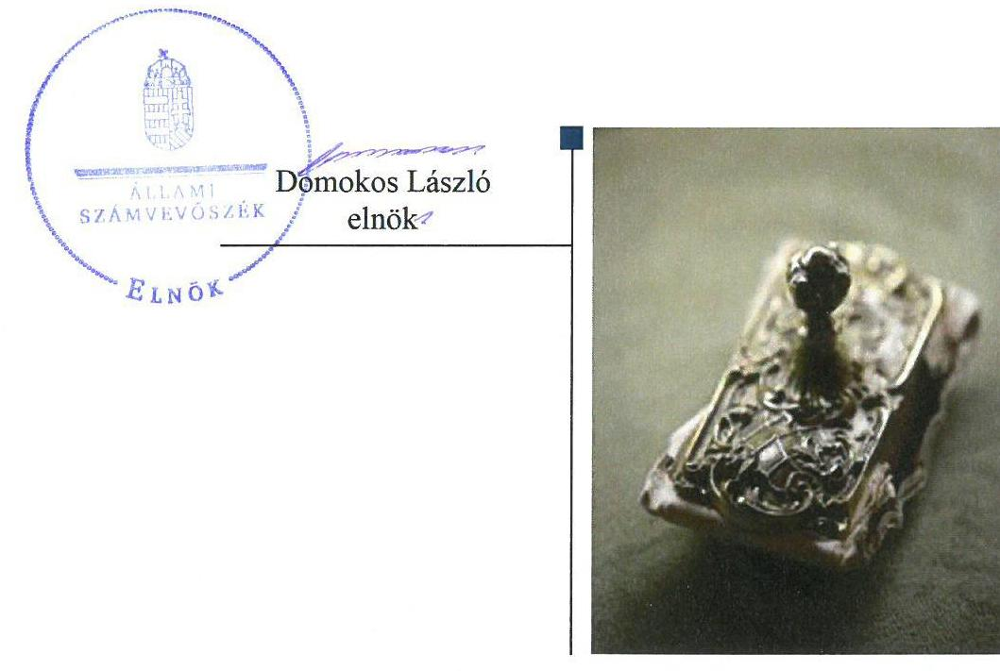
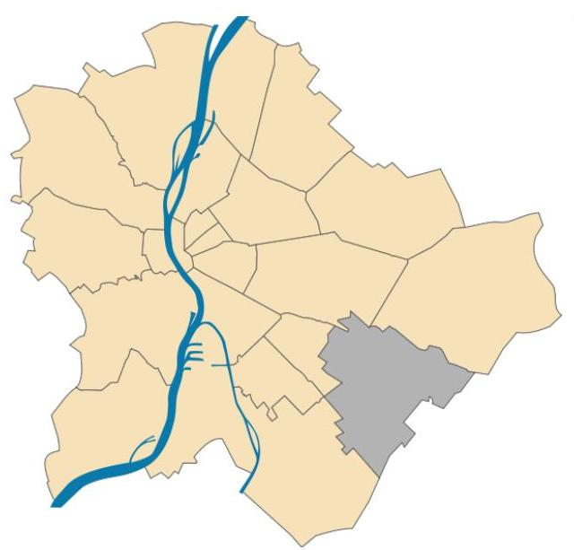
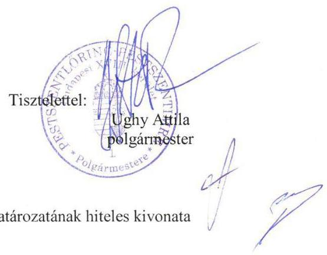
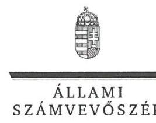
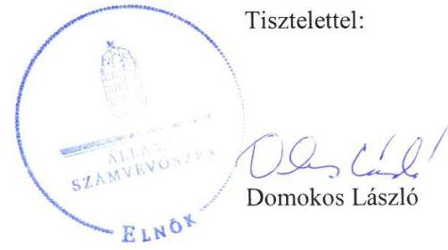
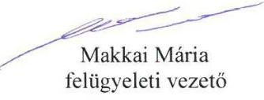
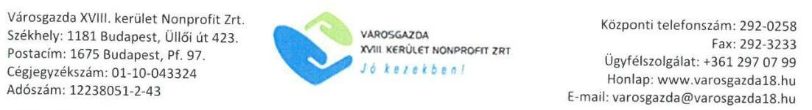
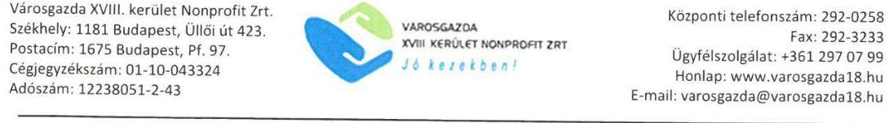
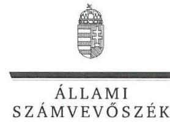
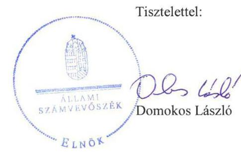

# Jelentés 

## Az önkormányzatok gazdasági társaságai

Az önkormányzatok többségi tulajdonában lévő gazdasági társaságok gazdálkodásának ellenőrzése - Városgazda XVIII. kerület Nonprofit Zrt.
2018.

---

# Jelenetés 

## Az önkormányzatok gazdasági társaságai

Az önkormányzatok többségi tulajdonában lévő gazdasági társaságok gazdálkodásának ellenőrzése - Városgazda XVIII. kerület Nonprofit Zrt.
2018. OG hó 12. nap

---

# AZ ELLENŐRZÉST FELÜGYELTE:

## MAKKAI MÁRIA felügyeleti vezető

## AZ ELLENŐRZÉST VEZETTE ÉS A VÉGREHAJTÁSÁÉRT FELELŐS:

### VERTKOVCZI MÁRIA ellenőrzésvezető

## A PROGRAM ÖSSZEÁLLÍTÁSÁÉRT FELELŐS:

### TÓTPÁL SZABOLCS osztályvezető

---

**IKTATÓSZÁM:** EL-0121-038/2018.

**TÉMASZÁM:** 2447

**ELLENŐRZÉS-AZONOSÍTÓ SZÁM:** V079311

---

Jelentéseink az Országgyűlés számítógépes hálózatán és az Interneta a www.asz.hu címen is olvashatóak.

---

# TARTALOMJEGYZÉK 

■ ÖSSZEGZÉS ..... 5
■ AZ ELLENŐRZÉS CÉLJA ..... 6
■ AZ ELLENŐRZÉS TERÜLETE ..... 7
■ AZ ELLENŐRZÉS HÁTTERE, INDOKOLTSÁGA ..... 8
■ A JELENTÉS LÉNYEGES KÉRDÉSKÖREI ..... 9
■ AZ ELLENŐRZÉS HATÓKÖRE ÉS MÓDSZEREI ..... 10
■ MEGÁLLAPÍTÁSOK ..... 12
■ JAVASLATOK ..... 15
■ MELLÉKLETEK ..... 17
I. sz. melléklet: Értelmező szótár ..... 17
■ FÜGGELÉK: ÉSZREVÉTELEK ..... 19
■ RÖVIDÍTÉSEK JEGYZÉKE ..... 33

---

.

---

# ÖSSZEGZÉS 

A Városgazda XVIII. kerület Nonprofit Zrt. gazdálkodása nem volt szabályozott. A vagyon védelme, elszámoltathatósága nem volt biztositott. A számviteli beszámolói a vagyonról nem mutattak megbizható, valós képet. A Társaság a közérdekü adatainak közzétételével biztositotta müködésének, gazdálkodásának átláthatóságát.

## Az ellenőrzés társadalmi indokoltsága

Magyarországon az önkormányzatok kötelező és önként vállalt feladataik vonatkozásában is egyre szélesebb körben alkalmazzák a költségvetésen kívüli feladatellátást, ezáltal - a nonprofit szervezetek mellett - az önkormányzati tulajdonú gazdasági társaságok is kiemelt fontosságú szerephez jutottak. Ezen belül kiemelt jelentőségű számos önkormányzati gazdasági társaság müködése abból a szempontból is, hogy gazdálkodásának egyes elemei befolyásolják az önkormányzati alszektor hiányát és az államadósságot.

Az Állami Számvevőszék által a városüzemeltetéshez kapcsolódó tevékenységet folytató Városgazda XVIII. kerület Nonprofit Zrt. ellenőrzését az a társadalmi elvárás is indokolta, hogy a tevékenységén keresztül a Budapest XVIII. kerület lakosságának széles köre kerülhet kapcsolatba a Társasággal, az általa nyújtott szolgáltatásokkal.

## Főbb megállapítások, következtetések, javaslatok

Budapest Főváros XVIII. kerület Pestszentlőrinc-Pestszentimre Önkormányzata kialakította a tulajdonosi joggyakorlás kereteit, szabályozta a Társaság feladatellátását és rendszeres elszámolási kötelezettségeket írt elő a részére. A Társaság beszámolóit szabályszerűen megtárgyalta és elfogadta, a tulajdonosi joggyakorlása szabályszerű volt.

A Társaság számviteli szabályzatai nem voltak szabályszerűek, ezáltal nem biztosították a szabályszerű működés kereteit. A Társaság a személyi jellegű ráfordítások kivételével a ráfordításokat és a bevételeket szabályszerűen számolta el. A Társaság éves számviteli beszámolói a vagyonkezelésbe vett vagyont nem tartalmazták, így a vagyoni helyzetről, annak változásáról a beszámoló nem mutatott megbízható és valós képet. A vagyonkezelt eszközökkel kapcsolatos bevételek, költségek, ráfordítások elkülönített nyilvántartásának hiánya miatt a Társaság vagyongazdálkodása nem volt szabályszerű, nem biztosította a vagyon védelmét, elszámoltathatóságát.

A Társaság a jogszabályban előírt közérdekű adatait közzétette, kialakította a tevékenységének nyomon követési rendszerét, ez alapján biztosította müködésének, gazdálkodásának átláthatóságát. A Társaság a jogszabályban előírt a kormányzati szektorba sorolt egyéb szervezetekre vonatkozó adatszolgáltatási kötelezettségeit nem teljesítette.

A megállapítások alapján az Állami Számvevőszék Budapest Főváros XVIII. kerület Pestszentlőrinc-Pestszentimre Önkormányzata polgármesterének 1 javaslatot, a Városgazda XVIII. kerület Nonprofit Zrt. vezérigazgatójának 6 javaslatot fogalmazott meg.

---

# AZ ELLENŐRZÉS CÉLJA 

Az ellenőrzés célja annak értékelése volt, hogy az önkormányzat vagyongazdálkodási tevékenysége során szabályszerűen gyakorolta-e tulajdonosi jogait; a gazdasági társaság szabályozottsága, gazdálkodása és vagyongazdálkodási tevékenysége, bevételeinek és ráfordításainak elszámolása megfelelt-e a jogszabályi és tulajdonosi előírásoknak; a gazdasági társaság kötelezettségállománya jelentett-e kockázatot a működésre, valamint a gazdálkodás átláthatósága és elszámoltathatósága érdekében biztosítva volt-e a szolgáltatás dijának megalapozottsága szabályszerű önköltségszámítással. Az ellenőrzés célja továbbá annak megítélése, hogy a kormányzati szektorba sorolt önkormányzati tulajdonban (résztulajdonban) lévő gazdálkodó szervezetek gazdálkodásának a kormányzati szektor hiányára és az államadósságra befolyással bíró elemei a jogszabályi előírásoknak megfeleltek-e.

---

# AZ ELLENŐRZÉS TERÜLETE 

## Városgazda XVIII. kerület Nonprofit Zrt. és a tulajdonosi jogokat gyakorló Budapest Főváros XVIII. kerület Pestszentlőrinc-Pestszentimre Önkormányzata

Budapest Főváros XVIII. kerület Pestszentlőrinc-Pestszentimre Önkormányzata 100\%-os tulajdonában lévő Városgazda XVIII. kerület Nonprofit Zrt. 1996. évben alakult a Budapest XVIII. kerület Önkormányzat Lakáskezelő Vállalat jogutódjaként.

A Társaság ${ }^{1}$ fő tevékenysége az ingatlankezelés volt. Emellett közfeladatként végezte a Társaság a piacok és őrzött parkolók üzemeltetését, a kerületi nevelési és egészségügyi intézmények karbantartását, felújítását, az ifjúsági és sport feladatok ellátását, a szabadidős és közművelődési tevékenységek szervezését, a közfoglalkoztatás szervezését, városüzemeltetési feladatokat.

Az Önkormányzat² és a Társaság Feladat-ellátási szerződést ${ }^{3}$ kötött, amelyben részletezték a Társaság által ellátandó feladatok körét, a feladatellátásához kapcsolódó követelményeket, az elszámolási szabályait. A Feladat-ellátási szerződés megkötésével egyidejűleg Támogatási szerződést ${ }^{4}$ is kötöttek, amelyben meghatározták a Társaság által ellátott közfeladatok költségeinek kompenzálását.

A feladatellátáshoz az Önkormányzat ingatlanokat adott vagyonkezelésbe a Társaság részére, amellyel kapcsolatban az Mötv. ${ }^{5}$ és az Nvtv. ${ }^{6}$ előírásainak megfelelő Vagyonkezelési szerződést ${ }^{7}$ kötöttek.

Az ellenőrzött időszakban a Társaság jegyzett tőkéje 2013. évben 300 millió forint volt, ami a 2015. évben 650 millió forintra változott.

Az ellenőrzött időszakban a Polgármester ${ }^{8}$ személye nem változott, a Jegyző ${ }^{9}$ személye 2015. január 1-jétől változott. A Társaság Vezérigazgatója ${ }^{10}$ az ellenőrzött időszakban nem változott.

A Társaságnál a foglalkoztatottak száma 2013. év végén 376 fő, 2016. év végén 541 fő volt.

A Társaság 2013. június 28-ától NGM közlemény ${ }^{11}$ alapján kormányzati szektorba sorolt egyéb szervezetnek minősült.

---

# AZ ELLENŐRZÉS HÁTTERE, INDOKOLTSÁGA 

Az önkormányzatok többségi tulajdonában álló gazdasági társaságok ellenőrzése kiemelten fontos a vagyon megőrzése, megóvása érdekében, valamint a kormányzati szektor elszámolásaiban megjelenő önkormányzati tulajdonú gazdálkodó szervezetek esetében, amelyekkel szemben alapvető követelmény, hogy gazdálkodásuk, működésük szabályszerű, az általuk szolgáltatott adatok minél megbízhatóbbak legyenek. A feladatellátás költségeinek, ráfordításainak alakulása a lakosság széles rétegét érinti.

Az ellenőrzés feltárhatja, hogy az önkormányzat a feladatellátásához rendelt vagyon működtetését a tulajdonostól elvárható gondossággal végezte-e, a feladatot ellátó gazdasági társaság a létesítő okiratban, szolgáltatási szerződésben foglaltak betartásával biztosította-e a feladat ellátását. Az ellenőrzés eredményeképp meghatározhatóvá válnak a költségvetési hiányt befolyásoló szervezetek kockázatai, lehetővé válik ezen kockázatok csökkentése. Az ellenőrzés rávilágíthat arra, hogy a gazdasági társaság a vagyon használatával biztosította-e a szolgáltatás folytatásának feltételeit, az önkormányzat tulajdonosi felügyelete hozzájárult-e a szabályszerű gazdálkodáshoz és feladatellátáshoz. A megállapítások alapján megfogalmazott számvevőszéki javaslatok hasznosítása elősegítheti a meglévő hibák megszüntetését. A jó gyakorlatok bemutatásával az ÁSZ ${ }^{12}$ hozzájárulhat a követendő megoldások megismertetéséhez, terjesztéséhez.

---

# A JELENTÉS LÉNYEGES KÉRDÉSKÖREI 

1. Az önkormányzat tulajdonosi joggyakorlása szabályszerű volt-e?
2. A gazdasági társaság szabályozottsága, gazdálkodása és vagyongazdálkodási tevékenysége szabályszerű volt-e?

---

# AZ ELLENŐRZÉS HATÓKÖRE ÉS MÓDSZEREI 

## Az ellenőrzés típusa

Megfelelőségi ellenőrzés.

## Az ellenőrzött időszak

2013. január 1 - 2016. december 31.

## Az ellenőrzés tárgya

Budapest Főváros XVIII. kerület Pestszentlőrinc-Pestszentimre Önkormányzata tulajdonosi joggyakorlása, valamint a Városgazda XVIII. kerület Nonprofit Zrt. gazdálkodásának szabályozottsága és szabályszerűsége, továbbá az önkormányzati alszektorba sorolt gazdasági társaság gazdálkodásának a kormányzati szektor hiányára és az államadósságra befolyással bíró elemei.

Az ellenőrzés kiterjedt minden olyan körülményre és adatra, amely az ÁSZ jogszabályban meghatározott feladatainak teljesítéséhez, valamint a program végrehajtása folyamán felmerült újabb összefüggések feltárásához szükséges.

## Az ellenőrzött szervezet

Városgazda XVIII. kerület Nonprofit Zrt.
Budapest Főváros XVIII. kerület Pestszentlőrinc-Pestszentimre Önkormányzata

## Az ellenőrzés jogalapja

Az ellenőrzés jogalapját az ÁSZ tv ${ }^{13}$. 1. § (3) bekezdése és 5. § (3)-(5) bekezdései képezték.

## Az ellenőrzés módszerei

Az ellenőrzést a nemzetközi standardokat irányadónak tekintve az ellenőrzési program ellenőrzési kérdései, az ellenőrzött időszakban hatályos jogszabályok, az ellenőrzés szakmai szabályok és módszertanok figyelembe vételével végeztük.

---

Az ellenőrzés ideje alatt az ellenőrzött szervezettel történő kapcsolattartást az ÁSZ Szervezeti és Működési Szabályzatának vonatkozó előírásai alapján biztosítottuk.

Az ellenőrzés a tulajdonosi jogokat gyakorló önkormányzatra és az ellenőrzött gazdasági társaságra terjedt ki.

A gazdasági társaságnál mintavétellel ellenőriztük a ráfordításokat és a bevételeket, ezen belül az anyagjellegú ráfordításokat, az egyéb ráfordításokat, a pénzügyi műveletek ráfordításait és a rendkívüli ráfordításokat, illetve az értékesítés nettó árbevételét, az egyéb bevételeket, a pénzügyi műveletek bevételeit valamint a rendkívüli bevételeket. Mintavétel történt továbbá a tárgyi eszközök növekedési tételeiből. A minták kiválasztása rétegzett mintavétel alkalmazásával történt.

Az ellenőrzési kérdések megválaszolásához szükséges bizonyítékok megszerzése a következő ellenőrzési eljárások alkalmazásával történt: megfigyelés, kérdésfeltevés (információkérés), összehasonlítás, valamint elemző eljárás. Az ellenőrzési bizonyítékként felhasználható adatforrások közé tartoztak egyrészt az ellenőrzési programban felsorolt adatforrások, másrészt adatforrás lehet még minden - az ellenőrzés folyamán - feltárt, az ellenőrzés szempontjából információkat tartalmazó dokumentum.

Az ellenőrzést a kérdésekre adott válaszok kiértékelésével, valamint a megjelölt adatforrások, a csatolt tanúsítványok felhasználásával, továbbá az adott időszakban hatályos jogszabályok figyelembe vételével folytattuk le.

A mintavétellel ellenőrzött területek esetében minden egyes tétel vonatkozásában a szabályszerűségre vonatkozó kérdéseket tettünk fel, amelyek eredménye összesítésre került. Szabályszerűnek értékeltünk egy ellenőrzött területet, amennyiben 95\%-os bizonyossággal a teljes sokaságban az átlagos hibaarány legfeljebb 10\%, nem szabályszerűnek, amennyiben 10\%-nál magasabb arányt képviselt. A ráfordítások elszámolására és a vagyonnyilvántartásra vonatkozó véletlen mintavételt kockázati alapú kiválasztással egészítettük ki, amelynek során évente a három legnagyobb összegű tételt választottuk ki.

---

# 1. Az önkormányzat tulajdonosi joggyakorlása szabályszerű volt-e? 

Összegző megállapítás Az Önkormányzat tulajdonosi joggyakorlása szabályszerű volt.

A TÁRSASÁG FELETTI TULAJDONOSI JOGOKAT az önkormányzati SZMSZ ${ }^{14}$ és a Vagyonrendelet ${ }^{15}$ alapján a Képviselőtestület ${ }^{16}$ gyakorolta. A Gt. ${ }^{17}$, a Ptk. ${ }^{18}$, valamint a Taktv. ${ }^{19}$ előírásaival összhangban az Alapító Okiratban ${ }^{20}$ hat tagú Felügyelő bizottságot ${ }^{21}$ jelölt ki az Alapító ${ }^{22}$.

Könyvvizsgálatra a Társaság a Számv. tv. ${ }^{23}$ alapján kötelezett volt, ennek megfelelően az Alapító Okiratban a Könyvvizsgálót ${ }^{24}$ kijelölte az Alapító.

A Felügyelő bizottság a Gt. 34. § (4) bekezdésében és a Ptk. 3:122. § (3) bekezdésében előírtak ellenére nem rendelkezett ügyrenddel.

Az Alapító a Taktv. 5. § (3) bekezdésének megfelelően megalkotta a javadalmazási szabályzatot.

Az Alapító a Gt., a Ptk. előírásainak megfelelően hozta meg a döntését az éves számviteli beszámolókról és közhasznúsági mellékletekről.

Az Alapító tulajdonosi ellenőrzés keretében ellenőrizte a Társaság szabályozottságát és gazdálkodását. Az ellenőrzés intézkedési javaslatokat fogalmazott meg. A Társaság az intézkedési terv készítési kötelezettségét teljesítette.

## 2. A gazdasági társaság szabályozottsága, gazdálkodása és vagyongazdálkodási tevékenysége szabályszerű volt-e?

Összegző megállapítás

A Társaság szabályozottsága és gazdálkodása, vagyongazdálkodása nem volt szabályszerű. A Társaság számviteli beszámolói nem voltak szabályszerűek, közzétételi kötelezettségét teljesítette. A kormányzati szektorba sorolt egyéb szervezetekre vonatkozó adatszolgáltatási kötelezettségét nem teljesítette.
2.1. számú megállapítás

A Társaság számviteli szabályozottsága nem volt szabályszerű. A tevékenységgel kapcsolatos elszámolásai a személyi jellegű ráfordítások kivételével szabályszerűek voltak.

SZÁMVITELI POLITIKÁVAL ${ }^{25}$ a Számv. tv. 14. § (4) bekezdésében előírtaknak megfelelően rendelkezett a Társaság. A Számviteli Politika tartalmazta a Számv. tv. 14. § (5) bekezdés b) pontjában előírt eszközök és források értékelésére vonatkozó előírásokat is.

---

# Megállapítások 

A Társaság 2013. december 10-éig nem rendelkezett, 2013. december 11-étől rendelkezett a Számv. tv.-nek megfelelő, az eszközök és források Leltárkészítési és leltározási szabályzatával ${ }^{26}$.

A Társaság a Számv. tv. 14. § (5) bekezdés c) pontjában foglaltak ellenére nem rendelkezett önköltségszámítás rendjére vonatkozó szabályzattal, továbbá a Számv. tv. 14. § (5) bekezdés d) pontjában foglaltak ellenére Pénzkezelési szabályzattal.

A Társaság a Számv. tv. 161. § (1) bekezdésében foglaltak ellenére a 2013. évben nem rendelkezett számlarenddel. A 2014. évtől a Társaság rendelkezett Számlarenddel ${ }^{27}$, azonban a számlarend a Számv. tv. 161. § (2) bekezdés a) pontjában foglaltak ellenére nem tartalmazta minden alkalmazásra kijelölt számla számjelét és megnevezését.

A Társaság a Civil tv. és a Számv. tv. előírása alapján a közhasznú és a vállalkozási tevékenység elkülönítését a főkönyvi könyvelésében költséghelyek alkalmazásával biztosította. A bevételek és a személyi jellegű ráfordításokat kivéve a ráfordítások elszámolása szabályszerű volt.

A Társaság személyi jellegű ráfordításainak elszámolása nem volt szabályszerű, mivel a Számv. tv. 165. § (1) és (2) bekezdéseiben foglaltakkal ellentétben a bérpótlékok számfejtését nem támasztotta alá bizonylattal, továbbá a Számv. tv. 167. § (1) bekezdés e) pontja ellenére a cafetéria nyilatkozatok értékbeni adatai hiányosak voltak.

## 2.2. számú megállapítás

A Társaság vagyongazdálkodása, számviteli beszámolói nem voltak szabályszerűek a vagyonkezelt eszközök mérlegben való kimutatásának és a vagyonkezelt eszközökkel kapcsolatos bevételek, költségek, ráfordítások elkülönített nyilvántartásának hiánya miatt. Az előírt közzétételi kötelezettségét teljesítette a Társaság.

A saját vagyon nyilvántartását a Társaság a Számv. tv.-nek megfelelően vezette, a leltározásukra a Számv. tv. előírásainak megfelelően került sor.

Az Mötv. 109. § (7) bekezdése ellenére a Társaság a vagyonkezelt vagyon működtetésével, használatával kapcsolatos bevételekről, költségekről, ráfordításokról elkülönített nyilvántartást nem vezetett.

A SZÁMVITELI BESZÁMOLÓ készítési kötelezettségét a Társaság teljesítette, azonban az éves számviteli beszámolók nem voltak szabályszerűek mivel nem feleltek meg a Számv. tv. előírásainak. A Társaság az ellenőrzött időszakban a vagyonkezelésbe vett eszközöket a Számv. tv. 23. § (2) bekezdés előírásaival ellentétben a mérlegében eszközként, továbbá a Számv. tv. 42. § (5) bekezdésével ellentétben az egyéb hosszú lejáratú kötelezettségek között nem mutatta ki. Ez alapján a Számv. tv. 18. §-ában foglaltakkal ellentétben a Társaság vagyoni és pénzügyi helyzetéről az éves számviteli beszámoló nem nyújtott megbízható és valós képet. Ennek ellenére a Könyvvizsgáló az éves beszámolókat a 2013-2016. években korlátozás nélküli hitelesítő záradékkal látta el.

Az Alapító által elfogadott éves beszámolókat és közhasznúsági mellékleteket a Számv. tv. és a Civil tv. előírásai alapján a Társaság közzétette.

---

A közérdekú adatok megismerésére irányuló igények intézésének rendjét az Info tv. előírásainak megfelelően a Társaság szabályozta, az előírásokat az adatvédelmi és adatbiztonsági szabályzat tartalmazta. A Társaság a honlapján az Info. tv.-ben foglaltaknak megfelelően a közérdekú adatait szerepeltette.
2.3. számú megállapítás

A tevékenységek nyomon követését biztosító rendszerét kialakította. A kormányzati szektorba sorolt egyéb szervezetekre vonatkozó adatszolgáltatási kötelezettségét a Társaság nem teljesítette.

A kormányzati szektorba sorolt egyéb szervezetek számára az Áht. ${ }^{28}$ 107. § (1) bekezdésében előírt, az Ávr. ${ }^{29}$ 5. számú melléklete szerinti adatszolgáltatási kötelezettségét a Társaság nem teljesítette. A Társaság a 2014-2016. években rendelkezett a Gst. ${ }^{30}$ hatálya alá tartozó adósságállománnyal.

A Bkr. ${ }^{31}$ 2014. január 1-jétől hatályos 54/A. §-ában, továbbá a 10. §ában foglaltaknak megfelelően a Társaság kialakította a tevékenységének és a célok megvalósításának nyomon követését biztosító rendszerét.

---

# JAVASLATOK 

Az ÁSZ tv. 33. § (1) bekezdésében foglaltak értelmében az ellenőrzött szervezet vezetője köteles a jelentésben foglalt megállapításokhoz kapcsolódó intézkedési tervet összeállítani és azt a jelentés kézhezvételétől számított 30 napon belül az ÁSZ részére megküldeni. Amennyiben az ellenőrzött szervezet vezetője nem küldi meg határidőben az intézkedési tervet, vagy továbbra sem elfogadható intézkedési tervet küld, az Állami Számvevőszék elnöke az ÁSZ tv. 33. § (3) bekezdése a) és b) pontjaiban foglaltakat érvényesítheti.

## Budapest XVIII. kerület Pestszentlőrinc-Pestszentimre polgármesterének

1. Kezdeményezze, hogy a felügyelő bizottság állapítsa meg ügyrendjét és az Alapitó a jogszabályi előirásoknak megfelelően hagyja jóvá.
(1. sz. megállapítás 3. bekezdése alapján)

## a Városgazda XVIII. kerület Nonprofit Zrt. vezérigazgatójának

1. Intézkedjen a jogszabályi előirásoknak megfelelő önköltségszámitás rendjére vonatkozó szabályzat, valamint a pénzkezelési szabályzat elkészitéséről.
(2.1. sz. megállapítás 3. bekezdése alapján)
2. Intézkedjen a számlarend módosításáról, hogy az feleljen meg a hatályos Számv. tv. előírásainak.
(2.1. sz. megállapítás 4. bekezdés második mondata alapján)
3. Intézkedjen a személyi jellegü ráfordításai jogszabályi előirásoknak megfelelő elszámolásáról.
(2.1. sz. megállapítás 6. bekezdése alapján)
4. Intézkedjen a Társaság által vagyonkezelt vagyon müködtetéséből, használatából származó bevételek, költségek és ráfordítások elkülönített nyilvántartása jogszabályi előirásnak megfelelő vezetéséről.
(2.2. sz. megállapítás 2. bekezdése alapján)

---

5. Intézkedjen a Számv. tv. előírásainak megfelelően a kezelt vagyon mérlegben való szerepeltetéséről.
(2.2. sz. megállapítás 3. bekezdés második mondata alapján)
6. Intézkedjen a Társaság Áht.-ben elöirt adatszolgáltatási kötelezettségének teljesitéséről.
(2.3. sz. megállapítás 1. bekezdés első mondata alapján)

---

# MELLÉKLETEK 

- I. SZ. MELLÉKLET: ÉRTELMEZŐ SZÓTÁR
gazdasági társaság
gazdálkodó szervezet
kormányzati szektorba sorolt egyéb szervezet
nemzeti vagyon
nonprofit gazdasági társaság
vagyonkezelő

Ptk 3.88. § (1) bekezdése szerint „a gazdasági társaságok üzletszerű közös gazdasági tevékenység folytatására, a tagok vagyoni hozzájárulásával létrehozott, jogi személyiséggel rendelkező vállalkozások, amelyekben a tagok a nyereségből közösen részesednek, és a veszteséget közösen viselik".
A Ptk. 685. § c) pontja szerint gazdálkodó szervezet: „az állami vállalat, az egyéb állami gazdálkodó szerv, a szövetkezet, a lakásszövetkezet, az európai szövetkezet, a gazdasági társaság, az európai részvénytársaság, az egyesülés, az európai gazdasági egyesülés, az európai területi együttműködési csoportosulás, az egyes jogi személyek vállalata, a leányvállalat, a vízgazdálkodási társulat, az erdő birtokossági társulat, a végrehajtói iroda, az egyéni cég, továbbá az egyéni vállalkozó." (2014. 03.15-ig hatályos)
az Áht. 3. § (2) és (3) bekezdésében foglaltakon kívül az Európai Közösséget létrehozó szerződéshez csatolt, a túlzott hiány esetén követendő eljárásról szóló jegyzőkönyv alkalmazásáról szóló 2009. május 25-i 479/2009/EK rendelet (a továbbiakban: 479/2009/EK rendelet) szerint a kormányzati szektorba sorolt szervezet (Áht. 1. § (12))
Nvtv. 1. § (2) bekezdése szerint többek között:
„az állam vagy a helyi önkormányzat kizárólagos tulajdonában álló dolgok, az a) pont hatálya alá nem tartozó, állam vagy a helyi önkormányzat tulajdonában lévő dolog,
az állam vagy a helyi önkormányzat tulajdonában lévő pénzügyi eszközök, továbbá az államot vagy a helyi önkormányzatot megillető társasági részesedések, az államot vagy a helyi önkormányzatot megillető bármely vagyoni értékkel rendelkező jogosultság, amelyet jogszabály vagyoni értékű jogként nevesít."
Civil tv. 9/F. § (2) bekezdése szerint „az a gazdasági társaság minősül nonprofit gazdasági társaságnak és cégnevében az a gazdasági társaság tüntetheti fel a nonprofit jelleget, amelynek létesítő okirata tartalmazza, hogy a gazdasági társaság tevékenységéből származó nyereség a tagok között nem osztható fel, hanem az a gazdasági társaság vagyonát gyarapítja." (hatályos 2014. március 15-től)
vagyonkezelő:
a) az állam tulajdonában álló nemzeti vagyon tekintetében:
aa) költségvetési szerv,
ab) helyi önkormányzat, önkormányzati társulás,
ac) önkormányzati intézmény,
ad) köztestület,
ae) az állam, az aa)-ac) alpontban meghatározott személyek együtt vagy különkülön 100\%-os tulajdonában álló gazdálkodó szervezet,
af) az ae) alpont szerinti gazdálkodó szervezet 100\%-os tulajdonában álló gazdálkodó szervezet,
ag) a törvény által kijelölt egyedileg meghatározott jogi személy.
b) a helyi önkormányzat tulajdonában álló nemzeti vagyon tekintetében:
ba) önkormányzati társulás,
bb) költségvetési szerv vagy önkormányzati intézmény,
bc) köztestület,

---

bd) az állam, a helyi önkormányzat, a ba)-bb) alpontban meghatározott személyek együtt vagy külön-külön 100\%-os tulajdonában álló gazdálkodó szervezet,
be) a bd) alpont szerinti gazdálkodó szervezet 100\%-os tulajdonában álló gazdálkodó szervezet.
c) * az egyházi jogi személy a tevékenysége ellátásához szükséges nemzeti vagyon tekintetében. (Forrás: Nvtv. 3. § (1) bekezdés 19. pontja)

---

# FÜGGELÉK: ÉSZREVÉTELEK 

A jelentéstervezetet a Számvevőszék 15 napos észrevételezésre megküldte az ellenőrzött szervezetek vezetőinek az ÁSZ tv. 29. §* (1) bekezdése előírásának megfelelően.

Az ÁSZ a jelentéstervezetet észrevételezésre megküldte Budapest XVIII. kerület Pestszentlőrinc-Pestszentimre polgármesterének és a Városgazda XVIII. kerület Nonprofit Zrt. vezérigazgatójának.
Budapest XVIII. kerület Pestszentlőrinc-Pestszentimre polgármesterének és a Városgazda XVIII. kerület Nonprofit Zrt. vezérigazgatójának észrevételeit és az azokra adott választ a függelék alább tartalmazza.

[^0]
[^0]:    * 29. § (1) Az Állami Számvevőszék az ellenőrzési megállapításait megküldi az ellenőrzött szervezet vezetőjének vagy az általa megbízott személynek, és annak, akinek személyes felelősségét állapította meg.
    (2) Az ellenőrzött szervezet vezetője és a felelősként megjelölt személy az ellenőrzés megállapításaira tizenöt napon belül írásban észrevételt tehet.
    (3) Az Állami Számvevőszék az észrevételre a beérkezésétől számított harminc napon belül írásban válaszol. A figyelembe nem vett észrevételeket köteles a jelentésben feltüntetni, és megindokolni, hogy azokat miért nem fogadta el.

---

# 568 

BUDAPEST FÓVÁROS XVIII. KERÜLET
PESTSZENTLŐRINC-PESTSZENTIMRE ÖNKORMÁNYZATA
POLGÁRMESTER
1184 BUDAPEST, ÜLLŐI ÚT 400. 1675 BUDAPEST, PF. 49. TEL: 296-1300 www.bp18.hu

Állami Számvevőszék
Domokos László elnök részére
Budapest
Apáczai Csere János utca 10.
1052

ÁLLAMI SZÁMVEVŐSZÉK
2E-25430/2019)
Érkezzet: 2018 MAJ 08.
Iktatószám: EL-0553-00/20
Melléklet:
Úgyiratszám: 6/114-2/2018.

## Tisztelt Elnök Úr!

Az Állami Számvevőszék EL-0553-008/2018. iktatószámú levelével megküldte Budapest Főváros XVIII. kerület Pestszentlőrinc-Pestszentimre Önkormányzata részére „Az önkormányzatok többségi tulajdonában lévő gazdasági társaságok gazdálkodásának ellenőrzése - Városgazda XVIII. kerület Nonprofit Zrt.,, címmel készített számvevőszéki jelentéstervezetét.

A jelentéstervezetben az Állami Számvevőszék Budapest XVIII. kerület PestszentlőrincPestszentimre polgármesterének az alábbi javaslatot fogalmazta meg:
„Kezdeményezze, hogy a felügyelő bizottság állapítsa meg ügyrendjét és az Alapitó a jogszabályi elöírásoknak megfelelően hagyja jóvá."

Az Állami Számvevőszékről szóló 2011. évi LXVI. törvény 29. § (2) bekezdése alapján a megfogalmazott javaslatra a jogszabályban meghatározott határidőn belül a következő észrevételt teszem:
A Városgazda XVIII. kerület Nonprofit Zrt. felügyelő bizottsága megállapította ügyrendjét, amelyet Budapest Főváros XVIII. kerület Pestszentlőrinc-Pestszentimre Önkormányzata Képviselő-testülete több alkalommal tárgyalt, utolsó alkalommal a 2012. május 31. napján megtartott ülésén, amelyen 223/2012. (V.31.) számú határozatával jóváhagyta a gazdasági társaság felügyelő bizottságának 2012. április 26. napján módosított ügyrendjét. A Képviselő-testület hivatkozott határozatának hiteles kivonatát jelen levelemhez mellékelem.

Kérem, hogy az észrevételt szíveskedjenek érdemben figyelembe venni!
Budapest, 2018 MAJ 02.

Melléklet:

1. A Képviselő-testület 223/2012. (V.31) számú határozatának hiteles kivonata

---

ELNÖK

Ikt.szám: EL-0553-011/2018.

# Ughy Attila Gábor úr 

polgármester

Budapest Főváros XVIII. kerület Pestszentlőrinc-Pestszentimre Önkormányzata

## Budapest

## Tisztelt Polgármester Úr!

„Az önkormányzatok többségi tulajdonában lévő gazdasági társaságok gazdálkodásának ellenörzése - Városgazda XVIII. kerület Nonprofit Zrt." címmel készített számvevőszéki jelentéstervezetre tett észrevételét köszönettel megkaptam.

Az Állami Számvevőszék észrevételre vonatkozó álláspontjáról a felügyeleti vezető által készített részletes tájékoztatást mellékelten megküldöm.

Tájékoztatom Polgármester urat, hogy a számvevőszéki jelentésben - az Állami Számvevőszékről szóló 2011. évi LXVI. törvény 29. § (3) bekezdése alapján - a figyelembe nem vett észrevételt szerepeltetjük, annak indoklásával, hogy azt az Állami Számvevőszék miért nem fogadta el.

Budapest, 2018. 05. hó 23. nap

Melléklet: Tájékoztatás az észrevétel kezeléséről

---

# Tájékoztatás   az észrevétel kezeléséről 

,,Az önkormányzatok többségi tulajdonában lévő gazdasági társaságok gazdálkodásának ellenörzése - Városgazda XVIII. kerület Nonprofit Zrt. " című jelentéstervezetre 2018. május 8án érkezett észrevételt áttekintettük, annak kezelésével kapcsolatban a következő tájékoztatást adom.

Az észrevétel szerint a Városgazda XVIII. kerület Nonprofit Zrt. felügyelő bizottsága megállapította az ügyrendjét, amelyet Budapest Főváros XVIII. Kerület PestszentlőrincPestszentimre Önkormányzatának Képviselő-testülete a 2012. évben hozott, 223/2012. (V.31.) számú határozatával jóváhagyott. Az érintett határozatot az észrevétel melléklete tartalmazta.
Tájékoztatom, hogy az Állami Számvevőszék ellenőrzési megállapításai az Állami Számvevőszékről szóló 2011. évi LXVI. törvénynek (ÁSZ tv.) megfelelően minden esetben az ellenőrzés során bekért és az arra nyitva álló határidőn belül rendelkezésre bocsátott dokumentumokon alapul.
Az ÁSZ Önkormányzat részére megküldött, EL-121-008/2017. iktatószámú adatbekérő levele tartalmazta egyrészről „A tulajdonosi jogok gyakorlásának rendjére vonatkozó szabályzatok, ügyrendek", másrészről „Az önkormányzat ellenőrzött időszakban hatályos rendeletei, határozatai, döntései" dokumentumok bekérését. A dokumentumok rendelkezésre bocsátására az ÁSZ tv. 28. § (2) bekezdése alapján az adatbekérő levél kézhezvételét követően öt munkanapon belül volt lehetősége az Önkormányzatnak. Az Önkormányzat adatszolgáltatása nem tartalmazta az észrevételben hivatkozott dokumentumokat. Mindezek alapján az észrevételt nem fogadjuk el, az ÁSZ megállapítása helytálló, a jelentéstervezet módosítása nem indokolt.

Budapest, 2018. O5. hó 25 nap

---

Városgazda XVIII. kerület Nonprofit Zrt. Székhely: 1181 Budapest, Üllői út 423. Postacím: 1675 Budapest, Pf. 97. Cégjegyzékszám: 01-10-043324 Adószám: 12238051-2-43

## Domonkos László Úr   Elnök   Állami Számvevőszék részére

## Budapest

Apáczai Csere János u. 10. 1052

## Tisztelt Elnök Úr!

Központi telefonszám: 292-0258
Fax: 292-3233
Ügyfélszolgálat: +361 2970799
Honlap: www.varosgazda18.hu
E-mail: varosgazda@varosgazda18.hu

Dátum: 2018. május 7.
Úgyintéző: Nagy Zsolt
Iktatószám: V18-1825-112018
Tárgy: Észrevétel a V079311 sz.
Állami Számvevőszéki
ellenőrzéssel
összefüggésben

## ÁLLAMI SZÁMVEVÖSZÉK ÜGYVITELI IRODA   26-26916/2018/1   20180514

Iktatószám: EL-0553-012/2018
Holládek

A Városgazda XVIII. kerület Nonprofit Zrt. (továbbiakban: Társaság), az Állami Számvevőszék „Az önkormányzatok többségi tulajdonában lévő gazdasági társaságok gazdálkodásának ellenőrzése - VárosgazdaXVIII. kerület Nonprofit Zrt." címmel elkészített EL-0553-007/2018. iktatószámú és EL-0553-009/2018. iktatószámú kísérőlevéllel érkezett Számvevőszéki jelentéstervezetet 2018. április 23-án kézhez kapta. A Társaság, élve az ÁSZ tv. 29. § (2) bekezdése szerinti lehetőséggel, a törvény által biztosított határidő betartásával, jelen levél útján kíván észrevételt tenni. Az egyes észrevételeket a jelentéstervezet sorrendjében kívánjuk megtenni, a szükséges hivatkozással, azzal a kitétellel, hogy az Összegzés fejezetre a jelen észrevétel végén reagálunk.

## Megállapítások:

1. Jelentéstervezet (Továbbiakban JT) 12. oldal, Összegző megállapítás, 3. francia bekezdés:
„A Felügyelő bizottság a Gt. 34. §(4) bekezdésében és a Ptk. 3:122. §(3) bekezdésében elöírtak ellenére nem rendelkezett ügyrenddel."

A Társaság Felügyelőbizottsága ügyrendjét a 2012. április 26-i ülésén fogadta el 37/2012 (IV. 26.) határozatszám alatt. Az ellenőrzés során kizárólag azért nem került feltöltésre, mert a kapcsolódó adatbekérő levél a kötelezően feltöltött dokumentumok között nem sorolta fel, illetve az ellenőrzés során ilyen igény nem jelentkezett.

[^0]
[^0]:    Múszaki és Városüzemeltetési diviziú: 1182 Budapest, Péterbalmi út 5. Tel: +361 290-7142 Intézmény-üzemeltetési diviziú: 1181 Budapest, Kondor Béla sétány 16. Tel: +361 295-4556, Nagyongazdálkodási diviziú: 1181 Budapest, Barosz u. 7. Tel: +361 297-4462, Sport, rendezvény és média diviziú: (Bókay-kert) 1181 Budapest, Széfmalom u. 33. Tel: +361 292-3314, +361 297-4973 Park Uszoda: 1181 Budapest, Városház u. 40. Tel: +361 290-6955 Kastélydomhi Uszoda: 1182 Budapest, Nemes u. 56. Tel: +361 290-6965 Deák Ferenc „Rumba" Sportcentrum: 1183 Budapest, Thökölly út 5. Tel: +361 291-0535 Postozentimret Sportkastily: 1188 Budapest, Kisfaludy u. 33/c. Tel: +361 297-3018, Vilmos Endre Sportcentrum: 1185 Budapest, Nagyszalonta u. 25. Tel: +361 297-0606.

---

Városgazda XVIII. kerület Nonprofit Zrt. Székhely: 1181 Budapest, Üllői út 423. Postacím: 1675 Budapest, Pf. 97. Cégjegyzékszám: 01-10-043324 Adószám: 12238051-2-43

Központi telefonszám: 292-0258
Fax: 292-3233
Ügyfélszolgálat: +361 2970799 Honlap: www.varosgazda18.hu
E-mail: varosgazda@varosgazda18.hu
2. A JT 13. oldal 2. francia bekezdés:
„A Társaság a Számv. tv. 14. § (S) bekezdés e) pontjában foglaltak ellenére nem rendelkezett önköltségszámítás rendjére vonatkozó szabályzattal, továbbá a Számv. tv. 14. § (S) bekezdés d) pontjában foglaltak ellenére Pénzkezelési szabályzattal."

A jelzett két szabályzatot 2017. december 4-én töltötte fel a Társaság a 6.6 és a 6.10. ÁSZ kódú dokumentumcsoportba. Ezeket a dokumentumokat az ÁSZ törölte onnan a EL-0121031/2017 iktatószámú levelük értelmében. Ennek alapján a jelzett megállapítás téves, kérjük korrigálni.

# 3. A JT 13. oldal 3. francia bekezdés: 

„A Társaság a Számv. tv. 161. § (1) bekezdésében foglaltak ellenére a 2013. évben nem rendelkezett számlarenddel. A 2014. évtől a Társaság rendelkezett Számlarenddel azonban a számlarend a Számv. tv. 161. § (2) bekezdés a) pontjában foglaltak ellenére nem tartalmazta minden alkalmazásra kijelölt számla számjelét és megnevezését."

A vizsgálati megállapítás alapvetően megfelel a valóságnak, ugyanakkor a kérdéses pontnál javasoljuk figyelembe venni, hogy a Társaság számos jog-, és tevékenységi előd átalakításával és beolvasztásával alakult ki, ahol az egyes elődök szabályrendszereinek részelemei a kialakított végleges társaságban még egy ideig tovább müködtek. A Városgazda XVIII. kerület Nonprofit Zrt. könyvelési apparátusa és pénzügyi szabályrendszere a Városüzemeltető Kft. bázisán alakult ki, és a végleges, megújított társasági szabályrendszer kialakításáig volt csak hatályban. A Számlarend naprakésszé tétele Társaságunk számára fontos feladat, ugyanakkor az Önkormányzat által átadott vagy visszavett feladatok, továbbá a támogatási rendszer és az elszámolási igények változása miatt bekövetkező módosulások szabályzaton történő átvezetése jelentős figyelmet követelő, de szabályzói kapacitással nem mindig támogatott feladat. A Társaság több mint 130 szabályzatának és Vezérigazgatói utasításának aktualizálására folyamatosan törekszünk, de - mint a kiemelt esetben is - előfordulhatnak elmaradások. Természetesen a szükséges lépéseket haladéktalanul megtesszük.
4. A JT 13. oldal 4. francia bekezdés:
„A Társaság személyi jellegü ráfordításainak elszámolása nem volt szabályszerü, mivel a Számv. tv. 165. §(1] és (2) bekezdéseiben foglaltakkal ellentétben a bérpótlékok számfejtését

[^0]
[^0]:    Múszaki és Városüzemeltetési diviziú: 1182 Budapest, Péterhalmi út 5. Tel: +361 290-7142 Intézmény-üzemeltetési diviziú: 1181 Budapest, Kondor Béla sétány 16. Tel: +361 295-4556, Vagyongazdálkodási diviziú: 1181 Budapest, Baross u. 7. Tel: +361 297-4462, Sport, rendezvény és média diviziú: (Békay-kert) 1181 Budapest, Széhualom u. 33. Tel: +361 292-3314, +361 297-4973 Park Cszoda: 1181 Budapest, Városház u. 40. Tel: +361 290-6955 Kastélydonbi Cszoda: 1182 Budapest, Nemes u. 56. Tel: +361 290-6965 Deák Ferenc „Bamba" Sportcentrum: 1183 Budapest, Thököly út 5. Tel: +361 291-0555 Pestszentimrei Sportkastély: 1188 Budapest, Kisfaludy u. 33/c. Tel: +361 297-3018, Vilmos Endre Sportcentrum: 1185 Budapest, Nagyszalonta u. 25. Tel: +361 297-0606.

---

nem támasztotta alá bizonylattal, továbbá a Számv. tv. 167. § (1) bekezdés e) pontja ellenére a cafetéria nyilatkozatok értékbeni adatai hiányosak voltak."

A jelentéstervezet ezen megállapításait a Társaság elfogadja, a HR folyamatok jelenleg is zajló rendszerszintủ átalakítása során a jelzett hibák elkerülését kiemelt jelentőséggel kezeli.
5. A JT 13. oldal 6. francia bekezdés:
„Az Mötv. 109. § (7) bekezdése ellenére a Társaság a vagyonkezelt vagyon müködtetésével, használatával kapcsolatos bevételekről, költségekről, ráfordításokról elkülönített nyilvántartást nem vezetett."

A Társaság a fökönyvi könyvelési rendszerének kialakításakor a 6. és 7. számlaosztályokat nem használja, könyvelés az 5. számlaosztályba történik. Az egyes költségeket az utókalkulációs kódrendszer (UTK) segítségével tudjuk tovább bontani, ahol a közhasznú és a vállalkozói tevékenység elkülönül, de ennek része a helyszín és tevékenységi kódok kötelező használata is. Ez a kódrendszer maradéktalanul alkalmas a kezelt és a saját vagyon, továbbá az egyes tevékenységek elkülönült nyilvántartására, illetve a Társaság pénzügyi és gazdálkodási szabályrendszere ennek betartását ki is kényszeríti. Mindezek alapján kérjük a jelzett megállapítás korrekcióját.
6. A JT 13. oldal 7. francia bekezdés:
„A SZÁMVITELI BESZÁMOLÓ készittési kötelezettségét a Társaság teljesítette, azonban az éves számviteli beszámolók nem voltak szabályszerüek mivel nem feleltek meg a Számv. tv. elöirásainak. A Társaság az ellenőrzött időszakban a vagyonkezelésbe vett eszközöket a Számv. tv. 23. § (2) bekezdés elöirásaival ellentétben a mérlegében eszközként, továbbá a Számv. tv. 42. § (S) bekezdésével ellentétben az egyéb hosszú lejáratú kötelezettségek között nem mutatta ki. Ez alapján a Számv. tv. 18. §-ában foglaltakkal ellentétben a Társaság vagyoni és pénzügyi helyzetéről az éves számviteli beszámoló nem nyújtott megbizzható és valós képet. Ennek ellenére a Könyvvizsgáló az éves beszámolókat a 2013-2016. években korlátozás nélküli hitelesitő́ záradékkal látta el."

A jelentéstervezet ezen pontja tekintetében a Társaságunk, illetve annak könyvvizsgálója nem osztja a jelentéstervezet álláspontját. Tény, hogy közfeladat ellátására az Önkormányzat vagyonelemeket csak Vagyonkezelési szerződés formájában adhat át, ugyanakkor a mérlegben történő megjelenítés alapvető feltétele, hogy a vagyonátadás dokumentáltan és értékkel történjen meg. Ennek hiányában a Társaság a kezelt vagyont könyveiben nem szerepeltetheti! Ugyan az az Alapító, amely a Vagyonkezelési szerződést megkötötte a

[^0]
[^0]:    Múszaki és Városüzemeltetési diviziö: 1182 Budapest, Péterhalmi út 5. Tel: +361 290-7142 Intézmény-üzemeltetési diviziö: 1181 Budapest, Kondor Béla sétány 16. Tel: +361 295-4556, Vagyongazdálkodási diviziö: 1181 Budapest, Barosa u. 7. Tel: +361 297-4462, Sport, rendszvény és média diviziö: (Békay-kert) 1181 Budapest, Széimalom u. 33. Tel: +361 292-3314, +361 297-4973 Park Uszoda: 1181 Budapest, Városház u. 40. Tel: +361 290-6955 Kastélydomhi Uszoda: 1182 Budapest, Nemes u. 56. Tel: +361 290-6965 Deák Ferenc „Bamba" Sportcentrum: 1183 Budapest, Thékolly út 5. Tel: +361 291-0535 Pestozentimresi Sporthastély: 1188 Budapest, Kisfaludy u. 33/c. Tel: +361 297-3018, Vilmos Endre Sportcentrum: 1185 Budapest, Nagyszaloma u. 25. Tel: +361 297-0606,

---

Városgazda XVIII. kerület Nonprofit Zrt. Székhely: 1181 Budapest, Üllői út 423. Postacím: 1675 Budapest, Pf. 97. Cégjegyzékszám: 01-10-043324 Adószám: 12238051-2-43

VÁROSGAZDA
KKI: KERÜLET NONPROFIT ZRT
JI KEZERDEK

Központi telefonszám: 292-0258
Fax: 292-3233
Ügyfélszolgálat: +361 2970799
Honlap: www.varosgazda18.hu
E-mail: varosgazda@varosgazda18.hu

Társasággal, egyidejűleg nem intézkedett a vagyon tényleges átadásáról. Ez az oka, hogy a Könyvvizsgáló korlátozás nélküli hitelesítő záradékkal látta el a Társaság mérlegét.

Más oldalról szeretnénk felhívni a figyelmet a Jelentéstervezet ezen ponton jelentkező ellentmondására. Egyik oldalról negatív megállapítást fogalmaz meg Társaságról a Vagyon mérlegben nem szerepeltetése miatt, ahol a Társaság az ügylet egyik, ráadásul döntéshozatali joggal nem rendelkező szereplője, másik oldalról az alapító, mint valódi döntéshozatali joggal rendelkező másik szereplőjével összefüggésben ilyen kitétel nincs. Egyértelműen fogalmazva, ha az ÁSZ azt állapítja meg, hogy a vagyon átvételére nem került sor, akkor azt is meg kell(ene) állapítania, hogy a vagyon megfelelő átadása sem történt meg. ezzel szemben az alapítóról csak annyit állapít meg a vizsgálat, hogy: „Az Önkormányzat tulajdonosi joggyakorlása szabályszerű volt." Mindezek alapján a Jelentéstervezet jelzett megállapítását a Társaság elfogadni nem tudja. Vitatjuk továbbá a megállapítást azért is, mert az ÁSZ a jelenlegi gyakorlatot az Alapítónál történt korábbi vizsgálatánál nem kifogásolta, így joggal feltételezhettük, hogy e tekintetben az Alapító és a Társaság szabályosan jár el.
7. A JT 14. oldal 3. francia bekezdés:
„A kormányzati szektorba sorolt egyéb szervezetek számára az Áht. 28 107. § bekezdésében elöirt, az Ávr. 29 5. számú melléklete szerinti adatszolgáltatási kötelezettségét a Társaság nem teljesítette. A Társaság a 2014-2016. években rendelkezett a Gst. 30 hatálya alá tartozó adósságállománnyal."

A Társaság ezen mulasztását elismeri, és annak korrekcióját elvégzi.

# A Társaságról szóló javaslatok: 

1. sz. javaslat: „Intézkedjen a jogszabályi elöirásoknak megfelelö önköltségszámitás rendjére vonatkozó szabályzat, valamint a pénzke;elési szabályzat elkészitéséröl."

A Társaság mindkét szabályzattal rendelkezik, azok megalkotása, mint javaslat, nem indokolt. Kérjük törölni!
2. sz. javaslat: „Intézkedjen a számlarend módositásáról, hogy az feleljen meg a hatályos Számv. tv. elöirásainak."

A Társaság vezetése a feladatot 2018. június 30. határidővel a felelős területnek kiadta.

[^0]
[^0]:    Múszaki és Városüzemeltetési diviziú: 1182 Budapest, Péterhalmi út 5. Tel: +361 290-7142 Intézmény-üzemeltetési diviziú: 1181 Budapest, Kondor Béla sétány 16. Tel: +361 295-4556, Vagyongazdálkodási diviziú: 1181 Budapest, Baross u. 7. Tel: +361 297-4462. Sport, rendezvény és média diviziú: (Békay-kort) 1181 Budapest, Széllmalom u. 33. Tel: +361 292-3314, +361 297-4973 Park Uszoda: 1181 Budapest, Városházt u. 40. Tel: +361 290-6955 Kastélydombi Uszoda: 1182 Budapest, Nemes u. 56. Tel: +361 290-6965 Deák Ferenc „Bumba" Sportcentrum: 1183 Budapest, Théiköly út 5. Tel: +361 291-0535 Pestszentimrei Sportkastély: 1188 Budapest, Kisfaludy u. 53/c. Tel: +361 297-3018, Vilmos Endre Sportcentrum: 1185 Budapest, Nagyszalonta u. 25. Tel: +361 297-0606.

---

3. sz. javaslat: „Intézkedjen a személyi jellegü ráforditásai jogszabályi elöirásoknak megfelelö elszámolásáról."

A Társaság vezetése a feladatot 2018. június 30. határidővel a felelős területnek kiadta.
4. sz. javaslat: „Intézkedjen a Társaság által vagyonkezelt vagyon müködtetéséböl, használatából származó bevételek, költségek és ráfordítások e/különített nyilvántartása jogszabályi elöírásnak megfelelő vezetéséről"

A Társaság vezetése a felülvizsgálatot 2018. június 30. határidővel a felelős területnek kiadta. A szükséges intézkedésekről a szakterület javaslata alapján dönt.
5. sz. javaslat: „Intézkedjen a Számv. tv. elöírásainak megfelelöen a kezelt vagyon mérlegben való szerepeltetéséről."

A Társaság vezetése az alapítóval, a saját és az alapító könyvvizsgálóival, illetve pénzügyi és jogi szakértőkkel közösen értékelni kívánja az ÁSZ által tett megállapítást, illetve a megoldás lehetőségeit. Ezt követően, a Társaság amennyiben szükséges, fel kívánja hívni az alapítót a közösen kialakított intézkedések végrehajtására. E tekintetben a társaság önállóan intézkedni nem tud.
6. sz. javaslat: Intézkedjen a Társaság Áht.-ben elöírt adatszolgáltatási kötelezettségének teljesitéséről.

A Társaság vezetése a feladatot 2018. június 30. határidővel a felelős területnek kiadta.

# A Következtetések fejezet: 

A Jelentéstervezet a 17. és a 18. oldalán csak üres címeket tartalmaz, azt a Társaság értelmezni nem tudja. Amennyiben csak a részünkre kiküldött tervezetből hiányzik, kérjük mielőbb pótolni, hogy a Társaság érdemi észrevételt tudjon tenni.

Végezetül engedje meg Elnök Úr, hogy az összefoglaló megállapítással a Társaság és az alapító nevében egyaránt aggályaimat fejezzem ki. Ez ekképp került megfogalmazásra: „A Városgazda XVIII. kerïlet Nonprofit Zrt. gazdálkodása nem volt szabályozott. A vagyon védelme, elszámoltathatósága nem volt biztositott. A számviteli beszámolói a vagyonról nem mutattak megbizható, valós képet. A Társaság a közérdekü adatainak közzétételével

[^0]
[^0]:    Múszaki és Városüzemeltetési diviziö: 1182 Budapest, Péterhalmi út 5. Tel: +361 290-7142 Intézmény-üzemeltetési diviziö: 1181 Budapest, Kondor Béla sétány 16. Tel: +361 295-4556. Vagyongazdálkodási diviziö: 1181 Budapest, Baross u. 7. Tel: +361 297-4462. Sport, rendszvény és média diviziö: (felkay-kert) 1181 Budapest, Széltualom u. 33. Tel: +361 292-3314, +361 297-4973 Park Uszoda: 1181 Budapest, Városház u. 40. Tel: +361 290-6955 Kastélydombi Uszoda: 1182 Budapest, Nemes u. 56. Tel: +361 290-6965 Desk Ferenc „Bamba" Sportzentrum: 1183 Budapest, Thökölly út 5. Tel: +361 291-0535 Pestezentimrei Sportkastély: 1188 Budapest, Kisfaludy u. 33/4. Tel: +361 297-3018, Vilmos Endre Sportzentrum: 1185 Budapest, Nagyszalonta u. 25. Tel: +361 297-0606,

---

Városgazda XVIII. kerület Nonprofit Zrt. Székhely: 1181 Budapest, Üllői út 423. Postacím: 1675 Budapest, Pf. 97. Cégjegyzékszám: 01-10-043324 Adószám: 12238051-2-43

VAPOSGAZOA
KV: KERÜLET NONPROFIT ZRT
26 keresbees!

Központi telefonszám: 292-0258
Fax: 292-3233
Ügyfélszolgálat: +361 2970799
Honlap: www. varosgazda18.hu
E-mail: varosgazda@varosgazda18.hu
biztosította müködésének, gazdálkodásának átláthatóságát."A leírtakkal szemben mindösszesen hét javaslat került megfogalmazásra, ebből kettő még csak nem is felel meg a tényhelyzetnek. A vagyon nyilvántartásával összefüggésben a jelentés leíró része sem konzisztens, a kezelt vagyon költségeinek és bevételeinek elszámolása a leírtakkal szemben megoldott.

A jelentéstervezetben, a feltöltött mintegy 800 adategység (amely ezernél is több dokumentumot tartalmaz), nem sok szerepet kapott. A dokumentumok zöméről sem pozitív, sem negatív megállapítás nem született, így azokkal összefüggésben a Társaság a későbbi müködés javításához segítséget nem kapott. Mivel a jelentéstervezetben egyébként van jogszabályoknak való megfelelést és az attól való eltérést jelző megállapítás egyaránt, azt vélelmezzük, hogy a kimaradt adategységek érdemi vizsgálatára nem került sor.

Mindezek alapján kérem Tisztelt Elnök Urat, hogy amennyiben lehetséges, a végleges jelentésben a hangsúlyok és a megállapítások legyenek arányban a Társaság szabályos müködésének álláspontunk szerint kisebb súlyú hiányosságaival.

# Üdvözlettel 

## R.   Banyár László   vezérigazgató

---

ELNÖK

Ikt.szám: EL-0553-013/2018.

# Banyár László úr 

vezérigazgató

Városgazda XVIII. kerület Nonprofit Zrt.

## Budapest

## Tisztelt Vezérigazgató Úr!

„Az önkormányzatok többségi tulajdonában lévő gazdasági társaságok gazdálkodásának ellenörzése - Városgazda XVIII. kerület Nonprofit Zrt." címmel készített számvevőszéki jelentéstervezetre tett észrevételét köszönettel megkaptam.

Az Állami Számvevőszék észrevételre vonatkozó álláspontjáról a felügyeleti vezető által készített részletes tájékoztatást mellékelten megküldöm.

Tájékoztatom Vezérigazgató urat, hogy a számvevőszéki jelentésben - az Állami Számvevőszékről szóló 2011. évi LXVI. törvény 29. § (3) bekezdése alapján - a figyelembe nem vett észrevételt szerepeltetjük, annak indoklásával, hogy azt az Állami Számvevőszék miért nem fogadta el.

Budapest, 2018. 05. hó 29. nap

Melléklet: Tájékoztatás az észrevétel kezeléséről

---

# Tájékoztatás   az észrevétel kezeléséről 

„Az önkormányzatok többségi tulajdonában lévő gazdasági társaságok gazdálkodásának ellenörzése - Városgazda XVIII. kerület Nonprofit Zrt." címủ jelentéstervezetre 2018. május 14-én érkezett észrevételt áttekintettük, annak kezelésével kapcsolatban a következő tájékoztatást adom.

- Az 1. számú megállapítás 3. bekezdésében szereplő megállapítással kapcsolatban tett észrevételre adott válasz
Az észrevétel szerint a Felügyelő bizottság rendelkezett ügyrenddel, amelyet azért nem bocsátottak az ÁSZ ellenőrzés rendelkezésére, mivel az ÁSZ adatbekérő levele nem sorolta fel azt a feltöltendő dokumentumok között.
Tájékoztatom, hogy az ÁSZ megállapításai az Állami Számvevőszékről szóló 2011. évi LXVI. törvénynek (ÁSZ tv.) megfelelően minden esetben az ellenőrzés során bekért és az arra nyitva álló határidőn belül rendelkezésre bocsátott dokumentumokon alapulnak.
Az ÁSZ észrevétellel érintett megállapítása a tulajdonosi joggyakorlás szabályszerűségének értékeléséhez kapcsolódik. Az ÁSZ Önkormányzat részére megküldött, EL-121-008/2017. iktatószámú adatbekérő levele tartalmazta „A tulajdonosi jogok gyakorlásának rendjére vonatkozó szabályzatok, ügyrendek" dokumentumok bekérését. Az Önkormányzat adatszolgáltatása nem tartalmazta az érintett dokumentumot. Mindezek alapján az észrevételt nem fogadjuk el, az ÁSZ megállapítása helytálló, a jelentéstervezet módosítása nem indokolt.
- A 2.1. számú megállapítás 3. bekezdésében szereplő megállapítással kapcsolatban tett észrevételre adott válasz
Az észrevételben foglaltak szerint az önköltségszámítási szabályzatot és a pénzkezelési szabályzatot az ellenőrzés rendelkezésére bocsátották, amelyet az ÁSZ az EL-121-031/2017. iktatószámú levele alapján törőlt.
Tájékoztatom Vezérigazgató urat, hogy az ÁSZ tv. 28. § (2) bekezdése alapján az adatbekérő levél kézhezvételét követően öt munkanapon belül volt lehetőségük a dokumentumok rendelkezésre bocsátására. Az észrevételben hivatkozott, határidőn túl beküldött dokumentumokat a jogszabályi rendelkezésnek megfelelően az ellenőrzés nem vette figyelembe, amelyről Vezérigazgató urat az EL-121-031/2017. iktatószámú levélben tájékoztatta az Állami Számvevőszék. Az észrevételt nem fogadjuk el, a jelentéstervezet módosítása nem indokolt.
- A 2.1. számú megállapítás 4. bekezdésében szereplő megállapítással kapcsolatban tett észrevételre adott válasz
Az észrevétel megerősíti az ÁSZ megállapítását és tájékoztatást fogalmaz meg a hiányosság körülményeit illetően. Az észrevételt nem fogadjuk el, az ÁSZ megállapítása tényszerű, annak módosítása, kiegészítése nem indokolt.

---

# - A 2.1. számú megállapítás 6. bekezdésében szereplő megállapítással kapcsolatban tett észrevételre adott válasz 

Az észrevétel az ÁSZ megállapítását megerősíti, a jelentéstervezet módosítása nem indokolt.

- A 2.2. számú megállapítás 2. bekezdésében szereplő megállapítással kapcsolatban tett észrevételre adott válasz
Az észrevétel szerint az utókalkulációs kódrendszer ad lehetőséget a kezelt és saját vagyon nyilvántartására, amelynek alkalmazását a Társaság szabályrendszere „ki is kényszeríti".
Tájékoztatom Vezérigazgató urat, hogy az „utókalkulációs kódrendszer" az önköltségszámítási rendszer része, amelynek alapja az önköltségszámítási szabályzat. Önköltségszámítási szabályzattal - az előzőekben megfogalmazott tájékoztatás alapján - a Társaság nem rendelkezett. Önköltségszámítási szabályzat hiányában az utókalkuláció módszere nem ellenőrizhető. Másrészt az ÁSZ részére megküldött dokumentumok nem igazolják a vagyonkezelt eszközökre vonatkozó elkülönített nyilvántartás vezetését. Ezért az észrevételt nem fogadjuk el, a jelentéstervezet módosítása nem indokolt.

## - A 2.2. számú megállapítás 3. bekezdésében szereplő megállapítással kapcsolatban tett észrevételre adott válasz

Az észrevétel - figyelemmel az 5. számú javaslatra megfogalmazott észrevételre is megerősíti az ÁSZ megállapítását, amely szerint a Társaság a vagyonkezelésbe vett eszközöket a mérlegében nem mutatta ki. Az észrevétel szerint a vagyonkezelt eszközöket a mérlegben azért nem szerepeltették, mert azok dokumentált, értékkel történő átadása nem valósult meg. Az észrevétel ezen túlmenően azt kifogásolja, hogy az Önkormányzat esetében nem került megállapításra, hogy a vagyon megfelelő átadása nem történt meg. Hivatkozik továbbá egy ,,az Alapitónál történt korábbi vizsgálat"-ra, amelynél az ÁSZ nem állapította meg a szabálytalanságot.
Tájékoztatom, hogy az ÁSZ megállapítása nem a vagyonátadásra, vagyonátvételre vonatkozik, hanem a vagyonkezelt eszközök számviteli nyilvántartására. Az átadás-átvétel szabályszerűségét az ÁSZ megállapítása nem minősíti. Ezért a vagyonkezelt eszközök számviteli nyilvántartásának és a tulajdonosi joggyakorlói tevékenység minősítése között ellentmondás és összefüggés sincs. Olyan dokumentumot nem bocsátottak az ÁSZ rendelkezésére, amely a kezelt vagyon beszámolóban történő szerepeltetése érdekében kezdeményezte volna az Önkormányzatnál a helyzet rendezését a számviteli törvénynek való megfelelés érdekében. Tájékoztatom továbbá, hogy ,,az Alapítónál történt korábbi vizsgálat" nem bír relevanciával, mivel az ellenőrzési megállapítás a Társaság számviteli nyilvántartására vonatkozik.
A vagyonkezelt eszközök számviteli nyilvántartásokban történő szerepeltetésével összefüggésben tájékoztatom, hogy a vagyonkezelői jog a 2011. évi CXCVI. törvény 11. § (1) bekezdése alapján a vagyonkezelési szerződés aláírásával a Társaság - mint vagyonkezelő javára, a szerződésben részletezett vagyonelemekre létrejött, a Társaság az eszközöket vagyonkezelésbe vette. A Számv. tv. 23. § (2) bekezdése alapján a vagyonkezelőnél a mérlegben eszközként kell kimutatni a kezelésbe vett önkormányzati vagyon részét képező eszközöket. Az elszámolás számviteli bizonylata a vagyonkezelési szerződés.

---

Mindezek alapján az észrevételt nem fogadjuk el, az ÁSZ megállapítása helytálló, annak módosítása nem indokolt.

- A 2.3. számú megállapítás 1. bekezdésében szereplő megállapítással kapcsolatban tett észrevételre adott válasz
Az észrevétel az ÁSZ megállapítását megerősíti, a jelentéstervezet módosítása nem indokolt.
- A jelentéstervezet javaslataival kapcsolatban tett észrevételre adott válasz

Az észrevételeket a megállapításokra tett észrevételekre előzőekben megfogalmazott válaszaink alapján nem fogadjuk el, a jelentéstervezet módosítása nem indokolt.
A javaslatokkal összefüggésben tett intézkedésekkel kapcsolatban tájékoztatom Vezérigazgató urat, hogy az ÁSZ tv. 33. § (1) bekezdése értelmében a jelentésben megfogalmazott megállapítások és javaslatok megvalósítására az ellenőrzött szervezet vezetője a végleges jelentés kézhezvételétől számított harminc napon belül köteles intézkedési tervet összeállítani és az ÁSZ részére megküldeni.

- A jelentéstervezet „Következtetések" fejezetével kapcsolatban tett észrevételre adott válasz
Tájékoztatom, hogy a fejezet nem tartalmaz információt, ezért a végleges ÁSZ jelentésnek nem lesz része.
- A jelentéstervezet összefoglaló megállapításával kapcsolatban tett észrevételre adott válasz
Az észrevétel érdemben nem cáfolja az ÁSZ megállapítását, a részletes megállapításokkal összefüggésben tett észrevételekre utal vissza, illetve azt kéri, hogy ,, a hangsúlyok és a megállapítások legyenek arányban" a „kisebb súlyú hiányosságokkal". Továbbá hangsúlyozza, hogy a bekért „dokumentumok zöméről sem pozitív, sem negatív megállapítás nem született" és vélelmezi, hogy ,, a kimaradt adategységek érdemi vizsgálatára nem került sor".
Tájékoztatom Vezérigazgató urat, hogy az ÁSZ minden az ellenőrzés során rendelkezésre bocsátott dokumentumot - az ellenőrzés fókuszára figyelemmel - értékelt, ezért annak vélelmezését, hogy érdemi vizsgálatra nem került sor visszautasítjuk. Az ellenőrzési program részletes szempontjai alapján elvégzett részletes értékelésből a lényeges kérdéskörök vonatkozásában megállapításainkat a jelentéstervezetben rögzítettük és javaslatainkat megfogalmaztuk. Ezért és az előzőekben megfogalmazott válaszaink alapján az észrevételt nem fogadjuk el, a jelentéstervezet módosítása nem indokolt.

Budapest, 2018. 05 hó 25 nap

Makkai Mária
felügyeleti vezető

---

# RÖVIDÍTÉSEK JEGYZÉKE 

${ }^{1}$ Társaság
${ }^{2}$ Önkormányzat
${ }^{3}$ Feladat-ellátási szerződés
${ }^{4}$ Támogatási szerződés
${ }^{5}$ Mötv.
${ }^{6}$ Nvtv.
${ }^{7}$ Vagyonkezelési szerződés
${ }^{8}$ Polgármester
${ }^{9}$ Jegyző
${ }^{10}$ Vezérigazgató
${ }^{11}$ NGM közlemény
${ }^{12}$ ÁSZ
${ }^{13}$ ÁSZ tv.
${ }^{14}$ SZMSZ
${ }^{15}$ Vagyonrendelet
${ }^{16}$ Képviselő-testület
${ }^{17}$ Gt.
${ }^{18}$ Ptk.
${ }^{19}$ Taktv.

Városgazda XVIII. kerület Nonprofit zártkörűen működő Részvénytársaság Budapest Főváros XVIII. kerület Pestszentlőrinc-Pestszentimre Önkormányzata Feladat-ellátási szerződés Budapest Főváros XVIII. Kerület PestszentlőrincPestszentimre Önkormányzata és a Városgazda NZrt. között (hatályos 2012. október 25-étől, 2013. március 5-étől, 2013. augusztus 1-jétől, 2013. október 25-étől,2014. május 8-ától, 2015. március 23-ától, 2015. június 9-étől, 2015. július 16-ától, 2015. október 16-ától, 2016. július 19-étől)
Támogatási szerződés Budapest Főváros XVIII. Kerület PestszentlőrincPestszentimre Önkormányzata és a Városgazda NZrt. között (hatályos 2012. október 25-étől, 2012. december 21-étől, 2013. július 23-ától, 2013. szeptember 10-étől, 2015. március 23-ától, 2015. június 12-étől, 2015. július 16-ától, 2015. december 16-ától, 2016. március 24-étől)
2011. évi CLXXXIX. törvény Magyarország helyi önkormányzatairól (hatályos: 2012. január 1-jétől)
2011. évi CXCVI. törvény a nemzeti vagyonról (hatályos: 2011. december 31-étől)

Vagyonkezelési szerződés Budapest Főváros XVIII. Kerület PestszentlőrincPestszentimre Önkormányzata és a Társaság között (hatályos 2011. május 31étől, 2011. november 15-étől, 2012. szeptember 1-jétől, 2012. október 12-étől, 2013. szeptember 4-étől, 2015. május 29-étől, 2016. október 1-jétől)

Budapest Főváros XVIII. Kerület Pestszentlőrinc-Pestszentimre Önkormányzata polgármestere
Budapest Főváros XVIII. Kerület Pestszentlőrinc-Pestszentimre Önkormányzata jegyzője
Városgazda XVIII. kerület Nonprofit zártkörűen működő Részvénytársaság vezérigazgatója
A kormányzati szektorba sorolt egyéb szervezetekről szóló NGM közlemény (hatályos 2013. június 28-tól, 2015. december 30-tól)
Állami Számvevőszék
Állami Számvevőszékről szóló 2011. LXVI. tv. (hatályos: 2011. július 1-jétől)
Budapest Főváros XVIII. Kerület Pestszentlőrinc-Pestszentimre Önkormányzata Képviselő-testületének 42/2011. (XII. 20.) önkormányzati rendelete a Képviselőtestület Szervezeti és Müködési Szabályzatáról
Budapest Főváros XVIII. Kerület Pestszentlőrinc-Pestszentimre Önkormányzata 29/1997. (X. 21.) önkormányzati rendelete az Önkormányzat vagyonáról, a vagyontárgyak feletti tulajdonosi jogok gyakorlásáról
Budapest Főváros XVIII. Kerület Pestszentlőrinc-Pestszentimre Önkormányzata 15/2013. (VI. 15.) önkormányzati rendelete az Önkormányzat vagyonáról, a vagyontárgyak feletti tulajdonosi jogok gyakorlásáról.
Budapest Főváros XVIII. Kerület Pestszentlőrinc-Pestszentimre Önkormányzata Képviselő-testülete
2016. évi IV. törvény a gazdasági társaságokról (hatályos 2014. március 14-éig) 2013. évi V. törvény a Polgári Törvénykönyvről (hatályos 2014. március 15-étől) 2009. évi CXXII. törvény a köztulajdonban álló gazdasági társaságok takarékosabb müködéséről (hatályos: 2009. december 4-étől)

---

${ }^{20}$ Alapító Okirat
${ }^{21}$ Felügyelő bizottság
${ }^{22}$ Alapító
${ }^{23}$ Számv. tv.
${ }^{24}$ Könyvvizsgáló
${ }^{25}$ Számviteli Politika
${ }^{26}$ Leltárkészítési és leltározási szabályzat
${ }^{27}$ Számlarend
${ }^{28}$ Áht.
${ }^{29}$ Ávr.
${ }^{30}$ Gst.
${ }^{31}$ Bkr.

Városgazda XVIII. kerület NZrt. alapító okirata, alapszabálya és módosításai (hatályos: 2012. november 22-től, 2013. április 25-től, 2014. május 15-től, 2015. január 1-től, 2015. december 15-től)
Városgazda XVIII. kerület NZrt. Felügyelő bizottsága
A Társaság legfőbb szerve, a Budapest Főváros XVIII. Kerület PestszentlőrincPestszentimre Önkormányzata Képviselő-testülete
2000. évi C. törvény a számvitelről (hatályos 2001. január 1-jétől)

Városgazda XVIII. kerület NZrt. könyvvizsgálója
A Városgazda XVIII. kerület Nonprofit. Zrt. számviteli politikája (hatályos 2011. február 18-ától, 2013. július 29-étől, 2013. december 11-étől, 2014. december 11-étől, 2016. augusztus 1-jétől)
A Városgazda XVIII. kerület Nonprofit Zrt. leltározási szabályzata (hatályos 2013. december 31-étől)
A Városgazda XVIII. kerület Nonprofit. Zrt. számlarendje (hatályos: 2014. január 1-jétől, 2014. december 31-étől)
2011. évi CXCV törvény az államháztartásról (hatályos: 2011. december 31-étől)

368/2011. (XII.31.) Kormányrendelet az államháztartásról szóló törvény végrehajtásáról
2011. évi CXCIV. törvény Magyarország gazdasági stabilitásáról (hatályos: 2011. december 31-étől)
A költségvetési szervek belső kontrollrendszeréről és belső ellenőrzéséről szóló 370/2011. (XII.31.) Kormányrendelet (hatályos: 2011. december 31-étől)

---

# ÁLLAMI SZÁMVEVŐSZÉK 

1052 Budapest, Apáczai Csere János utca 10.
Levélcím: 1364 Budapest 4. Pf. 54
Telefon: +36 14849100 Telefax: +36 14849200
www.asz.hu