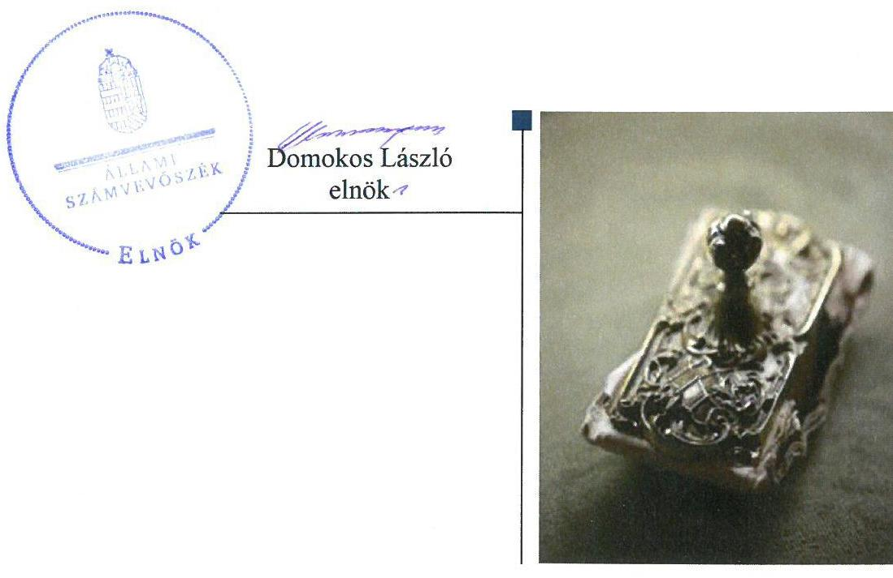
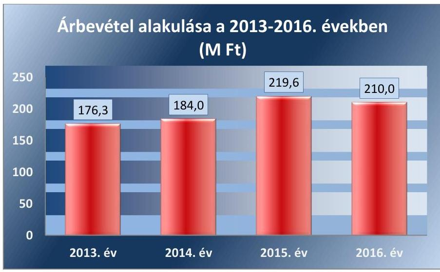
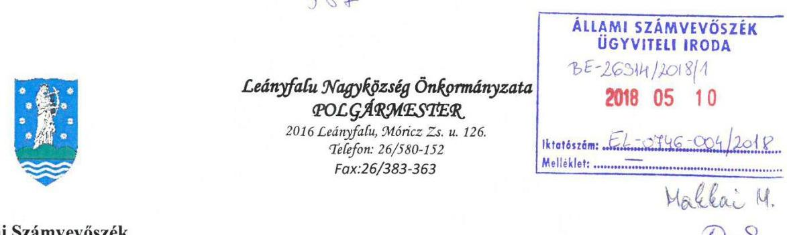
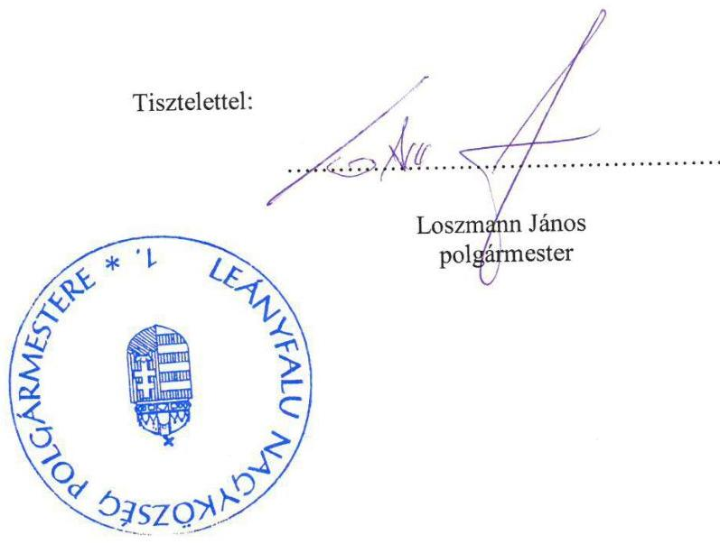
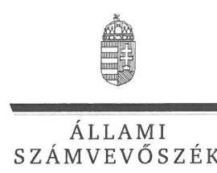
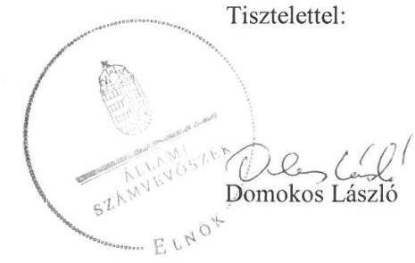
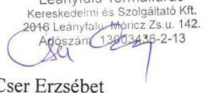
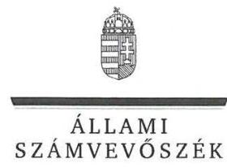
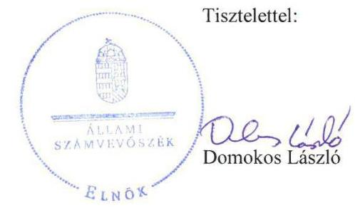

# Jelentés 

## Az önkormányzatok gazdasági társaságai

Az önkormányzatok többségi tulajdonában lévő gazdasági társaságok gazdálkodásának ellenőrzése - Leányfalu Termálfürdő Kft. 2018.

---

# Jelentés 

## Az önkormányzatok gazdasági társaságai

Az önkormányzatok többségi tulajdonában lévő gazdasági társaságok gazdálkodásának ellenőrzése - Leányfalu Termálfürdő Kft.
2018. 06. hó 12. nap

---

# AZ ELLENŐRZÉST FELÜGYELTE:

## MAKKAI MÁRIA felügyeleti vezető

## AZ ELLENŐRZÉST VEZETTE ÉS A VÉGREHAJTÁSÁÉRT FELELŐS:

### JOÓ ERIKA ellenőrzésvezető

### A PROGRAM ÖSSZEÁLLÍTÁSÁÉRT FELELŐS:

### TÓTPÁL SZABOLCS osztályvezető

---

**IKTATÓSZÁM:** EL-0162-087/2018.

**TÉMASZÁM:** 2447

**ELLENŐRZÉS-AZONOSÍTÓ SZÁM:** V079352

---

Jelentéseink az Országgyűlés számítógépes hálózatán és az Interneta a www.asz.hu címen is olvashatóak.

---

# TARTALOMJEGYZÉK 

■ ÖSSZEGZÉS ..... 5
■ AZ ELLENŐRZÉS CÉLJA ..... 6
■ AZ ELLENŐRZÉS TERÜLETE ..... 7
■ AZ ELLENŐRZÉS HÁTTERE, INDOKOLTSÁGA ..... 8
■ A JELENTÉS LÉNYEGES KÉRDÉSKÖREI ..... 9
■ AZ ELLENŐRZÉS HATÓKÖRE ÉS MÓDSZEREI ..... 10
■ MEGÁLLAPÍTÁSOK ..... 12
■ JAVASLATOK ..... 15
■ MELLÉKLETEK ..... 17
I. sz. melléklet: Értelmező szótár ..... 17
■ FÜGGELÉK: ÉSZREVÉTELEK ..... 19
■ RÖVIDÍTÉSEK JEGYZÉKE ..... 31

---

.

---

# ÖSSZEGZÉS 

Leányfalu Nagyközség Önkormányzata a tulajdonosi joggyakorlásának kereteit nem a jogszabályi előírásoknak megfelelően alakította ki, tulajdonosi joggyakorlása nem volt szabályszerű. A Leányfalu Termálfürdő Kft. szabályozottsága, vagyongazdálkodása nem volt szabályszerű. Számviteli beszámolói nem feleltek meg a valódiság elvének, valamint nem volt biztosított a müködés és a gazdálkodás átláthatósága.

## Az ellenőrzés társadalmi indokoltsága

Az Állami Számvevőszék kiemelt célja, hogy a helyi önkormányzatok gazdálkodásában rejlő pénzügyi kockázatok feltárásával, az államháztartáson kívülre nyújtott költségvetési támogatások és ingyenes vagyonjuttatások, valamint az államháztartáson kívül múködő feladat-ellátó rendszerek ellenőrzéseivel hozzájáruljon ahhoz, hogy a közpénzeket az államháztartáson kívül múködő szervezetek is átlátható, rendezett módon használják fel.

Magyarországon az önkormányzatok kötelező és önként vállalt feladataik vonatkozásában is egyre szélesebb körben alkalmazzák a költségvetésen kívüli feladatellátást, ezáltal az önkormányzati tulajdonú gazdasági társaságok is kiemelt fontosságú szerephez jutottak.

Leányfalu Nagyközség Önkormányzata önként vállalt közfeladatként látta el a leányfalui fürdő múködtetését. A fürdőszolgáltatást a lakosság széles rétege veszi igénybe, így a feladatot ellátó Leányfalu Termálfürdő Kft-vel szemben alapvető követelmény, hogy gazdálkodása és múködése szabályszerű, az általa szolgáltatott adatok megbízhatóak legyenek.

## Főbb megállapítások, következtetések, javaslatok

Leányfalu Nagyközség Önkormányzata tulajdonosi joggyakorlása nem voltszabályszerű, mert a Társaság felügyelőbizottsága tagjai számát nem a jogszabályi előírásnak megfelelően határozták meg, a felügyelőbizottság ügyrenddel nem rendelkezett, a Társaság 2013. évi egyszerűsített beszámolója elfogadásáról a felügyelőbizottság írásbeli jelentése hiányában döntött az alapító, valamint a Társaság 2016. gazdasági évre elkészített egyszerűsített éves beszámolóját nem a Társaság könyvvizsgálatával megbízott könyvvizsgáló által készített könyvvizsgálói jelentés birtokában hagyta jóvá az Alapító.

Leányfalu Termálfürdő Korlátolt Felelősségű Társaság a kötelezően elkészítendő számviteli szabályzatok közül az eszközök és források leltárkészítési és leltározási szabályzatát nem készítette el, számlarenddel nem rendelkezett, pénzkezelési szabályzata nem tartalmazott minden - a szabályszerű múködés biztosítása érdekében - szükséges rendelkezést.

A Társaság vagyongazdálkodása nem volt szabályszerű, mivel a 2013-2016. évi egyszerűsített éves beszámolók mérlegének tárgyi eszközök mérlegsora saját eszközként tartalmazta az Önkormányzattól bérelt eszközöket, valamint a mérlegtételeket leltárral nem támasztották alá, így az egyszerűsített éves beszámolók nem feleltek meg a valódiság elvének. A tárgyi eszközök állománybavétele során az üzembe helyezést hitelt érdemlő módon nem dokumentálták.

A jogszabályi előírások ellenére a közérdekú adatok közzétételére vonatkozó és a közérdekú adatok megismerésére irányuló igények teljesítésének rendjét rögzítő szabályzattal a Társaság nem rendelkezett, közzétételi kötelezettségének nem tett eleget.

A megállapítások alapján az Állami Számvevőszék Leányfalu Nagyközség Önkormányzata polgármesterének kettő javaslatot, a Leányfalu Termálfürdő Korlátolt Felelősségű Társaság ügyvezetőjének nyolc javaslatot fogalmazott meg.

---

# AZ ELLENŐRZÉS CÉLJA 

AZ ELLENŐRZÉS CÉLJA annak értékelése volt, hogy az önkormányzat szabályszerűen gyakorolta-e tulajdonosi jogait; a gazdasági társaság szabályozottsága, gazdálkodása és vagyongazdálkodási tevékenysége, bevételeinek és ráfordításainak elszámolása megfelelt-e a jogszabályi és tulajdonosi előírásoknak; a gazdasági társaság kötelezettségállománya jelentett-e kockázatot a múködésre, valamint a gazdálkodás átláthatósága és elszámoltathatósága biztosítva volt-e.

---

# **AZ ELLENŐRZÉS TERÜLETE**

## **Leányfalu Nagyközség Önkormányzata; Leányfalu Termálfürdő Kereskedelmi és Szolgáltató Kft.**

A Leányfalu Termálfürdő Kft. 100 % önkormányzati tulajdonban lévő egyszemélyes gazdasági társaság. A Társaság² részesedése feletti tulajdonosi jogokat és kötelezettségeket az alapítás évétől, 2003. évtől a Leányfalu Nagyközség Önkormányzat Képviselő-testülete³ gyakorolta.

A Leányfalu Termálfürdő Kft. fő tevékenysége a leányfalui termálfürdő üzemeltetése volt, melyet 2014. október 22-től közfeladatként látott el. Az Önkormányzat⁴ önként vállalt feladataként a 2014. október 22-étől hatályos SZMSZ-ében nevesítette a termálfürdő üzemeltetését. Bérleti szerződés⁵ keretében biztosította az Önkormányzat a Társaság tevékenységének ellátásához az Önkormányzat kizárólagos tulajdonában lévő leányfalui strandfürdőt és a hozzá tartozó parkolót.

A Társaság jegyzett tőkéje az ellenőrzött időszakban 3,0 M Ft volt, a saját tőke összege 83,1 M Ft-ról 100,8 M Ft-ra növekedett a 2013-2016. években realizált 17,7 M Ft eredmény hatására. A Társaság nettó árbevételének alakulását az 1. ábra szemlélteti.

1. ábra

*Forrás: 2013-2016. egyszerűsített éves beszámolók*

Az Önkormányzatnál a jelenlegi polgármester 2014 októberétől tölti be a tisztségét, a Társaságnál az ügyvezető személye 2016 novemberében változott.

A Társaság az ellenőrzött időszakban nem tartozott a kormányzati szektorba sorolt egyéb szervezetek közé.

---

# AZ ELLENŐRZÉS HÁTTERE, INDOKOLTSÁGA 

Az önkormányzatok többségi tulajdonában álló gazdasági társaságok ellenőrzése kiemelten fontos a vagyon megőrzése, megóvása érdekében. A feladatellátás költségeinek, ráfordításainak alakulása a lakosság széles rétegét érinti.

Az ÁSZ ellenőrzései feltárhatják, hogy az önkormányzat a feladatellátásához rendelt vagyon működtetését a tulajdonostól elvárható gondossággal végezte-e, a feladatot ellátó gazdasági társaság a létesítő okiratban, szolgáltatási szerződésben foglaltak betartásával biztosította-e a feladat ellátását. Az ellenőrzés rávilágíthat arra, hogy a hogy a gazdasági társaság a vagyon használatával biztosította-e a szolgáltatás folytatásának feltételeit, az önkormányzat tulajdonosi felügyelete hozzájárult-e a szabályszerű gazdálkodáshoz és feladatellátáshoz. A megállapítások alapján megfogalmazott számvevőszéki javaslatok hasznosítása elősegítheti a meglévő hibák meg-szüntetését.

---

# A JELENTÉS LÉNYEGES KÉRDÉSKÖREI 

1. Az Önkormányzat tulajdonosi joggyakorlása szabályszerű volt-e?
2. A Társaság szabályozottsága, gazdálkodása és vagyongazdálkodási tevékenysége szabályszerű volt-e?
3. A Társaság bevételeinek és ráfordításainak elszámolása szabályszerű volt-e?

---

# AZ ELLENŐRZÉS HATÓKÖRE ÉS MÓDSZEREI 

## Az ellenőrzés típusa

Megfelelőségi ellenőrzés.

## Az ellenőrzött időszak

2013. január 1-jétől 2016. december 31-ig tartó időszak.

## Az ellenőrzés tárgya

Az önkormányzatok - többségi tulajdonában lévő gazdasági társaságok feletti - tulajdonosi joggyakorlása, valamint a gazdasági társaságok gazdálkodásának szabályozottsága és szabályszerűsége.

Az ellenőrzés kiterjed minden olyan körülményre és adatra, amely az ÁSZ jogszabályban meghatározott feladatainak teljesítéséhez, valamint a program végrehajtása folyamán felmerült újabb összefüggések feltárásához szükséges.

## Az ellenőrzött szervezet

Leányfalu Nagyközség Önkormányzata;
Leányfalu Termálfürdő Kereskedelmi és szolgáltató Kft.

## Az ellenőrzés jogalapja

Az ellenőrzés jogszabályi alapját az ÁSZ tv. 1. § (3) bekezdése és 5. § (3)(4)-(5) bekezdései képezték.

## Az ellenőrzés módszerei

Az ellenőrzést a nemzetközi standardokat irányadónak tekintve az ellenőrzési program ellenőrzési kérdései, az ellenőrzött időszakban hatályos jogszabályok, az ellenőrzés szakmai szabályok és módszertanok figyelembe vételével végeztük.

Az ellenőrzés ideje alatt az ellenőrzött szervezettel történő kapcsolattartást az ÁSZ Szervezeti és Múködési Szabályzatának vonatkozó előírásai alapján biztosítottuk.

Az ellenőrzési kérdések megválaszolásához szükséges bizonyítékok megszerzése a következő ellenőrzési eljárások alkalmazásával történt:

---

megfigyelés, kérdésfeltevés (információkérés), összehasonlítás, valamint elemző eljárás. Az ellenőrzési bizonyítékként felhasználható adatforrások közé tartoztak egyrészt az ellenőrzési programban felsorolt adatforrások, másrészt adatforrás volt még minden - az ellenőrzés folyamán - feltárt, az ellenőrzés szempontjából információkat tartalmazó dokumentum.

Az ellenőrzést a kérdésekre adott válaszok kiértékelésével, valamint a megjelölt adatforrások, a csatolt tanúsítványok felhasználásával, továbbá az adott időszakban hatályos jogszabályok figyelembe vételével folytattuk le.

---

# 1. Az Önkormányzat tulajdonosi joggyakorlása szabályszerű volt-e? 

Összegző megállapítás

Az Önkormányzat tulajdonosi joggyakorlása nem volt szabályszerű.

A TULAJDONOSI JOGGYAKORLÁS KERETEIT az Önkormányzat nem a jogszabályi előírásoknak megfelelően alakította ki.

Az Önkormányzat az Alapító okirat ${ }_{1,2}{ }^{6}$-ban a Taktv. ${ }^{7}$ 4. § (2) bekezdésében foglalt előírás ellenére a felügyelőbizottság ${ }^{8}$ tagjainak számát három fő helyett öt főben határozta meg. A felügyelőbizottság a Gt. 34 § (4) bekezdésében, valamint a Ptk. 3:122. § (3) bekezdésében foglalt előírások ellenére ügyrenddel nem rendelkezett. Az Alapító okirat ${ }_{1,2}$-ban az Önkormányzat rendelkezett a könyvvizsgáló alkalmazásáról, valamint az ügyvezető személyéről.

Javadalmazási szabályzatot ${ }^{9}$ a Taktv. 5. § (3) bekezdésében foglalt előírások ellenére az Alapító ${ }^{10}$ a 2013-2015. évekre vonatkozóan nem alkotta meg. A 2016. évben megalkották a javadalmazási szabályzatot, amely 2016. április 1-jétől volt hatályos.

A TULAJDONOSI JOGOK GYAKORLÁSA nem volt szabályszerű, mert
$\longrightarrow$ A 2013. évi egyszerűsített beszámoló elfogadásáról az Alapító a Ptk. 3:120. §-ában foglalt előírások ellenére a felügyelőbizottság írásbeli jelentése hiányában döntött.
$\longrightarrow$ A bérleti szerződés 6. pontjában foglaltak ellenére az Alapító 2014. évben nem döntött a fejlesztési tervek elfogadásáról, valamint a 2013. és 2016. években nem döntött a megvalósított beruházások elfogadásáról.
$\longrightarrow$ A tulajdonosi joggyakorló a Társaság 2016. évi egyszerűsített éves beszámolóját a 2016. gazdasági évre vonatkozóan könyvvizsgálói megbízással nem rendelkezett könyvvizsgáló által készített jelentés birtokában hagyta jóvá a 8/2013. (I.30.) számú képviselő-testületi határozatban foglalt könyvvizsgálói kijelölés ellenére.
$\longrightarrow$ Tulajdonosi ellenőrzést - belső ellenőrzés keretében - az Önkormányzat kizárólag a 2015. évben végzett. A belső ellenőrzés az Önkormányzatra vonatkozóan javasolta, hogy a Társaság által használt vagyont mérjék fel, valamint a Társaság múködését érintően önkormányzati rendeletben részletesen határozzák meg a tulajdonosi képviselet és a tulajdonosi joggyakorlás szabályait.

---

# 2. A Társaság szabályozottsága, gazdálkodása és vagyongazdálkodási tevékenysége szabályszerű volt-e? 

Összegző megállapítás

2.1. számú megállapítás

A gazdasági Társaság szabályozottsága, gazdálkodása és vagyongazdálkodási tevékenysége nem volt szabályszerű. A Társaság közzétételi kötelezettségeinek nem tett eleget.

A gazdasági társaság szabályozottsága nem volt szabályszerű.
Számviteli politikával ${ }^{11}$ a Társaság az ellenőrzött időszakban rendelkezett. A pénzkezelési szabályzatban ${ }^{12}$ a Számv. tv. ${ }^{13}$ 14. § (8) bekezdés előírásai ellenére nem rendelkeztek a készpénzállományt érintő pénzmozgások jogcímeiről, az online pénztárgépek pénzforgalmának bizonylati rendjéről, a készpénzben és a bankszámlán tartott pénzeszközök közötti forgalom vonatkozásában a Társaság bankszámlája terhére kibocsátott bankkártya használatáról, a pénzkezelés tárgyi feltételei között a működtetett terminál (ok)ról.

A Társaság a jogszabályi előírások ellenére nem rendelkezett
$\longrightarrow$ a Számv. tv. 14.§ (5) bekezdés a) pontjában foglalt előírások ellenére az eszközök és források leltárkészítési és leltározási szabályzattal;
$\longrightarrow$ a Számv. tv. 161. § (1) bekezdés előírásai ellenére számlarenddel;
$\longrightarrow$ a közérdekú adatok közzétételére vonatkozó és a közérdekú adatok megismerésére irányuló igények teljesítésének rendjét rögzítő szabályzattal az Info tv. ${ }^{14}$ 35. § (3) bekezdés és a 30. § (6) bekezdés előírásai ellenére.

## 2.2. számú megállapítás

A Társaság vagyongazdálkodása nem volt szabályszerű.
A Társaság a 2013-2016. évi egyszerűsített éves beszámolói mérlegében a Számv.tv. 23. § (1) bekezdésében foglalt előírások ellenére saját eszközként mutatta ki az Önkormányzattól bérelt eszközöket.

A Társaság a beruházásokhoz, felújításokhoz kapcsolódó gazdasági eseményeket egyetlen főkönyvi számlán tartotta nyilván, kapcsolódó analitikus nyilvántartást nem vezetett, így a Számv.tv. 161. § (3) bekezdésében foglalt előírások ellenére az analitikus nyilvántartások szoros kapcsolata a főkönyvi könyveléssel, és a kettő között az értékadatok számszerű egyeztetésének lehetősége nem volt biztosított.

Az ellenőrzött időszakban a tárgyi eszközök állománybavétele során a Számv.tv. 52. § (2) bekezdésében, valamint a 165. § (1) bekezdésében foglalt előírások ellenére az üzembe helyezést hitelt érdemlő módon nem dokumentálták.

---

| 2.3. számú megállapítás |  | A Társaság a beszámoló készítési kötelezettségét nem szabályszerűen teljesítette, közzétételi kötelezettségét nem teljesítette. |
| :--: | :--: | :--: |
| 1. táblázat |  |  |
| BÉRELT ESZKÖZÖK A 2013-2016. ÉVI MÉRLEGEKBEN (MFT) |  |  |
| év | mérlegfőösszeg | bérelt eszközök a mérlegben |
| 2013. | 138,9 | 78,6 |
| 2014. | 152,7 | 70,7 |
| 2015. | 160,5 | 62,7 |
| 2016. | 152,5 | 54,7 |
| Forrás: 2013-2016. éves egyszerúsített beszámolói |  |  |

A 2013-2016. évekre vonatkozó egyszerűsített éves beszámolók nem feleltek meg a jogszabályi előírásoknak, mert
a 2013-2016. évi egyszerűsített éves beszámolók részét képező mérleg tételeit a Számv. tv. 69. §(1) bekezdés előírásai ellenére leltárral nem támasztották alá,
a 2013-2016. évekre vonatkozó egyszerűsített éves beszámolók mérlegében a Számv.tv. 23. § (1) bekezdés előírásai ellenére az Önkormányzat tulajdonában lévő, a Társaság által bérelt eszközöket mutattak ki (1. táblázat), valamint a mérlegében kimutatott bérelt eszközei után értékcsökkenést is elszámoltak valamennyi ellenőrzött évben,
ezért a Számv. tv. 15. § (3) bekezdésében megfogalmazott valódiság elve nem érvényesült.

A Társaság az Info tv. 37. § (1) bekezdésében meghatározott közzétételi kötelezettségének nem tett eleget. A Társaság nem tette közzé vezető állású munkavállalóinak a Tak. tv. 2. § (1) bekezdésében meghatározott adatait, az önállóan cégjegyzésre vagy a bankszámla feletti rendelkezésre jogosult vagy a bankszámla feletti rendelkezésre jogosult munkavállalók adatait.

# 3. A Társaság bevételeinek és ráfordításainak elszámolása szabályszerű volt-e? 

## Összegző megállapítás

A Társaság bevételeinek és ráfordításainak elszámolása nem volt szabályszerű.

A 2013-2016. években a bevételek és ráfordítások elszámolása nem felelt meg a jogszabályi előírásoknak, mert a Számv. tv. 161. § (1) bekezdés előírásai ellenére a Társaság nem rendelkezett számlarenddel, így a Számv. tv. 15. § (3) bekezdésében foglalt előírásoknak nem felelt meg az elszámolásuk. Továbbá a Számv tv. 167. § (1) bekezdés h) pontban előírtak ellenére a bizonylatok nem tartalmazták a könyvelés módjára, az érintett könyvviteli számlákra történő hivatkozást, valamint a Számv. tv. 165. § (2) bekezdésében előírtak ellenére a számviteli nyilvántartásban bizonylatok hiányában rögzítettek adatokat.

Az egymillió Ft-ot meghaladó ráfordítások elszámolásához kapcsolódóan az ügyvezető több esetben figyelmen kívül hagyta a munkaszerződésében foglalt kötelezettségvállalási korlátozást.

---

# JAVASLATOK 

Az ÁSZ tv. 33. § (1) bekezdésében foglaltak értelmében az ellenőrzött szervezet vezetője köteles a jelentésben foglalt megállapításokhoz kapcsolódó intézkedési tervet összeállítani és azt a jelentés kézhezvételétől számított 30 napon belül az ÁSZ részére megküldeni. Amennyiben az ellenőrzött szervezet vezetője nem küldi meg határidőben az intézkedési tervet, vagy továbbra sem elfogadható intézkedési tervet küld, az Állami Számvevőszék elnöke az ÁSZ tv. 33. § (3) bekezdése a) és b) pontjaiban foglaltakat érvényesítheti.

## Leányfalu Nagyközség polgármesterének

1. Intézkedjen a felügyelőbizottság Takt. tv.-ben elöirtaknak megfelelő létrehozásáról.
(1. sz. megállapítás 2. bekezdés első mondata alapján)
2. Kezdeményezze, hogy a felügyelőbizottság állapítsa meg ügyrendjét és a Társaság Alapítója a jogszabályi előirásoknak megfelelően hagyja jóvá.
(1. sz. megállapítás 2. bekezdés második mondata alapján)

## a Leányfalu Termálfürdő Kft. ügyvezetőjének

1. Intézkedjen, hogy a pénzkezelési szabályzat megfeleljen a hatályos Számv. tv. előírásainak.
(2.1. sz. megállapítás 1. bekezdés második mondata alapján)
2. Intézkedjen a Számv. tv. előírásainak megfelelően az eszközök és források leltárkészítési és leltározási szabályzata és a számlarend elkészítéséről.
(2.1. sz. megállapítás 2. bekezdés 1-2. részbekezdése alapján)
3. Intézkedjen az Info. tv. előírásainak megfelelően a közérdekü adatok közzétételére vonatkozó és a közérdekü adatok megismerésére irányuló igények teljesítésének rendjét rögzítő szabályzat elkészítéséről.
(2.1. sz. megállapítás 2. bekezdés 3. részbekezdése alapján)
4. Intézkedjen a Társaság tárgyi eszközei Számv. tv. előírásainak megfelelő nyilvántartásáról.
(2.2. sz. megállapítás 2. bekezdése alapján)

---

5. Intézkedjen a jogszabályi előírásoknak megfelelően a mérleg tételeinek leltárral való alátámasztásáról.
(2.3. sz. megállapítás 1. bekezdés 1. részbekezdése alapján)
6. Intézkedjen, hogy a Számv. tv. előírásának megfelelően a Társaság által bérelt eszközök a mérlegben ne szerepeljenek és azok után értékcsökkenést ne számoljanak el.
(2.3. sz. megállapítás 1. bekezdés 2. részbekezdése alapján)
7. Intézkedjen az Info. tv. 1. mellékletében, valamint a Takt. tv.-ben elöírt adatok közzétételéről.
(2.3. sz. megállapítás 2. bekezdése alapján)
8. Intézkedjen a bevételek és ráfordítások Számv. tv. előírásainak megfelelő elszámolásáról.
(3. sz. megállapítás 1. bekezdése alapján)

---

# MELLÉKLETEK 

- I. SZ. MELLÉKLET: ÉRTELMEZŐ SZÓTÁR
belső ellenőrzés
gazdasági társaság
tulajdonosi joggyakorló
vagyongazdálkodás

Független, tárgyilagos bizonyosságot adó és tanácsadó tevékenység, amelynek célja, hogy az ellenőrzött szervezet múködését fejlessze és eredményességét növelje, az ellenőrzött szervezet céljai elérése érdekében rendszerszemléletű megközelítéssel és módszeresen értékeli, illetve fejleszti az ellenőrzött szervezet irányítási és belső kontrollrendszerének hatékonyságát. (Forrás: Bkr. 2. § b) pontja)"
Ptk. 3:88. § (1) bekezdése szerint „a gazdasági társaságok üzletszerű közös gazdasági tevékenység folytatására, a tagok vagyoni hozzájárulásával létrehozott, jogi személyiséggel rendelkező vállalkozások, amelyekben a tagok a nyereségből közösen részesednek, és a veszteséget közösen viselik".
Aki a nemzeti vagyon felett az államot vagy a helyi önkormányzatot megillető tulajdonosi jogok és kötelezettségek összességének gyakorlására jogosult. (Forrás: Nvtv. 3. § (1) bekezdés 17. pontja)

A nemzeti vagyongazdálkodás feladata a nemzeti vagyon rendeltetésének megfelelő, az állam, az önkormányzat mindenkori teherbíró képességéhez igazodó, elsődlegesen a közfeladatok ellátásához és a mindenkori társadalmi szükségletek kielégítéséhez szükséges, egységes elveken alapuló, átlátható, hatékony és költségtakarékos működtetése, értékének megőrzése, állagának védelme, értéknövelő használata, hasznosítása, gyarapítása, továbbá az állam vagy a helyi önkormányzat feladatának ellátása szempontjából feleslegessé váló vagyontárgyak elidegenítése. (Forrás: Nvtv. 7. § (2) bekezdése).

---

.

---

# FÜGGELÉK: ÉSZREVÉTELEK 

A jelentéstervezetet a Számvevőszék 15 napos észrevételezésre megküldte az ellenőrzött szervezetek vezetőinek az ÁSZ tv. 29. §* (1) bekezdése előírásának megfelelően.

Az ÁSZ a jelentéstervezetet észrevételezésre megküldte Leányfalu Nagyközség polgármesterének és a Leányfalu Termálfürdő Kft. ügyvezetőjének.
Leányfalu Nagyközség polgármesterének és a Leányfalu Termálfürdő Kft. ügyvezetőjének észrevételeit és az azokra adott választ a függelék alább tartalmazza.

[^0]
[^0]:    * 29. § (1) Az Állami Számvevőszék az ellenőrzési megállapításait megküldi az ellenőrzött szervezet vezetőjének vagy az általa megbízott személynek, és annak, akinek személyes felelősségét állapította meg.
    (2) Az ellenőrzött szervezet vezetője és a felelősként megjelölt személy az ellenőrzés megállapításaira tizenöt napon belül írásban észrevételt tehet.
    (3) Az Állami Számvevőszék az észrevételre a beérkezésétől számított harminc napon belül írásban válaszol. A figyelembe nem vett észrevételeket köteles a jelentésben feltüntetni, és megindokolni, hogy azokat miért nem fogadta el.

---

Állami Számvevőszék
1364 Budapest 4. Pf.: 54.
Tárgy: Észrevételek az Állami Számvevőszék jelentéstervezetére
Tisztelt Állami Számvevőszék!
A 2018. április 23. napján kézhez vett jelentéstervezetben foglalt javaslatoknak az általam képviselt Önkormányzat már korábban eleget tett, ezért intézkedésre nincs szükség:

1. Leányfalu Nagyközség Önkormányzat Képviselő-testülete a 4/2017.(I.12.) számú határozatával arról döntött, hogy a Felügyelő bizottsági tagok száma öt föröl három före módosul.
2. Leányfalu Nagyközség Önkormányzat Képviselő-testülete a 131/2017. (IX.13.) számú határozatával akként döntött, hogy a Termálfürdő Felügyelő Bizottságának ügyrendjét jóváhagyja.

Ugyanakkor meg kívánom jegyezni, hogy a jelentéstervezet egyik alapvető, ezáltal több, erre épülő megállapítása is téves:
Téves az a megállapítás, mely szerint az Önkormányzat „önként vállalt közfeladatként" látja el a termálfürdő müködtetését.

Az államháztartásról szóló 2011. évi CXCV. törvény 3/A. § (1) bekezdése szerint „Közfeladat a jogszabályban meghatározott állami vagy önkormányzati feladat."A (2) alapján „A közfeladatok ellátása költségvetési szervek alapításával és müködtetésével vagy az azok ellátásához szükséges pénzügyi fedezet e törvényben meghatározott eszközökkel, részben vagy egészben történő biztosításával valósul meg. A közfeladatok ellátásában államháztartáson kívüli szervezet jogszabályban meghatározott rendben közremüködhet. "

Olyan jogszabály nincs, mely a termálfürdő müködtetését önkormányzati feladatként nevezné meg. Nem rendelkezik erről a Magyarország helyi önkormányzatairól szóló 2011. évi CLXXXIX. törvény sem, s a fent hivatkozott 2011. évi CXCV. törvény 3/A. § (2) bekezdéséből sem vezethető le, hiszen a termálfürdő nem költségvetési szerv, a müködtetése pedig nem önkormányzati finanszírozásból, hanem saját bevételből valósul meg!

Azért is fontos erre az alapvető tévedésre felhívnunk a figyelmet, mert a megállapítások zöme a közfeladatot ellátó szervekkel szemben van megfogalmazva!

---

Az Alaptörvény, az Infotv., illetve az Alkotmánybíróságnak a nemzetközi egyezmények rendelkezéseivel és az Emberi Jogok Európai Bírósága több évtizedes esetjogával összhangban álló gyakorlata alapján a Kúria (l. pl. a Kúria Pfv. IV. 20.430/2015/4. számú egyedi ügyben hozott határozatát a Magyar Nemzeti Bank alapítványai ellen közérdekủ adatok kiadása iránt indult perben) több esetben is arra a következtetésre jutott, hogy amennyiben egy feladat ellátásához szükséges források biztositása közpénzből történik, a feladat ellátója külön jogszabályban nem definiált közfeladatot lát el. A termálfürdő azonban nem közpénzből müködik, így egyéb közfeladatot ellátó szervnek sem minősül, azaz nem terjed ki rá az Infotv. hatálya sem!

Kérem, hogy a fent leírtakat a végleges jelentésükben figyelembe venni szíveskedjenek.
Leányfalu, 2018. május 7.

---

ELNÖK

Ikt.szám: EL-0746-005/2018.

# Loszmann János úr 

polgármester

Leányfalu Nagyközség Önkormányzata

## Leányfalu

## Tisztelt Polgármester Úr!

„Az önkormányzatok többségi tulajdonában lévő gazdasági társaságok gazdálkodásának ellenörzése - Leányfalu Termálfürdő Kft. " címmel készített számvevőszéki jelentéstervezetre tett észrevételét köszönettel megkaptam.

Az Állami Számvevőszék észrevételre vonatkozó álláspontjáról a felügyeleti vezető által készített részletes tájékoztatást mellékelten megküldöm.

Tájékoztatom Polgármester urat, hogy a számvevőszéki jelentésben - az Állami Számvevőszékről szóló 2011. évi LXVI. törvény 29. § (3) bekezdése alapján - a figyelembe nem vett észrevételeket szerepeltetjük, annak indoklásával, hogy azokat az Állami Számvevőszék miért nem fogadta el.

Budapest, 2018. 06. hó 18. nap

Melléklet: Tájékoztatás az észrevétel kezeléséről

---

# Tájékoztatás   az észrevétel kezeléséről 

„Az önkormányzatok többségi tulajdonában lévő gazdasági társaságok gazdálkodásának ellenörzése - Leányfalu Termálfürdő Kft." címú jelentéstervezetre 2018. május 10 -én érkezett észrevételt áttekintettük, annak kezelésével kapcsolatban a következő tájékoztatást adom.
Leányfalu Nagyközség polgármesterének címzett javaslatokkal kapcsolatban tett észrevételre adott válasz
A megtett intézkedésekről szóló tájékoztatást köszönjük, az nem befolyásolja az ÁSZ vonatkozó megállapításait, amelyek az ellenőrzött időszakra éevényesek. Tájékoztatom, hogy az Állami Számvevőszékről szóló 2011. évi LXVI. törvény 33. § (1) bekezdése értelmében a jelentésben megfogalmazott megállapítások és javaslatok megvalósítására az ellenőrzött szervezet vezetője köteles intézkedési tervet összeállítani. Az észrevételt nem fogadjuk el, a jelentéstervezet módosítása nem indokolt.
A jelentéstervezet vonatkozásában általánosságban, az ellátott közfeladattal kapcsolatban megfogalmazott észrevételre adott válasz
Az észrevétel szerint „Téves az a megállapítás, mely szerint az Önkormányzat önként vállalt közfeladatként látja el a termálfürdő müködtetését. ", valamint „Olyan jogszabály nincs, mely a termálfürdő müködtetését önkormányzati feladatként nevezné meg" és ,,ezáltal több, erre épülő megállapítás is téves".
Az észrevétel alapvetően hibás logikára épül. Tájékoztatom Polgármester urat, hogy észrevételével ellentétben Leányfalu Nagyközség Önkormányzata Képviselő-testületének 15/2014. (X.21.) önkormányzati rendeletének 1. számú melléklete önként vállalt önkormányzati feladatként határozta meg a közfürdő müködtetését. Magyarország Alaptörvénye T) cikk (2) bekezdése szerint az önkormányzati rendelet jogszabálynak minősül. Ebből adódóan értelemszerűen következik, hogy az Államháztartásról szóló 2011. évi CXCV. törvény 3/A.§ (1) bekezdése értelmében az önkormányzati rendeletben meghatározott önként vállalt önkormányzati feladat közfeladat.
Az észrevételt nem fogadjuk el. Mindezek alapján az ÁSZ érintett megállapításai helytállóak, a jelentéstervezet módosítása nem indokolt.
Budapest, 2018. oC. hó 18 . nap

Makkai Mária
felügyeleti vezető

---

# Leányfalu Termálfürdő Kft. 

2016 Leányfalu, Móricz Zsigmond út 142. Tel. / Fax: 06-26/383-370; 06-26/580-047
e-mail: info@leanyfurdo.hu
honlap: www.leanyfurdo.hu

Állami Számvevőszék
Domokos László
elnök részére

## Tisztelt Elnök Úr!

A fenti iktatószámon érkezett, 2013-2016. évekre vonatkozó vizsgálat tervezett jegyzőkönyvének társaságot érintő megállapításaira az alábbiakban teszünk észrevételt. Az önkormányzatot megjelölő megállapításokat nem érintjük.

Elöljáróban engedje meg, hogy megköszönjem a vizsgálat során megismert elvárásokat, a munkatársai hozzáállását, mely nagyban hozzájárul ahhoz, hogy a továbbiakban ezzel a szemlélettel, ebben a struktúrában és ezen elvárásoknak megfelelve végezzük a munkánkat, tevékenységünk dokumentálását. Számomra különösen irányadó volt az ellenőrzés, mert megbízatásom 2016. november 11 -én kezdődött.

Általános tapasztalatunk, amire a vizsgálat felhívta a figyelmet, hogy minden releváns dokumentumot hitelesítve kell őrizni. Ennek hiányában több dokumentum a számvevők által nem került elfogadásra, azt nem létező dokumentumként kezelték. A legtöbb jegyzőkönyvi észrevétel ezen hitelesítési hiányból következik.

Véleményeltérésünket az alábbiakban fejtjük ki:
A felügyelőbizottság tagjainak számára vonatkozó szabályozás a Ptk-ban a minimum 3 főt határozza meg. A diszpozitív szabályozás alapján ettől felfelé el lehet térni.
A 2016. évi könyvvizsgálat: A korábbi könyvvizsgáló eredeti megbízatásának lejárata 2017.december 31. volt. A munkájával kapcsolatban több kifogás merült fel, melyre először úgy reagált, hogy még a 2016. évi könyvvizsgálatot vállalja, majd felmondta megbízatását, melyet a Képviselő testület elfogadott és az új könyvvizsgáló megbízatását a 2016. évi mérleg könyvvizsgálatára is kiterjesztette. Ezzel összhangban az előző könyvvizsgáló megbízatása 2017. május 1.-vel megszünt, az új könyvvizsgálóé 2017. május 2.-val kezdődött. Az ennek megfelelő - az előző könyvvizsgáló megbízatását 2017. dec.31-ig törölni kért - változás bejelentés a cégbírósághoz benyújtásra került. A végzés tartalmazza az ADÓTERV Kft megbízatásának változás időpontját 2017.05.02-i keltezéssel és az EX ASSE Kft jogviszonyának kezdetét 2017.05.02-vel. Amennyiben szükséges, a cégbírósággal folytatott ügyintézést bizonyítani tudjuk. Ennek megfelelően a 2016. évi mérleg és eredménykimutatást a kiegészítő mellékletekkel együtt az arra jogszerűen megbízott könyvvizsgáló látta el korlátozó záradékkal.
A szabályzatokra vonatkozóan: Eszköz-nyilvántartási és leltározási szabályzattal a társaság 2007. évi keltezéssel, érvényesen a vizsgált időszakban rendelkezett. A forrásoldali leltározásra nem rendelkezett szabályozással. Forrásoldali leltárt 2016. dec.31-i fordulónappal már készített.
A társaság a könyvvezetési, könyvelési feladatokat kiszervezésben, külső vállalkozóval végezteti. Számlarend a 2011. évben elfogadott Számviteli politika mellékleteként szerepel, ezen dátum és aláírás nem szerepelt. A 2016.05.05-től érvényes Számviteli politika hivatkozik erre a korábbi mellékletre, saját mellékletként nem szerepelt.

---

A társaság az ehhez kapcsolódó számlakerettel rendelkezett, a teljes vizsgált időszakban könyvelési vállalkozó által kizárólag alkalmazott RLB könyvelési programban rögzített, ezen időszak alatt nem módosított számlakeretet használta, melyet minden mérleg mögött dokumentált.
Eszközök nyilvántartása: A társaság 2003. évben alakult hárommillió Ft. jegyzett tőkével. Az önkormányzat tulajdonában lévő eszközök használatára bérleti szerződéssel rendelkezik. A társaság saját tőkéje nem tartalmazza a bérelt eszközöket. A társaság beruházásokat részben a bérelt eszközökön hajtott végre, melyeket a vizsgált időszakban nem számlázott át a bérbeadónak, a beszerzési számlák a társaság nevére szóltak. Ezeket a beruházásokat bérelt eszközökön végzett beruházásként tartja nyilván és az erre megengedett értékcsökkenést számolja el társaságunk. Van a beruházásoknak egy másik csoportja, melyek e bérleménytől elkülönült beszerzések, ezek képezik a saját eszközöket a nyilvántartásunkban és ezekre a saját eszközökre eltérő értékcsökkenést alkalmazhatunk.
Az évvégi fordulónapi leltár megkülönbözteti a bérelt eszközökön végzett beruházások utáni aktiválást és a saját tulajdonú eszközöket. A tisztább átláthatóság és az önkormányzattal egyező érték nyilvántartás összhangjának megteremtését, a vagyon teljes felmérését ebben az évben tűztük ki feladatul. Az elkülönített főkönyvi számlákon való nyilvántartásra vonatkozó javaslatot az átláthatóság jobb biztosítása érdekében, megfogadjuk.
Egyes bizonylatok nem tartalmaztak a könyvelés módjára, könyvelési számlákra történő hivatkozást, ezt elfogadjuk. A számviteli nyilvántartásban bizonylatok hiányában rögzített adatokról nincs tudomásunk.
A 2013-2016. évek mérlegei eszköz leltárral alátámasztottak, azok értékegyeztetése a mérlegzáráskor megtörtént. A forrásoldali leltár helyett aláirt főkönyvi karton került dokumentálásra, ennek továbbiakra vonatkozó nem megfelelősségét elfogadjuk. A 20132016. évi mérlegek a valódiság elvének megfelelnek, azt minden alkalommal könyvvizsgáló vizsgálta és záradékolta.

Info tv. értelmezése: Az önkormányzat-tulajdonostól átvett álláspont szerint, miután a társaságunk nem közpénzből müködik, egyéb közfeladatot ellátó szervnek sem minősül, nem terjed ki rá az Infotv. hatálya sem.

A Leányfalu Termálfürdő Kft. ügyvezetőjének előirt javaslatokból a 6. pontra vonatkozóan egyértelműen kijelentem, hogy ilyen elszámolás nem történt.

A javaslatokkal kapcsolatban az előírt határidőben az intézkedési tervet elkészítjük és ellenőrzés céljából megküldjük.

Leányfalu, 2018.05.08.
Tisztelettel:

Cser Erzsébet
(ügyvezető 2016.11.11-től)

---

ELNÖK

Ikt.szám: EL-0746-007/2018.

# Cser Erzsébet úrhölgy 

ügyvezető

Leányfalu Termálfürdő Kft.

## Leányfalu

## Tisztelt Ügyvezető Úrhölgy!

„Az önkormányzatok többségi tulajdonában lévő gazdasági társaságok gazdálkodásának ellenörzése - Leányfalu Termálfürdő Kft." címmel készített számvevőszéki jelentéstervezetre tett észrevételét köszönettel megkaptam.

Az Állami Számvevőszék észrevételre vonatkozó álláspontjáról a felügyeleti vezető által készített részletes tájékoztatást mellékelten megküldőm.

Tájékoztatom Ügyvezető úrhölgyet, hogy a számvevőszéki jelentésben - az Állami Számvevőszékről szóló 2011. évi LXVI. törvény 29. § (3) bekezdése alapján - a figyelembe nem vett észrevételeket szerepeltetjük, annak indoklásával, hogy azokat az Állami Számvevőszék miért nem fogadta el.

Budapest, 2018. 05 hó 29 nap

Melléklet: Tájékoztatás az észrevétel kezeléséről

---

# Tájékoztatás   az észrevétel kezeléséről 

„Az önkormányzatok többségi tulajdonában lévő gazdasági társaságok gazdálkodásának ellenörzése - Leányfalu Termálfürdő Kft." címủ jelentéstervezetre 2018. május 14-én érkezett észrevételt áttekintettük, annak kezelésével kapcsolatban a következő tájékoztatást adom.

- A felügyelőbizottság tagjainak számával összefüggésben tett észrevételre adott válasz
Az észrevétel szerint a „szabályozás a Ptk-ban minimum 3 föt határozza meg" és „ettől felfelé el lehet térni".
Tájékoztatom ügyvezető úrhölgyet, hogy az észrevétellel érintett ÁSZ megállapítást a köztulajdonban álló gazdasági társaságok takarékosabb müködéséről szóló 2009. évi CXXII. törvény 4. § (2) bekezdése alapozza meg, amely szerint a köztulajdonban álló gazdasági társaság felügyelőbizottsága három természetes személy tagból áll. Az észrevételt nem fogadjuk el, a jelentéstervezet módosítása nem indokolt.
- A 2016. évi könyvvizsgálattal összefüggésben tett észrevételre adott válasz

Az észrevétel szerint az új könyvvizsgáló megbízását a 2016. évi mérleg könyvvizsgálatára is kiterjesztették.
Tájékoztatom, hogy az ÁSZ ellenőrzés rendelkezésére bocsátott 2017. május 1-én kelt Megbízási szerződés és a 2017. május 1-én kelt „Könyvvizsgáló megválasztást elfogadó nyilatkozata" alapján a megbízás a 2017., 2018. és 2019. üzleti évek könyvvizsgálatára szólt. Az észrevételt nem fogadjuk el, a megállapítás módosítása nem indokolt.

## - A szabályzatokra vonatkozóan tett észrevételre adott válasz

Az észrevétel hivatkozik az „Eszköz-nyilvántartási és leltározási szabályzat"-ra és részben megerősíti az ÁSZ megállapítását, amely szerint „forrásoldali leltározásra" nem rendelkezett szabályzattal a Társaság.
Tájékoztatom, hogy az ÁSZ rendelkezésére bocsátott szabályzatból nem derül ki, hogy mely gazdálkodó szervezetre vonatkozik és mikortól érvényes, valamint az aláírás időpontja sem állapítható meg. Az észrevételt nem fogadjuk el, a jelentéstervezet módosítása nem indokolt.
Az észrevétel számlarendre vonatkozó része megerősíti az ÁSZ megállapítását, amely szerint számlarenddel a Társaság hiteles formában nem rendelkezett. Ezért a jelentéstervezet módosítása nem indokolt

- Az eszközök nyilvántartására vonatkozóan tett észrevételre adott válasz

Az észrevétel szerint „a Társaság saját tőkéje nem tartalmazza a bérelt eszközöket", egyebekben kifejti, hogy a bérelt eszközökön végzett beruházásokat és a saját eszközöket elkülönítve tartja nyilván. Az elkülönített fökönyvi számlákon történő nyilvántartás megteremtését célzó javaslatot az észrevétel az átláthatóság biztosítása érdekébe elfogadja.

---

Az észrevétel alapvetően megerősíti az ÁSZ megállapítását. Tájékoztatom, hogy az ÁSZ rendelkezésére bocsátott beszámolót alátámasztó főkönyvi kivonatok és tárgyi eszköz nyilvántartó lapok alapján az észrevételben hivatkozott elkülönített nyilvántartás nem igazolt. Az ÁSZ megállapítása helytálló, a jelentéstervezet módosítása nem indokolt.

# - Az egyes bizonylatokkal összefüggésben tett észrevételre adott válasz 

Az észrevétel megerősíti az ÁSZ megállapítását, amely szerint a bizonylatok nem tartalmazták a könyvelés módjára, az érintett könyvviteli számlákra történő hivatkozást. A számviteli nyilvántartásban bizonylatok hiányában rögzített adatokkal összefüggésben érdemi észrevétel nem került megfogalmazásra.
A bizonylat hiányában történő számviteli elszámolással kapcsolatban tájékoztatom, hogy a kiválasztott mintatételekkel kapcsolatban az ÁSZ rendelkezésére bocsátott dokumentumok nem minden esetben támasztották alá teljes körűen a gazdasági esemény számviteli elszámolását (például az üzembe helyezés dokumentálása, a személyi jellegű ráfordítás elszámolásának dokumentálása, árbevétel elszámolásának dokumentálása). A statisztikai módszerrel történő kivetítés eredményeképpen az ÁSZ megállapítása a teljes sokaságra értelmezhető. Mindezek alapján az ÁSZ megállapítása helytálló, a jelentéstervezet módosítása nem indokolt.

## - A 2013-2016. évek mérlegeinek leltárral való alátámasztásával összefüggésben tett észrevételre adott válasz

Az észrevétel az ÁSZ megállapítását alapvetően megerősíti. Tájékoztatom, hogy az ÁSZ rendelkezésére bocsátott dokumentumok felülvizsgálata alapján helytálló az ÁSZ megállapítása, amely szerint a Számv. tv. 69. §(1) bekezdés előírásai ellenére a mérleget leltárral nem támasztották alá. Tájékoztatom, hogy a mérleg valódiság elvének történő megfelelésének ÁSZ általi értékelését a könyvvizsgáló záradéka nem befolyásolja. Az észrevételt nem fogadjuk el, a jelentéstervezet módosítása nem indokolt.

## - Az Info. tv. értelmezésével összefüggésben tett észrevételre adott válasz

Az észrevétel hivatkozik az Önkormányzattól átvett jogértelmezési álláspontra. Tájékoztatom Ügyvezető úrhölgyet, hogy az Önkormányzat álláspontja hibás logikára épül.
Az Önkormányzat ÁSZ részére tett észrevétellel ellentétben Leányfalu Nagyközség Önkormányzata Képviselő-testületének 15/2014. (X.21.) önkormányzati rendeletének 1. számú melléklete önként vállalt önkormányzati feladatként határozta meg a közfürdő működtetését. Magyarország Alaptörvénye T) cikk (2) bekezdése szerint az önkormányzati rendelet jogszabálynak minősül. Ebből értelemszerűen következik, hogy az Államháztartásról szóló 2011. évi CXCV. törvény 3/A.§ (1) bekezdése értelmében az önkormányzati rendeletben meghatározott önként vállalt önkormányzati feladat közfeladat. Ezért az ÁSZ által - az Info tv. alapján - rögzített hiányosságok helytállóak, a jelentéstervezet módosítása nem indokolt.

---

# - A 6. számú javaslat vonatkozásában tett észrevételre adott válasz 

Az egyes bizonylatokkal összefüggésben tett észrevételre adott válasszal megegyező indoklással az észrevételt nem fogadjuk el, az ÁSZ javaslatának módosítása nem indokolt.

Budapest, 2018. 06 hó 33 nap

Makkai Mária
felügyeleti vezető

---

.

---

# RÖVIDÍTÉSEK JEGYZÉKE 

${ }^{1}$ Leányfalu Termálfürdő Kft.
${ }^{2}$ Társaság
${ }^{3}$ Képviselő-testület
${ }^{4}$ Önkormányzat
${ }^{5}$ bérleti szerződés
${ }^{6}$ Alapító okirat ${ }_{1,2}$
${ }^{7}$ Taktv.
${ }^{8}$ felügyelőbizottság
${ }^{9}$ javadalmazási szabályzat
${ }^{10}$ Alapító
${ }^{11}$ számviteli politika $_{1,2}$
${ }^{12}$ pénzkezelési szabályzat
${ }^{13}$ Számv.tv.
${ }^{14}$ Info tv.

Leányfalu Termálfürdő Kereskedelmi és Szolgáltató Korlátolt felelősségű társaság Leányfalu Termálfürdő Kereskedelmi és Szolgáltató Korlátolt felelősségű társaság Leányfalu Nagyközség Önkormányzatának Képviselő-testülete
Leányfalu Nagyközség Önkormányzata
Leányfalu Nagyközség Önkormányzat és a Leányfalu Termálfürdő kft. között 2010.március 30-án kelt, és többször módosított bérleti szerződés egységes szerkezetben, 2013. március 21-i keltezéssel
Leányfalu Termálfürdő Kereskedelmi és Szolgáltató Korlátolt felelősségű társaság 2009. október 19-én kelt Alapító okirata1; Leányfalu Termálfürdő Kereskedelmi és Szolgáltató Korlátolt felelősségű társaság 2016. november 11-én kelt Alapító okirata2;
A köztulajdonban álló gazdasági társaságok takarékosabb müködéséről szóló 2009. évi CXXII. törvény

Leányfalu Termálfürdő Kereskedelmi és Szolgáltató Korlátolt felelősségű társaság Felügyelőbizottsága.
Leányfalu Termálfürdő Kft. javadalmazási szabályzata (hatályos 2016. április 1jétől)
Leányfalu Nagyközség Önkormányzatának Képviselő-testülete
Leányfalu Termálfürdő Kft. számviteli politikája
1.) hatályos 2011. március 01.-2015. december 31.
2.) hatályos 2016. január 01.-

Leányfalu Termálfürdő Kft. pénzkezelési szabályzata
hatályos 2012.06.01.-
2000. évi C. törvény a számvitelről
2011. évi CXII. törvény az információs önrendelkezési jogról és az információszabadságról

---

# ÁLLAMI SZÁMVEVŐSZÉK 

1052 Budapest, Apáczai Csere János utca 10.
Levélcím: 1364 Budapest 4. Pf. 54
Telefon: +36 14849100 Telefax: +36 14849200
www.asz.hu