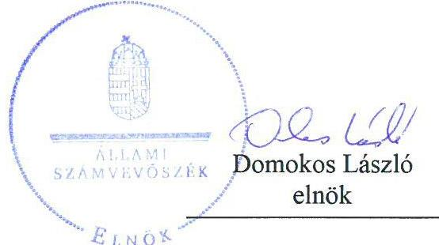

# Jelenetés 

## Önkormányzatok integritás- és belső kontrollrendszere

Az önkormányzatok belső kontrollrendszere kialakításának és működtetésének ellenőrzése Magyaratád Községi Önkormányzat 2018.

18129
www.asz.hu

---

# Jelentés 

## Önkormányzatok integritás- és belső kontrollrendszere

Az önkormányzatok belső kontrollrendszere kialakításának és működtetésének ellenőrzése Magyaratád Községi Önkormányzat
2018. 06. hó 20. nap

---

# AZ ELLENŐRZÉST FELÜGYELTE:

DR. BENEDEK MÁRIA felügyeleti vezető

## AZ ELLENŐRZÉST VEZETTE ÉS A VÉGREHAJTÁSÁÉRT FELELŐS:

BÍRÓ ZSOLT ellenőrzésvezető

## A PROGRAM ÖSSZEÁLLÍTÁSÁÉRT FELELŐS:

TÓTPÁL SZABOLCS osztályvezető

IKTATÓSZÁM: EL-0111-066/2018.

TÉMASZÁM: 2444

ELLENŐRZÉS-AZONOSÍTÓ SZÁM: V078913, V078407

Jelentéseink az Országgyűlés számítógépes hálózatán és az Interneten a www.asz.hu címen is olvashatóak.

---

# TARTALOMJEGYZÉK 

■ ÖSSZEGZÉS ..... 5
■ AZ ELLENŐRZÉS CÉLJA ..... 6
■ AZ ELLENŐRZÉS TERÜLETE ..... 7
■ AZ ELLENŐRZÉS HÁTTERE, INDOKOLTSÁGA ..... 8
■ A JELENTÉS LÉNYEGES KÉRDÉSKÖREI ..... 10
■ ELLENŐRZÉS HATÓKÖRE ÉS MÓDSZEREI ..... 11
■ MEGÁLLAPÍTÁSOK ..... 13
■ JAVASLATOK ..... 21
■ MELLÉKLETEK ..... 27
I. sz. melléklet: Értelmező szótár ..... 27
■ FÜGGELÉK: ÉSZREVÉTELEK ..... 33
■ RÖVIDÍTÉSEK JEGYZÉKE ..... 35

---

.

---

# ÖSSZEGZÉS 

Magyaratád Községi Önkormányzat belső kontrollrendszerének kialakítása és működtetése nem volt szabályszerű, az nem biztosította a közpénzfelhasználás szabályosságát. Az értékpapírokkal kapcsolatos döntéshozatal és a döntések végrehajtásának, a befektetések számviteli elszámolásának, nyilvántartásának szabálytalanságai miatt nem valósult meg a nemzeti vagyonnal történő felelős gazdálkodás. Az integritási kontrollok kiépítettsége nem volt egyensúlyban a fellépő kockázatok szintjével.

## Az ellenőrzés társadalmi indokoltsága

Az Állami Számvevőszék a stratégiai céljával összhangban - az Állami Számvevőszékről szóló 2011. évi LXVI. törvény felhatalmazása alapján - végzi a közpénzekkel, az állami és önkormányzati vagyonnal való felelős gazdálkodás, valamint a helyi önkormányzatok számviteli rendje betartásának és belső kontrollrendszere működésének ellenőrzését. Magyarország Alaptörvénye az önkormányzatoktól is elvárja a kiegyensúlyozott, átlátható és fenntartható költségvetési gazdálkodás elvének érvényesítését, továbbá a nemzeti vagyonnal való rendeltetésszerű és felelős módon való gazdálkodást. Az Állami Számvevőszék stratégiájában az is megfogalmazódott, hogy támogatja az integritás alapú, átlátható és elszámoltatható közpénzfelhasználás megteremtését. Mindezekre tekintettel, a közpénzzel gazdálkodó szervezetek esetében a belső kontrollrendszer megfelelő működése ellenőrzését prioritásként kezeli az Állami Számvevőszék.

A szabad pénzeszközök felhasználása során kiemelten fontos a felelős gazdálkodás érvényesülése, amely összhangban kell, hogy legyen az önkormányzati gazdálkodás alapelveivel. Magyaratád Községi Önkormányzat 2016. évi beszámolója szerint 29 millió forint forgatási célú értékpapírral rendelkezett.

## Főbb megállapítások, következtetések

Magyaratád Községi Önkormányzat nem a jogszabályi előírásoknak megfelelően alakította ki működésének szervezeti kereteit, így az nem biztosította a szabályszerű működést és gazdálkodást. A Magyaratádi Közös Önkormányzati Hivatal szervezeti és működési szabályzata, valamint számviteli politikája és számlarendje nem felelt meg a jogszabályi előírásoknak. A Magyaratádi Közös Önkormányzati Hivatalnál nem kerültek felmérésre és meghatározásra a tevékenységében, gazdálkodásában rejlő kockázatok, a kontrolltevékenységek gyakorlása során a kötelezettségvállalás, a pénzügyi ellenjegyzés, a teljesítésigazolás, az érvényesítés és az utalványozás nem volt szabályszerű, az információs és kommunikációs rendszer nem működött, így nem volt biztosított a közpénzfelhasználás szabályossága és az átlátható működés.

Magyaratád Községi Önkormányzatnál az értékpapírokkal kapcsolatos döntéshozatal és a döntések végrehajtása nem volt szabályszerű, mert a polgármester az értékpapírok vásárlásáról nem számolt be a Képviselő-testületnek. Az értékpapírok leltározása, értékelése nem történt meg, így nem volt biztosított a szabad pénzeszközökkel való felelős gazdálkodás.

Magyaratád Községi Önkormányzatnál az integritással összefüggő kontrollok és a korrupciós kockázatok szintje nem volt összhangban, a kontrollrendszer nem támogatta az integritási szemlélet érvényesülését.

---

# AZ ELLENŐRZÉS CÉLJA 

Az ellenőrzés célja annak megállapítása volt, hogy szabályszerűen történt-e Magyaratád Községi Önkormányzat belső kontrollrendszerének kialakítása és működtetése, az biztosította-e Magyaratád Községi Önkormányzatnál a közpénzfelhasználás szabályosságát, a közpénzekkel és a nemzeti vagyonnal történő szabályszerű és felelős gazdálkodást, a beszámolási és adatszolgáltatási kötelezettségek szabályszerű teljesítését. Az ellenőrzés keretében értékeltük Magyaratád Községi Önkormányzat korrupciós kockázatainak kezelését szolgáló integritás kontrollok kiépítettségét és az integritás szemlélet érvényesülését.

Magyaratád Községi Önkormányzat egyes befektetési tevékenységeinek ellenőrzése során az ellenőrzés célja annak értékelése volt, hogy a jogszabályi előírásoknak megfelelően alakította-e ki a belső kontrollrendszert, a kontrollkörnyezet biztosította-e a befektetési tevékenységek szabályszerű végzését, az egyes befektetési tevékenységekkel kapcsolatos döntéshozatal és a döntések végrehajtása, valamint az egyes befektetések számviteli elszámolása, nyilvántartása szabályszerű volt-e, és a belső és külső ellenőrzés támogatta-e az egyes befektetési tevékenységek szabályszerű végzését.

---

# **AZ ELLENŐRZÉS TERÜLETE**

## **Magyaratád Községi Önkormányzat**

A Somogy megyében fekvő Magyaratád község lakónépessége a Központi Statisztikai Hivatal Magyarország közigazgatási helynévkönyve alapján 2016. január 1-jén 755 fő volt. Magyaratád Községi Önkormányzat öt tagú Képviselő-testületének munkáját három tagú Ügyrendi és Jogi Bizottság segítette. A polgármester a 2010. évi önkormányzati választások óta tölti be tisztségét. A jegyző személye az ellenőrzött időszakban nem változott.

Magyaratád, Patalom, Orci, Zimány Községek Képviselő-testülete 2013. január 1-jével létrehozta a Magyaratádi Közös Önkormányzati Hivatalt, melynek jogelődje a Magyaratád, Patalom, Orci, Zimány Községi Önkormányzatok Körjegyzősége volt. A Magyaratádi Közös Önkormányzati Hivatal szervezeti egységekre nem tagolódott, elkülönített gazdasági szervezettel nem rendelkezett. A gazdasági szervezet feladatait pénzügyi ügyintézők látták el. A Hivatalban foglalkoztatott köztisztviselők száma 2016. év végén hét fő volt. Magyaratád Községi Önkormányzat a Magyaratádi Közös Önkormányzati Hivatalon kívül intézménnyel, valamint gazdasági társaságban való többségi részesedéssel nem rendelkezett. A településen az ellenőrzött időszakban nemzetiségi önkormányzat nem működött.

Magyaratád Községi Önkormányzat 2016. évi éves költségvetési beszámolója szerint 128,1 millió Ft teljesített költségvetési bevétele, valamint 90,5 millió Ft teljesített költségvetési kiadása volt. Magyaratád Községi Önkormányzatnak 2016. december 31-i könyvviteli mérleg szerinti eszközvagyona 723,0 millió Ft volt, amelyből a forgatási célú értékpapírok 29 millió Ft-ot tettek ki. A forrásokon belül a költségvetési évben esedékes kötelezettség állomány 0,8 millió Ft-ot, a költségvetési évet követően esedékes kötelezettség állomány 2,3 millió Ft-ot tett ki, pénzintézettel szembeni kötelezettsége nem volt.

---

# AZ ELLENŐRZÉS HÁTTERE, INDOKOLTSÁGA 

A demokratikus társadalmakban alapvető igény, hogy a közpénzeket, a közvagyont használók tevékenységükről elszámoljanak, ahhoz egyértelmű és érvényesíthető felelősségi szabályok társuljanak. Ennek a jogos igénynek az érvényesítéséhez meg kell teremteni azokat a folyamatokat, rendszereket, amelyek nélkülözhetetlenek az elszámoltatáshoz. Az elszámoltatás eredményes működtetéséhez szükség van a megfelelő információs, kontroll-, értékelési-, és beszámolási rendszerek kialakítására. A belső kontrollok kiépítettsége hozzájárul az integritási szemlélet kialakításához és érvényesüléséhez. A belső kontrollrendszer kialakítása és működtetése nélkül nem valósítható meg a közpénzek, a közvagyon szabályos, gazdaságos, hatékony és eredményes felhasználása.

A belső kontrollrendszer azt a célt szolgálja, hogy az államháztartás szervei működésük és gazdálkodásuk során a tevékenységeket szabályszerűen, gazdaságosan, hatékonyan, eredményesen hajtsák végre, teljesítsék elszámolási kötelezettségeiket és megvédjék az erőforrásokat a veszteségektől, a károktól, a nem rendeltetésszerű használattól. A belső kontrollrendszer magában foglalja mindazon szabályokat, eljárásokat, gyakorlati módszereket és szervezeti struktúrákat, kockázatkezelési technikákat, kontrolltevékenységeket, amelyek segítséget nyújtanak a szervezetnek céljai eléréséhez. A belső kontrollrendszer szabályozása háromszintű, a törvényi előírásokat az Áht. ${ }^{1}$ és a Mötv. ${ }^{2}$, a rendeleti szintű szabályozást az Ávr. ${ }^{3}$ és a Bkr. ${ }^{4}$ tartalmazza, amelyeket útmutatói szinten az NGM${ }^{5}$ által kiadott standardok és kézikönyvek támogatnak.

A megfelelő belső kontrollrendszer jelentősen csökkenti a hibák és szabálytalanságok kockázatát. Az ÁSZ ${ }^{6}$ célja, hogy javuljon az ellenőrzött önkormányzatok belső kontrollrendszerének szabályozottsága, működésének megfelelősége, szabályszerűsége, hozzájárulva ezzel az egyensúlyi helyzet fenntarthatóságának biztosításához, biztosítva az önkormányzatnál a közpénzfelhasználás szabályosságát, a közpénzekkel és a nemzeti vagyonnal történő szabályszerű, gazdaságos, hatékony és eredményes gazdálkodást. Az ÁSZ ellenőrzés tapasztalatai nem csupán a közvetlenül ellenőrzött önkormányzatokat támogathatják, hanem a „jó gyakorlat” elterjesztésével azok az önkormányzatok is átvehetik a pozitív példákat, ahol az ÁSZ ellenőrzést nem végez.

Az önkormányzati vagyongazdálkodás keretében az önkormányzatok átmenetileg szabad pénzeszközeinek befektetését jogszabály nem tiltja, a befektetések jellege nem korlátozott, a pénzpiaci szolgáltatók közül az önkormányzatok a kínált szolgáltatás és annak költségei alapján, szabadon választhatnak, azonban a veszteséges gazdálkodás kockázatai és következményei az önkormányzatokat terhelik. Az ellenőrzéssel feltárásra kerülhetnek azok a kockázatok, amelyek az önkormányzatok gazdálkodásával, ezen belül befektetési tevékenységeivel, kontrollkörnyezetével kapcsolatosak és a befektetési tevékenységek szabályszerű végrehajtását befolyásolják. Az ellenőrzéssel az önkormányzatok befektetési/vagyongazdálkodási döntéseinek összessége értékelhetővé

---

válik, és megalapozott megállapítás tehető arra vonatkozóan, hogy milyen hatást gyakoroltak az önkormányzat vagyonára a képviselő-testület döntései.

Az ellenőrzés várható hasznosulása négy szinten valósul meg. A törvényalkotás számára összegzett tapasztalatok állnak rendelkezésre a belső kontrollrendszer önkormányzati területen való kialakításáról, működtetéséről és hatásairól. Az ellenőrzés az ellenőrzött számára visszajelzést ad a belső kontrollrendszer kialakításában és működésében lévő hiányosságokról, javaslataival hozzájárul azok kiküszöböléséhez. Az ellenőrzés megállapításait és javaslatait más szervezetek is hasznosíthatják a rendezett gazdálkodási keretek kialakításához. A társadalom számára jelzi, hogy közpénz nem maradhat ellenőrizetlenül, az ÁSZ értékteremtő rend kialakításához és megőrzéséhez hozzájáruló tevékenysége pozitív hatással lesz a szervezetről kialakított összkép formálásában.

---

# A JELENTÉS LÉNYEGES KÉRDÉSKÖREI 

1.     - Az önkormányzat belső kontrollrendszerének kialakítása és működtetése szabályszerű volt-e, az biztosította-e az önkormányzatnál a közpénzfelhasználás szabályosságát, a nemzeti vagyonnal történő felelős gazdálkodást a 2016. évben?
2.     - A jogszabályi előírásoknak megfelelően alakították-e ki a belső kontrollrendszert, a befektetési tevékenységek szabályszerű végzését a kiépített kontrollkörnyezet biztosította-e a 2012-2016. években?
3.     - Az önkormányzat egyes befektetéseivel kapcsolatos döntéshozatala és a döntések végrehajtása szabályszerű volt-e?
4.     - Az egyes befektetések számviteli elszámolása, nyilvántartása szabályszerű volt-e?
5.     - A belső és külső ellenőrzések támogatták-e az egyes befektetési tevékenységek szabályszerű végzését?
6. Érvényesült-e az integritás szemlélet és ennek megfelelően kiépítették-e az integritás kontrollrendszert az önkormányzatnál?

---

# ELLENŐRZÉS HATÓKÖRE ÉS MÓDSZEREI 

## Az ellenőrzés típusa

A belső kontrollrendszer ellenőrzése esetében megfelelőségi ellenőrzés, a befektetési tevékenységnél szabályszerűségi ellenőrzés.

## Az ellenőrzött időszak

A belső kontrollrendszer kialakításának és működtetésének ellenőrzése a 2016. január 1. és 2016. december 31. közötti időszakra terjedt ki.

Magyaratád Községi Önkormányzat egyes befektetési tevékenységeinek ellenőrzése tekintetében az ellenőrzött időszak a 2012. január 1. és 2016. december 31. közötti időszak volt.

## Az ellenőrzés tárgya

A helyi önkormányzatnak, mint éves költségvetési beszámoló készítésére kötelezett szervezetnek és polgármesteri hivatalának belső kontrollrendszere. Az integritás szemlélet érvényesülése.

Az önkormányzat 2016. december 31-én meglévő, a Számv. tv. ${ }^{7}$ 3. § (6) bekezdés 2. és 3. pontja szerint az értékpapírokban megtestesülő befektetései, lekötött betétei. Továbbá a 2016. december 31-én meglévő, az önkormányzat szabad pénzeszközei terhére, adásvételi szerződés keretében megszerzett, a kötelező feladatok ellátását nem szolgáló, az önkormányzat üzleti vagyonába tartozó, az ellenőrzött időszakban (2012-2016.) megszerzett ingatlanok, továbbá az - időkorlátozás nélkül megszerzett - kulturális javak (műtárgyak, műalkotások, stb.), illetve egyéb értéktárgyak (pl. ékszerek, befektetési nemesfém).

Az ellenőrzés kiterjedt minden olyan körülményre és adatra, amely az ÁSZ jogszabályban meghatározott feladatainak teljesítéséhez, valamint a program végrehajtása folyamán felmerült újabb összefüggések feltárásához szükséges volt.

## Az ellenőrzött szervezet

Magyaratád Községi Önkormányzat

## Az ellenőrzés jogalapja

Az ÁSZ tv. ${ }^{8}$ 1. § (3) bekezdésében foglaltak alapján az ÁSZ

 általános hatáskörrel végzi a közpénzekkel és az állami és önkormányzati vagyonnal

---

való felelős gazdálkodás ellenőrzését. Az ÁSZ tv. 5. § (2) bekezdése alapján az államháztartás gazdálkodásának ellenőrzése keretében az ÁSZ ellenőrzi a helyi önkormányzatok gazdálkodását, valamint az ÁSZ tv. 5. § (6) bekezdése alapján ellenőrzése során értékeli az államháztartás számviteli rendjének betartását és a belső kontrollrendszer működését.

# Az ellenőrzés módszerei 

Az ÁSZ az ellenőrzést az ellenőrzési program szempontjai, kérdései, az ellenőrzött időszakban hatályos jogszabályok, az ellenőrzés szakmai szabályok és módszertanok figyelembe vételével végezte. A gazdálkodás hibáinak kijavítására, a közpénzekkel való felelős gazdálkodás elősegítésére irányuló javaslatok kidolgozásakor a hatályos jogszabályok voltak az irányadóak.

Az ellenőrzés ideje alatt az ÁSZ Magyaratád Községi Önkormányzattal történő kapcsolattartást az ÁSZ SZMSZ ${ }^{9}$-ének vonatkozó előírásai alapján biztosítottuk.

Az ellenőrzési kérdések megválaszolásához szükséges bizonyítékok megszerzése Magyaratád Községi Önkormányzat által rendelkezésre bocsátott dokumentumokra, adatokra alapozva megfigyelés, szemle (szemrevételezés), valamint elemző eljárás keretében történt.

Az ellenőrzési bizonyítékként felhasználható adatforrások közé tartoztak egyrészt az ellenőrzési program részletes szempontjainál felsorolt adatforrások, másrészt minden - az ellenőrzés folyamán feltárt, az ellenőrzés szempontjából releváns információt tartalmazó - dokumentum.

Az ellenőrzés lefolytatásához Magyaratád Községi Önkormányzat az ÁSZ által kért dokumentumok elektronikus megküldésével szolgáltatott adatokat. A rendelkezésre bocsátott adatok, információk kontrollja az ellenőrzés keretében történt.

A kontrolltevékenységek működését a külső személyi juttatásokból, a dologi kiadásokból és a felhalmozási kiadásokból rétegzett mintavétellel kiválasztott tételek alapján ellenőriztük. „Szabályszerűnek" értékeltük a gazdálkodási jogkörök gyakorlását, amennyiben 95%-os bizonyossággal a teljes sokaságban az átlagos hibaarány legfeljebb 10%, „nem szabályszerűnek" pedig akkor, ha meghaladta a 10%-ot.

A közszféra integritás alapú kultúrájának kialakítása, megerősítése és működése szorosan összefügg a belső kontrollrendszer működésével, ezért az ellenőrzés kiterjed annak értékelésére is, hogy a belső kontrollrendszer kialakítása és működtetése hogyan hatott az integritás szemlélet érvényesülésére.

Az ÁSZ Magyaratád Községi Önkormányzat befektetési tevékenységét a szerződéskötés (és a kapcsolódó döntés-előkészítés, döntéshozatal) kivételével a 2012. január 1. és 2016. december 31. közötti időszak vonatkozásában értékelte. A szerződéskötést Magyaratád Községi Önkormányzat 2016. december 31-én meglévő értékpapírjai és egyéb befektetései vonatkozásában értékelte a befektetési döntés előkészítése és a döntéshozatala tekintetében, abban az esetben is, ha az 2012. január 1. előtt történt. A 2012. évet megelőzően történt szerződéskötéseket, illetve a döntéseket, az akkor hatályos jogszabályok és a belső szabályzatok előírásai alapján értékelte.

---

# 1. Az önkormányzat belső kontrollrendszerének kialakítása és működtetése szabályszerű volt-e, az biztosította-e az önkormányzatnál a közpénzfelhasználás szabályosságát, a nemzeti vagyonnal történő felelős gazdálkodást a 2016. évben? 

## Összegző megállapítás

### 1.1. számú megállapítás

A belső kontrollrendszer kialakítása és működtetése nem volt szabályszerű, az nem biztosította az Önkormányzatnál ${ }^{10}$ a közpénzfelhasználás szabályosságát, a nemzeti vagyonnal történő felelős gazdálkodást

A kontrollkörnyezet kialakítása nem felelt meg a jogszabályi előírásoknak.

Az Önkormányzat és a Hivatal ${ }^{11}$ egyaránt rendelkezett SZMSZ-szel. A Képviselő-testület a 2014-2019 közötti időszakra az Önkormányzat gazdasági programját jóváhagyta. A Hivatal rendelkezett a jogszabályi előírásoknak megfelelő Leltározási és leltárkészítési szabályzattal ${ }^{12}$, Eszközök és források értékelési szabályzattal ${ }^{13}$, Pénzkezelési szabályzattal ${ }^{14}$. A jegyző az Ávr. előírásainak megfelelően rendezte a gépjárművek igénybevételének és használatának rendjét.

A kontrollkörnyezet kialakításának hiányosságait az 1. táblázat tartalmazza.

## A KONTROLLKÖRNYEZET KIALAKÍTÁSÁNAK HIÁNYOSSÁGAI

Sorszám
Részmegállapítások
Megjegyzések

1. A jegyző nem gondoskodott arról, hogy a hivatali SzMSZ ${ }^{15}$ tartalmazza az Ávr. 13. § (1) bekezdés c) és g) pontjában előírtaknak megfelelően az ellátandó, és a kormányzati funkció szerint besorolt alaptevékenységek megjelölését, valamint a szervezeti és működési szabályzatban nevesített munkakörökhöz tartozó hatásköröket, a hatáskörök gyakorlásának módját, a helyettesítés rendjét, az ezekhez kapcsolódó felelősségi szabályokat.
2. A jegyző a Kttv. ${ }^{16}$ 75. § (1) bekezdés d) pontjában foglaltak ellenére a Hivatal pénzügyi-számviteli területén dolgozó köztisztviselők munkaköri leírásaiban a munkakörök betöltésével kapcsolatos követelményeket nem rögzítette.
3. A Képviselő-testület ${ }^{17}$ a Kttv. 231. § előírása ellenére nem állapította meg a hivatásetikai alapelvek részletes tartalmát, az etikai eljárás szabályait.
4. A jegyző nem gondoskodott a Számv. tv 14. § (4) bekezdésében foglaltak ellenére a Számviteli poli-tikában ${ }^{18}$ annak rögzítéséről, hogy a törvényben biztosított választási, minősítési lehetőségek közül melyeket, milyen feltételek fennállása esetén alkalmaz, továbbá azt, hogy az alkalmazott gyakorlatot milyen okok miatt kell megváltoztatni.
5. A jegyző az Áhsz. ${ }^{19}$ 50. § (7) bekezdésében foglaltak ellenére a Számviteli politikában nem rögzítette az általános költségek szakfeladatokra és az általános kiadások tevékenységekre történő felosztásának módját, a felosztáshoz alkalmazott mutatókat, vetítési alapokat.

---

| Sorszám | Részmegállapítások | Megjegyzések |
| :--: | :--: | :--: |
| 6. | A jegyző nem gondoskodott az Áhsz. 51. § (3) bekezdésében foglaltak ellenére a részletező nyilvántartások vezetési módjának, azoknak a kapcsolódó könyvviteli és nyilvántartási számlákkal való egyeztetése, annak dokumentálása, valamint a részletező nyilvántartások és az egységes rovatrend rovataihoz kapcsolódóan vezetett nyilvántartási számlák adataiból a pénzügyi könyvvezetéshez készült összesítő bizonylatok (feladások) elkészítésének rendje, az összesítő bizonylat tartalmi és formai követelményei Számlarendben ${ }^{20}$ történő szabályozásáról. |  |
| 7. | A jegyző nem állította össze a Számv. tv. 161. § (2) bekezdés d) pontjában foglaltak ellenére a Számlarendben foglaltakat alátámasztó bizonylati rendet. |  |
| 8. | A jegyző belső szabályzatban nem rendezte az Ávr. 13. § (2) bekezdés b), c) és e) pontjaiban foglaltak ellenére a beszerzések lebonyolításával kapcsolatos eljárásrendet, a belföldi és külföldi kiküldetések elrendelésével és lebonyolításával, elszámolásával kapcsolatos kérdéseket, valamint a reprezentációs kiadások felosztását, azok teljesítésének és elszámolásának szabályait. |  |

1.2. számú megállapítás

A kockázatkezelési rendszer kialakítása és működtetése nem felelt meg a jogszabályi előírásoknak.

Az Önkormányzat a Kockázatkezelési szabályzatban ${ }^{21}$ meghatározta a kockázatkezeléssel kapcsolatos szabályokat.

A kockázatkezelési rendszer kialakításának és működtetésének hiányosságait a 2. táblázat tartalmazza.
2. táblázat

# A KOCKÁZATKEZELÉSI RENDSZER KIALAKÍTÁSÁNAK ÉS MŰKÖDTETÉSÉNEK HIÁNYOSSÁGAI 

Sorszám | Részmegállapítások | Megjegyzések |
| :-- | :-- | :-- |

1. A jegyző a Bkr. 6. § (4) bekezdés előírása ellenére 2016. október 1-jétől nem szabályozta az integrált kockázatkezelés eljárásrendjét.
2. A jegyző 2016. szeptember 30-ig a Bkr. 7. § (1)-(2) bekezdéseiben foglalt követelmények ellenére kockázatkezelési rendszert, 2016. október 1-jétől integrált kockázatkezelési rendszert nem működtetett, mivel nem mérte fel és nem állapította meg a Hivatal tevékenységében rejlő, szervezeti célokkal összefüggő kockázatokat és nem határozta meg az egyes kockázatokkal kapcsolatban szükséges intézkedéseket, valamint azok teljesítésének folyamatos nyomon követésének módját.

Forrás: ÁSZ

### 1.3. számú megállapítás

A kontrolltevékenységek kereteinek kialakítása és működtetése nem felelt meg a jogszabályokban foglaltaknak.

A jegyző Gazdálkodással kapcsolatos hatásköri rendben ${ }^{22}$ alakította ki a kontrolltevékenységek kereteit, amelyben meghatározta az Önkormányzatot érintően a gazdálkodási jogkörök kijelölésére, gyakorlására és az összeférhetetlenségre vonatkozó szabályokat.

A kontrolltevékenységek kialakításának és működtetésének hiányosságait a 3. táblázat tartalmazza.
3. táblázat

## A KONTROLLTEVÉKENYSÉGEK KIALAKÍTÁSÁNAK ÉS MŰKÖDTETÉSÉNEK HIÁNYOSSÁGAI

Sorszám | Részmegállapítások | Megjegyzések |
| :-- | :-- | :-- |

1. A jegyző a Bkr. 8. § (2) bekezdés előírása ellenére 2016. október 1-jétől nem építette ki a szervezeti célok elérését veszélyeztető kockázatok csökkentésére irányuló kontrollokat.
2. A jegyző 2016. október 1-jétől a Bkr. 6. § (4) bekezdés előírásai ellenére nem szabályozta a szervezeti integritást sértő események kezelésének eljárásrendjét.
3. A jegyző a Bkr. 6. § (3) bekezdés előírásai ellenére nem készítette el a költségvetési szerv ellenőrzési nyomvonalát.

---

| Sorszám | Részmegállapítások | Megjegyzések |
| :-- | :-- | :-- |
| 4. | A jegyző az Ávr. 56. § (1) bekezdésében előírtak ellenére a kötelezettségvállalások nyilvántartásba   vételéről nem gondoskodott. |  |
| 5. | A kötelezettségvállalásra az Áht. 37. § (1) bekezdésében előírtak ellenére pénzügyi ellenjegyzés nélkül   került sor. |  |
| 6. | Az Ávr. 57. § (3) bekezdésben foglaltak ellenére teljesítésigazolást nem az arra jogosult végezte. |  |
| 7. | Az Ávr. 59. § (1) bekezdés előírása ellenére az utalványozást nem az arra jogosult végezte. |  |
| 8. | Az érvényesítő a Gazdálkodással kapcsolatos hatásköri rend 2.3. pontjában foglaltak ellenére a gaz-   dasági események - a hatályos jogszabályoknak megfelelő - főkönyvi számlakijelölését nem végezte   el. |  |

1.4. számú megállapítás

Az információs és kommunikációs folyamatok kialakítása és működtetése nem felelt meg a jogszabályi előírásoknak.

A jegyző nem alakította ki az Önkormányzat információs és kommunikációs rendszerét.

Az információs és kommunikációs rendszer kialakításának és működtetésének hiányosságait a 4. táblázat tartalmazza.
4. táblázat

# AZ INFORMÁCIÓS ÉS KOMMUNIKÁCIÓS FOLYAMATOK KIALAKÍTÁSA ÉS MŰKÖDTETÉSE HIÁNYOSSÁGAI 

## Sorszám

1. A jegyző a Bkr. 9. § (1) bekezdésében foglaltak ellenére nem alakított ki és nem működtetett olyan rendszereket, amelyek biztosították, hogy a megfelelő információk a megfelelő időben eljussanak az illetékes szervezethez, illetve személyhez.
2. A jegyző az Info tv. ${ }^{23}$ 37. § (1) bekezdésében előírtak ellenére nem gondoskodott az Info tv. 1. melléklet II. pontjában foglalt adatok - így többek között a szervezeti és működési szabályzat, az adatvédelmi és adatbiztonsági szabályzat -, az Info tv. 1. sz. melléklet III. pontjában előírt adatok - így többek között 2016. évi költségvetés, és a 2015. évi költségvetési beszámoló - közzétételéről.
3. A jegyző az Info tv. 7. § (3) bekezdés előírása ellenére az adatokat megfelelő intézkedésekkel nem védte a jogosulatlan hozzáférés ellen.
4. A jegyző az Ltv. ${ }^{24}$ 10. § (1) bekezdés c) pontjában előírtak ellenére a Magyar Nemzeti Levéltár egyetértésével iratkezelési szabályzatot nem adott ki.

Forrás: ÁSZ

### 1.5. számú megállapítás

Az Önkormányzat monitoring rendszerének kialakítása 2016. szeptember 30-ig nem felelt meg a jogszabályoknak. A belső ellenőrzés kialakítása és működtetése nem volt szabályszerű.

A jegyző a Kaposvár Környéki Belső Ellenőrzési Társulás keretében gondoskodott a belső ellenőrzési feladatok ellátásáról. A belső ellenőrök funkcionális függetlensége biztosított volt, az összeférhetetlenségi előírások érvényesültek. A Képviselő-testület a 2016-2017. évi belső ellenőrzési tervet jóváhagyta. A 2016. évi ellenőrzési tervben foglalt ellenőrzéseket végrehajtották.

A monitoring-rendszer kialakítása és működtetése hiányosságait az 5. táblázat tartalmazza.

---

# A MONITORING-RENDSZER KIALAKÍTÁSA ÉS MŰKÖDTETÉSE HIÁNYOSSÁGAI 

| Sorszám | Részmegállapítások | Megjegyzések |
| :--: | :--: | :--: |
| 1. | A jegyző 2016. szeptember 30-ig nem alakította ki a Bkr. 10. §-ában előírtak ellenére az operatív tevékenységek keretében megvalósuló folyamatos és eseti nyomon követését tartalmazó, a szervezet tevékenységének, a célok megvalósításának nyomon követését biztosító rendszert. | A Bkr. 2016. október 1jei változására tekintettel a jegyző a belső ellenőrzés kialakításával eleget tett a Bkr. 10. §-ban foglaltaknak. |
| 2. | A jegyző nem gondoskodott a külső ellenőrzésekkel kapcsolatban a Bkr. 14. § (1) bekezdésben előírt nyilvántartás vezetéséről. |  |
| 3. | A jegyző a Bkr. 15. § (2)
 bekezdésében foglaltak ellenére a hivatali SzMSz-ben nem határozta meg a belső ellenőrzést végző személy, szervezet feladatait. |  |
| 4. | A belső ellenőrzési kézikönyvet a Bkr. 56. § (7) bekezdés előírása ellenére a társulás munkaszervezeti feladatát ellátó költségvetési szerv vezetője nem hagyta jóvá. | A belső ellenőrzési kézikönyvet a társulás munkaszervezeti feladatát ellátó költségvetési szerv vezetője aláírásával ellátta, azonban a hitelesítő bélyegzőlenyomat hiányzott. |
| 5. | A belső ellenőrzési társulás 2016. és a 2017. évi ellenőrzési tervének összeállítása a Bkr. 56. § (2) bekezdésében foglaltak ellenére a jegyző írásos véleményének figyelembevétele nélkül történt. |  |
| 6. | A Bkr. 47. § (1) bekezdésben foglalt előírás ellenére a belső ellenőrzési vezető nem vezetett éves bontásban nyilvántartást a belső ellenőrzési jelentésekről és - a jelentésekben tett megállapítások, javaslatok, a vonatkozó intézkedési tervek és - azok végrehajtásának nyomon követéséről. |  |

Forrás: ÁSZ

### 1.6. számú megállapítás

A jegyző nyilatkozatban a belső kontrollrendszer kialakításának és működtetésének minőségét nem értékelte.

A jegyző a Bkr. 1. melléklete szerinti nyilatkozatban nem értékelte a költségvetési szerv belső kontrollrendszerének minőségét.

A belső kontrollrendszer minőségét értékelő nyilatkozattal és az éves ellenőrzési jelentéssel kapcsolatos hiányosságokat a 6. táblázat tartalmazza.
6. táblázat

## A BELSŐ KONTROLLRENDSZER MINŐSÉGÉT ÉRTÉKELŐ NYILATKOZATTAL ÉS AZ ÉVES ELLENŐRZÉSI JELENTÉSSEL KAPCSOLATOS HIÁNYOSSÁGOK

| Sorszám | Részmegállapítások | Megjegyzések |
| :-- | :-- | :-- |
| 1. | A jegyző a Bkr. 11. § (1) bekezdésében előírtak ellenére a 2016. évre vonatkozóan a költségvetési   szerv belső kontrollrendszerének minőségét nem értékelte. |  |
| 2. | A belső ellenőrzési vezető a Bkr. 22. § (1) bekezdés g) pont előírása ellenére 2016. évre vonatkozó   éves ellenőrzési jelentést nem készítette el. |  |

Forrás: ÁSZ

---

# 2. A jogszabályi előírásoknak megfelelően alakították-e ki a belső kontrollrendszert, a befektetési tevékenységek szabályszerű végzését a kiépített kontrollkörnyezet biztosította-e a 2012-2016. években? 

Összegző megállapítás

A belső kontrollrendszert nem a jogszabályi előírásoknak megfelelően alakították ki, így az a 2012-2016. években a befektetési tevékenységek szabályszerű végzését nem biztosította.

A kontrollkörnyezet kialakítása során az Önkormányzat és a Hivatal rendelkezett SZMSZ-szel. A Képviselő-testület a vagyonnal történő gazdálkodás szabályait vagyonrendeletében ${ }^{25}$ határozta meg. Az Önkormányzat rendelkezett Számviteli politikával, Leltározási és leltárkészítési szabályzattal, Számlarenddel, az Ávr-nek megfelelő Gazdálkodással kapcsolatos hatásköri renddel és 2014. január 1-jétől Eszközök és források értékelési szabályzattal, amelyek támogatták a befektetések szabályszerű végzését.

A belső kontrollrendszer egyes pillérei 2012-2016. közötti befektetéssel kapcsolatos hiányosságait a 7. táblázat tartalmazza.
7. táblázat

## A BELSŐ KONTROLLRENDSZER KIALAKÍTÁSÁNAK HIÁNYOSSÁGAI 2012 - 2016. ÉVEKBEN

| Sorszám | Részmegállapítások | Megjegyzések |
| :--: | :--: | :--: |
| 1. | A Képviselő-testület a 2012-2013. évekre a Htv ${ }^{26}$. 138. § (1) bekezdés a) pontjában foglaltak ellenére az Önkormányzat gazdasági programját nem határozta meg, a 2014-2019. évekre vonatkozó gazdasági programját a Mötv. 116. § (5) bekezdésében foglalt határidőn túl fogadta el. | A Képviselő-testület az Önkormányzat gazdasági programját 2015. május 27-én fogadta el. |
| 2. | A Képviselő-testület az Nvtv. ${ }^{27}$ 18. § (12) bekezdésében foglaltak ellenére 2012. október 31-ig - és azt követően az ellenőrzött időszak végéig - az Nvtv. 5. § (5)-(7) bekezdéseiben előírtaknak megfelelően a korlátozottan forgalomképes törzsvagyonát nem különítette el vagyonrendeletében. |  |
| 3. | A Képviselő-testület a 2012-2016. évek az Áht. 97. § (2) bekezdéseiben foglaltak ellenére a követelés lemondás módját és eseteit nem határozta meg. |  |
| 4. | A jegyző a 2012-2013. években a Számv. tv. 14. § (5) bekezdés b) pontjában előírtak ellenére nem készítette el az Önkormányzat eszközök és források értékelési szabályzatát. | A jegyző az Önkormányzat értékelési szabályzatát 2014. január 1-jétől kialakította. |
| 5. | A jegyző a 2012-2016. években a Bkr. 7. § (2) bekezdésében rögzítettek ellenére nem mérte fel és nem állapította meg az egyes befektetésekkel való gazdálkodásban rejlő kockázatokat, nem határozta meg az egyes kockázatokkal kapcsolatos intézkedéseket, valamint azok teljesítésének folyamatos nyomon követésének módját. |  |
| 6. | A jegyző a 2012-2016. években Bkr. 9. § (1) bekezdésében foglaltak ellenére nem alakított ki a befektetésekkel kapcsolatban olyan információs rendszereket, amelyek biztosították, hogy a megfelelő információk a megfelelő időben eljussanak az illetékes szervezethez, illetve személyhez. |  |
| 7. | A jegyző nem gondoskodott a 2012-2016. években az Info tv. 37. § (1) bekezdésében és az Info tv. 1. melléklet III/1, 4. pontjaiban előírtak ellenére az Önkormányzat éves költségvetései, és éves költségvetési beszámolói, vagyonnal történő gazdálkodással összefüggő ötmillió Ft-ot elérő vagy meghaladó szerződései közzétételéről. |  |

Forrás: ÁSZ

---

# 3. Az önkormányzat egyes befektetéseivel kapcsolatos döntéshozatala és a döntések végrehajtása szabályszerű volt-e? 

## Összegző megállapítás

Az Önkormányzat egyes befektetéseivel kapcsolatos döntéshozatal és a döntések végrehajtása nem volt szabályszerű.

Az Önkormányzatnak 2016. december 31-én 29,0 M Ft összegű pénzügyi befektetései értékpapír számlán dematerializált formában nyilvántartott hitelviszonyt megtestesítő értékpapírban - OTP tőkegarantált pénzpiaci befektetési jegyek - voltak. A 2012-2016-os években, gazdasági társaságokban való részesedéssel, lekötött betéttel, üzleti célú tárgyi eszközökkel, illetve üzleti célú ingatlanokkal, kulturális javakkal és egyéb értéktárgyakkal nem rendelkezett.

Az Önkormányzat befektetési szolgáltatóval szerződést nem kötött. A befektetésekhez a jogszabályi előírásoknak megfelelően a szabad pénzeszközeit használta fel.

Az Önkormányzat SZMSZ-e felhatalmazta a polgármestert az átmenetileg szabad pénzeszközök - értékhatártól függetlenül - saját hatáskörben történő lekötésére vagy befektetésére, a Képviselő-testületet folyamatos tájékoztatás mellett. A polgármester a 2013. a 2015. és a 2016. évi befektetési jegyek vásárlásakor nem az önkormányzati SZMSZ szerint járt el.

A befektetésekkel kapcsolatos döntések előkészítésének és végrehajtásának hiányosságait a 8. táblázat tartalmazza.
8. táblázat

A BEFEKTETÉSEKKEL KAPCSOLATOS DÖNTÉSEK ELŐKÉSZÍTÉSÉNEK ÉS VÉGREHAJTÁSÁNAK HIÁNYOSSÁGAI

| Sorszám | Részmegállapítások | Megjegyzések |
| :--: | :--: | :--: |
| 1. | A polgármester az értékpapírok 2013. 2015. és 2016. évi vásárlását követően az önkormányzati SZMSZ ${ }^{28} 33 . \S$ (5) bekezdésében foglaltak ellenére nem tájékoztatta a Képviselő-testületet. |  |
| 2. | A jegyző a kontrolltevékenység részeként az egyes befektetési tevékenység döntésének célszerűségi, gazdaságossági, hatékonysági és eredményességi szempontú megalapozottságát a Bkr. 8. § (2) bekezdés b) pontjában előírtak ellenére nem biztosította. |  |
| 3. | A jegyző a Bkr. 7. § (2) bekezdésében foglaltak ellenére nem dolgozott ki intézkedéseket az egyes befektetésekkel kapcsolatos kockázatok kezelésére. |  |

## 4. Az egyes befektetések számviteli elszámolása, nyilvántartása szabályszerű volt-e?

## Összegző megállapítás

Az egyes befektetések számviteli elszámolása, nyilvántartása nem volt szabályszerű.

Az Önkormányzat befektetéseit a 2012-2016. évi könyvviteli mérlegeiben az Áhsz. ${ }^{29}$, Áhsz. ${ }_{2}$ és a Számv. tv. előírásainak megfelelően forgatási célú hitelviszonyt megtestesítő értékpapírok között mutatta ki.

Az egyes befektetések számviteli elszámolásával, nyilvántartásával kapcsolatos hiányosságokat a 9. táblázat tartalmazza.

---

# A BEFEKTETÉSEKKEL KAPCSOLATOS SZÁMVITELI ELSZÁMOLÁS ÉS NYILVÁNTARTÁS HIÁNYOSSÁGAI 

## 1. A jegyző nem gondoskodott arról, hogy a befektetési jegyek állománya az Önkormányzat 2013-2016. évi mérlegeiben a bekerülési értéken kerüljenek kimutatásra az Áhsz; 29. § (2), valamint az Áhsz; 21. § (4) bekezdésében előírtaknak megfelelően.
2. A befektetésekről vezetett analitikus nyilvántartás a 2012-2013. években a nem felelt meg az Áhsz. 49. § (1) bekezdéséhez rendelt 9. sz. melléklet 2/d pontjában előírtaknak, mivel abból nem volt megállapítható az egyedi értékeléshez szükséges adatok és az értékpapír hozama, továbbá a 2014-2016. években vezetett részletező nyilvántartás nem felelt meg az Áhsz.; 45. § (3) bekezdéséhez rendelt 14. melléklet VIII./1. pont a), b), c), d), és f) pontjaiban előírtaknak, mivel az nem tartalmazta az értékpapír azonosításához szükséges adatokat, az értékpapír forgalmazó adatait, az értékpapírszámla számát, megnevezését, az értékpapír beszerzésének célját, számviteli besorolását, a bekerülési érték megállapításának módját, az értékpapír változásait alátámasztó bizonylatok azonosításához szükséges adatokat.
3. A jegyző nem gondoskodott a 2012-2016. évi mérlegben szereplő értékpapírok Számv. tv. 69. § (1) bekezdése, az Áhsz; 37. § (1)-(3) bekezdése, az Áhsz; 22. § (1) bekezdése előírásának megfelelő leltárral történő alátámasztásáról.
4. A jegyző nem gondoskodott a 2012-2016. években a Számv. tv. 46. § (3) bekezdés ellenére az értékpapírok értékeléséről.

Forrás: Ász

## 5. A belső és külső ellenőrzések támogatták-e az egyes befektetési tevékenységek szabályszerű végzését?

Összegző megállapítás

A belső és külső ellenőrzések nem támogatták 2012. január 1 - 2016. december 31. közötti időszakban az egyes befektetési tevékenységek szabályszerűségét.

A belső ellenőrzés az ellenőrzött időszakban nem ellenőrizte a befektetésekkel kapcsolatos tevékenységet. Az Önkormányzatnál nem végeztek a befektetéssekkel, a velük való gazdálkodással kapcsolatos külső ellenőrzéseket.

## 6. Érvényesült-e az integritás szemlélet és ennek megfelelően kiépítették-e az integritás kontrollrendszert az önkormányzatnál?

## Összegző megállapítás

Az integritási kontrollok kiépítettsége nem volt egyensúlyban a fellépő kockázatok szintjével.

Az Önkormányzat alacsony szinten működtette az integritást erősítő jogszabályok által előírt kontrollokat. Az Önkormányzat nem rendelkezett beszerzési (közbeszerzés hatálya alá nem tartozó) szabályzattal, a belföldi és külföldi kiküldetések elrendelésével és lebonyolításával, elszámolásával kapcsolatos kérdések szabályzatával, a reprezentációs kiadások felosztását, azok teljesítésének és elszámolásának szabályzatával, iratkezelési szabályzattal, titokvédelmi szabályzattal, etikai szabályzattal, a szervezeten

---

belüli közérdekű bejelentők védelméről és panaszokat kezelő szabályzatokkal.

Az Önkormányzat gazdasági programjában világos célokat állított, amelyet külső és belső érdekeltek tudomására hozott. A gazdasági program azonban nem tartalmazta a szervezeti kultúra javítása, integritás erősítése, korrupció elleni fellépés témaköreit. Az Önkormányzat működtetett egyéni teljesítmény értékelési rendszert.

Az Önkormányzat alacsony szinten működtette az integritást erősítő, jogszabályok által nem előírt kontrollokat. Az Önkormányzatnál a külső szakértők alkalmazásának feltételeit nem alakították ki. Nem működött dolgozói érdekképviselet, az új munkatársak kiválasztásánál nem alkalmaztak vizsgát, tudás felmérő tesztet, nem működött a munkahelyi rotáció, illetve az elmúlt három évben nem volt korrupcióellenes képzés.

Az Önkormányzat nem működtette a kockázatkezelési rendszert, nem készítettek rendszer szintű kockázatelemzést, ami hiányában nem értékelték a kockázatelemzés eredményét, kockázatkezelési tevékenységet nem végeztek. Az Önkormányzat nem végzett korrupciós kockázatelemzést.

---

# JAVASLATOK 

Az ÁSZ tv. 33. § (1) bekezdésében foglaltak értelmében az ellenőrzött szervezet vezetője köteles a jelentésben foglalt megállapításokhoz kapcsolódó intézkedési tervet összeállítani és azt a jelentés kézhezvételétől számított 30 napon belül az ÁSZ részére megküldeni. Amennyiben az ellenőrzött szervezet vezetője nem küldi meg határidőben az intézkedési tervet, vagy továbbra sem elfogadható intézkedési tervet küld, az Állami Számvevőszék elnöke az ÁSZ tv. 33. § (3) bekezdése a) és b) pontjaiban foglaltakat érvényesítheti.

## a polgármesternek:

1. Intézkedjen a Kttv. előírásának megfelelően a köztisztviselőkre vonatkozó hivatásetikai alapelvek részletes tartalmának, valamint az etikai eljárás szabályainak a Képviselő-testület általi megállapításáról.
(1. táblázat. 3. sz. megállapítás alapján)
2. Intézkedjen az Nvtv. előírásainak megfelelően a vagyonrendelet Képviselő-testület általi módosításáról.
(7. táblázat. 2. sz. megállapítás
 alapján)
3. Intézkedjen az Áht-ban előírtaknak megfelelően a követelésről való lemondás módjának és eseteinek önkormányzati rendeletben történő meghatározásáról.
(7. táblázat. 3. sz. megállapítás alapján)
4. Tegyen eleget az SZMSZ-ben előírtak szerint a saját hatáskörben végrehajtott befektetési döntéseiről a Képviselő-testület felé történő folyamatos tájékoztatási kötelezettségének.
(8. táblázat. 1. sz. megállapítás alapján)
5. Intézkedjen az Állami Számvevőszék ellenőrzése során feltárt hiányosságok és/vagy szabálytalanságok tekintetében a munkajogi felelősség tisztázására irányuló eljárás megindításáról, és ennek eredménye ismeretében tegye meg a szükséges intézkedéseket.
(1. táblázat 1-2. és 4-8. sz., a 2. táblázat 1-2. sz., a 3. táblázat 1-8. sz., a 4. táblázat 1-4.sz., az 5. táblázat 2-3. sz., a 6. táblázat 1. sz., a 7. táblázat 5-7. sz. a 8. táblázat. 2-3. sz., 9. táblázat 1-4. sz. megállapítások alapján)

---

# a jegyzőnek: 

1. Intézkedjen arról, hogy a Hivatali SZMSZ az Ávr.-ben előírtaknak megfelelően tartalmazza az ellátandó és a kormányzati funkció szerint besorolt alaptevékenységek megjelölését, az SZMSZ-ben nevesített munkakörökhöz tartozó hatásköröket, a hatáskörök gyakorlásának módját, a helyettesítés rendjét, az ezekhez kapcsolódó felelősségi szabályokat.
(1. táblázat 1. sz. megállapítás alapján)
2. Intézkedjen a Kttv. előírásának megfelelően a Hivatal pénzügyi-számviteli területén dolgozó köztisztviselők munkaköri leírásaiban a munkakörök betöltésével kapcsolatos követelmények rögzítéséről.
(1. táblázat 2. sz. megállapítás alapján)
3. Intézkedjen arról, hogy a Számviteli politikában kerüljön rögzítésre a Számv. tv. előírásának megfelelően, hogy a törvényben biztosított választási, minősítési lehetőségek közül melyeket, milyen feltételek fennállása esetén alkalmaznak, az alkalmazott gyakorlatot milyen okok miatt kell megváltoztatni, továbbá az Áhsz.-ben előírtaknak megfelelően az általános költségek, valamint az általános kiadások és bevételek tevékenységekre történő felosztásának módja, a felosztáshoz alkalmazott mutatók, vetítési alapok.
(1. táblázat 4-5. sz. megállapítások alapján)
4. Intézkedjen az Áhsz.-ben előírtaknak megfelelően a részletező nyilvántartások vezetési módjának, azoknak a kapcsolódó könyvviteli és nyilvántartási számlákkal való egyeztetése, annak dokumentálása, valamint a részletező nyilvántartások és az egységes rovatrend rovataihoz kapcsolódóan vezetett nyilvántartási számlák adataiból a pénzügyi könyvvezetéshez készült összesítő bizonylatok (feladások) elkészítésének rendje, az összesítő bizonylat tartalmi és formai követelményei számlarendben történő szabályozásáról.
(1. táblázat 6. sz. megállapítás alapján)
5. Intézkedjen arról, hogy a Számv. tv. előírásának megfelelően a számlarend tartalmazza a számlarendben foglaltakat alátámasztó bizonylati rendet.
(1. táblázat 7. sz. megállapítás alapján)

---

6. Intézkedjen az Ávr. előírásának megfelelően a beszerzések lebonyolításával kapcsolatos eljárásrend, a belföldi és külföldi kiküldetések elrendelésével és lebonyolításával, elszámolásával kapcsolatos kérdések, valamint a reprezentációs kiadások felosztásának, azok teljesítésének és elszámolásának belső szabályzatban történő rendezéséről.
(1. táblázat 8. sz. megállapítás alapján)
7. Gondoskodjon a Bkr. előírásának megfelelően - az egyes befektetések vonatkozásában is - az integrált kockázatkezelés eljárásrendjének szabályozásáról és működtetéséről.
(2. táblázat 1-2. sz. és 7. táblázat 5. sz. megállapítások alapján)
8. Biztosítsa a Bkr. előírásának megfelelően a szervezeti célok elérését veszélyeztető kockázatok csökkentésére irányuló kontrollok kiépítését, intézkedjen a szervezeti integritást sértő események kezelési eljárásrendjének szabályozásáról, továbbá az ellenőrzési nyomvonal elkészítéséről.
(3. táblázat 1-3. sz. megállapítások alapján)
9. Intézkedjen a kötelezettségvállalásoknak az Ávr.-ben előírtak szerinti nyilvántartásba vételéről.
(3. táblázat 4. sz. megállapítás alapján)
10. Intézkedjen arról, hogy kötelezettségvállalásra az Áht.-ban előírtaknak megfelelően pénzügyi ellenjegyzést követően kerüljön sor.
(3. táblázat 5. sz. megállapítás alapján)
11. Intézkedjen a gazdálkodási jogkörök - teljesítésigazolás, utalványozás - gyakorlása során az Ávr. előírásainak betartásáról.
(3. táblázat 6-7. sz. megállapítások alapján)
12. Intézkedjen az érvényesítői feladat Gazdálkodással kapcsolatos hatásköri rendben előírtak szerinti elvégzéséről.
(3. táblázat 8. sz. megállapítás alapján)
13. Intézkedjen a Bkr.-ben előírtaknak megfelelően - a befektetésekre kiterjedően is - olyan rendszerek kialakításáról és működtetéséről, melyek biztosítják, hogy a megfelelő információk a megfelelő időben eljussanak az illetékes szervezethez, szervezeti egységhez, illetve személyhez.
(4. táblázat 1. sz. és 7. táblázat 6. sz. megállapítások alapján)

---

14. Intézkedjen az Info. tv. előírásának megfelelően az 1. melléklet szerinti közzétételi kötelezettségének teljesítéséről, továbbá gondoskodjon az adatoknak a jogosulatlan hozzáférés ellen megfelelő intézkedésekkel történő védelméről.
(4. táblázat 2-3. sz. és 7. táblázat 7. sz. megállapítások alapján)
15. Intézkedjen az Ltv.-ben előírtak szerint egyedi iratkezelési szabályzat Magyar Nemzeti Levéltárral egyetértésben történő kiadásáról.
(4. táblázat 4. sz. megállapítás alapján)
16. Intézkedjen arról, hogy a Bkr.-ben előírtak szerint történjen meg a belső ellenőrzési kézikönyv jóváhagyása, a belső ellenőrzést végző személy, szervezet feladatainak a hivatali SZMSZ-ben történő előírása, továbbá a külső ellenőrzésekkel kapcsolatban előírt nyilvántartás vezetése.
(5. táblázat 2-4. sz. megállapítások alapján)
17. Tegyen intézkedéseket, hogy a társulással ellátott belső ellenőrzés során a Bkr.-ben előírtak szerint történjen meg az éves ellenőrzési tervek összeállítása, az elvégzett belső ellenőrzésekről az előírt nyilvántartások vezetése, valamint az összefoglaló éves ellenőrzési jelentés elkészítése.
(5. táblázat 5-6 sz. és a 6. táblázat 2. sz. megállapítások alapján)
18. Intézkedjen a Bkr.-ben előírtak szerint a belső kontrollrendszer minőségének a Bkr. 1. melléklete szerinti nyilatkozatban történő értékeléséről.
(6. táblázat 1. sz. megállapítás alapján)
19. Építsen ki olyan kontrollokat, amelyek biztosítják a Bkr.-ben előírtak szerinti minden tevékenységre vonatkozó - az egyes befektetésekre is kiterjedő - döntések célszerűségi, gazdaságossági, hatékonysági és eredményességi szempontú megalapozottságát, a kockázatok kezelését, továbbá határozza meg az egyes kockázatokkal kapcsolatban szükséges intézkedéseket.
(8. táblázat 2.-3 sz. megállapítások alapján)
20. Gondoskodjon Áhsz.-ben előírtaknak megfelelően az éves költségvetési beszámolókban az értékpapírok bekerülési értéken történő kimutatásáról, továbbá a befektetésekről a részletező nyilvántartások Áhsz. előírásának megfelelő tartalommal történő vezetéséről.
(9. táblázat 1. és 2. sz. megállapítások alapján)

---

21. Intézkedjen az éves mérlegekben szereplő értékpapírok Számv. tv. és az Áhsz. előírásainak megfelelő leltárral történő alátámasztásáról.
(9. táblázat 3. sz. megállapítás alapján)
22. Intézkedjen az értékpapírok Számv. tv. előírásainak megfelelő egyedenkénti értékeléséről.
(9. táblázat 4. sz. megállapítás alapján)

---

.

---

# MELLÉKLETEK 

- I. SZ. MELLÉKLET: ÉRTELMEZŐ SZÓTÁR

ÁSZ Integritás Projekt
belső ellenőrzés
belső kontrollrendszer
belső kontrollrendszer pillérei
dematerializált értékpapír
értékpapírszámla
forgatási célú értékpapír
helyi önkormányzat

Az Állami Számvevőszék 2009-ben indította el a „Korrupciós kockázatok feltérképezése - Integritás alapú közigazgatási kultúra terjesztése" című, európai uniós forrásból megvalósított kiemelt projektjét (Integritás Projekt). Az Integritás Projekt célja, hogy felmérje a közszféra intézményei korrupciós kockázatoknak való kitettségét, illetőleg az azok mérséklésére hivatott kontrollok szintjét. Az Állami Számvevőszék a projekt révén az integritás szemlélet minél szélesebb körrel történő megismertetését, gyakorlatba ültetését kívánja elérni. Az integritás követelményeinek megfelelő szervezeti működést előnyben részesítő közigazgatási kultúra elterjesztését és a korrupció elleni fellépést az ÁSZ önmagára nézve is stratégiai jelentőségű célként fogalmazta meg. A projekt a felmérésben résztvevő intézmények számára helyzetükről egyfajta „tükörképet" mutat be, ami alapot teremt a jövőbeni pozitív irányú elmozduláshoz.
(Forrás: a http://integritas.asz.hu honlapon közzétett, a 2013. évi Integritás felmérés eredményeiről készült összefoglaló tanulmány)
Független, tárgyilagos bizonyosságot adó és tanácsadó tevékenység, amelynek célja, hogy az ellenőrzött szervezet működését fejlessze és eredményességét növelje, az ellenőrzött szervezet céljai elérése érdekében rendszerszemléletű megközelítéssel és módszeresen értékeli, illetve fejleszti az ellenőrzött szervezet irányítási és belső kontrollrendszerének hatékonyságát. (Forrás; Bkr. 2. § b) pontja)
A belső kontrollrendszer a kockázatok kezelése és tárgyilagos bizonyosság megszerzése érdekében kialakított folyamatrendszer, amely azt a célt szolgálja, hogy a működés és gazdálkodás során a tevékenységeket szabályszerűen, gazdaságosan, hatékonyan, eredményesen hajtsák végre, az elszámolási kötelezettségeket teljesítsék, megvédjék az erőforrásokat a veszteségektől, károktól és nem rendeltetésszerű használattól, (Forrás: Áht. 69. § (1) bekezdése)
A kontroll környezet, a (integrált) kockázatkezelési rendszer, a kontrolltevékenységek, az információs és kommunikációs rendszer, valamint a nyomon követési (monitoring) rendszer. (Forrás: Bkr. 3. §-a)
a Tpt. ${ }^{30}$-ben és külön jogszabályban meghatározott módon, elektronikus úton létrehozott, rögzített, továbbított és nyilvántartott, az értékpapír tartalmi kellékeit azonosítható módon tartalmazó adatösszesség (Tpt. 5. § (1) bekezdés 29. pont)
a dematerializált értékpapírról és a hozzá kapcsolódó jogokról az értékpapír-tulajdonos javára vezetett nyilvántartás (Tpt. 5. § (1) bekezdés 46. pont)
azok az értékpapírok, amelyeket forgatási célból, kamatbevétel, illetve árfolyamnyereség elérése érdekében szereztek be, továbbá azokat, amelyek a tárgyévet követő üzleti évben lejárnak (Számv. tv. 30. § (5) bekezdés)
A helyi önkormányzat jogi személy. Az önkormányzati feladatok ellátását a képviselő-testület és szervei biztosítják. A képviselőtestület szervei: a polgármester, a főpolgármester, a megyei közgyűlés elnöke, a képviselő-testület bizottságai, a részönkormányzat testületé, a önkormányzati hivatal, a megyei önkormányzati hivatal, a közös önkormányzati hivatal, a jegyző, továbbá a társulás. A képviselő-testület a feladatkörébe tartozó közszolgáltatások ellátására - jogszabályban meghatározottak szerint - költségvetési szervet, a polgári perrendtartásról szóló törvény szerinti gazdálkodó szervezetet (a továbbiakban: gazdálkodó szervezet), nonprofit szervezetet és egyéb szervezetet (a továbbiakban együtt: intézmény) alapíthat, továbbá szerződést köthet természetes és jogi személlyel vagy jogi személyiséggel nem rendelkező szervezettel. A helyi önkormányzat éves költségvetési beszámolója magába foglalja a helyi önkormányzat - nem költségvetési szerveihez tartozó - feladataihoz kapcsolódó bevételeket és kiadásokat. A helyi önkormányzat összevont (konszolidált) költségvetési

---

hitelviszonyt megtestesítő értékpapír
információs és kommunikációs rendszer
integrált kockázatkezelési rendszer
integritás
kockázatkezelési rendszer
kontrollkörnyezet
kontrolltevékenységek
költségvetési szerv vezetője
közös önkormányzati hivatal
önkormányzati hivatal
beszámolóját a helyi önkormányzatra és költségvetési szerveire vonatkozóan külön-külön beérkezett éves költségvetési beszámolók alapján a Kincstár készíti el és küldi meg az önkormányzatnak.
(Forrás: Mötv. 41. § (1), (2), (6) bekezdései; Áhsz. 2. § (1) bekezdése, 6. § (1) bekezdés a) és f) pontja, 30. §-a, 37. § (1) és (6) bekezdése)
minden olyan értékpapír, illetve törvény által értékpapírnak minősített, jogot megtestesítő okirat, amelyben a kibocsátó (adós) meghatározott pénzösszeg rendelkezésére bocsátását elismerve arra kötelezi magát, hogy a pénz (kölcsön) összegét, valamint annak meghatározott módon számított kamatát vagy egyéb hozamát, és az általa esetleg vállalt egyéb szolgáltatásokat az értékpapír birtokosának (a hitelezőnek) a megjelölt időben és módon megfizeti, illetve teljesíti. Ide tartozik különösen: a kötvény, a kincstárjegy, a letéti jegy, a pénztárjegy, a célrészjegy, a takaréklevél, a jelzáloglevél, a hajóraklevél, a közraktárjegy, az árujegy, a zálogjegy, a kárpótlási jegy, a határozott idejű befektetési alap által kibocsátott befektetési jegy (Számv. tv. 3. § (6) bekezdés 2. pont)
A költségvetési szerv vezetője által kialakított és működtetett olyan rendszer, mely biztosítja, hogy a megfelelő információk a megfelelő időben eljutnak az illetékes szervezethez, szervezeti egységhez, illetve személyhez.
(Forrás: Bkr. 9. § (1) bekezdés)
olyan folyamatalapú kockázatkezelési rendszer, amely a szervezet minden tevékenységére kiterjed, egységes módszertan és eljárások alkalmazásával, a szervezet célkitűzéseinek és értékeinek figyelembevételével biztosítja a szervezet kockázatainak teljes körű azonosítását, azok meghatározott kritériumok szerinti értékelését, valamint a kockázatok kezelésére vonatkozó intézkedési terv elkészítését és az abban foglaltak nyomon követését. (Forrás: Bkr. 2. § m) pontja hatályos 2016. október 1-jétől)

Az integritás elvek, értékek, cselekvések, módszerek, intézkedések konzisztenciáját jelenti: olyan magatartásmódot, amely meghatározott értékeknek felel meg. Az integritás a közszféra esetében a társadalom által elvárt nyilvánossági, átláthatósági, illetve jogi/etikai normáknak történő megfelelést jelenti.
(Forrás; a http://integritas.asz.hu honlapon közzétett „A 2012. évi integritásfelmérés eredményeinek összefoglalója" című dokumentum 3. oldal 1. bekezdése)
Olyan irányítási eszközök és módszerek összessége, melynek elemei a szervezeti célok elérését veszélyeztető tényezők (kockázatok) azonosítása, elemzése, csoportosítása, nyomon követése, valamint szükség esetén a kockázati kitettség
 mérséklése. (Forrás: Bkr. 2. § m) pontja)
A költségvetési szerv vezetője által kialakított olyan elvek, eljárások, belső szabályzatok összessége, amelyben világos a szervezeti struktúra, egyértelműek a felelősségi, hatásköri viszonyok és feladatok, meghatározottak az etikai elvárások a szervezet minden szintjén, átlátható a humán erőforráskezelés. (Forrás: Bkr. 6. § (1) bekezdés)
A költségvetési szerv vezetője által a szervezeten belül kialakított (kontroll) tevékenységek, melyek biztosítják a kockázatok kezelését, hozzájárulnak a szervezet céljainak eléréséhez. (Forrás: Bkr. 8. § (1) bekezdés)
Helyi önkormányzat esetén a jegyző, főjegyző, társulás esetén a társulási (Bkr. alkalmazásában) megállapodásban meghatározott önkormányzat jegyzője. (Forrás: Bkr. 2. § n) pont nb) alpont)
A települési képviselő-testület más települési képviselő-testülettel társult képviselő-testületet alakíthat, amely esetén a képviselő-testületek részben vagy egészben egyesítik a költségvetésüket, közös önkormányzati hivatalt tartanak fenn és intézményeiket közösen működtetik. (Forrás: Mötv. 56. § (I)-(2) bekezdései)
A polgármesteri hivatal, a főpolgármesteri hivatal, a megyei önkormányzati hivatal és a közös önkormányzati hivatal (Forrás: Áht. 1. § 18. pont)

---

társulás
törzsvagyon
vagyongazdálkodás
ÁSZ Integritás Projekt
belső ellenőrzés
belső kontrollrendszer
belső kontrollrendszer pillérei
dematerializált értékpapír
értékpapírszámla

A helyi önkormányzatok képviselő-testületei megállapodhatnak abban, hogy egy vagy több önkormányzati feladat- és hatáskör, valamint a polgármester és a jegyző államigazgatási feladat- és hatáskörének hatékonyabb, célszerűbb ellátására jogi személyiséggel rendelkező társulást hoznak létre. A társulási tanács munkaszervezeti feladatait (döntések előkészítése, végrehajtás szervezése) eltérő megállapodás hiányában a társulás székhelyének polgármesteri hivatala látja el. (Forrás: MÖtv. 87. §, 95. § (4) bekezdés)
A helyi önkormányzat tulajdonában lévő azon vagyon, amely közvetlenül a kötelező önkormányzati feladatkör ellátását vagy hatáskör gyakorlását szolgálja, és amelyet
a) az Nvtv. kizárólagos önkormányzati tulajdonban álló vagyonnak minősít;
b) törvény vagy a helyi önkormányzat rendelete nemzetgazdasági szempontból kiemelt jelentőségű nemzeti vagyonnak minősít;
c) törvény vagy a helyi önkormányzat rendelete korlátozottan forgalomképes vagyonelemként állapít meg. ( Nvtv. 5. § (2) bekezdése)
a nemzeti vagyongazdálkodás feladata a nemzeti vagyon rendeltetésének megfelelő, az állam, az önkormányzat mindenkori teherbíró képességéhez igazodó, elsődlegesen a közfeladatok ellátásához és a mindenkori társadalmi szükségletek kielégítéséhez szükséges, egységes elveken alapuló, átlátható, hatékony és költségtakarékos működtetése, értékének megőrzése, állagának védelme, értéknövelő használata, hasznosítása, gyarapítása, továbbá az állam vagy a helyi önkormányzat feladatának ellátása szempontjából feleslegessé váló vagyontárgyak elidegenítése (Nvtv. 7. § (2) bekezdése)
Az Állami Számvevőszék 2009-ben indította el a „Korrupciós kockázatok feltérképezése - Integritás alapú közigazgatási kultúra terjesztése" című, európai uniós forrásból megvalósított kiemelt projektjét (Integritás Projekt). Az Integritás Projekt célja, hogy felmérje a közszféra intézményei korrupciós kockázatoknak való kitettségét, illetőleg az azok mérséklésére hivatott kontrollok szintjét. Az Állami Számvevőszék a projekt révén az integritás szemlélet minél szélesebb körrel történő megismertetését, gyakorlatba ültetését kívánja elérni. Az integritás követelményeinek megfelelő szervezeti működést előnyben részesítő közigazgatási kultúra elterjesztését és a korrupció elleni fellépést az ÁSZ önmagára nézve is stratégiai jelentőségű célként fogalmazta meg. A projekt a felmérésben résztvevő intézmények számára helyzetükről egyfajta „tükörképet" mutat be, ami alapot teremt a jövőbeni pozitív irányú elmozduláshoz.
(Forrás: a http://integritas.asz.hu honlapon közzétett, a 2013. évi Integritás felmérés eredményeiről készült összefoglaló tanulmány)
Független, tárgyilagos bizonyosságot adó és tanácsadó tevékenység, amelynek célja, hogy az ellenőrzött szervezet működését fejlessze és eredményességét növelje, az ellenőrzött szervezet céljai elérése érdekében rendszerszemléletű megközelítéssel és módszeresen értékeli, illetve fejleszti az ellenőrzött szervezet irányítási és belső kontrollrendszerének hatékonyságát. (Forrás; Bkr. 2. § b) pontja)
A belső kontrollrendszer a kockázatok kezelése és tárgyilagos bizonyosság megszerzése érdekében kialakított folyamatrendszer, amely azt a célt szolgálja, hogy a működés és gazdálkodás során a tevékenységeket szabályszerűen, gazdaságosan, hatékonyan, eredményesen hajtsák végre, az elszámolási kötelezettségeket teljesítsék, megvédjék az erőforrásokat a veszteségektől, károktól és nem rendeltetésszerű használattól, (Forrás: Áht. 69. § (1) bekezdése)
A kontroll környezet, a (integrált) kockázatkezelési rendszer, a kontrolltevékenységek, az információs és kommunikációs rendszer, valamint a nyomon követési (monitoring) rendszer. (Forrás: Bkr. 3. §-a)
a Tpt. ${ }^{31}$-ben és külön jogszabályban meghatározott módon, elektronikus úton létrehozott, rögzített, továbbított és nyilvántartott, az értékpapír tartalmi kellékeit azonosítható módon tartalmazó adatösszesség (Tpt. 5. § (1) bekezdés 29. pont)
a dematerializált értékpapírról és a hozzá kapcsolódó jogokról az értékpapír-tulajdonos javára vezetett nyilvántartás (Tpt. 5. § (1) bekezdés 46. pont)

---

forgatási célú értékpapír
helyi önkormányzat
hitelviszonyt megtestesítő értékpapír
információs és kommunikációs rendszer
integrált kockázatkezelési rendszer
integritás
kockázatkezelési rendszer
kontrollkörnyezet
azok az értékpapírok, amelyeket forgatási célból, kamatbevétel, illetve árfolyamnyereség elérése érdekében szereztek be, továbbá azokat, amelyek a tárgyévet követő üzleti évben lejárnak (Számv. tv. 30. § (5) bekezdés)
A helyi önkormányzat jogi személy. Az önkormányzati feladatok ellátását a képviselő-testület és szervei biztosítják. A képviselőtestület szervei: a polgármester, a főpolgármester, a megyei közgyűlés elnöke, a képviselő-testület bizottságai, a részönkormányzat testülete, a önkormányzati hivatal, a megyei önkormányzati hivatal, a közös önkormányzati hivatal, a jegyző, továbbá a társulás. A képviselő-testület a feladatkörébe tartozó közszolgáltatások ellátására - jogszabályban meghatározottak szerint - költségvetési szervet, a polgári perrendtartásról szóló törvény szerinti gazdálkodó szervezetet (a továbbiakban: gazdálkodó szervezet), nonprofit szervezetet és egyéb szervezetet (a továbbiakban együtt: intézmény) alapíthat, továbbá szerződést köthet természetes és jogi személlyel vagy jogi személyiséggel nem rendelkező szervezettel. A helyi önkormányzat éves költségvetési beszámolója magába foglalja a helyi önkormányzat - nem költségvetési szerveihez tartozó - feladataihoz kapcsolódó bevételeket és kiadásokat. A helyi önkormányzat összevont (konszolidált) költségvetési beszámolóját a helyi önkormányzatra és költségvetési szerveire vonatkozóan külön-külön beérkezett éves költségvetési beszámolók alapján a Kincstár készíti el és küldi meg az önkormányzatnak.
(Forrás: Mötv. 41. § (1), (2), (6) bekezdései; Áhsz. 2. § (1) bekezdése, 6. § (1) bekezdés a) és f) pontja, 30. §-a, 37. § (1) és (6) bekezdése)
minden olyan értékpapír, illetve törvény által értékpapírnak minősített, jogot megtestesítő okirat, amelyben a kibocsátó (adós) meghatározott pénzösszeg rendelkezésére bocsátását elismerve arra kötelezi magát, hogy a pénz (kölcsön) összegét, valamint annak meghatározott módon számított kamatát vagy egyéb hozamát, és az általa esetleg vállalt egyéb szolgáltatásokat az értékpapír birtokosának (a hitelezőnek) a megjelölt időben és módon megfizeti, illetve teljesíti. Ide tartozik különösen: a kötvény, a kincstárjegy, a letéti jegy, a pénztárjegy, a célrészjegy, a takaréklevél, a jelzáloglevél, a hajóraklevél, a közraktárjegy, az árujegy, a zálogjegy, a kárpótlási jegy, a határozott idejű befektetési alap által kibocsátott befektetési jegy (Számv. tv. 3. § (6) bekezdés 2. pont)
A költségvetési szerv vezetője által kialakított és működtetett olyan rendszer, mely biztosítja, hogy a megfelelő információk a megfelelő időben eljutnak az illetékes szervezethez, szervezeti egységhez, illetve személyhez.
(Forrás: Bkr. 9. § (1) bekezdés)
olyan folyamatalapú kockázatkezelési rendszer, amely a szervezet minden tevékenységére kiterjed, egységes módszertan és eljárások alkalmazásával, a szervezet célkitűzéseinek és értékeinek figyelembevételével biztosítja a szervezet kockázatainak teljes körű azonosítását, azok meghatározott kritériumok szerinti értékelését, valamint a kockázatok kezelésére vonatkozó intézkedési terv elkészítését és az abban foglaltak nyomon követését. (Forrás: Bkr. 2. § m) pontja hatályos 2016. október 1-jétől)

Az integritás elvek, értékek, cselekvések, módszerek, intézkedések konzisztenciáját jelenti: olyan magatartásmódot, amely meghatározott értékeknek felel meg. Az integritás a közszféra esetében a társadalom által elvárt nyilvánossági, átláthatósági, illetve jogi/etikai normáknak történő megfelelést jelenti.
(Forrás; a http://integritas.asz.hu honlapon közzétett „A 2012. évi integritásfelmérés eredményeinek összefoglalója" című dokumentum 3. oldal 1. bekezdése)
Olyan irányítási eszközök és módszerek összessége, melynek elemei a szervezeti célok elérését veszélyeztető tényezők (kockázatok) azonosítása, elemzése, csoportosítása, nyomon követése, valamint szükség esetén a kockázati kitettség mérséklése. (Forrás: Bkr. 2. § m) pontja)
A költségvetési szerv vezetője által kialakított olyan elvek, eljárások, belső szabályzatok összessége, amelyben világos a szervezeti struktúra, egyértelműek a felelősségi, hatásköri viszonyok és feladatok, meghatározottak az etikai elvárások a szervezet minden szintjén, átlátható a humán erőforráskezelés. (Forrás: Bkr. 6. § (1) bekezdés)

---

kontrolltevékenységek

Költségvetési szerv vezetője
közös önkormányzati hivatal
önkormányzati hivatal
társulás
törzsvagyon
vagyongazdálkodás

A költségvetési szerv vezetője által a szervezeten belül kialakított (kontroll) tevékenységek, melyek biztosítják a kockázatok kezelését, hozzájárulnak a szervezet céljainak eléréséhez. (Forrás: Bkr. 8. § (1) bekezdés)
Helyi önkormányzat esetén a jegyző, főjegyző, társulás esetén a társulási (Bkr. alkalmazásában) megállapodásban meghatározott önkormányzat jegyzője. (Forrás: Bkr. 2. § n) pont nb) alpont)
A települési képviselő-testület más települési képviselő-testülettel társult képviselő-testületet alakíthat, amely esetén a képviselő-testületek részben vagy egészben egyesítik a költségvetésüket, közös önkormányzati hivatalt tartanak fenn és intézményeiket közösen működtetik. (Forrás: Mötv. 56. § (I)-(2) bekezdései)
A polgármesteri hivatal, a főpolgármesteri hivatal, a megyei önkormányzati hivatal és a közös önkormányzati hivatal (Forrás: Áht. 1. § 18. pont)
A helyi önkormányzatok képviselő-testületei megállapodhatnak abban, hogy egy vagy több önkormányzati feladat- és hatáskör, valamint a polgármester és a jegyző államigazgatási feladat- és hatáskörének hatékonyabb, célszerűbb ellátására jogi személyiséggel rendelkező társulást hoznak létre. A társulási tanács munkaszervezeti feladatait (döntések előkészítése, végrehajtás szervezése) eltérő megállapodás hiányában a társulás székhelyének polgármesteri hivatala látja el. (Forrás: MÖtv. 87. §, 95. § (4) bekezdés)
A helyi önkormányzat tulajdonában lévő azon vagyon, amely közvetlenül a kötelező önkormányzati feladatkör ellátását vagy hatáskör gyakorlását szolgálja, és amelyet
a) az Nvtv. kizárólagos önkormányzati tulajdonban álló vagyonnak minősít;
b) törvény vagy a helyi önkormányzat rendelete nemzetgazdasági szempontból kiemelt jelentőségű nemzeti vagyonnak minősít;
c) törvény vagy a helyi önkormányzat rendelete korlátozottan forgalomképes vagyonelemként állapít meg. ( Nvtv. 5. § (2) bekezdése)
a nemzeti vagyongazdálkodás feladata a nemzeti vagyon rendeltetésének megfelelő, az állam, az önkormányzat mindenkori teherbíró képességéhez igazodó, elsődlegesen a közfeladatok ellátásához és a mindenkori társadalmi szükségletek kielégítéséhez szükséges, egységes elveken alapuló, átlátható, hatékony és költségtakarékos működtetése, értékének megőrzése, állagának védelme, értéknövelő használata, hasznosítása, gyarapítása, továbbá az állam vagy a helyi önkormányzat feladatának ellátása szempontjából feleslegessé váló vagyontárgyak elidegenítése (Nvtv. 7. § (2) bekezdése)

---

.

---

# FÜGGELÉK: ÉSZREVÉTELEK 

A jelentéstervezetet a Számvevőszék 15 napos észrevételezésre megküldte az ellenőrzött szervezet vezetőjének az ÁSZ tv. 29. § (1) bekezdése előírásának megfelelően.

Az ellenőrzött szervezet vezetője az ÁSZ. tv. 29. § (2) bekezdésében foglalt észrevételezési jogával nem élt, a jelentéstervezetre észrevételt nem tett.

[^0]
[^0]:    * 29. § (1) Az Állami Számvevőszék az ellenőrzési megállapításait megküldi az ellenőrzött szervezet vezetőjének vagy az általa megbízott személynek, és annak, akinek személyes felelősségét állapította meg.
    (2) Az ellenőrzött szervezet vezetője és a felelősként megjelölt személy az ellenőrzés megállapításaira tizenöt napon belül írásban észrevételt tehet.
    (3) Az Állami Számvevőszék az észrevételre a beérkezésétől számított harminc napon belül írásban válaszol. A figyelembe nem vett észrevételeket köteles a jelentésben feltüntetni, és megindokolni, hogy azokat miért nem fogadta el.

---

.

---

# RÖVIDÍTÉSEK JEGYZÉKE 

${ }^{1}$ Áht.
${ }^{2}$ Mötv.
${ }^{3}$ Ávr.
${ }^{4}$ Bkr.
${ }^{5}$ NGM
${ }^{6}$ ÁSZ
${ }^{7}$ Számv. tv.
${ }^{8}$ Ász tv.
${ }^{9}$ ÁSZ SZMSZ
${ }^{10}$ Önkormányzat
${ }^{11}$ Hivatal
${ }^{12}$ Leltározási és leltárkészítési szabályzat ${ }_{1}$

Leltározási és leltárkészítési szabályzat ${ }_{2}$

${ }^{13}$

 Eszközök és források értékelési szabályzata

Pénzkezelési szabályzat ${ }_{3}$

Pénzkezelési szabályzat ${ }_{5}$

${ }^{15}$ hivatali SZMSZ
${ }^{16}$ Kttv.
${ }^{17}$ Képviselő-testület
${ }^{18}$ Számviteli politika
2011. évi CXCV. törvény az államháztartásról (hatályos 2012. január 1-jétől)
2011. évi CLXXXIX. törvény Magyarország helyi önkormányzatairól (hatályos 2012. január 1-jétől)
368/2011. (XII. 31.) Korm. rendelet az államháztartásról szóló törvény végrehajtásáról (hatályos 2012. január 1-jétől)
370/2011. (XII. 31.) Korm. rendelet a költségvetési szervek belső kontrollrendszeréről és belső ellenőrzéséről (hatályos 2012. január 1-jétől)
Nemzetgazdasági Minisztérium
Állami Számvevőszék
2000. évi C. törvény a számvitelről
2011. évi LXVI. törvény az Állami Számvevőszékről (hatályos 2011. július 1-jétől)

Az Állami Számvevőszék elnökének 3/2016. (XII. 29.) ÁSZ utasítása az Állami Számvevőszék Szervezeti és Működési Szabályzatáról (hatályos 2017. január 1-jétől)
Magyaratád Községi Önkormányzat
Magyaratádi Közös Önkormányzati Hivatal
Magyaratád, Patalom, Orci és Zimány Községi Önkormányzatok, a Zimány Cigány Kisebbségi Önkormányzat, valamint a Körjegyzőség Leltározási és leltárkészítési szabályzata (hatályos 2011. június 1-jétől 2012. december 31-ig)
Magyaratád, Patalom, Orci és Zimány Községi Önkormányzatok, a Zimányi Roma Kisebbségi Önkormányzat, valamint a Magyaratádi Közös Önkormányzati Hivatal Leltározási és leltárkészítési szabályzata (hatályos 2013. január 1-jétől)
Magyaratád, Patalom, Orci és Zimány Községi Önkormányzatok, a Zimányi Roma Nemzetiségi Önkormányzat, valamint a Magyaratádi Közös Önkormányzati Hivatal eszközeinek és forrásainak értékelési szabályzata (hatályos 2014. január 1-jétől)
Magyaratád, Patalom, Orci és Zimány Községi Önkormányzatok, valamint a Körjegyzőség Házipénztár- és pénzkezelési szabályzata (hatályos 2010. január 1-jétől 2012. november 14-ig)
Magyaratád, Patalom, Orci és Zimány Községi Önkormányzatok, a Zimányi Roma Nemzetiségi Önkormányzat, valamint a Körjegyzőség Házipénztár- és pénzkezelési szabályzata (hatályos 2012. november 15-től 2014. október 30-ig)
Magyaratád, Patalom, Orci és Zimány Községi Önkormányzatok, a Zimányi Roma Nemzetiségi Önkormányzat, valamint a Magyaratádi Közös Önkormányzati Hivatal Házipénztár- és pénzkezelési szabályzata (hatályos 2014. november 1-jétől)
Magyaratádi Közös Önkormányzati Hivatal Szervezeti és Működési Szabályzat (hatályos 2013. január 1-jétől)
2011. évi CXCIX. törvény a közszolgálati tisztviselőkről (hatályos 2012. március 1-jétől)
Magyaratád Község Képviselő-testülete
Magyaratád, Patalom, Orci és Zimány Községi Önkormányzatok, valamint a Körjegyzőség Számviteli Politikája a pénzügyi-gazdálkodási szabályzatokkal (hatályos 2010. január 1-jétől 2012. december 31-ig)

---

| Számviteli politika ${ }^{2}$ | Magyaratád, Patalom, Orci és Zimány Községi Önkormányzatok, a Zimányi Roma Nemzetiségi Önkormányzat valamint a Magyaratádi Közös Önkormányzati Hivatal Számviteli Politikája a pénzügyi-gazdálkodási szabályzatokkal (hatályos 2013. január 1-jétől) |
| :--: | :--: |
| ${ }^{19}$ Áhsz. ${ }^{2}$ | az államháztartás számviteléről szóló 4/2013. (I. 11.) Korm. rendelet (hatályos 2014. január 1-jétől) |
| ${ }^{20}$ Számlarend | Magyaratádi Közös Önkormányzati Hivatal Magyaratád, Patalom, Orci, Zimány Községi Önkormányzatok, valamint a Zimányi Roma Nemzetiségi Önkormányzat Számlarendje (hatályos 2014. január 1-jétől) |
| ${ }^{21}$ Kockázatkezelési szabályzat | Magyaratád, Patalom, Orci és Zimány Községi Önkormányzatok, a Zimány Cigány Kisebbségi Önkormányzat és a Magyaratádi Közös Önkormányzati Hivatal vonatkozásában alkalmazandó Kockázatkezelési szabályzat (hatályos 2013. január 5-től) |
| ${ }^{22}$ Gazdálkodással kapcsolatos hatásköri rend ${ }^{1}$ | Magyaratád, Patalom, Orci és Zimány Községi Önkormányzatok, valamint a Zimány Cigány Kisebbségi Önkormányzat és a Körjegyzőség gazdálkodásával kapcsolatos kötelezettségvállalás, utalványozás, érvényesítés és ellenjegyzés hatásköri rendje (hatályos 2012. január 1-jétől 2014. október 30-ig) |
| Gazdálkodással kapcsolatos hatásköri rend ${ }^{2}$ | Magyaratád, Patalom, Orci és Zimány Községi Önkormányzatok, a Zimány Cigány Kisebbségi Önkormányzat és a Magyaratádi Közös Önkormányzati Hivatal gazdálkodásával kapcsolatos kötelezettségvállalás, utalványozás, érvényesítés és ellenjegyzés hatásköri rendje (hatályos 2014. november 1-jétől) |
| ${ }^{23}$ Info tv. | 2011. évi CXII. törvény az információs önrendelkezési jogról és az információ szabadságról (hatályos 2012. január 1-jétől) |
| ${ }^{24}$ Ltv. | 1995. évi LXVI. törvény a köziratokról, a közlevéltárakról és a magánlevéltári anyag védelméről |
| ${ }^{25}$ vagyonrendelet | Magyaratád Község Önkormányzata Képviselő-testületének 8/2012. (IV. 26.) önkormányzati rendelete az önkormányzat vagyonáról, a vagyongazdálkodás szabályairól, valamint a nem lakáscélú helyiségek bérletéről (hatályos 2012. május 1-jétől) |
| ${ }^{26}$ Htv. | 1991. évi XX. törvény a helyi önkormányzatok és szerveik, a köztársasági megbízottak, valamint egyes centrális alárendeltségű szervek feladat- és hatásköreiről |
| ${ }^{27}$ Nvtv. | 2011. évi CXCVI. törvény a nemzeti vagyonról (hatályos 2012. január 1-jétől) |
| ${ }^{28}$ önkormányzati SZMSZ | Magyaratád Községi Önkormányzat Képviselő-testületének 4/2011. (IV. 13.) önkormányzati rendelete Magyaratád Községi Önkormányzat Képviselő-testülete és Szervei Szervezeti és Működési Szabályzatáról (hatályos 2011. április 22-től) |
| ${ }^{29}$ Áhsz. | az államháztartás szervezeti beszámolási és könyvvezetési kötelezettségének sajátosságairól szóló 249/2000. (XII. 24.) Korm. rendelet (hatálytalan 2013. december 31-től) |
| ${ }^{30}$ Tpt. | 2001. évi CXX. törvény a tőkepiacról |
| ${ }^{31}$ Tpt. | 2001. évi CXX. törvény a tőkepiacról |

---

# ÁLLAMI SZÁMVEVŐSZÉK 

1052 Budapest, Apáczai Csere János utca 10.
Levélcím: 1364 Budapest 4. Pf. 54
Telefon: +36 1 4849100 Telefax: +36 1 4849200
www.asz.hu
