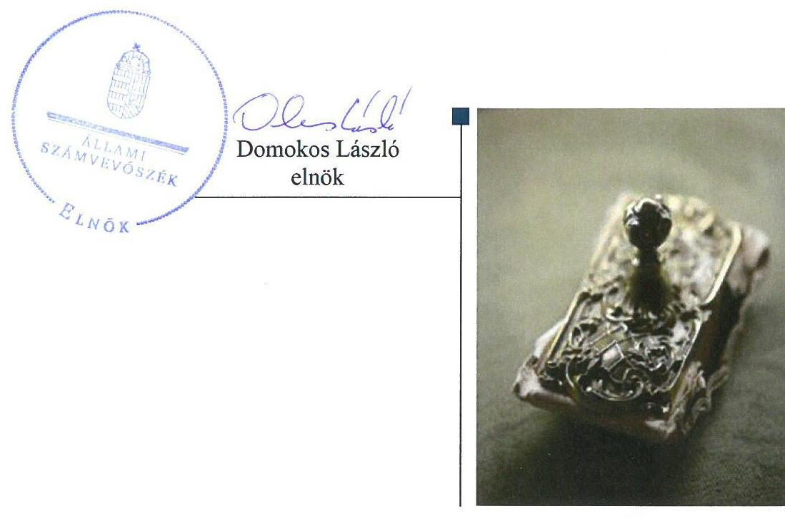

# Jelenetés 

## Önkormányzatok integritás- és belsó kontrollrendszere

Az önkormányzatok belső kontrollrendszere kialakításának és múködtetésének ellenőrzése Zalaegerszeg Megyei Jogú Város Önkormányzata 2018.

---

# Jelenetés 

## Önkormányzatok integritás- és belsó kontrollrendszere

Az önkormányzatok belső kontrollrendszere kialakításának és múködtetésének ellenőrzése Zalaegerszeg Megyei Jogú Város Önkormányzata 2018. OG hó 20 nap

---

# AZ ELLENŐRZÉST FELÜGYELTE:

DR. BENEDEK MÁRIA felügyeleti vezető

## AZ ELLENŐRZÉST VEZETTE ÉS A VÉGREHAJTÁSÁÉRT FELELŐS:

SZALAYNÉ OSTORHÁZI MÁRIA ellenőrzésvezető

## A PROGRAM ÖSSZEÁLLÍTÁSÁÉRT FELELŐS:

TÓTPÁL SZABOLCS osztályvezető

IKTATÓSZÁM: V-1248-092/2016

TÉMASZÁM: 2444

ELLENŐRZÉS-AZONOSÍTÓ SZÁM: V078907, V078401

Jelentéseink az Országgyűlés számítógépes hálózatán és az Interneta a www.asz.hu címen is olvashatóak.

---

# TARTALOMJEGYZÉK 

■ ÖSSZEGZÉS ..... 5
■ AZ ELLENŐRZÉS CÉLJA ..... 7
■ AZ ELLENŐRZÉS TERÜLETE ..... 8
■ AZ ELLENŐRZÉS HÁTTERE, INDOKOLTSÁGA ..... 9
■ A JELENTÉS LÉNYEGES KÉRDÉSKÖREI ..... 11
■ AZ ELLENŐRZÉS HATÓKÖRE ÉS MÓDSZEREI ..... 12
■ MEGÁLLAPÍTÁSOK ..... 14
■ JAVASLATOK ..... 22
■ MELLÉKLETEK ..... 25
I. sz. melléklet: Értelmező szótár ..... 25
■ FÜGGELÉK: ÉSZREVÉTELEK ..... 27
■ RÖVIDÍTÉSEK JEGYZÉKE ..... 29

---

.

---

# ÖSSZEGZÉS 

Az Állami Számvevőszék Zalaegerszeg Megyei Jogú Város Önkormányzatának ellenőrzése során megállapította, hogy a belső kontrollrendszer kialakítása és múködtetése 2016. évben nem volt szabályszerű, az nem biztositotta a közpénzfelhasználás szabályosságát és a nemzeti vagyonnal történő felelős gazdálkodást. A befektetési jegyekkel kapcsolatos döntéshozatal szabályszerűen történt, a döntések végrehajtása nem volt szabályszerű. Az integritási kontrollok kiépitettsége nem volt egyensúlyban a fellépő kockázatok szintjével.

## Az ellenőrzés társadalmi indokoltsága

Az Állami Számvevőszék a stratégiai céljával összhangban - az Állami Számvevőszékről szóló 2011. évi LXVI. törvény felhatalmazása alapján - végzi a közpénzekkel, az állami és önkormányzati vagyonnal való felelős gazdálkodás, valamint a helyi önkormányzatok számviteli rendje betartásának és belső kontrollrendszere múködésének ellenőrzését. Magyarország Alaptörvénye az önkormányzatoktól is elvárja a kiegyensúlyozott, átlátható és fenntartható költségvetési gazdálkodás elvének érvényesítését, továbbá a nemzeti vagyonnal való rendeltetésszerű és felelős módon való gazdálkodást. Az Állami Számvevőszék stratégiájában az is megfogalmazódott, hogy támogatja az integritás alapú, átlátható és elszámoltatható közpénzfelhasználás megteremtését. Mindezekre tekintettel, a közpénzzel gazdálkodó szervezetek esetében a belső kontrollrendszer megfelelő múködése ellenőrzését prioritásként kezeli az Állami Számvevőszék.

Az önkormányzat szabad pénzeszközeinek felhasználása során is kiemelten fontos a felelős gazdálkodás érvényesülése, amely összhangban kell, hogy legyen az önkormányzati gazdálkodás alapelveivel.

## Főbb megállapítások, következtetések

Zalaegerszeg Megyei Jogú Város Önkormányzata kontrollkörnyezetének kialakítása nem felelt meg a jogszabályi előírásoknak. A Polgármesteri Hivatal a 2016. évben rendelkezett gazdasági szervezettel, a Jegyző azonban a jogszabályi előírás ellenére a gazdasági szervezet vezetőjét a Polgármesteri Hivatal Szervezeti és Múködési Szabályzatában nem nevezte meg, ezáltal a felelősségi, hatásköri viszonyok és feladatok a gazdasági szervezetének vezetőjét tekintve nem voltak egyértelmúek.

A kötelezettségvállalás pénzügyi ellenjegyzését, valamint érvényesítését végző személyek kijelölése nem a jogszabályi előírásoknak megfelelően történt, így a pénzügyi ellenjegyzést és az érvényesítést végző személyek ezen jogkörük gyakorlását jogosulatlanul látták el.

A kockázatkezelési rendszer kialakítása 2016. szeptember 30-ig megfelelt a jogszabályi előírásoknak, a Jegyző azonban a kockázatkezelési rendszert nem múködtette. A 2016. október 1-től nem szabályozta az integrált kockázatkezelés, a szervezeti integritást sértő események kezelésének eljárásrendjét, az integrált kockázatkezelési rendszert nem múködtette.

Az információs és kommunikációs rendszer és a monitoring rendszer, ezen belül a belső ellenőrzés kialakítása és múködtetése megfelelt a jogszabályi előírásoknak.

Zalaegerszeg Megyei Jogú Város Önkormányzata meghatározta a befektetésekkel kapcsolatban felmerülő döntések hatásköri szabályait, a Szervezeti és Múködési Szabályzatában rögzítette, hogy a Polgármester átruházott hatáskörben jogosult dönteni az átmenetileg szabad pénzeszközök biztonságos lekötéséről. A Polgármester a befektetési jegyek megszerzésére vonatkozó döntést szabályszerűen hozta meg, a befektetési jegyek vételére szóló megbízások során azonban pénzügyi ellenjegyzés nélkül vállalt kötelezettséget.

---

Zalaegerszeg Megyei Jogú Város Önkormányzata több intézkedést tett a korrupciós kockázatok kezelésére, ugyanakkor nem végzett integritási kockázatelemzést, és ennek hiányában nem folytatott kockázatkezelési tevékenységet, amely által az integritás kontrollok nem támogatták megfelelően a fellépő kockázatok szintjének csökkentését.

---

# AZ ELLENŐRZÉS CÉLJA 

Az ellenőrzés célja annak megállapítása volt, hogy szabályszerűen történt-e Zalaegerszeg Megyei Jogú Város Önkormányzata belső kontrollrendszerének kialakítása és működtetése, az biztosította-e Zalaegerszeg Megyei Jogú Város Önkormányzatánál a közpénzfelhasználás szabályosságát, a közpénzekkel és a nemzeti vagyonnal történő szabályszerű és felelős gazdálkodást, a beszámolási és adatszolgáltatási kötelezettségek szabályszerű teljesítését. Az ellenőrzés keretében értékeltük Zalaegerszeg Megyei Jogú Város Önkormányzata korrupciós kockázatainak kezelését szolgáló integritás kontrollok kiépítettségét és az integritás szemlélet érvényesülését.

Az ellenőrzés célja továbbá annak értékelése volt, hogy a jogszabályi előírásoknak megfelelően alakították-e ki a belső kontrollrendszert, a kontrollkörnyezet biztosította-e a befektetési tevékenységek szabályszerű végzését. Értékeltük, hogy az egyes befektetési tevékenységekkel kapcsolatos döntéshozatal és a döntések végrehajtása, valamint az egyes befektetések számviteli elszámolása, nyilvántartása szabályszerű volt-e, és a belső és külső ellenőrzések támogattáke az egyes befektetési tevékenységek szabályszerű végzését.

---

# AZ ELLENŐRZÉS TERÜLETE 

## Zalaegerszeg Megyei Jogú Város Önkormányzata

Zalaegerszeg a Nyugat-Dunántúli régióban, Zala megyében fekvő város, állandó lakosainak száma a Központi Statisztikai Hivatal Magyarország közigazgatási helynévkönyve alapján 2016. január 1-jén 58547 fő volt.

Zalaegerszeg Megyei Jogú Város Önkormányzata 18 tagú Közgyűlésének ${ }^{1}$ munkáját hat állandó bizottság és az öttagú Tulajdonosi Tanácsadó Testület segítette. A településen roma nemzetiségi önkormányzat müködött.

Zalaegerszeg Megyei Jogú Város Önkormányzata² a Hivatalon ${ }^{3}$ kívül 18 intézménnyel és tíz $100 \%$-os tulajdoni részesedésű gazdasági társasággal látta el a feladatait.

A Polgármester ${ }^{4}$ a 2014. évi önkormányzati választások óta tölti be tisztségét, a Jegyzó ${ }^{5} 2003$ óta látja el közszolgálati feladatait.

A Hivatal tíz szervezeti egységre tagolódott, gazdasági szervezetének feladatait több szervezeti egység látta el. A Hivatalban 2016. évben szervezeti változás nem volt, a foglalkoztatott köztisztviselők száma a 2016. év végén 171 fő volt.

Az Önkormányzat a 2016. évi konszolidált éves költségvetési beszámoló szerint 20 989,0 millió Ft költségvetési bevételt ért el, valamint 15 275,3 millió Ft költségvetési kiadást teljesített. A könyvviteli mérleg szerinti eszközvagyon értéke 2016. december 31-én 126 523,9 millió Ft volt, amelyből a tartós befektetések 1 444,4 millió Ft-ot, a forgatási célú értékpapírok 647,0 millió Ft-ot tettek ki. A forrásokon belül a költségvetési évben esedékes kötelezettség állomány 182,1 millió Ft-ot, a költségvetési évet követően esedékes kötelezettség állomány 920,0 millió Ft-ot tett ki, a pénzintézettel szembeni kötelezettség 143,0 millió Ft volt.

---

# AZ ELLENŐRZÉS HÁTTERE, INDOKOLTSÁGA 

A DEMOKRATIKUS TÁRSADALMAKBAN alapvető igény, hogy a közpénzeket, a közvagyont használók tevékenységükről elszámoljanak, ahhoz egyértelmű és érvényesíthető felelősségi szabályok társuljanak. Ennek a jogos igénynek az érvényesítéséhez meg kell teremteni azokat a folyamatokat, rendszereket, amelyek nélkülözhetetlenek az elszámoltatáshoz. Az elszámoltatás eredményes működtetéséhez szükség van a megfelelő információs, kontroll-, értékelési és beszámolási rendszerek kialakítására. A belső kontrollok kiépítettsége hozzájárul az integritási szemlélet kialakításához és érvényesüléséhez. A belső kontrollrendszer kialakítása és működtetése nélkül nem valósítható meg a közpénzek, a közvagyon szabályos, gazdaságos, hatékony és eredményes felhasználása.

A BELSŐ KONTROLLRENDSZER azt a célt szolgálja, hogy az államháztartás szervei működésük és gazdálkodásuk során a tevékenységeket szabályszerűen, gazdaságosan, hatékonyan, eredményesen hajtsák végre, teljesítsék elszámolási kötelezettségeiket és megvédjék az erőforrásokat a veszteségektől, a károktól, a nem rendeltetésszerű használattól. A belső kontrollrendszer magában foglalja mindazon szabályokat, eljárásokat, gyakorlati módszereket és szervezeti struktúrákat, kockázatkezelési technikákat, kontrolltevékenységeket, amelyek segítséget nyújtanak a szervezetnek céljai eléréséhez. A belső kontrollrendszer szabályozása háromszintű, a törvényi előírásokat az Áht. ${ }^{6}$ és az Mötv. ${ }^{7}$, a rendeleti szintű szabályozást az Ávr. ${ }^{8}$ és a Bkr. ${ }^{9}$ tartalmazza, amelyeket útmutatói szinten az $\mathrm{NGM}^{10}$ által kiadott standardok és kézikönyvek támogatnak.

A MEGFELELŐ BELSŐ KONTROLLRENDSZER jelentősen csökkenti a hibák és szabálytalanságok kockázatát. Az ÁSZ ${ }^{11}$ célja, hogy javuljon az ellenőrzött önkormányzatok belső kontrollrendszerének szabályozottsága, müködésének megfelelősége, szabályszerűsége, hozzájárulva ezzel az egyensúlyi helyzet fenntarthatóságának biztosításához, biztosítva az önkormányzatnál a közpénzfelhasználás szabályosságát, a közpénzekkel és a nemzeti vagyonnal történő szabályszerű, gazdaságos, hatékony és eredményes gazdálkodást. Az ÁSZ ellenőrzés tapasztalatai nem csupán a közvetlenül ellenőrzött önkormányzatokat támogathatják, hanem a „jó gyakorlat" elterjesztésével azok az önkormányzatok is átvehetik a pozitív példákat, ahol nem végez ellenőrzést az ÁSZ.

AZ ELLENŐRZÉS VÁRHATÓ HASZNOSULÁSA négy szinten valósul meg. A törvényalkotás számára összegzett tapasztalatok állnak rendelkezésre a belső kontrollrendszer önkormányzati területen való kialakításáról, működtetéséről és hatásairól. Az ellenőrzés az ellenőrzött számára visszajelzést ad a belső kontrollrendszer kialakításában és müködésében lévő hiányosságokról, javaslataival hozzájárul azok kiküszöböléséhez. Az ellenőrzés megállapításait és javaslatait más szervezetek is hasznosíthatják a rendezett gazdálkodási keretek kialakításához. A társadalom

---

számára jelzi, hogy közpénz nem maradhat ellenőrizetlenül, az ÁSZ értékteremtő rend kialakításához és megőrzéséhez hozzájáruló tevékenysége pozitív hatással lesz a szervezetről kialakított összkép formálásában.

---

# A JELENTÉS LÉNYEGES KÉRDÉSKÖREI 

1. Az önkormányzat belső kontrollrendszerének kialakítása és müködtetése 2016. évben szabályszerű volt-e, az biztositotta-e az önkormányzatnál a közpénzfelhasználás szabályosságát, a nemzeti vagyonnal történő felelős gazdálkodást?
2. A jogszabályi előírásoknak megfelelően alakították-e ki a belső kontrollrendszer egyes pilléreit, a befektetési tevékenységek szabályszerű végzését a kiépített kontrollkörnyezet biztositotta-e a 2012-2016. években?
3. Az önkormányzat egyes befektetéseivel kapcsolatos döntéshozatala és a döntések végrehajtása szabályszerű volt-e?
4. Az egyes befektetések számviteli elszámolása, nyilvántartása szabályszerű volt-e?
5. A belső és külső ellenőrzések támogatták-e az egyes befektetési tevékenységek szabályszerű végzését?
6. Érvényesült-e az integritás szemlélet és ennek megfelelően kiépítették-e az integritás kontrollrendszert az önkormányzatnál?

---

# AZ ELLENŐRZÉS HATÓKÖRE ÉS MÓDSZEREI 

## Az ellenőrzés típusa

A belső kontrollrendszer ellenőrzése esetében megfelelőségi ellenőrzés, a befektetési tevékenységnél szabályszerűségi ellenőrzés.

## Az ellenőrzött időszak

A belső kontrollrendszer kialakításának és működtetésének ellenőrzése a 2016. január 1. és 2016. december 31. közötti időszakra terjedt ki.

Az önkormányzat egyes befektetési tevékenységeinek ellenőrzése tekintetében az ellenőrzött időszak a 2012. január 1. - 2016. december 31. közötti időszak volt.

## Az ellenőrzés tárgya

A helyi önkormányzatnak, mint éves költségvetési beszámoló készítésére kötelezett szervezetnek és polgármesteri hivatalának belső kontrollrendszere. Az integritás szemlélet érvényesülése.

Az önkormányzat 2016. december 31-én meglévő, a Számv. tv. ${ }^{12}$ 3. § (6) bekezdés 2. és 3. pontja szerint az értékpapírokban megtestesülő befektetései, lekötött betétei. Továbbá a 2016. december 31-én meglévő, az önkormányzat szabad pénzeszközei terhére, adásvételi szerződés keretében megszerzett, a kötelező feladatok ellátását nem szolgáló, az önkormányzat üzleti vagyonába tartozó, az ellenőrzött időszakban (2012-2016.) megszerzett ingatlanok, továbbá az - időkorlátozás nélkül megszerzett kulturális javak (műtárgyak, műalkotások, stb.), illetve egyéb értéktárgyak (pl. ékszerek, befektetési nemesfém).

Az ellenőrzés kiterjedt minden olyan körülményre és adatra, amely az ÁSZ jogszabályban meghatározott feladatainak teljesítéséhez, valamint a program végrehajtása folyamán felmerült újabb összefüggések feltárásához szükséges.

## Az ellenőrzött szervezet

Zalaegerszeg Megyei Jogú Város Önkormányzata

## Az ellenőrzés jogalapja

Az ÁSZ tv. ${ }^{13}$ 1. § (3) bekezdésében foglaltak alapján az ÁSZ általános hatáskörrel végzi a közpénzekkel és az állami és önkormányzati vagyonnal

---

való felelős gazdálkodás ellenőrzését. Az ÁSZ tv. 5. § (2) bekezdése alapján az államháztartás gazdálkodásának ellenőrzése keretében az ÁSZ ellenőrzi a helyi önkormányzatok gazdálkodását, valamint az ÁSZ tv. 5. § (6) bekezdése alapján ellenőrzése során értékeli az államháztartás számviteli rendjének betartását és a belső kontrollrendszer múködését.

# Az ellenőrzés módszerei 

Az ÁSZ az ellenőrzést az ellenőrzési program szempontjai, az ellenőrzött időszakban hatályos jogszabályok, az ellenőrzés szakmai szabályai, az egyes ellenőrzési típusokhoz kapcsolódó ÁSZ módszertanok figyelembe vételével végezte.

Az ellenőrzés ideje alatt az ÁSZ a Zalaegerszeg Megyei Jogú Város Önkormányzatával történő kapcsolattartást az ÁSZ SZMSZ ${ }^{14}$-ének vonatkozó előírásai alapján biztosította.

Az ellenőrzési kérdések megválaszolásához szükséges bizonyítékok megszerzése Zalaegerszeg Megyei Jogú Város Önkormányzata által rendelkezésre bocsátott dokumentumokra, adatokra alapozva megfigyelés, szemle (szemrevételezés), valamint elemző eljárás keretében történt. A minták kiválasztása rétegzett, véletlen mintavételi eljárással történt.

Az ellenőrzési bizonyítékként felhasználható adatforrások közé tartoztak egyrészt az ellenőrzési program részletes szempontjainál felsorolt adatforrások, másrészt minden - az ellenőrzés folyamán feltárt, az ellenőrzés szempontjából információt tartalmazó - dokumentum.

Az ellenőrzés lefolytatásához Zalaegerszeg Megyei Jogú Város Önkormányzata az ÁSZ által kért dokumentumok elektronikus megküldésével szolgáltatott adatokat. A rendelkezésre bocsátott adatok, információk kontrollja az ellenőrzés keretében történt.

A közszféra integritás alapú kultúrájának kialakítása, megerősítése és működése szorosan összefügg a belső kontrollrendszer működésével, ezért az ellenőrzés kiterjedt annak értékelésére is, hogy a belső kontrollrendszer kialakítása és múködtetése hogyan hatott az integritás szemlélet érvényesülésére. Az integritás szemlélet érvényesülésének értékelése az önkormányzat által az ÁSZ integritás felmérése keretében elkészített kérdőív ellenőrzése alapján történt a 2016. évre vonatkozóan.

Az ÁSZ Zalaegerszeg Megyei Jogú Város Önkormányzatának befektetési tevékenységét a szerződéskötés (és a kapcsolódó döntés-előkészítés, döntéshozatal) kivételével 2012. január 1. és 2016. december 31. közötti időszak vonatkozásában értékelte. A szerződéskötést az önkormányzat 2016. december 31-én meglévő értékpapírjai és egyéb befektetései vonatkozásában kellett értékelni a befektetési döntés előkészítése és a döntéshozatal tekintetében, abban az esetben is, ha az 2012. január 1. előtt történt.

---

# MEGÁLLAPÍTÁSOK 

## 1. Az önkormányzat belső kontrollrendszerének kialakítása és múködtetése 2016. évben szabályszerű volt-e, az biztosította-e az önkormányzatnál a közpénzfelhasználás szabályosságát, a nemzeti vagyonnal történő felelős gazdálkodást?

Összegző megállapítás

A belső kontrollrendszer 2016. évi kialakítása és működtetése a hiányosan kialakított kontrollkörnyezet, az integrált kockázatkezelési rendszer kialakításának és múködtetésének hiánya, valamint a kontrolltevékenységek nem szabályszerű kialakítása és múködtetése miatt nem volt megfelelő, az nem biztosította a közpénzfelhasználás szabályosságát és a nemzeti vagyonnal való felelős gazdálkodást.

### 1.1. számú megállapítás

A kontrollkörnyezet kialakítása nem felelt meg a jogszabályi előírásoknak.

A 2016. évben az Önkormányzat rendelkezett az Mötv.-ben előírtaknak megfelelő Önkormányzati SZMSZ ${ }^{15}$-szel.

A Jegyző a Hivatal szervezeti egységei által ellátott feladatokat és hatásköröket részletező hivatali SZMSZ ${ }^{16}$-ben és az Úgyrend ${ }^{17}$-ben alakította ki a Bkr.-ben előírtaknak megfelelő humánerőforrás kezelési szabályokat.

A Jegyző gondoskodott a beszerzések lebonyolításával kapcsolatos eljárásrend ${ }^{18}$, a külföldi kiküldetések elrendelésével és lebonyolításával, elszámolásával ${ }^{19}$ kapcsolatos kérdések, az anyag- és eszközgazdálkodás számviteli politikában nem szabályozott kérdései ${ }^{20}$, a gépjárművek igénybevételének és használatának rendje ${ }^{21}$, valamint a mobiltelefonok használata ${ }^{22}$ Ávr.-ben előírtaknak megfelelő belső szabályozásban történő rendezéséről.

A kontrollkörnyezet kialakításának hiányosságait az 1. táblázat tartalmazza:

## A KONTROLLKÖRNYEZET KIALAKÍTÁSÁNAK HIÁNYOSSÁGAI

| Sorszám | Megállapítás | Megjegyzés |
| :--: | :--: | :--: |
| 1. | A Jegyző az Ávr. 10/A. § rendelkezése ellenére a 2016. évben nem gondoskodott a gazdasági szervezet feladatait ellátó szervezeti egységek egységenként külön-külön ügyrendjeinek az elkészítéséről. |  |
| 2. | A Jegyző az Ávr. 11. § (2) bekezdésének előírása ellenére a hivatali SZMSZ-ben a gazdasági szervezet vezetőjét nem jelölte meg. | A Hivatal az Áht. 10. § (4) bekezdésében meghatározott gazdasági szervezettel rendelkezett, mely a hivatali SZMSZ 17. pontja 2. alpontjában meghatározott szervezeti egységekből állt. |

---

| Sorszám | Megállapítás | Megjegyzés |
| :--: | :--: | :--: |
| 3. | A Jegyző a Bkr. 6. § (1) bekezdése a) és b) pontjának előirása ellenére a 2016. évben nem alakított ki olyan kontrollkörnyezetet, amelyben világos a szervezeti struktúra és egyértelműek a felelősségi, hatásköri viszonyok és feladatok, mivel a hivatali SZMSZ 4. számú mellékleteként kiadott „Zalaegerszegi Polgármesteri Hivatal Belső Kontrollrendszere" elnevezésű szabályzat a Közgazdasági Osztályvezetőt, míg az Ügyrend 8. sz. melléklete a Jegyzőt jelölte meg a Hivatal gazdasági szervezete vezetőjének. | Az Önkormányzat két, egyidejűleg hatályban lévő belső szabályzatában a gazdasági vezető személyét illetően egymásnak tartalmilag ellentmondó szabályozást rögzített: Az Ügyrendben foglaltak szerint a Hivatal gazdasági szervezetének vezetője a Jegyző. A hivatali SZMSZ 4. számú mellékletének utolsó fejezetében a polgármesteri hivatal gazdasági vezetőjeként a Közgazdasági Osztályvezető került megjelölésre. |
| 4. | A Jegyző az Áhsz. ${ }^{23}$ 51. § (3) bekezdésében előirtak ellenére nem gondoskodott a Számlarend ${ }_{2}{ }^{24}$ ben az összesítő bizonylatok tartalmi és formai követelményeinek szabályozásáról. |  |
| 5. | A Közgyűlés a Kttv. ${ }^{25}$ 231. § (1) bekezdésének előirása ellenére a Hivatal köztisztviselőire irányadó hivatásetikai alapelvek részletes tartalmát és az etikai eljárás szabályait nem állapította meg. |  |
| 6. | A Jegyző az Ávr. 13. § (2) bekezdés c) pontjában előirtak ellenére nem rendezte belső szabályzatban a belföldi kiküldetések elrendelésével és lebonyolításával, elszámolásával kapcsolatos kérdéseket. |  |
| 7. | A Jegyző az Ávr. 13. § (2) bekezdés e) pontjában előirtak ellenére nem rendezte belső szabályzatban a reprezentációs kiadások felosztását, azok teljesítésének és elszámolásának szabályait. |  |

1.2. számú megállapítás

A kockázatkezelési rendszer kialakítása 2016. szeptember 30-ig megfelel, 2016. október 1-től nem felelt meg a jogszabályi előírásoknak. A Jegyző a kockázatkezelési rendszert, 2016. október 1-től az integrált kockázatkezelési rendszert nem múködtette.

A Jegyző a belső kontrollrendszer szabályzatban ${ }^{26}$, 2016. szeptember 30-ig a Bkr.-ben előírtak szerint alakította ki a kockázatkezelési rendszert.

A kockázatkezelési rendszer kialakításának és múködtetésének hiányosságait a 2. táblázat tartalmazza:
2. táblázat

# A KOCKÁZATKEZELÉSI RENDSZER KIALAKÍTÁSÁNAK ÉS MŰKÖDTETÉSÉNEK HIÁNYOSSÁGAI 

## Sorszám

1. A Jegyző 2016. október 1-jétől a Bkr. 6. § (4) bekezdésében foglaltak ellenére nem szabályozta az integrált kockázatkezelés eljárásrendjét.
2. A Jegyző a Bkr. 7. § (1) bekezdésének előirása ellenére 2016. szeptember 30-ig a kockázatkezelési rendszert, 2016. október 1-jétől az integrált kockázatkezelési rendszert nem múködtette.

Forrás: ÁSZ

### 1.3. számú megállapítás

A kontrolltevékenységek kereteinek kialakítása és múködtetése nem felelt meg a jogszabályi előírásoknak.

Az Önkormányzat rendelkezett a gazdálkodás részletes rendjét meghatározó pénzgazdálkodási szabályzat ${ }_{1-2}{ }^{27}$-vel és az ellenőrzési és a kontrolleljárásokkal kapcsolatos belső előírásokat, feltételeket tartalmazó ellenőrzési nyomvonal ${ }^{28}$-lal. A Jegyző szabályozta a szabálytalanságok kezelésének eljárásrendjét ${ }^{29}$, mely 2016. szeptember 30-ig megfelel a Bkr. előírásainak.

---

A kontrolltevékenységek keretei kialakításának és működtetésnek hiányosságait a 3. táblázat tartalmazza:
3. táblázat

# A KONTROLLTEVÉKENYSÉGEK KERETEI KIALAKÍTÁSÁNAK ÉS MŰKÖDTETÉSÉNEK HIÁNYOSSÁGAI 

## Sorszám Megállapítás

Megjegyzés

1. A Jegyző az Ávr. 55. § (2) bekezdésének a) pontjában foglalt előírások ellenére a pénzgazdálko-
dási szabályzat ${ }_{1-2}$-ban azt rögzítette, hogy a kötelezettségvállalás pénzügyi ellenjegyzésére a Jegyző által kijelölt személyek jogosultak, míg a hivatkozott jogszabályi előírás szerint gazdasági szervezettel rendelkező önkormányzati hivatal gazdasági vezetője, vagy az általa írásban kijelölt, az önkormányzati hivatal állományába tartozó köztisztviselő jogosult a pénzügyi ellenjegyzésre.
2. A Jegyző az Ávr. 58. § (4) bekezdésének előírása ellenére a pénzgazdálkodási szabályzat ${ }_{1-2}$-ben azt rögzítette, hogy érvényesítést csak az ezzel a Jegyző által megbízott dolgozó végezhet, míg a hivatkozott jogszabályi előírás szerint gazdasági szervezettel rendelkező önkormányzati hivatal gazdasági vezetője, vagy az általa írásban kijelölt, az önkormányzati hivatal állományába tartozó köztisztviselő jogosult.
3. A pénzügyi ellenjegyzést végző személynek az Ávr. 55. § (2) bekezdése a) pontjában foglalt előírásnak nem megfelelően történt kijelölése miatt a kötelezettségvállalás dokumentumán a pénzügyi ellenjegyzést nem az arra jogosult végezte.
4. Az érvényesítést végző személynek az Ávr. 58. § (4) bekezdésében foglalt előírásnak nem megfelelően történt kijelölése miatt az érvényesítést nem az arra jogosult végezte.
5. A Jegyző 8kr. 8. § (2) bekezdésében, különösen az a)-d) pontjaiban foglalt előírások ellenére a kontrolltevékenység minden tevékenységére vonatkozóan a Hivatalnál 2016. október 1-jétől nem biztosította a szervezeti célok elérését veszélyeztető kockázatok csökkentésére irányuló kontrollok kiépítését.
6. A Jegyző a Bkr. 6. § (4) bekezdés előírása ellenére 2016. október 1-jétől a szervezeti integritást sértő események kezelésének eljárásrendjét nem szabályozta.

A Hivatal rendelkezett az Áht. 10. § (4) bekezdésében meghatározott gazdasági szervezettel.

## 1.4. számú megállapítás

## Az információs és kommunikációs folyamatok kialakítása és múködtetése megfelelt a jogszabályi előírásoknak.

A Jegyző a Hivatali SZMSZ-ben, az Ügyrendben, az iratkezelési szabályzatban ${ }^{30}$, a közzétételi szabályzatban ${ }^{31}$, az adatvédelmi és adatbiztonsági szabályzatban ${ }^{32}$ a jogszabályi előírásoknak megfelelően kialakította az információs és kommunikációs folyamatokat és annak működtetése a felsorolt szabályzatokban előírtak szerint történt.

A Jegyző az Info. tv. ${ }^{33}$ 1. sz. melléklet II/1. és III/1. pontjában előírtak alapján - egy szabályzat kivételével - az Önkormányzat közzétételi kötelezettségének eleget tett az Önkormányzat honlapján.

Az Önkormányzat a beszámolási és adatszolgáltatási kötelezettségét szabályszerűen teljesítette.

Az információs és kommunikációs folyamatok kialakításának és múködtetésének hiányosságait a 4. táblázat tartalmazza:
4. táblázat

## AZ INFORMÁCIÓS ÉS KOMMUNIKÁCIÓS FOLYAMATOK KIALAKÍTÁSÁNAK ÉS MŰKÖDTETÉSÉNEK HIÁNYOSSÁGAI

## Sorszám Megállapítás Megjegyzés

1. A Jegyző az Ltv. ${ }^{34}$ 10. § (1) bekezdés c) pontjának előírása ellenére az iratkezelési szabályzatot nem a Magyar Nemzeti Levéltár egyetértésével adta ki.
2. A Jegyző az Info. tv. 37. § (1) bekezdésében és az 1. melléklet II/1 pontjában előírtak ellenére nem tette közzé a Hivatal internetes honlapján az adatvédelmi és adatbiztonsági szabályzatot.

---

# 1.5. számú megállapítás 

A monitoring-rendszer, ezen belül a belső ellenőrzési rendszer kialakítása és múködtetése a jogszabályi előírásoknak megfelelt.

A Jegyző a Hivatal monitoring rendszerét a monitoring szabályzatban ${ }^{35}$, a belső kontrollrendszer szabályzatban és az ellenőrzési nyomvonalban szabályozta.

A Jegyző a Hivatali SZMSZ-ben rögzítette a belső ellenőrzést végző szervezeti egység szervezeti és funkcionális függetlenségét, az összeférhetetlenség követelményét.

A belső ellenőrzés múködtetése a Bkr.-ben előírtaknak megfelelt. A belső ellenőr munkáját a belső ellenőrzési vezető által elkészített, aktualizált és a Jegyző által jóváhagyott belső ellenőrzési kézikönyv ${ }^{36}$ és a Közgyűlés által az Mötv.-ben előírt határidőig jóváhagyott ellenőrzési terv alapján végezte. A Bkr.-ben előírtaknak megfelelően a belső ellenőrzésekről ellenőrzési jelentések elkészültek, az ellenőrzési javaslatok alapján a címzettek intézkedési tervet készítettek, amelynek jóváhagyásáról a Jegyző a belső ellenőrzési vezető véleményének kikérésével döntött.

A belső ellenőrzési vezető a belső ellenőrzésekről a Bkr.-ben előírt tartalmú nyilvántartást vezetett.

A külső ellenőrzésekről vezetett nyilvántartás a Bkr. előírásaival összhangban tartalmazta az ellenőrzési jelentésben szereplő javaslatokat, az elfogadott intézkedési tervet, az intézkedési terv alapján végrehajtott intézkedések rövid leírását.
Az Önkormányzat értékelte, hogy a kiadott szabályzatai, a kialakított és múködtetett folyamatai biztosították-e rendelkezésre álló forrásokkal és a nemzeti vagyonnal történő szabályszerű, gazdaságos, hatékony és eredményes gazdálkodást.

A Jegyző a Bkr. 1. melléklete szerinti nyilatkozatában értékelte a Hivatal kontrollrendszerének minőségét, amely nyilatkozat az ellenőrzés megállapításaival összhangban tartalmazta, hogy a kockázatkezelési rendszer fejlesztést igényel.

A jegyző nyilatkozatot, valamint a 2016. évre vonatkozó éves ellenőrzési jelentést a Bkr.-ben előírtaknak megfelelően a Polgármester a 2016. évi zárszámadási rendelet tervezetével együtt a Közgyűlés elé terjesztette.

A 2016. évre vonatkozó éves ellenőrzési jelentés és az összefoglaló ellenőrzési jelentés a Bkr. előírásai szerinti tartalommal készült el.
Az Önkormányzat Roma Nemzetiségi Önkormányzat gazdálkodásával kapcsolatos feladatainak ellátása megfelelt a jogszabályi előírásoknak.

Az Önkormányzat a Nek. tv. ${ }^{37}$ és az Áht. előírásainak megfelelően rendelkezett a RNÖ ${ }^{38}$-vel kötött hatályos és aláírt együttműködési megállapodás ${ }_{1}$. ${ }_{2}$ vel $^{39}$, amelynek felülvizsgálata határidőben megtörtént.

Az Áht. előírásainak megfelelően a Jegyző előkészítette az RNÖ 2016. évi költségvetési határozat tervezetét, melyet a Közgyűlés elfogadott. Az elnök ${ }^{40}$ a zárszámadási határozat-tervezetet az RNÖ képviselő-testületi ${ }^{41}$ ülésére beterjesztette, melyet az RNÖ képviselő-testület a határozattal elfogadott, s az előírt határidőn belül hatályba léptetett.

---

A Jegyző az Áht. és az Ávr. előírásainak megfelelően az RNÖ SZMSZ ${ }^{42}$ ében a kötelezettségvállalás, az utalványozás, a teljesítés igazolás rendjét, illetve a költségvetés összeállításával kapcsolatos feladatokat és a vagyonnal való gazdálkodás kereteit meghatározta.

A Jegyző a pénzgazdálkodási szabályzat ${ }_{1-2}$-ben szabályozta az RNÖ-re vonatkozó gazdálkodási jogkörökkel kapcsolatos eljárásrendet, feltételeket, előírásokat az Áht. és az Ávr. előírásainak megfelelően.

A Jegyző a Bkr. előírása szerint elkészítette az ellenőrzési nyomvonalat és a 2016. szeptember 30-ig hatályos szabálytalanság kezelési szabályzatot, amelyek az RNÖ-re is vonatkoztak.

A pénzkezelési jogkörök gyakorlóinak kijelölése az Áht. és az Ávr.-ben előírtaknak megfelelően megtörtént.

A 2016. évi éves belső ellenőrzési terv az RNÖ-re kiterjesztésre került, az elvégzett belső ellenőrzést a Bkr. előírásának megfelelően ellenőrzési jelentésben dokumentálták, melynek megállapításaira a Jegyző intézkedési tervet készített.

A RNÖ gazdálkodásával kapcsolatos feladatok ellátásának hiányosságait az 5. táblázat tartalmazza.
5. táblázat

# A HELYI NEMZETISÉGI ÖNKORMÁNYZAT GAZDÁLKODÁDÁVAL KAPCSOLATOS FELADATOK ELLÁTÁSÁNAK HIÁNYOSSÁGAI 

Sorszám | Megállapítás | Megjegyzés |
| :-- | :-- | :-- |

1. A Jegyző a Bkr. 8. § (2) bekezdésében, különösen az a)-d) pontjaiban foglalt előírások ellenére a kontrolltevékenység minden tevékenységére vonatkozóan az RNÖ-nél 2016. október 1-jétől nem biztosította a szervezeti célok elérését veszélyeztető kockázatok csökkentésére irányuló kontrollok kiépítését.
2. A Jegyző a Bkr. 6. § (4) bekezdésének előírása ellenére 2016. október 1-jétől a szervezeti integritást sértő események kezelésének eljárásrendjét nem szabályozta.

Forrás: ÁSZ

## 2. A jogszabályi előírásoknak megfelelően alakították-e ki a belső kontrollrendszer egyes pilléreit, a befektetési tevékenységek szabályszerű végzését a kiépített kontrollkörnyezet biztosí-totta-e a 2012-2016. években?

Összegző megállapítás

A 2012 - 2016. években a belső kontrollrendszer egyes pilléreit a befektetések kockázatainak kezelésére vonatkozó szabályozás hiányában nem a jogszabályi előírásoknak megfelelően alakították ki, ezáltal a kiépített kontrollkörnyezet nem biztosította a befektetési tevékenység szabályszerű végzését.

A Közgyűlés a törvényben megengedett hatásköreit az Ötv. ${ }^{43}$ és az Mötv. előírásainak megfelelően személyekre, szervezetekre, polgármesterre és bizottságaira ruházta át. Az Önkormányzati SZMSZ 65. § (1) bekezdésének h) pontjában rögzítették, hogy a Polgármester átruházott hatáskörben gondoskodik az átmenetileg szabad pénzeszközök biztonságos lekötéséről a legkedvezőbb hozam biztosítása mellett.

---

A Közgyűlés a vagyongazdálkodási rendelet ${ }_{1,2}{ }^{44}$-ben írta elő az átruházott jogokat gyakorló Polgármester részére az e jogkörében hozott döntésekről való beszámolás rendjét.

Az információs és kommunikációs rendszert a jogszabályi előírásokkal összhangban alakították ki, annak múködtetése során, az Önkormányzat honlapján közzétette az ötmillió Ft-ot elérő vagy az meghaladó vagyonnal való gazdálkodással összefüggő szerződésének adatait az Info tv. előírásai szerint.

A belső kontrollrendszer 2012 - 2016. évek közötti befektetéssel kapcsolatos hiányosságát a 6. táblázat mutatja be:
6. táblázat

A BELSŐ KONTROLLRENDSZER 2012. - 2016. ÉVEK KÖZÖTTI, BEFEKTETÉSSEL KAPCSOLATOS HIÁNYOSSÁGA

| Sorszám | Megállapítás | Megjegyzés |
| :-- | :-- | :-- |

1. A Jegyző a Bkr. 7. § (2) bekezdésében előírtak ellenére nem határozta meg a befektetési jegy vásárlás és értékesítés kockázataival kapcsolatban szükséges intézkedéseket, valamint azok teljesítésének folyamatos nyomon követésének módját.

Forrás: ÁSZ

# 3. Az önkormányzat egyes befektetéseivel kapcsolatos döntéshozatala és a döntések végrehajtása szabályszerű volt-e? 

## Összegző megállapítás

Az Önkormányzat befektetésével kapcsolatos döntéshozatala szabályszerű volt, a döntések végrehajtása nem volt szabályszerű.

Az Önkormányzat 2016. december 31-én 647,0 millió Ft értékű befektetési jeggyel rendelkezett.

A Polgármester a Közgyűlés által az Önkormányzati SZMSZ-ben rögzített átruházott hatáskörben, szabályszerűen döntött a forgatási célú értékpapírnak minősülő befektetési jegyek megszerzéséről.

A befektetési döntések végrehajtásával kapcsolatos hiányosságot a 7. táblázat mutatja be:
7. táblázat

A BEFEKTETÉSI DÖNTÉSEK VÉGREHAJTÁSÁVAL KAPCSOLATOS HIÁNYOSSÁG

| Sorszám | Megállapítás | Megjegyzés |
| :-- | :-- | :-- |

1. A Polgármester az Áht. 37. § (1) és az Ávr. 55. §.(1) bekezdéseiben előírtak ellenére a befektetési jegyek vételére szóló megbízások során pénzügyi ellenjegyzés nélkül vállalt kötelezettséget.

Forrás: ÁSZ

---

# 4. Az egyes befektetések számviteli elszámolása, nyilvántartása szabályszerű volt-e? 

## Összegző megállapítás

Az értékpapírok számviteli elszámolása, nyilvántartása nem volt szabályszerű.

Az OTP Optima befektetési jegyet a 2014. december 19-én történt vásárlásakor az Áhsz. előírásainak és a nyílt végű, lejárat nélküli értékpapír jellemzőinek megfelelően forgatási célú hitelviszonyt megtestesítő értékpapírként sorolták be és bekerülési értékét a kifizetett vételárban határozták meg a Számv. tv. és az Áhsz. előírásai alapján.

Az Önkormányzat a befektetési jegyek leltározását a Számv. tv.-ben és a leltározási szabályzat ${ }^{81}$ ban előírtaknak megfelelően egyeztetéssel végezte el, az éves beszámolók mérlegének „8/Értékpapírok" sora megegyezett az egyes évek mérlegsorát alátámasztó befektetési jegyek leltárával.

Az értékpapírok számviteli elszámolásának hiányosságait a 8. táblázat mutatja be:
8. táblázat

## AZ ÉRTÉKPAPÍROK SZÁMVITELI ELSZÁMOLÁSÁNAK HIÁNYOSSÁGAI

Sorszám
1. A Jegyző a Számv. tv. 85. § (5) bekezdésének előírása ellenére a 2015 - 2016. években a befektetési jegyek hozamát nem bruttó módon, hanem a bank által felszámított díjjal csökkentve mutatta ki.

2. A Számlarend: 1.6.2. pontjában előírtak ellenére a befektetési jegyek vétele és eladása számviteli elszámolásai tekintetében a 2015-2016. években a főkönyvi könyvelés és az analitikus nyilvántartások adatainak egyeztetésére havonta, de legkésőbb az időközi mérlegjelentést megelőzően nem került sor.

3. A Jegyző az Áhsz. 45. § (3) bekezdésében előírtak ellenére a 2014 - 2016. években a befektetési jegyekről vezetett részletező nyilvántartásoknak az Áhsz. 14. mellékletben foglalt kötelező tartalmi elemei közül nem gondoskodott a VIII. 1. a-j pontok szerinti adatok megjelenítéséről.

A megállapított 29,5 ezer Ft számviteli hiba nem minősült jelentős összegű hibának.
Az Önkormányzat az Áhsz. 51. § (3) bekezdésében foglaltakkal összhangban a Számlarend:-ben szabályozta a részletező nyilvántartásoknak a kapcsolódó könyvviteli számlákkal való egyeztetését.

## 5. A belső és külső ellenőrzések támogatták-e az egyes befektetési tevékenységek szabályszerű végzését?

Összegző megállapítás

A belső és külső ellenőrzések 2012. január 1. - 2016. december 31. közötti időszakban nem támogatták az egyes befektetési tevékenységek szabályszerűségét.

A belső ellenőrzés az ellenőrzött időszakban nem ellenőrizte a befektetésekkel kapcsolatos tevékenységet. Az Önkormányzatnál nem került sor a befektetésekkel, a velük való gazdálkodással kapcsolatos könyvvizsgálói és külső ellenőrzések végzésére.

---

# 6. Érvényesült-e az integritás szemlélet és ennek megfelelően ki- 

## építették-e az integritás kontrollrendszert az önkormányzat-

nál?

## Összegző megállapítás

Az integritási kontrollok kiépítettsége nem volt egyensúlyban a fellépő kockázatok szintjével.

Az Önkormányzat és a Hivatal a jogszabályok által előírt kontrollok jelentős részét kialakította. A szervezeti és múködési szabályokat az Önkormányzati SZMSZ, a Hivatali SZMSZ és az Úgyrend tartalmazta.

Az Önkormányzat és a Hivatal a jogszabályokban előírt szabályzatokkal - közszolgálati szabályzat ${ }_{1-2}{ }^{46}$, iratkezelési szabályzat, a számviteli politika keretében elkészítendő szabályzatok - rendelkezett. A Hivatalnak volt hatályos etikai szabályzata, azonban az etikai elvárásokat a Jegyző a Hivatalban dolgozó köztisztviselőkkel dokumentáltan nem ismertette meg.

A Hivatal 2016. október 1-jéig rendelkezett rendszeresen aktualizált szabálytalanság kezelési szabályzattal, azonban 2016. október 1-jétől a korrupciós kockázatok mérséklését, megelőzését támogató integrált kockázatkezelési eljárásrend nem került szabályozásra, integritási kockázatelemzés elvégzésére nem került sor.

Az integritás érvényesülését erősítő egyéb, jogszabályok által nem előírt kontrollok közül a Jegyző előírta a dolgozóknak az egyéb érdekeltségeikről való nyilatkozattételi kötelezettséget, múködtette az egyéni teljesítményértékelést, alkalmazta a négy szem elvét.

---

# JAVASLATOK 

Az ÁSZ tv. 33. § (1) bekezdésében foglaltak értelmében az ellenőrzött szervezet vezetője köteles a jelentésben foglalt megállapításokhoz kapcsolódó intézkedési tervet összeállítani és azt a jelentés kézhezvételétől számított 30 napon belül az ÁSZ részére megküldeni. Amennyiben az ellenőrzött szervezet vezetője nem küldi meg határidőben az intézkedési tervet, vagy továbbra sem elfogadható intézkedési tervet küld, az Állami Számvevőszék elnöke az ÁSZ tv. 33. § (3) bekezdése a) és b) pontjaiban foglaltakat érvényesítheti.

## a polgármesternek

1. Intézkedjen, hogy a Kttv. előírásának megfelelően a köztisztviselőkre vonatkozó hivatásetikai alapelvek részletes tartalmát, valamint az etikai eljárás szabályait a Közgyülés állapítsa meg.
(1. táblázat 5. sz. megállapítás alapján)
2. Intézkedjen az Állami Számvevőszék ellenőrzése során feltárt hiányosságok és/vagy szabálytalanságok tekintetében a munkajogi felelősség tisztázására irányuló eljárás megindításáról, és ennek eredménye ismeretében tegye meg a szükséges intézkedéseket.
(1. táblázat 1-4. és 6-7. sz., 2. táblázat 1-2. sz., 3. táblázat 1-6. sz., 4. táblázat 1-2. sz., 5. táblázat 1-2. sz., 6. táblázat 1. sz. és a 8. táblázat 1-3. sz. megállapítások alapján)

## a jegyzőnek

1. Intézkedjen az Ávr.-ben előírtak szerint a gazdasági szervezet feladatait ellátó szervezeti egységek egységenként külön-külön ügyrendjeinek az elkészítéséről.
(1. táblázat 1. sz. megállapítás alapján)
2. Intézkedjen az Ávr.-ben elöírtak szerint a gazdasági szervezet vezetőjének SZMSZ-ben történő megjelöléséről.
(1. táblázat 2. sz. megállapítás alapján)
3. Intézkedjen az Bkr.-ben elöírtaknak megfelelően olyan kontrollkörnyezet kialakításáról, amelyben világos a szervezeti struktúra, a folyamatok átláthatóak, valamint egyértelmüek a felelősségi, hatásköri viszonyok és feladatok.
(1. táblázat 3. sz. megállapítás alapján)

---

4. Intézkedjen az Áhsz.-ben elöirtaknak megfelelően az összesitő bizonylatok tartalmi és formai követelményeinek számlarendben történő szabályozásáról.
(1. táblázat 4. sz. megállapítás alapján)
5. Intézkedjen az Ávr. előírásának megfelelően a belföldi kiküldetések elrendelésével és lebonyolításával, elszámolásával kapcsolatos kérdéseknek, továbbá a reprezentációs kiadások felosztásának, azok teljesítésének és elszámolási szabályainak belső szabályzatban történő rendezéséről.
(1. táblázat 6-7. sz. megállapítás alapján)
6. Intézkedjen a Bkr. előírásainak megfelelően az integrált kockázatkezelés eljárásrendjének szabályozásáról, továbbá az integrált kockázatkezelési rendszer müködtetéséről.
(2. táblázat 1-2. sz. megállapítások alapján)
7. Intézkedjen az Ávr. előírásainak megfelelően a kötelezettségvállalás pénzügyi ellenjegyzésére és az érvényesitésre jogosult személyek gazdasági vezető általi kijelölésének pénzkezelési szabályzatban történő rögzítéséről.
(3. táblázat 1-2. sz. megállapítások alapján)
8. Intézkedjen az Ávr. előírásainak megfelelően, hogy a kötelezettségvállalás pénzügyi ellenjegyzését és az érvényesitést az arra jogosult - a gazdasági vezető vagy az általa írásban kijelölt, a költségvetési szerv alkalmazásában álló - személy végezze.
(3. táblázat 3-4. sz. megállapítások alapján)
9. Intézkedjen a Bkr. előírásainak megfelelően a kontrolltevékenység részeként - az RNÖ vonatkozásában is - minden tevékenységre vonatkozóan a szervezeti célok elérését veszélyeztető kockázatok csökkentésére irányuló kontrollok kiépítéséről.
(3. táblázat 5. sz. és 5. táblázat 1. sz. megállapítások alapján)
10. Intézkedjen - az RNÖ vonatkozásában is - a Bkr. előírásainak megfelelő, a szervezeti integritást sértő események kezelése eljárásrendjének szabályozásáról.
(3. táblázat 6. sz. és az 5. táblázat 2. sz. megállapítás alapján)

---

11. Intézkedjen az Ltv. előírásainak megfelelően a Hivatal egyedi iratkezelési szabályzatának a Magyar Nemzeti Levéltárral egyetértésben történő kiadásáról.
(4. táblázat 1. sz. megállapítás alapján)
12. Intézkedjen az Info. tv.-ben elöirtaknak megfelelően az adatvédelmi és adatbiztonsági szabályzatnak a Hivatal honlapján történő közzétételéről.
(4. táblázat 2. sz. megállapítás alapján)
13. Intézkedjen a Bkr. előírásainak megfelelően a befektetési jegyek vásárlása és értékesítése kockázataival kapcsolatos intézkedések, valamint azok teljesitésének folyamatos nyomon követési módjának meghatározásáról.
(6. táblázat 1. sz. megállapítás alapján)
14. Intézkedjen, hogy a befektetési jegyek vásárlása során a kötelezettségvállalásra az Aht. és az Avr. előírásainak megfelelően pénzügyi ellenjegyzés után kerüljön sor.
(7. táblázat 1. sz. megállapítás alapján)
15. Intézkedjen, hogy a befektetési jegyek hozama a Számv. tv. előírásainak megfelelően kerüljön kimutatásra.
(8. táblázat 1. sz. megállapítás alapján)
16. Intézkedjen, hogy a befektetési jegyek vétele és eladása számviteli elszámolása során a számlarendben foglalt előírásoknak megfelelően kerüljön sor a fökönyvi könyvelés és analitikus nyilvántartás értékadatainak számszerú egyeztetésére.
(8. táblázat 2. sz. megállapítás alapján)
17. Intézkedjen, a befektetési jegyek vonatkozásában az Ahsz. elöírásainak megfelelő tartalmú részletező nyilvántartás vezetéséről.
(8. táblázat 3. sz. megállapítás alapján)

---

# MELLÉKLETEK 

- I. SZ. MELLÉKLET: ÉRTELMEZŐ SZÓTÁR
befektetési szolgáltatási tevékenység
betét
betétszerződés
értékpapír letéti számla
értékpapírszámla
jegyzés
kamat
kibocsátó
kulturális javak
folyószámla-szerződés
tulajdonosi joggyakorló
ügyfélszámla
rendszeres gazdasági tevékenység keretében, pénzügyi eszközre vonatkozóan végzett megbízás felvétele és továbbítása, megbízás végrehajtása az ügyfél javára, sajátszámlás kereskedés, portfólió-kezelés, befektetési tanácsadás, pénzügyi eszköz elhelyezése az eszköz (értékpapír vagy egyéb pénzügyi eszköz) vételére vonatkozó kötelezettségvállalással (jegyzési garanciavállalás), pénzügyi eszköz elhelyezése az eszköz (pénzügyi eszköz) vételére vonatkozó kötelezettségvállalás nélkül, és multilaterális kereskedési rendszer múködtetése (Bszt. 5. § (1) bekezdés)
a Ptk. szerinti betétszerződés vagy a takarékbetétről szóló 1989. évi 2. törvényerejű rendelet szerinti takarékbetét-szerződés alapján fennálló tartozás, ideértve a hitelintézetnél a fizetésiszámla-szerződés alapján fennálló pozitív számlaegyenleget is (Hpt. 6. § (1) bekezdés 8. pont).
betétszerződés alapján a betétes jogosult a bank számára meghatározott pénzösszeget fizetni, a bank köteles a betétes által felajánlott pénzösszeget elfogadni, ugyanakkora pénzösszeget későbbi időpontban visszafizetni, valamint kamatot fizetni (Ptk. 6:390. § (1) bekezdés);
az ügyfél számára vezetett, az ügyféltől letéti őrzésre átvett értékpapír nyilvántartására szolgáló számla (Bszt. 4. § (2) bekezdés 25. pont)
a dematerializált értékpapírról és a hozzá kapcsolódó jogokról az értékpapírtulajdonos javára vezetett nyilvántartás (Tpt. 5. § (1) bekezdés 46. pont)
az értékpapír forgalomba hozatala során az értékpapírt megszerezni szándékozó befektetőnek az értékpapír megszerzésére irányuló, feltétetlen és viszszavonhatatlan nyilatkozata, amellyel az ajánlatot elfogadja és kötelezettséget vállal az ellenszolgáltatás teljesítésére (Tpt. 5. § (1) bekezdés 63. pont)
az adós által a kölcsönnyújtónak (betételhelyezőnek) az elfogadott betét vagy az igénybe vett kölcsön használatáért, kockázatáért fizetendő, a betét- vagy kölcsönösszeg százalékában meghatározott, időarányosan térítendő (elszámolandó) pénzösszeg vagy egyéb hozadék (Hpt. 6. § (1) bekezdés 52. pont)
az a személy, aki az értékpapírban megtestesített kötelezettség teljesítését a maga nevében vállalja (Tpt. 5. § (1) bekezdés 67. pont)
az élettelen és élő természet keletkezésének, fejlődésének, az emberiség, a magyar nemzet, Magyarország történelmének kiemelkedő és jellemző tárgyi, képi, hangrögzített, írásos emlékei és egyéb bizonyítékai - az ingatlanok kivételével -, valamint a művészeti alkotások (a kulturális örökség védelméről szóló 2001. évi LXIV. törvény)
olyan szerződés, amely alapján a felek meghatározott jogviszonyból származó, beszámítható követeléseiknek egységes számlán való nyilvántartására és elszámolására kötelesek (Ptk. 6:391. § (1) bekezdés)
aki a nemzeti vagyon felett az államot vagy a helyi önkormányzatot megillető tulajdonosi jogok és kötelezettségek összességének gyakorlására jogosult (Nvtv. 3. § (1) bekezdés 17. pontja)
az ügyfél pénzeszközeinek nyilvántartására szolgáló, befektetési vállalkozás, hitelintézet, árutőzsdei szolgáltató, befektetési alapkezelő által vezetett számla (Tpt. 5. § (1) bekezdés 130. pont)

---

üzleti vagyon
vagyongazdálkodás
a nemzeti vagyon azon része, amely nem tartozik az önkormányzati vagyon esetén a törzsvagyonba (Nvtv. 3. § (1) bekezdés 18. pontja)
a nemzeti vagyongazdálkodás feladata a nemzeti vagyon rendeltetésének megfelelő, az állam, az önkormányzat mindenkori teherbíró képességéhez igazodó, elsődlegesen a közfeladatok ellátásához és a mindenkori társadalmi szükségletek kielégítéséhez szükséges, egységes elveken alapuló, átlátható, hatékony és költségtakarékos működtetése, értékének megőrzése, állagának védelme, értéknövelő használata, hasznosítása, gyarapítása, továbbá az állam vagy a helyi önkormányzat feladatának ellátása szempontjából feleslegessé váló vagyontárgyak elidegenítése (Nvtv. 7. § (2) bekezdése)

---

# FÜGGELÉK: ÉSZREVÉTELEK 

A jelentéstervezetet a Számvevőszék 15 napos észrevételezésre megküldte az ellenőrzött szervezet vezetőjének az ÁSZ tv. 29. §* (1) bekezdése előírásának megfelelően.

Az ellenőrzött szervezet vezetője az ÁSZ. tv. 29. § (2) bekezdésében foglalt észrevételezési jogával nem élt, a jelentéstervezetre észrevételt nem tett.

[^0]
[^0]:    * 29. § (1) Az Állami Számvevőszék az ellenőrzési megállapításait megküldi az ellenőrzött szervezet vezetőjének vagy az általa megbízott személynek, és annak, akinek személyes felelősségét állapította meg.
    (2) Az ellenőrzött szervezet vezetője és a felelősként megjelölt személy az ellenőrzés megállapításaira tizenöt napon belül írásban észrevételt tehet.
    (3) Az Állami Számvevőszék az észrevételre a beérkezésétől számított harminc napon belül írásban válaszol. A figyelembe nem vett észrevételeket köteles a jelentésben feltüntetni, és megindokolni, hogy azokat miért nem fogadta el.

---

.

---

# RÖVIDÍTÉSEK JEGYZÉKE 

${ }^{1}$ Közgyűlés
${ }^{2}$ Önkormányzat
${ }^{3}$ Hivatal
${ }^{4}$ Polgármester
${ }^{5}$ Jegyző
${ }^{6}$ Áht.
${ }^{7}$ Mótv.
${ }^{8}$ Ávr.
${ }^{9}$ Bkr.
${ }^{10}$ NGM
${ }^{11}$ ÁSZ
${ }^{12}$ Számv. tv.
${ }^{13}$ ÁSZ tv.
${ }^{14}$ ÁSZ SZMSZ
${ }^{15}$ Önkormányzati SZMSZ
${ }^{16}$ Hivatali SZMSZ
${ }^{17}$ Ügyrend
${ }^{18}$ beszerzések lebonyolításával kapcsolatos eljárásrend
${ }^{19}$ külföldi kiküldetések elrendelésével és lebonyolításával, elszámolása szabályzat
${ }^{20}$ az anyag- és eszközgazdálkodás számviteli politikában nem szabályozott kérdései
${ }^{21}$ gépjárművek igénybevételének és használatának rendje
${ }^{22}$ mobiltelefonok használata szabályzat

Zalaegerszeg Megyei jogú Város Közgyűlése
Zalaegerszeg Megyei jogú Város Önkormányzata
Zalaegerszeg Megyei jogú Város Polgármesteri Hivatala
Zalaegerszeg Megyei jogú Város Polgármestere
Zalaegerszeg Megyei jogú Város Polgármesteri Hivatalának Főjegyzője
2011. évi CXCV. törvény az államháztartásról (hatályos 2012. január 1-jétől)
2011. évi CLXXXIX. törvény Magyarország helyi önkormányzatairól (hatályos
2012. január 1-jétől)

368/2011. (XII. 31.) Korm. rendelet az államháztartásról szóló törvény végrehajtásáról (hatályos 2012. január 1-jétől)
370/2011. (XII. 31.) Korm. rendelet a költségvetési szervek belső kontrollrendszeréről és belső ellenőrzéséről (hatályos 2012. január 1-jétől)
Nemzetgazdasági Minisztérium
Állami Számvevőszék
2000. évi C. törvény a számvitelről (hatályos: 2001. január 1-jétől)
2011. évi LXV. törvény az Állami Számvevőszékről (hatályos: 2011. július 1-jétől)

Az Állami Számvevőszék elnökének 3/2016. (XII.29.) ÁSZ utasítása az Állami Számvevőszék Szervezeti és Működési Szabályzatáról (hatályos: 2017. január 1-jétől)
Zalaegerszeg Megyei Jogú Város Közgyűlésének (6/2007. II. 9.) számú önkormányzati rendelete a Szervezeti és Múködési Szabályzatáról (egységes szerkezet, hatályos: 2017. február 13. napjáig)
Zalaegerszeg Megyei Jogú Város Polgármesteri Hivatala Szervezeti és Múködési Szabályzata (hatályos: 2013. január 01-jétől)
Zalaegerszeg Megyei Jogú Város Polgármesteri Hivatala 24/2008 (IX.12. ) számú belső szabályzattal jóváhagyott Ügyrendi Szabályzata (egységes szerkezet, hatályos: 2008. szeptember 15-től)
Zalaegerszeg Megyei Jogú Város Közgyűlésének 12/2006 (III.07.) önkormányzati rendelete az önkormányzati pénzeszközökből és támogatásokból megvalósuló beszerzésekről (módosításokkal egységes szerkezetben, hatályos 2015. március 14-től)
Zalaegerszeg Megyei Jogú Város Polgármesteri Hivatala 21/2015. (IX.07.) belső szabályzata a külföldi kiküldetések rendjéről (hatályos: 2015. április 1-től).
Zalaegerszeg Megyei Jogú Város Polgármesteri Hivatala 19/2014 (X.20.) belső szabályzata a felesleges vagyontárgyak hasznosításának és selejtezésének szabályairól szóló 13/2014 (IV.30.) belső szabályzat módosításáról (egységes szerkezetben (hatályos: 2014. január 1-jétől)
Zalaegerszeg Megyei Jogú Város Polgármesteri Hivatala 5/2015. (III.01.) belső szabályzata A Hivatali és Saját Tulajdonú Gépjárművek Használatának Szabályairól Üzemeltetési Költség Elszámolásáról szóló 12/2009. (VI.10.) belső szabályzat módosításáról (hatályos: 2009. május 1-jétől)
Zalaegerszeg Megyei Jogú Város Polgármesteri Hivatala 5/2011 (V.25.) belső szabályzata a Polgármesteri Hivatal tulajdonát képező mobiltelefonok használatáról (hatályos: 2011. június 1-jétől)

---

${ }^{23}$ Áhsz.
${ }^{24}$ Számlarendz.
${ }^{25} \mathrm{Kttv}$.
${ }^{26}$ belső kontrollrendszer szabályzat
${ }^{27}$ pénzgazdálkodási szabályzat ${ }_{1-2}$
pénzgazdálkodási szabályzat ${ }_{1}$
pénzgazdálkodási szabályzat ${ }_{2}$
${ }^{28}$ ellenőrzési nyomvonal
${ }^{29}$ szabálytalanság kezelési szabályzat
${ }^{30}$ iratkezelési szabályzat
${ }^{31}$ közzétételi szabályzat
${ }^{32}$ adatvédelmi és adatbiztonsági szabályzat
${ }^{33}$ Info.tv.
${ }^{34} \mathrm{Ltv}$.
${ }^{35}$ monitoring szabályzat
${ }^{36}$ belső ellenőrzési kézikönyv
${ }^{37}$ Nek. tv.
${ }^{38}$ RNÖ
${ }^{39}$ együttműködési megállapodás
együttműködési megállapodás ${ }_{1}$
együttműködési megállapodás ${ }_{2}$

4/2013. (I. 11.) Korm. rendelet az államháztartás számviteléről (hatályos 2014. január 1-jétől.)
Zalaegerszeg Megyei Jogú Város Polgármesteri Hivatala 7/2014. (V.5) sz. belső szabályzata a számlarendről (hatályos: 2014. január 1-jétől)
a közszolgálati tisztviselőkről szóló 2011. évi CXCIX. törvény (hatályos: 2012. március 1-jétől)
Zalaegerszeg Megyei Jogú Város Polgármesteri Hivatala 9/2016. (III.18.) számú Belső szabályzattal módosított a belső kontrollrendszer szabályozásáról szóló 8/2015. (IV.07.) számú Belső szabályzata (egységes szerkezetben, hatályos: 2016. január 1-jétől)
az Önkormányzat pénzgazdálkodás rendjéről szóló szabályzata ${ }_{1-2}$
24/2015. (XI.24.) számú Belső szabályzata a 6/2012. (III.01.) számú a pénzgazdálkodás rendjéről szóló Belső szabályzata módosításáról (hatályos: 2015. november 01. és 2016. szeptember 30. között)
19/2016. (X.01.) számú Belső szabályzata a 6/2012. (III.01.) számú a pénzgazdálkodás rendjéről szóló Belső szabályzata módosításáról (hatályos: 2016. október 01.-től)
Zalaegerszeg Megyei Jogú Város Polgármesteri Hivatala ellenőrzési nyomvonaláról szóló 11/2016. (IV.12.) számú Belső szabályzata (Hatályos: 2016.január 1-jétől)
Zalaegerszeg Megyei Jogú Város Polgármesteri Hivatalának 10/2016. (IV.10.) számú Belső szabályzattal módosított, szabálytalanságok kezelésének eljárásrendjéről szóló 11/2015. (IV.10.) számú Belső szabályzata (egységes szerkezetben, hatályos: 2016. január 01-jétől)
Zalaegerszeg Megyei Jogú Város Polgármesteri Hivatala 27/2015 (XII.30.) sz. belső szabályzata a hivatal egyedi iratkezelési szabályzatáról (hatályos: 2016. január 1-jétől)
Zalaegerszeg Megyei Jogú Város Polgármesteri Hivatala 12/2008 (IV.30.) számú belső szabályzat Közérdekű Adatok Közzétételéről (hatályos 2008. május 1-jétől)
Zalaegerszeg Megyei Jogú Város Polgármesteri Hivatala Adatvédelemről szóló 23/2015. (XI.14.) számú belső szabályzattal módosított 15/2015. (IV.10.) számú belső szabályzat (egységes szerkezet, hatályos 2015. január 1-jétől)
2011. évi CXII. törvény az információs önrendelkezési jogról és az információszabadságról (hatályos: 2011. július 27-től)
A köziratokról, a közlevéltárakról és a magánlevéltári anyag védelméről szóló 1995. évi LXVI. törvény (hatályos: 1996. január 1-jétől)
Zalaegerszeg Megyei Jogú Város Polgármesteri Hivatala monitoring rendszere és monitoring stratégiájának szabályozásáról szóló 8/2016. (II.11.) számú szabályzattal módosított 12/2015. (IV.10.) számú Belső szabályzata (egységes szerkezetben, hatályos: 2016. január 1-jétől)
Zalaegerszeg Megyei Jogú Város Polgármesteri Hivatala Belső Ellenőrzési Kézikönyvről szóló 10/2014. (IV.10.) számú Belső szabályzata (hatályos: 2015. január 1-jétől)
2011. évi CLXXIX. törvény a nemzetiségek jogairól (hatályos 2011. december 20tól)
Zalaegerszeg Megyei Jogú Város Roma Nemzetiségi Önkormányzata
Zalaegerszeg Megyei Jogú Város Önkormányzata és Zalaegerszeg Megyei Jogú Város Roma Nemzetiségi Önkormányzata között kötött együttműködési megállapodás ${ }_{1-2}$
(Hatályos: 2015. február 23 - 2016. február 09. között)
(Hatályos: 2016. február 10-től)

---

| ${ }^{40}$ elnök | Zalaegerszeg Megyei Jogú Város Roma Nemzetiségi Önkormányzat elnöke |
| :--: | :--: |
| ${ }^{41}$ RNÖ képviselő-testülete | Zalaegerszeg Megyei Jogú Város Roma Nemzetiségi Önkormányzat Képviselőtestülete |
| ${ }^{42}$ RNÖ SZMSZ | Zalaegerszeg Megyei Jogú Város Roma Nemzetiségi Önkormányzatának Szervezeti és Müködési Szabályzata (Hatályos: 2014. december 15-től) |
| ${ }^{43}$ Ötv. | a helyi önkormányzatokról szóló 1990. évi LXV. törvény (hatálytalan: 2014.október 12-től) |
| ${ }^{44}$ vagyongazdálkodási rendelet: | A 13/2006. (III.07.) számú önkormányzati rendelet az önkormányzat vagyonáról, a vagyongazdálkodás és vagyonhasznosítás szabályairól (hatályos: 2006.március 31től 2013. február 14-ig) |
| vagyongazdálkodási rendelet: | A 4/2013 (II.08.) számú önkormányzati rendelet az önkormányzat vagyonáról, a vagyongazdálkodás és vagyonhasznosítás szabályairól (hatályos: 2013. február 15től) |
| ${ }^{45}$ leltározási szabályzat | Zalaegerszeg Megyei Jogú Város Polgármesteri Hivatala 20/2014. (X.20.) belső szabályzata a leltározási és leltárkészítési szabályzatról szóló 12/2014 (IV. 30.) belső szabályzat módosításáról |
| ${ }^{46}$ közszolgálati szabályzat: | Zalaegerszeg Megyei Jogú Város Polgármesteri Hivatala 2/2016 (I.4.) jegyzői utasítással módosított 3/2005 (IV.15.) jegyzői utasítása a közszolgálati szabályzatról (módosításokkal egységes szerkezetben) |
| közszolgálati szabályzat: | Zalaegerszeg Megyei Jogú Város Polgármesteri Hivatala 3/2016 (VII.18.) jegyzői utasítással módosított 3/2005 (IV.15.) jegyzői utasítása a közszolgálati szabályzatról (módosításokkal egységes szerkezetben) |

---

# ÁLLAMI SZÁMVEVŐSZÉK 

1052 Budapest, Apáczai Csere János utca 10.
Levélcím: 1364 Budapest 4. Pf. 54
Telefon: +36 14849100 Telefax: +36 14849200
www.asz.hu