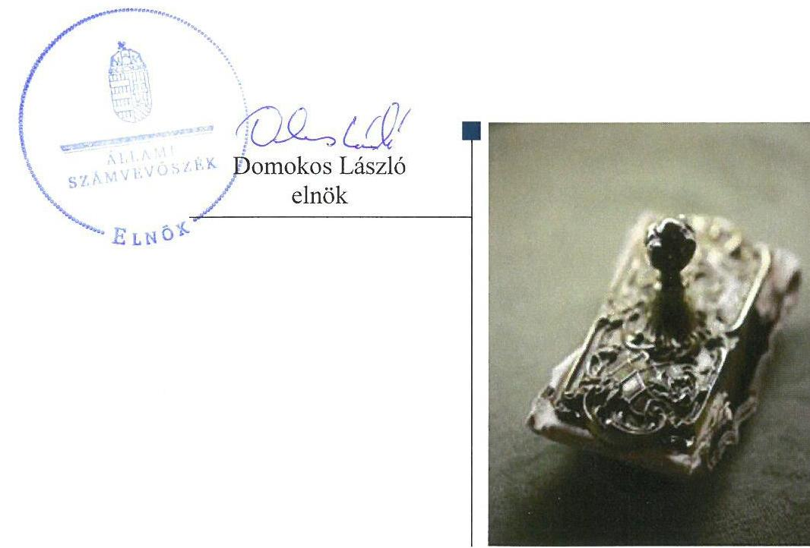
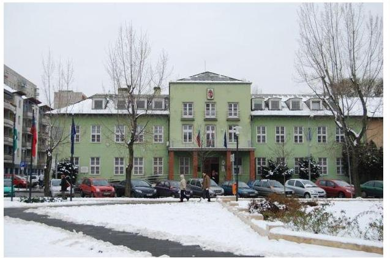
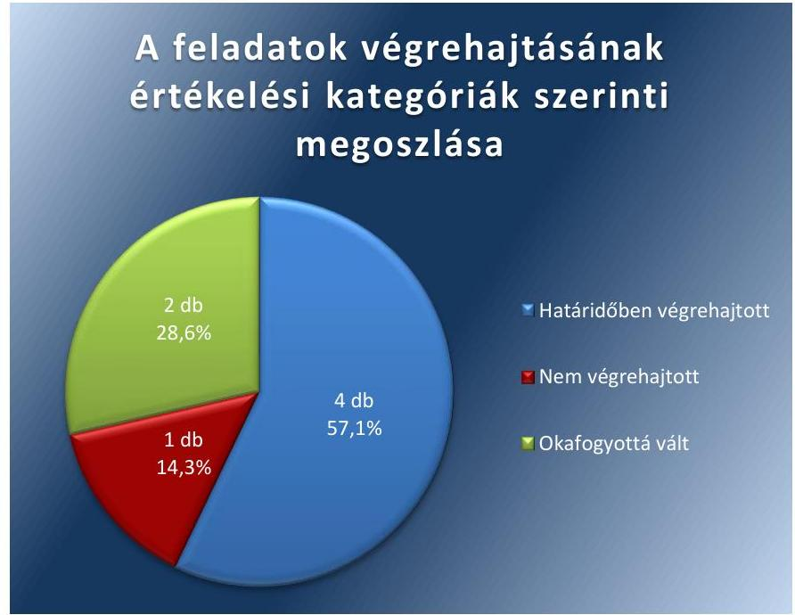

# Jelentés 

## Utóellenőrzések

Az önkormányzatok vagyongazdálkodása szabályszerűségének utóellenőrzése Budapest XXI. kerület Csepel Önkormányzata
2018. 04. hó 19. nap

---

# AZ ELLENŐRZÉST FELÜGYELTE: 

DR NÉMETH ERZSÉBET felügyeleti vezető

## AZ ELLENŐRZÉST VEZETTE ÉS A VÉGREHAJTÁSÁÉRT FELELŐS:

DÉZSINÉ KIS HAJNALKA ellenőrzésvezető

## A PROGRAM ÖSSZEÁLLÍTÁSÁÉRT FELELŐS:

TÓTPÁL SZABOLCS osztályvezető

## A TÉMÁHOZ KAPCSOLÓDÓ KORÁBBI SZÁMVEVŐSZÉKI JELENTÉSEK:

- címe: Jelentés az önkormányzati vagyongazdálkodás szabályszerűségi ellenőrzéséről-Budapest XXI. kerület Csepel
- sorszáma: 13086

IKTATÓSZÁM: V-1316-015/2018
TÉMASZÁM: 6
ELLENŐRZÉS-AZONOSÍTÓ SZÁM: V080416

---

# TARTALOMJEGYZÉK 

■ ÖSSZEGZÉS ..... 5
■ AZ ELLENŐRZÉS CÉLJA ..... 6
■ AZ ELLENŐRZÉS TERÜLETE ..... 7
■ AZ ELLENŐRZÉS HÁTTERE, INDOKOLTSÁGA ..... 8
■ A JELENTÉS LÉNYEGES KÉRDÉSKÖRE ..... 9
■ ELLENŐRZÉS HATÓKÖRE ÉS MÓDSZEREI ..... 10
■ MEGÁLLAPÍTÁSOK ..... 12
■ MELLÉKLETEK ..... 15
I. sz. melléklet: Budapest XXI. kerület Csepel Önkormányzata intézkedési tervének végrehajtása ..... 15
■ FÜGGELÉK: ÉSZREVÉTELEK ..... 19
■ RÖVIDÍTÉSEK JEGYZÉKE ..... 21

---

.

---

# ÖSSZEGZÉS 

Az utóellenőrzés megállapította, hogy Budapest XXI. kerület Csepel Önkormányzata az intézkedési tervben meghatározott feladatok többségét határidőben végrehajtotta, ennek eredményeként javult a vagyongazdálkodás szabályszerűsége és átláthatósága.

## Az ellenőrzés társadalmi indokoltsága

Az Állami Számvevőszék stratégiájában célul tűzte ki a számvevőszéki munka hasznosulásának javítását. Ezzel összhangban ellenőrzi, hogy az ellenőrzött szervezet megvalósította-e a korábbi ellenőrzései által feltárt hibák, hiányosságok és szabálytalanságok megszüntetése céljából elkészített intézkedési tervében foglaltakat. A rendszeres utóellenőrzések hozzájárulnak a szükséges intézkedések tényleges végrehajtásához, ezáltal a közpénzügyek rendezettségének javulásához.

## Főbb megállapítások, következtetések

Az Önkormányzat az ÁSZ által elfogadott intézkedési tervében meghatározott hét feladatból négyet határidőben, egyet nem hajtott végre és két feladat végrehajtása jogszabályi változás miatt okafogyottá vált.

Az Önkormányzat az intézkedési tervnek megfelelően évenként beszámoltatta a tulajdonában lévő ingatlanok kezelését végző Városgazda Zrt.-t a megállapodásban meghatározott feladatok végrehajtásáról, megtárgyalta és elfogadta az éves összefoglaló belső ellenőrzési jelentéseket, valamint évente közzétette elemi költségvetését és költségvetési beszámolóját a hivatalos honlapján. Ennek hatására javult a vagyongazdálkodás szabályszerűsége és átláthatósága.

Az Önkormányzat nem teremtette meg az egyezőséget az ingatlanvagyon kataszter adatai valamint a földhivatali és a számviteli nyilvántartás között, ami továbbra is kockázatot hordoz a vagyongazdálkodás szabályszerűsége és átláthatósága szempontjából.

A Jegyző vezette az intézkedési tervben rögzített feladatok végrehajtásáról szóló nyilvántartást a törvényi előírásnak megfelelően.

---

# AZ ELLENŐRZÉS CÉLJA 

Az ellenőrzés célja annak értékelése volt, hogy a számvevőszéki jelentésben foglalt intézkedést igénylő megállapításokkal összhangban készített intézkedési tervben meghatározott feladatokat az ellenőrzött szervezet végrehajtotta-e.

---

# AZ ELLENŐRZÉS TERÜLETE

## Budapest XXI. kerület Csepeli Önkormányzata

Budapest XXI. kerület Csepel állandó lakosainak száma 2016. január 1-jén a KSH1 adata alapján 76 911 fő volt.

A 2016. évi éves költségvetési beszámoló szerint a 2016. évben az Önkormányzat2 5 713 M Ft költségvetési kiadást teljesített és 13 844 M Ft költségvetési bevétellel gazdálkodott, 2016. december 31-én 72 967 M Ft értékű eszközvagyonnal rendelkezett.

A Polgármester3 2014 óta vezeti a 21 tagú Képviselő-testületet4, amely három állandó bizottságot hozott létre. A Jegyző5 személye az ellenőrzött időszakban nem változott.

Az ÁSZ6 2007. január 1. és a 2011. december 31. közötti időszakra vonatkozóan végezte el az Önkormányzat vagyongazdálkodása szabályszerűségének ellenőrzését és erről 2013. szeptember 12-én hozta nyilvánosságra az 13086-os számú ÁSZ jelentést.

Az ellenőrzés célja annak értékelése volt, hogy az Önkormányzatnál a vagyongazdálkodási tevékenység, annak szervezeti keretei szabályozottak voltak-e, a vagyongazdálkodás törvényessége, szabályszerűsége biztosított volt-e, a vagyon értékének és összetételének változását jogszerű döntésekkel alátámasztották-e, a belső ellenőrzés elősegítette-e a vagyongazdálkodás szabályszerű működését, valamint hasznosultak-e a korábbi külső ellenőrzések által tett javaslatok.

Az ÁSZ jelentés a Jegyző részére négy, a Polgármester részére három intézkedést igénylő megállapítást és javaslatot tartalmazott. Ez alapján a Polgármester az ÁSZ Elnökének megküldte az Önkormányzat hét feladatot tartalmazó, a Képviselő-testület által 540/2013. (IX.27.) számú határozattal jóváhagyott intézkedési tervét7.

Az ÁSZ jelentésben foglalt intézkedést igénylő megállapítások alapján készített intézkedési tervet az Állami Számvevőszék Elnöke 2013. december 14-én elfogadta.

Az utóellenőrzés a 2013. szeptember 12. és 2018. január 24. közötti ellenőrzött időszak alatt végrehajtott feladatok teljesítésének ellenőrzésére, értékelésére irányult.

---

# AZ ELLENŐRZÉS HÁTTERE, INDOKOLTSÁGA 

Az ÁSZ tv. ${ }^{8}$ 33. § (1) bekezdése értelmében a számvevőszéki jelentések intézkedést igénylő megállapításaihoz és javaslataihoz kapcsolódóan az ellenőrzött szervezet vezetője intézkedési tervet köteles összeállítani, és az Állami Számvevőszék részére megküldeni.

Az ÁSZ által befogadott intézkedési tervben foglaltak megvalósítását az ÁSZ törvény 33. § (7) bekezdésében foglaltak alapján - az Állami Számvevőszék utóellenőrzés keretében ellenőrizheti. Az utóellenőrzések keretében - az intézkedések értékelése során - az Állami Számvevőszék figyelembe veszi az ellenőrzött szervezetek működési feltételeiben, valamint a jogszabályi előírásokban bekövetkezett változásokat.

Az utóellenőrzés során az ÁSZ értékeli, hogy az érintett számvevőszéki jelentésben foglalt intézkedést igénylő megállapításokkal és javaslatokkal összhangban, az ellenőrzött szervezet által készített intézkedési tervben meghatározott feladatokat a feladatra kijelöltek végrehajtották-e.

Az intézkedések végrehajtásával az adott terület szabályszerű működése vonatkozásában a kockázatok csökkenhetnek, azonban hosszabb távon az intézkedési tervben foglaltak végrehajtásával önmagában nem szűnnek meg, csak akkor, ha beépülnek az ellenőrzött szervezet működésébe, azokat folyamatosan karban tartják, figyelembe véve, illetve kezelve a változásokat. Emellett az intézkedések végrehajtásáig újabb kockázatok merülhetnek fel a szabályszerű működés vonatkozásában, amelyek kezelése szintén kiemelten fontos az ellenőrzött szervezet számára.

Az ellenőrzött szervezet vezetője által készített intézkedési tervekben foglalt feladatok hiányos, illetve késedelmes végrehajtása, vagy annak elmaradása a szabályszerűség és a felelős vezetői magatartás vonatkozásában kockázatot hordoz, ami azt mutatja, hogy az ellenőrzések során feltárt hibák, hiányosságok és szabálytalanságok kezelése nem kapott kellő hangsúlyt. Az utóellenőrzés során is fennálló szabálytalanságok esetén a közpénz, közvagyon veszélyeztetettségi kockázat valószínűsített hatásának értékelése további intézkedéseket vonhat maga után.

Az ellenőrzött szervezet szintjén az utóellenőrzés feltárja, hogy a szervezet az intézkedések végrehajtásával hasznosította-e a korábbi ellenőrzési jelentésben a hiányosságok megszüntetése, illetve a kockázatok kezelése érdekében megfogalmazott javaslatokat, illetve az intézkedések végrehajtása elmaradásának következtében továbbra is fennálló szabálytalanság esetén értékeli a közpénzek, közvagyon veszélyeztetettségét.

Az ÁSZ szintjén az utóellenőrzés visszacsatolást ad az ellenőrzési jelentések hasznosulásáról, az intézkedések elmaradásának, vagy részleges megvalósulásának a közpénzek, közvagyon veszélyeztetettségére gyakorolt valószínűsített hatásának értékelése, további intézkedéseket vonhat maga után.

---

# A JELENTÉS LÉNYEGES KÉRDÉSKÖRE 

Az Önkormányzat az intézkedési tervben foglaltakat az előírt határidőben végrehajtotta-e?

---

# ELLENŐRZÉS HATÓKÖRE ÉS MÓDSZEREI 

## Az ellenőrzés típusa

Megfelelőségi ellenőrzés.

## Az ellenőrzött időszak

Az utóellenőrzés alapját képező ÁSZ jelentés közzétételének napjától (2013. szeptember 12.) az ellenőrzésről szóló kiértesítő levél keltének napjáig (2018.01.24.) tartó időszak

## Az ellenőrzés tárgya

Az ÁSZ tv. 2011. július 1-jei hatálybalépését követően a számvevőszéki jelentésben foglalt intézkedést igénylő megállapításokkal összhangban - az Önkormányzat által - készített Intézkedési tervben foglaltak végrehajtásának ellenőrzése.

## Az ellenőrzött szervezet

Budapest XXI. kerület Csepel Önkormányzata, Budapest Főváros XXI. kerület Csepeli Polgármesteri Hivatal.

## Az ellenőrzés jogalapja

Az ellenőrzés jogszabályi alapját az ÁSZ tv. 33. § (7) bekezdése képezi.

## Az ellenőrzés módszerei

Az ellenőrzést az ellenőrzött időszakban hatályos jogszabályok, az ellenőrzés szakmai szabályai, a jelen ellenőrzésre irányadó ÁSZ módszertanok, az ellenőrzési programban foglalt értékelési szempontok szerint, végeztük.

Az ellenőrzés ideje alatt az Önkormányzattal történő kapcsolattartást az ÁSZ SZMSZ-ének vonatkozó előírásai alapján biztosítottuk.

Az utóellenőrzés megállapításait az ÁSZ rendelkezésére álló, valamint az ÁSZ adatbekérése szerint, az Önkormányzat által rendelkezésre bocsátott dokumentumok alapozták meg.

Az ellenőrzési bizonyítékként felhasználható adatforrások közé tartoztak egyrészt az ellenőrzési program részletes szempontjainál felsorolt

---

adatforrások, másrészt minden - az ellenőrzés folyamán feltárt, az ellenőrzés szempontjából információt tartalmazó dokumentum.

Az intézkedési tervekben előírt feladatokat azok végrehajthatósága, illetve végrehajtása szempontjából az alábbiak szerint értékeltük:
$\longrightarrow$ „határidőben végrehajtott" a feladat, ha a teljesítés dokumentáltan, az intézkedési tervben előírt határidőben és tartalommal megtörtént;
$\longrightarrow$ „határidőn túl végrehajtott" a feladat, ha annak teljesítése az intézkedési tervben meghatározott módon, de az előírt határidőn túl történt meg;
$\longrightarrow$ „részben végrehajtott" a feladat, ha végrehajtása teljes körűen az intézkedési tervben előírt módon nem történt meg;
$\longrightarrow$ „nem végrehajtott" a feladat, ha a végrehajtás nem történt meg, vagy amennyiben a teljesítést nem dokumentálták;
$\longrightarrow$ „okafogyottá vált" a feladat, ha végrehajtására - meghatározott esemény bekövetkezése, továbbá külső körülmény, a működést érintő feltétel változása miatt - már nincs szükség, illetve lehetőség, és egyértelműen megállapítható, hogy az intézkedést szükségessé tevő körülmény a jövőben nem fordulhat elő;
$\longrightarrow$ „nem időszerű" az a feladat, amelynek ellenőrzési időszakon belüli végrehajtására azért nem került (kerülhetett) sor, mert az intézkedés alapjául szolgáló esemény nem következett be, de annak jövőbeni előfordulása lehetséges, a végrehajtása nem volt esedékes, vagy a végrehajtás határideje még nem járt le.
Az ellenőrzés lefolytatásához az Önkormányzat a tanúsítványok elektronikus kitöltésével, valamint az ÁSZ által kért dokumentumok elektronikus megküldésével szolgáltatott adatokat, amelyek valódiságát és teljes körűségét az ellenőrzött szervezet vezetője által tett teljességi és hitelességi nyilatkozat igazolja. Az így rendelkezésre bocsátott adatok, információk kontrollja az ellenőrzés keretében megtörtént.

---

# MEGÁLLAPÍTÁSOK 

## Az Önkormányzat az intézkedési tervben foglaltakat az előírt határidőben végrehajtotta-e?

Összegző megállapítás

Az Önkormányzat az intézkedési tervben szereplő hét feladatból négyet határidőben, egyet nem hajtott végre, két feladat okafogyottá vált. Az intézkedési tervben meghatározott feladatok végrehajtásáról az előírásoknak megfelelően vezették a nyilvántartást.

Az Önkormányzat az általa elkészített, és az ÁSZ által elfogadott intézkedési tervben meghatározott feladatok közül négyet határidőben, egyet nem hajtott végre. Két feladat végrehajtása jogszabályváltozás miatt okafogyottá vált

A feladatokat, határidőket, megjelölt felelősöket és a feladatok végrehajtását az I. sz. melléklet mutatja be.

A Jegyző gondoskodott az intézkedési tervben meghatározott feladatok végrehajtásának Bkr. ${ }^{9}$ szerinti nyilvántartásáról.

Az Önkormányzat intézkedési tervében vállalt feladatok végrehajtását az 1. ábra szemlélteti.

1. ábra

Fonrás: ÁSZ

---

# HATÁRIDŐBEN VÉGREHAJTOTT FELADATOK: 

$\qquad$ 1. A Városgazda Zrt. vezérigazgatója évente beszámolt az Önkormányzattal kötött vagyonkezelési megállapodásban meghatározottak végrehajtásáról a Képviselő-testület előtt, melyet a Képviselő-testület határozatban elfogadott.
$\qquad$ 2. A belső ellenőrzési vezető a törvényi előírásnak és az intézkedési tervnek megfelelően évente elkészítette az összefoglaló belső ellenőrzési jelentéseket - utólagosan a 2011. évről is - amelyeket a Képviselő-testület megtárgyalt és elfogadott.
$\qquad$ 3. Az Önkormányzat az ellenőrzött időszakban folyamatosan eleget tett a gazdálkodással kapcsolatos közzétételi kötelezettségének az Önkormányzat hivatalos honlapján az intézkedési tervnek és a jogszabálynak megfelelően. A 2007-2011. évi adatokat utólagosan közzétette.
$\qquad$ 4. Az Önkormányzat a jogszabálynak megfelelően intézkedett, hogy a költségvetésében meghatározott felújítások és beruházások vonatkozásában a kötelezettségvállalás csak a hatályos kötelezettségvállalási szabályzat alapján történhet, és a Városgazda Zrt. saját nevében nem vállal kötelezettséget.

## NEM VÉGREHAJTOTT FELADAT:

$\qquad$ 5. Az Önkormányzat az intézkedési terv és a 147/1992. ${ }^{10}$ Kormányrendelet ellenére nem teremtette meg az egyezőséget az ingatlanvagyon kataszter adatai valamint a földhivatali és számviteli nyilvántartás között.

## OKAFOGYOTTÁ VÁLT FELADATOK:

$\qquad$ 6. A jogszabályi környezet változása miatt a víziközművek Önkormányzat tulajdonába való visszakerülése okafogyottá vált, mivel az új Vksz. ${ }^{11}$ törvény alapján a víziközmű 2013.
 január 1-jén az ivóvíz-ellátásért felelős Fővárosi Önkormányzat tulajdonába került.
$\qquad$ 7. Lásd 6. megállapítás.

---

.

---

# MELLÉKLETEK

- I. SZ. MELLÉKLET: BUDAPEST XXI. KERÜLET CSEPEL ÖNKORMÁNYZATA INTÉZKEDÉSI TERVÉNEK VÉGREHAJTÁSA

|  1. | Intézkedési terv alapján elvégzendő feladat | Az intézkedési tervben meghatározott határidő | Az intézkedési tervben meghatározott felelős |
| --- | --- | --- | --- |
|   | 1. | 2. | 3.  |
|  Határidőben végrehajtott feladatok |  |  |   |
|  1. | „Az Önkormányzat vagyonáról és a vagyona feletti tulajdonosi jogok gyakorlásáról szóló hatályos önkormányzati rendeletben rögzítettek alapján a Városgazda Zrt.-vel kötött vagyonkezelési megállapodásban meghatározottak végrehajtása teljesítéséről a Városgazda Zrt. vezetője évente beszámol a polgármesternek, aki erről tájékoztatja a Képviselő-testületet." | 2013. november majd évente április 30. | Jegyző  |
|  2. | „A belső ellenőrzési vezető folyamatosan tegyen eleget a Bkr. 22. §-a (1) bekezdés g) pontjában meghatározott előírásnak, azzal, hogy az összefoglaló éves ellenőrzési jelentést elkészíti. A Képviselő-testület utólagos tájékoztatása a 2011. évi ellenőrzésekről." | 2013. november 30. majd folyamatos | Jegyző  |
|  3. | „Az információs önrendelkezési jogról és az információszabadságról szóló 2011. évi CXII. törvény 1. számú mellékletében meghatározottak alapján folyamatosan eleget kell tenni az önkormányzat honlapján a gazdálkodással kapcsolatos közzétételi kötelezettségnek. A 18/2005. (XII. 27.) | 2013. szeptember 30. | Jegyző  |

A Jegyző gondoskodott az Info tv ${ }^{12}$. 1. melléklet III. pontjában előírt gazdálkodási adatok folyamatos közzétételéről az Önkormányzat hivatalos honlapján. Továbbá a Jegyző intézkedett az IHM rendelet ${ }^{13}$ 2. melléklet 3.2. pontjában előírtak szerint közzétételi egységenként (intézményenként) az éves költségvetések és a beszámolók közzétételéről. A gazdálkodással kapcsolatos 2007-2011. évi adatok - az intézkedési tervben előírt határidőt betartva - utólagos közzététele is megtörtént

---

|  4. | Intézkedési terv alapján elvégzendő feladat | Az intézkedési tervben meghatározott határidő | Az intézkedési tervben meghatározott felelős | Az intézkedési tervben meghatározott feladat végrehajtása  |
| --- | --- | --- | --- | --- |
|  5. | IHM rendelet 2. számú melléklete 3.2. pontjában meghatározottak alapján gondoskodni kell a gazdálkodással kapcsolatos 2007-2011. évi adatok (elemi költségvetések, és a költségvetés végrehajtásáról készített beszámolók) utólagos közzétételéről." |  |  |   |
|  4. | „Az Önkormányzat költségvetésében jóváhagyott - a Városgazda Zrt. bonyolításában végzett - valamennyi beruházási és felújítási munkák kiadási előirányzata tekintetében az előzetes kötelezettségvállalásra az Ávr. 52. § (6) bekezdésében előírtak alapján készített hatályos Kötelezettségvállalási Szabályzat alapján kerülhet sor. Pénzügyi teljesítés csak előzetes kötelezettségvállalás alapján történhet." | folyamatos | Jegyző | Az Önkormányzat a jogszabálynak megfelelően intézkedett, hogy a költségvetésében meghatározott felújítások és beruházások vonatkozásában a kötelezettségvállalás csak a hatályos kötelezettségvállalási szabályzat alapján történhet, és a Városgazda Zrt. saját nevében nem vállal kötelezettséget.  |
|  5. | Nem végrehajtott feladat |  |  |   |
|  5. | „Az önkormányzati ingatlanvagyon kataszter adatai egyezőségének a megteremtése a földhivatali ingatlan-nyilvántartás azonos tartalmú adataival, továbbá az ingatlanvagyon kataszter adatai és a számviteli nyilvántartásban szereplő ingatlanok bruttó értéke egyezőségének a biztosítása a 147/1992. (XI. 6) Korm. rendelet 1. §-ában meghatározottak alapján." | 2013. december 31. | Jegyző | A Jegyző 2014. március 4-i beszámolója szerint az önkormányzati ingatlanvagyon kataszter és a földhivatali ingatlan-nyilvántartás, valamint a számviteli nyilvántartás adatainak egyezőségét 2013. december 31-ig nem sikerült megvalósítani.
Az Önkormányzat tett intézkedéseket a feladat végrehajtása érdekében, azonban az ingatlanvagyon nyilvántartások egyezőségének megteremtését a 147/1992. (XI. 6) Korm. rendelet 1. §-ában előírtak ellenére 2016. december 31-ére sem biztosították.  |

---

|  5. | Intézkedési terv alapján elvégzendő feladat | Az intézkedési tervben meghatározott határidő | Az intézkedési tervben meghatározott felelős | Az intézkedési tervben meghatározott feladat végrehajtása  |
| --- | --- | --- | --- | --- |
|  6. | „A vízgazdálkodásról szóló 1995. évi LVII. törvény 10. § (1) bekezdése érvényesülésének érdekében intézkedni kell a térítés nélkül tulajdonba adott víziközművek tekintetében az önkormányzati tulajdonba való visszakerülés lebonyolításáról, a Fővárosi Vízművek Zrt. bevonásával." | 2013.november 30 | Jegyző | A jogszabályi környezet változása miatt az intézkedési terv alapján elvégzendő feladat végrehajtása okafogyottá vált. A Vksztv. 79. § (1) bekezdésében foglaltak alapján, a nemzeti vagyonba tartozó víziközmű 2013. január 1-jén az ellátásért felelős tulajdonába került. Az ivóvíz-ellátás a Mötv. ${ }^{14}$ 23. § (1) és (4) bekezdéseiben foglaltak szerint a fővárosi önkormányzat feladata, így az érintett vízi közmű tulajdonjoga a fővárosi önkormányzaté. Mindezekre való tekintettel a víziközmű Önkormányzat tulajdonába kerülésére vonatkozó feladat okafogyottá vált.  |
|  7. | „A vízgazdálkodásról szóló 1995. évi LVII. törvény 10. § (1) bekezdése érvényesülésének érdekében intézkedni kell a térítés nélkül tulajdonba adott víziközművek tekintetében az önkormányzati tulajdonba való visszakerülés lebonyolításáról, a Fővárosi Vízművek Zrt. bevonásával. A korábban megkötött térítésmentes vagyonátadási szerződések használatba adási szerződéssé alakításának jogi, majd ezt követően számviteli rendezése." | 2013.november 30 | Jegyző | A jogszabályi környezet változása miatt az intézkedési terv alapján elvégzendő feladat végrehajtása okafogyottá vált. A Vksztv. 79. § (1) bekezdésében foglaltak alapján, a nemzeti vagyonba tartozó víziközmű 2013. január 1-jén az ellátásért felelős tulajdonába került. Az ivóvíz-ellátás a Mötv. 23. § (1) és (4) bekezdéseiben foglaltak szerint a fővárosi önkormányzat feladata, így az érintett víziközmű tulajdonjoga a fővárosi önkormányzaté. Mindezekre való tekintettel a víziközmű Önkormányzat tulajdonába kerülésére vonatkozó feladat okafogyottá vált.  |

---

.

---

# FÜGGELÉK: ÉSZREVÉTELEK 

A jelentéstervezetet a Számvevőszék 15 napos észrevételezésre megküldte az ellenőrzött szervezet vezetőjének az ÁSZ tv. 29. §* (1) bekezdése előírásának megfelelően.

Budapest XXI. kerület Csepel Önkormányzat polgármestere a jelentéstervezet megállapításaira nem tett észrevételt.

[^0]
[^0]:    * 29. § (1) Az Állami Számvevőszék az ellenőrzési megállapításait megküldi az ellenőrzött szervezet vezetőjének vagy az általa megbízott személynek, és annak, akinek személyes felelősségét állapította meg.
    (2) Az ellenőrzött szervezet vezetője és a felelősként megjelölt személy az ellenőrzés megállapításaira tizenöt napon belül írásban észrevételt tehet.
    (3) Az Állami Számvevőszék az észrevételre a beérkezésétől számított harminc napon belül írásban válaszol. A figyelembe nem vett észrevételeket köteles a jelentésben feltüntetni, és megindokolni, hogy azokat miért nem fogadta el.

---

.

---

# RÖVIDÍTÉSEK JEGYZÉKE 

${ }^{1}$ KSH
${ }^{2}$ Önkormányzat
${ }^{3}$ Polgármester
${ }^{4}$ Képviselő-testület
${ }^{5}$ Jegyző
${ }^{6}$ ÁSZ
${ }^{7}$ Intézkedési terv
${ }^{8}$ ÁSZ tv.
${ }^{9}$ Bkr.
${ }^{10}$ 147/1992. (XI. 6.) Kormányrendelet
${ }^{11}$ Vksztv.
${ }^{12}$ Info tv.
${ }^{13}$ IHM rendelet
${ }^{14}$ Mötv.

Központi Statisztikai Hivatal Magyarország Közigazgatási Helynévkönyve (2016. január 1.)
Budapest Főváros XXI. Kerület Önkormányzata
Budapest Főváros XXI. Kerület Önkormányzat Polgármestere
Budapest Főváros XXI. Kerület Önkormányzat Képviselő-testülete
Budapest Főváros XXI. Kerület Önkormányzat Polgármesteri Hivatal Jegyzője
Állami Számvevőszék
Budapest Főváros XXI. kerület Csepel Önkormányzata 540/2013. (IX.27.) számú Határozattal elfogadott intézkedési terve
az Állami Számvevőszékről szóló 2011. évi LXVI. törvény
a költségvetési szervek belső kontrollrendszeréről és belső ellenőrzéséről szóló 370/2011. (XII. 31.) Korm. rendelet
az önkormányzatok tulajdonában lévő ingatlanvagyon nyilvántartási és adatszolgáltatási rendjéről szóló 147/1992. (XI. 6.) Kormányrendelet
a víziközmű-szolgáltatásról szóló 2011. évi CCIX. törvény (hatályos: 2011. december 31-től, a 79. § hatályos: 2012. július 15-től)
az információs önrendelkezési jogról és az információszabadságról szóló 2011. évi CXII. törvény (hatályos: 2011. 07. 26-ától)
a közzétételi listákon szereplő adatok közzétételéhez szükséges közzétételi mintákról szóló 18/2005. (XII.27.) IHM rendelet
Magyarország helyi önkormányzatairól szóló 2011. évi CLXXXIX. törvény

---

# ÁLLAMI SZÁMVEVŐSZÉK 

1052 Budapest, Apáczai Csere János utca 10.
Levélcím: 1364 Budapest 4. Pf. 54
Telefon: +36 14849100 Telefax: +36 14849200
www.asz.hu
