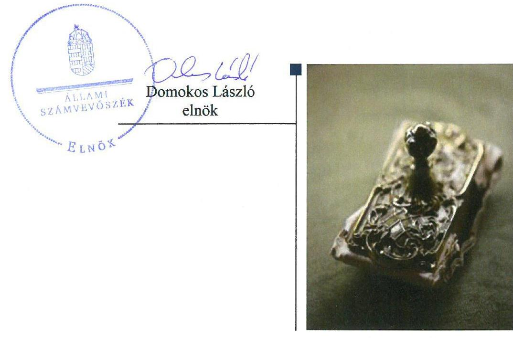
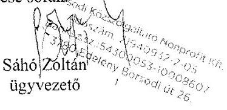
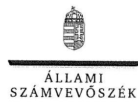
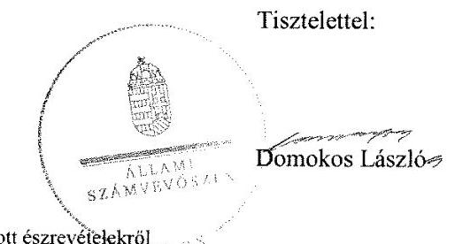
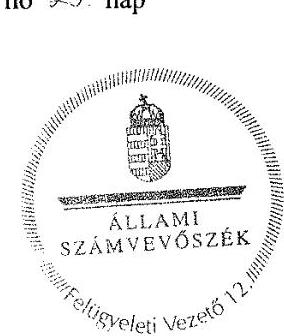

# Jelentés 

## Az önkormányzatok gazdasági társaságai

Az önkormányzatok többségi tulajdonában lévő gazdasági társaságok gazdálkodásának ellenőrzése - Borsodi Közszolgáltató Szolgáltató Nonprofit Kft.
2018.

---

# Jelentés 

## Az önkormányzatok gazdasági társaságai

Az önkormányzatok többségi tulajdonában lévő gazdasági társaságok gazdálkodásának ellenőrzése - Borsodi Közszolgáltató Szolgáltató Nonprofit Kft.
2018. 06. hó 10. nap

---

# AZ ELLENŐRZÉST FELÜGYELTE:

- PETŐ KRISZTINA felügyeleti vezető
- AZ ELLENŐRZÉST VEZETTE ÉS A VÉGREHAJTÁSÁÉRT FELELŐS:
  - SALAMIN VIKTOR ellenőrzésvezető
  - A PROGRAM ÖSSZEÁLLÍTÁSÁÉRT FELELŐS:
    - TÓTPÁL SZABOLCS osztályvezető

**IKTATÓSZÁM:** EL-0551-011/2018.

**TÉMASZÁM:** 2447

**ELLENŐRZÉS-AZONOSÍTÓ SZÁM:** V079338

Jelentéseink az Országgyűlés számítógépes hálózatán és az Interneten a www.asz.hu címen is olvashatóak.

---

# TARTALOMJEGYZÉK 

■ ÖSSZEGZÉS ..... 5
■ AZ ELLENŐRZÉS CÉLJA ..... 6
■ AZ ELLENŐRZÉS TERÜLETE ..... 7
■ AZ ELLENŐRZÉS HÁTTERE, INDOKOLTSÁGA ..... 8
■ A JELENTÉS LÉNYEGES KÉRDÉSKÖREI ..... 9
■ AZ ELLENŐRZÉS HATÓKÖRE ÉS MÓDSZEREI ..... 10
■ MEGÁLLAPÍTÁSOK ..... 12
■ JAVASLATOK ..... 15
■ MELLÉKLETEK ..... 17
I. sz. melléklet: Értelmező szótár ..... 17
■ FÜGGELÉK: ÉSZREVÉTELEK ..... 19
■ RÖVIDÍTÉSEK JEGYZÉKE ..... 27

---

.

---

# ÖSSZEGZÉS 

A Borsodi Közszolgáltató Szolgáltató Nonprofit Kft. gazdálkodása, valamint vagyongazdálkodása nem volt szabályszerű, így nem biztosították az elszámoltathatóságot és az átláthatóságot. A Társaság tevékenysége a 2013-2016. években az államadósságot nem növelte.

## Az ellenőrzés társadalmi indokoltsága

Magyarországon az önkormányzatok kötelező és önként vállalt feladataik vonatkozásában is egyre szélesebb körben alkalmazzák a költségvetésen kívüli feladatellátást, ezáltal - a nonprofit szervezetek mellett - az önkormányzati tulajdonú gazdasági társaságok is kiemelt fontosságú szerephez jutottak. Az önkormányzatok többségi tulajdonában álló gazdasági társaságok ellenőrzése kiemelten fontos a vagyon megőrzése, megóvása érdekében. A feladatellátás költségeinek, ráfordításainak alakulása a lakosság széles rétegét érinti.

Az Állami Számvevőszék az ellenőrzése során arra kereste a választ, hogy 2013-2016. között szabályszerű volt-e a Borsodi Közszolgáltató Szolgáltató Nonprofit Kft. gazdálkodása és Edelény Város Önkormányzata ehhez kapcsolódó tulajdonosi joggyakorlása. A Társaság településüzemeltetési, lakás-és helységgazdálkodási feladatokat látott el, mely tevékenysége keresztül a város lakosságának széles köre kerülhet kapcsolatba a Társasággal és az általa nyújtott szolgáltatásokkal. Bízunk abban, hogy a jelentésben foglalt megállapítások és az ezek alapján megfogalmazott számvevőszéki javaslatok hasznosítása elősegíti a feltárt hiányosságok orvoslását.

## Főbb megállapítások, következtetések, javaslatok

A Társaság gazdálkodása és vagyongazdálkodása nem volt szabályszerű. A Társaság a jogszabályi követelmények szerinti gazdálkodás alapvető feltételeit nem alakította ki, mert számlarenddel nem rendelkezett. Az éves beszámolók mérlegtételeit leltár nem támasztotta alá. A Társaságnál a bevételek és ráfordítások elszámolása nem volt szabályszerű. Mindezek alapján a gazdálkodás, valamint a vagyongazdálkodás elszámoltathatóságát és átláthatóságát nem biztosították.

A Társaság a jogszabályban előírt közérdekű adatok és közérdekből nyilvános adatok megismerését nem biztosította, ezért a működése nem volt átlátható.

A Borsodi Közszolgáltató Szolgáltató Nonprofit Kft.-nek 2013-2016. években adósságot keletkeztető ügylete nem volt, így az államadósságot nem növelte.

A megállapítások alapján az ÁSZ a Borsodi Közszolgáltató Szolgáltató Nonprofit Kft. ügyvezetőjének tíz javaslatot fogalmazott meg, amelyekre a javaslat címzettjének 30 napon belül intézkedési tervet kell készíteniük.

---

# AZ ELLENŐRZÉS CÉLJA 

AZ ELLENŐRZÉS CÉLJA annak értékelése volt, hogy az Önkormányzat ${ }^{1}$ vagyongazdálkodási tevékenysége során szabályszerűen gyakorolta-e tulajdonosi jogait; a Társaság ${ }^{2}$ szabályozottsága, gazdálkodása és vagyongazdálkodási tevékenysége, bevételeinek és ráfordításainak elszámolása megfelelt-e a jogszabályi és tulajdonosi előírásoknak, a gazdálkodás átláthatósága és elszámoltathatósága érdekében biztosítva volt-e a szolgáltatás díjának megalapozottsága szabályszerű önköltségszámítással. Az ellenőrzés célja továbbá annak megítélése volt, hogy a kormányzati szektorba sorolt önkormányzati tulajdonban (résztulajdonban) lévő gazdálkodó szervezetek gazdálkodásának a kormányzati szektor hiányára és az államadósságra befolyással bíró elemei a jogszabályi előírásoknak megfeleltek-e.

---

# **AZ ELLENŐRZÉS TERÜLETE**

## **Edelény Város Önkormányzata és a Borsodi Közszolgáltató Szolgáltató Nonprofit Kft.**

**EDELÉNY VÁROS ÖNKORMÁNYZATA** a Társaságot – a Borsodi Közszolgáltató Szolgáltató Kht. jogutódjaként – 2008. május 28-án 10 M Ft törzstőkével alapította, mely törzstőke az ellenőrzött időszakban nem változott. A Társaság az Önkormányzat 100%-os tulajdonában volt.

Nem került sor az Önkormányzat részéről a Társaság által felvett hitelhez, egyéb kötelezettségvállaláshoz kapcsolódó garancia és kezességvállalásra.

Az Önkormányzatnak más gazdasági társaságban nem volt részesedése. A polgármester³ személye az ellenőrzött időszakban nem, az ügyvezető⁴ személye 2014. évben változott.

**A TÁRSASÁG** közhasznú jogállású szervezetként működött, főtevékenysége lakó- és nem lakóépület építése volt, a közfeladatain túl vállalkozási tevékenységet is folyatott. Üzemeltetési szerződés alapján az önkormányzat tulajdonában lévő ingatlanok – utak, járdák, parkolók, parkok, közterületek, sporttelep és játszótér – üzemeltetési, kezelési és karbantartási feladatokat látott el. Az Önkormányzat rendelete alapján lakás- és helyiséggazdálkodási feladatokat látott el, 2015. évtől rendezvényszervezési feladatokat is végzett. A Társaság 2015. december 30-tól kormányzati szektorba sorolt társaságnak minősült.

A foglalkoztatottak átlagos statisztikai létszáma 2013-ban 13 fő 2016-ban 12 fő volt. A közfoglalkoztatási programok keretében az ellenőrzött időszakban átlagosan 245 főt foglalkoztatott.

A Társaság saját vagyonával gazdálkodott, vagyonkezelt vagyona nem volt, vagyonkezelési szerződést nem kötött. A Társaság az önköltség rendjére vonatkozó szabályzat készítésének kötelezettsége alól a Számv. tv.⁵ előírásai alapján mentesült. A Társaságnak 2013–2016. években adósságot keletkeztető ügylete nem volt.

---

# AZ ELLENŐRZÉS HÁTTERE, INDOKOLTSÁGA 

AZ ÖNKORMÁNYZATOK TÖBBSÉGI TULAJDONÁBAN ÁLLÓ GAZDASÁGI TÁRSASÁGOK ellenőrzése kiemelten fontos a vagyon megőrzése, megóvása érdekében, valamint a kormányzati szektor elszámolásaiban megjelenő önkormányzati tulajdonú gazdálkodó szervezetek esetében, amelyekkel szemben alapvető követelmény, hogy gazdálkodásuk, működésük szabályszerű, az általuk szolgáltatott adatok minél megbízhatóbbak legyenek. A feladatellátás költségeinek, ráfordításainak alakulása a lakosság széles rétegét érinti.

Ellenőrzéseink feltárhatják, hogy az önkormányzat a feladatellátásához rendelt vagyon működtetését a tulajdonostól elvárható gondossággal végezte-e, a feladatot ellátó gazdasági társaság a létesítő okiratban, szolgáltatási szerződésben foglaltak betartásával biztosította-e a feladat ellátását. Az ellenőrzés eredményeképp meghatározhatóvá válnak a költségvetési hiányt befolyásoló szervezetek kockázatai, lehetővé válik ezen kockázatok csökkentése. Az ellenőrzés rávilágíthat arra, hogy a gazdasági társaság a vagyon használatával biztosította-e a szolgáltatás folytatásának feltételeit, az önkormányzat tulajdonosi felügyelete hozzájárult-e a szabályszerű gazdálkodáshoz és feladatellátáshoz. A megállapítások alapján megfogalmazott számvevőszéki javaslatok hasznosítása elősegítheti a meglévő hibák megszüntetését. A jó gyakorlatok bemutatásával az ÁSZ ${ }^{6}$ hozzájárulhat a követendő megoldások megismertetéséhez, terjesztéséhez.

---

# A JELENTÉS LÉNYEGES KÉRDÉSKÖREI 

1. Az önkormányzat tulajdonosi joggyakorlása szabályszerű volt-e?
2. A gazdasági társaság szabályozottsága, gazdálkodása és vagyongazdálkodási tevékenysége szabályszerű volt-e?
3. A gazdasági társaság beszámolási, adatszolgáltatási és közzétételi kötelezettségét teljesítette-e?

---

# AZ ELLENŐRZÉS HATÓKÖRE ÉS MÓDSZEREI 

## Az ellenőrzés típusa

Megfelelőségi ellenőrzés.

## Az ellenőrzött időszak

Az ellenőrzött időszak 2013. január 1-jétől 2016. december 31-ig tartott.

## Az ellenőrzés tárgya

Edelény Város Önkormányzata kizárólagos tulajdonában lévő Borsodi Közszolgáltató Szolgáltató Nonprofit Kft. feletti tulajdonosi joggyakorlása, valamint a Borsodi Közszolgáltató Szolgáltató Nonprofit Kft. gazdálkodásának szabályozottsága és szabályszerűsége.

Az ellenőrzés kiterjedt minden olyan körülményre és adatra, amely az ÁSZ jogszabályban meghatározott feladatainak teljesítéséhez, valamint a program végrehajtása folyamán felmerült újabb összefüggések feltárásához szükséges.

## Az ellenőrzött szervezet

Edelény Város Önkormányzata, valamint Borsodi Közszolgáltató Szolgáltató Nonprofit Kft.

## Az ellenőrzés jogalapja

Az ellenőrzés jogszabályi alapját az ÁSZ tv. ${ }^{7}$ 1. § (3) bekezdése és 5. § (3)(5) bekezdései képezték.

## Az ellenőrzés módszerei

Az ellenőrzést az ellenőrzési program ellenőrzési kérdései, az ellenőrzött időszakban hatályos jogszabályok, az ellenőrzés szakmai szabályok és módszertanok figyelembe vételével végeztük.

Az ellenőrzés ideje alatt az ellenőrzött szervezettel történő kapcsolattartást az ÁSZ Szervezeti és Működési Szabályzatának vonatkozó előírásai alapján biztosítottuk.

Az ellenőrzési kérdések megválaszolásához szükséges bizonyítékok megszerzése a következő ellenőrzési eljárások alkalmazásával történt:

---

megfigyelés, kérdésfeltevés (információkérés), összehasonlítás, valamint elemző eljárás. Az ellenőrzési bizonyítékként felhasználható adatforrások közé tartoztak egyrészt az ellenőrzési programban felsorolt adatforrások, másrészt adatforrás lehet még minden - az ellenőrzés folyamán - feltárt, az ellenőrzés szempontjából információkat tartalmazó dokumentum.

Az ellenőrzést a kérdésekre adott válaszok kiértékelésével, valamint a megjelölt adatforrások, a csatolt tanúsítványok felhasználásával, továbbá az adott időszakban hatályos jogszabályok figyelembe vételével folytattuk le.

A személyi jellegű ráfordítások elszámolásait, valamint a vagyonnyilvántartás terén a szabályszerű működést mintavétellel ellenőriztük. A minták kiválasztása rétegzett mintavétel alkalmazásával történt. A mintavétellel ellenőrzött területek esetében minden egyes tétel vonatkozásában a szabályszerűségre vonatkozó kérdéseket tettünk fel. Megfelelőnek értékeltünk egy ellenőrzött területet, amennyiben 95\%-os bizonyossággal a teljes sokaságban a hibaarány legfeljebb 10\%, nem megfelelőnek, amennyiben 10\%-nál magasabb arányt képviselt. Abban az esetben, ha a teljes sokaság tekintetében a 10\%-os hibaarányhoz való viszony megítélésének megbízhatósága nem érte el a 95\%-ot, annak elérése érdekében értékelésünket további szempontokkal egészítettük ki, és figyelembe vettük a feltárt hibák típusát és súlyát. A vagyonnyilvántartásra vonatkozó véletlen mintavételt kockázati alapú kiválasztással egészítettük ki, amelynek során évente a három legnagyobb összegű tételt választottuk ki.

---

# 1. Az önkormányzat tulajdonosi joggyakorlása szabályszerű volt-e? 

Összegző megállapítás

A tulajdonosi jogok gyakorlása szabályszerű volt.
A TULAJDONOSI JOGGYAKORLÁS RENDJÉT az Önkormányzati SZMSZ ${ }_{1,2}{ }^{8}$-ben, a Vagyonrendeletben ${ }^{9}$, a Társaság Alapító okiratá ${ }_{1-7}{ }^{10}$-ban szabályozta.

Gazdasági program ${ }_{1,2}{ }^{11}$-t az Ötv. ${ }^{12}$, valamint az Mötv. ${ }^{13}$ előírása szerint az Önkormányzat megalkotta és a Képviselő-testület ${ }^{14}$ elfogadta.

Közép- és hosszú távú vagyongazdálkodási tervkészítési ${ }^{15}$ kötelezettségének az Önkormányzat az Nvtv. ${ }^{16}$ előírásának megfelelően eleget tett.

Az Önkormányzat a tulajdonában lévő ingatlanok, közterületek üzemeltetésével, kezelésével, karbantartásával kapcsolatos feladatokat a Társasággal kötött Üzemeltetési szerződés ${ }_{1-3}{ }^{17}$-ban meghatározta. Az Önkormányzat az Ltv. ${ }^{18} 3$. § és a 36. §-ainak előírásainak megfelelően megalkotta a lakbérrendeletét ${ }^{19}$, az Ltv. 54. § előírásának megfelelően a lakásrendeletét ${ }_{1,2}{ }^{20}$.

A TULAJDONOSI JOGOKAT a Képviselő-testület gyakorolta, a Társaság ügyvezetésének ellenőrzésére a Taktv. ${ }^{21} 4$. § (2) bekezdésének megfelelve három tagú FB${ }^{22}$-ot hozott létre.

A Képviselő-testület a Társaság 2013-2016. éves egyszerűsített éves beszámolója és közhasznúsági mellékletének elfogadásáról a Ptk. ${ }^{23}$ és az Alapító okirat ${ }_{1-7}$ előírásainak megfelelően az FB írásbeli jelentése birtokában döntött. A 2015. éves beszámolót a Képviselő-testület a Számv. tv. 153. § (1) bekezdésében előírt határidőn túl, 2016. június 13-án hagyta jóvá. A Társaság egyszerűsített éves beszámolóihoz a Gt. ${ }^{24}$ és a Ptk. előírásainak megfelelően a könyvvizsgálói jelentések rendelkezésre álltak.

BELSŐ ELLENŐRZÉST az Önkormányzat a 2015. évben folytatott le a Társaságnál, melynek során szabályzatok, pénzügyi elszámolások, számviteli nyilvántartások szabályszerűségét ellenőrizte. A belső ellenőrzés a gazdálkodási és egyéb szabályzatok jogszabálynak megfelelő aktualizálását, a leltározás esetében a vonatkozó jogszabályok és a belső szabályzat betartásának szükségességét állapította meg. Az önkormányzat belső ellenőrzése a 2016. decemberben ellenőrizte a Társaság intézkedési tervében foglalt feladatok teljesítését, melynek során további javaslatokat fogalmaztak meg a szabályozást és a leltározási feladatokat érintően.

---

# 2. A gazdasági társaság szabályozottsága, gazdálkodása és vagyongazdálkodási tevékenysége szabályszerű volt-e? 

Összegző megállapítás

### 2.1. számú megállapítás

A Társaság gazdálkodása és vagyongazdálkodása nem volt szabályszerű.

A Társaság a gazdálkodás szabályozási feltételeit nem a jogszabályoknak megfelelően alakította ki.

A Társaság rendelkezett számviteli politikával ${ }^{25}$, a leltározási szabályzat ${ }_{1,2}{ }^{26}$-tal, pénzkezelési szabályzattal ${ }^{27}$ és értékelési szabályzat ${ }_{1,2}{ }^{28}$-tal.

SZÁMLARENDDEL
 a Számv. tv. 161. § (1) bekezdésében előírtak ellenére az ellenőrzött időszakban nem rendelkeztek.

A pénzkezelési szabályzat nem tartalmazta a Számv. tv. 14. § (8) bekezdésben foglaltak ellenére a bankszámlán történő pénzforgalom lebonyolításának rendjét, a készpénzben és a bankszámlán tartott pénzeszközök közötti forgalom rendjét és az ellenőrzés gyakoriságát.

A közérdekű adatok megismerésére irányuló igények teljesítési rendjét rögzítő hatályos szabályzattal a Társaság 2013. január 1. és 2015. október 19. közötti időszakban nem rendelkezett az Infotv. ${ }^{29} 30 . \S$ (6) bekezdésében előírtak ellenére, 2015. október 20-tól rendelkeztek.

A Társaság rendelkezett Javadalmazási szabályzat${ }_{1,2}{ }^{30}$-vel a Taktv. 5. § (3) bekezdésének megfelelően.
2.2. számú megállapítás

A 2013-2016. évi beszámolók megalapozottsága nem volt biztosított.

A mérleget szabályszerű leltár a 2013-2016. években nem támasztotta alá. A leltár nem felelt meg a Számv. tv. 69. § (1) bekezdésében és a leltározási szabályzat${ }_{1,2}$-ban előírtaknak, mivel a leltárba bekerülő adatok valódiságáról a Számv. tv. 69. § (3) bekezdése ellenére legalább háromévente mennyiségi felvétellel történő leltározással nem győződtek meg. A 2015-2016. években a Társaság a leltározás során a leltárbizonylatok összesítését és értékelését nem készítette el a leltározási szabályzat${ }_{1}$ 5.1, a leltározási szabályzat${ }_{2}$ 2.7 pontja előírása ellenére. A leltározás hiányossága ellenére a könyvvizsgáló a 2013., 2015 és 2016. évi beszámolót korlátozás nélküli hitelesítő záradékkal, a 2014. évi beszámolót - a szállítói számlák késedelmes megfizetése miatti behajtási költségátalány elszámolásának hiánya miatt - korlátozott véleménnyel látta el.

Az üzemeltetésre átvett eszközöket nem tartották nyilván a számviteli politika előírása ellenére a nullás számlaosztályban.

A Társaság megsértette a Bkr. ${ }^{31}$ 2014. január 1-től hatályos 54./A §, valamint a Bkr. 10. §-ában foglaltakat, mivel a szervezet tevékenységének, a célok megvalósításának nyomon követését biztosító rendszer keretében

---

# 2.3. számú megállapítás 

belső ellenőrzést a 2016. január 1. és 2016. szeptember 30. közötti időszakban nem alakított ki. A Bkr.-ben előírt, belső ellenőrzésre vonatkozó kötelezettség 2016. október 1-jétől a Bkr. változása miatt nem állt fenn.

A Társaság bevételeinek és ráfordításainak elszámolása nem volt szabályszerű.

A bevételek és ráfordítások elszámolása nem volt szabályszerű. A főkönyvi kivonatot részletező nyilvántartás nem támasztotta alá, ezzel nem tettek eleget a Számv. tv. 20. § (1) bekezdésében előírt szabályszerűen vezetett kettős könyvvitel előírásának.

A személyi jellegű ráfordítások elszámolása nem volt szabályszerű, mivel a Számv. tv. 169. § (2) bekezdésében előírt bizonylat megőrzési kötelezettségnek nem tettek eleget, továbbá a Számv. tv. 167. § (1) bekezdés h) pontja ellenére nem hivatkoztak a könyvviteli számlákra.

A tárgyi eszközök nyilvántartásba vétele és az értékcsökkenés összegének elszámolása nem volt szabályszerű. A Számv. tv. 169. § (2) bekezdésében előírt bizonylat megőrzési kötelezettségnek nem tettek eleget, a bekerülési érték nem volt alátámasztott, az értékcsökkenés elszámolásakor nem a Számviteli politikában meghatározott Tao. tv. ${ }^{32}$ szerinti leírási kulcsot alkalmaztak.

## 3. A gazdasági társaság beszámolási, adatszolgáltatási és közzétételi kötelezettségét teljesítette-e?

Összegző megállapítás

A Társaság teljesítette beszámolási kötelezettségét, közzétételi kötelezettségének azonban nem tett eleget.

Éves beszámolóit a Társaság elkészítette és jóváhagyásra benyújtotta az Önkormányzat felé. A Civil tv. ${ }^{33} 46 . \S$ (1) bekezdése előírásának megfelelően a közhasznúsági mellékletet elkészítették. A 2015. éves beszámolóját és közhasznúsági mellékletét a Számv. tv. 153. § (1) és a Civil tv. 46. § (1) bekezdésében előírtak ellenére, a jogszabályi határidőt követően, 2016. június 14-én tette közzé.

Közzétételi kötelezettségének a Társaság az Infotv. 37. § (1) bekezdésében előírtak ellenére nem tett eleget, mivel nem tette közzé az 1. melléklet szerinti közzétételi lista adatai közül az I. Szervezeti, személyzeti adatok, a II. Tevékenységre, működésre vonatkozó adatok, illetve a III. Gazdálkodási adatokat. Nem tették közzé továbbá - a 2015. év kivételével - az FB tagok személyében történt változással kapcsolatosan a Taktv. 2. § (1) bekezdésében előírt adatokat.

A Társaság 2015. december 30-át - kormányzati szektorba sorolását követően nem teljesítette az Áht. ${ }^{34}$ 107. § (1) bekezdésében és az Ávr. ${ }^{35}$ 167/M. § (1) bekezdésében előírtak ellenére a 2015. január 1-jétől hatályos Ávr. 5. melléklet 23. pontja szerinti adatszolgáltatási kötelezettségét.

---

# JAVASLATOK 

Az ÁSZ tv. 33. § (1) bekezdésében foglaltak értelmében az ellenőrzött szervezet vezetője köteles a jelentésben foglalt megállapításokhoz kapcsolódó intézkedési tervet összeállítani és azt a jelentés kézhezvételétől számított 30 napon belül az ÁSZ részére megküldeni. Amennyiben az ellenőrzött szervezet vezetője nem küldi meg határidőben az intézkedési tervet, vagy továbbra sem elfogadható intézkedési tervet küld, az Állami Számvevőszék elnöke az ÁSZ tv. 33. § (3) bekezdése a) és b) pontjaiban foglaltakat érvényesítheti.

## Borsodi Közszolgáltató Szolgáltató Nonprofit Kft. ügyvezetőjének

1. Intézkedjen a Társaság számlarendjének jogszabályi előírásoknak megfelelő elkészítéséről.
(2.1. számú megállapítás 2. bekezdése alapján)
2. Intézkedjen a Társaság pénzkezelési szabályzatának jogszabályi előírásoknak megfelelő elkészítéséről.
(2.1. számú megállapítás 3. bekezdése alapján)
3. Intézkedjen a beszámoló elkészítéséhez, a mérleg tételeinek alátámasztásához a jogszabályi előírásoknak és a leltározási szabályzatnak megfelelő leltár összeállítására.
(2.2. számú megállapítás 1. bekezdésének 1-3. mondatai alapján)
4. Intézkedjen a számviteli politika előírása szerint a Társaság által üzemeltetésre átvett eszközök számviteli nyilvántartásokban történő szerepeltetéséről.
(2.2. számú megállapítás 2. bekezdése alapján)
5. Intézkedjen a kettős könyvvitel szabályszerű vezetéséről a jogszabályi előírásnak megfelelően.
(2.3. számú megállapítás 1. bekezdése alapján)

---

6. 

Intézkedjen a könyvviteli elszámolást közvetlenül alátámasztó számviteli bizonylatok jogszabályban előírt, visszakereshető módon történő megőrzéséről.
(2.3. számú megállapítás 2. bekezdése 1. mondatának 2. mondatrésze, 2.3. számú megállapítás 3. bekezdése 2. mondatának 1. mondatrésze alapján)
7. Intézkedjen a személyi jellegű ráfordítások elszámolásával kapcsolatos gazdasági események jogszabályi előírásoknak megfelelő bizonylatokkal történő alátámasztásáról.
(2.3. számú megállapítás 2. bekezdése 1. mondatának 3. mondatrésze alapján)
8. Intézkedjen az értékcsökkenés számviteli politikában előírtaknak megfelelő elszámolásáról.
(2.3. számú megállapítás 3. bekezdése 2. mondatának 3. mondatrésze alapján)
9. Intézkedjen a jogszabályi előírásoknak megfelelően az Infotv. 1. melléklet szerinti általános közzétételi listában meghatározott adatok az Infotv. 1. mellékletben foglaltak szerinti, illetve a Taktv.-ben előírt adatok közzétételéről.
(3. összegző megállapítás 2. bekezdése alapján)
10. Intézkedjen a jogszabályi előírásoknak megfelelően a Társaság adatszolgáltatási kötelezettségének teljesítéséről.
(3. összegző megállapítás 3. bekezdése alapján)

---

# MELLÉKLETEK 

- I. SZ. MELLÉKLET: ÉRTELMEZŐ SZÓTÁR
belső ellenőrzés
gazdasági társaság
kezesség
kormányzati szektorba sorolt egyéb szervezet
közép és hosszú távú vagyongazdálkodási terv
közszolgáltatás
tulajdonosi joggyakorló

Független, tárgyilagos bizonyosságot adó és tanácsadó tevékenység, amelynek célja, hogy az ellenőrzött szervezet működését fejlessze és eredményességét növelje, az ellenőrzött szervezet céljai elérése érdekében rendszerszemléletű megközelítéssel és módszeresen értékeli, illetve fejleszti az ellenőrzött szervezet irányítási és belső kontrollrendszerének hatékonyságát. (Forrás: Bkr. 2. § b) pontja)"
Ptk. 3:88. § (1) bekezdése szerint „a gazdasági társaságok üzletszerű közös gazdasági tevékenység folytatására, a tagok vagyoni hozzájárulásával létrehozott, jogi személyiséggel rendelkező vállalkozások, amelyekben a tagok a nyereségből közösen részesednek, és a veszteséget közösen viselik".
A kezességre vonatkozó előírásokat a Ptk. 2 6:416-430. §-ai tartalmazzák. Kezességi szerződéssel a kezes kötelezettséget vállal a jogosulttal szemben, hogyha a kötelezett nem teljesít, maga fog helyette a jogosultnak teljesíteni. Kezesség egy vagy több, fennálló vagy jövőbeli, feltétlen vagy feltételes, meghatározott vagy meghatározható összegű pénzkövetelés vagy pénzben kifejezhető értékkel rendelkező egyéb kötelezettség biztosítására vállalható.
A Ptk. 2 szerint kezességet csak írásban lehet vállalni. A kezes kötelezettsége ahhoz a kötelezettséghez igazodik, amelyért kezességet vállalt. A kezes kötelezettsége nem válhat terhesebbé, mint amilyen elvállalásakor volt, kiterjed azonban a kötelezett szerződésszegésének jogkövetkezményeire és a kezesség elvállalása után esedékessé váló mellékkövetelésekre is.
Az Áht. 1. § 12. pontja értelmében az a szervezet, amely az Áht. alapján nem része az államháztartásnak, azonban az Európai Közösséget létrehozó szerződéshez csatolt, a túlzott hiány esetén követendő eljárásról szóló jegyzőkönyv alkalmazásáról szóló 2009. május 25-i 479/2009/EK rendelet szerint a kormányzati szektorba tartozik és a szervezet megnevezését az államháztartásért felelős miniszter a Hivatalos Értesítőben és a Kormány honlapján közzétette.
Az Nvtv. 7. § (2) bekezdése szerint „a nemzeti vagyongazdálkodás feladata a nemzeti vagyon rendeltetésének megfelelő, az állam, az önkormányzat mindenkori teherbíró képességéhez igazodó, elsődlegesen a közfeladatok ellátásához és a mindenkori társadalmi szükségletek kielégítéséhez szükséges, egységes elveken alapuló, átlátható, hatékony és költségtakarékos működtetése, értékének megőrzése, állagának védelme, értéknövelő használata, hasznosítása, gyarapítása, továbbá az állam vagy a helyi önkormányzat feladatának ellátása szempontjából feleslegessé váló vagyontárgyak elidegenítése." Az Nvtv. 9.§ (1) bekezdése szerint az önkormányzat ennek biztosítása céljából közép- és hosszú távú vagyongazdálkodási tervet köteles készíteni. (hatályos 2012. január 1-jétől) Az Ebktv. ${ }^{36}$ 3. § d) pontja a következőképpen határozza meg a közszolgáltatást: „szerződéskötési kötelezettség alapján a lakosság alapvető szükségleteinek ellátására irányuló szolgáltatás, így különösen a villamos energia-, gáz-, hő-, víz-, szennyvíz- és hulladékkezelési, köztisztasági, postai és távközlési szolgáltatás, továbbá a menetrend alapján közlekedő járművekkel végzett közforgalmú személyszállítás".
Aki a nemzeti vagyon felett az államot vagy a helyi önkormányzatot megillető tulajdonosi jogok és kötelezettségek összességének gyakorlására jogosult. (Forrás: Nvtv. 3. § (1) bekezdés 17. pontja)

---

vagyongazdálkodás

A nemzeti vagyongazdálkodás feladata a nemzeti vagyon rendeltetésének megfelelő, az állam, az önkormányzat mindenkori teherbíró képességéhez igazodó, elsődlegesen a közfeladatok ellátásához és a mindenkori társadalmi szükségletek kielégítéséhez szükséges, egységes elveken alapuló, átlátható, hatékony és költségtakarékos működtetése, értékének megőrzése, állagának védelme, értéknövelő használata, hasznosítása, gyarapítása, továbbá az állam vagy a helyi önkormányzat feladatának ellátása szempontjából feleslegessé váló vagyontárgyak elidegenítése. (Forrás: Nvtv. 7. § (2) bekezdése)

---

# FÜGGELÉK: ÉSZREVÉTELEK 

A jelentéstervezetet a Számvevőszék 15 napos észrevételezésre megküldte az ellenőrzött szervezetek vezetőinek az ÁSZ tv. 29. §*(1) bekezdése előírásának megfelelően.

A Borsodi Közszolgáltató Szolgáltató Nonprofit Kft. ügyvezetője a jelentéstervezet megállapításaira észrevételt tett.
Edelény Város Önkormányzatának polgármestere nem élt észrevételezési jogával.
A függelék tartalmazza a Borsodi Közszolgáltató Szolgáltató Nonprofit Kft. ügyvezetőjének észrevételeit, illetve az el nem fogadott észrevételek elutasításának indoklását.

[^0]
[^0]:    * 29. § (1) Az Állami Számvevőszék az ellenőrzési megállapításait megküldi az ellenőrzött szervezet vezetőjének vagy az általa megbízott személynek, és annak, akinek személyes felelősségét állapította meg.
    (2) Az ellenőrzött szervezet vezetője és a felelősként megjelölt személy az ellenőrzés megállapításaira tizenöt napon belül írásban észrevételt tehet.
    (3) Az Állami Számvevőszék az észrevételre a beérkezésétől számított harminc napon belül írásban válaszol. A figyelembe nem vett észrevételeket köteles a jelentésben feltüntetni, és megindokolni, hogy azokat miért nem fogadta el.

---

# 530 

## 545 K.   545

## BORSODI KÖZSZOLGÁLTATÓ NONPROFIT KFT.

ÁLLAMI SZÁMVEVŐSZÉK
$36-26.29 \mathrm{~K} / 20181 / 1$
3780 Edelény, Borsodi út 26.
Állami Számvevőszék
Domonkos László elnök úr részére
1364 Budapest, 4. Pf. 54.

## Tisztelt Elnök Úr!

Az Állami Számvevőszék által a Borsodi Közszolgáltató Nonprofit Kft. gazdálkodásának ellenőrzése tárgyában készített Számvevőszéki jelentéstervezet megállapításaira az ÁSZ tv. 29.§ (2) bekezdése alapján észrevételeket kívánok tenni.

Az ügyvezetői feladatokat 2017. szeptember 1. napjától látom el, így a jelentéstervezet
 tájékoztatásul megküldésre került az ellenőrzési időszak (2013-2016) alatt tisztséget betöltő ügyvezetők részére (Fischer Ferdinánd és Szabóné Varga Marietta) is, de nem éltek észrevételezéssel.
A könyvelési feladatokat megbízási szerződés alapján külső könyvelő cég, az Adóinfo Kft. (3530 Miskolc, Király u. 18. f 2.) látta és látja el jelenleg is. A könyvelési feladatokat ellátó céggel történt egyeztetések alapján az ÁSZ által készített 2018.04.18-án kelt, VO79338 ellenőrzés-azonosító számú jelentéstervezethez az alábbi észrevételeket teszem:
Az ellenőrzési programban felsorolt adatforrásokat, kért dokumentumokat rendelkezésre bocsátottuk.

### 2.1.pont 2.bek.-hez:

A Számviteli politika (2004.06.30.) 6. oldala a következőket rögzíti:
„A vállalkozás számlarendje két részből áll:

- Számlatükörből, amely az egységes számlakeret alapján tartalmazza - emelkedő számlaszám sorrendben - a főkönyvi számlákat
- Szöveges számlarendből, amely az egyes számlákhoz kapcsolódó magyarázatokat, valamint a főkönyvi számla és az analitikus nyilvántartás kapcsolatát tartalmazza. Szöveges számlarendként a Saldo Rt. számlarendjét alkalmazzuk."

Annak ellenére, hogy kinyomtatott formátumban csak 2017.09.27-én küldtük meg a Számvevőszéknek a számlarendet, a fentiek szerint dolgoztunk, mely alapján rendelkezett számlarenddel a Kft. a vizsgált időszakban.

### 2.1.pont 3.bek.-hez:

Mint a jelentéstervezet is rögzíti a Társaság rendelkezett Pénzkezelési szabályzattal, amely 2004. 06. 30.-án kelt. Ezt követően négyszer került módosításra: 2007.01.01-től egységes szerkezetben módosításokkal együtt, majd 2008.04.01; 2009.01.01; 2015.06.13.-án.

---

A házi pénztár és a bank közötti pénzforgalom lebonyolítását, a házipénztár napi záró készpénz állományát és a pénztár ellenőrzés gyakoriságát, amelyek hiányát rögzíti a jelentéstervezet - a 2007.01.01-től hatályos egységes szerkezetű szabályzat 3. illetve 6. oldala tartalmazza.

# 2.3.pont 1.bek.-hez: 

Kérdésként vetődik fel, hogy a jelentéstervezet által hivatkozott részletező nyilvántartás hiánya mit takar, továbbá konkrétan melyik bevétel vagy költség-ráfordítás elszámolása nem volt szabályszerű? A jelentéstervezet szövegéből ez nem volt megállapítható.

A főkönyvi kivonat nagyon részletes bontásban tartalmazza az összes főkönyvi számla alábontását. Ezeknek az "analitikája" a részletező nyilvántartása pl. a tárgyi eszközök számviteli és adótörvény szerinti felsorolása, azon belül a beszerzés, értékcsökkenés, értékesítés, nettó érték stb., a készletek leltár szerinti megbontása, értéke, (üzemanyag, homok, facsemete, stb., a pénztár, a bank, a hitel állomány részletes kimutatása, a vevőszállító analitika, az árbevétel, az egyéb bevételek, a támogatások, ezen belül kimutatva, hogy kitől milyen összegű.

Ágazatonként külön gyűjtve vannak a költségek a számlák alapján. Ágazatonként, tevékenységenként eredménykimutatás készült amely mögött részletező nyilvántartás van költség soronként.

A Társaság "Egyszerűsített éves beszámoló" készítésére kötelezett. E szerint az Eredmény levezetésben és a Mérlegben is a római számmal jelölt sorokat kell kitölteni, melyet teljesített a Kft.

Nem érthető az a kategorikus megállapítás, hogy "a bevételek és ráfordítások elszámolása nem volt szabályszerű, nem tett eleget a szabályszerűen vezetett kettős könyvvitel előírásának".

Természetesen hibát tartalmazhatott az elszámolás, de számunkra a jelentéstervezetből nem derül ki, hogy mi volt az. Amennyiben van rá lehetőség, kérem a hibák konkretizálását, azok kijavítása érdekében.

### 2.3.pont 3.bek.-hez:

„A tárgyi eszközök nyilvántartásba vétele és az értékcsökkenés összegének elszámolása nem volt szabályszerű" megállapítással kapcsolatban érdemi észrevételt nem tud tenni a Kft., mert nem derül ki, hogy melyik tárgyi eszköz bekerülési értéke nem volt alátámasztott és miben tévedtünk a leírási kulcs megállapításánál? E témában is, mint minden másban nagy körültekintéssel járt el a Kft., és a könyvelő cég, mert évekre szóló eredmény kihatása lehet egy rossz döntésnek.

A beszerzéskor egy összegben költségként elszámolható ("kis értékű") eszközök értékhatárának 50000 Ft-ról 100000 Ft-ra történő változását, a 2006.01.01-én kelt 2. sz. kiegészítés a számviteli politikához tartalmazza.

Kérem az észrevételek figyelembe vételét a jelentéstervezet véglegesítése során.
Tisztelettel:

---

ELNÖK

Ikt.szám: EL-0551-010/2018.

# Sáhó Zoltán úr 

ügyvezető
Borsodi Közszolgáltató Szolgáltató Nonprofit Kft.

## Edelény

## Tisztelt Ügyvezető Úr!

„Az önkormányzatok gazdasági társaságai - Az önkormányzatok többségi tulajdonában lévő gazdasági társaságok gazdálkodásának ellenőrzése - Borsodi Közszolgáltató Szolgáltató Nonprofit Kft. " címmel készített számvevőszéki jelentéstervezetre tett észrevételeit megkaptam.
Az Állami Számvevőszék észrevételekre vonatkozó álláspontjáról a felügyeleti vezető által készített részletes tájékoztatást csatoltan megküldöm.
Tájékoztatom Ügyvezető urat, hogy a számvevőszéki jelentésben - az Állami Számvevőszékről szóló 2011. évi LXVI. törvény 29. § (3) bekezdése alapján - a figyelembe nem vett észrevételeket szerepeltetjük az elutasítás indokának feltüntetésével.

Budapest, 2018. 05. 25.

Melléklet: Tájékoztatás az el nem fogadott észrevételekről.

---

# Tájékoztatás az el nem fogadott észrevételekről 

„Az önkormányzatok gazdasági társaságai - Az önkormányzatok többségi tulajdonában lévő gazdasági társaságok gazdálkodásának ellenőrzése - Borsodi Közszolgáltató Szolgáltató Nonprofit Kft." címû jelentéstervezetre a 845/2018. iktatószámú levélben megküldött észrevételeit áttekintettem. Az észrevételek kezeléséről az alábbi tájékoztatást adom.

## 1.) Az adatforrásokhoz, dokumentumokhoz füzött észrevétele kapcsán

Ügyvezető úr levelében jelezte, hogy az ellenőrzési programban felsorolt adatforrásokat, kért dokumentumokat rendelkezésre bocsátották.
A Borsodi Közszolgáltató Szolgáltató Nonprofit Kft. (továbbiakban: Társaság) által a 2017. július 5-én, 2017. szeptember 29-én és 2017. december 11-én megküldött teljességi és hitelességi nyilatkozatainak 2a. mellékletében felsorolásra kerültek az Állam Számvevőszék (továbbiakban: ÁSZ) részére megküldött dokumentumok, illetve a 2b. mellékletben azon dokumentumok, amelyek nincsenek meg, így azokat nem tudták az ÁSZ rendelkezésére bocsátani. Észrevétele a jelentéstervezetben foglalt megállapításokat nem vitatta, ezért azok módosítása nem indokolt.

## 2.) A jelentéstervezet 2.1. számú megállapításának 2. bekezdéséhez füzött észrevétele kapcsán

Észrevételében jelezte, hogy a Számviteli politika rögzíti azt, hogy a Társaság számlarendje számlatükörből és szöveges számlarendből áll. Továbbá jelezte, hogy rendelkeztek számlarenddel, de azt kinyomtatott formátumban csak 2017. szeptember 29-én küldték meg az ÁSZ részére.
Az EL-0148-007/2017. számú adatbekérő levél 2. számú melléklet 1. oldalán az ÁSZ a Társaságtól bekérendő dokumentumok, szabályzatok között a számlarendet is kérte megküldeni az adatszolgáltatás során. Az EL-0148-007/2017. számú adatbekérő levélhez kapcsolódó, 2017. szeptember 29-én kelt nyilatkozatban (teljességi, hitelességi nyilatkozat) Ügyvezető úr kijelentette, hogy az ÁSZ részére átadott dokumentumok, adatok megbízhatóak, és a bekért adatokra, dokumentumokra vonatkozóan teljes körű információt tartalmaznak. Ügyvezető úr továbbá a teljességi, hitelességi nyilatkozatban az átadott dokumentumok, adatok hitelességéért, valódiságáért és hiánytalanságáért teljes felelősséget vállalt. A dokumentumok ismételt áttekintése során megállapítottam, hogy a Társaság részéről az észrevételben hivatkozott számlarend sem az adatszolgáltatás határidejében, sem azon túl nem került megküldésre az ÁSZ részére. A 2017. szeptember 26-án és 27-én kelt nyilatkozatokhoz a Társaság „Munkaügyi Törzs Tervezhető Lista" megnevezésű dokumentumokat mellékelt papír alapon, a 2013-2016. évek vonatkozásában. Továbbá a számlarend felsorolását a 2017. július 5-én és 2017. december 11-én kelt teljességi nyilatkozatok sem tartalmazták, ezért megalapozott az a megállapítás, hogy a Társaság a számvitel-

---

ről szóló 2000. évi C. törvény (továbbiakban: Számv. tv.) 161. § (1) bekezdésében előírtak ellenére számlarenddel az ellenőrzött időszakban nem rendelkezett. Fentiekre tekintettel észrevételét nem fogadjuk el, a jelentéstervezet módosítása nem indokolt.

# 3.) A jelentéstervezet 2.1. számú megállapításának 3. bekezdéséhez füzött észrevétele kapcsán 

Észrevételében jelezte, hogy a pénzkezelési szabályzat 2004. június 30-án kelt, amely négyszer került módosításra. Továbbá jelezte, hogy a házipénztár és a bank közötti pénzforgalom lebonyolítását, a házipénztár napi záró készpénz állományát és a pénztár ellenőrzés gyakoriságát a 2007. január 1-jétől hatályos egységes szerkezetű szabályzat 3. illetve 6. oldala tartalmazza.

Az adatszolgáltatás során megküldött, észrevételben hivatkozott szabályzat neve: „Házipénztár kezelési szabályzat". A szabályzat bevezető része rögzíti, hogy „Jelen szabályzat a vállalkozás házipénztárának pénzkezelési előírásait tartalmazza, ... ". A dokumentumok ismételt áttekintése során megállapítottam, hogy a 2007. január 1-jétől hatályos szabályzat - észrevételben hivatkozott - 3. és 6. oldala nem tartalmazza a bankszámlán történő pénzforgalom lebonyolításának rendjét, valamint a készpénzben és bankszámlán tartott pénzeszközök közötti forgalom rendjét. A hivatkozott oldalak a Banknál vezetett számláról történő összegek felvételét követő eljárási szabályokat rögzítik, a bankszámlaforgalommal kapcsolatos feladatok, gazdasági események során követendő eljárások nem kerültek meghatározásra a szabályzatban. A szabályzat 6. oldalának 1. bekezdése szerint a pénztárellenőr (ügyvezető) szúrópróbaszerűen végez ellenőrzést. A „szúrópróbaszerű" ellenőrzés nem feleltethető meg rendszeres tevékenységnek, tényleges gyakoriságnak (pl. napi, heti havi ellenőrzés), ezért fenntartom azon álláspontomat, hogy a készpénzállomány ellenőrzésének gyakorisága a Számv. tv. 14. § (8) bekezdése ellenére a szabályzatban nem került meghatározásra. Fentiekre tekintettel észrevételeit nem fogadjuk el, a jelentéstervezet módosítása nem indokolt.

## 4.) A jelentéstervezet 2.3. számú megállapításának 1. bekezdéséhez füzött észrevételei kapcsán

Észrevétele kérdésként megfogalmazta, hogy a jelentéstervezet által hivatkozott részletező nyilvántartás hiánya mit takar, melyik bevétel, vagy költség-ráfordítás elszámolása nem volt szabályszerű. Továbbá jelezte, hogy a főkönyvi kivonat részletes bontásban tartalmazza az összes főkönyvi számla alábontását, valamint felsorolta ezek analitikáját, részletező nyilvántartását. Jelezte továbbá, hogy a számlák alapján ágazatonként gyűjtve vannak a költségek, illetve ágazatonként, tevékenységenként eredménykimutatás készült, amely mögött költségsoronként részletező nyilvántartás van. Észrevételében megfogalmazta, hogy a Társaság egyszerűsített éves beszámoló készítésére kötelezett, amelynek az eredmény levezetésekor és a mérleg kitöltésekor eleget tettek. Továbbá kérte a jelentéstervezetben megfogalmazott hibák lehetőség szerinti konkretizálását, azok kijavítása érdekében.

---

Az ellenőrzés részére átadott dokumentumok ismételt felülvizsgálatát követően megállapítottam, hogy az EL-0148-007/2017. számú adatbekérő levél 2. számú mellékletének 3. oldalán, az adatállományok mintavételezéséhez felsorolt dokumentumok közül a Társaság az alábbiakat nem bocsátotta az ÁSZ rendelkezésére:

- éves bontásban a főkönyvi adatbázisból az Anyagjellegű ráfordítások számlacsoportba tartozó ráfordítások, kivéve az ELÁBÉ és az eladott közvetített szolgáltatások értéke - nem került megküldésre a főkönyvi kivonat szerinti 52 és 53 számlacsoportban (igénybe vett szolgáltatások költségei, egyéb szolgáltatások költségei) könyvelt tételek adatállománya a 2013-2016. évre;
- a főkönyvi adatbázisból évente 2013-2016. évekre vonatkozóan az egyéb bevételek és ráfordítások; a pénzügyi műveletek bevételei és ráfordításai és a rendkívüli bevételek és ráfordítások tételes forgalma közül nem került megküldésre:
- a főkönyvi kivonat szerinti 87 számlacsoportban (pénzügyi műveletek ráfordításai) könyvelt tételek 2016. évi adatállománya;
- a főkönyvi kivonat szerinti 97 számlacsoportban (pénzügyi műveletek bevételei) könyvelt tételek 2016. évi adatállománya.
A fent leírtakra tekintettel a bevételek és ráfordítások adatállományainak hiánya a mintavételt meghiúsította, így megalapozott az ÁSZ azon megállapítása, hogy a főkönyvi kivonatot részletező nyilvántartás nem támasztotta alá, ezzel a Társaság nem tett eleget a Számv. tv. 20. § (1) bekezdésében előírt szabályszerűen vezetett kettős könyvvitel előírásának. Fentiekre tekintettel észrevételeit nem fogadjuk el, a jelentéstervezet módosítása nem indokolt.

# 5.) A jelentéstervezet 2.3. számú megállapításának 3. bekezdéséhez füzött észrevételei kapcsán 

Levelében jelezte, hogy érdemi észrevételt a Társaság nem tud tenni, mert a jelentéstervezetből nem derült ki, hogy melyik tárgyi eszköz bekerülési értéke nem volt alátámasztott és miben tévedtek a leírási kulcs megállapításánál. Továbbá jelezte, hogy a beszerzéskor egy összegben költségként elszámolható eszközök értékhatárának 50000 Ft-ról 100000 Ft-ra történő változását a 2006. január 1-jén kelt 2. sz. kiegészítés a számviteli politikához tartalmazza.
A Számviteli politika 2. sz. kiegészítését, amely a beszerzéskor egy összegben költségként elszámolható eszközök értékhatárát 100 000 Ft-ban határozza meg, az ÁSZ az ellenőrzés során figyelembe vette. Az EL-0148-054/2017. számú adatbekérő levélben a vagyonnyilvántartások
 és értékcsökkenési leírás ellenőrzéséhez az ÁSZ többek között a bekerülési értéket alátámasztó számviteli bizonylatot, számlát, szerződést is kérte megküldeni. Az ellenőrzés részére átadott dokumentumok ismételt felülvizsgálatát követően megállapítottam, hogy a bekért dokumentumok többségénél nem került feltöltésre az adott tétel bekerülési értékét alátámasztó dokumentum. Ügyvezető úr 2017. december 11-én kelt teljességi és hitelességi nyilatkozata szerint az ÁSZ részére átadott dokumentumok a bekért adatokra, dokumentumokra vonatkozóan teljes körű információt tartalmaznak. Továbbá Ügyvezető úr nyilatkozatában az átadott dokumentumok, adatok hitelességéért, valódiságáért, hiánytalanságáért és hatályosságáért teljes felelősséget vállalt.

---

Az ellenőrzött mintatételek vonatkozásában megállapítható, hogy a jelentéstervezetben foglalt megállapítás megalapozott és helytálló, ugyanis a Társaság a Számviteli politikában rögzített szabályozását több esetben nem tartotta be, mert az eszközök értékcsökkenését a társasági adóról és az osztalékadóról szóló 1996. évi LXXXI. törvény 2. számú melléklet IV. 12. c) pontjában meghatározott 14,5 % helyett 30 %-os, 33 %-os és 50 %-os leírási kulccsal számolta el.
Fentiekre tekintettel észrevételeit nem fogadjuk el, a jelentéstervezet módosítása nem indokolt.

Budapest, 2018. 05. hó 25. nap

Pető Krisztina
felügyeleti vezető

---

# RÖVIDÍTÉSEK JEGYZÉKE 

${ }^{1}$ Önkormányzat
${ }^{2}$ Társaság
${ }^{3}$ polgármester
${ }^{4}$ ügyvezető
${ }^{5}$ Számv. tv.
${ }^{6}$ ÁSZ
${ }^{7}$ ÁSZ tv.
${ }^{8}$ Önkormányzati SZMSZ1

Önkormányzati SZMSZ2
${ }^{9}$ Vagyonrendelet
${ }^{10}$ Alapító okirat1

Alapító okirat2

Alapító okirat3

Alapító okirat4

Alapító okirat5

Alapító okirat6

Alapító okirat7
${ }^{11}$ Gazdasági program1
Gazdasági program2
${ }^{12}$ Ötv.
${ }^{13}$ Mötv.
${ }^{14}$ Képviselő-testület
${ }^{15}$ Közép és hosszú távú vagyongazdálkodási terv
${ }^{16}$ Nvtv.
${ }^{17}$ Üzemeltetési szerződés1

Üzemeltetési szerződés2

Edelény város Önkormányzata
Borsodi Közszolgáltató Szolgáltató Nonprofit Kft.
Edelény Város Önkormányzat polgármestere
Borsodi Közszolgáltató Szolgáltató Nonprofit Kft. ügyvezető
a 2000. évi C. törvény a számvitelről (Hatályos 2001. január 1-jétől)
Állami Számvevőszék
2011. évi LXVI. törvény az Állami Számvevőszékről (hatályos 2011. július 1-jétől)

Edelény Város Önkormányzatának Szervezeti és Működési Szabályzatáról szóló 9/2013. (III. 20) önkormányzati rendelet (hatályos 2014. december 31-ig)
Edelény Város Önkormányzatának Szervezeti és Működési Szabályzatáról szóló 17/2014. (XII. 17.) önkormányzati rendelet (hatályos 2015. január 1-jétől)
Edelény Város Önkormányzata Képviselő-testületének 29/2012. (IX. 12.) önkormányzati rendelete Edelény város Önkormányzata tulajdonában álló vagyonnal való rendelkezés szabályairól (hatályos 2012. szeptember 16-tól)
Borsodi Közszolgáltató Szolgáltató Közhasznú Társaság Alapító okirata (hatályos 2004. március 25-től)

Borsodi Közszolgáltató Szolgáltató Nonprofit Kft. Alapító okirata (hatályos 2013. december 11-től)
Borsodi Közszolgáltató Szolgáltató Nonprofit Kft. Alapító okirata (hatályos 2014. április 23-tól)
Borsodi Közszolgáltató Szolgáltató Nonprofit Kft. Alapító okirata (hatályos 2014. december 17-től)
Borsodi Közszolgáltató Szolgáltató Nonprofit Kft. Alapító okirata (hatályos 2015. február 12-től)
Borsodi Közszolgáltató Szolgáltató Nonprofit Kft. Alapító okirata (hatályos 2015. május 6-tól)
Borsodi Közszolgáltató Szolgáltató Nonprofit Kft. Alapító okirata (hatályos 2015. október 11-től)
Edelény Város Önkormányzatának gazdasági programja 2007-2014.
Edelény Város Önkormányzat Képviselő-testületének a 2014-2019-es megbízatás időtartamára szóló Gazdasági programja
az 1990. évi LXV. törvény a helyi önkormányzatokról (hatálytalan 2014. október 12-től)
a 2011. évi CLXXXIX. törvény Magyarország helyi önkormányzatairól (hatályos 2012. január 1-jétől)

Edelény Város Önkormányzat képviselő-testülete

Edelény Város Önkormányzat közép- és hosszú távú vagyongazdálkodási terve, melyet a Képviselő-testület a 81/2013. (IV. 24) határozattal elfogadott
a 2011. évi CXCVI. törvény a nemzeti vagyonról (hatályos 2011. december 31-től) Borsodi Közszolgáltató Szolgáltató Nonprofit Kft. Üzemeltetési szerződése (hatályos 2012. január 1-jétől)
Borsodi Közszolgáltató Szolgáltató Nonprofit Kft. Üzemeltetési szerződés (hatályos 2013. március 1-jétől)

---

Üzemeltetési szerződés ${ }_{3}$
${ }^{18}$ Ltv.
${ }^{19}$ lakbérrendelet
${ }^{20}$ Lakásrendelet ${ }_{1}$

Lakásrendelet ${ }_{2}$
${ }^{21}$ Taktv.
${ }^{22}$ FB
${ }^{23}$ Ptk.
${ }^{24}$ Gt
${ }^{25}$ számviteli politika
${ }^{26}$ Leltározási szabályzat ${ }_{1}$
Leltározási szabályzat ${ }_{2}$
${ }^{27}$ pénzkezelési szabályzat
${ }^{28}$ értékelési szabályzat ${ }_{1}$
értékelési szabályzat ${ }_{2}$
${ }^{29}$ Infotv.
${ }^{30}$ Javadalmazási szabályzat ${ }_{1}$

Javadalmazási szabályzat ${ }_{2}$
${ }^{31}$ Bkr.
${ }^{32}$ Tao. tv.
${ }^{33}$ Civil tv.
${ }^{34}$ Áht.
${ }^{35}$ Ávr.
${ }^{36}$ Ebktv.

Borsodi Közszolgáltató Szolgáltató Nonprofit Kft. Üzemeltetési szerződés (hatályos 2015. január 1-jétől)
a 1993. évi LXXVIII. törvény a Lakások és helyiségek bérletére, valamint az elidegenítésükre vonatkozó egyes szabályokról (hatályos 1994. január 1-jétől)
Az önkormányzati tulajdonban álló lakások és helyiségek bérletére vonatkozó egyes szabályokról szóló 12/2006. (III. 27.) számú önkormányzati rendelet
Az önkormányzat tulajdonában lévő lakások és nem lakás céljára szolgáló helyiségek elidegenítéséről szóló 7/1994. (IX. 26.) önkormányzati rendelet (hatályos 2016. június 1-jéig)
Az önkormányzat tulajdonában lévő lakások és nem lakás céljára szolgáló helyiségek elidegenítéséről szóló 16/2016. (V. 26.) önkormányzati rendelet (hatályos 2016. június 1-jétől)
a 2009. évi CXXII. törvény a köztulajdonban álló gazdasági társaságok takarékosabb működéséről (hatályos 2009. december 4-től)
Felügyelő Bizottság
a 2013. évi V. törvény a Polgári Törvénykönyvről (hatályos 2014. március 15-től)
a 2006. évi IV. törvény a gazdasági társaságokról (hatályos 2014. március 14-ig)
Borsodi Közszolgáltató Szolgáltató Nonprofit Kft. Számviteli politikája és módosításai (hatályos 2004. június 30-tól)
Borsodi Közszolgáltató Szolgáltató Nonprofit Kft. Leltározási és leltárértékelési szabályzata és módosításai (hatályos 2004. június 30-tól)
Borsodi Közszolgáltató Szolgáltató Nonprofit Kft. Leltározási és leltárértékelési szabályzata (hatályos 2016. december 31-től)
Borsodi Közszolgáltató Szolgáltató Nonprofit Kft. Házipénztár kezelési szabályzata és módosításai (hatályos 2007. január 1-jétől)
Borsodi Közszolgáltató Szolgáltató Közhasznú Társaság Értékelési szabályzata (hatályos 2004. június 30-tól)
Borsodi Közszolgáltató Szolgáltató Nonprofit Kft. Eszközök és források értékelési szabályzata (hatályos 2015. június 30-tól)
a 2011. CXII. törvény az információs önrendelkezési jogról és az információszabadságról (hatályos 2011. július 27-től)
Edelény Város Önkormányzata tulajdonában álló Borsodi Közszolgáltató Nonprofit Kft. Javadalmazási szabályzata (hatályos 2010. február 15-től)
Edelény Város Önkormányzata tulajdonában álló Borsodi Közszolgáltató Nonprofit Kft. Javadalmazási szabályzata (hatályos 2015. március 1-jétől)
a 370/2011. (XII. 31.) Korm. rendelet a költségvetési szervek belső kontrollrendszeréről és belső ellenőrzéséről (hatályos 2012. január 1-jétől) a 1996. évi LXXXI. törvény a társasági adóról és az osztalékadóról (hatályos 1997. január 1-jétől)
2011. évi CLXXV. törvény az egyesülési jogról, a közhasznú jogállásról, valamint a civil szervezetek működéséről és támogatásáról (hatályos 2012. január 1-jétől) a 2011. évi CXCV. törvény az államháztartásról (hatályos 2012. január 1-jétől) a 368/2011 (XII.31) Korm. rendelet az államháztartásról szóló törvény végrehajtásáról (hatályos 2012. január 1-jétől)
a 2003. évi CXXV. törvény az egyenlő bánásmódról és az esélyegyenlőség előmozdításáról (hatályos 2004. január 27-től)

---

# ÁLLAMI SZÁMVEVŐSZÉK 

1052 Budapest, Apáczai Csere János utca 10.
Levélcím: 1364 Budapest 4. Pf. 54
Telefon: +36 14849100 Telefax: +36 14849200
www.asz.hu
