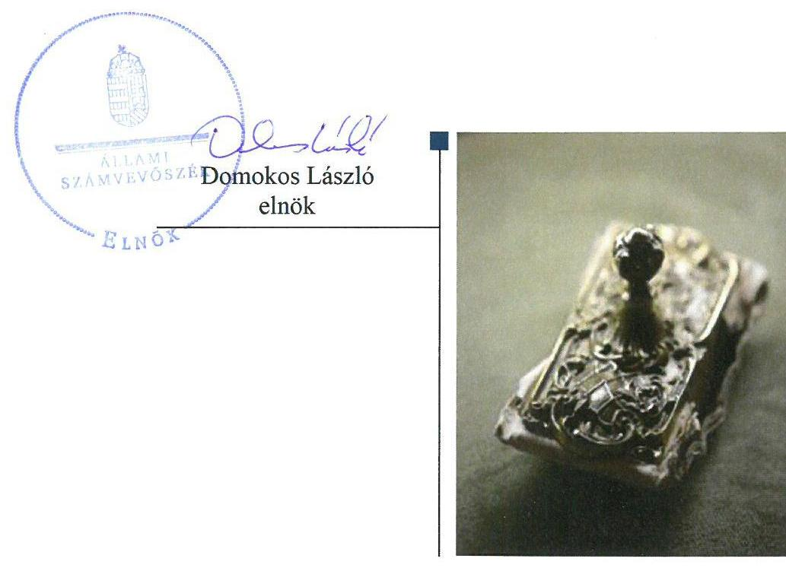
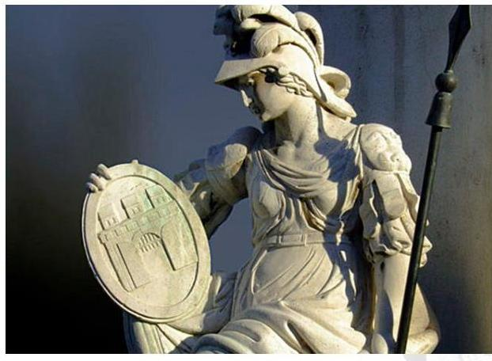

# Jelenetés 

## Alapítványok ellenőrzése

Alapítványok/közalapítványok gazdálkodásának ellenőrzése Pallas Athéné Domus Animae Alapítvány 2018.

---

# Jelentés 

## Alapítványok ellenőrzése

Alapítványok/közalapítványok gazdálkodásának ellenőrzése Pallas Athéné Domus Animae Alapítvány 2018. 6. hó 21. nap

---

# AZ ELLENŐRZÉST FELÜGYELTE:

- **HOLMAN MAGDOLNA JULIANNA** felügyeleti vezető
- **AZ ELLENŐRZÉST VEZETTE ÉS A VÉGREHAJTÁSÁÉRT FELELŐS:**
  - **DR. SIMON JÓZSEF** ellenőrzésvezető
  - **A PROGRAM ÖSSZEÁLLÍTÁSÁÉRT FELELŐS:**
    - **TÓTPÁL SZABOLCS** osztályvezető

**IKTATÓSZÁM:** EL-0431-029/2018

**TÉMASZÁM:** 2449

**ELLENŐRZÉS-AZONOSÍTÓ SZÁM:** V077507

Jelentéseink az Országgyűlés számítógépes hálózatán és az Interneta a www.asz.hu címen is olvashatóak.

---

# TARTALOMJEGYZÉK 

■ ÖSSZEGZÉS ..... 5
■ AZ ELLENŐRZÉS CÉLJA ..... 6
■ AZ ELLENŐRZÉS TERÜLETE ..... 7
■ AZ ELLENŐRZÉS HÁTTERE, INDOKOLTSÁGA ..... 8
■ A JELENTÉS LÉNYEGES KÉRDÉSKÖREI ..... 9
■ AZ ELLENŐRZÉS HATÓKÖRE ÉS MÓDSZEREI ..... 10
■ MEGÁLLAPÍTÁSOK ..... 12
■ MELLÉKLETEK ..... 15
I. sz. melléklet: Értelmező szótár ..... 15
■ FÜGGELÉK: ÉSZREVÉTELEK ..... 17
■ RÖVIDÍTÉSEK JEGYZÉKE ..... 19

---

.

---

# ÖSSZEGZÉS 

A Pallas Athéné Domus Animae Alapítvány gazdálkodási kereteinek kialakítása és ezek gyakorlati alkalmazása szabályszerű volt, ezáltal biztositott volt a gazdálkodás rendezettsége és átláthatósága.

## Az ellenőrzés társadalmi indokoltsága

Az alapítványok, az alapító által az alapító okiratban meghatározott tartós cél megvalósítására létrehozott jogi személyek, tevékenységüket az alapító által juttatott vagyon kezelésével, felhasználásával látják el. Az alapítványok múködésük és szakmai tevékenységük ellátásához költségvetési támogatásban, illetve a Magyar Nemzeti Bankról szóló 2013. évi CXXXIX. törvény 170. § (3) bekezdés d) pontja alapján, alapítványi támogatásban részesülhetnek.

Az Állami Számvevőszék az államháztartásból származó források felhasználásának keretében ellenőrzi az alapítványok, közalapítványok gazdálkodását. A jogszabályi felhatalmazás szerint azokat az alapítványokat, közalapítványokat ellenőrizheti, amelyek az államháztartásból nyújtott támogatásban, vagy az államháztartásból meghatározott célra ingyenesen juttatott vagyonban részesültek.

Társadalmi elvárás a közszféra pénzügyi- és vagyoni eszközeinek értékelvű és rendeltetésszerű felhasználása, továbbá a Magyar Nemzeti Bank által alapított alapítványok átláthatóságának biztosítása, amelyet az Állami Számvevőszék ellenőrzéseivel támogat.

## Főbb megállapítások, következtetések

A Pallas Athéné Domus Animae Alapítvány a gazdálkodás szervezeti kereteit és belső szabályozását a jogszabályi előírásoknak megfelelően alakította ki. A 2016. évre szóló költségvetési tervét szabályszerűen készítette el. Gazdasági társaságokban való részvétele a jogszabályi előírások szerint történt. Az alkalmazott gazdálkodási és számviteli elszámolási gyakorlat a Számviteli törvény előírásainak megfelelt.

Az alapítványi célra juttatott vagyon nyilvántartásba vétele szabályszerű volt, hozzájárulva a gazdálkodáshoz felhasználható vagyon értékének és összetételének áttekinthetőségéhez.

A Pallas Athéné Domus Animae Alapítvány a beszámolási kötelezettségét szabályszerűen teljesítette. A Pallas Athéné Domus Animae Alapítvány Felügyelőbizottsága a beszámolóval kapcsolatos feladatait elvégezte. A Pallas Athéné Domus Animae Alapítvány biztosította a tevékenységéről szóló beszámolási adatok hozzáférhetőségét, ezáltal a gazdálkodási helyzetének átláthatóságát.

---

# AZ ELLENŐRZÉS CÉLJA 

Az ellenőrzés célja annak megállapítása, hogy az Alapítvány ${ }^{1}$ gazdálkodása során betartotta-e a vonatkozó jogszabályi előírásokat, szabályszerűen használta-e fel a kapott költségvetési támogatásokat, az államháztartásból meghatározott célra ingyenesen juttatott vagyon használata, hasznosítása a jogszabályi előírásoknak megfelelően történt-e, az alapítvány működését szolgáló ellenőrzési, monitoring és nyilvántartási rendszerek szabályszerűen működtek-e.

---

# **AZ ELLENŐRZÉS TERÜLETE**

## **Pallas Athéné Domus Animae Alapítvány**

Pallas Athéné Domus Animae Alapítvány

A Pallas Athéné Domus Animae Alapítványt a Magyar Nemzeti Bank a Felelősségvállalási Stratégiájával^{1} összhangban alapította 2013. december 15-én.

A Pallas Athéné Domus Animae Alapítvány alapvető célja a közgazdasági, pénzügyi szakemberképzés támogatása, a közgazdaságtan, a pénzügyek és ezek peremtudományai területén a kutatások elősegítése, az oktatási tevékenység fejlesztése, valamint a kutatóhelyek létrehozása, a felsőfokú oktatási intézmények, kapcsolódó tudományos intézmények szakmai és anyagi támogatása. Célja továbbá a hasonló célkitűzéssekkel rendelkező szervezetekkel való belföldi és külföldi kapcsolatépítés elősegítése és támogatása, közös projektek, programok és intézmények működtetése, hazai és nemzetközi együttműködési háló kialakítása.

Úgyvezető szerve a hét fős Kuratórium^{3}. A munkaszervezet működését Igazgató^{4} irányítja, aki gondoskodik a Kuratórium által meghatározott feladatok előkészítéséről, végrehajtásáról és ellenőrzéséről. Az Alapító^{5} a működés és gazdálkodás törvényességének és célszerűségének ellenőrzésére három fős FB^{6}-t hozott létre.

Az Alapító az alapítványi célok teljesítéséhez 2014-2015. évben 60 000 M Ft pénzbeli vagyont és 1 850 M Ft értékű ingatlant, 2016. évben további 100 M Ft pénzbeli vagyont rendelt. A Pallas Athéné Domus Animae Alapítvány a 2016. évben az államháztartásból támogatást nem kapott, egyéb támogatásban, adományban nem részesült. Kiadásai finanszírozását szolgáló forrásai az alapítói vagyonból, illetve annak hozamából keletkeztek. A Pallas Athéné Domus Animae Alapítvány az ellenőrzött időszakban nyitott alapítvány, közhasznú jogállással nem rendelkezett.

A 2016. évben a Pallas Athéné Domus Animae Alapítvány három gazdasági társaságban – az 1 200 M Ft-os alaptőkéjű OPTIMA Zrt.^{7}-ben 200 M Ft befektetéssel 16,7%-os tulajdoni hányaddal, a 12 000 M Ft alaptőkéjű KEDO Zrt^{8}-ben 2 000 M Ft befektetéssel 16,7%-os tulajdoni hányaddal, a Kasselik-Ház Zrt.^{9}-ben 7 200 M Ft-os alaptőkével 1 800 M Ft befektetéssel, 25,0%-os tulajdoni hányaddal – rendelkezett tulajdoni hányaddal.

A főbb gazdálkodási adatokat az 1. táblázat mutatja be.

1. táblázat

|  AZ ALAPÍTVÁNY GAZDÁLKODÁSI ADATAI (M FT) |  | 2015. december 15. | 2016. december 16.  |
| --- | --- | --- | --- |
|  Mérleg szerinti vagyon |  | 62 697,9 | 63 267,0  |
|  Tárgyévi eredmény |  | 315,9 | 127,2  |
|  Pénzügyi műveletekből származó bevételek |  | 2 178,1 | 1 358,6  |

*Forrás: Az Alapítvány 2015-2016. évi beszámolói*

---

# AZ ELLENŐRZÉS HÁTTERE, INDOKOLTSÁGA 

Társadalmi elvárás a közpénzek értékelvű, rendeltetésszerű felhasználása, a közpénzekből nyújtott támogatások átláthatóságának megteremtése, amelyhez az Állami Számvevőszék az államháztartásból nyújtott támogatások ellenőrzésével kíván hozzájárulni. Az ÁSZ ${ }^{10}$ Stratégiájában rögzített célkitűzése, hogy az államháztartáson kívülre nyújtott költségvetési támogatások és az ingyenes vagyonjuttatás ellenőrzésével hozzájáruljon ahhoz, hogy a közpénzeket a civil szervezetek is átlátható módon használják fel. Továbbá az alapítványok gazdálkodása szabályszerűségének bemutatásával hozzájárul ahhoz, hogy a társadalom objektív képet alkothasson az alapítványok működéséről.

Az ellenőrzés eredményeinek célzott felhasználói a nyilvánosság, a jogalkotó, továbbá az alapítványok alapítói és szervei. Az ellenőrzés eredményeképp a törvényalkotás számára tapasztalatok állnak rendelkezésre az alapítványok gazdálkodása szabályozásához. Az ellenőrzött szervezetek szintjén gazdálkodásuk vonatkozásában a hiányosságok, szabálytalanságok feltárása, az ennek kapcsán megfogalmazott megállapítások elősegíthetik az alapítványok szabályszerű gazdálkodását, míg a társadalom számára információt szolgáltat arról, hogy az alapítványok a közpénzeket szabályszerűen használták-e fel. Az alapítványok gazdálkodása szabályszerűségének bemutatásával az ellenőrzés értékteremtő módon járul hozzá az ÁSZ stratégiai céljainak megvalósításához, a nyilvánosság megfelelő tájékoztatásához.

A 2016. évi XXXI. törvény 2016. május 6-ával módosította a Magyar Nemzeti Bankról szóló 2013. évi CXXXIX. törvényt, amelynek értelmében az MNB által létrehozott alapítványok gazdálkodását az ÁSZ ellenőrzi.

---

# A JELENTÉS LÉNYEGES KÉRDÉSKÖREI 

1. Az Alapítvány gazdálkodása szabályszerű volt-e?
2. Az alapítványi célra juttatott vagyon nyilvántartásba vétele szabályszerű volt-e?
3. Az Alapítvány a beszámolási kötelezettségét szabályszerűen teljesítette-e, valamint a Felügyelőbizottság ellátta-e a feladatát?

---

# AZ ELLENŐRZÉS HATÓKÖRE ÉS MÓDSZEREI 

## Az ellenőrzés típusa

Szabályszerúségi ellenőrzés.

## Az ellenőrzött időszak

A 2016. január 1-től 2016. december 31-ig tartó időszak. Az ellenőrzés kiterjedt az ellenőrzött évet érintő, de az azt megelőzően a költségvetéssel, valamint az ellenőrzött időszakot követően a beszámolással kapcsolatban hozott döntések dokumentumaira is.

## Az ellenőrzés tárgya

Az ellenőrzés tárgya az Alapítvány vonatkozó jogszabályi előírások szerinti gazdálkodási tevékenysége. Ezen belül az Alapítvány a gazdálkodásához kapcsolódó szervezeti és szabályozási kereteinek a jogszabályi előírásoknak megfelelő kialakítása, a kapott költségvetési/egyéb támogatások, az alapítványi célok megvalósítására juttatott vagyon, vagyoni hozzájárulás nyilvántartásba vételének szabályszerűsége. Az ellenőrzés kiterjed továbbá az Alapítvány múködését, gazdálkodását szolgáló nyilvántartási, ellenőrzési, monitoring tevékenységére.

## Az ellenőrzött szervezet

Pallas Athéné Domus Animae Alapítvány

## Az ellenőrzés jogalapja

Az MNB tv. ${ }^{11} 162 . \S$ (5) bekezdése.

## Az ellenőrzés módszerei

Az ellenőrzést az ellenőrzött időszakban hatályos jogszabályok, a nemzetközi standardokat irányadónak tekintő ellenőrzési módszertanok, valamint az ellenőrzés szakmai szabályai figyelembevételével végezte az ÁSZ.

Az MNB. tv. 2016. május 6-án hatályba lépett módosítása adott felhatalmazást az ÁSZ számára az MNB által létrehozott alapítványok ellenőrzésére. Az ellenőrzés tervezése és előkészítése során - az ellenőrzésre vonatkozó módszertani előírások alapján - a felelős fél (ellenőrzött szervezet)

---

környezetének, szabályozási keretrendszerének, múködésének, finanszírozási módjának, tevékenységének, múveleteinek, szabályozási környezetének, az ellenőrzés szempontjából releváns kontrollok, belső irányítási, számviteli rendszereinek, valamint az ellenőrzési bizonyítékok megismeréséhez az ellenőrzött szervezettől a 2014. és a 2015. évek tekintetében strukturált adatbekérést végzett az ÁSZ. A beérkezett dokumentumok értékelését követően megtörtént a törvény hatálybalépését követő legkorábbi lezárt üzleti évre vonatkozó, az ellenőrzés lefolytatásához szükséges feladatok meghatározása.

Az ellenőrzést az ellenőrzési program szempontjai alapján végezte az ÁSZ. Az ellenőrzés ideje alatt az ellenőrzött szervezettel történő kapcsolattartás az ÁSZ SZMSZ ${ }^{12}$-ének vonatkozó előírásai alapján történt.

Az ellenőrzési kérdések megválaszolásához szükséges bizonyítékok megszerzése az ellenőrzött által rendelkezésre bocsátott dokumentumokra, adatokra alapozva megfigyelés, szemle (szemrevételezés), kérdésfeltevés (információkérés), mintavételezés, valamint elemző eljárás útján történt. A mintavételezés véletlen mintavételi eljárással történt.

A beruházási-felújítási kiadások, az igénybevett és egyéb szolgáltatások ráfordításai, a személyi jellegú ráfordítások elszámolása, valamint a mérlegsorok szabályszerűségét véletlen mintavétellel ellenőrizte az ÁSZ. A minta alapján a sokaságban előforduló hibaarányt becsülte. „Szabályszerü" értékeléssel rendelkezett egy ellenőrzött terület, amennyiben 95\%-os bizonyossággal a teljes sokaságban a hibaarány legfeljebb 10\%, „nem szabályszerű" értékeléssel rendelkezett, amennyiben 10\%-nál magasabb arányt képviselt. Abban az esetben, ha a teljes sokaság tekintetében a 10\%os hibaarányhoz való viszony megítélésnek megbízhatósága nem érte el a 95\%-ot, annak elérése érdekében az értékelés további szempontokkal egészült ki, és figyelembe vételre került a feltárt hibák értéke.

Az ellenőrzési bizonyítékként felhasznált adatforrások közé tartoztak egyrészt a szakmai program részletes szempontjainál felsorolt adatforrások, másrészt minden - az ellenőrzés folyamán feltárt, az ellenőrzés szempontjából információt tartalmazó - dokumentum.

Az ellenőrzés lefolytatásához az Alapítvány a kitöltött tanúsítványok, valamint az ÁSZ által kért dokumentumok elektronikus úton való megküldésével szolgáltatott adatokat, információkat. Az így rendelkezésre bocsátott adatok, információk és a tanúsítványok adatai valódiságának kontrollja az ellenőrzés keretében történt.

---

# 1. Az Alapítvány gazdálkodása szabályszerű volt-e? 

## Összegző megállapítás

### 1.1. számú megállapítás

### 1.2. számú megállapítás

Az Alapítvány gazdálkodási kereteinek kialakítása és gazdálkodása szabályszerű volt.

Az Alapítvány a gazdálkodás szervezeti kereteit és belső szabályozását a jogszabályi előírásoknak megfelelően alakította ki.

Az Alapítvány a 2016. évben rendelkezett Alapító okirat ${ }_{1}$-gyel, amelyet módosítottak az Alapítvány céljaira rendelt vagyon Alapító általi 100 M Ft-tal történő emelése miatt. Az Alapító okirat ${ }_{1-2}{ }^{19}$ tartalmazta a Ptk. ${ }_{2}{ }^{14}$-ban előírt tartalmi elemeket.

A gazdálkodás alapvető szabályait, a feladat- és hatásköröket az Alapító okirat ${ }_{1-2}$-ban, a Kuratóriumi Ügyrend ${ }^{15}$-ben, az SZMSZ ${ }_{1-3}{ }^{16}$-ben, valamint a Pénzkezelési szabályzat ${ }_{1-3}{ }^{17}$-ban alakították ki. Az Alapítvány rendelkezett Számviteli politika ${ }_{1-2}{ }^{18}$-val és annak mellékleteként Leltárkészítési és leltározási szabályzat ${ }_{1-2}{ }^{19}$-tal, Értékelési szabályzat ${ }_{1-2}{ }^{20}$-tal, Pénzkezelési szabályzat ${ }_{1-3}$-tal, valamint Bizonylati és Iratkezelési szabályzat ${ }_{1-3}{ }^{21}$-tal, Számlarend $_{1-2}{ }^{22}$-del, amelyek megfeleltek a Számv. tv. ${ }^{23}$, az Ectv. ${ }^{24}$ és a Civilszr. ${ }^{25}$ előírásainak.

Az Alapítvány gazdálkodásával kapcsolatos könyvvezetési, nyilvántartási rendszerének kialakítása a Számv. tv., az Ectv. és a Civilszr. előírásainak megfelelően történt.
2016. július 15-én lépett hatályba az Alapítvány Adatkiadási szabályzata ${ }^{26}$.

Az Alapítvány a jogszabályi előírásokkal összhangban készítette el az éves költségvetési tervét. Az Alapítvány gazdasági társaságokban való részvétele szabályszerű volt.

Az Alapítvány 2016. évi költségvetési terve megfelelt az Ecvhr. ${ }^{27}$ rendelkezésének, a kiadások és a bevételek egyensúlyban voltak, és a Civilszr. által meghatározott egyszerűsített éves beszámoló tartalmi elemeinek megfelelően készült. A költségvetési tervet a Kuratórium jóváhagyta.

Az Alapítvány gazdasági társaságokban való részvételét az Alapító az Alapító okirat ${ }_{1-2}$-ben a Ptk. ${ }_{2}$, valamint az Ectv. rendelkezései alapján határozta meg. A gazdasági társaságok alapszabályaiban meghatározott feladatok összhangban voltak az Alapítvány célkitűzéseivel. Az Alapítvány a gazdasági társaságok működtetése és felügyelete során betartotta a Ptk. ${ }_{2}$ és az Ectv. előírásait.

---

# 1.3. számú megállapítás 

Az Alapítvány a beruházási-felújítási kiadásokat és a költségeket, ráfordításokat szabályszerűen számolta el.

A beruházási-felújítási kiadások, az igénybevett és egyéb szolgáltatások ráfordításai, valamint a személyi jellegű ráfordítások elszámolása során az Alapítvány betartotta a Számv. tv. és az Ectv. rendelkezéseit.

## 2. Az alapítványi célra juttatott vagyon nyilvántartásba vétele szabályszerű volt-e?

## Összegző megállapítás

Az alapítványi célra juttatott vagyon nyilvántartásba vétele szabályszerű volt.

Az Alapítvány az Alapító okirat ${ }_{1-2}$-ben foglalt előírásokkal összhangban szabályozta az Alapító által rendelkezésre bocsátott vagyoni hozzájárulás felhasználásának módját, nyilvántartását, elszámolásának rendjét.

Az alapítványi célra juttatott vagyon a Számv. tv.-nek megfelelően a főkönyvben rögzítésre került. Az Alapítvány a Civilszr. és a Számviteli poli-tika ${ }_{1-2}$ 2.1.4. pontja előírásainak megfelelően mutatta ki a saját tőke összetételét.

## 3. Az Alapítvány a beszámolási kötelezettségét szabályszerűen teljesítette-e, valamint a Felügyelőbizottság ellátta-e a feladatát?

## Összegző megállapítás

Az Alapítvány a beszámolási kötelezettségét szabályszerűen teljesítette, a beszámoló adatainak valódisága biztosított volt. A Felügyelőbizottság beszámolóval kapcsolatos ellenőrzési feladatait elvégezte.

### 3.1. számú megállapítás

Az Alapítvány a beszámolási kötelezettségének szabályszerűen eleget tett. A beszámolót leltárral alátámasztotta.

Az Alapítvány a Civilszr.-ben foglaltaknak megfelelően kettős könyvvitelt vezetett. A 2016. évi vagyoni, pénzügyi és jövedelmi helyzetéről a Számv. tv.-ben, az Ectv.-ben és a Civilszr.-ben foglaltaknak megfelelően egyszerűsített éves beszámolót készített. Az Ectv. rendelkezésével összhangban a beszámoló tartalmazta a kiegészítő mellékletet.

Az Alapítvány a 2016. évi mérlegét a Számv. tv. rendelkezése szerint teljes körű leltárral támasztotta alá, ami tételesen, ellenőrizhető módon a Leltárkészítési és leltározási szabályzat ${ }_{1-2}$-ben foglaltaknak megfelelően tartalmazta a fordulónapon meglévő, a mérlegben kimutatott eszközöket és forrásokat.

A Számv. tv. rendelkezéseinek megfelelve a főkönyvi könyvelés és az analitikus nyilvántartások adatai közötti egyeztetést az üzleti év mérlegfordulónapjára vonatkozóan elvégezték.

Az Alapítvány 2016. évi egyszerűsített éves beszámolóját, kiegészítő mellékletét és közhasznúsági mellékletét a Számv. tv.-ben, az Ectv.-ben és

---

a Civilszr.-ben előírtaknak megfelelő tartalommal készítette el. A beszámolót és mellékleteit a Kuratórium jóváhagyta. Az egyszerűsített éves beszámolóját, kiegészítő és közhasznúsági mellékletét az Alapítvány az Ectv. és a Cnytv. ${ }^{28}$ rendelkezései szerint letétbe helyezte az Országos Bírósági Hivatalnál, ezzel eleget téve a közzétételi kötelezettségének.

# 3.2. számú megállapítás 

A Felügyelőbizottság a beszámoló elfogadásával kapcsolatos ellenőrzési feladatait ellátta.

Az FB az ellenőrzési feladatait - az Alapító okirat ${ }_{1-2}$-ben, az SZMSZ ${ }_{1-3}$-ban és az FB ügyrend ${ }^{29}$-jében foglaltak alapján - az egyszerűsített éves beszámoló vizsgálata tekintetében elvégezte.

---

# MELLÉKLETEK 

## I. SZ. MELLÉKLET: ÉRTELMEZŐ SZÓTÁR

alapító

alapítvány
adomány
államháztartás
beruházás

Az alapítványt, mint jogi személyt az alapító okiratban meghatározott tartós cél folyamatos megvalósítására létrehozó, az alapítvány részére az alapító okiratban meghatározott, az alapítványi cél megvalósításához szükséges pénzbeli és nem pénzbeli vagyoni hozzájárulást teljesítő személy(ek)/jogi személy(ek). (Forrás: Ptk. 3 :378. §, 3:382. § (2) bek.)
Magánszemély, jogi személy és jogi személyiséggel nem rendelkező gazdasági társaság (a továbbiakban együtt: alapító) - tartós közérdekű célra - alapító okiratban alapítványt hozhat létre. Alapítvány elsődlegesen gazdasági tevékenység folytatása céljából nem alapítható. Az alapítvány javára a célja megvalósításához szükséges vagyont kell rendelni. Az alapítvány jogi személy. Az alapítvány a bírósági nyilvántartásba vételével jön létre. (Forrás: Ptk. ${ }^{30}$ 74/A. § (1) - (2) bekezdés)
Az alapítvány az alapító által az alapító okiratban meghatározott tartós cél folyamatos megvalósítására létrehozott jogi személy. Az alapító az alapító okiratban meghatározza az alapítványnak juttatott vagyont és az alapítvány szervezetét. Alapítvány nem alapítható gazdasági-vállalkozási tevékenység folytatására. Az alapítvány az alapítványi cél megvalósításával közvetlenül összefüggő gazdasági tevékenység végzésére jogosult. Alapítvány nem lehet korlátlan felelősségű tagja más jogalanynak, nem létesíthet alapítványt és nem csatlakozhat alapítványhoz. (Forrás: Ptk.3:378§, 3:379. § (1) - (3) bekezdés)
a civil szervezetnek - létesítő/alapító okiratban rögzített céljaira - ellenszolgáltatás nélkül juttatott eszköz, illetve nyújtott szolgáltatás (Forrás: Ectv. 2. § 1. pont)
az a pénzbeli vagy természetbeni juttatás, amelyet az adományozó az adományozott civil szervezet alapcéljának, illetve közhasznú céljának elérésére ellenszolgáltatás nélkül juttat (Forrás: Ecvhr. 1. § (5) bekezdés a) pont)
az államháztartás a közfeladatok ellátásának egységes szervezeti, tervezési, gazdálkodási, ellenőrzési, finanszírozási, adatszolgáltatási és beszámolási szabályok szerint működő rendszere, amely központi és önkormányzati alrendszerből áll.
Az államháztartás központi alrendszerébe tartozik az állam, a központi költségvetési szerv, a törvény által az államháztartás központi alrendszerébe sorolt köztestület, és ezen köztestület által irányított köztestületi költségvetési szerv.
Az államháztartás önkormányzati alrendszerébe tartozik a helyi önkormányzat, a helyi nemzetiségi önkormányzat és az országos nemzetiségi önkormányzat, a Mötv. ${ }^{31}$ és a nemzetiségek jogairól szóló 2011. évi CLXXIX. törvény szerint létrehozott társulás, valamint a területfejlesztésről és a területrendezésről szóló törvény alapján létrejött területfejlesztési önkormányzati társulás, a térségi fejlesztési tanács, és a megnevezett szervezetek által irányított költségvetési szerv. (Forrás: Áht. ${ }^{32}$ 2-3. §)
A tárgyi eszköz beszerzése, létesítése, saját vállalkozásban történő előállítása, a beszerzett tárgyi eszköz üzembe helyezése. A beruházás a meglévő tárgyi eszköz bővítését, rendeltetésének megváltoztatását, átalakítását, élettartamának, teljesítőképességének közvetlen növelését eredményező tevékenység. (Forrás: Számv. tv. 3. § (4) bekezdés 7. pont)

---

civil szervezet

Felügyelőbizottság
felújítás
gazdálkodó tevékenység
gazdasági-vállalkozási tevékenység
költségvetési támogatás
közhasznú tevékenység
vagyoni hozzájárulás
2014. március 15-ig: a civil társaság, illetve a Magyarországon nyilvántartásba vett egyesület - a párt kivételével -, valamint az alapítvány. Civil szervezet alatt az e törvény II-VI. és VIII-X. fejezetében a civil társaságot, továbbá a VII-X. fejezetében a kölcsönös biztosító egyesületet és a szakszervezetet nem kell érteni. (Forrás: Ectv. 2. § 6. pont)
2014. március 15-től: a civil társaság; a Magyarországon nyilvántartásba vett egyesület - a párt, a szakszervezet és a kölcsönös biztosító egyesület kivételével és - a közalapítvány és a pártalapítvány kivételével - az alapítvány. (Forrás: Ectv. 2. § 6. pont)
A tagok vagy az alapítók a létesítő okiratban három tagból álló felügyelőbizottság létrehozását rendelhetik el azzal a feladattal, hogy az ügyvezetést a jogi személy érdekeinek megóvása céljából ellenőrizze. A felügyelőbizottság tagjai a jogi személy ügyvezetésétől függetlenek, tevékenységük során nem utasíthatóak. A felügyelőbizottság köteles a tagok vagy az alapítók döntéshozó szerve elé kerülő előterjesztéseket megvizsgálni, és ezekkel kapcsolatos álláspontját a döntéshozó szerv ülésén ismertetni. A felügyelőbizottsági tagok az ellenőrzési kötelezettségük elmulasztásával vagy nem megfelelő teljesítésével a jogi személynek okozott károkért a szerződésszegéssel okozott kárért való felelősség szabályai szerint felelnek a jogi személlyel szemben. (Forrás: Ptk. 3 :26-3:28 §)
Az elhasználódott tárgyi eszköz eredeti állaga (kapacitása, pontossága) helyreállítását szolgáló időszakonként visszatérő olyan tevékenység, melynek során az eszköz élettartama megnövekszik, minősége, használata jelentősen javul, így a pótlólagos ráfordításból a jövőben gazdasági előnyök származnak. (Forrás: Számv. tv. 3. § (4) 8. pont) azon tevékenységek összessége, amelyek a civil szervezet vagyoni, pénzügyi, jövedelmi helyzetére kiható gazdasági eseményt eredményeznek. (Forrás: Ectv. 2. § 10. pont)
A jövedelem- és vagyonszerzésre irányuló vagy azt eredményező, üzletszerűen végzett gazdasági tevékenység, kivéve az adomány (ajándék) elfogadását, a létesítő okiratban meghatározott cél szerinti tevékenységet (ideértve a közhasznú tevékenységet is), - 2015. november 28-tól - a pénzeszközök betétbe, értékpapírba, társasági részesedésbe történő elhelyezését és az ingatlan megszerzését, használatának átengedését és átruházását. (Forrás: Ectv. 2. § 11. pont)
az államháztartás alrendszerei terhére nyújtott pénzbeli vagy nem pénzbeli juttatás, amelyet a támogató nem elsősorban ellenszolgáltatás ellenében, de konkrét program megvalósítása vagy meghatározott időszakban a támogatott szervezet működtetése érdekében nyújt. Költségvetési támogatás különösen: a pályázat útján, valamint egyedi döntéssel kapott költségvetési támogatás; az Európai Unió strukturális alapjaiból, illetve a Kohéziós Alapból származó, a költségvetésből juttatott támogatás; az Európai Unió költségvetéséből vagy más államtól, nemzetközi szervezettől származó támogatás és a személyi jövedelemadó meghatározott részének az adózó rendelkezése szerint felajánlott összege. (Forrás: Ectv. 2. § 15. pont)
minden olyan tevékenység, amely a létesítő okiratban megjelölt közfeladat teljesítését közvetlenül vagy közvetve szolgálja, ezzel hozzájárulva a társadalom és az egyén közös szükségleteinek kielégítéséhez. (Forrás: Ectv. 2. § 20. pont)
Az alapítvány alapítója által az alapításkor az alapítvány részére teljesítendő olyan hozzájárulás, amelynek értékét nem lehet visszakövetelni. Az alapító által az alapítvány rendelkezésére bocsátott vagyon pénzből és nem pénzbeli vagyoni hozzájárulásból állhat. Az alapítónak legalább az alapítvány müködésének megkezdéséhez szükséges vagyont a nyilvántartásba-vételi kérelem benyújtásáig át kell ruháznia az alapítványra. Az alapítónak a teljes juttatott vagyont legkésőbb az alapítvány nyilvántartásba vételétől számított egy éven belül kell átruháznia az alapítványra. (Forrás: Ptk. 3:9. § (1) bek., 3:10. § (1) bek., 3:382. § (2)-(3) bek.)

---

# FÜGGELÉK: ÉSZREVÉTELEK 

A jelentéstervezetet a Számvevőszék 15 napos észrevételezésre megküldte az ellenőrzött szervezet vezetőjének az ÁSZ tv. 29. §* (1) bekezdése előírásának megfelelően.

A Pallas Athéné Domus Animae Alapítvány az EL-0538-026/2018. iktatószámon nyilvántartásba vett válaszlevelében jelezte, hogy a jelentéstervezetben foglaltakra nem tesz észrevételt.

[^0]
[^0]:    * 29. § (1) Az Állami Számvevőszék az ellenőrzési megállapításait megküldi az ellenőrzött szervezet vezetőjének vagy az általa megbízott személynek, és annak, akinek személyes felelősségét állapította meg.
    (2) Az ellenőrzött szervezet vezetője és a felelősként megjelölt személy az ellenőrzés megállapításaira tizenöt napon belül írásban észrevételt tehet.
    (3) Az Állami Számvevőszék az észrevételre a beérkezésétől számított harminc napon belül írásban válaszol. A figyelembe nem vett észrevételeket köteles a jelentésben feltüntetni, és megindokolni, hogy azokat miért nem fogadta el.

---

.

---

# RÖVIDÍTÉSEK JEGYZÉKE 

${ }^{1}$ Alapítvány
${ }^{2}$ Felelősségvállalási Stratégia
${ }^{3}$ Kuratórium
${ }^{4}$ Igazgató
${ }^{5}$ Alapító
${ }^{6} \mathrm{FB}$
${ }^{7}$ OPTIMA Zrt.
${ }^{8}$ KEDO Zrt.
${ }^{9}$ Kasselik-Ház Zrt.
${ }^{10}$ ÁSZ
${ }^{11}$ MNB tv.
${ }^{12}$ ÁSZ SZMSZ
${ }^{13}$ Alapító okirat ${ }_{1}$

Alapító okirat ${ }_{2}$
${ }^{14}$ Ptk. 2
${ }^{15}$ Kuratóriumi Ügyrend
${ }^{16} \mathrm{SZMSZ}_{1}$

SZMSZ 2
SZMSZ ${ }_{3}$
${ }^{17}$ Pénzkezelési szabályzat ${ }_{1}$

Pénzkezelési szabályzat ${ }_{2}$

Pénzkezelési szabályzat ${ }_{3}$
${ }^{18}$ Számviteli politika $_{1}$

Számviteli politika ${ }_{2}$
${ }^{19}$ Leltárkészítési és leltározási szabályzat ${ }_{1}$

Leltárkészítési és leltározási szabályzat ${ }_{2}$
${ }^{20}$ Értékelési szabályzat ${ }_{1}$

Pallas Athéné Domus Animae Alapítvány
a Magyar Nemzeti Bank Társadalmi Felelősségvállalási Stratégiája
Pallas Athéné Domus Animae Alapítvány Kuratóriuma
Pallas Athéné Domus Animae Alapítvány Igazgatója
Magyar Nemzeti Bank
Pallas Athéné Domus Animae Alapítvány Felügyelő Bizottsága
OPTIMA Befektetési-, Ingatlanhasznosító és Szolgáltató Zártkörűen Működő Részvénytársaság
Kecskeméti Duális Oktatás Zártkörűen Működő Részvénytársaság
Kasselik-Ház Ingatlanfejlesztő Zártkörűen Működő Részvénytársaság
Állami Számvevőszék
2013. évi CXXXIX. törvény a Magyar Nemzeti Bankról (hatályos 2013. szeptember 27-étől)

Állami Számvevőszék Szervezeti és Működési Szabályzata
Pallas Athéné Domus Animae Alapítvány Alapító Okirata (hatályos: 2015. november 9-től 2016. január 24-ig)

Pallas Athéné Domus Animae Alapítvány Alapító Okirata (hatályos: 2016. január 25-től)
2013. évi V. törvény a Polgári Törvénykönyvről (hatályos: 2014. március 15-től)

Pallas Athéné Domus Animae Alapítvány Kuratóriumának Ügyrendje (hatályos: 2014. december 19-től)

Pallas Athéné Domus Animae Alapítvány Szervezeti Működési Szabályzata (hatályos: 2014. december 19-től 2016. március 30-ig)

Pallas Athéné Domus Animae Alapítvány Szervezeti Működési Szabályzata (hatályos: 2016. március 31-től 2016. július 14-ig)

Pallas Athéné Domus Animae Alapítvány Szervezeti Működési Szabályzata (hatályos: 2016. július 15-től)
Pallas Athéné Domus Animae Alapítvány Pénzkezelési szabályzata (hatályos: 2015. november 30-tól 2016. március 30-ig)

Pallas Athéné Domus Animae Alapítvány Pénzkezelési szabályzata (hatályos: 2016. március 31-től 2016. július 14-ig)

Pallas Athéné Domus Animae Alapítvány Pénzkezelési szabályzata (hatályos: 2016. július 15-től)
Pallas Athéné Domus Animae Alapítvány Számviteli politikája (hatályos: 2014. április 14-től 2016. március 30-ig)

Pallas Athéné Domus Animae Alapítvány Számviteli politikája (hatályos: 2016. március 31-től)
Pallas Athéné Domus Animae Alapítvány leltárkészítési és leltározási szabályzata (hatályos: 2014. április 14-től 2016. március 30-ig)

Pallas Athéné Domus Animae Alapítvány leltárkészítési és leltározási szabályzata (hatályos: 2016. március 31-től)
Pallas Athéné Domus Animae Alapítvány Értékelési szabályzata (hatályos: 2014. április 14-től 2016. március 30-ig)

---

| Értékelési szabályzat ${ }_{2}$ | Pallas Athéné Domus Animae Alapítvány Értékelési szabályzata (hatályos: 2016.   március 31-től) |
| :--: | :--: |
| ${ }^{21}$ Bizonylati és Iratkezelési szabályzat ${ }_{1}$ | Pallas Athéné Domus Animae Alapítvány Bizonylati és Iratkezelési szabályzata   (hatályos: 2014. április 14-től 2016. március 30-ig) |
| Bizonylati és Iratkezelési szabályzat ${ }_{2}$ | Pallas Athéné Domus Animae Alapítvány Bizonylati és Iratkezelési szabályzata   (hatályos: 2016. március 31-től 2016. július 14-ig) |
| Bizonylati és Iratkezelési szabályzat ${ }_{3}$ | Pallas Athéné Domus Animae Alapítvány Bizonylati és Iratkezelési szabályzata   (hatályos: 2016. július 15-től) |
| ${ }^{22}$ Számlarend $_{1}$ | a Pallas Athéné Domus Animae Alapítvány Számlarendje (hatályos: 2014. április   14-től 2016. március 30-ig) |
| Számlarend $_{2}$ | Pallas Athéné Domus Animae Alapítvány Számlarendje (hatályos: 2016. március   31-től) |
| ${ }^{23}$ Számv. tv. | a számvitelről szóló 2000. évi C. törvény (hatályos 2001. január 1-jétől) |
| ${ }^{24}$ Ectv. | egyesülési jogról, a közhasznú jogállásról, valamint a civil szervezetek múködéséről   és támogatásáról szóló 2011. évi CLXXV. törvény (hatályos 2011. december 22-től) |
| ${ }^{25}$ Civilszr. | számviteli törvény szerinti egyes egyéb szervezetek beszámoló-készítési és   könyvvezetési kötelezettségének sajátosságairól szóló 224/2000. (XII. 19.) Korm.   rendelet (hatályos 2001. január 1-jétől) |
| ${ }^{26}$ Adatkiadási szabályzat | Pallas Athéné Domus Animae Alapítvány Adatkiadási szabályzata (hatályos: 2016.   július 15-től) |
| ${ }^{27}$ Ecvhr. | a civil szervezetek gazdálkodása, az adománygyűjtés és a közhasznúság egyes   kérdéseiről szóló 350/2011. (XII. 30.) Korm. rendelet (hatályos 2012. január 1-től) |
| ${ }^{28}$ Cnytv. | 2011. évi CLXXXI. törvény a civil szervezetek bírósági nyilvántartásáról és az ezzel   összefüggő eljárási szabályokról (hatályos 2012. január 1-jétől) |
| ${ }^{29}$ FB ügyrend | Pallas Athéné Domus Animae Alapítvány Felügyelőbizottságának ügyrendje   (hatályos: 2014. április 29-től) |
| ${ }^{30}$ Ptk. 1 | Polgári Törvénykönyvről szóló 1959. évi IV. törvény (hatályos: 2014. március 14-   ig) |
| ${ }^{31}$ Mötv. | 2011. évi CLXXXIX. törvény - Magyarország helyi önkormányzatairól (hatályos   2012. január 1-jétől, kivéve a 144. § (2)-(5) bekezdéseiben meghatározott   paragrafusok egyes bekezdéseit, pontjait, amelyek 2013. január 1-jén, illetve   2014. évi általános önkormányzati választások napján léptek hatályba) |
| ${ }^{32}$ Áht. | 2011. évi CXCV. törvény - az államháztartásról (hatályos 2012. január 1-jétől) |

---

# ÁLLAMI SZÁMVEVŐSZÉK 

1052 Budapest, Apáczai Csere János utca 10.
Levélcím: 1364 Budapest 4. Pf. 54
Telefon: +36 14849100 Telefax: +36 14849200
www.asz.hu