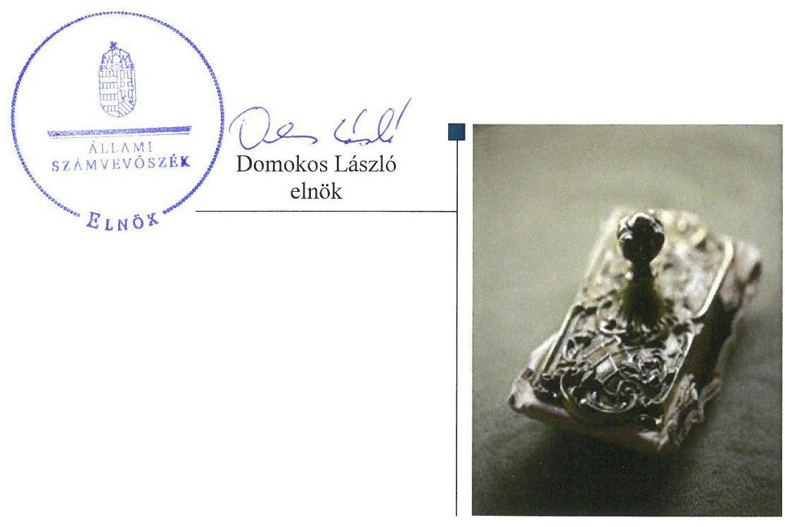
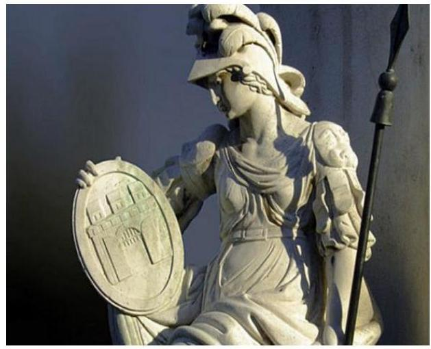

# Jelenetés 

## Alapítványok ellenőrzése

Alapítványok/közalapítványok gazdálkodásának ellenőrzése Pallas Athéné Domus Mentis Alapítvány 2018.

---

# Jelentés 

## Alapítványok ellenőrzése

Alapítványok/közalapítványok gazdálkodásának ellenőrzése Pallas Athéné Domus Mentis Alapítvány 2018. 06. hó 21. nap

---

# AZ ELLENŐRZÉST FELÜGYELTE:

- **HOLMAN MAGDOLNA JULIANNA** felügyeleti vezető
- **AZ ELLENŐRZÉST VEZETTE ÉS A VÉGREHAJTÁSÁÉRT FELELŐS:**
  - **DR. SIMON JÓZSEF** ellenőrzésvezető
  - **A PROGRAM ÖSSZEÁLLÍTÁSÁÉRT FELELŐS:**
    - **TÓTPÁL SZABOLCS** osztályvezető

**IKTATÓSZÁM:** EL-0434-035/2018

**TÉMASZÁM:** 2449

**ELLENŐRZÉS-AZONOSÍTÓ SZÁM:** V077504

Jelentéseink az Országgyűlés számítógépes hálózatán és az Interneten a www.asz.hu címen is olvashatóak.

---

# TARTALOMJEGYZÉK 

- ÖSSZEGZÉS ..... 5
- AZ ELLENŐRZÉS CÉLJA ..... 6
- AZ ELLENŐRZÉS TERÜLETE ..... 7
- AZ ELLENŐRZÉS HÁTTERE, INDOKOLTSÁGA ..... 8
- A JELENTÉS LÉNYEGES KÉRDÉSKÖREI ..... 9
- AZ ELLENŐRZÉS HATÓKÖRE ÉS MÓDSZEREI ..... 10
- MEGÁLLAPÍTÁSOK ..... 12
- JAVASLATOK ..... 15
- MELLÉKLETEK ..... 17
I. sz. melléklet: Értelmező szótár ..... 17
- FÜGGELÉK: ÉSZREVÉTELEK ..... 19
- RÖVIDÍTÉSEK JEGYZÉKE ..... 21

---

.

---

# ÖSSZEGZÉS 

A Pallas Athéné Domus Mentis Alapítvány gazdálkodási kereteinek kialakítása szabályszerű volt, biztosítva ezáltal a gazdálkodás feltételeit. A költségek, ráfordítások számviteli elszámolása nem felelt meg a jogszabályi előírásoknak, ezáltal a gazdálkodás rendezettsége nem érvényesült. A beszámolási kötelezettség szabályszerű teljesítése által biztosított volt a gazdálkodásának átláthatósága.

## Az ellenőrzés társadalmi indokoltsága

Az alapítványok, az alapító által az alapító okiratban meghatározott tartós cél megvalósítására létrehozott jogi személyek, tevékenységüket az alapító által juttatott vagyon kezelésével, felhasználásával látják el. Az alapítványok működésük és szakmai tevékenységük ellátásához költségvetési támogatásban, illetve a Magyar Nemzeti Bankról szóló 2013. évi CXXXIX. törvény 170. § (3) bekezdés d) pontja alapján, alapítványi támogatásban részesülhetnek.

Az Állami Számvevőszék az államháztartásból származó források felhasználásának keretében ellenőrzi az alapítványok, közalapítványok gazdálkodását. A jogszabályi felhatalmazás szerint azokat az alapítványokat, közalapítványokat ellenőrizheti, amelyek az államháztartásból nyújtott támogatásban, vagy az államháztartásból meghatározott célra ingyenesen juttatott vagyonban részesültek.

Társadalmi elvárás a közszféra pénzügyi- és vagyoni eszközeinek értékelvű és rendeltetésszerű felhasználása, továbbá a Magyar Nemzeti Bank által alapított alapítványok átláthatóságának biztosítása, amelyet az Állami Számvevőszék ellenőrzéseivel támogat.

## Főbb megállapítások, következtetések

A Pallas Athéné Domus Mentis Alapítvány a gazdálkodás szervezeti kereteit és belső szabályozását a jogszabályi előírásoknak megfelelően alakította ki, biztosítva ezáltal a gazdálkodás keretének szabályszerű kialakítását. A költségvetési terv felépítése megfelelt a jogszabályi előírásoknak. A gazdasági társaságokban való részvétele a jogszabályi előírások szerint történt. A beruházási-felújítási kiadások elszámolása szabályszerű volt. A költségek, ráfordítások elszámolása nem felelt meg a Számviteli törvény rendelkezéseinek.

Az alapítványi célra juttatott vagyon nyilvántartásba vétele szabályszerű volt.
A Pallas Athéné Domus Mentis Alapítvány a beszámolási kötelezettségét szabályszerűen teljesítette, biztosítva a tevékenységéről szóló beszámolási adatok hozzáférhetőségét, ezáltal a gazdálkodási helyzetének átláthatóságát. A Pallas Athéné Domus Mentis Alapítvány Felügyelőbizottsága a beszámolóval kapcsolatos feladatait elvégezte.

---

# AZ ELLENŐRZÉS CÉLJA 

Az ellenőrzés célja annak megállapítása, hogy az Alapítvány ${ }^{1}$ gazdálkodása során betartotta-e a vonatkozó jogszabályi előírásokat, szabályszerűen használta-e fel a kapott költségvetési támogatásokat, az államháztartásból meghatározott célra ingyenesen juttatott vagyon használata, hasznosítása a jogszabályi előírásoknak megfelelően történt-e, az alapítvány működését szolgáló ellenőrzési, monitoring és nyilvántartási rendszerek szabályszerűen működtek-e.

---

# **AZ ELLENŐRZÉS TERÜLETE**

## **Pallas Athéné Domus Mentis Alapítvány**

Pallas Athéné Domus Mentis Alapítvány

A Pallas Athéné Domus Mentis Alapítványt 2014. március 14-én határozatlan időtartamra alapította a Magyar Nemzeti Bank a Felelősségvállalási Stratégia² keretében rögzített célokkal összhangban.

A Pallas Athéné Domus Mentis Alapítvány alapvető célja az Alapító okirat³⁻⁴ szerint egy olyan, a kor követelményeinek megfelelő oktatási-tudományos központ működtetése, amely a modern képzés megteremtésével, valamint kiemelkedő oktatási színvonal és kompetenciák biztosításával fórumot teremt a jövő generáció közgazdasági és pénzügyi szakembereinek.

Ügyvezető szerve a hét fős Kuratórium⁴. A Pallas Athéné Domus Mentis Alapítványt a Kuratórium elnöke önállóan képviseli. Munkaszervezeti egységének vezetője az Igazgató⁵. Az Alapító⁶ a működése és gazdálkodása törvényességének és célszerűségének ellenőrzésére három tagú FB⁷-ot hozott létre.

Az Alapító a 2014. március 14-én kelt Alapító okirat⁸-ban 12 000,0 M Ft pénzbeli vagyont rendelt az alapítvány céljára. 2016. év végén az alapítvány céljára rendelkezésre álló vagyonon belül a pénzügyi vagyon 30 100,0 M Ft és az ingatlan vagyon 1 800,0 M értékű volt. A Pallas Athéné Domus Mentis Alapítvány a 2016. évben államháztartásból támogatást nem kapott, egyéb pénzbeli támogatásban, adományban nem részesült. A Pallas Athéné Domus Mentis Alapítvány nyitott alapítvány, közhasznú jogállással nem rendelkezett.

A Pallas Athéné Domus Mentis Alapítvány 2016. december 31-én két gazdasági társaságban rendelkezett részesedéssel az éves beszámoló és a főkönyvi kivonat alapján összesen 2 200,0 M összegben. A Pallas Athéné Domus Optima Zrt.-ben 200,0 M Ft (16,67 %), valamint a Kecskeméti Duális Oktatás Zrt.-ben 2 000,0 M Ft (16,67 %) értékű részesedéssel rendelkezett.

A főbb gazdálkodási adatokat az 1. táblázat mutatja be.

1. táblázat

|  AZ ALAPÍTVÁNY GAZDÁLKODÁSI ADATAI (M FT) |  |   |
| --- | --- | --- |
|   | 2015. december 31. | 2016. december 31.  |
|  Mérleg szerinti vagyon | 32 742,6 | 33 516,1  |
|  Tárgyévi közhasznú eredmény | 579,7 | 324,6  |
|  Összes bevétel | 892,2 | 1 147,0  |

*Forrás: Az Alapítvány 2015. és 2016. évi beszámoló*

7

---

# AZ ELLENŐRZÉS HÁTTERE, INDOKOLTSÁGA 

Társadalmi elvárás a közpénzek értékelvű, rendeltetésszerű felhasználása, a közpénzekből nyújtott támogatások átláthatóságának megteremtése, amelyhez az Állami Számvevőszék az államháztartásból nyújtott támogatások ellenőrzésével kíván hozzájárulni. Az ÁSZ ${ }^{9}$ Stratégiájában rögzített célkitűzése, hogy az államháztartáson kívülre nyújtott költségvetési támogatások és az ingyenes vagyonjuttatás ellenőrzésével hozzájáruljon ahhoz, hogy a közpénzeket a civil szervezetek is átlátható módon használják fel. Továbbá az alapítványok gazdálkodása szabályszerűségének bemutatásával hozzájárul ahhoz, hogy a társadalom objektív képet alkothasson az alapítványok működéséről.

Az ellenőrzés eredményeinek célzott felhasználói a nyilvánosság, a jogalkotó, továbbá az alapítványok alapítói és szervei. Az ellenőrzés eredményeképp a törvényalkotás számára tapasztalatok állnak rendelkezésre az alapítványok gazdálkodása szabályozásához. Az ellenőrzött szervezetek szintjén gazdálkodásuk vonatkozásában a hiányosságok, szabálytalanságok feltárása, az ennek kapcsán megfogalmazott megállapítások elősegíthetik az alapítványok szabályszerű gazdálkodását, míg a társadalom számára információt szolgáltat arról, hogy az alapítványok a közpénzeket szabályszerűen használták-e fel. Az alapítványok gazdálkodása szabályszerűségének bemutatásával az ellenőrzés értékteremtő módon járul hozzá az ÁSZ stratégiai céljainak megvalósításához, a nyilvánosság megfelelő tájékoztatásához.

A 2016. évi XXXI. törvény 2016. május 6-ával módosította a Magyar Nemzeti Bankról szóló 2013. évi CXXXIX. törvényt, amelynek értelmében az MNB által létrehozott alapítványok gazdálkodását az ÁSZ ellenőrzi.

---

# A JELENTÉS LÉNYEGES KÉRDÉSKÖREI 

1. Az Alapítvány gazdálkodása szabályszerű volt-e?
2. Az alapítványi célra juttatott vagyon nyilvántartásba vétele szabályszerű volt-e?
3. Az Alapítvány a beszámolási kötelezettségét szabályszerűen teljesítette-e, valamint a Felügyelőbizottság ellátta-e a feladatát?

---

# AZ ELLENŐRZÉS HATÓKÖRE ÉS MÓDSZEREI 

## Az ellenőrzés típusa

Szabályszerűségi ellenőrzés.

## Az ellenőrzött időszak

A 2016. január 1-től 2016. december 31-ig tartó időszak. Az ellenőrzés kiterjed az ellenőrzött évet érintő, de az azt megelőzően a költségvetéssel, valamint az ellenőrzött időszakot követően a beszámolással kapcsolatban hozott döntések dokumentumaira is.

## Az ellenőrzés tárgya

Az ellenőrzés tárgya az Alapítvány vonatkozó jogszabályi előírások szerinti gazdálkodási tevékenysége. Ezen belül az Alapítvány a gazdálkodásához kapcsolódó szervezeti és szabályozási kereteinek a jogszabályi előírásoknak megfelelő kialakítása, a kapott költségvetési/egyéb támogatások, az alapítványi célok megvalósítására juttatott vagyon, vagyoni hozzájárulás nyilvántartásba vételének szabályszerűsége. Az ellenőrzés kiterjed továbbá az Alapítvány működését, gazdálkodását szolgáló nyilvántartási, ellenőrzési, monitoring tevékenységére.

## Az ellenőrzött szervezet

Pallas Athéné Domus Mentis Alapítvány

## Az ellenőrzés jogalapja

Az MNB tv. ${ }^{10}$ 162. § (5) bekezdése.

## Az ellenőrzés módszerei

Az ellenőrzést az ellenőrzött időszakban hatályos jogszabályok, a nemzetközi standardokat irányadónak tekintő ellenőrzési módszertanok, valamint az ellenőrzés szakmai szabályai figyelembevételével végezte az ÁSZ.

Az MNB. tv. 2016. május 6-án hatályba lépett módosítása adott felhatalmazást az ÁSZ számára az MNB által létrehozott alapítványok ellenőrzésére. Az ellenőrzés tervezése és előkészítése során - az ellenőrzésre vonatkozó módszertani előírások alapján - a felelős fél (ellenőrzött szervezet)

---

környezetének, szabályozási keretrendszerének, működésének, finanszírozási módjának, tevékenységének, műveleteinek, szabályozási környezetének, az ellenőrzés szempontjából releváns kontrollok, belső irányítási, számviteli rendszereinek, valamint az ellenőrzési bizonyítékok megismeréséhez az ellenőrzött szervezettől a 2014. és a 2015. évek tekintetében strukturált adatbekérést végzett az ÁSZ. A beérkezett dokumentumok értékelését követően megtörtént a törvény hatálybalépését követő legkorábbi lezárt üzleti évre vonatkozó, az ellenőrzés lefolytatásához szükséges feladatok meghatározása.

Az ellenőrzést az ellenőrzési program szempontjai alapján végezte az ÁSZ. Az ellenőrzés ideje alatt az ellenőrzött szervezettel történő kapcsolattartás az ÁSZ SZMSZ ${ }^{11}$-ének vonatkozó előírásai alapján történt.

Az ellenőrzési kérdések megválaszolásához szükséges bizonyítékok megszerzése az ellenőrzött által rendelkezésre bocsátott dokumentumokra, adatokra alapozva megfigyelés, szemle (szemrevételezés), kérdésfeltevés (információkérés), mintavételezés, valamint elemző eljárás útján történt. A mintavételezés véletlen mintavételi eljárással történt.

A beruházási-felújítási kiadások szabályszerűségének ellenőrzése tételes mintavétellel, az igénybevett és egyéb szolgáltatások ráfordításai, a személyi jellegű ráfordítások elszámolása, valamint a mérlegsorok szabályszerűségének ellenőrzése véletlen mintavétellel történt. A minta alapján a sokaságban előforduló hibaarány becslésére került sor. „Szabályszerű" értékelést kapott egy ellenőrzött terület, amennyiben 95%-os bizonyossággal a teljes sokaságban a hibaarány legfeljebb 10%, „nem szabályszerű" értékelést, amennyiben 10%-nál magasabb arányt képviselt. Abban az esetben, ha a teljes sokaság tekintetében a 10%-os hibaarányhoz való viszony megítélésének megbízhatósága nem érte el a 95%-ot, annak elérése érdekében az értékelés további szempontokkal került kiegészítésre, figyelembe véve a feltárt hibák értékét.

Az ellenőrzési bizonyítékként felhasznált adatforrások közé tartoztak egyrészt a szakmai program részletes szempontjainál felsorolt adatforrások, másrészt minden - az ellenőrzés folyamán feltárt, az ellenőrzés szempontjából információt tartalmazó - dokumentum.

Az ellenőrzés lefolytatásához az Alapítvány a kitöltött tanúsítványok, valamint az ÁSZ által kért dokumentumok elektronikus úton való megküldésével szolgáltatott adatokat, információkat. Az így rendelkezésre bocsátott adatok, információk és a tanúsítványok adatai valódiságának kontrollja az ellenőrzés keretében történt.

---

# 1. Az Alapítvány gazdálkodása szabályszerű volt-e? 

Összegző megállapítás

Az Alapítvány gazdálkodásának szervezeti kereteit és belső szabályozását szabályszerűen kialakította. A gazdálkodása esetében a költségek, ráfordítások elszámolása nem volt szabályszerű.
1.1. számú megállapítás

Az Alapítvány a gazdálkodás szervezeti kereteit és belső szabályozását a jogszabályi előírásoknak megfelelően alakította ki.

Az Alapítvány a 2016. évben rendelkezett Alapító okirat²-⁴-tel, amelyekben meghatározásra került a gazdálkodással kapcsolatos feladatok szervezeti kerete a Ptk. ${ }^{12}$-ban előírt tartalmi elemekkel összhangban.

A gazdálkodás alapvető szabályait, a feladat- és hatásköröket az Alapító okirat ²⁻⁴-ben, a Kuratórium ügyrend ${ }^{13}$-ban és az SZMSZ ${ }^{14}$-ben alakították ki. Az Alapítvány a 2016. évre vonatkozóan rendelkezett Számviteli politikával ${ }^{15}$, Leltárkészítési és leltározási szabályzat ${ }^{16}$-tal, Értékelési szabályzat ${ }^{17}$-tel, Pénzkezelési szabályzat ${ }^{18}$-tal, továbbá Számlarend ${ }^{19}$-del, amelyek megfeleltek a Számv. tv. ${ }^{20}$, az Ectv. ${ }^{21}$ és a Civilszr. ${ }^{22}$ előírásainak.

Az Alapítvány gazdálkodásával kapcsolatos könyvvezetési, nyilvántartási rendszerének kialakítása a
 Számv. tv., az Ectv. és a Civilszr. előírásainak megfelelően történt.
2016. július 14-én lépett hatályba az Alapítvány Adatkiadási szabályzata ${ }^{23}$.
1.2. számú megállapítás

Az Alapítvány elkészítette költségvetési tervét. Az Alapítvány gazdasági társaságokban való részvétele szabályszerű volt.

Az Alapítvány a 2016. évi költségvetési tervét az Ecvhr. ${ }^{24}$ 3. § (1) bekezdésében előírtakat betartva, a Civilszr. által meghatározott egyszerűsített éves beszámoló tartalmi elemeinek megfelelően készítette el.

A 2016. évi költségvetési tervét az Alapítvány nem az Ecvhr. 3. § (2) bekezdésében foglaltak szerint állította össze, mert az éves költségvetését nem úgy tervezte meg, hogy kiadásai és bevételei egyensúlyban legyenek. Bevételei 137,0 M Ft-tal meghaladták kiadásait.

Az Alapítvány gazdasági társaságokban való részvételét az Alapító az Alapító okirat ${ }_{2-4}$-ban, a Ptk. ${ }_{2}$, valamint az Ectv. rendelkezései alapján határozta meg. A gazdasági társaságok alapszabályaiban meghatározott feladatok összhangban voltak az Alapítvány célkitűzéseivel. Az Alapítvány a gazdasági társaságok működtetésé és felügyelete során betartotta a Ptk. ${ }_{2}$ és az Ectv. előírásait.

---

# 1.3. számú megállapítás 

Az Alapítvány költségeinek, ráfordításainak elszámolása nem volt szabályszerű, a beruházási-felújítási kiadások elszámolása szabályszerű volt.

A beruházási-felújítási kiadások elszámolása a Számv. tv. előírásainak megfelelően történt. A beruházási-felújítási kiadások esetében az eszközök üzembe helyezését és besorolását a Számv. tv. rendelkezéseinek megfelelően dokumentálták.

A könyvviteli elszámolást közvetlenül alátámasztó bizonylatokon - a költségek, ráfordítások esetében - nem érvényesültek a Számv. tv. 167. § (1) bekezdés c) pontjában foglalt előírások, azok nem tartalmazták az utalványozó és a rendelkezés végrehajtását igazoló személy aláírását.

## 2. Az alapítványi célra juttatott vagyon nyilvántartásba vétele szabályszerű volt-e?

## Összegző megállapítás

Az alapítványi célra juttatott vagyon nyilvántartásba vétele szabályszerű volt.

Az alapítói vagyon kezelésének és felhasználásának szabályairól az Alapító okirat ${ }_{2-4}$-ban rendelkeztek. Az alapítványi célra juttatott 2016. évi vagyon a Számv. tv. rendelkezésének megfelelően a főkönyvben rögzítésre került.

## 3. Az Alapítvány a beszámolási kötelezettségét szabályszerűen teljesítette-e, valamint a Felügyelőbizottság ellátta-e a feladatát?

Összegző megállapítás

Az Alapítvány a beszámolási kötelezettségét szabályszerűen teljesítette, a beszámoló adatainak valódisága biztosított volt. A Felügyelőbizottság beszámolóval kapcsolatos ellenőrzési feladatait elvégezte.

Az Alapítvány a beszámolási kötelezettségének szabályszerűen eleget tett. A beszámolót leltárral alátámasztotta.

Az Alapítvány a Civilszr.-ben foglaltaknak megfelelően kettős könyvvitelt vezetett. A 2016. évi vagyoni, pénzügyi és jövedelmi helyzetéről a Számv. tv.-ben, az Ectv.-ben és a Civilszr.-ben foglaltaknak megfelelően egyszerűsített éves beszámolót készített. Az Ectv. rendelkezésével összhangban a beszámoló tartalmazta a kiegészítő mellékletet.

Az Alapítvány a beszámoló elkészítéséhez, a mérlegtételek alátámasztásához a 2016. évre vonatkozóan a Számv. tv. előírásainak, illetve a Leltárkészítési és leltározási szabályzatban foglaltaknak megfelelően a mérleg fordulónapján meglévő eszközökről és forrásokról mennyiségben és értékben leltárt készített.

Az Alapítvány egyszerűsített éves beszámolóját és közhasznúsági mellékletét a Számv. tv.-ben, az Ectv.-ben és a Civilszr.-ben előírtaknak megfelelő tartalommal készítette el. A beszámolót és a közhasznúsági mellékletet a Kuratórium jóváhagyta.

---

# 3.2. számú megállapítás 

Az Alapítvány egyszerűsített éves beszámolóját és közhasznúsági mellékletét az Ectv.-ben és a Cnytv. ${ }^{25}$-ben meghatározott időpontig letétbe helyezte az Országos Bírósági Hivatalnál.

## A Felügyelőbizottság a beszámoló elfogadásával kapcsolatos ellenőrzési feladatait ellátta.

Az FB ellenőrzési feladatait - az Alapító okirat2-4-ban, az SZMSZ-ben és az FB ügyrend ${ }^{26}$-jében foglaltak alapján - a 2016. évi egyszerűsített éves beszámoló vizsgálata tekintetében elvégezte.

---

# JAVASLATOK 

Az ÁSZ tv. 33. § (1) bekezdésében foglaltak értelmében az ellenőrzött szervezet vezetője köteles a jelentésben foglalt megállapításokhoz kapcsolódó intézkedési tervet összeállítani és azt a jelentés kézhezvételétől számított 30 napon belül az ÁSZ részére megküldeni. Amennyiben az ellenőrzött szervezet vezetője nem küldi meg határidőben az intézkedési tervet, vagy továbbra sem elfogadható intézkedési tervet küld, az Állami Számvevőszék elnöke az ÁSZ tv. 33. § (3) bekezdése a) és b) pontjaiban foglaltakat érvényesítheti.

## A Pallas Athéné Domus Mentis Alapítvány Kuratóriuma elnökének

1. Intézkedjen, hogy a költségek és ráfordítások tekintetében a könyvviteli elszámolást közvetlenül alátámasztó bizonylatok feleljenek meg a Számv. tv. előírásainak.
(1.3. sz. megállapítás 2. bekezdése alapján)

---

.

---

# MELLÉKLETEK 

- I. SZ. MELLÉKLET: ÉRTELMEZŐ SZÓTÁR
alapító
alapítvány
államháztartás
beruházás
civil szervezet

Az alapítványt, mint jogi személyt az alapító okiratban meghatározott tartós cél folyamatos megvalósítására létrehozó, az alapítvány részére az alapító okiratban meghatározott, az alapítványi cél megvalósításához szükséges pénzbeli és nem pénzbeli vagyoni hozzájárulást teljesítő személy(ek)/jogi személy(ek). (Forrás: Ptk. 2 3:378. §, 3:382. § (2) bek.)
Magánszemély, jogi személy és jogi személyiséggel nem rendelkező gazdasági társaság (a továbbiakban együtt: alapító) - tartós közérdekű célra - alapító okiratban alapítványt hozhat létre. Alapítvány elsődlegesen gazdasági tevékenység folytatása céljából nem alapítható. Az alapítvány javára a célja megvalósításához szükséges vagyont kell rendelni. Az alapítvány jogi személy. Az alapítvány a bírósági nyilvántartásba vételével jön létre. (Forrás: Ptk. ${ }^{27}$ 74/A. § (1) - (2) bekezdés)
Az alapítvány az alapító által az alapító okiratban meghatározott tartós cél folyamatos megvalósítására létrehozott jogi személy. Az alapító az alapító okiratban meghatározza az alapítványnak juttatott vagyont és az alapítvány szervezetét. Alapítvány nem alapítható gazdasági-vállalkozási tevékenység folytatására. Az alapítvány az alapítványi cél megvalósításával közvetlenül összefüggő gazdasági tevékenység végzésére jogosult. Alapítvány nem lehet korlátlan felelősségű tagja más jogalanynak, nem létesíthet alapítványt és nem csatlakozhat alapítványhoz. (Forrás: Ptk. 3:378§, 3:379. § (1) - (3) bekezdés)
az államháztartás a közfeladatok ellátásának egységes szervezeti, tervezési, gazdálkodási, ellenőrzési, finanszírozási, adatszolgáltatási és beszámolási szabályok szerint működő rendszere, amely központi és önkormányzati alrendszerből áll.
Az államháztartás központi alrendszerébe tartozik az állam, a központi költségvetési szerv, a törvény által az államháztartás központi alrendszerébe sorolt köztestület, és ezen köztestület által irányított köztestületi költségvetési szerv.
Az államháztartás önkormányzati alrendszerébe tartozik a helyi önkormányzat, a helyi nemzetiségi önkormányzat és az országos nemzetiségi önkormányzat, a Mötv. ${ }^{28}$ és a nemzetiségek jogairól szóló 2011. évi CLXXIX. törvény szerint létrehozott társulás, valamint a területfejlesztésről és a területrendezésről szóló törvény alapján létrejött területfejlesztési önkormányzati társulás, a térségi fejlesztési tanács, és a megnevezett szervezetek által irányított költségvetési szerv. (Forrás: Áht. ${ }^{29}$ 2-3. §)
A tárgyi eszköz beszerzése, létesítése, saját vállalkozásban történő előállítása, a beszerzett tárgyi eszköz üzembe helyezése. A beruházás a meglévő tárgyi eszköz bővítését, rendeltetésének megváltoztatását, átalakítását, élettartamának, teljesítőképességének közvetlen növelését eredményező tevékenység. (Forrás: Számv. tv. 3. § (4) bekezdés 7. pont)
2014. március 15-ig: a civil társaság, illetve a Magyarországon nyilvántartásba vett egyesület - a párt kivételével -, valamint az alapítvány. Civil szervezet alatt az e törvény II-VI. és VIII-X. fejezetében a civil társaságot, továbbá a VII-X. fejezetében a kölcsönös biztosító egyesületet és a szakszervezetet nem kell érteni. (Forrás: Ectv. 2. § 6. pont) 2014. március 15-től: a civil társaság; a Magyarországon nyilvántartásba vett egyesület - a párt, a szakszervezet és a kölcsönös biztosító egyesület kivételével és - a közalapítvány és a pártalapítvány kivételével - az alapítvány. (Forrás: Ectv. 2. § 6. pont)

---

Felügyelőbizottság

Felújítás
gazdálkodó tevékenység
gazdasági-vállalkozási tevékenység
költségvetési támogatás
közhasznú tevékenység
vagyoni hozzájárulás

A tagok vagy az alapítók a létesítő okiratban három tagból álló felügyelőbizottság létrehozását rendelhetik el azzal a feladattal, hogy az ügyvezetést a jogi személy érdekeinek megóvása céljából ellenőrizze. A felügyelőbizottság tagjai a jogi személy ügyvezetésétől függetlenek, tevékenységük során nem utasíthatóak. A felügyelőbizottság köteles a tagok vagy az alapítók döntéshozó szerve elé kerülő előterjesztéseket megvizsgálni, és ezekkel kapcsolatos álláspontját a döntéshozó szerv ülésén ismertetni. A felügyelőbizottsági tagok az ellenőrzési kötelezettségük elmulasztásával vagy nem megfelelő teljesítésével a jogi személynek okozott károkért a szerződésszegéssel okozott kárért való felelősség szabályai szerint felelnek a jogi személlyel szemben. (Forrás: Ptk. 2 3:26-3:28 §)
Az elhasználódott tárgyi eszköz eredeti állaga (kapacitása, pontossága) helyreállítását szolgáló időszakonként visszatérő olyan tevékenység, melynek során az eszköz élettartama megnövekszik, minősége, használata jelentősen javul, így a pótlólagos ráfordításból a jövőben gazdasági előnyök származnak. (Forrás: Számv. tv. 3. § (4) 8. pont) azon tevékenységek összessége, amelyek a civil szervezet vagyoni, pénzügyi, jövedelmi helyzetére kiható gazdasági eseményt eredményeznek. (Forrás: Ectv. 2. § 10. pont)
A jövedelem- és vagyonszerzésre irányuló vagy azt eredményező, üzletszerűen végzett gazdasági tevékenység, kivéve az adomány (ajándék) elfogadását, a létesítő okiratban meghatározott cél szerinti tevékenységet (ideértve a közhasznú tevékenységet is), - 2015. november 28-tól - a pénzeszközök betétbe, értékpapírba, társasági részesedésbe történő elhelyezését és az ingatlan megszerzését, használatának átengedését és átruházását. (Forrás: Ectv. 2. § 11. pont)
az államháztartás alrendszerei terhére nyújtott pénzbeli vagy nem pénzbeli juttatás, amelyet a támogató nem elsősorban ellenszolgáltatás ellenében, de konkrét program megvalósítása vagy meghatározott időszakban a támogatott szervezet működtetése érdekében nyújt. Költségvetési támogatás különösen: a pályázat útján, valamint egyedi döntéssel kapott költségvetési támogatás; az Európai Unió strukturális alapjaiból, illetve a Kohéziós Alapból származó, a költségvetésből juttatott támogatás; az Európai Unió költségvetéséből vagy más államtól, nemzetközi szervezettől származó támogatás és a személyi jövedelemadó meghatározott részének az adózó rendelkezése szerint felajánlott összege. (Forrás: Ectv. 2. § 15. pont)
minden olyan tevékenység, amely a létesítő okiratban megjelölt közfeladat teljesítését közvetlenül vagy közvetve szolgálja, ezzel hozzájárulva a társadalom és az egyén közös szükségleteinek kielégítéséhez. (Forrás: Ectv. 2. § 20. pont)
Az alapítvány alapítója által az alapításkor az alapítvány részére teljesítendő olyan hozzájárulás, amelynek értékét nem lehet visszakövetelni. Az alapító által az alapítvány rendelkezésére bocsátott vagyon pénzből és nem pénzbeli vagyoni hozzájárulásból állhat. Az alapítónak legalább az alapítvány működésének megkezdéséhez szükséges vagyont a nyilvántartásba-vételi kérelem benyújtásáig át kell ruháznia az alapítványra. Az alapítónak a teljes juttatott vagyont legkésőbb az alapítvány nyilvántartásba vételétől számított egy éven belül kell átruháznia az alapítványra. (Forrás: Ptk. 2 3:9. § (1) bek., 3:10. § (1) bek., 3:382. § (2)-(3) bek.)

---

# FÜGGELÉK: ÉSZREVÉTELEK 

A jelentéstervezetet a Számvevőszék 15 napos észrevételezésre megküldte az ellenőrzött szervezet vezetőjének az ÁSZ tv. 29. §* (1) bekezdése előírásának megfelelően.
A függelék tartalmazza az ellenőrzött észrevételeit, illetve az el nem fogadott észrevételek elutasításának indoklását.

## Észrevétel

A jelentéstervezet 13. oldal 1.3. számú megállapítás 2. bekezdésére:
„A fenti megállapítást olvasva átvizsgáltuk a „költségek és ráfordítások" ellenőrzése keretében bekért összesen 68 db mintatétel számviteli bizonylatát eredetben, valamint az ellenőrzés rendelkezésére bocsájtott, feltöltött file-okat. Ennek során észleltük, hogy egyes feltöltött fileokon nem látható az utalványozásra szolgáló bélyegző lenyomata, illetve nem jól olvasható az utalványozó személy aláírása. Ennek oka vélhetően az, hogy az eredeti bizonylatokat óvva először azokról másolatot készítettünk, majd a másolatot scanneltük be és az így létrejött file-t töltöttük fel az ÁSZ webes felületére.

A tételes összehasonlítás eredményeként a 68 bizonylatból 29 bizonylatnál a feltöltött file-on is jól látható valamenynyi a Szám. tv. 167.§ (1) c.) pontja szerinti tartalmi elem, így az utalványozás ténye és az utalványozó aláírása is. 39 bizonylat esetében vált láthatatlanná a beküldött képen az utalványozásra szolgáló bélyegző
 lenyomata, azonban az utalványozó aláírása ezek döntő többségén is szerepel. Az összesen 68 mintatételből mindössze 5 bizonylat esetében hiányzik az utalványozó személy aláírása. Ez számításaink szerint azt jelenti, hogy a mintában szereplő tételek 92,65%-a minden tekintetben megfelel a Szám. tv. előírásainak.

Tekintettel arra, hogy a mintában szereplő, megállapítással érintett tételek esetében 90% felett van a minden tekintetben szabályosan kezelt bizonylatok száma, így tisztelettel kérjük a fent hivatkozott megállapítás törlését."

## El nem fogadott észrevétel indoklása

A jelentéstervezet 1.3. számú megállapítására tett észrevételét nem fogadtuk el. Az ellenőrzés során az ÁSZ statisztikai módszereket alkalmazott. A jelentéstervezetben foglaltak szerint mintavétellel ellenőriztük a beruházási-felújítási kiadások, az igénybevett és egyéb szolgáltatások ráfordításai, a személyi jellegű ráfordítások, valamint a mérlegsorok szabályszerűségét. A minta alapján a sokaságban előforduló hibaarány becslésére került sor. „Szabályszerű" értékelést kapott egy ellenőrzött terület, amennyiben 95%-os bizonyossággal a teljes sokaságban a hibaarány legfeljebb 10%, „nem szabályszerű" értékelést, amennyiben 10%-nál magasabb arányt képviselt. Az észrevételében leírtak nem veszik figyelembe az egyes területeket, a teljes sokaságra történő kivetítést, valamint a rendelkezés végrehajtását igazoló személy aláírásának hiányára vonatkozó megállapítást. Az ellenőrzés során teljességi és hitelességi nyilatkozatban nyilatkozott a bekért adatok kapcsán átadott adatok és dokumentumok teljes körűségéről és hitelességéről. Az ellenőrzést az ellenőrzés számára átadott adatok, dokumentumok alapján folytattuk le.

---

[^0]
[^0]:    * 29. § (1) Az Állami Számvevőszék az ellenőrzési megállapításait megküldi az ellenőrzött szervezet vezetőjének vagy az általa megbízott személynek, és annak, akinek személyes felelősségét állapította meg.
    (2) Az ellenőrzött szervezet vezetője és a felelősként megjelölt személy az ellenőrzés megállapításaira tizenöt napon belül írásban észrevételt tehet.
    (3) Az Állami Számvevőszék az észrevételre a beérkezésétől számított harminc napon belül írásban válaszol. A figyelembe nem vett észrevételeket köteles a jelentésben feltüntetni, és megindokolni, hogy azokat miért nem fogadta el.

---

# RÖVIDÍTÉSEK JEGYZÉKE 

${ }^{1}$ Alapítvány
${ }^{2}$ Felelősségvállalási Stratégia
${ }^{3}$ Alapító okirat ${ }_{2}$

Alapító okirat ${ }_{3}$
Alapító okirat ${ }_{4}$
${ }^{4}$ Kuratórium
${ }^{5}$ Igazgató
${ }^{6}$ Alapító
${ }^{7}$ FB
${ }^{8}$ Alapító okirat ${ }_{1}$
${ }^{9}$ ÁSZ
${ }^{10}$ MNB tv.
${ }^{11}$ ÁSZ SZMSZ
${ }^{12}$ Ptk. 2
${ }^{13}$ Kuratórium ügyrendje
${ }^{14}$ SZMSZ
${ }^{15}$ Számviteli politika
${ }^{16}$ Leltárkészítési és leltározási szabályzat
${ }^{17}$ Értékelési szabályzat
${ }^{18}$ Pénzkezelési szabályzat
${ }^{19}$ Számlarend
${ }^{20}$ Számv. tv.
${ }^{21}$ Ectv.
${ }^{22}$ Civilszr.
${ }^{23}$ Adatkiadási szabályzat
${ }^{24}$ Ecvhr.

Pallas Athéné Domus Mentis Alapítvány
a Magyar Nemzeti Bank Társadalmi Felelősségvállalási Stratégiája
Pallas Athéné Domus Mentis Alapítvány Alapító Okirata (hatályos 2015. november 9-től 2016. január 24-ig)
Pallas Athéné Domus Mentis Alapítvány Alapító Okirata (hatályos 2016. január 25-től 2016. december 21-ig)
Pallas Athéné Domus Mentis Alapítvány Alapító Okirata (hatályos 2016. december 22-től)
Pallas Athéné Domus Mentis Alapítvány Kuratóriuma
Pallas Athéné Domus Mentis Alapítvány Igazgatója
Magyar Nemzeti Bank
Felügyelőbizottság
Pallas Athéné Domus Mentis Alapítvány Alapító Okirata (hatályos 2014. március 14-től 2014. június 15-ig)
Állami Számvevőszék
2013. évi CXXXIX. törvény a Magyar Nemzeti Bankról (hatályos 2013. szeptember 27-től)

Állami Számvevőszék Szervezeti és Működési Szabályzata (hatályos 2018. január 1-jétől)
2013. évi V. törvény a Polgári Törvénykönyvről (hatályos 2014. március 15-től)

Pallas Athéné Domus Mentis Alapítvány Kuratóriumának Ügyrendje (hatályos 2015. június 22-től)

Pallas Athéné Domus Mentis Alapítvány Szervezeti és Működési Szabályzata (hatályos 2015. június 22-től)
Pallas Athéné Domus Mentis Alapítvány Számviteli politikája (hatályos 2016. január 1-jétől)
Pallas Athéné Domus Mentis Alapítvány Leltárkészítési és leltározási szabályzata (hatályos 2016. január 1-jétől)
Pallas Athéné Domus Mentis Alapítvány Értékelési szabályzata (hatályos 2016. január 1-jétől)
Pallas Athéné Domus Mentis Alapítvány Pénzkezelési szabályzata (hatályos 2016. január 1-jétől)
Pallas Athéné Domus Mentis Alapítvány Számlarendje (hatályos 2016. január 1-jétől)
Számvitelről szóló 2000. évi C. törvény (hatályos 2001. január 1-jétől)
2011. évi CLXXV. törvény az egyesülési jogról, a közhasznú jogállásról, valamint a civil szervezetek működéséről és támogatásáról (hatályos 2011. december 22-től) Számviteli törvény szerinti egyes egyéb szervezetek beszámoló-készítési és könyvvezetési kötelezettségének sajátosságairól szóló 224/2000. (XII. 19.) Korm. rendelet (hatályos 2001. január 1-jétől)
Pallas Athéné Domus Mentis Alapítvány Adatkiadási szabályzata (hatályos 2016. július 14-től)
A civil szervezetek gazdálkodása, az adománygyűjtés és a közhasznúság egyes kérdéseiről szóló 350/2011. (XII. 30.) Korm. rendelet (hatályos 2012. január 1-jétől)

---

${ }^{25}$ Cnytv.
${ }^{26}$ FB ügyrend
${ }^{27}$ Ptk. 1
${ }^{28}$ Mötv.
${ }^{29}$ Áht.
2011. évi CLXXXI. törvény a civil szervezetek bírósági nyilvántartásáról és az ezzel összefüggő eljárási szabályokról (hatályos 2012. január 1-jétől)
Pallas Athéné Domus Mentis Alapítvány Felügyelőbizottságának Ügyrendje (hatályos 2014. november 10-től)
a Polgári Törvénykönyvről szóló 1959. évi IV. törvény (hatályos 2014. március 14-ig)
2011. évi CLXXXIX. törvény Magyarország helyi önkormányzatairól (hatályos 2012. január 1-jétől, kivéve a 144. § (2)-(5) bekezdéseiben meghatározott paragrafusok egyes bekezdéseit, pontjait, amelyek 2013. január 1-jén, illetve a 2014. évi általános önkormányzati választások napján léptek hatályba)
2011. évi CXCV. törvény - az államháztartásról (hatályos 2012. január 1-jétől)

---

# ÁLLAMI SZÁMVEVŐSZÉK 

1052 Budapest, Apáczai Csere János utca 10.
Levélcím: 1364 Budapest 4. Pf. 54
Telefon: +36 14849100 Telefax: +36 14849200
www.asz.hu
