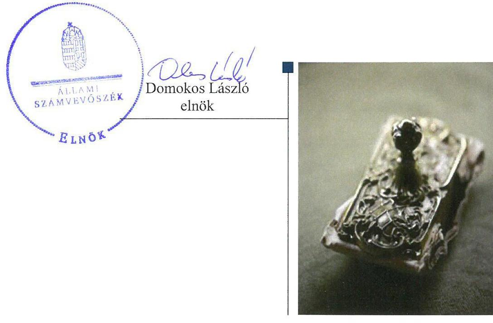
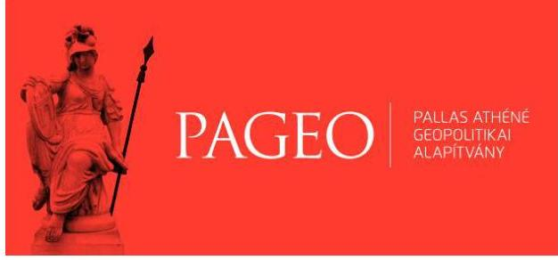

# Jelenetés 

## Alapítványok ellenőrzése

Alapítványok/közalapítványok gazdálkodásának ellenőrzése Pallas Athéné Geopolitikai Alapítvány 2018.

---

# J elentés 

## Alapítványok ellenőrzése

Alapítványok/közalapítványok gazdálkodásának ellenőrzése Pallas Athéné Geopolitikai Alapítvány
2018. 06. hó 21. nap

---

# AZ ELLENŐRZÉST FELÜGYELTE:

- **HOLMAN MAGDOLNA JULIANNA** felügyeleti vezető
- **AZ ELLENŐRZÉST VEZETTE ÉS A VÉGREHAJTÁSÁÉRT FELELŐS:**
  - **DR. SIMON JÓZSEF** ellenőrzésvezető
  - **A PROGRAM ÖSSZEÁLLÍTÁSÁÉRT FELELŐS:**
    - **TÓTPÁL SZABOLCS** osztályvezető

**IKTATÓSZÁM:** EL-0435-032/2018

**TÉMASZÁM:** 2449

**ELLENŐRZÉS-AZONOSÍTÓ SZÁM:** V077503

Jelentéseink az Országgyűlés számítógépes hálózatán és az Interneta a www.asz.hu címen is olvashatóak.

---

# TARTALOMJEGYZÉK 

- ÖSSZEGZÉS ..... 5
- AZ ELLENŐRZÉS CÉLJA ..... 6
- AZ ELLENŐRZÉS TERÜLETE ..... 7
- AZ ELLENŐRZÉS HÁTTERE, INDOKOLTSÁGA ..... 8
- A JELENTÉS LÉNYEGES KÉRDÉSKÖREI ..... 9
- AZ ELLENŐRZÉS HATÓKÖRE ÉS MÓDSZEREI ..... 10
- MEGÁLLAPÍTÁSOK ..... 12
- JAVASLATOK ..... 15
- MELLÉKLETEK ..... 17
I. sz. melléklet: Értelmező szótár ..... 17
- FÜGGELÉK: ÉSZREVÉTELEK ..... 19
- RÖVIDÍTÉSEK JEGYZÉKE ..... 21

---

.

---

# ÖSSZEGZÉS 

A Pallas Athéné Geopolitikai Alapítvány szabályszerűen kialakította a gazdálkodására vonatkozó szervezeti és müködési kereteket. A számviteli elszámolások szabályszerűsége hozzájárult a gazdálkodásának rendezettségéhez. A beszámolókészitési kötelezettségét teljesítette.

## Az ellenőrzés társadalmi indokoltsága

Az alapítványok, az alapító által az alapító okiratban meghatározott tartós cél megvalósítására létrehozott jogi személyek, tevékenységüket az alapító által juttatott vagyon kezelésével, felhasználásával látják el. Az alapítványok működésük és szakmai tevékenységük ellátásához költségvetési támogatásban, illetve a Magyar Nemzeti Bankról szóló 2013. évi CXXXIX. törvény 170. § (3) bekezdés d) pontja alapján, alapítványi támogatásban részesülhetnek.

Az Állami Számvevőszék az államháztartásból származó források felhasználásának keretében ellenőrzi az alapítványok, közalapítványok gazdálkodását. A jogszabályi felhatalmazás szerint azokat az alapítványokat, közalapítványokat ellenőrizheti, amelyek az államháztartásból nyújtott támogatásban, vagy az államháztartásból meghatározott célra ingyenesen juttatott vagyonban részesültek.

Társadalmi elvárás a közszféra pénzügyi- és vagyoni eszközeinek értékelvű és rendeltetésszerű felhasználása, továbbá a Magyar Nemzeti Bank által alapított alapítványok átláthatóságának biztosítása, amelyet az Állami Számvevőszék ellenőrzéseivel támogat.

## Főbb megállapítások, következtetések

A Pallas Athéné Geopolitikai Alapítvány a gazdálkodás szervezeti kereteit és belső szabályozását a jogszabályi előírásoknak megfelelően alakította ki. A gazdasági társaságokban való részvétele a jogszabályi előírások szerint történt. Az alkalmazott számviteli elszámolási gyakorlat a Számviteli törvény előírásainak megfelelt.

Az alapítványi célra juttatott vagyon nyilvántartásba vétele szabályszerű volt.
A Pallas Athéné Geopolitikai Alapítvány a beszámolási kötelezettségét 2016-ban teljesítette, a beszámoló adatait leltárral támasztotta alá. A 2016. évben kapott adomány nem szabályszerű elszámolása miatt az eredménykimutatás jelentős összegű hibát tartalmazott. A Pallas Athéné Geopolitikai Alapítvány Felügyelőbizottsága a beszámolóval kapcsolatos feladatait ellátta.

---

# AZ ELLENŐRZÉS CÉLJA 

Az ellenőrzés célja annak megállapítása, hogy az Alapítvány ${ }^{1}$ gazdálkodása során betartotta-e a vonatkozó jogszabályi előírásokat, szabályszerűen használta-e fel a kapott költségvetési támogatásokat, az államháztartásból meghatározott célra ingyenesen juttatott vagyon használata, hasznosítása a jogszabályi előírásoknak megfelelően történt-e, továbbá, hogy az alapítvány működését szolgáló ellenőrzési, monitoring és nyilvántartási rendszerek szabályszerűen múködtek-e.

---

# **AZ ELLENŐRZÉS TERÜLETE**

## **Pallas Athéné Geopolitikai Alapítvány**

A Pallas Athéné Geopolitikai Alapítványt az MNB^{2} alapította 2014. évben a Felelősségvállalási Stratégia^{3} keretével összhangban.

A Pallas Athéné Geopolitikai Alapítvány alapvető célja geostratégiai és geopolitikai tudásteremtés, nemzetközi geostratégiai intézetekkel való együttműködések ösztönzése, nemzetközi programokban való magyar részvétel elősegítése, gazdaságföldrajzi és gazdaságtörténeti, területi gazdaságtani kutatások ösztönzése, nemzetközi szakirodalmak megjelentetése magyar nyelven.

Legfőbb döntéshozó, képviseleti és ügyintéző szerve a természetes személyekből álló öt fős Kuratórium^{4} volt, mely testületi szerv a jogait nem nyilvános ülésein gyakorolta. A Kuratórium képviseletére annak elnöke és egy alapítótól független, érdekeltségi viszonyban nem álló tagja volt jogosult. Az Alapító^{5} három főből álló FB^{6}-t hozott létre működése és gazdálkodása törvényességének és célszerűségének ellenőrzésére. A munkaszervezet működését Igazgató^{7} irányította.

Az Alapító az alapítványi célok teljesítéséhez az alapításkor 22 000,0 M Ft pénzbeli vagyont biztosított, amely 2016. december 31-ére 30 100,0 M Ft-ra nőtt. A mérleg szerinti vagyon a 2016. január 1-jei 29 427,5 M Ft-ról 2016. december 31-ére 29 719,0 M Ft-ra nőtt. A Pallas Athéné Geopolitikai Alapítvány az ellenőrzött időszakban az államháztartásból támogatást, valamint az államháztartásból meghatározott célra ingyenesen juttatott vagyont nem kapott. A Pallas Athéné Geopolitikai Alapítvány az ellenőrzött időszakban nyitott alapítvány, közhasznú jogállással nem rendelkezett.

A Pallas Athéné Geopolitikai Alapítvány 2016. december 31-én az OPTIMA Zrt.^{8}, a Kasselik-Ház Zrt.^{9}, a KEDO Zrt.^{10} és a FERIDA Zrt.^{11} gazdasági társaságokban összesen 9050,0 M Ft részesedéssel rendelkezett. Tulajdoni részaránya sorrendben két-két társaságban 16,67%-ot, illetve 25,0%-ot tett ki.

A Pallas Athéné Geopolitikai Alapítvány a Pallas Athéné Domus Innovationis Alapítvánnyal történő összeolvadással 2017. december 21-i hatállyal megszűnt, jogutódja a Pallas Athéné Innovációs és Geopolitikai Alapítvány lett.

A főbb gazdálkodási adatokat az 1. táblázat mutatja be.

1. táblázat

**AZ ALAPÍTVÁNY GAZDÁLKODÁSI ADATAI (M FT)**

|   | 2015.
december
31. | 2016.
december
31.  |
| --- | --- | --- |
|  Mérleg szerinti vagyon | 29 427,5 | 29 719,0  |
|  Összes bevétel | 1 310,0 | 1 384,5  |
|  Pénzügyi műveletek bevételei | 1 300,7 | 381,9  |

*Forrás: az Alapítvány 2015-2016. évi beszámolója*

---

# AZ ELLENŐRZÉS HÁTTERE, INDOKOLTSÁGA 

Társadalmi elvárás a közpénzek értékelvű, rendeltetésszerű felhasználása, a közpénzekből nyújtott támogatások átláthatóságának megteremtése, amelyhez az Állami Számvevőszék az államháztartásból nyújtott támogatások ellenőrzésével kíván hozzájárulni. Az ÁSZ ${ }^{12}$ Stratégiájában rögzített célkitűzése, hogy az államháztartáson kívülre nyújtott költségvetési támogatások és az ingyenes vagyonjuttatás ellenőrzésével hozzájáruljon ahhoz, hogy a közpénzeket a civil szervezetek is átlátható módon használják fel. Továbbá az alapítványok gazdálkodása szabályszerűségének bemutatásával hozzájárul ahhoz, hogy a társadalom objektív képet alkothasson az alapítványok működéséről.

Az ellenőrzés eredményeinek célzott felhasználói a nyilvánosság, a jogalkotó, továbbá az alapítványok alapítói és szervei. Az ellenőrzés eredményeképp a törvényalkotás számára tapasztalatok állnak rendelkezésre az alapítványok gazdálkodása szabályozásához. Az ellenőrzött szervezetek szintjén gazdálkodásuk vonatkozásában a hiányosságok, szabálytalanságok feltárása, az ennek kapcsán megfogalmazott megállapítások elősegíthetik az alapítványok szabályszerű gazdálkodását, míg a társadalom számára információt szolgáltat arról, hogy az alapítványok a közpénzeket szabályszerűen használták-e fel. Az alapítványok gazdálkodása szabályszerűségének bemutatásával az ellenőrzés értékteremtő módon járul hozzá az ÁSZ stratégiai céljainak megvalósításához, a nyilvánosság megfelelő tájékoztatásához.

A 2016. évi XXXI. törvény 2016. május 6-ával módosította a Magyar Nemzeti Bankról szóló 2013. évi CXXXIX. törvényt, amelynek értelmében az MNB által létrehozott alapítványok gazdálkodását az ÁSZ ellenőrzi.

---

# A JELENTÉS LÉNYEGES KÉRDÉSKÖREI 

1. Az Alapítvány gazdálkodása szabályszerű volt-e?
2. Az alapítványi célra juttatott vagyon nyilvántartásba vétele szabályszerű volt-e?
3. Az Alapítvány a beszámolási kötelezettségét szabályszerűen teljesítette-e, valamint a Felügyelőbizottság ellátta-e a feladatát?

---

# AZ ELLENŐRZÉS HATÓKÖRE ÉS MÓDSZEREI 

## Az ellenőrzés típusa

Szabályszerúségi ellenőrzés.

## Az ellenőrzött időszak

A 2016. január 1-től 2016. december 31-ig tartó időszak. Az ellenőrzés kiterjedt az ellenőrzött évet érintő, de az azt megelőzően a költségvetéssel, valamint az ellenőrzött időszakot követően a beszámolással kapcsolatban hozott döntések dokumentumaira is.

## Az ellenőrzés tárgya

Az ellenőrzés tárgya az Alapítvány vonatkozó jogszabályi előírások szerinti gazdálkodási tevékenysége. Ezen belül az Alapítvány a gazdálkodásához kapcsolódó szervezeti és szabályozási kereteinek a jogszabályi előírásoknak megfelelő kialakítása, a kapott költségvetési/egyéb támogatások, az alapítványi célok megvalósítására juttatott vagyon, vagyoni hozzájárulás nyilvántartásba vételének szabályszerűsége. Az ellenőrzés kiterjed továbbá az Alapítvány múködését, gazdálkodását szolgáló nyilvántartási, ellenőrzési, monitoring tevékenységére.

## Az ellenőrzött szervezet

Pallas Athéné Geopolitikai Alapítvány

## Az ellenőrzés jogalapja

Az MNB tv. ${ }^{13} 162 . \S$ (5) bekezdése.

## Az ellenőrzés módszerei

Az ellenőrzést az ellenőrzött időszakban hatályos jogszabályok, a nemzetközi standardokat irányadónak tekintő ellenőrzési módszertanok, valamint az ellenőrzés szakmai szabályai figyelembevételével végezte az ÁSZ.

Az MNB. tv. 2016. május 6-án hatályba lépett módosítása adott felhatalmazást az ÁSZ számára az MNB által létrehozott alapítványok ellenőrzésére. Az ellenőrzés tervezése és előkészítése során - az ellenőrzésre vonatkozó módszertani előírások alapján - a felelős fél (ellenőrzött szervezet)

---

környezetének, szabályozási keretrendszerének, múködésének, finanszírozási módjának, tevékenységének, múveleteinek, szabályozási környezetének, az ellenőrzés szempontjából releváns kontrollok, belső irányítási, számviteli rendszereinek, valamint az ellenőrzési bizonyítékok megismeréséhez az ellenőrzött szervezettől a 2014. és a 2015. évek tekintetében strukturált adatbekérést végzett az ÁSZ. A beérkezett dokumentumok értékelését követően megtörtént a törvény hatálybalépését követő legkorábbi lezárt üzleti évre vonatkozó, az ellenőrzés lefolytatásához szükséges feladatok meghatározása.

Az ellenőrzést az ellenőrzési program szempontjai alapján végezte az ÁSZ. Az ellenőrzés ideje alatt az ellenőrzött szervezettel történő kapcsolattartás az ÁSZ SZMSZ ${ }^{14}$-ének vonatkozó előírásai alapján történt.

Az ellenőrzési kérdések megválaszolásához szükséges bizonyítékok megszerzése az ellenőrzött által rendelkezésre bocsátott dokumentumokra, adatokra alapozva megfigyelés, szemle (szemrevételezés), kérdésfeltevés (információkérés), mintavételezés, valamint elemző eljárás útján történt. A mintavételezés véletlen mintavételi eljárással történt.

A beruházási-felújítási kiadások, az igénybevett és egyéb szolgáltatások ráfordításai, a személyi jellegú ráfordítások elszámolása, valamint a mérlegsorok szabályszerűségét véletlen mintavétellel ellenőrizte az ÁSZ. A minta alapján a sokaságban előforduló hibaarányt becsülte. „Szabályszerű" értékeléssel rendelkezett egy ellenőrzött terület, amennyiben 95\%-os bizonyossággal a teljes sokaságban a hibaarány legfeljebb 10\%, „nem szabályszerű" értékeléssel rendelkezett, amennyiben 10\%-nál magasabb arányt képviselt. Abban az esetben, ha a teljes sokaság tekintetében a 10\%os hibaarányhoz való viszony megítélésnek megbízhatósága nem érte el a 95\%-ot, annak elérése érdekében az értékelés további szempontokkal egészült ki, és figyelembe vételre került a feltárt hibák értéke.

Az ellenőrzési bizonyítékként felhasznált adatforrások közé tartoztak egyrészt a szakmai program részletes szempontjainál felsorolt adatforrások, másrészt minden - az ellenőrzés folyamán feltárt, az ellenőrzés szempontjából információt tartalmazó - dokumentum.

Az ellenőrzés lefolytatásához az Alapítvány a kitöltött tanúsítványok, valamint az ÁSZ által kért dokumentumok elektronikus úton való megküldésével szolgáltatott adatokat, információkat. Az így rendelkezésre bocsátott adatok, információk és a tanúsítványok adatai valódiságának kontrollja az ellenőrzés keretében történt.

---

# 1. Az Alapítvány gazdálkodása szabályszerű volt-e? 

Összegző megállapítás

Az Alapítvány gazdálkodásának szervezeti kereteit és belső szabályait szabályszerűen kialakította. A gazdálkodása, a költségvetési terv kialakítását kivéve, szabályszerű volt.
1.1. számú megállapítás

Az Alapítvány a gazdálkodás szervezeti kereteit és belső szabályozását a jogszabályi előírásoknak megfelelően alakította ki.

Az Alapítvány a 2016. évben rendelkezett Alapító okirat ${ }_{1,2}{ }^{15}$-vel. Az Alapító okirat ${ }_{3-2}$ tartalmazta a Ptk. ${ }^{16}$-ben előírt tartalmi elemeket.

Az Alapítvány a gazdálkodására vonatkozó alapvető szabályokat, fel-adat-és hatásköröket Alapító okirat ${ }_{3-2}$-ben, az SZMSZ ${ }^{17}$-ben, a Kuratóriumi Ügyrend ${ }^{18}$-ben, valamint a Pénzkezelési Szabályzat ${ }^{19}$-ban alakította ki. Az Alapítvány rendelkezett Számviteli politikával ${ }^{20}$ és az annak mellékleteként Értékelési szabályzat ${ }^{21}$-tal, Leltárkészítési és leltározási szabályzat ${ }^{22}$-tal, Pénzkezelési Szabályzattal, valamint Számlarend ${ }^{23}$-del, amelyek megfeleltek a Számv. tv. ${ }^{24}$, az Ectv. ${ }^{25}$ és a Civilszr. ${ }^{26}$ előírásainak.

Az Alapítvány gazdálkodásával kapcsolatos könyvvezetési, nyilvántartási rendszerének kialakítása a Számv. tv., az Ectv. és a Civilszr. előírásainak betartásával történt.
2016. augusztus 12-én lépett hatályba az Alapítvány Adatkiadási szabályzata ${ }^{27}$.

Az Alapítvány elkészítette költségvetési tervét, azonban a kiadásai és bevételei nem voltak egyensúlyban. Az Alapítvány gazdasági társaságokban való részvétele szabályszerű volt.

Az Alapítvány a 2016. évi költségvetési tervét az Ecvhr. ${ }^{28}$ 3. § (1) bekezdésében előírtakat betartva, a Civilszr. alapján készített beszámoló tartalmi elemeinek megfelelően állította össze, amelyet a Kuratórium jóváhagyott.

A költségvetési terv kialakítása során az Alapítvány nem tartotta be az Ecvhr. 3. § (2) bekezdésében foglalt rendelkezést, az éves költségvetési tervben a kiadások és a bevételek nem voltak egyensúlyban, mivel a tervezett kiadások 1047,7 M Ft-tal meghaladták a tervezett bevételeket.

Az Alapítvány gazdasági társaságokban való részvételét az Alapító az Alapító okirat ${ }_{1-2}$-ben a Ptk. ${ }_{2}$, valamint az Ectv. rendelkezései alapján határozta meg. A gazdasági társaságok alapszabályaiban meghatározott feladatok összhangban voltak az Alapítvány célkitűzéseivel. Az Alapítvány gazdasági társaságok múködtetése és felügyelete során betartotta a Ptk. ${ }_{2}$ és az Ectv. előírásait.

---

# 1.3. számú megállapítás 

Az Alapítvány a beruházási-felújítási kiadásokat és a költségeket, ráfordításokat szabályszerűen számolta el.

A beruházási-felújítási kiadások, az igénybevett és egyéb szolgáltatások ráfordításai, valamint a személyi jellegú ráfordítások elszámolása során az Alapítvány betartotta a Számv. tv. és az Ectv. rendelkezéseit.

## 2. Az alapítványi célra juttatott vagyon nyilvántartásba vétele szabályszerű volt-e?

## Összegző megállapítás

Az alapítványi célra juttatott vagyon nyilvántartásba vétele szabályszerű volt.

Az Alapítvány az Alapító okirat ${ }_{1-2}$-ban foglalt előírásokkal összhangban szabályozta az Alapító által rendelkezésre bocsátott vagyoni hozzájárulás felhasználásának módját, nyilvántartását, elszámolásának rendjét.

Az alapítványi célra juttatott vagyon a Számv. tv.-nek megfelelően a főkönyvben rögzítésre került.

## 3. Az Alapítvány a beszámolási kötelezettségét szabályszerűen teljesítette-e, valamint a Felügyelőbizottság ellátta-e a feladatát?

## Összegző megállapítás

Az Alapítvány a beszámolási kötelezettségét teljesítette. A Felügyelőbizottság beszámolóval kapcsolatos ellenőrzési feladatait elvégezte.
3.1. számú megállapítás

Az Alapítvány a beszámolási kötelezettségének eleget tett. A beszámolót leltárral alátámasztotta. Az adomány nem szabályszerű elszámolása miatt jelentős összegű hibát tartalmazott az eredménykimutatás.

Az Alapítvány a Civilszr.-ben foglaltaknak megfelelően kettős könyvvitelt vezetett. A 2016. évi vagyoni, pénzügyi és jövedelmi helyzetéről a Számv. tv.-ben, az Ectv.-ben és a Civilszr.-ben foglaltaknak megfelelően egyszerűsített éves beszámolót készített. Az Ectv. rendelkezésével összhangban a beszámoló tartalmazta a kiegészítő mellékletet.

Az Alapítvány a beszámoló elkészítéséhez, a mérlegtételek alátámasztásához a 2016. évre vonatkozóan a Számv. tv. előírásainak, valamint a Leltározási és leltárkészítési szabályzatban foglaltaknak megfelelően a mérleg fordulónapján meglévő eszközökről és forrásokról mennyiségben és értékben leltárt készített.

Az analitikus és főkönyvi nyilvántartásokkal való egyeztetés a Szám. tv. előírásainak megfelelően megtörtént.

Az Alapítvány a 2016. évben kapott adomány tekintetében nem tartotta be a Számv. tv. 44. § (2) bekezdésében foglalt rendelkezést, mert az adományból az üzleti évben költséggel, ráfordítással nem ellentételezett öszszeget passzív időbeli elhatárolásként nem számolta el.

---

# 3.2. számú megállapítás 

A Kuratórium az Alapítvány 2016. évi egyszerűsített éves beszámolóját az Ectv.-ben és a Cnytv. ${ }^{29}$-ben meghatározott időpontig és tartalommal határozatban elfogadta és letétbe helyezte az Országos Bírósági Hivatalnál.

## A Felügyelőbizottság a beszámoló elfogadásával kapcsolatos ellenőrzési feladatait ellátta.

Az Alapítvány gazdálkodásához kapcsolódó, az egyszerűsített éves beszámoló vizsgálatára vonatkozó ellenőrzési feladatait az Alapító okirat ${ }_{1-2}$-ben, az SZMSZ-ben foglaltak alapján az FB elvégezte, a 4/2017. (05.25.) számú felügyelő bizottsági határozatában a 2016. évi beszámolót a Kuratóriumnak elfogadásra javasolta.

---

# JAVASLATOK 

Az ÁSZ tv. 33. § (1) bekezdésében foglaltak értelmében az ellenőrzött szervezet vezetője köteles a jelentésben foglalt megállapításokhoz kapcsolódó intézkedési tervet összeállítani és azt a jelentés kézhezvételétől számított 30 napon belül az ÁSZ részére megküldeni. Amennyiben az ellenőrzött szervezet vezetője nem küldi meg határidőben az intézkedési tervet, vagy továbbra sem elfogadható intézkedési tervet küld, az Állami Számvevőszék elnöke az ÁSZ tv. 33. § (3) bekezdése a) és b) pontjaiban foglaltakat érvényesítheti.

## A Pallas Athéné Innovációs és Geopolitikai Alapítvány, mint a Pallas Athéné Geopolitikai Alapítvány jogutódja Kuratóriuma elnökének

1. Intézkedjen az adományok elszámolásánál a Számv. tv. elöirásainak betartására.
(3.1. sz. megállapítás 4. bekezdése alapján)

---

.

---

# MELLÉKLETEK 

## I. SZ. MELLÉKLET: ÉRTELMEZŐ SZÓTÁR

alapító

## alapító

alapítvány
z alapítványt, mint jogi személyt az alapító okiratban meghatározott tartós cél folyamatos megvalósítására létrehozó, az alapítvány részére az alapító okiratban meghatározott, az alapítványi cél megvalósításához szükséges pénzbeli és nem pénzbeli vagyoni hozzájárulást teljesítő személy(ek)/jogi személy(ek). (Forrás: Ptk. 2 3:378. §, 3:382. § (2) bek.)
Magánszemély, jogi személy és jogi személyiséggel nem rendelkező gazdasági társaság (a továbbiakban együtt: alapító) - tartós közérdekű célra - alapító okiratban alapítványt hozhat létre. Alapítvány elsődlegesen gazdasági tevékenység folytatása céljából nem alapítható. Az alapítvány javára a célja megvalósításához szükséges vagyont kell rendelni. Az alapítvány jogi személy. Az alapítvány a bírósági nyilvántartásba vételével jön létre. (Forrás: Ptk. ${ }^{30}$ 74/A. § (1) - (2) bekezdés)
Az alapítvány az alapító által az alapító okiratban meghatározott tartós cél folyamatos megvalósítására létrehozott jogi személy. Az alapító az alapító okiratban meghatározza az alapítványnak juttatott vagyont és az alapítvány szervezetét. Alapítvány nem alapítható gazdasági-vállalkozási tevékenység folytatására. Az alapítvány az alapítványi cél megvalósításával közvetlenül összefüggő gazdasági tevékenység végzésére jogosult. Alapítvány nem lehet korlátlan felelősségű tagja más jogalanynak, nem létesíthet alapítványt és nem csatlakozhat alapítványhoz. (Forrás: Ptk. 3 3:378§, 3:379. § (1) - (3) bekezdés)

Az MNB feladataival és elsődleges céljával összhangban, a többségi tulajdonában álló gazdasági társaságot alapíthat vagy alapítványt hozhat létre. (Forrás: MNB tv. 162. § (2) bekezdés)
adomány
A civil szervezetnek - létesítő/alapító okiratban rögzített céljaira - ellenszolgáltatás nélkül juttatott eszköz, illetve nyújtott szolgáltatás. (Forrás: Ectv. 2. § 1. pont)
Az a pénzbeli vagy természetbeni juttatás, amelyet az adományozó az adományozott civil szervezet alapcéljának, illetve közhasznú céljának elérésére ellenszolgáltatás nélkül juttat. (Forrás: Ecvhr. 1. § (5) bekezdés a) pont)
államháztartás
Az államháztartás a közfeladatok ellátásának egységes szervezeti, tervezési, gazdálkodási, ellenőrzési, finanszírozási, adatszolgáltatási és beszámolási szabályok szerint működő rendszere, amely központi és önkormányzati alrendszerből áll.
Az államháztartás központi alrendszerébe tartozik az állam, a központi költségvetési szerv, a törvény által az államháztartás központi alrendszerébe sorolt köztestület, és ezen köztestület által irányított köztestületi költségvetési szerv.
Az államháztartás önkormányzati alrendszerébe tartozik a helyi önkormányzat, a helyi nemzetiségi önkormányzat és az országos nemzetiségi önkormányzat, a Mötv. ${ }^{31}$ és a nemzetiségek jogairól szóló 2011. évi CLXXIX. törvény szerint létrehozott társulás, valamint a területfejlesztésről és a területrendezésről szóló törvény alapján létrejött területfejlesztési önkormányzati társulás, a térségi fejlesztési tanács, és a megnevezett szervezetek által irányított költségvetési szerv. (Forrás: Áht. ${ }^{32}$ 2-3. §)
beruházás
A tárgyi eszköz beszerzése, létesítése, saját vállalkozásban történő előállítása, a beszerzett tárgyi eszköz üzembe helyezése. A beruházás a meglévő tárgyi eszköz bővítését, rendeltetésének megváltoztatását, átalakítását, élettartamának, teljesítőképességének közvetlen növelését eredményező tevékenység. (Forrás: Számv. tv. 3. § (4) bekezdés 7. pont)

---

civil szervezet

Felügyelőbizottság
felújítás
gazdálkodó tevékenység
gazdasági-vállalkozási tevékenység
költségvetési támogatás
közhasznú tevékenység
vagyoni hozzájárulás
2014. március 15-ig: a civil társaság, illetve a Magyarországon nyilvántartásba vett egyesület - a párt kivételével -, valamint az alapítvány. Civil szervezet alatt az e törvény II-VI. és VIII-X. fejezetében a civil társaságot, továbbá a VII-X. fejezetében a kölcsönös biztosító egyesületet és a szakszervezetet nem kell érteni. (Forrás: Ectv. 2. § 6. pont)
2014. március 15-től: a civil társaság; a Magyarországon nyilvántartásba vett egyesület - a párt, a szakszervezet és a kölcsönös biztosító egyesület kivételével és - a közalapítvány és a pártalapítvány kivételével - az alapítvány. (Forrás: Ectv. 2. § 6. pont)
A tagok vagy az alapítók a létesítő okiratban három tagból álló felügyelőbizottság létrehozását rendelhetik el azzal a feladattal, hogy az ügyvezetést a jogi személy érdekeinek megóvása céljából ellenőrizze. A felügyelőbizottság tagjai a jogi személy ügyvezetésétől függetlenek, tevékenységük során nem utasíthatóak. A felügyelőbizottság köteles a tagok vagy az alapítók döntéshozó szerve elé kerülő előterjesztéseket megvizsgálni, és ezekkel kapcsolatos álláspontját a döntéshozó szerv ülésén ismertetni. A felügyelőbizottsági tagok az ellenőrzési kötelezettségük elmulasztásával vagy nem megfelelő teljesítésével a jogi személynek okozott károkért a szerződésszegéssel okozott kárért való felelősség szabályai szerint felelnek a jogi személlyel szemben. (Forrás: Ptk. 3 :26-3:28 §)
Az elhasználódott tárgyi eszköz eredeti állaga (kapacitása, pontossága) helyreállítását szolgáló időszakonként visszatérő olyan tevékenység, melynek során az eszköz élettartama megnövekszik, minősége, használata jelentősen javul, így a pótlólagos ráfordításból a jövőben gazdasági előnyök származnak. (Forrás: Számv. tv. 3. § (4) 8. pont) Azon tevékenységek összessége, amelyek a civil szervezet vagyoni, pénzügyi, jövedelmi helyzetére kiható gazdasági eseményt eredményeznek. (Forrás: Ectv. 2. § 10. pont)
A jövedelem- és vagyonszerzésre irányuló vagy azt eredményező, üzletszerűen végzett gazdasági tevékenység, kivéve az adomány (ajándék) elfogadását, a létesítő okiratban meghatározott cél szerinti tevékenységet (ideértve a közhasznú tevékenységet is), - 2015. november 28-tól - a pénzeszközök betétbe, értékpapírba, társasági részesedésbe történő elhelyezését és az ingatlan megszerzését, használatának átengedését és átruházását. (Forrás: Ectv. 2. § 11. pont)
az államháztartás alrendszerei terhére nyújtott pénzbeli vagy nem pénzbeli juttatás, amelyet a támogató nem elsősorban ellenszolgáltatás ellenében, de konkrét program megvalósítása vagy meghatározott időszakban a támogatott szervezet müködtetése érdekében nyújt. Költségvetési támogatás különösen: a pályázat útján, valamint egyedi döntéssel kapott költségvetési támogatás; az Európai Unió strukturális alapjaiból, illetve a Kohéziós Alapból származó, a költségvetésből juttatott támogatás; az Európai Unió költségvetéséből vagy más államtól, nemzetközi szervezettől származó támogatás és a személyi jövedelemadó meghatározott részének az adózó rendelkezése szerint felajánlott összege. (Forrás: Ectv. 2. § 15. pont)
minden olyan tevékenység, amely a létesítő okiratban megjelölt közfeladat teljesítését közvetlenül vagy közvetve szolgálja, ezzel hozzájárulva a társadalom és az egyén közös szükségleteinek kielégítéséhez. (Forrás: Ectv. 2. § 20. pont)
Az alapítvány alapítója által az alapításkor az alapítvány részére teljesítendő olyan hozzájárulás, amelynek értékét nem lehet visszakövetelni. Az alapító által az alapítvány rendelkezésére bocsátott vagyon pénzből és nem pénzbeli vagyoni hozzájárulásból állhat. Az alapítónak legalább az alapítvány müködésének megkezdéséhez szükséges vagyont a nyilvántartásba-vételi kérelem benyújtásáig át kell ruháznia az alapítványra. Az alapítónak a teljes juttatott vagyont legkésőbb az alapítvány nyilvántartásba vételétől számított egy éven belül kell átruháznia az alapítványra. (Forrás: Ptk. 3:9. § (1) bek., 3:10. § (1) bek., 3:382. § (2)-(3) bek.)

---

# FÜGGELÉK: ÉSZREVÉTELEK 

A jelentéstervezetet a Számvevőszék 15 napos észrevételezésre megküldte az ellenőrzött szervezet vezetőjének az ÁSZ tv. 29. §* (1) bekezdése előírásának megfelelően.
A függelék tartalmazza az ellenőrzött észrevételeit, illetve az el nem fogadott észrevételek elutasításának indoklását.

## Észrevétel

A jelentéstervezet 13. oldal 3.1. számú megállapítás 4. bekezdésére:
"A fentiek kapcsán tisztelettel megjegyezzük, hogy a megállapítás alapjául szolgáló tényállás fenti kiemelés szerinti része nem helyesen lett rögzítve. Ezen kijelentésünk alapja az, hogy nincs a hivatkozott adománynak az üzleti évben költséggel, ráfordítással nem ellentételezett összege. A Kasselik-Ház Zrt-től 2016. decemberében kapott 1.000,0 M Ft-os adomány teljes összege ellentételezett a 2015. és 2016. évben felmerült, alaptevékenységgel összefüggő költségekkel, így az adomány passzív időbeli elhatárolásként való szerepeltetése nem lett volna összhangban az Szám. tv. rendelkezéseivel.
A költségekkel való ellentételezés alapja, hogy a vizsgált Alapítvány és az Adományozó közti jogviszony lehetővé teszi az adomány összegének utófinanszírozásként történő felhasználását, azaz az adomány összegének ellentételezését a juttatásig felmerült költségekkel."

## El nem fogadott észrevétel indoklása

A jelentéstervezet 3.1. számú megállapításában szereplő, az adomány szabálytalan elszámolására tett észrevételét nem fogadtuk el. Az 1000000 eFt adományozásáról szóló adományozási szerződés 2016. december 20-án került aláírásra, amelynek jóváírása az alapítvány számláján december 21-én megtörtént. Észrevételében jelezte, hogy az „Alapítvány és az Adományozó közti jogviszony lehetővé teszi az adomány összegének utófinanszírozásként történő felhasználását". Ugyanakkor az adományozási szerződés egyik pontja sem rögzíti a finanszírozás ezen konstrukcióját. Másrészt észrevételében azt is jelezte, hogy az „adomány teljes összege ellentételezett a 2015. és 2016. évben felmerült, alaptevékenységekkel összefüggő költségekkel". Ugyanakkor az alapítvány - ellenőrzés részére rendelkezésre bocsájtott és az Országos Bírósági Hivatal honlapján is közzétett - 2016. évi egyszerűsített beszámolója és közhasznúsági melléklete az adomány felhasználását sem számszakilag, sem szövegesen nem mutatja be, sőt a közhasznúsági melléklet „Támogatás tárgyévi felhasználásának szöveges bemutatása" részben arról számolt be az alapítvány, hogy mivel „az összeg 2016.12.21-én került átutalásra, így a felhasználás tárgyévben nem kezdődött meg." Mindezek alapján észrevétele megállapításunkat nem módosítja.

[^0]
[^0]:    * 29. § (1) Az Állami Számvevőszék az ellenőrzési megállapításait megküldi az ellenőrzött szervezet vezetőjének vagy az általa megbízott személynek, és annak, akinek személyes felelősségét állapította meg.
    (2) Az ellenőrzött szervezet vezetője és a felelősként megjelölt személy az ellenőrzés megállapításaira tizenöt napon belül írásban észrevételt tehet.
    (3) Az Állami Számvevőszék az észrevételre a beérkezésétől számított harminc napon belül írásban válaszol. A figyelembe nem vett észrevételeket köteles a jelentésben feltüntetni, és megindokolni, hogy azokat miért nem fogadta el.

---

.

---

# RÖVIDÍTÉSEK JEGYZÉKE 

${ }^{1}$ Alapítvány
${ }^{2}$ MNB
${ }^{3}$ Felelősségvállalási Stratégia
${ }^{4}$ Kuratórium
${ }^{5}$ Alapító
${ }^{6} \mathrm{FB}$
${ }^{7}$ Igazgató
${ }^{8}$ OPTIMA Zrt.
${ }^{9}$ Kasselik-Ház Zrt.
${ }^{10}$ KEDO Zrt.
${ }^{11}$ FERIDA Zrt.
${ }^{12}$ ÁSZ
${ }^{13}$ MNB tv.
${ }^{14}$ ÁSZ SZMSZ
${ }^{15}$ Alapító okirat1
Alapító okirat2
${ }^{16}$ Ptk. 2
${ }^{17}$ SZMSZ
${ }^{18}$ Kuratórium ügyrend
${ }^{19}$ Pénzkezelési szabályzat
${ }^{20}$ Számviteli Politika
${ }^{21}$ Értékelési szabályzat
${ }^{22}$ Leltárkészítési és leltározási szabályzat
${ }^{23}$ Számlarend
${ }^{24}$ Civilszr.
${ }^{25}$ Ectv.
${ }^{26}$ Számv. tv.
${ }^{27}$ Adatkiadási szabályzat
${ }^{28}$ Ecvhr.

Pallas Athéné Geopolitikai Alapítvány
Magyar Nemzeti Bank
a Magyar Nemzeti Bank Társadalmi Felelősségvállalási Stratégiája
Pallas Athéné Geopolitikai Alapítvány Kuratóriuma
Magyar Nemzeti Bank
Pallas Athéné Geopolitikai Alapítvány Felügyelőbizottsága
Pallas Athéné Geopolitikai Alapítvány munkaszervezetének vezetője
OPTIMA Befektetési-, Ingatlanhasznosító és Szolgáltató Zártkörűen Működő Részvénytársaság
Kasselik-Ház Ingatlanfejlesztő Zártkörűen Múködő Részvénytársaság
Kecskeméti Duális Oktatás Zártkörűen Múködő Részvénytársaság
FERIDA Zártkörűen Múködő Részvénytársaság
Állami Számvevőszék
2013. évi CXXXIX. törvény a Magyar Nemzeti Bankról (hatályos 2013. szeptember 27-étől)

Állami Számvevőszék Szervezeti és Múködési Szabályzata
Pallas Athéné Geopolitikai Alapítvány Alapító okirata (hatályos 2015. november 9től)
Pallas Athéné Geopolitikai Alapítvány Alapító okirata (hatályos 2016. január 25-től)
2013. évi V. törvény a Polgári Törvénykönyvről (hatályos 2014. március 15-től)

Pallas Athéné Geopolitikai Alapítvány Szervezeti és Múködési Szabályzat
(hatályos 2014. november 13-tól)
Pallas Athéné Geopolitikai Alapítvány Kuratóriumának Ügyrendje (hatályos 2014. november 13-tól)
Pallas Athéné Geopolitikai Alapítvány Pénzkezelési szabályzata (hatályos 2016. január 1-jétől)
Pallas Athéné Geopolitikai Alapítvány Számviteli Politikája (hatályos 2016. január 1-jétől)
Pallas Athéné Geopolitikai Alapítvány Értékelési szabályzata (hatályos 2016. január 1-jétől)
Pallas Athéné Geopolitikai Alapítvány Leltárkészítési és leltározási szabályzata leltározási szabályzat (hatályos 2016. január 1-jétől)
Pallas Athéné Geopolitikai Alapítvány Számlarend (hatályos 2016. január 1-jétől)
A számviteli törvény szerinti egyes egyéb szervezetek beszámoló-készítési és könyvvezetési kötelezettségének sajátosságairól szóló 224/2000. (XII. 19.) Korm. rendelet (hatályos 2001. január 1-jétől)
2011. évi CLXXV. törvény az egyesülési jogról, a közhasznú jogállásról, valamint a civil szervezetek múködéséről és támogatásáról (hatályos 2011. december 22-től) 2000. évi C. törvény a számvitelről (hatályos 2001. január 1-jétől)

Pallas Athéné Geopolitikai Alapítvány Adatkiadási szabályzata (hatályos 2016. augusztus 12-től)
A civil szervezetek gazdálkodása, az adománygyűjtés és a közhasznúság egyes kérdéseiről szóló 350/2011. (XII. 30.) Korm. rendelet (hatályos 2012. január 1jétől)

---

${ }^{29}$ Cnytv.
${ }^{30}$ Ptk. 1
${ }^{31}$ Mötv.
${ }^{32}$ Áht.
2011. évi CLXXXI. törvény a civil szervezetek bírósági nyilvántartásáról és az ezzel összefüggő eljárási szabályokról (hatályos 2012. január 1-jétől)
1959. évi IV. törvény a Polgári Törvénykönyvről (hatályos 2014. március 14-ig)
2011. évi CLXXXIX. törvény Magyarország helyi önkormányzatairól (hatályos 2012. január 1-jétől, kivéve a 144. § (2)-(5) bekezdéseiben meghatározott paragrafusok egyes bekezdéseit, pontjait, amelyek 2013. január 1-jén, illetve a 2014. évi általános önkormányzati választások napján léptek hatályba)
2011. évi CXCV. törvény - az államháztartásról (hatályos 2012. január 1-jétől)

---

# ÁLLAMI SZÁMVEVŐSZÉK 

1052 Budapest, Apáczai Csere János utca 10.
Levélcím: 1364 Budapest 4. Pf. 54
Telefon: +36 14849100 Telefax: +36 14849200
www.asz.hu