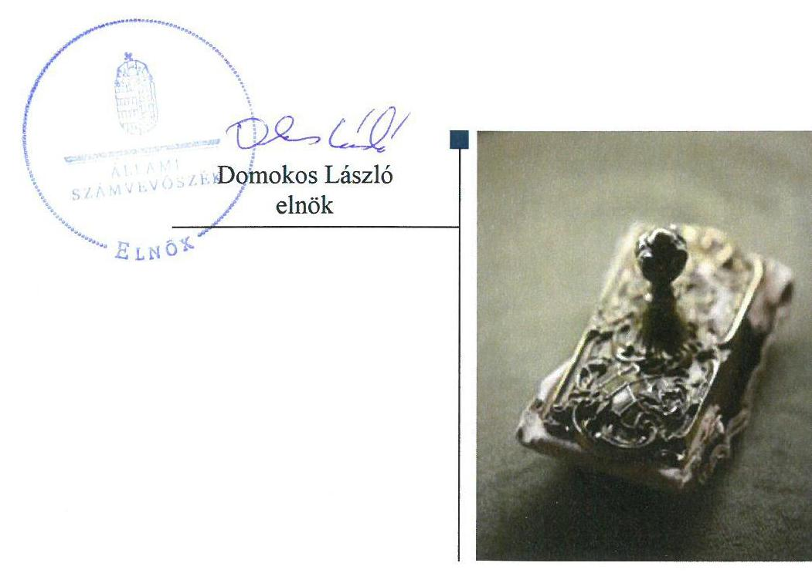
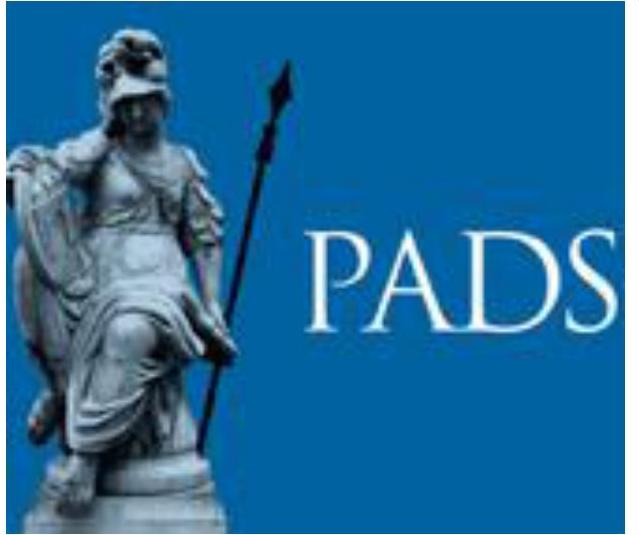

# Jelentés 

## Alapítványok ellenőrzése

Alapítványok/közalapítványok gazdálkodásának ellenőrzése Pallas Athéné Domus Scientiae Alapítvány 2018.

---

# Jelentés 

## Alapítványok ellenőrzése

Alapítványok/közalapítványok gazdálkodásának ellenőrzése Pallas Athéné Domus Scientiae Alapítvány 2018. 06. hó 21. nap

---

# AZ ELLENŐRZÉST FELÜGYELTE:

- **HOLMAN MAGDOLNA JULIANNA** felügyeleti vezető
- **AZ ELLENŐRZÉST VEZETTE ÉS A VÉGREHAJTÁSÁÉRT FELELŐS:**
  - **DR. SIMON JÓZSEF** ellenőrzésvezető
  - **A PROGRAM ÖSSZEÁLLÍTÁSÁÉRT FELELŐS:**
    - **TÓTPÁL SZABOLCS** osztályvezető

**IKTATÓSZÁM:** EL-0433-033/2018

**TÉMASZÁM:** 2449

**ELLENŐRZÉS-AZONOSÍTÓ SZÁM:** V077506

Jelentéseink az Országgyűlés számítógépes hálózatán és az Interneten a www.asz.hu címen is olvashatóak.

---

# TARTALOMJEGYZÉK 

■ ÖSSZEGZÉS ..... 5
■ AZ ELLENŐRZÉS CÉLJA ..... 6
■ AZ ELLENŐRZÉS TERÜLETE ..... 7
■ AZ ELLENŐRZÉS HÁTTERE, INDOKOLTSÁGA ..... 8
■ A JELENTÉS LÉNYEGES KÉRDÉSKÖREI ..... 9
■ AZ ELLENŐRZÉS HATÓKÖRE ÉS MÓDSZEREI ..... 10
■ MEGÁLLAPÍTÁSOK ..... 12
■ MELLÉKLETEK ..... 15
I. sz. melléklet: Értelmező szótár ..... 15
■ FÜGGELÉK: ÉSZREVÉTELEK ..... 17
■ RÖVIDÍTÉSEK JEGYZÉKE ..... 19

---

.

---

# ÖSSZEGZÉS 

A Pallas Athéné Domus Scientiae Alapítvány gazdálkodási kereteinek kialakítása és ezek gyakorlati alkalmazása szabályszerű volt, ezáltal biztosított volt a gazdálkodás átláthatósága és rendezettsége.

## Az ellenőrzés társadalmi indokoltsága

Az alapítványok, az alapító által az alapító okiratban meghatározott tartós cél megvalósítására létrehozott jogi személyek, tevékenységüket az alapító által juttatott vagyon kezelésével, felhasználásával látják el. Az alapítványok működésük és szakmai tevékenységük ellátásához költségvetési támogatásban, illetve a Magyar Nemzeti Bankról szóló 2013. évi CXXXIX. törvény 170. § (3) bekezdés d) pontja alapján, alapítványi támogatásban részesülhetnek.

Az Állami Számvevőszék az államháztartásból származó források felhasználásának keretében ellenőrzi az alapítványok, közalapítványok gazdálkodását. A jogszabályi felhatalmazás szerint azokat az alapítványokat, közalapítványokat ellenőrizheti, amelyek az államháztartásból nyújtott támogatásban, vagy az államháztartásból meghatározott célra ingyenesen juttatott vagyonban részesültek.

Társadalmi elvárás a közszféra pénzügyi- és vagyoni eszközeinek értékelvű és rendeltetésszerű felhasználása, továbbá a Magyar Nemzeti Bank által alapított alapítványok átláthatóságának biztosítása, amelyet az Állami Számvevőszék ellenőrzéseivel támogat.

## Főbb megállapítások, következtetések

A Pallas Athéné Domus Scientiae Alapítvány a gazdálkodás szervezeti kereteit és belső szabályozását a jogszabályi előírásoknak megfelelően alakította ki. A gazdasági társaságokban való részvétele a jogszabályi előírások szerint történt. Az alkalmazott számviteli elszámolási gyakorlat a Számviteli törvény előírásainak megfelelt.

Az alapítványi célra juttatott vagyon nyilvántartásba vétele szabályszerű volt.
A Pallas Athéné Domus Scientiae Alapítvány a beszámolási kötelezettségét szabályszerűen teljesítette. A Pallas Athéné Domus Scientiae Alapítvány Felügyelőbizottsága a beszámolóval kapcsolatos feladatait elvégezte. A Pallas Athéné Domus Scientiae Alapítvány biztosította a tevékenységéről szóló beszámolási adatok hozzáférhetőségét, ezáltal a gazdálkodási helyzetének átláthatóságát.

---

# AZ ELLENŐRZÉS CÉLJA 

Az ellenőrzés célja annak megállapítása, hogy az Alapítvány ${ }^{1}$ gazdálkodása során betartotta-e a vonatkozó jogszabályi előírásokat, szabályszerűen használta-e fel a kapott költségvetési támogatást, az államháztartásból meghatározott célra ingyenesen juttatott vagyon használata, hasznosítása a jogszabályi előírásoknak megfelelően történt-e, az alapítvány működését szolgáló ellenőrzési, monitoring és nyilvántartási rendszerek szabályszerűen működtek-e.

---

# **AZ ELLENŐRZÉS TERÜLETE**

## **Pallas Athéné Domus Scientiae Alapítvány**

A Pallas Athéné Domus Scientiae Alapítványt határozatlan időtartamra a Magyar Nemzeti Bank alapította a Felelősségvállalási Stratégia² keretének megfelelően 2014. március 19-én.

A Pallas Athéné Domus Scientiae Alapítvány alapvető célja egy olyan oktatási-tudományos központ működtetése, amely a pénzügyi oktatás, és a pénzügyi ismeretek széles körű terjesztését tudományos igényességgel és alapossággal biztosítja, továbbá a speciális bankszakmai szakemberek képzését és fejlesztését a meglévőnél magasabb szintre emeli.

Ügyvezető szerve a természetes személyekből álló hét fős Kuratórium³ volt, mely testületi szerv a jogait nem nyilvános üléseken gyakorolta. Képviseletére a Kuratórium elnöke és egy függetlennek tekintendő tagja együttesen rendelkezett jogosultsággal. Az Alapító⁴ három főből álló FB⁵-t hozott létre a működése és gazdálkodása törvényességének és célszerűségének ellenőrzésére. A munkaszervezet működését Igazgató⁶ irányította.

Az Alapító az alapítványi célok teljesítésére az alapításkor összesen 22 450,0 M Ft vagyont biztosított, melyből a pénzbeli vagyon 22 000,0 M Ft-ot, a nem pénzbeli vagyon 450,0 M Ft-ot tett ki. A pénzbeli vagyon 2016. december 31-ére 50 100,0 M Ft-ra, a jegyzett tőke 50 550,0 M Ft-ra nőtt. Mérleg szerinti vagyona a 2016. január 1-jei 51 626,7 M Ft-ról 2016. december 31-ére 51 735,8 M Ft-ra emelkedett. 2016-ban a Pallas Athéné Domus Scientiae Alapítvány az Alapítótól 100,0 M Ft pénzbeli vagyoni támogatásban részesült. Államháztartásból származó támogatást, az államháztartásból meghatározott célra ingyenesen juttatott vagyont nem kapott. A Pallas Athéné Domus Scientiae Alapítvány az ellenőrzött időszakban nyitott alapítvány, közhasznú jogállással nem rendelkezett.

A Pallas Athéné Domus Scientiae Alapítvány 2016. december 31-én négy gazdasági társaságban rendelkezett részesedéssel az éves beszámoló alapján összesen 9 050,0 M Ft összegben. Az alapszabályok alapján a tulajdoni részaránya a FERIDA Zrt.⁷-ben és a Kasselik-Ház Zrt.⁸-ben 25%-ot, a KEDO Zrt.⁹-ben és az OPTIMA Zrt.¹⁰-ben 16,67%-ot tett ki. A részesedése a főkönyvi kivonat szerint a FERIDA Zrt.-ben 5 050,0 M Ft-ot, a Kasselik-Ház Zrt.-ben 1 800,0 M Ft-ot, a KEDO Zrt.-ben 2 000,0 M Ft-ot, az OPTIMA Zrt.-ben 200,0 M Ft-ot jelentett.

A Pallas Athéné Domus Scientiae Alapítvány a Pallas Athéné Domus Concordiae Alapítvánnyal történő összeolvadással 2017. szeptember 21-i hatállyal megszűnt, jogutódja a Pallas Athéné Domus Educationis Alapítvány lett.

A főbb gazdálkodási adatokat az 1. táblázat mutatja be.

1. táblázat

**AZ ALAPÍTVÁNY GAZDÁLKODÁSI ADATAI (M FT)**

|   | 2015.
december
31. | 2016.
december
31.  |
| --- | --- | --- |
|  Mérleg szerinti vagyon | 51 626,7 | 51 735,8  |
|  Tárgyévi eredmény | 698,0 | 15,7  |
|  Pénzügyi műveletekből származó bevételek | 2 300,9 | 1 091,5  |

*Forrás: Az Alapítvány 2015–2016. évi beszámolói*

---

# AZ ELLENŐRZÉS HÁTTERE, INDOKOLTSÁGA 

Társadalmi elvárás a közpénzek értékelvű, rendeltetésszerű felhasználása, a közpénzekből nyújtott támogatások átláthatóságának megteremtése, amelyhez az Állami Számvevőszék az államháztartásból nyújtott támogatások ellenőrzésével kíván hozzájárulni. Az ÁSZ ${ }^{11}$ Stratégiájában rögzített célkitűzése, hogy az államháztartáson kívülre nyújtott költségvetési támogatások és az ingyenes vagyonjuttatás ellenőrzésével hozzájáruljon ahhoz, hogy a közpénzeket a civil szervezetek is átlátható módon használják fel. Továbbá az alapítványok gazdálkodása szabályszerűségének bemutatásával hozzájárul ahhoz, hogy a társadalom objektív képet alkothasson az alapítványok, a közalapítványok működéséről.

Az ellenőrzés eredményeinek célzott felhasználói a nyilvánosság, a jogalkotó, továbbá az alapítványok alapítói és szervei. Az ellenőrzés eredményeképp a törvényalkotás számára tapasztalatok állnak rendelkezésre az alapítványok/közalapítványok gazdálkodása szabályozásához. Az ellenőrzött szervezetek szintjén gazdálkodásuk vonatkozásában a hiányosságok, szabálytalanságok feltárása, az ennek kapcsán megfogalmazott megállapítások elősegíthetik az alapítványok szabályszerű gazdálkodását, míg a társadalom számára információt szolgáltat arról, hogy az alapítványok a közpénzeket szabályszerűen használták-e fel. Az alapítványok gazdálkodása szabályszerűségének bemutatásával az ellenőrzés értékteremtő módon járul hozzá az ÁSZ stratégiai céljainak megvalósításához, a nyilvánosság megfelelő tájékoztatásához.

A 2016. évi XXXI. törvény 2016. május 6-ával módosította a Magyar Nemzeti Bankról szóló 2013. évi CXXXIX. törvényt, amelynek értelmében az MNB által létrehozott alapítványok gazdálkodását az ÁSZ ellenőrzi.

---

# A JELENTÉS LÉNYEGES KÉRDÉSKÖREI 

1. Az Alapítvány gazdálkodása szabályszerű volt-e?
2. Az alapítványi célra juttatott vagyon nyilvántartásba vétele szabályszerű volt-e?
3. Az Alapítvány a beszámolási kötelezettségét szabályszerűen teljesítette-e, valamint a Felügyelőbizottság ellátta-e a feladatát?

---

# AZ ELLENŐRZÉS HATÓKÖRE ÉS MÓDSZEREI 

## Az ellenőrzés típusa

Szabályszerűségi ellenőrzés

## Az ellenőrzött időszak

A 2016. január 1-től 2016. december 31-ig tartó időszak. Az ellenőrzés kiterjedt az ellenőrzött évet érintő, de az azt megelőzően a költségvetéssel, valamint az ellenőrzött időszakot követően a beszámolással kapcsolatban hozott döntések dokumentumaira is.

## Az ellenőrzés tárgya

Az ellenőrzés tárgya az Alapítványra vonatkozó jogszabályi előírások szerinti gazdálkodási tevékenysége. Ezen belül az Alapítvány a gazdálkodásához kapcsolódó szervezeti és szabályozási kereteinek a jogszabályi előírásoknak megfelelő kialakítása, a kapott költségvetési/egyéb támogatások, az alapítványi célok megvalósítására juttatott vagyon, vagyoni hozzájárulás nyilvántartásba vételének szabályszerűsége. Az ellenőrzés kiterjed továbbá az Alapítvány működését, gazdálkodását szolgáló nyilvántartási, ellenőrzési, monitoring tevékenységére.

## Az ellenőrzött szervezet

Pallas Athéné Domus Scientiae Alapítvány

## Az ellenőrzés jogalapja

Az MNB tv. ${ }^{12} 162 . \S$ (5) bekezdése.

## Az ellenőrzés módszerei

Az ellenőrzést az ellenőrzött időszakban hatályos jogszabályok, a nemzetközi standardokat irányadónak tekintő ellenőrzési módszertanok, valamint az ellenőrzés szakmai szabályai figyelembevételével végezte az ÁSZ.

Az MNB. tv. 2016. május 6-án hatályba lépett módosítása adott felhatalmazást az ÁSZ számára az MNB által létrehozott alapítványok ellenőrzésére. Az ellenőrzés tervezése és előkészítése során - az ellenőrzésre vonatkozó módszertani előírások alapján - a felelős fél (ellenőrzött szervezet)

---

környezetének, szabályozási keretrendszerének, működésének, finanszírozási módjának, tevékenységének, műveleteinek, szabályozási környezetének, az ellenőrzés szempontjából releváns kontrollok, belső irányítási, számviteli rendszereinek, valamint az ellenőrzési bizonyítékok megismeréséhez az ellenőrzött szervezettől a 2014. és a 2015. évek tekintetében strukturált adatbekérést végzett az ÁSZ. A beérkezett dokumentumok értékelését követően megtörtént a törvény hatálybalépését követő legkorábbi lezárt üzleti évre vonatkozó, az ellenőrzés lefolytatásához szükséges feladatok meghatározása.

Az ellenőrzést az ellenőrzési program szempontjai alapján végezte az ÁSZ. Az ellenőrzés ideje alatt az ellenőrzött szervezettel történő kapcsolattartás az ÁSZ SZMSZ ${ }^{11}$-ének vonatkozó előírásai alapján történt.

Az ellenőrzési kérdések megválaszolásához szükséges bizonyítékok megszerzése az ellenőrzött által rendelkezésre bocsátott dokumentumokra, adatokra alapozva megfigyelés, szemle (szemrevételezés), kérdésfeltevés (információkérés), mintavételezés, valamint elemző eljárás útján történt. A mintavételezés véletlen mintavételi eljárással történt.

A beruházási-felújítási kiadások szabályszerűségét tételes mintavétellel, az igénybevett és egyéb szolgáltatások ráfordításai, a személyi jellegű ráfordítások elszámolása, valamint a mérlegsorok szabályszerűségét véletlen mintavétellel ellenőrizte az ÁSZ. A minta alapján a sokaságban előforduló hibaarányt becsülte. „Szabályszerű" értékeléssel rendelkezett egy ellenőrzött terület, amennyiben 95\%-os bizonyossággal a teljes sokaságban a hibaarány legfeljebb 10\%, „nem szabályszerű" értékeléssel rendelkezett, amennyiben 10\%-nál magasabb arányt képviselt. Abban az esetben, ha a teljes sokaság tekintetében a 10\%-os hibaarányhoz való viszony megítélésének megbízhatósága nem érte el a 95\%-ot, annak elérése érdekében az értékelés további szempontokkal egészült ki, és figyelembe vételre került a feltárt hibák értéke.

Az ellenőrzési bizonyítékként felhasznált adatforrások közé tartoztak egyrészt a szakmai program részletes szempontjainál felsorolt adatforrások, másrészt minden - az ellenőrzés folyamán feltárt, az ellenőrzés szempontjából információt tartalmazó - dokumentum.

Az ellenőrzés lefolytatásához az Alapítvány a kitöltött tanúsítványok, valamint az ÁSZ által kért dokumentumok elektronikus úton való megküldésével szolgáltatott adatokat, információkat. Az így rendelkezésre bocsátott adatok, információk és a tanúsítványok adatai valódiságának kontrollja az ellenőrzés keretében történt.

---

# 1. Az Alapítvány gazdálkodása szabályszerű volt-e? 

## Összegző megállapítás

### 1.1. számú megállapítás

Az Alapítvány gazdálkodásának szervezeti kereteit és belső szabályozását szabályszerűen kialakította. A gazdálkodása szabályszerű volt.

Az Alapítvány a gazdálkodásának szervezeti kereteit és belső szabályozását a jogszabályi előírásoknak megfelelően alakította ki.

Az Alapítvány a 2016. évben rendelkezett Alapító okirattal ${ }_{1-2}{ }^{14}$, amelyekben meghatározásra került a gazdálkodással kapcsolatos feladatok szervezeti kerete a Ptk. ${ }^{15}$-ben előírt tartalmi elemekkel összhangban.

A gazdálkodás alapvető szabályait, a feladat- és hatásköröket az Alapító okirat ${ }_{1-2}$-ben, az SZMSZ ${ }_{1-2}$-ben ${ }^{16}$, a Kuratóriumi Ügyrend ${ }^{17}$-ben és a Pénzkezelési szabályzatban ${ }^{18}$
 alakították ki. Az Alapítvány a 2016. évre vonatkozóan rendelkezett Számviteli politikával ${ }^{19}$, Leltározási szabályzattal ${ }^{20}$, Értékelési szabályzattal ${ }^{21}$, Pénzkezelési szabályzattal, valamint Számlarenddel ${ }^{22}$, amelyek megfeleltek a Számv. tv. ${ }^{23}$, az Ectv. ${ }^{24}$ és a Civilszr. ${ }^{25}$ előírásainak.

Az Alapítvány gazdálkodásával kapcsolatos könyvvezetési, nyilvántartási rendszer kialakítása a Számv. tv., az Ectv. és a Civilszr. előírásainak megfelelően történt.
2016. július 29-én lépett hatályba az Alapítvány Adatkiadási szabályzata ${ }^{26}$.

### 1.2. számú megállapítás

Az Alapítvány elkészítette költségvetési tervét. Az Alapítvány gazdasági társaságokban való részvétele szabályszerű volt.

Az Alapítvány a 2016. évi költségvetési tervét az Ecvhr. ${ }^{27}$ 3. § (1) bekezdésében előírtakat betartva, a Civilszr. által meghatározott egyszerűsített éves beszámoló tartalmi elemeinek megfelelő szerkezetben készítette el.

A 2016. évi költségvetési tervét az Alapítvány azonban nem az Ecvhr. 3. § (2) bekezdésében foglaltak szerint állította össze, mert az éves költségvetését nem úgy tervezte meg, hogy kiadásai és bevételei egyensúlyban legyenek, mivel a tervezett bevételek 49,1 M Ft-tal meghaladták a tervezett kiadásokat.

Az Alapítvány gazdasági társaságokban való részvételét az Alapító az Alapító okirat ${ }_{1-2}$-ben a Ptk. ${ }_{2}$, valamint az Ectv. rendelkezései alapján határozta meg. A gazdasági társaságok alapszabályaiban meghatározott feladatok összhangban voltak az Alapítvány célkitűzéseivel. Az Alapítvány gazdasági társaságok működtetését és felügyeletét során betartotta a Ptk. ${ }_{2}$ és az Ectv. előírásait.

---

# 1.3. számú megállapítás 

Az Alapítvány a beruházási-felújítási kiadásokat és a költségeket, ráfordításokat szabályszerűen számolta el.

A beruházási-felújítási kiadások, az igénybevett és egyéb szolgáltatások ráfordításai, valamint a személyi jellegű ráfordítások elszámolása során az Alapítvány betartotta a Számv. tv. és az Ectv. rendelkezéseit.

## 2. Az alapítványi célra juttatott vagyon nyilvántartásba vétele szabályszerű volt-e?

## Összegző megállapítás

Az alapítványi célra juttatott vagyon nyilvántartásba vétele szabályszerű volt.

Az alapítói vagyon kezelésének és felhasználásának szabályairól az Alapító okirat ${ }_{1-2}$-ben rendelkeztek. Az alapítványi célra juttatott vagyon a Számv. tv. rendelkezésének megfelelően a főkönyvben rögzítésre került.

## 3. Az Alapítvány a beszámolási kötelezettségét szabályszerűen teljesítette-e, valamint a Felügyelőbizottság ellátta-e a feladatát?

## Összegző megállapítás

Az Alapítvány a beszámolási kötelezettségét szabályszerűen teljesítette, a beszámoló adatainak valódisága biztosított volt. A Felügyelőbizottság beszámolóval kapcsolatos ellenőrzési feladatait elvégezte.

### 3.1. számú megállapítás

Az Alapítvány a beszámolási kötelezettségének szabályszerűen eleget tett. A beszámolót leltárral alátámasztotta.

Az Alapítvány a Civilszr.-ben foglaltaknak megfelelően kettős könyvvitelt vezetett. A 2016. évi vagyoni, pénzügyi és jövedelmi helyzetéről a Számv. tv.-ben, az Ectv.-ben és a Civilszr.-ben foglaltaknak megfelelően egyszerűsített éves beszámolót készített. Az Ectv. rendelkezésével összhangban a beszámoló tartalmazta a kiegészítő mellékletet.

Az Alapítvány a beszámoló elkészítéséhez, a mérlegtételek alátámasztásához a 2016. évre vonatkozóan a Számv. tv. előírásainak és a Leltározási szabályzatban foglaltaknak megfelelően a mérleg fordulónapján meglévő eszközökről és forrásokról mennyiségben és értékben leltárt készített.

Az analitikus és főkönyvi nyilvántartásokkal való egyeztetés a Számv. tv. előírásainak megfelelően megtörtént.

Az Alapítvány egyszerűsített éves beszámolóját és közhasznúsági mellékletét a Számv. tv.-ben, az Ectv.-ben és a Civilszr.-ben előírtaknak megfelelő tartalommal készítette el. A beszámolót és a közhasznúsági mellékletet a Kuratórium jóváhagyta.

Az Alapítvány egyszerűsített éves beszámolóját és közhasznúsági mellékletét az Ectv.-ben és a Cnytv. ${ }^{28}$-ben meghatározott időpontig letétbe helyezte az Országos Bírósági Hivatalnál.

---

# 3.2. számú megállapítás 

A Felügyelőbizottság a beszámoló elfogadásával kapcsolatos ellenőrzési feladatait ellátta.

Az FB ellenőrzési feladatait - az Alapító okirat ${ }_{1-2}$-ben, az SzMSz ${ }_{1-2}$-ben és az FB ügyrend ${ }_{1-2}{ }^{29}$-jében foglaltak alapján - a 2016. évi egyszerűsített éves beszámoló vizsgálata tekintetében elvégezte.

---

# MELLÉKLETEK 

## I. SZ. MELLÉKLET: ÉRTELMEZŐ SZÓTÁR

alapító
alapító
alapítvány
államháztartás
beruházás
civil szervezet

Az alapítványt, mint jogi személyt az alapító okiratban meghatározott tartós cél folyamatos megvalósítására létrehozó, az alapítvány részére az alapító okiratban meghatározott, az alapítványi cél megvalósításához szükséges pénzbeli és nem pénzbeli vagyoni hozzájárulást teljesítő személy(ek)/jogi személy(ek). (Forrás: Ptk. 2 3:378. §, 3:382. § (2) bek.)
Magánszemély, jogi személy és jogi személyiséggel nem rendelkező gazdasági társaság (a továbbiakban együtt: alapító) - tartós közérdekű célra - alapító okiratban alapítványt hozhat létre. Alapítvány elsődlegesen gazdasági tevékenység folytatása céljából nem alapítható. Az alapítvány javára a célja megvalósításához szükséges vagyont kell rendelni. Az alapítvány jogi személy. Az alapítvány a bírósági nyilvántartásba vételével jön létre. (Forrás: Ptk. ${ }^{30}$ 74/A. § (1) - (2) bekezdés)
Az alapítvány az alapító által az alapító okiratban meghatározott tartós cél folyamatos megvalósítására létrehozott jogi személy. Az alapító az alapító okiratban meghatározza az alapítványnak juttatott vagyont és az alapítvány szervezetét. Alapítvány nem alapítható gazdasági-vállalkozási tevékenység folytatására. Az alapítvány az alapítványi cél megvalósításával közvetlenül összefüggő gazdasági tevékenység végzésére jogosult. Alapítvány nem lehet korlátlan felelősségű tagja más jogalanynak, nem létesíthet alapítványt és nem csatlakozhat alapítványhoz. (Forrás: Ptk. 3 3:378§, 3:379. § (1) - (3) bekezdés)
az államháztartás a közfeladatok ellátásának egységes szervezeti, tervezési, gazdálkodási, ellenőrzési, finanszírozási, adatszolgáltatási és beszámolási szabályok szerint működő rendszere, amely központi és önkormányzati alrendszerből áll.
Az államháztartás központi alrendszerébe tartozik az állam, a központi költségvetési szerv, a törvény által az államháztartás központi alrendszerébe sorolt köztestület, és ezen köztestület által irányított köztestületi költségvetési szerv.
Az államháztartás önkormányzati alrendszerébe tartozik a helyi önkormányzat, a helyi nemzetiségi önkormányzat és az országos nemzetiségi önkormányzat, a Mötv. ${ }^{31}$ és a nemzetiségek jogairól szóló 2011. évi CLXXIX. törvény szerint létrehozott társulás, valamint a területfejlesztésről és a területrendezésről szóló törvény alapján létrejött területfejlesztési önkormányzati társulás, a térségi fejlesztési tanács, és a megnevezett szervezetek által irányított költségvetési szerv. (Forrás: Áht. ${ }^{32}$ 2-3. §)
A tárgyi eszköz beszerzése, létesítése, saját vállalkozásban történő előállítása, a beszerzett tárgyi eszköz üzembe helyezése. A beruházás a meglévő tárgyi eszköz bővítését, rendeltetésének megváltoztatását, átalakítását, élettartamának, teljesítőképességének közvetlen növelését eredményező tevékenység. (Forrás: Számv. tv. 3. § (4) bekezdés 7. pont)
2014. március 15-ig: a civil társaság, illetve a Magyarországon nyilvántartásba vett egyesület - a párt kivételével -, valamint az alapítvány. Civil szervezet alatt az e törvény II-VI. és VIII-X. fejezetében a civil társaságot, továbbá a VII-X. fejezetében a kölcsönös biztosító egyesületet és a szakszervezetet nem kell érteni. (Forrás: Ectv. 2. § 6. pont)
2014. március 15-től: a civil társaság; a Magyarországon nyilvántartásba vett egyesület - a párt, a szakszervezet és a kölcsönös biztosító egyesület kivételével és - a közalapítvány és a pártalapítvány kivételével - az alapítvány. (Forrás: Ectv. 2. § 6. pont)

---

Felügyelőbizottság

Felújítás
gazdálkodó tevékenység
gazdasági-vállalkozási tevékenység
költségvetési támogatás
közhasznú tevékenység
vagyoni hozzájárulás

A tagok vagy az alapítók a létesítő okiratban három tagból álló felügyelőbizottság létrehozását rendelhetik el azzal a feladattal, hogy az ügyvezetést a jogi személy érdekeinek megóvása céljából ellenőrizze. A felügyelőbizottság tagjai a jogi személy ügyvezetésétől függetlenek, tevékenységük során nem utasíthatóak. A felügyelőbizottság köteles a tagok vagy az alapítók döntéshozó szerve elé kerülő előterjesztéseket megvizsgálni, és ezekkel kapcsolatos álláspontját a döntéshozó szerv ülésén ismertetni. A felügyelőbizottsági tagok az ellenőrzési kötelezettségük elmulasztásával vagy nem megfelelő teljesítésével a jogi személynek okozott károkért a szerződésszegéssel okozott kárért való felelősség szabályai szerint felelnek a jogi személlyel szemben. (Forrás: Ptk. 3:26-3:28 §)
Az elhasználódott tárgyi eszköz eredeti állaga (kapacitása, pontossága) helyreállítását szolgáló időszakonként visszatérő olyan tevékenység, melynek során az eszköz élettartama megnövekszik, minősége, használata jelentősen javul, így a pótlólagos ráfordításból a jövőben gazdasági előnyök származnak. (Forrás: Számv. tv. 3. § (4) 8. pont) azon tevékenységek összessége, amelyek a civil szervezet vagyoni, pénzügyi, jövedelmi helyzetére kiható gazdasági eseményt eredményeznek. (Forrás: Ectv. 2. § 10. pont)
A jövedelem- és vagyonszerzésre irányuló vagy azt eredményező, üzletszerűen végzett gazdasági tevékenység, kivéve az adomány (ajándék) elfogadását, a létesítő okiratban meghatározott cél szerinti tevékenységet (ideértve a közhasznú tevékenységet is), - 2015. november 28-tól - a pénzeszközök betétbe, értékpapírba, társasági részesedésbe történő elhelyezését és az ingatlan megszerzését, használatának átengedését és átruházását. (Forrás: Ectv. 2. § 11. pont)
az államháztartás alrendszerei terhére nyújtott pénzbeli vagy nem pénzbeli juttatás, amelyet a támogató nem elsősorban ellenszolgáltatás ellenében, de konkrét program megvalósítása vagy meghatározott időszakban a támogatott szervezet működtetése érdekében nyújt. Költségvetési támogatás különösen: a pályázat útján, valamint egyedi döntéssel kapott költségvetési támogatás; az Európai Unió strukturális alapjaiból, illetve a Kohéziós Alapból származó, a költségvetésből juttatott támogatás; az Európai Unió költségvetéséből vagy más államtól, nemzetközi szervezettől származó támogatás és a személyi jövedelemadó meghatározott részének az adózó rendelkezése szerint felajánlott összege. (Forrás: Ectv. 2. § 15. pont)
minden olyan tevékenység, amely a létesítő okiratban megjelölt közfeladat teljesítését közvetlenül vagy közvetve szolgálja, ezzel hozzájárulva a társadalom és az egyén közös szükségleteinek kielégítéséhez. (Forrás: Ectv. 2. § 20. pont)
Az alapítvány alapítója által az alapításkor az alapítvány részére teljesítendő olyan hozzájárulás, amelynek értékét nem lehet visszakövetelni. Az alapító által az alapítvány rendelkezésére bocsátott vagyon pénzből és nem pénzbeli vagyoni hozzájárulásból állhat. Az alapítónak legalább az alapítvány működésének megkezdéséhez szükséges vagyont a nyilvántartásba-vételi kérelem benyújtásáig át kell ruháznia az alapítványra. Az alapítónak a teljes juttatott vagyont legkésőbb az alapítvány nyilvántartásba vételétől számított egy éven belül kell átruháznia az alapítványra. (Forrás: Ptk. 3:9. § (1) bek., 3:10. § (1) bek., 3:382. § (2)-(3) bek.)

---

# FÜGGELÉK: ÉSZREVÉTELEK 

A jelentéstervezetet a Számvevőszék 15 napos észrevételezésre megküldte az ellenőrzött szervezet vezetőjének az ÁSZ tv. 29. § (1) bekezdése előírásának megfelelően.

A Pallas Athéné Domus Educationis Alapítvány, mint a Pallas Athéné Domus Scientiae Alapítvány jogutódja az EL-0536-033/2018. iktatószámon nyilvántartásba vett válaszlevelében jelezte, hogy a jelentéstervezetben foglaltakra nem tesz észrevételt.

[^0]
[^0]:    * 29. § (1) Az Állami Számvevőszék az ellenőrzési megállapításait megküldi az ellenőrzött szervezet vezetőjének vagy az általa megbízott személynek, és annak, akinek személyes felelősségét állapította meg.
    (2) Az ellenőrzött szervezet vezetője és a felelősként megjelölt személy az ellenőrzés megállapításaira tizenöt napon belül írásban észrevételt tehet.
    (3) Az Állami Számvevőszék az észrevételre a beérkezésétől számított harminc napon belül írásban válaszol. A figyelembe nem vett észrevételeket köteles a jelentésben feltüntetni, és megindokolni, hogy azokat miért nem fogadta el.

---

.

---

# RÖVIDÍTÉSEK JEGYZÉKE 

${ }^{1}$ Alapítvány
${ }^{2}$ Felelősségvállalási Stratégia
${ }^{3}$ Kuratórium
${ }^{4}$ Alapító
${ }^{5} \mathrm{FB}$
${ }^{6}$ Igazgató
${ }^{7}$ FERIDA Zrt.
${ }^{8}$ Kasselik-Ház Zrt.
${ }^{9}$ KEDO Zrt.
${ }^{10}$ OPTIMA Zrt.
${ }^{11}$ ÁSZ
${ }^{12}$ MNB tv.
${ }^{13}$ ÁSZ SZMSZ
${ }^{14}$ Alapító Okirat ${ }_{1}$
Alapító Okirat ${ }_{2}$
${ }^{15}$ Ptk. 2
${ }^{16} \mathrm{SzMSz}_{1}$

SzMSz $_{2}$
${ }^{17}$ Kuratórium ügyrendje
${ }^{18}$ Pénzkezelési szabályzat
${ }^{19}$ Számviteli politika
${ }^{20}$ Leltározási szabályzat
${ }^{21}$ Értékelési szabályzat
${ }^{22}$ Számlarend
${ }^{23}$ Számv. tv.
${ }^{24}$ Ectv.
${ }^{25}$ Civilszr.
${ }^{26}$ Adatkiadási szabályzat

Pallas Athéné Domus Scientiae Alapítvány
Magyar Nemzeti Bank Társadalmi Felelősségvállalási Stratégiája
Pallas Athéné Domus Scientiae Alapítvány Kuratóriuma
Magyar Nemzeti Bank
felügyelő bizottság
Pallas Athéné Domus Scientiae Alapítvány munkaszervezetének
 vezetője
FERIDA Zártkörűen Működő Részvénytársaság
Kasselik-Ház Ingatlanfejlesztő Zártkörűen Működő Részvénytársaság
Kecskeméti Duális Oktatás Zártkörűen Működő Részvénytársaság
OPTIMA Befektetési-, Ingatlanhasznosító és Szolgáltató Zártkörűen Működő Részvénytársaság
Állami Számvevőszék
2013. évi CXXXIX. törvény a Magyar Nemzeti Bankról (hatályos 2013. szeptember 27-étől)

Állami Számvevőszék Szervezeti és Működési Szabályzata
Pallas Athéné Scientiae Alapítvány Alapító Okirat (hatályos 2015. december 8-tól)
Pallas Athéné Scientiae Alapítvány Alapító Okirat (hatályos 2016. január 25-től)
2013. évi V. törvény a Polgári Törvénykönyvről (hatályos 2014. március 15-től)

Pallas Athéné Scientiae Alapítvány Szervezeti és Működési Szabályzat (hatályos 2015. május 19-től)

Pallas Athéné Scientiae Alapítvány Alapító Szervezeti és Működési Szabályzat (hatályos 2016. szeptember 13-tól)
Pallas Athéné Domus Scientiae Alapítvány Kuratóriumi Ügyrendje (hatályos 2014. május 6-tól)

Számviteli Politika részeként (8.5. melléklet) hatályba léptetett Pénzkezelési szabályzat (hatályos 2016. január 1-től)
Pallas Athéné Domus Scientiae Alapítvány Számviteli Politika (hatályos 2016. január 1-jétől)
Pallas Athéné Domus Scientiae Alapítvány Leltározási Szabályzat (hatályos 2016. január 1-jétől)
Pallas Athéné Domus Scientiae Alapítvány Értékelési Szabályzat (hatályos 2016. január 1-jétől)
Pallas Athéné Domus Scientiae Alapítvány Számlarend (hatályos 2016. január 1-jétől)
2000. évi C. törvény a számvitelről (hatályos 2001. január 1-jétől)
az egyesülési jogról, a közhasznú jogállásról, valamint a civil szervezetek működéséről és támogatásáról szóló 2011. évi CLXXV. törvény (hatályos 2011. december 22-től)
számviteli törvény szerinti egyes egyéb szervezetek beszámoló-készítési és könyvvezetési kötelezettségének sajátosságairól szóló 224/2000. (XII. 19.) Korm. rendelet (hatályos 2001. január 1-jétől)
Pallas Athéné Domus Scientiae Alapítvány Adatkiadási szabályzata (hatályos 2016. július 29-től)

---

${ }^{27}$ Ecvhr.
${ }^{28}$ Cnytv.
${ }^{29}$ FB ügyrend $_{1}$
FB ügyrend $_{2}$
${ }^{30}$ Ptk. $1$
${ }^{31}$ Mötv.
${ }^{32}$ Áht.

A civil szervezetek gazdálkodása, az adománygyűjtés és a közhasznúság egyes kérdéseiről szóló 350/2011. (XII. 30.) Korm. rendelet (hatályos 2012. január 1-jétől)
2011. évi CLXXXI. törvény a civil szervezetek bírósági nyilvántartásáról és az ezzel összefüggő eljárási szabályokról (hatályos 2012. január 1-jétől)
Pallas Athéné Domus Scientiae Alapítvány Felügyelőbizottságának ügyrendje (hatályos 2014. július 7-től)
Pallas Athéné Domus Scientiae Alapítvány Felügyelőbizottságának ügyrendje (hatályos 2016. február 25-től)
a Polgári Törvénykönyvről szóló 1959. évi IV. törvény (hatályos: 2014. március 14-ig)
2011. évi CLXXXIX. törvény - Magyarország helyi önkormányzatairól (hatályos 2012. január 1-jétől, kivéve a 144. § (2)-(5) bekezdéseiben meghatározott paragrafusok egyes bekezdéseit, pontjait, amelyek 2013. január 1-én, illetve 2014. évi általános önkormányzati választások napján léptek hatályba)
2011. évi CXCV. törvény - az államháztartásról (hatályos 2012. január 1-jétől)

---

# ÁLLAMI SZÁMVEVŐSZÉK 

1052 Budapest, Apáczai Csere János utca 10.
Levélcím: 1364 Budapest 4. Pf. 54
Telefon: +36 14849100 Telefax: +36 14849200
www.asz.hu
