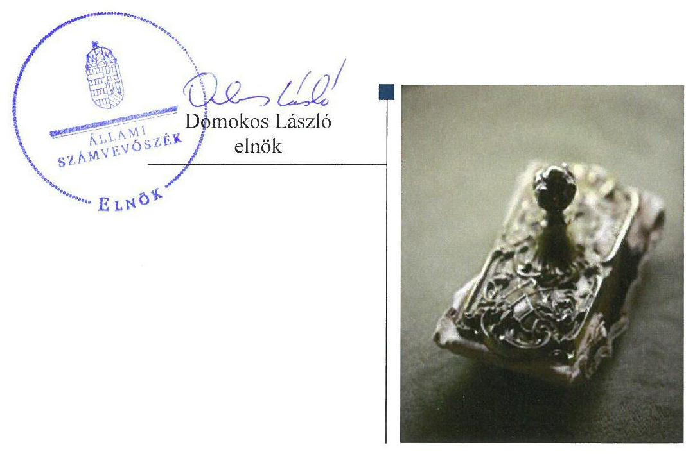

# Jelentés 

## Alapítványok ellenőrzése

Alapítványok/közalapítványok gazdálkodásának ellenőrzése Pénziránytű - Alapítvány a Tudatos Pénzügyekért
2018.

---

# Jelientés 

## Alapítványok ellenőrzése

Alapítványok/közalapítványok gazdálkodásának ellenőrzése Pénziránytű - Alapítvány a Tudatos Pénzügyekért
2018. 66. hó 21. nap

---

# AZ ELLENŐRZÉST FELÜGYELTE:

- **HOLMAN MAGDOLNA JULIANNA** felügyeleti vezető
- **AZ ELLENŐRZÉST VEZETTE ÉS A VÉGREHAJTÁSÁÉRT FELELŐS:**
  - **DR. SIMON JÓZSEF** ellenőrzésvezető
  - **A PROGRAM ÖSSZEÁLLÍTÁSÁÉRT FELELŐS:**
    - **TÓTPÁL SZABOLCS** osztályvezető

**IKTATÓSZÁM:** EL-0436-030/2018

**TÉMASZÁM:** 2449

**ELLENŐRZÉS-AZONOSÍTÓ SZÁM:** V077508

Jelentéseink az Országgyűlés számítógépes hálózatán és az Interneta a www.asz.hu címen is olvashatóak.

---

# TARTALOMJEGYZÉK 

- ÖSSZEGZÉS ..... 5
- AZ ELLENŐRZÉS CÉLJA ..... 6
- AZ ELLENŐRZÉS TERÜLETE ..... 7
- AZ ELLENŐRZÉS HÁTTERE, INDOKOLTSÁGA ..... 8
- A JELENTÉS LÉNYEGES KÉRDÉSKÖREI ..... 9
- AZ ELLENŐRZÉS HATÓKÖRE ÉS MÓDSZEREI ..... 10
- MEGÁLLAPÍTÁSOK ..... 12
- JAVASLATOK ..... 15
- MELLÉKLETEK ..... 17
I. sz. melléklet: Értelmező szótár ..... 17
- FÜGGELÉK: ÉSZREVÉTELEK ..... 21
- RÖVIDÍTÉSEK JEGYZÉKE ..... 23

---

.

---

# ÖSSZEGZÉS 

A Pénziránytü - Alapítvány a Tudatos Pénzügyekért a gazdálkodására vonatkozó szabályozási, beszámolókészitési kötelezettségének eleget tett, biztositott volt a tevékenységének átláthatósága. A költségek, ráforditások nem szabályszerü elszámolása nem tette lehetővé a világosság elvének érvényesülését.

## Az ellenőrzés társadalmi indokoltsága

Az alapítványok, az alapító által az alapító okiratban meghatározott tartós cél megvalósítására létrehozott jogi személyek, tevékenységüket az alapító által juttatott vagyon kezelésével, felhasználásával látják el. Az alapítványok múködésük és szakmai tevékenységük ellátásához költségvetési támogatásban, illetve a Magyar Nemzeti Bankról szóló 2013. évi CXXXIX. törvény 170. § (3) bekezdés d) pontja alapján, alapítványi támogatásban részesülhetnek.

Az Állami Számvevőszék az államháztartásból származó források felhasználásának keretében ellenőrzi az alapítványok, közalapítványok gazdálkodását. Az Állami Számvevőszék stratégiájában megfogalmazta, hogy az államháztartáson kívülre nyújtott költségvetési támogatások és ingyenes vagyonjuttatások, valamint az államháztartáson kívül múködő közfeladat-ellátó rendszerek ellenőrzéseivel hozzájárul a közszféra gazdálkodásának rendezettségéhez.

Társadalmi elvárás a közszféra pénzügyi- és vagyoni eszközeinek értékelvű és rendeltetésszerú felhasználása, továbbá a Magyar Nemzeti Bank által alapított alapítványok átláthatóságának biztosítása, amelyet az Állami Számvevőszék ellenőrzéseivel támogat.

## Főbb megállapítások, következtetések

A Pénziránytű - Alapítvány a Tudatos Pénzügyekért gazdálkodásának szervezeti kereteit és belső szabályozását a jogszabályi előírások szerint alakította ki. A beruházási-felújítási kiadások, illetve a költségek, ráfordítások elszámolása nem felelt meg a Számviteli törvény előírásainak.

Az alapítványi célra juttatott vagyon nyilvántartásba vétele szabályszerű volt.
A Pénziránytű - Alapítvány a Tudatos Pénzügyekért beszámolási kötelezettségét szabályszerűen teljesítette. A Pénziránytű - Alapítvány a Tudatos Pénzügyekért Felügyelőbizottsága a beszámolóval kapcsolatos feladatait elvégezte. A Pénziránytű - Alapítvány a Tudatos Pénzügyekért biztosította a tevékenységéről szóló beszámolási adatok hozzáférhetőségét, ezáltal gazdálkodásának átláthatóságát.

---

# AZ ELLENŐRZÉS CÉLJA 

Az ellenőrzés célja annak megállapítása, hogy az Alapítvány ${ }^{1}$ gazdálkodása során betartotta-e a vonatkozó jogszabályi előírásokat, szabályszerűen használta-e fel a kapott költségvetési támogatásokat, az államháztartásból meghatározott célra ingyenesen juttatott vagyon használata, hasznosítása a jogszabályi előírásoknak megfelelően történt-e, az alapítvány működését szolgáló ellenőrzési, monitoring és nyilvántartási rendszerek szabályszerűen működtek-e.

---

# AZ ELLENŐRZÉS TERÜLETE

## Pénziránytű - Alapítvány a Tudatos Pénzügyekért

## PÉNZIRÁNYTÚ

1. táblázat

AZ ALAPÍTVÁNY GAZDÁLKODÁSI ADATAI (M FT)

|   | 2015.
december
31. | 2016.
december
31.  |
| --- | --- | --- |
|  Mérleg szerinti
vagyon | 574,3 | 203,51  |
|  Tárgyévi ered-
mény | 3,1 | 1,04  |
|  Összes bevétel | 317,8 | 406,02  |

Forrás: Az Alapítvány 2015-2016. évi beszámolói

A Pénziránytű Alapítványt a Magyar Nemzeti Bank, a Magyar Bankszövetség és a Diákhitel Központ Zrt. alapította 2008-ban 1,5 M Ft induló vagyonnal. Az Öngondoskodás - A pénzügyi és befektetési kultúra fejlesztéséért Alapítvány beolvadása következtében a Pénziránytű Alapítvány induló vagyona 2010-ben 3,5 M Ft-ra növekedett.

A Pénziránytű Alapítvány alapvető célja olyan pénzügyi tudatosságot fejlesztő programok kidolgozása és megvalósítása, amelyek növelik az egyének és háztartások pénzügyi tájékozottságát, széles körben tudatosítják az öngondoskodás és az egyéni felelősségvállalás fontosságát, valamint növelik a lakosság bizalmát pénz- és tőkepiac egésze, annak intézményei és múködési módja iránt.

Az Alapítók ${ }^{2}$ létrehozták az Alapítvány gazdálkodásával kapcsolatos feladatokat ellátó alapítványi szerveket, a Kuratóriumot ${ }^{3}$, a Felügyelőbizottságot ${ }^{4}$ és a munkaszervezetet.

A Pénziránytű Alapítvány mérleg szerinti főösszege 2016. január 1-jén 574,3 M Ft volt, 2016. december 31-én 203,5 M Ft lett. A saját tőkéje 2016ban 35,7 M Ft volt.

A Pénziránytű Alapítvány 2016. évben elszámolt összes bevétele 406,02 M Ft volt, amelyből a kimutatott vállalkozási bevétel 82 ezer Ft volt. A Pénziránytű Alapítvány által kimutatott közhasznú tevékenység adózott eredménye a 2016. évben 1,0 M Ft, míg a vállalkozási eredmény -24 ezer Ft veszteség volt.

A Pénziránytű Alapítvány a 2016. évben államháztartásból támogatásban nem részesült. A Pénziránytű Alapítvány az ellenőrzött időszakban az államháztartásból, illetve egyéb forrásból meghatározott célra ingyenesen vagyont, illetve vagyoni hozzájárulást nem kapott. A Bankszövetség a Pénziránytű Alapítványnak nem vagyoni hozzájárulásként 2016-ban 0,5 M Ft, míg az Magyar Nemzeti Bank könyvértékesítésből származó 1,2 M Ft alapítói támogatást folyósított. A Pénziránytű Alapítvány az ellenőrzött időszakban nyitott alapítvány, közhasznú jogállással rendelkezett.

A Pénziránytű Alapítvány az ellenőrzött időszakban gazdasági társaságban részesedéssel nem rendelkezett.

A főbb gazdálkodási adatokat az 1. táblázat mutatja be.

---

# AZ ELLENŐRZÉS HÁTTERE, INDOKOLTSÁGA 

Társadalmi elvárás a közpénzek értékelvű, rendeltetésszerű felhasználása, a közpénzekből nyújtott támogatások átláthatóságának megteremtése, amelyhez az Állami Számvevőszék az államháztartásból nyújtott támogatások ellenőrzésével kíván hozzájárulni. Az ÁSZ ${ }^{5}$ Stratégiájában rögzített célkitűzése, hogy az államháztartáson kívülre nyújtott költségvetési támogatások és az ingyenes vagyonjuttatás ellenőrzésével hozzájáruljon ahhoz, hogy a közpénzeket a civil szervezetek is átlátható módon használják fel. Továbbá az alapítványok/közalapítványok gazdálkodása szabályszerűségének bemutatásával hozzájárul ahhoz, hogy a társadalom objektív képet alkothasson az alapítványok, közalapítványok működéséről.

Az ellenőrzés eredményeinek célzott felhasználói a nyilvánosság, a jogalkotó, továbbá az alapítványok/közalapítványok alapítói és szervei. Az ellenőrzés eredményeképp a törvényalkotás számára tapasztalatok állnak rendelkezésre az alapítványok/közalapítványok gazdálkodása szabályozásához. Az ellenőrzött szervezetek szintjén gazdálkodásuk vonatkozásában a hiányosságok, szabálytalanságok feltárása, az ennek kapcsán megfogalmazott megállapítások elősegíthetik az alapítványok/közalapítványok szabályszerű gazdálkodását, míg a társadalom számára információt szolgáltat arról, hogy az alapítványok/közalapítványok a közpénzeket szabályszerűen használták-e fel. Az alapítványok/közalapítványok gazdálkodása szabályszerűségének bemutatásával az ellenőrzés értékteremtő módon járul hozzá az ÁSZ stratégiai céljainak megvalósításához, a nyilvánosság megfelelő tájékoztatásához.

A 2016. évi XXXI. törvény 2016. május 6-ával módosította a Magyar Nemzeti Bankról szóló 2013. évi CXXXIX. törvényt, amelynek értelmében az MNB által létrehozott alapítványok gazdálkodását az ÁSZ ellenőrzi.

---

# A JELENTÉS LÉNYEGES KÉRDÉSKÖREI 

1. Az Alapítvány gazdálkodása szabályszerű volt-e?
2. Az alapítványi célra juttatott vagyon nyilvántartásba vétele szabályszerű volt-e?
3. Az Alapítvány a beszámolási kötelezettségét szabályszerűen teljesítette-e, valamint a Felügyelőbizottság ellátta-e a feladatát?

---

# AZ ELLENŐRZÉS HATÓKÖRE ÉS MÓDSZEREI 

## Az ellenőrzés típusa

Szabályszerúségi ellenőrzés.

## Az ellenőrzött időszak

A 2016. január 1-től 2016. december 31-ig tartó időszak. Az ellenőrzés kiterjed az ellenőrzött évet érintő, de az azt megelőzően a költségvetéssel, valamint az ellenőrzött időszakot követően a beszámolással kapcsolatban hozott döntések dokumentumaira is.

## Az ellenőrzés tárgya

Az ellenőrzés tárgya az Alapítvány vonatkozó jogszabályi előírások szerinti gazdálkodási tevékenysége volt. Ezen belül az Alapítvány gazdálkodásához kapcsolódó szervezeti és szabályozási keretek jogszabályi előírásoknak megfelelő kialakítása, a kapott költségvetési/egyéb támogatások nyilvántartásba vételének szabályszerűsége. Az ellenőrzés kiterjedt továbbá az Alapítvány múködését, gazdálkodását szolgáló nyilvántartási, ellenőrzési, monitoring tevékenységére.

## Az ellenőrzött szervezet

Pénziránytű - Alapítvány a Tudatos Pénzügyekért

## Az ellenőrzés jogalapja

Az ÁSZ tv. ${ }^{6}$ 1. § (3) bekezdése, 5. § (3) bekezdése, továbbá az MNB tv. ${ }^{7} 162$. § (5) bekezdése.

## Az ellenőrzés módszerei

Az ellenőrzést az ellenőrzött időszakban hatályos jogszabályok, a nemzetközi standardokat irányadónak tekintő ellenőrzési módszertanok, valamint az ellenőrzés szakmai szabályai figyelembevételével végezte az ÁSZ.

Az MNB. tv. 2016. május 6-án hatályba lépett módosítása adott felhatalmazást az ÁSZ számára az MNB által létrehozott alapítványok ellenőrzésére. Az ellenőrzés tervezése és előkészítése során - az ellenőrzésre vonatkozó módszertani előírások alapján - a felelős fél (ellenőrzött szervezet)

---

környezetének, szabályozási keretrendszerének, múködésének, finanszírozási módjának, tevékenységének, múveleteinek, szabályozási környezetének, az ellenőrzés szempontjából releváns kontrollok, belső irányítási, számviteli rendszereinek, valamint az ellenőrzési bizonyítékok megismeréséhez az ellenőrzött szervezettől a 2013., 2014. és a 2015. évek tekintetében strukturált adatbekérést végzett az ÁSZ. A beérkezett dokumentumok értékelését követően megtörtént a törvény hatálybalépését követő legkorábbi lezárt üzleti évre vonatkozó, az ellenőrzés lefolytatásához szükséges feladatok meghatározása.

Az ellenőrzést az ellenőrzési program szempontjai alapján végezte az ÁSZ. Az ellenőrzés ideje alatt az ellenőrzött szervezettel történő kapcsolattartás az ÁSZ SZMSZ ${ }^{8}$-ének vonatkozó előírásai alapján történt.

Az ellenőrzési kérdések megválaszolásához szükséges bizonyítékok megszerzése az ellenőrzött által rendelkezésre bocsátott dokumentumokra, adatokra alapozva megfigyelés, szemle (szemrevételezés), kérdésfeltevés (információkérés), mintavételezés, valamint elemző eljárás útján történt. A mintavételezés véletlen mintavételi eljárással történt.

A beruházási-felújítási kiadások, az igénybevett és egyéb szolgáltatások ráfordításai, a személyi jellegú ráfordítások elszámolása, valamint a mérlegsorok szabályszerűségét véletlen mintavétellel ellenőrizte az ÁSZ. A minta alapján a sokaságban előforduló hibaarányt becsülte. „Szabályszerű" értékeléssel rendelkezett egy ellenőrzött terület, amennyiben 95\%-os bizonyossággal a teljes sokaságban a hibaarány legfeljebb 10\%, „nem szabályszerű" értékeléssel rendelkezett, amennyiben 10\%-nál magasabb arányt képviselt. Abban az esetben, ha a teljes sokaság tekintetében a 10\%os hibaarányhoz való viszony megítélésnek megbízhatósága nem érte el a 95\%-ot, annak elérése érdekében az értékelés további szempontokkal egészült ki, és figyelembe vételre került a feltárt hibák értéke.

Az ellenőrzési bizonyítékként felhasznált adatforrások közé tartoztak egyrészt a szakmai program részletes szempontjainál felsorolt adatforrások, másrészt minden - az ellenőrzés folyamán feltárt, az ellenőrzés szempontjából információt tartalmazó - dokumentum.

Az ellenőrzés lefolytatásához az Alapítvány a kitöltött tanúsítványok, valamint az ÁSZ által kért dokumentumok elektronikus úton való megküldésével szolgáltatott adatokat, információkat. Az így rendelkezésre bocsátott adatok, információk és a tanúsítványok adatai valódiságának kontrollja az ellenőrzés keretében történt.

---

# 1. Az Alapítvány gazdálkodása szabályszerű volt-e? 

## Összegző megállapítás

### 1.1. számú megállapítás

Az Alapítvány gazdálkodásának szervezeti kereteit szabályszerűen kialakította. A gazdálkodás belső szabályozása szabályszerű volt. A költségvetési terv, illetve a ráfordítások elszámolása nem volt szabályszerű.

Az Alapítvány a gazdálkodásának szervezeti kereteit, a belső szabályozását szabályszerűen kialakította.

Az Alapítvány a 2016. évben rendelkezett Alapító okirat ${ }_{1-2}{ }^{9}$-tal, amely tartalmazta a Ptk. ${ }^{10}$-ben előírt tartalmi elemeket. Az Alapítók a Ptk. ${ }_{2}$ előírásainak megfelelően az Alapító okirat ${ }_{2}$-ben meghatározták az Alapítványnak juttatott vagyont és az Alapítvány szervezetét, valamint fő célját és tevékenységét.

Az Alapítvány rendelkezett Számviteli politikával ${ }_{1-2}{ }^{11}$ és annak mellékleteként Leltárkészítési és leltározási szabályzattal ${ }^{12}$, Értékelési szabályzattal ${ }^{13}$, valamint Pénzkezelési szabályzattal ${ }^{14}$, amelyek megfeleltek a Számv. tv. ${ }^{15}$, az Ectv ${ }^{16}$. és a Civilszr. ${ }^{17}$ előírásainak. Az Alapítvány a Számv. tv.-nek megfelelően rendelkezett Számlarend ${ }^{18}{ }_{1-2}$-del.

Az Alapítvány könyvvezetési, nyilvántartási rendszere 2016. évben összhangban volt a Számv. tv., az Ectv. és a Civilszr. rendelkezéseivel.
2016. szeptember 14-én lépett hatályba az Alapítvány Adatvédelmiadatbiztonsági szabályzata ${ }^{19}$.

Az Alapítvány a költségvetési tervét elkészítette, azonban ez nem felelt meg a jogszabályi előírásoknak.

Az Alapítvány a 2016. évre vonatkozó költségvetési tervvel rendelkezett, amelyet azonban nem az Ecvhr. ${ }^{20}$ 3. § (1) bekezdésben előírtaknak megfelelően készített el, mivel a soronkénti bontása nem felelt meg a beszámoló tartalmi elemeinek. Az Alapítvány a költségvetés tervezése során nem tartotta be az Ecvhr. 3. § (2) bekezdésében foglalt előírást, mivel a költségvetési tervben az alapcél szerinti és a vállalkozási bevételeit nem tervezte meg.

A beruházási-felújítási kiadások és a költségek, ráfordítások elszámolása nem volt szabályszerű.

A könyvviteli elszámolást közvetlenül alátámasztó bizonylatokon - a beru-házási-felújítási kiadások, illetve az igénybevett és egyéb szolgáltatások ráfordításai, valamint a személyi jellegú ráfordítások esetében - nem érvényesültek a Számv. tv. 167. § (1) bekezdés c) pontjában foglalt előírások, mert azok nem tartalmazták az utalványozó és a rendelkezés végrehajtását igazoló személy aláírását.

---

A beruházási-felújítási kiadások esetében az eszközök üzembe helyezését és besorolását a Számv. tv. rendelkezéseinek megfelelően dokumentálták.

# 2. Az alapítványi célra juttatott vagyon nyilvántartásba vétele szabályszerű volt-e? 

## Összegző megállapítás

Az alapítványi célra juttatott vagyon nyilvántartásba vétele szabályszerű volt.

Az alapítói vagyon kezelésének és felhasználásának szabályairól az Alapító okirat ${ }_{1-2}$-ben rendelkeztek. Az alapítványi célra juttatott 2016. évi vagyon a Számv. tv. rendelkezésének megfelelően a főkönyvben rögzítésre került.

## 3. Az Alapítvány a beszámolási kötelezettségét szabályszerűen teljesítette-e, valamint a Felügyelőbizottság ellátta-e a feladatát?

Összegző megállapítás

Az Alapítvány a beszámolási kötelezettségét szabályszerűen teljesítette, a beszámoló adatainak valódisága biztosított volt. A Felügyelőbizottság beszámolóval kapcsolatos ellenőrzési feladatait elvégezte.
3.1. számú megállapítás

Az Alapítvány a beszámolási kötelezettségének szabályszerűen eleget tett. A beszámolót leltárral alátámasztotta.

Az Alapítvány a Civilszr.-ben foglaltaknak megfelelően kettős könyvvitelt vezetett. A 2016. évi vagyoni, pénzügyi és jövedelmi helyzetéről a Számv. tv.-ben, az Ectv.-ben és a Civilszr.-ben foglaltaknak megfelelően egyszerűsített éves beszámolót készített. Az Ectv. rendelkezésével összhangban a beszámoló tartalmazta a kiegészítő mellékletet.

Az Alapítvány a beszámoló elkészítéséhez, a mérlegtételek alátámasztásához a 2016. évre vonatkozóan a Számv. tv. előírásainak, illetve a Leltárkészítési és leltározási szabályzatban foglaltaknak megfelelően a mérleg fordulónapján meglévő eszközökről és forrásokról mennyiségben és értékben leltárt készített.

Az analitikus és főkönyvi nyilvántartásokkal való egyeztetés a Szám. tv. előírásainak megfelelően megtörtént.

Az Alapítvány egyszerűsített éves beszámolóját és közhasznúsági mellékletét a Számv. tv.-ben, az Ectv.-ben és a Civilszr.-ben előírtaknak megfelelő tartalommal készítette el. A beszámolót és a közhasznúsági mellékletet a Kuratórium jóváhagyta.

Az Alapítvány egyszerűsített éves beszámolóját és közhasznúsági mellékletét az Ectv.-ben és a Cnytv. ${ }^{21}$-ben meghatározott időpontig letétbe helyezte az Országos Bírósági Hivatalnál.

---

# 3.2. számú megállapítás 

A Felügyelőbizottság a beszámoló elfogadásával kapcsolatos ellenőrzési feladatait ellátta.

Az Alapítvány gazdálkodásához kapcsolódó ellenőrzési feladatait - az Ectv.ben, az Alapító okirat ${ }_{1-2}$-ban, az SZMSZ ${ }_{1-3}{ }^{22}$-ben és az FB ügyrend ${ }^{23}$-jében foglaltak alapján - a 2016. évi egyszerúsített éves beszámoló vizsgálata tekintetében az FB elvégezte.

---

# JAVASLATOK 

Az ÁSZ tv. 33. § (1) bekezdésében foglaltak értelmében az ellenőrzött szervezet vezetője köteles a jelentésben foglalt megállapításokhoz kapcsolódó intézkedési tervet összeállítani és azt a jelentés kézhezvételétől számított 30 napon belül az ÁSZ részére megküldeni. Amennyiben az ellenőrzött szervezet vezetője nem küldi meg határidőben az intézkedési tervet, vagy továbbra sem elfogadható intézkedési tervet küld, az Állami Számvevőszék elnöke az ÁSZ tv. 33. § (3) bekezdése a) és b) pontjaiban foglaltakat érvényesítheti.

## Pénziránytú - Alapítvány a Tudatos Pénzügyekért Kuratóriuma elnökének

1. Intézkedjen, hogy a beruházási-felújítási kiadások, valamint a költségek, ráfordítások könyvviteli elszámolását közvetlenül alátámasztó bizonylatok feleljenek meg a Számv. tv. előírásainak.
(1.3. sz. megállapítás 1. bekezdése alapján)

---

.

---

# MELLÉKLETEK 

## I. SZ. MELLÉKLET: ÉRTELMEZŐ SZÓTÁR

alapító
alapító
alapítvány
államháztartás
beruházás
civil szervezet

Az alapítványt, mint jogi személyt az alapító okiratban meghatározott tartós cél folyamatos megvalósítására létrehozó, az alapítvány részére az alapító okiratban meghatározott, az alapítványi cél megvalósításához szükséges pénzbeli és nem pénzbeli vagyoni hozzájárulást teljesítő személy(ek)/jogi személy(ek). (Forrás: Ptk.; 3:378. §, 3:382. § (2) bek.)
Magánszemély, jogi személy és jogi személyiséggel nem rendelkező gazdasági társaság (a továbbiakban együtt: alapító) - tartós közérdekű célra - alapító okiratban alapítványt hozhat létre. Alapítvány elsődlegesen gazdasági tevékenység folytatása céljából nem alapítható. Az alapítvány javára a célja megvalósításához szükséges vagyont kell rendelni. Az alapítvány jogi személy. Az alapítvány a bírósági nyilvántartásba vételével jön létre. (Forrás: Ptk. ${ }^{24}$ 74/A. § (1) - (2) bekezdés)
Az alapítvány az alapító által az alapító okiratban meghatározott tartós cél folyamatos megvalósítására létrehozott jogi személy. Az alapító az alapító okiratban meghatározza az alapítványnak juttatott vagyont és az alapítvány szervezetét. Alapítvány nem alapítható gazdasági-vállalkozási tevékenység folytatására. Az alapítvány az alapítványi cél megvalósításával közvetlenül összefüggő gazdasági tevékenység végzésére jogosult. Alapítvány nem lehet korlátlan felelősségű tagja más jogalanynak, nem létesíthet alapítványt és nem csatlakozhat alapítványhoz. (Forrás: Ptk.;3:378§, 3:379. § (1) - (3) bekezdés)
az államháztartás a közfeladatok ellátásának egységes szervezeti, tervezési, gazdálkodási, ellenőrzési, finanszírozási, adatszolgáltatási és beszámolási szabályok szerint működő rendszere, amely központi és önkormányzati alrendszerből áll.
Az államháztartás központi alrendszerébe tartozik az állam, a központi költségvetési szerv, a törvény által az államháztartás központi alrendszerébe sorolt köztestület, és ezen köztestület által irányított köztestületi költségvetési szerv.
Az államháztartás önkormányzati alrendszerébe tartozik a helyi önkormányzat, a helyi nemzetiségi önkormányzat és az országos nemzetiségi önkormányzat, a Mótv. ${ }^{25}$ és a nemzetiségek jogairól szóló 2011. évi CLXXIX. törvény szerint létrehozott társulás, valamint a területfejlesztésről és a területrendezésről szóló törvény alapján létrejött területfejlesztési önkormányzati társulás, a térségi fejlesztési tanács, és a megnevezett szervezetek által irányított költségvetési szerv. (Forrás: Áht. ${ }^{26}$ 2-3. §)
A tárgyi eszköz beszerzése, létesítése, saját vállalkozásban történő előállítása, a beszerzett tárgyi eszköz üzembe helyezése. A beruházás a meglévő tárgyi eszköz bővítését, rendeltetésének megváltoztatását, átalakítását, élettartamának, teljesítőképességének közvetlen növelését eredményező tevékenység. (Forrás: Számv. tv. 3. § (4) bekezdés 7. pont)
2014. március 15-ig: a civil társaság, illetve a Magyarországon nyilvántartásba vett egyesület - a párt kivételével -, valamint az alapítvány. Civil szervezet alatt az e törvény II-VI. és VIII-X. fejezetében a civil társaságot, továbbá a VII-X. fejezetében a kölcsönös biztosító egyesületet és a szakszervezetet nem kell érteni. (Forrás: Ectv. 2. § 6. pont)
2014. március 15-től: a civil társaság; a Magyarországon nyilvántartásba vett egyesület - a párt, a szakszervezet és a kölcsönös biztosító egyesület kivételével és - a közalapítvány és a pártalapítvány kivételével - az alapítvány. (Forrás: Ectv. 2. § 6. pont)

---

Felügyelőbizottság

Felügyelő szerv
felújítás
gazdálkodó tevékenység
gazdasági-vállalkozási tevékenység
költségvetési támogatás
közhasznú tevékenység

A tagok vagy az alapítók a létesítő okiratban három tagból álló felügyelőbizottság létrehozását rendelhetik el azzal a feladattal, hogy az ügyvezetést a jogi személy érdekeinek megóvása céljából ellenőrizze. A felügyelőbizottság tagjai a jogi személy ügyvezetésétől függetlenek, tevékenységük során nem utasíthatóak. A felügyelőbizottság köteles a tagok vagy az alapítók döntéshozó szerve elé kerülő előterjesztéseket megvizsgálni, és ezekkel kapcsolatos álláspontját a döntéshozó szerv ülésén ismertetni. A felügyelőbizottsági tagok az ellenőrzési kötelezettségük elmulasztásával vagy nem megfelelő teljesítésével a jogi személynek okozott károkért a szerződésszegéssel okozott kárért való felelősség szabályai szerint felelnek a jogi személlyel szemben. (Forrás: Ptk.: 3:26-3:28 §)
A felügyelő szerv ellenőrzi a közhasznú szervezet működését és gazdálkodását. Ennek során a vezető tisztségviselőktől jelentést, a szervezet munkavállalóitól pedig tájékoztatást vagy felvilágosítást kérhet, továbbá a közhasznú szervezet könyveibe és irataiba betekinthet, azokat megvizsgálhatja.
A felügyelő szerv tagja a közhasznú szervezet vezető szervének ülésén tanácskozási joggal részt vehet, illetve részt vesz, ha jogszabály vagy a létesítő okirat így rendelkezik. (Forrás: Ectv. 41. § (1)-(2) bekezdés)
Az elhasználódott tárgyi eszköz eredeti állaga (kapacitása, pontossága) helyreállítását szolgáló időszakonként visszatérő olyan tevékenység, melynek során az eszköz élettartama megnövekszik, minősége, használata jelentősen javul, így a pótlólagos ráfordításból a jövőben gazdasági előnyök származnak. (Forrás: Számv. tv. 3. § (4) 8. pont)
azon tevékenységek összessége, amelyek a civil szervezet vagyoni, pénzügyi, jövedelmi helyzetére kiható gazdasági eseményt eredményeznek. (Forrás: Ectv. 2. § 10. pont)
A jövedelem- és vagyonszerzésre irányuló vagy azt eredményező, üzletszerűen végzett gazdasági tevékenység, kivéve az adomány (ajándék) elfogadását, a létesítő okiratban meghatározott cél szerinti tevékenységet (ideértve a közhasznú tevékenységet is), - 2015. november 28-tól - a pénzeszközök betétbe, értékpapírba, társasági részesedésbe történő elhelyezését és az ingatlan megszerzését, használatának átengedését és átruházását. (Forrás: Ectv. 2. § 11. pont)
az államháztartás alrendszerei terhére nyújtott pénzbeli vagy nem pénzbeli juttatás, amelyet a támogató nem elsősorban ellenszolgáltatás ellenében, de konkrét program megvalósítása vagy meghatározott időszakban a támogatott szervezet működtetése érdekében nyújt. Költségvetési támogatás különösen: a pályázat útján, valamint egyedi döntéssel kapott költségvetési támogatás; az Európai Unió strukturális alapjaiból, illetve a Kohéziós Alapból származó, a költségvetésből juttatott támogatás; az Európai Unió költségvetéséből vagy más államtól, nemzetközi szervezettől származó támogatás és a személyi jövedelemadó meghatározott részének az adózó rendelkezése szerint felajánlott összege. (Forrás: Ectv. 2. § 15. pont)
minden olyan tevékenység, amely a létesítő okiratban megjelölt közfeladat teljesítését közvetlenül vagy közvetve szolgálja, ezzel hozzájárulva a társadalom és az egyén közös szükségleteinek kielégítéséhez. (Forrás: Ectv. 2. § 20. pont)

---

vagyoni hozzájárulás

Az alapítvány alapítója által az alapításkor az alapítvány részére teljesítendő olyan hozzájárulás, amelynek értékét nem lehet visszakövetelni. Az alapító által az alapítvány rendelkezésére bocsátott vagyon pénzből és nem pénzbeli vagyoni hozzájárulásból állhat. Az alapítónak legalább az alapítvány múködésének megkezdéséhez szükséges vagyont a nyilvántartásba-vételi kérelem benyújtásáig át kell ruháznia az alapítványra. Az alapítónak a teljes juttatott vagyont legkésőbb az alapítvány nyilvántartásba vételétől számított egy éven belül kell átruháznia az alapítványra. (Forrás: Ptk.; 3:9. § (1) bek., 3:10. § (1) bek., 3:382. § (2)-(3) bek.)

---

.

---

# FÜGGELÉK: ÉSZREVÉTELEK 

A jelentéstervezetet a Számvevőszék 15 napos észrevételezésre megküldte az ellenőrzött szervezet vezetőjének az ÁSZ tv. 29. §* (1) bekezdése előírásának megfelelően.
Az elfogadott észrevétel alapján a Számvevőszék módosította a jelentést.

A függelék tartalmazza az ellenőrzött észrevételeit, illetve az el nem fogadott észrevételek elutasításának indoklását.

## Észrevétel

A jelentéstervezet 12. oldal 1.2. számú megállapítás 1. bekezdés 2. mondatára:
"A Jelentéstervezet megállapítása szerint az Alapítvány a 2016. évre vonatkozó költségvetési terve elkészítése során nem tartotta be a civil szervezetek gazdálkodása, az adománygyűjtés és a közhasznúság egyes kérdéseiről szóló 350/2011. (XII. 30.) Korm. rendelet (továbbiakban: Ecvhr.) 3. § (2) bekezdésében foglalt előírást, mivel a költségvetési tervben az alapcél szerint és a vállalkozási bevételeit nem tervezte meg. Ezzel kapcsolatosan meg kívánjuk jegyezni, hogy az Alapítvány által a 2013. és 2014. évekre vonatkozóan készített költségvetési tervek megfeleltek az Ecvhr. és számviteli törvény szerinti egyes egyéb szervezetek beszámolókészítési és könyvvezetési kötelezettségének sajátosságairól szóló 224/2000 (XII. 19.) Korm. rendeletben foglaltaknak. 2016 évben is készült költségvetési terv, ellenben nem a rendeletben foglalt formai követelményeknek megfelelően. A fentiekből is látható, a hiányosság egyedi eset volt, nem visszatérő elem az Alapítvány gazdálkodásának megtervezésében."

## El nem fogadott észrevétel indoklása

A jelentéstervezet 1.2. számú megállapítására tett észrevételét nem fogadtuk el. Az észrevételében leírtak is elismerik, hogy a 2016. évi költségvetési terv nem a civil szervezetek gazdálkodása, az adománygyűjtés, és a közhasznúság egyes kérdéseiről szóló 350/2011. (XII. 30.) Korm. rendelet 3. § (2) bekezdésében foglalt előírásoknak megfelelően készült el, így az észrevétel a megállapítást nem módosítja.

## Észrevétel

A jelentéstervezet 12. oldal 1.3. számú megállapítás 1. bekezdésére:
"A könyvviteli elszámolást alátámasztó bizonylatok vonatkozásában fel kívánjuk hívni a Tisztelt Állami Számvevőszék figyelmét, hogy az alapítványi szerződéses kötelezettségvállalások vonatkozásában a pénzügyi teljesítéseinket megelőzően - az SZMSZ-ben szabályozottak szerint - teljesítésigazolások minden esetben szabályszerűen készültek. Jelezni kívánjuk azt is, hogy az Alapítvány 2016-tól fokozatosan kezdett érdemi aktivitást, szakmai tevékenységet a

[^0]
[^0]:    * 29. § (1) Az Állami Számvevőszék az ellenőrzési megállapításait megküldi az ellenőrzött szervezet vezetőjének vagy az általa megbízott személynek, és annak, akinek személyes felelősségét állapította meg.
    (2) Az ellenőrzött szervezet vezetője és a felelősként megjelölt személy az ellenőrzés megállapításaira tizenöt napon belül írásban észrevételt tehet.
    (3) Az Állami Számvevőszék az észrevételre a beérkezésétől számított harminc napon belül írásban válaszol. A figyelembe nem vett észrevételeket köteles a jelentésben feltüntetni, és megindokolni, hogy azokat miért nem fogadta el.

---

2016-os évben még korlátozottan. végzett, részleges-munkaszervezettel rendelkezett, azaz nem rendelkezett elegendő emberi erőforrással a jogszabályi elemek teljes körű teljesítéséhez. Ezen időszakban utalványozás nem történt; ugyanakkor a rendelkezések végrehajtásának igazolására és ellenőrzésére, a szerződéses teljesítések igazolására minden esetben vonatkozó dokumentumok készültek, az utalványozás kizárólag a CIB Bank Zrt. elektronikus felületén keresztül került aláírásra."

# El nem fogadott észrevétel indoklása 

A jelentéstervezet 1.3. számú megállapítására tett észrevételét nem fogadtuk el. Egyrészt észrevételében elismerte, hogy utalványozás nem történt 2016-ban. Másrészt teljesítésigazolás tekintetében észrevételében azt írja, hogy „az alapítványi szerződéses kötelezettségvállalások vonatkozásában a pénzügyi teljesítéseket megelőzően -...- teljesítésigazolások minden esetben szabályszerűen készültek". A Számv. tv. 167. § (1) bekezdés c) pontja nem tesz különbséget szerződéses és szerződés nélküli kötelezettségvállalások teljesítésigazolása között, így a nem szerződéses kötelezettségvállalások esetében is kötelező kellék a könyvviteli elszámolást közvetlenül alátámasztó bizonylatokon a rendelkezés végrehajtását igazoló személy aláírása. Az ellenőrzés rendelkezésére bocsájtott nem szerződéses kötelezettségvállalások könyvviteli elszámolását közvetlenül alátámasztó bizonylatok nem tartalmazták a teljesítésigazoló aláírását. Ezen túl az Állami Számvevőszék ellenőrzése során statisztikai módszereket alkalmazott. A jelentéstervezetben foglaltak szerint mintavétellel ellenőriztük a beruházási-felújítási kiadások, az igénybevett és egyéb szolgáltatások ráfordításai, a személyi jellegű ráfordítások, valamint a mérlegsorok szabályszerűségét. A minta alapján a sokaságban előforduló hibaarány becslésére került sor. „Szabályszerű" értékelést kapott egy ellenőrzött terület, amenynyiben 95\%-os bizonyossággal a teljes sokaságban a hibaarány legfeljebb 10\%, „nem szabályszerű" értékelést, amennyiben 10\%-nál magasabb arányt képviselt.

---

# RÖVIDÍTÉSEK JEGYZÉKE 

${ }^{1}$ Alapítvány
${ }^{2}$ Alapítók
${ }^{3}$ Kuratórium
${ }^{4}$ Felügyelő Bizottság
${ }^{5}$ ÁSZ
${ }^{6}$ ÁSZ. tv.
${ }^{7}$ MNB tv.
${ }^{8}$ ÁSZ SZMSZ
${ }^{9}$ Alapító okirat ${ }_{1}$

Alapító okirat ${ }_{2}$
${ }^{10}$ Ptk. ${ }_{2}$
${ }^{11}$ Számviteli Politika ${ }_{1}$

Számviteli Politika ${ }_{2}$
${ }^{12}$ Leltárkészítési és leltározási szabályzat
${ }^{13}$ Értékelési szabályzat
${ }^{14}$ Pénzkezelési szabályzat
${ }^{15}$ Számv. tv.
${ }^{16}$ Ectv.
${ }^{17}$ Civilszr.
${ }^{18}$ Számlarend ${ }_{1}$

Számlarend ${ }_{2}$
${ }^{19}$ Adatvédelmi szabályzat
${ }^{20}$ Ecvhr.
${ }^{21}$ Cnytv.
${ }^{22}$ SZMSZ $_{1}$

SZMSZ $_{2}$

Pénziránytű - Alapítvány a Tudatos Pénzügyekért
Magyar Nemzeti Bank, a Magyar Bankszövetség és a Diákhitel Központ Zrt.
Pénziránytű - Alapítvány a Tudatos Pénzügyekért Kuratóriuma
Pénziránytű - Alapítvány a Tudatos Pénzügyekért Felügyelőbizottsága
Állami Számvevőszék
2011. évi LXVI. törvény az Állami Számvevőszékről (hatályos 2011. július 1-jétől)
2013. évi CXXXIX. törvény a Magyar Nemzeti Bankról (hatályos
2013. szeptember 27-étől)

Állami Számvevőszék Szervezeti és Működési Szabályzata
Pénziránytű Alapítvány Alapító okirata (hatályos 2015. június 26-tól 2016. október 11-ig)
Pénziránytű Alapítvány Alapító okirata (hatályos 2016. október 12-től)
2013. évi V. törvény a Polgári Törvénykönyvről (hatályos 2014. március 15-től)

Pénziránytű - Alapítvány a Tudatos Pénzügyekért Számviteli politika (hatályos 2011. november 30-tól; módosítva 2013. márciusában)

Pénziránytű - Alapítvány a Tudatos Pénzügyekért Számviteli politika (készült 2016. május 26-án, visszamenőleg hatályos 2016. január 1-jétől)

Pénziránytű - Alapítvány a Tudatos Pénzügyekért Leltárkészítési és leltározási szabályzata (hatályos 2011. november 30-tól)

Pénziránytű - Alapítvány a Tudatos Pénzügyekért Értékelési szabályzata (hatályos 2011. november 30-tól)

Pénziránytű - Alapítvány a Tudatos Pénzügyekért Pénzkezelési szabályzata (hatályos 2011. november 30-tól)
2000. évi C. törvény a számvitelről (hatályos 2001.január 1-jétől)
2011. évi CLXXV. törvény az egyesülési jogról, a közhasznú jogállásról, valamint a civil szervezetek múködéséről és támogatásáról (hatályos 2011. december 22-től) a számviteli törvény szerinti egyes egyéb szervezetek beszámoló-készítési és könyvvezetési kötelezettségének sajátosságairól szóló 224/2000. (XII. 19.) Korm. rendelet (hatályos 2001. január 1-jétől)
Pénziránytű - Alapítvány a Tudatos Pénzügyekért Számlarendje (hatályos 2011. november 30-tól)

Pénziránytű - Alapítvány a Tudatos Pénzügyekért Számlarendje (készült 2016. május 26-án, visszamenőleg hatályos 2016. január 1-jétől)

Pénziránytű - Alapítvány a Tudatos Pénzügyekért Adatvédelmi és Adatkezelési szabályzata (hatályos 2016. szeptember 14-től)
A civil szervezetek gazdálkodása, az adománygyűjtés, és a közhasznúság egyes kérdéseiről szóló 350/2011. (XII. 30.) Korm. rendelet (hatályos 2012. január 1jétől)
2011. évi CLXXXI. törvény a civil szervezetek bírósági nyilvántartásáról és az ezzel összefüggő eljárási szabályokról (hatályos 2012. január 1-jétől)

Pénziránytű - Alapítvány a Tudatos Pénzügyekért Szervezeti és Működési Szabályzata (hatályos az Alapítói okirat 2014. december 9-i módosításának hatálybalépése napjától)
Pénziránytű - Alapítvány a Tudatos Pénzügyekért Szervezeti és Működési Szabályzata (hatályos 2016. szeptember 14-től 2016. október 31-ig)

---

| SZMSZ $_{3}$ | Pénziránytű Alapítvány Szervezeti és Működési Szabályzata (hatályos 2016. november 1-jétől) |
| :--: | :--: |
| ${ }^{23}$ FB ügyrend | Pénziránytű - Alapítvány a Tudatos Pénzügyekért Felügyelőbizottságának ügyrendje (hatályos 2016. május 23-tól) |
| ${ }^{24}$ Ptk. 1 | 1959. évi IV. törvény a Polgári Törvénykönyvről szóló (hatályos 2014. március 14ig) |
| ${ }^{25}$ Mötv. | 2011. évi CLXXXIX. törvény - Magyarország helyi önkormányzatairól (hatályos 2012. január 1-jétől, kivéve a 144. § (2)-(5) bekezdéseiben meghatározott paragrafusok egyes bekezdéseit, pontjait, amelyek 2013. január 1-jén, illetve 2014. évi általános önkormányzati választások napján léptek hatályba) |
| ${ }^{26}$ Áht. | 2011. évi CXCV. törvény - az államháztartásról (hatályos 2012. január 1-jétől) |

---

# ÁLLAMI SZÁMVEVŐSZÉK 

1052 Budapest, Apáczai Csere János utca 10.
Levélcím: 1364 Budapest 4. Pf. 54
Telefon: +36 14849100 Telefax: +36 14849200
www.asz.hu