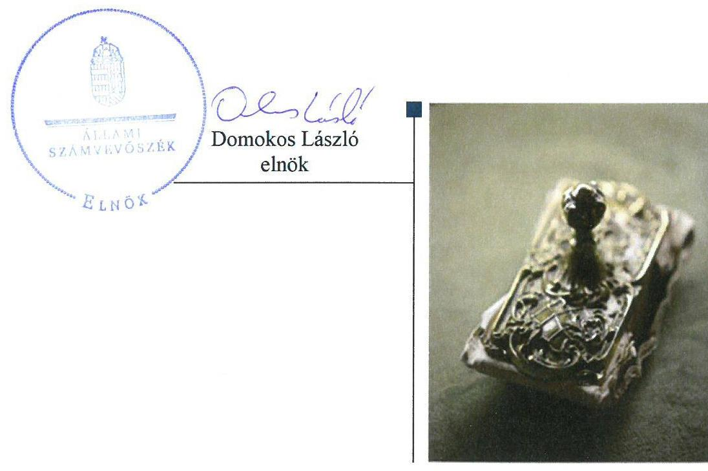
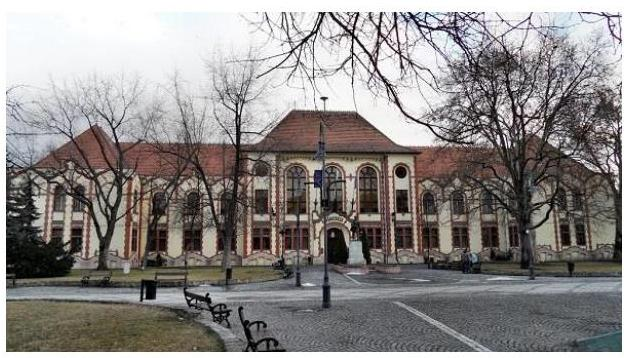
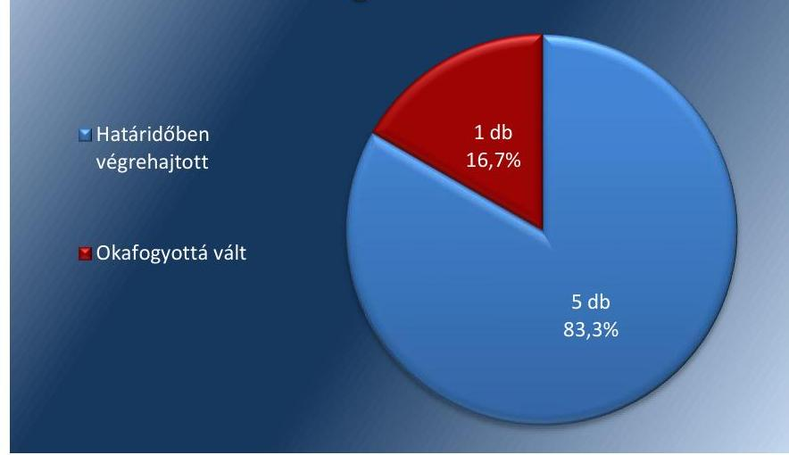

# Jelentés 

## Utóellenőrzések

Az önkormányzatok vagyongazdálkodása szabályszerűségének utóellenőrzése Budapest Főváros XX. kerület Pesterzsébet Önkormányzata 2018. 04. hó 13. nap

---

# AZ ELLENŐRZÉST FELÜGYELTE: 

DR. NÉMETH ERZSÉBET felügyeleti vezető

## AZ ELLENŐRZÉST VEZETTE ÉS A VÉGREHAJTÁSÁÉRT FELELŐS:

DÉZSINÉ KIS HAJNALKA ellenőrzésvezető

## A PROGRAM ÖSSZEÁLLÍTÁSÁÉRT FELELŐS:

TÓTPÁL SZABOLCS osztályvezető

## A TÉMÁHOZ KAPCSOLÓDÓ KORÁBBI SZÁMVEVŐSZÉKI JELENTÉSEK:

- címe: Jelentés az önkormányzati vagyongazdálkodás szabályszerűségi ellenőrzéséről-Budapest Főváros XX. kerület Pesterzsébet
- sorszáma: 13078

IKTATÓSZÁM: V-1315-017/2016
TÉMASZÁM: 6
ELLENŐRZÉS-AZONOSÍTÓ SZÁM: V080415

---

# TARTALOMJEGYZÉK 

■ ÖSSZEGZÉS ..... 5
■ AZ ELLENŐRZÉS CÉLJA ..... 6
■ AZ ELLENŐRZÉS TERÜLETE ..... 7
■ AZ ELLENŐRZÉS HÁTTERE, INDOKOLTSÁGA ..... 8
■ A JELENTÉS LÉNYEGES KÉRDÉSKÖRE ..... 9
■ ELLENŐRZÉS HATÓKÖRE ÉS MÓDSZEREI ..... 10
■ MEGÁLLAPÍTÁSOK ..... 12
■ MELLÉKLETEK ..... 15
I. sz. melléklet: Budapest Főváros XX. kerület Pesterzsébet Önkormányzata intézkedési tervének végrehajtása. ..... 15
■ FÜGGELÉK: ÉSZREVÉTELEK ..... 19
■ RÖVIDÍTÉSEK JEGYZÉKE ..... 21

---

.

---

# ÖSSZEGZÉS 

Az utóellenőrzés megállapította, hogy Budapest Főváros XX. kerület Pesterzsébet Önkormányzata az intézkedési tervben meghatározott feladatokat határidőben végrehajtotta. Az intézkedések eredményeként javult a vagyongazdálkodás szabályozottsága és átláthatósága.

## Az ellenőrzés társadalmi indokoltsága

Az Állami Számvevőszék stratégiájában célul tűzte ki a számvevőszéki munka hasznosulásának javítását. Ezzel összhangban ellenőrzi, hogy az ellenőrzött szervezet megvalósította-e a korábbi ellenőrzései által feltárt hibák, hiányosságok és szabálytalanságok megszüntetése céljából elkészített intézkedési tervében foglaltakat. A rendszeres utóellenőrzések hozzájárulnak a szükséges intézkedések tényleges végrehajtásához, ezáltal a közpénzügyek rendezettségének javulásához.

## Főbb megállapítások, következtetések

Az Önkormányzat az ÁSZ által elfogadott intézkedési tervében meghatározott hat feladatból ötöt végrehajtott, egy feladat jogszabályváltozás miatt okafogyottá vált.

Az Önkormányzat az intézkedési tervben meghatározott feladatoknak megfelelően módosította leltározási szabályzatát és hitelszerződését, valamint intézkedett az ingatlanvagyon nyilvántartások rendezésére. Ennek hatására javult a vagyongazdálkodás szabályozottsága.

Az elemi költségvetések és költségvetési beszámolók honlapon való közzétételével az Önkormányzat növelte a gazdálkodás átláthatóságát.

Az Önkormányzat vezetett nyilvántartást az intézkedési tervben rögzített feladatok végrehajtásáról, ez azonban nem tartalmazta a végrehajtott intézkedések rövid leírását.

---

# AZ ELLENŐRZÉS CÉLJA 

Az ellenőrzés célja annak értékelése volt, hogy a számvevőszéki jelentésben foglalt intézkedést igénylő megállapításokkal összhangban készített intézkedési tervben meghatározott feladatokat az ellenőrzött szervezet végrehajtotta-e.

---

# AZ ELLENŐRZÉS TERÜLETE

## Budapest Főváros XX. kerület Pesterzsébet Önkormányzata

Budapest Főváros XX. kerület Pesterzsébet állandó lakosainak száma 2016. január 1-jén a KSH1 adata alapján 65 321 fő volt.

A 2016. évi éves költségvetési beszámoló szerint a 2016. évben az Önkormányzat2 2 375 M Ft költségvetési kiadást teljesített és 7 641 M Ft költségvetési bevétellel gazdálkodott, 2016. december 31-én 25 065 M Ft értékű eszközvagyonnal rendelkezett.

A Polgármester3 1998 óta vezeti a 18 tagú Képviselő-testületet4, amely hét állandó bizottságot hozott létre. A Jegyző5 személye egy alkalommal 2016. április 4-től változott az ellenőrzött időszakban.

Az ÁSZ6 2007. január 1. és a 2011. december 31. közötti időszakra vonatkozóan végezte el az Önkormányzat vagyongazdálkodása szabályszerűségének ellenőrzését és erről 2013. augusztus 28-án hozta nyilvánosságra a 13078 számú ÁSZ jelentést.

Az ellenőrzés célja annak értékelése volt, hogy az Önkormányzatnál a vagyongazdálkodási tevékenység, annak szervezeti keretei szabályozottak voltak-e, a vagyongazdálkodás törvényessége, szabályszerűsége biztosított volt-e, a vagyon értékének és összetételének változását jogszerű döntésekkel alátámasztották-e, a belső ellenőrzés elősegítette-e a vagyongazdálkodás szabályszerű működését, valamint hasznosultak-e a korábbi külső ellenőrzések által tett javaslatok.

Az ÁSZ jelentés az Önkormányzat Jegyzője részére öt, Polgármestere részére egy intézkedést igénylő megállapítást tartalmazott. Ez alapján a Polgármester az ÁSZ Elnökének megküldte az Önkormányzat 6 feladatot tartalmazó, a Képviselő-testület által 239/2013. (IX.12.) számú határozattal jóváhagyott intézkedési tervét7.

Az ÁSZ jelentésben foglalt intézkedést igénylő megállapítások alapján készített intézkedési tervet az Állami Számvevőszék Elnöke 2013. október 31-én elfogadta.

Az utóellenőrzés a 2013. augusztus 28. és 2018. január 24. közötti ellenőrzött időszak alatt végrehajtott feladatok teljesítésének ellenőrzésére, értékelésére irányult.

---

# AZ ELLENŐRZÉS HÁTTERE, INDOKOLTSÁGA 

Az ÁSZ tv. ${ }^{8}$ 33. § (1) bekezdése értelmében a számvevőszéki jelentések intézkedést igénylő megállapításaihoz és javaslataihoz kapcsolódóan az ellenőrzött szervezet vezetője intézkedési tervet köteles összeállítani, és az Állami Számvevőszék részére megküldeni.

Az ÁSZ által befogadott intézkedési tervben foglaltak megvalósítását az ÁSZ törvény 33. § (7) bekezdésében foglaltak alapján - az Állami Számvevőszék utóellenőrzés keretében ellenőrizheti. Az utóellenőrzések keretében - az intézkedések értékelése során - az Állami Számvevőszék figyelembe veszi az ellenőrzött szervezetek működési feltételeiben, valamint a jogszabályi előírásokban bekövetkezett változásokat.

Az utóellenőrzés során az ÁSZ értékeli, hogy az érintett számvevőszéki jelentésben foglalt intézkedést igénylő megállapításokkal és javaslatokkal összhangban, az ellenőrzött szervezet által készített intézkedési tervben meghatározott feladatokat a feladatra kijelöltek végrehajtották-e.

Az intézkedések végrehajtásával az adott terület szabályszerű működése vonatkozásában a kockázatok csökkenhetnek, azonban hosszabb távon az intézkedési tervben foglaltak végrehajtásával önmagában nem szűnnek meg, csak akkor, ha beépülnek az ellenőrzött szervezet működésébe, azokat folyamatosan karban tartják, figyelembe véve, illetve kezelve a változásokat. Emellett az intézkedések végrehajtásáig újabb kockázatok merülhetnek fel a szabályszerű működés vonatkozásában, amelyek kezelése szintén kiemelten fontos az ellenőrzött szervezet számára.

Az ellenőrzött szervezet vezetője által készített intézkedési tervekben foglalt feladatok hiányos, illetve késedelmes végrehajtása, vagy annak elmaradása a szabályszerűség és a felelős vezetői magatartás vonatkozásában kockázatot hordoz, ami azt mutatja, hogy az ellenőrzések során feltárt hibák, hiányosságok és szabálytalanságok kezelése nem kapott kellő hangsúlyt. Az utóellenőrzés során is fennálló szabálytalanságok esetén a közpénz, közvagyon veszélyeztetettségi kockázat valószínűsített hatásának értékelése további intézkedéseket vonhat maga után.

Az ellenőrzött szervezet szintjén az utóellenőrzés feltárja, hogy a szervezet az intézkedések végrehajtásával hasznosította-e a korábbi ellenőrzési jelentésben a hiányosságok megszüntetése, illetve a kockázatok kezelése érdekében megfogalmazott javaslatokat, illetve az intézkedések végrehajtása elmaradásának következtében továbbra is fennálló szabálytalanság esetén értékeli a közpénzek, közvagyon veszélyeztetettségét.

Az ÁSZ szintjén az utóellenőrzés visszacsatolást ad az ellenőrzési jelentések hasznosulásáról, az intézkedések elmaradásának, vagy részleges megvalósulásának a közpénzek, közvagyon veszélyeztetettségére gyakorolt valószínűsített hatásának értékelése, további intézkedéseket vonhat maga után.

---

# A JELENTÉS LÉNYEGES KÉRDÉSKÖRE 

Az Önkormányzat az intézkedési tervben foglaltakat az előírt határidőben végrehajtotta-e?

---

# ELLENŐRZÉS HATÓKÖRE ÉS MÓDSZEREI 

## Az ellenőrzés típusa

Megfelelőségi ellenőrzés.

## Az ellenőrzött időszak

Az utóellenőrzés alapját képező ÁSZ jelentés közzétételének napjától (2013. augusztus 28.) az ellenőrzésről szóló kiértesítő levél keltének napjáig (2018.01.24.) tartó időszak.

## Az ellenőrzés tárgya

Az ÁSZ tv. 2011. július 1-jei hatálybalépését követően a számvevőszéki jelentésben foglalt intézkedést igénylő megállapításokkal összhangban - az Önkormányzat által - készített Intézkedési tervben foglaltak végrehajtásának ellenőrzése.

## Az ellenőrzött szervezet

Budapest Főváros XX. kerület Pesterzsébet Önkormányzata, Budapest Főváros XX. kerület Pesterzsébet Polgármesteri Hivatal.

## Az ellenőrzés jogalapja

Az ellenőrzés jogszabályi alapját az ÁSZ tv. 33. § (7) bekezdése képezi.

## Az ellenőrzés módszerei

Az ellenőrzést az ellenőrzött időszakban hatályos jogszabályok, az ellenőrzés szakmai szabályai, a jelen ellenőrzésre irányadó ÁSZ módszertanok, az ellenőrzési programban foglalt értékelési szempontok szerint, végeztük.

Az ellenőrzés ideje alatt az Önkormányzattal történő kapcsolattartást az ÁSZ SZMSZ-ének vonatkozó előírásai alapján biztosítottuk.

Az utóellenőrzés megállapításait az ÁSZ rendelkezésére álló, valamint az ÁSZ adatbekérése szerint, az Önkormányzat által rendelkezésre bocsátott dokumentumok alapozták meg.

Az ellenőrzési bizonyítékként felhasználható adatforrások közé tartoztak egyrészt az ellenőrzési program részletes szempontjainál felsorolt adatforrások, másrészt minden - az ellenőrzés folyamán feltárt, az ellenőrzés szempontjából információt tartalmazó - dokumentum.

Az intézkedési tervekben előírt feladatokat azok végrehajthatósága, illetve végrehajtása szempontjából az alábbiak szerint értékeltük:
"határidőben végrehajtott" a feladat, ha a teljesítés dokumentáltan, az intézkedési tervben előírt határidőben és tartalommal megtörtént;
"határidőn túl végrehajtott" a feladat, ha annak teljesítése az intézkedési tervben meghatározott módon, de az előírt határidőn túl történt meg;
"részben végrehajtott" a feladat, ha végrehajtása teljes körűen az intézkedési tervben előírt módon nem történt meg;
"nem végrehajtott" a feladat, ha a végrehajtás nem történt meg, vagy amennyiben a teljesítést nem dokumentálták;
"okafogyottá vált" a feladat, ha végrehajtására - meghatározott esemény bekövetkezése, továbbá külső körülmény, a működést érintő feltétel változása miatt - már nincs szükség, illetve lehetőség, és egyértelműen megállapítható, hogy az intézkedést szükségessé tevő körülmény a jövőben nem fordulhat elő;
"nem időszerű" az a feladat, amelynek ellenőrzési időszakon belüli végrehajtására azért nem került (kerülhetett) sor, mert az intézkedés alapjául szolgáló esemény nem következett be, de annak jövőbeni előfordulása lehetséges, a végrehajtása nem volt esedékes, vagy a végrehajtás határideje még nem járt le.
Az ellenőrzés lefolytatásához az Önkormányzat a tanúsítványok elektronikus kitöltésével, valamint az ÁSZ által kért dokumentumok elektronikus megküldésével szolgáltatott adatokat, amelyek valódiságát és teljes körűségét az ellenőrzött szervezet vezetője által tett teljességi és hitelességi nyilatkozat igazolja. Az így rendelkezésre bocsátott adatok, információk kontrollja az ellenőrzés keretében megtörtént.

---

# MEGÁLLAPÍTÁSOK 

## Az Önkormányzat az intézkedési tervben foglaltakat az előírt határidőben végrehajtotta-e?

Összegző megállapítás

Az Önkormányzat az intézkedési tervben szereplő hat feladatból ötöt határidőben végrehajtott és egy feladat okafogyottá vált. Az intézkedési tervben meghatározott feladatok végrehajtásáról nem az előírásoknak megfelelően vezették a nyilvántartást.

Az Önkormányzat az általa elkészített és az ÁSZ által elfogadott intézkedési tervében meghatározott feladatok közül ötöt határidőben végrehajtott, egy feladat okafogyottá vált jogszabályi változás miatt.

A feladatokat, határidőket, megjelölt felelősöket és a feladatok végrehajtását az I. sz. melléklet mutatja be.

A Jegyző nem gondoskodott az intézkedési tervben meghatározott feladatok végrehajtásának Bkr. ${ }^{9}$ szerinti nyilvántartásáról, mert a Bkr. 47. § (2) bekezdés ellenére a nyilvántartás nem tartalmazta a végrehajtott intézkedések rövid leírását.

Az Önkormányzat intézkedési tervében vállalt feladatok végrehajtását az 1. ábra szemlélteti.

1. ábra

A feladatok végrehajtásának értékelési kategóriák szerinti megoszlása

Forrás: ÁSZ

---

# HATÁRIDŐBEN VÉGREHAJTOTT FELADATOK: 

$\qquad$ 1. Az Önkormányzat a törvényi előírásnak és az intézkedési tervnek megfelelően módosította Leltározási szabályzatát. ${ }^{10}$ A Polgármester és a Jegyző által hatályba léptetett Leltározási szabályzat előírta, hogy az üzemeltetésre átadott eszközöket az üzemeltetést végző szerv december 31-ei fordulónapra vonatkozóan elkészített, hitelesített leltárral köteles alátámasztani.
2. Az Önkormányzat az intézkedési tervnek megfelelően, az ingatlan vagyon nyilvántartások kormányrendelet szerinti egyezőségének biztosítására elvégezte az egyeztetést az ingatlanvagyon kataszter és a földhivatal adatai valamint az ingatlanvagyon kataszter és a számviteli nyilvántartás között. Az eltérések rendezésére a szükséges intézkedéseket megtette.
3. Az Önkormányzat az osztályvezetők munkaköri leírásában rögzítette, hogy kiemelt felelősséggel tartoznak a gazdálkodási szabályzatban a kötelezettségvállalásra, pénzügyi ellenjegyzésre és a szakmai teljesítésgazolására vonatkozó előírások szigorú betartásáért és betartatásáért.
4. Az Önkormányzat módosította a Panel Plusz I. hitelszerződést az intézkedési tervnek és a jogszabálynak megfelelően, melyben fedezetként az adós saját bevételét jelölték meg.
5. Az Önkormányzat munkaköri leírásokban rögzítette az elemi költségvetések és a költségvetési beszámolók közzétételi kötelezettségét az intézkedési tervnek megfelelően. Az ellenőrzött időszakban közzétette hivatalos honlapján gazdálkodási adatai a jogszabályi előírás szerint.

## OKAFOGYOTTÁ VÁLT FELADAT:

6. A jogszabályi környezet változása miatt a víziközművek Önkormányzat tulajdonába való visszakerülése okafogyottá vált, mivel az új Vksz. tv. ${ }^{11}$ alapján a víziközmű 2013. január 1-jén az ivóvízellátásért felelős
 Fővárosi Önkormányzat tulajdonába került. A Polgármester eleget téve az intézkedési tervben előírtaknak megvizsgálta a felelősségre vonást, melynek kezdeményezését nem tartotta indokoltnak.

---

.

---

# MELLÉKLETEK

- I. SZ. MELLÉKLET: BUDAPEST FÖVÁROS XX. KERÜLET PESTERZSÉBET ÖNKORMÁNYZATA INTÉZKEDÉSI TERVÉNEK VÉGREHAJTÁSA

|  1. | Intézkedési terv alapján elvégzendő feladat | Az intézkedési tervben meghatározott határidő | Az intézkedési tervben meghatározott felelős | Az intézkedési tervben meghatározott feladat végrehajtása  |
| --- | --- | --- | --- | --- |
|   | 1. | 2. | 3. | 4.  |
|  Határidőben végrehajtott feladatok |  |  |  |   |
|  1. | „Módosítani kell az eszközök és források leltározási és leltárkészítési szabályzatát azzal, hogy az üzemeltetésre átadott eszközök könyvviteli alátámasztására az üzemeltetők által évente elkészített és hitelesített leltárak álljanak rendelkezésre." | 2013. december 20. | Jegyző | A szabályzat az előírt határidőn belül, az intézkedési tervnek megfelelően, az Áhsz. ${ }^{12} 37 .$ § (4) bekezdésében előírtak alapján módosításra került. A Budapest Főváros XX. kerület Pesterzsébeti Polgármesteri Hivatal 9. számú belső szabályzatát, az Önkormányzatra kiterjedő Eszközök és források leltározási és leltárkészítési szabályzatot, 2013. október 25-én a Polgármester és a Jegyző léptette hatályba. Ez szerint az „Üzemeltetésre, kezelésre átadott, koncesszióba, vagyonkezelésbe adott eszközöket az üzemeltetést, kezelést végző szerv december 31-ei fordulónapra vonatkozóan elkészített, hitelesített és a megállapodásban meghatározott időpontig megküldött leltárral köteles alátámasztani." .  |
|  2. | „Intézkedni kell annak érdekében, hogy a 147/1992. (XI.6.) Korm. rendelet 1. § (2) bekezdésében rögzítetteknek megfelelően az ingatlanvagyon kataszter adatai egyezzenek meg a földhivatal ingatlan-nyilvántartásának azonos tartalmú adataival. Ennek érdekében, a teljes körű egyezőség biztosítása céljából egyeztetni kell az ingatlan fekvése szerinti földhivatallal az ingatlanvagyon kataszter adatait a földhivatal ingatlan-nyilvántartásának azonos tartalmú adataival, és ha a földhivatal adatai nem egyeznek meg az önkormányzat adataival - a valós helyzetnek megfelelően - a rendezést a földhivatal felé kezdeményezni kell. | 2014. december 20. | Jegyző | A 147/1992. (XI.6) Korm. rendelet ${ }^{13}$ 1. § (2) bekezdésében előírt ingatlanvagyon-kataszter és a földhivatali nyilvántartás közötti egyezőség megteremtése érdekében, az intézkedési tervnek megfelelően az Önkormányzat elvégezte az egyeztetést a földhivatali és az ingatlanvagyon-kataszter nyilvántartás között és kezdeményezte a rendezést az intézkedési terv végrehajtásának határidején belül. Eltérés 101 db ingatlan esetében volt. A földhivatal 92 db ingatlan esetében a kért változtatásokat átvezette (névváltoztatás, tulajdonjog bejegyzés), a kataszterben nem szereplő 7 db ingatlan nyilvántartásba vétele megtörtént. A 2 db rendezetlen jogállású ingatlan egyike rendezetté vált, mert a Fővárosi Törvényszék 2018. január 23-án jogerőre emelkedett ítélete szerint az Önkormányzat a tulajdonos. Az ingatlanvagyon-kataszter és a számviteli nyilvántartás adatait az Önkormányzat az ellenőrzött időszakban minden évvégén egyeztette. A beküldött kimutatások, feljegyzések valamint a Polgármester 2014. január 22-i Képviselő-testületi ülésén tett beszámolója szerint eltérés a két nyilvántartás között csak az előbbiekben már említett 2 db rendezetlen ingatlan  |

---

|  1. | Intézkedési terv alapján elvégzendő feladat | Az intézkedési tervben meghatározott határidő | Az intézkedési tervben meghatározott felelős | Az intézkedési tervben meghatározott feladat végrehajtása  |
| --- | --- | --- | --- | --- |
|  2. |  | 2. | 3. | 4.  |
|   | Intézkedni kell továbbá annak érdekében, hogy a 147/1992. (XI.6.) Korm. rendelet 1. § (3) bekezdésében foglaltakra figyelemmel biztosított legyen az egyezőség az ingatlanvagyon kataszter adatai és a számviteli nyilvántartás adatai között. Ennek érdekében egyeztetni kell az ingatlanvagyon kataszter adatait a számviteli nyilvántartás adataival, eltérés esetén az adatok egyezése érdekében a szükséges intézkedéseket meg kell tenni." |  |  | esetében volt 114 millió Ft értékben, melyből 112,5 millió Ft a törvényszéki ítélettel, az ellenőrzött időszak végére rendezetté vált. Egyetlen, kis értékű (1,5 millió Ft) ingatlan esetén maradt eltérés az ingatlanvagyon kataszter adatai valamint a földhivatal és a számviteli nyilvántartások között melynek rendezése folyamatban van.  |
|  3. | „Az osztályvezetők munkaköri leírásába kiemelten rögzíteni kell, hogy a Gazdálkodási Szabályzatban foglaltakat (kötelezettségvállalásra, pénzügyi ellenjegyzésre és a szakmai teljesítés igazolásra vonatkozó előírásokat) szigorúan be kell tartaniuk, illetve betartatniuk." | 2013. december 20. | Jegyző | A Jegyző kiemelten rögzítette az osztályvezetők munkaköri leírásában, hogy „a Gazdálkodási Szabályzatban foglaltakat (kötelezettségvállalásra, pénzügyi ellenjegyzésre és a szakmai teljesítésigazolásra vonatkozó előírásokat - különös tekintettel az Áht. ${ }^{14} 37$. § (1) bekezdésére előírtakra - szigorúan be kell tartaniuk és betartatniuk". 2013. október 10. napján a munkaköri leírások kiegészítése életbe lépett.  |
|  4. | „Intézkedni kell a jogszabályellenes állapot megszüntetésére a Panel Plusz I. hitelszerződés módosítás kezdeményezésével. A Panel Plusz II. hitelszerződésből fennálló fizetési kötelezettségünknek maradéktalanul eleget tettünk, így annak a szerződésnek a módosítása már nem releváns." | 2013. december 20. | Jegyző | A Panel Plusz I. kölcsönszerződést 2013. szeptember 5-én módosították, az eredeti szerződés 19. pontja helyett fedezetként az adós saját bevételeit jelölték meg az Önkormányzat költségvetése helyett. A feladat végrehajtásával az Áht. 84. § (4) bekezdéssel ellentétes állapot megszüntetésre került. A 2007. évben kötött Panel Plusz (II. ütem) hitelszerződés az intézkedési terv összeállításakor nem igényelt intézkedést. Az intézkedési terv készítésekor a hitel visszafizetésre került.  |
|  5. | „Az elemi költségvetés és a számviteli törvény szerinti költségvetési beszámolók elkészítéséért felelős személy munkaköri leírását ki kell egészíteni az elemi költségvetések és beszámolók közzétételi kötelezettségével." | 2013. december 20. | Jegyző | Az éves (elemi) költségvetések közzétételi kötelezettségét a pénzügyi és költségvetési csoportvezető, mint adatfelelős munkaköri leírása 2013. október 21-től tartalmazta. A költségvetés végrehajtásáról készített beszámolók közzétételi kötelezettségét a pénzügyi és számviteli osztályvezető helyettes munkaköri leírása 2013. október 21-től 2014. január 2-ig, továbbá 2015. március 2-től az ellenőrzött időszak végéig tartalmazta. A feladatot 2014. január 2. és 2015. március 2. között a munkaköri leírásában foglaltak alapján, a számviteli csoportvezető látta el. A közzétételi kötelezettséget az Info.tv. ${ }^{15} 33$. §-ban előírt, a  |

---

|  5. | Intézkedési terv alapján elvégzendő feladat | Az intézkedési tervben meghatározott határidő | Az intézkedési tervben meghatározott felelős | Az intézkedési tervben meghatározott feladat végrehajtása  |
| --- | --- | --- | --- | --- |
|   | 1. | 2. | 3. | 4.  |
|   |  |  |  | 37. § szerinti 1. mellékletben (Általános közzétételi lista) részletezett III. Gazdálkodási adatok 1. pontjában foglaltak alapján az ellenőrzött időszak alatt teljesítették.  |
|   |  |  |  | **Okafogyottá vált feladat**  |
|  6. | "Meg kell vizsgálni a Fővárosi Vízművek Zrt.-vel kötött térítésmentes vagyonátadások szerződését és intézkedni kell annak érdekében, hogy a víziközművek visszakerüljenek az Önkormányzat tulajdonába. Ezt követően a Képviselő-testület döntése alapján intézkedni kell a vízgazdálkodásról szóló 1995. évi LVII. Törvény 10.§ (1) bekezdésében előírtaknak megfelelően a használatba adásról. Meg kell vizsgálni, hogy az ügyben indokolt-e a felelősségre vonás kezdeményezése." | 2014. június 30. | Polgármester | A jogszabályi környezet változása miatt az intézkedési terv alapján elvégzendő feladat végrehajtása okafogyottá vált. A Vksz.tv. 79. § (1) bekezdésében foglaltak alapján, a nemzeti vagyonba tartozó víziközmű 2013. január 1-jén az ellátásért felelős tulajdonába került. Az ivóvíz-ellátás a Mötv. ${ }^{16}$ 23. § (1) és (4) bekezdéseiben foglaltak szerint a fővárosi önkormányzat feladata, így az érintett vízi közmű tulajdonjoga a fővárosi önkormányzaté. Mindezekre való tekintettel a víziközmű Önkormányzati tulajdonába kerülésére vonatkozó feladat okafogyottá vált. A polgármester eleget téve az intézkedési tervben előírtaknak megvizsgálta a felelősségre vonást, melynek kezdeményezését nem tartotta indokoltnak.  |

---

.

---

# FÜGGELÉK: ÉSZREVÉTELEK 

A jelentéstervezetet a Számvevőszék 15 napos észrevételezésre megküldte az ellenőrzött szervezet vezetőjének az ÁSZ tv. 29. § (1) bekezdése előírásának megfelelően.

Budapest Főváros XX. kerület Pesterzsébet Önkormányzatának polgármestere a jelentéstervezet megállapításaira nem tett észrevételt.

[^0]
[^0]:    * 29. § (1) Az Állami Számvevőszék az ellenőrzési megállapításait megküldi az ellenőrzött szervezet vezetőjének vagy az általa megbízott személynek, és annak, akinek személyes felelősségét állapította meg.
    (2) Az ellenőrzött szervezet vezetője és a felelősként megjelölt személy az ellenőrzés megállapításaira tizenöt napon belül írásban észrevételt tehet.
    (3) Az Állami Számvevőszék az észrevételre a beérkezésétől számított harminc napon belül írásban válaszol. A figyelembe nem vett észrevételeket köteles a jelentésben feltüntetni, és megindokolni, hogy azokat miért nem fogadta el.

---

.

---

# RÖVIDÍTÉSEK JEGYZÉKE 

${ }^{1}$ KSH
${ }^{2}$ Önkormányzat
${ }^{3}$ Polgármester
${ }^{4}$ Képviselő-testület
${ }^{5}$ Jegyző
${ }^{6}$ ÁSZ
${ }^{7}$ Intézkedési terv
${ }^{8}$ ÁSZ tv.
${ }^{9}$ Bkr.
${ }^{10}$ Leltározási szabályzat
${ }^{11}$ Vksz. tv.
${ }^{12}$ Áhsz.
${ }^{13}$ 147/1992. (XI. 6.) Kormányrendelet
${ }^{14}$ Áht.
${ }^{15}$ Info tv.
${ }^{16}$ Mötv.

Központi Statisztikai Hivatal Magyarország Közigazgatási Helynévkönyve (2016. január 1.)
Budapest Főváros XX. Kerület Önkormányzata
Budapest Főváros XX. Kerület Önkormányzat Polgármestere
Budapest Főváros XX. Kerület Önkormányzat Képviselő-testülete
Budapest Főváros XX. Kerület Önkormányzat Polgármesteri Hivatal Jegyzője
Állami Számvevőszék
Budapest Főváros XX. kerület Pesterzsébet Önkormányzata 239/2013. (IX.12.) számú Határozattal elfogadott 2014. szeptember 12-én kelt intézkedési terve (ÁSZ V-0043-020-005-042/2013. számú levelével elfogadva)
az Állami Számvevőszékről szóló 2011. évi LXVI. törvény
a költségvetési szervek belső kontrollrendszeréről és belső ellenőrzéséről szóló 370/2011. (XII. 31.) Korm. rendelet
Budapest Főváros XX. kerület Pesterzsébet Önkormányzatának 9. számú Eszközök és források leltározási és leltárkészítési szabályzata (hatályos: 2013. október 25-től)
a víziközmű-szolgáltatásról szóló 2011. évi CCIX. törvény (hatályos: 2011. december 31-től, a 79. § hatályos: 2012. július 15-től)
az államháztartás szervezetei beszámolási és könyvvezetési kötelezettségének sajátosságairól szóló 249/2000. (XII. 24.) Korm. rendelet - (hatálytalan 2014. január 1-től)
az önkormányzatok tulajdonában lévő ingatlanvagyon nyilvántartási és adatszolgáltatási rendjéről szóló 147/1992. (XI. 6.) Kormányrendelet
az államháztartásról szóló 2011. évi CXCV. törvény
az információs önrendelkezési jogról és az információszabadságról szóló 2011. évi CXII. törvény
Magyarország helyi önkormányzatairól szóló 2011. évi CLXXXIX. törvény

---

# ÁLLAMI SZÁMVEVŐSZÉK 

1052 Budapest, Apáczai Csere János utca 10.
Levélcím: 1364 Budapest 4. Pf. 54
Telefon: +36 1 4849100 Telefax: +36 1 4849200
www.asz.hu
