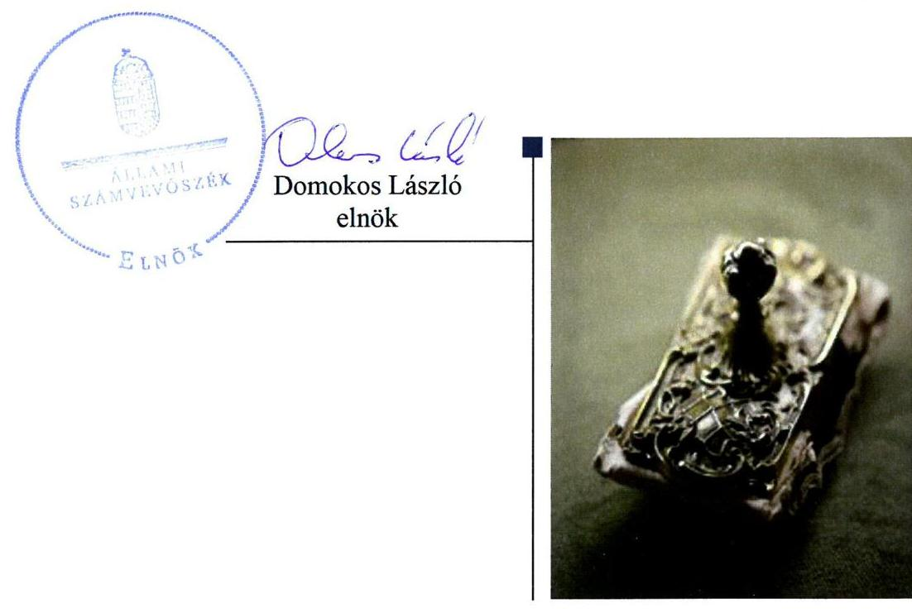
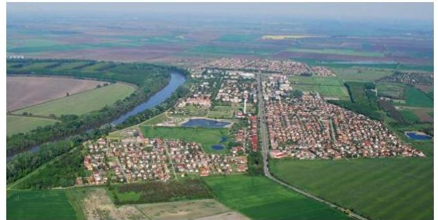
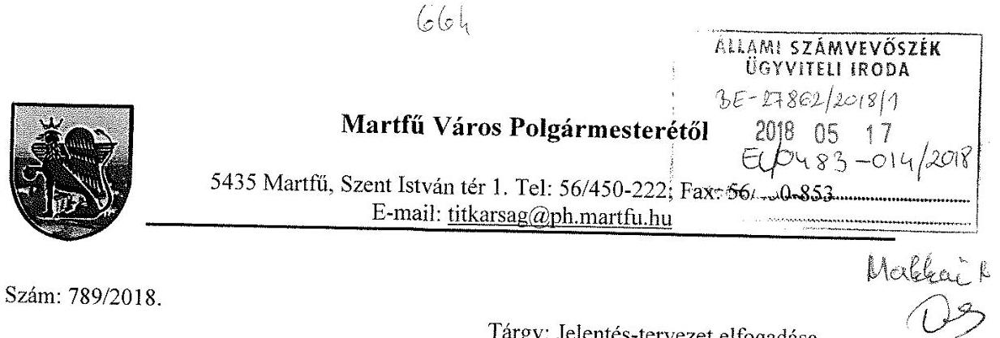
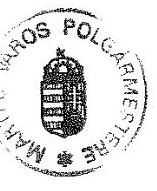

# Jelentés 

## Az önkormányzatok gazdasági társaságai

Az önkormányzatok többségi tulajdonában lévő gazdasági társaságok gazdálkodásának ellenőrzése - Martfűi Városfejlesztési, Ingatlankezelői és Hulladékgazdálkodási Szolgáltató Önkormányzati Nonprofit Kft. 2018.

---

# Jelentés 

## Az önkormányzatok gazdasági társaságai

Az önkormányzatok többségi tulajdonában lévő gazdasági társaságok gazdálkodásának ellenőrzése - Martfűi Városfejlesztési, Ingatlankezelői és Hulladékgazdálkodási Szolgáltató Önkormányzati Nonprofit Kft.
2018. OG. hó 26. nap

---

# AZ ELLENŐRZÉST FELÜGYELTE:

## MAKKAI MÁRIA felügyeleti vezető

## AZ ELLENŐRZÉST VEZETTE ÉS A VÉGREHAJTÁSÁÉRT FELELŐS:

### GELENCSÉR ZSOLT ellenőrzésvezető

### A PROGRAM ÖSSZEÁLLÍTÁSÁÉRT FELELŐS:

### TÓTPÁL SZABOLCS osztályvezető

IKTATÓSZÁM: EL-0227-033/2018.

TÉMASZÁM: 2447

ELLENŐRZÉS-AZONOSÍTÓ SZÁM: V079385

Jelentéseink az Országgyűlés számítógépes hálózatán és az Interneten a www.asz.hu címen is olvashatóak.

---

# TARTALOMJEGYZÉK 

■ ÖSSZEGZÉS ..... 5
■ AZ ELLENŐRZÉS CÉLJA ..... 6
■ AZ ELLENŐRZÉS TERÜLETE ..... 7
■ AZ ELLENŐRZÉS HÁTTERE, INDOKOLTSÁGA ..... 8
■ A JELENTÉS LÉNYEGES KÉRDÉSKÖREI ..... 9
■ AZ ELLENŐRZÉS HATÓKÖRE ÉS MÓDSZEREI ..... 10
■ MEGÁLLAPÍTÁSOK ..... 12
■ JAVASLATOK ..... 14
■ MELLÉKLETEK ..... 17
I. sz. melléklet: Értelmező szótár ..... 17
■ FÜGGELÉK: ÉSZREVÉTELEK ..... 19
■ RÖVIDÍTÉSEK JEGYZÉKE ..... 21

---

.

---

# ÖSSZEGZÉS 

A Társaság gazdálkodásának szabályozottsága nem felelt meg a jogszabályi előírásoknak. A Társaság vagyongazdálkodása nem volt szabályszerű, a vagyonkezelésbe vett vagyon értékének megőrzését nem biztosította. A Társaság bevételeinek és ráfordításainak elszámolása nem szabályszerűen történt, így az elszámoltathatóság követelményének nem tett eleget. Közzétételi kötelezettségének nem tett eleget, így gazdálkodásának átláthatósága nem volt biztosított.

## Az ellenőrzés társadalmi indokoltsága

Magyarországon az önkormányzatok kötelező és önként vállalt feladataik vonatkozásában is egyre szélesebb körben alkalmazzák a költségvetésen kívüli feladatellátást, ezáltal - a nonprofit szervezetek mellett - az önkormányzati tulajdonú gazdasági társaságok is kiemelt fontosságú szerephez jutottak.

Ezzel összhangban került sor Martfű Város Önkormányzata és a többségi tulajdonában álló Martfűi Városfejlesztési, Ingatlankezelői és Hulladékgazdálkodási Szolgáltató Önkormányzati Nonprofit Korlátolt Felelősségű Társaság szabályozottságának, gazdálkodása és vagyongazdálkodási tevékenysége szabályszerűségének, valamint az Önkormányzat tulajdonosi joggyakorlása 2013-2016. évi szabályszerűségének ellenőrzésére.

## Főbb megállapítások, következtetések, javaslatok

Martfű Város Önkormányzata a 100%-os tulajdonában álló Martfűi Városfejlesztési, Ingatlankezelői és Hulladékgazdálkodási Szolgáltató Önkormányzati Nonprofit Korlátolt Felelősségű Társaság tekintetében a tulajdonosi joggyakorlás kereteit szabályszerűen alakította ki, a tulajdonosi jogokat szabályszerűen gyakorolta. Megválasztotta a Társaság Felügyelőbizottságát, elfogadta annak ügyrendjét.

A Martfűi Városfejlesztési, Ingatlankezelői és Hulladékgazdálkodási Szolgáltató Önkormányzati Nonprofit Korlátolt Felelősségű Társaság gazdálkodásának szabályozottsága nem volt megfelelő, számlarendjét nem készítette el. A Társaság a 2013-2015. években a számviteli törvény előírásainak megfelelő éves beszámolóit nem készítette el, valamint a jogszabályi előírások ellenére nem tett eleget a legalább három évenkénti mennyiségi felvétellel történő leltározás kötelezettségének. A 2016. évi beszámoló megfelelt a számviteli törvény előírásainak. A közérdekű adatok közzétételi kötelezettségének nem tett eleget.

A Társaság bevételeinek és ráfordításainak elszámolása nem volt szabályszerű. A Társaság számviteli nyilvántartásaiban nem különítette el a vagyonkezelt vagyon működtetésével, valamint a hulladékgazdálkodási tevékenységgel összefüggő bevételeket és ráfordításokat.

A megállapítások alapján az Állami Számvevőszék Martfű Város Önkormányzata polgármesterének egy javaslatot, a Martfűi Városfejlesztési, Ingatlankezelői és Hulladékgazdálkodási Szolgáltató Önkormányzati Nonprofit Korlátolt Felelősségű Társaság ügyvezetőjének hat javaslatot fogalmazott meg.

---

# AZ ELLENŐRZÉS CÉLJA 

AZ ELLENŐRZÉS CÉLJA annak értékelése volt, hogy az önkormányzat vagyongazdálkodási tevékenysége során szabályszerűen gyakorolta-e tulajdonosi jogait; a gazdasági társaság szabályozottsága, gazdálkodása és vagyongazdálkodási tevékenysége, bevételeinek és ráfordításainak elszámolása megfelelt-e a jogszabályi és tulajdonosi előírásoknak; a gazdasági társaság kötelezettségállománya jelent-e kockázatot a működésre, valamint a gazdálkodás átláthatósága és elszámoltathatósága érdekében biztosítva volt-e a szolgáltatás díjának megalapozottsága szabályszerű önköltségszámítással.

---

# AZ ELLENŐRZÉS TERÜLETE 

## Martfű Város Önkormányzata és a Martfűi Városfejlesztési, Ingatlankezelői és Hulladék-gazdálkodási Szolgáltató Önkormányzati Nonprofit Korlátolt Felelősségű Társaság

A TÁRSASÁGOT 2012. 11. 29-én alapította Martfű Város Önkormányzata, 3,0 M Ft törzstőkével az Önkormányzat feladatába tartozó egyes közszolgáltatási feladatok ellátása érdekében. Fő tevékenysége az ingatlankezelés volt, e mellett ellátta a köztisztasági tevékenységet, parkfenntartást, játszóterek, sportlétesítmények és piac üzemeltetést, az önkormányzati ingatlanok bérbeadását, önkormányzati utak, járdák közterek és zöldfelületek fenntartását. Tevékenysége 2013. szeptemberétől a nem veszélyes hulladék gyűjtésével és kezelésével bővült. A Társaság vállalkozói tevékenységet is folytatott. Az Önkormányzat a feladat-ellátáshoz szükséges ingó és ingatlan vagyont a társaság rendelkezésére bocsátotta, üzemeltetési és vagyonkezelési szerződések keretében. Az ügyvezető személye három alkalommal, a polgármester személye 2014. októberében változott, a jegyző személyében nem volt változás az ellenőrzött időszakban. A Társaság nem volt önköltség számítási szabályzat készítésére kötelezett. A Társaság nem tartozott a kormányzati szektorba sorolt egyéb szervezetek közé.

---

# AZ ELLENŐRZÉS HÁTTERE, INDOKOLTSÁGA 

## AZ ÖNKORMÁNYZATOK TÖBBSÉGI TULAJDONÁBAN ÁLLÓ GAZDASÁGI TÁRSASÁGOK ELLENŐRZÉSE kiemelten fontos a vagyon megőrzése, megóvása érdekében, valamint a kormányzati szektor elszámolásaiban megjelenő önkormányzati tulajdonú gazdálkodó szervezetek esetében, amelyekkel szemben alapvető követelmény, hogy gazdálkodásuk, működésük szabályszerű, az általuk szolgáltatott adatok minél megbízhatóbbak legyenek. A feladatellátás költségeinek, ráfordításainak alakulása a lakosság széles rétegét érinti.

Az Állami Számvevőszék ellenőrzései feltárhatják, hogy az önkormányzat a feladatellátásához rendelt vagyon működtetését a tulajdonostól elvárható gondossággal végezte-e, a feladatot ellátó gazdasági társaság a létesítő okiratban, szolgáltatási szerződésben foglaltak betartásával biztosította-e a feladat ellátását. Az ellenőrzés rávilágíthat arra, hogy a hogy a gazdasági társaság a vagyon használatával biztosította-e a szolgáltatás folytatásának feltételeit, az önkormányzat tulajdonosi felügyelete hozzájárult-e a szabályszerű gazdálkodáshoz és feladatellátáshoz.

---

# A JELENTÉS LÉNYEGES KÉRDÉSKÖREI 

1. Az Önkormányzat tulajdonosi joggyakorlása szabályszerű volt-e?
2. A gazdasági társaság szabályozottsága, gazdálkodása, vagyongazdálkodási tevékenysége szabályszerű volt-e?

---

# AZ ELLENŐRZÉS HATÓKÖRE ÉS MÓDSZEREI 

## Az ellenőrzés típusa

Megfelelőségi ellenőrzés.

## Az ellenőrzött időszak

2013. január 1-jétől 2016. december 31-ig tartó időszak.

## Az ellenőrzés tárgya

Martfű Város Önkormányzata - a kizárólagos tulajdonában álló — Martfűi Városfejlesztési, Ingatlankezelői és Hulladékgazdálkodási Szolgáltató Önkormányzati Nonprofit Korlátolt Felelősségű Társaság feletti tulajdonosi joggyakorlása, valamint a Társaság gazdálkodásának szabályozottsága és szabályszerűsége.

## Az ellenőrzött szervezet

Martfű Város Önkormányzata, valamint a Martfűi Városfejlesztési, Ingatlankezelői és Hulladékgazdálkodási Szolgáltató Önkormányzati Nonprofit Korlátolt Felelősségű Társaság.

## Az ellenőrzés jogalapja

Az ellenőrzés jogszabályi alapját az ÁSZ tv. 1. § (3) bekezdése és 5. § (3)(4)-(5) bekezdései képezték.

## Az ellenőrzés módszerei

Az ellenőrzést a nemzetközi standardokat irányadónak tekintve az ellenőrzési program ellenőrzési kérdései, az ellenőrzött időszakban hatályos jogszabályok, az ellenőrzés szakmai szabályok és módszertanok figyelembe vételével végeztük.

Az ellenőrzés ideje alatt az ellenőrzött szervezettel történő kapcsolattartást az ÁSZ Szervezeti és Működési Szabályzatának vonatkozó előírásai alapján biztosítottuk.

---

Az ellenőrzés a kiválasztott, többségi tulajdonosi jogokat gyakorló önkormányzatra, illetve az ellenőrzésre kijelölt gazdasági társaság felett tulajdonosi jogokat gyakorló szervezetre és az ellenőrzött gazdasági társaságra terjedt ki.

Mintavétellel ellenőriztük a bevételek és ráfordítások elszámolását, a vagyonnyilvántartás és az értékcsökkenés elszámolását pedig teljes körű ellenőrzés alá vontuk. Az ellenőrzött minták alapján a sokaságban előforduló hibaarányt becsültük. „Szabályszerűnek" értékeltünk egy ellenőrzött területet, amennyiben 95%-os bizonyossággal a teljes sokaságban a hibaarány legfeljebb 10%-os, „nem szabályszerűnek", amennyiben 10%-nál magasabb arányt képviselt. A mintavételt megelőzően az anyagjellegű ráfordítások tételeinek sokaságából évente kiemeltük a 3-3 legnagyobb összegű tételt annak biztosítására, hogy az ellenőrzés a véletlen mintavétel mellett a legnagyobb értékű tételek ellenőrzésére biztosan kiterjedjen.

Az ellenőrzési kérdések megválaszolásához szükséges bizonyítékok megszerzése a következő ellenőrzési eljárások alkalmazásával történt: megfigyelés, kérdésfeltevés (információkérés), összehasonlítás, valamint elemző eljárás. Az ellenőrzési bizonyítékként felhasználható adatforrások közé tartoztak egyrészt az ellenőrzési programban felsorolt adatforrások, másrészt adatforrás lehetett még minden - az ellenőrzés folyamán - feltárt, az ellenőrzés szempontjából információkat tartalmazó dokumentum.

Az ellenőrzést a kérdésekre adott válaszok kiértékelésével, valamint a megjelölt adatforrások, a csatolt tanúsítványok felhasználásával, továbbá az adott időszakban hatályos jogszabályok figyelembe vételével folytattuk le.

---

# 1. Az Önkormányzat tulajdonosi joggyakorlása szabályszerű volt-e? 

Összegző megállapítás

A tulajdonosi joggyakorlás kereteinek kialakítása és a tulajdonosi joggyakorlás szabályszerű volt.

A TULAJDONOSI JOGOKAT az Önkormányzat Vagyonrendelete ${ }^{3}$ értelmében a Képviselő-testület gyakorolta. Az Alapító ${ }^{4}$ évente döntött a Társaság éves üzleti tervéről, a tervek teljesítését beszámolók keretében elfogadta.

A FELÜGYELŐBIZOTTSÁG tagjait az Alapító megválasztotta, az ügyrendjét jóváhagyta. A Felügyelőbizottság nem készített írásbeli jelentést a Társaság egyszerűsített éves beszámolóiról az ügyrendje 2.2 pontjában leírt kötelezettsége ellenére.

Az Alapító a Társaság éves egyszerűsített beszámolóinak elfogadásáról -a Ptk. ${ }^{5}$ 3:120. (2) bekezdésében foglaltak ellenére- a Felügyelőbizottság írásbeli jelentésének hiányában döntött.

Az Alapító a Taktv. ${ }^{6}$ előírásainak megfelelően megalkotta a Társaság javadalmazási szabályzatát.

## 2. A gazdasági társaság szabályozottsága, gazdálkodása, vagyongazdálkodási tevékenysége szabályszerű volt-e?

Összegző megállapítás

A Társaság gazdálkodásának szabályozottsága nem felelt meg a jogszabályi előírásoknak, gazdálkodása, vagyongazdálkodása nem volt átlátható.

SZÁMVITELI POLITIKÁVAL a Társaság a Számv. tv. ${ }^{7}$-ben előírtak szerint rendelkezett, azon átvezették a törvényi változásoknak megfelelő módosításokat. Eszközök és források leltárkészítési és leltározási szabályzatával a Társaság 2013. január 1-től 2013. szeptember 26-ig nem rendelkezett, ezzel megsértette a Számv tv. 14. § (11) bekezdését. A pénzkezelési szabályzat 2016. január 1-ig nem tartalmazott előírást a pénzforgalom bankszámlán történő lebonyolításának rendjéről, ezért nem felelt meg a Számv. tv. 14. § (8) bekezdésének. Az eszközök és források értékelési szabályzata a Számv.tv. előírásainak megfelelt.

SZÁMLARENDDEL a Társaság a Számv.tv. 161. § (1) bekezdésében előírtak ellenére nem rendelkezett, ezért gazdálkodásának átláthatósága nem volt biztosított. Számlarend hiányában a Társaság a Ht. 50. § (3) bekezdésében foglalt kötelezettség - a hulladékgazdálkodási tevékenység önálló mérleg és eredménykimutatás formájában történő bemutatásához szükséges elkülönített nyilvántartás megvalósítását nem szabályozta, így nem tett eleget a Számv. tv. 161/A. § (2) bekezdésében előírtaknak.

# BELSŐ ADATVÉDELMI ÉS ADATBIZTONSÁGI SZABÁLYZAT készítésére a Társaság 2013. január 24-től volt kötelezett az Info tv. ${ }^{8}$ 24. § (2) bekezdésének előírása szerint, a szabályzatot azonban csak 2015. január 1-vel készítette el. Az Info tv. 37. § (1) bekezdésének előírása ellenére a Társaság az Info tv. 1. sz. mellékletében számára előírt közérdekű adatokat nem tette közzé. 

## A SZÁMV. TV. ELŐÍRÁSAINAK MEGFELELŐ EGYSZERŰSÍTETT ÉVES BESZÁMOLÓIT a Társaság a 2013-2015. évekre a Számv.tv. 19 § (1) bekezdésének előírását megsértve nem készítette el, a beszámolók nem tartalmaztak kiegészítő mellékletet. A 2016. évi beszámoló megfelelt a számviteli törvény előírásainak.

Az ellenőrzött időszak egyik évében sem tett eleget a Társaság a Ht. 50. § (3) bekezdésében foglalt kötelezettségének, mert kiegészítő melléklet hiányában, illetve 2016. évre vonatkozóan kiegészítő mellékletében nem mutatta be hulladékgazdálkodói tevékenységét önálló mérleg és eredménykimutatás formájában.

Mennyiségi felvétellel történő leltárt az ellenőrzött időszak alatt nem készített a Társaság, ezzel nem tett eleget a Számv.tv. 69. § (3) bekezdésében foglalt legalább három évenkénti mennyiségi felvétellel történő leltározás kötelezettségének.

A VAGYONKEZELÉSBE VETT VAGYONNAL való gazdálkodás nem volt szabályszerű. Az Önkormányzat és a Társaság között létrejött vagyonkezelési szerződés az Önkormányzat Vagyonrendeletének 9. § (7) bekezdés c) pontjában foglaltak ellenére nem rendelkezett arról, hogy a vagyonkezelő a vagyon felújításáról, pótlólagos beruházásáról legalább a vagyoni eszközök elszámolt értékcsökkenésének megfelelő mértékben köteles gondoskodni és e célokra az értékcsökkenésnek megfelelő mértékben tartalékot képezni. A Társaság könyveiben értékcsökkenést a Számv. tv. 52 § (7) bekezdésének előírásai
 ellenére a vagyonkezelésbe vett ingatlanok után nem számolt el, a Mötv. 109. § (6) bekezdése szerinti pótlási illetve tartalék képzési kötelezettségét nem teljesítette. A Mötv. ${ }^{9}$ 109. § (7) bekezdésében foglaltaknak a Társaság nem tett eleget, mert a vagyonkezelésébe vett vagyon használatából, működtetéséből származó bevételeit, illetve ráfordításait nem különítette el könyveiben, ezért a vagyonkezelésbe vett vagyonnal való gazdálkodása nem volt átlátható és ellenőrizhető.

A BEVÉTELEK ÉS RÁFORDÍTÁSOK elszámolása nem volt szabályszerű, mert a Társaság számviteli nyilvántartásaiban nem különítette el a vagyonkezelt vagyon működtetésével, valamint a hulladékgazdálkodási tevékenységgel összefüggő bevételeket és ráfordításokat.

A Társaság működésével összefüggésben előírt rendelet alkotási és díj megállapítási kötelezettségének az Önkormányzat eleget tett. A Társaság az Önkormányzat által meghatározott díjakon számlázott.

---

# JAVASLATOK 

Az ÁSZ tv. 33. § (1) bekezdésében foglaltak értelmében az ellenőrzött szervezet vezetője köteles a jelentésben foglalt megállapításokhoz kapcsolódó intézkedési tervet összeállítani és azt a jelentés kézhezvételétől számított 30 napon belül az ÁSZ részére megküldeni. Amennyiben az ellenőrzött szervezet vezetője nem küldi meg határidőben az intézkedési tervet, vagy továbbra sem elfogadható intézkedési tervet küld, az Állami Számvevőszék elnöke az ÁSZ tv. 33. § (3) bekezdés a) és b) pontjaiban foglaltakat érvényesítheti.

## Martfű Város polgármesterének

1. Intézkedjen arról, hogy az Alapító a Ptk.-ban előírtaknak megfelelően, a Felügyelőbizottság írásbeli jelentésének birtokában döntsön a Társaság éves beszámolójáról.
(1 sz. megállapítás 3. bekezdése alapján)

## a Martfúi Városfejlesztési, Ingatlankezelői és Hulladékgazdálkodási Szolgáltató Önkormányzati NKft. ügyvezetőjének

1. Intézkedjen a Számv. tv. előírásainak megfelelő számlarend elkészítéséről.
(2. sz. megállapítás 2. bekezdése alapján)
2. Intézkedjen az Info. tv. 1. mellékletében előírt adatok közzétételéről
(2. sz. megállapítás 3. bekezdés 2. mondata alapján)
3. Intézkedjen a hulladékgazdálkodási közszolgáltatás nyújtása érdekében végzett tevékenységnek az éves beszámoló kiegészítő mellékletében oly módon történő bemutatásáról, mintha azt a Társaság önálló vállalkozás keretében végezte volna.
(2. sz. megállapítás 5. bekezdése alapján)
4. Intézkedjen a mennyiségi felvétellel történő leltározás jogszabályi előírásoknak megfelelő végrehajtásáról.
(2. sz. megállapítás 6. bekezdése alapján)

---

5. Intézkedjen a vagyonkezelésbe vett eszközök után a jogszabályi előírásoknak megfelelő tartalék képzéséről.
(2. sz. megállapítás 7. bekezdés 3. mondata alapján)
6. Intézkedjen a vagyonkezelésbe vett vagyon működtetésével kapcsolatos elkülönített nyilvántartás vezetéséről.
(2. sz. megállapítás 7. bekezdés utolsó mondata alapján)

---

.

---

# MELLÉKLETEK 

- I. SZ. MELLÉKLET: ÉRTELMEZŐ SZÓTÁR
gazdasági társaság
nemzeti vagyon
nonprofit gazdasági társaság

Ptk 3.88. § (1) bekezdése szerint „a gazdasági társaságok üzletszerű közös gazdasági tevékenység folytatására, a tagok vagyoni hozzájárulásával létrehozott, jogi személyiséggel rendelkező vállalkozások, amelyekben a tagok a nyereségből közösen részesednek, és a veszteséget közösen viselik".
Nvtv. 1. § (2) bekezdése szerint többek között:
„az állam vagy a helyi önkormányzat kizárólagos tulajdonában álló dolgok, az a) pont hatálya alá nem tartozó, állam vagy a helyi önkormányzat tulajdonában lévő dolog,
az állam vagy a helyi önkormányzat tulajdonában lévő pénzügyi eszközök, továbbá az államot vagy a helyi önkormányzatot megillető társasági részesedések, az államot vagy a helyi önkormányzatot megillető bármely vagyoni értékkel rendelkező jogosultság, amelyet jogszabály vagyoni értékű jogként nevesít."
Civil tv. 9/F. § (2) bekezdése szerint „az a gazdasági társaság minősül nonprofit gazdasági társaságnak és cégnevében az a gazdasági társaság tüntetheti fel a nonprofit jelleget, amelynek létesítő okirata tartalmazza, hogy a gazdasági társaság tevékenységéből származó nyereség a tagok között nem osztható fel, hanem az a gazdasági társaság vagyonát gyarapítja." (hatályos 2014. március 15-től)

---

.

---

# FÜGGELÉK: ÉSZREVÉTELEK 

A jelentéstervezetet a Számvevőszék 15 napos észrevételezésre megküldte az ellenőrzött szervezetek vezetőinek az ÁSZ tv. 29. §* (1) bekezdése előírásának megfelelően.

Az ÁSZ a jelentéstervezetet észrevételezésre megküldte a Martfüi Városfejlesztési, Ingatlankezelői és Hulladékgazdálkodási Szolgáltató Önkormányzati Nonprofit Kft. ügyvezetőjének és Martfü Város Önkormányzata polgármesterének.
A Martfüi Városfejlesztési, Ingatlankezelői és Hulladékgazdálkodási Szolgáltató Önkormányzati Nonprofit Kft ügyvezetője az ÁSZ tv. 29. § (2) bekezdésében foglalt észrevételezési jogával nem élt, a törvényes határidőn belül észrevételt nem tett. Martfü Város polgármesterének nemleges észrevételét a függelék alább tartalmazza.

[^0]
[^0]:    * 29. § (1) Az Állami Számvevőszék az ellenőrzési megállapításait megküldi az ellenőrzött szervezet vezetőjének vagy az általa megbízott személynek, és annak, akinek személyes felelősségét állapította meg.
    (2) Az ellenőrzött szervezet vezetője és a felelősként megjelölt személy az ellenőrzés megállapításaira tizenöt napon belül írásban észrevételt tehet.
    (3) Az Állami Számvevőszék az észrevételre a beérkezésétől számított harminc napon belül írásban válaszol. A figyelembe nem vett észrevételeket köteles a jelentésben feltüntetni, és megindokolni, hogy azokat miért nem fogadta el.

---

# Állami Számvevőszék 

Budapest
Apáczai Csere János u. 10.
1052

Tisztelt Cím !

Az EL-0483-012/2018. számú „az önkormányzatok többségi tulajdonában lévő gazdasági társaságok gazdálkodásának ellenőrzése - Martfüi Városfejlesztési, Ingatlankezelői és Hulladékgazdálkodási Szolgáltató Önkormányzati Nonprofit Kft." című számvevőszéki jelentéstervezettel kapcsolatban észrevételt nem kívánok tenni.

Martfü, 2018. május 14.

Dr. Papp Antal
polgármester

---

# RÖVIDÍTÉSEK JEGYZÉKE 

${ }^{1}$ Társaság
${ }^{2}$ Önkormányzat
${ }^{3}$ vagyonrendelet
${ }^{4}$ Alapító
${ }^{5}$ Ptk.
${ }^{6}$ Taktv.
${ }^{7}$ Számv. tv.
${ }^{8}$ Info tv.
${ }^{9}$ Mótv.

Martfűi Városfejlesztési, Ingatlankezelői és Hulladékgazdálkodási Szolgáltató Önkormányzati Nonprofit Korlátolt Felelősségű Társaság
Martfű Város Önkormányzata
Martfű Város Önkormányzat Képviselő-testületének 8/2012. (III.07.) önkormányzati rendelete Martfű Város Önkormányzata vagyonáról és vagyongazdálkodásáról
Martfű Város Önkormányzata
a polgári törvénykönyvről szóló 2013. évi V. törvény
a köztulajdonban álló gazdasági társaságok takarékosabb működéséről szóló 2009. évi CXXII. törvény
2000. évi C. törvény a számvitelről
az információs önrendelkezési jogról és az információszabadságról szóló 2011. évi CXII. törvény
2011. évi CLXXXIX. törvény Magyarország helyi önkormányzatairól

---

# ÁLLAMI SZÁMVEVŐSZÉK 

1052 Budapest, Apáczai Csere János utca 10.
Levélcím: 1364 Budapest 4. Pf. 54
Telefon: +36 14849100 Telefax: +36 14849200
www.asz.hu

