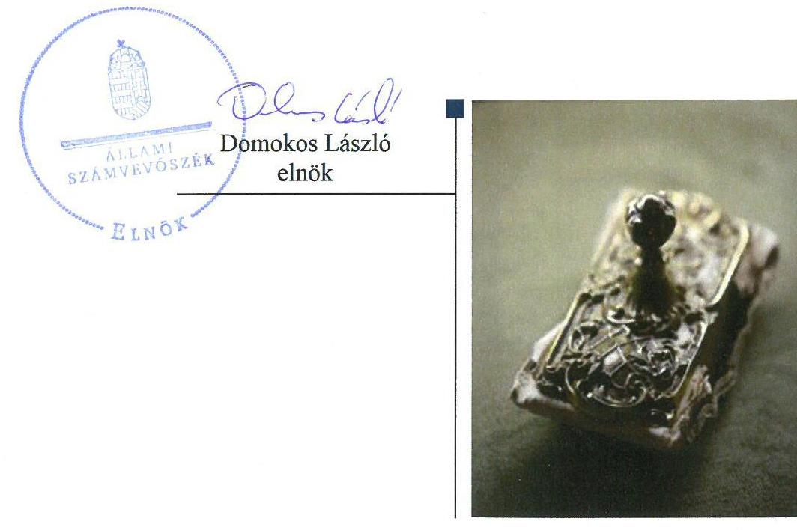
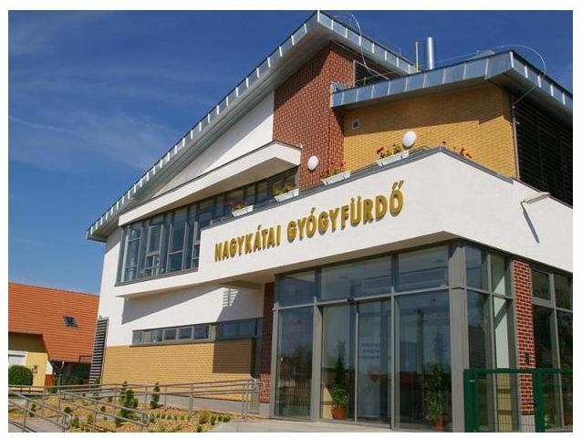

# Jelentés 

## Az önkormányzatok gazdasági társaságai

Az önkormányzatok többségi tulajdonában lévő gazdasági társaságok gazdálkodásának ellenőrzése - Nagykátai Gyógyfürdő és Egyéb Szolgáltató Nonprofit Kft.
2018. június hó 26. nap

---

# AZ ELLENŐRZÉST FELÜGYELTE:

## MAKKAI MÁRIA felügyeleti vezető

## AZ ELLENŐRZÉST VEZETTE ÉS A VÉGREHAJTÁSÁÉRT FELELŐS:

### KEREKES PÉTER ellenőrzésvezető

## A PROGRAM ÖSSZEÁLLÍTÁSÁÉRT FELELŐS:

### TÓTPÁL SZABOLCS osztályvezető

IKTATÓSZÁM: EL-0209-041/2018.

TÉMASZÁM: 2447

ELLENŐRZÉS-AZONOSÍTÓ SZÁM: V079374

Jelentéseink az Országgyűlés számítógépes hálózatán és az Interneten a www.asz.hu címen is olvashatóak.

---

# TARTALOMJEGYZÉK 

■ ÖSSZEGZÉS ..... 5
■ AZ ELLENŐRZÉS CÉLJA ..... 6
■ AZ ELLENŐRZÉS TERÜLETE ..... 7
■ AZ ELLENŐRZÉS HÁTTERE, INDOKOLTSÁGA ..... 8
■ A JELENTÉS LÉNYEGES KÉRDÉSKÖREI ..... 9
■ AZ ELLENŐRZÉS HATÓKÖRE ÉS MÓDSZEREI ..... 10
■ MEGÁLLAPÍTÁSOK ..... 12
■ JAVASLATOK ..... 14
■ FÜGGELÉK: ÉSZREVÉTELEK ..... 17
■ RÖVIDÍTÉSEK JEGYZÉKE ..... 19

---

.

---

# ÖSSZEGZÉS 

A Nagykátai Gyógyfürdő és Egyéb Szolgáltató Nonprofit Kft. szabályozottsága nem felelt meg a jogszabályi előírásoknak. A gazdálkodása és a vagyongazdálkodása során nem biztosította az elszámoltathatóságot. Közfeladataival kapcsolatosan nem biztosította tevékenységének átláthatóságát.

## Az ellenőrzés társadalmi indokoltsága

Magyarországon az intézmény-centrikus közfeladat-ellátás jellemző, de egyre jelentősebb a költségvetésen kívüli feladatellátás térnyerése. Helyi szinten ennek legfontosabb szereplői az önkormányzati tulajdonban lévő gazdasági társaságok, amelyeknek ellenőrzése kiemelten fontos a közfeladat ellátása, és a közvagyon megőrzése, megóvása érdekében. Ezért alapvető követelmény, hogy gazdálkodásuk, működésük szabályszerű és átlátható legyen.

A Nagykátai Gyógyfürdő és Egyéb Szolgáltató Nonprofit Kft.-t Nagykáta Város Önkormányzata alapította egyszemélyes társaságként különféle közfeladatok ellátására.

## Főbb megállapítások, következtetések, javaslatok

Nagykáta Város Önkormányzata a tulajdonosi joggyakorlás kereteit kialakította, és a tulajdonosi jogokat szabályszerűen gyakorolta.

A Nagykátai Gyógyfürdő és Egyéb Szolgáltató Nonprofit Kft. szabályozottsága nem volt megfelelő, mert a számviteli politikája és a számlarendje nem felelt meg a törvényi előírásoknak. Az egyszerűsített éves beszámolók mérlegsorai nem voltak leltárral alátámasztva, ezért a mérleg valódisága nem volt biztosított. A bevételek és ráfordítások elszámolása, valamint a vagyonnyilvántartás nem volt szabályszerű.

A Nagykátai Gyógyfürdő és Egyéb Szolgáltató Nonprofit Kft. a közérdekű adatok közzétételére vonatkozó kötelezettségét nem teljesítette.

A megállapítások alapján az Állami Számvevőszék Nagykáta Város Önkormányzata polgármesterének egy javaslatot, a Nagykátai Gyógyfürdő és Egyéb Szolgáltató Nonprofit Kft. ügyvezetőjének hat javaslatot fogalmazott meg.

---

# AZ ELLENŐRZÉS CÉLJA 

Az ellenőrzés célja volt annak értékelése, hogy az Önkormányzat ${ }^{1}$ vagyongazdálkodási tevékenysége során szabályszerűen gyakorolta-e tulajdonosi jogait, a Társaság ${ }^{2}$ szabályozottsága, gazdálkodása és vagyongazdálkodási tevékenysége, bevételeinek és ráfordításainak elszámolása megfelelt-e a jogszabályi és tulajdonosi előírásoknak; a gazdasági társaság kötelezettségállománya jelent-e kockázatot a működésre, valamint a gazdálkodás átláthatósága és elszámoltathatósága érdekében biztosítva volt-e a szolgáltatás díjának megalapozottsága szabályszerű önköltségszámítással.

---

# AZ ELLENŐRZÉS TERÜLETE 

## Nagykátai Gyógyfürdő és Egyéb Szolgáltató Nonprofit Kft. és Nagykáta Város Önkormányzata

A Nagykátai Gyógyfürdő és Egyéb Szolgáltató Nonprofit Korlátolt Felelősségű Társaságot Nagykáta Város Önkormányzata 100%-os tulajdonosként alapította 2008-ban KÁTA Települési Hulladékkezelési Közszolgáltató Kft. néven. A Társaság a 2013. szeptember 27-én bejegyzett névváltoztatást követően a jelenlegi cégnévvel működött tovább.

A Társaság feladatellátásához kapcsolódóan az Önkormányzat kialakította a jogszabályi hátteret: megalkotta a Hulladékgazdálkodási rendeletét ${ }^{3}$ és a Temetőrendeletét ${ }^{4}$. A Társaság feladatait a Kegyeleti közszolgáltatási szerződésben ${ }^{5}$, a Hulladékgazdálkodási közszolgáltatási szerződésben ${ }^{6}$ és a Piac üzemeltetési szerződésben ${ }^{7}$ határozták meg.

A Társaság közszolgáltatóként ellátta Nagykáta város területén a kommunális szilárd hulladék gyűjtését, szállítását és elhelyezését, majd 2013. május 1-jétől a köztemető üzemeltetését. Egyéb feladatai között szerepelt a városi piac, majd 2013. július 1-jétől a Nagykátai Gyógy-és Strandfürdő üzemeltetése.

A Társaság a Számv. tv. ${ }^{8}$ 155. § (3) bekezdése alapján könyvvizsgálatra nem volt kötelezett, de az Önkormányzat az Alapító okiratban független könyvvizsgálót jelölt ki.

A Társaságnak a Számv. tv. 14. § (6) bekezdése alapján az önköltségszámítás belső rendjére vonatkozó belső szabályzat készítésére nem állt fenn kötelezettsége.

Az ellenőrzött időszakban a Társaság tulajdonosi részesedéssel más gazdasági társaságban nem rendelkezett, és nem minősült kormányzati szektorba sorolt egyéb szervezetnek. A Társaság nem rendelkezett vagyonkezelt eszközzel.

A polgármester személye 2014-ben, az ügyvezető személye 2016-ban változott, a jegyző és a könyvvizsgáló személye nem változott az ellenőrzött időszakban.

---

# AZ ELLENŐRZÉS HÁTTERE, INDOKOLTSÁGA 

Az önkormányzatok többségi tulajdonában álló gazdasági társaságok ellenőrzése kiemelten fontos a vagyon megőrzése, megóvása érdekében. A feladatellátás költségeinek, ráfordításainak alakulása a lakosság széles rétegét érinti.

Ellenőrzésünk feltárhatja, hogy az önkormányzat a feladatellátásához rendelt vagyon működtetését a tulajdonostól elvárható gondossággal végezte-e, a feladatot ellátó gazdasági társaság a létesítő okiratban, szolgáltatási szerződésben foglaltak betartásával biztosította-e a feladat ellátását. Az ellenőrzés rávilágíthat arra, hogy a gazdasági társaság a vagyon használatával biztosította-e a szolgáltatás folytatásának feltételeit, az önkormányzat tulajdonosi felügyelete hozzájárult-e a szabályszerű gazdálkodáshoz és feladatellátáshoz. A megállapítások alapján megfogalmazott számvevőszéki javaslatok hasznosítása elősegítheti a meglévő hibák megszüntetését. A jó gyakorlatok bemutatásával az ÁSZ ${ }^{9}$ hozzájárulhat a követendő megoldások megismertetéséhez, terjesztéséhez.

---

# A JELENTÉS LÉNYEGES KÉRDÉSKÖREI 

1. A tulajdonosi joggyakorlás szabályszerű volt-e?
2. A gazdasági társaság szabályozottsága, gazdálkodása és vagyongazdálkodása szabályszerű volt-e?

---

# AZ ELLENŐRZÉS HATÓKÖRE ÉS MÓDSZEREI 

## Az ellenőrzés típusa

Megfelelőségi ellenőrzés.

## Az ellenőrzött időszak

2013. január 1-től 2016. december 31-ig.

## Az ellenőrzés tárgya

Az Önkormányzat - a 100%-os tulajdonában lévő gazdasági társaság feletti - tulajdonosi joggyakorlása, valamint a Társaság gazdálkodásának szabályozottsága és szabályszerűsége.

Az ellenőrzés kiterjed minden olyan körülményre és adatra, amely az ÁSZ jogszabályban meghatározott feladatainak teljesítéséhez, valamint a program végrehajtása folyamán felmerült újabb összefüggések feltárásához szükséges.

## Az ellenőrzött szervezet

Nagykátai Gyógyfürdő és Egyéb Szolgáltató Nonprofit Kft. és Nagykáta Város Önkormányzata

## Az ellenőrzés jogalapja

Az ellenőrzés jogszabályi alapját az ÁSZ tv. ${ }^{10} 1. § (3) bekezdése és 5. § (3)(4)-(5) bekezdései képezik.

## Az ellenőrzés módszerei

Az ellenőrzést a nemzetközi standardokat irányadónak tekintve az ellenőrzési program ellenőrzési kérdései, az ellenőrzött időszakban hatályos jogszabályok, az ellenőrzés szakmai szabályok és módszertanok figyelembe vételével végeztük.

Az ellenőrzés ideje alatt az ellenőrzött szervezettel történő kapcsolattartást az ÁSZ Szervezeti és Működési Szabályzatának vonatkozó előírásai alapján biztosítottuk.

Az ellenőrzési kérdések megválaszolásához szükséges bizonyítékok megszerzése a következő ellenőrzési eljárások alkalmazásával történt:

---

megfigyelés, kérdésfeltevés (információkérés), összehasonlítás, valamint elemző eljárás. Az ellenőrzési bizonyítékként felhasználható adat-források közé tartoztak egyrészt az ellenőrzési programban felsorolt adatforrások, másrészt adatforrás lehet még minden - az ellenőrzés folyamán - feltárt, az ellenőrzés szempontjából információkat tartalmazó dokumentum.

Az ellenőrzést a kérdésekre adott válaszok kiértékelésével, valamint a megjelölt adatforrások, a csatolt tanúsítványok felhasználásával, továbbá az adott időszakban hatályos jogszabályok figyelembe vételével folytattuk le.

A bevételek, a személyi jellegű ráfordítások és az értékcsökkenés elszámolása, valamint a vagyonnyilvántartás terén a szabályszerű működést véletlen mintavétellel ellenőriztük.

A mintavétellel ellenőrzött területek esetében minden egyes tétel vonatkozásában a szabályszerűségre vonatkozó kérdéseket tettünk fel, amelyek eredménye összesítésre került. Az ellenőrzött minták alapján a sokaságban előforduló átlagos hibaarányt becsültük. „Szabályszerűnek" értékeltünk egy ellenőrzött területet, amennyiben 95%-os bizonyossággal a teljes sokaságban az átlagos hibaarány legfeljebb 10%, nem szabályszerűnek, amennyiben 10%-nál magasabb arányt képviselt. Abban az esetben, ha a teljes sokaság tekintetében a 10%-os hibaarányhoz való viszony megítélésének megbízhatósága nem érte el a 95%-ot, annak elérése érdekében értékelésünket további szempontokkal egészítettük ki, és figyelembe vettük a feltárt hibák típusát és súlyát. A ráfordítások elszámolására és a vagyonnyilvántartásra vonatkozó véletlen mintavételt kockázati alapú kiválasztással egészítettük ki, amelynek során a három legnagyobb összegű tételt választottuk ki.

---

# 1. A tulajdonosi joggyakorlás szabályszerű volt-e? 

## Összegző megállapítás

A tulajdonosi joggyakorlás szabályszerű volt.
A tulajdonosi joggyakorlás rendjét a Vagyonrendeletben ${ }^{11}$ és az Alapító okiratban ${ }^{12}$ határozták meg. A tulajdonosi jogokat a Képviselő-testület ${ }^{13}$ gyakorolta.

Az Alapító ${ }^{14}$ az Alapító okiratban felügyelő bizottság létrehozását rendelte el. A felügyelő bizottság az ellenőrzött időszakban a Gt. ${ }^{15}$ 34. § (4) bekezdésében és a Ptk. ${ }^{16} 3:122$ § (3) bekezdésben rögzített előírások ellenére nem állapította meg az ügyrendjét.

Az Alapító a Társaság egyszerűsített éves beszámolóit a felügyelő bizottság írásbeli jelentésének és a könyvvizsgálói jelentés birtokában elfogadta.

## 2. A gazdasági társaság szabályozottsága, gazdálkodása és vagyongazdálkodása szabályszerű volt-e?

## Összegző megállapítás

2.1. számú megállapítás

A Társaság szabályozottsága, gazdálkodása és vagyongazdálkodása nem volt szabályszerű.

A Társaság szabályozottsága nem felelt meg a jogszabályi előírásoknak.

A Társaság teljesítette a Számv. tv.-ben előírt kötelezettségét a Számviteli politika ${ }^{17}$, az annak keretében előírt szabályzatok és a Számlarend ${ }^{18}$ elkészítésére vonatkozóan.

Számviteli politikája a Számv. tv. 14. § (4) bekezdésében előírtak ellenére nem tartalmazta, hogy mit tekintenek a számviteli elszámolás és értékelés szempontjából lényegesnek, jelentősnek, valamint nem lényegesnek, nem jelentősnek.

A Társaság a Számv. tv. 14. § (11) bekezdés előírása ellenére, a Számviteli politikáján 2016. december 31-éig nem vezette keresztül a Számv. tv.
—2013. január 1-jétől hatályba lépett, a jelentős és nem jelentős hibahatárt, valamint a megbízható és valós képet lényegesen befolyásoló hibát érintő,
—és a 2015. július 4-én hatályba lépett, a rendkívüli eredmény összetevőit, illetve a mérleg szerinti eredmény fogalmát megszüntető módosításait.
A Társaság Számlarendje az ellenőrzött időszakban a Számv. tv. 161. § (2) bekezdés a) pontban előírtak ellenére nem tartalmazta minden alkalmazásra kijelölt számla számjelét és megnevezését.

---

# 2.2. számú megállapítás 

A Társaság 2016. június 7-ig nem rendelkezett az Info. tv. ${ }^{19}$ 35. § (3) bekezdésében előírt belső szabályzattal a közérdekű adatok közzétételének részletes szabályairól, valamint 2016. március 31-ig az Info. tv. 24. § (3) bekezdésében meghatározott adatvédelmi és adatbiztonsági szabályzattal. A 2016. június 8-án hatályba lépett Közzétételi szabályzat ${ }^{20}$ és a 2016. április 1-jén hatályba lépett Iratkezelési és adatvédelmi szabályzat ${ }^{21}$ megfelelt az Info. tv. előírásainak.

## A Társaság gazdálkodása és vagyongazdálkodási tevékenysége nem volt szabályszerű.

A Társaság a Számv. tv. 69. § (1) bekezdésben előírtak ellenére az egyszerűsített éves beszámolók mérlegtételeit nem támasztotta alá az eszközeit és forrásait tételesen, ellenőrizhető módon tartalmazó leltárakkal.

Az egyszerűsített éves beszámolók kiegészítő mellékletei nem tartalmazták a hulladékgazdálkodási közszolgáltatás nyújtása érdekében végzett tevékenységeknek a Ht. ${ }^{22}$ 50. § (3) bekezdésében előírt elkülönült bemutatását.

A hiányosságok ellenére a könyvvizsgáló az egyszerűsített éves beszámolókat korlátozás nélküli hitelesítő záradékkal látta el.

A Társaság a Ht. 50. § (2) bekezdésében előírtak ellenére az egyes tevékenységeiről nem vezetett elkülönült nyilvántartást, így nem tett eleget a Számv. tv. 161/A § (2) bekezdésében előírtaknak, ezáltal nem biztosította az egyes tevékenységek átláthatóságát, valamint a keresztfinanszírozás kizárását.

A Társaságnál az anyagjellegű, az egyéb és a rendkívüli ráfordításoknak, valamint a pénzügyi műveletek ráfordításainak elszámolása nem volt szabályszerű, mert a Számv. tv. 165. § (2) bekezdésében előírtak ellenére a számviteli nyilvántartásokba a gazdasági eseményt alátámasztó bizonylatok hiányában jegyeztek be adatokat. Bizonylatok hiányában nem volt biztosított a Számv.
 tv. 15. § (3) előírásának megfelelő beszámoló készítését alátámasztó könyvvezetés.

A vagyonnyilvántartás és az értékcsökkenés elszámolása nem volt szabályszerű, mert a Számv. tv. 52. § (2) bekezdésében előírtak ellenére az eszközök üzembe helyezését nem dokumentálták hitelt érdemlő módon.

A személyi jellegű ráfordítások, valamint az értékesítés nettó árbevételének, az egyéb, a rendkívüli bevételeknek és a pénzügyi műveletek bevételeinek elszámolása nem volt szabályszerű, mert vagy a Számv. tv. 165. § (2) bekezdésében előírtakat megsértve nem bizonylatok alapján jegyeztek be adatokat a számviteli nyilvántartásokba, vagy a bizonylatok a Számv. tv. 167. § (1) bekezdés h) pont előírását megsértve nem tartalmazták a könyvelés módjára, az érintett könyvviteli számlákra történő hivatkozást.

## A Társaság nem biztosította az átláthatóságot.

A Társaság megsértette az Info. tv. 37. § (1) bekezdésben foglaltakat, mivel az Info. tv. 1. mellékletében számára előírt adatok közzétételéről nem gondoskodott.

---

# JAVASLATOK 

Az ÁSZ tv. 33. § (1) bekezdésében foglaltak értelmében az ellenőrzött szervezet vezetője köteles a jelentésben foglalt megállapításokhoz kapcsolódó intézkedési tervet összeállítani és azt a jelentés kézhezvételétől számított 30 napon belül az ÁSZ részére megküldeni. Amennyiben az ellenőrzött szervezet vezetője nem küldi meg határidőben az intézkedési tervet, vagy továbbra sem elfogadható intézkedési tervet küld, az Állami Számvevőszék elnöke az ÁSZ tv. 33. § (3) bekezdése a) és b) pontjaiban foglaltakat érvényesítheti.

## Nagykáta Város polgármesterének

1. Kezdeményezze, hogy a felügyelő bizottság állapítsa meg ügyrendjét és az Alapító a jogszabályi előírásoknak megfelelően hagyja jóvá.
(1. sz. megállapítás 2. bekezdés második mondata alapján)

## a Nagykátai Gyógyfürdő és Egyéb Szolgáltató Nonprofit Kft. ügyvezetőjének

1. Intézkedjen a számviteli politika és a számlarend módosításáról, hogy az feleljen meg a hatályos Számv. tv. előírásainak.
(2.1. sz. megállapítás 2-4. bekezdései alapján)
2. Intézkedjen a jogszabályi előírásoknak megfelelően a mérleg tételeinek leltárral való alátámasztásáról.
(2.2. sz. megállapítás 1. bekezdése alapján)
3. Intézkedjen a hulladékgazdálkodási közszolgáltatás nyújtása érdekében végzett tevékenységnek az egyszerűsített éves beszámoló kiegészítő mellékletében oly módon történő bemutatásáról, mintha azt a Társaság önálló vállalkozás keretében végezte volna.
(2.2. sz. megállapítás 2. bekezdése alapján)
4. Intézkedjen a Társaság egyes tevékenységeire vonatkozóan, a Ht. előírásainak megfelelő elkülönült nyilvántartás vezetéséről.
(2.2. sz. megállapítás 4. bekezdése alapján)

---

5. Intézkedjen a bevételek és ráfordítások, továbbá az értékcsökkenés jogszabályi előírásoknak megfelelő elszámolásáról, valamint az eszközök üzembe helyezésének Számv. tv. előírásainak megfelelő dokumentálásáról.
(2.2. sz. megállapítás 5-7. bekezdései alapján)
6. Intézkedjen az Info. tv. 1. mellékletében előírt adatok közzétételéről.
(2.3. sz. megállapítás 1. bekezdése alapján)

---

.

---

# FÜGGELÉK: ÉSZREVÉTELEK 

A jelentéstervezetet a Számvevőszék 15 napos észrevételezésre megküldte az ellenőrzött szervezetek vezetőinek az ÁSZ tv. 29. § (1) bekezdése előírásának megfelelően.

A Nagykátai Gyógyfürdő és Egyéb Szolgáltató Nonprofit Kft. ügyvezetője és Nagykáta Város polgármestere az ÁSZ tv. 29. § (2) bekezdésében foglalt észrevételezési jogukkal nem éltek, a törvényes határidőn belül észrevételt nem tettek.

[^0]
[^0]:    * 29. § (1) Az Állami Számvevőszék az ellenőrzési megállapításait megküldi az ellenőrzött szervezet vezetőjének vagy az általa megbízott személynek, és annak, akinek személyes felelősségét állapította meg.
    (2) Az ellenőrzött szervezet vezetője és a felelősként megjelölt személy az ellenőrzés megállapításaira tizenöt napon belül írásban észrevételt tehet.
    (3) Az Állami Számvevőszék az észrevételre a beérkezésétől számított harminc napon belül írásban válaszol. A figyelembe nem vett észrevételeket köteles a jelentésben feltüntetni, és megindokolni, hogy azokat miért nem fogadta el.

---

.

---

# RÖVIDÍTÉSEK JEGYZÉKE 

${ }^{1}$ Önkormányzat
${ }^{2}$ Társaság
${ }^{3}$ Hulladékgazdálkodási rendelet
${ }^{4}$ Temetőrendelet
${ }^{5}$ Kegyeleti közszolgáltatási szerződés
${ }^{6}$ Hulladékgazdálkodási közszolgáltatási szerződés
${ }^{7}$ Piac üzemeltetési szerződés
${ }^{8}$ Számv. tv.
${ }^{9}$ ÁSZ
${ }^{10}$ Ász tv.
${ }^{11}$ Vagyonrendelet

Nagykáta Város Önkormányzata
Nagykátai Gyógyfürdő és Egyéb Szolgáltató Nonprofit Korlátolt Felelősségű Társaság
Nagykáta Város Önkormányzatának 11/2008. (IV. 18.) rendelete a hulladékgazdálkodási közszolgáltatásról a módosításokkal egységes szerkezetben foglalva 2011. március 2-án
Nagykáta Város Képviselő-testületének 24/2013. (XII. 20.) számú önkormányzati rendelete a hulladékgazdálkodásról
Nagykáta Város Képviselő-testületének 7/2016. (VI. 29.) számú önkormányzati rendelete a hulladékgazdálkodási közszolgáltatásról
Nagykáta Város Képviselő-testületének 30/2004. (XII.15.) rendelete a temetőkről és temetkezésről a módosításokkal egységes szerkezetbe foglalva 2012. április 17-én
Nagykáta Város Képviselő-testületének 25/2013. (XII.20.) rendelete a temetőkről és temetkezésről szóló 30/2004. (XII.15.) önkormányzati rendelet módosításáról Nagykáta Város Önkormányzata és Nagykátai Gyógyfürdő és Egyéb Szolgáltató Nonprofit Kft. által megkötött Kegyeleti közszolgáltatási szerződés (hatályos: 2013. május 1-jétől)

Nagykáta Város Önkormányzata és KÁTA Hulladékkezelési Közszolgáltató Kft. által megkötött Közszolgáltatási szerződés (hatályos: 2008. július 1-2013. december 17. között)
Nagykáta Város Önkormányzata és Nagykátai Gyógyfürdő és Egyéb Szolgáltató Nonprofit Kft. által 2013. december 18-ai dátummal megkötött Közszolgáltatási szerződés (hatályos: 2013. december 18-2016. június 28. között)
Nagykáta Város Önkormányzata és Nagykátai Gyógyfürdő és Egyéb Szolgáltató Nonprofit Kft. által 2016. június 29-ei dátummal megkötött Közszolgáltatási szerződés (hatályos: 2016. június 29-től)
Nagykáta Város Önkormányzata és KÁTA Hulladékkezelési Közszolgáltató Kft. által megkötött Ingatlan bérleti és üzemeltetési szerződés (hatályos 2010. december 1-2015. november 30. közötti időszakban)
Nagykáta Város Önkormányzata és Nagykátai Gyógyfürdő és Egyéb Szolgáltató Nonprofit Kft. által megkötött Ingatlan bérleti és üzemeltetési szerződés (hatályos: 2015. december 1-jétől)
2000. évi C. törvény a számvitelről (hatályos: 2001. január 1-jétől)

Állami Számvevőszék
2011. évi LXVI. törvény az Állami Számvevőszékről (hatályos: 2011. július 1-jétől) Nagykáta Város Önkormányzata Képviselő-testülete 9/2001. (IX.11.) rendelete az önkormányzat vagyonáról és a vagyontárgyak feletti tulajdonosi jogok gyakorlásáról egységes szerkezetben (hatályos: 2013. május 14-étől) és az ezt módosító: 11/2013. (V.31.) önkormányzati rendelet, 16/2013. (IX.5.) önkormányzati rendelet, 10/2014. (VI.26.) önkormányzati rendelet; és a 6/2015. (V.21.) önkormányzati rendelet

---

${ }^{12}$ Alapító okirat

Nagykátai Gyógyfürdő és Egyéb Szolgáltató Kft. módosításokkal egységes szerkezetbe foglalt alapító okirata (hatályos: 2008. június 17-étől, módosítva 2013. október 27-én, 2014. június 17-én, 2015. december 7-én és 2016. április 1-jén)
${ }^{13}$ Képviselő-testület
${ }^{14}$ Alapító
${ }^{15} \mathrm{Gt}$.
${ }^{16}$ Ptk.
${ }^{17}$ Számviteli politika
${ }^{18}$ Számlarend
${ }^{19}$ Info.tv.
${ }^{20}$ Közzétételi szabályzat
${ }^{21}$ Iratkezelési és adatvédelmi szabályzat
${ }^{22} \mathrm{Ht}$.

Nagykáta Város Önkormányzatának képviselő-testülete
Nagykáta Város Önkormányzata
2006. évi IV. törvény a gazdasági társaságokról (hatályos: 2014. március 14-éig)
2013. évi V. törvény a Polgári Törvénykönyvről (hatályos: 2014. március 15-étől)

KÁTA Települési Hulladékkezelési Közszolgáltató Kft. Számviteli politikája, valamint a 2011. január 1-jétől hatályos, a 2014. január 1-jétől hatályos, és a 2015. január 1-jétől hatályos módosításai (hatályos: 2008. június 18-ától)

KÁTA Települési Hulladékkezelési Közszolgáltató Kft. Számlarendje a Számviteli politika 2011. január 1-jétől hatályos módosításában (hatályos: 2011. január 1-2016. június 7. közötti időszakban)

Nagykátai Gyógyfürdő és Egyéb Szolgáltató Nonprofit Kft. Számlatükör és számlarendje (hatályos: 2016. június 8-ától)
2011. évi CXII. törvény az információs önrendelkezési jogról és az információszabadságról
Nagykátai Gyógyfürdő és Egyéb Szolgáltató Nonprofit Kft. Szabályzata a közérdekű adatok közzétételére (hatályos: 2016. június 8-ától)
Nagykátai Gyógyfürdő és Egyéb Szolgáltató Nonprofit Kft. Iratkezelési és adatvédelmi szabályzata (hatályos: 2016. április 1-jétől)
2012. évi CLXXXV. törvény a hulladékról (hatályos 2013. január 1-jétől)

---

ÁLLAMI SZÁMVEVŐSZÉK
1052 Budapest, Apáczai Csere János utca 10.
Levélcím: 1364 Budapest 4. Pf. 54
Telefon: +36 14849100 Telefax: +36 14849200
www.asz.hu
