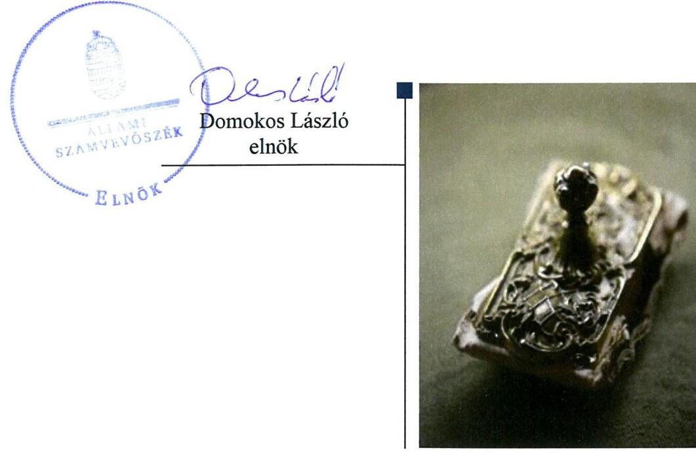
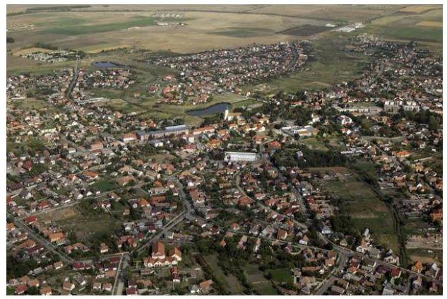
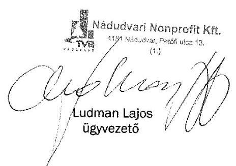
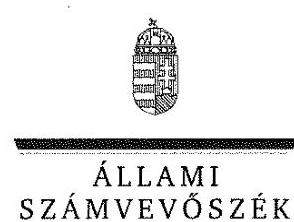
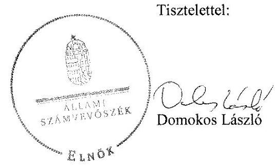

# Jelentés 

## Az önkormányzatok gazdasági társaságai

Az önkormányzatok többségi tulajdonában lévő gazdasági társaságok gazdálkodásának ellenőrzése - Nádudvari Településfejlesztési és Városgazdálkodási Nonprofit Kft.
2018.

---

# Jelentés 

## Az önkormányzatok gazdasági társaságai

Az önkormányzatok többségi tulajdonában lévő gazdasági társaságok gazdálkodásának ellenőrzése - Nádudvari Településfejlesztési és Városgazdálkodási Nonprofit Kft.
2018. 6. hó 26. nap

---

# AZ ELLENŐRZÉST FELÜGYELTE:

## MAKKAI MÁRIA felügyeleti vezető

## AZ ELLENŐRZÉST VEZETTE ÉS A VÉGREHAJTÁSÁÉRT FELELŐS:

### GELENCSÉR ZSOLT ellenőrzésvezető

### A PROGRAM ÖSSZEÁLLÍTÁSÁÉRT FELELŐS:

### TÓTPÁL SZABOLCS osztályvezető

---

**IKTATÓSZÁM:** EL-0226-031/2018.

**TÉMASZÁM:** 2447

**ELLENŐRZÉS-AZONOSÍTÓ SZÁM:** V079384

---

Jelentéseink az Országgyűlés számítógépes hálózatán és az Interneta a www.asz.hu címen is olvashatóak.

---

# TARTALOMJEGYZÉK 

■ ÖSSZEGZÉS ..... 5
■ AZ ELLENŐRZÉS CÉLJA ..... 6
■ AZ ELLENŐRZÉS TERÜLETE ..... 7
■ AZ ELLENŐRZÉS HÁTTERE, INDOKOLTSÁGA ..... 8
■ A JELENTÉS LÉNYEGES KÉRDÉSKÖREI ..... 9
■ AZ ELLENŐRZÉS HATÓKÖRE ÉS MÓDSZEREI ..... 10
■ MEGÁLLAPÍTÁSOK ..... 12
■ JAVASLATOK ..... 14
■ MELLÉKLETEK ..... 15
I. sz. melléklet: Értelmező szótár ..... 15
■ FÜGGELÉK: ÉSZREVÉTELEK ..... 17
■ RÖVIDÍTÉSEK JEGYZÉKE ..... 23

---

.

---

# ÖSSZEGZÉS 

A Társaság gazdálkodásának szabályozottsága megfelelt a jogszabályi előírásoknak. A Társaság vagyongazdálkodása nem volt szabályszerú. Bevételeinek és ráfordításainak elszámolása - a személyi jellegú ráfordítások kivételével—szabályszerúen történt, így gazdálkodásának elszámoltathatósága biztositott volt. Közzétételi kötelezettségét szabályszerűen teljesítette, így gazdálkodásának átláthatósága biztositott volt.

## Az ellenőrzés társadalmi indokoltsága

Magyarországon az önkormányzatok kötelező és önként vállalt feladataik vonatkozásában is egyre szélesebb körben alkalmazzák a költségvetésen kívüli feladatellátást, ezáltal - a nonprofit szervezetek mellett - az önkormányzati tulajdonú gazdasági társaságok is kiemelt fontosságú szerephez jutottak.

Ezzel összhangban került sor Nádudvar Város Önkormányzata és a többségi tulajdonában álló Nádudvari Településfejlesztési és Városgazdálkodási Nonprofit Korlátolt Felelősségű Társaság szabályozottságának, gazdálkodása és vagyongazdálkodási tevékenysége szabályszerűségének, valamint az Önkormányzat tulajdonosi joggyakorlása 20132016. évi szabályszerűségének ellenőrzésére.

## Főbb megállapítások, következtetések, javaslatok

Nádudvar Város Önkormányzata 2013-2016. években a többségi tulajdonában álló Nádudvari Településfejlesztési és Városgazdálkodási Nonprofit Korlátolt Felelősségű Társaság tekintetében a tulajdonosi joggyakorlás kereteit szabályszerűen alakította ki, a tulajdonosi jogokat szabályszerűen gyakorolta.

A Nádudvari Településfejlesztési és Városgazdálkodási Nonprofit Korlátolt Felelősségű Társaság gazdálkodásának szabályozottsága megfelelt a jogszabályi előírásoknak. A vagyonnal való gazdálkodása nem volt szabályszerű, mert éves beszámolóját leltárral egyik ellenőrzött évben sem támasztotta alá, így a valódiság elve sérült.

Bevételeit szabályszerűen számolta el, ráfordításainak elszámolása - a személyi jellegú ráfordítások kivételével— megfelelit a jogszabályi előírásoknak.

Közzétételi kötelezettségeit a Társaság az előírások szerint szabályozta, a jogszabályban előírt kötelezettségeket teljesítette.

A megállapítások alapján az Állami Számvevőszék Nádudvar Város Önkormányzata polgármesterének egy javaslatot, a Nádudvari Településfejlesztési és Városgazdálkodási Nonprofit Korlátolt Felelősségű Társaság ügyvezetőjének három javaslatot fogalmazott meg.

---

# AZ ELLENŐRZÉS CÉLJA 

AZ ELLENŐRZÉS CÉLJA annak értékelése volt, hogy az önkormányzat vagyongazdálkodási tevékenysége során szabályszerűen gyakorolta-e tulajdonosi jogait; a gazdasági társaság szabályozottsága, gazdálkodása és vagyongazdálkodási tevékenysége, bevételeinek és ráfordításainak elszámolása megfelel-e a jogszabályi és tulajdonosi előírásoknak; a gazdasági társaság kötelezettségállománya jelent-e kockázatot a múködésre, valamint a gazdálkodás átláthatósága és elszámoltathatósága érdekében biztosítva volt-e a szolgáltatás dijának megalapozottsága szabályszerű önköltségszámítással.

---

# AZ ELLENŐRZÉS TERÜLETE 

## Nádudvar Város Önkormányzata és a Nádudvari Településfejlesztési és Városgazdálkodási Nonprofit Korlátolt Felelősségű Társaság

A TÁRSASÁGOT1 2008. július 10-én alapította Nádudvar Város Önkormányzata, 5,0 M Ft törzstőkével az önkormányzat hatáskörébe tartozó közszolgáltatási feladatok ellátása céljából. A Társaság 2016. június 29-ig Nádudvar Város Önkormányzatának 100\%-os tulajdona volt, 2016. június 30tól Kaba Város Önkormányzata 2\%-os részesedést szerzett a Társaság törzstőkéjéből. A polgármester és a jegyző valamint az ügyvezető személye nem változott az ellenőrzött időszakban.

Az Önkormányzat² a feladat-ellátáshoz szükséges ingó és ingatlan vagyont a Társaság rendelkezésére bocsátotta közszolgáltatási szerződések keretében, illetve üzemeltetési és
bérleti szerződés alapján. Vagyonkezelésbe vett eszközzel a Társaság nem rendelkezett. A Társaság múködése során az alábbi tevékenységeket látta el:

- Városfejlesztési és üzemeltetési közszolgáltatások körében intézmények karbantartását, közutak, zöldfelületek fenntartását sportlétesítmény üzemeltetését, fürdő üzemeltetést, közlekedési létesítmények és piac fenntartást,
- Szolgáltatások, közszolgáltatások körében hulladékkezelést, kegyeleti közszolgáltatást, önkormányzati ingatlan bérbeadását,
- Beruházáshoz, felújításhoz kapcsolódó feladatok körében önkormányzati ingatlanokon végzett munkákat, egyéb építőipari tevékenységet látott el,
- Mérnöki, városfejlesztési és egyéb szakértői tevékenységeket végzett.
A Társaság nem volt önköltség számítási szabályzat készítésére kötelezett. A Társaság nem tartozott a kormányzati szektorba sorolt egyéb szervezetek közé.

---

# AZ ELLENŐRZÉS HÁTTERE, INDOKOLTSÁGA 

## AZ ÖNKORMÁNYZATOK TÖBBSÉGI TULAJDONÁBAN ÁLLÓ GAZDASÁGI TÁRSASÁGOK ELLENŐR-

ZÉSE kiemelten fontos a vagyon megőrzése, megóvása érdekében, amelyekkel szemben alapvető követelmény, hogy gazdálkodásuk, múködésük szabályszerű, az általuk szolgáltatott adatok minél megbízhatóbbak legyenek. A feladatellátás költségeinek, ráfordításainak alakulása a lakosság széles rétegét érinti.

Az Állami Számvevőszék ellenőrzései feltárhatják, hogy az önkormányzat a feladatellátásához rendelt vagyon múködtetését a tulajdonostól elvárható gondossággal végezte-e, a feladatot ellátó gazdasági társaság a létesítő okiratban, szolgáltatási szerződésben foglaltak betartásával biztosította-e a feladat ellátását. Az ellenőrzés rávilágíthat arra, hogy a gazdasági társaság a vagyon használatával biztosította-e a szolgáltatás folytatásának feltételeit, az önkormányzat tulajdonosi felügyelete hozzájárult-e a szabályszerű gazdálkodáshoz és feladatellátáshoz.

---

# A JELENTÉS LÉNYEGES KÉRDÉSKÖREI 

1. Az Önkormányzat tulajdonosi joggyakorlása szabályszerű volt-e?
2. A gazdasági társaság szabályozottsága, gazdálkodása, vagyongazdálkodási tevékenysége szabályszerű volt-e?

---

# AZ ELLENŐRZÉS HATÓKÖRE ÉS MÓDSZEREI 

## Az ellenőrzés típusa

Megfelelőségi ellenőrzés.

## Az ellenőrzött időszak

2013. január 1-jétől 2016. december 31-ig tartó időszak.

## Az ellenőrzés tárgya

Nádudvar Város Önkormányzata - a többségi tulajdonában álló —Nádudvari Településfejlesztési és Városgazdálkodási Nonprofit Korlátolt Felelősségű Társaság feletti tulajdonosi joggyakorlása, valamint a Társaság gazdálkodásának szabályozottsága és szabályszerűsége.

Az ellenőrzés kiterjedt minden olyan körülményre és adatra, amely az ÁSZ jogszabályban meghatározott feladatainak teljesítéséhez, valamint a program végrehajtása folyamán felmerült újabb összefüggések feltárásához szükséges volt.

## Az ellenőrzött szervezet

Nádudvar Város Önkormányzata, valamint a Nádudvari Településfejlesztési és Városgazdálkodási Nonprofit Korlátolt Felelősségű Társaság.

## Az ellenőrzés jogalapja

Az ellenőrzés jogszabályi alapját az ÁSZ tv. 1. § (3) bekezdése és 5. § (3)(4)-(5) bekezdései képezték.

## Az ellenőrzés módszerei

Az ellenőrzést a nemzetközi standardokat irányadónak tekintve az ellenőrzési program ellenőrzési kérdései, az ellenőrzött időszakban hatályos jogszabályok, az ellenőrzés szakmai szabályok és módszertanok figyelembe vételével végeztük.

Az ellenőrzés ideje alatt az ellenőrzött szervezettel történő kapcsolattartást az ÁSZ Szervezeti és Müködési Szabályzatának vonatkozó előírásai alapján biztosítottuk.

---

Mintavétellel ellenőriztük a bevételek és ráfordítások elszámolását, a vagyonnyilvántartás és az értékcsökkenés elszámolását pedig teljes körű ellenőrzés alá vontuk. Az ellenőrzött minták alapján a sokaságban előforduló hibaarányt becsültük. „Szabályszerűnek" értékeltünk egy ellenőrzött területet, amennyiben 95\%-os bizonyossággal a teljes sokaságban a hibaarány legfeljebb 10\%-os, „nem szabályszerűnek", amennyiben 10\%-nál magasabb arányt képviselt. A mintavételt megelőzően az anyagjellegú ráfordítások tételeinek sokaságából évente kiemeltük a 3-3 legnagyobb öszszegű tételt annak biztosítására, hogy az ellenőrzés a véletlen mintavétel mellett a legnagyobb értékű tételek ellenőrzésére biztosan kiterjedjen.

Az ellenőrzési kérdések megválaszolásához szükséges bizonyítékok megszerzése a következő ellenőrzési eljárások alkalmazásával történt: megfigyelés, kérdésfeltevés (információkérés), összehasonlítás, valamint elemző eljárás. Az ellenőrzési bizonyítékként felhasználható adatforrások közé tartoztak egyrészt az ellenőrzési programban felsorolt adatforrások, másrészt adatforrás lehetett még minden - az ellenőrzés folyamán - feltárt, az ellenőrzés szempontjából információkat tartalmazó dokumentum.

Az ellenőrzést a kérdésekre adott válaszok kiértékelésével, valamint a megjelölt adatforrások, a csatolt tanúsítványok felhasználásával, továbbá az adott időszakban hatályos jogszabályok figyelembe vételével folytattuk le.

---

# 1. Az Önkormányzat tulajdonosi joggyakorlása szabályszerű volt-e? 

Összegző megállapítás

A tulajdonosi joggyakorlás kereteinek kialakítása és a tulajdonosi joggyakorlás szabályszerű volt.

A TULAJDONOSI JOGOKAT az Önkormányzat Vagyonrendelete ${ }^{3}$ értelmében a Képviselő-testület ${ }^{4}$ gyakorolta. A Társaság legfőbb szerve ${ }^{5}$ döntött a Társaság éves üzleti terveinek elfogadásáról, a tervek teljesítését beszámolók keretében ellenőrizte.

A FELÜGYELŐBIZOTTSÁG tagjait a Társaság legfőbb szerve megválasztotta, 2016. január 20-án ügyrendjét jóváhagyta. A Felügyelőbizottság 2016. január 20-ig az Alapító okirat IV/7/c pontjában foglalt, 2016. január 21-tól az ügyrendje II/5 pontjában szereplő kötelezettségét megsértve nem készített írásbeli jelentést a Társaság egyszerűsített éves beszámolóiról.

A Társaság legfőbb szerve a Társaság egyszerűsített éves beszámolóinak elfogadásáról —a Ptk. ${ }^{6}$ 3:120. (2) bekezdésében foglaltak ellenére- a Felügyelőbizottság írásbeli jelentésének hiányában döntött.

A FÜGGETLEN KÖNYVVIZSGÁLÓT a Társaság legfőbb szerve megválasztotta, az éves beszámolókról készült könyvvizsgálói jelentéseket megtárgyalta.

A Társaság legfőbb szerve a Taktv. 5. § (3) bekezdése előírásait megsértve 2015.december 04 -ig nem alkotta meg a Társaság javadalmazási szabályzatát.

## 2. A gazdasági társaság szabályozottsága, gazdálkodása, vagyongazdálkodási tevékenysége szabályszerű volt-e?

Összegző megállapítás

A Társaság gazdálkodásának szabályozottsága, valamint gazdálkodása - a számlarend és a személyi jellegú ráfordítások elszámolásának kivételével - megfelelt a jogszabályi előírásoknak, vagyongazdálkodása nem volt szabályszerű.

SZÁMVITELI POLITIKÁVAL a Társaság a Számv. tv. ${ }^{7}$-ben előírtak szerint rendelkezett, azon átvezették a törvényi változásoknak megfelelő módosításokat. A hulladékgazdálkodási közszolgáltatás valamint a kegyeleti közszolgáltatás bevételeinek és ráfordításainak más tevékenységektől elkülönített nyilvántartásának kötelezettségét a Társaság teljesí-

---

tette. A feladat-ellátási szerződésekben az Önkormányzat előírta a közfeladatokhoz és a vállalkozói tevékenységhez kapcsolódó bevételek és ráfordítások elkülönítését, amelyet a Társaság megvalósított. Ezzel összhangban a 2012. január 1-től 2014. május 31-ig hatályban lévő számlarend ${ }_{1}{ }^{8}$ jében a Társaság részletezte az elkülönítés megvalósításának módját.

A 2014. június 1-vel hatályba lépett számlarend ${ }_{2}$ az érvényes számviteli politika 5. pontjában foglaltakkal ellentétben a közfeladatokhoz és a vállalkozói tevékenységhez kapcsolódó bevételek és ráfordítások elkülönítésének módját nem tartalmazta. A számlarend ${ }_{2}$ nem tartalmazta a Számv. tv. 161. § (2) bekezdés b) pontjában előírtak szerint a Társaság által alkalmazott összes főkönyvi számla értéke növekedésének és csökkenésének jogcímeit, más számlákkal való kapcsolatát.

A Számviteli politika keretében a Társaság elkészítette az eszközök és források leltárkészítési és leltározási szabályzatát. A pénzkezelési szabályzat és az eszközök és források értékelési szabályzata a Számv.tv. előírásainak megfelelt.

AZ ADATVÉDELMI SZABÁLYZATOT és a Közérdekú adatok nyilvánosságra hozataláról szóló szabályzatot a Társaság az Info ${ }^{9}$ tv. előírásainak megfelelően készítette el. A Társaság a honlapján a közérdekú adatokat az Info.tv.-ben foglaltaknak megfelelően közzétette.

AZ EGYSZERŰSÍTETT ÉVES BESZÁMOLÓIT a Társaság elkészítette. A beszámolók kiegészítő mellékletében bemutatta a $\mathrm{Ht} .{ }^{10}$ ben előírtaknak megfelelően a hulladékgazdálkodói tevékenységét önálló mérleg és eredménykimutatás formájában. A Társaság nem készítette el egyszerűsített éves beszámolóihoz a mérleg tételeit alátámasztó, a mérleg fordulónapján meglévő eszközeit és forrásait mennyiségben és értékben tartalmazó leltárakat, amivel megsértette a Számv.tv. 69. § (1) bekezdését.

A leltárak hiánya ellenére a könyvvizsgáló korlátozás nélküli hitelesítő záradékot tartalmazó könyvvizsgálói jelentést adott ki a beszámolókról. A beszámolók letétbe helyezési, közzétételi kötelezettségének a Társaság eleget tett.

# A BEVÉTELEK ÉS AZ ANYAGJELLEGŰ RÁFORDÍTÁSOK elszámolása szabályszerűen történt. 

A SZEMÉLYI JELLEGŰ RÁFORDÍTÁSOK elszámolása a Számv.tv. 165. § (2) bekezdésben előírtak ellenére bizonylattal nem volt alátámasztott, mert hiányzott az összesített bérfeladási bizonylata.

## A VAGYONNAL KAPCSOLATOS ELSZÁMOLÁSOK

szabályszerűen történtek. A tárgyi eszközök üzembe helyezésekor elkészítették az üzembe helyezési bizonylatot, a tárgyi eszközökről vezették az egyedi kartonokat. Az értékcsökkenés elszámolása a számviteli törvénynek és a belső szabályozásnak megfelelően történt.

A Társaság múködésével összefüggésben felmerülő rendelet alkotási és díj megállapítási kötelezettségnek az Önkormányzat eleget tett. A Társaság az Önkormányzat által meghatározott díjakat alkalmazta, az árak a honlapján elérhető árjegyzékben szerepeltek. A számlák a Rezsi tv. ${ }^{11}$-ben foglalt módon, és a belső szabályozásnak megfelelően kerültek kiállításra.

---

# JAVASLATOK 

Az ÁSZ tv. 33. § (1) bekezdésében foglaltak értelmében az ellenőrzött szervezet vezetője köteles a jelentésben foglalt megállapításokhoz kapcsolódó intézkedési tervet összeállítani és azt a jelentés kézhezvételétől számított 30 napon belül az ÁSZ részére megküldeni. Amennyiben az ellenőrzött szervezet vezetője nem küldi meg határidőben az intézkedési tervet, vagy továbbra sem elfogadható intézkedési tervet küld, az Állami Számvevőszék elnöke az ÁSZ tv. 33. § (3) bekezdése a) és b) pontjaiban foglaltakat érvényesítheti.

## Nádudvar Város polgármesterének

1. Intézkedjen arról, hogy a Társaság legfőbb szerve a Ptk.-ban előirtaknak megfelelően, a felügyelőbizottság írásbeli jelentésének birtokában döntsön a Társaság éves beszámolójáról.
(1. számú megállapítás 3. bekezdése alapján)

## a Nádudvari Településfejlesztési és Városgazdálkodási Nonprofit Kft. ügyvezetőjének

1. Intézkedjen a számlarend módosításáról, hogy annak tartalma feleljen meg a Számv. tv. és a számviteli politika elöírásainak.
(2. számú megállapítás 2. bekezdése alapján)
2. Intézkedjen a Számv. tv. előírásainak megfelelően az egyszerüsített éves beszámolók mérlegtételeit alátámasztó leltár elkészítéséről.
(2. számú megállapítás 5. bekezdés harmadik mondata alapján)
3. Intézkedjen a személyi jellegű ráfordítások jogszabályi előírásoknak megfelelő elszámolásáról.
(2. számú megállapítás 7. bekezdése alapján)

---

# MELLÉKLETEK 

- I. SZ. MELLÉKLET: ÉRTELMEZŐ SZÓTÁR
gazdasági társaság
nemzeti vagyon
nonprofit gazdasági társaság

Ptk 3.88. § (1) bekezdése szerint „a gazdasági társaságok üzletszerű közös gazdasági tevékenység folytatására, a tagok vagyoni hozzájárulásával létrehozott, jogi személyiséggel rendelkező vállalkozások, amelyekben a tagok a nyereségből közösen részesednek, és a veszteséget közösen viselik".
Nvtv. 1. § (2) bekezdése szerint többek között:
„az állam vagy a helyi önkormányzat kizárólagos tulajdonában álló dolgok, az a) pont hatálya alá nem tartozó, állam vagy a helyi önkormányzat tulajdonában lévő dolog,
az állam vagy a helyi önkormányzat tulajdonában lévő pénzügyi eszközök, továbbá az államot vagy a helyi önkormányzatot megillető társasági részesedések, az államot vagy a helyi önkormányzatot megillető bármely vagyoni értékkel rendelkező jogosultság, amelyet jogszabály vagyoni értékű jogként nevesít."
Civil tv. 9/F. § (2) bekezdése szerint „az a gazdasági társaság minősül nonprofit gazdasági társaságnak és cégnevében az a gazdasági társaság tüntetheti fel a nonprofit jelleget, amelynek létesítő okirata tartalmazza, hogy a gazdasági társaság tevékenységéből származó nyereség a tagok között nem osztható fel, hanem az a gazdasági társaság vagyonát gyarapítja." (hatályos 2014. március 15-től)

---

.

---

# FÜGGELÉK: ÉSZREVÉTELEK 

A jelentéstervezetet a Számvevőszék 15 napos észrevételezésre megküldte az ellenőrzött szervezetek vezetőinek az ÁSZ tv. 29. §* (1) bekezdése előírásának megfelelően.

Az ÁSZ a jelentéstervezetet észrevételezésre megküldte a Nádudvari Településfejlesztési és Városgazdálkodási Nonprofit Kft. ügyvezetőjének és Nádudvar Város Önkormányzata polgármesterének.
A Nádudvari Településfejlesztési és Városgazdálkodási Nonprofit Kft. ügyvezetőjének észrevételeit és az azokra adott választ a függelék alább tartalmazza, Nádudvar Város polgármestere az ÁSZ tv. 29. § (2) bekezdésében foglalt észrevételezési jogával nem élt, a törvényes határidőn belül észrevételt nem tett.

[^0]
[^0]:    * 29. § (1) Az Állami Számvevőszék az ellenőrzési megállapításait megküldi az ellenőrzött szervezet vezetőjének vagy az általa megbízott személynek, és annak, akinek személyes felelősségét állapította meg.
    (2) Az ellenőrzött szervezet vezetője és a felelősként megjelölt személy az ellenőrzés megállapításaira tizenöt napon belül írásban észrevételt tehet.
    (3) Az Állami Számvevőszék az észrevételre a beérkezésétől számított harminc napon belül írásban válaszol. A figyelembe nem vett észrevételeket köteles a jelentésben feltüntetni, és megindokolni, hogy azokat miért nem fogadta el.

---

# Nádudvari Nonprofit Kft. 

## 721

H-4181 Nádudvar, Petőfi Sándor u. 13. Tel./Fax: +36 (54) 527-113 E-mail: info@tvg-nadudvar.hu Web: www.tvg-nadudvar.hu

## Ikt.szám: 211/2018.

## ÁLLAMI SZÁMVEVŐSZÉK Budapest

Apáczai Csere János utca 10. 1364

## Domokos László

## Elnök Úr

részére

## Tisztelt Elnök Úrl

Köszönettel megkaptam „Az önkormányzatok 100 \%-os tulajdonában lévő gazdasági társaságok gazdálkodásának ellenőrzése - Nádudvari Településfejlesztési és Városgazdálkodási Nonprofit Kft." címmel készített, Önök által EL-0545-012/2018. iktató számon nyilvántartott ellenőrzési jelentés tervezetét, amelyre az ÁSZ tv. 39. § (2) bekezdése alapján a törvényes határidőn belül az alábbi észrevételeket kívánom tenni:

1. A jelentéstervezet 2. pontjában az egyszerűsített éves beszámolóra vonatkozó megállapítások közül nem értünk egyet a következő megállapítással:
„ A Társaság nem készítette el egyszerűsített éves beszámolóohoz a mérleg tételeit alátámasztó, a mérleg fordulónapján meglévő eszközeit és forrásait mennyiségben és értékben tartalmazó leltárakat, amivel megsértette a Számviteli tv. 69. § (1) bekezdését. A leltárak hiánya ellenére a könyvvizsgáló korlátozás nélküli hitelesítő záradékot adott ki a beszámolókról."

Társaságunk minden vizsgált évben a Számviteli törvény és a hatályos Leltározási szabályzata alapján összeállította a beszámoló alátámasztásához a leltárakat, amelyek tételesen és ellenőrizhető módon tartalmazzák eszközeinket és forrásainkat mennyiségben és értékben.

A leltárak feltöltésre kerültek az ÁSZ ellenőrzés elektronikus felületére 2017. november 23-án, szerepelnek az 1/2017. (I.23.) elnöki körlevél 2.a. melléklet szerinti EL-0226-003/2017. iktatószámú adatbekérő levélben kért adatok kapcsán feltöltött dokumentumok között, a Társaságunk által készített dokumentumlista 2/3. pontjaiban. (PI.: Befejezetlen termelés, céltartalék,passzív időbeli elhatárolás, vagyon leltár, tárgyi eszköz).

A dokumentumlistában a dokumentumok megnevezésében nem szerepel a „leltár" szó, de a dokumentumok a leltárakat tartalmazzák.
2. A jelentéstervezet 2. pontjában a személyi jellegű ráfordításokra vonatkozó megállapítás:
„A személyi jellegű ráfordítások elszámolása a Számv. tv. 165. § (2) bekezdésben előírtak ellenére bizonylattal nem volt alátámasztott, mert hiányzott az összesített bérfeladási bizonylata."

---

# Nádudvari Nonprofit Kft. 

A megállapítással kapcsolatos észrevételünk, hogy a Társaság Servantes Integrált Vállalati Szoftverrendszert alkalmaz, amelynek részeként használjuk a bérmodult is. Az összesített bérfeladási bizonylatokat a rendszer készíti, ezek társaságunknál rendelkezésre állnak. Az ÁSZ ellenőrzés adatbekérő levelei nem tartalmaztak - a mi megítélésünk szerint - ezen bizonylatok feltöltésére vonatkozó igényt, ezért nem töltött fel ilyen típusú bizonylatokat Társaságunk az ellenőrzési dokumentumok közé. Egyéb irányú adatszolgáltatási kötelezettségünknek maradéktalanul eleget tettünk.

Kérem szíveskedjenek észrevételeinket a jelentéstervezet véglegesítésekor figyelembe venni!
Egyúttal szeretném megköszönni Elnök Úr és az ellenőrzésben közremüködő munkatársak munkáját!

Nádudvar, 2018. május 23.

---

ELNÖK

Ikt.szám: EL-0545-014/2018.

# Ludman Lajos úr 

ügyvezető

Nádudvari Településfejlesztési és Városgazdálkodási
Nonprofit Kft.

## Nádudvar

## Tisztelt Ügyvezető Úr!

„Az önkormányzatok többségi tulajdonában lévő gazdasági társaságok gazdálkodásának ellenőrzése - Nádudvari Településfejlesztési és Városgazdálkodási Nonprofit Kft." címmel készített számvevőszéki jelentéstervezetre tett észrevételét köszönettel megkaptam.

Az Állami Számvevőszék észrevételre vonatkozó álláspontjáról a felügyeleti vezető által készített részletes tájékoztatást mellékelten megküldöm.

Tájékoztatom Ügyvezető urat, hogy a számvevőszéki jelentésben - az Állami Számvevőszékről szóló 2011. évi LXVI. törvény 29. § (3) bekezdése alapján - a figyelembe nem vett észrevételt szerepeltetjük, annak indoklásával, hogy azt az Állami Számvevőszék miért nem fogadta el.

Budapest, 2018. 06 hó 06 nap

Melléklet: Tájékoztatás az észrevétel kezeléséről

---

# Tájékoztatás   az észrevétel kezeléséről 

..Az önkormányzatok többségi tulajdonában lévő gazdasági társaságok gazdálkodásának ellenörzése - Nádudvari Településfejlesztési és Városgazdálkodási Nonprofit Kft." címủ jelentéstervezetre 2018. május 25 -én érkezett észrevételt áttekintettük, annak kezelésével kapcsolatban a következő tájékoztatást adom.

- A jelentéstervezet 2. számú megállapítás egyszerüsített éves beszámolóra vonatkozó észrevételre adott válasz
Tájékoztatom, hogy az ÁSZ megállapításai az Állami Számvevőszékről szóló 2011. évi LXVI. törvénynek (ÁSZ tv.) megfelelően az ellenőrzés során bekért és az arra nyitva álló határidőn belül rendelkezésre bocsátott dokumentumokon alapulnak. Az észrevételben leírtakkal ellentétben, a Társaság által az ÁSZ Elektronikus Adatszolgáltatási Rendszerébe feltöltött dokumentumai tételesen és ellenőrizhető módon nem támasztották alá a mérleg fordulónapján meglévő eszközeit és forrásait mennyiségben és értékben. Az észrevételt nem fogadjuk el, a jelentéstervezet módosítása nem indokolt.
- A jelentéstervezet 2. számú megállapítás személyi jellegủ ráfordításokra vonatkozó észrevételre adott válasz
Az észrevétel rögzíti, hogy a Társaság rendelkezésére állnak az integrált vállalati szoftverrendszer részeként alkalmazott bérmodul által készített összesített bérfeladási bizonylatok. Az ÁSZ EL-0226-015/2017 iktató számú levelében, a bekérendő dokumentumok között kérte az ellenőrzött időszakban létrejött, az ellenőrzéshez kiválasztott könyvelési tételeket alátámasztó dokumentáció rendelkezésre bocsátását. Fentiek alapján az észrevételt nem fogadjuk el, az ÁSZ megállapítása helytálló, a jelentéstervezet módosítása nem indokolt.

Budapest, 2018. 06 hó 06 nap

Makkai Mária
felügyeleti vezető

---

.

---

# RÖVIDÍTÉSEK JEGYZÉKE 

${ }^{1}$ Társaság
${ }^{2}$ Önkormányzat
${ }^{3}$ vagyonrendelet
${ }^{4}$ Képviselő-testület
${ }^{5}$ Társaság legfőbb szerve
${ }^{6}$ Ptk.
${ }^{7}$ Számv. tv.
${ }^{8}$ számlarend;
számlarend;
${ }^{9}$ Info tv.
${ }^{10} \mathrm{Ht}$.
${ }^{11}$ Rezsi tv.

Nádudvari Településfejlesztési és Városgazdálkodási Nonprofit Korlátolt Felelősségű Társaság
Nádudvar Város Önkormányzata
Nádudvar Város Önkormányzat Képviselőtestületének
4/2012. (III.30.)önkormányzati rendelete Nádudvar Város Önkormányzat vagyonáról és a vagyonnal való gazdálkodás szabályairól
Nádudvar Város Önkormányzatának Képviselő-testülete
2016. június 29-ig Nádudvar Képviselő- testülete, azt követően a Társaság taggyűlése
a polgári törvénykönyvről szóló 2013. évi V. törvény
2000. évi C. törvény a számvitelről

Számlarend Nádudvari Településfejlesztési és Városgazdálkodási Nonprofit Kft. hatályos 2012.01.01.- 2014.05.30.
Számlarend Nádudvari Településfejlesztési és Városgazdálkodási Nonprofit Kft. hatályos 2014.6.01. - 2016.12.31.
az információs önrendelkezési jogról és az információszabadságról szóló 2011. évi CXII. törvény
2012. évi CLXXXV. törvény a hulladékról
a rezsicsökkentések végrehajtásáról szóló 2013. évi LIV. törvény

---

# ÁLLAMI SZÁMVEVŐSZÉK 

1052 Budapest, Apáczai Csere János utca 10.
Levélcím: 1364 Budapest 4. Pf. 54
Telefon: +36 14849100 Telefax: +36 14849200
www.asz.hu