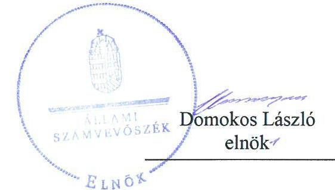
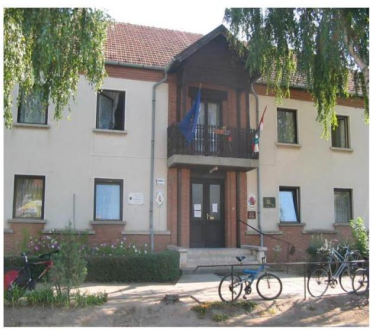
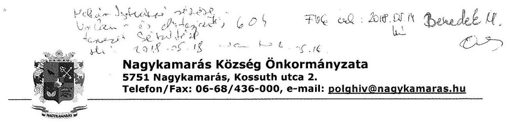
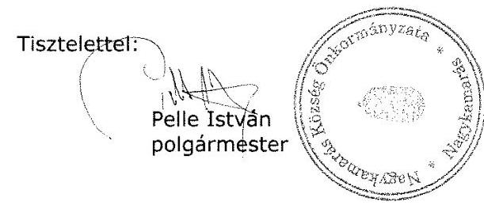
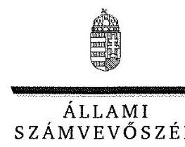
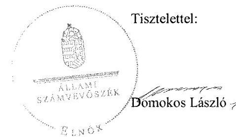

# Jelenetés 

## Önkormányzatok integritás- és belsó kontrollrendszere

Az önkormányzatok belső kontrollrendszere kialakításának és múködtetésének ellenőrzése Nagykamarás Község Önkormányzata 2018.

18143
www.asz.hu

---

# Jelenctés 

## Önkormányzatok integritás- és belsó kontrollrendszere

Az önkormányzatok belső kontrollrendszere kialakításának és múködtetésének ellenőrzése Nagykamarás Község Önkormányzata 2018. ৩১ hó 29 nap

---

# AZ ELLENŐRZÉST FELÜGYELTE:

DR. BENEDEK MÁRIA felügyeleti vezető

## AZ ELLENŐRZÉST VEZETTE ÉS A VÉGREHAJTÁSÁÉRT FELELŐS:

BÍRÓ ZSOLT ellenőrzésvezető

## A PROGRAM ÖSSZEÁLLÍTÁSÁÉRT FELELŐS:

TÓTPÁL SZABOLCS osztályvezető

IKTATÓSZÁM: EL-0112-061/2018.

TÉMASZÁM: 2444

ELLENŐRZÉS-AZONOSÍTÓ SZÁM: V078914, V078408

Jelentéseink az Országgyűlés számítógépes hálózatán és az Interneta a www.asz.hu címen is olvashatóak.

---

# TARTALOMJEGYZÉK 

■ ÖSSZEGZÉS ..... 5
■ AZ ELLENŐRZÉS CÉLJA ..... 6
■ AZ ELLENŐRZÉS TERÜLETE ..... 7
■ AZ ELLENŐRZÉS HÁTTERE, INDOKOLTSÁGA ..... 8
■ A JELENTÉS LÉNYEGES KÉRDÉSKÖREI ..... 10
■ ELLENŐRZÉS HATÓKÖRE ÉS MÓDSZEREI ..... 11
■ MEGÁLLAPÍTÁSOK ..... 13
■ JAVASLATOK ..... 21
■ MELLÉKLETEK ..... 25
I. sz. melléklet: Értelmező szótár ..... 25
■ FÜGGELÉK: ÉSZREVÉTELEK ..... 29
■ RÖVIDÍTÉSEK JEGYZÉKE ..... 43

---

.

---

# ÖSSZEGZÉS 

Nagykamarás Község Önkormányzata belső kontrollrendszerének kialakítása és müködtetése nem volt szabályszerű, ezáltal nem volt biztositott a közpénzfelhasználás szabályossága. A befektetésekkel kapcsolatos döntéshozatal, a befektetések számviteli elszámolása és a nyilvántartás szabálytalanságai miatt nem valósult meg a nemzeti vagyonnal történő felelős gazdálkodás. Nagykamarás Község Önkormányzatánál az integritási kontrollok kiépitettsége nem volt egyensúlyban a fellépő kockázatok szintjével.

## Az ellenőrzés társadalmi indokoltsága

Az Állami Számvevőszék a stratégiai céljával összhangban - az Állami Számvevőszékről szóló 2011. évi LXVI. törvény felhatalmazása alapján - végzi a közpénzekkel, az állami és önkormányzati vagyonnal való felelős gazdálkodás, valamint a helyi önkormányzatok számviteli rendje betartásának és belső kontrollrendszere múködésesnek ellenőrzését. Magyarország Alaptörvénye az önkormányzatoktól is elvárja a kiegyensúlyozott, átlátható és fenntartható költségvetési gazdálkodás elvének érvényesítését, továbbá a nemzeti vagyonnal való rendeltetésszerű és felelős módon való gazdálkodást. Az Állami Számvevőszék stratégiájában az is megfogalmazódott, hogy támogatja az integritás alapú, átlátható és elszámoltatható közpénzfelhasználás megteremtését. Mindezekre tekintettel, a közpénzzel gazdálkodó szervezetek esetében a belső kontrollrendszer megfelelő múködése ellenőrzését prioritásként kezeli az Állami Számvevőszék.

A szabad pénzeszközök felhasználása során kiemelten fontos a felelős gazdálkodás érvényesülése, amely összhangban kell, hogy legyen az önkormányzati gazdálkodás alapelveivel. Nagykamarás Község Önkormányzata 2016. december 31-én 10 millió Ft összegű forgatási célú értékpapírral rendelkezett.

## Főbb megállapítások, következtetések, javaslatok

Nagykamarás Község Önkormányzata nem a jogszabályi előírásoknak megfelelően alakította ki múködésének szervezeti kereteit, így az nem biztosította a szabályszerű múködést és gazdálkodást. A Nagykamarási Közös Önkormányzati Hivatal szervezeti és múködési szabályzata nem felelt meg a jogszabályi előírásoknak, valamint nem rendelkezett bizonylati renddel. A jegyző a Nagykamarási Közös Önkormányzati Hivatal tevékenységében, gazdálkodásában rejlő kockázatokat nem mérte fel és nem határozta meg a szükséges intézkedéseket, a kontrolltevékenységek gyakorlása során a kötelezettségvállalások nyilvántartása, a pénzügyi ellenjegyzés, a teljesítésigazolás nem volt szabályszerű, így nem volt biztosított a közpénzfelhasználás szabályossága.

Nagykamarás Község Önkormányzata az egyes befektetésekkel kapcsolatos döntés-előkészítő és döntéshozatali dokumentumok megőrzéséről nem gondoskodott, a befektetések értékelése, leltározása nem történt meg, így nem volt biztosított a szabad pénzeszközökkel való felelős gazdálkodás.

Nagykamarás Község Önkormányzatánál az integritással összefüggő kontrollok és a korrupciós kockázatok szintje nem volt összhangban, a kontrollrendszer nem támogatta az integritás szemlélet érvényesülését.

---

# AZ ELLENŐRZÉS CÉLJA 

Az ellenőrzés célja annak megállapítása volt, hogy szabályszerűen történt-e Nagykamarás Község Önkormányzata belső kontrollrendszerének kialakítása és működtetése, az biztosította-e Nagykamarás Község Önkormányzatánál a közpénzfelhasználás szabályosságát, a közpénzekkel és a nemzeti vagyonnal történő szabályszerű és felelős gazdálkodást, a beszámolási és adatszolgáltatási kötelezettségek szabályszerű teljesítését. Az ellenőrzés keretében értékeltük Nagykamarás Község Önkormányzata korrupciós kockázatainak kezelését szolgáló integritás kontrollok kiépítettségét és az integritás szemlélet érvényesülését.

Nagykamarás Község Önkormányzata egyes befektetési tevékenységeinek ellenőrzése során az ellenőrzés célja annak értékelése volt, hogy a jogszabályi előírásoknak megfelelően alakította-e ki a belső kontrollrendszert, a kontrollkörnyezet biztosította-e a befektetési tevékenységek szabályszerű végzését, az egyes befektetési tevékenységekkel kapcsolatos döntéshozatal és a döntések végrehajtása, valamint az egyes befektetések számviteli elszámolása, nyilvántartása szabályszerű volt-e, és a belső és külső ellenőrzés támogatta-e az egyes befektetési tevékenységek szabályszerű végzését.

---

# **AZ ELLENŐRZÉS TERÜLETE**

## **Nagykamarás Község Önkormányzata**

A Békés megyében fekvő Nagykamarás község lakónépessége a Központi Statisztikai Hivatal Magyarország közigazgatási helynévkönyve alapján 2016. január 1-jén 1343 fő volt. Nagykamarás Község Önkormányzata hét tagú Képviselő-testületének munkáját két állandó bizottság segítette. Nagykamarás Község Önkormányzata a gazdálkodási feladatokat ellátó Nagykamarási Közös Önkormányzati Hivatalon kívül egy intézménnyel, a Nagykamarás Gondozási Központtal látta el feladatait, a BÉKÉS-MANIFEST Közszolgáltató Nonprofit Korlátolt Felelősségű Társaság és az ALFÖLDVÍZ Regionális Víziközmű-szolgáltató Zártkörűen Működő Részvénytársaság közreműködésével pedig a közszolgáltatási feladatait. Nagykamarás Község Önkormányzata a társaságokban többségi tulajdonnal nem rendelkezett. A településen az ellenőrzött időszakban Nagykamarás Roma Nemzetiségi Önkormányzat működött.

A polgármester a 2010. évi önkormányzati választások óta tölti be tisztségét. A jegyző 1999 óta látja el feladatait. A Nagykamarási Közös Önkormányzati Hivatal szervezeti egységekre nem tagolódott, elkülönített gazdasági szervezettel nem rendelkezett, a foglalkoztatott köztisztviselők száma 2016. év végén 13 fő volt. A Nagykamarási Közös Önkormányzati Hivatal 2013. január 1-jétől működik, Nagykamarás, Medgyesbodzás és Dombiratos Községek Önkormányzatának Képviselő-testületei hozták létre Nagykamarás székhellyel.

Nagykamarás Község Önkormányzata a 2016. évi éves költségvetési beszámoló szerint 498,5 millió Ft költségvetési bevételt ért el, valamint 414,2 millió Ft költségvetési kiadást teljesített. A mérleg szerinti eszközvagyon értéke 2016. december 31-én 856,0 millió Ft volt, amelyből a tartós befektetések 0,7 millió Ft-ot, a forgatási célú értékpapírok 10,0 millió Ft-ot tettek ki. A forrásokon belül a költségvetési évben esedékes kötelezettség állomány 15,9 millió Ft-ot, a költségvetési évet követően esedékes kötelezettség állomány 4,6 millió Ft-ot tett ki, pénzintézettel szembeni kötelezettsége nem volt.

---

# AZ ELLENŐRZÉS HÁTTERE, INDOKOLTSÁGA 

A DEMOKRATIKUS TÁRSADALMAKBAN alapvető igény, hogy a közpénzeket, a közvagyont használók tevékenységükről elszámoljanak, ahhoz egyértelmű és érvényesíthető felelősségi szabályok társuljanak. Ennek a jogos igénynek az érvényesítéséhez meg kell teremteni azokat a folyamatokat, rendszereket, amelyek nélkülözhetetlenek az elszámoltatáshoz. Az elszámoltatás eredményes működtetéséhez szükség van a megfelelő információs, kontroll-, értékelési-, és beszámolási rendszerek kialakítására. A belső kontrollok kiépítettsége hozzájárul az integritási szemlélet kialakításához és érvényesüléséhez. A belső kontrollrendszer kialakítása és működtetése nélkül nem valósítható meg a közpénzek, a közvagyon szabályos, gazdaságos, hatékony és eredményes felhasználása.

A BELSŐ KONTROLLRENDSZER azt a célt szolgálja, hogy az államháztartás szervei működésük és gazdálkodásuk során a tevékenységeket szabályszerűen, gazdaságosan, hatékonyan, eredményesen hajtsák végre, teljesítsék elszámolási kötelezettségeiket és megvédjék az erőforrásokat a veszteségektől, a károktól, a nem rendeltetésszerű használattól. A belső kontrollrendszer magában foglalja mindazon szabályokat, eljárásokat, gyakorlati módszereket és szervezeti struktúrákat, kockázatkezelési technikákat, kontrolltevékenységeket, amelyek segítséget nyújtanak a szervezetnek céljai eléréséhez. A belső kontrollrendszer szabályozása háromszintű, a törvényi előírásokat az Áht. ${ }^{1}$ és a Mötv. ${ }^{2}$, a rendeleti szintű szabályozást az Ávr. ${ }^{3}$ és a Bkr. ${ }^{4}$ tartalmazza, amelyeket útmutatói szinten az $\mathrm{NGM}^{5}$ által kiadott standardok és kézikönyvek támogatnak.

A megfelelő belső kontrollrendszer jelentősen csökkenti a hibák és szabálytalanságok kockázatát. Az ÁSZ ${ }^{6}$ célja, hogy javuljon az ellenőrzött önkormányzatok belső kontrollrendszerének szabályozottsága, működésének megfelelősége, szabályszerűsége, hozzájárulva ezzel az egyensúlyi helyzet fenntarthatóságának biztosításához, biztosítva az önkormányzatnál a közpénzfelhasználás szabályosságát, a közpénzekkel és a nemzeti vagyonnal történő szabályszerű, gazdaságos, hatékony és eredményes gazdálkodást. Az ÁSZ ellenőrzés tapasztalatai nem csupán a közvetlenül ellenőrzött önkormányzatokat támogathatják, hanem a ,jó gyakorlat" elterjesztésével azok az önkormányzatok is átvehetik a pozitív példákat, ahol az ÁSZ nem végez ellenőrzést.

AZ ÖNKORMÁNYZATI VAGYONGAZDÁLKODÁS keretében az önkormányzatok átmenetileg szabad pénzeszközeinek befektetését jogszabály nem tiltja, a befektetések jellege nem korlátozott, a pénzpiaci szolgáltatók közül az önkormányzatok a kínált szolgáltatás és annak költségei alapján, szabadon választhatnak, azonban a veszteséges gazdálkodás kockázatai és következményei az önkormányzatokat terhelik. Az ellenőrzéssel feltárásra kerülhetnek azok a kockázatok, amelyek az önkormányzatok gazdálkodásával, ezen belül befektetési tevékenységeivel, kontrollkörnyezetével kapcsolatosak és a befektetési tevékenységek szabályszerű végrehajtását befolyásolják. Az ellenőrzéssel az önkormányzatok befektetési/vagyongazdálkodási döntéseinek összessége értékelhetővé

---

válik, és megalapozott megállapítás tehető arra vonatkozóan, hogy milyen hatást gyakoroltak az önkormányzat vagyonára a képviselő-testület döntései.

# AZ ELLENŐRZÉS VÁRHATÓ HASZNOSULÁSA 

NÉGY SZINTEN valósul meg. A törvényalkotás számára összegzett tapasztalatok állnak rendelkezésre a belső kontrollrendszer önkormányzati területen való kialakításáról, működtetéséről és hatásairól. Az ellenőrzés az ellenőrzött számára visszajelzést ad a belső kontrollrendszer kialakításában és múködésében lévő hiányosságokról, javaslataival hozzájárul azok kiküszöböléséhez. Az ellenőrzés megállapításait és javaslatait más szervezetek is hasznosíthatják a rendezett gazdálkodási keretek kialakításához. A társadalom számára jelzi, hogy közpénz nem maradhat ellenőrizetlenül, az ÁSZ értékteremtő rend kialakításához és megőrzéséhez hozzájáruló tevékenysége pozitív hatással lesz a szervezetről kialakított összkép formálásában.

---

# A JELENTÉS LÉNYEGES KÉRDÉSKÖREI 

1.     - Az önkormányzat belső kontrollrendszerének kialakítása és müködtetése szabályszerű volt-e, az biztositotta-e az önkormányzatnál a közpénzfelhasználás szabályosságát, a nemzeti vagyonnal történő felelős gazdálkodást a 2016. évben?
2.     - A jogszabályi előírásoknak megfelelően alakították-e ki a belső kontrollrendszer egyes pilléreit, a befektetési tevékenységek szabályszerű végzését a kiépített kontrollkörnyezet biztositotta-e a 2012-2016. években?
3.     - Az önkormányzat egyes befektetéseivel kapcsolatos döntéshozatala és a döntések végrehajtása szabályszerű volt-e?
4.     - Az egyes befektetések számviteli elszámolása, nyilvántartása szabályszerű volt-e?
5.     - A belső és külső ellenőrzések támogatták-e az egyes befektetési tevékenységek szabályszerű végzését?
6. Érvényesült-e az integritás szemlélet és ennek megfelelően ki-építették-e az integritás kontrollrendszert az önkormányzatnál?

---

# ELLENŐRZÉS HATÓKÖRE ÉS MÓDSZEREI 

## Az ellenőrzés típusa

A belső kontrollrendszer ellenőrzése esetében megfelelőségi ellenőrzés, a befektetési tevékenységnél szabályszerűségi ellenőrzés.

## Az ellenőrzött időszak

A belső kontrollrendszer kialakításának és működtetésének ellenőrzése a 2016. január 1. és 2016. december 31. közötti időszakra terjedt ki.

Nagykamrás Község Önkormányzata egyes befektetési tevékenységeinek ellenőrzése tekintetében az ellenőrzött időszak a 2012. január 1. 2016. december 31. közötti időszak volt. Ezen felül a befektetésekkel kapcsolatos döntés-előkészítésének és a döntéshozatalának szabályszerűségét ellenőriztük a 2012. január 1. előtti időszakra tekintettel is, amennyiben a 2016. december 31-én meglévő befektetésekkel kapcsolatos döntéshozatalra a 2012. január 1. előtti időszakban került sor.

## Az ellenőrzés tárgya

Az Önkormányzatnak, mint éves költségvetési beszámoló készítésére kötelezett szervezetnek és Hivatalának belső kontrollrendszere, valamint az integritás szemlélet érvényesülése.

Az Önkormányzat 2016. december 31-én meglévő, a Számv7. tv. 3. § (6) bekezdés 2. és 3. pontja szerint az értékpapírokban megtestesülő befektetései, lekötött betétei. Továbbá a 2016. december 31-én meglévő, az Önkormányzat szabad pénzeszközei terhére, adásvételi szerződés keretében megszerzett, a kötelező feladatok ellátását nem szolgáló, az Önkormányzat üzleti vagyonába tartozó, az ellenőrzött időszakban (2012-2016.) megszerzett ingatlanok, továbbá az - időkorlátozás nélkül megszerzett kulturális javak (műtárgyak, műalkotások, stb.), illetve egyéb értéktárgyak (pl. ékszerek, befektetési nemesfém).

Az ellenőrzés kiterjedt minden olyan körülményre és adatra, amely az ÁSZ jogszabályban meghatározott feladatainak teljesítéséhez, valamint a program végrehajtása folyamán felmerült újabb összefüggések feltárásához szükséges volt.

## Az ellenőrzött szervezet

Nagykamarás Község Önkormányzata

---

# Az ellenőrzés jogalapja 

Az ÁSZ tv ${ }^{a}$. 1. § (3) bekezdésében foglaltak alapján az ÁSZ általános hatáskörrel végzi a közpénzekkel és az állami és önkormányzati vagyonnal való felelős gazdálkodás ellenőrzését. Az ÁSZ tv. 5. § (2) bekezdése alapján az államháztartás gazdálkodásának ellenőrzése keretében az ÁSZ ellenőrzi a helyi önkormányzatok gazdálkodását, valamint az ÁSZ tv. 5. § (6) bekezdése alapján ellenőrzése során értékeli az államháztartás számviteli rendjének betartását és a belső kontrollrendszer múködését.

## Az ellenőrzés módszerei

Az ÁSZ az ellenőrzést az ellenőrzési program szempontjai, kérdései, az ellenőrzött időszakban hatályos jogszabályok, az ellenőrzés szakmai szabályok és módszertanok figyelembe vételével végezte. A gazdálkodás hibáinak kijavítására, a közpénzekkel való felelős gazdálkodás elősegítésére irányuló javaslatok kidolgozásakor a hatályos jogszabályok voltak az irányadóak.

Az ellenőrzés ideje alatt az ÁSZ az ellenőrzött szervezettel történő kapcsolattartást az ÁSZ SZMSZ ${ }^{\circledR}$-ének vonatkozó előírásai alapján biztosította.

Az ellenőrzési kérdések megválaszolásához szükséges bizonyítékok megszerzése Nagykamarás Község Önkormányzata által rendelkezésre bocsátott dokumentumokra, adatokra alapozva megfigyelés, szemle (szemrevételezés), valamint elemző eljárás keretében történt.

Az ellenőrzési bizonyítékként felhasználható adatforrások közé tartoztak egyrészt az ellenőrzési program részletes szempontjainál felsorolt adatforrások, másrészt minden - az ellenőrzés folyamán feltárt, az ellenőrzés szempontjából releváns információt tartalmazó - dokumentum.

Az ellenőrzés lefolytatásához Nagykamarás Község Önkormányzata az ÁSZ által kért dokumentumok elektronikus megküldésével szolgáltatott adatokat. A rendelkezésre bocsátott adatok, információk kontrollja az ellenőrzés keretében történt.

A közszféra integritás alapú kultúrájának kialakítása, megerősítése és múködése szorosan összefügg a belső kontrollrendszer múködésével, ezért az ellenőrzés kiterjed annak értékelésére is, hogy a belső kontrollrendszer kialakítása és múködtetése hogyan hatott az integritás szemlélet érvényesülésére.

Az ÁSZ Nagykamarás Község Önkormányzatának befektetési tevékenységét a szerződéskötés (és a kapcsolódó döntés-előkészítés, döntéshozatal) kivételével a 2012. január 1. és 2016. december 31. közötti időszak vonatkozásában értékelte. Az ÁSZ Nagykamarás Község Önkormányzata 2016. december 31-én meglévő értékpapírjai és egyéb befektetései vonatkozásában a befektetési döntés előkészítésének és a döntéshozatalának értékelését abban az esetben is elvégezte, ha az 2012. január 1. előtt történt. A 2012. évet megelőzően történt szerződéskötéseket, illetve döntéseket, az akkor hatályos jogszabályok és a belső szabályzatok előírásai alapján értékelte az ÁSZ.

---

# 1. Az önkormányzat belső kontrollrendszerének kialakítása és müködtetése szabályszerű volt-e, az biztosította-e az önkormányzatnál a közpénzfelhasználás szabályosságát, a nemzeti vagyonnal történő felelős gazdálkodást a 2016. évben? 

## Összegző megállapítás

1.1. számú megállapítás

A belső kontrollrendszer kialakítása és müködtetése 2016. évben nem volt szabályszerű, az nem biztosította az Önkormányzatnál ${ }^{10}$ a közpénzfelhasználás szabályosságát, a nemzeti vagyonnal történő felelős gazdálkodást.

A kontrollkörnyezet kialakítása nem felelt meg a jogszabályi előírásoknak.

Az Önkormányzat és a Hivatal ${ }^{11}$ egyaránt rendelkezett SZMSZ-szel. A Kép-viselő-testület a 2016-2020 közötti időszakra az Önkormányzat gazdasági programját elfogadta. A jegyző a jogszabályi előírásoknak megfelelően kialakította az Önkormányzat és a Hivatal számviteli politikáját ${ }^{12}$, elkészítette leltározási és leltárkészítési szabályzatát ${ }^{13}$, eszközök és források értékelési szabályzatát ${ }^{14}$, pénzkezelési ${ }^{15}$ és önköltségszámítási ${ }^{16}$ szabályzatát.

A kontrollkörnyezet kialakításának hiányosságait az 1. táblázat tartalmazza.

## A KONTROLLKÖRNYEZET KIALAKÍTÁSÁNAK HIÁNYOSSÁGAI

Sorszám Részmegállapítások
Megjegyzések

1. A jegyző nem gondoskodott arról, hogy a hivatali SZMSZ ${ }^{17}$ az Ávr. 13. § (1) bekezdés c), g) pontjaiban meghatározottaknak megfelelően tartalmazza a kormányzati funkció szerint besorolt alaptevékenységek megjelölését, a szervezeti és müködési szabályzatban nevesített munkakörökhöz tartozó hatáskörök gyakorlásának módját és az ezekhez kapcsolódó felelősségi szabályokat.
2. A jegyző a Kttv. ${ }^{18}$ 75. § (1) bekezdés d) pontjában előírtak ellenére a Hivatal pénzügyi-számviteli területén dolgozó köztisztviselők munkaköri leírásaiban a munkakörök betöltésével kapcsolatos követelményeket nem rögzítette.
3. A polgármester nem gondoskodott arról, hogy a Képviselő-testület állapítsa meg a Kttv. 231. § (1) bekezdésében foglaltaknak megfelelően a köztisztviselőkre vonatkozó hivatásetikai alapelvek részletes tartalmát, valamint az etikai eljárás szabályait.
4. A jegyző az Áhsz ${ }^{19}$. 51. § (3) bekezdésben foglaltak ellenére a számlarendben ${ }^{20}$ nem szabályozta a részletező nyilvántartásoknak a kapcsolódó könyvviteli és nyilvántartási számlákkal való egyeztetését, annak dokumentálását, valamint a részletező nyilvántartások és az egységes rovatrend rovataihoz kapcsolódóan vezetett nyilvántartási számlák adataiból a pénzügyi könyvvezetéshez készült összesítő bizonylatok (feladások) tartalmi és formai követelményeit.
5. A jegyző nem gondoskodott a Számv. tv. 161. § (2) bekezdés d) pontjában előírtak ellenére a számlarendben foglaltakat alátámasztó bizonylati rend elkészítéséről.

---

|  Sorszám |  | Részmegállapítások | Megjegyzések  |
| --- | --- | --- | --- |
|  6. | A jegyző nem rendezte belső szabályzatban az Ávr. 13.§ (2) bekezdés c) pontjában előírtak ellenére a belföldi és külföldi kiküldetések elrendelésével és lebonyolításával, elszámolásával kapcsolatos kérdéseket. |  |   |
|   |  |  | Forrás: ÁSZ  |

### 1.2. számú megállapítás

**A kockázatkezelési rendszer kialakítása és működtetése nem felelt meg a jogszabályi előírásoknak.**

Az Önkormányzat a kockázatkezelési szabályzatban[^21] meghatározta a kockázatkezeléssel kapcsolatos szabályokat, amelyek 2016. szeptember 30-ig megfeleltek a Bkr.-ben foglalt előírásoknak.

A kockázatkezelési rendszer kialakításának és működtetésének hiányosságait a 2. táblázat tartalmazza.

[^21]: táblázat

#### A KOCKÁZATKEZELÉSI RENDSZER KIALAKÍTÁSÁNAK ÉS MŰKÖDTETÉSÉNEK HIÁNYOSSÁGAI

|  Sorszám | Részmegállapítások | Megjegyzések  |
| --- | --- | --- |
|  1. | A jegyző Bkr. 6. § (4) bekezdés előírása ellenére 2016. október 1-jétől nem szabályozta az integrált kockázatkezelés eljárásrendjét. |   |
|  2. | A jegyző 2016. szeptember 30-ig a Bkr. 7. § (1)-(2) bekezdéseiben foglalt követelmények ellenére kockázatkezelési rendszert, 2016. október 1-jétől integrált kockázatkezelési rendszert nem működtetett, mivel nem mérte fel és nem állapította meg a Hivatal tevékenységében rejlő, szervezeti célokkal összefüggő kockázatokat és nem határozta meg a szükséges intézkedéseket, valamint azok teljesítésének folyamatos nyomon követésének módját. |   |

### 1.3. számú megállapítás

**A kontrolltevékenységek kereteinek kialakítása és működtetése nem felelt meg a jogszabályokban és a belső szabályozásban foglaltaknak.**

A Hivatal rendelkezett Gazdálkodási szabályzattal[^22], a működési folyamatainak megfelelő ellenőrzési nyomvonallal, valamint szabálytalanságkezelési eljárásrenddel. A Gazdálkodási szabályzat a jogszabályoknak megfelelően tartalmazta a gazdálkodási jogkörök kijelölésére, gyakorlására és az összeférhetetlenségre vonatkozó szabályokat.

A kontrolltevékenységek kialakításának és működtetésének hiányosságait a 3. táblázat tartalmazza.

[^3]: táblázat

#### A KONTROLLTEVÉKENYSÉGEK KIALAKÍTÁSÁNAK ÉS MŰKÖDTETÉSÉNEK HIÁNYOSSÁGAI

|  Sorszám | Részmegállapítások | Megjegyzések  |
| --- | --- | --- |
|  1. | A jegyző a Bkr. 8. § (2) bekezdés előírása ellenére 2016. október 1-től nem biztosította a szervezeti célok elérését veszélyeztető kockázatok csökkentésére irányuló kontrollok kiépítését. |   |
|  2. | A jegyző 2016. október 1-jétől a Bkr. 6. § (4) bekezdés előírásai ellenére nem szabályozta a szervezeti integritást sértő események kezelésének eljárásrendjét. |   |
|  3 | A jegyző az Ávr. 56. § (1) bekezdésében előírtak ellenére a kötelezettségvállalások nyilvántartásba vételéről nem gondoskodott. |   |

---

| Sorszám | Részmegállapítások | Megjegyzések |
| :--: | :--: | :--: |
| 4. | A jegyző az ellenőrzött időszakban nem biztosította, hogy az Önkormányzat és a Hivatal kiadásaihoz kapcsolódó kötelezettségvállalásokra az Áht. 37. § (1) bekezdésében előírtaknak megfelelően, pénzügyi ellenjegyzést követően kerüljön sor. | A kötelezettségvállalás dokumentuma nem tartalmazta a pénzügyi ellenjegyző aláírását, a pénzügyi ellenjegyzés dátumát, valamint a pénzügyi ellenjegyzésre utaló megjelölést. |
| 5. | A teljesítésigazolás nem volt szabályszerű, mert a teljesítés tényére történő utalás a Gazdálkodási szabályzat 1.2.4 pontjában meghatározottak ellenére nem tartalmazta a szerződés, a megrendelés, a megállapodás számát. |  |

1.4. számú megállapítás

Az információs és kommunikációs rendszer kialakítása megfelelt a múködtetése nem felelt meg a jogszabályi előírásoknak.

Az Önkormányzat a jogszabályoknak megfelelően meghatározta a szervezeten belüli információáramlás rendszerét, valamint a kötelezően közzéteendő adatok nyilvánosságra hozatalának és a közérdekú adatok megismerésére irányuló igények teljesítésének rendjét.

Az információs és kommunikációs rendszer kialakításának és múködtetésének hiányosságait a 4. táblázat tartalmazza.
4. táblázat

# AZ INFORMÁCIÓS ÉS KOMMUNIKÁCIÓS RENDSZER KIALAKÍTÁSÁNAK ÉS MÚKÖDTETÉSÉNEK HIÁNYOSSÁGAI 

| Sorszám | Részmegállapítások | Megjegyzések |
| :--: | :--: | :--: |
| 1. | A Jegyző az Info tv ${ }^{23}$ 37. § (1) bekezdésében előírtak ellenére nem gondoskodott az 1. melléklet II/1 pontja szerinti adatvédelmi és adatbiztonsági szabályzat közzétételéről. |  |
| 2. | A jegyző az iratkezelési szabályzatot ${ }^{24}$ az $\mathrm{Ltv}^{25} 10 . \S$ (1) bekezdés c) pontjában előírtak ellenére nem a Magyar Nemzeti Levéltárral és a megyei kormányhivatallal egyetértésben adta ki. | A jegyző 2013. január 1-jétől hatályba léptetett iratkezelési szabályzatot a Magyar Nemzeti Levéltár és a megyei kormányhivatallal egyetértése nélkül adta ki. |
| 3. | A jegyző nem gondoskodott az időközi költségvetési jelentések Ávr. 169. § (3) bekezdésében, az időközi mérlegjelentések Ávr. 170. § (2) bekezdésében, és a 2016. évi költségvetési beszámoló Áhsz. 32. § (4) bekezdésében előírt határidőben a Kincstár ${ }^{26}$ által múködtetett elektronikus adatszolgáltatási rendszerbe történő feltöltéséről. | A költségvetési beszámoló 123 nappal, az időközi költségvetési jelentés két esetben hét és 15 nappal, az időközi mérleg jelentés három esetében 28, 18 és 198 nappal a határidő után került feltöltésre |
| 4. | A jegyző az Ávr. 5. számú melléklet 2. pontjában meghatározottak ellenére nem gondoskodott a Kincstár felé az Önkormányzat Gst ${ }^{27}$. 3. §-a szerinti, a tárgyév október és november hó utolsó napján fennálló adósságot keletkeztető ügyletei állományára vonatkozó adatszolgáltatási kötelezettség teljesítéséről. |  |

---

|  Sorszám |  |  |  |  |  |  |  |  |  |  |  |  |  |  |  |  |  |  |  |  |  |  |  |   |
| --- | --- | --- | --- | --- | --- | --- | --- | --- | --- | --- | --- | --- | --- | --- | --- | --- | --- | --- | --- | --- | --- | --- | --- | --- |
|  5. |  |  |  |  |  |  |  |  |  |  |  |  |  |  |  |  |  |  |  |  |  |  |  |   |

1.5. számú megállapítás

A monitoring rendszer, ezen belül a belső ellenőrzési rendszer kialakítása megfelelt, a múködtetése nem felelt meg a jogszabályi előírásoknak.

A jegyző kialakította az Önkormányzat monitoring rendszerét. A jegyző a Dél-Békési Kistérség Többcélú Társuláshoz csatlakozva gondoskodott a belső ellenőrzés kialakításáról. A belső ellenőrök funkcionális függetlensége biztosított volt, az összeférhetetlenségi előírások érvényesültek. A Képviselő-testület a 2016-2017. évi belső ellenőrzési terveket jóváhagyta. A 2016. évi ellenőrzési tervben foglalt ellenőrzéseket a belső ellenőr végrehajtotta. Az Önkormányzatnál az ellenőrzött időszakban nem volt külső ellenőrzés.

A monitoring rendszer működtetésének hiányosságait az 5. táblázat tartalmazza. 5. táblázat

# A MONITORING RENDSZER MŰKÖDTETÉSÉNEK HIÁNYOSSÁGAI

|  Sorszám |  |  |  |  |  |  |  |  |  |  |  |  |  |  |  |  |  |  |  |  |  |  |   |
| --- | --- | --- | --- | --- | --- | --- | --- | --- | --- | --- | --- | --- | --- | --- | --- | --- | --- | --- | --- | --- | --- | --- | --- | --- |
|  1. |  |  |  |  |  |  |  |  |  |  |  |  |  |  |  |  |  |  |  |  |  |  |  |   |
|   |  |  |  |  |  |  |  |  |  |  |  |  |  |  |  |  |  |  |  |  |  |  |  |   |
|   |  |  |  |  |  |  |  |  |  |  |  |  |  |  |  |  |  |  |  |  |  |  |  |   |
|   |  |  |  |  |  |  |  |  |  |  |  |  |  |  |  |  |  |  |  |  |  |  |  |   |
|   |  |  |  |  |  |  |  |  |  |  |  |  |  |  |  |  |  |  |  |  |  |  |  |   |
|   |  |  |  |  |  |  |  |  |  |  |  |  |  |  |  |  |  |  |  |  |  |  |  |   |
|   |  |  |  |  |  |  |  |  |  |  |  |  |  |  |  |  |  |  |  |  |  |  |  |   |
|   |  |  |  |  |  |  |  |  |  |  |  |  |  |  |  |  |  |  |  |  |  |  |  |   |
|   |  |  |  |  |  |  |  |  |  |  |  |  |  |  |  |  |  |  |  |  |  |  |  |   |
|   |  |  |  |  |  |  |  |  |  |  |  |  |  |  |  |  |  |  |  |  |  |  |  |   |
|   |  |  |  |  |  |  |  |  |  |  |  |  |  |  |  |  |  |  |  |  |  |  |  |   |
|   |  |  |  |  |  |  |  |  |  |  |  |  |  |  |  |  |  |  |  |  |  |  |  |   |
|   |  |  |  |  |  |  |  |  |  |  |  |  |  |  |  |  |  |  |  |  |  |  |  |   |
|   |  |  |  |  |  |  |  |  |  |  |  |  |  |  |  |  |  |  |  |  |  |  |  |   |
|   |  |  |  |  |  |  |  |  |  |  |  |  |  |  |  |  |  |  |  |  |  |  |  |   |
|   |  |  |  |  |  |  |  |  |  |  |  |  |  |  |  |  |  |  |  |  |  |  |  |   |
|   |  |  |  |  |  |  |  |  |  |  |  |  |  |  |  |  |  |  |  |  |  |  |  |   |
|   |  |  |  |  |  |  |  |  |  |  |  |  |  |  |  |  |  |  |  |  |  |  |  |   |
|   |  |  |  |  |  |  |  |  |  |  |  |  |  |  |  |  |  |  |  |  |  |  |  |   |
|   |  |  |  |  |  |  |  |  |  |  |  |  |  |  |  |  |  |  |  |  |  |  |  |   |
|   |  |  |  |  |  |  |  |  |  |  |  |  |  |  |  |  |  |  |  |  |  |  |  |   |
|   |  |  |  |  |  |  |  |  |  |  |  |  |  |  |  |  |  |  |  |  |  |  |  |   |
|   |  |  |  |  |  |  |  |  |  |  |  |  |  |  |  |  |  |  |  |  |  |  |  |   |
|   |  |  |  |  |  |  |  |  |  |  |  |  |  |  |  |  |  |  |  |  |  |  |  |   |
|   |  |  |  |  |  |  |  |  |  |  |  |  |  |  |  |  |  |  |  |  |  |  |  |   |
|   |  |  |  |  |  |  |  |  |  |  |  |  |  |  |  |  |  |  |  |  |  |  |  |   |
|   |  |  |  |  |  |  |  |  |  |  |  |  |  |  |  |  |  |  |  |  |  |  |  |   |
|   |  |  |  |  |  |  |  |  |  |  |  |  |  |  |  |  |  |  |  |  |  |  |  |   |
|   |  |  |  |  |  |  |  |  |  |  |  |  |  |  |  |  |  |  |  |  |  |  |  |   |
|   |  |  |  |  |  |  |  |  |  |  |  |  |  |  |  |  |  |  |  |  |  |  |  |   |
|   |  |  |  |  |  |  |  |  |  |  |  |  |  |  |  |  |  |  |  |  |  |  |  |   |
|   |  |  |  |  |  |  |  |  |  |  |  |  |  |  |  |  |  |  |  |  |  |  |  |   |
|   |

---

# 1.7. számú megállapítás 

A Roma Nemzetiségi Önkormányzat ${ }^{28}$ gazdálkodásával kapcsolatos feladatok ellátása megfelelt a jogszabályi előírásoknak.

Az Önkormányzat az ellenőrzött időszakban rendelkezett a Roma Nemzetiségi Önkormányzattal történő együttműködésre vonatkozó, hatályos együttműködési megállapodással, valamint Gazdálkodási szabályzattal, amely tartalmazta a gazdálkodás és egyéb feladatellátás részletes szabályait.

A Roma Nemzetiségi Önkormányzat gazdálkodásával kapcsolatos feladatok ellátásának hiányosságát a 7. táblázat tartalmazza.
7. táblázat

## A ROMA NEMZETISÉGI ÖNKORMÁNYZAT GAZDÁLKODÁSÁVAL KAPCSOLATOS FELADATOK ELLÁTÁSÁNAK HIÁNYOSSÁGA

Sorszám
Részmegállapítás
Megjegyzés

1. A jegyző nem gondoskodott arról, hogy az együttműködési megállapodásban az Áht. 6/C. § (2) bekezdés b) pontjában előírtaknak megfelelően rögzítésre kerüljön a Roma Nemzetiségi Önkormányzat belső ellenőrzésének kialakításával és működtetésével összefüggő feladat ellátása.

Forrás: ÁSZ

## 2. A jogszabályi előírásoknak megfelelően alakították-e ki a belső kontrollrendszer egyes pilléreit, a befektetési tevékenységek szabályszerű végzését a kiépített kontrollkörnyezet biztosí-totta-e a 2012-2016. években?

Összegző megállapítás

A 2012 - 2016. években a belső kontrollrendszer egyes pilléreit a számlarend hiányossága, továbbá a befektetések kockázatainak kezelésére vonatkozó szabályozás hiányában nem a jogszabályi előírásoknak megfelelően alakították ki, ezáltal a kiépített kontrollkörnyezet nem biztosította a befektetési tevékenység szabályszerű végzését.

A kontrollkörnyezet kialakítása során a Képviselő-testület a Vagyonrendeletben ${ }_{1,2}{ }^{29}$ határozta meg az önkormányzati vagyonnal történő gazdálkodás szabályait. Az Önkormányzat az ellenőrzött időszakban rendelkezett a jogszabályoknak megfelelő számviteli politikával, leltározási és leltárkészítési szabályzattal, eszközök és források értékelési szabályzattal, pénzkezelési szabályzattal, amelyek támogatták a befektetések szabályszerű végzését.

A belső kontrollrendszer egyes pillérei 2012-2016. közötti befektetéssel kapcsolatos hiányosságait a 8. táblázat tartalmazza.

---

A BELSŐ KONTROLLRENDSZER EGYES PILLÉREI 2012. - 2016. ÉVEK KÖZÖTTI BEFEKTETÉSSEL KAPCSOLATOS HIÁNYOSSÁGAI

| Sorszám | Részmegállapítások | Megjegyzések |
| :--: | :--: | :--: |
| 1. | A jegyző a 2012. január 1-je és 2014. február 27-e között a Számv. tv. 161. § (4) bekezdésében foglaltak ellenére nem gondoskodott az Önkormányzat számlarendjének összeállításáról. | A jegyző és a polgármester által 2014. február 28-án hatályba léptetett számlarend hatálya kiterjedt az Önkormányzatra. |
| 2. | A jegyző 2014-2016. években nem gondoskodott arról, hogy hatályos számlarend a Számv. tv. 161. § (2) bekezdés a) pontjának megfelelően tartalmazza a 24-es "Értékpapírok" számlacsoportot, valamint a Számv. tv. 161. § (2) bekezdés c) pontjának megfelelően a 24-es „Értékpapírok" számlacsoport főkönyvi számlák és az analitikus nyilvántartás kapcsolatát. |  |
| 3. | A jegyző a 2012-2016. években a Bkr. 7. § (2) bekezdésében előírtak ellenére nem mérte fel és nem állapította meg az egyes befektetési tevékenységekben rejlő kockázatokat, nem határozta meg az egyes kockázatokkal kapcsolatos szükséges intézkedéseket, valamint azok teljesítésének folyamatos nyomon követésének módját. |  |
| 4. | A jegyző az Info tv. 37. § (1) bekezdésében és 1. melléklet III./1. pontjában előírtak ellenére az Önkormányzat 2012-2015. évi éves költségvetéseit, illetve a 2012-2014. évi számviteli törvény szerinti éves költségvetési beszámolóit a honlapján nem tette közzé. | A 2016. évi költségvetés és a 2015. évi éves költségvetési beszámoló közzététele megtörtént. |

Forrás: ÁSZ

# 3. Az önkormányzat egyes befektetéseivel kapcsolatos döntéshozatala és a döntések végrehajtása szabályszerű volt-e? 

Összegző megállapítás

Az Önkormányzat egyes befektetéseivel kapcsolatos döntéshozatala és a döntések végrehajtása nem volt szabályszerű.

Az Önkormányzatnak 2016. december 31-én a 2016. évi zárszámadási rendelete szerint 10,0 millió Ft összegű pénzügyi befektetései értékpapír számlán, dematerializált formában nyilvántartott hitelviszonyt megtestesítő értékpapírban - OTP tőkegarantált pénzpiaci befektetési jegyek - voltak. Az értékpapír vásárlására 2008. november 19-én került sor.

Az ellenőrzött időszakban értékpapír vásárlás, üzleti célú ingatlanok, kulturális javak és egyéb értéktárgyak vásárlása nem történt.

A Képviselő-testület az önkormányzati SZMSZ-ben felhatalmazta a polgármestert, hogy az átmeneti szabad pénzeszköz lekötéséről vagy befektetéséről a számlavezető pénzintézetnél -a Képviselő-testület folyamatos tájékoztatása mellett - saját hatáskörben döntsön. Az ellenőrzött időszakban nem került sor szabadpénzeszköz lekötésére, befektetésére.

A befektetésekkel kapcsolatos döntések előkészítésének és végrehajtásának hiányosságait a 9. táblázat tartalmazza.

---

# A BEFEKTETÉSEKKEL KAPCSOLATOS DÖNTÉSEK ELŐKÉSZÍTÉSÉNEK ÉS VÉGREHAJTÁSÁNAK HIÁNYOSSÁGAI 

## Sorszám

1. A jegyző a kontrolltevékenység részeként az egyes befektetési tevékenység döntésének célszerűségi, gazdaságossági, hatékonysági és eredményességi szempontú megalapozottságát a Bkr. 8. § (2) bekezdés b) pontjában előírtak ellenére nem biztosította.
2. A jegyző a 2008. évi értékpapír vásárlással kapcsolatos képviselő-testületi döntés-előkészítő és döntéshozatali dokumentumok ÖTM rendelet ${ }^{10}$,Egységes irattári terv" mellékletében foglalt előírásoknak megfelelő időtartamú megőrzéséről nem gondoskodott.

A 2016. évben az önkormányzati hivatalok egységes irattári tervének kiadásáról szóló 78/2012. (XII. 28.) BM rendelet tartalmazza az előírásokat.
3. A jegyző a Bkr. 8. § (1) bekezdésében foglaltak ellenére nem dolgozott ki intézkedéseket az egyes befektetésekkel kapcsolatos kockázatok kezelésére.

Forrás: ÁSZ

## 4. Az egyes befektetések számviteli elszámolása, nyilvántartása szabályszerű volt-e?

## Összegző megállapítás

Az egyes befektetések számviteli elszámolása és nyilvántartása az ellenőrzött időszakban nem volt szabályszerű.

Az Önkormányzat az értékpapírjait a 2012-2016. évi mérlegeiben a Számv. tv., az Áhsz: ${ }^{21}$ és az Áhsz: előírásainak megfelelően forgatási célú hitelviszonyt megtestesítő értékpapírok között mutatta ki.

A befektetések számviteli elszámolásával, nyilvántartásával kapcsolatos hiányosságokat a 10. táblázat tartalmazza.
10. táblázat

## A BEFEKTETÉSEK SZÁMVITELI ELSZÁMOLÁSÁVAL, NYILVÁNTARTÁSÁVAL KAPCSOLATOS HIÁNYOSSÁGOK

Sorszám
1. A jegyző nem gondoskodott a 2012-2013. években az Áhsz: 49. § (1) bekezdésében előírtak ellenére a befektetések analitikus, a 2014-2016. években az Áhsz.: 45. § (3) bekezdésében előírtak ellenére a befektetések részletező nyilvántartásának vezetéséről.
2. A jegyző nem gondoskodott a 2012-2016. évi mérlegben szereplő befektetések a Számv. tv. 69. § (1) bekezdése, az Áhsz.: 37.§ (1)-(3) bekezdése, az Áhsz.: 22.§ (1) bekezdése előírásának megfelelő leltárral történő alátámasztásáról.
3. A jegyző nem gondoskodott a 2012-2016. években a Számv. tv. 46. § (3) bekezdésében előírtak ellenére az értékpapírok év végi értékeléséről.

Forrás: ÁSZ

## 5. A belső és külső ellenőrzések támogatták-e az egyes befektetési tevékenységek szabályszerű végzését?

## Összegző megállapítás

A belső és külső ellenőrzések nem támogatták az egyes befektetési tevékenységek szabályszerűségét.

A belső és a külső ellenőrzés a 2012. január 1 - 2016. december 31. közötti időszakban nem ellenőrizte a befektetésekkel kapcsolatos tevékenységet.

---

# 6. Érvényesült-e az integritás szemlélet és ennek megfelelően ki-építették-e az integritás kontrollrendszert az önkormányzatnál? 

## Összegző megállapítás

Az integritási kontrollok kiépítettsége nem volt egyensúlyban a fellépő kockázatok szintjével.

Az Önkormányzat alacsony szinten múködtette az integritást erősitő, nem a jogszabályok által előírt kontrollokat. A jegyző nem szabályozta a külső szakértők alkalmazásának feltételeit. Az Önkormányzat új munkatársak kiválasztásánál nem alkalmazott vizsgát, tudás felmérő, pszichológiai tesztet, nem múködött a munkahelyi rotáció, illetve az elmúlt három évben nem volt korrupcióellenes képzés.

Az Önkormányzat gazdasági programjába világos célokat állított, amelyet külső és belső érdekeltek tudomására hozott. A gazdasági program azonban nem tartalmazta a szervezeti kultúra javítása, integritás erősítése, korrupció elleni fellépés témaköreit.

Az Önkormányzatnál a jogszabályok által előírt kontrollok kiépítettsége támogatta a szervezet integritását. Az Önkormányzat és a Hivatal rendelkezett hatályos SZMSZ-el. A jegyző a Gazdálkodási szabályzatban a kontrolltevékenységek kereteit szabályozta, melynek keretében a gazdálkodási jogkörök gyakorlóit kijelölték és az összeférhetetlenségi szabályokat rögzítették.

Az Önkormányzat nem végzett integritással kapcsolatos kockázatelemzéseket.

---

# JAVASLATOK 

Az ÁSZ tv. 33. § (1) bekezdésében foglaltak értelmében az ellenőrzött szervezet vezetője köteles a jelentésben foglalt megállapításokhoz kapcsolódó intézkedési tervet összeállítani és azt a jelentés kézhezvételétől számított 30 napon belül az ÁSZ részére megküldeni. Amennyiben az ellenőrzött szervezet vezetője nem küldi meg határidőben az intézkedési tervet, vagy továbbra sem elfogadható intézkedési tervet küld, az Állami Számvevőszék elnöke az ÁSZ tv. 33. § (3) bekezdése a) és b) pontjaiban foglaltakat érvényesítheti.

## a polgármesternek:

1. Intézkedjen a Kttv. elöírásának megfelelően a köztisztviselőkre vonatkozó hivatásetikai alapelvek részletes tartalmának, valamint az etikai eljárás szabályainak a Képviselő-testület általi megállapításáról.
(1. táblázat. 3. sz. megállapítás alapján)
2. Intézkedjen Bkr.-ben. elöírtaknak megfelelően a Bkr. 1. melléklete szerinti vezetői nyilatkozatnak a zárszámadási rendelet tervezetével együtt a Képviselő-testület elé terjesztéséről.
(6. táblázat. 2. sz. megállapítás alapján)
3. Intézkedjen az Állami Számvevőszék ellenőrzése során feltárt hiányosságok és/vagy szabálytalanságok tekintetében a munkajogi felelősség tisztázására irányuló eljárás megindításáról, és ennek eredménye ismeretében tegye meg a szükséges intézkedéseket.
(1. táblázat 1-2., 4-6. sz., a 2. táblázat 1-2. sz., a 3. táblázat 1-5. sz., a 4. táblázat 1-5.sz., az 5. táblázat 1-2. sz., a 6. táblázat 1. sz., 7. táblázat 1. sz., a 8. táblázat 2-3. sz., 9. táblázat 1-3. sz. és a 10. táblázat 1-3. számú megállapításai alapján)

## a jegyzőnek:

1. Intézkedjen arról, hogy a Hivatali SZMSZ az Ávr.-ben elöírtaknak megfelelően tartalmazza a kormányzati funkció szerint besorolt alaptevékenységek megjelölését, az SZMSZ-ben nevesített munkakörökhöz tartozó hatáskörök gyakorlásának módját és az ezekhez kapcsolódó felelősségi szabályokat.
(1. táblázat 1. sz. megállapítás alapján)

---

2. Intézkedjen a Kttv. előírásának megfelelően a Hivatal pénzügyi-számviteli területén dolgozó köztisztviselők munkaköri leírásaiban a munkakörök betöltésével kapcsolatos követelmények rögzítéséről.
(1. táblázat 2. sz. megállapítás alapján)
3. Intézkedjen az Áhsz.-ben előírtaknak megfelelően a részletező nyilvántartásoknak a kapcsolódó könyvviteli és nyilvántartási számlákkal való egyeztetése, annak dokumentálása, valamint a részletező nyilvántartások és az egységes rovatrend rovataihoz kapcsolódóan vezetett nyilvántartási számlák adataiból a pénzügyi könyvvezetéshez készült összesitő bizonylat tartalmi és formai követelményeinek a számlarendben történő szabályozásáról.
(1. táblázat. 4. sz. megállapítás alapján)
4. Intézkedjen a Számv. tv. előírásának megfelelően a számlarendben foglaltakat alátámasztó bizonylati rend elkészítéséről.
(1. táblázat 5. sz. megállapítás alapján)
5. Intézkedjen az Ávr. előírásának megfelelően a belföldi és külföldi kiküldetések elrendelésével és lebonyolításával, elszámolásával kapcsolatos kérdések belső szabályzatban történő rendezéséről.
(1. táblázat 6. sz. megállapítás alapján)
6. Intézkedjen - az egyes befektetési tevékenységekre kiterjedően is - a Bkr. előírásának megfelelően az integrált kockázatkezelés eljárásrendjének szabályozásáról és az integrált kockázatkezelési rendszer müködtetéséről.
(2. táblázat 1-2. sz. és a 8. táblázat 3. sz. megállapítások alapján)
7. Biztosítsa a Bkr. előírásának megfelelően a szervezeti célok elérését veszélyeztető kockázatok csökkentésére irányuló kontrollok kiépítését, valamint intézkedjen a szervezeti integritást sértő események kezelési eljárásrendjének szabályozásáról.
(3. táblázat 1-2. sz. megállapítások alapján)
8. Intézkedjen a kötelezettségvállalásoknak az Ávr.-ben elöírtak szerinti nyilvántartásba vételéről.
(3. táblázat 3. sz. megállapítás alapján)
9. Intézkedjen arról, hogy kötelezettségvállalásra az Áht.-ban elöírtaknak megfelelően pénzügyi ellenjegyzés után kerüljön sor.
(3. táblázat 4. sz. megállapítás alapján)

---

10. Intézkedjen a teljesítésigazolás gazdálkodási jogkör gyakorlása során az Ávr. és a Gazdálkodási szabályzat előírásának betartásáról.
(3. táblázat 5. sz. megállapítás alapján)
11. Intézkedjen az Info. tv. előírásának megfelelően az 1. melléklet II/1. pontja szerinti adatvédelmi és adatbiztonsági szabályzat közzétételéről.
(4. táblázat 1. sz. megállapítás alapján)
12. Intézkedjen az Ltv.-ben elöirtak szerint az egyedi iratkezelési szabályzat Magyar Nemzeti Levéltárral és a megyei kormányhivatallal egyetértésben történő kiadásáról.
(4. táblázat 2. sz. megállapítás alapján)
13. Gondoskodjon arról, hogy a Kincstár által müködtetett elektronikus adatszolgáltató rendszerbe az Ávr.-ben és az Áhsz.-ben elöirt határidőben kerüljenek feltöltésre az időközi költségvetési jelentések, az időközi mérlegjelentések és az éves költségvetési beszámolók.
(4. táblázat 3. sz. megállapítás alapján)
14. Gondoskodjon az Ávr.-ben elöirtaknak megfelelően az Önkormányzat Gst: szerinti, a tárgyév október és november hó utolsó napján fennálló adósságot keletkeztető ügyletei állományára, valamint a naptári éven túli futamidejü adósságot keletkeztető ügyletére vonatkozó adatszolgáltatási kötelezettség teljesitéséről.
(4. táblázat 4-5 sz. megállapításai alapján)
15. Intézkedjen arról, hogy az éves ellenőrzési tervek a Bkr. előírásának megfelelően tartalmazzák az ellenőrzési tervet megalapozó elemzések és a kockázatelemzés eredményének összefoglaló bemutatását, az ellenőrzések célját, az ellenőrizendő időszakot, a rendelkezésre álló ellenőrzési kapacitás meghatározását, az ellenőrzések típusát, az ellenőrzések tervezett ütemezését, a tanácsadó tevékenységre, a soron kivüli ellenőrzésekre és a képzésekre tervezett kapacitást, az egyéb tevékenységeket, továbbá az éves ellenőrzési tervek összeállítása a jegyző irásos véleményének figyelembevételével történjen.
(5. táblázat 1-2. sz. megállapítások alapján)
16. Intézkedjen a Bkr.-ben elöirtak szerint a belső kontrollrendszer minőségének a Bkr. 1. melléklete szerinti nyilatkozatban történő értékeléséről.
(6. táblázat 1. sz. megállapítás alapján)

---

17. Gondoskodjon az Áht.-ban előirtaknak megfelelően arról, hogy az együttmüködési megállapodásban kerüljön rögzítésre a Roma Nemzetiségi Önkormányzat belső ellenőrzésének kialakításával és müködtetésével összefüggő feladat ellátása.
(7. táblázat 1. sz. megállapítás alapján)
18. Intézkedjen arról, hogy a számlarend a Számv. tv. előírásának megfelelően tartalmazza a 24-es "Értékpapírok" számlacsoport számláinak számát és megnevezését, valamint a 24-es „Értékpapírok" számlacsoport fökönyvi számlái és az analitikus nyilvántartás kapcsolatát.
(8. táblázat 2. sz. megállapítás alapján)
19. Intézkedjen a Bkr.-ben elöirtaknak megfelelően olyan kontrolltevékenységek kialakításáról, melyek biztosítják a kockázatok kezelését, továbbá gondoskodjon olyan kontrollok kiépítéséről, amelyek biztosítják minden tevékenységre vonatkozó - az egyes befektetésekre is kiterjedő döntések célszerüségi, gazdaságossági, hatékonysági és eredményességi szempontú megalapozottságát.
(9. táblázat 1. és 3. sz. megállapítások alapján)
20. Intézkedjen arról, hogy az értékpapír vásárlással kapcsolatos képvi-selő-testületi döntés-előkészítő és döntéshozatali dokumentumok a 78/2012. (XII. 28.) BM rendelet Mellékletében elöirtaknak megfelelő 15 év - időtartamig megőrzésre kerüljenek.
(9. táblázat 2. sz. megállapítás alapján)
21. Gondoskodjon a befektetések könyvviteli számláihoz kapcsolódó részletező nyilvántartások Áhsz. előírásainak megfelelő vezetéséről.
(10. táblázat 1. sz. megállapítás alapján)
22. Intézkedjen a mérlegben szereplő befektetések Számv. tv. és az Áhsz. előírásainak megfelelő leltárral történő alátámasztásáról.
(10. táblázat 2. sz. megállapítás alapján)
23. Intézkedjen a Számv. tv.-ben elöirtaknak megfelelően az értékpapírok év végi értékelésének elvégzéséről.
(10. táblázat 3. sz. megállapítás alapján)

---

# MELLÉKLETEK 

- I. SZ. MELLÉKLET: ÉRTELMEZŐ SZÓTÁR

ÁSZ Integritás Projekt
belső ellenőrzés
belső kontrollrendszer
belső kontrollrendszer pillérei, kontrollterületei
betét
fizetésiszámla-szerződés
forgatási célú értékpapír
hasznosítás
helyi önkormányzat

Az Állami Számvevőszék 2009-ben indította el a „Korrupciós kockázatok feltérképezése - Integritás alapú közigazgatási kultúra terjesztése" című, európai uniós forrásból megvalósított kiemelt projektjét (Integritás Projekt). Az Integritás Projekt célja, hogy felmérje a közszféra intézményei korrupciós kockázatoknak való kitettségét, illetőleg az azok mérséklésére hivatott kontrollok szintjét. Az Állami Számvevőszék a projekt révén az integritás szemlélet minél szélesebb körrel történő megismertetését, gyakorlatba ültetését kívánja elérni. Az integritás követelményeinek megfelelő szervezeti működést előnyben részesítő közigazgatási kultúra elterjesztését és a korrupció elleni fellépést az ÁSZ önmagára nézve is stratégiai jelentőségű célként fogalmazta meg. A projekt a felmérésben résztvevő intézmények számára helyzetükről egyfajta „tükörképet" mutat be, ami alapot teremt a jövőbeni pozitív irányú elmozduláshoz.
(Forrás: a http://integritas.asz.hu honlapon közzétett, a 2013. évi Integritás felmérés eredményeiről készült összefoglaló tanulmány)
Független, tárgyilagos bizonyosságot adó és tanácsadó tevékenység, amelynek célja, hogy az ellenőrzött szervezet működését fejlessze és eredményességét növelje, az ellenőrzött szervezet céljai elérése érdekében rendszerszemléletű megközelítéssel és módszeresen értékeli, illetve fejleszti az ellenőrzött szervezet irányítási és belső kontrollrendszerének hatékonyságát. (Forrás; Bkr. 2. § b) pontja)
A belső kontrollrendszer a kockázatok kezelése és tárgyilagos bizonyosság megszerzése érdekében kialakított folyamatrendszer, amely azt a célt szolgálja, hogy a müködés és gazdálkodás során a tevékenységeket szabályszerűen, gazdaságosan, hatékonyan, eredményesen hajtsák végre, az elszámolási kötelezettségeket teljesítsék, megvédjék az erőforrásokat a veszteségektől, károktól és nem rendeltetésszerű használattól, (Forrás: Áht. 69. § (1) bekezdése)
A kontroll környezet, a (integrált) kockázatkezelési rendszer, a kontrolltevékenységek, az információs és kommunikációs rendszer, valamint a nyomon követési (monitoring) rendszer. (Forrás: Bkr. 3. §-a)
a Ptk. szerinti betétszerződés vagy a takarékbetétről szóló 1989. évi 2. törvényerejű rendelet szerinti takarékbetét-szerződés alapján fennálló tartozás, ideértve a hitelintézetnél a fizetésiszámla-szerződés alapján fennálló pozitív számlaegyenleget is (Hpt. 6. § (1) bekezdés 8. pont).
olyan szerződés, amely alapján a számlavezető a számlatulajdonos számára, pénzforgalmának lebonyolítása érdekében folyószámla nyitására és vezetésére, a számlatulajdonos díj fizetésére köteles (Ptk. 6:394. § (1) bekezdés)
azok az értékpapírok, amelyeket forgatási célból, kamatbevétel, illetve árfolyamnyereség elérése érdekében szereztek be, továbbá azokat, amelyek a tárgyévet követő üzleti évben lejárnak (Számv. tv. 30. § (5) bekezdés)
a nemzeti vagyon birtoklásának, használatának, hasznok szedése jogának bármely - a tulajdonjog átruházását nem eredményező - jogcímen történő átengedése, ide nem értve a vagyonkezelésbe adást, valamint a haszonélvezeti jog alapítását (Nvtv. 3. § (1) bekezdés 4. pontja)
A helyi önkormányzat jogi személy. Az önkormányzati feladatok ellátását a képviselő-testület és szervei biztosítják. A képviselőtestület szervei: a polgármester, a főpolgármester, a megyei közgyűlés elnöke, a képviselő-testület bizottságai, a részönkormányzat testületé, a önkormányzati hivatal, a megyei önkormányzati hivatal, a közös önkormányzati hivatal, a jegyző, továbbá a társulás. A képviselő-testület a feladatkörébe tartozó közszolgáltatások

---

## hosszú lejáratú kötelezettség

információs és kommunikációs rendszer
integritás
irányító szerv és annak vezetője
kibocsátó
kockázatkezelési rendszer
kontrollkörnyezet
kontrolltevékenységek
költségvetési szerv vezetője
közös önkormányzati hivatal
kulturális javak
ellátására - jogszabályban meghatározottak szerint - költségvetési szervet, a polgári perrendtartásról szóló törvény szerinti gazdálkodó szervezetet (a továbbiakban: gazdálkodó szervezet), nonprofit szervezetet és egyéb szervezetet (a továbbiakban együtt: intézmény) alapíthat, továbbá szerződést köthet természetes és jogi személlyel vagy jogi személyiséggel nem rendelkező szervezettel. A helyi önkormányzat éves költségvetési beszámolója magába foglalja a helyi önkormányzat - nem költségvetési szerveihez tartozó - feladataihoz kapcsolódó bevételeket és kiadásokat. A helyi önkormányzat összevont (konszolidált) költségvetési beszámolóját a helyi önkormányzatra és költségvetési szerveire vonatkozóan külön-külön beérkezett éves költségvetési beszámolók alapján a Kincstár készíti el és küldi meg az önkormányzatnak.(Forrás: Mötv. 41. § (1), (2), (6) bekezdései; Áhsz. 2. § (1) bekezdése, 6. § (1) bekezdés a) és f) pontja, 30. §-a, 37. § (1) és (6) bekezdése)
az egy üzleti évnél hosszabb lejáratra kapott kölcsön (ideértve a kötvénykibocsátást is) és hitel, a mérleg fordulónapját követő egy üzleti éven belül esedékes törlesztések levonásával, továbbá az egyéb hosszú lejáratú kötelezettség (Számv. tv. 42. § (2) bekezdés)
A költségvetési szerv vezetője által kialakított és müködtetett olyan rendszer, mely biztosítja, hogy a megfelelő információk a megfelelő időben el jutnak az illetékes szervezethez, szervezeti egységhez, illetve személyhez.
(Forrás: Bkr. 9. § (1) bekezdés)
Az integritás elvek, értékek, cselekvések, módszerek, intézkedések konzisztenciáját jelenti: olyan magatartásmódot, amely meghatározott értékeknek felel meg. Az integritás a közszféra esetében a társadalom által elvárt nyilvánossági, átláthatósági, illetve jogi/etikai normáknak történő megfelelést jelenti.
(Forrás; a http://integritas.asz.hu honlapon közzétett „A 2012. évi integritásfelmérés eredményeinek összefoglalója" címú dokumentum 3. oldal 1. bekezdése)
A közös önkormányzati hivatal kivételével a helyi önkormányzat által irányított költségvetési szerv esetén a képviselő-testület, közgyűlés és a polgármester, főpolgármester, megyei közgyűlés elnöke. A közös önkormányzati hivatal esetén a közös önkormányzati hivatal székhelye szerinti helyi önkormányzat képviselő-testülete és annak polgármestere.
(Forrás: Áht. 2. § (1) bekezdés i), ia) és ib) pontja)
az a személy, aki az értékpapírban megtestesített kötelezettség teljesítését a maga nevében vállalja (Tpt. 5. § (1) bekezdés 67. pont)
Olyan irányítási eszközök és módszerek összessége, melynek elemei a szervezeti célok elérését veszélyeztető tényezők (kockázatok) azonosítása, elemzése, csoportosítása, nyomon követése, valamint szükség esetén a kockázati kitettség mérséklése. (Forrás: Bkr. 2. § m) pontja)

A költségvetési szerv vezetője által kialakított olyan elvek, eljárások, belső szabályzatok öszszessége, amelyben világos a szervezeti struktúra, egyértelműek a felelősségi, hatásköri viszonyok és feladatok, meghatározottak az etikai elvárások a szervezet minden szintjén, átlátható a humán erőforrás kezelés. (Forrás: Bkr. 6. § (1) bekezdés)
A költségvetési szerv vezetője által a szervezeten belül kialakított (kontroll) tevékenységek, melyek biztosítják a kockázatok kezelését, hozzájárulnak a szervezet céljainak eléréséhez. (Forrás: Bkr. 8. § (1) bekezdés)
Helyi önkormányzat esetén a jegyző, főjegyző, társulás esetén a társulási (Bkr. alkalmazásában) megállapodásban meghatározott önkormányzat jegyzője. (Forrás: Bkr. 2. § n) pont nb) alpont)
A települési képviselő-testület más települési képviselő-testülettel társult képviselő-testületet alakíthat, amely esetén a képviselő-testületek részben vagy egészben egyesítik a költségvetésüket, közös önkormányzati hivatalt tartanak fenn és intézményeiket közösen müködtetik. (Forrás: Mötv. 56. § (I)-(2) bekezdései)
az élettelen és élő természet keletkezésének, fejlődésének, az emberiség, a magyar nemzet,

---

önkormányzati hivatal
pénzügyi eszköz
társulás
törzsvagyon
üzleti vagyon
vagyongazdálkodás

Magyarország történelmének kiemelkedő és jellemző tárgyi, képi, hangrögzített, írásos emlékei és egyéb bizonyítékai - az ingatlanok kivételével -, valamint a művészeti alkotások (a kulturális örökség védelméről szóló 2001. évi LXIV. törvény
A polgármesteri hivatal, a főpolgármesteri hivatal, a megyei önkormányzati hivatal és a közös önkormányzati hivatal (Forrás: Áht. 1. § 18. pont)
az átruházható értékpapír, a kollektív befektetési forma által kibocsátott értékpapír, az értékpapírhoz, devizához, kamatlábhoz vagy hozamhoz kapcsolódó opció, határidős ügylet, csereügylet, határidős kamatláb-megállapodás, valamint bármely más származtatott ügylet, eszköz, pénzügyi index vagy intézkedés, amely fizikai leszállítással teljesíthető vagy pénzben kiegyenlíthető; az áruhoz kapcsolódó opció, határidős ügylet, csereügylet, határidős kamat-láb-megállapodás, valamint bármely más származtatott ügylet, eszköz, amelyet pénzben kell kiegyenlíteni vagy az ügyletben résztvevő felek valamelyikének választása szerint pénzben kiegyenlíthető, ide nem értve a teljesítési határidő lejártát vagy más megszűnési okot stb. (Bszt. 6. §)
A helyi önkormányzatok képviselő-testületei megállapodhatnak abban, hogy egy vagy több önkormányzati feladat- és hatáskör, valamint a polgár- mester és a jegyző államigazgatási feladat- és hatáskörének hatékonyabb, célszerűbb ellátására jogi személyiséggel rendelkező társulást hoznak létre. A társulási tanács munkaszervezeti feladatait (döntések előkészítése, végrehajtás szervezése) eltérő megállapodás hiányában a társulás székhelyének polgármesteri hivatala látja el. (Forrás: MÖtv. 87. §, 94. § (4) bekezdés)
A törzsvagyon körébe tartozó tulajdon vagy forgalomképtelen, vagy korlátozottan forgalomképes. (Forrás: Ötv. 78. § és 79. §-ai) A helyi önkormányzat tulajdonában lévő azon vagyon, amely közvetlenül a kötelező önkormányzati feladatkör ellátását vagy hatáskör gyakorlását szolgálja, és
amelyet
a) az Nvtv. kizárólagos önkormányzati tulajdonban álló vagyonnak minősít; b) törvény vagy a helyi önkormányzat rendelete nemzetgazdasági szempontból kiemelt jelentőségű nemzeti vagyonnak minősít; c) törvény vagy a helyi önkormányzat rendelete korlátozottan forgalomképes vagyonelemként állapít meg. ( Nvtv. 5. § (2) bekezdése)
a nemzeti vagyon azon része, amely nem tartozik az önkormányzati vagyon esetén a törzsvagyonba (Nvtv. 3. § (1) bekezdés 18. pontja)
a nemzeti vagyongazdálkodás feladata a nemzeti vagyon rendeltetésének megfelelő, az állam, az önkormányzat mindenkori teherbíró képességéhez igazodó, elsődlegesen a közfeladatok ellátásához és a mindenkori társadalmi szükségletek kielégítéséhez szükséges, egységes elveken alapuló, átlátható, hatékony és költségtakarékos múködtetése, értékének megőrzése, állagának védelme, értéknövelő használata, hasznosítása, gyarapítása, továbbá az állam vagy a helyi önkormányzat feladatának ellátása szempontjából feleslegessé váló vagyontárgyak elidegenítése (Nvtv. 7. § (2) bekezdése)

---

.

---

# FÜGGELÉK: ÉSZREVÉTELEK 

A jelentéstervezetet a Számvevőszék 15 napos észrevételezésre megküldte az ellenőrzött szervezet vezetőjének az ÁSZ tv. 29. §* (1) bekezdése előírásának megfelelően.

A függelék tartalmazza az ellenőrzött észrevételeit, illetve az el nem fogadott észrevételek elutasításának indoklását.

[^0]
[^0]:    * 29. § (1) Az Állami Számvevőszék az ellenőrzési megállapításait megküldi az ellenőrzött szervezet vezetőjének vagy az általa megbízott személynek, és annak, akinek személyes felelősségét állapította meg.
    (2) Az ellenőrzött szervezet vezetője és a felelősként megjelölt személy az ellenőrzés megállapításaira tizenöt napon belül írásban észrevételt tehet.
    (3) Az Állami Számvevőszék az észrevételre a beérkezésétől számított harminc napon belül írásban válaszol. A figyelembe nem vett észrevételeket köteles a jelentésben feltüntetni, és megindokolni, hogy azokat miért nem fogadta el.

---

N/433-2/2017.
Tárgy: Az önkormányzatok belső kontrollrendszere kialakításának és müködtetésének ellenőrzése jelentéstervezetre észrevétel Hiv.szám: EL-0112-058/2018

# Állami Számvevőszék   Domokos László Elnök 

1364 Budapest 4. (e-mail címe: szamvevoszek@asz.hu) Pf. 54

Tisztelt Elnök Úr!
A fenti számú jelentéstervezetre az alábbi észrevételeket teszem:

## Javaslatok a polgármesternek:

1. 

a Nagykamarási Közös Önkormányzati Hivatal rendelkezik Etikai Szabályzattal, amely 2015. január 01-től hatályos.
2.

A 2017. évi költségvetés végrehajtásról szóló rendelet tervezet a vezetői nyilatkozattal kerül beterjesztésre a testület elé, még ebben a hónapban (2018. május).
3.

A Nagykamarási Közös Önkormányzati Hivatal 3 település önkormányzatát és egy nemzetiségi önkormányzat munkáját segíti, a három településen 13 fő köztisztviselő látja el a feladatot. A pénzügyi feladatok ellátását a székhely településen 2 fő pénzügyi ügyintéző végzi, kapcsolt munkakörben, amelyből az egyik pénzügyi munkakör ellátást végző szakemberek az utóbbi 5 évben több alkalommal cserélődtek. A hivatal javaslatára emelésre került 1 fő pénzügyi ügyintézővel a köztisztviselői létszámkeret, a pályázati kiírásra nem volt pályázó.
A székhely település 1 fő stabil pénzügyi ügyintézője, kénytelen a társtelepülés pénzügyi feladataiba is besegíteni, amely tovább nehezíti a székhely település önkormányzatának pénzügyi feladatellátását.
A közös hivatal finanszírozása az állami költségvetés által évek óta alulfinanszírozott, az önkormányzatok saját forrással kénytelenek biztosítani a hivatal fenntartását, melynek túlnyomórésze a dolgozók juttatásait tartalmazza. Az önkormányzatok pénzügyi szakember hiánnyal küzdenek, jelenleg több környező település önkormányzatánál ezzel a problémával szembesülnek. Az alulfizetés, a kapcsolt munkakör, a nagyfokú leterheltség és időhiány, az ASP rendszer mind hozzájárulnak ahhoz hogy a települési önkormányzatok szakember hiánnyal küzdjenek, mely főképp a kistelepülésekre jellemző. Jelenleg az Uniós pályázatok lebonyolítása, a feszített ütemet tovább fokozza a köztisztviselők körében, Nagykamarás esetében 5 db TOP pályázat és 1 db VP-s pályázat van folyamatban, emellett néhány kisebb pályázat.

---

Jelenleg a társtelepülésen ismét kiírásra kerül az eredménytelen pénzügyi álláshely betöltésére szóló pályázati kiírás, továbbá a felmondását tölti a másik társtelepülésen dolgozó pénzügyi ügyintéző.
A jelentésekre vonatkozó határidők be nem tartása, a szabályzatok aktualizálása tekintetében vannak lemaradások, a jegyzővel és a pénzügyi ügyintézőkkel az elbeszélgetés megtörtént. Megjegyezném, hogy jelenleg egy kezdő fiatal pénzügyi ügyintéző kezdte meg a munkáját Nagykamaráson. A fegyelmi felelősségre vonás olyan következményekkel járhat, amely több szakember felmondását és az önkormányzat ellehetetlenítését is eredményezheti. Ezzel nem a felelősséget kívánom elhárítani, de nap mint nap szembesülők azzal, hogy túlóráznak a köztisztviselők. Nyilván arra fogunk törekedni, hogy a jogszabályok betartásra kerüljenek, és az Állami Számvevőszéki jelentésre az elkészített ütemterv betartásra kerüljön.

# Javaslatok a jegyzőnek: 

1. 

a Nagykamarási Közös Önkormányzati Hivatal szervezeti és működési szabályzatának I.(7) pontja tartalmazza táblázatba foglalva a hivatal által ellátandó alaptevékenysége kormányzati funkciószámát és megnevezését 2017. január 01. hatályos.
2-3.
Ütemterv kerül elkészítésre, a végleges jelentés megérkezését követően.
4.

Elkészült a bizonylati rend, amely hatályos 2017. január 02-től.
5.

Elkészült a belföldi és külföldi kiküldetések elrendelésével és lebonyolításával, elszámolásával kapcsolatos - Kiküldetési szabályzat - szabályzat, hatályos 2017. január 10.
6.

Integrált kockázatkezelési szabályzat elkészült, hatályos 2017. január 10.
7.

Elkészült a szervezeti integritást sértő események eljárásrendje, hatályos 2017. január 10.
8.-17.

Ütemterv kerül elkészítésre, a végleges jelentés megérkezését követően.
18.

Módosításra került a számlarend, hatályos 2017. január 02.
19-23.
Ütemterv kerül elkészítésre, a végleges jelentés megérkezését követően.
Kérem szíveskedjen az észrevételemben foglaltakat elfogadni.
Nagykamarás, 2018. május 08.

---

ELNÖK

Ikt.szám: EL-0112-060/2018.

# Pelle István úr 

polgármester
Nagykamarás Község Önkormányzata

## Nagykamarás

## Tisztelt Polgármester Úr!

Köszönettel megkaptam az Állami Számvevőszékhez 2018. május 11. napján érkezett az "Önkormányzatok integritás- és belső kontrollrendszere - Az önkormányzatok belső kontrollrendszere kialakításának és müködtetésének ellenörzése - Nagykamarás Község Önkormányzata" című számvevőszéki jelentéstervezetben foglalt megállapításokra tett észrevételét.

Tájékoztatom Polgármester urat, hogy a figyelembe nem vett észrevételeket - az Állami Számvevőszékről szóló 2011. évi LXVI. törvény 29. § (3) bekezdése alapján - a jelentésben szerepeltetjük azok indokainak feltüntetésével együtt.

Az Állami Számvevőszék észrevételekre vonatkozó álláspontjáról a felügyeleti vezető által készített részletes tájékoztatást csatoltan megküldöm.

Budapest, 2018. $\quad \mathscr{P C} \quad$ hó $\mathcal{O}$ nap

Melléklet: Tájékoztatás a figyelembe nem vett észrevételekről, azok indokairól

---

# Tájékoztatás 

a figyelembe nem vett észrevételekröl, azok indokairól

|  |  | Az észrevétel 1. oldalán az ÁSZ jelentéstervezet 21. oldalán a polgármester részére szóló 1. javaslatra: „Intézkedjen a Kttv. elöirásának megfelelöen a köztisztviselökre vonatkozó hivatásetikai alapelvek részletes tartalmának, valamint az etikai eljárás szabályainak a Képviselö-testület általi megállapitásáról." tett észrevétel:   „a Nagykamarási Közös Önkormányzati Hivatal rendelkezik Etikai Szabályzattal, amely 2015. január 01-től hatályos." |
| :--: | :--: | :--: |
|  | Válasz: | Az ÁSZ az észrevételt nem veszi figyelembe. |
| 1. | Indoklás: | Az észrevétel nem megalapozott. Az EL-0112-005/2017. iktatószámú, 2017. június 28. napján kelt adatbekérő levélben az Állami Számvevőszék az Ász tv. 1. § (3). bekezdés és az 5. § (2), (6) bekezdésében foglaltak, valamint az ÁSZ 2017. első félévi ellenőrzési terve alapján az ,,-Az önkormányzatok belsö kontrollrendszere kialakitásának és müködtetésének ellenörzése" és az „Önkormányzatok egyes befektetési tevékenységének ellenörzése" keretében az Önkormányzat ellenőrzésének előkészitéséhez kért adatszolgáltatást. Az adatbekérő levél 2. számú mellékletében - az előkészitéshez kapcsolódóan a „Dokumentumjegyzék"-ben egyértelműen, beazonosítható módon meghatározásra került a bekérendő dokumentumok köre, az ellenőrzött időszak.   Az EL-0050-002/2017. iktatószámú, valamint a V-1353002/2016. iktatószámú ellenőrzési programok alapján lefolytatott ellenőrzés folyamán ÁSZ megállapításait az Önkormányzat által a fentiekben nevesített adatbekérő levél |

---

|  |  | alapján az adatszolgáltatás folyamán az ellenôrzés rendelkezésére bocsátott dokumentumokban szereplő adatok, információ alapján tette meg.   Az észrevétel alapján az ellenôrzött szervezet által az adatbekérés során becsatolt dokumentumok felülvizsgálata során az ÁSZ megállapította, hogy az Önkormányzat által az 556-7/2017. iktatószámú levél mellékleteként megküldött teljességi és hiteleségi nyilatkozat 2. a. mellékletének 10. sora tartalmazta a webes felületre feltöltött - 2015. január 1jétől hatályos - „Nagykamarási Közös Önkormányzati Hivatal Etikai szabályzata" címủ dokumentumot, amelyen az aláírás dátuma 2014. december 14-e, aláírója pedig a jegyző volt. A Kttv. 231. § (1) bekezdése szerint a hivatásetikai alapelvek részletes tartalmát, valamint az etikai eljárás szabályait a képviselő-testület állapítja meg. A vonatkozó jogszabályi előírás figyelembevételével, a dokumentum felülvizsgálata alapján az ÁSZ megállapította, hogy a hivatásetikai alapelvek részletes tartalmát, valamint az etikai eljárás szabályait nem a Képviselő-testület állapította meg.   Fentiek figyelembevételével az ÁSZ fenntartja a köztisztviselőkre vonatkozó hivatásetikai alapelvek részletes tartalmának, valamint az etikai eljárás szabályainak megállapítása tárgykörében tett javaslatát. |
| :--: | :--: | :--: |
| 2. | Észrevétel: | Az észrevétel 1. oldalán az ÁSZ jelentéstervezet 21. oldalán a polgármester részére szóló 2. javaslatra: „Intézkedjen Bkr.-ben. elöirtaknak megfelelöen a Bkr. 1. melléklete szerinti vezetői nyilatkozatnak a zárszámadási rendelet tervezetével együtt a Képviselö-testület elé terjesztéséről." tett észrevétel:   „A 2017. évi költségvetés végrehajtásról szóló rendelet tervezet a vezetői nyilatkozattal kerül beterjesztésre a testület elé, még ebben a hónapban (2018. május)." |
|  | Válasz: | Az ÁSZ a tájékoztatást nem tekinti észrevételnek. |
|  | Indoklás: | Az ÁSZ nem tekinti észrevételnek az Önkormányzat által megküldött levélnek a fent megjelölt részében leírtakat, amely az ÁSZ jelentéstervezetben a polgármester részére szóló 2. javaslathoz kapcsolódó, az ellenőrzött időszakot követően tervezett intézkedésről tartalmaz tájékoztatást az ÁSZ részére.   Fentiek figyelembevételével az ÁSZ fenntartja a Bkr. 1. melléklete szerinti vezetői nyilatkozatnak a zárszámadási rendelet tervezetével együtt a Képviselő-testület elé terjesztésére irányuló javaslatát. |

---

Az észrevétel 1. oldalán kezdődő, az ÁSZ jelentéstervezet 21. oldalán a polgármester részére szóló 3. javaslatra: ,,Intézkedjen az Allami Számvevöszék ellenörzése során feltárt hiányosságok és/vagy szabálytalanságok tekintetében a munkajogi felelösség tisztázására irányuló eljárás meginditásáról, és ennek eredménye ismeretében tegye meg a szükséges intézkedések. " tett észrevétel:
„A Nagykamarási Közös Önkormányzati Hivatal 3 település önkormányzatát és egy nemzetiségi önkormányzat munkáját segíti, a három településen 13 fö köztisztviselő látja el a feladatot. A pénzügyi feladatok ellátását a székhely településen 2 fö pénzügyi ügyintéző végzi, kapcsolt munkakörben, amelyből az egyik pénzügyi munkakör ellátást végző szakemberek az utóbbi 5 évben több alkalommal cserélődtek. A hivatal javaslatára emelésre került 1 fö pénzügyi ügyintézővel a köztisztviselői létszámkeret, a pályázati kiírásra nem volt pályázó. A székhely település 1 fö stabil pénzügyi ügyintézője, kénytelen a társtelepülés pénzügyi feladataiba is besegiteni, amely tovább nehezíti a székhely település önkormányzatának pénzügyi feladatellátását. A közös hivatal finanszírozása az állami költségvetés által évek óta alulfinanszírozott, az Önkormányzatok saját forrással kénytelenek biztosítani a hivatal fenntartását, melynek túlnyomórésze a dolgozók juttatásait tartalmazza. Az önkormányzatok pénzügyi szakember hiánnyal küzdenek, jelenleg több környező település önkormányzatánál ezzel a problémával szembesülnek. Az alulfizetés, a kapcsolt munkakör, a nagyfokú leterheltség és időhiány, az ASP rendszer mind hozzájárulnak ahhoz hogy a települési önkormányzatok szakember hiánnyal küzdjenek, mely föképp a kistelepülésekre jellemző. Jelenleg az Uniós pályázatok lebonyolítása, a feszített ütemet tovább fokozza a köztisztviselők körében, Nagykamarás esetében 5 db TOP pályázat és 1 db VP-s pályázat van folyamatban, emellett néhány kisebb pályázat. Jelenleg a társtelepülésen ismét kiírásra kerül az eredménytelen pénzügyi álláshely betöltésére szóló pályázati kiírás, továbbá a felmondását tölti a másik társtelepülésen dolgozó pénzügyi ügyintéző. A jelentésekre vonatkozó határidők be nem tartása, a szabályzatok aktualizálása tekintetében vannak lemaradások, a jegyzővel és a pénzügyi ügyintézókkel az elbeszélgetés megtörtént. Megjegyezném, hogy jelenleg egy kezdő fiatal pénzügyi ügyintéző kezdte meg a munkáját Nagykamaráson. A fegyelmi felelösségre vonás olyan következményekkel járhat, amely több szakember felmondását és az önkormányzat ellehetetlenitését is eredményezheti. Ezzel nem a felelösséget kivánom elhárítani, de nap mint nap

---

|  |  | szembesülök azzal, hogy túlóráznak a köztisztviselök. Nyilván arra fogunk törekedni, hogy a jogszabályok betartásra kerüljenek, és az Állami Számvevőszéki jelentésre az elkészitett ütemterv betartásra kerüljön." |
| :--: | :--: | :--: |
|  | Válasz: | Az ÁSZ a tájékoztatást nem tekinti észrevételnek. |
|  | Indokolás: | Az ÁSZ nem tekinti észrevételnek az Önkormányzat által megküldött levélnek a fent megjelölt részében leírtakat, amely az ÁSZ jelentéstervezetben a polgármester részére szóló 3. javaslathoz kapcsolódóan a Hivatal létszámhelyzetéről, feladatellátásáról, valamint a javaslathoz kapcsolódóan megtett intézkedésről tartalmaz tájékoztatást az ÁSZ részére.   Fentiek figyelembevételével az ÁSZ fenntartja a jelentéstervezetben a munkajogi felelősség tisztázására irányuló eljárás megindítása, és ennek eredménye ismeretében szükséges intézkedések megtétele vonatkozásában tett javaslatát. |
| 4. | Észrevétel: | Az észrevétel 2. oldalán az ÁSZ jelentéstervezet 21. oldalán a jegyző részére szóló 1. javaslatra: „Intézkedjen arról, hogy a Hivatali SZMSZ az Avr.-ben elöírtaknak megfelelöen tartalmazza a kormányzati funkció szerint besorolt alaptevékenységek megjelölését, az SZMSZ-ben nevesitett munkakörökhöz tartozó hatáskörök gyakorlásának módját és az ezekhez kapcsolódó felelösségi szabályokat." tett észrevétel:   „a Nagykamarási Közös Önkormányzati Hivatal szervezeti és müködési szabályzatának 1.(7) pontja tartalmazza táblázatba foglalva a hivatal által ellátandó alaptevékenysége kormányzati funkciószámát és megnevezését 2017. január 01. hatályos." |
|  | Válasz: | Az ÁSZ a tájékoztatást nem tekinti észrevételnek. |
|  | Indokolás: | Az ÁSZ nem tekinti észrevételnek az Önkormányzat által megküldött levélnek a fent megjelölt részében leírtakat, amely az ÁSZ jelentéstervezetben a jegyző részére szóló 1. javaslatra az ellenőrzött időszakot követően megtett intézkedésről tartalmaz tájékoztatást az ÁSZ részére.   Fentiek figyelembevételével az ÁSZ fenntartja a jelentéstervezetben a Hivatali SZMSZ tárgyában tett megállapítását. |
| 5. | Észrevétel: | Az észrevétel 2. oldalán az ÁSZ jelentéstervezet 21. oldalán a jegyző részére szóló 2-3. javaslatokra: |

---

|  |  | 2. „Intézkedjen a Kttv. elöirásának megfelelöen a Hivatal pénzügyi-számviteli területén dolgozó köztisztviselők munkaköri leirásaiban a munkakörök betöltésével kapcsolatos követelmények rögzitéséröl.   3. „Intézkedjen az Ahsz.-ben elöirtaknak megfelelöen a részletezö nyilvántartásoknak a kapcsolódó könyvviteli és nyilvántartási számlákkal való egveztetése, annak dokumentálása, valamint a részletezö nyilvántartások és az egységes rovatrend rovatalhoz kapcsolódóan vezetett nyilvántartási számlák adataiból a pénzügyi könyvvezetéshez készült öszszesitő bizonylat tartalmi és formai követelményeinek a számlarendben történő szabályozásáról." tett észrevétel: „Ötemterv kerül elkészitésre, a végleges jelentés megérkezését követően." |
| :--: | :--: | :--: |
|  | Válasz: | Az ÁSZ a tájékoztatást nem tekinti észrevételnek. |
|  | Indokolás: | Az ÁSZ nem tekinti észrevételnek az Önkormányzat által megküldött levélnek a fent megjelölt részében leírtakat, amely az ÁSZ jelentéstervezetben a jegyző részére szóló 23. javaslatokra tartalmaz tájékoztatást az ÁSZ részére az ellenőrzött időszakot követően tervezett intézkedésről.   Fentiek figyelembevételével az ÁSZ fenntartja a jelentéstervezetben a Hivatal pénzügyi-számviteli területén dolgozó köztisztviselők munkaköri leírásaiban a munkakörök betöltésével kapcsolatos követelmények rögzitésére, valamint a számlarend kiegészitésére vonatkozó javaslatait. |
| 6. | Észrevétel: | Az észrevétel 2. oldalán az ÁSZ jelentéstervezet 21. oldalán a jegyző részére szóló 4. javaslatra: „Intézkedjen a Számv. tv. elöirásának megfelelöen a számlarendben foglaltakat alátámasztó bizonylati rend elkészitéséröl." tett észrevétel:   „Elkészült a bizonylati rend, amely hatályos 2017. január 02-től." |
|  | Válasz: | Az ÁSZ a tájékoztatást nem tekinti észrevételnek. |
|  | Indokolás: | Az ÁSZ nem tekinti észrevételnek az Önkormányzat által megküldött levélnek a fent megjelölt részében leírtakat, amely az ÁSZ jelentéstervezet jegyző részére szóló 4. javaslatára az ellenőrzött időszakot követően megtett intézkedésről tartalmaz tájékoztatást az ÁSZ részére.   Fentiek figyelembevételével az ÁSZ fenntartja a jelentéstervezetben a bizonylati rend elkészitésére tett javaslatát. |

---

| 7. | Észrevétel: | Az észrevétel 2. oldalán az ÁSZ jelentéstervezet 21. oldalán a jegyző részére szóló 5. javaslatra „Intézkedjen az Ávr. elöírásának megfelelően a belföldi és külföldi kiküldetések elrendelésével és lebonyolításával, elszámolásával kapcsolatos kérdések belső szabályzatban történő rendezéséről." tett észrevétel:   „Elkészült a belföldi és külföldi kiküldetések elrendelésével és lebonyolításával, elszámolásával kapcsolatos - Kiküldetési szabályzat - szabályzat, hatályos 2017. január 10." |
| :--: | :--: | :--: |
|  | Válasz: | Az ÁSZ a tájékoztatást nem tekinti észrevételnek. |
|  | Indokolás: | Az ÁSZ nem tekinti észrevételnek az Önkormányzat által megküldött levélnek a fent megjelölt részében leírtakat, amely az ÁSZ jelentéstervezet jegyző részére szóló 5. javaslatra tartalmaz az ellenőrzött időszakot követően megtett intézkedésről tájékoztatást az ÁSZ részére.   Fentiek figyelembevételével az ÁSZ fenntartja a jelentéstervezetben a belföldi és külföldi kiküldetések elrendelésével és lebonyolításával, elszámolásával kapcsolatos kérdések belső szabályzatban történő rendezésére irányuló tett javaslatát. |
| 8. | Észrevétel: | Az észrevétel 2. oldalán az ÁSZ jelentéstervezet 21. oldalán a jegyző részére szóló 6. javaslatra „Intézkedjen - az egyes befektetési tevékenységekre kiterjedően is - a Bkr. elöírásának megfelelően az integrált kockázatkezelés eljárásrendjének szabályozásáról és az integrált kockázatkezelési rendszer müködtetéséről." tett észrevétel:   „Integrált kockázatkezelési szabályzat elkészült, hatályos 2017. január 10." |
|  | Válasz: | Az ÁSZ a tájékoztatást nem tekinti észrevételnek. |
|  | Indokolás: | Az ÁSZ nem tekinti észrevételnek az Önkormányzat által megküldött levélnek a fent megjelölt részében leírtakat, amely az ÁSZ jelentéstervezet jegyző részére szóló 6. javaslatára tartalmaz az ellenőrzött időszakot követően megtett intézkedésről tájékoztatást az ÁSZ részére.   Fentiek figyelembevételével az ÁSZ fenntartja a jelentéstervezetben az - az egyes befektetési tevékenységekre kiterjedően is - integrált kockázatkezelés eljárásrendjének szabályozására és müködtetésére vonatkozó javaslatát. |
| 9. | Észrevétel: | Az észrevétel 2. oldalán az ÁSZ jelentéstervezet 21. oldalán a jegyző részére szóló 7. javaslatra „Biztosítsa a Bkr. |

---

|  |  | elöirásának megfelelően a szervezeti célok elérését veszélyeztető kockázatok csökkentésére irányuló kontrollok kiépitését, valamint intézkedjen a szervezeti integritást sértő események kezelési eljárásrendjének szabályozásáról." tett észrevétel:   „Elkészült a szervezeti integritást sértő események eljárásrendje, hatályos 2017. január 10." |
| :--: | :--: | :--: |
|  | Válasz: | Az ÁSZ a tájékoztatást nem tekinti észrevételnek. |
|  | Indokolás: | Az ÁSZ nem tekinti észrevételnek az Önkormányzat által megküldött levélnek a fent megjelölt részében leírtakat, amely az ÁSZ jelentéstervezet jegyző részére szóló 7 . javaslatára tartalmaz az ellenőrzött időszakot követően megtett intézkedésről tájékoztatást az ÁSZ részére.   Fentiek figyelembevételével az ÁSZ fenntartja a jelentéstervezetben a szervezeti célok elérését veszélyeztető kockázatok csökkentésére irányuló kontrollok kiépitésére, valamint a szervezeti integritást sértő események kezelési eljárásrendjének szabályozására vonatkozó javaslatát. |
| 10. | Észrevétel: | Az észrevétel 2. oldalán az ÁSZ jelentéstervezet 21. oldalán a jegyző részére szóló 8-17. javaslatokra „8.,,Intézkedjen a kötelezettségvállalásoknak az Avr.-ben elöirtak szerinti nyilvántartásba vételéről."   9.,,Intézkedjen arról, hogy kötelezettségvállalásra az Áht.ban elöirtaknak megfelelően pénzügyi ellenjegyzés után kerüljön sor."   10.,,Intézkedjen a teljesitésigazolás gazdálkodási jogkör gyakorlása során az Avr. és a Gazdálkodási szabályzat elöirásának betartásáról."   11. ,,Intézkedjen az Info. tv. elöirásának megfelelően az 1. melléklet II/1. pontja szerinti adatvédelmi és adatbiztonsági szabályzat közzétételéről."   12. „Intézkedjen az Ltv.-ben elöirtak szerint az egyedi iratkezelési szabályzat Magyar Nemzeti Levêttárral és a megvei kormányhivatallal egyetértésben történő kiadásáról."   13. „Gondoskodjon arról, hogy a Kincstár által müködtetett elektronikus adatszolgáltató rendszerbe az Avr.-ben és az Ahsz.-ben elöirt határidőben kerüljenek feltöltésre az idöközi költségvetési jelentések, az idöközi mérlegjelentések és az éves költségvetési beszámolók."   14. „Gondoskodjon az Avr.-ben elöirtaknak megfelelően az Önkormányzat Gst: szerinti, a tárgyév október és november hó utolsó napján fennálló adósságot keletkeztető ügyletei állományára, valamint a naptári éven túli futamidejü adósságot keletkeztető ügyletére vonatkozó adatszolgáltatási kötelezettség teljesitéséröl." |

---

|  |  | 15. „Intézkedjen arról, hogy az éves ellenörzési tervek a Bkr. elöirásának megfelelöen tartalmazzák az ellenörzési tervet megalapozó elemzések és a kockázatelemzés eredménynének összefoglaló bemutatását, az ellenörzések célját, az ellenörizendő időszakot, a rendelkezésre álló ellenörzési kapacitás meghatározását, az ellenörzések típusát, az ellenörzések tervezett ütemezését, a tanácsadó tevékenységre, a soron kivüli ellenörzésekre és a képzésekre tervezett kapacitást, az egyéb tevékenységeket, továbbá az éves ellenörzési tervek összeállitása a jegyző irásos véleményének figyelembevételével történjen."   16. „Intézkedjen a Bkr.-ben elöirtak szerint a belső kontrollrendszer minöségének a Bkr. 1. melléklete szerinti nyilatkozatban történő értékeléséröl."   17. „Gondoskodjon az Áht.-ban elöirtaknak megfelelöen arról, hogy az együttmüködési megállapodásban kerüljön rögzitésre a Roma Nemzetiségi Önkormányzat belső ellenörzésének kialakításával és müködtetésével összefüggő feladat ellátása. "." tett észrevétel:   Ütemterv kerül elkészitésre, a végleges jelentés megérkezését követően." |
| :--: | :--: | :--: |
|  | Válasz: | Az ÁSZ a tájékoztatást nem tekinti észrevételnek. |
|  | Indokolás: | Az ÁSZ nem tekinti észrevételnek az Önkormányzat által megküldött levélnek a fent megjelölt részében leírtakat, amely az ÁSZ jelentéstervezet jegyző részére szóló 8-17. javaslataira tartalmaz az ellenőrzött időszakot követően tervezett intézkedésről tájékoztatást az ÁSZ részére.   Fentiek figyelembevételével az ÁSZ fenntartja a jelentéstervezetben a fenti tárgykörökben tett javaslatait. |
| 11. | Észrevétel: | Az észrevétel 2. oldalán az ÁSZ jelentéstervezet 21. oldalán a jegyző részére szóló 18. javaslatra: „Intézkedjen arról, hogy a számlarend a Számv. tv. elöirásának megfelelöen tartalmazza a 24-es "Értékpapírok" számlacsoport számláinak számát és megnevezését, valamint a 24-es „Értékpapírok" számlacsoport fökönyvi számlái és az analitikus nyilvántartás kapcsolatát." tett észrevétel:   „Módosításra került a számlarend, hatályos 2017. január 02." |
|  | Válasz: | Az ÁSZ a tájékoztatást nem tekinti észrevételnek. |
|  | Indokolás: | Az ÁSZ nem tekinti észrevételnek az Önkormányzat által megküldött levélnek a fent megjelölt részében leírtakat, |

---

|  |  | amely az ÁSZ jelentéstervezet jegyző részére szóló 18. javaslatára tartalmaz az ellenőrzött időszakot követően megtett intézkedésről tájékoztatást az ÁSZ részére.   Fentiek figyelembevételével az ÁSZ fenntartja a jelentéstervezetben a számlarend tartalma vonatkozásában tett javaslatát. |
| :--: | :--: | :--: |
| 12. | Észrevétel: | Az észrevétel 2. oldalán az ÁSZ jelentéstervezet 21. oldalán a jegyző részére szóló 19-23. javaslatokra:   „19. „Intézkedjen a Bkr.-ben elöirtaknak megfelelöen olyan kontrolltevékenységek kialakításáról, melyek biztositják a kockázatok kezelését, továbbá gondoskodjon olyan kontrollok kiépitéséröl, amelyek biztositják minden tevékenységre vonatkozó - az egyes befektetésekre is kiterjedö - döntések célszerüségi, gazdaságossági, hatékonysági és eredményességi szempontú megalapozottságát."   20. „Intézkedjen arról, hogy az értékpapír vásárlással kapcsolatos képviselő-testületi döntés-elökészitő és döntéshozatali dokumentumok a 78/2012. (XII. 28.) BM rendelet Mellékletében elöirtaknak megfelelö - 15 év - idötartamig megörzésre kerüljenek."   21. „Gondoskodjon a befektetések könyvviteli számláihoz kapcsolódó részletező nyilvántartások Ahsz. elöirásainak megfelelö vezetéséröl."   22. „Intézkedjen a mérlegben szereplő befektetések Számv. tv. és az Ahsz. elöirásainak megfelelő leltárral történő alátámasztásáról."   23. „Intézkedjen a Számv. tv.-ben elöirtaknak megfelelöen az értékpapírok év végi értékelésének elvégzéséröl." tett észrevétel:   „Ütemterv kerül elkészitésre, a végleges jelentés megérkezését követöen." |
|  | Válasz: | Az ÁSZ a tájékoztatást nem tekinti észrevételnek. |
|  | Indokolás: | Az ÁSZ nem tekinti észrevételnek az Önkormányzat által megküldött levélnek a fent megjelölt részében leírtakat, amely az ÁSZ jelentéstervezet jegyző részére szóló 19-23. javaslataira tartalmaz az ellenőrzött időszakot követően tervezett intézkedésről tájékoztatást az ÁSZ részére.   Fentiek figyelembevételével az ÁSZ fenntartja a jelentéstervezetben a tárgyi témakörökben tett javaslatait. |

Budapest, 2018. 06. hó 05, nap
Tiszteltelol:
Dr. Benedek Mária

---

.

---

# RÖVIDÍTÉSEK JEGYZÉKE 

${ }^{1}$ Áht.
${ }^{2}$ Mötv.
${ }^{3}$ Ávr.
${ }^{4}$ Bkr.
${ }^{5}$ NGM
${ }^{6}$ ÁSZ
${ }^{7}$ Számv. tv.
${ }^{8}$ ÁSZ tv.
${ }^{9}$ ÁSZ SZMSZ
${ }^{10}$ Önkormányzat
${ }^{11}$ Hivatal
${ }^{12}$ számviteli politika 1
számviteli politika 2
számviteli politika 3
számviteli politika 4
${ }^{13}$ leltározási és leltárkészítési szabályzat 1
leltározási és leltárkészítési szabályzat2
leltározási és leltárkészítési szabályzat3
leltározási és leltárkészítési szabályzat4
${ }^{14}$ eszközök és források értékelési szabályzat 5

2011. évi CXCV. törvény az államháztartásról (hatályos 2012. január 1-jétől)
2011. évi CLXXXIX. törvény Magyarország helyi önkormányzatairól (hatályos 2012. január 1-jétől)

368/2011. (XII. 31.) Korm. rendelet az államháztartásról szóló törvény végrehajtásáról (hatályos 2012. január 1-jétől)
370/2011. (XII. 31.) Korm. rendelet a költségvetési szervek belső kontrollrendszeréről és belső ellenőrzéséről (hatályos 2012. január 1-jétől)
Nemzetgazdasági Minisztérium
Állami Számvevőszék
2000. évi C. törvény a számvitelről
2011. évi LXVI. törvény - az Állami Számvevőszékről

Az Állami Számvevőszék elnökének 3/2016 (XII. 29.) ÁSZ utasítása az Állami Számvevőszék Szervezeti és Múködési Szabályzatáról (hatályos 2017. január 1jétől)
Nagykamarás Község Önkormányzata
Nagykamarási Közös Önkormányzati Hivatala
Nagykamarás Község Önkormányzata, Polgármesteri Hivatal Nagykamarás, Idősek Klubja, Nagykamarás Roma Nemzetiségi Önkormányzat, Nagykamarás Román Nemzetiségi Önkormányzat számviteli politikája (hatályos 2012. március 1-jétől 2013. február 28-ig)
Nagykamarás Község Önkormányzata, Nagykamarás Közös Önkormányzati Hivatal, Idősek klubja, Nagykamarás Roma Nemzetiségi Önkormányzat, Nagykamarás Román Nemzetiségi Önkormányzat számviteli politikája (hatályos 2013. március 1-jétől 2015. március 31-ig)
Nagykamarási Közös Önkormányzati Hivatal számviteli politikája (hatályos 2015. április 1-jétől 2016. január 10-ig)
Nagykamarás Község Önkormányzata, Nagykamarás Közös Önkormányzati Hivatal, Nagykamarás Gondozási Központ, Nagykamarás Roma Nemzetiségi Önkormányzat számviteli politikája (hatályos 2016. január 11-től)
Nagykamarás Község Önkormányzata, Polgármesteri Hivatal Nagykamarás, Idősek Klubja, Nagykamarás Roma Nemzetiségi Önkormányzat, Nagykamarás Román Nemzetiségi Önkormányzat leltározási és leltárkészítési szabályzata (hatályos 2012. március 1-jétől 2013. február 28-ig)
Nagykamarás Község Önkormányzata, Nagykamarás Közös Önkormányzati Hivatal, Idősek klubja, Nagykamarás Roma Nemzetiségi Önkormányzat, Nagykamarás Román Nemzetiségi Önkormányzat leltározási és leltárkészítési szabályzata (hatályos 2013. március 1-jétől 2015. március 31-ig)
Nagykamarási Közös Önkormányzati Hivatal leltározási szabályzat (hatályos 2015. április 1-jétől 2016. január 10-ig)
Nagykamarás Község Önkormányzata, Nagykamarás Közös Önkormányzati Hivatal, Nagykamarás Gondozási Központ, Nagykamarás Roma Nemzetiségi Önkormányzat leltárkészítési és leltározási szabályzata (hatályos 2016. január 11től)
Nagykamarás Község Önkormányzata, Polgármesteri Hivatal Nagykamarás, Idősek Klubja, Nagykamarás Roma Nemzetiségi Önkormányzat, Nagykamarás

---

|  | Román Nemzetiségi Önkormányzat eszközök és források értékelési szabályzata (hatályos 2012. március 1-jétől 2013. február 28-ig) |
| :--: | :--: |
| eszközök és források értékelési szabályzat2 | Nagykamarás Község Önkormányzata, Nagykamarás Közös Önkormányzati Hivatal, Idősek klubja, Nagykamarás Roma Nemzetiségi Önkormányzat, Nagykamarás Román Nemzetiségi Önkormányzat eszközök és források értékelési szabályzata (hatályos 2013. március 1-jétől 2016. január 10-ig) |
| eszközök és források értékelési szabályzat3 | Nagykamarás Község Önkormányzata, Nagykamarás Közös Önkormányzati Hivatal, Nagykamarás Gondozási Központ, Nagykamarás Roma Nemzetiségi Önkormányzat eszközök és források értékelési szabályzata (hatályos 2016. január 11-től) |
| ${ }^{15}$ pénzkezelési szabályzat ${ }_{1}$ | Nagykamarás Község Önkormányzata, Polgármesteri Hivatal Nagykamarás, Idősek Klubja, Nagykamarás Roma Nemzetiségi Önkormányzat, Nagykamarás Román Nemzetiségi Önkormányzat pénzkezelési szabályzata (hatályos 2012. március 1-jétől 2013. február 28-ig) |
| pénzkezelési szabályzat ${ }_{2}$ | Nagykamarás Község Önkormányzata, Nagykamarás Közös Önkormányzati Hivatal, Idősek klubja, Nagykamarás Roma Nemzetiségi Önkormányzat, Nagykamarás Román Nemzetiségi Önkormányzat leltározási és leltárkészítési szabályzata (hatályos 2013. március 1-jétől 2015. március 31-ig) |
| pénzkezelési szabályzat ${ }_{3}$ | Nagykamarás Község Önkormányzata, Nagykamarás Közös Önkormányzati Hivatal, Nagykamarás Idősek Klubja, Nagykamarás Roma Nemzetiségi Önkormányzat pénzkezelési szabályzata (hatályos 2015. április 1-jétől 2016. január 10-ig) |
| pénzkezelési szabályzat ${ }_{4}$ | Nagykamarás Község Önkormányzata, Nagykamarás Közös Önkormányzati Hivatal, Nagykamarás Gondozási Központ, Nagykamarás Roma Nemzetiségi Önkormányzat pénzkezelési szabályzata (hatályos 2016. január 11-től) |
| ${ }^{16}$ önköltségszámítási szabályzat | Nagykamarás Község Önkormányzata, Nagykamarás Közös Önkormányzati Hivatal, Nagykamarás Gondozási Központ, Nagykamarás Roma Nemzetiségi Önkormányzat önköltségszámítási szabályzata (hatályos 2016. január 11-től) |
| ${ }^{17}$ hivatali SZMSZ | Nagykamarási Közös Önkormányzati Hivatal Szervezeti és Müködési Szabályzata (hatályos 2013. március 1-jétől) |
| ${ }^{18} \mathrm{Kttv}$. | 2011. évi CXCIX. törvény a közszolgálati tisztviselőkről (hatályos 2012. január 1-jétől) |
| ${ }^{19}$ Áhsz $_{2}$ | 4/2013. (I. 11.) Korm. rendelet az államháztartás számviteléről (hatályos 2014. január 1-jétől) |
| ${ }^{20}$ számlarend | Nagykamarás Község Önkormányzata, Nagykamarás Közös Önkormányzati Hivatal, Nagykamarás Gondozási Központ, Nagykamarás Roma Nemzetiségi Önkormányzat számlarendje (hatályos 2016. január 11-től) |
| ${ }^{21}$ Kockázatkezelési szabályzat | Nagykamarás Község Önkormányzata, Nagykamarás Közös Önkormányzati Hivatal, Nagykamarás Gondozási Központ, Nagykamarás Roma Nemzetiségi Önkormányzat Kockázatkezelési szabályzat szabálytalanságok kezelése ellenőrzési nyomvonal (hatályos 2016. január 11-től) |
| ${ }^{22}$ Gazdálkodási szabályzat | Nagykamarás Község Önkormányzata, Nagykamarás Közös Önkormányzati Hivatal, Nagykamarás Gondozási Központ, Nagykamarás Roma Nemzetiségi Önkormányzat Gazdálkodási Szabályzata (hatályos 2016. január 11-től) |
| ${ }^{23}$ Info tv. | 2011. évi CXII. törvény az információs önrendelkezési jogról és az információ szabadságról (hatályos 2012. január 1-jétől) |
| ${ }^{24}$ iratkezelési szabályzat | Nagykamarás Közös Önkormányzati Hivatal iratkezelési szabályzata (hatályos 2013. január 1-jétől) |
| ${ }^{25}$ Ltv. | 1995. évi LXVI. törvény a köziratokról, a közlevéltárakról és a magánlevéltári anyag védelméről |
| ${ }^{26}$ Kincstár | Magyar Államkincstár |

---

${ }^{27}$ Gst.
${ }^{28}$ Roma Nemzetiségi Önkormányzat
${ }^{29}$ Vagyonrendelet ${ }_{1}$

Vagyonrendelet ${ }_{2}$
${ }^{30}$ ÖTM rendelet
${ }^{31}$ Áhsz. 1
2011. évi CXCIV. törvény, Magyarország gazdasági stabilitásáról (hatályos 2011. december 31-től)
Nagykamarás Roma Nemzetiségi Önkormányzat
Nagykamarás Község Önkormányzat Képviselő-testületének többször módosított 1/2003. (II. 11.) számú rendelete "Az önkormányzat tulajdonáról és a vagyonnal való gazdálkodás egyes szabályairól" (hatályos 2003. február 12-től 2013. szeptember19-ig)
Nagykamarás Község Önkormányzat Képviselő-testületének 13/2013. (IX. 19.) számú rendelete "Az önkormányzat vagyonáról, a vagyongazdálkodás és vagyonhasznosítás szabályairól" (hatályos 2013. szeptember 20-tól) 12/2006. (XII. 18. ) ÖTM rendelet a helyi önkormányzatok egységes irattári tervének kiadásáról (hatálytalan 2010. január 1-jétől)
az államháztartás szervezetei beszámolási és könyvvezetési sajátosságairól szóló 249/2000. (XII. 24.) Korm. rendelet (hatálytalan 2014. január 1-jétől)

---

# ÁLLAMI SZÁMVEVŐSZÉK 

1052 Budapest, Apáczai Csere János utca 10.
Levélcím: 1364 Budapest 4. Pf. 54
Telefon: +36 14849100 Telefax: +36 14849200
www.asz.hu