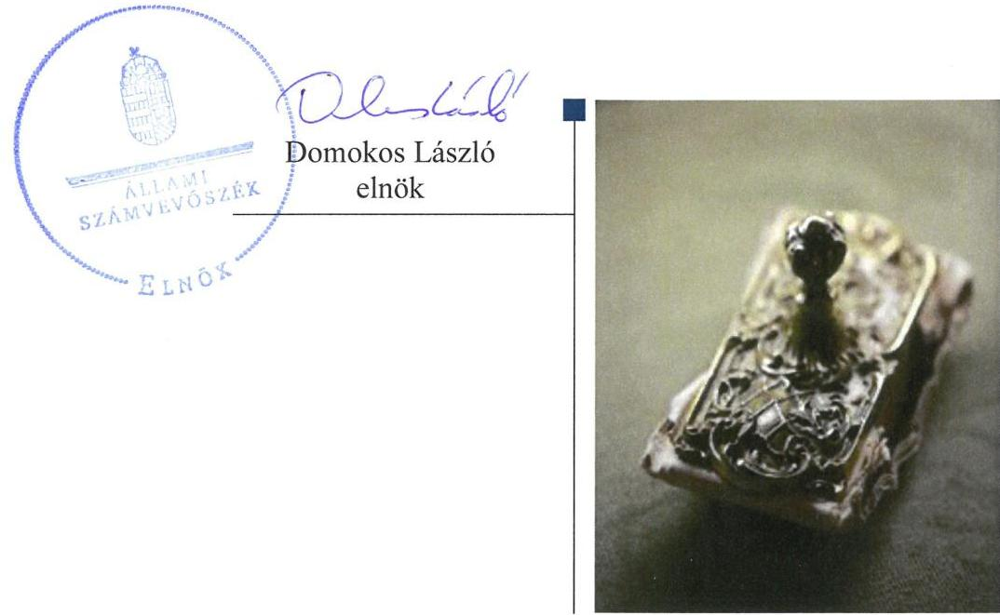
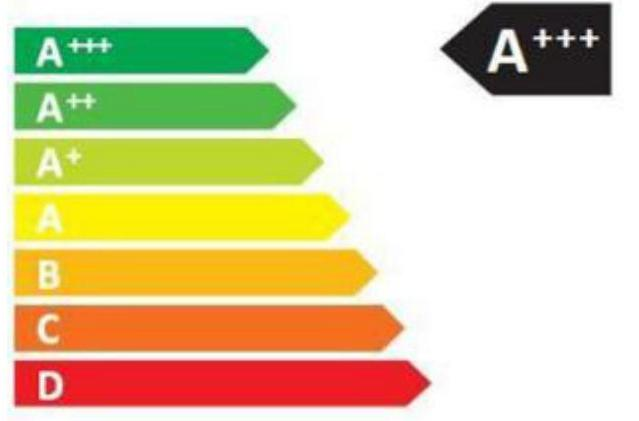
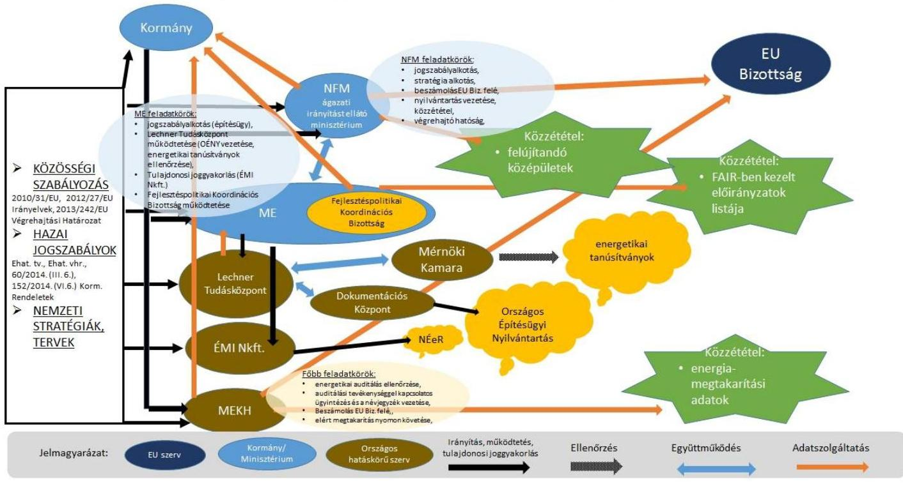
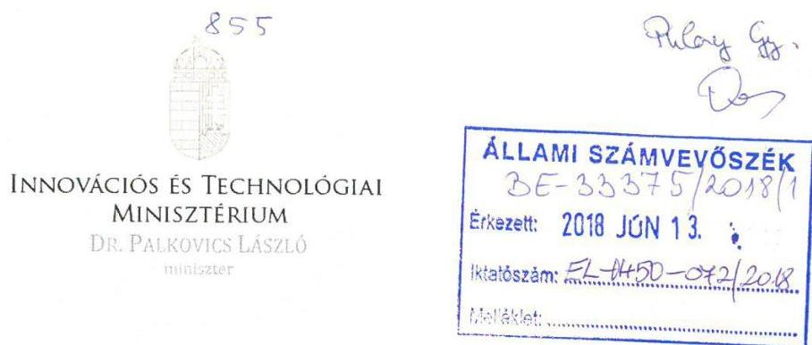
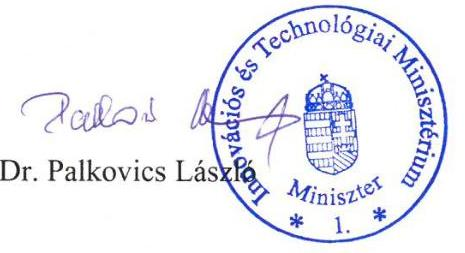
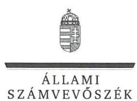
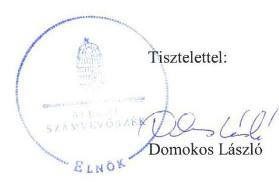

# Jelentés 

## A középületek energiahatékonyságának ellenőrzése

2018

---

# Jelentés 

## A középületek energiahatékonyságának ellenőrzése

2018. 07. hó 02. nap

---

# AZ ELLENŐRZÉST FELÜGYELTE:

DR. PULAY GYULA felügyeleti vezető

## AZ ELLENŐRZÉST VEZETTE ÉS A VÉGREHAJTÁSÁÉRT FELELŐS:

GÖRGÉNYI GÁBOR ellenőrzésvezető

## A PROGRAM ÖSSZEÁLLÍTÁSÁÉRT FELELŐS:

TÓTPÁL SZABOLCS osztályvezető

IKTATÓSZÁM: EL-0450-073/2018

TÉMASZÁM: 2464

ELLENŐRZÉS-AZONOSÍTÓ SZÁM: V0808

Jelentéseink az Országgyűlés számítógépes hálózatán és az Interneten a www.asz.hu címen is olvashatóak.

---

# TARTALOMJEGYZÉK 

■ ÖSSZEGZÉS ..... 5
■ AZ ELLENŐRZÉS CÉLJA ..... 6
■ AZ ELLENŐRZÉS TERÜLETE ..... 7
■ AZ ELLENŐRZÉS HÁTTERE, INDOKOLTSÁGA ..... 9
■ A JELENTÉS LÉNYEGES KÉRDÉSKÖREI ..... 11
■ AZ ELLENŐRZÉS HATÓKÖRE ÉS MÓDSZEREI ..... 12
■ MEGÁLLAPÍTÁSOK ..... 14
■ KÖVETKEZTETÉS ..... 20
■ MELLÉKLETEK ..... 21
I. sz. melléklet: Értelmező szótár ..... 21
■ FÜGGELÉK: ÉSZREVÉTELEK ..... 23
■ RÖVIDÍTÉSEK JEGYZÉKE ..... 29

---

.

---

# ÖSSZEGZÉS 

A középületek energiahatékonyságának növelésére vonatkozó kormányzati célokat és a célok elérését biztosító eszközrendszert stratégiai dokumentumok tartalmazták. A központi kormányzati épületeken végzett energiahatékonyságot növelő beruházásokhoz, felújításokhoz rendelkezésre álltak a pénzügyi források. Az energiahatékonysági célkitűzések elérésével összefüggő monitoring rendszert a felelős szervezetek kialakították és működtették.

## Az ellenőrzés társadalmi indokoltsága

Az Európai Unió 2020-ig 20%-os energia-megtakarítás elérését tűzte ki célul uniós szinten. Az épületek üzemeltetése az Európai Unió teljes energiafogyasztásának 40%-át teszi ki. A gazdasági növekedéssel párhuzamosan az építőipari beruházások volumene is növekszik, amely az energiahatékonyság növelő intézkedések hiányában az energiafogyasztás növekedésével járhat. Ebből eredően az épületek energiafogyasztásának csökkentésére és a megújuló forrásból származó energia felhasználás arányának növelésére vonatkozó intézkedések biztosítják az Európai Unió energiafüggőségének és az üvegházhatást okozó gázok kibocsátásának csökkentését. Az uniós szinten kitűzött cél elérésének elősegítése érdekében elfogadott uniós irányelveket Magyarország átültette a hazai jogszabályokba.

A közszféra az energiahatékonyság javítása terén is példamutató szerepet kell, hogy betöltsön, ezért a középületek esetében az energiahatékonysági követelmények érvényesítésére, a jogszabályban előírt kötelezettségek teljesítésére kiemelt figyelmet kell fordítani. Jelen ellenőrzés hozzájárulhat a középületek energiahatékonyságának növelésére vonatkozó stratégiai dokumentumokban és a jogszabályokban előírt követelmények maradéktalan teljesüléséhez, ezáltal az energiahatékonysággal kapcsolatos uniós és nemzeti célkitűzések megvalósításához.

## Főbb megállapítások, következtetések, javaslatok

Az energiahatékonyságra vonatkozó Nemzeti Épületenergetikai Stratégia, valamint Magyarország nemzeti energiahatékonysági cselekvési tervei tartalmazták a középületek felújítására vonatkozó célokat és a célok megvalósulását biztosító eszközrendszert. E stratégiai dokumentumok célként tartalmazták, hogy a felújítási kötelezettség alá eső központi kormányzati épületek alapterületének évente 3%-át felújítsák az energiahatékonysági minimumkövetelményeknek megfelelően. Ezzel összefüggésben a Nemzeti Fejlesztési Minisztérium közzétette a felújítandó központi kormányzati épületek és azok energiahatékonysági adatait tartalmazó listát. A stratégiai dokumentumok terveket tartalmaztak azzal összefüggésben, hogy a közintézmények tulajdonában és használatában levő új épületek 2019-től közel nulla energiaigényű épületek legyenek.

Az épületek energiahatékonyságának minimumkövetelményeit, valamint a stratégiai dokumentumokban meghatározott intézkedések végrehajtásáért és a felügyeletért felelős szervezetek hatás- és felelősségi körét a vonatkozó jogszabályok meghatározták.

A központi kormányzati épületek energiahatékonyságának növelése érdekében a felújításokra kitűzött évi 3%-os cél teljesítéséhez rendelkezésre álltak a megfelelő pénzügyi források.

A stratégiai dokumentumokban foglalt célkitűzések és a kapcsolódó intézkedések teljesítésére vonatkozó monitoring rendszert, valamint az energiahatékonysági támogatásokkal kapcsolatos operatív tevékenységek nyomon követési rendszerét a Nemzeti Fejlesztési Minisztérium és a Miniszterelnökség szabályszerűen kialakította és működtette.

Az energiahatékonysági tanúsítási tevékenységre, valamint a vonatkozó rendelkezések megsértésének felderítésére és az alkalmazandó szankciókra vonatkozó operatív monitoring és ellenőrzési rendszert a Miniszterelnökség szabályszerűen kialakította és működtette.

---

# AZ ELLENŐRZÉS CÉLJA 

Az ellenőrzés célja annak megállapítása, hogy kialakították-e a középületek energiahatékonyságának növelésére vonatkozó, szakpolitikai keretet; rendelkezésre állnak-e a (megfelelő) pénzügyi források a kitűzött terv/stratégia finanszírozásához; kialakították-e és működik-e az energiahatékonysági célkitűzések elérésének értékelését célzó monitoring rendszer.

---

# AZ ELLENŐRZÉS TERÜLETE 

## A középületek energiahatékonyságának ellenőrzése

A középületek energiahatékonysága az épületek szokásos használatához kapcsolódó energiaigény kielégítéséhez szükséges energia számított, vagy mért mennyisége, amely többek között magában foglalja a fűtéshez, a hűtéshez, a szellőztetéshez, a melegvíz-ellátáshoz és a világításhoz szükséges energiát.

Az Európai Unió fő célkitűzése, hogy költséghatékony módon elősegítse az energiahatékonyság javítását az unió tagállamaiban, megszüntesse az energiahatékonyság útjában álló intézményi, pénzügyi és jogi akadályokat, valamint biztosítsa a fenntartható fejlődést az energiahatékonyság és az energiaszolgáltatások számára. Az uniós szinten kitűzött cél elérésének elősegítése érdekében elfogadott EU irányelveket a tagállamoknak át kellett ültetniük a nemzeti jogszabályaikba. A
meglévő energiahatékonysági jogszabályok teljes körű és helyes végrehajtása elengedhetetlen ahhoz, hogy a 28 uniós tagállam elérje a 2020-ra kitűzött energiahatékonysági és éghajlat-politikai célokat.

Az uniós célok elérése érdekében Magyarország nemzeti szintű vállalást tett, amelyben meghatározó a közintézmények szerepvállalása. A középületek energiahatékonyságára vonatkozó hazai célkitűzések megvalósításában, folyamatában résztvevő szervezetek a következők:
$\longrightarrow$ a kormányzati célokat meghatározó stratégiai dokumentumokat, valamint az épületenergia-hatékonyság szabályozását kidolgozó, a szükséges pénzügyi források és azok elosztását meghatározó, a felújításokat nyomon követő NFM ${ }^{1}$;
$\longrightarrow$ az építésügyért felelős, illetve a kapcsolódó feladatellátásban, monitoring tevékenységben résztvevő szakmai szervezetek (Lechner Tudásközpont² és Mérnöki Kamara³) szabályozását kidolgozó ME ${ }^{4}$; (Az épületenergetikai tanúsításokat végző szakértők és az energetikai tanúsítványok nyilvántartásáról a ME jogszabályi kijelölés alapján a tulajdonosi joggyakorlásába tartozó Lechner Tudásközpont útján gondoskodott. Az energetikai tanúsítványok minőségének utóellenőrzési és szankcionálási feladatairól a ME jogszabályi kijelölés alapján a Mérnöki Kamara útján gondoskodott.)
$\longrightarrow$ az épületenergetikai monitoring, illetve audit rendszert működtető MEKH ${ }^{5}$, valamint az épületenergetikai adatok nyilvántartásának kezelését végző ÉMI Nkft ${ }^{6}$.
A középületek energiahatékonyságának növelése keretében a központi kormányzati épületek felújítása Magyarországon a KEOP ${ }^{7}$ és KEHOP ${ }^{8}$ programok keretében történt. A 60/2014. (III. 6.) Korm. rendelet ${ }^{9}$ alapján a ME és az NFM hatáskörébe tartozott az uniós energetikai célú támogatások FAIR ${ }^{10}$ és EMIR ${ }^{11}$ rendszer alkalmazásával történő forráskihelyezése, és annak monitoringja. A KEOP és KEHOP energetikai célú operatív programok esetében az NFM egyben a kijelölt Irányító Hatóság is. Az NFM-nél a

---

KEOP és KEHOP irányító hatósági feladatokat a Környezeti és Energiahatékonysági Operatív Programokért Felelős Helyettes Államtitkárság látta el.

---

# AZ ELLENŐRZÉS HÁTTERE, INDOKOLTSÁGA 

Az Európai Parlament és Tanács 2006/32/EK Irányelve ${ }^{12}$ (ESD Irányelv) fő célkitűzése, hogy költséghatékony módon elősegítse az energiahatékonyság javítását az $\mathrm{EU}^{13}$ tagállamaiban, megszüntesse az energiahatékonyság útjában álló intézményi, pénzügyi és jogi akadályokat, valamint biztosítsa a fenntartható fejlődést az energiahatékonyság és az energiaszolgáltatások számára. Az EU uniós szinten 2020-ig 20%-os energia-megtakarítás elérését tűzte ki célul. Az épületek üzemeltetése az EU teljes energiafogyasztásának 40%-át teszi ki. A gazdasági növekedéssel párhuzamosan az építőipari beruházások volumene is növekszik, amely energiahatékonyság-növelő intézkedések hiányában az energiafogyasztás növekedésével járhat. Ezért az épületek energiafogyasztásának csökkentése, valamint a megújuló forrásból származó energia felhasználása szükséges és fontos, amelyek együttesen biztosíthatják az EU energiafüggőségének és az üvegházhatást okozó gázok kibocsátásának csökkentését. A Bizottság ${ }^{14} 2011$. évi energiahatékonysági terve megállapította, hogy a legnagyobb energia-megtakarítást az épületeknél lehet elérni.

Az uniós szinten kitűzött cél elérésének elősegítése érdekében az EU elfogadta a 2010/31/EU Irányelvet ${ }^{15}$ és a 2012/27/EU Irányelvet ${ }^{16}$, amelyeket a tagállamoknak, így Magyarországnak is át kellett ültetniük a nemzeti jogrendszerbe és egyéb (pl. stratégiai) szabályokba. Ennek részeként a Kormány 2015-ben elfogadta a NÉeS ${ }^{17}$-t, illetve III. NEHCsT ${ }^{18}$-t, mint stratégiai dokumentumokat. Az Országgyűlés a nemzeti energiahatékonysági célkitűzések teljesítéséhez szükséges egyes feladatok meghatározása és e feladatok biztosítása céljából megalkotta - a 2015. június 7-től hatályos Ehat. tv. ${ }^{19}$-t. Az Ehat tv. eljárási szabályait a Kormány az Ehat. vhr. ${ }^{20}$-ben alkotta meg. Az uniós szabályozások előírásainak hazai jogrendszerben és egyéb szabályozásokban történő megjelenését az 1. táblázat tartalmazza.

## 1. táblázat

UNIÓS SZABÁLYOZÁS MEGJELENÉSE A HAZAI SZABÁLYOZÁSBAN

| Uniós szabályozás | Hazai szabályozás |
| :--: | :--: |
| 2010/31/EU irányelv | NÉeS |
|  | III. NEHCST |
|  | Étv. ${ }^{21}$ |
|  | 176/2008. (VI.30.) Korm. rendelet ${ }^{22}$ |
|  | 313/2012. (XI. 8.) Korm. rendelet ${ }^{23}$ |
|  | 266/2013. (VII. 11.) Korm. rendelet ${ }^{24}$ |
|  | 7/2006. (V. 24.) TNM rendelet ${ }^{25}$ |
|  | 1215/2015. (IV. 17.) Korm. határozat ${ }^{26}$ |
| 2012/27/EU irányelv | NÉeS |
|  | III. NEHCST |
|  | IV. NEHCST ${ }^{27}$ |
|  | Ehat. tv. |
|  | Ehat. vhr. |
|  | 1215/2015. (IV. 17.) Korm. határozat |

---

Az ellenőrzés kiterjedt a középületekre és a szűkebb kategóriát képviselő központi kormányzati épületekre.

A középület fogalmát jogszabály nem definiálja, azonban önálló kategóriaként jelenik meg a NÉeS-ben és beleértendő minden állami és önkormányzati tulajdonú, vagy azok tulajdonosi joggyakorlásában lévő épület. Az Ehat tv. ugyanakkor meghatároz egy speciális épület-kategóriát, „a közintézmények tulajdonában és használatában álló, közfeladat ellátását szolgáló épület"-et, amely a jelentését tekintve egyenértékű a köznyelvi értelemben vett és a NÉeS-ben is megjelenő középülettel. A középületek a lakóépületekkel és a vállalkozások épületeivel együtt alkotják a hazai épületállományt.

A központi kormányzati épületek körét az Ehat tv. határozza meg, amely jellemzően az országos hatáskörű közintézmények épületeit jelenti. Országos szinten a közszférának jó példával kell elöl járnia a középületek energiahatékonysága terén, ezért a központi kormányzati épületek energiahatékonyságának növelésére szigorúbb előírások vonatkoznak.

Az ellenőrzést nemzetközi párhuzamos ellenőrzés keretében végezte el az ÁSZ. A más számvevőszékekkel együttműködésben végzett nemzetközi ellenőrzések a nemzetközi tudásmegosztás és a közös tapasztalatszerzés révén elősegítik az ellenőrzések magasabb szintű és eredményesebb végrehajtását, hozzájárulva a közpénzek felhasználásának jobbításához.

---

# A JELENTÉS LÉNYEGES KÉRDÉSKÖREI 

1. Meghatározták-e középületek energiahatékonyságának növelésére vonatkozó kormányzati célokat és kialakították-e a megvalósításhoz szükséges szabályozási és szervezeti eszközöket?
2. Rendelkezésre álltak-e a megfelelő pénzügyi források a középületek energiahatékonyságának növelése érdekében kitűzött célok finanszírozásához?
3. Kialakították-e és működtették-e az energiahatékonysági célkitűzések elérésével összefüggő operatív nyomon követési (monitoring) rendszert?

---

# AZ ELLENŐRZÉS HATÓKÖRE ÉS MÓDSZEREI 

## Az ellenőrzés típusa

Megfelelőségi ellenőrzés

## Az ellenőrzött időszak

A 2014. január 1. és 2017. december 5. közötti időszak.

## Az ellenőrzés tárgya

Az ellenőrzés a középületek energiahatékonyságának növelése szakpolitikákat kialakító, a pénzügyi forrásokat tervező, elosztó, a célkitűzéseket értékelő és monitoring szervekre vonatkozóan kiterjed a szükséges szakpolitikák, jogszabályi keretek kialakítására, a kitűzött célok finanszírozásához tervezett pénzügyi források rendelkezésre állására, valamint az értékelést érintő működés folyamataira, az azt támogató monitoring rendszer megfelelő kialakítására.

## Az ellenőrzött szervezet

Miniszterelnökség, Nemzeti Fejlesztési Minisztérium, Magyar Energetikai és Közmű-szabályozási Hivatal és az Építésügyi Minőségellenőrző Innovációs Nonprofit Kft.

## Az ellenőrzés jogalapja

ÁSZ tv. ${ }^{28}$ 1. § (3) bekezdésében foglaltak és az 5. § (2) és (3) bekezdései képezik.

## Az ellenőrzés módszerei

Az ellenőrzést az Ellenőrzési program szempontjai, kérdései, az ellenőrzött időszakban hatályos jogszabályok, az ellenőrzés szakmai szabályai, az ÁSZ ${ }^{29}$ megfelelőségi ellenőrzési módszertana alapján végeztük el.

Az ellenőrzés ideje alatt az ellenőrzött szervezettel történő kapcsolattartást az ÁSZ Szervezeti és Működési Szabályzatának
 vonatkozó előírásai alapján történt.

Az ellenőrzési bizonyítékként felhasználható adatforrások közé tartoztak egyrészt az Ellenőrzési programban felsorolt adatforrások, másrészt

---

adatforrás volt az ellenőrzés folyamán feltárt, az ellenőrzés szempontjából információkat tartalmazó dokumentum.

Az ellenőrzési cél megválaszolásához, az azt megalapozó kérdésekre adott válaszok kiértékeléséhez az ellenőrzést a megjelölt adatforrások, a csatolt tanúsítványok felhasználásával, továbbá az adott időszakban hatályos jogszabályok figyelembe vételével folytattuk le.

Az ellenőrzés során minden olyan körülményt és adatot is ellenőriztünk, amely a program végrehajtása kapcsán felmerült újabb összefüggéseknek az ellenőrzés céljaival összhangban lévő feltárásához volt szükséges.

---

# 1. Meghatározták-e középületek energiahatékonyságának növelésére vonatkozó kormányzati célokat és kialakították-e a megvalósításhoz szükséges szabályozási és szervezeti eszközöket? 

Összegző megállapítás

1.1. számú megállapítás

A stratégiai dokumentumok tartalmazták a középületek felújítására vonatkozó célokat és a megvalósulásukat biztosító eszközrendszert.

A középületek energiahatékonyságának növelésére vonatkozó kormányzati célokat a vonatkozó stratégiai dokumentumok tartalmazták, a megvalósításhoz szükséges szabályozási és szervezeti kereteket a jogszabályok meghatározták.

Az NFM koordinálásával kialakított, az energiahatékonyságra vonatkozó stratégiai dokumentumok tartalmazták a központi kormányzati épületek felújítására vonatkozó célokat és a célok megvalósulását biztosító eszközrendszert. A stratégiai dokumentumok tartalmaztak terveket azzal összefüggésben, hogy a közintézmények tulajdonában és használatában levő új épületek 2019-től közel nulla energiaigényű épületek legyenek.

## A KÖZÉPÜLETEK ENERGIAHATÉKONYSÁGÁNAK NÖVELÉSÉVEL ÖSSZEFÜGGÉSBEN HÁROM STRATÉGIAI DOKUMENTUMOT hagyott jóvá a Kormány, amelyek az

NFM koordinálásával az Ehat. tv. alapján készültek:
$\longrightarrow$ A 2015. február 25-én kormányhatározatban kihirdetett NÉeS a nemzeti energiastratégiában ${ }^{30}$ megfogalmazottak elérése érdekében rögzítette azokat a fő célokat, amelyek alapján a 2020-ig terjedő időszakban a teljes hazai épületállomány (beleértve a középületek) korszerűsítése, energiafelhasználásának jelentős mértékű csökkentése érhető el.
$\longrightarrow$ A 2015. szeptember 8-án kormányhatározatban kihirdetett III. NEHCsT, illetve a 2017. november 14-én kormányhatározatban kihirdetett IV. NEHCsT az ország energiahatékonyságának javítását szolgáló, minden ágazatra - így a középületek energiahatékonyságának növelésére is - kiterjedő intézkedéseket, azok elért és várható eredményeit, valamint a megvalósítás feltételeit tartalmazta.
A stratégiai dokumentumok középületekre is vonatkozó céljai között szerepelt a 2020-as primerenergia fogyasztás, illetve a bruttó végső energiafelhasználás célértékének elérése; a hatékony fűtési/hűtési rendszerek és a nagy hatásfokú kapcsolt energiatermelést alkalmazó rendszerek felhasználásában rejlő potenciál kihasználása; az üvegházhatású gázok kibocsátásának csökkentése; a költségvetési kiadások mérséklése és másodlagos hatásként a munkahelyteremtés.

A stratégiai dokumentumok célként tartalmazták továbbá az Ehat. tv. azon előírását, hogy a felújítási kötelezettség alá eső központi kormányzati

---

épületek alapterületének évente 3%-át felújítsák az energiahatékonysági minimumkövetelményeknek megfelelően. Ezzel összefüggésben az NFM az Ehat tv. előírásainak megfelelően közzétette a felújítandó központi kormányzati épületeket és azok energiahatékonysági adatokat is tartalmazó listáját.

A középületek vonatkozásában is releváns célok elérését biztosító eszközrendszert a NÉeS három fő csoportba sorolta:
$\longrightarrow$ Energia megtakarítási intézkedések a meglévő épületállománynál,
$\longrightarrow$ Új épületekre és az épület felújításokra vonatkozó előírások,
$\longrightarrow$ Kutatás, fejlesztés, demonstráció, innováció, tudás, képzés, információ.
A NÉeS középületek vonatkozásában is releváns intézkedéseinek részletes bemutatását az 1. táblázat tartalmazza:

1. táblázat

# A NÉES ENERGIAHATÉKONYSÁGOT NÖVELŐ INTÉZKEDÉSEI 

ENERGIA MEGTARÍTÁSI INTÉZKEDÉSEK A MEGLÉVŐ ÉPÜLETÁLLOMÁNYNÁL

- $\quad$ NEHCsT összeállítása.
- Új támogatási és finanszírozási konstrukciók kidolgozása az épületek energiahatékonysági projektjeihez.
- Megújuló energia alapú energiaellátás alkalmazásának elősegítése az épületek hőellátásában, hűtésében.
- Az épületek megújuló energia alapú villamosenergia-ellátása napelemes alkalmazásokkal.

AZ ÚJ ÉPÜLETEKRE ÉS AZ ÉPÜLET FELÚJÍTÁSOKRA VONATKOZÓ ELŐÍRÁSOK

- Az új épületekre és az épületek felújítására vonatkozó energetikai előírások felülvizsgálata.
- Az épületek elemeinek cseréjére vonatkozó előírások felülvizsgálata.
- Az épületek energetikai minősítésének és a tanúsítási rendszer továbbfejlesztése.
- Az állami és önkormányzati tulajdonban és kezelésben lévő épületek energiahatékonysági követelményrendszerének kidolgozása.

## KUTATÁS, FEJLESZTÉS, DEMONSTRÁCIÓ, INNOVÁCIÓ, TUDÁS, KÉPZÉS, INFORMÁCIÓ

- Új épületenergetikai technológiákkal kapcsolatos kutatás, fejlesztés, az új technológiák alkalmazásának elterjesztése
- Tudásmegosztás az energetikai tanácsadók és önkormányzati energetikusok körében.
- NÉeR ${ }^{31}$ kialakítása és működtetése.

A középületekkel összefüggésben a NÉeS az Ehat tv-nek megfelelően tartalmazta a köztulajdonban lévő nemzeti épületállomány áttekintését, meghatározta az épülettípusoknak és az éghajlati zónának megfelelő költséghatékony felújítási megközelítéseket.

A III. NEHCsT a NÉeS helyzetelemzésére támaszkodott, és részletesen tartalmazta a NÉeS megvalósításához szükséges intézményi és strukturális intézkedéseket, valamint a monitoring-rendszer elemeit.

## A NÉES, VALAMINT A III-IV. NEHCST TERVEK

TARTALMAZTÁK azzal összefüggésben, hogy a hatóságok (közintézmények) tulajdonában és használatában levő új épületek 2019-től közel nulla energiaigényű épületek legyenek. Ezzel összhangban 2016. január 1-től az épületek energetikai jellemzőinek meghatározásáról szóló 7/2006. (V. 24.) TNM rendelet kiegészült egy új, 6. számú melléklettel, amely a közel nulla energiaigényű épületek követelményszintjeit határozta meg.

A tervek tartalmazták a közel nulla energiaigényű épületek fogalmának meghatározását, a fogalom alkalmazásának gyakorlati részleteit, a szám-

---

szerű mutatókat a primerenergia-fogyasztásra vonatkozóan, valamint a közel nulla energiaigényű épületek kivitelezését ösztönző szakpolitikákat és intézkedéseket.

Az intézkedések között szerepelt a szabályozás, az eljárásrend fejlesztése; a hatékonyság növelésére vonatkozó programok kidolgozása; a képzési, kutatás-fejlesztési, szaktanácsadási rendszerek fejlesztése, kitérve a tervezők, kivitelezők környezettudatosság irányú fejlesztésére; az adat- és tájékoztatási rendszerek fejlesztése; a fogyasztói tudatosság növelése; valamint az ágazati szereplők közti együttműködés fejlesztése.
1.2. számú megállapítás

Az épületek energiahatékonyságának minimumkövetelményeit, valamint a stratégiai dokumentumokban meghatározott intézkedések végrehajtásáért és a felügyeletért felelős szervezetek hatás- és felelősségi körét a vonatkozó jogszabályok meghatározták.

AZ ÉPÜLETEK ENERGIAHATÉKONYSÁGÁRA VONATKOZÓ MINIMUMKÖVETELMÉNYEKET az épületek energetikai jellemzőinek meghatározásáról szóló - többször módosított 7/2006. (V. 24.) TNM rendelet részletesen meghatározta. A minimumkövetelmények költségoptimalizált szintjeit szakmai tanulmány alapozta meg. A költségoptimalizált szintek számításai elkészítésének célja az volt, hogy ez alapján olyan mértékben lehet meghatározni a különböző épületekre vonatkozó energetikai előírásokat, amely a várható élettartam és a költségek, valamint a megtakarítások alapján az éghajlati adottságok figyelembe vételével a legracionálisabb megoldást eredményezi.

# A KÖZÉPÜLETEK ENERGIAHATÉKONYSÁGÁNAK 

NÖVELÉSÉVEL összefüggő intézkedések végrehajtásáért, monitoringjáért és felügyeletéért felelős intézmények hatás- és felelősségi körét a vonatkozó jogszabályok meghatározták.

A stratégiai dokumentumokban foglalt intézkedések végrehajtásáért felelős tárcákat (NFM, ME) az 1073/2015. (II. 25.) Korm. határozat ${ }^{32}$ és az 1601/2015. (IX. 8.) Korm. határozat ${ }^{33}$ jelölte ki, a felelősségi és hatásköröket pedig a 152/2014. (VI. 6.) Korm. rendelet ${ }^{34}$, az Ehat tv, az Ehat. vhr, valamint további rendeletek tartalmazták.

A 152/2014. (VI. 6.) Korm. rendelet előírásai alapján az NFM rendelkezett koordinálási jogkörrel az épületek energiahatékonyságának területen, és az Ehat. tv. alapján felelős volt a felújítandó központi kormányzati épületek nyilvántartásáért. A 4/2011. (I. 28.) Korm. rendelet ${ }^{35}$, valamint a 272/2014. (XI. 5.) Korm. rendelet ${ }^{36}$ alapján az NFM, mint a felújításokat megvalósító KEOP, KEHOP kijelölt irányító hatósága felelősségi körébe tartozott a felújítási források elosztása és a felújítási projektek kiválasztásának előkészítése.

A ME építésüggyel összefüggő monitoring és nyilvántartási feladatait a 272/2014. (XI. 5.) Korm. rendelet, a 60/2014 (III.6.) Korm. rendelet ${ }^{37}$ és a 313/2012. (XI. 8.) Korm. rendelet ${ }^{38}$ határozta meg. A 313/2012. (XI. 8.) Korm. rendelet alapján az OÉNY ${ }^{39}$ működtetése a ME hatáskörébe tartozott, amelyről a Lechner Tudásközpont útján gondoskodott.

A stratégiai dokumentumokban meghatározott intézkedések végrehajtásában közreműködő szervezeteket és azok kapcsolatrendszerét az 1. ábra szemlélteti.

---

1. ábra: A stratégiai dokumentumokban meghatározott intézkedések végrehajtásában közreműködő szervezetek bemutatása

A NÉeS-ben/III. Cselekvési Tervben meghatározott intézkedések végrehajtásáért, a monitoringért és a felügyeletért felelős szervezetek kapcsolatrendszere

Forrás: ÁSZ szerkesztés

# 2. Rendelkezésre álltak-e a megfelelő pénzügyi források a középületek energiahatékonyságának növelése érdekében kitűzött célok finanszírozásához? 

Összegző megállapítás

A központi kormányzati épületek felújításához rendelkezésre álltak a szükséges pénzügyi források.

A központi kormányzati épületek felújításához rendelkezésre álltak a szükséges pénzügyi források.

A központi kormányzati épületek energiahatékonyságának növelése érdekében a felújításokra kitűzött 3%-os cél teljesítéséhez rendelkezésre álltak a megfelelő pénzügyi források.

## A FELÚJÍTANDÓ KÖZPONTI KORMÁNYZATI ÉPÜ-

LETEK vonatkozásában az NFM az 1215/2015. (II. 25.) Korm. határozat szerint készített ütemezés alapján a KEOP és KEHOP operatív programok keretében gondoskodott a felújítási munkák ütemezéséről az Ehat tv.-ben foglalt évi 3%-os felújítási arány teljesíthetősége érdekében. Ennek megfelelően a felújításokra biztosított KEOP és KEHOP források összege lehetővé tette a felújítási kötelezettség alá eső központi kormányzati épületek alapterületének előírt mértékű felújítását.

Az Ehat tv. előírásával összhangban az NFM, mint a központi kormányzati épület-felújításokat megvalósító KEOP és KEHOP konstrukciók végrehajtó hatósága értékelte a követelmények megvalósulását.

Az NFM által készített, évi 3%-os felújítási kötelezettség alapjául szolgáló központi kormányzati épület nyilvántartás a 2015. évi elkészültekor $488505,9 \mathrm{~m}^{2}$ alapterületet tartalmazott, így az évi 3% mértékű - az előírások alapján több év átlagában elszámolható - felújítási kötelezettség

---

$14655,2 \mathrm{~m}^{2}$-re vonatkozott, amely a 2015-2017. években a következők szerint teljesült:

- A 2015. évben a KEOP keretében végzett felújítások $11183,6 \mathrm{~m}^{2}$ alapterületre (2,3%) terjedtek ki.
- A 2016. évben nem történtek felújítások, de hivatali átszervezések révén $23359,0 \mathrm{~m}^{2}$-rel csökkent a központi kormányzati épületek felújítandó alapterülete. Ez az alapterület érték az Ehat vhr. előírásai alapján beszámítható a következő két év felújítási kötelezettségébe.
- A 2017. évben több KEHOP projektnél történt támogatási döntés. Ezek befejezése 2018-ra tervezett $31837 \mathrm{~m}^{2}$ felújítási összvolumennel, amely közel $18000 \mathrm{~m}^{2}$-rel meghaladja az évi 3%-os felújítási kötelezettséget. Az évi felújítási kötelezettség teljesítésén túl felújított alapterület érték az Ehat vhr. szerint elszámolható a 2015-2017. évekre.
A 2016. évi átszervezések, valamint a 2018. évre várható túlteljesítés miatt a központi kormányzati épületek alapterületére vonatkozó évi 3%-os felújítási arány teljesítése a 2015-2017. évek vonatkozásában biztosított volt.

# 3. Kialakították-e és működtették-e az energiahatékonysági célkitűzések elérésével összefüggő operatív nyomon követési (monitoring) rendszert? 

Összegző megállapítás

Az energiahatékonysági célkitűzések elérésével összefüggő operatív nyomon követési (monitoring) rendszert a felelős szervezetek kialakították és működtették.

### 3.1. számú megállapítás

A stratégiai dokumentumokban foglalt célkitűzések és a kapcsolódó intézkedések teljesítésére vonatkozó monitoring rendszert az NFM kialakította, annak működtetése megfelelt a jogszabályi előírásoknak.

## A STRATÉGIAI DOKUMENTUMOKBAN FOGLALT INTÉZKEDÉSEK VÉGREHAJTÁSÁVAL KAPCSOLATOS OPERATÍV TEVÉKENYSÉGEK nyomon követési (monitoring) rendszerét az NFM kialakította és működtette, amelynek keretében ellenőrizte a stratégiai dokumentumok végrehajtásának előrehaladását. A középületek felújításaira vonatkozó tervek megvalósulását biztosító szakpolitikai intézkedések teljesülésének monitoring és ellenőrzési rendszerét a Bkr ${ }^{40}$-rel összhangban szabályozta.

A felújítandó központi kormányzati épületek Ehat. tv. szerinti nyilvántartását első alkalommal a 2015 szeptemberében elfogadott III. NEHCsT tartalmazta. A nyilvántartás 2017. január 1-jére vonatkozó adatokat tartalmazó módosítását az NFM saját honlapján 2017 novemberében tette közzé az Ehat. tv. előírásaival összhangban.

A módosított nyilvántartás 38. és 43. sora az Ehat. tv. 8. § (1) bekezdés c) pontjában foglaltak ellenére továbbra is tartalmazta a 2015-ben már felújított központi kormányzati épületeket, illetve azok $11183 \mathrm{~m}^{2}$ nagyságú

---

alapterület értékét, amely 2,7%-a a nyilvántartás szerinti összes alapterületnek. Az Ehat vhr. alapján az Európai Bizottság felé teljesített éves adatszolgáltatások azonban helyesen tartalmazták a 2015-ben felújított központi kormányzati épületek területadatát.

Az NFM a KEOP és KEHOP keretében a megvalósult, valamint a folyamatban levő felújítások vonatkozásában monitoring ellenőrzéseket végzett, indokolt esetben intézkedéseket foganatosított.
3.2. számú megállapítás

### 3.3. számú megállapítás

alapterület értékét, amely 2,7%-a a nyilvántartás szerinti
 összes alapterületnek. Az Ehat vhr. alapján az Európai Bizottság felé teljesített éves adatszolgáltatások azonban helyesen tartalmazták a 2015-ben felújított központi kormányzati épületek területadatát.

Az NFM a KEOP és KEHOP keretében a megvalósult, valamint a folyamatban levő felújítások vonatkozásában monitoring ellenőrzéseket végzett, indokolt esetben intézkedéseket foganatosított.

Az energiahatékonysági támogatásokkal kapcsolatos operatív tevékenységek nyomon követési rendszerét a felelős szervezetek kialakították és működtették.

Az NFM kialakította és működtette az energiahatékonysági támogatásokkal kapcsolatos operatív tevékenységek nyomon követési rendszerét. A KEOP és KEHOP 2014-2016. éves és záró végrehajtási jelentések részletes beszámolókat tartalmaztak az elvégzett ellenőrzésekre és azok eredményére vonatkozóan. A ME a 60/2014. (III. 6.) Korm. rendelet alapján működtette a FAIR és EMIR rendszereket, a FAIR és EMIR központi rendszer útján gyűjtötte a támogatások odaítélésének, a fejlesztések végrehajtásának és a támogatások felhasználása ellenőrzésének adatait.

Az energiahatékonysági tanúsítási tevékenységre, valamint a vonatkozó rendelkezések megsértésének felderítésére és az alkalmazandó szankciókra vonatkozó operatív monitoring és ellenőrzési rendszert a felelős szervezetek kialakították és működtették.

## AZ ENERGIAHATÉKONYSÁGI TANÚSÍTÁSI TEVÉ-

KENYSÉGRE, valamint energetikai tanúsítványokra vonatkozó követelményeket a 7/2006. (V.24.) TNM rendelet és a 176/2008. (VI.30.) Korm. rendelet tartalmazta. A ME a 313/2012. (XI. 8.) Korm. rendelet 3. § (1) bekezdése alapján a tulajdonosi joggyakorlása keretében a Lechner Tudásközpont útján gondoskodott az OÉNY működtetéséről, amely tartalmazta az épületek energetikai tanúsítványait.

A ME a Lechner Tudásközponttal támogatási szerződést kötött. A szerződés tartalmazta a Lechner Tudásközpont számára a részletes feladatterv, szakmai program, pénzügyi terv, valamint szakmai és pénzügyi beszámoló elkészítésének kötelezettségét, amely biztosította a ME részére a feladatellátás operatív nyomon követését.

## AZ ENERGETIKAI TANÚSÍTVÁNYOKRA VONAT-

KOZÓ MONITORING tevékenységet a ME a Mérnöki Kamara útján látta el. A jogszabályi rendelkezések megsértése szankcionálásának szabályait az Étv. és a 266/2013. (VII. 11.) Korm. rendelet határozta meg, a szankcionálási tevékenység ellátására a Mérnöki Kamarát jelölte ki. A ME támogatási szerződéssel biztosította a Mérnöki Kamara számára az energetikai tanúsítványokra vonatkozó ellenőrzési és szankcionálási tevékenységhez szükséges forrásokat és szakmai feltételeket.

A ME és a Mérnöki Kamara által kötött támogatási szerződés tartalmazta a Mérnöki Kamara szakmai és pénzügyi beszámoló készítési kötelezettségét, amely biztosította a ME részére a feladatellátás operatív nyomon követését.

---

# KÖVETKEZTETÉS 

Magyarország a középületek energiahatékonyságára vonatkozó elvárásokat az uniós irányelvekben foglaltaknak megfelelően teljesítette. Ennek keretében az Országgyűlés, a Kormány, illetve az érintett miniszterek megalkották a szükséges jogszabályokat, a Kormány részéről pedig elfogadásra kerültek azok a stratégiai dokumentumok, amelyek a hazai célokat és a célok elérését biztosító eszközrendszert - az uniós irányelvekkel összhangban - meghatározzák. Magyarország létrehozta a középületek energiahatékonyságának növelését támogató intézményrendszert, a célokhoz kapcsolódó tevékenységek operatív megvalósítása megkezdődött és a célkitűzések elérését nyomon követő kapcsolódó monitoring rendszert az illetékes hatóságok kialakították és működtették.

---

# MELLÉKLETEK 

## I. SZ. MELLÉKLET: ÉRTELMEZŐ SZÓTÁR

energetikai tanúsítvány Az épületek energetikai jellemzőit, valamint a javasolt megtakarítási lehetőségeit tartalmazó dokumentum. Az épület energetikai jellemzőit tanúsítani kell:
a) új épület építése;
b) meglévő épület vagy önálló rendeltetési egység
ba) ellenérték fejében történő tulajdon-átruházása, vagy
bb) bérbeadása;
c) 250 m 2 , vagy ennél nagyobb hasznos alapterületű hatósági rendeltetésű, állami tulajdonú közhasználatú épület
esetén.
Forrás: 176/2008. (VI. 30.) Korm. rendelet 1. § (3) bekezdés
energiahatékonyságra vonatkozó minimumkövetelmények

Irányító Hatóság
költségoptimalizált szint
közel nulla energiaigényű épület
központi kormányzati épület
primerenergia

A tagállamok megteszik a szükséges intézkedéseket annak biztosítására, hogy a költségoptimalizált szintek elérése érdekében minimumkövetelményeket határozzanak meg az épületek vagy önálló rendeltetési egységek energiahatékonyságára vonatkozóan.
Forrás: 2010/31/EU Irányelv 4. cikk, (1) bekezdés
(Részletes magyar szabályozás: 7/2006. (V. 24.) TNM rendelet, 1. melléklet)
Az Irányító Hatóság (IH) közreműködik az Operatív Program (OP) véglegesítésében, irányítja az Operatív Program Programkiegészítő Dokumentum kidolgozását, és közreműködő szerepet vállal e dokumentumoknak az Európai Bizottsággal történő tárgyalásaiban. Az IH részt vesz továbbá a költségvetési tervezésében, valamint Közreműködő Szervezetek vagy közreműködő szervezeti feladatokat ellátó egységek bevonásával irányítja a meghirdetett pályázatok és központi programok végrehajtását.
Az energiahatékonyság azon szintje, amely egy épület, vagy valamely, a 7/2006. (V. 24.) TNM rendeletben meghatározott épületelem becsült gazdasági élettartama folyamán a legalacsonyabb költséget eredményezi a 176/2008. (VI. 30.) Korm. rendelet 7. § (4) bekezdése szerinti számítás alapján.
Forrás: 176/2008. (VI. 30.) Korm. rendelet 2. §, f) pont
A 7/2006. (V. 24.) TNM rendelet 6. melléklet követelményeinek megfelelő épület Forrás: 7/2006. (V. 24.) TNM rendelet 2. § 6a pont
központi kormányzat:
A minisztérium, a kormányhivatal országos hatáskörrel rendelkező szervezeti egységei, a központi hivatal - a fővárosi és megyei kormányhivatalok kivételével - országos hatáskörrel rendelkező szervezeti egységei, a Közbeszerzési és Ellátási Főigazgatóság, valamint a Katonai Nemzetbiztonsági Szolgálat országos hatáskörrel rendelkező szervezeti egységei, az országos hatáskörrel rendelkező rendvédelmi szervek és honvédségi szervezetek; továbbá ha e szervezetek körében egy adott hatáskör vonatkozásában nem létezik országos hatáskörű szervezeti egység, akkor azok a szervezeti egységek vagy szervezetek, amelyek illetékessége együttesen terjed ki az ország területére.
Forrás: Ehat. tv., 1. § 24. pont
épület: falakkal ellátott, fedett építmény, amelyben energiát használnak a beltéri légállapot szabályozására;
Forrás: 176/2008. (VI. 30.) Korm. rendelet, 2. § a) pont
Az a megújuló és nem megújuló energiaforrásból származó energia, amely nem esett át semminemű átalakításon vagy feldolgozási eljáráson.
Forrás: 7/2006. (V. 24.) TNM rendelet 2. § 9. pont

---

szakpolitikai intézkedés

| végső energiafelhasználás | Olyan szabályozási, pénzügyi, adóügyi, önkéntes vagy tájékoztatási eszköz, amelyet egy tagállamban az előírásoknak megfelelően hoztak létre és hajtottak végre annak érdekében, hogy a piaci szereplők számára olyan támogatási keret, követelmény vagy ösztönző jöjjön létre, amelynek köszönhetően ez utóbbiak energiahatékonysági szolgáltatásokat nyújtanak és vesznek igénybe, valamint egyéb energiahatékonyság-javító intézkedéseket vezetnek be. |
| :--: | :--: |
|  | Forrás: 2012/27/EU Irányelv, 2. § 18. pont |
| végrehajtó hatóság | A rég felhasználási energiamegtakarítás eléréséhez igénybe vett egyes szakpolitikai intézkedések megvalósításáért és nyomon követéséért felelős közfeladatot ellátó szervezet. |
|  | Forrás: Ehat. tv. 1. § 32. pont |

---

# FÜGGELÉK: ÉSZREVÉTELEK 

A jelentéstervezetet a Számvevőszék 15 napos észrevételezésre megküldte az ellenőrzött szervezetek vezetőinek az ÁSZ tv. 29. § (1) bekezdése előírásának megfelelően.

Az ÁSZ a jelentéstervezetet az Építésügyi Minőségellenőrző Innovációs Nonprofit Kft. ügyvezetőjének, a Miniszterelnökség miniszterének, a Magyar Energetikai és Közműszabályozási Hivatal elnökének és a Nemzeti Fejlesztési Minisztérium miniszterének küldte meg.
Észrevételt a Nemzeti Fejlesztési Minisztérium jogutódjaként az Innovációs és Technológiai Minisztérium minisztere tett, észrevételeit és az azokra adott választ a függelék tartalmazza.

[^0]
[^0]:    * 29. § (1) Az Állami Számvevőszék az ellenőrzési megállapításait megküldi az ellenőrzött szervezet vezetőjének vagy az általa megbízott személynek, és annak, akinek személyes felelősségét állapította meg.
    (2) Az ellenőrzött szervezet vezetője és a felelősként megjelölt személy az ellenőrzés megállapításaira tizenöt napon belül írásban észrevételt tehet.
    (3) Az Állami Számvevőszék az észrevételre a beérkezésétől számított harminc napon belül írásban válaszol. A figyelembe nem vett észrevételeket köteles a jelentésben feltüntetni, és megindokolni, hogy azokat miért nem fogadta el.

---

# Iktatószám: EFO/42083-1/2018-NFM 

Gizella
mail:gizella.habencius.simonne@nfm.gov.hu

Ügyintéző: Simonné Hábencius
Telefonszám: 79-54405
E-
Hiv. szám: EL-0450-063/2018.

## Domokos László   elnök   részére   Állami Számvevőszék

Budapest
Apáczai Csere János u. 10.
1052

Tárgy: Jelentéstervezet véleményezése

## Tisztelt Elnök Úr!

Köszönettel vettem kézhez „A középületek energiahatékonyságának ellenőrzése” címmel készített számvevőszéki jelentéstervezetet.

A jelentéstervezetre a következő észrevételeket teszem:

- A jelentéstervezet 7. oldalának utolsó bekezdésének középső mondatát a következőképpen javasolt kiegészíteni: ,,A 60/2014. (III. 6.) Korm. rendelet alapján az ME és az NFM (KEHOP IH) hatáskörébe tartozott az uniós energetikai célú támogatások - FAIR és EMIR rendszer alkalmazásával történő - monitoringja, míg a forráskihelyezéssel kapcsolatos megvalósulás a 4/2011. (I. 28.) Korm. rendelet, valamint a 272/2014. (IX. 5.) Korm. rendelet szerint történik.”
- A jelentéstervezet 16. oldal utolsó előtti bekezdését, tekintettel arra, hogy a források elosztása nem az IH feladata, a következők szerint kérjük módosítani: ,,A KEOP, KEHOP kijelölt irányító hatósága a 4/2011.(I. 28.) Korm. rendelet, valamint a 272/2014. (IX. 5.) Korm.

---

rendelet alapján az irányító hatósági és a közreműködő szervezeti feladatokat látja el a felújítások kapcsán, a felújítások megvalósulásának monitoringja pedig a 60/2014. (III.6.) Korm. rendelet alapján történik.”

- A jelentéstervezet 19. oldalán a 3.2 megállapításnál leírtakat a következők szerint javasoljuk kiegészíteni: „Az ME a 60/2014. (III. 6.) Korm. rendelet alapján működteti a FAIR és EMIR rendszereket. A FAIR és EMIR rendszer útján gyűjti/gyűjtötte a támogatások odaítélésének, a fejlesztések végrehajtásának és a támogatások felhasználására irányuló ellenőrzések adatait.”

Kérem észrevételeink szíves figyelembe vételét.

Budapest, 2018. június „2”

# Üdvözlettel: 

---

ELNÖK

Ikt.szám: EL-0450-071/2018.

# Dr. Palkovics László úr 

miniszter
Innovációs és Technológiai Minisztérium

## Budapest

## Tisztelt Miniszter Úr!

„A középületek energiahatékonyságának ellenőrzése” címmel készített számvevőszéki jelentéstervezetre az Innovációs és Technológiai Minisztérium észrevételeit köszönettel megkaptam.
Az Állami Számvevőszék észrevételekre vonatkozó álláspontjáról a felügyeleti vezető által készített részletes tájékoztatást csatoltan megküldöm.
Tájékoztatom Miniszter urat, hogy a számvevőszéki jelentésben - az Állami Számvevőszékről szóló 2011. évi LXVI. törvény 29. § (3) bekezdése alapján - a figyelembe nem vett észrevételeket szerepeltetjük az elutasítás indokának feltüntetésével.

Budapest, 2018. 06. hó 18. nap

Melléklet: Tájékoztatás az észrevételek kezeléséről

---

# Tájékoztatás az észrevételek kezeléséről 

„A középületek energiahatékonyságának ellenőrzése” című jelentéstervezetre az EFO/42083-1/2018-NFM iktatószámú levélben megküldött észrevételeit áttekintettem. Az észrevételek kezeléséről az alábbi tájékoztatást adom.

## 1.) Az ellenőrzés területéhez megfogalmazott észrevételre adott válasz

Az észrevételt részben elfogadjuk, a hivatkozott mondatban a FAIR rendszer mellett feltüntetésre kerül az EMIR rendszer is, amely rendszerek alkalmazásával a ME és az NFM hatáskörébe tartozott az uniós energetikai célú támogatások forráskihelyezése a 60/2014. (III. 6.) Korm. rendelet alapján. A második mondatrész jelentésben való szerepeltetése nem indokolt, hiszen az egyrészt a jogszabály ismétlése, másrészt arra az ellenőrzés nem terjedt ki.

## 2.) Az 1.2. számú megállapítás 4. bekezdéséhez megfogalmazott észrevételre adott válasz

Az észrevételt elfogadjuk, az ellenőrzött szervezet által tett észrevétel alapján a jelentésben „a felújítások megvalósulásának monitoringja” helyett „a felújítási projektek kiválasztásának előkészítése” kerül szerepeltetésre.

## 3.) A 3.2. számú megállapítás 1. bekezdéséhez megfogalmazott észrevételre adott válasz

Az észrevételt részben elfogadjuk, a hivatkozott mondatban a FAIR rendszer mellett feltüntetésre kerül az EMIR rendszer is, amely központi rendszerek útján a ME gyűjtötte a támogatások odaítélésének, a fejlesztések végrehajtásának és a támogatások felhasználása ellenőrzésének adatait. A mondat második felében a jelen idő használatát nem fogadjuk el, az ellenőrzéssel érintett időszak ugyanis az ellenőrzési program szerint 2014. január 1. és 2017. december 5. közötti időszak volt.

Budapest, 2018. 06. hó 19. nap

Dr. Pulay Gyula felügyeleti vezető

---

.

---

# RÖVIDÍTÉSEK JEGYZÉKE 

${ }^{1}$ NFM
${ }^{2}$ Lechner Tudásközpont
${ }^{3}$ Mérnöki Kamara
${ }^{4} \mathrm{ME}$
${ }^{5}$ MEKH
${ }^{6}$ ÉMI Nkft.
${ }^{7}$ KEOP
${ }^{8}$ KEHOP
${ }^{9}$ 60/2014. (III. 6.) Korm. rendelet
${ }^{10}$ FAIR
${ }^{11}$ EMIR
${ }^{12}$ 2006/32/EK Irányelv
${ }^{13}$ EU/unió
${ }^{14}$ Bizottság
${

 }^{15}$ 2010/31/EU Irányelv
${ }^{16}$ 2012/27/EU Irányelv
${ }^{17}$ NÉES
${ }^{18}$ III. NEHCsT
${ }^{19}$ Ehat. tv.
${ }^{20}$ Ehat. vhr.
${ }^{21}$ Étv.
${ }^{22}$ 176/2008. (VI.30.) Korm. rendelet
${ }^{23}$ 313/2012. (XI. 8.) Korm. rendelet
${ }^{24}$ 266/2013. (VII. 11.) Korm. rendelet
${ }^{25}$ 7/2006. (V. 24.) TNM rendelet
${ }^{26}$ 1215/2015. (IV. 17.) Korm. határozat
${ }^{27}$ IV. NEHCsT

Nemzeti Fejlesztési Minisztérium
Lechner Tudásközpont Területi, Építészeti és Informatikai Nonprofit Kft.
Budapesti és Pest Megyei Mérnöki Kamara
Miniszterelnökség
Magyar Energetikai és Közmű-szabályozási Hivatal
Építésügyi Minőségellenőrző Innovációs Nonprofit Kft.
Környezet és Energia Operatív Program
Környezeti és Energiahatékonysági Operatív Program
60/2014. (III. 6.) Korm. rendelet a támogatásból megvalósuló fejlesztések központi monitoringjáról és nyilvántartásáról
Fejlesztéspolitikai Adatbázis és Információs Rendszer
Egységes Monitoring és Információs Rendszer
AZ EURÓPAI PARLAMENT ÉS TANÁCS 2006/32/EK IRÁNYELVE (2006. április 5.) az energia-végfelhasználás hatékonyságáról és az energetikai szolgáltatásokról, valamint a 93/76/EGK tanácsi irányelv hatályon kívül helyezéséről
Európai Unió
Európai Bizottság
az Európai Parlament és a Tanács 2010. május 19-i irányelve az épületek energiahatékonyságáról
az Európai Parlament és a Tanács 2012. október 25-i irányelve az energiahatékonyságáról, a 2009/125/EK és a 2010/30/EU irányelv módosításáról, valamint a 2004/8/EK és a 2006/32/EK irányelv hatályon kívül helyezéséről
Nemzeti Épületenergetikai Stratégia (elfogadta a Nemzeti Épületenergetikai Stratégiáról szóló 1073/2015. (II. 25.) Korm. határozat)
Magyarország Nemzeti Energiahatékonysági Cselekvési Terve 2020-ig (elfogadta a Magyarország III. Nemzeti Energiahatékonysági Cselekvési Tervéről szóló 1601/2015. (IX. 8.) Korm. határozat)
az energiahatékonyságról szóló 2015. évi LVII. törvény
az energiahatékonyságról szóló törvény végrehajtásáról szóló 122/2015. (V. 26.) Korm. rendelet
1997. évi LXXVIII. törvény az épített környezet alakításáról és védelméről 176/2008. (VI.30.) Korm. rendelet az épületek energetikai jellemzőinek tanúsításáról
313/2012. (XI. 8.) Korm. rendelet az Építésügyi Dokumentációs és Információs Központról, valamint az Országos Építésügyi Nyilvántartásról
266/2013. (VII. 11.) Korm. rendelet az építésügyi és az építésüggyel összefüggő szakmagyakorlási tevékenységekről
7/2006. (V. 24.) TNM rendelet az épületek energetikai jellemzőinek meghatározásáról (TNM - tárca nélküli miniszter)
1215/2015. (IV. 17.) Korm. határozat az energiamegtakarítás eléréséhez szükséges egyes kormányzati feladatokról
IV. Nemzeti Energiahatékonysági Cselekvési Terv (elfogadta a Magyarország IV. Nemzeti Energiahatékonysági Cselekvési Tervéről szóló 1842/2017. (XI. 14.) Korm. határozat)

---

${ }^{28}$ ÁSZ tv.
${ }^{29}$ ÁSZ
${ }^{30}$ nemzeti energiastratégia
${ }^{31}$ NÉER
${ }^{32}$ 1073/2015. (II. 25.) Korm. határozat
${ }^{33}$ 1601/2015. (IX. 8.) Korm. határozat
${ }^{34}$ 152/2014. Korm. rendelet
${ }^{35}$ 4/2011. (I. 28.) Korm. rendelet
${ }^{36}$ 272/2014. (XI. 5.) Korm. rendelet
${ }^{37}$ 60/2014. (III. 6.) Korm. rendelet
${ }^{38}$ 313/2012. (XI. 8.) Korm. rendelet
${ }^{39}$ OÉNY
${ }^{40}$ Bkr.
2011. évi LXVI. törvény az Állami Számvevőszékről

Állami Számvevőszék
NEMZETI ENERGIASTRATÉGIA 2030 (elfogadta a Nemzeti Energiastratégiáról szóló 77/2011. (X. 14.) OGY határozat)
Nemzeti Épületenergetikai Rendszer
1073/2015. (II. 25.) Korm. határozat a Nemzeti Épületenergetikai Stratégiáról 1601/2015. (IX. 8.) Korm. határozat Magyarország III. Nemzeti Energiahatékonysági Cselekvési Tervéről
a Kormány tagjainak feladat- és hatásköréről szóló 152/2014. (VI. 6.) Korm. rendelet
4/2011. (I. 28.) Korm. rendelet a 2007-2013 programozási időszakban az Európai Regionális Fejlesztési Alapból, az Európai Szociális Alapból és a Kohéziós Alapból származó támogatások felhasználásának rendjéről
272/2014. (XI. 5.) Korm. rendelet a 2014-2020 programozási időszakban az egyes európai uniós alapokból származó támogatások felhasználásának rendjéről
60/2014. (III. 6.) Korm. rendelet a támogatásból megvalósuló fejlesztések központi monitoringjáról és nyilvántartásáról
313/2012. (XI. 8.) Korm. rendelet az Építésügyi Dokumentációs és Információs Központról, valamint az Országos Építésügyi Nyilvántartásról
Országos Építésügyi Nyilvántartás
370/2011. (XII. 31.) Korm. rendelet a költségvetési szervek belső kontrollrendszeréről és belső ellenőrzéséről

---

# ÁLLAMI SZÁMVEVŐSZÉK 

1052 Budapest, Apáczai Csere János utca 10.
Levélcím: 1364 Budapest 4. Pf. 54
Telefon: +36 14849100 Telefax: +36 14849200
www.asz.hu
