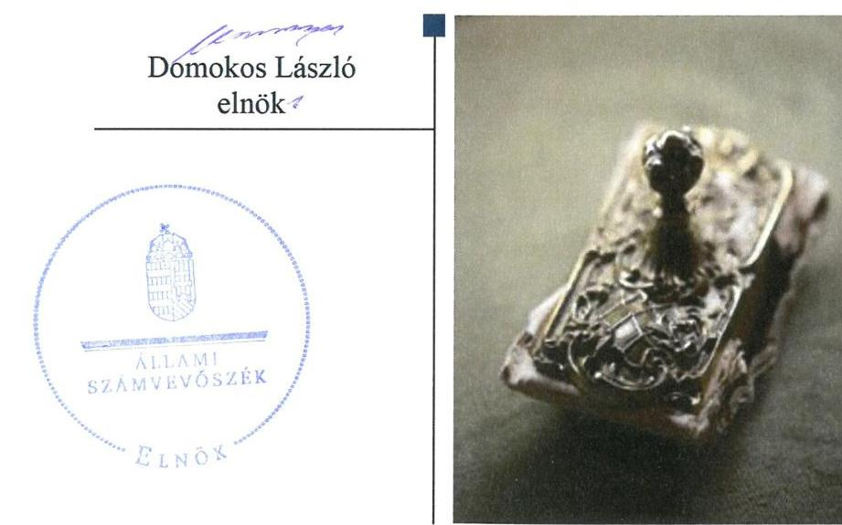
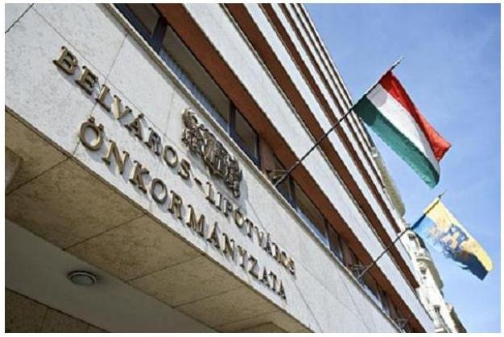
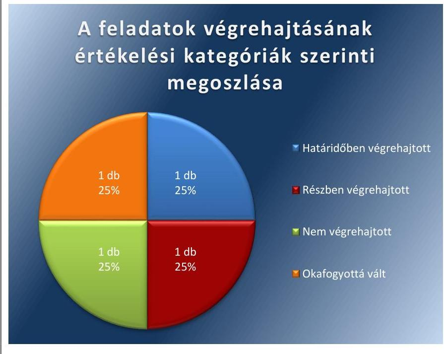
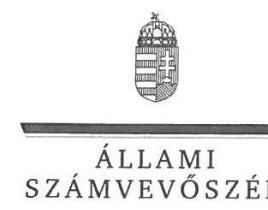
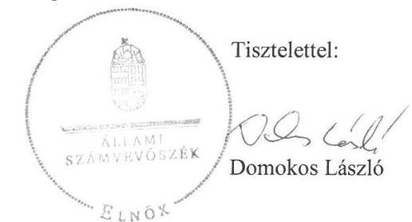
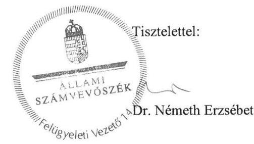

# Jelentés 

## Utóellenőrzések

Az önkormányzatok vagyongazdálkodása szabályszerűségének utóellenőrzése -Belváros-Lipótváros Budapest Főváros V. kerület Önkormányzata 2018.

---

# Jelentés 

## Utóellenőrzések

Az önkormányzatok vagyongazdálkodása szabályszerűségének utóellenőrzése -Belváros-Lipótváros Budapest Főváros V. kerület Önkormányzata
2018. 17. hó 19. nap

---

# AZ ELLENŐRZÉST FELÜGYELTE: 

DR NÉMETH ERZSÉBET felügyeleti vezető

## AZ ELLENŐRZÉST VEZETTE ÉS A VÉGREHAJTÁSÁÉRT FELELŐS:

DÉZSINÉ KIS HAJNALKA ellenőrzésvezető

## A PROGRAM ÖSSZEÁLLÍTÁSÁÉRT FELELŐS:

TÓTPÁL SZABOLCS osztályvezető

## A TÉMÁHOZ KAPCSOLÓDÓ KORÁBBI SZÁMVEVŐSZÉKI JELENTÉSEK:

- címe: Jelentés az önkormányzatok vagyongazdálkodása szabályszerűségének ellenőrzéséről Belváros-Lipótváros Budapest Főváros V. kerület
- sorszáma: 15010

IKTATÓSZÁM: V-1300-015/2016
TÉMASZÁM: 6
ELLENŐRZÉS-AZONOSÍTÓ SZÁM: V080414

---

# TARTALOMJEGYZÉK 

■ ÖSSZEGZÉS ..... 5
■ AZ ELLENŐRZÉS CÉLJA ..... 6
■ AZ ELLENŐRZÉS TERÜLETE ..... 7
■ AZ ELLENŐRZÉS HÁTTERE, INDOKOLTSÁGA ..... 8
■ A JELENTÉS LÉNYEGES KÉRDÉSKÖRE ..... 9
■ ELLENŐRZÉS HATÓKÖRE ÉS MÓDSZEREI ..... 10
■ MEGÁLLAPÍTÁSOK ..... 12
■ MELLÉKLETEK ..... 15
I. sz. melléklet: Belváros-Lipótváros Budapest Főváros V. kerület Önkormányzata intézkedési tervének végrehajtása ..... 15
■ FÜGGELÉK: ÉSZREVÉTELEK ..... 17
■ RÖVIDÍTÉSEK JEGYZÉKE ..... 23

---

.

---

# ÖSSZEGZÉS 

Az utóellenőrzés megállapította, hogy Belváros-Lipótváros Budapest Főváros V. kerület Önkormányzata az intézkedési tervben meghatározott feladatokat nem teljes körüen hajtotta végre, ugyanakkor az ingatlanok leltározását elvégezte, ennek eredményeként javult a vagyongazdálkodás szabályszerűsége és átláthatósága.

## Az ellenőrzés társadalmi indokoltsága

Az Állami Számvevőszék stratégiájában célul tűzte ki a számvevőszéki munka hasznosulásának javítását. Ezzel összhangban ellenőrzi, hogy az ellenőrzött szervezet megvalósította-e a korábbi ellenőrzései által feltárt hibák, hiányosságok és szabálytalanságok megszüntetése céljából elkészített intézkedési tervében foglaltakat. A rendszeres utóellenőrzések hozzájárulnak a szükséges intézkedések tényleges végrehajtásához, ezáltal a közpénzügyek rendezettségének javulásához.

## Főbb megállapítások, következtetések

Az Önkormányzat az ÁSZ által elfogadott intézkedési tervében meghatározott négy feladatból egyet határidőben, egyet részben, egyet nem hajtott végre és egy feladat végrehajtása jogszabályváltozás miatt okafogyottá vált.

Az Önkormányzat a jogszabálynak és a leltározási szabályzatának megfelelően végrehajtotta az ingatlanok menynyiségi felvétellel történő leltározását, valamint intézkedett a vagyonkezelésbe átadott eszközök jogszabálynak megfelelő kimutatásáról a mérlegben. Ennek hatására javult a vagyongazdálkodás szabályszerűsége és átláthatósága.

Az Önkormányzat nem teremtette meg az egyezőséget az ingatlanvagyon kataszter adatai és a földhivatali nyilvántartás között, ami továbbra is kockázatot hordoz a vagyongazdálkodás szabályszerűsége és átláthatósága szempontjából.

A Jegyző a törvényi előírásnak megfelelően vezette az intézkedési tervben rögzített feladatok végrehajtásáról szóló nyilvántartást.

---

# AZ ELLENŐRZÉS CÉLJA 

Az ellenőrzés célja annak értékelése volt, hogy a számvevőszéki jelentésben foglalt intézkedést igénylő megállapításokkal összhangban készített intézkedési tervben meghatározott feladatokat az ellenőrzött szervezet végrehajtotta-e.

---

# **AZ ELLENŐRZÉS TERÜLETE**

## **Belváros-Lipótváros Budapest Főváros V. kerület Önkormányzata**

Belváros-Lipótváros Budapest Főváros V. kerület állandó lakosainak száma 2016. január 1-jén a KSH1 adata alapján 26284 fő volt.

A 2016. évi éves költségvetési beszámoló szerint a 2016. évben az Önkormányzat2 15 833 M Ft költségvetési kiadást teljesített és 19 041 M Ft költségvetési bevétellel gazdálkodott, 2016. december 31-én 97 506 M Ft értékű eszközvagyonnal rendelkezett.

A Polgármester3 2014 óta vezeti a 15 tagú Képviselő-testületet4, amely hét állandó bizottságot hozott létre. A Jegyző5 személye az ellenőrzött időszakban nem változott.

Az ÁSZ6 2009. január 1. és a 2013. december 31. közötti időszakra vonatkozóan végezte el az Önkormányzat vagyongazdálkodása szabályszerűségének ellenőrzését és erről 2015. március 11-én hozta nyilvánosságra az 15010-os számú ÁSZ jelentést.

Az ellenőrzés célja annak értékelése volt, hogy az Önkormányzatnál a vagyongazdálkodási tevékenység, annak szervezeti keretei szabályozottak voltak-e, a vagyongazdálkodás törvényessége, szabályszerűsége biztosított volt-e, a vagyon értékének és összetételének változását jogszerű döntésekkel alátámasztották-e, a belső ellenőrzés elősegítette-e a vagyongazdálkodás szabályszerű működését, valamint hasznosultak-e a korábbi külső ellenőrzések által tett javaslatok.

Az ÁSZ jelentés az Önkormányzat Jegyzője részére négy intézkedést igénylő megállapítást tartalmazott. Ez alapján a Polgármester az ÁSZ Elnökének megküldte az Önkormányzat négy feladatot tartalmazó, a Képviselő-testület által 54/2015. (III.19.) számú határozattal jóváhagyott intézkedési tervét7.

Az ÁSZ jelentésben foglalt intézkedést igénylő megállapítások alapján készített intézkedési tervet az Állami Számvevőszék Elnöke 2015. június 15-én elfogadta.

Az utóellenőrzés a 2015. március 11. és 2018. január 24. közötti ellenőrzött időszak alatt végrehajtott feladatok teljesítésének ellenőrzésére, értékelésére irányult.

---

# AZ ELLENŐRZÉS HÁTTERE, INDOKOLTSÁGA 

Az ÁSZ tv. ${ }^{8}$ 33. § (1) bekezdése értelmében a számvevőszéki jelentések intézkedést igénylő megállapításaihoz és javaslataihoz kapcsolódóan az ellenőrzött szervezet vezetője intézkedési tervet köteles összeállítani, és az Állami Számvevőszék részére megküldeni.

Az ÁSZ által befogadott intézkedési tervben foglaltak megvalósítását az ÁSZ törvény 33. § (7) bekezdésében foglaltak alapján - az Állami Számvevőszék utóellenőrzés keretében ellenőrizheti. Az utóellenőrzések keretében - az intézkedések értékelése során - az Állami Számvevőszék figyelembe veszi az ellenőrzött szervezetek működési feltételeiben, valamint a jogszabályi előírásokban bekövetkezett változásokat.

Az utóellenőrzés során az ÁSZ értékeli, hogy az érintett számvevőszéki jelentésben foglalt intézkedést igénylő megállapításokkal és javaslatokkal összhangban, az ellenőrzött szervezet által készített intézkedési tervben meghatározott feladatokat a feladatra kijelöltek végrehajtották-e.

Az intézkedések végrehajtásával az adott terület szabályszerű múködése vonatkozásában a kockázatok csökkenhetnek, azonban hosszabb távon az intézkedési tervben foglaltak végrehajtásával önmagában nem szűnnek meg, csak akkor, ha beépülnek az ellenőrzött szervezet működésébe, azokat folyamatosan karban tartják, figyelembe véve, illetve kezelve a változásokat. Emellett az intézkedések végrehajtásáig újabb kockázatok merülhetnek fel a szabályszerű működés vonatkozásában, amelyek kezelése szintén kiemelten fontos az ellenőrzött szervezet számára.

Az ellenőrzött szervezet vezetője által készített intézkedési tervekben foglalt feladatok hiányos, illetve késedelmes végrehajtása, vagy annak elmaradása a szabályszerűség és a felelős vezetői magatartás vonatkozásában kockázatot hordoz, ami azt mutatja, hogy az ellenőrzések során feltárt hibák, hiányosságok és szabálytalanságok kezelése nem kapott kellő hangsúlyt. Az utóellenőrzés során is fennálló szabálytalanságok esetén a közpénz, közvagyon veszélyeztetettségi kockázat valószínűsített hatásának értékelése további intézkedéseket vonhat maga után.

Az ellenőrzött szervezet szintjén az utóellenőrzés feltárja, hogy a szervezet az intézkedések végrehajtásával hasznosította-e a korábbi ellenőrzési jelentésben a hiányosságok megszüntetése, illetve a kockázatok kezelése érdekében megfogalmazott javaslatokat, illetve az intézkedések végrehajtása elmaradásának következtében továbbra is fennálló szabálytalanság esetén értékeli a közpénzek, közvagyon veszélyeztetettségét.

Az ÁSZ szintjén az utóellenőrzés visszacsatolást ad az ellenőrzési jelentések hasznosulásáról, az intézkedések elmaradásának, vagy részleges megvalósulásának a közpénzek, közvagyon veszélyeztetettségére gyakorolt valószínűsített hatásának értékelése, további intézkedéseket vonhat maga után.

---

# A JELENTÉS LÉNYEGES KÉRDÉSKÖRE 

Az Önkormányzat az intézkedési tervben foglaltakat az elöirt határidőben végrehajtotta-e?

---

# ELLENŐRZÉS HATÓKÖRE ÉS MÓDSZEREI 

## Az ellenőrzés típusa

Megfelelőségi ellenőrzés.

## Az ellenőrzött időszak

Az utóellenőrzés alapját képező ÁSZ jelentés közzétételének napjától (2015. március 11.) az ellenőrzésről szóló kiértesítő levél keltének napjáig (2018.01.24.) tartó időszak

## Az ellenőrzés tárgya

Az ÁSZ tv. 2011. július 1-jei hatálybalépését követően a számvevőszéki jelentésben foglalt intézkedést igénylő megállapításokkal összhangban - az Önkormányzat által - készített Intézkedési tervben foglaltak végrehajtásának ellenőrzése.

## Az ellenőrzött szervezet

Belváros-Lipótváros Budapest Főváros V. kerület Önkormányzata, Budapest Főváros V. Kerület Belváros-Lipótvárosi Polgármesteri Hivatal

## Az ellenőrzés jogalapja

Az ellenőrzés jogszabályi alapját az ÁSZ tv. 33. § (7) bekezdése képezi.

## Az ellenőrzés módszerei

Az ellenőrzést az ellenőrzött időszakban hatályos jogszabályok, az ellenőrzés szakmai szabályai, a jelen ellenőrzésre irányadó ÁSZ módszertanok, az ellenőrzési programban foglalt értékelési szempontok szerint, végeztük.

Az ellenőrzés ideje alatt az Önkormányzattal történő kapcsolattartást az ÁSZ SZMSZ ${ }^{9}$ - ének vonatkozó előírásai alapján biztosítottuk.

Az utóellenőrzés megállapításait az ÁSZ rendelkezésére álló, valamint az ÁSZ adatbekérése szerint, az Önkormányzat által rendelkezésre bocsátott dokumentumok alapozták meg.

Az ellenőrzési bizonyítékként felhasználható adatforrások közé tartoztak egyrészt az ellenőrzési program részletes szempontjainál felsorolt

---

adatforrások, másrészt minden - az ellenőrzés folyamán feltárt, az ellenőrzés szempontjából információt tartalmazó dokumentum.

Az intézkedési tervekben előírt feladatokat azok végrehajthatósága, illetve végrehajtása szempontjából az alábbiak szerint értékeltük:
— „határidőben végrehajtott" a feladat, ha a teljesítés dokumentáltan, az intézkedési tervben előírt határidőben és tartalommal megtörtént;
— „határidőn túl végrehajtott" a feladat, ha annak teljesítése az intézkedési tervben meghatározott módon, de az előírt határidőn túl történt meg;
— „részben végrehajtott" a feladat, ha végrehajtása teljes körűen az intézkedési tervben előírt módon nem történt meg;
— „nem végrehajtott" a feladat, ha a végrehajtás nem történt meg, vagy amennyiben a teljesítést nem dokumentálták;
— „okafogyottá vált" a feladat, ha végrehajtására - meghatározott esemény bekövetkezése, továbbá külső körülmény, a múködést érintő feltétel változása miatt - már nincs szükség, illetve lehetőség, és egyértelműen megállapítható, hogy az intézkedést szükségessé tevő körülmény a jövőben nem fordulhat elő;
— „nem időszerü" az a feladat, amelynek ellenőrzési időszakon belüli végrehajtására azért nem került (kerülhetett) sor, mert az intézkedés alapjául szolgáló esemény nem következett be, de annak jövőbeni előfordulása lehetséges, a végrehajtása nem volt esedékes, vagy a végrehajtás határideje még nem járt le.
Az ellenőrzés lefolytatásához az Önkormányzat a tanúsítványok elektronikus kitöltésével, valamint az ÁSZ által kért dokumentumok elektronikus megküldésével szolgáltatott adatokat, amelyek valódiságát és teljes körűségét az ellenőrzött szervezet vezetője által tett teljességi és hitelességi nyilatkozat igazolja. Az így rendelkezésre bocsátott adatok, információk kontrollja az ellenőrzés keretében megtörtént.

---

# MEGÁLLAPÍTÁSOK 

## Az Önkormányzat az intézkedési tervben foglaltakat az előírt határidőben végrehajtotta-e?

Összegző megállapítás

Az Önkormányzat az intézkedési tervben szereplő feladatokat nem hajtotta végre teljes körűen. Az intézkedési tervben meghatározott feladatok végrehajtásáról az előírásoknak megfelelően vezették a nyilvántartást.

Az Önkormányzat az intézkedési tervben meghatározott feladatok közül egyet határidőben, egyet részben, egyet nem hajtott végre és egy feladat végrehajtása jogszabályváltozás miatt okafogyottá vált.

A feladatokat, határidőket, megjelölt felelősöket és a feladatok végrehajtását az I. sz. melléklet mutatja be.

A Jegyző gondoskodott az intézkedési tervben meghatározott feladatok végrehajtásának Bkr. ${ }^{10}$ szerinti nyilvántartásáról.

Az Önkormányzat intézkedési tervében vállalt feladatok végrehajtását az 1. ábra szemlélteti.

1. ábra

Fonás: $A 3 Z$

---

# HATÁRIDŐBEN VÉGREHAJTOTT FELADAT: 

$\qquad$ 1. Az Önkormányzat a jogszabálynak és a leltározási szabályzatnak megfelelően végrehajtotta az ingatlanok mennyiségi felvétellel történő leltározását a 2015. december 31-i mérleg fordulónapra vonatkozóan.

## RÉSZBEN VÉGREHAJTOTT FELADAT:

2. A Fővárosi Önkormányzat részére vagyonkezelésbe átadott eszközök az Önkormányzat könyvviteli mérlegében a jogszabályi előírásoknak megfelelően szerepeltek. Nem történtek azonban intézkedések annak érdekében, hogy az eszközök a 147/1992. (XI. 6.) Korm. rendelet 1. § (1) bekezdésben foglaltaknak megfelelően szerepeljenek az ingatlanvagyon-kataszterben.

## NEM VÉGREHAJTOTT FELADAT:

3. Az Önkormányzat nem biztosította a teljes körű egyezőséget az ingatlanvagyon-kataszter adatai illetve a földhivatali ingatlannyilvántartás azonos tartalmú adatai között, így az ingatlanva-gyon-kataszter adatai a 147/1992. számú Korm. rendelet 1. § (2) bekezdése ellenére nem egyeztek meg a földhivatali ingatlannyilvántartás azonos tartalmú adataival.

## OKAFOGYOTTÁ VÁLT FELADAT:

4. A megváltozott törvényi szabályozás nem írja elő, hogy az üzemeltetésre átadott eszközökről a könyvviteli mérleg alátámasztásához az üzemeltetést végzők által évente elkészített, hitelesített leltárak álljanak rendelkezésre, ennek eredményeként a feladat végrehajtása okafogyottá vált.

---

.

---

# MELLÉKLETEK

- I. SZ. MELLÉKLET: BELVÁROS-LIPÓTVÁROS BUDAPEST FŐVÁROS V. KERÜLET ÖNKORMÁNYZATA INTÉZKEDÉSI TERVÉNEK VÉGREHAJTÁSA

|  1. | Intézkedési terv alapján elvégzendő feladat | Az intézkedési tervben meghatározott határidő | Az intézkedési tervben meghatározott felelős 3. | Az intézkedési tervben meghatározott feladat végrehajtása  |
| --- | --- | --- | --- | --- |
|  1. |  | 2. | 3. | 4.  |
|  Határidőben végrehajtott feladat |  |  |  |   |
|  1. | „Az ingatlanok mennyiségi felvétellel történő leltározása a vonatkozó jogszabályokban, a vagyongazdálkodási rendeletben és a leltározási szabályzatban előírtaknak megfelelő gyakorisággal történjen." | 2015. december 31-ei állapotnak megfelelően 2016. január 31. | Vagyon-nyilvántartási és Hasznosítási osztály vezetője | Az ingatlanok mennyiségi felvétellel történő leltározása a 2015. december 31-i mérleg fordulónapra az Áhsz ${ }^{11}$, a vagyongazdálkodási rendelet és a leltározási szabályzat előírásainak megfelelően megtörtént.  |
|  Részben végrehajtott feladat |  |  |  |   |
|  2. | „Intézkedni kell, hogy a Fővárosi Önkormányzat részére a törvényi rendelkezés alapján vagyonkezelésbe átadott eszközök az Önkormányzat könyvviteli mérlegében és az ingat-lanvagyon-kataszterben a jogszabályi előírásnak megfelelően szerepeljenek." | 2014. július 3 | Pénzügyi osztály vezetője | Végrehajtott feladatrész:
A főkönyvi könyvelés helyesbítése 2014. július 3-án megtörtént, és a Fővárosi Önkormányzat részére a törvényi rendelkezés alapján vagyonkezelésbe átadott eszközök az Önkormányzat könyvviteli mérlegében az Áhsz. előírásainak megfelelően szerepeltek.
Nem végrehajtott feladatrész:
Az önkormányzatok tulajdonában lévő ingatlanvagyon nyilvántartás és adatszolgáltatás rendjéről szóló 147/1992. (XI.6.) számú Kormányrendelet 1. § (1) bekezdése szerint az önkormányzat tulajdonában lévő ingatlanvagyonról a rendelet 1-5. számú melléklete szerinti ingatlanvagyon-katasztert kell felfektetni és folyamatosan vezetni. Az Önkormányzat nem küldött dokumentumot a Fővárosi Önkormányzat vagyonkezelésébe átadott eszközök ingatlanvagyon-kataszteri nyilvántartásáról, így nem igazolta a feladat végrehajtását.  |

---

|  1. | Intézkedési terv alapján elvégzendő feladat | Az intézkedési tervben meghatározott határidő | Az intézkedési tervben meghatározott felelős | Az intézkedési tervben meghatározott feladat végrehajtása  |
| --- | --- | --- | --- | --- |
|  2. |  | 2. | 3. | 4.  |
|  **Nem végrehajtott feladat** |  |  |  |   |
|  3. | „Biztosítani kell az ingatlanvagyon-kataszter adatlapjai és a betétlapjai, illetve a földhivatali ingatlan nyilvántartás azonos tartalmú adatai között a teljes körű egyezőséget.” | 2015. szeptember 30. | Vagyon-nyilvántartási és Hasznosítási osztály vezetője | Az Önkormányzat nem biztosította a teljes körű egyezőséget az ingatlanvagyon kataszter adatai illetve a földhivatali ingatlan nyilvántartás azonos tartalmú adatai között, ezért nem teljesültek az önkormányzatok tulajdonában lévő ingatlanvagyon nyilvántartási és adatszolgáltatás rendjéről szóló 147/1992. (XI. 6.) Korm. rendelet 1. § (2) bekezdésben foglaltak. A földhivatali nyilvántartás és az Önkormányzat vagyonkatasztere adatainak egyeztetéséről az Önkormányzat 2015. szeptember 30-án jegyzőkönyvet készített. A jegyzőkönyv és mellékletei rögzítették, hogy a teljes körű egyezőség nem állt fenn.  |
|  **Okafogyottá vált feladat** |  |  |  |   |
|  4. | „Intézkedni kell, hogy az üzemeltetésre átadott eszközökről a könyvviteli mérleg alátámasztásához az üzemeltetést végzők által elkészített, hitelesített leltárak rendelkezésre álljanak.” | minden évben a beszámoló elkészítésének határidejéig | Pénzügyi osztály vezetője | Jogszabályváltozás miatt a feladat végrehajtása okafogyottá vált, mert a 2014. január 1-től hatályos új Áhsz. nem írja elő, hogy az üzemeltetésre átadott eszközökről a könyvviteli mérleg alátámasztásához az üzemeltetést végzők által évente elkészített, hitelesített leltárak álljanak rendelkezésre.  |

---

# FÜGGELÉK: ÉSZREVÉTELEK 

A jelentéstervezetet a Számvevőszék 15 napos észrevételezésre megküldte az ellenőrzött szervezetek vezetőinek az ÁSZ tv. 29. §* (1) bekezdése előírásának megfelelően.

A Budapest Főváros V. Kerület Belváros-Lipótvárosi Polgármesteri Hivatal jegyzője a jelentéstervezet megállapításaira észrevételt tett.
A függelék tartalmazza az ellenőrzöttek észrevételeit, illetve az el nem fogadott észrevételek elutasításának indoklását.

[^0]
[^0]:    * 29. § (1) Az Állami Számvevőszék az ellenőrzési megállapításait megküldi az ellenőrzött szervezet vezetőjének vagy az általa megbízott személynek, és annak, akinek személyes felelősségét állapította meg.
    (2) Az ellenőrzött szervezet vezetője és a felelősként megjelölt személy az ellenőrzés megállapításaira tizenöt napon belül írásban észrevételt tehet.
    (3) Az Állami Számvevőszék az észrevételre a beérkezésétől számított harminc napon belül írásban válaszol. A figyelembe nem vett észrevételeket köteles a jelentésben feltüntetni, és megindokolni, hogy azokat miért nem fogadta el.

---

Belváros-Lipótváros Budapest Főváros V. kerületi Önkormányzat Polgármesteri Hivatala
jegyzó

Állami Számvevőszék
Domokos László elnök
részére

1364 Budapest 4.
Pf.: 54 .

Tisztelt Elnök Úr!

Az „Utóellenőrzések - Az önkormányzatok vagyongazdálkodása szabályszerűségének utóellenőrzése - Belváros-Lipótváros Budapest Főváros V. kerület Önkormányzata" című jelentéstervezete összegző megállapításainak

# - „Részben végrehajtott feladat"-ához az alábbi észrevételt teszem: 

Az Önkormányzatok vagyongazdálkodása szabályszerűségének ellenőrzéséről készült jelentés megállapításaira elfogadott intézkedési terv 1. pontja az alábbiakat határozta meg:
„ 1. Intézkedni kell, hogy a Fővárosi Önkormányzat részére a törvényi rendelkezés alapján vagyonkezelésbe átadott eszközök az Önkormányzat könyvviteli mérlegében és az ingatlanvagyon-kataszterben a jogszabályi előírásnak megfelelően szerepeljenek."

Ezt a feladatot az ellenőrzést követően, 2014. évben végrehajtottuk. Az Önkormányzat által - a 2012. évi CXC. törvény 1. § b.) pontja alapján - a Fővárosi Önkormányzat részére 2013. július 1. napján vagyonkezelésbe adott ingatlanokat 2014. július 3. napján vezettük ki a könyveinkből a 4/2013.(I.11.) Kormányrendelet 47. § (3) bekezdése alapján és azok bruttó értékét 0 . számlaosztály befektetett eszközei között tartjuk nyilván. Az ingatlanvagyon kataszterben a 2014.évi záráskor megjelent a vagyonkezelésbe adott eszközök között és azt követő években is szerepel a kataszterben.

Ennek igazolására csatoljuk Belváros-Lipótváros Önkormányzatának 14/2015.(V.27.) számú rendeletét az Önkormányzat 2014. évi költségvetési zárszámadásáról, aminek 16/b. számú melléklete az ingatlanvagyon kataszter. Ezen belül a 7. oldalon szerepel

---

az üzemeltetésre és vagyonkezelésbe átadott ingatlanokról készült kimutatás, ami tartalmazza a Fővárosi Önkormányzatnak vagyonkezelésbe átadott ingatlant. Így véleményünk szerint a feladatot maradéktalanul végrehajtottuk.

# - „Nem végrehajtott feladat"-ához az alábbi észrevételt teszem: 

Az önkormányzati ingatlanvagyon-kataszter és a földhivatali ingatlan-nyilvántartás teljes körű egyezőségének megteremtése érdekében a Vagyon-nyilvántartási és Hasznosítási Osztály megkezdte a nyilvántartások közötti eltérések megszüntetését, amely azonban minden egyes ingatlan esetében nagy mennyiségủ háttéranyag beszerzését teszi szükségessé egyrészt többségében a Budapest Főváros Kormányhivatala XIV. Kerületi Hivatalából, kisebb részben a Budapest Főváros Kormányhivatala XI. Kerületi Hivatalából, valamint Budapest Főváros Levéltárából.

Fentiek alapján elmondható, hogy az földhivatali nyilvántartással történő egyezőség megteremtésén folyamatosan dolgozunk.

Budapest, 2018. június 7.

Tisztelettel:

Melléklet:

- Belváros-Lipótváros Önkormányzatának 14/2015.(V.27.) számú rendelete, az Önkormányzat 2014. évi költségvetési zárszámadásáról

---

ELNÖK

Ikt.szám: EL-0631-016/2018.

# Dr. Sélley Zoltán úr 

jegyzó
Budapest Főváros V. kerület Belváros-Lipótvárosi Polgármesteri Hivatal

## Budapest

## Tisztelt Jegyző Úr!

„Utóellenörzések - az önkormányzatok vagyongazdálkodása szabályszerüségének utóellenörzése - Belváros-Lipótváros Budapest Főváros V. kerület Önkormányzata" címú jelentéstervezetre tett észrevételét köszönettel megkaptam.

Az ellenőrzési megállapításokra vonatkozó észrevételét az Állami Számvevőszékről szóló 2011. évi LXVI. törvény (a továbbiakban: ÁSZ tv.) 29. § (2) bekezdésében meghatározott tizenöt napos határidőn belül küldte meg. Az Állami Számvevőszék észrevétellel kapcsolatos álláspontját a mellékletként csatolt, a felügyeleti vezető által készített indokolás tartalmazza.

Tájékoztatom, hogy az Állami Számvevőszék a figyelembe nem vett észrevételeket az ÁSZ tv. 29. § (3) bekezdésében előírtak szerint köteles a jelentésében feltüntetni és megindokolni, hogy azokat miért nem fogadta el.

Budapest, 2018. yuvisa hó 18 .nap

Melléklet: Észrevételre adott válasz

---

Az „Utóellenörzések - Az önkormányzatok vagyongazdálkodása szabályszerűségének utóellenörzése - Belváros - Lipótváros Budapest Föváros V. kerület Önkormányzata" című jelentéstervezethez tett észrevételre adott válasz

# 1. A jelentéstervezet 13. oldalának 2. sz. megállapítására tett észrevétel 

Jegyző úr észrevétele szerint az önkormányzat a feladatot maradéktalanul végrehajtotta, a vagyonkezelésbe adott ingatlanok az ingatlanvagyon-kataszterben a 2014. évi záráskor megjelentek a vagyonkezelésbe adott eszközök között és azt követő években is szerepelnek a kataszterben. Az ingatlanvagyon-kataszterben történő nyilvántartás igazolásául szolgáló 14/2015. (V.27.) számú önkormányzati rendeletet, valamint az annak mellékeltéül szolgáló kataszteri naplót az önkormányzat az adatszolgáltatás során az ÁSZ részére megküldte.
Jegyző úr észrevételével kapcsolatban áttekintettük a jelentés tervezetét, valamint a megállapítást megalapozó, megküldött dokumentumokat, amelynek eredményeként a következő tájékoztatást adjuk.
Az elfogadott intézkedési terv 1. pontja szerint intézkedni kellett, hogy a Fővárosi Önkormányzat részére vagyonkezelésbe átadott eszközök az ingatlanvagyon-kataszterben a jogszabályi előírásoknak megfelelően szerepeljenek.
A feladat végrehajtásának értékeléséhez a 147/1992. (XI.6.) számú Kormányrendelet 1-5. számú melléklete szerinti, a kérdéses tételekhez kapcsolódó adat- és betétlapok szükségesek, amelyeket az önkormányzat nem bocsátotta az ellenőrzés rendelkezésére.
A fentiekre való tekintettel a megállapítás módosítása nem indokolt.

## 2. A jelentéstervezet 13. oldalának 3. sz. megállapítására tett észrevétel

Jegyző úr észrevétele a megállapítást nem vitatja. Észrevételében jelzi, hogy az önkormányzati ingatlanagyon-kataszter és a földhivatali ingatlan-nyilvántartás teljes körü egyezőségének megteremtése érdekében a Vagyon-nyilvántartási és Hasznosítási Osztály megkezdte a nyilvántartások közötti eltérések megszüntetését, amely azonban minden egyes ingatlan esetében nagy mennyiségü háttéranyag beszerzését teszi szükségessé egyrészt többségében a Budapest Föváros Kormányhivatala XIV. Kerületi Hivatalából, kisebb részben a Budapest Föváros Kormányhivatala XI. Kerületi Hivatalából, valamint Budapest Föváros Levéltárából. Fentiek alapján elmondható, hogy a földhivatali nyilvántartással történő egyezőség megteremtésén folyamatosan dolgoznak.
Az ellenőrzés rendelkezésére bocsátott dokumentumok alapján megállapítható, hogy a feladat végrehajtása folyamatban van, de még nem történt meg. Az Állami Számvevőszék ellenőrzési módszertana alapján az intézkedési tervben előírt feladatokat azok végrehajtása szempontjából értékeljük, tehát a végrehajtás tényét, az intézkedés megvalósulásának mértékét ellenőrizzük. A végrehajtás minősítése során az „Ellenőrzés hatóköre és módszerei" című fejezetben meghatározott és ismertetett kategóriákat, fogalmakat alkalmazzuk. Ezzel összhangban a folyamatban lévő feladatokat a „nem végrehajtott" kategóriába soroljuk. A megállapítás megfogalmazásának megváltoztatására, a jelentéstervezet módosítására ezért nincs lehetőség.

---

Tájékoztatom, hogy az Állami Számvevőszék a figyelembe nem vett észrevételeket az ÁSZ tv. 29. § (3) bekezdésében előírtak szerint köteles a jelentésében feltüntetni és megindokolni, hogy azokat miért nem fogadta el.

Budapest, 2018. június ", 29. ".

---

# RÖVIDÍTÉSEK JEGYZÉKE 

${ }^{1}$ KSH
${ }^{2}$ Önkormányzat
${ }^{3}$ Polgármester
${ }^{4}$ Képviselő-testület
${ }^{5}$ Jegyző
${ }^{6}$ ÁSZ
${ }^{7}$ intézkedési terv
${ }^{8}$ ÁSZ tv.
${ }^{9}$ ÁSZ SZMSZ
${ }^{10}$ Bkr.
${ }^{11}$ Áhsz.

Központi Statisztikai Hivatal Magyarország Közigazgatási Helynévkönyve (2016. január 1.)
Belváros-Lipótváros Budapest Főváros V. Kerület Önkormányzata
Belváros-Lipótváros Budapest Főváros V. Kerület Önkormányzat Polgármestere
Belváros-Lipótváros Budapest Főváros V. Kerület Önkormányzat Képviselőtestülete
Belváros-Lipótváros Budapest Főváros V. Kerület Önkormányzat Polgármesteri Hivatal Jegyzője
Állami Számvevőszék
Belváros-Lipótváros Budapest Főváros V. Kerület Önkormányzat 54/2015. (III.19.) számú határozattal elfogadott intézkedési terve
az Állami Számvevőszékről szóló 2011. évi LXVI. törvény
az Állami Számvevőszék Szervezeti és Müködési Szabályzata (Hatályos 2018.01.01-től)
a költségvetési szervek belső kontrollrendszeréről és belső ellenőrzéséről szóló 370/2011. (XII. 31.) Korm. rendelet
az államháztartás számviteléről szóló 4/2013. (I. 11.) Korm. rendelet (hatályos: 2014. január 1-től)

---

ÁLLAMI SZÁMVEVŐSZÉK
1052 Budapest, Apáczai Csere János utca 10.
Levélcím: 1364 Budapest 4. Pf. 54
Telefon: +36 14849100 Telefax: +36 14849200
www.asz.hu