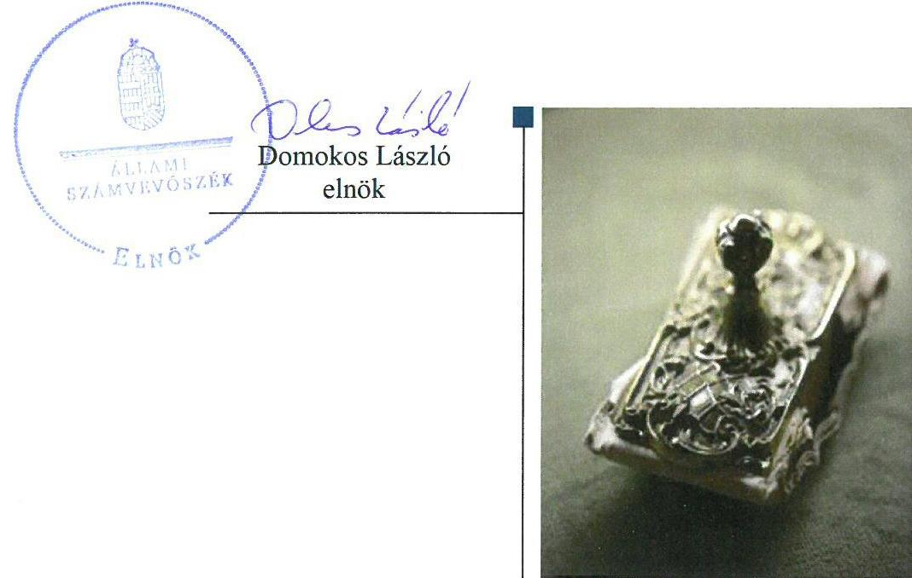
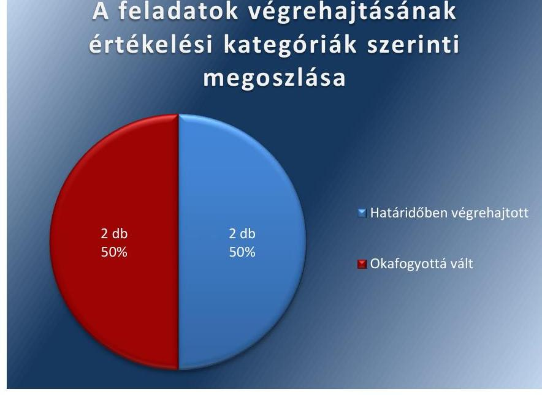

# Jelentés 

## Utóellenőrzések

Az önkormányzatok vagyongazdálkodása szabályszerűségének utóellenőrzése Budapest Főváros XXIII. kerület Soroksár Önkormányzata 2018.

---

# Jelentés 

## Utóellenőrzések

Az önkormányzatok vagyongazdálkodása szabályszerűségének utóellenőrzése Budapest Főváros XXIII. kerület Soroksár Önkormányzata
2018. 04. hó 13. nap

---

# AZ ELLENŐRZÉST FELÜGYELTE: 

DR NÉMETH ERZSÉBET felügyeleti vezető

## AZ ELLENŐRZÉST VEZETTE ÉS A VÉGREHAJTÁSÁÉRT FELELŐS:

DÉZSINÉ KIS HAJNALKA ellenőrzésvezető

## A PROGRAM ÖSSZEÁLLÍTÁSÁÉRT FELELŐS:

TÓTPÁL SZABOLCS osztályvezető

## A TÉMÁHOZ KAPCSOLÓDÓ KORÁBBI SZÁMVEVŐSZÉKI JELENTÉSEK:

- címe: Jelentés az önkormányzati vagyongazdálkodás szabályszerűségi ellenőrzéséről-Budapest Főváros XXIII. kerület Soroksár
- sorszáma: 13079

IKTATÓSZÁM: V-1318-012/2016
TÉMASZÁM: 6
ELLENŐRZÉS-AZONOSÍTÓ SZÁM: V080417

---

# TARTALOMJEGYZÉK 

■ ÖSSZEGZÉS ..... 5
■ AZ ELLENŐRZÉS CÉLJA ..... 6
■ AZ ELLENŐRZÉS TERÜLETE ..... 7
■ AZ ELLENŐRZÉS HÁTTERE, INDOKOLTSÁGA ..... 8
■ A JELENTÉS LÉNYEGES KÉRDÉSKÖRE ..... 9
■ ELLENŐRZÉS HATÓKÖRE ÉS MÓDSZEREI ..... 10
■ MEGÁLLAPÍTÁSOK ..... 12
■ MELLÉKLETEK ..... 15
I. sz. melléklet: Budapest Főváros XXIII. kerület Soroksár Önkormányzata intézkedési tervének végrehajtása. ..... 15
■ FÜGGELÉK: ÉSZREVÉTELEK ..... 17
■ RÖVIDÍTÉSEK JEGYZÉKE ..... 19

---

.

---

# ÖSSZEGZÉS 

Az utóellenőrzés megállapította, hogy Budapest Főváros XXIII. kerület Soroksár Önkormányzata az intézkedési tervben meghatározott feladatokat határidőben végrehajtotta. Az intézkedések eredményeként javult a vagyongazdálkodás szabályszerűsége és átláthatósága.

## Az ellenőrzés társadalmi indokoltsága

Az Állami Számvevőszék stratégiájában célul tűzte ki a számvevőszéki munka hasznosulásának javítását. Ezzel összhangban ellenőrzi, hogy az ellenőrzött szervezet megvalósította-e a korábbi ellenőrzései által feltárt hibák, hiányosságok és szabálytalanságok megszüntetése céljából elkészített intézkedési tervében foglaltakat. A rendszeres utóellenőrzések hozzájárulnak a szükséges intézkedések tényleges végrehajtásához, ezáltal a közpénzügyek rendezettségének javulásához.

## Főbb megállapítások, következtetések

Az Önkormányzat az ÁSZ által elfogadott intézkedési tervében meghatározott négy feladatból kettőt végrehajtott, két feladat végrehajtása jogszabályváltozás miatt okafogyottá vált.

Az Önkormányzat az intézkedési tervben meghatározott feladatoknak megfelelően a jogszabály szerint közzétette szervezeti, tevékenységi és gazdálkodási adatait továbbá a Jegyző intézkedett, hogy az ellenőrzések által feltárt szabálytalanságok megszüntetésére az illetékes vezetők határidőben készítsenek intézkedési tervet. Ennek hatására javult a vagyongazdálkodás szabályszerűsége és átláthatósága.

A Jegyző az intézkedési tervben rögzített feladatok végrehajtásáról a jogszabályi előírásoknak megfelelően vezette a nyilvántartást.

---

# AZ ELLENŐRZÉS CÉLJA 

Az ellenőrzés célja annak értékelése volt, hogy a számvevőszéki jelentésben foglalt intézkedést igénylő megállapításokkal összhangban készített intézkedési tervben meghatározott feladatokat az ellenőrzött szervezet végrehajtotta-e.

---

# **A Z ELLENŐRZÉS TERÜLETE**

## **Budapest Főváros XXIII. kerület Soroksár Önkormányzata**

Budapest Főváros XXIII. kerület Soroksár állandó lakosainak száma 2016. január 1-jén a KSH1 adata alapján 23 411 fő volt.

A 2016. évi éves költségvetési beszámoló szerint a 2016. évben az Önkormányzat2 6 052 M Ft költségvetési kiadást teljesített és 5 751 M Ft költségvetési bevétellel gazdálkodott, 2016. december 31-én 23 749 M Ft értékű eszközvagyonnal rendelkezett.

A Polgármester3 1994 óta vezeti a 12 tagú Képviselő-testületet4, amely hat állandó bizottságot hozott létre. A Jegyző5 személye nem változott az ellenőrzött időszakban.

Az ÁSZ6 2007. január 1. és a 2011. december 31. közötti időszakra vonatkozóan végezte el az Önkormányzat vagyongazdálkodása szabályszerűségének ellenőrzését és erről 2013. augusztus 28-án hozta nyilvánosságra a 13079 számú ÁSZ jelentést.

Az ellenőrzés célja annak értékelése volt, hogy az Önkormányzatnál a vagyongazdálkodási tevékenység, annak szervezeti keretei szabályozottak voltak-e, a vagyongazdálkodás törvényessége, szabályszerűsége biztosított volt-e, a vagyon értékének és összetételének változását jogszerű döntésekkel alátámasztották-e, a belső ellenőrzés elősegítette-e a vagyongazdálkodás szabályszerű működését, valamint hasznosultak-e a korábbi külső ellenőrzések által tett javaslatok.

Az ÁSZ jelentés a Jegyző részére három, a Polgármester részére egy intézkedést igénylő megállapítást tartalmazott. Ez alapján a Polgármester az ÁSZ Elnökének megküldte az Önkormányzat négy feladatot tartalmazó intézkedési tervét7.

Az ÁSZ jelentésben foglalt intézkedést igénylő megállapítások alapján készített intézkedési tervet az Állami Számvevőszék Elnöke 2014. március 31-én elfogadta.

Az utóellenőrzés a 2013. augusztus 28. és 2018. január 24. közötti ellenőrzött időszak alatt végrehajtott feladatok teljesítésének ellenőrzésére, értékelésére irányult.

---

# AZ ELLENŐRZÉS HÁTTERE, INDOKOLTSÁGA 

Az ÁSZ tv. ${ }^{8}$ 33. § (1) bekezdése értelmében a számvevőszéki jelentések intézkedést igénylő megállapításaihoz és javaslataihoz kapcsolódóan az ellenőrzött szervezet vezetője intézkedési tervet köteles összeállítani, és az Állami Számvevőszék részére megküldeni.

Az ÁSZ által befogadott intézkedési tervben foglaltak megvalósítását az ÁSZ törvény 33. § (7) bekezdésében foglaltak alapján - az Állami Számvevőszék utóellenőrzés keretében ellenőrizheti. Az utóellenőrzések keretében - az intézkedések értékelése során - az Állami Számvevőszék figyelembe veszi az ellenőrzött szervezetek működési feltételeiben, valamint a jogszabályi előírásokban bekövetkezett változásokat.

Az utóellenőrzés során az ÁSZ értékeli, hogy az érintett számvevőszéki jelentésben foglalt intézkedést igénylő megállapításokkal és javaslatokkal összhangban, az ellenőrzött szervezet által készített intézkedési tervben meghatározott feladatokat a feladatra kijelöltek végrehajtották-e.

Az intézkedések végrehajtásával az adott terület szabályszerű múködése vonatkozásában a kockázatok csökkenhetnek, azonban hosszabb távon az intézkedési tervben foglaltak végrehajtásával önmagában nem szűnnek meg, csak akkor, ha beépülnek az ellenőrzött szervezet működésébe, azokat folyamatosan karban tartják, figyelembe véve, illetve kezelve a változásokat. Emellett az intézkedések végrehajtásáig újabb kockázatok merülhetnek fel a szabályszerű működés vonatkozásában, amelyek kezelése szintén kiemelten fontos az ellenőrzött szervezet számára.

Az ellenőrzött szervezet vezetője által készített intézkedési tervekben foglalt feladatok hiányos, illetve késedelmes végrehajtása, vagy annak elmaradása a szabályszerűség és a felelős vezetői magatartás vonatkozásában kockázatot hordoz, ami azt mutatja, hogy az ellenőrzések során feltárt hibák, hiányosságok és szabálytalanságok kezelése nem kapott kellő hangsúlyt. Az utóellenőrzés során is fennálló szabálytalanságok esetén a közpénz, közvagyon veszélyeztetettségi kockázat valószínűsített hatásának értékelése további intézkedéseket vonhat maga után.

Az ellenőrzött szervezet szintjén az utóellenőrzés feltárja, hogy a szervezet az intézkedések végrehajtásával hasznosította-e a korábbi ellenőrzési jelentésben a hiányosságok megszüntetése, illetve a kockázatok kezelése érdekében megfogalmazott javaslatokat, illetve az intézkedések végrehajtása elmaradásának következtében továbbra is fennálló szabálytalanság esetén értékeli a közpénzek, közvagyon veszélyeztetettségét.

Az ÁSZ szintjén az utóellenőrzés visszacsatolást ad az ellenőrzési jelentések hasznosulásáról, az intézkedések elmaradásának, vagy részleges megvalósulásának a közpénzek, közvagyon veszélyeztetettségére gyakorolt valószínűsített hatásának értékelése, további intézkedéseket vonhat maga után.

---

# A JELENTÉS LÉNYEGES KÉRDÉSKÖRE 

Az Önkormányzat az intézkedési tervben foglaltakat az elöirt határidőben végrehajtotta-e?

---

# ELLENŐRZÉS HATÓKÖRE ÉS MÓDSZEREI 

## Az ellenőrzés típusa

Megfelelőségi ellenőrzés.

## Az ellenőrzött időszak

Az utóellenőrzés alapját képező ÁSZ jelentés közzétételének napjától (2013. augusztus 28.) az ellenőrzésről szóló kiértesítő levél keltének napjáig (2018.01.24.) tartó időszak.

## Az ellenőrzés tárgya

Az ÁSZ tv. 2011. július 1-jei hatálybalépését követően a számvevőszéki jelentésben foglalt intézkedést igénylő megállapításokkal összhangban - az Önkormányzat által - készített Intézkedési tervben foglaltak végrehajtásának ellenőrzése.

## Az ellenőrzött szervezet

Budapest Főváros XXIII. kerület Soroksár Önkormányzata, Budapest Főváros XXIII. kerület Soroksári Polgármesteri Hivatal.

## Az ellenőrzés jogalapja

Az ellenőrzés jogszabályi alapját az ÁSZ tv. 33. § (7) bekezdése képezi.

## Az ellenőrzés módszerei

Az ellenőrzést az ellenőrzött időszakban hatályos jogszabályok, az ellenőrzés szakmai szabályai, a jelen ellenőrzésre irányadó ÁSZ módszertanok, az ellenőrzési programban foglalt értékelési szempontok szerint, végeztük.

Az ellenőrzés ideje alatt az Önkormányzattal történő kapcsolattartást az ÁSZ SZMSZ²-ének vonatkozó előírásai alapján biztosítottuk.

Az utóellenőrzés megállapításait az ÁSZ rendelkezésére álló, valamint az ÁSZ adatbekérése szerint, az Önkormányzat által rendelkezésre bocsátott dokumentumok alapozták meg.

Az ellenőrzési bizonyítékként felhasználható adatforrások közé tartoztak egyrészt az ellenőrzési program részletes szempontjainál felsorolt

---

adatforrások, másrészt minden - az ellenőrzés folyamán feltárt, az ellenőrzés szempontjából információt tartalmazó - dokumentum.

Az intézkedési tervekben előírt feladatokat azok végrehajthatósága, illetve végrehajtása szempontjából az alábbiak szerint értékeltük:
"határidőben végrehajtott" a feladat, ha a teljesítés dokumentáltan, az intézkedési tervben előírt határidőben és tartalommal megtörtént;
"határidőn túl végrehajtott" a feladat, ha annak teljesítése az intézkedési tervben meghatározott módon, de az előírt határidőn túl történt meg;
"részben végrehajtott" a feladat, ha végrehajtása teljes körűen az intézkedési tervben előírt módon nem történt meg;
"nem végrehajtott" a feladat, ha a végrehajtás nem történt meg, vagy amennyiben a teljesítést nem dokumentálták;
"okafogyottá vált" a feladat, ha végrehajtására - meghatározott esemény bekövetkezése, továbbá külső körülmény, a működést érintő feltétel változása miatt - már nincs szükség, illetve lehetőség, és egyértelműen megállapítható, hogy az intézkedést szükségessé tevő körülmény a jövőben nem fordulhat elő;
"nem időszerü" az a feladat, amelynek ellenőrzési időszakon belüli végrehajtására azért nem került (kerülhetett) sor, mert az intézkedés alapjául szolgáló esemény nem következett be, de annak jövőbeni előfordulása lehetséges, a végrehajtása nem volt esedékes, vagy a végrehajtás határideje még nem járt le.
Az ellenőrzés lefolytatásához az Önkormányzat a tanúsítványok elektronikus kitöltésével, valamint az ÁSZ által kért dokumentumok elektronikus megküldésével szolgáltatott adatokat, amelyek valódiságát és teljes körűségét az ellenőrzött szervezet vezetője által tett teljességi és hitelességi nyilatkozat igazolja. Az így rendelkezésre bocsátott adatok, információk kontrollja az ellenőrzés keretében megtörtént.

---

# MEGÁLLAPÍTÁSOK 

## Az Önkormányzat az intézkedési tervben foglaltakat az előírt határidőben végrehajtotta-e?

Összegző megállapítás

Az Önkormányzat az intézkedési tervben szereplő feladatokat végrehajtotta, két feladata pedig okafogyottá vált. A Jegyző az intézkedési tervben meghatározott feladatok végrehajtásáról az előírásoknak megfelelően vezette a nyilvántartást.

Az Önkormányzat az intézkedési tervében meghatározott feladatok közül kettőt határidőben végrehajtott, két feladat végrehajtása okafogyottá vált.

A feladatokat, határidőket, megjelölt felelősöket és a feladatok végrehajtását az I. sz. melléklet mutatja be.

A Jegyző gondoskodott az intézkedési tervben meghatározott feladatok végrehajtásának Bkr. ${ }^{10}$ szerinti nyilvántartásáról.

Az Önkormányzat intézkedési tervében vállalt feladatok végrehajtását az 1. ábra szemlélteti.

1. ábra

A feladatok végrehajtásának értékelési kategóriák szerinti megoszlása

Fornás: ÁSZ

---

# HATÁRIDŐBEN VÉGREHAJTOTT FELADATOK: 

$\qquad$ 1. Az Önkormányzat az intézkedési tervnek és a jogszabálynak megfelelően közzétette honlapján a szervezeti, a tevékenységi, valamint a gazdálkodási adatait.
$\qquad$ 2. A Jegyző az intézkedési tervnek megfelelően, körlevélben hívta fel a Polgármesteri Hivatal ${ }^{11}$ szervezeti egységei, az intézmények, valamint a gazdasági társaságok vezetőinek figyelmét, hogy az intézkedési terv készítési kötelezettségüknek határidőben tegyenek eleget.

## OKAFOGYOTTÁ VÁLT FELADATOK:

$\qquad$ 3. A jogszabályi környezet változása miatt, a víziközmű vagyon önkormányzati tulajdonának rendezésére vonatkozó feladat végrehajtása okafogyottá vált, mivel az új jogszabályok alapján a víziközmű 2013. január 1-én az ivóvíz-ellátásért felelős Fővárosi Önkormányzat tulajdonába került.
$\qquad$ 4. Az Önkormányzat és a Magyar Állam között létrejött szerződés szerint, az Állam az adósságkonszolidáció keretében átvállalta az adós Önkormányzat hiteltartozását. A hitelszerződés módosítása a jogszerű ügyleti biztosíték kijelölésére okafogyottá vált.

---

.

---

# MELLÉKLETEK

- I. SZ. MELLÉKLET: BUDAPEST FÖVÁROS XXIII. KERÜLET SOROKSÁR ÖNKORMÁNYZATA INTÉZKEDÉSI TERVÉNEK VÉGREHAJTÁSA

|  1. | Intézkedési terv alapján elvégzendő feladat | Az intézkedési tervben meghatározott határidő | Az intézkedési tervben meghatározott felelős 3. | Az intézkedési tervben meghatározott feladat végrehajtása  |
| --- | --- | --- | --- | --- |
|  1. |  | 2. | 3. | 4.  |
|  Határidőben végrehajtott feladatok |  |  |  |   |
|  1. | „Az információs önrendelkezési jogról és az információszabadságról szóló 2011. évi CXII. törvény 1. számú mellékletében meghatározott adatok közzététele." | Végrehajtva | Pénzügyi osztályvezető | Az Önkormányzat honlapján az Infotv. ${ }^{12}$ 1. mellékletében szereplő általános közzétételi lista szerinti szerkezetben elérhetők az Önkormányzat I. Szervezeti, személyzeti adatai, II. Tevékenységre, működésre vonatkozó adatai és III. Gazdálkodási adatai.  |
|  2. | „Körlevél készítése az ellenőrzöttek tájékoztatására az intézkedési terv elkészítési határidejének betartására vonatkozóan." | 2013. október 15 | Belső ellenőrzési vezető | A Jegyző a 2013. október 7-én kelt körlevelében a Polgármesteri Hivatal szervezeti egységei, költségvetési intézményei valamint gazdasági társaságai vezetőinek figyelmét felhívta a Bkr. 28.§ c) pontjában előírt intézkedési terv készítési kötelezettség 45.§ (3) bekezdésben meghatározott határidőben történő teljesítésére.  |
|  Okafogyottá vált feladatok |  |  |  |   |
|  3. | „Felvenni a kapcsolatot a Fővárosi Vízmúvek Zrt-vel, hogy a vagyon tulajdonjogának rendezése megtörténjen." | 2013. október 15. | Beruházási osztályvezető | A jogszabályi környezet változása miatt az intézkedési terv alapján elvégzendő feladat végrehajtása okafogyottá vált. A Vksztv. ${ }^{13}$ 79. § (1) bekezdésében foglaltak alapján, a nemzeti vagyonba tartozó víziközmű 2013. január 1-jén az ellátásért felelős tulajdonába került. Az ivóvíz-ellátás a Mötv. ${ }^{14}$ 23. § (1) és (4) bekezdéseiben foglaltak szerint a fővárosi önkormányzat ${ }^{15}$ feladata, így az érintett víziközmű tulajdonjoga a fővárosi önkormányzaté.  |
|  4. | „Felvenni az érintett bankkal a kapcsolatot és kezdeményezni a hitelszerződés módosítását a jogszerű ügyleti biztosítékok kijelölésével kapcsolatban." | 2014. március 31. | Pénzügyi osztályvezető | A 2014. évi költségvetési törvény ${ }^{16}$ 67.§ (1) bekezdése alapján, az adósságkonszolidáció keretében a Magyar Állam szerződésben ${ }^{17}$ átvállalta az Önkormányzat UniCredit Bank Hungary Zrt. felé fennálló hiteltartozását 2014. február 14én, ennek eredményeként a feladat végrehajtása okafogyottá vált.  |

---

.

---

# FÜGGELÉK: ÉSZREVÉTELEK 

A jelentéstervezetet a Számvevőszék 15 napos észrevételezésre megküldte az ellenőrzött szervezetek vezetőinek az ÁSZ tv. 29. §* (1) bekezdése előírásának megfelelően.

Budapest Főváros XXIII. kerület Soroksár Önkormányzatának polgármestere, illetve Budapest Főváros XXIII. kerület Soroksár Polgármesteri Hivatal jegyzője a jelentéstervezet megállapításaira nem tett észrevételt.

[^0]
[^0]:    * 29. § (1) Az Állami Számvevőszék az ellenőrzési megállapításait megküldi az ellenőrzött szervezet vezetőjének vagy az általa megbízott személynek, és annak, akinek személyes felelősségét állapította meg.
    (2) Az ellenőrzött szervezet vezetője és a felelősként megjelölt személy az ellenőrzés megállapításaira tizenöt napon belül írásban észrevételt tehet.
    (3) Az Állami Számvevőszék az észrevételre a beérkezésétől számított harminc napon belül írásban válaszol. A figyelembe nem vett észrevételeket köteles a jelentésben feltüntetni, és megindokolni, hogy azokat miért nem fogadta el.

---

.

---

# RÖVIDÍTÉSEK JEGYZÉKE 

${ }^{1}$ KSH
${ }^{2}$ Önkormányzat
${ }^{3}$ Polgármester
${ }^{4}$ Képviselő-testület
${ }^{5}$ Jegyző
${ }^{6}$ ÁSZ
${ }^{7}$ intézkedési terv
${ }^{8}$ ÁSZ tv.
${ }^{9}$ ÁSZ SZMSZ
${ }^{10}$ Bkr.
${ }^{11}$ Polgármesteri Hivatal
${ }^{12}$ Infotv.
${ }^{13}$ Vksztv.
${ }^{14}$ Mötv.
${ }^{15}$ fővárosi önkormányzat
${ }^{16}$ 2014. évi költségvetési törvény
${ }^{17}$ szerződés

Központi Statisztikai Hivatal Magyarország Közigazgatási Helynévkönyve (2016. január 1.)
Budapest Főváros XXIII. Kerület Önkormányzata
Budapest Főváros XXIII. Kerület Önkormányzat Polgármestere
Budapest Főváros XXIII. Kerület Önkormányzat Képviselő-testülete
Budapest Főváros XXIII. Kerület Önkormányzat Polgármesteri Hivatal Jegyzője
Állami Számvevőszék
Budapest Főváros XXIII. kerület Soroksár Önkormányzata 2013.12.19-én elkészített intézkedési terve
az Állami Számvevőszékről szóló 2011. évi LXVI. törvény
az Állami Számvevőszék Szervezeti és Müködési Szabályzata (Hatályos
2018.01.01-től)
a költségvetési szervek belső kontrollrendszeréről és belső ellenőrzéséről szóló 370/2011. (XII. 31.) Korm. rendelet
Budapest Főváros XXIII. Kerület Önkormányzat Polgármesteri Hivatala
az információs önrendelkezési jogról és az információszabadságról szóló 2011. évi CXII. törvény
a víziközmű-szolgáltatásról szóló 2011. évi CCIX. törvény (hatályos: 2011. december 31-től, a 79. § hatályos: 2012. július 15-től)
Magyarország helyi önkormányzatairól szóló 2011. évi CLXXXIX. törvény
Budapest Főváros Önkormányzata
Magyarország 2014. évi központi költségvetéséről szóló 2013. évi CCXXX. törvény 2014. február 14-én megkötött tartozásátvállalási szerződés a Magyar Állam, az Önkormányzat és a UniCredit Bank Hungary Zrt között

---

# ÁLLAMI SZÁMVEVŐSZÉK 

1052 Budapest, Apáczai Csere János utca 10.
Levélcím: 1364 Budapest 4. Pf. 54
Telefon: +36 14849100 Telefax: +36 14849200
www.asz.hu