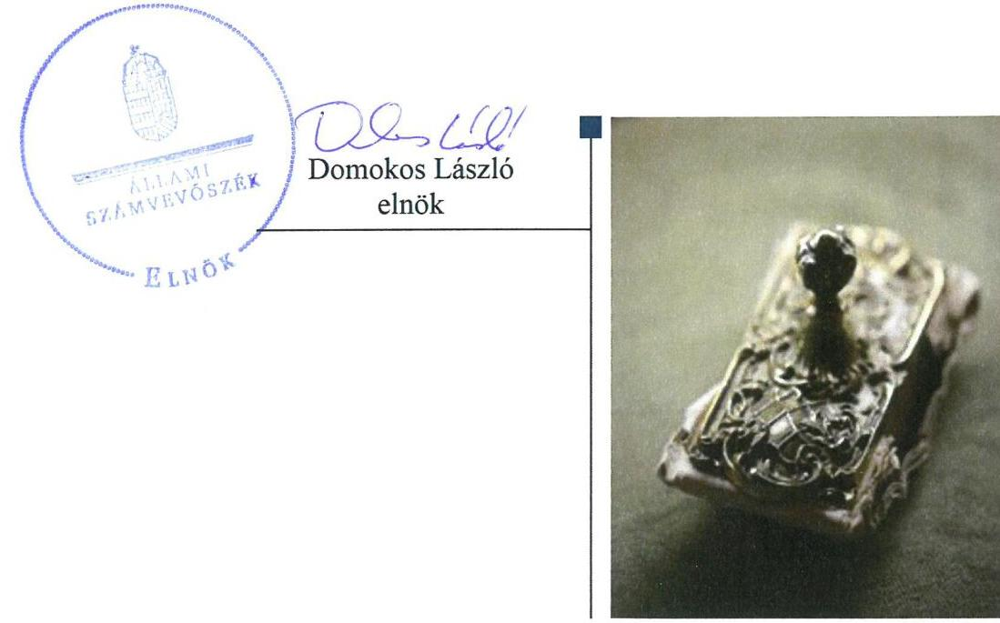
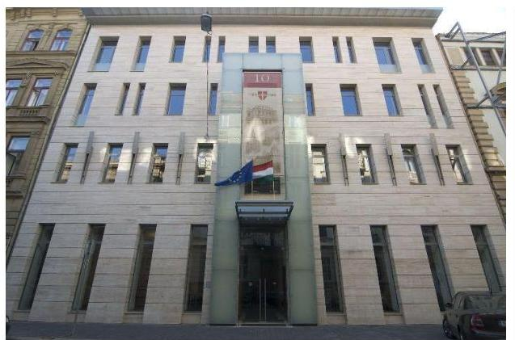
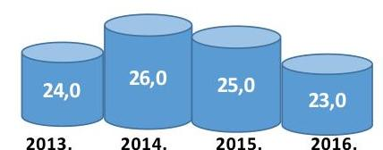
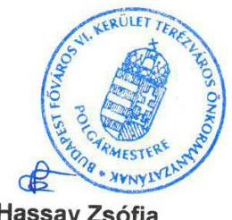
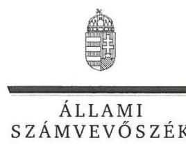
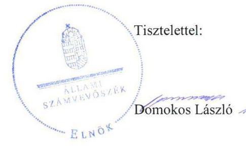
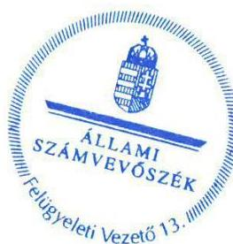
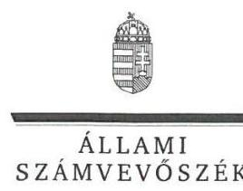
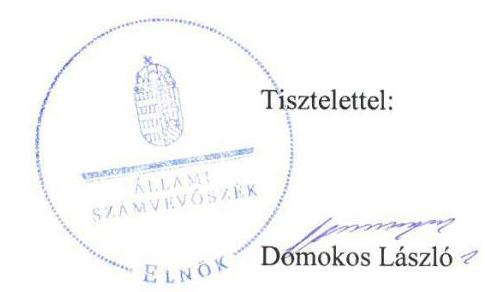
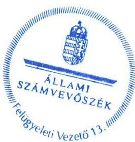

# Jelentés 

## Az önkormányzatok gazdasági társaságai

Az önkormányzatok többségi tulajdonában lévő gazdasági társaságok gazdálkodásának ellenőrzése - Terézvárosi Kulturális Közhasznú Nonprofit Zrt.
2018.

---

# Jelentés 

## Az önkormányzatok gazdasági társaságai

Az önkormányzatok többségi tulajdonában lévő gazdasági társaságok gazdálkodásának ellenőrzése - Terézvárosi Kulturális Közhasznú Nonprofit Zrt.
2018. 06. hó 26. nap

---

# AZ ELLENŐRZÉST FELÜGYELTE:

- **KLINGA LÁSZLÓ** felügyeleti vezető
- **AZ ELLENŐRZÉST VEZETTE ÉS A VÉGREHAJTÁSÁÉRT FELELŐS:**
  - **MODER BEATRIX** ellenőrzésvezető
  - **A PROGRAM ÖSSZEÁLLÍTÁSÁÉRT FELELŐS:**
    - **TÓTPÁL SZABOLCS** osztályvezető

**IKTATÓSZÁM:** EL-0569-015/2018

**TÉMASZÁM:** 2447

**ELLENŐRZÉS-AZONOSÍTÓ SZÁM:** V079314

Jelentéseink az Országgyűlés számítógépes hálózatán és az Interneta a www.asz.hu címen is olvashatóak.

---

# TARTALOMJEGYZÉK 

- ÖSSZEGZÉS ..... 5
- AZ ELLENŐRZÉS CÉLJA ..... 6
- AZ ELLENŐRZÉS TERÜLETE ..... 7
- AZ ELLENŐRZÉS HÁTTERE, INDOKOLTSÁGA ..... 8
- A JELENTÉS LÉNYEGES KÉRDÉSKÖREI ..... 9
- AZ ELLENŐRZÉS HATÓKÖRE ÉS MÓDSZEREI ..... 10
- MEGÁLLAPÍTÁSOK ..... 12
- JAVASLATOK ..... 15
- MELLÉKLETEK ..... 17
I. sz. melléklet: Értelmező szótár ..... 17
- FÜGGELÉK: ÉSZREVÉTELEK ..... 19
- RÖVIDÍTÉSEK JEGYZÉKE ..... 33

---

.

---

# ÖSSZEGZÉS 

A Terézvárosi Kulturális Közhasznú Nonprofit Zrt. feletti tulajdonosi jogokat Budapest Főváros VI. kerület Terézváros Önkormányzata szabályszerűen gyakorolta. A Társaság szabályozottsága, vagyongazdálkodása, valamint a bevételek és ráfordítások elszámolása nem felelt meg a jogszabályi előirásoknak, így az elszámoltathatóságot nem biztositotta. A közérdekü adatait a Társaság közzétette, ezáltal a müködés átláthatóságát biztositotta.

## Az ellenőrzés társadalmi indokoltsága

Magyarországon az intézmény-centrikus közfeladat-ellátás jellemző, de egyre jelentősebb a költségvetésen kívüli feladatellátás térnyerése. Helyi szinten ennek legfontosabb szereplői az önkormányzati tulajdonban lévő gazdasági társaságok, amelyeknek ellenőrzése kiemelten fontos a közfeladat ellátása és a közvagyon megőrzése, megóvása érdekében. Ezért alapvető követelmény, hogy a társaságok gazdálkodása, múködése szabályszerű és átlátható legyen. Az ellenőrzés rendet, a rend értéket teremt.

A Terézvárosi Kulturális Közhasznú Nonprofit Zrt. ellenőrzésére az általa kezelt önkormányzati vagyon nagyságára tekintettel került sor az Állami Számvevőszék Stratégiájában megfogalmazott célokkal összhangban.

## Főbb megállapítások, következtetések

Az Önkormányzat a Társaság feletti tulajdonosi joggyakorlás kereteit a jogszabályoknak megfelelően kialakította, tulajdonosi jogait szabályszerűen gyakorolta, a Társaság feladatellátásához kapcsolódó rendeletalkotási kötelezettségnek eleget tett, a jogszabályok által az Alapító kizárólagos hatáskörébe tartozó döntéseket meghozta. A Társaság tevékenységének folyamatos nyomon követését azonban nem biztosították, a Társaság számára a közszolgáltatási és vagyonkezelési szerződésekben előírt évközi adatszolgáltatási kötelezettségek teljesítését nem kérték számon.

A Társaság gazdálkodásának szabályozottsága nem volt megfelelő, mivel eszközök és források értékelési szabályzattal, valamint számlarenddel nem rendelkezett, így a beszámolót megalapozó könyvvezetés szabályrendszerét nem alakította ki, a könyvvezetési rendszert nem részletezte oly módon, hogy a bevételek és ráfordítások jogszabályokban előírt elkülönített nyilvántartását biztosítsa. A szabályozás hiányosságai következtében a bevételek és ráfordítások elszámolása nem volt szabályszerű. A Társaság vagyongazdálkodása nem felelt meg a jogszabályi előírásoknak, az egyszerűsített éves beszámolók az eszközök és források értékéről nem mutattak megbízható képet, mivel a mérlegeket leltárral nem támasztották alá.

A Társaság nem alakította ki a múködésének, tevékenységének nyomon követését biztosító rendszert, az operatív tevékenységek feletti független kontroll hiányában nem biztosították, hogy a gazdálkodási tevékenység megfeleljen a szabályozottság, szabályszerűség követelményének.

A Társaság a közérdekű adatok közzétételével biztosította a gazdálkodás nyilvánosságát, azonban a közzététel rendjét szabályzatban nem rögzítették.

---

# AZ ELLENŐRZÉS CÉLJA 

AZ ELLENŐRZÉS CÉLJA annak értékelése volt, hogy az Önkormányzat vagyongazdálkodási tevékenysége során szabályszerűen gyakorolta-e a tulajdonosi jogait. A Társaság szabályozottsága, gazdálkodása és vagyongazdálkodási tevékenysége, bevételeinek és ráfordításainak elszámolása megfelelt-e a jogszabályi és tulajdonosi előírásoknak. Értékeltük, hogy a Társaság gazdálkodásának a kormányzati szektor hiányára és az államadósságra befolyással bíró elemei a jogszabályi előírásoknak megfeleltek-e.

---

# **A2 ELLENŐRZÉS TERÜLETE**

## **Budapest Főváros VI. kerület Terézváros Önkormányzata és a kizárólagos tulajdonában lévő Terézvárosi Kulturális Közhasznú Nonprofit Zrt.**

### **Budapest Főváros VI. kerület Terézváros Önkormányzata**

**2. ábra**

**A foglalkoztatottak átlagos statisztikai létszáma (fő)**

*Forrás: A Társaság 2013-2016. évi kiegészítő melléklete*

### **Budapest Főváros VI. kerület Terézváros Önkormányzata**

**2. ábra**

**A Társaság a közfeladatát közhasznú szervezetként, Közszolgáltatási szerződés4 keretében látta el. A Közszolgáltatási szerződésben foglalt feladatok ellátására, valamint az általános működési költségek finanszírozására a Társaság 2013-ban 166,6 M Ft, 2014-ben 198,9 M Ft, 2015-ben 209,5 M Ft, 2016-ban 240,5 M Ft önkormányzati támogatásban részesült.**

**Az Önkormányzat a közfeladat ellátásához szükséges vagyont Vagyonkezelési szerződés1-25 útján, ingyenesen bocsátotta a Társaság rendelkezésére.**

**A Társaság 2013-2014. években veszteséges volt, amelyre a korábbi években képzett eredménytartalék biztosított fedezetet. A veszteségből 2013-ban 4,4 M Ft, 2014-ben 3,7 M Ft a közhasznú tevékenységhez kapcsolódott.**

**Az ellenőrzött időszakban a polgármester6, a jegyző7 és a Társaság vezérigazgatójának8 személye nem változott. A Társaság más gazdasági társaságban tulajdonosi részesedéssel nem rendelkezett. A Társaság a Számv. tv.9 előírása alapján önköltség-számítási szabályzat készítésére nem volt kötelezett.**

**A Társaság az NGM közlemények10, alapján 2013. június 28-ától kormányzati szektorba sorolt szervezetnek minősült. A Társaságnak Gst.11 szerinti adósságot keletkeztető ügylete nem volt.**

---

# AZ ELLENŐRZÉS HÁTTERE, INDOKOLTSÁGA 

AZ ÖNKORMÁNYZATOK TÖBBSÉGI TULAJDONÁBAN ÁLLÓ GAZDASÁGI TÁRSASÁGOK ellenőrzése kiemelten fontos a vagyon megőrzése, megóvása érdekében. Alapvető követelmény, hogy gazdálkodásuk, működésük szabályszerű, és az általuk szolgáltatott adatok megbízhatóak legyenek. A feladatellátás költségeinek, ráfordításainak alakulása a lakosság széles rétegét érinti.

Az ÁSZ ${ }^{12}$ ellenőrzései feltárhatják, hogy az önkormányzat a feladatellátásához rendelt vagyon működtetését a tulajdonostól elvárható gondossággal végezte-e, a feladatot ellátó gazdasági társasággal a létesítő okiratban, szolgáltatási szerződésben foglaltakat betartatta-e, a társaság betartotta-e.

Az ellenőrzés eredményeképp meghatározhatóvá válnak a költségvetési hiányt befolyásoló szervezetek kockázatai, lehetővé válik ezen kockázatok csökkentése. Az ellenőrzés rávilágíthat arra, a hogy a gazdasági társaság a vagyon használatával biztosította-e a szolgáltatás folytatásának feltételeit, az önkormányzat tulajdonosi felügyelete hozzájárult-e a szabályszerű gazdálkodáshoz és feladatellátáshoz. A megállapítások alapján megfogalmazott számvevőszéki javaslatok hasznosítása elősegítheti a meglévő hibák megszüntetését. A jó gyakorlatok bemutatásával az ÁSZ hozzájárulhat a követendő megoldások megismertetéséhez, terjesztéséhez.

---

# A JELENTÉS LÉNYEGES KÉRDÉSKÖREI 

1. Az Önkormányzat tulajdonosi joggyakorlása szabályszerű volt-e?
2. A Társaság szabályozottsága, bevételeinek, ráfordításainak elszámolása és vagyongazdálkodási tevékenysége szabályszerű volt-e?

---

# AZ ELLENŐRZÉS HATÓKÖRE ÉS MÓDSZEREI 

## Az ellenőrzés típusa

Megfelelőségi ellenőrzés.

## Az ellenőrzött időszak

Az ellenőrzött időszak 2013. január 1-jétől 2016. december 31-ig tartott.

## Az ellenőrzés tárgya

Budapest Főváros VI. kerület Terézváros Önkormányzata kizárólagos tulajdonában lévő Terézvárosi Kulturális Közhasznú Nonprofit Zrt. feletti tulajdonosi joggyakorlása, valamint a Terézvárosi Kulturális Közhasznú Nonprofit Zrt. gazdálkodásának szabályozottsága és szabályszerűsége.

Az ellenőrzés kiterjed minden olyan körülményre és adatra, amely az ÁSZ jogszabályban meghatározott feladatainak teljesítéséhez, valamint a program végrehajtása folyamán felmerült újabb összefüggések feltárásához szükséges.

## Az ellenőrzött szervezet

Budapest Főváros VI. kerület Terézváros Önkormányzata
$\longrightarrow$ Terézvárosi Kulturális Közhasznú Nonprofit Zrt.

## Az ellenőrzés jogalapja

Az ellenőrzés jogszabályi alapját az ÁSZ tv. ${ }^{13} 1$. § (3) bekezdése és 5. § (3)-(4)-(5) bekezdései képezték.

## Az ellenőrzés módszerei

Az ellenőrzést a nemzetközi standardokat irányadónak tekintve az ellenőrzési program ellenőrzési kérdései, az ellenőrzött időszakban hatályos jogszabályok, az ellenőrzés szakmai szabályok és módszertanok figyelembe vételével végeztük.

Az ellenőrzés ideje alatt az ellenőrzött szervezettel történő kapcsolattartást az ÁSZ Szervezeti és Müködési Szabályzatának vonatkozó előírásai alapján biztosítottuk.

---

Az ellenőrzési kérdések megválaszolásához szükséges bizonyítékok megszerzése a következő ellenőrzési eljárások alkalmazásával történt: megfigyelés, kérdésfeltevés (információkérés), összehasonlítás, valamint elemzés. Az ellenőrzési bizonyítékként felhasználható adatforrások közé tartoznak egyrészt az ellenőrzési programban felsorolt adatforrások, másrészt adatforrás minden - az ellenőrzés során - feltárt, az ellenőrzés szempontjából információkat tartalmazó dokumentum.

Az ellenőrzést a kérdésekre adott válaszok kiértékelésével, valamint a megjelölt adatforrások, a csatolt tanúsítványok felhasználásával, továbbá az adott időszakban hatályos jogszabályok figyelembe vételével folytattuk le.

A bevételek és ráfordítások elszámolása, valamint a vagyonnyilvántartás terén a szabályszerű múködést véletlen mintavétellel és irányított kiválasztással ellenőriztük. A jogszabályoknak és a belső előírásoknak megfelelőnek, azaz szabályszerűnek tekintettük az adott területet, amennyiben a minta ellenőrzésének eredménye alapján 95\%-os bizonyossággal a teljes sokaságban a hibaarány kisebb volt, mint 10\%, nem megfelelőnek értékeltük, ha a hibaarány a 10\%-ot meghaladta. A ráfordítások elszámolására és a vagyonnyilvántartásra vonatkozó véletlen mintavételt kockázati alapú kiválasztással egészítettük ki, amelynek során évente a három legnagyobb összegű tételt választottuk ki.

---

# 1. Az Önkormányzat tulajdonosi joggyakorlása szabályszerű volt-e? 

Összegző megállapítás

A tulajdonosi joggyakorlás kereteinek kialakítása, és a tulajdonosi jogok gyakorlása szabályszerű volt.

A TULAJDONOSI JOGGYAKORLÁS SZABÁLYAIT az Önkormányzat a Vagyongazdálkodási rendelet ${ }_{1-2}{ }^{14}$-ben és a Létesítő okirat ${ }_{1-7}{ }^{15}$-ben a Gt. ${ }^{16}$ és a Ptk. ${ }^{17}$ előírásaival összhangban rögzítette.

A Létesítő okirat ${ }_{1-7}$-ben meghatározták az Alapító ${ }^{18}$ kizárólagos hatáskörébe tartozó feladatokat, valamint a Taktv. ${ }^{19}$ előírásának megfelelően három tagból álló $\mathrm{FB}^{20}$ létrehozásáról rendelkeztek. A Társaság a Számv. tv.ben foglaltak alapján könyvvizsgálatra nem volt kötelezett, de az Alapító a Létesítő okirat ${ }_{1-7}$-ben állandó könyvvizsgálót is kijelölt, biztosítva a tulajdonosi kontroll müködését.

A Gazdasági program ${ }_{1-2}{ }^{21}$-ben a Mötv.-ben foglaltakkal összhangban meghatározták a Társaság feladatellátásához kapcsolódó középtávú fejlesztési elképzeléseket.

Rendeletalkotási kötelezettségének az Önkormányzat a Közműv. tv. ${ }^{22}$ előírásai alapján a Közművelődési rendelet ${ }^{23}$ megalkotásával eleget tett. A rendeletben rögzítették az Önkormányzat közművelődési feladatait, a feladatok ellátásának és finanszírozásának alapelveit és szervezeti kereteit. A Társasággal kötött Közszolgáltatási szerződésben meghatározták az ellátandó feladatok körét, a Társaság beszámolási, elszámolási feladatait.

A VAGYONKEZELÉSI SZERZŐDÉS ${ }_{1-2}$-ben a Mötv. előírásainak megfelelően rögzítették a vagyonkezelői jog gyakorlásának, valamint a vagyonkezelés ellenőrzésének részletes szabályait, a vagyon működtetésének, állaga védelmének, értéke megőrzésének, gyarapításának követelményeit és a vagyonkezelésre vonatkozó nyilvántartási, adatszolgáltatási, elszámolási kötelezettséget.

A Javadalmazási szabályzatot ${ }^{24}$ a Taktv.-ben előírtaknak megfelelően az Alapító megalkotta.

A TULAJDONOSI JOGOK GYAKORLÁSA során az Alapító a Gt., illetve a Ptk. előírásainak megfelelően jelölte ki az FB tagjait és a könyvvizsgálót, valamint az FB és a könyvvizsgáló jelentéseinek birtokában elfogadta a Társaság éves számviteli beszámolóit.

Az Alapító a Közszolgáltatási szerződésben és a Vagyonkezelési szerződés ${ }_{2}$-ben előírt évközi beszámolási kötelezettség teljesítését a Társaságon nem kérte számon, így a Társaság tevékenységének folyamatos nyomon követését nem biztosította. Az Áht. ${ }^{25}$-ban foglalt lehetőséggel élve, az Önkormányzat belső ellenőrzése az ellenőrzött időszakban - a belső ellenőr-

---

zés kockázatelemzései alapján - a Társaságnál egy alkalommal végzett utóellenőrzést. A Társaság gazdálkodását érintő belső ellenőrzés során intézkedési kötelezettséget nem határoztak meg.

# 2. A Társaság szabályozottsága, bevételeinek, ráfordításainak elszámolása és vagyongazdálkodási tevékenysége szabályszerű volt-e? 

Összegző megállapítás

### 2.1. számú megállapítás

A Társaság szabályozottsága, bevételeinek és ráfordításainak elszámolása, valamint vagyongazdálkodási tevékenysége nem volt szabályszerű.

A Társaság gazdálkodásának szabályozottsága nem felelt meg a jogszabályi előírásoknak, a bevételek és ráfordítások elszámolása nem volt szabályszerű, az elszámoltathatóságot nem biztosította.

A GAZDÁLKODÁS SZABÁLYOZOTTSÁGA nem felelt meg a jogszabályi követelményeknek.

A Társaság a Számviteli politika ${ }^{26}$ keretében a Számv. tv. 14. § (5) bekezdés b) pontjában foglaltak ellenére az ellenőrzött években nem készítette el az eszközök és források értékelési szabályzatát, valamint a 2013-2014. évekre vonatkozóan a Számv. tv. 14. § (5) bekezdés d) pontjában előírt pénzkezelési szabályzatot.

A Társaság a 2013-2016. években a Számv. tv. 161. § (1) bekezdés előírása ellenére nem rendelkezett számlarenddel, így a szabályszerű könyvvezetés feltételeit nem biztosította.

## A TÁRSASÁG BEVÉTELEINEK ÉS RÁFORDÍTÁSAI-

NAK ELSZÁMOLÁSA nem volt szabályszerű, mivel a Mötv. 109. § (7) bekezdése ellenére a vagyonkezelésébe vett vagyon használatából, működtetéséből származó bevételeit, illetve közvetlen költségeit és ráfordításait - a saját vagyonnal folytatott vállalkozási tevékenységéből származó bevételeitől, költségeitől és ráfordításaitól egyértelműen elhatárolható módon - elkülönítetten nem tartotta nyilván. A Társaság a könyvvezetési rendszerét a Számv. tv. 161/A. § (2) bekezdésében foglaltak ellenére - a vagyonkezelésbe vett vagyonhoz kapcsolódóan - nem részletezte tovább oly módon, hogy a Mötv. 109. § (7) bekezdésében meghatározott adatok rendelkezésre álljanak.

## 2.2. számú megállapítás

A Társaság vagyongazdálkodása nem felelt meg a jogszabályi rendelkezéseknek.

A VAGYON NYILVÁNTARTÁSA nem volt szabályszerű, mert a Számv. tv. 52. § (2) bekezdésében előírtak ellenére a tárgyi eszközök üzembe helyezését hitelt érdemlő módon nem dokumentálták.

A Társaság a 2013. évi mérlegében a Számv. tv. 23. § (2) bekezdésében foglaltak ellenére az eszközök között a vagyonkezelésbe vett eszközöket nem mutatta ki, valamint a 42. § (5) bekezdésében foglaltak ellenére az

---

egyéb hosszú lejáratú kötelezettségek között nem mutatta ki a vagyonkezelésbe vételhez kapcsolódó kötelezettséget. A 2014. évi mérlegében kimutatott vagyonkezelt eszközöket a kiegészítő mellékletben - legalább mérlegtételek szerinti megbontásban - nem szerepeltette.

# A SZÁMVITELI BESZÁMOLÓK MÉRLEGÉT a 

2013-2016. években a Számv. tv. 69. § (1) bekezdésében előírtaknak megfelelő leltárral nem támasztották alá. A Számv. tv. 69. § (2) bekezdésében előírtak ellenére a főkönyvi könyvelés és az analitikus nyilvántartás adatai közötti egyeztetést az immateriális javak, tárgyi eszközök, készletek, pénzeszközök és hosszú lejáratú kötelezettségek mérlegsorok vonatkozásában nem végezték el. A szabálytalanságok ellenére a könyvvizsgáló a Társaság 2013-2016. évi beszámolóit korlátozás nélküli hitelesítő záradékkal látta el.

A VAGYONKEZELT ESZKÖZÖK PÓTLÁSÁRA a Társaság a 2014-2016. években - az eszközök után elszámolt 56,8 M Ft értékcsökkenéssel szemben - 24,7 M Ft-ot fordított. A tulajdonosi joggyakorló a Mötv. 109. § (6) bekezdésében biztosított lehetőséggel élve a fennmaradó 32,1 M Ft visszapótlási kötelezettséget a Társaság kérelme alapján elengedte.
2.3. számú megállapítás

A Társaság a jogszabályokban előírt tervezési, beszámolási és közzétételi kötelezettségét szabályszerűen teljesítette, azonban a tevékenységek nyomon követését biztosító rendszert nem alakított ki.

AZ ÉVES ÜZLETI TERVEKET a Társaság a Létesítő okirat ${ }_{1-7}$-ben rögzítetteknek megfelelően elkészítette, azokat az Alapító határozattal elfogadta.

AZ ÉVES BESZÁMOLÓK, közhasznúsági mellékletek, könyvvizsgálói jelentések közzétételét és letétbe helyezését a Társaság - az Alapító jóváhagyását követően - a Számv. tv. előírásainak megfelelően, határidőben teljesítette. A 2015-2016. években elért pozitív eredményt a Civil tv. ${ }^{27}$ és a Létesítő okirat ${ }_{1-7}$ előírásait betartva eredménytartalékba helyezték, osztalékfizetés nem történt. A Társaság a Közszolgáltatási szerződésben, valamint Vagyonkezelési szerződés ${ }_{2}$-ben számára előírt évközi adatszolgáltatási, beszámolási kötelezettségét nem teljesítette.

KÖZÉRDEKŰ ADATOK közzétételének rendjét az Infotv. ${ }^{28}$ 35. § (3) bekezdésében foglalt előírások ellenére a Társaság nem szabályozta. A Taktv.-ben, valamint az Infotv.-ben előírt közzétételi kötelezettségét a Társaság teljesítette, a közérdekből nyilvános adatainak megismerhetőségét, hozzáférhetővé tételét internetes honlapján biztosította.

A Társaság a Bkr. ${ }^{29}$ 1. § (2) bekezdés c)-d) pontja és 10. § előírása ellenére a szervezet tevékenységének, a célok megvalósításának nyomon követését biztosító rendszert - az operatív tevékenység folyamatos nyomon követésével, vagy független belső ellenőrzés működtetésével - nem alakított ki.

---

# JAVASLATOK 

Az ÁSZ tv. 33. § (1) bekezdésében foglaltak értelmében az ellenőrzött szervezet vezetője köteles a jelentésben foglalt megállapításokhoz kapcsolódó intézkedési tervet összeállítani és azt a jelentés kézhezvételétől számított 30 napon belül az ÁSZ részére megküldeni. Amennyiben az ellenőrzött szervezet vezetője nem küldi meg határidőben az intézkedési tervet, vagy továbbra sem elfogadható intézkedési tervet küld, az Állami Számvevőszék elnöke az ÁSZ tv. 33. § (3) bekezdése a) és b) pontjaiban foglaltakat érvényesítheti.

## Terézvárosi Kulturális Közhasznú Nonprofit Zrt. vezérigazgatójának

1. Intézkedjen a Társaság eszközök és források értékelési szabályzatának és számlarendjének jogszabályi előírásoknak megfelelő elkészítéséről.
(2.1. sz. megállapítás 2. és 3. bekezdés alapján)
2. Intézkedjen arról, hogy a vagyonkezelésbe vett eszközök bevételei, közvetlen költségei és ráfordításai a saját vagyonnal folytatott tevékenységből származó bevételtől, költségtől és ráfordítástól egyértelmüen elhatárolható legyen az jogszabályban elöirtaknak megfelelően.
(2.1. sz. megállapítás 4. bekezdése alapján)
3. Biztosítsa a tárgyi eszközök üzembe helyezésének jogszabályban elöirt, hitelt érdemlő dokumentálását.
(2.2. sz. megállapítás 1. bekezdése alapján)
4. Intézkedjen a beszámoló mérlegének a jogszabályi előírásoknak megfelelő leltárral való alátámasztására, valamint a fökönyvi könyvelés és az analitikus nyilvántartás adatai közötti egyeztetés teljes körü végrehajtására.
(2.2. sz. megállapítás 3. bekezdése alapján)
5. Intézkedjen a közérdekü adatok közzétételének rendjével kapcsolatos szabályozási kötelezettségének jogszabályi előírásoknak megfelelő teljesitéséről.
(2.3. sz. megállapítás 3. bekezdés 1. mondat alapján)

---

# Budapest Főváros VI. kerület Terézváros Önkormányzata polgármesterének 

1. Intézkedjen a Társaság számára az Alapító által elöirt beszámolási kötelezettség teljesitésének számonkéréséről.
(1. sz. megállapítás 8. bekezdés 1. mondata alapján)

---

# MELLÉKLETEK 

## I. SZ. MELLÉKLET: ÉRTELMEZŐ SZÓTÁR

belső ellenőrzés
gazdasági társaság
kormányzati szektorba sorolt egyéb szervezet
tulajdonosi joggyakorló
vagyongazdálkodás
vagyonkezelő

Független, tárgyilagos bizonyosságot adó és tanácsadó tevékenység, amelynek célja, hogy az ellenőrzött szervezet múködését fejlessze és eredményességét növelje, az ellenőrzött szervezet céljai elérése érdekében rendszerszemléletű megközelítéssel és módszeresen értékeli, illetve fejleszti az ellenőrzött szervezet irányítási és belső kontrollrendszerének hatékonyságát. (Forrás: Bkr. 2. § b) pontja)"
Ptk. 3:88. § (1) bekezdése szerint „a gazdasági társaságok üzletszerű közös gazdasági tevékenység folytatására, a tagok vagyoni hozzájárulásával létrehozott, jogi személyiséggel rendelkező vállalkozások, amelyekben a tagok a nyereségből közösen részesednek, és a veszteséget közösen viselik".
Az Áht. 1. § 12. pontja értelmében az a szervezet, amely az Áht. alapján nem része az államháztartásnak, azonban az Európai Közösséget létrehozó szerződéshez csatolt, a túlzott hiány esetén követendő eljárásról szóló jegyzőkönyv alkalmazásáról szóló 2009. május 25I 479/2009/EK rendelet szerint a kormányzati szektorba tartozik és a szervezet megnevezését az államháztartásért felelős miniszter a Hivatalos Értesítőben és a Kormány honlapján közétette.
Aki a nemzeti vagyon felet az államot vagy a helyi önkormányzatot megillető tulajdonosi jogok és kötelezettségek összességének gyakorlására jogosult. (Forrás: Nvtv. ${ }^{30}$ 3. § (1) bekezdés 17. pontja)
A nemzeti vagyongazdálkodás feladata a nemzeti vagyon rendeltetésének megfelelő, az állam, az önkormányzat mindenkori teherbíró képességéhez igazodó, elsődlegesen a közfeladatok ellátásához és a mindenkori társadalmi szükségletek kielégítéséhez szükséges, egységes elveken alapuló, átlátható, hatékony és költségtakarékos múködtetése, értékének megőrzése, állagának védelme, értéknövelő használata, hasznosítása, gyarapítása, továbbá az állam vagy a helyi önkormányzat feladatának ellátása szempontjából feleslegessé váló vagyontárgyak elidegenítése. (Forrás: Nvtv. 7. § (2) bekezdése)
vagyonkezelő:
a) az állam tulajdonában álló nemzeti vagyon tekintetében:
aa) költségvetési szerv,
ab) helyi önkormányzat, önkormányzati társulás,
ac) önkormányzati intézmény,
ad) köztestület,
ae) az állam, az aa)-ac) alpontban meghatározott személyek együtt vagy külön-külön 100\%-os tulajdonában álló gazdálkodó szervezet,
af) az ae) alpont szerinti gazdálkodó szervezet 100\%-os tulajdonában álló gazdálkodó szervezet,
ag) a törvény által kijelölt egyedileg meghatározott jogi személy.
b) a helyi önkormányzat tulajdonában álló nemzeti vagyon tekintetében:
ba) önkormányzati társulás,
bb) költségvetési szerv vagy önkormányzati intézmény,
bc) köztestület,
bd) az állam, a helyi önkormányzat, a ba)-bb) alpontban meghatározott személyek együtt vagy külön-külön 100\%-os tulajdonában álló gazdálkodó szervezet,
be) a bd) alpont szerinti gazdálkodó szervezet 100\%-os tulajdonában álló gazdálkodó szervezet.
c) * az egyházi jogi személy a tevékenysége ellátásához szükséges nemzeti vagyon tekintetében. (Forrás: Nvtv. 3. § (1) bekezdés 19. pontja

---

.

---

# FÜGGELÉK: ÉSZREVÉTELEK 

A jelentéstervezetet a Számvevőszék 15 napos észrevételezésre megküldte az ellenőrzött szervezetek vezetőinek az ÁSZ tv. 29. §* (1) bekezdése előírásának megfelelően.

Budapest Főváros VI. kerület Terézváros Önkormányzata polgármesterének és a Terézvárosi Kulturális Közhasznú Nonprofit Zrt. vezérigazgatójának észrevételeit és az azokra adott válaszokat a függelék tartalmazza.

[^0]
[^0]:    * 29. § (1) Az Állami Számvevőszék az ellenőrzési megállapításait megküldi az ellenőrzött szervezet vezetőjének vagy az általa megbízott személynek, és annak, akinek személyes felelősségét állapította meg.
    (2) Az ellenőrzött szervezet vezetője és a felelősként megjelölt személy az ellenőrzés megállapításaira tizenöt napon belül írásban észrevételt tehet.
    (3) Az Állami Számvevőszék az észrevételre a beérkezésétől számított harminc napon belül írásban válaszol. A figyelembe nem vett észrevételeket köteles a jelentésben feltüntetni, és megindokolni, hogy azokat miért nem fogadta el.

---

Budapest Fóváros VI. Kerület Terézváros ÖNKORMÁNYZAT POLGÁRMESTERE

Ügyiratszám: XVII/19431/2018.

Domokos László úr
elnök
Állami Számvevőszék
1364. Budapest
Pf. 54.

# Tisztelt Elnök Úr! 

Az EL-0569-008/2018. iktatószámon megküldött „Az önkormányzatok gazdasági társaságai - Az önkormányzatok többségi tulajdonában lévő gazdasági társaságok gazdálkodásának ellenőrzése - Terézvárosi Kulturális Közhasznú Nonprofit Zártkörüen Müködő Részvénytársaság" címmel készített számvevőszéki jelentéstervezet megállapításaira az alábbi észrevételeket teszem:

- 2.1. számú megállapítás: A Társaság gazdálkodásának szabályozottsága nem felelt meg a jogszabályi elöírásoknak, a bevételek és ráfordítások elszámolása nem volt szabályszerű, az elszámoltathatóságot nem biztosította.
Ezen belül a jelentéstervezet megállapítása szerint a gazdálkodás szabályozottsága nem felelt meg a jogszabályi követelményeknek, annak okán, hogy nem rendelkezett szabályzatokkal, illetőleg számlarenddel.

## Észrevétel:

Az önkormányzat alapítói jogait gyakorló Képviselő-testület a 2012. június 28. napján tartott ülésén - a Társaság Alapító okiratában foglaltaknak megfelelően - tárgyalta meg és fogadta el a Társaság Szervezeti és Müködési Szabályzatát valamint a belső szabályzatait, köztük a Pénzkezelési Szabályzatot és a Számviteli Szabályzatot, amely tartalmazza az eszközök és források értékelési szabályait, valamint a számlarendet a számlatükörrel együtt.
A jogszabályi követelmények szerinti belső szabályzatok meglétét egyébként a 2012-ben lefolytatott belső ellenőrzés 11/2012/4. számú belső ellenőri jelentése is megállapítja:
„Az ellenőrzés megállapította, hogy a Terézvárosi Kulturális Nonprofit Közhasznú Zrt. tárgyidőszak vonatkozásában a tevékenységéhez szükséges és elöírt alapvető szabályozó dokumentumokkal rendelkezett. A szabályzatok aktuálisak, azokat az elvárt módon a szervezetre szabták, megfelelő keretet jelentenek a jog- és célszerü, gazdaságos és hatékony feladatellátáshoz."

Az észrevételemben foglaltak alapján kérem a jelentéstervezetben „A gazdálkodás szabályozottságára" vonatkozó megállapítások felülvizsgálatát és azok módosítását.

---

- 2.2. számú megállapítás: A Társaság vagyongazdálkodása nem felelt meg a jogszabályi rendelkezéseknek.

# Észrevétel: 

A vagyon nyilvántartásával kapcsolatban a jelentéstervezet megállapítása szerint a Társaság a 2013. évi mérlegében nem mutatta ki a vagyonkezelésbe vett eszközöket.

Az önkormányzati tulajdonú eszközöket érintően az ellenőrzési időszakban kétféle szerződéses konstrukció volt hatályban:

2013. január 1. napjától 2014. június 30. napjáig Üzemeltetési Szerződés;
2014. július 1. napjától 2016. december 31. napjáig Vagyonkezelési Szerződés.

Az ellenőrzéshez az önkormányzat által feltöltött adatok között ezen két szerződéses konstrukció megjelenik, többek között a 4. számú tanúsítványon is.

Az ellenőrzési időszakban hatályos szerződések szerint a Társaság mérlegében 2014. július 1. napjától kellett, hogy a vagyonkezelésbe vett eszközök megjelenjenek, amely egyébként megtörtént, így a 2014., a 2015. és a 2016. évi mérlegekben megjelennek a vagyonkezelésbe vett eszközök.

A jelentéstervezet szerinti a számviteli beszámolók mérlegének leltárral történő alátámasztás hiányával kapcsolatos megállapításával kapcsolatos észrevételem, hogy a Társaság a Vagyonkezelési Szerződés 17. c) pontjában foglaltakat az ellenőrzési időszak vonatkozásában betartotta, azaz „A kezelt vagyonra vonatkozóan végrehajtotta a Vagyonrendeletben meghatározott leltározási feladatokat, és a kiértékelt leltárt a tárgyévet követő január 31-ig megküldte az Önkormányzatnak."
Véleményem alapján így az állapítható meg, hogy a vagyonkezelésbe vett eszközök tekintetében készült mérlegadatokat alátámasztó leltár.
A Társaság vezérigazgatójától kapott információk alapján a számviteli beszámolók mérleget alátámasztó leltározás dokumentumai a 2017. október 31-i helyszíni adategyeztetés alkalmával átadásra kerültek az ÁSZ munkatársainak.

Kérem a fentiekben foglalt észrevételeim alapján a jelentéstervezetben a „Társaság vagyongazdálkodására" vonatkozó megállapítások felülvizsgálatát és azok módosítását.

Budapest, 2018. május 15.

Tisztelettel:

Hassay Zsófia
polgármester

---

ELNOX

Ikt.szám: EL-0569-014/2018.

# Hassay Zsófia úrhölgy 

polgármester
Budapest Főváros VI. kerület Terézváros Önkormányzata

## Budapest

## Tisztelt Polgármester Úrhölgy!

Köszönettel vettem „Az önkormányzatok gazdasági társaságai - Az önkormányzatok többségi tulajdonában lévő gazdasági társaságok gazdálkodásának ellenőrzése - Terézvárosi Kulturális Közhasznú Nonprofit Zrt." című ellenőrzésről készített számvevőszéki jelentéstervezetre megküldött észrevételeit.
Az Állami Számvevőszék észrevételekre vonatkozó álláspontját a felügyeleti vezető által készített részletes tájékoztatás tartalmazza, amelyet levelemhez mellékeltem.
Tájékoztatom Polgármester úrhölgyet, hogy az Állami Számvevőszék a figyelembe nem vett észrevételeket az Állami Számvevőszékről szóló 2011. évi LXVI. törvény 29. § (3) bekezdésében előírtak szerint köteles a jelentésében feltüntetni és megindokolni, hogy azokat miért nem fogadta el.

Budapest, 2018. $\quad$ hó $\quad$ nap

Melléklet: Tájékoztatás az észrevételek kezeléséről

---

# Tájékoztatás az észrevételek kezeléséről 

Megköszönöm Polgármester úrhölgynek „Az önkormányzatok gazdasági társaságai - Az önkormányzatok többségi tulajdonában lévő gazdasági társaságok gazdálkodásának ellenörzése Terézvárosi Kulturális Közhasznú NonprofitZrt." címmel készített jelentés-tervezetre tett észrevételeit. Az észrevételek kezeléséről az alábbi tájékoztatást adom:

## 1. A jelentéstervezet 2.1. számú megállapítás 2. és 3. bekezdéséhez füzött észrevétele kapcsán

Észrevételében jelezte, hogy az alapítói jogokat gyakorló Képviselő-testület 2012. június 28 -án tartott ülésén fogadta el - többek között - a pénzkezelési szabályzatot, valamint a számviteli szabályzatot, amely tartalmazta az eszközök és források értékelési szabályzatát, valamint a számlarendet a számlatükörrel együtt.

Az Állami Számvevőszék (továbbiakban: ÁSZ) az ellenőrzését a megküldött ellenőrzési programnak megfelelően, a rendelkezésre bocsátott adatok és dokumentumok (bizonyítékok) alapján végezte. Az Állami Számvevőszékről szóló 2011. évi LXVI. törvény (továbbiakban ÁSZ tv.) 28. § (2) bekezdése alapján a közreműködésre felhívott szervezet az ÁSZ részére - annak kérésére soron kívül, de legkésőbb öt munkanapon belül - az ellenőrzés lefolytatása érdekében a szükséges adatokat és dokumentumokat rendelkezésre bocsátja. A bekért dokumentumok között a Társaság által nem került feltöltésre a 2013-2014. évekre vonatkozó pénzkezelési szabályzat, valamint az észrevételében hivatkozott, eszközök és források értékelésének szabályzatát, a számlarendet és a számlakeretet tartalmazó számviteli szabályzat. A hiányzó szabályzatokat a bekért adatokra vonatkozó teljességi és hitelességi nyilatkozat nem tartalmazta. Fentiekre tekintettel észrevételét nem fogadom el, így a jelentéstervezet módosítása nem indokolt.

## 2. A jelentéstervezet 2.2. számú megállapítás 2. bekezdéséhez füzött észrevétele kapcsán

Észrevételében jelezte, hogy az önkormányzati tulajdonú eszközöket érintően az ellenőrzött időszakban kétféle szerződéses konstrukció volt hatályban: 2013. január 1. és 2014. június 30. között üzemeltetési szerződés, 2014. július 1-től 2016. december 31-ig vagyonkezelési szerződés. Az ellenőrzéshez az Önkormányzat által feltöltött adatok között ezen két szerződéses konstrukció megjelenik, többek között a 4. számú tanúsítványon.

A jelentéstervezetben rögzített megállapítás szerint a Társaság az eszközöket a 2013. évi beszámoló mérlegében szabálytalanul nem mutatta ki vagyonkezelt eszközként. A Társaság a tárgyi eszközök 2013. január 1. és 2014. június közötti - üzemeltetésre átvett eszközként történő - besorolását, valamint a 4. számú tanúsítványon közölteket, mely szerint „A Gazdasági Társaság nem vagyonkezelő, csak üzemeltető 2014. 06. hóig" alátámasztó dokumentumot (pl: üzemeltetési szerződést) nem bocsátott az ÁSZ rendelkezésére. A jelentéstervezetben szereplő megállapítást a 2014. július 1-jétől hatályos vagyonkezelési szerződés tulajdonosi döntéséhez csatolt előterjesztése

---

támasztja alá, mely szerint a „A Képviselő-testület a 192/2009. (VI.25.) határozatával döntött arról, hogy az Eötvös 10. szám alatti kulturális/közösségi színtérre vonatkozó vagyonkezelöi jogokat 2009. július 1-jétől kijelöléssel, 5 éves határozott időtartamra, 2014. június 30-ig ingyenes átadja a Terézvárosi Kulturális Közhasznú Nonprofit Zrt (a szerződéskötéskor: TERMA Nonprofit Közhasznú Zrt) részére." A Társaság 2013. évi beszámolójának részét képező üzleti jelentés 1. pontjában is rögzítették, hogy a Társaság „Feladatait közszolgáltatási és vagyonkezelési szerzödés keretében végzi.". Fentiekre tekintettel észrevételét nem fogadom el, így a jelentéstervezet módosítása nem indokolt.

# 3. A jelentéstervezet 2.2. számú megállapítás 3. bekezdéséhez füzött észrevétele kapcsán 

Észrevételében jelezte, hogy a Társaság a Vagyonkezelési Szerződés 17. c) pontjában foglaltakat az ellenőrzési időszak vonatkozásában betartotta, azaz a kezelt vagyonra vonatkozóan végrehajtotta a Vagyonrendeletben meghatározott leltározási feladatokat, és a kiértékelt leltár a tárgyévet követő január 31-ig megküldte az Önkormányzatnak.

A jelentéstervezet megállapításai szerint a 2013-2016. évi beszámolók mérlegének vagyonkezelt eszközök értékét is tartalmazó tárgyi eszközök mérlegsora vonatkozásában nem végezték el a fökönyvi könyvelés és analitikus nyilvántartás adatainak egyeztetését. A helyszíni adategyeztetésről készített EL-0124-017/2017. iktatószámú jegyzőkönyv mellékletét képezik a mérleget alátámasztó, egyeztetéssel végzett leltározás dokumentumai. A dokumentumok ismételt felülvizsgálata során megállapítottam, hogy a jelentéstervezet megállapításában szereplő tárgyi eszközök mérlegsort alátámasztó analitikus nyilvántartást a hivatkozott leltárdokumentumok nem tartalmazták. Az előzőek alapján észrevételét nem fogadom el, így a jelentéstervezet módosítása nem indokolt.

Budapest, 2018. június 4.

Klingá László
felügyeleti vezető

---

# Domokos László 

elnök

## Állami Számvevőszék

Tisztelt Elnök Úr!
Mellékelten küldöm észrevételeinket $A z$ önkormányzatok gazdasági társaságai - $A z$ önkormányzatok többségi tulajdonában lévő gazdasági társaságok gazdálkodásának ellenörzése - Terézvárosi Kulturális Közhasznú Zártkörüen Müködő Részvénytársaság címmel készített, 2018. április 27-én átvett, EL-0569-009/2018 iktatási számú számvevőszéki jelentéstervezethez.

Budapest, 2018. május 10.

Tisztelettel:

Bökönyi Anikó
vezérigazgató

Mellékletek:

1. Észrevételek
2. A Társaság pénzkezelési szabályzata 2012-2014
3. 141/2012. (VI.28.) számú önkormányzati határozat a Társaság szabályzatainak elfogadásáról
4. 9/ 2012. (05.22.) számú Felügyelő Bizottsági határozat a Társaság belső szabályzatainak jóváhagyásáról
5. 2014-2015. évi mérlegben kimutatott vagyonkezelt eszközök táblázata
6. 59/2015. (II.26.) számú önkormányzati határozat

---

# ÉSZREVÉTELEK AZ ÁLLAMI SZÁMVEVŐSZÉKI ELLENŐRZÉS MEGÁLLAPÍTÁSAIRA 

2018. MÁJUS 10.

## A Társaság szabályozottságára, bevételeinek és ráfordításainak elszámolására, valamint vagyongazdálkodási tevékenységének szabályszerűségére vonatkozó

## Észrevételek a 2.1. számú megállapításhoz:

## A gazdálkodás szabályozottsága:

2012. évben a gazdálkodás szabályozottságához szükséges valamennyi szabályzat megalkotásra került (Pénzkeselési Szabályzat, Bizonylati Rend, Leltározdsi Szabályzat, Selytesési Szabályzat, Számvételi Szabályzat, Számlatükör, Munkatédenni Szabályzat, Tüzzédenni Szabályzat, Vészhelyzetkezelési Tere, Munkabelyi Kockázatelemzés.), melyet a Felügyelő Bizottság a 9/2012. (05.22.) számú határozatával, az alapítói jogokat gyakorló Képviselő-testület a 141/2012. (IV. 28.) számú határozatával fogadott el (mellékelve).
Tekintettel arra, hogy 2012. évben megalkotásra került a jelentéstervezetben hiányosságként megállapított Pénzkezelési Szabályzat, illetőleg a megalkotott Számviteli Szabályzat tartalmazza mind az eszközök és források értékelésének szabályozását, valamint a számlarend és számlakeret szabályozását, kérem a jelentéstervezetből az erre vonatkozó megállapítás mellőzését.

## A Társaság bevételeinek és ráfordításainak elszámolása:

A társaság az ellenőrzött időszakban nem rendelkezett olyan saját tulajdonú vagyonelemmel, mellyel önállóan folytatott volna vállalkozási tevékenységet, így az Mótv. 109. § (7) bekezdése szerinti elkülönített nyilvántartás vezetésére nem volt lehetőség.
A társaság az ellenőrzött időszakban 2013. január 1. napjától 2014. június 30. napjáig az önkormányzat által üzemeltetésre átadott eszközökkel, 2014. július 1. napjától 2016. december 31. napjáig a vagyonkezelésbe adott vagyonelemekkel a közfeladatainak ellátása mellett folytatott korlátozott vállalkozási tevékenységet, mellyel összefüggő bevételeket és ráfordításokat elkülönítetten kezelte, mely az éves beszámolók közhasznúsági mellékletében közzétételre is került. Kérem a jelentéstervezetből az erre vonatkozó megállapítás mellőzését.

## Észrevételek a 2.2. számú megállapításhoz:

## A vagyon nyilvántartása:

1. A Társaságnál a vagyonnyilvántartás a Számv. tv. 52.§ (2) bekezdésében előírtaknak megfelelően hitelt érdemlő módon dokumentálta a tárgyi eszközök üzembe helyezését. A tárgyi eszköz kartonok tartalmazzák mindazon adatokat, amelyek hitelt érdemlő módon alátámasztják az üzembe helyezést.
2. A társaság az ellenőrzött időszakban 2013. január 1. napjától 2014. június 30. napjáig az önkormányzat által üzemeltetésre átadott eszközökkel, 2014. július 1. napjától 2016. december 31. napjáig a vagyonkezelésbe adott vagyonelemekkel, így a vagyonkezesbe vett eszközök, szerződés szerint 2014. július 1. napjától szerepelnek a társaság könyveiben.
3. A Társaság rendelkezésére áll a 2014. évi befektetési tükör, mely tartalmazza a vagyonkezelt eszközöket mérlegtételenkénti megbontásban (mellékelve)
Az 1-3. pontok szerinti észrevételre figyelemmel kérem a jelentéstervezet szerinti megállapítások mellőzését.

---

# A számviteli beszámolók mérlege: 

A 2013-2016. években a Számv. tv. 69§ (1) bekezdésének megfelelően a mérleget alátámasztó, mérlegsoronkénti egyeztetéssel elvégzett leltározás dokumentumait a 2017. október 31-i helyszíni adategyeztetés alkalmával átadtuk az Állami Számvevőszék két munkatársának (Fülöp Ibolya ellenőrzésvezető, Zaroba Szilvia számvevő). Jegyzőkönyv iktató száma: EL-0124-017/2017.
A Társaság számviteli beszámolóit minden évben leltárral alátámasztva készítette el, ezért a könyvvizsgáló jogosan adta ki a korlátozás nélküli könyvvizsgálói jelentését.

A leírtakra figyelemmel kérem a jelentéstervezet szerinti megállapítások mellőzését.

## Észrevételek a 2.3. számú megállapításhoz:

## Közzétételi kötelezettség:

A közérdekű adatok közzétételének rendjét meghatározó szabályzat nem létezik a Társaságnál, de a tulajdonos önkormányzat adatvédelmi felelőse eljuttatta tulajdonolt gazdasági társaságai részére a 2011. évi CXII. tv.-hez kapcsolódó általános közzétételi listát, amelynek megfelelően eleget teszünk közzétételi kötelezettségünknek. Az önkormányzat az 59/2015. (II.26.) számú rendeletében - a jogszabályokban meghatározottakon túl - a gazdasági társaságokra vonatkozóan is további adatnyilvánossági szabályokat rögzített. A határozatot mellékeljük.

Mind az önkormányzatnál, mind a Társaságnál folyamatban van a GDPR-nek megfelelő szabályozási háttér kidolgozása.

## A belső ellenőrzéssel kapcsolatos észrevétel:

A méretgazdaságossági és célszerűségi szempontok alapján nem indokolt saját belső ellenőri szervezeti egység vagy külső szolgáltató alkalmazása, mert a 70/2011. (XII. 31.) Korm. rendelet alapján a tulajdonos önkormányzat saját belső ellenőri szervezeti egysége útján látja el a tulajdonolt gazdasági társaságai belső ellenőrzését. Emellett a Társaságnál független könyvvizsgáló működik és a Társaságtól szintén független Felügyelő Bizottság is ellát ellenőrzési feladatokat. Az operatív tevékenység folyamatos nyomon követését a szervezeti és múködési szabályzat szerint a vezérigazgató és a területi szakmai felelősök látják el mindennapi tevékenységük során.

A leírtakra figyelemmel kérem a jelentéstervezet szerinti megállapítások mellőzését.

---

ELNÖK

Ikt.szám: EL-0569-013/2018.

# Bökönyi Anikó úrhölgy 

vezérigazgató
Terézvárosi Kulturális Közhasznú Nonprofit Zrt.

## Budapest

## Tisztelt Vezérigazgató Úrhölgy!

Köszönettel vettem „Az önkormányzatok gazdasági társaságai - Az önkormányzatok többségi tulajdonában lévő gazdasági társaságok gazdálkodásának ellenőrzése - Terézvárosi Kulturális Közhasznú Nonprofit Zrt." című ellenőrzésről készített számvevőszéki jelentéstervezetre megküldött észrevételeit.
Az Állami Számvevőszék észrevételekre vonatkozó álláspontját a felügyeleti vezető által készített részletes tájékoztatás tartalmazza, amelyet levelemhez mellékeltem.
Tájékoztatom Vezérigazgató úrhölgyet, hogy az Állami Számvevőszék a figyelembe nem vett észrevételeket az Állami Számvevőszékről szóló 2011. évi LXVI. törvény 29. § (3) bekezdésében előírtak szerint köteles a jelentésében feltüntetni és megindokolni, hogy azokat miért nem fogadta el.

Budapest, 2018. 66 hó 67 nap

Melléklet: Tájékoztatás az észrevételek kezeléséről

---

# Tájékoztatás az észrevételek kezeléséről 

Megköszönöm Vezérigazgató úrhölgynek „Az önkormányzatok gazdasági társaságai - Az önkormányzatok többségi tulajdonában lévő gazdasági társaságok gazdálkodásának ellenörzése Terézvárosi Kulturális Közhasznú Nonprofit Zrt." címmel készített jelentés-tervezetre tett észrevételeit. Az észrevételek kezeléséről az alábbi tájékoztatást adom

## 1. A jelentéstervezet 2.1. számú megállapítás 2. és 3. bekezdéséhez füzött észrevétele kapcsán

Észrevételében jelezte, hogy 2012-ben a gazdálkodás szabályozottságához kapcsolódó valamennyi szabályzat, így a jelentéstervezetben hiányosságként megállapított pénzkezelési szabályzat, valamint a számviteli szabályzat részeként az eszközök és források értékelésének szabályzata, a számlarend és a számlakeret megalkotásra és a felügyelő bizottság, valamint az alapító által elfogadásra került.

Az Állami Számvevőszék (továbbiakban: ÁSZ) az ellenőrzését a megküldött ellenőrzési programnak megfelelően, a rendelkezésre bocsátott adatok és dokumentumok (bizonyítékok) alapján végezte. Az Állami Számvevőszékről szóló 2011. évi LXVI. törvény (továbbiakban ÁSZ tv.) 28. § (2) bekezdése alapján a közreműködésre felhívott szervezet az ÁSZ részére - annak kérésére soron kívül, de legkésőbb öt munkanapon belül - az ellenőrzés lefolytatása érdekében a szükséges adatokat és dokumentumokat rendelkezésre bocsátja. A bekért dokumentumok között - mint azt Ön sem vitatja nem került feltöltésre a 2013-2014. évekre vonatkozó pénzkezelési szabályzat, valamint az észrevételében hivatkozott, eszközök és források értékelésének szabályzatát, a számlarendet és a számlakeretet tartalmazó számviteli szabályzat. A hiányzó szabályzatokat a bekért adatokra vonatkozó teljességi és hitelességi nyilatkozat nem tartalmazta. Fentiekre tekintettel észrevételét nem fogadom el, így a jelentéstervezet megállapításának mellőzése, illetve módosítása nem indokolt.

## 2. A jelentéstervezet 2.1. számú megállapítás 4. bekezdéséhez füzött észrevétele kapcsán

Észrevételében jelezte, hogy a Társaság az ellenőrzött időszakban nem rendelkezett olyan saját tulajdonú vagyonelemmel, mellyel önállóan folytatott volna vállalkozási tevékenységet, így az Mötv. 109. § (7) bekezdése szerinti elkülönített nyilvántartás vezetésére nem volt lehetőség.

A Társaság által a 2014-2016. évekre vonatkozóan kitöltött 4. számú tanúsítvány, és annak tartalmát alátámasztó főkönyvi kivonat adatai szerint feladatait saját eszközeivel és vagyonkezelt eszközökkel látta el. A számviteli besázmoló mellékletét képező „közhasznú társaság eredménykimutatása" adatai szerint a Társaság az ellenőrzött években közhasznú tevékenysége mellett vállalkozási

---

tevékenységébeól realizált eredményt. A bevételek és ráfordítások Mötv. 109. § (7) bekezdésének előírása szerinti elkülönítését - a szabályozási hiányosságok miatt - a Társaság könyvvezetési rendszere nem biztosította. A vagyonkezelésbe vett vagyon használatából és a saját vagyonnal folytatott vállalkozási tevékenységből származó bevételek, közvetlen költségek és ráfordítások elkülönített nyilvántartása és kimutatása a jogszabályi előírás ellenére nem valósult meg. Az előzőek alapján észrevételét nem fogadom el, így a jelentéstervezet megállapításának mellőzése, illetve módosítása nem indokolt.

# 3. A jelentéstervezet 2.2. számú megállapítás 1. bekezdéséhez füzött észrevétele kapcsán 

Észrevételében jelezte, hogy a Társaság a tárgyi eszközök kartonján hitelt érdemlő módon dokumentálta a tárgyi eszközök üzembe helyezését.

A dokumentumok ismételt felülvizsgálata során megállapítottam, hogy az EL-0124-031/2017. iktatószámú, kiválasztott mintatételekhez kapcsolódó adatbekérés során bekért dokumentumok több mintatétel esetében (VN6, VN10, VN11, VN12 elnevezéssel megküldött pdf. dokumentumok) nem tartalmazták az adott tárgyi eszköz nyilvántartó lapját, ezen tárgyi eszközök üzembe helyezését hitelt érdemlő módon nem dokumentálták. Az előzőek alapján észrevételét nem fogadom el, így a jelentéstervezet megállapításának mellőzése, illetve módosítása nem indokolt.

## 4. A jelentéstervezet 2.2. számú megállapítás 2. bekezdéséhez füzött észrevétele kapcsán

Észrevételében jelezte, hogy a Budapest Főváros VI. kerület Terézváros Önkormányzatától átvett tárgyi eszközöket 2013. január 1. és 2014. június 30. közötti időszakban üzemeltetésre átvett eszközként, majd ezt követően vagyonkezelésbe vett eszközként szerepeltették a Társaság könyveiben.

A jelentéstervezetben rögzített megállapítás szerint a Társaság az eszközöket a 2013. évi beszámoló mérlegében szabálytalanul nem mutatta ki vagyonkezelt eszközként. A Társaság a tárgyi eszközök 2013. január 1. és 2014. június közötti - üzemeltetésre átvett eszközként történő - besorolását alátámasztó dokumentumot nem bocsátott az ÁSZ rendelkezésére. A jelentéstervezetben szereplő megállapítást a 2014. július 1-jétől hatályos vagyonkezelési szerződés tulajdonosi döntéséhez csatolt előterjesztése és a Társaság 2013. évi beszámolója támasztotta alá. A hivatkozott előterjesztés szerint „A Képviselő-testület a 192/2009. (VI.25.) határozatával döntött arról, hogy az Eötvös 10. szám alatti kulturális/közösségi szintérre vonatkozó vagyonkezelöi jogokat 2009. július 1-jétől kijelöléssel, 5 éves határozott időtartamra, 2014. június 30-ig ingyenes átadja a Terézvárosi Kulturális Közhasznú Nonprofit Zrt (a szerződéskötéskor: TERMA Nonprofit Közhasznú Zrt) részére." A Társaság 2013. évi beszámolójának részét képező üzleti jelentés 1. pontjában is rögzítették, hogy a Társaság „Feladatait közszolgáltatási és vagyonkezelési szerződés keretében végzi.".

---

Észrevételében jelezte továbbá, hogy a Társaság által készített 2014. évi befektetési tükör tartalmazza a vagyonkezelt eszközöket mérlegtételenkénti bontásban.

Ön sem vitatja, hogy a 2014. évi mérlegben kimutatott vagyonkezelt eszközöket a beszámoló kiegészítő mellékletében nem szerepeltette. A kiegészítő mellékletnek nem volt része az észrevételben hivatakozott befektetési tükör.

Fentiekre tekintettel észrevételét nem fogadom el, így a jelentéstervezet megállapításának mellőzése, illetve módosítása nem indokolt.

# 5. A jelentéstervezet 2.2. számú megállapítás 3. bekezdéséhez füzött észrevétele kapcsán 

Észrevételében jelezte, hogy a 2013-2016. évi beszámolók mérlegét alátámasztó, mérlegsoronkénti egyeztetéssel elvégzett leltározás dokumentumait a 2017. október 31-i helyszíni adategyeztetés alkalmával átadta az ÁSZ munkatársainak.

A jelentéstervezet megállapításai szerint a 2013-2016. évi beszámolók mérlegének immateriális javak, tárgyi eszközök, készletek, pénzeszközök és hosszú lejáratú kötelezettségek mérlegsorai vonatkozásában nem végezték el a fökönyvi könyvelés és analitikus nyilvántartás adatainak egyeztetését. A helyszíni adategyeztetésről készített EL-0124-017/2017. iktatószámú jegyzőkönyv mellékletét képezik a mérleget alátámasztó, egyeztetéssel végzett leltározás dokumentumai, amelyek nem tartalmazták a jelentéstervezet megállapításában szereplő mérlegsorok egyeztetéssel elvégzett leltározásának dokumentumait. Az előzőek alapján észrevételét nem fogadom el, így a jelentéstervezet megállapításának mellőzése, illetve módosítása nem indokolt.

## 6. A jelentéstervezet 2.3. számú megállapítás 3. bekezdéséhez füzött észrevétele kapcsán

Vezérigazgató úrhölgy arról tájékoztatott, hogy a Társaságnál folyamatban van a GDPR-nek megfelelő szabályozási háttér kidolgozása. Észrevételében a közérdekủ adatok közzétételének rendjét rögzítő szabályozás hiányára tett megállapítást nem vitatta, így a jelentéstervezet módosítása nem indokolt.

## 7. A jelentéstervezet 2.3. számú megállapítás 4. bekezdéséhez füzött észrevétele kapcsán

Észrevételében jelezte, hogy a Társaság méretgazdasági és célszerűségi szempontok alapján nem működtetett belső ellenőrzési rendszert, az ellenőrzési feladatokat a könyvvizsgáló, és a felügyelő bizottság látta el. Az operatív tevékenység folyamatos nyomon követése a szervezeti és működési szabályzat szerint a vezérigazgató és a területi szakmai felelősök feladata.

---

A Bkr. 10. §̧ának hatályos előírásai alapján 2016. szeptember 30-ig a Társaság köteles volt a szervezet tevékenységének, a célok megvalósításának nyomon követését biztosító rendszer részeként belső ellenőrzést működtetni. A jogszabályi előírás ellenére a Társaságnál belső ellenőrzés nem működött. A jogszabály 2016. október 1-jétől az operatív tevékenység keretében megvalósuló folyamatos és eseti nyomon követési rendszer kialakításának követelményét rögzíti. Az észrevételben hivatkozott szervezeti és működési szabályzatban az egyes szervezetek, területi szakmai felelősök operatív tevékenységébe nem került beépítésre a folyamatos nyomon követés oly módon, hogy azzal a Társaság eleget tegyen a Bkr. 10. § előírásainak. Az előzőek alapján észrevételét nem fogadom el, így a jelentéstervezet megállapításának mellőzése, illetve módosítása nem indokolt.

Budapest, 2018. június 04.

Klinga László felügyeléti vezető

---

# RÖVIDÍTÉSEK JEGYZÉKE 

${ }^{1}$ Társaság
${ }^{2}$ Mötv.
${ }^{3}$ Önkormányzat
${ }^{4}$ Közszolgáltatási szerződés
${ }^{5}$ Vagyonkezelési szerződés1-2
${ }^{6}$ polgármester
${ }^{7}$ jegyző
${ }^{8}$ vezérigazgató
${ }^{9}$ Számv. tv.
${ }^{10}$ NGM közlemények
${ }^{11}$ Gst.
${ }^{12}$ ÁSZ
${ }^{13}$ ÁSZ tv.
${ }^{14}$ Vagyongazdálkodási rendelet ${ }_{1-2}$
${ }^{15}$ Létesítő okirat ${ }_{3-7}$

Terézvárosi Kulturális Közhasznú Nonprofit Zrt. (a Társaság neve 2011. március 31-ig TERMA Nonprofit Közhasznú Zrt. volt)
2011. évi CLXXXIX. törvény Magyarország helyi önkormányzatairól (hatályos 2012. január 1-jétől)
Budapest Főváros VI. kerület Terézváros Önkormányzata
Budapest Főváros VI. kerület Terézváros Önkormányzata és Terézvárosi Kulturális Közhasznú Nonprofit Zrt. Közszolgáltatási szerződése (hatályos 2013. január 1-jétől)
Vagyonkezelési szerződés1: Budapest Főváros VI. kerület Terézváros Önkormányzat Képviselőtestülete 192/2009. (VI. 25.) határozatával elfogadott Vagyonkezelési szerződés (hatályos 2014. június 30-ig)

Vagyonkezelési szerződés2: Budapest Főváros VI. kerület Terézváros Önkormányzat Képviselőtestülete 173/2014. (VII. 3.) határozatával elfogadott Vagyonkezelési szerződés (hatályos 2014. július 1-jétől)
Budapest Főváros VI. kerület Terézváros Önkormányzat polgármestere
Budapest Főváros VI. kerület Terézvárosi Polgármesteri Hivatal jegyzője
Terézvárosi Kulturális Közhasznú Nonprofit Zrt. vezérigazgatója
2000. évi C. törvény a számvitelről (hatályos 2001. január 1-jétől)

Nemzetgazdasági Minisztérium közleményei a kormányzati szektorba sorolt egyéb szervezetekről (hivatalos értesítő 2013/32. hatályos 2013. június 28-ától; hivatalos értesítő 2013/60. hatályos 2013. december 16-ától, valamint hivatalos értesítő 2015/66. hatályos 2015. december 30-ától)
2011. évi CXCIV. törvény Magyarország gazdasági stabilitásáról (hatályos 2011. december 31-től)
Állami Számvevőszék
2011. évi LXVI. törvény az Állami Számvevőszékről (hatályos 2011. július 1-jétől)

Vagyongazdálkodási rendelet1: Budapest Főváros VI. kerület Terézváros Önkormányzat Képviselő-testületének 20/2012. (V.31.) önkormányzati rendelettel módosított 46/2011. (XI. 28.) önkormányzati rendelete az Önkormányzat tulajdonában lévő vagyonnal való gazdálkodás és rendelkezés szabályairól (hatályos 2013. július 31-ig)
Vagyongazdálkodási rendelet2: Budapest Főváros VI. kerület Terézváros Önkormányzat Képviselő-testületének 15/2015. (V.28.) és 18/2015. (VI. 11.) számú önkormányzati rendelettel módosított 24/2013. (VI. 27.) önkormányzati rendelete az Önkormányzat tulajdonában lévő vagyonnal való gazdálkodás és rendelkezés szabályairól (hatályos 2013. augusztus 1-jétől)
Létesítő okirat1: Budapest Főváros VI. kerület Terézváros Önkormányzat Képviselőtestületének 258/2012. (XII. 20.) számú határozatával elfogadott Terézvárosi Kulturális Közhasznú Nonprofit Zrt. Alapító okirata (hatályos 2013. május 29-ig)
Létesítő okirat2: Budapest Főváros VI. kerület Terézváros Önkormányzat Képviselőtestületének 77/2013. (V. 30.) számú határozatával elfogadott Terézvárosi Kulturális Közhasznú Nonprofit Zrt. Alapító okirata (hatályos 2014. május 28-ig)
Létesítő okirat3: Budapest Főváros VI. kerület Terézváros Önkormányzat Képviselőtestületének 162/2014. (V. 29.) számú határozatával elfogadott Terézvárosi Kulturális Közhasznú Nonprofit Zrt. Alapító okirata (hatályos 2014. november 3-ig)

---

| ${ }^{16} \mathrm{Gt}$. | 2006. évi IV. törvény a gazdasági társaságokról (hatályos 2014. március 14-ig) |
| :--: | :--: |
| ${ }^{17}$ Ptk. | 2013. évi V. törvény a Polgári Törvénykönyvről (hatályos 2014. március 15-étől) |
| ${ }^{18}$ Alapító | Budapest Főváros VI. kerület Terézváros Önkormányzat Képviselő-testülete, mint a Terézvárosi Kulturális Közhasznú Nonprofit Zrt. Alapító szerve |
| ${ }^{19}$ Taktv. | 2009. CXXII. törvény a köztulajdonban álló gazdasági társaságok takarékosabb müködéséről (hatályos 2009. október 3-tól) |
| ${ }^{20} \mathrm{FB}$ | Terézvárosi Kulturális Közhasznú Nonprofit Zrt. felügyelő-bizottsága |
| ${ }^{21}$ Gazdasági proram ${ }_{1-2}$ | Gazdasági program: Budapest Főváros VI. kerület Terézváros Önkormányzat Képviselőtestületének 107/2011. (IV. 28.) számú határozatával elfogadott Budapest Főváros VI. kerület Terézváros Önkormányzatának Gazdasági Programja 2011-2014. |
|  | Gazdasági program: Budapest Főváros VI. kerület Terézváros Önkormányzat Képviselőtestületének 135/2015. (IV. 30.) számú határozatával elfogadott Budapest Főváros VI. kerület Terézváros Önkormányzata Gazdasági Program 2015-2019. |
| ${ }^{22}$ Közműv. tv. | 1997. évi CXL. törvény a muzeális intézményekről, a nyilvános könyvtári ellátásról és a közművelődésről (hatályos 1998. január 1-jétől) |
| ${ }^{23}$ Közművelődési rendelet | Budapest Főváros VI. kerület Terézváros Önkormányzata Képviselő-testületének 21/2009. (VI. 29.) önkormányzati rendelettel módosított 24/2004. (V. 25.) rendelete az Önkormányzat közművelődési feladatairól (hatályos 2009. július 1-jétől) |
| ${ }^{24}$ Javadalmazási szabályzat | Budapest Főváros VI. kerület Terézváros Önkormányzat Képviselő-testületének 89/2011. (III. 31.) számú határozatával elfogadott Vezetői javadalmazási szabályzat (hatályos 2011. április 1-jétől) |
| ${ }^{25}$ Áht. | 2011. évi CXCV. törvény az államháztartásról (hatályos 2012. január 1-jétől) |
| ${ }^{26}$ Számviteli politika | Terézvárosi Kulturális Közhasznú Nonprofit Zrt. Számviteli politikája (hatályos 2012. január 1-jétől) |
| ${ }^{27}$ Civil tv. | 2011. évi CLXXV. törvény az egyesülési jogról, a közhasznú jogállásról, valamint a civil szervezetek müködéséről és támogatásáról (hatályos 2011. december 22-től) |
| ${ }^{28}$ Infotv. | 2011. évi CXII. törvény az információs önrendelkezési jogról és az információszabadságról (hatályos 2011. július 27-től) |
| ${ }^{29}$ Bkr. | 370/2011. (XII. 31.) Korm. rendelet a költségvetési szervek belső kontrollrendszeréről és belső ellenőrzéséről (hatályos 2012. január 1-jétől) |
| ${ }^{30}$ Nvtv. | 2011. évi CXCVI. törvény a nemzeti vagyonról (hatályos 2012. január 1-jétől) |

---

ÁLLAMI SZÁMVEVŐSZÉK
1052 Budapest, Apáczai Csere János utca 10.
Levélcím: 1364 Budapest 4. Pf. 54
Telefon: +36 14849100 Telefax: +36 14849200
www.asz.hu