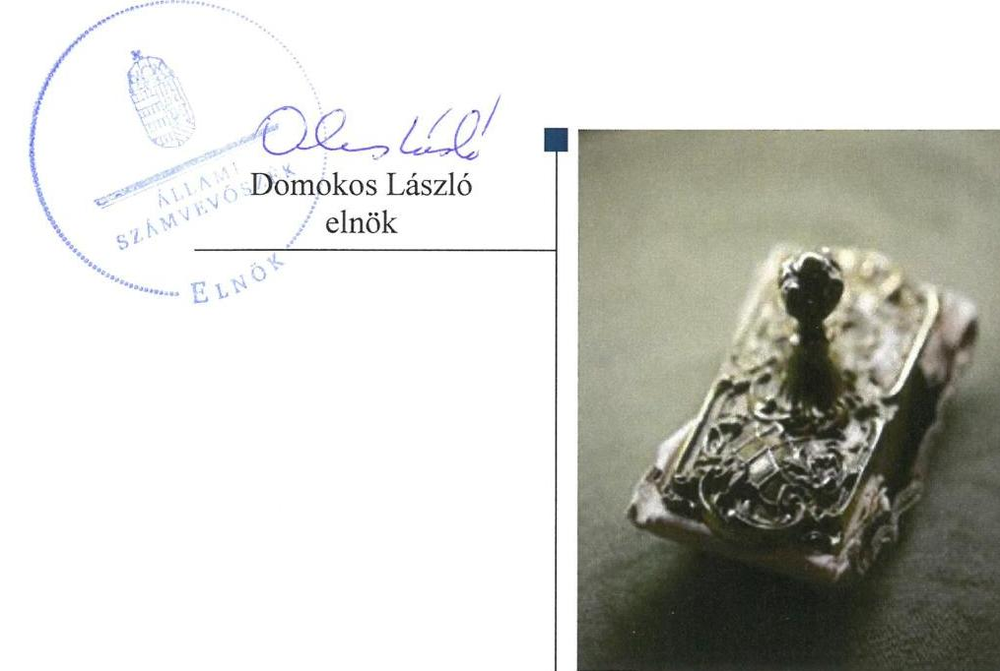

# Jelentés 

## Az önkormányzatok gazdasági társaságai

Az önkormányzatok többségi tulajdonában lévő gazdasági társaságok gazdálkodásának ellenőrzése - Jánoshalmi Kistérségi Egészségügyi Központ Nonprofit Közhasznú Kft.
2018.

---

# Jelentés 

## Az önkormányzatok gazdasági társaságai

Az önkormányzatok többségi tulajdonában lévő gazdasági társaságok gazdálkodásának ellenőrzése - Jánoshalmi Kistérségi Egészségügyi Központ Nonprofit Közhasznú Kft.
2018. július hó 3. nap

---

# AZ ELLENŐRZÉST FELÜGYELTE:

- **PETŐ KRISZTINA** felügyeleti vezető
- **AZ ELLENŐRZÉST VEZETTE ÉS A VÉGREHAJTÁSÁÉRT FELELŐS:**
- **KEREKES PÉTER** ellenőrzésvezető
- **A PROGRAM ÖSSZEÁLLÍTÁSÁÉRT FELELŐS:**
- **TÓTPÁL SZABOLCS** osztályvezető
- **IKTATÓSZÁM:** EL-0129-064/2018.
- **TÉMASZÁM:** 2447
- **ELLENŐRZÉS-AZONOSÍTÓ SZÁM:** V079319

Jelentéseink az Országgyűlés számítógépes hálózatán és az Interneta a www.asz.hu címen is olvashatóak.

---

# TARTALOMJEGYZÉK 

■ ÖSSZEGZÉS ..... 5
■ AZ ELLENŐRZÉS CÉLJA ..... 6
■ AZ ELLENŐRZÉS TERÜLETE ..... 7
■ AZ ELLENŐRZÉS HÁTTERE, INDOKOLTSÁGA ..... 8
■ A JELENTÉS LÉNYEGES KÉRDÉSKÖREI ..... 9
■ AZ ELLENŐRZÉS HATÓKÖRE ÉS MÓDSZEREI ..... 10
■ MEGÁLLAPÍTÁSOK ..... 12
■ JAVASLATOK ..... 14
■ MELLÉKLETEK ..... 17
I. sz. melléklet: Értelmező szótár ..... 17
■ FÜGGELÉK: ÉSZREVÉTELEK ..... 19
■ RÖVIDÍTÉSEK JEGYZÉKE ..... 21

---

.

---

# ÖSSZEGZÉS 

A Jánoshalmi Kistérségi Egészségügyi Központ Nonprofit Közhasznú Korlátolt Felelősségű Társaság gazdálkodása, vagyongazdálkodása nem volt szabályszerű, így nem biztosította az elszámoltathatóságot. A Társaság közzétételi kötelezettségét nem teljesítette, ezáltal nem biztosította gazdálkodása átláthatóságát.

## Az ellenőrzés társadalmi indokoltsága

Magyarországon az intézmény-centrikus közfeladat-ellátás jellemző, de egyre jelentősebb a költségvetésen kívüli feladatellátás térnyerése. Helyi szinten ennek legfontosabb szereplői az önkormányzati tulajdonban lévő gazdasági társaságok, amelyeknek ellenőrzése kiemelten fontos a közfeladat ellátása, és a közvagyon megőrzése, megóvása érdekében. Ezért alapvető követelmény, hogy gazdálkodásuk, múködésük szabályszerű és átlátható legyen.

A Jánoshalmi Kistérségi Egészségügyi Központ Nonprofit Közhasznú Korlátolt Felelősségű Társaságot a Jánoshalmi Kistérség tagtelepülései egészségügyi szolgáltatási feladatok ellátására alapították, hogy a Jánoshalmi Kistérség területén élő mintegy 22 ezer fős lakosság szakorvosi járóbeteg-ellátását biztosítsa. Az Állami Számvevőszék 2013-2016. évekre kiterjedő ellenőrzése során arra kereste a választ, hogy szabályszerű volt-e az egészségügyi szolgáltatást, mint közfeladatokat is ellátó társaság gazdálkodása és az ehhez kapcsolódó tulajdonosi joggyakorlás.

## Főbb megállapítások, következtetések, javaslatok

A Jánoshalmi Kistérségi Egészségügyi Központ Nonprofit Közhasznú Korlátolt Felelősségű Társaság gazdálkodása, vagyongazdálkodása nem volt szabályszerű. A Társaság az éves beszámolók mérlegtételeit leltárral nem támasztotta alá, valamint a kiegészítő mellékletek nem feleltek meg a törvényi előírásoknak. A Társaság felügyelőbizottsága az egyszerűsített éves beszámolókat elfogadásra javasolta. A Társaságnál az értékcsökkenési leírások elszámolása nem a jogszabályban és a belső szabályzatban előírtak szerint történt. Mindezek alapján a gazdálkodás, vagyongazdálkodás elszámoltathatóságát nem biztosították.

A Társaság a törvényben előírt kötelezettségét a közérdekú adatok közzétételére, valamint kormányzati szektorba sorolt szervezetként az előírt adatszolgáltatási kötelezettségére vonatkozóan nem teljesítette, ezért a gazdálkodása nem volt átlátható.

A Jánoshalmi Kistérségi Egészségügyi Központ Nonprofit Közhasznú Korlátolt Felelősségű Társaságnak 2013-2016. években adósságot keletkeztető ügylete nem volt, így az államadósságot nem növelte.

A megállapítások alapján az Állami Számvevőszék Jánoshalma Városi Önkormányzat polgármesterének egy javaslatot, a Jánoshalmi Kistérségi Egészségügyi Központ Nonprofit Közhasznú Kft. ügyvezetőjének kilenc javaslatot fogalmazott meg, amelyre 30 napon belül intézkedési tervet kell készíteniük.

---

# AZ ELLENŐRZÉS CÉLJA 

Az ellenőrzés célja volt annak értékelése, hogy az Önkormányzat ${ }^{1}$ vagyongazdálkodási tevékenysége során szabályszerűen gyakorolta-e tulajdonosi jogait; a Társaság ${ }^{2}$ szabályozottsága, gazdálkodása és vagyongazdálkodási tevékenysége, bevételeinek és ráfordításainak elszámolása megfelelt-e a jogszabályi és tulajdonosi előírásoknak; a gazdasági társaság kötelezettségállománya jelentett-e kockázatot a múködésre, valamint a gazdálkodás átláthatósága és elszámoltathatósága érdekében biztosítva volte a szolgáltatás dijának megalapozottsága szabályszerű önköltségszámítással. Az ellenőrzés célja volt továbbá annak megítélése, hogy a kormányzati szektorba sorolt önkormányzati tulajdonban lévő gazdálkodó szervezetek gazdálkodásának a kormányzati szektor hiányára és az államadósságra befolyással bíró elemei a jogszabályi előírásoknak megfeleltek-e.

---

# AZ ELLENŐRZÉS TERÜLETE 

## Jánoshalma Városi Önkormányzat és a Jánoshalmi Kistérségi Egészségügyi Központ Nonprofit Közhasznú Kft.

A Társaság többségi tulajdonosa a Bács-Kiskun megyében található Jánoshalma Városi Önkormányzat. Az ellenőrzött időszakban a Polgármester ${ }^{3}$ személye nem változott.

A Jánoshalmi Kistérségi Egészségügyi Központ Nonprofit Közhasznú Kft.-t Jánoshalma Városi Önkormányzat, Rém Község Önkormányzata, Borota Községi Önkormányzat, Hajós Város Önkormányzata, Kéleshalom Községi Önkormányzat és Mélykút Városi Önkormányzat, mint a Jánoshalmi Kistérség települései, 2008-ban hozták létre 51,6 millió Ft törzstőkével.

A 2008. szeptember 1-jén kelt Társasági szerződés ${ }^{4}$ alapján Jánoshalma Városi Önkormányzat 97,87\%-os részesedéssel, Rém Község Önkormányzata 1,94\%-os részesedéssel, a Jánoshalmi Kistérség többi települése (Borota, Hajós, Kéleshalom és Mélykút) pedig 0,19\%-os részesedéssel gyakorolják a Társaság tulajdonosi jogait.

A Társadalmi Infrastruktúra Operatív Program (TIOP) támogatásból végrehajtott beruházás keretében kialakították a feladatellátást szolgáló Jánoshalmi Járóbeteg-Szakellátó Központot, amelynek vezetője a Társaság ügyvezetője.

A Társaság a Jánoshalmi Kistérség tagtelepülésein élő mintegy 22 ezer fős lakosság számára biztosította az egészségmegőrzési, betegségmegelőzési, gyógyító- és egészségügyi rehabilitációs tevékenységet.

A Társaság az ellenőrzött időszakban kormányzati szektorba besorolt gazdasági társaságnak minősült, gazdálkodásában nem voltak a kormányzati szektor hiányára befolyással bíró elemek. A Társaság a Stabilitási tv. ${ }^{5}$ szerinti adósságot keletkeztető ügyletet nem kötött. Nem vett fel a kormányzati szektoron kívülről hitelt, nem bocsátott ki kötvényt, kötelezettségvállaláshoz kapcsolódóan nem vállalt garanciát és kezességet. Kezelésbe vett vagyonnal nem rendelkezett.

A Társaság 2012-ben 27 főt, 2016-ban 23 fő alkalmazottat foglalkoztatott. Az ellenőrzött időszakban az ügyvezető személye nem változott.

A Társaság a Számv. tv. ${ }^{6}$ 155. § (3) bekezdése alapján nem volt könyvvizsgáló alkalmazására kötelezett, azonban a Társasági szerződés előírásának megfelelve könyvvizsgálót alkalmaztak.

---

# AZ ELLENŐRZÉS HÁTTERE, INDOKOLTSÁGA 

Az önkormányzatok többségi tulajdonában álló gazdasági társaságok ellenőrzése kiemelten fontos a vagyon megőrzése, megóvása érdekében, valamint a kormányzati szektor elszámolásaiban megjelenő önkormányzati tulajdonú gazdálkodó szervezetek esetében, amelyekkel szemben alapvető követelmény, hogy gazdálkodásuk, működésük szabályszerű, az általuk szolgáltatott adatok minél megbízhatóbbak legyenek. A feladatellátás költségeinek, ráfordításainak alakulása a lakosság széles rétegét érinti.

Ellenőrzéseink feltárhatják, hogy az önkormányzat a feladatellátásához rendelt vagyon működtetését a tulajdonostól elvárható gondossággal vé-gezte-e, a feladatot ellátó gazdasági társaság a létesítő okiratban, szolgáltatási szerződésben foglaltak betartásával biztosította-e a feladat ellátását. Az ellenőrzés eredményeképp meghatározhatóvá válnak a költségvetési hiányt befolyásoló szervezetek kockázatai, lehetővé válik ezen kockázatok csökkentése. Az ellenőrzés rávilágíthat arra, hogy a gazdasági társaság a vagyon használatával biztosította-e a szolgáltatás folytatásának feltételeit, az önkormányzat tulajdonosi felügyelete hozzájárult-e a szabályszerű gazdálkodáshoz és feladatellátáshoz. A megállapítások alapján megfogalmazott számvevőszéki javaslatok hasznosítása elősegítheti a meglévő hibák megszüntetését. A jó gyakorlatok bemutatásával az ÁSZ ${ }^{7}$ hozzájárulhat a követendő megoldások megismertetéséhez, terjesztéséhez.

---

# A JELENTÉS LÉNYEGES KÉRDÉSKÖREI 

1. A tulajdonosi joggyakorlás szabályszerű volt-e?
2. A kormányzati szektorba sorolt gazdasági társaság szabályozottsága, gazdálkodása és vagyongazdálkodása szabályszerű volt-e?
3. A kormányzati szektorba sorolt gazdasági társaság biztosi-totta-e az átláthatóság érvényesülését?

---

# AZ ELLENŐRZÉS HATÓKÖRE ÉS MÓDSZEREI 

## Az ellenőrzés típusa

Megfelelőségi ellenőrzés

## Az ellenőrzött időszak

2013. január 1-től 2016. december 31-ig

## Az ellenőrzés tárgya

Az Önkormányzat - többségi tulajdonában lévő gazdasági társaság feletti - tulajdonosi joggyakorlása, valamint a Társaság gazdálkodásának szabályozottsága és szabályszerűsége, továbbá az önkormányzati alszektorba sorolt gazdasági társaság gazdálkodásának a kormányzati szektor hiányára és az államadósságra befolyással bíró elemei.

Az ellenőrzés kiterjed minden olyan körülményre és adatra, amely az ÁSZ jogszabályban meghatározott feladatainak teljesítéséhez, valamint a program végrehajtása folyamán felmerült újabb összefüggések feltárásához szükséges.

## Az ellenőrzött szervezet

Jánoshalma Város Önkormányzata és a Jánoshalmi Kistérségi Egészségügyi Központ Nonprofit Közhasznú Kft.

## Az ellenőrzés jogalapja

Az ellenőrzés jogszabályi alapját az ÁSZ tv. ${ }^{8}$ 1. § (3) bekezdése és 5. § (3)(4)-(5) bekezdései képezik.

## Az ellenőrzés módszerei

Az ellenőrzést a nemzetközi standardokat irányadónak tekintve az ellenőrzési program ellenőrzési kérdései, az ellenőrzött időszakban hatályos jogszabályok, az ellenőrzés szakmai szabályok és módszertanok figyelembe vételével végeztük.

Az ellenőrzés ideje alatt az ellenőrzött szervezettel történő kapcsolattartást az ÁSZ Szervezeti és Múködési Szabályzatának vonatkozó előírásai alapján biztosítottuk.

---

Az ellenőrzési kérdések megválaszolásához szükséges bizonyítékok megszerzése a következő ellenőrzési eljárások alkalmazásával történt: megfigyelés, kérdésfeltevés (információkérés), összehasonlítás, valamint elemző eljárás. Az ellenőrzési bizonyítékként felhasználható adatforrások közé tartoztak egyrészt az ellenőrzési programban felsorolt adatforrások, másrészt adatforrás lehet még minden - az ellenőrzés folyamán - feltárt, az ellenőrzés szempontjából információkat tartalmazó dokumentum.

Az ellenőrzést a kérdésekre adott válaszok kiértékelésével, valamint a megjelölt adatforrások, a csatolt tanúsítványok felhasználásával, továbbá az adott időszakban hatályos jogszabályok figyelembe vételével folytattuk le.

A bevételek és ráfordítások elszámolása, valamint a vagyonnyilvántartás terén a szabályszerű működést véletlen mintavétellel ellenőriztük.

A mintavétellel ellenőrzött területek esetében minden egyes tétel vonatkozásában a szabályszerűségre vonatkozó kérdéseket tettünk fel, amelyek eredménye összesítésre került. Az ellenőrzött minták alapján a sokaságban előforduló átlagos hibaarányt becsültük. „Szabályszerűnek" értékeltünk egy ellenőrzött területet, amennyiben 95\%-os bizonyossággal a teljes sokaságban az átlagos hibaarány legfeljebb 10\%, nem megfelelőnek, amennyiben 10\%-nál magasabb arányt képviselt. Abban az esetben, ha a teljes sokaság tekintetében a 10\%-os hibaarányhoz való viszony megítélésnek megbízhatósága nem érte el a 95\%-ot, annak elérése érdekében értékelésünket további szempontokkal egészítettük ki, és figyelembe vettük a feltárt hibák típusát és súlyát. A ráfordítások elszámolására és a vagyonnyilvántartásra vonatkozó véletlen mintavételt kockázati alapú kiválasztással egészítettük ki, amelynek során a három legnagyobb összegű tételt választottuk ki.

---

# 1. A tulajdonosi joggyakorlás szabályszerű volt-e? 

## Összegző megállapítás

Jánoshalma Városi Önkormányzatnál a tulajdonosi jogok gyakorlása szabályszerű volt.

Az Önkormányzat a Vagyongazdálkodási rendeletben ${ }^{9}$ határozta meg a tulajdonosi jogokat és azok gyakorlásának szabályait. A Társaság vonatkozásában nem került sor a tulajdonosi jogok átadására.

A Társasági szerződés felügyelőbizottság létrehozásáról rendelkezett. A Társaság felügyelőbizottsága 2014. március 14-ig a Gt. ${ }^{10}$ 34. § (4) bekezdésében, 2014. március 15 -től a Ptk. ${ }^{11}$ 3:122. § (3) bekezdésében foglaltak ellenére az ellenőrzött időszakban nem állapította meg az ügyrendjét.

A Társaság taggyűlése a Társaság egyszerűsített éves beszámolóit minden évben a felügyelőbizottság írásbeli jelentésének és a könyvvizsgálói jelentés birtokában jóváhagyta.

## 2. A kormányzati szektorba sorolt gazdasági társaság szabályozottsága, gazdálkodása és vagyongazdálkodása szabályszerű volt-e?

## Összegző megállapítás

A Társaság szabályozottsága, gazdálkodása, vagyongazdálkodása nem volt szabályszerű.

A Társaság Pénzkezelési szabályzata ${ }^{12}$ az ellenőrzött időszakban nem felelt meg a Számv. tv. 14. § (8) bekezdésben foglaltaknak, mert nem tartalmazta a készpénzállományt érintő bevételi pénzmozgások jogcímeit és eljárási rendjét, a készpénzállomány ellenőrzés gyakoriságát.

A Társaság a Taktv. ${ }^{13}$ 5. § (3) bekezdésben előírtak ellenére nem rendelkezett a vezető tisztségviselők, felügyelőbizottsági tagok, valamint az Mt. 208. §-ának hatálya alá eső munkavállalók javadalmazása, valamint a jogviszony megszűnése esetére biztosított juttatások módjának, mértékének elveire, annak rendszerére vonatkozó szabályzattal.

A Társaságnál az 1997. évi XLVII. törvény ${ }^{14}$ 32. § (2) bekezdés f) pontjában foglaltak ellenére adatvédelmi felelős nem került kijelölésre.

Az Ügyvezető 2016. szeptember 30-ig a Bkr. ${ }^{15}$ 10. §-ban előírtak ellenére nem alakította ki a Társaság tevékenységének, a célok megvalósításának nyomon követését biztosító rendszert. 2016. október 1-jétől nem teljesítette a Bkr. 6. § (4) bekezdése előírásait, mert a Társaság nem rendelkezett a szervezeti integritást sértő események kezelésére, valamint az integrált kockázatkezelésre vonatkozó eljárásrenddel.

---

A Társaság a Számv. tv. 69. § (1) bekezdésben előírtak ellenére az egyszerűsített éves beszámolók mérlegtételeit nem támasztotta alá tételesen, ellenőrizhető módon leltárakkal.

Ezért az egyszerűsített éves beszámolók az ellenőrzött időszakban nem feleltek meg a Számv. tv. 4. § (2) bekezdésében előírtaknak, mert nem nyújtottak megbízható és valós képet a Társaság vagyonáról és annak öszszetételéről.

A Társaság a 2013-2016. évi kiegészítő mellékleteiben a Számv. tv. 88. § (4) bekezdés előírása ellenére nem ismertette a beszámoló összeállításánál alkalmazott szabályrendszert, annak főbb jellemzőit, az alkalmazott értékelési eljárásokat és az értékcsökkenés elszámolásának számviteli politikában meghatározott módszerét, elszámolásának gyakoriságát, az egyes mérlegtételeknél alkalmazott - az előző üzleti évtől eltérő - eljárásokból eredő, az eredményt befolyásoló eltérések indokolását, valamint a vagyoni, pénzügyi helyzetre, az eredményre gyakorolt hatásukat.

Mindezen hiányosságok ellenére a könyvvizsgáló az egyszerűsített éves beszámolókat korlátozás nélküli hitelesítő záradékkal látta el.

A Társaságnál az értékcsökkenési leírások elszámolása nem a Számv. tv.-ben és a Társaság Számviteli politikájában ${ }^{16}$ előírtak szerint történt az alábbi hiányosságok miatt:
$\longrightarrow$ a Számv. tv. 52. § (2) bekezdésében előírtak ellenére az üzembe helyezést nem dokumentálták,
$\longrightarrow$ a Számv. tv. 51. § (1) bekezdés a) pontjában előírtak ellenére az eszközök bekerülési értékének megállapítása során nem vették figyelembe az üzembe helyezés során felmerülő postaköltséget,
$\longrightarrow$ a Számviteli politika 7. pontjában előírtak ellenére az egyéb berendezések, felszerelések értékcsökkenését 33\%-os leírási kulccsal számolták el.

# 3. A kormányzati szektorba sorolt gazdasági társaság biztosí-totta-e az átláthatóság érvényesülését? 

## Összegző megállapítás

A Társaság gazdálkodása során nem biztosította az átláthatóság érvényesülését.

A Társaság megsértette az Info. tv. ${ }^{17}$ 37. § (1) bekezdésben foglaltakat, mivel az Info. tv. 1. mellékletében számára előírt adatok közzétételéről nem gondoskodott.

A Társaság, mint kormányzati szektorba sorolt szervezet, az Áht. ${ }^{18}$ 13. § (3) és 107. § (1) bekezdése alapján 2013. január 1-jétől az Ávr. ${ }^{19}$ 7. melléklete 2., 28. és 29. pontjai, 2015. január 1-jétől az Ávr. 5. melléklete 23. és 24. pontjai, 2016. január 1-jétől az Ávr. 5. melléklete 23. pontja szerinti adatszolgáltatásra volt kötelezett, amelynek azonban nem tett eleget.

---

# JAVASLATOK 

Az ÁSZ tv. 33. § (1) bekezdésében foglaltak értelmében az ellenőrzött szervezet vezetője köteles a jelentésben foglalt megállapításokhoz kapcsolódó intézkedési tervet összeállítani és azt a jelentés kézhezvételétől számított 30 napon belül az ÁSZ részére megküldeni. Amennyiben az ellenőrzött szervezet vezetője nem küldi meg határidőben az intézkedési tervet, vagy továbbra sem elfogadható intézkedési tervet küld, az Állami Számvevőszék elnöke az ÁSZ tv. 33. § (3) bekezdése a) és b) pontjaiban foglaltakat érvényesítheti.

## Jánoshalma Városi Önkormányzat polgármesterének

1. Kezdeményezze, hogy a felügyelő bizottság az ügyrendjét készítse el, és azt a Társaság legfőbb szerve, a taggyülés hagyja jóvá a jogszabályi előírásoknak megfelelően.
(1. összegző megállapítás 2. bekezdésének 2. mondata alapján)

## A Jánoshalmi Kistérségi Egészségügyi Központ Nonprofit Közhasznú Kft. ügyvezetőjének

1. Intézkedjen annak érdekében, hogy a pénzkezelési szabályzat tartalma megfeleljen a jogszabályi előírásnak.
(2. összegző megállapítás 1. bekezdése alapján)
2. Kezdeményezze a taggyülésnél a vezető tisztségviselők, felügyelőbizottsági tagok, valamint az Mt. 208. §-ának hatálya alá eső munkavállalók javadalmazása, valamint a jogviszony megszünése esetére biztosított juttatások módjának, mértékének elveiről, annak rendszeréről szóló szabályzat megalkotását a jogszabályi előírásnak megfelelően.
(2. összegző megállapítás 2. bekezdése alapján)
3. Intézkedjen adatvédelmi felelős kijelöléséről a jogszabályi előírásnak megfelelően.
(2. összegző megállapítás 3. bekezdése alapján)
4. Intézkedjen a szervezeti integritást sértő események kezelésére, valamint az integrált kockázatkezelésre vonatkozó eljárásrend megalkotása iránt a jogszabályi előírásnak megfelelően.
(2. összegző megállapítás 4. bekezdésének 2. mondata alapján)

---

5. Intézkedjen a jogszabályi előirásoknak megfelelően a beszámoló elkészitéséhez, a mérleg tételeinek alátámasztásához olyan leltár összeállításáról, amely tételesen, ellenőrizhető módon tartalmazza a mérleg fordulónapon meglévő eszközöket és forrásokat mennyiségben és értékben.
(2. összegző megállapítás 5. bekezdése alapján)
6. Intézkedjen annak érdekében, hogy a kiegészitő melléklet tartalma megfeleljen a jogszabályi előirásnak.
(2. összegző megállapítás 7. bekezdése alapján)
7. Intézkedjen az értékcsökkenés jogszabályi előirásoknak és belső szabályozásnak megfelelő elszámolása érdekében.
(2. összegző megállapítás 9. bekezdése és annak 1-3. francia bekezdései alapján)
8. Intézkedjen az általános közzétételi listában meghatározott és a Társaság tekintetében releváns valamennyi adat jogszabályi előírásnak megfelelő közzétételéről.
(3. összegző megállapítás 1. bekezdése alapján)
9. Intézkedjen a jogszabályban elöirt adatszolgáltatás teljesitéséről.
(3. összegző megállapítás 2. bekezdése alapján)

---

.

---

# MELLÉKLETEK 

- I. SZ. MELLÉKLET: ÉRTELMEZŐ SZÓTÁR
gazdasági társaság
gazdálkodó szervezet
kormányzati szektorba sorolt egyéb szervezet
nemzeti vagyon
nonprofit gazdasági társaság

Ptk 3.88. § (1) bekezdése szerint „a gazdasági társaságok üzletszerű közös gazdasági tevékenység folytatására, a tagok vagyoni hozzájárulásával létrehozott, jogi személyiséggel rendelkező vállalkozások, amelyekben a tagok a nyereségből közösen részesednek, és a veszteséget közösen viselik".
A Ptk. 685. § c) pontja szerint gazdálkodó szervezet: „az állami vállalat, az egyéb állami gazdálkodó szerv, a szövetkezet, a lakásszövetkezet, az európai szövetkezet, a gazdasági társaság, az európai részvénytársaság, az egyesülés, az európai gazdasági egyesülés, az európai területi együttmúködési csoportosulás, az egyes jogi személyek vállalata, a leányvállalat, a vízgazdálkodási társulat, az erdő birtokossági társulat, a végrehajtói iroda, az egyéni cég, továbbá az egyéni vállalkozó." (2014. 03.15-ig hatályos)
Az Áht. 3. § (2) és (3) bekezdésében foglaltakon kívül az Európai Közösséget létrehozó szerződéshez csatolt, a túlzott hiány esetén követendő eljárásról szóló jegyzőkönyv alkalmazásáról szóló 2009. május 25-i 479/2009/EK rendelet (a továbbiakban: 479/2009/EK rendelet) szerint a kormányzati szektorba sorolt szervezet (Áht. 1. § (12))
Nvtv. ${ }^{20}$ 1. § (2) bekezdése szerint többek között:
„az állam vagy a helyi önkormányzat kizárólagos tulajdonában álló dolgok,
az a) pont hatálya alá nem tartozó, állam vagy a helyi önkormányzat tulajdonában lévő dolog,
az állam vagy a helyi önkormányzat tulajdonában lévő pénzügyi eszközök, továbbá az államot vagy a helyi önkormányzatot megillető társasági részesedések,
az államot vagy a helyi önkormányzatot megillető bármely vagyoni értékkel rendelkező jogosultság, amelyet jogszabály vagyoni értékű jogként nevesít."
Ctv. ${ }^{21}$ 9/F. § (2) bekezdése szerint „az a gazdasági társaság minősül nonprofit gazdasági társaságnak és cégnevében az a gazdasági társaság tüntetheti fel a nonprofit jelleget, amelynek létesítő okirata tartalmazza, hogy a gazdasági társaság tevékenységéből származó nyereség a tagok között nem osztható fel, hanem az a gazdasági társaság vagyonát gyarapítja." (hatályos 2014. március 15-től)

---

.

---

# FÜGGELÉK: ÉSZREVÉTELEK 

A jelentéstervezetet a Számvevőszék 15 napos észrevételezésre megküldte az ellenőrzött szervezetek vezetőinek az ÁSZ tv. 29. §* (1) bekezdése előírásának megfelelően.

Jánoshalma Városi Önkormányzat polgármestere és a Jánoshalmi Kistérségi Egészségügyi Központ Nonprofit Kft. ügyvezetője nem élt észrevételezési jogával.

[^0]
[^0]:    * 29. § (1) Az Állami Számvevőszék az ellenőrzési megállapításait megküldi az ellenőrzött szervezet vezetőjének vagy az általa megbízott személynek, és annak, akinek személyes felelősségét állapította meg.
    (2) Az ellenőrzött szervezet vezetője és a felelősként megjelölt személy az ellenőrzés megállapításaira tizenöt napon belül írásban észrevételt tehet.
    (3) Az Állami Számvevőszék az észrevételre a beérkezésétől számított harminc napon belül írásban válaszol. A figyelembe nem vett észrevételeket köteles a jelentésben feltüntetni, és megindokolni, hogy azokat miért nem fogadta el.

---

.

---

# RÖVIDÍTÉSEK JEGYZÉKE 

${ }^{1}$ Önkormányzat
${ }^{2}$ Társaság
${ }^{3}$ Polgármester
${ }^{4}$ Társasági szerződés
${ }^{5}$ Stabilitási tv.
${ }^{6}$ Számv. tv.
${ }^{7}$ ÁSZ
${ }^{8}$ ÁSZ tv.
${ }^{9}$ Vagyongazdálkodási rendelet
${ }^{10}$ Gt.
${ }^{11}$ Ptk.
${ }^{12}$ Pénzkezelési szabályzat
${ }^{13}$ Taktv.
${ }^{14}$ 1997. évi XLVII törvény
${ }^{15}$ Bkr.
${ }^{16}$ Számviteli politika
${ }^{17}$ Info. tv.
${ }^{18}$ Áht.
${ }^{19}$ Ávr.
${ }^{20}$ Nvtv.
${ }^{21}$ Ctv.

Jánoshalma Városi Önkormányzat
Jánoshalmi Kistérségi Egészségügyi Központ Nonprofit Közhasznú Kft. Jánoshalma Város polgármestere
Jánoshalmi Kistérségi Egészségügyi Központ Nonprofit Közhasznú Kft. társasági szerződése (hatályos 2008. szeptember 1-jétől, módosítva 2015. május 29-én) 2011. évi CXCIV. törvény Magyarország gazdasági stabilitásáról (hatályos 2011. december 30-tól)
2000. évi C. törvény a számvitelről (hatályos 2001. január 1-jétől)

Állami Számvevőszék
2011. évi LXVI. törvény az Állami Számvevőszékről (hatályos 2011. július 1-jétől)

Jánoshalma Városi Önkormányzat képviselő testületének 17/2012. (IX. 12.) rendelete az önkormányzat vagyonáról és vagyongazdálkodási szabályairól 2006. évi IV. törvény a gazdasági társaságokról (hatálytalan 2014. március 15-től) 2013. évi V. törvény a Polgári Törvénykönyvről (hatályos 2014. március 15-től) Jánoshalmi Kistérségi Egészségügyi Központ Nonprofit Közhasznú Kft. pénzkezelési szabályzata (hatályos 2011. január 1-jétől, módosítva 2013. július 4én, 2013. augusztus 1-jén, 2015. július 1-jén és 2016. március 1-jén)
2009. CXXII. törvény a köztulajdonban álló gazdasági társaságok takarékosabb müködéséről (hatályos 2009. december 4-től)
1997. évi XLVII. törvény az egészségügyi és hozzájuk kapcsolódó személyes adatok kezeléséről és védelméről (hatályos 1998. január 1-jétől)
370/2011. (XII. 31.) Korm. rendelet a költségvetési szervek belső kontrollrendszeréről és belső ellenőrzéséről (hatályos 2012. január 1-jétől) Jánoshalmi Kistérségi Egészségügyi Központ Nonprofit Közhasznú Kft. számviteli politikája (hatályos 2011. január 1-jétől, módosítva 2014. január 1-jén és 2016. január 1-jén)
2011. évi CXII. törvény az információs önrendelkezési jogról és az információszabadságról (hatályos 2011. július 27-től)
2011. évi CXCV. törvény az államháztartásról (hatályos 2011. december 30-tól) 368/2011. (XII. 31.) Korm. rendelet az államháztartásról szóló törvény végrehajtásáról
2011. évi CXCVI. törvény a nemzeti vagyonról (hatályos 2011. december 31-től) 2006. évi V. törvény a cégnyilvánosságról, a bírósági cégeljárásról és a végelszámolásról (hatályos 2006. július 1-jétől)

---

# ÁLLAMI SZÁMVEVŐSZÉK 

1052 Budapest, Apáczai Csere János utca 10.
Levélcím: 1364 Budapest 4. Pf. 54
Telefon: +36 14849100 Telefax: +36 14849200
www.asz.hu