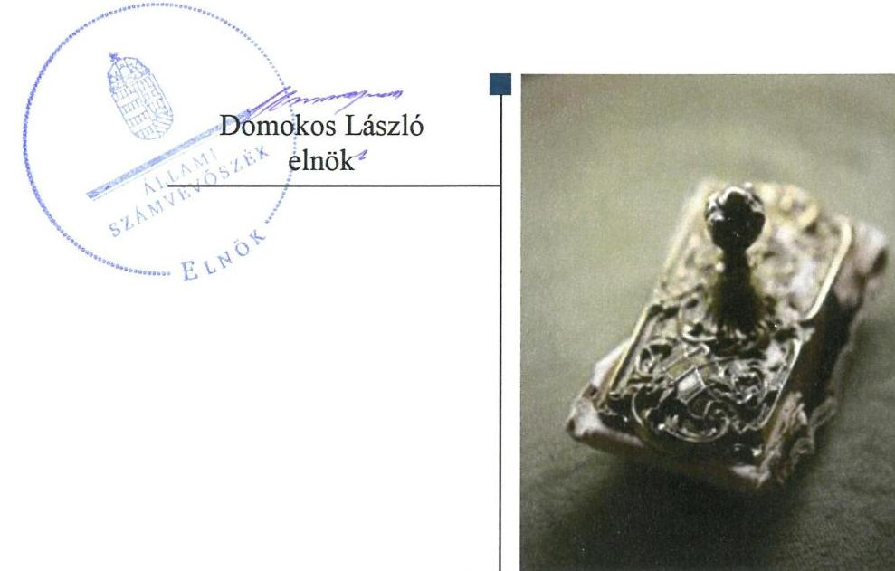
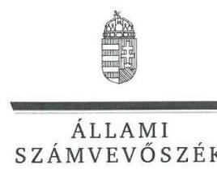
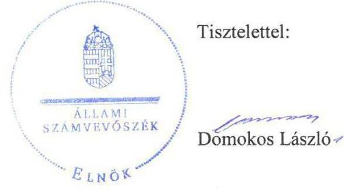
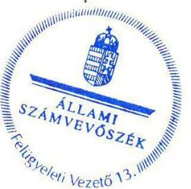

# Jelentés 

## Az önkormányzatok gazdasági társaságai

Az önkormányzatok többségi tulajdonában lévő gazdasági társaságok gazdálkodásának ellenőrzése - Gyulakonyha Élelmezési, Kereskedelmi és Szolgáltató Nonprofit Kft. 2018.

---

# Jelentés 

## Az önkormányzatok gazdasági társaságai

Az önkormányzatok többségi tulajdonában lévő gazdasági társaságok gazdálkodásának ellenőrzése - Gyulakonyha Élelmezési, Kereskedelmi és Szolgáltató Nonprofit Kft. 2018. Juhuis hó 18. nap

---

# AZ ELLENŐRZÉST FELÜGYELTE:

- **KLINGA LÁSZLÓ** felügyeleti vezető
- **AZ ELLENŐRZÉST VEZETTE ÉS A VÉGREHAJTÁSÁÉRT FELELŐS:**
  - **HOFMEISTER LÁSZLÓ** ellenőrzésvezető
  - **A PROGRAM ÖSSZEÁLLÍTÁSÁÉRT FELELŐS:**
    - **TÓTPÁL SZABOLCS** osztályvezető

**IKTATÓSZÁM:** EL-0231-040/2018

**TÉMASZÁM:** 2447

**ELLENŐRZÉS-AZONOSÍTÓ SZÁM:** V-079389

Jelentéseink az Országgyűlés számítógépes hálózatán és az Interneta a www.asz.hu címen is olvashatóak.

---

# TARTALOMJEGYZÉK 

■ ÖSSZEGZÉS ..... 5
■ AZ ELLENŐRZÉS CÉLJA ..... 6
■ AZ ELLENŐRZÉS TERÜLETE ..... 7
■ AZ ELLENŐRZÉS HÁTTERE, INDOKOLTSÁGA ..... 8
■ A JELENTÉS LÉNYEGES KÉRDÉSKÖREI ..... 9
■ ELLENŐRZÉS HATÓKÖRE ÉS MÓDSZEREI ..... 10
■ MEGÁLLAPÍTÁSOK ..... 12
■ JAVASLATOK ..... 15
■ MELLÉKLETEK ..... 17
I. sz. melléklet: Értelmező szótár ..... 17
II. sz. melléklet: 2013-2016. évi egyszerúsített éves beszámoló adatok. ..... 18
■ FÜGGELÉK: ÉSZREVÉTELEK ..... 19
■ RÖVIDÍTÉSEK JEGYZÉKE ..... 25

---

.

---

# ÖSSZEGZÉS 

A Gyulakonyha Élelmezési, Kereskedelmi és Szolgáltató Nonprofit Kft. feletti tulajdonosi joggyakorlás kialakításával és szabályszerű gyakorlásával Gyula Város Önkormányzata megteremtette a Társaság szabályszerű müködésének feltételeit. A Társaság szabályozottsága és vagyongazdálkodási tevékenysége megfelelt a jogszabályi előírásoknak, a vagyon értékének megőrzéséről gondoskodtak, gazdálkodása a személyi jellegű ráfordítások elszámolása kivételével szabályszerű volt. A Társaság a közérdekü adatokat közzétette, biztosította müködésének és gazdálkodásának átláthatóságát.

## Az ellenőrzés társadalmi indokoltsága

Magyarországon az önkormányzatok kötelező és önként vállalt feladataik ellátása során egyre szélesebb körben alkalmazzák a költségvetési szerveken kívüli feladatellátást, ezáltal az önkormányzati tulajdonú gazdasági társaságok is kiemelt fontosságú szerephez jutnak a lakossági szolgáltatások biztosításában. Az önkormányzatok többségi tulajdonában álló gazdasági társaságok ellenőrzése kiemelt jelentőségű, mivel működésük hatással van a tulajdonos önkormányzat gazdálkodására, gazdálkodásának egyes elemei befolyásolják az önkormányzati alszektor hiányát és az államadósságot.

Az Állami Számvevőszék stratégiájában célul tűzte ki az államháztartáson kívül működő szervezetek ellenőrzését, mely hozzájárul a közpénzek szabályos, átlátható, elszámoltatható és eredményes felhasználásához. A Gyulakonyha Élelmezési, Kereskedelmi és Szolgáltató Nonprofit Kft. által ellátott feladaton keresztül a városban élő lakosság széles rétege került kapcsolatba.

## Főbb megállapítások, következtetések

Az Önkormányzat a Társaság feletti tulajdonosi joggyakorlásának kereteit a jogszabályoknak megfelelően alakította ki. A tulajdonosi jogait szabályszerűen gyakorolta, ezzel biztosítva a Társaság átlátható, szabályszerű működésének feltételeit.

A Társaság a megfelelő számviteli szabályozottság kialakításával megteremtette a szabályszerű működés feltételeit.

A Társaság vagyongazdálkodása szabályszerű volt, a mérlegben kimutatott eszközöket és forrásokat szabályszerű leltárral alátámasztotta, vagyonát megőrizte.

Beszámolási és közérdekű adatokra vonatkozó közzétételi kötelezettségét a Társaság teljesítette, biztosította müködésének átláthatóságát.

A bevételek és ráfordítások elszámolása a személyi jellegű ráfordítások kivételével megfelelő volt.

---

# AZ ELLENŐRZÉS CÉLJA 

Az ellenőrzés célja annak értékelése volt, hogy az Önkormányzat vagyongazdálkodási tevékenysége során szabályszerűen gyakorolta-e tulajdonosi jogait, a gazdasági társaság szabályozottsága, gazdálkodása és vagyongazdálkodási tevékenysége, bevételeinek és ráfordításainak elszámolása megfelel-e a jogszabályi és tulajdonosi előírásoknak; a gazdasági társaság kötelezettségállománya jelentett-e kockázatot a múködésre, valamint a gazdálkodás átláthatósága és elszámoltathatósága érdekében biztosított volt-e a szolgáltatás dijának megalapozottsága szabályszerű önköltségszámítással.

---

# **AZ ELLENŐRZÉS TERÜLETE**

## **Gyula Város Önkormányzata és a kizárólagos tulajdonában lévő Gyulakonyha Élelmezési, Kereskedelmi és Szolgáltató Nonprofit Korlátolt Felelősségű Társaság**

A Társaság1-ot az Önkormányzat2 alapította egyedüli tagként a 2009. évben. A Társaság jegyzett tőkéjének összege – 31,1 M Ft – az ellenőrzött időszakban nem változott. A jegyzett tőke 3,0 M Ft készpénzből és 28,1 M Ft apportból állt.

A Társaság közhasznú jogállású, közfeladatot ellátó szervként működött. A Társaság alaptevékenysége közétkeztetési feladatokat ellátása óvodák, iskolák és diákotthonok részére. A Társaság a közhasznú feladatai ellátása mellett kiegészítő jelleggel vállalkozási, elsősorban vendéglátáshoz kapcsolódó tevékenységeket is végzett. A vállalkozási tevékenységekből származó bevétel az értékesítés nettó árbevételéből átlagosan 34,7%-ot tett ki az ellenőrzött időszakban.

A Társaság feladat ellátásához szükséges infrastruktúrát az Önkormányzat alapításkor ingatlanok tulajdonba adásával biztosította, vagyonkezelésbe a Társaság vagyont nem vett át. Saját vagyonát az önkormányzattól kapott ingatlanok mellett elsősorban a konyhai és egyéb berendezések, felszerelések képezték.

A Társaság 2013-2016. évi egyszerűsített éves beszámolóinak főbb adatait a II. melléklet mutatja be.

Az ellenőrzött időszakban a Társaság vagyona 45,1%-kal nőtt, míg az értékesítés nettó árbevétele 32,7%-kal emelkedett. A Társaság a 2013. év kivételével nyereségesen működött, a 2014-2016. években összesen 25,0 M Ft adózott eredményt ért el. Az átlagos állományi létszáma a 2013. évi 45,5 főről 2016. évre 43,0 főre csökkent.

A polgármester, a jegyző és az ügyvezető, valamint az Alapító által megbízott könyvvizsgáló személyében a 2013-2016. években nem történt változás.

A Társaság nem tartozott a kormányzati szektorba sorolt egyéb szervezetek körébe.

---

# AZ ELLENŐRZÉS HÁTTERE, INDOKOLTSÁGA 

Az önkormányzatok többségi tulajdonában álló gazdasági társaságok ellenőrzése kiemelten fontos a vagyon megőrzése, megóvása érdekében, valamint a kormányzati szektor elszámolásaiban megjelenő önkormányzati tulajdonú gazdálkodó szervezetek esetében, amelyekkel szemben alapvető követelmény, hogy gazdálkodásuk, működésük szabályszerű, az általuk szolgáltatott adatok minél megbízhatóbbak legyenek.

A feladatellátás költségeinek, ráfordításainak alakulása a lakosság széles rétegét érinti. Az ellenőrzés várható hasznosulásaként ellenőrzéseink feltárhatják, hogy az önkormányzat a feladatellátásához rendelt vagyon működtetését a tulajdonostól elvárható gondossággal végezte-e, a feladatot ellátó gazdasági társaság a létesítő okiratban, szolgáltatási szerződésben foglaltak betartásával biztosította-e a feladat ellátását. Az ellenőrzés rávilágíthat arra, hogy a gazdasági társaság a vagyon használatával biztosította-e a szolgáltatás folytatásának feltételeit, az önkormányzat tulajdonosi felügyelete hozzájárult-e a szabályszerű gazdálkodáshoz és feladatellátáshoz.

A megállapítások alapján megfogalmazott számvevőszéki javaslatok hasznosítása elősegítheti a meglévő hibák megszüntetését. A jó gyakorlatok bemutatásával az Állami Számvevőszék hozzájárul a követendő megoldások megismertetéséhez, terjesztéséhez.

---

# A JELENTÉS LÉNYEGES KÉRDÉSKÖREI 

1. A tulajdonosi jogok gyakorlása szabályszerű volt-e?
2. A Társaság szabályozottsága, gazdálkodása és vagyongazdálkodása megfelelt-e az előírásoknak?

---

# ELLENŐRZÉS HATÓKÖRE ÉS MÓDSZEREI 

## Az ellenőrzés típusa

Megfelelőségi ellenőrzés.

## Az ellenőrzött időszak

2013. január 1-étől 2016. december 31-ig.

## Az ellenőrzés tárgya

Gyula Város Önkormányzatának tulajdonosi joggyakorlása, valamint a Gyulakonyha Élelmezési, Kereskedelmi és Szolgáltató Nonprofit Korlátolt Felelősségű Társaság gazdálkodásának szabályozottsága és szabályszerűsége volt az ellenőrzés tárgya.

Az ellenőrzés kiterjedt minden olyan körülményre és adatra, amely az ÁSZ ${ }^{2}$ jogszabályban meghatározott feladatainak teljesítéséhez, valamint a program végrehajtása folyamán felmerült újabb összefüggések feltárásához szükséges volt.

## Az ellenőrzött szervezet

Gyula Város Önkormányzata és a Gyulakonyha Élelmezési, Kereskedelmi és Szolgáltató Nonprofit Korlátolt Felelősségű Társaság

## Az ellenőrzés jogalapja

Az ellenőrzés jogalapját az ÁSZ tv. ${ }^{4}$ 1. § (3) bekezdése és 5. § (3)-(5) bekezdései képezik.

## Az ellenőrzés módszerei

Az ellenőrzést a nemzetközi standardokat irányadónak tekintve az ellenőrzési program ellenőrzési kérdései, az ellenőrzött időszakban hatályos jogszabályok, az ellenőrzés szakmai szabályok és módszertanok figyelembe vételével végeztük.

Az ellenőrzés ideje alatt az ellenőrzött szervezettel történő kapcsolattartást az ÁSZ Szervezeti és Múködési Szabályzatának vonatkozó előírásai alapján biztosítottuk.

---

Az ellenőrzés a kizárólagos tulajdonosi jogokat gyakorló önkormányzatra, és az ellenőrzött gazdasági társaságra terjedt ki.

Az ellenőrzési kérdések megválaszolásához szükséges bizonyítékok megszerzése a következő ellenőrzési eljárások alkalmazásával történt: megfigyelés, kérdésfeltevés (információkérés), összehasonlítás, valamint elemző eljárás. Az ellenőrzési bizonyítékként felhasználható adatforrások közé tartoztak egyrészt az ellenőrzési programban felsorolt adatforrások, másrészt adatforrás lehet még minden - az ellenőrzés folyamán - feltárt, az ellenőrzés szempontjából információkat tartalmazó dokumentum.

Az ellenőrzést a kérdésekre adott válaszok kiértékelésével, valamint a megjelölt adatforrások, a csatolt tanúsítványok felhasználásával, továbbá az adott időszakban hatályos jogszabályok figyelembe vételével folytattuk le.

A bevételek és ráfordítások elszámolása, valamint a vagyonnyilvántartás terén a szabályszerű működést véletlen mintavétellel ellenőriztük. A mintavétellel ellenőrzött területek esetében minden egyes tétel vonatkozásában a szabályszerűségre vonatkozó kérdéseket tettünk fel, amelyek eredménye összesítésre került. Megfelelőnek értékeltünk egy ellenőrzött területet, amennyiben 95\%-os bizonyossággal a teljes sokaságban az átlagos hibaarány legfeljebb 10\%, nem megfelelőnek, amennyiben 10\%-nál magasabb arányt képviselt. Abban az esetben, ha a teljes sokaság tekintetében a 10\%-os hibaarányhoz való viszony megítélésnek megbízhatósága nem érte el a 95\%-ot, annak elérése érdekében értékelésünket további szempontokkal egészítettük ki, és figyelembe vettük a feltárt hibák típusát és súlyát. A ráfordítások elszámolására és a vagyonnyilvántartásra vonatkozó véletlen mintavételt kockázati alapú kiválasztással egészítettük ki, amelynek során évente a három legnagyobb összegű tételt értékeltük.

---

# 1. A tulajdonosi jogok gyakorlása szabályszerű volt-e? 

Összegző megállapítás

A tulajdonosi joggyakorlás kereteinek kialakítása és a tulajdonosi jogok gyakorlása szabályszerű volt.

A TÁRSASÁG FELETTI TULAJDONOSI JOGOK gyakorlásának rendjét az Önkormányzat a Vagyongazdálkodási rendelet ${ }_{1-2}{ }^{5}$ ben, az Alapító okirat ${ }_{1-4}{ }^{6}$-ban, valamint a Társasággal 2014. május 29-én 10 évre megkötött, gyermekétkeztetési szolgáltatásról szóló Közszolgáltatási keretszerződés ${ }_{1-3}{ }^{7}$-ben szabályozta a Gt. ${ }^{8}$ és a Ptk. ${ }^{9}$ rendelkezéseivel összhangban. Az Alapító okirat ${ }_{1-4}$ rögzítette az Alapító ${ }^{10}$ kizárólagos hatáskörébe tartozó feladatokat.

A háromtagú $\mathrm{FB}^{11}$-t a Társaságnál a Gt.-ben és a Taktv. ${ }^{12}$-ben előírtak szerint hozták létre. Az FB a Gt. 34. § (4) bekezdés és a Ptk. 3:122. § (3) bekezdése ellenére ügyrenddel nem rendelkezett.

A Társaság a Taktv.-ben előírt Javadalmazási szabályzat ${ }^{13}$-tal 2013. november 21-étől rendelkezett, melynek tartalma megfelelt a Taktv.-ben foglaltaknak.

ÜZLETI TERV készítésének kötelezettségét az Önkormányzat nem írta elő, ennek ellenére az ügyvezető évente készített üzleti tervet, amelyet az Alapító minden évben határozattal jóváhagyott.

A SZÁMVITELI BESZÁMOLÓT az Alapító megtárgyalta a könyvvizsgáló írásos véleménye, valamint az FB írásbeli határozata birtokában, és annak, valamint a közhasznúsági melléklet elfogadásáról határozatot hozott.

A TÁRSASÁGNÁL ELLENŐRZÉST a tulajdonos Önkormányzat belső ellenőrzése egyszer végzett 2013-2016. évek között kockázatelemzésen alapuló belső ellenőrzési terv alapján a 2013. évi vagyongazdálkodás szabályszerűségével kapcsolatban. A Társaság beszámolt az Önkormányzatnak a megtett intézkedésekről.

---

# 2. A Társaság szabályozottsága, gazdálkodása és vagyongazdálkodása megfelelt-e az előírásoknak? 

Összegző megállapítás

## 2.1. számú megállapítás

2.2. számú megállapítás

1. táblázat

SAJÁT TULAJDONÚ ESZKÖZÖK PÓTLÁSA (M FT)

| Év | Elszámolt   értékcsök-   kenés | Teljesített   visszapót-   lás |
| :--: | :--: | :--: |
| 2013. | 5,9 | 2,8 |
| 2014. | 5,8 | 2,3 |
| 2015. | 5,9 | 11,9 |
| 2016. | 7,2 | 10,0 |
| Összesen | 24,8 | 27,0 |

A Társaság számviteli szabályozottsága megfelelő volt.
A Társaság rendelkezett a Számv. tv. ${ }^{14}$-ben előírt Számviteli politika ${ }_{1-2}{ }^{15}$-val, Leltározási szabályzat ${ }^{16}$-tal, Értékelési szabályzat ${ }^{17}$-tal, Pénzkezelési szabályzat ${ }_{1-3}{ }^{18}$-tal, Önköltségszámítási szabályzat ${ }_{1-2}{ }^{19}$-tal, valamint Számla-rend ${ }_{1-3}{ }^{20}$-del. A szabályzatok megfeleltek a Számv. tv. előírásainak.

## A Társaság bevételeinek és ráfordításainak elszámolása a személyi jellegú ráfordítások kivételével szabályszerű volt.

A bevételek, valamint az anyagjellegú, a pénzügyi múveletek és az egyéb ráfordítások, valamint az értékcsökkenési leírás számviteli elszámolása szabályszerű volt.

A személyi jellegú ráfordítások elszámolása nem volt szabályszerű, mert a bérköltség könyvviteli elszámolását alátámasztó munkaszerződések nem álltak rendelkezésre, ami nem felelt meg a Számv. tv. 165. § (2) bekezdésében foglaltaknak, amely szerint a számviteli nyilvántartásokba csak bizonylat alapján szabad adatokat bejegyezni.

A Társaság vagyonát érintően a 2013-2016. években összesen 27,0 M Ft értékben végzett beruházást, felújítást az eszközökön, mely összeg 16,9\%kal haladta meg az ebben az időszakban elszámolt saját tulajdonú eszközök értékcsökkenésének az összegét ( $24,8 \mathrm{M} \mathrm{Ft}$ ). A Társaság saját tulajdonú eszközeinek pótlását az 1. táblázat mutatja be.

A vagyon nyilvántartása szabályszerű volt. Az egyszerűsített éves beszámolóit a Társaság a szabályszerű leltárakkal alátámasztotta, az analitikus nyilvántartásokat és a főkönyvi számlákat az előírások szerint egyeztette.

A követelések összege a 2013. évi 10,4 M Ft-ról a 2016. évre 6,0 M Ftra csökkent. A lejárt határidejú követelés behajtása érdekében a Társaság egyeztetést kezdeményezett az adósokkal, melynek eredményeképpen a 2016. évben határidőn túli követelése már nem volt.

A Társaság a beszámolási és közzétételi kötelezettségét teljesítette.
BESZÁMOLÁSI KÖTELEZETTSÉGÉT a Társaság a jogszabályban előírtaknak megfelelően teljesítette.

A KÖZÉRDEKŰ ADATOK nyilvánosságra hozatalával kapcsolatos kötelezettségeinek a Társaság eleget tett. Az Info. tv. ${ }^{21}$ 30. § (6) bekezdés szerinti közérdekú adatok megismerésére irányuló igények teljesítésének rendjét rögzítő szabályzattal nem rendelkezett. A jogszabályi előírások szerint a gazdasági társaság a közérdekú adatokat közzétette a saját honlapján.

---

Rendeletalkotási kötelezettségének az Önkormányzat a Mötv. ${ }^{22}$ alapján kapott felhatalmazás, valamint a Gyvt. ${ }^{23}$ alapján a nevelési-oktatási intézmények étkezési térítési dijáról alkotott rendeletben tett eleget. A Társaság a szolgáltatások díját a rendelettel összhangban, szabályszerűen, önköltségszámítással alátámasztva a Közszolgáltatási keretszerződés ${ }_{1-3}$ előírása alapján alakította ki.

---

# JAVASLATOK 

Az ÁSZ tv. 33. § (1) bekezdésében foglaltak értelmében az ellenőrzött szervezet vezetője köteles a jelentésben foglalt megállapításokhoz kapcsolódó intézkedési tervet összeállítani és azt a jelentés kézhezvételétől számított 30 napon belül az ÁSZ részére megküldeni. Amennyiben az ellenőrzött szervezet vezetője nem küldi meg határidőben az intézkedési tervet, vagy továbbra sem elfogadható intézkedési tervet küld, az Állami Számvevőszék elnöke az ÁSZ tv. 33. § (3) bekezdése a) és b) pontjaiban foglaltakat érvényesítheti.

## Gyulakonyha Élelmezési, Kereskedelmi és Szolgáltató Nonprofit Kft. ügyvezetőjének

1. Intézkedjen a személyi jellegű ráfordítások jogszabályban előirtaknak megfelelő bizonylattal történő alátámasztásáról.
(2.2. sz. megállapítás 2. bekezdés alapján)
2. Intézkedjen a közérdekü adatok megismerésére irányuló igények tejesitése rendjét rögzítő szabályzat elkészítéséről a jogszabályi előírásoknak megfelelően.
(2.3. sz. megállapítás 2. bekezdés 2. mondata alapján)

## Gyula Város Önkormányzata polgármesterének

1. Kezdeményezze, hogy a felügyelőbizottság a jogszabályi előírásoknak megfelelően állapítsa meg ügyrendjét.
(1. sz. megállapítás 2. bekezdés 2. mondata alapján)

---

.

---

# MELLÉKLETEK 

- I. SZ. MELLÉKLET: ÉRTELMEZŐ SZÓTÁR
gazdasági társaság
non-profit gazdasági társaság
közhasznú tevékenység
nemzeti vagyon

A Ptk. 3:88. § (1) bekezdése szerint „a gazdasági társaságok üzletszerű közös gazdasági tevékenység folytatására, a tagok vagyoni hozzájárulásával létrehozott, jogi személyiséggel rendelkező vállalkozások, amelyekben a tagok a nyereségből közösen részesednek, és a veszteséget közösen viselik" (hatályos 2014. március 15 -től)
2006. évi V. tv (Ctv. 9/F. § (2) bekezdése szerint: „az a gazdasági társaság minősül nonprofit gazdasági társaságnak és cégnevében az a gazdasági társaság tüntetheti fel a nonprofit jelleget, amelynek létesítő okirata tartalmazza, hogy a gazdasági társaság tevékenységéből származó nyereség a tagok között nem osztható fel, hanem az a gazdasági társaság vagyonát gyarapítja." (hatályos 2006. január 4-től)
minden olyan tevékenység, amely a létesítő okiratban megjelölt közfeladat teljesítését közvetlenül vagy közvetve szolgálja, ezzel hozzájárulva a társadalom és az egyén közös szükségleteinek kielégítéséhez;
a) az állam vagy a helyi önkormányzat kizárólagos tulajdonában álló dolgok,
b) az a) pont hatálya alá nem tartozó, állam vagy a helyi önkormányzat tulajdonában lévő dolog,
c) az állam vagy a helyi önkormányzatot tulajdonában lévő pénzügyi eszközök, továbbá az államot vagy a helyi önkormányzatot megillető társasági részesedések,
d) az államot vagy a helyi önkormányzatot megillető bármely vagyoni értékkel rendelkező jogosultság, amelyet jogszabály vagyoni értékű jogként nevesít,
e) Magyarország határa által körbezárt terület feletti légtér,
f) az üvegházhatású gázok kibocsátási egységeinek kereskedelméről szóló törvény szerint kibocsátási egység és légiközlekedési kibocsátási egység, valamint az ENSZ Éghajlatváltozási Keretegyezménye és annak Kiotói Jegyzőkönyve végrehajtási keretrendszeréről szóló törvény szerinti kiotói egység,
g) állami vagy helyi önkormányzati fenntartású közgyűjtemény (muzeális intézmény, levéltár, közgyűjteményként működő kép- és hangarchívum, valamint könyvtár) saját gyűjteményében nyilvántartott kulturális javak körébe tartozó dolog, kivéve, ha az állami vagy önkormányzati tulajdon jogszerű létrejötte kétséget kizáró módon nem bizonyítható és a dologra nézve más a tulajdonjogát bizonyítja vagy a kulturális javakra vonatkozó jogszabályokban meghatározott eljárás keretében valószínűsíti (g. pont módosult 2013. december 7től),
h) a régészeti lelet,
i) a nemzeti adatvagyon körébe tartozó állami nyilvántartások fokozottabb védelméről szóló törvény szerinti nemzeti adatvagyon.
Forrás: Nvtv. ${ }^{24}$ 1. § (2)

---

II. SZ. MELLÉKLET: 2013-2016. ÉVI EGYSZERŰSÍTETT ÉVES BESZÁMOLÓ ADATOK

|  A TÁRSASÁG 2013-2016. ÉVI EGYSZERŰSÍTETT ÉVES BESZÁMOLÓINAK FŐBB ADATAI (M FT-BAN) |  |  |  |  |   |
| --- | --- | --- | --- | --- | --- |
|  Megnevezés | 2013. év | 2014. év | 2015. év | 2016. év | 2017/2013. év (\%)  |
|  Mérlegfőösszeg | 73,9 | 92,6 | 123,6 | 107,2 | 145,1  |
|  Befektetett eszközök | 51,6 | 48,1 | 52,3 | 55,1 | 106,8  |
|  - ebből tárgyi eszközök | 51,4 | 48,0 | 52,3 | 55,1 | 107,2  |
|  Forgóeszközök | 21,6 | 43,1 | 70,4 | 51,4 | 238,0  |
|  - ebből készletek | 3,1 | 2,9 | 3,8 | 3,0 | 96,8  |
|  - ebből követelések | 10,4 | 28,5 | 54,6 | 6,0 | 57,7  |
|  - ebből vevőkövetelések | 4,2 | 26,7 | 52,2 | 3,2 | 76,2  |
|  - ebből pénzeszközök | 8,1 | 11,7 | 12 | 42,4 | 523,5  |
|  Aktív időbeli elhatárolás | 0,7 | 1,4 | 0,9 | 0,7 | 100,0  |
|  Saját tőke összege | 48,3 | 56,9 | 68,1 | 73,2 | 151,6  |
|  Jegyzett tőke | 31,1 | 31,1 | 31,1 | 31,1 | 100,0  |
|  Eredménytartalék | 20,5 | 17,1 | 25,8 | 37,0 | 180,5  |
|  Adózott eredmény | $-3,4$ | 8,7 | 11,2 | 5,1 | -  |
|  Kötelezettségek | 16,9 | 26,9 | 41,1 | 19,2 | 113,6  |
|  Passzív időbeli elhatárolás | 8,7 | 8,8 | 14,4 | 14,8 | 170,1  |

Forrás: a Társaság 2013-2016. évi egyszerúsített éves beszámoló

---

# FÜGGELÉK: ÉSZREVÉTELEK 

A jelentéstervezetet a Számvevőszék 15 napos észrevételezésre megküldte az ellenőrzött szervezetek vezetőinek az ÁSZ tv. 29. §* (1) bekezdése előírásának megfelelően.

Gyula Város Önkormányzatának polgármestere az ÁSZ tv 29. § (2) bekezdésében foglalt észrevételézési jogával nem élt, a jelentéstervezetre észrevételt nem tett. A Gyulakonyha Élelmezési, Kereskedelmi és Szolgáltató Nonprofit Kft. ügyvezetőjének észrevételét és az arra adott választ a függelék tartalmazza.

[^0]
[^0]:    * 29. § (1) Az Állami Számvevőszék az ellenőrzési megállapításait megküldi az ellenőrzött szervezet vezetőjének vagy az általa megbízott személynek, és annak, akinek személyes felelősségét állapította meg.
    (2) Az ellenőrzött szervezet vezetője és a felelősként megjelölt személy az ellenőrzés megállapításaira tizenöt napon belül írásban észrevételt tehet.
    (3) Az Állami Számvevőszék az észrevételre a beérkezésétől számított harminc napon belül írásban válaszol. A figyelembe nem vett észrevételeket köteles a jelentésben feltüntetni, és megindokolni, hogy azokat miért nem fogadta el.

---

# GYULAKONYHA NONPROFIT KFT. 

H-5700 Gyula Szt. István u. 29/1.
Élelmezés: 66/560-392, Pénzügy: 66/560-391
Fax: 66/560-394

## E-mail: gyulakonyha@t-online.hu

## ÁLLAMI SZÁMVEVÓSZÉK

1052 Budapest, Apáczai Csere János u. 10.
Domokos László
Elnök Úr részére

Tárgy: Észrevétel az ellenórzés megállapítására

Tisztelt Domokos László Úr!

Az Állami Számvevószék az „Az önkormányzatok gazdasági társaságai - Az önkormányzatok többségi tulajdonában lévő gazdasági társaságok gazdálkodásának ellenőrzése - Gyulakonyha Élelmezési, Kereskedelmi és Szolgáltató Nonprofit Kft. „ címmel, EL-0498-010/2018 ikt.számon nyilvántartott ellenórzést végzett cégünknél, melynek megállapításait tartalmazó számvevószéki jelentéstervezetet 2018. május 8 -án kaptunk kézhez.

A jelentéstervezet megállapításait köszönöm, javaslatait elfogadom, azokat jogosnak találom, de az ÁSZ tv.29.§ (2) bekezdése szerint az ellenórzés megállapításaira, mint ügyvezetó a következő észrevételt teszem:
2.2 számú megállapítás szerint a személyi jellegú ráfordítások elszámolása nem volt szabályszerű, mivel a bérköltség elszámolását alátámasztó munkaszerzödések nem álltak rendelkezésre.

Mivel, cégünknél minden dolgozót kizárólag szabályszerűen, minden vonatkozó törvényi előírásnak megfelelően foglalkoztatunk, ez az észrevétel abból ered, hogy ügyvitelünk szerint a dolgozót munkaszerzödéssel felvesszük, és a későbbiekben amennyiben a szerződés valamely pontjában módosítás történik egy kiegészítő mellékletként csak az adott pontot módosítjuk, így béremelés esetén is ez történik. Készül egy szerződés módosítás, hivatkozva az eredeti szerződés adott pontjára. Jelen vizsgálat kapcsán az eredeti munkaszerzödéseket küldtük be Önöknek, és elkerülte a figyelmünket, hogy a bérjellegú kifizetések alátámasztását szolgáló módosításokat is csatoljuk. Természetesen ezek rendelkezésre állnak, és amennyiben lehetséges - bízva a jelentéstervezet módosításában- pótlólag szívesen átadjuk Önöknek.

---

2.3 számú megállapítás szerint a közérdekú adatok nyilvánosságra hozatalával kapcsolatos kötelezettségeinknek eleget tettünk, de az Info tv. 30§ (6) bekezdés szerinti közérdekú adatok megismerésére irányuló igények teljesítési rendjét rögzítő szabályzattal nem rendelkezünk. Ez valóban így van, melyet Cégünk rövid idón belül igyekszik pótolni.

Gyula, 2018. május 18.

Tisztelettel:

Csáki Béláné
ügyvezetó

# GYULAKONYHA 

Belmezési, Kereskedeimi és Szolgáltató
Nonprofit Kft.
5700 Gyula, Szent István u. 29./1.
Adószám: 20189808-2-04
E-mail: gyulakonyha@t-onlina.hu

---

ELNÖK

Ikt.szám: EL-0498-015/2018.

# Csáki Béláné úrhölgy 

ügyvezető
Gyulakonyha Élelmezési, Kereskedelmi és Szolgáltató Nonprofit Kft.

## Gyula

## Tisztelt Ügyvezető Úrhölgy!

Köszönettel vettem „Az önkormányzatok gazdasági társaságai - Az önkormányzatok többségi tulajdonában lévő gazdasági társaságok gazdálkodásának ellenőrzése - Gyulakonyha Élelmezési, Kereskedelmi és Szolgáltató Nonprofit Kft." címủ ellenőrzésről készített számvevőszéki jelentéstervezetre megküldött észrevételeit.
Az Állami Számvevőszék észrevételekre vonatkozó álláspontját a felügyeleti vezető által készített részletes tájékoztatás tartalmazza, amelyet levelemhez mellékeltem.
Tájékoztatom Ügyvezető úrhölgyet, hogy az Állami Számvevőszék a figyelembe nem vett észrevételeket az Állami Számvevőszékről szóló 2011. évi LXVI. törvény 29. § (3) bekezdésében előírtak szerint köteles a jelentésében feltüntetni és megindokolni, hogy azokat miért nem fogadta el.

Budapest, 2018. $\quad$ Cc hó $C P$ nap

Melléklet: Tájékoztatás az észrevételek kezeléséről

---

# Tájékoztatás az észrevételek kezeléséről 

Megköszönöm Ügyvezető úrhölgynek „Az önkormányzatok gazdasági társaságai - Az önkormányzatok többségi tulajdonában lévő gazdasági társaságok gazdálkodásának ellenörzése Gyulakonyha Élelmezési, Kereskedelmi és Szolgáltató Nonprofit Kft." címmel készített jelentéstervezetre tett észrevételeit. Az észrevételek kezeléséről az alábbi tájékoztatást adom:

## 1. A jelentéstervezet 2.2. számú megállapítás 2. bekezdéséhez füzött észrevétele kapcsán

Észrevételében jelezte, hogy a személyi jellegű ráfordítások elszámolása szabályszerűségének ellenőrzéséhez - az Állami Számvevőszék (továbbiakban: ÁSZ) adatbekérésére - a bérköltség elszámolását alátámasztó munkaszerződéseket küldte meg a Társaság. Nem került sor azonban a bérkifizetéseket alátámasztó munkaszerződés módosítások megküldésére.

Az ÁSZ az ellenőrzését a megküldött ellenőrzési programnak megfelelően, a rendelkezésre bocsátott adatok és dokumentumok alapján végezte. Az Állami Számvevőszékről szóló 2011. évi LXVI. törvény 28. § (2) bekezdése alapján a közreműködésre felhívott szervezet az ÁSZ részére - annak kérésére soron kívül, de legkésőbb öt munkanapon belül - az ellenőrzés lefolytatása érdekében a szükséges adatokat és dokumentumokat rendelkezésre bocsátja. A bekért dokumentumok között mint azt Ön sem vitatja - nem kerültek feltöltésre a munkaszerződés módosítások, ezért úgy tekintettük, hogy a hivatkozott dokumentumok nem állnak a Társaság rendelkezésére. Fentiekre tekintettel észrevételét nem fogadom el, így a jelentéstervezet módosítása nem indokolt.

## 2. A jelentéstervezet 2.3. számú megállapítás 2. bekezdéséhez füzött észrevétele kapcsán

Ügyvezető úrhölgy észrevételében - a közérdekủ adatok megismerésére irányuló igények teljesítésének rendjét rögzítő szabályzat elkészítésével kapcsolatban - adott tájékoztatást köszönettel tudomásul vettem. Az észrevétel a megállapítást nem vitatta, a megállapításunkat megerősítette, így a jelentéstervezet módosítása nem indokolt.

Budapest, 2018. június 06.

Klingá László felügyeleti vezetó

---

.

---

# RÖVIDÍTÉSEK JEGYZÉKE 

${ }^{1}$ Társaság
${ }^{2}$ Önkormányzat
${ }^{3}$ ÁSZ
${ }^{4}$ ÁSZ tv.
${ }^{5}$ Vagyongazdálkodási rendelet ${ }_{1-2}$
${ }^{6}$ Alapító okirat ${ }_{1-4}$
${ }^{7}$ Közszolgáltatási keretszerződés ${ }_{1-3}$

Gyulakonyha Élelmezési, Kereskedelmi és Szolgáltató Nonprofit Kft.
Gyula Város Önkormányzata
Állami Számvevőszék
2011. évi LXVI. törvény az Állami Számvevőszékről (hatályos 2011. július 1-étől)

Gyula Város Önkormányzata Képviselő-testületének 11/2003. (III.28.) (hatályos 2013. december 1-éig) és 31/2013. (XII.23.) önkormányzati rendelete az önkormányzat vagyonáról és vagyongazdálkodásáról (hatályos 2014. január 1-jétől)
Gyulakonyha Élelmezési, Kereskedelmi és Szolgáltató Nonprofit Kft. 2013-2016. évek alatt hatályos alapító okiratai (Alapító okirat3 kelt: 2012. június 28-án; Alapító okirat3 kelt: 2014. május 29-én; Alapító okirat3 kelt: 2014. június 26-án; Alapító okiratk kelt: 2015. június 25-én)
Közszolgáltatási keretszerződés: Gyula Város Önkormányzata és a Társaság, mint közszolgáltató között létrejött 10 évre szóló feladat ellátási szerződés a gyermekétkeztetési (óvodai-iskolai) feladatokra (hatályos 2014. május 29-től)
Közszolgáltatási keretszerződés: Gyula Város Önkormányzata és a Társaság, mint közszolgáltató között létrejött 10 évre szóló feladat ellátási szerződés módosítása a gyermekétkeztetési (óvodai-iskolai) feladatokra (hatályos 2015. december 17-től)
Közszolgáltatási keretszerződés: Gyula Város Önkormányzata és a Társaság, mint közszolgáltató között létrejött 10 évre szóló feladat ellátási szerződés módosítása a gyermekétkeztetési (óvodai-iskolai) feladatokra (hatályos 2016. november 24-től)
2006. évi IV. törvény a gazdasági társaságokról (hatálytalan 2014. március 15-től) 2013. évi V. törvény a Polgári Törvénykönyvről (hatályos 2014. március 15-től)

Gyula Város Önkormányzatának Képviselő-testülete mint tulajdonosi joggyakorló
Gyulakonyha Élelmezési, Kereskedelmi és Szolgáltató Nonprofit Kft. felügyelőbizottsága
2009. évi CXXII. törvény a köztulajdonban álló gazdasági társaságok takarékosabb müködéséről (hatályos 2009. november 26-tól)
szabályzat a Taktv.-ben meghatározott, Gyula Város Önkormányzata többségi befolyása alatt álló gazdasági társaságok ügyvezetőire és felügyelőbizottsági tagjaira, valamint a munka törvénykönyvéről szóló 2012. évi I. tv. 208. § hatálya alá tartozó munkavállalókra vonatkozó javadalmazás elveiről (hatályos 2013. november 21-től, majd 2015. április 23-tól)
2000. évi C. törvény a számvitelről (hatályos 2001. január 1-jétől)

Számviteli politika: Gyulakonyha Élelmezési, Kereskedelmi és Szolgáltató Nonprofit Kft. számviteli politikája (hatályos 2009. július 24-től)
Számviteli politika: Gyulakonyha Élelmezési, Kereskedelmi és Szolgáltató Nonprofit Kft. számviteli politikája (hatályos 2016. január 1-étől)
Gyulakonyha Élelmezési, Kereskedelmi és Szolgáltató Nonprofit Kft. leltárszabályzata (hatályos 2009. július 17-től)
Gyulakonyha Élelmezési, Kereskedelmi és Szolgáltató Nonprofit Kft értékelési szabályzata (hatályos 2009. július 17-től)
Pénzkezelési szabályzat: Gyulakonyha Élelmezési, Kereskedelmi és Szolgáltató Nonprofit Kft. pénzkezelési szabályzata (hatályos 1999. szeptember 1-étől)

---

Pénzkezelési szabályzat:2: Gyulakonyha Élelmezési, Kereskedelmi és Szolgáltató Nonprofit Kft. pénzkezelési szabályzata (hatályos 2014. május 7-tól)
Pénzkezelési szabályzat:2: Gyulakonyha Élelmezési, Kereskedelmi és Szolgáltató Nonprofit Kft. pénzkezelési szabályzata (hatályos 2016. január 1-étől)
Önköltségszámítási szabályzat:2: Gyulakonyha Élelmezési, Kereskedelmi és Szolgáltató Nonprofit Kft. Önköltségsszámítási szabályzata (hatályos 2001. január 1-étől)
Önköltségszámítási szabályzat:2: Gyulakonyha Élelmezési, Kereskedelmi és Szolgáltató Nonprofit Kft. Önköltségszámítási szabályzata (hatályos 2014. január 1-étől)
Számlarend:2: Gyulakonyha Élelmezési, Kereskedelmi és Szolgáltató Nonprofit Kft. számlarendje (hatályos 2009. július 17-től)
Számlarend:2: Gyulakonyha Élelmezési, Kereskedelmi és Szolgáltató Nonprofit Kft. számlarendje (hatályos 2011. augusztus 12-től)
Számlarend:2: Gyulakonyha Élelmezési, Kereskedelmi és Szolgáltató Nonprofit Kft. számlarendje (hatályos 2014-től, a pontos hatályba lépési időpontja nem megállapítható)
2011. évi CXII. törvény az információs önrendelkezési jogról és az információszabadságról (hatályos 2011. július 26-tól)
2011. évi CLXXXIX. törvény Magyarország helyi Önkormányzatairól (hatályos 2012. január 1-jétől)
1997. évi XXXI. tv. a gyermekek védelméről és a gyámügyi igazgatásról (hatályos 1997. május 8-tól)
2011. évi CXCVI. törvény a nemzeti vagyonról (hatályos 2012. január 1-jétől)

---

# ÁLLAMI SZÁMVEVŐSZÉK 

1052 Budapest, Apáczai Csere János utca 10.
Levélcím: 1364 Budapest 4. Pf. 54
Telefon: +36 14849100 Telefax: +36 14849200
www.asz.hu