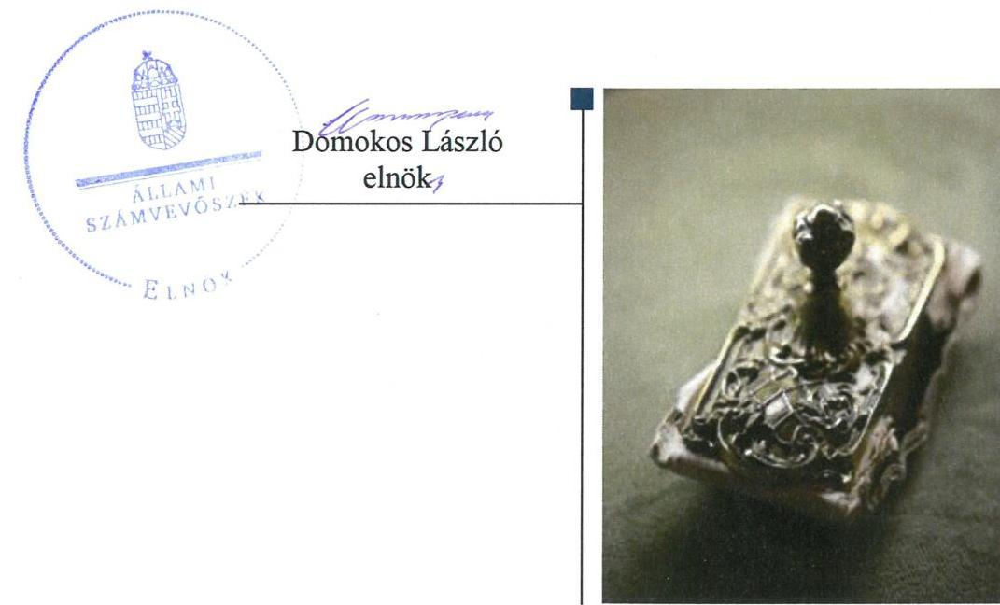
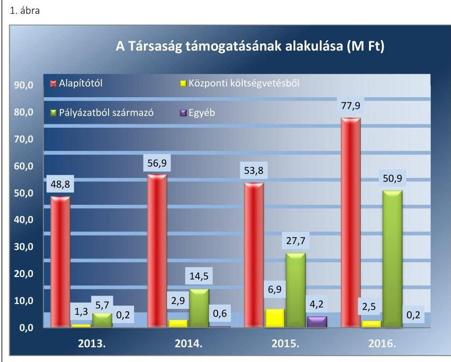
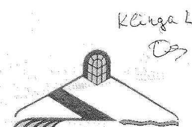
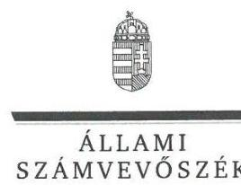
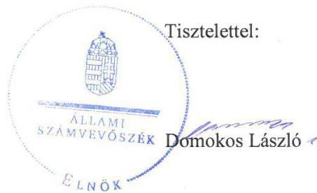
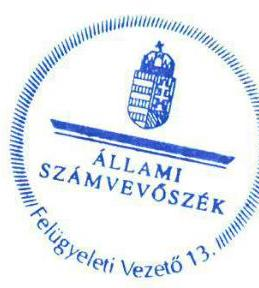

# Jelentés 

## Az önkormányzatok gazdasági társaságai

Az önkormányzatok többségi tulajdonában lévő gazdasági társaságok gazdálkodásának ellenőrzése - Gyulasport Sportlétesítményeket Működtető, Utánpótlás Nevelő Sportiskola, Sportszervező és Szolgáltató Nonprofit Kft. 2018.

---

# Jelentés 

## Az önkormányzatok gazdasági társaságai

Az önkormányzatok többségi tulajdonában lévő gazdasági társaságok gazdálkodásának ellenőrzése - Gyulasport Sportlétesítményeket Működtető, Utánpótlás Nevelő Sportiskola, Sportszervező és Szolgáltató Nonprofit Kft.
2018. fusin hó be. nap

---

# AZ ELLENŐRZÉST FELÜGYELTE:

- **KLINGA LÁSZLÓ** felügyeleti vezető
- **AZ ELLENŐRZÉST VEZETTE ÉS A VÉGREHAJTÁSÁÉRT FELELŐS:**
  - **HOFMEISTER LÁSZLÓ** ellenőrzésvezető
  - **A PROGRAM ÖSSZEÁLLÍTÁSÁÉRT FELELŐS:**
    - **TÓTPÁL SZABOLCS** osztályvezető

**IKTATÓSZÁM:** EL-0225-046/2018

**TÉMASZÁM:** 2447

**ELLENŐRZÉS-AZONOSÍTÓ SZÁM:** V-079383

Jelentéseink az Országgyűlés számítógépes hálózatán és az Interneten a www.asz.hu címen is olvashatóak.

---

# TARTALOMJEGYZÉK 

■ ÖSSZEGZÉS ..... 5
■ AZ ELLENŐRZÉS CÉLJA ..... 6
■ AZ ELLENŐRZÉS TERÜLETE ..... 7
■ AZ ELLENŐRZÉS HÁTTERE, INDOKOLTSÁGA ..... 9
■ A JELENTÉS LÉNYEGES KÉRDÉSKÖREI ..... 10
■ ELLENŐRZÉS HATÓKÖRE ÉS MÓDSZEREI ..... 11
■ MEGÁLLAPÍTÁSOK ..... 13
■ JAVASLATOK ..... 15
■ MELLÉKLETEK ..... 17
I. sz. melléklet: Értelmező szótár ..... 17
II. sz. melléklet: 2013-2016. évi egyszerüsített éves beszámoló adatok. ..... 18
■ FÜGGELÉK: ÉSZREVÉTELEK ..... 19
■ RÖVIDÍTÉSEK JEGYZÉKE ..... 25

---

.

---

# ÖSSZEGZÉS 

A Gyulasport Sportlétesítményeket Működtető, Utánpótlás Nevelő Sportiskola, Sportszervező és Szolgáltató Nonprofit Kft. feletti tulajdonosi joggyakorlás kialakításával és szabályszerű gyakorlásával Gyula Város Önkormányzata megteremtette a Társaság szabályszerű működésének feltételeit. A Társaság szabályozottsága megfelelt a jogszabályi előírásoknak, vagyongazdálkodási tevékenysége nem volt szabályszerű, mert könyvvezetése nem volt bizonylattal alátámasztva. A Társaság a közérdekű adatokat közzétette, biztosította működésének és gazdálkodásának átláthatóságát.

## Az ellenőrzés társadalmi indokoltsága

Magyarországon az önkormányzatok kötelező és önként vállalt feladataik ellátása során egyre szélesebb körben alkalmazzák a költségvetési szerveken kívüli feladatellátást, ezáltal az önkormányzati tulajdonú gazdasági társaságok is kiemelt fontosságú szerephez jutnak a lakossági szolgáltatások biztosításában. Az önkormányzatok többségi tulajdonában álló gazdasági társaságok ellenőrzése kiemelt jelentőségű, mivel működésük hatással van a tulajdonos önkormányzat gazdálkodására, gazdálkodásának egyes elemei befolyásolják az önkormányzati alszektor hiányát és az államadósságot.

Az Állami Számvevőszék stratégiájában célul tűzte ki az államháztartáson kívül működő szervezetek ellenőrzését, mely hozzájárul a közpénzek szabályos, átlátható, elszámoltatható és eredményes felhasználásához. A Gyulasport Sportlétesítményeket Működtető, Utánpótlás Nevelő Sportiskola, Sportszervező és Szolgáltató Nonprofit Kft. tevékenysége a városban élő lakosság széles rétegét érintette a városi sportcsarnok és sporttelepek működtetésén, továbbá az egyes sportágak tekintetében ellátott utánpótlás-nevelési feladatok szervezésén keresztül.

## Főbb megállapítások, következtetések

Az Önkormányzat a Társaság feletti tulajdonosi joggyakorlásának kereteit a jogszabályoknak megfelelően alakította ki. A tulajdonosi jogait szabályszerűen gyakorolta, a Társaság üzleti terveit és beszámolóit jóváhagyta.

A Társaság a megfelelő számviteli szabályozottság kialakításával megteremtette a szabályszerű működés feltételeit.

A Társaság vagyongazdálkodása nem volt szabályszerű, mert a könyvvezetés nem volt bizonylattal alátámasztva. A mérlegben kimutatott eszközöket és forrásokat szabályszerű leltárral alátámasztotta, vagyonát megőrizte.

A Társaság az előírt tervezési és beszámolási kötelezettségét teljesítette. Közérdekű adatait közzétette a Társaság, biztosítva ezzel működésének átláthatóságát.

A bevételek és ráfordítások elszámolása a személyi ráfordítások kivételével nem volt szabályszerű.

---

# AZ ELLENŐRZÉS CÉLJA 

Az ellenőrzés célja annak értékelése volt, hogy az önkormányzat vagyongazdálkodási tevékenysége során szabályszerűen gyakorolta-e tulajdonosi jogait, a gazdasági társaság szabályozottsága, gazdálkodása és vagyongazdálkodási tevékenysége, bevételeinek és ráfordításainak elszámolása megfelelt-e a jogszabályi és tulajdonosi előírásoknak.

---

# AZ ELLENŐRZÉS TERÜLETE 

## Gyula Város Önkormányzata és a kizárólagos tulajdonában lévő Gyulasport Sportlétesítményeket Működtető, Utánpótlás Nevelő Sportiskola, Sportszervező és Szolgáltató Nonprofit Korlátolt Felelősségű Társaság

A Társaság ${ }^{1}$-ot az Önkormányzat² alapította egyedüli tagként a 2009. évben. A Társaság jegyzett tőkéjének összege 297,4 M Ft - az ellenőrzött időszakban nem változott. A jegyzett tőke 3,0 M Ft készpénzből és 294,4 M Ft apportból állt.

A Társaság közfeladatot ellátó, közhasznú jogállású szervezetként működött. A Társaság főtevékenysége az önkormányzati sportlétesítmények, ennek keretében elsősorban a városi sportcsarnok és másik két nagyobb városi sporttelep működtetése volt. Emellett szervezte és bonyolította három sportág (atlétika, kézilabda, kosárlabda) utánpótlás-nevelési feladatainak ellátását. A Társaság a közhasznú feladatai ellátása mellett kiegészítő jelleggel vállalkozási (bérbeadási és hirdetési) tevékenységet is végzett. A vállalkozási tevékenységekből származó bevételek az értékesítés nettó árbevételéből átlagosan $22,8 \%$-ot tettek ki.

Az Önkormányzat a feladatellátásához szükséges infrastruktúrát alapításkor apportként adta a Társaság tulajdonába, illetve további ingatlanok térítésmentes használatba adásával is biztosította a Társaság működését. Az Önkormányzat vagyonkezelésbe vagyont nem adott át a Társaság részére.

A Társaság nem tartozott az ellenőrzött időszakban a kormányzati szektorba sorolt szervezetek közé.

A Társaság könyvvizsgáló megbízására a Számv. tv. ${ }^{3}$ alapján nem volt kötelezett.

A Társaság 2013-2016. évi egyszerűsített éves beszámolóinak főbb adatait a II. melléklet mutatja be.

Az ellenőrzött időszakban a Társaság vagyona 51,8\%-kal nőtt, az értékesítés nettó árbevétele 28,6\%-kal csökkent. A Társaság a 2013. év kivételével nyereségesen működött, a 2014-2016. években összesen 6,6 M Ft adózott eredményt ért el. A munkavállalók átlagos statisztikai állományi létszáma a 2013. évi 14 főről 2016. évre 15 főre emelkedett.

A Társaság önkormányzati támogatása kisebb, míg a pályázatokon elnyert támogatása jelentősebb mértékben növekedett a 2013-2016. évek között. A Társaság támogatásának alakulását az 1. ábra mutatja be.

---

*Forrás: 2013-2016. évi egyszerűsített éves beszámolók, főkönyvi kivonatok*

A polgármester és a jegyző személyében a 2013-2016. évek között nem történt változás. A Társaság ügyvezetője a 2015. évtől töltötte be tisztségét.

---

# AZ ELLENŐRZÉS HÁTTERE, INDOKOLTSÁGA 

Az önkormányzatok többségi tulajdonában álló gazdasági társaságok ellenőrzése kiemelten fontos a vagyon megőrzése, megóvása érdekében, valamint a kormányzati szektor elszámolásaiban megjelenő önkormányzati tulajdonú gazdálkodó szervezetek esetében, amelyekkel szemben alapvető követelmény, hogy gazdálkodásuk, működésük szabályszerű, az általuk szolgáltatott adatok minél megbízhatóbbak legyenek.

A feladatellátás költségeinek, ráfordításainak alakulása a lakosság széles rétegét érinti. Az ellenőrzés várható hasznosulásaként ellenőrzéseink feltárhatják, hogy az önkormányzat a feladatellátásához rendelt vagyon működtetését a tulajdonostól elvárható gondossággal végezte-e, a feladatot ellátó gazdasági társaság a létesítő okiratban, szolgáltatási szerződésben foglaltak betartásával biztosította-e a feladat ellátását. Az ellenőrzés rávilágíthat arra, hogy a gazdasági társaság a vagyon használatával biztosította-e a szolgáltatás folytatásának feltételeit, az önkormányzat tulajdonosi felügyelete hozzájárult-e a szabályszerű gazdálkodáshoz és feladatellátáshoz.

A megállapítások alapján megfogalmazott számvevőszéki javaslatok hasznosítása elősegítheti a meglévő hibák megszüntetését. A jó gyakorlatok bemutatásával az Állami Számvevőszék hozzájárul a követendő megoldások megismertetéséhez, terjesztéséhez.

---

# A JELENTÉS LÉNYEGES KÉRDÉSKÖREI 

1.     - A tulajdonosi jogok gyakorlása szabályszerű volt-e?
2.     - A Társaság szabályozottsága, gazdálkodása és vagyongazdál- kodási tevékenysége megfelelt-e az előírásoknak?

---

# ELLENŐRZÉS HATÓKÖRE ÉS MÓDSZEREI 

## Az ellenőrzés típusa

Megfelelőségi ellenőrzés.

## Az ellenőrzött időszak

2013. január 1-jétől 2016. december 31-ig.

## Az ellenőrzés tárgya

Gyula Város Önkormányzatának tulajdonosi joggyakorlása, valamint a Gyulasport Sportlétesítményeket Működtető, Utánpótlás Nevelő Sportiskola, Sportszervező és Szolgáltató Nonprofit Korlátolt Felelősségű Társaság gazdálkodásának szabályozottsága és szabályszerűsége volt az ellenőrzés tárgya.

Az ellenőrzés kiterjedt minden olyan körülményre és adatra, amely az ÁSZ ${ }^{4}$ jogszabályban meghatározott feladatainak teljesítéséhez, valamint a program végrehajtása folyamán felmerült újabb összefüggések feltárásához szükséges volt.

## Az ellenőrzött szervezet

Gyula Város Önkormányzata és a kizárólagos tulajdonában lévő Gyulasport Sportlétesítményeket Működtető, Utánpótlás Nevelő Sportiskola, Sportszervező és Szolgáltató Nonprofit Korlátolt Felelősségű Társaság

## Az ellenőrzés jogalapja

Az ellenőrzés jogalapját az ÁSZ tv. ${ }^{5}$ 1. § (3) bekezdése és 5. § (3)-(5) bekezdései képezik.

## Az ellenőrzés módszerei

Az ellenőrzést a nemzetközi standardokat irányadónak tekintve az ellenőrzési program ellenőrzési kérdései, az ellenőrzött időszakban hatályos jogszabályok, az ellenőrzés szakmai szabályok és módszertanok figyelembe vételével végeztük.

---

Az ellenőrzés ideje alatt az ellenőrzött szervezettel történő kapcsolattartást az ÁSZ Szervezeti és Működési Szabályzatának vonatkozó előírásai alapján biztosítottuk.

Az ellenőrzés a kizárólagos tulajdonosi jogokat gyakorló önkormányzatra, és az ellenőrzött gazdasági társaságra terjedt ki.

Az ellenőrzési kérdések megválaszolásához szükséges bizonyítékok megszerzése a következő ellenőrzési eljárások alkalmazásával történt: megfigyelés, kérdésfeltevés (információkérés), összehasonlítás, valamint elemző eljárás. Az ellenőrzési bizonyítékként felhasználható adatforrások közé tartoztak egyrészt az ellenőrzési programban felsorolt adatforrások, másrészt adatforrás lehet még minden - az ellenőrzés folyamán - feltárt, az ellenőrzés szempontjából információkat tartalmazó dokumentum.

Az ellenőrzést a kérdésekre adott válaszok kiértékelésével, valamint a megjelölt adatforrások, a csatolt tanúsítványok felhasználásával, továbbá az adott időszakban hatályos jogszabályok figyelembe vételével folytattuk le.

A személyi jellegű ráfordítások elszámolása terén a szabályszerű működést véletlen mintavétellel ellenőriztük. A mintavétellel ellenőrzött területet esetében minden egyes tétel vonatkozásában a szabályszerűségre vonatkozó kérdéseket tettünk fel, amelyek eredménye összesítésre került. Megfelelőnek értékeltük az ellenőrzött területet, amennyiben 95\%-os bizonyossággal a teljes sokaságban az átlagos hibaarány legfeljebb 10\%, nem megfelelőnek, amennyiben 10\%-nál magasabb arányt képviselt. Abban az esetben, ha a teljes sokaság tekintetében a 10\%-os hibaarányhoz való viszony megítélésének megbízhatósága nem érte el a 95\%-ot, annak elérése érdekében értékelésünket további szempontokkal egészítettük ki, és figyelembe vettük a feltárt hibák típusát és súlyát.

---

# 1. A tulajdonosi jogok gyakorlása szabályszerű volt-e? 

Összegző megállapítás

A tulajdonosi joggyakorlás kereteinek kialakítása és a tulajdonosi jogok gyakorlása megfelelő volt.

A TÁRSASÁG FELETTI TULAJDONOSI JOGOK gyakorlásának rendjét az Önkormányzat az önkormányzati SZMSZ ${ }_{1-7}{ }^{8}$-ben, a Vagyongazdálkodási rendelet ${ }_{1-2}{ }^{7}$-ben, valamint az Alapító okirat ${ }_{1-5}{ }^{8}$-ban a Gt. ${ }^{9}$ és a Ptk. ${ }^{10}$ rendelkezéseivel összhangban szabályozta. Az Alapító okirat ${ }_{1-5}$ rögzítette az Alapító ${ }^{11}$ kizárólagos hatáskörébe tartozó feladatokat.

A Társaság feladatellátásához kapcsolódó általános követelményeket az Önkormányzat és a Társaság között 2011-ben megkötött Közhasznú szerződés ${ }^{12}$-ben, a 2014-ben megkötött Közszolgáltatási keretszerződés ${ }_{1-2}{ }^{13}$ ben, valamint az éves támogatási szerződésekben határozta meg. A háromtagú $\mathrm{FB}^{14}$-t a Társaságnál a Gt.-ben és a Taktv. ${ }^{15}$-ben előírtak szerint hozták létre. Az FB az ellenőrzött időszakban a Gt. 34. § (4) bekezdése és a Ptk. 3:122. § (3) bekezdése, valamint az Alapító okirat ${ }_{1-5}$ előírása ellenére nem rendelkezett ügyrenddel.

A Társaság a Taktv.-ben előírt Javadalmazási szabályzat ${ }^{16}$-tal 2013. november 21-étől rendelkezett, mely tartalmilag megfelelt a Taktv.-ben foglaltaknak.

ÜZLETI TERV készítésének kötelezettségét a Társaság SZMSZ ${ }^{17}$-e rögzítette. Az éves üzleti tervet az Alapító minden évben határozatával jóváhagyta.

AZ ÉVES BESZÁMOLÓKAT és a közhasznúsági mellékletet az Alapító a jogszabályi előírásokkal összhangban, az FB írásbeli határozatainak ismeretében tárgyalta meg, majd fogadta el. Az Alapító a Társaság 2014-2016. évi nyereségét eredménytartalékba helyezte.

---

# 2. A Társaság szabályozottsága, gazdálkodása és vagyongazdálkodási tevékenysége megfelelt-e az előírásoknak? 

Összegző megállapítás

A Társaság számviteli szabályozottsága megfelelő volt, ugyanakkor a Társaság gazdálkodása és vagyongazdálkodása nem volt szabályszerű, mert könyvvezetése nem volt bizonylattal alátámasztva.

### 2.1. számú megállapítás

A Társaság számviteli szabályozottsága megfelelő volt.
A Társaság rendelkezett a Számv. tv. ${ }^{18}$-ben előírt Számviteli politika $1 .{ }^{19}$-val, Leltározási szabályzat ${ }^{20}$-tal, Értékelési szabályzat ${ }^{21}$-tal, Pénzkezelési szabályzat ${ }^{22}$-tal, valamint Számlarend ${ }_{1-2}{ }^{23}$-del. A szabályzatok megfeleltek a Számv. tv. előírásainak.
2.2. számú megállapítás

A Társaság gazdálkodása és vagyongazdálkodási tevékenysége nem volt szabályszerű,

 bevételeinek és ráfordításainak elszámolása - a személyi jellegű ráfordítások kivételével - nem volt szabályszerű.

A bevételek, valamint az anyagjellegű, a pénzügyi műveletek és az egyéb ráfordítások, valamint az értékcsökkenési leírás számviteli elszámolása nem volt szabályszerű, mert a Társaság a könyvviteli elszámolást számviteli bizonylatokkal a Számv. tv. 165. § (2) bekezdésében előírtak ellenére nem támasztotta alá.

A személyi jellegű ráfordítások elszámolása szabályszerű volt.
Az egyszerűsített éves beszámolóit a Társaság a Számv. tv.-ben foglaltak szerint készített leltárakkal minden évben alátámasztotta, az analitikus nyilvántartásokat és a főkönyvi számlákat az előírások szerint egyeztette.

A Társaság vagyonát érintően a 2013-2016. években összesen 101,0 M Ft értékben végzett beruházást, felújítást, melyek 2,3-szer nagyobb összeget jelentettek az ugyanezen időszakban könyvelt értékcsökkenéshez (44,0 M Ft) képest. A Társaság eszközeinek pótlását az 1. táblázat mutatja be.
2.3. számú megállapítás

A Társaság a beszámolási és közzétételi kötelezettségét teljesítette.

## BESZÁMOLÁSI KÖTELEZETTSÉGÉT a Társaság a jogszabályban előírtaknak megfelelően teljesítette.

A KÖZÉRDEKŰ ADATOK nyilvánosságra hozatalával kapcsolatos kötelezettségeinek eleget tettek.

A közérdekű adatok megismerésére irányuló igények teljesítésének rendjét rögzítő szabályzattal nem rendelkezett a Társaság az Info. tv. 30. § (6) bekezdése előírása ellenére.

---

# JAVASLATOK 

Az ÁSZ tv. 33. § (1) bekezdésében foglaltak értelmében az ellenőrzött szervezet vezetője köteles a jelentésben foglalt megállapításokhoz kapcsolódó intézkedési tervet összeállítani és azt a jelentés kézhezvételétől számított 30 napon belül az ÁSZ részére megküldeni. Amennyiben az ellenőrzött szervezet vezetője nem küldi meg határidőben az intézkedési tervet, vagy továbbra sem elfogadható intézkedési tervet küld, az Állami Számvevőszék elnöke az ÁSZ tv. 33. § (3) bekezdése a) és b) pontjaiban foglaltakat érvényesítheti.

## Gyulasport Sportlétesítményeket Működtető, Utánpótlás Nevelő Sportiskola, Sportszervező és Szolgáltató Nonprofit Kft. ügyvezetőjének

1. Intézkedjen a bevételek, valamint az anyagjellegű ráfordítások, pénzügyi műveletek ráfordításai, egyéb ráfordítások és értékcsökkenési leírás számviteli elszámolásának jogszabályban előírtaknak megfelelő bizonylattal történő alátámasztásáról.
(2.2. sz. megállapítás 1. bekezdése alapján)
2. Intézkedjen a közérdekű adatok megismerésére irányuló igények teljesítése rendjét rögzítő szabályzat elkészítéséről a jogszabályi előírásoknak megfelelően.
(2.3. sz. megállapítás 3. bekezdése alapján)

## Gyula Város Önkormányzata polgármesterének

1. Kezdeményezze, hogy a felügyelőbizottság a jogszabályi előírásoknak megfelelően állapítsa meg ügyrendjét.
(1. sz. megállapítás 2. bekezdés 3. mondata alapján)

---

.

---

# MELLÉKLETEK 

- I. SZ. MELLÉKLET: ÉRTELMEZŐ SZÓTÁR
gazdasági társaság
non-profit gazdasági társaság
közhasznú tevékenység
nemzeti vagyon

A Ptk. 3:88. § (1) bekezdése szerint „a gazdasági társaságok üzletszerű közös gazdasági tevékenység folytatására, a tagok vagyoni hozzájárulásával létrehozott, jogi személyiséggel rendelkező vállalkozások, amelyekben a tagok a nyereségből közösen részesednek, és a veszteséget közösen viselik" (hatályos 2014. március 15-től)
2006. évi V. tv. (Ctv.) 9/F. § (2) bekezdése szerint: „az a gazdasági társaság minősül nonprofit gazdasági társaságnak és cégnevében az a gazdasági társaság tüntetheti fel a nonprofit jelleget, amelynek létesítő okirata tartalmazza, hogy a gazdasági társaság tevékenységéből származó nyereség a tagok között nem osztható fel, hanem az a gazdasági társaság vagyonát gyarapítja." (hatályos 2006. január 4-től)
minden olyan tevékenység, amely a létesítő okiratban megjelölt közfeladat teljesítését közvetlenül vagy közvetve szolgálja, ezzel hozzájárulva a társadalom és az egyén közös szükségleteinek kielégítéséhez;
a) az állam vagy a helyi önkormányzat kizárólagos tulajdonában álló dolgok,
b) az a) pont hatálya alá nem tartozó, állam vagy a helyi önkormányzat tulajdonában lévő dolog,
c) az állam vagy a helyi önkormányzat tulajdonában lévő pénzügyi eszközök, továbbá az államot vagy a helyi önkormányzatot megillető társasági részesedések,
d) az államot vagy a helyi önkormányzatot megillető bármely vagyoni értékkel rendelkező jogosultság, amelyet jogszabály vagyoni értékű jogként nevesít,
e) Magyarország határa által körbezárt terület feletti légtér,
f) az üvegházhatású gázok kibocsátási egységeinek kereskedelméről szóló törvény szerint kibocsátási egység és légiközlekedési kibocsátási egység, valamint az ENSZ Éghajlatváltozási Keretegyezménye és annak Kiotói Jegyzőkönyv végrehajtási keretrendszeréről szóló törvény szerinti kiotói egység,
g) állami vagy helyi önkormányzati fenntartású közgyűjtemény (muzeális intézmény, levéltár, közgyűjteményként működő kép- és hangarchívum, valamint könyvtár) saját gyűjteményében nyilvántartott kulturális javak körébe tartozó dolog, kivéve, ha az állami vagy önkormányzati tulajdon jogszerű létrejötte kétséget kizáró módon nem bizonyítható és a dologra nézve más a tulajdonjogát bizonyítja vagy a kulturális javakra vonatkozó jogszabályokban meghatározott eljárás keretében valószínűsíti (g. pont módosult 2013. december 7-től),
h) a régészeti lelet,
i) a nemzeti adatvagyon körébe tartozó állami nyilvántartások fokozottabb védelméről szóló törvény szerinti nemzeti adatvagyon.
Forrás: Nvtv. ${ }^{24}$ 1. § (2)

---

II. SZ. MELLÉKLET: 2013-2016. ÉVI EGYSZERŰSÍTETT ÉVES BESZÁMOLÓ ADATOK

| A TÁRSASÁG 2013-2016. ÉVI EGYSZERŰSÍTETT ÉVES BESZÁMOLÓINAK FŐBB ADATAI (M FT-BAN) |  |  |  |  |   |
| --- | --- | --- | --- | --- | --- |
|  Megnevezés | 2013. év | 2014. év | 2015. év | 2016. év | 2016/2015. év (\%)  |
|  Mérlegfőösszeg | 385,3 | 393,5 | 442,6 | 584,8 | 151,8  |
|  Befektetett eszközök | 363,2 | 359,9 | 360,4 | 416,9 | 114,8  |
|  - ebből tárgyi eszközök | 363,2 | 359,9 | 360,4 | 416,9 | 114,8  |
|  Forgóeszközök | 20,5 | 33,2 | 82,1 | 167,8 | 818,5  |
|  - ebből készletek | 0,1 | 0,2 | 0,2 | 2,6 | 2600,0  |
|  - ebből követelések | 2,8 | 0,4 | 3,1 | 7,5 | 267,9  |
|  - ebből vevőkövetelések | 2,3 | 0,0 | 0,1 | 5,1 | 221,7  |
|  - ebből pénzeszközök | 17,6 | 32,6 | 78,8 | 157,7 | 896,0  |
|  Aktív időbeli elhatárolás | 1,6 | 0,4 | 0,1 | 0,1 | 6,3  |
|  Saját tőke | 296,8 | 302,1 | 302,7 | 303,4 | 102,2  |
|  Jegyzett tőke | 297,4 | 297,4 | 297,4 | 297,4 | 100,0  |
|  Eredménytartalék | 5,6 | -0,6 | 4,7 | 5,3 | 94,6  |
|  Adózott eredmény | -6,2 | 5,3 | 0,6 | 0,7 | -  |
|   |  |  |  | Forrás: 2013-2016. évi egyszerűsített éves beszámolók |   |

---

# FÜGGELÉK: ÉSZREVÉTELEK 

A jelentéstervezetet a Számvevőszék 15 napos észrevételezésre megküldte az ellenőrzött szervezetek vezetőinek az ÁSZ tv. 29. § (1) bekezdése előírásának megfelelően.

Gyula Város Önkormányzatának polgármestere az ÁSZ tv 29. § (2) bekezdésében foglalt észrevételezési jogával nem élt, a jelentéstervezetre észrevételt nem tett. A Gyulasport Sportlétesítményeket Működtető, Utánpótlás Nevelő Sportiskola, Sportszervező és Szolgáltató Nonprofit Kft. ügyvezetőjének észrevételét és az arra adott választ a függelék tartalmazza.

[^0]
[^0]:    * 29. § (1) Az Állami Számvevőszék az ellenőrzési megállapításait megküldi az ellenőrzött szervezet vezetőjének vagy az általa megbízott személynek, és annak, akinek személyes felelősségét állapította meg.
    (2) Az ellenőrzött szervezet vezetője és a felelősként megjelölt személy az ellenőrzés megállapításaira tizenöt napon belül írásban észrevételt tehet.
    (3) Az Állami Számvevőszék az észrevételre a beérkezésétől számított harminc napon belül írásban válaszol. A figyelembe nem vett észrevételeket köteles a jelentésben feltüntetni, és megindokolni, hogy azokat miért nem fogadta el.

---

# Gyulasport Nonprofit Kft. 

5700 Gyula, Ajtósy u.2-10.
Adószám:20593276-2-04
Tel.: +3620/234-0408
Tel/Fax: +3666/463-870
Email: gyulasportkft@gmail.com

## ÁLLAMI SZÁMVEVŐSZÉK   1364 Budapest 4., Pf. 54.

## Domokos László elnök

Ikt. sz. EL-0563-013/2018.
Ellenőrzés-azonosító szám: V0793

## 

## ÁLLAMI SZÁMVEVŐSZÉK

36-29742101511
Kelt: 2019. MÁJUS 28.
Iktatószám: EL - 5563 - 015/2018
Melléklet:

Tisztelt Elnök úr!
A részünkre 2018. 05. 02. napján megküldött fenti hivatkozási számú, az önkormányzatok többségi tulajdonában lévő gazdasági társaságok gazdálkodásának ellenőrzése - Gyulasport Sportlétesítményeket Működtető, Utánpótlás Nevelő Sportiskola, Sportszervező és Szolgáltató Nonprofit Kft. című számvevőszéki jelentéstervezettel kapcsolatosan az alábbi észrevételeket kívánom tenni:

1. A Társaság gazdálkodási és vagyongazdálkodási tevékenységével kapcsolatosan Önök a 2.2 sz. megállapításban az alábbiakat közölték:
„A bevételek, valamint az anyagjellegű, a pénzügyi műveletek és az egyéb ráfordítások, valamint az értékcsökkenési leírás számviteli elszámolása nem volt szabályszerű, mert a Társaság a könyvviteli elszámolást számviteli bizonylatokkal a Számv. tv. 165. § (2) bekezdésében előírtak ellenére nem támasztotta alá."

## Észrevétel:

Az Állami Számvevőszék az eljárás során négy körben kért a Gyulasport Nonprofit Kft-től adatszolgáltatást.
1.1 Első alkalommal 2017. október 11-én kelt EL-0225-003/2017 iktatószámú levelükben 2013. január 1. és 2016. december 31. közötti időszakra kérték az alábbi sarkalatos dokumentumokat, melyeket maradéktalanul feltöltöttünk:

- A gazdasági társaság létesítő okirata / Cégbírósági bejegyzési dokumentuma / Részvénytársaság esetében részvénykönyv (tulajdonosi összetétele)
- Gazdasági társaság számviteli politikája
- A gazdasági társaság ellenőrzött időszakban készített éves beszámolói (közte a leltár, és a leltárt alátámasztó dokumentumok)
- A társaság által kezelt vagyon nyilvántartása (az ellenőrzött időszakban)
- Aláírási címpéldányok (kötelezettségvállalásokhoz, utalványozáshoz)
1.2 Második körben 2017. november 10-én kelt EL-0225-012/2017 iktatószámú levelükben az alapítás dokumentumait, szabályzatokat, egyéb dokumentumokat kértek tőlünk, valamint adatállományokat mintavételezéshez, amely során megadták a kért

---

dokumentumok kötelező minimum adattartalmát. Ezeket a dokumentumokat szintén feltöltöttük. Ebben a körben konkrét bizonylatok, számlák bekérése nem történt meg.
1.3 Harmadik és negyedik alkalommal (2017. december 14, ikt. sz. EL-0225-029/2017 és 2018. január 15., ikt. sz. EL-0225-043/2018) pedig kizárólag személyi jellegű ráfordításokat igazoló bizonylatokat kértek tőlünk, amelynek szintén maradéktalanul eleget tettünk - ez a jelentéstervezet 2.2 pontjában Önök úgy értékelték, hogy „A személyi jellegű ráfordítások elszámolása szabályszerű volt."

Mint ahogy a fenti felsorolásból is kitűnik, az ellenőrzés során nem kaptunk olyan jellegű adatbekérést, amelyben konkrét számviteli bizonylatokkal, számlákkal kérik alátámasztani a Társaság gazdálkodását, könyvvezetését. Csakis a főkönyvi adatbázisból kértek tőlünk adatokat, melyeket maradéktalanul az ÁSZ rendelkezésére bocsátottunk. Ezekből viszont nem kértek tőlünk mintatételek ellenőrzéséhez kapcsolódó dokumentumokat, azaz mintavételezésre konkrét számviteli bizonylatokat, így az Elektronikus Adatszolgáltatási Rendszerbe sem töltöttünk fel ilyen jellegű anyagot, ezek nyitott sorokként jelennek meg.

Természetesen társaságunknak az összes, könyvvezetést alátámasztó bizonylata és dokumentuma a rendelkezésünkre áll (összes vevő és szállítói számla, pénztárbizonylat, banki kivonat, szerződés, megrendelés és annak visszaigazolása), azokat a számviteli törvényben előírtaknak megfelelően kezeljük és könyveljük, így amennyiben hiánypótlásra kerül sor, ezeket egy konkrét adatbekérés esetén bármikor be tudjuk mutatni.

Ugyanígy rendelkezésre állnak a tárgyi eszköz nyilvántartó kartonok, amelyeken az analitikus értékcsökkenés elszámolás is fel van tüntetve. Szintén rendelkezésünkre áll minden tárgyi eszköz állományba vételről az állományba vételi bizonylat.

# 2. A jelentéstervezet 2.3 pontjában megállapították, hogy 

„A közérdekű adatok megismerésére irányuló igények teljesítésének rendjét rögzítő szabályzattal nem rendelkezett a Társaság az Info. tv. 30. § (6) bekezdése előírása ellenére."

## Észrevétel:

Az ÁSZ Jelentéstervezetének 2.3. számú megállapításában szerepel, hogy „Beszámolási kötelezettségét a Társaság a jogszabályban előírtaknak megfelelően teljesítette" - annak ellenére, hogy nem rendelkeztünk a megfelelő szabályzattal. A hiányosság megállapítását tudomásul vettük, a közérdekű adatok megismerésére irányuló igények teljesítésének rendjét
 rögzítő szabályzat elkészítését megkezdtük.

Kérem a Tisztelt Elnök urat, hogy fenti észrevételeinket a végleges jelentés elkészítésénél szíveskedjenek figyelembe venni.

Gyula, 2018. május 10.

Tisztelettel:

GYULASPORT NONPROFIT KFT, 6700 Gyula, Adjessy u. 2-10, Tel./Fax 60863-670
GTP Gyula: 1173-067-26094129 Adószám: 20583276-244

Kertes István ügyvezető
Gyulasport Nonprofit Kft.

---

ELNÖK

Ikt.szám: EL-0563-018/2018.

# Kertes István úr 

ügyvezető
Gyulasport Sportlétesítményeket Működtető, Utánpótlás Nevelő Sportiskola, Sportszervező és Szolgáltató Nonprofit Kft.

Gyula

## Tisztelt Ügyvezető Úr!

Köszönettel vettem „Az önkormányzatok gazdasági társaságai - Az önkormányzatok többségi tulajdonában lévő gazdasági társaságok gazdálkodásának ellenőrzése - Gyulasport Sportlétesítményeket Működtető, Utánpótlás Nevelő Sportiskola, Sportszervező és Szolgáltató Nonprofit Kft." című ellenőrzésről készített számvevőszéki jelentéstervezetre megküldött észrevételeit.
Az Állami Számvevőszék észrevételekre vonatkozó álláspontját a felügyeleti vezető által készített részletes tájékoztatás tartalmazza, amelyet levelemhez mellékeltem. Tájékoztatom Ügyvezető urat, hogy az Állami Számvevőszék a figyelembe nem vett észrevételeket az Állami Számvevőszékről szóló 2011. évi LXVI. törvény 29. § (3) bekezdésében előírtak szerint köteles a jelentésében feltüntetni és megindokolni, hogy azokat miért nem fogadta el.

Budapest, 2018. 06. hó 0. nap

Melléklet: Tájékoztatás az észrevételek kezeléséről

---

# Tájékoztatás az észrevételek kezeléséről 

Megköszönöm Ügyvezető úrnak „Az önkormányzatok gazdasági társaságai - Az önkormányzatok többségi tulajdonában lévő gazdasági társaságok gazdálkodásának ellenőrzése - Gyulasport Sportlétesítményeket Működtető, Utánpótlás Nevelő Sportiskola, Sportszervező és Szolgáltató Nonprofit Kft." címmel készített jelentés-tervezetre tett észrevételeit. Az észrevételek kezeléséről az alábbi tájékoztatást adom:

## 1. A jelentéstervezet 2.2. számú megállapítás 1. bekezdéséhez füzött észrevétele kapcsán

Észrevételében jelezte, hogy az Állami Számvevőszék (továbbiakban: ÁSZ) négy alkalommal kért be adatot a Társaságtól, és az adatbekérés nem terjedt ki a megállapításban hivatkozott bevételek, anyagjellegű, a pénzügyi műveletek és az egyéb ráfordítások, valamint az értékcsökkenési leírás könyvviteli elszámolását alátámasztó számviteli bizonylatokra.

Az ÁSZ az ellenőrzését a megküldött ellenőrzési programnak megfelelően, a rendelkezésre bocsátott adatok és dokumentumok (bizonyítékok) alapján végezte. Az Állami Számvevőszékről szóló 2011. évi LXVI. törvény 28. § (2) bekezdése alapján a közreműködésre felhívott szervezet az ÁSZ részére - annak kérésére soron kívül, de legkésőbb öt munkanapon belül - az ellenőrzés lefolytatása érdekében a szükséges adatokat és dokumentumokat rendelkezésre bocsátja.

Az Ön által hivatkozott EL-0225-012/2017. iktatószámú adatbekérő levélben került sor az adatállományok mintavételezéséhez szükséges adatbázisok bekérésére. A Társaság az adatszolgáltatásra biztosított 5 nap alatt három ellenőrzési terület vonatkozásában nem töltötte fel teljes körűen a mintavételezéshez szükséges állományokat:

- Anyagjellegű ráfordítások, egyéb, rendkívüli és pénzügyi műveletek ráfordításai ellenőrzési terület esetében az „52 igénybevett szolgáltatások" és az „53 egyéb szolgáltatások" számlacsoportok főkönyvi számláinak 2013-2016. évi forgalmi adatait;
- A vagyonnyilvántartások és értékcsökkenési leírás ellenőrzési terület esetében az immateriális javak és tárgyi eszközök 2014. évi növekedési tételeit;
- Az értékesítés nettó árbevétele, egyéb, rendkívüli bevételek és pénzügyi műveletek bevételei ellenőrzési terület esetében a „98 rendkívüli bevételek" számlacsoport főkönyvi számláinak 2013-2014. évi forgalmi adatait.

A Társaság által megküldött főkönyvi kivonatok alapján a fent hivatkozott főkönyvi számlákon rögzítettek forgalmi adatokat az érintett években.

---

A bekért adatokra vonatkozó teljességi és hitelességi nyilatkozat 2/a. mellékletében foglalt kimutatás szerint a Társaság teljes körűen teljesítette az adatszolgáltatást, ezért úgy tekintettük, hogy a hivatkozott adatállományok nem állnak a Társaság rendelkezésére.

Fentiekre tekintettel észrevételét nem fogadom el, így a jelentéstervezet módosítása nem indokolt.

# 2. A jelentéstervezet 2.3. számú megállapítás 3. bekezdéséhez füzött észrevétele kapcsán 

Ügyvezető úr észrevételében - a közérdekű adatok megismerésére irányuló igények teljesítésének rendjét rögzítő szabályzat kidolgozásával kapcsolatban - adott tájékoztatást köszönettel tudomásul vettem. Az észrevétel a megállapítást nem vitatta, megállapításunkat megerősítette, így a jelentéstervezet módosítása nem indokolt.

Budapest, 2018. június 06.

Klinga László felügyeleti vezető

---

# RÖVIDÍTÉSEK JEGYZÉKE 

${ }^{1}$ Társaság
${ }^{2}$ Önkormányzat
${ }^{3}$ Szám. tv.
${ }^{4}$ ÁSZ
${ }^{5}$ ÁSZ tv.
${ }^{6}$ Önkormányzati SZMSZ1-7
${ }^{7}$ Vagyongazdálkodási rendelet ${ }_{1-2}$
${ }^{8}$ Alapító okirat ${ }_{1-5}$
${ }^{9}$ Gt.
${ }^{10}$ Ptk.
${ }^{11}$ Alapító
${ }^{12}$ Közhasznú szerződés
${ }^{13}$ Közszolgáltatási keretszerződés ${ }_{1-2}$
${ }^{14}$ FB
${ }^{15}$ Taktv.
${ }^{16}$ Javadalmazási szabályzat

Gyulasport Sportlétesítményeket Működtető, Utánpótlás Nevelő Sportiskola, Sportszervező és Szolgáltató Nonprofit Kft.
Gyula Város Önkormányzata
2000. évi C. törvény a számvitelről (hatályos 2001. január 1-jétől)

Állami Számvevőszék
2011. évi LXVI. törvény az Állami Számvevőszékről (hatályos 2011. július 1-jétől)

2/2013. (I. 25.) önkormányzati rendelet Gyula Város Önkormányzata Képviselőtestületének és szerveinek Szervezeti és Működési Szabályzatáról (hatályos 2013. február 1-jétől, módosítva: 2013. április 27-én, 2013. június 29-én, 2014. február 1-én, 2014. október 1-én, 2014. október 28-án és 2014. november 25-én)
Vagyongazdálkodási rendelet1: Gyula Város Önkormányzata képviselőtestületének 11/2003. (III. 28.) számú rendelete az önkormányzat vagyonáról és a vagyonhasznosítás szabályairól (hatályos 2003. március 28-tól)
Vagyongazdálkodási rendelet2: Gyula Város Önkormányzata Képviselőtestületének 31/2013. (XII. 23.) számú önkormányzati rendelete az önkormányzat vagyonáról és a vagyonhasznosítás szabályairól (hatályos 2014. január 1-jétől)
Gyulasport Sportlétesítményeket Működtető, Utánpótlás Nevelő Sportiskola, Sportszervező és Szolgáltató Nonprofit Kft. Alapító okirata (hatályos 2012. november 22-étől, módosítva: 2014. május 29-én, 2014. június 26-án, 2014. december 18-án és 2016. június 29-én.)
2006. évi IV. törvény a gazdasági társaságokról (hatálytalan 2014. március 15-től) 2013. évi V. törvény a Polgári Törvénykönyvről (hatályos 2014. március 15-től)

Gyula Város Önkormányzatának Képviselő-testülete mint tulajdonosi joggyakorló
Közhasznú szerződés Gyula Város Önkormányzata és Gyulasport Sportlétesítményeket Működtető, Utánpótlás Nevelő Sportiskola, Sportszervező és Szolgáltató Nonprofit Kft. között (hatályos 2011. június 20-tól)
Közszolgáltatási keretszerződés1: Közszolgáltatási keretszerződés Gyula Város Önkormányzata és Gyulasport Sportlétesítményeket Működtető, Utánpótlás Nevelő Sportiskola, Sportszervező és Szolgáltató Nonprofit Kft. között (hatályos 2014. június 26-tól)

Közszolgáltatási keretszerződés2: Közszolgáltatási keretszerződés Gyula Város Önkormányzata és Gyulasport Sportlétesítményeket Működtető, Utánpótlás Nevelő Sportiskola, Sportszervező és Szolgáltató Nonprofit Kft. között (hatályos 2015. szeptember 25-től)

Gyulasport Sportlétesítményeket Működtető, Utánpótlás Nevelő Sportiskola, Sportszervező és Szolgáltató Nonprofit Kft. felügyelőbizottsága
2009. évi CXXII. törvény a köztulajdonban álló gazdasági társaságok takarékosabb működéséről (hatályos 2009. december 4-től)
szabályzat a köztulajdonban álló gazdasági társaságok takarékosabb működéséről szóló 2009. évi CXXII. törvényben meghatározott, Gyula Város Önkormányzata többségi befolyása alatt álló gazdasági társaságok ügyvezetőire és felügyelő bizottsági tagjaira, valamint a munka törvénykönyvéről szóló 2012. évi I. tv. 208. § hatálya alá tartozó munkavállalókra vonatkozó javadalmazás elveiről (hatályos 2013. november 21-től, majd 2015. április 23-ától)

---

${ }^{17}$ társasági SZMSZ

18 Számv. tv.
${ }^{19}$ Számviteli Politika ${ }_{3-2}$
${ }^{20}$ Leltárszabályzat
${ }^{21}$ Értékelési szabályzat
${ }^{22}$ Pénzkezelési szabályzat ${ }_{3-5}$
${ }^{23}$ Számlarend ${ }_{3-2}$
${ }^{24}$ Nvtv.
Gyulasport Sportlétesítményeket Működtető, Utánpótlás Nevelő Sportiskola, Sportszervező és Szolgáltató Nonprofit Kft. szervezeti és működési szabályzata (hatályos 2009. december 17-étől)
2000. évi C. törvény a számvitelről (hatályos 2001. január 1-jétől)

Számviteli politika1: Gyulakonyha Élelmezési, Kereskedelmi és Szolgáltató Nonprofit Kft. számviteli politikája (hatályos 2009. július 24-től)
Számviteli politika2: Gyulakonyha Élelmezési, Kereskedelmi és Szolgáltató Nonprofit Kft. számviteli politikája (hatályos 2016. január 1-jétől)
Gyulakonyha Élelmezési, Kereskedelmi és Szolgáltató Nonprofit Kft leltárszabályzata (hatályos 2009. július 17-től)
Gyulakonyha Élelmezési, Kereskedelmi és Szolgáltató Nonprofit Kft értékelési szabályzata (hatályos 2009. július 17-től)
Pénzkezelési szabályzat3: Gyulasport Sportlétesítményeket Működtető, Utánpótlás Nevelő Sportiskola, Sportszervező és Szolgáltató Nonprofit Kft. pénzkezelési szabályzata (hatályos 2013. április 24-től)
Pénzkezelési szabályzat4: Gyulasport Sportlétesítményeket Működtető, Utánpótlás Nevelő Sportiskola, Sportszervező és Szolgáltató Nonprofit Kft. pénzkezelési szabályzata (hatályos 2013. december 16-tól)
Pénzkezelési szabályzat5: Gyulasport Sportlétesítményeket Működtető, Utánpótlás Nevelő Sportiskola, Sportszervező és Szolgáltató Nonprofit Kft. pénzkezelési szabályzata (hatályos 2014. november 15-től)
Pénzkezelési szabályzat6: Gyulasport Sportlétesítményeket Működtető, Utánpótlás Nevelő Sportiskola, Sportszervező és Szolgáltató Nonprofit Kft. pénzkezelési szabályzata (hatályos 2015. október 15-től)
Pénzkezelési szabályzat7: Gyulasport Sportlétesítményeket Működtető, Utánpótlás Nevelő Sportiskola, Sportszervező és Szolgáltató Nonprofit Kft. pénzkezelési szabályzata (hatályos 2016. február 1-jétől)
Számlarend1: Gyulasport Sportlétesítményeket Működtető, Utánpótlás Nevelő Sportiskola, Sportszervező és Szolgáltató Nonprofit Kft. Számlarendje (hatályos 2013. január 1-jétől)

Számlarend2: Gyulasport Sportlétesítményeket Működtető, Utánpótlás Nevelő Sportiskola, Sportszervező és Szolgáltató Nonprofit Kft. Számlarendje (hatályos 2014. március 1-jétől)
2011. évi CXCVI. törvény a nemzeti vagyonról (hatályos 2012. január 1-jétől)

---

ÁLLAMI SZÁMVEVŐSZÉK
1052 Budapest, Apáczai Csere János utca 10.
Levélcím: 1364 Budapest 4. Pf. 54
Telefon: +36 14849100 Telefax: +36 14849200
www.asz.hu
