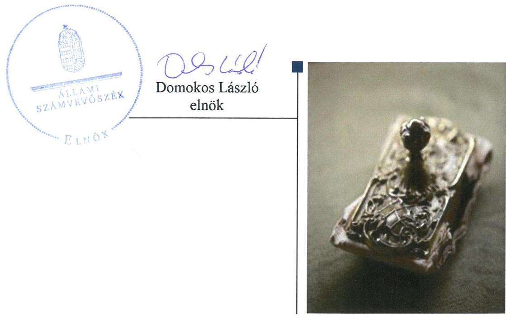
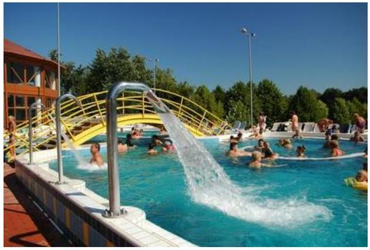
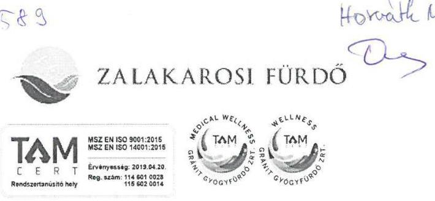
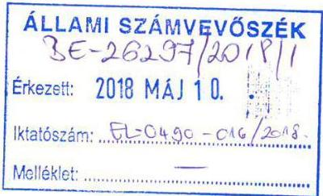
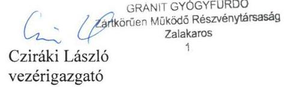
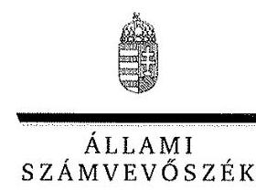
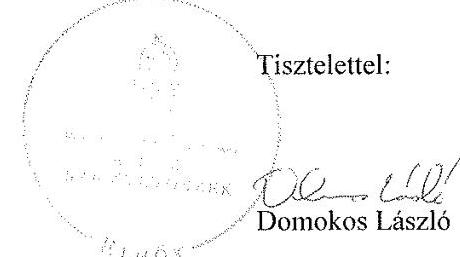

# Jelentés 

## Az önkormányzatok gazdasági társaságai

Az önkormányzatok többségi tulajdonában lévő gazdasági társaságok gazdálkodásának ellenőrzése - GRÁNIT Gyógyfürdő Zrt.
2018.

---

# Jelentés 

## Az önkormányzatok gazdasági társaságai

Az önkormányzatok többségi tulajdonában lévő gazdasági társaságok gazdálkodásának ellenőrzése - GRÁNIT Gyógyfürdő Zrt.
2018. július 3. nap

---

# AZ ELLENŐRZÉST FELÜGYELTE:

DR. HORVÁTH MARGIT felügyeleti vezető

## AZ ELLENŐRZÉST VEZETTE ÉS A VÉGREHAJTÁSÁÉRT FELELŐS:

DORMÁN ISTVÁN ellenőrzésvezető

A PROGRAM ÖSSZEÁLLÍTÁSÁÉRT FELELŐS:

TÓTPÁL SZABOLCS osztályvezető

IKTATÓSZÁM: EL-0201-051/2018.

TÉMASZÁM: 2447

ELLENŐRZÉS-AZONOSÍTÓ SZÁM: V079368

Jelentéseink az Országgyűlés számítógépes hálózatán és az Interneten a www.asz.hu címen is olvashatóak.

---

# TARTALOMJEGYZÉK 

■ ÖSSZEGZÉS ..... 5
■ AZ ELLENŐRZÉS CÉLJA ..... 6
■ AZ ELLENŐRZÉS TERÜLETE ..... 7
■ AZ ELLENŐRZÉS HÁTTERE, INDOKOLTSÁGA ..... 8
■ A JELENTÉS LÉNYEGES KÉRDÉSKÖREI ..... 9
■ AZ ELLENŐRZÉS HATÓKÖRE ÉS MÓDSZEREI ..... 10
■ MEGÁLLAPÍTÁSOK ..... 12
■ JAVASLATOK ..... 15
■ MELLÉKLETEK ..... 17
I. sz. melléklet: Értelmező szótár ..... 17
■ FÜGGELÉK: ÉSZREVÉTELEK ..... 19
■ RÖVIDÍTÉSEK JEGYZÉKE ..... 27

---

.

---

# ÖSSZEGZÉS 

Zalakaros Város Önkormányzata a többségi tulajdonában álló GRÁNIT Gyógyfürdő Zrt. tekintetében a tulajdonosi joggyakorlás kereteit szabályszerűen alakította ki, a tulajdonosi jogait szabályszerűen gyakorolta. A Társaság gazdálkodásának szabályozottsága megfelelt a jogszabályi előírásoknak. A vagyongazdálkodás a leltározás hiányosságai miatt nem volt szabályszerű. A Társaság közzétételi kötelezettségét teljesítette, ezzel működésének átláthatóságát biztosította.

## Az ellenőrzés társadalmi indokoltsága

Magyarországon az önkormányzatok kötelező és önként vállalt feladataik vonatkozásában is egyre szélesebb körben alkalmazzák a költségvetésen kívüli feladatellátást, ezáltal - a nonprofit szervezetek mellett - az önkormányzati tulajdonú gazdasági társaságok is kiemelt fontosságú szerephez jutnak. Ezen belül kiemelt jelentőségű számos önkormányzati gazdasági társaság működése abból a szempontból is, hogy gazdálkodásának egyes elemei befolyásolják az önkormányzati alszektor hiányát és az államadósságot.

Az Állami Számvevőszék Stratégiájában foglaltakkal összhangban az ÁSZ kiemelt célja, hogy a helyi önkormányzatok gazdálkodásában rejlő pénzügyi kockázatok feltárásával, az államháztartáson kívülre nyújtott költségvetési támogatások és ingyenes vagyonjuttatások, valamint az államháztartáson kívül működő feladat-ellátó rendszerek ellenőrzéseivel hozzájáruljon ahhoz, hogy a közpénzeket az államháztartáson kívül működő szervezetek is átlátható, rendezett módon használják fel. Ezen stratégiai célkitűzéssel összhangban került sor Zalakaros Város Önkormányzata többségi tulajdonában álló GRÁNIT Gyógyfürdő Zrt. szabályozottságának, gazdálkodása és vagyongazdálkodási tevékenysége szabályszerűségének, valamint az Önkormányzat tulajdonosi joggyakorlása 2013-2016. évi szabályszerűségének ellenőrzésére.

## Főbb megállapítások, következtetések, javaslatok

Zalakaros Város Önkormányzata a 2013-2016. években a többségi tulajdonában álló GRÁNIT Gyógyfürdő Zrt. tekintetében a tulajdonosi joggyakorlás kereteit szabályszerűen alakította ki és tulajdonosi jogait szabályszerűen gyakorolta. A Közgyűlés az éves beszámolók elfogadásáról a felügyelőbizottság és a könyvvizsgáló írásbeli jelentései alapján döntött, a javadalmazási szabályzatot megalkotta.

A Társaság gazdálkodásának szabályozottsága megfelelt a jogszabályi előírásoknak. A számviteli politika keretében elkészítendő valamennyi szabályzatot elkészítette, azok megfeleltek a jogszabályi előírásoknak. A működés átláthatósága biztosított volt, a jogszabályokban előírt közzétételi kötelezettségét teljesítette. A fizikai közérzetet javító szolgáltatások díjának megállapítása szabályszerű volt az ellenőrzött időszakban. A Társaság bevételeinek és ráfordításainak elszámolása a személyi jellegű ráfordítások elszámolása alátámasztottságának kivételével szabályszerű volt.

A vagyongazdálkodás nem volt szabályszerű, mert a Társaság az éves beszámolóit a számvitelről szóló törvényben előírtaknak megfelelő leltárakkal teljes körűen nem támasztotta alá. A Társaság a jogszabályi előírás ellenére leltározást az immateriális javak és tárgyi eszközök esetében nem végzett.

---

# AZ ELLENŐRZÉS CÉLJA 

AZ ELLENŐRZÉS CÉLJA annak értékelése volt, hogy az önkormányzat vagyongazdálkodási tevékenysége során szabályszerűen gyakorolta-e tulajdonosi jogait; a gazdasági társaság szabályozottsága, gazdálkodása és vagyongazdálkodási tevékenysége, bevételeinek és ráfordításainak elszámolása megfelelt-e a jogszabályi és tulajdonosi előírásoknak; a gazdasági társaság kötelezettségállománya jelent-e kockázatot a működésre, valamint a gazdálkodás átláthatósága és elszámoltathatósága érdekében biztosítva volt-e a szolgáltatás díjának megalapozottsága szabályszerű önköltségszámítással. Az ellenőrzés célja volt továbbá annak megítélése, hogy a kormányzati szektorba sorolt önkormányzati tulajdonban (résztulajdonban) lévő gazdálkodó szervezetek gazdálkodásának a kormányzati szektor hiányára és az államadósságra befolyással bíró elemei a jogszabályi előírásoknak megfeleltek-e.

---

# **AZ ELLENŐRZÉS TERÜLETE**

## **Zalakaros Város Önkormányzata és a többségi tulajdonában álló GRÁNIT Gyógyfürdő Zrt.**

Zalakaros, Zala megye Nagykanizsai járás üdülővárosának lakónépessége 2016. december 31-én 1976 fő volt. Zalakaros Város Önkormányzata hét tagú Képviselő-testületének^{1} munkáját két állandó bizottság^{2} segítette. Az Önkormányzat^{3} a 1992. július 1-jén alakult **GRÁNIT Gyógyfürdő Zrt.^{4}**-ben – melynek fő tevékenysége a fizikai közérzetet javító szolgáltatás volt – 97,3%-os többségi tulajdonnal rendelkezett. A polgármester^{5} és a jegyző^{6} személyében az ellenőrzött időszakban változás nem történt, a polgármester 2010. évtől, a jegyző 2013. január 1-jétől határozott idejű megbízással, majd 2013. június 1-jétől határozatlan időre szóló kinevezéssel látta el tisztségét.

A Társaság^{7} jegyzett tőkéje az ellenőrzött időszak elején 689,8 M Ft volt, amely 739,8 M Ft-ra emelkedett. Az Önkormányzat tulajdonosi aránya ezzel a korábbi 97,1%-ról 97,3%-ra emelkedett, a Társaságban a **GRÁNIT Gyógyfürdő RT. Dolgozói Közhasznú Alapítvány** kisebbségi részaránya 2,9%-ról 2,7%-ra csökkent. Az Önkormányzat tulajdonosi jogait a polgármester a Közgyűlésben gyakorolta.

A **GRÁNIT Gyógyfürdő Zrt.** főbb gazdálkodási adatait a 2013-2016. években az 1. táblázat mutatja be, pénzügyi helyzetét bemutató főbb beszámolóadatokat a II. számú melléklet részletezi.

1. táblázat

|  A TÁRSASÁG FŐBB GAZDÁLKODÁSI ADATAI 2013-2016. ÉVEKBEN |  |  |  |   |
| --- | --- | --- | --- | --- |
|  Összeg (M Ft) | 2013. | 2014. | 2015. | 2016.  |
|  Nettó árbevétel | 1147,1 | 1279,2 | 1321,6 | 1446,9  |
|  Üzemi tevékenység eredménye | 0,3 | 10,1 | 62,7 | 119,6  |
|  Adózott eredmény | 52,6 | 33,5 | 76,4 | 102,5  |
|  Fő | 2013. | 2014. | 2015. | 2016.  |
|  Foglalkoztatottak átlagos statisztikai létszáma | 166 | 182 | 182 | 185  |

*Forrás: A Társaság 2013-2016. évi Egyszerűsített éves beszámolói*

A **GRÁNIT Gyógyfürdő Zrt.** vezérigazgatójának^{8} személye az ellenőrzött időszakban változott, a vezérigazgató^{2} 2014. július 1-jétől látta el tisztségét. A könyvvizsgáló személye a 2013-2016. években nem változott.

A **GRÁNIT Gyógyfürdő Zrt.** az ellenőrzött időszakban közfeladatot nem látott el, vagyonkezelésbe vett vagyona nem volt, tevékenységét a saját vagyonával látta el. A Társaság tulajdonosi részesedéssel más gazdasági társaságban nem rendelkezett, és nem minősült kormányzati szektorba sorolt egyéb szervezetnek.

---

# AZ ELLENŐRZÉS HÁTTERE, INDOKOLTSÁGA 

## AZ ÖNKORMÁNYZATOK TÖBBSÉGI TULAJDONÁBAN ÁLLÓ GAZDASÁGI TÁRSASÁGOK ELLENŐR-

ZÉSE kiemelten fontos a vagyon megőrzése, megóvása érdekében, valamint a kormányzati szektor elszámolásaiban megjelenő önkormányzati tulajdonú gazdálkodó szervezetek esetében, amelyekkel szemben alapvető követelmény, hogy gazdálkodásuk, működésük szabályszerű, az általuk szolgáltatott adatok minél megbízhatóbbak legyenek. A feladatellátás költségeinek, ráfordításainak alakulása a lakosság széles rétegét érinti.

Az Állami Számvevőszék ellenőrzései feltárhatják, hogy az önkormányzat a feladatellátásához rendelt vagyon működtetését a tulajdonostól elvárható gondossággal végezte-e, a feladatot ellátó gazdasági társaság a létesítő okiratban, szolgáltatási szerződésben foglaltak betartásával biztosította-e a feladat ellátását. Az ellenőrzés eredményeképp meghatározhatóvá válnak a költségvetési hiányt befolyásoló szervezetek kockázatai, lehetővé válik ezen kockázatok csökkentése. Az ellenőrzés rávilágíthat arra, hogy a gazdasági társaság a vagyon használatával biztosította-e a szolgáltatás folytatásának feltételeit, az önkormányzat tulajdonosi felügyelete hozzájárult-e a szabályszerű gazdálkodáshoz és feladatellátáshoz. A megállapítások alapján megfogalmazott számvevőszéki javaslatok hasznosítása elősegítheti a meglévő hibák megszüntetését. A jó gyakorlatok bemutatásával az ÁSZ ${ }^{9}$ hozzájárul a követendő megoldások megismertetéséhez, terjesztéséhez.

---

# A JELENTÉS LÉNYEGES KÉRDÉSKÖREI 

1. Az Önkormányzat tulajdonosi joggyakorlása szabályszerű volt-e?
2. A Társaság szabályozottsága, gazdálkodási tevékenysége, bevételeinek és ráfordításainak elszámolása, az önköltségszámítás és árképzés szabályszerű volt-e?
3. A Társaság vagyongazdálkodási tevékenysége szabályszerű volt-e?

---

# AZ ELLENŐRZÉS HATÓKÖRE ÉS MÓDSZEREI 

## Az ellenőrzés típusa

Megfelelőségi ellenőrzés.

## Az ellenőrzött időszak

2013. január 1-jétől 2016. december 31-ig tartó időszak.

## Az ellenőrzés tárgya

Zalakaros Város Önkormányzata többségi tulajdonában álló GRÁNIT Gyógyfürdő Zrt. feletti tulajdonosi joggyakorlása, valamint a Társaság gazdálkodásának szabályozottsága és szabályszerűsége.

Az ellenőrzés kiterjedt minden olyan körülményre és adatra, amely az ÁSZ jogszabályban meghatározott feladatainak teljesítéséhez, valamint a program végrehajtása folyamán felmerült újabb összefüggések feltárásához szükséges volt.

## Az ellenőrzött szervezet

Zalakaros Város Önkormányzata
GRÁNIT Gyógyfürdő Zrt.

## Az ellenőrzés jogalapja

Az ellenőrzés jogszabályi alapját az ÁSZ tv. ${ }^{10}$ 1. § (3) bekezdése és 5. § (3)-(4)-(5) bekezdései képezték.

## Az ellenőrzés módszerei

Az ellenőrzést a nemzetközi standardokat irányadónak tekintve az ellenőrzési program ellenőrzési kérdései, az ellenőrzött időszakban hatályos jogszabályok, az ellenőrzés szakmai szabályok és módszertanok figyelembe vételével végeztük.

Az ellenőrzés ideje alatt az ellenőrzött szervezettel történő kapcsolattartást az ÁSZ Szervezeti és Működési Szabályzatának vonatkozó előírásai alapján biztosítottuk.

---

Az ellenőrzési kérdések megválaszolásához szükséges bizonyítékok megszerzése a következő ellenőrzési eljárások alkalmazásával történt: megfigyelés, kérdésfeltevés (információkérés), összehasonlítás, valamint elemző eljárás. Az ellenőrzési bizonyítékként felhasználható adatforrások közé tartoztak egyrészt az ellenőrzési programban felsorolt adatforrások, másrészt adatforrás lehetett még minden - az ellenőrzés folyamán - feltárt, az ellenőrzés szempontjából információkat tartalmazó dokumentum.

Az ellenőrzést a kérdésekre adott válaszok kiértékelésével, valamint a megjelölt adatforrások, a csatolt tanúsítványok felhasználásával, továbbá az adott időszakban hatályos jogszabályok figyelembe vételével kellett lefolytatni.

A bevételek és ráfordítások elszámolását, és a vagyonnyilvántartás terén a szabályszerű működést véletlen mintavétellel ellenőriztük. A mintavétellel ellenőrzött területek esetében minden egyes tétel vonatkozásában szabályszerűségre vonatkozó kérdéseket tettünk fel, amelyek a számviteli törvény, illetve a tulajdonosi követelményeknek és az ellenőrzött szervezet belső szabályozásai előírásainak betartására vonatkoztak. A jogszabályoknak és a belső előírásoknak megfelelőnek tekintettük az adott területet, amennyiben a minta ellenőrzésének eredménye alapján 95%-os bizonyossággal a teljes sokaságban a hibaarány kisebb volt, mint 10%, nem megfelelőnek értékeltük, ha a hibaarány a 10%-ot meghaladta. Az anyagjellegű ráfordítások, az egyéb ráfordítások, a pénzügyi műveletek ráfordításait és a rendkívüli ráfordítások elszámolására elszámolására és a vagyonnyilvántartásra vonatkozó véletlen mintavételt kockázati alapú kiválasztással egészítettük ki, amelynek során évente a három legnagyobb összegű tételt választottuk ki.

---

# 1. Az Önkormányzat tulajdonosi joggyakorlása szabályszerű volt-e? 

Összegző megállapítás Az Önkormányzat tulajdonosi joggyakorlása szabályszerű volt.

AZ ÖNKORMÁNYZAT rendelkezett a fejlesztési elképzeléseit rögzítő, a Képviselő-testület által jóváhagyott, az Mötv. ${ }^{11}$ szerinti gazdasági programmal ${ }^{12}$, és az Nvtv. ${ }^{13}$ szerinti közép- és hosszú távú vagyongazdálkodási tervvel ${ }^{14}$. A Társaságra vonatkozó tervek a gazdasági programban, a vagyongazdálkodási tervben szerepeltek.

Az Önkormányzat az Mötv.-nek megfelelően a működésének szabályait az önkormányzati SZMSZ-ben ${ }^{15}$ határozta meg. Az Önkormányzat a vagyonnal való gazdálkodás, a Társaság feletti tulajdonosi joggyakorlás szabályait a vagyonrendelet ${ }^{16}$-ben és a Társaság Alapszabályában ${ }^{17}$ rögzítette. Az Önkormányzat tulajdonosi jogait a polgármester az Alapszabályban rögzített módon és a Képviselő-testület egyedi határozataiban kapott felhatalmazás alapján gyakorolta a Társaság Közgyűlésein.

A TULAJDONOSOK ${ }^{18}$ a Társaság Alapszabályában a Gt. ${ }^{19}$-ben és a Ptk. ${ }^{20}$-ban foglaltakkal összhangban rögzítették az FB ${ }^{21}$ megválasztását, feladatait, eljárásának szabályait, beszámolási kötelezettségét, valamint a javadalmazásával kapcsolatos főbb előírásokat. Az FB tagokat a Gt. és a Ptk. előírásainak megfelelően a Közgyűlés
 ${ }^{22}$ választotta. A Közgyűlés az Alapszabályban előírt követelmények betartását számon kérte, elfogadta a Társaság üzleti terveit, a vezérigazgatót beszámoltatta, a Társaság tevékenységét nyomon követte.

Az FB az ügyrendjét a Gt. és a Ptk. előírásainak megfelelően megállapította és azt a Társaság legfőbb döntéshozó szerve, a Közgyűlés hagyta jóvá. A Gt. és a Ptk. előírásainak megfelelően az előterjesztésekkel kapcsolatos álláspontját az FB a Közgyűlés ülésein ismertette. A Közgyűlés az egyszerűsített éves beszámolókat a Gt. és a Ptk. előírásainak megfelelően az FB és a könyvvizsgáló írásbeli jelentésének birtokában hagyta jóvá. A Közgyűlés a beszámoló elfogadásáról a Gt. és a Ptk. előírásainak megfelelően, szabályszerűen döntött. A Társaság gazdálkodása az ellenőrzött időszakban nyereséges volt, a Közgyűlés a mérlegszerinti eredmény eredménytartalékba helyezéséről döntött.

A Társaság a vezető tisztségviselőinek, FB tagjainak, valamint az Mt. ${ }^{23}$ hatálya alá tartozó munkavállalóinak javadalmazási, juttatási rendszerről szóló szabályzatot ${ }^{24}$ a Közgyűlés, mint a Társaság legfőbb szerve a Taktv. ${ }^{25}$ előírásainak megfelelően megalkotta.

Az Áht. ${ }^{26}$-ben biztosított belső ellenőrzés lehetőségével az Önkormányzat nem élt. A Társaság belső ellenőrt a szervezetét és működését szabályozó SZMSZ ${ }^{27}$ szerint nem foglalkoztatott. A külső ellenőrző szervezetek ${ }^{28}$

---

jogviszony alapján folyósított, jogalap nélkül felvett ellátással, a nyugtaadási kötelezettséggel, bevallások utólagos ellenőrzésével, közbeszerzési eljárások kiírásai megfelelőségével, az európai uniós források felhasználás ellenőrzését végző szervezet ellenőrzései alapján a Társaság a szükséges intézkedéseket megtette. Az európai uniós források felhasználása ellenőrzésével kapcsolatban az európai uniós források felhasználás ellenőrzését végző szervezet megállapításai alapján a Társaság eleget tett az intézkedési terv-készítési kötelezettségének, a vízjogi üzemeltetési engedély módosítására vonatkozóan végrehajtott intézkedésről jelentést készített, amelyet az ellenőrző szervezet elfogadott.

# 2. A Társaság szabályozottsága, gazdálkodási tevékenysége, bevételeinek és ráfordításainak elszámolása, az önköltségszámítás és árképzés szabályszerű volt-e? 

Összegző megállapítás

A Társaság gazdálkodásának szabályozottsága megfelelt a jogszabályi előírásoknak. A fizikai közérzetet javító szolgáltatások díjainak megállapítása szabályszerű volt és önköltségszámításon alapult. A Társaság bevételeinek és ráfordításainak elszámolása a személyi jellegű ráfordítások elszámolásának kivételével szabályszerű volt.

SZÁMVITELI POLITIKÁVAL a Társaság a Számv. tv. ${ }^{29}$-ben előírtak szerint rendelkezett, a Számviteli politika ${ }_{15}{ }^{30}$ megfelel a Számv. tv. előírásainak.

A Számviteli politika keretében elkészítendő szabályzatokkal - a Leltározási szabályzattal ${ }^{31}$, az Értékelési szabályzattal ${ }^{32}$, Önköltség-számítási szabályzattal ${ }^{33}$, a Pénzkezelési szabályzattal ${ }^{34}$ - a Számv. tv. előírásainak megfelelően a Társaság rendelkezett. A Számlarendet ${ }^{35}$ és a Bizonylati rendet ${ }^{36}$ a Társaság a Számv. tv. előírásai szerint elkészítette. A Leltározási szabályzatban rendelkeztek a selejtezés szabályairól, az eszközök mennyiségi felvételezéssel történő leltározását kétévenkénti gyakorisággal határozták meg.

BESZÁMOLÁSI KÖTELEZETTSÉGÉNEK a Társaság a Számv. tv. szerinti éves beszámolók elkészítésével, letétbe helyezésével és közzétételével, a tulajdonosok által előírt beszámolási kötelezettségének az üzleti tervek és negyedéves, éves beszámolók készítésével eleget tett.

A KÖZÉRDEKŰ ADATOK megismerésére irányuló igények teljesítésének rendjét rögzítő szabályzat készítésére az Info tv. alapján nem volt kötelezett. A közérdekből nyilvános adatok megismerhetőségét a Társaság a Taktv. és a 305/2005. (XII. 25.) Korm. rendelet ${ }^{37}$ előírásainak megfelelően a honlapján biztosította.

## A FIZIKAI KÖZÉRZETET JAVÍTÓ SZOLGÁLTATÁ-

SOK DÍJAINAK megállapítására a jóváhagyott éves üzleti tervekben meghatározott, az Önköltség-számítási szabályzat alapján kialakított árak alkalmazásával került sor.

---

# A BEVÉTELEK, AZ ANYAGJELLEGŰ RÁFORDÍTÁ- 

SOK elszámolása szabályszerű volt. A könyvviteli elszámolást közvetlenül alátámasztó bizonylatok a Számv. tv. előírásainak megfelelően tartalmazták a könyvelés módjára, az érintett könyvviteli számlákra történő hivatkozást. A számviteli bizonylatokat a gazdasági esemény megtörténtének időpontjában, illetve időszakában állították ki.

A SZEMÉLYI JELLEGŰ RÁFORDÍTÁSOK elszámolásának alátámasztottsága nem volt szabályszerű, a Számv. tv. 167. § (1) bekezdés h) pontjának előírásai ellenére a könyvviteli elszámolást közvetlenül alátámasztó bizonylatok nem tartalmazták a könyvelés módjára, az érintett könyvviteli számlákra történő hivatkozást.

A TÁRSASÁG kötelezettségállománya a 2013. évről 2016. évre összeségében 18,6%-kal csökkent. Ezen belül a rövid lejáratú kötelezettségei 3,6 M Ft-tal nőttek, a hosszú lejáratú kötelezettségállománya 175,2 M Ft-tal csökkent. A Társaságnak lejárt határidejű kötelezettségei nem voltak, a kötelezettségek határidőben történő teljesítése biztosított volt. A követelésállomány csökkentésére a Társaság intézkedett, ennek ellenére a követelések állománya a 2013. évi 63,7 M Ft-ról a 2016. évre több mint kétszeresére, 135,8 M Ft-ra nőtt.

## 3. A Társaság vagyongazdálkodási tevékenysége szabályszerű volt-e?

## Összegző megállapítás

A Társaság vagyongazdálkodási tevékenysége nem volt szabályszerű.

A SAJÁT VAGYON nyilvántartása a tárgyi eszközök nyilvántartásainak ellenőrzése során feltárt hiányosságok miatt nem volt szabályszerű. A Társaság az immateriális javak és tárgyi eszköz mérlegsorait leltárral nem támasztotta alá, ezzel megsértette a Számv. tv. 69. § (1) bekezdését. Mennyiségi felvétellel történő leltározást a Társaság a tárgyi eszközök esetében a Számv. tv. 69. § (3) bekezdésében és a Leltározási szabályzat előírása ellenére nem végzett. A leltározás hiányossága ellenére a könyvvizsgáló a beszámolót minden évben korlátozás nélküli hitelesítő záradékkal látta el.

AZ ÉRTÉKCSÖKKENÉS elszámolása szabályszerű volt. A Számv. tv. előírásainak megfelelően az eszközök üzembe helyezését az értékcsökkenés elszámolását hitelt érdemlő módon dokumentálták.

---

# JAVASLATOK 

Az ÁSZ tv. 33. § (1) bekezdésében foglaltak értelmében az ellenőrzött szervezet vezetője köteles a jelentésben foglalt megállapításokhoz kapcsolódó intézkedési tervet összeállítani és azt a jelentés kézhezvételétől számított 30 napon belül az ÁSZ részére megküldeni. Amennyiben az ellenőrzött szervezet vezetője nem küldi meg határidőben az intézkedési tervet, vagy továbbra sem elfogadható intézkedési tervet küld, az Állami Számvevőszék elnöke az ÁSZ tv. 33. § (3) bekezdése a) és b) pontjaiban foglaltakat érvényesítheti.
Javaslataink célja a GRÁNIT Gyógyfürdő Zrt. gazdálkodása szabályszerűségének és gyakorlatának javítása annak érdekében, hogy a szabályozási környezet és az alkalmazott gyakorlat megfelelően tudja támogatni az átlátható működést.

## A GRÁNIT Gyógyfürdő Zrt. vezérigazgatójának

1. Intézkedjen az éves beszámoló mérlege immateriális javak és tárgyi eszközök mérlegsorainak leltárral történő alátámasztásáról a Számv. tv. előírásának megfelelően.
(3. sz. megállapítás 1. bekezdés 2. mondata alapján)
2. Intézkedjen a tárgyi eszközök mennyiségi leltárfelvétellel történő leltározásának végrehajtásáról a Számv. tv. és a Leltározási szabályzat előírásainak megfelelően.
(3. sz. megállapítás 1. bekezdés 3. mondata alapján)
3. Intézkedjen a személyi jellegű ráfordítások Számv. tv. előírásainak megfelelő elszámolásáról.
(2. sz. megállapítás 7. bekezdése alapján)

---

.

---

# MELLÉKLETEK 

- I. SZ. MELLÉKLET: ÉRTELMEZŐ SZÓTÁR
fizikai közérzetet javító szolgáltatások
gazdasági társaság
kormányzati szektorba sorolt egyéb szervezet
meghatározó befolyás
minősített többséget biztosító részesedés
a Központi Statisztikai Hivatal gazdasági tevékenységek egységes ágazati osztályozási rendszere (TEÁOR'08) alapján a 9604 fizikai közérzetet javító szolgáltatás körébe tartoznak a gyógyfürdő, termálfürdő, szauna, szolárium szolgáltatások, tevékenységek
Ptk. 3.88. § (1) bekezdése szerint „a gazdasági társaságok üzletszerű közös gazdasági tevékenység folytatására, a tagok vagyoni hozzájárulásával létrehozott, jogi személyiséggel rendelkező vállalkozások, amelyekben a tagok a nyereségből közösen részesednek, és a veszteséget közösen viselik".
az Áht. 3. § (2) és (3) bekezdésében foglaltakon kívül az Európai Közösséget létrehozó szerződéshez csatolt, a túlzott hiány esetén követendő eljárásról szóló jegyzőkönyv alkalmazásáról szóló 2009. május 25-i 479/2009/EK rendelet (a továbbiakban: 479/2009/EK rendelet) szerint a kormányzati szektorba sorolt szervezet (Áht. 1. § (12))
A Ptk. 8:2. § (2) bekezdése szerint „A befolyással rendelkező akkor rendelkezik egy jogi személyben meghatározó befolyással, ha annak tagja vagy részvényese, és
a) jogosult e jogi személy vezető tisztségviselői vagy felügyelő bizottsága tagjai többségének megválasztására, illetve visszahívására; vagy
b) a jogi személy más tagjai, illetve részvényesei a befolyással rendelkezővel kötött megállapodás alapján a befolyással rendelkezővel azonos tartalommal szavaznak, vagy a befolyással rendelkezőn keresztül gyakorolják szavazati jogukat, feltéve, hogy együtt a szavazatok több mint felével rendelkeznek."
A minősített befolyásszerző az ellenőrzött társaságban a szavazatok legalább hetvenöt százalékával rendelkezik. (Ptk. 3:324. §)
Nvtv. 1. § (2) bekezdése szerint többek között:
„az állam vagy a helyi önkormányzat kizárólagos tulajdonában álló dolgok, az a) pont hatálya alá nem tartozó, állam vagy a helyi önkormányzat tulajdonában lévő dolog,
az állam vagy a helyi önkormányzat tulajdonában lévő pénzügyi eszközök, továbbá az államot vagy a helyi önkormányzatot megillető társasági részesedések, az államot vagy a helyi önkormányzatot megillető bármely vagyoni értékkel rendelkező jogosultság, amelyet jogszabály vagyoni értékű jogként nevesít."
A Ptk. 8:2. § (1) bekezdése szerint „többségi befolyás az olyan kapcsolat, amelynek révén természetes személy vagy jogi személy (befolyással rendelkező) egy jogi személyben a szavazatok több mint felével vagy meghatározó befolyással rendelkezik."

---

.

---

# FÜGGELÉK: ÉSZREVÉTELEK 

A jelentéstervezetet a Számvevőszék 15 napos észrevételezésre megküldte az ellenőrzött szervezetek vezetőinek az ÁSZ tv. 29. § (1) bekezdése előírásának megfelelően.

A GRÁNIT Gyógyfürdő Zrt. vezérigazgatójának észrevételeit és azok kezeléséről szóló válaszlevelet a jelentés függeléke tartalmazza. Zalakaros Város Önkormányzatának polgármestere a jelentéstervezettel kapcsolatban nem tett észrevételt.

[^0]
[^0]:    * 29. § (1) Az Állami Számvevőszék az ellenőrzési megállapításait megküldi az ellenőrzött szervezet vezetőjének vagy az általa megbízott személynek, és annak, akinek személyes felelősségét állapította meg.
    (2) Az ellenőrzött szervezet vezetője és a felelősként megjelölt személy az ellenőrzés megállapításaira tizenöt napon belül írásban észrevételt tehet.
    (3) Az Állami Számvevőszék az észrevételre a beérkezésétől számított harminc napon belül írásban válaszol. A figyelembe nem vett észrevételeket köteles a jelentésben feltüntetni, és megindokolni, hogy azokat miért nem fogadta el.

---

GRÁNIT Gyógyfürdő Zártkörűen Működő Részvénytársaság
8749 Zalakaros, Thermál u. 4.
Zala Megyei Bíróság, mint Cégbíróságnál
20-10-040042 cégjegyzékszám alatt nyilvántartva
Tel.: 93/340-721; Fax: 93/340-318
E-mail: info@furdo-zalakaros.hu
Web: www.furdo-zalakaros.hu

Iktatószám: 214 - 2 /2018.
Ügyintéző: Baracskai Gyuláné

Zala megye legkedveltebb nyaralóhelye és közönségdíjasa

## Domonkos László Elnök Úr Állami Számvevőszék

1052 Budapest, Apáczai Csere János utca 10. 1364 Budapest 4. Pf:54.

Tárgy: Észrevétel számvevőszéki jelentéstervezetre

## Tisztelt Domonkos László Elnök Úr!

2018.04.24.-én érkezett, EL-0490-012/2018. iktatószámú levelükkel megküldött, Állami Számvevőszék - Számvevőszéki jelentéstervezet:
Iktatószám: EL-0490-011/2018.
Témaszám: 2447
Ellenőrzés azonosító szám: V079368.
A fenti Számvevőszéki jelentéstervezet megállapításaira az alábbi észrevételt tesszük, a megadott 15 napos határidőn belül:
1.) A Társaság szabályozottsága, gazdálkodási tevékenysége, bevételeinek és ráfordításainak elszámolása, az önköltségszámítás és árképzés szabályszerű volt-e?

Összegző megállapítás: A Társaság szabályozottsága megfelelt a jogszabályi előírásoknak. A fizikai közérzetet javító szolgáltatások díjainak megállapítása szabályszerű volt és önköltségszámításon alapult. A Társaság bevételeinek és ráfordításainak elszámolása a személyi jellegű ráfordítások elszámolásának kivételével szabályszerű volt.

A SZEMÉLYI JELLEGŰ RÁFORDÍTÁSOK elszámolásának alátámasztottsága nem volt szabályszerű, a Számv. tv. 167. § (1) bekezdés h) pontjának előírásai ellenére a könyvviteli elszámolást közvetlenül alátámasztó bizonylatok nem tartalmazták a könyvelés módjára, az érintett könyvviteli számlákra történő hivatkozást.

---

# Észrevétel: 

A Számv. tv. 167. § (1) bekezdés h) pontjának előírásai alapján a könyvviteli elszámolást közvetlenül alátámasztó egyedi bizonylatok tartalmazzák a könyvelés módjára, az érintett könyvviteli számlákra történő hivatkozást.
A bérek és a személyi jellegű kifizetések könyvelése a Hessyn Informatikai és Oktatási Kft. által készített HessynBér - Bérszámfejtő, munkaügyi programmal történik, amely hálózattal összekötésre került a szintén Hessyn Kft. által készített HessynKettős főkönyvi könyvelő programmal a könyvelési tételek
 a feladások alapján automatikusan rögzítésre kerülnek a könyvelésbe. Havonta egyeztetésre kerülnek a személyi jellegű ráfordítások, költségek összege, a lekönyvelt adatok, a teljesített kifizetések, NAV bevallások.
Az ellenőrzés során hiánypótlásra felhívás nem érkezett a beküldött anyaggal kapcsolatban és helyszíni ellenőrzés nem történt, melynek során a könyvelés módjára történő hivatkozás bemutatásra került volna.
Kérésükre, rendelkezésre állunk a hiányosnak ítélt dokumentumok könyvelési módjának bemutatására.

## 2.) A 3. A Társaság vagyongazdálkodási tevékenysége szabályszerű volt-e?

Összegző megállapítás: A Társaság vagyongazdálkodási tevékenysége nem volt szabályszerű

A SAJÁT VAGYON nyilvántartása a tárgyi eszközök nyilvántartásainak ellenőrzése során feltárt hiányosságok miatt nem volt szabályszerű. A Társaság az immateriális javak és tárgyi eszköz mérlegsorait leltárral nem támasztotta alá, ezzel megsértette a Számv.tv. 69.§ (1) bekezdését. Mennyiségi felvétellel történő leltározást a Társaság a tárgyi eszközök esetében a Számv. tv. 69.§ (3) bekezdésében és a Leltározási szabályzat előírása ellenére nem végzett. A leltározás hiányossága ellenére a könyvvizsgáló a beszámolót minden évben korlátozás nélküli hitelesítő záradékkal látta el.

## Észrevétel:

Társaságunk a Számv. tv. 69.§ (3) bekezdésében és a Leltározási szabályzat előírásában foglaltaknak megfelelően, határidőben elkészítette a mennyiségi felvétellel történő leltározást az immateriális javak és tárgyi eszközökre 2014. év és 2016. év vonatkozásában is, a Számv.tv. 69.§ (1) bekezdésének megfelelően a tárgyi eszköz mérlegsorait leltárral alá támasztotta, ezek alapján a könyvvizsgáló a beszámolót minden évben korlátozás nélküli hitelesítő záradékkal látta el.
Társaságunk az ellenőrzéshez mindhárom ütemben nagy mennyiségű adatállományt küldött be elektronikusan, mely többször informatikai nehézségekbe is ütközött.
Az ellenőrzési anyag feltöltésekor a leltár helyett a tárgyi eszköz kartonok kerültek beküldésre.

---

Az ellenőrzés során hiánypótlásra felhívás nem érkezett a beküldött anyaggal kapcsolatban és helyszíni ellenőrzés nem történt, melynek során a leltár bemutatásra került volna.
Az Állami Számvevőszék részére a 2014. év és 2016 évekre vonatkozó immateriális javak és tárgyi eszköz leltárokat rendelkezésre tudjuk bocsátani.

Kérjük a Tisztelt Elnök Urat, hogy a végleges jelentés meghozatalánál észrevételeinket szíveskedjenek figyelembe venni.

Zalakaros, 2018.05.03.

Tisztelettel:

---

# Ezirákí László úr 

vezérigazgató
GRÁNIT Gyógyfürdő Zrt.

## Zalakaros

## Tisztelt Vezérigazgató Úr!

Köszönettel vettem „Az önkormányzatok gazdasági társaságai - Az önkormányzatok többségi tulajdonában lévő gazdasági társaságok gazdálkodásának ellenőrzése - GRÁNIT Gyógyfürdő Zrt. " című ellenőrzésről készített számvevőszéki jelentéstervezetre megküldött észrevételeit.
Az Állami Számvevőszék észrevételekre vonatkozó álláspontját a felügyeleti vezető által készített részletes tájékoztatás tartalmazza, amelyet levelemhez mellékeltem.
Tájékoztatom Vezérigazgató urat, hogy az Állami Számvevőszék a figyelembe nem vett észrevételeket az Állami Számvevőszékről szóló 2011. évi LXVI. törvény 29. § (3) bekezdésében előírtak szerint köteles a jelentésében feltüntetni és megindokolni, hogy azokat miért nem fogadta el.

Budapest, 2018. június
hó 15. nap

Melléklet: Tájékoztatás az észrevételek kezeléséről

---

# Tájékoztatás az észrevételek kezeléséről 

Megköszönöm Vezérigazgató úrnak „Az önkormányzatok gazdasági társaságai - Az önkormányzatok többségi tulajdonában lévő gazdasági társaságok gazdálkodásának ellenőrzése GRÁNIT Gyógyfürdő Zrt." címmel készített jelentés-tervezetre tett észrevételeit. Az észrevételek kezeléséről az alábbi tájékoztatást adom.

## 1. számú észrevétel:

Az 1. számú észrevétel a jelentéstervezet 2. számú összegző megállapítását és a 2. számú megállapítás 7. bekezdését, valamint a 3. számú javaslatot érinti:
„A Társaság gazdálkodásának szabályozottsága megfelel a jogszabályi előírásoknak. A fizikai közérzetet javító szolgáltatások díjainak megállapítása szabályszerű volt és önköltségszámításon alapult. A Társaság bevételeinek és ráfordításainak elszámolása a személyi jellegű ráfordítások elszámolásának kivételével szabályszerű volt."
„A SZEMÉLYI JELLEGŰ RÁFORDÍTÁSOK elszámolásának alátámasztottsága nem volt szabályszerű, a Számv. tv. 167. § (1) bekezdés h) pontjának előírásai ellenére a könyvviteli elszámolást közvetlenül alátámasztó bizonylatok nem tartalmazták a könyvelés módjára, az érintett könyvviteli számlákra történő hivatkozást."

Vezérigazgató úr a megállapításra a következő észrevételt tette:
„A Számv. tv. 167. § (1) bekezdés h) pontjának előírásai alapján a könyvviteli elszámolást közvetlenül alátámasztó egyedi bizonylatok tartalmazzák a könyvelés módjára, az érintett könyvviteli számlákra történő hivatkozást.

A bérek és a személyi jellegű kifizetések könyvelése a Hessyn Informatikai és Oktatási Kft. által készített HessynBér - Bérszámfejtő, munkaügyi programmal történik, amely hálózattal összekötésre került a szintén Hessyn Kft. által készített HessynKettős főkönyvi könyvelő programmal; a könyvelési tételek a feladások alapján automatikusan rögzítésre kerülnek a könyvelésbe. Havonta egyeztetésre kerülnek a személyi jellegű ráfordítások, költségek összege, a lekönyvelt adatok, a teljesített kifizetések, NAV bevallások.

Az ellenőrzés során hiánypótlásra felhívás nem érkezett a beküldött anyaggal kapcsolatban és helyszíni ellenőrzés nem történt, melynek során a könyvelés módjára történő hivatkozás bemutatásra került volna.

Kérésükre, rendelkezésre állunk a hiányosnak ítélt dokumentumok könyvelési módjának bemutatására."

---

Vezérigazgató úr észrevételében leírtak alapján a jelentéstervezet 2. számú összegző megállapítását, valamint a 2. számú megállapítás 7. bekezdésében rögzítetteket, és a Vezérigazgató úrnak címzett 3. számú javaslatot nem módosítom az alábbiak miatt:

Vezérigazgató úrnak a Társaság könyvviteli rendszerével kapcsolatos tájékoztatását köszönettel tudomásul vettem, azonban azok alapján a jelentéstervezetet nem módosítom, mivel az ellenőrzés során a Társaság részére kiküldött EL-0201-023/2017. iktatószámú adatbekérő levél 3. számú melléklete részletesen tartalmazta a mintatételek ellenőrzéséhez kért dokumentumokat, így a megállapításban hiányoltakat alátámasztó dokumentumokat is (a kifizetésre vonatkozó utalványrendelet, vagy pénztárbizonylat dokumentuma, amely tartalmazza a főkönyvi számla kijelölését, és egyéb tartalmi és formai elemeket). Az ÁSZ a megállapításait a Társaság által az előírt adatszolgáltatási határidőre az ellenőrzés rendelkezésére bocsátott dokumentumok, adatok, információk alapján teszi meg.

A személyi jellegű ráfordítások terén a szabályszerű működést véletlen mintavétellel ellenőriztük. A mintavétellel ellenőrzött területek esetében minden egyes tétel vonatkozásában a szabályszerűségre vonatkozó kérdéseket tettünk fel, amelyek eredménye összesítésre került. Megfelelőnek értékeltünk egy ellenőrzött területet, amennyiben 95%-os bizonyossággal a teljes sokaságban az átlagos hibaarány legfeljebb 10%, nem megfelelőnek, amennyiben 10%-nál magasabb arányt képviselt. A Társaság által az ellenőrzés számára rendelkezésre bocsátott mintatételek esetében a fenti eljárás alapján olyan nagyságrendű hiányos dokumentálást találtunk, amely alapján a 2. számú megállapítás 7. bekezdésében rögzítetteknek megfelelően a személyi jellegű ráfordítások elszámolása összességében nem minősült szabályszerűnek. Mindezek alapján a jelentéstervezet 2. számú összegző megállapítása és a 2. számú megállapítás 7. bekezdése megállapításai változatlanul helytállóak, amiből következően a Vezérigazgató úrnak címzett 3. számú javaslatot sem módosítom.

# 2. számú észrevétel 

A 2. számú észrevétel a jelentéstervezet 3. számú összegző megállapítását és a 3. számú megállapítás 1. bekezdését, valamint az 1. és 2. számú javaslatokat érinti:
„A Társaság vagyongazdálkodási tevékenysége nem volt szabályszerű."
„A SAJÁT VAGYON nyilvántartása a tárgyi eszközök nyilvántartásainak ellenőrzése során feltárt hiányosságok miatt nem volt szabályszerű. A Társaság az immateriális javak és tárgyi eszköz mérlegsorait leltárral nem támasztotta alá, ezzel megsértette a Számv. tv. 69. § (1) bekezdését. Mennyiségi felvétellel történő leltározást a Társaság a tárgyi eszközök esetében a Számv. tv. 69. § (3) bekezdésében és a Leltározási szabályzat előírása ellenére nem végzett. A leltározás hiányossága ellenére a könyvvizsgáló a beszámolót minden évben korlátozás nélküli hitelesítő záradékkal látta el."

Vezérigazgató úr a megállapításra a következő észrevételt tette:
„Társaságunk a Számv. tv. 69.§ (3) bekezdésében és a Leltározási szabályzat előírásában foglaltaknak megfelelően, határidőben elkészítette a mennyiségi felvétellel történő leltározást az

---

immateriális javak és tárgyi eszközökre 2014. év és 2016. év vonatkozásában is, a Számv.tv. 69.§ (1) bekezdésének megfelelően a tárgyi eszköz mérlegsorait leltárral alá támasztotta, ezek alapján a könyvvizsgáló a beszámolót minden évben korlátozás nélküli hitelesítő záradékkal látta el.

Társaságunk az ellenőrzéshez mindhárom ütemben nagy mennyiségű adatállományt küldött be elektronikusan, mely többször informatikai nehézségekbe is ütközött.

Az ellenőrzési anyag feltöltésekor a leltár helyett a tárgyi eszköz kartonok kerültek beküldésre.

Az ellenőrzés során hiánypótlásra felhívás nem érkezett a beküldött anyaggal kapcsolatban és helyszíni ellenőrzés nem történt, melynek során a leltár bemutatásra került volna.

Az Állami Számvevőszék részére a 2014. év és 2016 évekre vonatkozó immateriális javak és tárgyi eszköz leltárokat rendelkezésre tudjuk bocsátani.

Kérjük a Tisztelt Elnök Urat, hogy a végleges jelentés meghozatalánál észrevételeinket szíveskedjenek figyelembe venni."

Vezérigazgató úr észrevételében leírtak alapján a jelentéstervezet 3. számú összegző megállapítását és a 3. számú megállapítás 1. bekezdését, valamint a Vezérigazgató úrnak címzett 1. és 2. számú javaslatokat nem módosítom az alábbiak miatt:

Vezérigazgató úr észrevételében - a Társaság leltározásával kapcsolatban - adott tájékoztatását köszönettel tudomásul vettem, azonban azok alapján a jelentéstervezetet nem módosítom, mivel az ellenőrzés során a Társaság részére kiküldött EL-0201-017/2017. iktatószámú adatbekérő levél 2. számú melléklete részletesen tartalmazta az ellenőrzéshez kért dokumentumokat, így a megállapításokban hiányoltakat alátámasztó dokumentumokat is (a beszámolót alátámasztó, zárás előtti főkönyvi kivonatok, leltárkimutatás, leltárösszesítők). Az észrevétel is rögzíti, hogy az ellenőrzési anyag feltöltésekor a leltár dokumentumai nem kerültek feltöltésre. Az ÁSZ a megállapításait a Társaság által az előírt adatszolgáltatási határidőre az ellenőrzés rendelkezésére bocsátott dokumentumok, adatok, információk alapján teszi meg, amiről az EL-0201-017/2017. iktatószámú adatbekérő levelében a Társaságot tájékoztatta. Mindezek alapján a jelentéstervezet 3. számú összegző megállapítása és a 3. számú megállapítás 1. bekezdése megállapításai változatlanul helytállóak, amiből következően a Vezérigazgató úrnak címzett 1. és 2. számú javaslatokat sem módosítom.

Budapest, 2018. május hó 31. nap

Dr. Horváth Margit
felügyeleti vezető

---

# RÖVIDÍTÉSEK JEGYZÉKE 

${ }^{1}$ Képviselő-testület
${ }^{2}$ két állandó bizottság
${ }^{3}$ Önkormányzat
${ }^{4}$ GRÁNIT Gyógyfürdő Zrt.
${ }^{5}$ polgármester
${ }^{6}$ jegyző
${ }^{7}$ Társaság
${ }^{8}$ vezérigazgató
${ }^{9}$ ÁSZ
${ }^{10}$ ÁSZ tv.
${ }^{11}$ Mötv.
${ }^{12}$ gazdasági program gazdasági program ${ }_{1}$
gazdasági program ${ }_{2}$
${ }^{13}$ Nvtv.
${ }^{14}$ vagyongazdálkodási terv
${ }^{15}$ önkormányzati SZMSZ
${ }^{16}$ vagyonrendelet
${ }^{17}$ Alapszabály
${ }^{18}$ Tulajdonosok
${ }^{19}$ Gt.
${ }^{20}$ Ptk.
${ }^{21}$ FB
${ }^{22}$ Közgyűlés
${ }^{23}$ Mt.
${ }^{24}$ Javadalmazási szabályzat
${ }^{25}$ Taktv.
${ }^{26}$ Áht.

Zalakaros Város Önkormányzatának Képviselő-testülete
a Gazdasági, Városfejlesztési, és Turisztikai Bizottság, illetve a Pénzügyi, Városüzemeltetési, Ügyrendi és Humánpolitikai Bizottság
Zalakaros Város Önkormányzata
GRÁNIT Gyógyfürdő Zártkörűen Működő Részvénytársaság
Zalakaros Város polgármestere
Zalakaros Város jegyzője
GRÁNIT Gyógyfürdő Zrt.
GRÁNIT Gyógyfürdő Zrt. vezérigazgatója, vezérigazgató; 2014. június 30-ig, vezérigazgató; 2014. július 1-jétől

Állami Számvevőszék
2011. évi LXVI. törvény az Állami Számvevőszékről, hatályos 2011. július 1-jétől
2011. évi CLXXXIX. törvény - Magyarország helyi önkormányzatairól

Zalakaros Város Önkormányzata gazdasági programja
86/2011. (IV.07.) számú KT határozattal elfogadott, a 2007-2010. évekre szóló gazdasági program felülvizsgálatáról és a 2011-2014. terjedő időtartamra vonatkozó Gazdasági program;
124/2015. (V.21.) számú KT határozattal elfogadott, a 2014-2019. évekre vonatkozó Gazdasági program
2011. évi CXCVI. törvény a nemzeti vagyonról

Zalakaros Város Önkormányzata közép- és hosszú távú vagyongazdálkodási terve (középtávú: 2012-2017., hosszú távú 2012-2022. évek) Zalakaros Város Önkormányzata Képviselő-testületének 258/2012. (IX.13.) számú határozata
Zalakaros Város Önkormányzata Képviselő-testületének és szervei szervezeti és működési szabályzata : Zalakaros Város Önkormányzata Képviselő-testületének 16/2011.(IV.08.) számú rendelete a Képviselő-testület és szervei szervezeti és működési szabályzatáról, hatályos 2011. április 9-től 2014. november 28-ig, Zalakaros Város Önkormányzata Képviselő-testületének 31/2014.(XI.27.) számú rendelete a Képviselő-testület és szervei szervezeti és működési szabályzatáról, hatályos 2014. november 28-tól
Zalakaros Város Önkormányzata Képviselő-testületének 14/2004.(IV.21.) rendelete és az ellenőrzött időszakban hatályos módosításai
GRÁNIT Gyógyfürdő Zrt. alapszabálya és az ellenőrzött időszakban hatályos módosításai
Zalakaros Város Önkormányzata többségi tulajdonos, a GRÁNIT Gyógyfürdő RT. Dolgozói Közhasznú
 Alapítvány kisebbségi tulajdonos
2006. évi IV. törvény a gazdasági társaságokról (hatályos 2014. március 14-ig)
a Polgári Törvénykönyvről szóló 2013. évi V. törvény
Felügyelő Bizottság
GRÁNIT Gyógyfürdő Zrt. legfőbb döntéshozó szerve
Mt.1: 1992. évi XXII. törvény a Munka törvénykönyvéről, hatálytalan 2013. január 1-jétől; Mt.2: 2012. évi I. törvény a munka törvénykönyvéről, hatályos: 2012. július 1-jétől
GRÁNIT Gyógyfürdő Zrt. Javadalmazási szabályzata, hatályos 2010. június 30-tól
2009. évi CXXII. törvény a köztulajdonban álló gazdasági társaságok takarékosabb működéséről
2011. évi CXCV. törvény az államháztartásról

---

${ }^{27}$ GRÁNIT Zrt. SZMSZ
${ }^{28}$ Külső ellenőrző szervezetek
${ }^{29}$ Számv. tv.
${ }^{30}$ Számviteli politika
${ }^{31}$ Leltározási szabályzat
${ }^{32}$ Értékelési szabályzat
${ }^{33}$ Önköltség-számítási szabályzat ${ }_{1-4}$
${ }^{34}$ Pénzkezelési szabályzat
${ }^{35}$ Számlarend ${ }_{1-4}$
${ }^{36}$ Bizonylati rend
${ }^{37}$ 305/2005. (XII. 25.)
Korm. rendelet

GRÁNIT Gyógyfürdő Zrt. szervezeti és működési szabályzata és az ellenőrzött időszakban hatályos módosításai: hatályos: 2014. január 1-jétől november 18-ig; hatályos: 2014. november 19-től
Nagykanizsai Járási Hivatal Járási Népegészségügyi Intézete, Nemzeti Fejlesztési Ügynökség, Nemzeti Adó- és Vámhivatal Zala Megyei Adóigazgatósága, Európai Támogatásokat Auditáló Főigazgatóság Regionális Programokat Ellenőrző Igazgatósága, Zala Megyei Kormányhivatal Családtámogatási és Társadalombiztosítási Főosztály Egészségbiztosítási Osztálya, Magyar Államkincstár
2000. évi C. törvény a számvitelről

GRÁNIT Gyógyfürdő Zrt. Számviteli politikája: hatályos: 2012. január 1-jétől 2012. december 31-ig; hatályos: 2013. január 1-jétől 2013. december 31-ig; hatályos: 2014. január 1-jétől 2014. december 31-ig; hatályos: 2016. január 1-jétől 2016. március 23-ig; hatályos: 2016. március 24-től
GRÁNIT Gyógyfürdő Zrt. Leltározási szabályzata, hatályos: 2012. január 1-jétől
GRÁNIT Gyógyfürdő Zrt. Értékelési szabályzata, hatályos: 2012. január 1-jétől 2015. december 31-ig; hatályos: 2016. január 1-jétől
GRÁNIT Gyógyfürdő Zrt. Önköltség-számítási szabályzata, hatályos 2011. március 30-tól 2013. december 31-ig; hatályos: 2014. január 1-jétől 2014. december 31-ig; hatályos: 2015. január 1-jétől 2015. december 31-ig; hatályos 2016. január 1-jétől
GRÁNIT Gyógyfürdő Zrt. Pénzkezelési szabályzata, hatályos: 2013. január 1-jétől 2015. december 31-ig; hatályos: 2016. január 1-jétől
GRÁNIT Gyógyfürdő Zrt. Számlarendje, hatályos: 2013. január 1-jétől 2013. december 31-ig;
hatályos: 2014. január 1-jétől 2014. december 31-ig; hatályos: 2015. január 1-jétől 2015. december 31-ig; hatályos: 2016. január 1-jétől
GRÁNIT Gyógyfürdő Zrt. Bizonylati rendje, hatályos: 2013. január 1-jétől
a közérdekű adatok elektronikus közzétételére, az egységes közadatkereső rendszerre, valamint a központi jegyzék adattartalmára, az adatintegrációra vonatkozó részletes szabályokról szóló 305/2005. (XII. 25.) Korm. rendelet

---

# ÁLLAMI SZÁMVEVŐSZÉK 

1052 Budapest, Apáczai Csere János utca 10.
Levélcím: 1364 Budapest 4. Pf. 54
Telefon: +36 14849100 Telefax: +36 14849200
www.asz.hu
