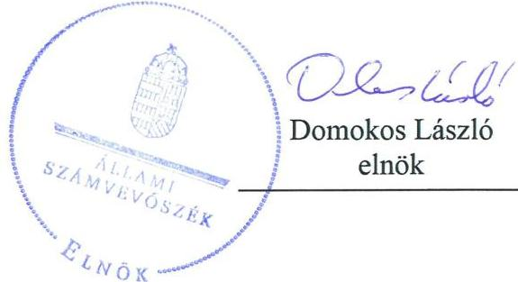
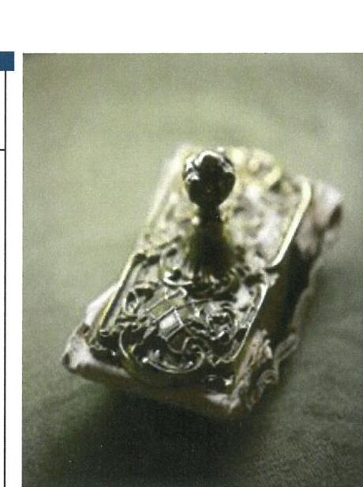
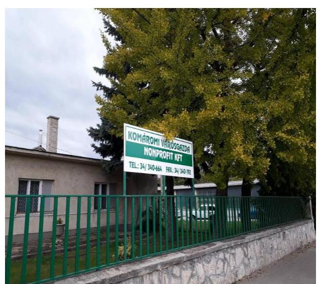
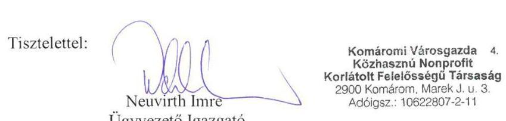
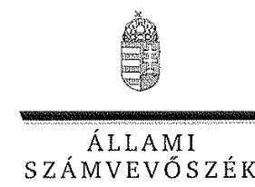
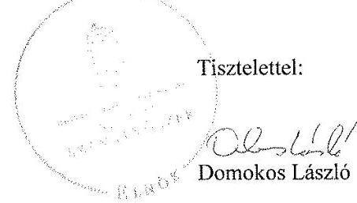

# Jelentés 

## Az önkormányzatok gazdasági társaságai

Az önkormányzatok többségi tulajdonában lévő gazdasági társaságok gazdálkodásának ellenőrzése - Komáromi Városgazda Közhasznú Nonprofit Kft.
2018. június 3. nap

---

# AZ ELLENŐRZÉST FELÜGYELTE: 

DR. HORVÁTH MARGIT felügyeleti vezető

## AZ ELLENŐRZÉST VEZETTE ÉS A VÉGREHAJTÁSÁÉRT FELELŐS:

RÁCZKEVI KATALIN ellenőrzésvezető

## A PROGRAM ÖSSZEÁLLÍTÁSÁÉRT FELELŐS:

TÓTPÁL SZABOLCS osztályvezető

IKTATÓSZÁM: EL-0146-090/2018.
TÉMASZÁM: 2447

## ELLENŐRZÉS-AZONOSÍTÓ SZÁM: V079336

Jelentéseink az Országgyűlés számítógépes hálózatán és az Interneten a www.asz.hu címen is olvashatóak.

---

# TARTALOMJEGYZÉK 

■ ÖSSZEGZÉS ..... 5
■ AZ ELLENŐRZÉS CÉLJA ..... 6
■ AZ ELLENŐRZÉS TERÜLETE ..... 7
■ AZ ELLENŐRZÉS HÁTTERE, INDOKOLTSÁGA ..... 9
■ A JELENTÉS LÉNYEGES KÉRDÉSKÖREI ..... 10
■ AZ ELLENŐRZÉS HATÓKÖRE ÉS MÓDSZEREI ..... 11
■ MEGÁLLAPÍTÁSOK ..... 13
■ JAVASLATOK ..... 20
■ MELLÉKLETEK ..... 21
I. sz. melléklet: Értelmező szótár ..... 21
II. sz. melléklet: A Társaság 2013-2016. évi egyszerűsített beszámolóinak főbb adatai (M Ft-ban) ..... 22
■ FÜGGELÉK: ÉSZREVÉTELEK ..... 23
■ RÖVIDÍTÉSEK JEGYZÉKE ..... 31

---

.

---

# ÖSSZEGZÉS 

Komárom Város Önkormányzatának tulajdonosi joggyakorlása szabályszerű volt. A Komáromi Városgazda Közhasznú Nonprofit Kft. gazdálkodásának szabályozottságát az ellenőrzött időszakban a 2013. évi kivételével biztosította. Vagyongazdálkodása szabályszerű volt. Bevételeinek és személyi jellegű ráfordítások elszámolása nem volt szabályszerű, anyagjellegű ráfordításainak elszámolása megfelelő az előírásoknak. A Társaság közérdekű adatok közzétételi kötelezettségének nem tett eleget, ezzel az átláthatóságát nem biztosította.

## Az ellenőrzés társadalmi indokoltsága

Magyarországon az önkormányzatok kötelező és önként vállalt feladataik ellátása során egyre szélesebb körben alkalmazzák a költségvetési szerveken kívüli feladatellátást, ezáltal az önkormányzati tulajdonú gazdasági társaságok is kiemelt fontosságú szerephez jutnak a lakossági szolgáltatások biztosításában. Az önkormányzatok tulajdonában álló gazdasági társaságok ellenőrzése kiemelten fontos a vagyon megőrzése, megóvása érdekében, amelyekkel szemben alapvető követelmény, hogy gazdálkodásuk, működésük szabályszerű legyen.

Az Állami Számvevőszék stratégiájában célul tűzte ki az államháztartáson kívül működő szervezetek ellenőrzését, mely hozzájárul a közpénzek szabályos, átlátható, elszámoltatható és eredményes felhasználásához. A Komáromi Városgazda Közhasznú Nonprofit Kft. az ellenőrzött időszak alatt Komárom Város Önkormányzatával kötött feladatellátási szerződés alapján az Önkormányzat feladatkörébe tartozó egyes alapellátásokat végezte, illetve közreműködött annak biztosításában. Az Állami Számvevőszék az ellenőrzése során arra kereste a választ, hogy szabályszerű volt-e a Társaság közfeladat-ellátással összefüggő gazdálkodása, felelősen bánt-e az Önkormányzat által átadott vagyonnal, és az Önkormányzat ehhez kapcsolódó tulajdonosi joggyakorlása szabályszerű volt-e.

## Főbb megállapítások, következtetések, javaslatok

Az Önkormányzat a Társaság feletti tulajdonosi joggyakorlása kereteit a jogszabályoknak és a belső előírásoknak megfelelően kialakította. A Társasággal közfeladatainak ellátására feladat-ellátási szerződést kötött, a tulajdonosi jogokat szabályszerűen gyakorolta, a Társaságot működéséről, valamint vagyoni és pénzügyi helyzetéről rendszeres beszámoltatta, belső ellenőrzése keretében rendszeresen ellenőrizte.

A Társaság a kötelező számviteli szabályzatokkal - 2013. év kivételével - rendelkezett. 2013. évben hiányzott a számlarend, valamint az év nagy részében az értékelési és leltározási szabályzat.

A vagyongazdálkodása szabályszerű volt, a mérleg eszköz és forrásadatait leltárral alátámasztotta, számviteli beszámolói megfeleltek a jogszabályi előírásoknak.

A bevételek és a személyi jellegű ráfordítások elszámolása nem volt szabályszerű, az anyagjellegű és egyéb ráfordítások, valamint az értékcsökkenés elszámolása szabályszerűen történt.

A Társaság kormányzati szektorba sorolt társaságként 2016. évben engedély nélkül kötött három adósságot keletkeztető ügyletet. A Társaság kormányzati szektorba sorolt társaságként 2016. január 1. és 2016. szeptember 30. közötti időszakban belső ellenőrzést, 2016. október 1-től a szervezet tevékenységének, a célok megvalósításának nyomon követését biztosító rendszert nem alakított ki.

A jogszabályokban előírt közzétételi kötelezettségének az ellenőrzött időszakban nem tett eleget, mert közérdekű adatait 2015-2016. évekre nem tette közzé, valamint a jogszabályban előírt vezető munkavállalókra vonatkozó adatokat az ellenőrzött időszakban nem tette közzé, ezáltal az átláthatóságot nem biztosította.

---

# AZ ELLENŐRZÉS CÉLJA 

Az ellenőrzés célja annak értékelése volt, hogy az Önkormányzat vagyongazdálkodási tevékenysége során szabályszerűen gyakorolta-e tulajdonosi jogait. A Társaság szabályozottsága, gazdálkodása és vagyongazdálkodási tevékenysége, bevételeinek és ráfordításainak elszámolása megfelelt-e a jogszabályi és tulajdonosi előírásoknak; a gazdasági társaság kötelezettségállománya jelent-e kockázatot a működésre. Az ellenőrzés célja továbbá annak megítélése, hogy a kormányzati szektorba sorolt önkormányzati tulajdonban lévő gazdálkodó szervezet gazdálkodásának a kormányzati szektor hiányára és az államadósságra befolyással bíró elemei a jogszabályi előírásoknak megfeleltek-e.

---

# AZ ELLENŐRZÉS TERÜLETE 

## Komárom Város Önkormányzata és a kizárólagos tulajdonában lévő Komáromi Városgazda Közhasznú Nonprofit Kft.

AZ ÖNKORMÁNYZAT ${ }^{1}$ 1991. október 1-én alapította a 100%-os tulajdonában álló „Saxum" Közszolgáltató, Ipari park fenntartó és Kereskedelmi Korlátolt Felelősségű Társaságot.

A Képviselő-testület ${ }^{2}$ 2015. február 25-étől a Társaság ${ }^{3}$ közhasznú jogállású szervezetként, Komáromi Városgazda Közhasznú Nonprofit Kft. néven történő működéséről, továbbá ugyanezen napon az Önkormányzat tulajdonában lévő Komáromi Kulturális, Szabadidő és Sport Közhasznú Nonprofit Kft. 2015. június 1-jei határidővel történő megszüntetéséről és a Társaságba történő beolvadásáról döntött.

## A KOMÁROMI VÁROSGAZDA KÖZHASZNÚ

NONPROFIT KFT. Komárom város közigazgatási területén a következő közfeladatokat látta el: köztemető fenntartása, helyi közutak, közparkok, közterületek fenntartása, köztisztasági feladatok, kulturális szolgáltatások biztosítása, szociális, gyermekjóléti szolgáltatások biztosítása, lakás- és helyiséggazdálkodás, helyi közfoglalkoztatás ellátásában közreműködés, sport, ifjúsági ügyek, valamint hulladékgazdálkodás. A Társaság a közhasznú feladatai ellátása mellett vállalkozási tevékenységet is folytatott, egyebek között konferencia, kereskedelmi bemutató szervezése, vendéglátás, sportszer kereskedelem.

A Társaság 2013. november 28-tól rendelkezett a Komáromi Thermálfürdő Szolgáltató Kft.-ben 9%-os tulajdoni hányaddal, az üzletrész megvásárlásához az Önkormányzat tőkeemelés formájában 12,62 M Ft-ot biztosított.

A Társaság jegyzett tőkéje 2013. január 1-jén 83,2 M Ft volt, majd 2013. november 28-án az Önkormányzat általi 12,62 M Ft tőkeemeléssel 95,8 M Ft-ra emelkedett. Az Önkormányzat 2015. március 31-én - a Komáromi Kulturális, Szabadidő és Sport Közhasznú Nonprofit Kft. beolvadásakor - újabb tőkeemelést hajtott végre 3,0 M Ft összegben, ezzel a Társaság jegyzett tőkéje 98,8 M Ft-ra emelkedett.

A Társaság tevékenységét saját vagyonával, valamint az Önkormányzattól üzemeltetésre átvett eszközökkel látta el. A Társaság vagyonkezelésbe nem vett vagyont.

A Társaság egyes gazdálkodási adatait az 1. táblázat mutatja be. A Társaság főbb mérlegadatait az II. számú melléklet tartalmazza.

---

1. táblázat

# A TÁRSASÁG FŐBB GAZDÁLKODÁSI ADATAI 2013-2016. ÉVEKBEN (M FT) 

| Megnevezés | 2013. év | 2014. év | 2015. év | 2016. év |
| :-- | --: | --: | --: | --: |
| Éves nettó árbevétel | 658,1 | 603,5 | 224,3 | 98,2 |
| Egyéb bevétel | 1,1 | 0,7 | 454,0 | 546,2 |
| Mérlegfőösszeg | 248,8 | 245,5 | 254,6 | 235,4 |
| Mérleg szerinti eredmény/adózott | 3,9 | 5,2 | 0,1 | 0,8 |
| eredmény 2016. év | 134,3 | 139,5 | 145,1 | 145,9 |
| Saját tőke | 83,2 | 95,8 | 98,8 | 98,8 |
| Jegyzett tőke | 136,1 | 136,9 | 35,3 | 26,5 |
| Követelések | 104,6 | 98,5 | 105,1 | 88,5 |
| Kötelezettségek |  |  | Forrás: A Társaság 2013-2016. évi egyszerűsített beszámolói |  |

Az éves nettó árbevétel 2015. és 2016. évben csökkent, ennek oka elsősorban a Társaság tevékenységi körének változása. Az egyéb bevételek növekedését az Önkormányzattól, valamint külső forrásból elnyert támogatások növekedése eredményezte.

A Társaság az ellenőrzött időszakban működéséhez folyószámlahitelt vett igénybe, melynek kerete 2013. július 30-ig 5 M Ft, majd az ellenőrzött időszak végéig 15 M Ft volt.

A polgármester és a jegyző személyében az ellenőrzött időszakban nem történt változás.

A Társaságnál az ellenőrzött időszak alatt 3 tagú, majd 2015. július 1-től 6 tagú felügyelőbizottság működött. A könyvvizsgáló személye az ellenőrzött időszak alatt nem változott. Az ügyvezető személye az ellenőrzött időszak alatt egyszer, 2013. május 31-én változott.

A Társaság által foglalkoztatottak száma a 2015. évben 92, míg a 2016. évben 77 fő volt.

A Társaság az ellenőrzött időszak alatt 2016. évben tartozott a kormányzati szektorba sorolt gazdasági társaságok közé.

Az ellenőrzött években a Társaság nem volt kötelezett önköltségszámítás készítésére.

---

# AZ ELLENŐRZÉS HÁTTERE, INDOKOLTSÁGA 

## AZ ÖNKORMÁNYZATI TULAJDONÚ GAZDASÁGI

TÁRSASÁGOK teljes körű ellenőrzésének lehetőségét az Állami Számvevőszékről szóló 1989. évi XXXVIII. törvény 2011. január 1-jétől hatályos módosítása teremtette meg és az Állami Számvevőszékről szóló 2011. évi LXVI. törvény is tartalmazza. A gazdasági társaságok gazdálkodási tevékenysége szabályszerűségének ellenőrzését 2011. évtől végezzük. Az önkormányzatok tulajdonában álló gazdasági társaságok ellenőrzése kiemelten fontos a vagyon megőrzése, megóvása érdekében.

A feladatellátás költségeinek, ráfordításainak alakulása a lakosság széles rétegét érinti. Az ellenőrzés várható hasznosulásaként ellenőrzéseink feltárhatják, hogy az önkormányzat a feladatellátásához rendelt vagyon működtetését a tulajdonostól elvárható gondossággal végezte-e, a feladatot ellátó gazdasági társaság a létesítő okiratban, szolgáltatási szerződésben foglaltak betartásával biztosította-e a feladat ellátását. Az ellenőrzés rávilágíthat arra, hogy a gazdasági társaság a vagyon használatával biztosította-e a szolgáltatás folytatásának feltételeit, az önkormányzat tulajdonosi felügyelete hozzájárult-e a szabályszerű gazdálkodáshoz és feladatellátáshoz. Az önkormányzatok tulajdonában álló gazdasági társaságok ellenőrzése kiemelt jelentőségű, mivel működésük hatással van a tulajdonos önkormányzat gazdálkodására, gazdálkodásának egyes elemei befolyásolják az önkormányzati alszektor hiányát és az államadósságot.

A megállapítások alapján megfogalmazott számvevőszéki javaslatok hasznosítása elősegítheti a meglévő hibák megszüntetését. A jó gyakorlatok bemutatásával az Állami Számvevőszék hozzájárul a követendő megoldások megismertetéséhez, terjesztéséhez.

---

# A JELENTÉS LÉNYEGES KÉRDÉSKÖREI 

1.- Az Önkormányzat Társaság feletti tulajdonosi joggyakorlása szabályszerű volt-e?
2.- A Társaság szabályozottsága, gazdálkodása és vagyongazdálkodási tevékenysége szabályszerű volt-e?
3.- A Társaság bevételeinek és ráfordításainak elszámolása, valamint az árképzés szabályszerű volt-e?

---

# AZ ELLENŐRZÉS HATÓKÖRE ÉS MÓDSZEREI 

## Az ellenőrzés típusa

Megfelelőségi ellenőrzés.

## Az ellenőrzött időszak

2013. január 1-jétől 2016. december 31-ig tartó időszak.

## Az ellenőrzés tárgya

Komárom Város Önkormányzata tulajdonosi joggyakorlása, valamint a Komáromi Városgazda Közhasznú Nonprofit Kft. gazdálkodásának szabályozottsága és szabályszerűsége.

Az ellenőrzés kiterjedt minden olyan körülményre és adatra, amely az ÁSZ ${ }^{4}$ jogszabályban meghatározott feladatainak teljesítéséhez, valamint a program végrehajtása folyamán felmerült újabb összefüggések feltárásához szükséges.

## Az ellenőrzött szervezet

Komáromi Városgazda Közhasznú Nonprofit Kft. és a tulajdonosi jogokat gyakorló Komárom Város Önkormányzata.

## Az ellenőrzés jogalapja

Az ellenőrzés jogszabályi alapját az ÁSZ tv. ${ }^{5}$ 1. § (3) bekezdése és 5. § (3)-(5) bekezdései képezték.

## Az ellenőrzés módszerei

Az ellenőrzést a nemzetközi standardokat irányadónak tekintve az ellenőrzési program ellenőrzési kérdései, az ellenőrzött időszakban hatályos jogszabályok, az ellenőrzés szakmai szabályok és módszertanok figyelembe vételével végeztük.

Az ellenőrzés ideje alatt az ellenőrzött szervezettel történő kapcsolattartást az ÁSZ Szervezeti és Működési Szabályzatának vonatkozó előírásai alapján biztosítottuk.

Az ellenőrzés a tulajdonosi jogokat gyakorló önkormányzatra, és az ellenőrzött gazdasági társaságra terjedt ki.

---

Az ellenőrzési kérdések megválaszolásához szükséges bizonyítékok megszerzése a következő ellenőrzési eljárások alkalmazásával történt: megfigyelés, kérdésfeltevés (információkérés), összehasonlítás, valamint elemző eljárás. Az ellenőrzési bizonyítékként felhasználható adatforrások közé tartoztak egyrészt az ellenőrzési programban felsorolt adatforrások, másrészt adatforrás lehet még minden - az ellenőrzés folyamán - feltárt, az ellenőrzés szempontjából információkat

 tartalmazó dokumentum.

Az ellenőrzést a kérdésekre adott válaszok kiértékelésével, valamint a megjelölt adatforrások, a csatolt tanúsítványok felhasználásával, továbbá az adott időszakban hatályos jogszabályok figyelembe vételével folytattuk le.

A bevételek és ráfordítások elszámolása, valamint a vagyonnyilvántartás terén a szabályszerű működést véletlen mintavétellel ellenőriztük. A mintavétellel ellenőrzött területek esetében minden egyes tétel vonatkozásában a szabályszerűségre vonatkozó kérdéseket tettünk fel, amelyek eredménye összesítésre került. Megfelelőnek értékeltünk egy ellenőrzött területet, amennyiben 95%-os bizonyossággal a teljes sokaságban az átlagos hibaarány legfeljebb 10%, nem megfelelőnek, amennyiben 10%-nál magasabb arányt képviselt. Abban az esetben, ha a teljes sokaság tekintetében a 10%-os hibaarányhoz való viszony megítélésének megbízhatósága nem érte el a 95%-ot, annak elérése érdekében értékelésünket további szempontokkal egészítettük ki, és figyelembe vettük a feltárt hibák típusát és súlyát. A ráfordítások elszámolására és a vagyonnyilvántartásra vonatkozó véletlen mintavételt kockázati alapú kiválasztással egészítettük ki, amelynek során évente a három legnagyobb összegű tételt értékeltük.

---

# 1. Az Önkormányzat Társaság feletti tulajdonosi joggyakorlása szabályszerű volt-e? 

Összegző megállapítás

1.1. számú megállapítás

A tulajdonosi joggyakorlás kereteit szabályszerűen kialakították, a tulajdonosi joggyakorlás az előírásoknak megfelelő volt.

Az Önkormányzat a tulajdonosi joggyakorlás kereteit szabályszerűen alakította ki.

Az Önkormányzat ellenőrzött időszakra szóló gazdasági programjában ${ }_{1-2}{ }^{6}$ a közszolgáltatások biztosítása, fejlesztése érdekében a Társaság által ellátott feladatokra vonatkozó célkitűzéseket rögzítette. Az Önkormányzat közép- és hosszú távú vagyongazdálkodási tervében ${ }^{7}$ előírta a tulajdonában lévő gazdasági társaság hatékony és költségtakarékos működésének ellenőrzését.

Az önkormányzati vagyonnal való rendelkezés szabályait - köztük azon gazdálkodó szervek felsorolását, amely tekintetben a Képviselő-testület tulajdonosi, alapítói jogokat gyakorol - a vagyonrendeletében ${ }^{8}$-ben állapította meg.

A Társaság feletti tulajdonosi jogok gyakorlásának rendjét az Önkormányzat a Gt. és a Ptk. előírásaival összhangban az Alapító okirat ${ }_{1-11}{ }^{9}$-ban, az Önkormányzati SZMSZ ${ }^{10}{ }_{1-3}$-ban, a Társaság SZMSZ ${ }_{1,2,3}{ }^{11}$-ében, a vagyonrendeletben, valamint az éves költségvetési rendeletekben és azok módosításaiban szabályozta.

A Képviselő-testület a Társaság alapításakor a Gt., a Ptk., valamint az Alapító okiratban foglaltak szerint rendelkezett a felügyelőbizottság ${ }^{12}$ létrehozásáról, valamint a könyvvizsgáló megbízásáról. A felügyelőbizottság tagjainak feladatait és kötelezettségeit a Képviselő-testület által jóváhagyott ügyrend ${ }^{13}$ tartalmazta.

A Társaság feladatainak ellátásához önkormányzati tulajdonú eszközöket kapott üzemeltetésre, bérleti díj ellenében. Az Önkormányzat és a Társaság között a Társaság által üzemeltetett összes vagyonelem üzemeltetésének feltételeit Üzemeltetési szerződésben ${ }^{14}$ szabályszerűen rögzítették, majd az üzemeltetésbe adott ingatlanok körében, illetve a bérleti díjban bekövetkezett változások alkalmával módosították azt.

Az Üzemeltetési szerződésben szabályozták az üzemeltetésre kapott eszközök, ingatlanok hasznosításának feltételeit, 3 hónapon túli bérleti szerződésmegkötéséhez előírták az Önkormányzat előzetes írásbeli hozzájárulását.

Monitoring tevékenységének kialakításához a Képviselő-testület a Társaság részére a feladatellátásához kapcsolódó követel-

---

ményeket meghatározta. Az Alapító okirat ${ }_{1-11}$-ban, Üzemeltetési szerződésben, városgazdálkodási és üzemeltetési szerződés ${ }^{15}$-ben, a közhasznú tevékenység ellátásának feltételeiről kötött megállapodás ${ }_{1-2}{ }^{16}$-ban előírta a Társaság évközi negyedéves, féléves beszámolási kötelezettséget a Társaság működéséről, likviditási helyzetéről, gazdálkodásáról. A Társaság SZMSZ-ében előírták az üzleti terv elkészítésének kötelezettségét is.

A Társaság az ellenőrzött időszakban rendelkezett a Taktv. ${ }^{17}$ 5.§ (3) bekezdésében foglaltaknak megfelelően Javadalmazási szabályzat ${ }^{18}$-tal, melyet a Képviselő-testület jóváhagyott.

# 1.2. számú megállapítás 

Az Önkormányzat a tulajdonosi jogokat szabályszerűen gyakorolta.
A tulajdonosi joggyakorlás keretében a Képviselő-testület a Társaságnak üzemeltetésre átadott vagyonelemek használatát, a vagyonelemekkel való gazdálkodást az Üzemeltetési szerződésben foglaltaknak megfelelően ellenőrizte.

## A Társaságot a Képviselő-testület beszámoltatta az előírt évközi negyedéves, féléves beszámolók elfogadásával. A felügyelőbizottság rendszeresen megtárgyalta a Társaság beszámolóit, éves üzleti terveit. A Társaság éves beszámolóit a Képviselő-testület az ellenőrzött időszakban a Számv. tv. és a Ptk. előírásainak megfelelően a könyvvizsgáló írásos véleménye, valamint a felügyelőbizottság írásos jelentése figyelembevételével megtárgyalta, és határozataival elfogadta azokat. Az éves beszámolók elfogadásával egyidejűleg döntött az egyes évek eredményeinek tartalékba helyezéséről, osztalékfizetésre nem került sor.

## Az Önkormányzat belső ellenőrzés keretében a 2014. és a 2016. években ellenőrizte a Társaság gazdálkodását, működését, valamint a megkötött szerződések szabályszerűségét. A belső ellenőr a Társaság gazdálkodását, működését mindkét év ellenőrzése során szabályszerűnek, megfelelőnek minősítette. Az ügyvezető a belső ellenőr javaslatainak végrehajtása érdekében intézkedési terveket és beszámolókat készített.

A Társaságnál - 2015. év kivételével - minden ellenőrzött évben történt külső ellenőrzés. A NAV ${ }^{19}$, a kormányhivatalok, a Levéltár ${ }^{20}$ által lefolytatott külső ellenőrzések megállapítása alapján - a szükséges intézkedési terveket az ügyvezető elkészítette, valamint beszámolt a tulajdoni joggyakorló felé a végrehajtott intézkedésekről.

Az ellenőrzött időszakban a Társaság nevének és tevékenységi körének módosításakor, valamint más önkormányzati gazdasági társaságnak a Társaságba történő beolvadásakor a Képviselő-testület szabályszerűen hozta meg döntéseit, és azoknak megfelelően módosította az Alapító okiratot.

A Társaság folyószámlahitel-szerződésére a Képviselő-testület felhatalmazása alapján az Önkormányzat szabályszerűen vállalt készfizető kezességet.

---

# 2. A Társaság szabályozottsága, gazdálkodása és vagyongazdálkodási tevékenysége szabályszerű volt-e? 

Összegző megállapítás

2.1. számú megállapítás

A Társaság szabályozottsága - 2013. év kivételével - megfelelő volt. Vagyongazdálkodása szabályszerű volt, beszámolási kötelezettségének eleget tett. A közérdekű adatok közzétételéről 2015-2016. években nem gondoskodott.

A Társaság gazdálkodásának szabályozottsága 2013. évben nem volt megfelelő, mert hiányzott a számlarend, valamint az év nagy részében a leltározási szabályzat és az értékelési szabályzat.

A számviteli szabályzatok közül a Társaság az ellenőrzött időszak egészében rendelkezett a Számv. tv. ${ }^{21}$-ben előírtaknak megfelelő Számviteli politika ${ }_{1-4}{ }^{22}$-val. A Társaság közhasznú jogállására való tekintettel a Számviteli politika ${ }_{3-4}$-ben a Számv. tv., Civil. tv. jogszabályi előírásoknak megfelelően szabályozta a közhasznú tevékenység bevételeinek és ráfordításainak jogszabály szerinti elkülönítését. A számviteli politika keretén belül elkészült a Számv. tv. előírásainak megfelelő Pénzkezelési szabályzat ${ }_{1-5}{ }^{23}$.

Leltározási szabályzat 2013. december 1-jéig nem készült, ez ellentétes a Számv. tv. 14.§ (5) bekezdés a) pontjában, valamint a Számviteli politika ${ }_{1}$ 9. pontjában foglaltaknak. A Társaság Leltározási szabályzata ${ }_{1}{ }^{24}$ 2013. december 2-án lépett hatályba, amely biztosította a Társaság 2013. évi leltározási feladatainak szabályszerű lebonyolítását. A Leltározási szabályzat ${ }_{1-2}$ megfelelt a Számv. tv. előírásainak.

A Társaság 2013. május 1-jéig nem készítette el a Számv. tv. 14. § (5) bekezdés b) pontjában és a Számviteli politika ${ }_{1}$ 9. pontjában előírtak ellenére az eszközök és források értékelési szabályzatát. A 2013. május 1-jén hatályba lépett Értékelési szabályzat ${ }^{25}$-ban a jogszabályban előírt módon rögzítésre került az eszközök és források értékelésének módja, az eszközök értékcsökkenésének elszámolása, a hasznos élettartam, a maradványérték meghatározása, valamint az alkalmazott leírási módok.

Számlarendet a Társaság 2013. január 1. és 2013. december 31. közötti időszakra nem készített, amely nem felelt meg a Számv. tv. 161. § (1) bekezdésében előírtaknak. A 2014. január 1-jétől hatályos Számlarend ${ }_{1-3}{ }^{26}$ megfelelt a Számv. tv. előírásainak.

A Társaság 2013. január 1-től 2013. június 30-ig nem rendelkezett bizonylati renddel, ezzel megsértette a Számv. tv. 161. § (d) pontjában foglaltakat. A hiányosságot a számlarendtől független, önálló Bizonylati rend ${ }_{1}{ }^{27}$ 2013. július 1-jei létrehozásával pótolták.

---

### 2.2. számú megállapítás

## A Társaság vagyongazdálkodása szabályszerű volt. Beszámolóit az ellenőrzött időszak éveiben leltárral alátámasztotta. Az értékcsökkenési leírás elszámolása szabályszerű volt.

A Társaság az Üzemeltetési szerződés 7.1. pontjában előírtaknak megfelelően az üzemeltetésre átvett ingatlanokat a cégnyilvántartásban telephelyként bejegyeztette. Az üzemeltetésre átvett ingatlanokkal kapcsolatban egyéb nyilvántartási kötelezettsége nem merült fel.

A Társaság saját vagyonához kapcsolódó vagyonnyilvántartása szabályszerű volt.

Az értékcsökkenés elszámolását a jogszabályban előírtaknak megfelelően végezték el.

A Társaság az ellenőrzött időszakban rendelkezett az egyszerűsített éves beszámolójának mérlegsorait alátámasztó leltárral, amely tételesen, ellenőrizhető módon tartalmazta a mérleg fordulónapján meglévő eszközeit és forrásait mennyiségben és értékben a Számv.tv. előírásainak megfelelően. A leltározási feladatokat az ellenőrzött időszakban a Leltározási szabályzat ${ }_{1-2}$ előírásainak megfelelően elvégezték, leltáreltérést nem állapítottak meg.

Az Üzemeltetési szerződésben előírtak szerint a Társaság biztosította az üzemeltetésbe átvett vagyon üzemeltetését, működtetését, az ingatlanokat a gazdálkodási tevékenysége során bérbeadás útján hasznosította.

A Társaság az ellenőrzött időszakra vonatkozó középtávú beruházási eszközbeszerzési tervével összhangban valósította meg a beruházásait, befektetett eszközeinek értéke 2013. évről 2016. évre 21,5 M Ft-tal nőtt.

A Társaság befektetett eszközeinek alakulását a 2. táblázat mutatja be.
2. táblázat

A Társaság befektetett eszközeinek alakulása 2013-2016. években (M Ft)

| Megegyezés | 2013. év | 2014. év | 2015. év | 2016. év |
| :-- | :--: | :--: | :--: | :--: |
| Immateriális javak | 0,3 | 0,7 | 0,5 | 0,8 |
| Tárgyi eszközök | 80,5 | 80,4 | 91,4 | 101,5 |
| Befektetett pénzügyi eszközök | 12,6 | 12,6 | 12,6 | 12,6 |
| Befektetett eszközök összesen | 93,4 | 93,7 | 104,5 | 114,9 |

A Társaság az ellenőrzött időszakban az Alapító okirat előírásainak megfelelően járt el a 10 M Ft-os értékhatárt elérő szerződések megkötésekor, mert a tulajdonosi joggyakorló előzetes jóváhagyását az ügyletekhez beszerezte.

Az ellenőrzött időszakban a Társaság saját tőkéje elérte az adott társasági formára kötelezően előírt jegyzett tőke értékét, ezért tőke visszapótlását célzó intézkedésekre nem volt szükség. A Társaság saját vagyonának megterhelésére, elidegenítésére 2013-2016. évek között nem került sor.

A Társaság, mint 2016. évtől kormányzati szektorba sorolt egyéb gazdálkodó szervezet a Bkr. ${ }^{28}$ 10. §-ában és a Bkr. 54/A. §-ban foglaltak ellenére a 2016. január 1. és 2016. szeptember 30. közötti időszakban a belső ellenőrzést, 2016. október 1-től a szervezet tevékenységének, a célok megvalósításának nyomon követését biztosító rendszert nem alakította ki.

---

### 2.3. számú megállapítás

3. táblázat

A Társaság kötelezettségeinek alakulása 2013. és 2016. évek (M Ft)

|  |  |  |
| :-- | --: | --: |
|  | 2013. | 2016. |
| Hosszú lejáratú kötelezettségek | 1,5 | 7,6 |
| Rövid lejáratú kötelezettségek | 103,1 | 80,9 |
| * Szállítók felé fennálló tartozás | 37,1 | 54,8 |
| * Önkormányzat felé fennálló tartozás | 15,6 | 4,5 |
| Folyószámlahitel-keret | 5,0 | 15,0 |
| Kötelezettség összesen: | 104,6 | 88,5 |

Forrás: A Társaság adatszolgáltatása
2.4. számú megállapítás

## A Társaság kötelezettségállománya csökkent az ellenőrzött időszakban.

A Társaság kötelezettségállománya az ellenőrzött időszak alatt csökkent.
A rövid lejáratú kötelezettségek állománya az ellenőrzött időszakban csökkent, az állomány jelentős részét a szállítói kötelezettségek és az Önkormányzattal szembeni kötelezettségek tették ki.

A szállítói kötelezettségek év végi állománya az ellenőrzött időszak alatt nőtt, azonban ez nem veszélyeztette a Társaság likviditását.

A hosszú lejáratú kötelezettségek esedékes törlesztő részleteinek határidőben történő teljesítése biztosított volt. A Társaság kötelezettségeinek alakulását a 3. táblázat mutatja be.

A Társaság ügyvezetője a Társaság kötelezettségeiről, valamint likviditási helyzetének alakulásáról az ellenőrzött időszak alatt a tulajdonosi joggyakorló által meghatározott
 negyedéves beszámoltatás keretében beszámolt a Képviselő-testületnek, a beszámolók minden esetben elfogadásra kerültek.

A Társaság tervezési, beszámolási kötelezettségének eleget tett. 2015-2016. években a közérdekű adatok közzétételéről nem gondoskodott, ezzel az átláthatóságot nem biztosította. 2016. évben adatszolgáltatási kötelezettségének nem tett eleget.

ÜZLETI TERVEIT a Társaság minden évben elkészítette, melyet a Képviselő-testület határozatokkal elfogadott.

EGYSZERŰSÍTETT ÉVES BESZÁMOLÓIT az ellenőrzött időszak minden évében, valamint közhasznú jogállására való tekintettel 2015-2016. évekre vonatkozó közhasznúsági mellékleteit a jogszabályi előírásoknak megfelelően elkészítette, a Képviselő-testület az előírásoknak megfelelő módon jóváhagyta. A Társaság választott könyvvizsgálója az ellenőrzött időszakban az egyszerűsített éves beszámolókat korlátozás nélküli hitelesítő záradékkal látta el. Az éves beszámolókat a Számv. tv. előírásainak megfelelően letétbe helyezte, és határidőben közzétette.

A Társaság a 2015-2016. évekre a közhasznú tevékenységének ellátására kapott támogatások felhasználásáról a megállapodás ${ }_{1-2}$-ben előírtak szerint beszámolt az Önkormányzat részére.

KÖZZÉTÉTELI KÖTELEZETTSÉGÉNEK a Társaság nem tett eleget, mert a Taktv. 2. §-a ellenére nem tette közzé vezető állású munkavállalóinak a Taktv. 2. §-ának (1) bekezdése szerint meghatározott adatait.

A Társaság nem tett eleget az Info.tv. ${ }^{29}$ 37. § (1) bekezdésben foglalt előírásnak, mert az Info. tv. 33. § (3) bekezdése ellenére sem a saját, sem az Önkormányzat honlapján nem tette közzé az Info tv. 1. számú mellékletében meghatározott általános közzétételi listában szereplő adatokat, ezáltal nem biztosította az Info tv. 1. §-ában megfogalmazott, a közügyek átláthatósága a közérdekű és a közérdekből nyilvános adatok megismeréséhez és terjesztéséhez fűződő jog érvényesítésével összefüggő cél megvalósulását. Az Info.tv. 26. § (1) bekezdésének ellenére a 2015-2016. években nem volt biztosított a közérdekű adatok megismerése a Társaságnál.

---

A Társaság a Stabilitási tv. 4. §. (4) bekezdésében előírtak alapján az Áht. ${ }^{30}$ 107. § (1) bekezdés ellenére nem tett eleget a 2016. évre vonatkozó adatszolgáltatási kötelezettségének az államháztartásért felelős miniszter részére.

# 3. A Társaság bevételeinek és ráfordításainak elszámolása, valamint az árképzés szabályszerű volt-e? 

## Összegző megállapítás

### 3.1. számú megállapítás

A Társaság bevételeinek elszámolása nem volt szabályszerű, a ráfordítások elszámolása a személyi jellegű ráfordítások kivételével szabályszerű volt. A Társaság 2016. évben engedély nélkül kötött adósságot keletkeztető ügyletet. Árképzése során az előírásoknak megfelelően járt el.

A Társaság bevételeinek elszámolása nem volt szabályszerű, a ráfordítások elszámolását - a személyi jellegű ráfordítások kivételével - szabályszerűen végezték. A Társaság 2016. évben engedély nélkül kötött adósságot keletkeztető lízingügyletet.

A BEVÉTELEK ELSZÁMOLÁSA az ellenőrzött időszakban nem volt szabályszerű, mert az elszámolásokban az alkalmazott főkönyvi számlák kijelölése nem felelt meg a Számv. tv. 167. § (1) bekezdés h) pontjában foglaltaknak, nem történt hivatkozás a könyvviteli bizonylatokon a könyvelés módjára, az érintett könyvviteli számlákra.

A RÁFORDÍTÁSOK ELSZÁMOLÁSA - a személyi jellegű ráfordítások kivételével - az ellenőrzött időszakban szabályszerű volt. A Társaság a ráfordítás elszámolását a Számv.tv. 166.§-ában foglaltaknak megfelelő számviteli bizonylat alátámasztotta, a költségelszámolást megalapozó szerződés, megrendelés rendelkezésre állt.

A személyi jellegű ráfordítások elszámolása a 2013-2016. években nem felelt meg a jogszabályi előírásoknak, mert a jövedelmek elszámolását alátámasztó dokumentumokban a Számv. tv. 167. § (1) bekezdés h) pontjában előírtak ellenére nem történt hivatkozás a könyvviteli bizonylatokon a könyvelés módjára, az érintett könyvviteli számlákra.

A Társaság kormányzati szektor hiányára befolyást gyakorló bevételeinek és ráfordításainak elszámolása 2016. évben szabályszerű volt.

A KÖVETELÉSEK ÁLLOMÁNYA az ellenőrzött időszakban a 2013. évi 128,7 M Ft-ról 2016. évre 17,7 M Ft-ra csökkent.

A Társaság a vevő követeléseket egyedileg, lejárat szerint tartotta nyilván. A vevőkövetelések egyenlegéről az év végi egyenlegközlőket kiküldték, a kintlévőségek behajtásának érdekében peresítésre is került sor. Az előírásoknak megfelelően az értékvesztéseket elszámolták.

ADÓSSÁGOT KELETKEZTETŐ ÜGYLETET a Társaság kormányzati szektorba sorolt szervezetként - a 2016. évben kötött 8,5 M Ft összegű tőkerészre, három lízing-szerződéssel lízingbevevői félként, azonban az adósságot keletkeztető ügyletekhez történő hozzájárulás

---

# 3.2. számú megállapítás 

részletes szabályairól szóló 353/2011. (XII. 30.) Kormányrendelet 11. § (1) bekezdése ellenére nem kérelmezte a Stabilitási tv. ${ }^{31}$ 9. § (1) bekezdésben meghatározott, a tulajdonosi jogokat gyakorló Önkormányzat egyetértését, valamint nem rendelkezett az államháztartásért felelős miniszter előzetes hozzájárulásával sem.

## A Társaság árképzése megfelelt az előírásoknak.

A Társaság által ellátott tevékenységekhez kapcsolódóan az Önkormányzat rendeletalkotási kötelezettségének eleget tett az ágazati jogszabályokban meghatározott önkormányzati hatáskörbe utalt díjak tekintetében. Ezen belül az Önkormányzat a Társaság által alkalmazható árak kialakításához meghatározta a lakások és helyiségek használatának és bérbeadásának díjait, a településüzemeltetés, a köztisztaság, szociális, gyerekjóléti szolgáltatás, a helyi közművelődési tevékenység támogatása, kulturális szolgáltatások, közfoglalkoztatás, sport, ifjúsági ügyek, egészséges életmód segítését célzó szolgáltatások, a helyi hulladékgazdálkodás díjait, valamint keretszabályait.

Az Önkormányzat a Társasággal kötött szerződésekben meghatározta az ellátott tevékenységek árait, melyet a Társaság az ellenőrzött időszakban alkalmazott a bevételeinek elszámolása során.

---

# JAVASLATOK 

Az ÁSZ tv. 33. § (1) bekezdésében foglaltak értelmében az ellenőrzött szervezet vezetője köteles a jelentésben foglalt megállapításokhoz kapcsolódó intézkedési tervet összeállítani és azt a jelentés kézhezvételétől számított 30 napon belül az ÁSZ részére megküldeni. Amennyiben az ellenőrzött szervezet vezetője nem küldi meg határidőben az intézkedési tervet, vagy továbbra sem elfogadható intézkedési tervet küld, az Állami Számvevőszék elnöke az ÁSZ tv. 33. § (3) bekezdés a) és b) pontjaiban foglaltakat érvényesítheti.

## Javaslataink célja a Komáromi Városgazda Közhasznú Nonprofit Kft. gazdálkodása szabályszerűségének javítása annak érdekében, hogy a szabályozási környezet és az alkalmazott gyakorlat megfelelően tudja támogatni az átlátható működést.

## Komáromi Városgazda Közhasznú Nonprofit Kft. ügyvezetőjének

1. Intézkedjen a Bkr.-nek megfelelően a szervezet tevékenységének, a célok megvalósításának nyomon követését biztosító rendszer kialakításáról.
(2.2. sz. megállapítás 10. bekezdése alapján)
2. Intézkedjen az Info. tv., valamint a Taktv. szerinti közzétételi kötelezettség teljesítéséről.
(2.4. sz. megállapítás 4. bekezdés és 5. bekezdés 1. mondata alapján)
3. Intézkedjen az Áht. előírásai szerinti adatszolgáltatási kötelezettség teljesítéséről.
(2.4. sz. megállapítás 6. bekezdése alapján)
4. Intézkedjen a bevételek, valamint a személyi jellegű ráfordítások elszámolásának Számv. tv. előírásainak megfelelő tartalmú dokumentumokkal történő alátámasztásáról.
(3.1. sz. megállapítás 1. és 3. bekezdései alapján)
5. Intézkedjen annak érdekében, hogy a Társaság adósságot keletkeztető ügyletet az államháztartásért felelős miniszter előzetes hozzájárulásának birtokában, a tulajdonosi joggyakorló egyetértése mellett kössön a Stabilitási tv., továbbá a 353/2011. (XII. 30.) Korm. rendelet rendelkezésének megfelelően.
(3.1. sz. megállapítás 7. bekezdése alapján)

---

# MELLÉKLETEK 

- I. SZ. MELLÉKLET: ÉRTELMEZŐ SZÓTÁR
gazdasági társaság
kezesség
kormányzati szektorba sorolt egyéb szervezet
közszolgáltatás
nonprofit gazdasági társaság

Ptk 3.88. § (1) bekezdése szerint „a gazdasági társaságok üzletszerű közös gazdasági tevékenység folytatására, a tagok vagyoni hozzájárulásával létrehozott, jogi személyiséggel rendelkező vállalkozások, amelyekben a tagok a nyereségből közösen részesednek, és a veszteséget közösen viselik"
A kezességre vonatkozó előírásokat a Ptk. 6:416-430. §-ai tartalmazzák. Kezességi szerződéssel a kezes kötelezettséget vállal a jogosulttal szemben, hogyha a kötelezett nem teljesít, maga fog helyette a jogosultnak teljesíteni. Kezesség egy vagy több, fennálló vagy jövőbeli, feltétlen vagy feltételes, meghatározott vagy meghatározható összegű pénzkövetelés vagy pénzben kifejezhető értékkel rendelkező egyéb kötelezettség biztosítására vállalható. A Ptk. szerint kezességet csak írásban lehet vállalni. A kezes kötelezettsége ahhoz a kötelezettséghez igazodik, amelyért kezességet vállalt. A kezes kötelezettsége nem válhat terhesebbé, mint amilyen elvállalása-kor volt, kiterjed azonban a kötelezett szerződésszegésének jogkövetkezményeire és a kezesség elvállalása után esedékessé váló mellékkövetelésekre is.
az Áht. 3. § (2) és (3) bekezdésében foglaltakon kívül az Európai Közösséget létrehozó szerződéshez csatolt, a túlzott hiány esetén követendő eljárásról szóló jegyzőkönyv alkalmazásáról szóló 2009. május 25-i 479/2009/EK rendelet (a továbbiakban: 479/2009/EK rendelet) szerint a kormányzati szektorba sorolt szervezet (Áht. 1. § (12))
Az Ebktv. 3. § d) pontja a következőképpen határozza meg a közszolgáltatást: „szerződéskötési kötelezettség alapján a lakosság alapvető szükségleteinek ellátására irányuló szolgáltatás, így különösen a villamos energia-, gáz-, hő-, víz-, szennyvíz- és hulladékkezelési, köztisztasági, postai és távközlési szolgáltatás, továbbá a menetrend alapján közlekedő járművekkel végzett közforgalmú személyszállítás".
Civil tv. 9/F. § (2) bekezdése szerint „az a gazdasági társaság minősül nonprofit gazdasági társaságnak és cégnevében az a gazdasági társaság tüntetheti fel a nonprofit jelleget, amelynek létesítő okirata tartalmazza, hogy a gazdasági társaság tevékenységéből származó nyereség a tagok között nem osztható fel, hanem az a gazdasági társaság vagyonát gyarapítja." (hatályos 2014. március 15-től)

---

II. SZ. MELLÉKLET: A TÁRSASÁG 2013-2016. ÉVI EGYSZERŰSÍTETT BESZÁMOLÓINAK FŐBB ADATAI (M FT-BAN)

| Megnevezés | 2013. év | 2014. év | 2015. év | 2016. év |
| :--: | :--: | :--: | :--: | :--: |
| Mérlegfőösszeg | 248,8 | 245,5 | 54,6 | 235,4 |
| Befektetett eszközök | 93,4 | 93,8 | 104,5 | 114,9 |
| - ebből tárgyi eszközök | 80,5 | 80,4 | 91,4 | 101,5 |
| Forgóeszközök | 154,8 | 151,3 | 81,5 | 40,8 |
| - ebből készletek | 7,5 | 4,2 | 12,9 | 5,5 |
| - ebből követelések | 136,1 | 136,9 | 35,3 | 26,5 |
| Aktív időbeli elhatárolás | 0,7 | 0,5 | 89,0 | 79,7 |
| Saját tőke összege | 134,3 | 139,5 | 145,1 | 145,9 |
| Jegyzett tőke | 95,8 | 95,8 | 98,8 | 98,8 |
| Eredménytartalék | 29,0 | 33,0 | 40,6 | 40,7 |
| Lekötött tartalék | 0 | 0 | 0 | 0 |
| Mérleg szerinti eredmény/Adózott eredmény 2016-ban | 4,0 | 5,2 | 0,1 | 0,7 |
| Céltartalék | 0 | 0 | 0 | 0 |
| Kötelezettségek | 104,6 | 98,5 | 105,1 | 88,5 |
| Passzív időbeli elhatárolás | 9,9 | 7,6 | 4,3 | 1,0 |

---

# FÜGGELÉK: ÉSZREVÉTELEK 

A jelentéstervezetet a Számvevőszék 15 napos észrevételezésre megküldte az ellenőrzött szervezetek vezetőinek az ÁSZ tv. 29. § (1) bekezdése előírásának megfelelően.

A Komáromi Városgazda Közhasznú Nonprofit Kft. ügyvezetőjének észrevételeit és azok kezeléséről szóló válaszlevelet a jelentés függeléke tartalmazza. Komárom Város Önkormányzatának polgármestere a jelentéstervezettel kapcsolatban nem tett észrevételt.

[^0]
[^0]:    * 29. § (1) Az Állami Számvevőszék az ellenőrzési megállapításait megküldi az ellenőrzött szervezet vezetőjének vagy az általa megbízott személynek, és annak, akinek személyes felelősségét állapította meg.
    (2) Az ellenőrzött szervezet vezetője és a felelősként megjelölt személy az ellenőrzés megállapításaira tizenöt napon belül írásban észrevételt tehet.
    (3) Az Állami Számvevőszék az észrevételre a beérkezésétől számított harminc napon belül írásban válaszol. A figyelembe nem vett észrevételeket köteles a jelentésben feltüntetni, és megindokolni, hogy azokat miért nem fogadta el.

---

# 582   Komáromi Városgazda Közhasznú Nonprofit Kft. 

2900 Komárom Marek J. u. 3.

Állami Számvevőszék
1364 Budapest, Pf. 54.

Iktatószám: EL-0146-080/2018.
Témaszám: 2447
Ellenőrzés-azonosító szám: V079336

Tisztelt Állami Számvevőszék!

Köszönettel vettük megállapításaikat.
Az EL-0146-082/2018 iktatószámú levelük alapján az alábbi észrevételeket tesszük:
2.1 sz. megállapítás:

Értékelési szabályzattal (2011.01.01.) és Leltározási szabályzattal (2011.08.01.)
 is rendelkezett a Kft. 2013. évre vonatkozóan, csak úgy gondoltuk, hogy mivel módosult 2013. évben mindkét szabályzat, így csak a módosított szabályzatokat küldtük el. (Pótlólag most mellékletként elküldjük mindkét szabályzatot.)

### 2.2. sz. megállapítás 10. bekezdés alapján:

A Komáromi Városgazda Nonprofit Kft. belső ellenőrzését Komárom Város megbízásából az Alerion Gazdasági és Pénzügyi Tanácsadó Kft. végzi.
A belső kontrollrendszer szóban működik Cégünknél: a Gazdasági vezető és a Műszaki vezetők szóban folyamatosan teljeskörű tájékoztatást adnak az Ügyvezetőnek. Hetente egy alkalommal (hétfőn 9 órakor) megbeszélést tart az Ügyvezető a Műszaki vezetők, Művezetők és a Gazdasági vezető részvételével, amelyen az elvégzendő feladatokat átbeszéljük, az elvégzett feladatok teljesítését kiértékeljük.

### 2.4. sz. megállapítás 4. 5. bekezdés 1. mondata alapján:

2018.04.16-án Komárom Város honlapján közzétételi kötelezettségünknek eleget tettünk.

### 3.1. sz. megállapítás 1. és 3. bekezdés alapján:

A számlázó programunk 2013-2014 évben úgy működött, hogy a számla kiállításával egyidejűleg került sor a könyvelésre is. A számla mellékleteként található felmérési napló alapján történt a számlázás, melyen szerepelt a bevételi kontír száma (msz=főkönyvi szám). 2015. áprilistól változtattunk ezen, és már a számlán is szerepel a kontírozás.

A személyi jellegű ráfordításokkal kapcsolatban a bérszámfejtéssel egyidejűleg történik a könyvelés. A bérszámfejtő programban előre rögzíteni kellett a kontír tételeket, és a munkaidőnyilvántartó-és elszámoló lapon lévő főkönyvi számok alapján kerültek könyvelésre a tételek. (A törvényes munkaidő címszó alatt találhatóak a kontírszámok)

### 3.1 sz. megállapítás 7. bekezdése alapján:

Az Alapító okirat alapján a tulajdonostól nem kell előzetes jóváhagyást kérni a 10.000 e Ft értékhatár alatti szerződés megkötéséhez, és a 10.000 e Ft értékhatár alatti hitelfelvételhez.

Komárom, 2018. 05. 04.

---

ELNOX

Ikt.szám: EL-0146-087/2018.

# Neuvirth Imre úr 

ügyvezető
Komáromi Városgazda Közhasznú Nonprofit Korlátolt Felelősségű Társaság

## Komárom

## Tisztelt Ügyvezető Úr!

Köszönettel vettem a „Az önkormányzatok gazdasági társaságai - Az önkormányzatok többségi tulajdonában lévő gazdasági társaságok gazdálkodásának ellenőrzése - Komáromi Városgazda Közhasznú Nonprofit Kft." című ellenőrzéséről készített számvevőszéki jelentéstervezetre megküldött észrevételeit.
Az Állami Számvevőszék észrevételekre vonatkozó álláspontját a felügyeleti vezető által készített részletes tájékoztatás tartalmazza, amelyet levelemhez mellékeltem.
Tájékoztatom Ügyvezető urat, hogy az Állami Számvevőszék a figyelembe nem vett észrevételeket az Állami Számvevőszékről szóló 2011. évi LXVI. törvény 29. § (3) bekezdésében előírtak szerint köteles a jelentésében feltüntetni és megindokolni, hogy azokat miért nem fogadta el.

Budapest, 2018. június hó 4. nap

Tisztelettel:

Melléklet: Tájékoztatás az észrevételek kezeléséről

---

# Tájékoztatás az észrevételek kezeléséről 

Megköszönöm Ügyvezető úrnak „Az önkormányzatok gazdasági társaságai - Az önkormányzatok többségi tulajdonában lévő gazdasági társaságok gazdálkodásának ellenőrzése - Komáromi Városgazda Közhasznú Nonprofit Kft." címmel készített jelentés-tervezetre tett észrevételeit. Az észrevételek kezeléséről az alábbi tájékoztatást adom.

## 1. számú észrevétel:

Az 1. számú észrevétel a jelentéstervezet 2.1. számú összegző megállapítását, valamint a 2.1. számú megállapítás 2. és 3. bekezdéseivel függött össze, a jelentés javaslatait nem érintette.

Észrevétel: „Értékelési szabályzattal (2011.01.01.) és Leltározási szabályzattal (2011.08.01.) is rendelkezett a Kft. 2013. évre vonatkozóan, csak úgy gondoltuk, hogy mivel módosult 2013. évben mindkét szabályzat, így csak a módosított szabályzatokat küldtük el. (Pótlólag most mellékletként elküldjük mindkét szabályzatot.)"

Ügyvezető úr észrevételében leírtak alapján a jelentéstervezet 2.1. számú összegző megállapítását, valamint a 2.1. számú megállapítás 2. és 3. bekezdéseit nem módosítom az alábbiak miatt:

Az ellenőrzés lefolytatása érdekében az Állami Számvevőszék (ÁSZ) által, EL-0146-001/2017. iktatószámú adatbekérő levelünk 2. számú mellékletében a 2013-2016. években hatályos dokumentumok között kértük megküldeni az eszközök és források értékelési szabályzatát, valamint az eszközök és források leltározásai és leltárkészítési szabályzatát. Ügyvezető úr 2017. szeptember 28-ai dátummal tett teljességi és hitelességi nyilatkozata szerint az adatbekérő levélben kért adatok kapcsán az ÁSZ részére átadott dokumentumok, adatok teljes körűségéről nyilatkozott. E nyilatkozat 2.a melléklete 14-15. soraiban a 2013. január 1. és december 31. közötti időszakra vonatkozóan az eszközök és források leltározásai és leltárkészítési szabályzatát és 16-17. soraiban a 2013. január 1. és május 31. közötti időszakban hatályos eszközök és források értékelési szabályzatát nem sorolták fel. Az ÁSZ a megállapításait a Társaság által az előírt adatszolgáltatási határidőre az ellenőrzés rendelkezésére bocsátott dokumentumok, adatok, információk alapján tette meg, az ellenőrzést végzők az utólagosan megküldött dokumentumok valódiságáról nem tudtak meggyőződni, ezért azok ellenőrzési dokumentumként nem vehetők figyelembe.

## 2. számú észrevétel:

A 2. számú észrevétel a jelentéstervezet 2.2. számú megállapítás 10. bekezdését, valamint az ügyvezetőnek címzett 1. számú javaslatot érintette.

Észrevétel: „A Komáromi Városgazda Nonprofit Kft. belső ellenőrzését Komárom Város megbízásából az Alerion Gazdasági és Pénzügyi Tanácsadó Kft. végzi.

---

A belső kontrollrendszer szóban működik Cégünknél: a Gazdasági vezető és a Műszaki vezetők szóban folyamatosan teljeskörű tájékoztatást adnak az Ügyvezetőnek. Hetente egy alkalommal (hétfőn 9 órakor) megbeszélést tart az Ügyvezető a Műszaki vezetők, Művezetők és a Gazdasági vezető részvételével, amelyen az elvégzendő feladatokat átbeszéljük, az elvégzett feladatok teljesítését kiértékeljük."

Ügyvezető úr észrevételében leírtak alapján a jelentéstervezet 2.2. számú megállapítás 10. bekezdésében foglaltakat, valamint Ügyvezető úrnak címzett 1. számú javaslatot nem módosítom az alábbiak miatt:

Ügyvezető úr által tett észrevétele is megerősíti azt, hogy nem a gazdasági társaság, hanem a tulajdonos Komárom Város Önkormányzata bízott meg egy társaságot a saját belső ellenőrzésének a végrehajtása érdekében. A gazdasági társaság azonban 2016. évtől, mint kormányzati szektorba sorolt egyéb gazdálkodó szervezet a költségvetési szervek belső kontrollrendszeréről és belső ellenőrzéséről szóló 370/2011. (XII. 31.) Korm. rendelet (Bkr.) 10. §-ában és az 54/A. §-ban foglaltak szerint a 2016. január 1. és 2016. szeptember 30. közötti időszakban az operatív tevékenységektől független belső ellenőrzésre, 2016. október 1-től a szervezet tevékenységének, a célok megvalósításának nyomon követését biztosító rendszert kialakítására volt kötelezett, e feladatok végrehajtását azonban az ellenőrzés számára dokumentumokkal nem igazolta.

A belső kontrollrendszer szóban történő működéséről adott tájékoztatását tudomásul veszem. A leírtak a jelentéstervezet megállapítását és a javaslatot nem befolyásolják.

# 3. számú észrevétel: 

A 3. számú észrevétel a jelentéstervezet 2.4. számú megállapítás 4. bekezdését és az 5. bekezdés 1. mondatát, valamint az ügyvezetőnek címzett 2. számú javaslatot érintette.

Észrevétel: „2018.04.16-án Komárom Város honlapján közzétételi kötelezettségünknek eleget tettünk."

Ügyvezető úr észrevételében leírtak alapján a jelentéstervezet 2.4. számú 4. bekezdését és az 5. bekezdés 1. mondatát, valamint Ügyvezető úrnak címzett 2. számú javaslatot nem módosítom az alábbiak miatt:

Ügyvezető úr tájékoztatását tudomásul veszem, azonban - tekintettel arra, hogy az észrevételében jelezett közzétételi intézkedést az ellenőrzött időszakot követően tették meg, - a közzétételi hiányosságok az ellenőrzött időszakban fennálltak, így a jelentéstervezet megállapításai továbbra is helytállóak, így azt és javaslatot nem módosítom.

## 4. számú észrevétel:

A 4. számú észrevétel a jelentéstervezet 3.1 számú megállapítás 1. és 3. bekezdéseit, valamint az ügyvezetőnek címzett 4. számú javaslatot érintette.
Észrevétel: „A számlázó programunk 2013-2014 évben úgy működött, hogy a számla kiállításával egyidejűleg került sor a könyvelésre is. A számla mellékleteként található felmérési napló alapján

---

történt a számlázás, melyen szerepelt a bevételi kontír száma (msz=főkönyvi szám). 2015. áprilistól változtattunk ezen, és már a számlán is szerepel a kontírozás.
A személyi jellegű ráfordításokkal kapcsolatban a bérszámfejtéssel egyidejűleg történik a könyvelés. A bérszámfejtő programban előre rögzíteni kellett a kontír tételeket, és a munkaidő-nyilvántartó-és elszámoló lapon lévő főkönyvi számok alapján kerültek könyvelésre a tételek.
(A törvényes munkaidő címszó alatt találhatóak a kontírszámok)"
Ügyvezető úr észrevételében leírtak alapján a jelentéstervezet 3.1. számú megállapítás 1. és 3. bekezdését, valamint Ügyvezető úrnak címzett 4. számú javaslatot nem módosítom az alábbiak miatt:

Az észrevételben hivatkozott bevételek és a személyi jellegű ráfordítások esetében a szabályszerű működést véletlen mintavétellel ellenőriztük. A mintavétellel ellenőrzött területek esetében minden egyes tétel vonatkozásában a szabályszerűségre vonatkozó kérdéseket tettünk fel, amelyek eredménye összesítésre került. Megfelelőnek értékeltünk egy ellenőrzött területet, amennyiben 95\%-os bizonyossággal a teljes sokaságban az átlagos hibaarány legfeljebb 10\%, nem megfelelőnek, amennyiben 10\%-nál magasabb arányt képviselt. A gazdasági társaság által az ellenőrzés számára rendelkezésre bocsátott mintatételek esetében a fenti eljárás alapján olyan nagyságrendű hiányos dokumentálást találtunk, amely szerint a 3.1. számú megállapítás 1. és 3. bekezdésében rögzítetteknek megfelelően a bevételek és a személyi jellegű ráfordítások elszámolása összességében nem minősült szabályszerűnek. Miután a gazdasági társaság a 2013. évben nem rendelkezett számlarenddel, számlatükörrel, ezért a 2013. évi elszámolások esetében nem volt ellenőrizhető, hogy a bevételeket, ráfordításokat megfelelő főkönyvi számlákra számolták el. Továbbá az ellenőrzött időszak éveiben a személyi jellegű ráfordítások esetében nem állt az ellenőrzés rendelkezésére olyan dokumentum, (bérjegyzék, bérfeladás) amellyel ellenőrizhető lett volna, hogy a bérköltséget, járulékot, személyi jellegű egyéb kifizetést megfelelő főkönyvi számlákra számolták el.

Ügyvezető úrnak a számlázással kapcsolatos eljárásra, továbbá a bérszámfejtő program működésével kapcsolatos tájékoztatását tudomásul veszem, azok a jelentéstervezet megállapításait és a javaslatot nem befolyásolják.

# 5. számú észrevétel: 

Az 5. számú észrevétel a jelentéstervezet 3.1 számú megállapítás 7. bekezdését, valamint Ügyvezető úrnak címzett 5. számú javaslatot érintette.

Észrevétel: „Az Alapító okirat alapján a tulajdonostól nem kell előzetes jóváhagyást kérni a 10.000 e Ft értékhatár alatti szerződés megkötéséhez, és a 10.000 e Ft értékhatár alatti hitelfelvételhez."

Ügyvezető úr észrevételében leírtak alapján a jelentéstervezet 3.1. számú megállapítását, valamint az Ügyvezető úrnak címzett 5. számú javaslatot nem módosítom az alábbiak miatt:

A gazdasági társaság, a 2016. évben, mint kormányzati szektorba sorolt egyéb szervezet a Magyarország gazdasági stabilitásáról szóló 2011. évi CXCIV. törvény (Stabilitási tv.) 9. § (1) bekezdés szerint adósságot keletkeztető ügyletet érvényesen az államháztartásért felelős miniszter előzetes hozzájárulásával köthetett. A hozzájárulás iránti kérelem benyújtásához az adósságot keletkeztető ügyletekhez történő hozzájárulás részletes szabályairól szóló

---

353/2011. (XII. 30.) Kormányrendelet 11. § (1) bekezdés szerint a tulajdonos egyetértésére volt szükség. Az ellenőrzés rendelkezésére bocsátott dokumentumokat ismételten áttekintettük, melynek során megállapítottuk, hogy az ÁSZ EL-0143-001/2017. iktatószámú adatbekérő levelében foglaltak - 2. számú melléklet, a gazdálkodó szervezetektől bekérendő dokumentumok (2013-2016)/Egyéb dokumentumok rész 26. részbekezdésében kértek (adósságot keletkeztető ügyletek jóváhagyására vonatkozóan benyújtott kérelmek, illetve jóváhagyások dokumentumai) - ellenére a 2017. szeptember 28-án kelt teljességi és hitelességi nyilatkozat 2.a melléklet - megküldött dokumentumok 160., 165-166. sorok 319-323. sorok - szerint, adósságot keletkeztető ügyletek jóváhagyásával kapcsolatos dokumentumot a gazdasági társaság az ellenőrzés részére nem adott át.

Felhívom Ügyvezető úr figyelmét arra, hogy az alapító okirat tartalmának illeszkedni kell a jogszabályi előírásokhoz, az nem lehet ellentétes ez esetben a Stabilitási tv. és a 353/2011. (XII. 30.) Kormányrendelet előírásaival.

Budapest, 2018. június hó 1. nap

Dr. Horváth Margit
felügyeleti vezető

---

.

---

# RÖVIDÍTÉSEK JEGYZÉKE 

${ }^{1}$ Önkormányzat
${ }^{2}$ Képviselő-testület
${ }^{3}$ Társaság
${ }^{4}$ ÁSZ
${ }^{5}$ ÁSZ tv.
${ }^{6}$ gazdasági program $_{1-2}$
${ }^{7}$ közép- és hosszú távú vagyongazdálkodási terv
${ }^{8}$ vagyonrendelet
${ }^{9}$ alapító okirat ${ }_{1-11}$
${ }^{10}$ Önkormányzati SZMSZ
${ }^{11}$ Társaság SZMSZ ${ }_{1,2,3}$
${ }^{12}$ felügyelőbizottság
${

 }^{13}$ felügyelőbizottság ügyrendje

Komárom Város Önkormányzata
Komárom Város Önkormányzatának Képviselő-testülete
Komáromi Városgazda Közhasznú Nkft.
Állami Számvevőszék
2011. évi LXVI. törvény az Állami Számvevőszékről (hatályos 2011. július 1-jétől)
a Képviselő-testület 202/2011. (XII. 1.) számú határozatával elfogadott Komárom Város Önkormányzata 2010-2014. évek Munka- és Gazdasági programja¹ a Képviselő-testület 122/2015. (V. 21.) számú határozatával elfogadott Komárom Város Önkormányzata 2015-2019. évek gazdasági programja²

Komárom város képviselő-testületének 93/2013. (V. 15.) számú határozatával elfogadott közép- és hosszú távú vagyongazdálkodási terve
12/2012. (V. 23.) önkormányzati rendelet az Önkormányzat vagyonáról, a vagyonnal való rendelkezés és vagyonkezelés szabályairól (hatályos 2012. június 1-től)
Alapító okirat¹ (hatályos 2013. május 1-től 2013. november 28-ig)
Alapító okirat² (hatályos 2013. november 28-tól 2014. május 20-ig)
Alapító okirat³ (hatályos 2014. május 20-tól 2014. július 16-ig)
Alapító okirat⁴ (hatályos 2014. július 16-tól 2015. január 1-ig)
Alapító okirat⁵ (hatályos 2015. január 1-től 2015. február 25-ig)
Alapító okirat⁶ (hatályos 2015. február 25-től 2015. március 31-ig)
Alapító okirat⁷ (hatályos 2015. március 31-től 2015. július 1-ig)
Alapító okirat⁸ (hatályos 2015. július 1-től 2015. november 26-ig)
Alapító okirat⁹ (hatályos 2015. november 26-tól 2016. január 1-ig)
Alapító okirat¹⁰ (hatályos 2016. január 1-től 2016. június 1-ig)
Alapító okirat¹¹ (hatályos 2016. júniustól)
Komárom Város Önkormányzata Képviselő-testületének 2009. évi 4. (II. 20.) számú önkormányzati rendelete a Képviselő-testület és szervei Szervezeti és Működési szabályzatáról¹ (hatályos 2009. február 1-től 2013. április 30-ig)
Komárom Város Önkormányzata Képviselő-testületének 6/2013. (IV. 24.) önkormányzati rendelete a Képviselő-testület és szervei Szervezeti és Működési szabályzatáról² (hatályos 2013. május 1-től 2015. június 30-ig)
Komárom Város Önkormányzata Képviselő-testületének 11/2015. (VI. 28.) önkormányzati rendelete a Képviselő-testület és szervei Szervezeti és Működési szabályzatáról³ (hatályos 2015. július 1-től)
„Saxum" Közszolgáltató, Ipari park fenntartó és Kereskedelmi Kft. Szervezeti és működési szabályzata¹ (hatályos 2012. szeptember 1-től 2015. március 31-ig)
Komáromi Városgazda Közhasznú Nkft. Szervezeti és működési szabályzata² (hatályos 2015. április 1-től 2015. szeptember 14-ig)
Komáromi Városgazda Közhasznú Nkft. Szervezeti és működési szabályzata³ (hatályos 2015. szeptember 15-től)
a Társaság felügyelőbizottsága
a Társaság felügyelőbizottságának ügyrendje (hatályos 2016. augusztus 30-tól)

---

${ }^{14}$ Üzemeltetési szerződés
${ }^{15}$ városgazdálkodási és üzemeltetési szerződés¹,²,³
${ }^{16}$ közhasznú tevékenység ellátásának feltételeiről kötött megállapodás¹,²
${ }^{17}$ Taktv.
${ }^{18}$ Javadalmazási szabályzat
${ }^{19}$ NAV
${ }^{20}$ Levéltár
${ }^{21}$ Számv.tv.
${ }^{22}$ Számviteli politika ¹⁻⁴
${ }^{23}$ Pénzkezelési szabályzat ¹⁻⁵
${ }^{24}$ Leltározási szabályzata ¹⁻²
${ }^{25}$ Értékelési szabályzat ¹⁻²

Komárom Város Önkormányzata és a Komáromi Sport és Szabadidő Nkft. között 2011. június 15-én létrejött szerződés, és módosításai

Komárom Város Önkormányzata és a „Saxum" Közszolgáltató, Ipari park fenntartó és Kereskedelmi Kft. között 2012. március 31-én létrejött városgazdálkodási és üzemeltetési szerződés¹, (hatályos 2013. március 31-ig;)
Komárom Város Önkormányzata és a „Saxum" Közszolgáltató, Ipari park fenntartó és Kereskedelmi Kft. között 2013. március 29-én létrejött városgazdálkodási és üzemeltetési szerződés² (hatályos 2014. március 31-ig)
Komárom Város Önkormányzata és a „Saxum" Közszolgáltató, Ipari park fenntartó és Kereskedelmi Kft. között 2014. március 28-án létrejött városgazdálkodási és üzemeltetési szerződés³ (hatályos 2015. március 31-ig)

Komárom Város Önkormányzata és a Komáromi Városgazda Közhasznú Nkft. között 2015. július 24-én kötött megállapodás¹ (hatályos 2015. június 1-től 2016. március 31-ig)
Komárom Város Önkormányzata és a Komáromi Városgazda Közhasznú Nkft. között 2016. március 31-én kötött megállapodás² (hatályos 2016. március 31-től) a köztulajdonban álló gazdasági társaságok takarékosabb működéséről szóló 2009. évi CXXII. törvény, hatályos 2009. augusztus 1-től;
a „Saxum" Közszolgáltató, Ipari park fenntartó és Kereskedelmi Kft. Javadalmazási szabályzata (hatályos 2010. február 28-tól)
Nemzeti Adó- és Vámhivatal
Magyar Nemzeti Levéltár Komárom-Esztergom Megyei Levéltára
2000. évi C. törvény a számvitelről (hatályos 2001. január 1-től)
„Saxum" Közszolgáltató, Ipari park fenntartó és Kereskedelmi Kft. Számviteli politikája¹ (hatályos 2005. január 1-től 2013. május 1-ig)
„Saxum" Közszolgáltató, Ipari park fenntartó és Kereskedelmi Kft. Számviteli politikája² (hatályos 2013. május 1-től 2015. április 1-ig)
Komáromi Városgazda Közhasznú Nonprofit Kft. Számviteli politikája³ (hatályos 2015. április 1-től 2016. január 1-ig)
Komáromi Városgazda Közhasznú Nonprofit Kft. Számviteli politikája⁴ (hatályos 2016. január 1-től)
„Saxum" Közszolgáltató, Ipari park fenntartó és Kereskedelmi Kft. Pénzkezelési Szabályzat¹ (hatályos 2012. január 1-től 2014. május 27-ig)
„Saxum" Közszolgáltató, Ipari park fenntartó és Kereskedelmi Kft. Pénzkezelési Szabályzat² (hatályos 2014. május 27-től 2015. június 1-ig)
Komáromi Városgazda Közhasznú Nonprofit Kft. Pénzkezelési szabályzata³ (hatályos 2015. június 1-től 2015. szeptember 7-ig)
Komáromi Városgazda Közhasznú Nonprofit Kft. Pénzkezelési szabályzata⁴ (hatályos 2015. szeptember 7-től 2016. szeptember 1-ig), Komáromi Városgazda Közhasznú Nonprofit Kft. Pénzkezelési szabályzata⁵ (hatályos 2016. szeptember 1-től)
„Saxum" Közszolgáltató, Ipari park fenntartó és Kereskedelmi Kft. Leltározási szabályzata¹ (hatályos 2013. december 2-től 2015. április 1-ig), Komáromi Városgazda Közhasznú Nonprofit Kft. Eszközök Források Leltárkészítési Leltározási szabályzata² (hatályos 2015. április 1-től)
„Saxum" Közszolgáltató, Ipari park fenntartó és Kereskedelmi Kft. Értékelési Szabályzata¹ (hatályos 2013. május 1-től 2015. április 1-ig)
Komáromi Városgazda Közhasznú Nonprofit Kft. Eszközök és Források értékelési Szabályzata² (hatályos 2015. április 1-től)

---

${ }^{26}$ Számlarend ¹⁻³
${ }^{27}$ Bizonylati rend ¹⁻²
${ }^{28}$ Bkr.
${ }^{29}$ Info.tv.
${ }^{30}$ Áht.
${ }^{31}$ Stabilitási tv.
„Saxum" Közszolgáltató, Ipari park fenntartó és Kereskedelmi Kft. Számlarendje¹ (hatályos 2014. január 1-től 2015. január 1-ig)
„Saxum" Közszolgáltató, Ipari park fenntartó és Kereskedelmi Kft. majd a Komáromi Városgazda Közhasznú Nonprofit Kft. Számlarendje² (hatályos 2015. január 1-től 2016. január 1-ig)
Komáromi Városgazda Közhasznú Nonprofit Kft. Számlarendje³ (hatályos 2016. január 1-től)
„Saxum" Közszolgáltató, Ipari park fenntartó és Kereskedelmi Kft. Bizonylati rendje¹ (hatályos 2013. július 1-től 2015. április 1-ig)
Komáromi Városgazda Közhasznú Nonprofit Kft. Bizonylati rendje² (hatályos 2015. április 1-től)
370/2011. (XII. 31.) Korm. rendelet a költségvetési szervek belső kontrollrendszeréről és belső ellenőrzéséről
2011. évi CXII. törvény az információs önrendelkezési jogról és az információszabadságról (hatályos 2011. július 27-től)
2011. évi CXCV. törvény az államháztartásról (hatályos 2012. január 1-től)
2011. évi CXCIV. törvény Magyarország gazdasági stabilitásáról (hatályos 2012. január 1-től)

---

# ÁLLAMI SZÁMVEVŐSZÉK 

1052 Budapest, Apáczai Csere János utca 10.
Levélcím: 1364 Budapest 4. Pf. 54
Telefon: +36 1 4849100 Telefax: +36 1 4849200
www.asz.hu
