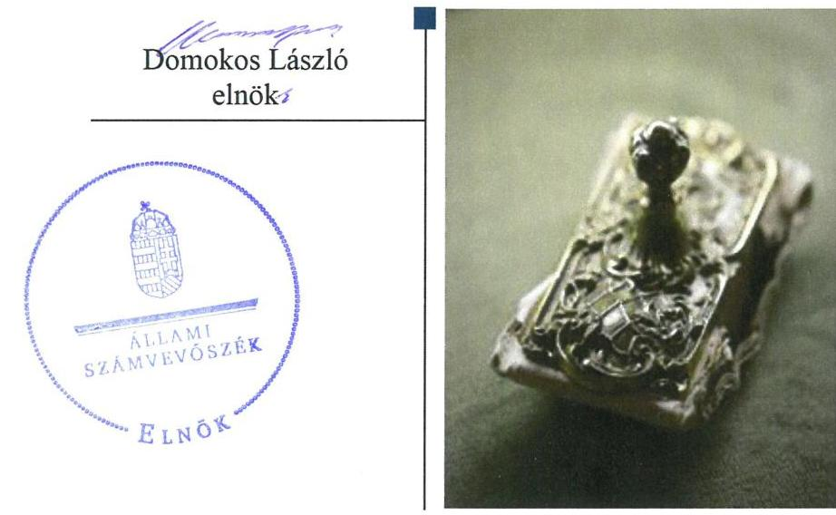
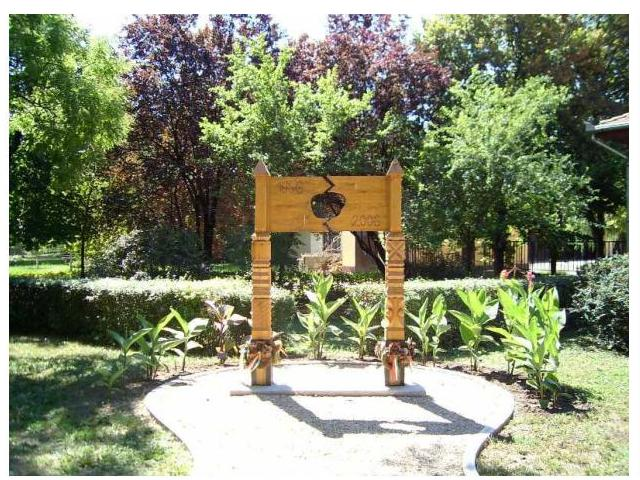
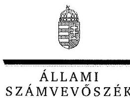
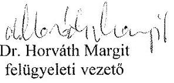

# Jelentés 

## Az önkormányzatok gazdasági társaságai

Az önkormányzatok többségi tulajdonában lévő gazdasági társaságok gazdálkodásának ellenőrzése - Csabacsűdi Szolgáltató Nonprofit Kft.
2018. június 12. nap

---

# AZ ELLENŐRZÉST FELÜGYELTE:

DR. HORVÁTH MARGIT felügyeleti vezető

## AZ ELLENŐRZÉST VEZETTE ÉS A VÉGREHAJTÁSÁÉRT FELELŐS:

- ÁRPÁSI TIBOR ellenőrzésvezető
- A PROGRAM ÖSSZEÁLLÍTÁSÁÉRT FELELŐS:
  - TÓTPÁL SZABOLCS osztályvezető

IKTATÓSZÁM: EL-0200-081/2018.

TÉMASZÁM: 2447

ELLENŐRZÉS-AZONOSÍTÓ SZÁM: V079367

Jelentéseink az Országgyűlés számítógépes hálózatán és az Interneten a www.asz.hu címen is olvashatóak.

---

# TARTALOMJEGYZÉK 

■ ÖSSZEGZÉS ..... 5
■ AZ ELLENŐRZÉS CÉLJA ..... 6
■ AZ ELLENŐRZÉS TERÜLETE ..... 7
■ AZ ELLENŐRZÉS HÁTTERE, INDOKOLTSÁGA ..... 9
■ A JELENTÉS LÉNYEGES KÉRDÉSKÖREI ..... 10
■ AZ ELLENŐRZÉS HATÓKÖRE ÉS MÓDSZEREI ..... 11
■ MEGÁLLAPÍTÁSOK ..... 13
■ JAVASLATOK ..... 17
■ MELLÉKLETEK ..... 19
I. sz. melléklet: Értelmező szótár ..... 19
II. sz. melléklet: A Társaság 2013-2016. évi mérleg adatai ..... 20
■ FÜGGELÉK: ÉSZREVÉTELEK ..... 21
■ RÖVIDÍTÉSEK JEGYZÉKE ..... 27

---

.

---

# ÖSSZEGZÉS 

Csabacsűd Nagyközség Önkormányzata a tulajdonosi joggyakorlás kereteit nem megfelelően alakította ki, tulajdonosi jogait nem gyakorolta szabályszerűen. A Társaság működésének szabályozottsága, gazdálkodása, vagyongazdálkodása a jogszabályi előírásoknak nem felelt meg. A jogszabályokban előírt közzétételi kötelezettségének nem tett eleget, ezzel nem biztosította működésének átláthatóságát.

## Az ellenőrzés társadalmi indokoltsága

Az Állami Számvevőszék kiemelt célja, hogy a helyi önkormányzatok gazdálkodásában rejlő pénzügyi kockázatok feltárásával, az államháztartáson kívülre nyújtott költségvetési támogatások és ingyenes vagyonjuttatások, valamint az államháztartáson kívül működő feladatellátó rendszerek ellenőrzéseivel hozzájáruljon ahhoz, hogy a közpénzeket az államháztartáson kívül működő szervezetek is átlátható, rendezett módon használják fel.

Magyarországon az önkormányzatok kötelező és önként vállalt feladataik vonatkozásában is egyre szélesebb körben alkalmazzák a költségvetésen kívüli feladatellátást, ezáltal - a nonprofit szervezetek mellett - az önkormányzati tulajdonú gazdasági társaságok is kiemelt fontosságú szerephez jutottak. Az Állami Számvevőszék céljaival és a társadalmi igénnyel összhangban, valamint a gazdasági társaságok kiemelt fontosságú szerepe miatt került sor a Csabacsűdi Szolgáltató Nonprofit Kft. ellenőrzésére. Az Állami Számvevőszék az ellenőrzése során arra kereste a választ, hogy 2013-2016. között szabályszerű volt-e az alapvetően közfeladatot ellátó Társaság gazdálkodása és a többségi tulajdonos önkormányzat ehhez kapcsolódó tulajdonosi joggyakorlása.

## Főbb megállapítások, következtetések, javaslatok

Az Önkormányzat a Társaság feletti tulajdonosi joggyakorlásának kereteit nem szabályszerűen alakította ki, mivel üzletrészének nyilvántartásáról nem gondoskodott, mert a Társaság javadalmazási szabályzatát nem alkotta meg, a felügyelőbizottság ügyrenddel nem rendelkezett. Tulajdonosi jogait nem gyakorolta szabályszerűen, nem intézkedett a Társaság működéséhez szükséges saját tőke biztosítása érdekében.

A Társaság működésének szabályozottsága nem felelt meg a jogszabályi előírásoknak, mivel az előírt számviteli szabályzatokat 2013-2015 között a számviteli politika és a pénzkezelési szabályzat kivételével nem készítette el. Az egyszerűsített éves beszámoló adatait nem támasztotta alá leltárral. A Társaság a saját vagyon visszapótlásáról gondoskodott.

Az egyszerűsített éves beszámolókat a Társaság a jogszabályban előírt határidőre elkészítette, letétbe helyezte és közzétette. A Társaság a jogszabályban rögzített közérdekű adatok közzétételére vonatkozó elektronikus közzétételi kötelezettségét nem teljesítette.

A Társaság bevételeinek, ráfordításainak, beruházásainak elszámolása nem volt szabályszerű, az értékcsökkenés elszámolása szabályszerű volt.

---

# AZ ELLENŐRZÉS CÉLJA 

Az ellenőrzés célja annak értékelése volt, hogy az önkormányzat vagyongazdálkodási tevékenysége során szabályszerűen gyakorolta-e tulajdonosi jogait; a gazdasági társaság szabályozottsága, gazdálkodása és vagyongazdálkodási tevékenysége, bevételeinek és ráfordításainak elszámolása megfelelt-e a jogszabályi és tulajdonosi előírásoknak; a gazdasági társaság kötelezettségállománya jelent-e kockázatot a működésre, valamint a gazdálkodás átláthatósága és elszámoltathatósága érdekében biztosítva volt-e a szolgáltatás díjának megalapozottsága szabályszerű önköltségszámítással.

---

# Az ELLENŐRZÉS TERÜLETE 

## Csabacsűd Nagyközség Önkormányzata és a többségi tulajdonában lévő Csabacsűdi Szolgáltató Nonprofit Kft.

A Csabacsűdi Szolgáltató Nonprofit Kft.-t 2013. március 12-én alapította 0,5 M Ft pénzbeli hozzájárulás törzstőkével kizárólagos tulajdonosa, Csabacsűd Nagyközség Önkormányzata. Az Önkormányzat Képviselő-testületének határozata alapján a Társaság 2014. február 27-én nonprofit gazdasági társasággá alakult. A Társaságban 2015. május 22-én 20%-os üzletrészt vásárolt Békésszentandrás Nagyközség Önkormányzata. A Társaság főtevékenysége a két településen a nem veszélyes hulladék gyűjtése volt.

Az alapító Önkormányzat polgármestere, jegyzője, a Társaságot irányító ügyvezető személye az ellenőrzött időszakban nem változott. A Társaságnál három tagú felügyelőbizottság működött. A Társaság könyvvizsgálatra nem volt kötelezett, azonban az Önkormányzat 2013-tól a könyvvizsgálót kijelölte.

A tulajdonosi jogokat 2015. május 22-ig alapítóként az Önkormányzat Képviselő-testülete gyakorolta, az üzletrész értékesítését követően a legfőbb szerv szerepét a taggyűlés töltötte be.

A Társaság közfeladata volt: víziközmű-szolgáltatás (nem közművel összegyűjtött háztartási szennyvíz begyűjtése) és hulladékgazdálkodás (átvétel, szállítás, kezelés), továbbá településüzemeltetési feladatként közterülettel összefüggő kertészeti munkák elvégzése, köztisztaság biztosítása, közutak, járdák, hidak, közintézményi épületek üzemeltetése, hóeltakarítás, síkosság mentesítés és önkormányzati épületek fűtési feladatai, köztemetővel összefüggő munkák elvégzése. A Társaság a közfeladatait az Önkormányzattal kötött közszolgáltatási szerződések, illetve feladat-ellátási és támogatási megállapodások alapján végezte.

A Társaság 2013. május 24-től rendelkezett a nem közművel összegyűjtött háztartási szennyvíz begyűjtésére és szállítására vonatkozó közszolgáltatási tevékenység végzésére vonatkozó engedéllyel, illetve 2013. június 14-től nem veszélyes hulladék szállítására vonatkozó engedéllyel.

Az Önkormányzat a Társaság részére közfeladatainak ellátásához a 2013-2016. években összesen 28,1 M Ft támogatást nyújtott. A közfoglalkoztatottak támogatására 9,7 M Ft-ot kapott. Hátrányos helyzetűek foglalkoztathatóságának javítása résztvevőjeként 0,4 M Ft, munkatapasztalat szerzése céljából 0,7 M Ft támogatást nyert el.

A Társaság árbevétele 2013. évről a 2016. évre 39,1 M Ft-tal, mérlegfőösszege tizenhatszorosára nőtt. A kötelezettségállomány közel hatszorosára, a követelésállomány a háromszorosára emelkedett az ellenőrzött időszakban. A mérleg szerinti eredmény 6,6 M Ft-tal, a saját tőke összege 5,4 M Ft-ra nőtt, jegyzett tőkéje nem változott.

---

A Társaság gazdálkodásának főbb adatait a következő táblázat tartalmazza:

1. táblázat

| A TÁRSASÁG FŐBB GAZDÁLKODÁSI ADATAI 2013-2016 (M FT) |  |  |  |  |
| :--: | :--: | :--: | :--: | :--: |
|  | 2013 | 2014 | 2015 | 2016 |
| Éves nettó árbevétel | 5,9 | 15,6 | 27,2 | 45,0 |
| Mérlegfőösszeg | 1,1 | 3,0 | 10,8 | 17,7 |
| Mérleg szerinti eredmény | $-1,5$ | $-0,4$ | 1,9 | 4,8 |
| Saját tőke összege | $-1,0$ | $-1,4$ | 0,5 | 5,4 |
| Követelések | 0 | 0,5 | 6,4 | 3,0 |
| Kötelezettségek | 1,9 | 4,0 | 7,9 | 11,0 |
| Foglalkoztatottak száma (fő) | 5 | 5 | 10 | 11 |

Az ellenőrzött időszakban a Társaság tulajdonosi részesedéssel más gazdasági társaságban nem rendelkezett. A saját és közfeladatainak eredményes ellátása érdekében az Önkormányzat parkfenntartási munkák elvégzésére alkalmas, nulla értéken nyilvántartott hét db tárgyi eszközt adott át ingyenesen használatra, a Társaságnak vagyonkezelt eszközei nem voltak. A Társaság nem tartozott kormányzati szektorba sorolt egyéb szervezetek közé.

A Társaság nem volt kötelezett önköltségszámítás rendjére vonatkozó belső szabályzat készítésére. A hulladékgazdálkodási díjak megállapítása a Ht. 46-48. §, valamint a 91. § (1)-(3) bekezdéseiben előírtaknak megfelelően történt, a Társaság számlázása során figyelembe vette a rezsicsökkentésre vonatkozó előírásokat.

---

# AZ ELLENŐRZÉS HÁTTERE, INDOKOLTSÁGA 

Az önkormányzatok többségi tulajdonában álló gazdasági társaságok ellenőrzése kiemelten fontos a vagyon megőrzése, megóvása érdekében, valamint a kormányzati szektor elszámolásaiban megjelenő önkormányzati tulajdonú gazdálkodó szervezetek esetében, amelyekkel szemben alapvető követelmény, hogy gazdálkodásuk, működésük szabályszerű, az általuk szolgáltatott adatok minél megbízhatóbbak legyenek. A feladatellátás költségeinek, ráfordításainak alakulása a lakosság széles rétegét érinti.

Ellenőrzéseink feltárhatják, hogy az önkormányzat a feladatellátásához rendelt vagyon működtetését a tulajdonostól elvárható gondossággal végezte-e, a feladatot ellátó gazdasági társaság a létesítő okiratban, szolgáltatási szerződésben foglaltak betartásával biztosította-e a feladat ellátását. Az ellenőrzés eredményeképp meghatározhatóvá válnak a költségvetési hiányt befolyásoló szervezetek kockázatai, lehetővé válik ezen kockázatok csökkentése. Az ellenőrzés rávilágíthat arra, hogy a hogy a gazdasági társaság a vagyon használatával biztosította-e a szolgáltatás folytatásának feltételeit, az önkormányzat tulajdonosi felügyelete hozzájárult-e a szabályszerű gazdálkodáshoz és feladatellátáshoz. A megállapítások alapján megfogalmazott számvevőszéki javaslatok hasznosítása elősegítheti a meglévő hibák megszüntetését. A jó gyakorlatok bemutatásával az ÁSZ hozzájárulhat a követendő megoldások megismertetéséhez, terjesztéséhez.

---

# A JELENTÉS LÉNYEGES KÉRDÉSKÖREI 

1.- Az Önkormányzat tulajdonosi joggyakorlása szabályszerű volt-e?
2.- A Társaság szabályozottsága, gazdálkodási tevékenysége, bevételeinek és ráfordításainak elszámolása szabályszerű volt-e?
3.- A Társaság vagyongazdálkodási tevékenysége szabályszerű volt-e?

---

# AZ ELLENŐRZÉS HATÓKÖRE ÉS MÓDSZEREI 

## Az ellenőrzés típusa

Megfelelőségi ellenőrzés.

## Az ellenőrzött időszak

2013. március 12-étől 2016. december 31-ig tartó időszak.

## Az ellenőrzés tárgya

Csabacsűd Nagyközség Önkormányzata tulajdonosi joggyakorlása, valamint a Csabacsűdi Szolgáltató Nonprofit Kft. gazdálkodásának szabályozottsága és szabályszerűsége.

Az ellenőrzés kiterjedt minden olyan körülményre és adatra, amely az ÁSZ jogszabályban meghatározott feladatainak teljesítéséhez, valamint a program végrehajtása folyamán felmerült újabb összefüggések feltárásához szükséges volt.

## Az ellenőrzött szervezet

- Csabacsűd Nagyközség Önkormányzata
- Csabacsűdi Szolgáltató Nonprofit Kft.

## Az ellenőrzés jogalapja

Az ellenőrzés jogszabályi alapját az ÁSZ tv. 1. § (3) bekezdése és 5. § (3)-5) bekezdései képezték.

## Az ellenőrzés módszerei

Az ellenőrzést a nemzetközi standardokat irányadónak tekintve az ellenőrzési program ellenőrzési kérdései, az ellenőrzött időszakban hatályos jogszabályok, az ellenőrzés szakmai szabályok és módszertanok figyelembe vételével végeztük.

Az ellenőrzés ideje alatt az ellenőrzött szervezettel történő kapcsolattartást az ÁSZ Szervezeti és Működési Szabályzatának vonatkozó előírásai alapján biztosítottuk.

---

Az ellenőrzési kérdések megválaszolásához szükséges bizonyítékok megszerzése a következő ellenőrzési eljárások alkalmazásával történt: megfigyelés, kérdésfeltevés (információkérés), összehasonlítás, valamint elemző eljárás. Az ellenőrzési bizonyítékként felhasználható adatforrások közé tartoztak egyrészt az ellenőrzési programban felsorolt adatforrások, másrészt adatforrás volt még minden - az ellenőrzés folyamán - feltárt, az ellenőrzés szempontjából információkat tartalmazó dokumentum.

Az ellenőrzést a kérdésekre adott válaszok kiértékelésével, valamint a megjelölt adatforrások, a csatolt tanúsítványok felhasználásával, továbbá az adott időszakban hatályos jogszabályok figyelembe vételével folytattuk le.

A gazdasági társaság bevételei és ráfordításai, ezeken belül az értékcsökkenés, valamint a vagyonnyilvántartás szabályszerűségének megítéléséhez a bevételeket és a ráfordításokat, a tárgyi eszközök állományváltozásait tartalmazó adott évi főkönyvi adatbázisát vettük alapul. A minta kiválasztása során véletlen mintavételt alkalmaztunk évenkénti, elemszámmal arányos rétegezéssel a teljes időszakra vonatkozóan. A minta alapján a sokaságban előforduló hibaarányt becsültük. „Megfelelőnek" értékeltünk egy ellenőrzött területet, amennyiben 95%-os bizonyossággal a teljes sokaságban a hibaarány legfeljebb 10%, „nem megfelelőnek", amennyiben 10%-nál magasabb arányt képviselt. A mintavételt megelőzően az anyagjellegű ráfordítások, az egyéb ráfordítások, a pénzügyi műveletek ráfordításai és a rendkívüli ráfordítások, valamint a tárgyi-eszköz növekedési tételei sokaságból évente sokaságonként kiemeltük a 3-3 legnagyobb összegű tételt annak biztosítására, hogy az ellenőrzés az egyszerű véletlen mintavétel mellett a legnagyobb értékű tételek ellenőrzésére biztosan kiterjedjen.

---

# 1. Az Önkormányzat tulajdonosi joggyakorlása szabályszerű volt-e? 

Összegző megállapítás

A tulajdonosi joggyakorlás kereteit az
 Önkormányzat nem szabályszerűen alakította ki, a joggyakorlás nem volt szabályszerű.

AZ ÖNKORMÁNYZAT a Mőtv. ${ }^{15}$-ben foglaltak szerint rendelkezett gazdasági programmal ${ }^{16}{ }_{1,2}$, mely célként fogalmazta meg, hogy a szilárdhulladék gyűjtése és szállítása, valamint a szennyvízszippantás alacsony összegű és megfizethető közszolgáltatás legyen a lakosság részére, s a szennyvízhálózat továbbfejlesztése mellett feladatul tűzte ki a szennyvízleürítő hely rekultivációját is.

Közép- és hosszú távú vagyongazdálkodási tervet az Önkormányzat nem készített, így nem felelt meg az Nvtv. ${ }^{17}$ 9. § (1) bekezdésben foglalt kötelezettségének.

A tulajdonosi joggyakorlás kereteit az Önkormányzat nem megfelelően alakította ki. Nem gondoskodott a Társaság működéséhez szükséges saját tőke biztosításáról. Az Nvtv. 5.§ (5) c) pontban foglaltak ellenére az Önkormányzat a vagyonrendeletében ${ }^{18}$ a Társaságban meglévő részesedését nem szerepeltette.

Az Önkormányzat a Társaság tekintetében kialakította a monitoring tevékenységét, a Társaság SZMSZ ${ }^{19}$-ében, illetve a feladatellátási ${ }_{1,2}$ és támogatási megállapodásban ${ }_{1,2}$ előírta az évközi beszámoló készítésének kötelezettségét.

A FELÜGYELŐBIZOTTSÁG tagjait a Társaság alapító okiratában ${ }^{20}$ meghatározta az Alapító - majd a társasági szerződésben ${ }^{21}$ a taggyűlés -, továbbá a Társaság SZMSZ-ében előírta a felügyelőbizottság tagjainak képviselettel összefüggő feladatait, beszámolási kötelezettségét.

A felügyelőbizottság a Gt. ${ }^{22}$ 34. § (4) bekezdése és a Ptk. ${ }^{23}$ 3:122. § (3) bekezdése előírásai ellenére az ellenőrzött időszakban nem rendelkezett ügyrenddel.

A javadalmazási, juttatási rendszerről szóló szabályzatot a Társaság legfőbb szerve ${ }^{24}$ a Taktv. ${ }^{25}$ 5. § (3) bekezdése előírásai ellenére nem alkotta meg.

A TULAJDONOSI JOGOK gyakorlása nem volt szabályszerű.
A TÁRSASÁG LEGFŐBB SZERVE az egyszerűsített éves beszámolókat a Gt. és a Ptk. előírásaival összhangban a felügyelőbizottság írásbeli jelentésének és a könyvvizsgáló jelentésének birtokában hagyta jóvá. Az üzleti tervekről, a vagyongazdálkodást érintő kérdésekről a jogszabályoknak és a belső előírásoknak megfelelően döntött az Önkormányzat Képviselő-testülete, illetve a taggyűlés.

A Társaság mérlegadatai alapján kétféle hiányosság is fennállt a 2013-2014. években. Egyrészt a saját tőke a törzstőke fele alá csökkent a 2013-2014. években, másrészt a saját tőke nem érte el az adott társasági formára kötelezően előírt jegyzett tőkét. A tulajdonos 2015-ig nem intézkedett a hiányosságok megszűntetése érdekében, ezzel megsértette a Ptk. 3:133. § (2) bekezdése, illetve a Ptk. 3:189. § (1) bekezdés a) pontja szerinti kötelezettségét. A 2015-2016. években a tulajdonos részéről már nem volt szükség tőkepótlási intézkedésre, mivel a Társaság nyereségesen működött.

A Társaság könyvvizsgálója a 2014. évi beszámolóról szóló jelentésében figyelemfelhívással élt és kérte az ügyvezető haladéktalan intézkedését a jegyzett tőke rendezésére a Ptk. 3:189 § (1) bekezdés a) pontjára hivatkozva. A 2013. évi beszámolóról szóló könyvvizsgálói jelentésben figyelemfelhívás nem volt.

Az Önkormányzat az Áht. ${ }^{26}$-ban foglalt lehetőséggel élve 2015-ben tulajdonosi ellenőrzés keretében ellenőrizte a Társaság gazdálkodásának szabályszerűségét.

# 2. A Társaság szabályozottsága, gazdálkodási tevékenysége, bevételeinek és ráfordításainak elszámolása szabályszerű volt-e? 

## Összegző megállapítás

A Társaság gazdálkodásának szabályozottsága, gazdálkodása nem felelt meg a jogszabályi előírásoknak. Egyszerűsített éves beszámolóit leltárral nem támasztotta alá. A Társaság bevételeinek és ráfordításainak elszámolása nem volt szabályszerű.

SZÁMVITELI POLITIKÁVAL ${ }^{27}$ és pénzkezelési szabályzattal ${ }^{28}$ a Számv. tv. ${ }^{29}$-ben előírtak szerint rendelkezett a Társaság, azok jogszabályi előírásoknak megfelelő aktualizálására sor került.

A SZÁMVITELI POLITIKA KERETÉBEN elkészítendő szabályzatok közül a Társaság a Számv. tv. 14. § (5) bekezdés a) és b) pontjaiban foglaltak ellenére alapításkor nem készítette el az eszközök és források leltárkészítési és leltározási, valamint értékelési szabályzatát. 2016. március 31-étől rendelkezett a jogszabályi előírásoknak megfelelő leltározási ${ }^{30}$ és értékelési szabályzattal ${ }^{31}$.

SZÁMLARENDDEL ${ }^{32}$ a Számv. tv. 161. § (1) és (5) bekezdés előírásai ellenére a Társaság 2016. március 31-ig nem rendelkezett. A Társaság az ellenőrzött időszakban a Számv. tv. 161/A. § (2) bekezdésében foglaltak ellenére belső szabályzataiban nem határozta meg a Ht. ${ }^{33}$ 50. § (2) -(3) bekezdéseiben előírtak végrehajtása érdekében a hulladékgazdálkodási és az egyéb tevékenységei elkülönítésének szabályait.

EGYSZERŰSÍTETT ÉVES BESZÁMOLÓI mérlegtételeit a Számv. tv. 69. § (1) bekezdésében foglaltak ellenére nem támasztotta alá leltárral. Ennek ellenére a könyvvizsgáló az egyszerűsített éves beszámolókat korlátozás nélküli hitelesített záradékkal látta el.

BESZÁMOLÁSI KÖTELEZETTSÉGÉNEK a Társaság a Számv. tv. szerinti egyszerűsített éves beszámolók készítésével, letétbe helyezésével és közzétételével eleget tett.

A Társaság a hulladékgazdálkodási közszolgáltatás nyújtása érdekében végzett tevékenységét a Ht. 50. § (3) bekezdésében foglaltaknak megfelelően a 2015-2016. évi egyszerűsített éves beszámoló kiegészítő mellékletében önálló mérleg és eredménykimutatás elkészítésével bemutatta.

A Társaság SZMSZ-ének 5.1.6 pontja szerint az ügyvezető eleget tett az üzleti terv készítési és rendszeres beszámolási kötelezettségének.

Az Ügyvezető a 2013-2014. évek saját tőke csökkenése miatt nem kezdeményezte taggyűlés összehívását, ezzel megsértette a Ptk. 3:133. § (2) bekezdésében foglalt kötelezettségét.

A KÖZÉRDEKŰ ADATOK megismerésére irányuló igények teljesítésének rendjét rögzítő szabályzatot a Társaság az Info tv. ${ }^{34} 30 . \S$ (6) bekezdése előírásai ellenére az ellenőrzött időszakban nem készített.

A Társaság az Info tv. 37. § (1) bekezdésében foglalt, az 1. mellékletben meghatározott tartalmú közérdekű adatok közzétételével kapcsolatos kötelezettségének honlapján ${ }^{35}$ nem tett eleget, nem tette közzé
$\longrightarrow$ a szervezeti felépítésére, a szervezeti egységek feladatára, a vezetésre és a felettes szervre vonatkozó adatokat (I. 2., I. 3., I. 11. pontok),
$\longrightarrow$ a közérdekű adatok megismerésére irányuló igények intézésének rendjét (II. 1., II. 13. pontok),
$\longrightarrow$ egyszerűsített éves beszámolóit (III. 2. pont).
A BEVÉTELEK ÉS A RÁFORDÍTÁSOK elszámolása - az értékcsökkenés kivételével - nem volt szabályszerű. A 2013-2015. években számlarenddel a Társaság nem rendelkezett, ezáltal nem volt biztosított a szabályos elszámolások alapja, többek között az elszámolás során az érintett főkönyvi számlákra történő hivatkozás, megsértve a Számv. tv. 167. § (1) bekezdés h) pontjában foglaltakat.

A HATÁRIDŐN TÚLI KÖVETELÉSÁLLOMÁNY a 2014. évi 0,5 M Ft-ról a 2016. évre 2,8 M Ft-ra emelkedett. A Társaság a lejárt követelések behajtása érdekében az ellenőrzött időszakban fizetési felszólításokat küldött ki. A díjhátralék adók módjára történő behajtását a NAVnál nem kezdeményezte, helyette 2016. évtől külső behajtó céget alkalmazott, megsértve a Ht. 52. § (3) bekezdésében foglalt előírásokat.

A RÖVID LEJÁRATÚ KÖTELEZETTSÉGEK állománya az ellenőrzött időszak végére a 2013. évhez viszonyítva 9,1 M Ft-al, 586,6%-kal, 11,0 M Ft-ra növekedett. 2016. év végén nem volt határidőn túli rövid lejáratú kötelezettség. A rövid lejáratú kötelezettségek állományából 2016-ra 6,3 M Ft a Békésszentandrás Önkormányzatával szembeni tagi kölcsön visszafizetési kötelezettség volt. A Társaságnak hosszú lejáratú kötelezettségei nem voltak.

A Társaság könyvvizsgálója a 2014. évi beszámolóról szóló jelentésében figyelemfelhívással jelezte a veszteséges gazdálkodás miatt a Társaság vagyonát meghaladó rövid lejáratú kötelezettségállomány okozta kockázatot, amely veszélyeztette a vállalkozás folytatása elvének érvényesülését.

A FOLYÉKONY HULLADÉK szállításának és ártalmatlanításának igénybevételéről és az igénybevételért fizetendő díjról szóló 12/2010.(VII.21.) önkormányzati rendeletben ${ }^{36}$ meghatározott díjakat alkalmazta a Társaság számlázása során.

# 3. A Társaság vagyongazdálkodási tevékenysége szabályszerű volt-e? 

Összegző megállapítás A Társaság vagyongazdálkodása nem volt szabályszerű.
A TÁRSASÁG vagyongazdálkodása a számviteli szabályzatok és a vagyonnyilvántartás hiányosságai miatt nem volt szabályszerű. A Társaság az ellenőrzött időszak alatt saját vagyonnal rendelkezett, eszközei között vagyonkezelésbe vett eszközök nem voltak. A Társaság nem tartotta be a Számv. tv. 69. § (1) - (4) bekezdéseiben foglaltakat, mert leltárral nem támasztotta alá az egyszerűsített éves beszámolói mérlegsorait.

AZ ÉRTÉKCSÖKKENÉS elszámolásánál a Számv. tv. 26. § (1) és 52. § (2) bekezdés előírásai ellenére a tárgyi eszközök esetében az üzembe helyezést, hitelt érdemlő módon nem dokumentálták.

# JAVASLATOK 

Az ÁSZ tv. 33. § (1) bekezdésében foglaltak értelmében az ellenőrzött szervezet vezetője köteles a jelentésben foglalt megállapításokhoz kapcsolódó intézkedési tervet összeállítani és azt a jelentés kézhezvételétől számított 30 napon belül az ÁSZ részére megküldeni. Amennyiben az ellenőrzött szervezet vezetője nem küldi meg határidőben az intézkedési tervet, vagy továbbra sem elfogadható intézkedési tervet küld, az Állami Számvevőszék elnöke az ÁSZ tv. 33. § (3) bekezdés a) és b) pontjaiban foglaltakat érvényesítheti.
Javaslataink célja a Csabacsúdi Szolgáltató Nonprofit Kft. gazdálkodása szabályszerűségének és gyakorlatának javítása annak érdekében, hogy a szabályozási környezet és az alkalmazott gyakorlat megfelelően tudja támogatni az átlátható működést.

## Csabacsúdi Szolgáltató Nonprofit Kft. ügyvezetőjének

1. Intézkedjen a belső szabályozás kiegészítéséről, ennek során az egyes tevékenységei elkülönült nyilvántartása vezetésének szabályai meghatározásáról a Ht.-ben foglaltaknak megfelelően.
(2. sz. megállapítás 3. bekezdése alapján)
2. Intézkedjen az egyszerűsített éves beszámoló mérlegtételeinek leltárral történő alátámasztásáról a Számv. tv.-ben előírtaknak megfelelően.
(2. sz. megállapítás 4. bekezdés 1. mondata alapján)
3. Intézkedjen a közérdekű adatok megismerésére irányuló igények teljesítésének rendjét rögzítő szabályzat készítéséről az Info tv. előírásainak megfelelően.
(2. sz. megállapítás 9. bekezdése alapján)
4. Intézkedjen a közzétételi kötelezettségének teljes körű teljesítéséről az Info tv. előírásainak megfelelően.
(2. sz. megállapítás 10. bekezdése alapján)

# Javaslataink célja az Önkormányzat szabályszerű működésének elősegítése, továbbá az önkormányzati tulajdonosi joggyakorlás kontrolljainak erősítése. 

## Csabacsúd Nagyközség Önkormányzata polgármesterének

1. Intézkedjen az Önkormányzat közép- és hosszú távú vagyongazdálkodási tervének elkészítéséről az Nvtv. előírásainak megfelelően.
(1. sz. megállapítás 2. bekezdése alapján)
2. Intézkedjen az Önkormányzat vagyonrendeletének kiegészítéséről az Nvtv. előírásainak megfelelően.
(1. sz. megállapítás 3. bekezdés 3. mondata alapján)
3. Kezdeményezze a Társaság felügyelőbizottságának elnökénél a Ptk. előírásainak megfelelően ügyrend elkészítését, majd jóváhagyás érdekében terjessze elő a taggyűlés számára.
(1. sz. megállapítás 6. bekezdése alapján)
4. Kezdeményezze a legfőbb szervnél (taggyűlés) a Társaság vezető tisztségviselői, a felügyelő bizottsági tagok, az Mt. 208. §-ának hatálya alá eső munkavállalók javadalmazása, valamint a jogviszony megszünése esetére biztosított juttatások módjának, mértékének elveire, annak rendszerére vonatkozó szabályzat megalkotását a Taktv.-ben előírtaknak megfelelően.
(1. sz. megállapítás 7. bekezdése alapján)

# MELLÉKLETEK 

- I. SZ. MELLÉKLET: ÉRTELMEZŐ SZÓTÁR
gazdasági társaság
kezesség
közszolgáltatás
nemzeti vagyon
nonprofit gazdasági társaság

Ptk. 3.88. § (1) bekezdése szerint „a gazdasági társaságok üzletszerű közös gazdasági tevékenység folytatására, a tagok vagyoni hozzájárulásával létrehozott, jogi személyiséggel rendelkező vállalkozások, amelyekben a tagok a nyereségből közösen részesednek, és a veszteséget közösen viselik".
A kezességre vonatkozó előírásokat a Ptk. 6:416-430. §-ai tartalmazzák. Kezességi szerződéssel a kezes kötelezettséget vállal a jogosulttal szemben, hogyha a kötelezett nem teljesít, maga fog helyette a jogosultnak teljesíteni. Kezesség egy vagy több, fennálló vagy jövőbeli, feltétlen vagy feltételes, meghatározott vagy meghatározható összegű pénzkövetelés vagy pénzben kifejezhető értékkel rendelkező egyéb kötelezettség biztosítására vállalható.
A Ptk. szerint kezességet csak írásban lehet vállalni. A kezes kötelezettsége ahhoz a kötelezettséghez igazodik, amelyért kezességet vállalt. A kezes kötelezettsége nem válhat terhesebbé, mint amilyen elvállalásakor volt, kiterjed azonban a kötelezett szerződésszegésének jogkövetkezményeire és a kezesség elvállalása után esedékessé váló mellékkövetelésekre is.
Az Ebktv. ${ }^{37}$ 3. § d) pontja a következőképpen határozza meg a közszolgáltatást: „szerződéskötési kötelezettség alapján a lakosság alapvető szükségleteinek ellátására irányuló szolgáltatás, így különösen a villamos energia-, gáz-,
 hő-, víz-, szennyvíz- és hulladékkezelési, köztisztasági, postai és távközlési szolgáltatás, továbbá a menetrend alapján közlekedő járművekkel végzett közforgalmú személyszállítás". Nvtv. 1. § (2) bekezdése szerint többek között:
„az állam vagy a helyi önkormányzat kizárólagos tulajdonában álló dolgok, az a) pont hatálya alá nem tartozó, állam vagy a helyi önkormányzat tulajdonában lévő dolog,
az állam vagy a helyi önkormányzat tulajdonában lévő pénzügyi eszközök, továbbá az államot vagy a helyi önkormányzatot megillető társasági részesedések, az államot vagy a helyi önkormányzatot megillető bármely vagyoni értékkel rendelkező jogosultság, amelyet jogszabály vagyoni értékű jogként nevesít."
Civil tv. 9/F. § (2) bekezdése szerint „az a gazdasági társaság minősül nonprofit gazdasági társaságnak és cégnevében az a gazdasági társaság tüntetheti fel a nonprofit jelleget, amelynek létesítő okirata tartalmazza, hogy a gazdasági társaság tevékenységéből származó nyereség a tagok között nem osztható fel, hanem az a gazdasági társaság vagyonát gyarapítja." (hatályos 2014. március 15-től)

---

II. SZ. MELLÉKLET: A TÁRSASÁG 2013-2016. ÉVI MÉRLEG ADATAI

|  A CSABACSÜDI SZOLGÁLTATÓ NONPROFIT KFT. 2013-2016. ÉVI MÉRLEG ADATAI (E Ft) |  |  |  |  |   |
| --- | --- | --- | --- | --- | --- |
|  Megnevezés | 2013. XII. 31.   E Ft | 2014. XII. 31.   E Ft | 2015. XII. 31.   E Ft | 2016. XII. 31.   E Ft | 2016./2013.   (változás\%)  |
|  A. Befektetett eszközök | 42,0 | 52,0 | 642,0 | 568,0 | 1352,4  |
|  I. IMMATERIÁLIS JAVAK | 42,0 | 32,0 | 21,0 | 12,0 | -71,4  |
|  II. TÁRGYI ESZKÖZÖK | 0,0 | 0,0 | 601,0 | 536,0 | 0,0  |
|  III. BEFEKTETETT PÉNZÜGYI ESZKÖZÖK | 0,0 | 20,0 | 20,0 | 20,0 | 0,0  |
|  B. Forgóeszközök | 1041,0 | 2260,0 | 8808,0 | 9545,0 | 916,9  |
|  I. KÉSZLETEK | 11,0 | 0,0 | 0,0 | 100,0 | 909,1  |
|  II. KÖVETELÉSEK | 0 | 526,0 | 6421,0 | 3021,0 | 0,0  |
|  III. ÉRTÉKPAPÍROK | 0,0 | 0,0 | 0,0 | 0,0 | 0,0  |
|  IV. PÉNZESZKÖZÖK | 1030,0 | 1734,0 | 2387,0 | 6424,0 | 623,7  |
|  C. Aktív időbeli elhatárolások | 0,0 | 686,0 | 831,0 | 7591,0 | 0,0  |
|  ESZKÖZÖK ÖSSZESEN | 1083,0 | 2998,0 | 10281,0 | 17704,0 | 1634,7  |
|  D. Saját tőke | -1022,0 | -354,0 | 534,0 | 5369,0 | 0,0  |
|  I. JEGYZETT TÖKE | 500,0 | 500,0 | 500,0 | 500,0 | 0,0  |
|  II. JEGYZETT, DE MÉG BE NEM FIZETETT TÖKE (-) | 0,0 | 0,0 | 0,0 | 0,0 | 0,0  |
|  III. TÖKETARTALÉK | 0,0 | 0,0 | 0,0 | 0,0 | 0,0  |
|  IV. EREDMÉNYTARTALÉK | 0,0 | -1522,0 | -1876,0 | -2465,0 | 0,0  |
|  V. LEKÖTÖTT TARTALÉK | 0,0 | 0,0 | 0,0 | 2499,0 | 0,0  |
|  VI. ÉRTÉKELÉSI TARTALÉK | 0,0 | 0,0 | 0,0 | 0,0 | 0,0  |
|  VII. MÉRLEG SZERINTI EREDMÉNY | -1522,0 | -354,0 | 1910,0 | 4835,0 | 0,0  |
|  E. Céltartalékok | 0,0 | 0,0 | 0,0 | 0,0 | 0,0  |
|  F. Kötelezettségek | 1875,0 | 4028,0 | 7944,0 | 10998,0 | -586,6  |
|  I. HÁTRASOROLT KÖTELEZETTSÉGEK | 0,0 | 0,0 | 0,0 | 0,0 | 0,0  |
|  II. HOSSZÚ LEJÁRATÚ KÖTELEZETTSÉGEK | 0,0 | 0,0 | 0,0 | 0,0 | 0,0  |
|  III. RÖVID LEJÁRATÚ KÖTELEZETTSÉGEK | 0,0 | 0,0 | 7944,0 | 10998,0 | 0,0  |
|  G. Passzív időbeli elhatárolások | 230,0 | 346,0 | 1803,0 | 1337,0 | 581,3  |
|  FORRÁSOK ÖSSZESEN | 1083,0 | 2998,0 | 10281,0 | 17704,0 | 1634,7  |

---

# FÜGGELÉK: ÉSZREVÉTELEK 

A jelentéstervezetet a Számvevőszék 15 napos észrevételezésre megküldte az ellenőrzött szervezetek vezetőinek az ÁSZ tv. 29. § (1) bekezdése előírásának megfelelően.

A Csabacsüdi Szolgáltató Nonprofit Kft. ügyvezetője észrevételeit és azok kezeléséről szóló válaszlevelet a jelentés függeléke tartalmazza. Csabacsüd Nagyközség Önkormányzatának polgármestere a jelentéstervezettel kapcsolatban nem tett észrevételt.

[^0]
[^0]:    * 29. § (1) Az Állami Számvevőszék az ellenőrzési megállapításait megküldi az ellenőrzött szervezet vezetőjének vagy az általa megbízott személynek, és annak, akinek személyes felelősségét állapította meg.
    (2) Az ellenőrzött szervezet vezetője és a felelősként megjelölt személy az ellenőrzés megállapításaira tizenöt napon belül írásban észrevételt tehet.
    (3) Az Állami Számvevőszék az észrevételre a beérkezésétől számított harminc napon belül írásban válaszol. A figyelembe nem vett észrevételeket köteles a jelentésben feltüntetni, és megindokolni, hogy azokat miért nem fogadta el.

---

Csabacsúdi Szolgáltató Nonprofit Kft. 5551-Csabacsúd, Szabadság u. 41. Adószám: 24283852-2-04 Bank: 53900038-15053011 Telefon: 30/839-1592

Állami Számvevőszék Domokos László Elnök Úr 1052 Budapest, Apáczai Csere János utca 10.

Tárgy:
EL-0200-072/2018. iktatószámú levél, a Csabacsúdi Szolgáltató Nonprofit Kft ellenőrzéséről készült jelentés tervezet egyik pontjának észrevételezése.

# Tisztelt Elnök Úr! 

Köszönettel megkaptam a Csabacsúdi Szolgáltató Nonprofit Kft ellenőrzéséről készült számvevőszéki jelentéstervezetet.

Az abban foglaltakat áttanulmányozás után megismertem és ez alapján Tisztelettel az egyik pontjára az alábbi észrevételt teszem:

A jelentéstervezet összegző megállapítás fejezete a Társaságunk vagyongazdálkodásával összefüggésben megállapítja, hogy nem volt szabályszerű és a jelentéstervezet szerint „A Társaság nem tartotta be a Számv. tv. 69.§ (1)-(4) bekezdéseiben foglaltakat, mert leltárral nem támasztotta alá az Egyszerűsített éves beszámolói mérlegsorait."

Sajnálattal tudomásul véve a leírtakat, sajnos az történt, hogy Társaságunk részéről hiányos, téves adatszolgáltatás történt az Állami Számvevőszék eljáró munkatársai felé a leltározással összefüggésben. Társaságunknál ugyan is a vizsgált időszakban elkészültek azok a leltározási dokumentumok, melyek a Számv.tv. 69. § (1)-(4) bekezdéseiben foglaltaknak megfelelően tételes leltárral támasztották alá az Egyszerűsített éves beszámolók mérlegsorait.

Részemről, tévedés folytán, az Állami Számvevőszék tárggyal összefüggő kérdéseire nem a megfelelő dokumentumokat adtam át.

Az Önök által

- az általunk tévesen, hiányosan beküldött anyagok alapján jogosan hiányolt leltárak a valóságban Társaságunk irattári dokumentumai között rendelkezésre állnak, melyeket tény, hogy a jelentéstervezetük alapján, alaposabb iratellenőrzés keretében találtuk meg.

Az Egyszerűsített éves beszámolók Testületi jóváhagyását megelőző könyvvizsgálói ellenőrzése keretében az adott években ezeket a leltárakat a könyvvizsgálat rendelkezésére bocsájtottuk és azok számviteli nyilvántartásunkkal történő egyezőségét a könyvvizsgálat ellenőrizte.

---

Csabacsúdi Szolgáltató Nonprofit Kft.
5551-Csabacsúd, Szabadság u. 41.
Adószám: 24283852-2-04
Bank: 53900038-15053011
Telefon: 30/839-1592

Csabacsúdi
Szolgáltató
Nonprofit
Kft.

# Tisztelt Elnök Úr! 

A fentiek alapján kérem, hogy a jelentéstervezetük ügyvezetőnek tett javaslatok 2. pontjában leírt megállapításukra vonatkozó észrevételeimet -elnézésüket kérve - szíveskedjenek elfogadni!

A jelentéstervezetben tett többi javaslataikat elfogadom.

Mellékletek: a korábbi hiányos adatszolgáltatás miatti leltárak másolatát teljeskörűen

Csabacsúd, 2018. május 30.

Tisztelettel:

CSABACSÚDI SZOLGÁLTATÓ
NONPROFIT KFT.
5551 Csabacsúd, Szabadság u. 41.
Adószám: 24283852-2-04
Baz.: 53900038-15053011
Csabacsúdi Szolgáltató Nonprofit Kft
Válkovszki Mihály
ügyvezető

---

ELNÖK

Ikt.szám: EL-0200-077/2018.

# Válkovszki Mihály úr 

ügyvezető

Csabacsúdi Szolgáltató Nonprofit Kft.

## Csabacsúd

## Tisztelt Ügyvezető Úr!

Köszönettel vettem „Az önkormányzatok gazdasági társaságai - Az önkormányzatok többségi tulajdonában lévő gazdasági társaságok gazdálkodásának ellenőrzése - Csabacsúdi Szolgáltató Nonprofit Kft." címmel készített számvevőszéki jelentéstervezetre megküldött észrevételét.
Az Állami Számvevőszék észrevételre vonatkozó álláspontját a felügyeleti vezető által készített részletes tájékoztatás tartalmazza, amelyet levelemhez mellékeltem.
Tájékoztatom Ügyvezető urat, hogy az Állami Számvevőszék a figyelembe nem vett észrevételeket az Állami Számvevőszékről szóló 2011. évi LXVI. törvény 29. § (3) bekezdésében előírtak szerint köteles a jelentésében feltüntetni és megindokolni, hogy azokat miért nem fogadta el.

Budapest, 2018. 06 hó / nap

Tisztelettel:

Dömokos László

Melléklet: Tájékoztatás az észrevételek kezeléséről

---

# Tájékoztatás az észrevételek kezeléséről 

Megköszönöm Ügyvezető úrnak „Az önkormányzatok gazdasági társaságai - Az önkormányzatok többségi tulajdonában lévő gazdasági társaságok gazdálkodásának ellenőrzése - Csabacsúdi Szolgáltató Nonprofit Kft." címmel készített jelentéstervezetre tett észrevételét. Az észrevétel kezeléséről az alábbi tájékoztatást adom.

Az észrevétel a jelentéstervezet ÖSSZEGZÉS rész 2. mondatát, a Főbb megállapítások, következtetések, javaslatok rész 2. bekezdés 2. mondatát, a 2. számú összegző megállapítás, a 2. bekezdés 4. bekezdés 1. mondatát, a 3. számú összegző megállapítást, a 3. számú megállapítás 1. bekezdésének 1. és 3. mondatát, valamint a Csabacsüdi Szolgáltató Nonprofit Korlátolt Felelősségű Társaság (Társaság) ügyvezetőjének címzett 2. számú javaslatot érinti:

## Észrevétel:

„A jelentéstervezet összegző megállapítás fejezete a Társaságunk vagyongazdálkodásával összefüggésben megállapítja, hogy nem volt szabályszerű és a jelentéstervezet szerint „A Társaság nem tartotta be a Számv. tv. 69.§ (1)-(4) bekezdéseiben foglaltakat, mert leltárral nem támasztotta alá az Egyszerűsített éves beszámoló mérlegsorait."
Sajnálattal tudomásul véve a leírtakat, sajnos az történt, hogy Társaságunk részéről hiányos, téves adatszolgáltatás történt az Állami Számvevőszék eljáró munkatársai felé a leltározással összefüggésben. Társaságunknál ugyan is a vizsgált időszakban elkészültek azok a leltározási dokumentumok, melyek a Számv. tv. 69. § (1)-(4) bekezdéseiben foglaltaknak megfelelően tételes leltárral támasztották alá az Egyszerűsített éves beszámolók mérlegsorait.
Részemről, tévedés folytán, az Állami Számvevőszék tárggyal összefüggő kérdéseire nem a megfelelő dokumentumokat adtam át.
Az Önök által

- az általunk tévesen, hiányosan beküldött anyagok alapján jogosan hiányolt leltárak a valóságban Társaságunk irattári dokumentumai között rendelkezésre állnak, melyeket tény, hogy a jelentéstervezetük alapján, alaposabb iratellenőrzés keretében találtuk meg.
Az Egyszerűsített éves beszámolók Testületi jóváhagyását megelőző könyvvizsgálói ellenőrzése keretében az adott években ezeket a leltárakat a könyvvizsgálat rendelkezésére bocsájtottuk és azok számviteli nyilvántartásunkkal történő egyezőségét a könyvvizsgálat ellenőrizte.
A fentiek alapján kérem, hogy a jelentéstervezetük ügyvezetőnek tett javaslatok 2. pontjában leírt megállapításukra vonatkozó észrevételeimet - elnézésüket kérve - szíveskedjenek elfogadni!
A jelentéstervezetben tett többi javaslataikat elfogadom.
Mellékletek: a korábbi hiányos adatszolgáltatás miatti leltárak másolatát teljes körűen"

---

Ügyvezető úr észrevételében leírtak alapján a jelentéstervezet ÖSSZEGZÉS rész 2. mondatát, a Főbb megállapítások, következtetések, javaslatok rész 2. bekezdés 2. mondatát, a 2. számú összegző megállapítás, a 2. bekezdés 4. bekezdés 1. mondatát, a 3. számú összegző megállapítást, a 3. számú megállapítás 1. bekezdésének 1. és 3. mondatát, valamint a Társaság ügyvezetőjének címzett 2. számú javaslatot nem módosítom az alábbiak miatt:

Az ÁSZ az ellenőrzést az EL-0047-001/2017. iktatószámú ellenőrzési program, az ellenőrzött időszakban hatályos jogszabályok, az ellenőrzés szakmai szabályok és módszertanok figyelembe vételével végezte. A Társaság az EL-0200-011/2017. iktatószámú, 2017. november 19-én kelt kiértesítő levélben kapott tájékoztatást arról, hogy az ellenőrzés a mellékelt ellenőrzési program alapján kerül lefolytatásra. Az ÁSZ EL-0200-001/2017. iktatószámú, 2017. augusztus 09-én kelt, és az EL-0200-003/2017. iktatószámú, 2017. szeptember 22-én kelt, és az EL-0200-016/2017. iktatószámú, 2017. november 20-án kelt adatbekérő levelei 2. számú mellékletében a Társaság ellenőrzött
 időszakban készített éves beszámolói között kérte a leltári és a leltárt alátámasztó dokumentumok, illetve az éves beszámolót alátámasztó leltárkimutatások, leltárösszesítők átadását.

Ügyvezető úr a 2017. november 22-én kelt Teljességi és hitelességi nyilatkozatában kijelentette, hogy az Állami Számvevőszék részére átadott és a nyilatkozatban részletezett leltári dokumentumok (elnevezésükben: vagyonleltárak, leltározási jegyzőkönyvek) megbízhatóak és teljes körű információt tartalmaznak. Az ellenőrzési dokumentumok ismételt áttekintését követően megállapítottuk, hogy a Társaság az adatszolgáltatásra nyitva álló határidőben a raktári, irodahelyiségi anyagok, eszközféleségek leltározásának végrehajtásáról szóló jegyzőkönyveket, valamint a beruházások és a tárgyi eszközök leltári kimutatását és nyilvántartó lapjait adta át, az egyszerűsített éves beszámolók leltári dokumentumait nem. Erre tekintettel a jelentéstervezet megállapítása továbbra is helytálló, megalapozott.
Az ÁSZ a megállapításait a Társaság által az előírt adatszolgáltatási határidőre az ellenőrzés rendelkezésére bocsátott dokumentumok, adatok, információk alapján tette meg, az utólagosan megküldött dokumentumok valódiságáról az ellenőrzést végzők nem tudtak meggyőződni, ezért ellenőrzési dokumentumként nem vehetők figyelembe, azok a jelentéstervezet megállapításait nem befolyásolják.

Budapest, 2018. június hó 6. nap

---

# RÖVIDÍTÉSEK JEGYZÉKE 

${ }^{1}$ Önkormányzat
${ }^{2}$ Képviselő-testület
${ }^{3}$ Társaság
${ }^{4}$ polgármester
${ }^{5}$ jegyző
${ }^{6}$ ügyvezető
${ }^{7}$ felügyelőbizottság
${ }^{8}$ közszolgáltatási szerződés ${ }_{1,2}$

## ${ }^{9}$ hulladékgazdálkodási szerződés ${ }_{1,2}$

${ }^{10}$ feladatellátási és támogatási megállapodás ${ }_{1,2}$
${ }^{11} \mathrm{Ht}$.
${ }^{12}$ rezsicsökkentés
${ }^{13}$ ÁSZ
${ }^{14}$ ÁSZ tv.
${ }^{15}$ Mötv.
${ }^{16}$ gazdasági program ${ }_{1,2}$

## ${ }^{17}$ Nvtv.

${ }^{18}$ vagyonrendelet

## ${ }^{19}$ Társaság SZMSZ

${ }^{20}$ alapító okirat
${ }^{21}$ társasági szerződés
${ }^{22}$ Gt.
${ }^{23}$ Ptk.
${ }^{24}$ Társaság legfőbb szerve

Csabacsúd Nagyközség Önkormányzat
Csabacsúd Nagyközség Önkormányzat Képviselő-testülete
Csabacsúdi Szolgáltató Nonprofit Korlátolt Felelősségű Társaság
Csabacsúd Nagyközség Önkormányzat polgármestere
Csabacsúd Nagyközség Polgármesteri Hivatalának vezetője
A Társaság ügyvezetője
A Társaság felügyelőbizottsága
Csabacsúd Nagyközség Önkormányzat és a Társaság szerződése nem közművel összegyűjtött háztartási szennyvíz begyűjtésére
szerződés: hatályos 2013. június 1-jétől 2014. május 31-ig
szerződés: hatályos 2013. június 1-jétől 2019. április 30-ig
Csabacsúd Nagyközség Önkormányzat és a Társaság szerződése hulladékgazdálkodási közszolgáltatás ellátására
szerződés: hatályos 2013. december 30-tól 2013. augusztus 4-ig
szerződés: hatályos 2013. augusztus 5-étől 2015. december 31-ig
Csabacsúd Nagyközség Önkormányzat és a Társaság megállapodása a helyi önkormányzat feladatkörébe tartozó egyes feladatok ellátásáról
megállapodás: hatályos 2013. március 29-től 2014. március 26-ig
megállapodás: hatályos 2014. március 27-étől
2012. évi CLXXXV. törvény a hulladékról (hatályos: 2013. január 1-jétől)
2013. évi LIV. törvény a rezsicsökkentések végrehajtásáról (hatályos: 2013. május 10-étől)

Állami Számvevőszék
2011. évi LXVI. törvény az Állami Számvevőszékről (hatályos 2011. július 1-jétől)
2011. évi CLXXXIX. törvény Magyarország helyi önkormányzatairól (hatályos: 2012. január 1-jétől)
Csabacsúd Nagyközség Önkormányzat Képviselő-testületének 7/2011.(III.28.) önkormányzati rendelete
gazdasági program: 5. sz. függelék - Csabacsúd Nagyközség Önkormányzatának 4 éves gazdasági programja 2010-2014 (hatályos: 2011. április 2-ától)
gazdasági program: 4. sz. függelék - Csabacsúd Nagyközség Önkormányzatának 5 éves gazdasági programja 2014-2019 (hatályos: 2014. október 21-étől)
2011. évi CXCVI. törvény a nemzeti vagyonról (hatályos: 2011. december 31-étől)
Csabacsúd Nagyközség Önkormányzat Képviselő-testületének 7/2012. (III.30.) önkormányzati rendelete az önkormányzat vagyonáról (hatályos: 2012. április 1-jétől)
A Társaság Szervezeti és Működési Szabályzata (hatályos: 2012. április 25-étől)
A Társaság 2013. március 12-én kelt alapító okirata
A Társaság 2015. május 22-én kelt társasági szerződése
2006. évi IV. törvény a gazdasági társaságokról (hatályos: 2014. március 14-éig)
2013. évi V. törvény a Polgári Törvénykönyvről (hatályos: 2014. március 15-étől)
Az Önkormányzat Képviselő-testülete 2015. május 22-éig, a taggyűlés 2015. május 22-étől

---

${ }^{25}$ Taktv.
${ }^{26}$ Áht.
${ }^{27}$ számviteli politika ${ }_{1,2}$
${ }^{28}$ pénzkezelési szabályzat ${ }_{1,2}$
${ }^{29}$ Számv. tv
${ }^{30}$ leltározási szabályzat
${ }^{31}$ értékelési szabályzat
${ }^{32}$ számlarend
${ }^{33} \mathrm{Ht}$.
${ }^{34}$ Info tv.
${ }^{35}$ honlap
${ }^{36}$ 12/2010. (VII. 21.)
önkormányzati rendelet
${ }^{37}$ Ebktv.
2009. évi CXXII. törvény a köztulajdonban álló gazdasági társaságok takarékosabb működéséről (hatályos: 2009. december 4-étől)
2011. évi CXCV. törvény az államháztartásról (hatályos: 2011. december 31-étől)

A Társaság Számviteli politikája
számviteli politika: hatályos 2013. március 12-étől 2015. december 31-éig
számviteli politika: hatályos 2016. január 1-jétől
A Társaság Pénzkezelési szabályzata
pénzkezelési szabályzat: hatályos 2013. május 1-jétől 2016. február 28-áig
pénzkezelési szabályzat: hatályos 2016. március 31-től
2000. évi. C. törvény a számvitelről (hatályos: 2001. január 1-jétől)
A Társaság Leltározási szabályzata (hatályos: 2016. március 31-étől)
A Társaság Értékelési szabályzata (hatályos: 2016. március 31-étől)
A Társaság Számlarendje (hatályos: 2016. március 31-től)
2012. évi CLXXXV. törvény a hulladékról (hatályos: 2013. január 1-jétől)
2011. évi CXII. törvény - az információs önrendelkezési jogról és az információszabadságról (hatályos: 2011. július 27-étől)
A Társaság honlapja: www.csudszolg.atw.hu
Csabacsűd Nagyközség Önkormányzat Képviselő-testületének 12/2010.(VII. 21.) önkormányzati rendelete a település folyékony hulladék szállításának és ártalmatlanításának igénybevételéről és az igénybevételért fizetendő díjról (hatályos: 2010. szeptember 1-jétől)
2003. évi CXXV. törvény az egyenlő bánásmódról és az esélyegyenlőség előmozdításáról (hatályos: 2004. január 27-étől)

---

# ÁLLAMI SZÁMVEVŐSZÉK 

1052 Budapest, Apáczai Csere János utca 10.
Levélcím: 1364 Budapest 4. Pf. 54
Telefon: +36 14849100 Telefax: +36 14849200
www.asz.hu
