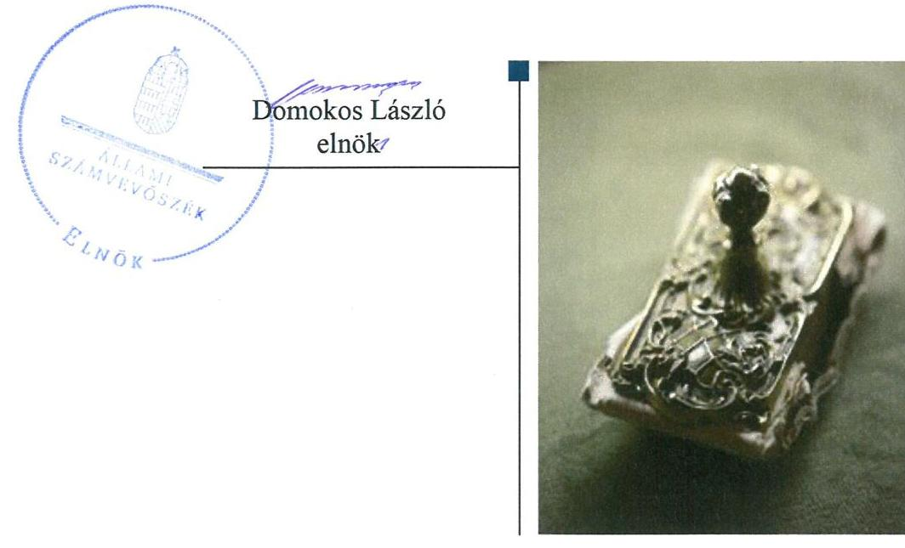
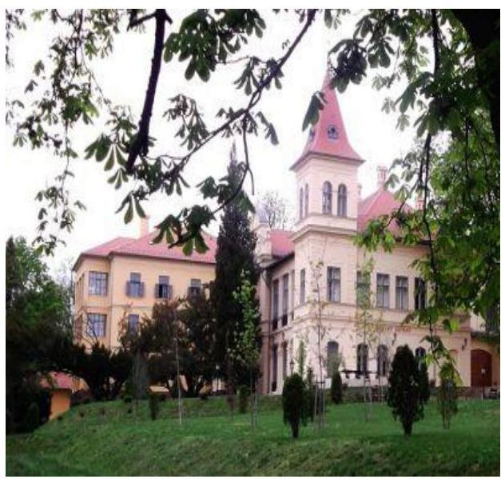
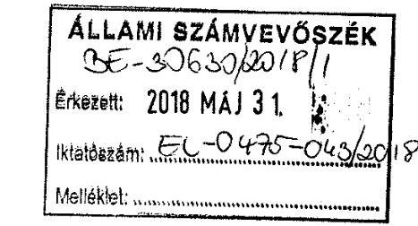
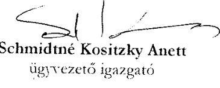
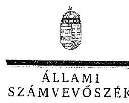
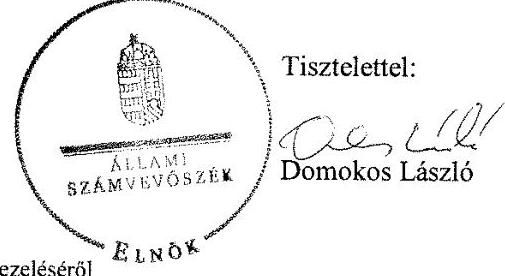
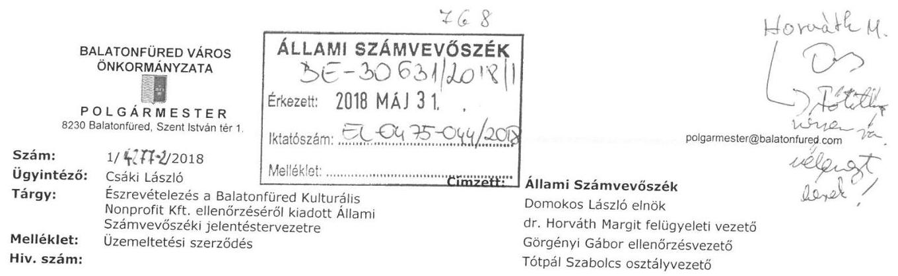
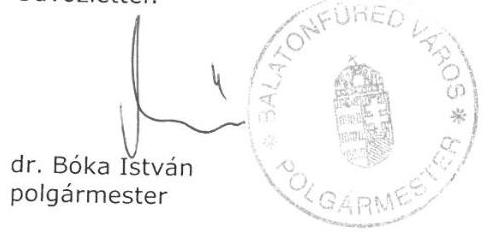
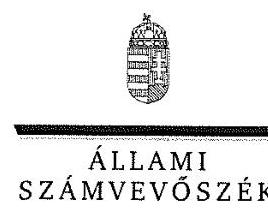
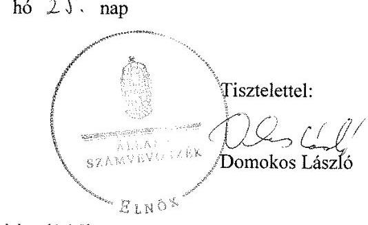

# Jelentés 

## Az önkormányzatok gazdasági társaságai

Az önkormányzatok többségi tulajdonában lévő gazdasági társaságok gazdálkodásának ellenőrzése - Balatonfüred Kulturális Közgyűjtemény Fenntartó Nonprofit Kft. 2018.

---

# Jelentés 

## Az önkormányzatok gazdasági társaságai

Az önkormányzatok többségi tulajdonában lévő gazdasági társaságok gazdálkodásának ellenőrzése - Balatonfüred Kulturális Közgyűjtemény Fenntartó Nonprofit Kft.
2018. július hó 31. nap

---

# AZ ELLENŐRZÉST FELÜGYELTE:

DR. HORVÁTH MARGIT felügyeleti vezető

## AZ ELLENŐRZÉST VEZETTE ÉS A VÉGREHAJTÁSÁÉRT FELELŐS:

GÖRGÉNYI GÁBOR ellenőrzésvezető

## A PROGRAM ÖSSZEÁLLÍTÁSÁÉRT FELELŐS:

TÓTPÁL SZABOLCS osztályvezető

IKTATÓSZÁM: EL-0475-058/2018.

TÉMASZÁM: 2447

ELLENŐRZÉS-AZONOSÍTÓ SZÁM: V079387

Jelentéseink az Országgyűlés számítógépes hálózatán és az Interneta a www.asz.hu címen is olvashatóak.

---

# TARTALOMJEGYZÉK 

■ ÖSSZEGZÉS ..... 5
■ AZ ELLENŐRZÉS CÉLJA ..... 6
■ AZ ELLENŐRZÉS TERÜLETE ..... 7
■ AZ ELLENŐRZÉS HÁTTERE, INDOKOLTSÁGA ..... 9
■ A JELENTÉS LÉNYEGES KÉRDÉSKÖREI ..... 10
■ AZ ELLENŐRZÉS HATÓKÖRE ÉS MÓDSZEREI ..... 11
■ MEGÁLLAPÍTÁSOK ..... 13
■ JAVASLATOK ..... 17
■ MELLÉKLETEK ..... 21
I. sz. melléklet: Értelmező szótár ..... 21
II. sz. melléklet: Pénzügyi adatok ..... 22
■ FÜGGELÉK: ÉSZREVÉTELEK ..... 23
■ RÖVIDÍTÉSEK JEGYZÉKE ..... 51

---

.

---

# ÖSSZEGZÉS 

Balatonfüred Város Önkormányzata nem alakította ki szabályszerűen a tulajdonosi joggyakorlás kereteit és a 2015. évben a tulajdonosi jogait nem gyakorolta szabályszerűen a Társaság felett. A Balatonfüred Kulturális Közgyűjtemény Fenntartó Nonprofit Kft. gazdálkodásának szabályozottsága, gazdálkodása és vagyongazdálkodási tevékenysége sem volt szabályszerű. A Társaságnál a közvagyonnal való felelős gazdálkodás, a vagyonnal való elszámoltathatóság és a közpénzek felhasználásának átláthatósága sem volt biztositott.

## Az ellenőrzés társadalmi indokoltsága

Magyarországon az önkormányzatok kötelező és önként vállalt feladataik vonatkozásában is egyre szélesebb körben alkalmazzák a költségvetésen kívüli feladatellátást. Helyi szinten ennek legfontosabb szereplői az önkormányzati tulajdonban lévő gazdasági társaságok, amelyek ellenőrzése kiemelten fontos a közfeladat ellátása, a közvagyon megőrzése, megóvása érdekében. Alapvető követelmény tehát, hogy működésük, gazdálkodásuk szabályszerű legyen.

Az Állami Számvevőszék kiemelt célja, hogy a helyi önkormányzatok gazdálkodásában rejlő pénzügyi kockázatok feltárásával, az államháztartáson kívülre nyújtott költségvetési támogatások és ingyenes vagyonjuttatások, valamint az államháztartáson kívül múködő feladat-ellátó rendszerek ellenőrzéseivel hozzájáruljon ahhoz, hogy a közpénzeket az államháztartáson kívül múködő szervezetek is átlátható, rendezett módon használják fel.

Az Állami Számvevőszék céljaival és a társadalmi igénnyel összhangban, valamint a gazdasági társaságok kiemelt fontosságú szerepe miatt került sor a Balatonfüred Kulturális Közgyűjtemény Fenntartó Nonprofit Kft. ellenőrzésére.

Az Állami Számvevőszék által a Balatonfüred Kulturális Közgyűjtemény Fenntartó Nonprofit Kft.-nél végzett ellenőrzést a feladatellátásából adódó további társadalmi elvárás is indokolja. Balatonfüred Város idegenforgalmi jelentőségéből adódóan a közösségi, a kulturális és a művelődési szolgáltatásokon, rendezvényeken keresztül a helyi lakosságon kívül a városba látogató turisták is kapcsolatba kerülnek a Társasággal. Az Állami Számvevőszék az ellenőrzése során arra kereste a választ, hogy 2013-2016. között szabályszerű volt-e a Társaság gazdálkodása és az Önkormányzat Társaság feletti tulajdonosi joggyakorlása.

## Főbb megállapítások, következtetések, javaslatok

Balatonfüred Város Önkormányzatánál a tulajdonosi joggyakorlás kereteinek kialakítása nem volt szabályszerű a Társaság feladatellátására vonatkozó szabályozás hiányosságai és az üzemeltetési szerződés megkötésének elmaradása miatt. A tulajdonosi joggyakorlás a 2015. évben nem volt szabályszerű, mert a Társaság saját tőke értéke a 20132014. évek végén negatív volt, ennek ellenére az Önkormányzat nem gondoskodott a szükséges saját tőke biztosításáról, nem döntött a Társaság átalakulásáról, megszüntetéséről, egyesüléséről, szétválásáról, nem határozott továbbá pótbefizetés előírásáról, vagy a törzstőke leszállításáról.

A Balatonfüred Kulturális Közgyűjtemény Fenntartó Nonprofit Kft. gazdálkodásának szabályozottsága nem felelt meg a jogszabályi előírásoknak. A Társaság 2013-2015. években a számviteli törvényben előírt szabályzatok közül nem készítette el a leltárkészítési és leltározási szabályzatot, valamint az értékelési szabályzatot. Nem rendelkezett továbbá a közérdekú adatok közzétételének rendjét rögzítő szabályzattal.

A Társaság gazdálkodása nem volt szabályszerű, mert a személyi jellegú ráfordítások, valamint az értékcsökkenési leírás elszámolása nem szabályszerűen történt. A Társaság elkészítette üzleti terveit, az előírt beszámolási kötelezettségét teljesítette, azonban a közérdekú adatokra vonatkozó közzétételi kötelezettségének nem tett eleget.
A Társaság vagyongazdálkodási tevékenysége nem volt szabályszerű a vagyonnyilvántartás hiányosságai miatt. A könyvviteli mérlegének adatait a Társaság nem támasztotta alá leltárral.

---

# AZ ELLENŐRZÉS CÉLJA 

AZ ELLENŐRZÉS CÉLJA annak értékelése volt, hogy az önkormányzat vagyongazdálkodási tevékenysége során szabályszerűen gyakorolta-e tulajdonosi jogait; a gazdasági társaság szabályozottsága, gazdálkodása és vagyongazdálkodási tevékenysége, bevételeinek és ráfordításainak elszámolása megfelelt-e a jogszabályi és tulajdonosi előírásoknak; a gazdasági társaság kötelezettségállománya jelent-e kockázatot a múködésre, valamint a gazdálkodás átláthatósága és elszámoltathatósága biztosított volt-e.

---

# **AZ ELLENŐRZÉS TERÜLETE**

## **Balatonfüred Város Önkormányzata és a kizárólagos tulajdonában lévő Balatonfüred Kulturális Közgyűjtemény Fenntartó Nonprofit Kft.**

Balatonfüred Város Önkormányzata a Társaság^{1}-ot 2009. július 28-án alapította. Az Önkormányzat^{2} 2013-ban a Társaság átalakulásáról döntött, a Városi Művelődési Központ által ellátott közfeladatot a Társaság 2013. július 1-jén átvette az intézmény megszüntetése miatt, valamint az Önkormányzat 100%-os tulajdonában lévő Kisfaludy Sándor Kulturális és Színházfenntartó Nonprofit Kft. 2013. július 31. napjával beolvadt a Társaságba.

Az ellenőrzött időszakban a Polgármester^{3} és a Jegyző^{4} személyében nem történt változás.

A Társaság főtevékenysége 2013. július 31. előtt múzeumi tevékenység volt, majd azt követően kiegészült az előadó-művészeti tevékenységgel. A Társaság közművelődési és gyűjteményi, kiállítás szervezői tevékenység keretében üzemeltette a Jókai Mór Emlékházat, a Városi Múzeumot, a Vaszary Galériát, a Kisfaludy Galériát, a Kisfaludy Színpadot, az Arácsi Népházat, a Vitorlázeum vitorlástörténeti interaktív kiállítóteret. A Társaság kiemelt feladata volt a balatonfüredi kulturális rendezvények megszervezése. A Társaság által végzett tevékenységek a Mötv.^{5} alapján helyi önkormányzati közfeladatnak minősültek, amelyek egyben közhasznú feladatok voltak. A Társaság alapítása óta közhasznú jogállású, nonprofit gazdasági társaság volt. A Társaság vállalkozási tevékenység keretében ingatlan bérbeadási és könyv-kiskereskedelmi tevékenységet is ellátott.

Az Ügyvezető^{6} személye 2013-ban változott. A Társaság vezetését 2013. július 1-jétől két ügyvezető látta el. A Társaságnál 2013. július 1-ig öttagú, ezt követően háromtagú Felügyelőbizottság^{7}, valamint választott könyvvizsgáló működött.

A Társaság 2013-2016. évi gazdálkodásának néhány jellemző adatát az 1. táblázat, az egyszerűsített éves beszámolók részletesebb adatait a II. sz. melléklet tartalmazza.

1. táblázat

|  A TÁRSASÁG FŐBB GAZDÁLKODÁSI ADATAI 2013-2016. ÉVEKBEN |  |  |  |   |
| --- | --- | --- | --- | --- |
|  Összeg (M Ft) | 2013. | 2014. | 2015. | 2016.  |
|  Nettó árbevétel | 47,5 | 36,7 | 50,8 | 52,0  |
|  Üzemi tevékenység eredménye | -17,3 | 3,8 | -13,1 | -36,4  |
|  Összes bevétel | 145,7 | 220,3 | 254,9 | 260,3  |
|  Adózott eredmény | -17,4 | 3,7 | -5,7 | -36,4  |
|  Fő | 2013. | 2014. | 2015. | 2016.  |
|  Foglalkoztatottak száma (átlagos állományi létszám) | 23 | 34 | 34 | 37  |

*Forrás: A Társaság 2013-2016. évi egyszerűsített éves beszámolói*

---

A Társaság saját tőkéje a 2013-2016. években negatív volt, -16,6; -10,9; -16,6; -30,1 M Ft értékkel. A követelések értéke 12,0; 11,4; 22,2 és 9,1 M Ft, a kötelezettségek értéke pedig 44,3; 97,1; 82,7 és 77,1 M Ft volt a 2013-2016. évi egyszerűsített éves beszámolókban.

A Társaság a 2014. év kivételével veszteségesen gazdálkodott, saját tőkéje a 2013-2016. években negatív volt, így egyik évben sem érte el az adott társasági formára kötelezően előírt jegyzett tőke összegét.

A Társaság 2013-2016. években elszámolt összes bevételén (881,1 M Ft) belül meghatározó (686,6 M Ft, 77,9\%) volt az egyéb bevételek aránya. Az Önkormányzat a Társaság feladatellátásához a 2013-2016. években 55,3; 109,2; 130,5; 150,2 M Ft támogatást nyújtott.
A Társaság az ellenőrzött időszakban nem rendelkezett más gazdasági társaságokban tulajdonosi részesedéssel. A Társaság nem tartozott a kormányzati szektorba sorolt egyéb szervezetek körébe. A Társaság a Számv. tv. ${ }^{8}$ alapján nem volt önköltségszámításra kötelezett.

---

# AZ ELLENŐRZÉS HÁTTERE, INDOKOLTSÁGA 

AZ ÖNKORMÁNYZATOK TÖBBSÉGI TULAJDONÁBAN ÁLLÓ GAZDASÁGI TÁRSASÁGOK ellenőrzése kiemelten fontos a vagyon megőrzése, megóvása érdekében. A feladatellátás költségeinek, ráfordításainak alakulása a lakosság széles rétegét érinti. Ellenőrzéseink feltárhatják, hogy az önkormányzat a feladatellátásához rendelt vagyon múködtetését a tulajdonostól elvárható gondossággal vé-gezte-e, a feladatot ellátó gazdasági társaság a létesítő okiratban, szolgáltatási szerződésben foglaltak betartásával biztosította-e a feladat ellátását. Az ellenőrzés eredményeképp meghatározhatóvá válnak a költségvetési hiányt befolyásoló szervezetek kockázatai, lehetővé válik ezen kockázatok csökkentése. Az ellenőrzés rávilágíthat arra, hogy a gazdasági társaság a vagyon használatával biztosította-e a szolgáltatás folytatásának feltételeit, az önkormányzat tulajdonosi felügyelete hozzájárult-e a szabályszerű gazdálkodáshoz és feladatellátáshoz. A megállapítások alapján megfogalmazott számvevőszéki javaslatok hasznosítása elősegítheti a meglévő hibák megszüntetését. A jó gyakorlatok bemutatásával az ÁSZ ${ }^{9}$ hozzájárulhat a követendő megoldások megismertetéséhez, terjesztéséhez.

---

# A JELENTÉS LÉNYEGES KÉRDÉSKÖREI 

1.     - Az Önkormányzat tulajdonosi joggyakorlása szabályszerű volt-e?
2.     - A Társaság szabályozottsága megfelelt-e a jogszabályi előírásoknak, a gazdálkodási tevékenysége szabályszerű volt-e, fizetőképessége biztositott volt-e a gazdálkodás során?
3.     - A Társaság vagyongazdálkodási tevékenysége szabályszerű volt-e?

---

# AZ ELLENŐRZÉS HATÓKÖRE ÉS MÓDSZEREI 

## Az ellenőrzés típusa

Megfelelőségi ellenőrzés

## Az ellenőrzött időszak

2013. január 1-jétől 2016. december 31-ig tartó időszak.

## Az ellenőrzés tárgya

Balatonfüred Város Önkormányzata 100\%-os tulajdonában álló Balatonfüred Kulturális Közgyűjtemény Fenntartó Nonprofit Kft. feletti tulajdonosi joggyakorlása, valamint a Társaság gazdálkodásának szabályozottsága és szabályszerűsége.

Az ellenőrzés kiterjedt minden olyan körülményre és adatra, amely az ÁSZ jogszabályban meghatározott feladatainak teljesítéséhez, valamint a program végrehajtása folyamán felmerült újabb összefüggések feltárásához szükséges.

## Az ellenőrzött szervezet

Balatonfüred Város Önkormányzata, valamint a Balatonfüred Kulturális Közgyűjtemény Fenntartó Nonprofit Kft.

## Az ellenőrzés jogalapja

Az ellenőrzés jogszabályi alapját az az Állami Számvevőszékről szóló 2011. évi LXVI. törvény 1. § (3) bekezdése és 5. § (3)-(5) bekezdései képezték.

## Az ellenőrzés módszerei

Az ellenőrzést a nemzetközi standardokat irányadónak tekintve az ellenőrzési program ellenőrzési kérdései, az ellenőrzött időszakban hatályos jogszabályok, az ellenőrzés szakmai szabályok és módszertanok figyelembe vételével végeztük.

Az ellenőrzés ideje alatt az ellenőrzött szervezettel történő kapcsolattartást az ÁSZ Szervezeti és Működési Szabályzatának vonatkozó előírásai alapján biztosítottuk.

---

Az ellenőrzési kérdések megválaszolásához szükséges bizonyítékok megszerzése a következő ellenőrzési eljárások alkalmazásával történt: megfigyelés, kérdésfeltevés (információkérés), összehasonlítás, valamint elemző eljárás. Az ellenőrzési bizonyítékként felhasználható adatforrások közé tartoztak egyrészt az ellenőrzési programban felsorolt adatforrások, másrészt adatforrás lehetett még minden - az ellenőrzés folyamán - feltárt, az ellenőrzés szempontjából információkat tartalmazó dokumentum. Az ellenőrzést a kérdésekre adott válaszok kiértékelésével, valamint a megjelölt adatforrások, a csatolt tanúsítványok felhasználásával, továbbá az adott időszakban hatályos jogszabályok figyelembe vételével folytattuk le.

A bevételek és ráfordítások elszámolását, és a vagyonnyilvántartás terén a szabályszerű működést véletlen mintavétellel ellenőriztük. A mintavétellel ellenőrzött területek esetében minden egyes tétel vonatkozásában szabályszerűségre vonatkozó kérdéseket tettünk fel, amelyek a számviteli törvény, illetve a tulajdonosi követelményeknek és az ellenőrzött szervezet belső szabályozásai előírásainak betartására vonatkoztak. A jogszabályoknak és a belső előírásoknak megfelelőnek tekintettük az adott területet, amennyiben a minta ellenőrzésének eredménye alapján 95\%-os bizonyossággal a teljes sokaságban a hibaarány kisebb volt, mint 10\%, nem megfelelőnek értékeltük, ha a hibaarány a 10\%-ot meghaladta. A ráfordítások elszámolására és a vagyonnyilvántartásra vonatkozó véletlen mintavételt kockázati alapú kiválasztással egészítettük ki, amelynek során évente a három legnagyobb összegű tételt választottuk ki.

---

# 1. Az Önkormányzat tulajdonosi joggyakorlása szabályszerű volt-e? 

Összegző megállapítás

Az Önkormányzat a tulajdonosi joggyakorlás kereteit nem alakította ki szabályszerűen, a tulajdonosi joggyakorlás a 2015. évben nem volt szabályszerű.

A TULAJDONOSI JOGGYAKORLÁS KERETEIT az Önkormányzat nem szabályszerűen alakította ki. Az Önkormányzat SZMSZ ${ }^{10}$ ében foglaltak alapján a tulajdonosi joggyakorlás kereteit az Önkormányzat a vagyonrendelet ${ }^{11}$ keretében alakította ki, valamint a Társasággal kötött támogatási szerződések ${ }^{12}$, a Közművelődési megállapodás ${ }^{13}$ és az Alapító okirat ${ }_{1-6}{ }^{14}$ útján. A támogatási szerződések kulturális rendezvények, fesztiválok kiállítások megrendezéséhez nyújtottak fedezetet.

A Közműv. tv. ${ }^{15}$ 77. §-ában előírtak ellenére az Önkormányzat nem szabályozta rendeletben, hogy a 76. §-ban felsorolt helyi közművelődési feladatok közül mit, milyen konkrét formában, módon és mértékben lát el. A Társaság által végzett szolgáltatások vonatkozásában az Önkormányzatnak nem volt díj-meghatározási kötelezettsége.

A Közművelődési megállapodást a Társaság 2013. évi átszervezését követően nem módosították, így az a beolvadó szervezetek vonatkozásában nem felelt meg Közműv. tv. 78. § (3) bekezdésének. A Közművelődési megállapodásban az Önkormányzat a Társaság számára üzleti terv, valamint szakmai beszámoló készítési kötelezettséget írt elő, illetve tartalmazta a Társaság által ellátandó feladatokat és azok finanszírozási módját.

A Közművelődési megállapodás alapján az Önkormányzat három ingatlant adott a Társaság használatába. A Társaság az ingatlanokat a Közművelődési megállapodás alapján vette használatba. Az Alapító ${ }^{16}$ képviselője a Társaság részére átadott vagyontárgyakról, azok használatának szabályairól nem kötött a Társasággal üzemeltetési szerződést a Képviselő-testület ${ }^{17}$ 213/2013. (VI. 27.) határozatában foglaltak ellenére.

Az Alapító által a Társaságnál létrehozott Felügyelőbizottság a Gt. ${ }^{18}$ 34. § (4) bekezdésében, valamint a Ptk. ${ }^{19}$ 3:122. § (3) bekezdésében foglaltak ellenére nem állapította meg az ügyrendjét. A Felügyelőbizottság feladatait az Alapító okirat ${ }_{1-6}$-ban meghatározták.

A Társaság - Alapító által elfogadott - javadalmazási szabályzata ${ }^{20}$ a Taktv. ${ }^{21}$ 5. § (3) bekezdésében előírtak ellenére nem terjedt ki az Mt. 208. $\S$-ának hatálya alá eső vezető állású munkavállalókra.

A Társaság könyvvizsgálatra nem volt kötelezett, de az Alapító okirat ${ }_{1-6}$ alapján független könyvvizsgáló működött. A Felügyelőbizottság - tekintettel a Társaság pénzügy-likvidítási helyzetére - a 2014-2016. években évközi beszámoló készítési kötelezettséget írt elő a Társaság számára.

---

A TULAJ DONOSI JOGOK GYAKORLÁSA a 2015. évben nem volt szabályszerű. A Társaság saját tőkéje a 2013-2016. évi beszámolók szerint negatív volt. Az Alapító a Ptk. 3:133 § (2) bekezdését megsértve a 2015. évben nem gondoskodott az adott társasági formára kötelezően előírt jegyzett tőkének megfelelő összegű saját tőke biztosításáról, nem döntött a Társaság átalakulásáról, jogutód nélküli megszüntetéséről, vagy egyesülésről. A Ptk. 3:189. § (2) bekezdését megsértve nem határozott továbbá pótbefizetés előírásáról, a törzstőke leszállításáról, mindezek hiányában a társaság átalakulásáról, egyesüléséről, szétválásáról vagy jogutód nélküli megszüntetéséről.

A 2015. évi beszámoló szerinti -16,6 M Ft összegű negatív saját tőke rendezéseként az Alapító a 2015. évi beszámoló elfogadásakor 22,9 M Ft nem pénzbeli, vagyoni hozzájárulás apportálásáról döntött. A 2016. évi veszteséges gazdálkodás következtében a Társaság saját tőkéje a 2016. évi beszámoló szerint azonban ismét negatív, -30,1 M Ft értékű volt.

A Társaság egyszerűsített éves beszámolóiról a Képviselő-testület a Gt. és a Ptk. előírásainak megfelelően a könyvvizsgáló és a Felügyelőbizottság írásbeli jelentései birtokában hozta meg elfogadó döntését. Az Alapító a 2015. évben nem vette figyelembe a Felügyelőbizottság jogszabály által előírt tőkehelyzet rendezésére irányuló javaslatát. A Társaság könyvvizsgálója a 2013-2016. évi egyszerűsített éves beszámolók könyvvizsgálói jelentésében a saját tőke szintjének helyreállítására figyelemfelhívást fogalmazott meg. Az Önkormányzat a Társaság vonatkozásában kialakított monitoring rendszert a jogszabályi előírásoknak megfelelően múködtette.

Tulajdonosi ellenőrzést az Önkormányzat belső ellenőrzését ellátó Társulás ${ }^{22}$ az Áht. előírásai alapján a 2013. és a 2015. évben végzett a Társaságnál, amelyeknek a célja az Önkormányzat által nyújtott támogatások felhasználásának ellenőrzése volt. Az ellenőrzés javaslatai alapján a Társaság elkészítette intézkedési terveit.

# 2. A Társaság szabályozottsága megfelelt-e a jogszabályi előírásoknak, a gazdálkodási tevékenysége szabályszerű volt-e, fizetőképessége biztosított volt-e a gazdálkodás során? 

Összegző megállapítás

A Társaság szabályozottsága nem felelt meg a jogszabályi előírásoknak. A gazdálkodási tevékenység nem volt szabályszerű a személyi jellegú ráfordítások, valamint az értékcsökkenési leírás elszámolásának hiányosságai miatt. A közérdekú adatok közzétételi kötelezettségének a Társaság nem tett eleget.

A TÁRSASÁG SZABÁLYOZOTTSÁGA nem felelt meg a jogszabályi előírásoknak. A Számviteli politika ${ }^{23}$ a Számv. tv. 14. § (4) bekezdésében előírtak ellenére nem tartalmazta az értékcsökkenés elszámolásának gyakoriságát. A Számviteli politika ${ }_{1,2}{ }^{24}$ és a Pénzkezelési szabályzat ${ }_{1,2,3}{ }^{25}$ megfelelt a jogszabályi előírásoknak.

A Társaság a Számv. tv. 161. § (1) bekezdésében foglaltak ellenére 2013. augusztus 8-ig nem rendelkezett számlarenddel, ezt követően a Számlarend ${ }^{26}$ megfelelt a jogszabályi előírásoknak.

---

A 2013-2015. években a Számv. tv. 14. § (5) bekezdés a) és b) pontjaiban foglaltak ellenére a Társaság nem készítette el az eszközök és a források leltárkészítési és leltározási szabályzatát, valamint az eszközök és a források értékelési szabályzatát. A 2016-tól hatályos Leltározási szabályzat ${ }^{27}$, valamint az Értékelési szabályzat ${ }^{28}$ megfelelt a jogszabályi előírásoknak.

A Társaság a közhasznúsági melléklet elkészítéséhez a Számv. tv. 161/A. § (2) bekezdésében foglaltak ellenére a belső szabályozásában nem részletezte tovább a közhasznú és vállalkozási tevékenységéből származó bevételei és ráfordításai elkülönített könyvelésének szabályrendszerét. Ebből eredően a Társaság a Ctv. 20. § előírásai ellenére nem vezetett elkülönített számviteli nyilvántartást a bevételek és a ráfordítások esetében.

A SZEMÉLYI JELLEGŰ RÁFORDÍTÁSOK elszámolása nem volt szabályszerű, mert a Számv. tv. 167. § (1) bekezdés h) pontjának előírásai ellenére a könyvviteli elszámolást alátámasztó bizonylatok nem tartalmazták a könyvelés módjára, az érintett könyvviteli számlákra történő hivatkozást.

AZ ÉRTÉKCSÖKKENÉS ELSZÁMOLÁSA nem volt szabályszerű, mert a Számviteli politika ${ }_{2} 8$. pontjában előírtak ellenére a 20132015. években nem negyedévente, hanem évente történt. A 2015-2016. években egy gépjármú esetében az értékcsökkenés elszámolása a Számviteli politika 2.3 -ban meghatározott $20 \%$-os leírási kulcs helyett $16 \%$-os arány alkalmazásával történt.

# A KÖTELEZŐEN KÖZZÉTEENDŐ KÖZÉRDEKŰ 

ADATOKAT a Társaság az Info tv. ${ }^{29}$ 33. § (1) bekezdésében előírtak ellenére nem tette hozzáférhetővé, mert az Info tv. 37. § (1) pontjában foglaltak ellenére az Info tv. 1. melléklete szerinti, a szervezetre, annak tevékenységére és gazdálkodásra vonatkozó adatokat nem tette közzé. Nem tette közzé továbbá a Taktv. 2. § (1)-(3) bekezdéseiben előírt személyzeti és gazdálkodási adatokat. A Társaság, mint adatfelelős az Info tv. 35. § (3) bekezdésében foglaltak ellenére a közzétételi kötelezettség teljesítésének részletes szabályait belső szabályzatban nem állapította meg.

TERVEZÉSI, BESZÁMOLÁSI KÖTELEZETTSÉGÉT a Társaság teljesítette, az üzleti terveit, a Számv. tv. szerinti éves beszámolóit és a szakmai beszámolóit jóváhagyásra benyújtotta az Alapító részére. Az egyszerűsített éves beszámolók jóváhagyásakor a felügyelőbizottsági és a könyvvizsgálói jelentések rendelkezésre álltak. Az üzleti terveket a felügyelőbizottság megtárgyalta és azokat határozataiban elfogadta. Az Alapító határozataiban döntött a beszámolók és az üzleti tervek jóváhagyásáról. Az egyszerűsített éves beszámolókat és azok jogszabályi előírásnak megfelelő közhasznúsági mellékleteit a Társaság letétbe helyezte és közzétette a Számv. tv., illetve a Ctv. ${ }^{30}$ előírásainak megfelelően.

---

# 3. A Társaság vagyongazdálkodási tevékenysége szabályszerű volt-e? 

Összegző megállapítás

A Társaság vagyongazdálkodási tevékenysége a vagyonnyilvántartás hiányosságai miatt nem volt szabályszerű.

A TÁRSASÁG AZ EGYSZERŰSÍTETT ÉVES BESZÁMOLÓINAK MÉRLEG TÉTELEIT a Számv. tv. 69. § (1) bekezdésében foglaltak ellenére a törvénynek megfelelő leltárral nem támasztotta alá, ebből eredően a mérlegtételek vonatkozásában nem volt biztosított a Számv. tv. 15. § (3) bekezdésében foglalt valódiság elve. A leltározás hiányossága ellenére a könyvvizsgáló a beszámolót korlátozás nélküli hitelesítő záradékkal látta el.

A VAGYON NYILVÁNTARTÁSA nem volt szabályszerű, mert tárgyi eszközök nyilvántartásba vétele során a Számv. tv. 52. § (2) bekezdésében előírtak ellenére az üzembe helyezést több esetben hitelt érdemlően nem dokumentálták. A Társaság több eltérő paraméterű, bekerülési értékű tárgyi eszköz egyidejű beszerzése esetében azokat csoportosan vette nyilvántartásba, amely nem felelt meg a Számv. tv. 16. § (1) bekezdés szerinti egyedi értékelés elvének. A Társaság a Számv. tv. 165. § (2) bekezdéseiben foglaltakkal ellentétben nem rendelkezett egy kiállítótér bekerülési értékét alátámasztó összes számviteli bizonylattal (számlával).

---

# JAVASLATOK 

Az ÁSZ tv. 33. § (1) bekezdésében foglaltak értelmében az ellenőrzött szervezet vezetője köteles a jelentésben foglalt megállapításokhoz kapcsolódó intézkedési tervet összeállítani és azt a jelentés kézhezvételétől számított 30 napon belül az ÁSZ részére megküldeni. Amennyiben az ellenőrzött szervezet vezetője nem küldi meg határidőben az intézkedési tervet, vagy továbbra sem elfogadható intézkedési tervet küld, az Állami Számvevőszék elnöke az ÁSZ tv. 33. § (3) bekezdése a) és b) pontjaiban foglaltakat érvényesítheti.
Javaslataink célja a Balatonfüred Kulturális Közgyűjtemény Fenntartó Nonprofit Kft. gazdálkodása szabályszerűségének és gyakorlatának javítása annak érdekében, hogy a szabályozási környezet és az alkalmazott gyakorlat megfelelően tudja támogatni az átlátható működést

## Balatonfüred Kulturális Közgyűjtemény Fenntartó Nonprofit Kft. ügyvezetőjének

1. Intézkedjen a Számviteli politika kiegészítéséről az értékcsökkenési leírás elszámolásának gyakorisága tekintetében a hatályos Számv. tv. előírásainak megfelelően.
(2. sz. megállapítás 1. bekezdés 2. mondata alapján)
2. Intézkedjen olyan belső szabályozás kidolgozásáról, amely a Számv. tv előírásainak megfelelően biztosítja a közhasznú és a vállalkozási tevékenységből származó bevételek és ráfordítások elkülönített nyilvántartását.
(2. sz. megállapítás 4. bekezdés alapján)
3. Intézkedjen a személyi jellegű ráfordítások elszámolásának a Számv. tv. előírásainak megfelelő számviteli bizonylattal történő alátámasztásáról.
(2. sz. megállapítás 5. bekezdése alapján)
4. Gondoskodjon az Info tv. és a Taktv. szerinti közzétételi kötelezettség teljesítéséről..
(2. sz. megállapítás 8. bekezdés 1-2 mondatai alapján)
5. Intézkedjen a közérdekü adatok közzétételének részletes szabályait rögzítő belső szabályzat elkészítéséről az Info tv. előírásainak megfelelően.
(2. sz. megállapítás 8. bekezdés 3. mondata alapján)

---

6. Intézkedjen az éves beszámoló mérlegének alátámasztásáról a Számv. tv.-ben elöirtaknak megfelelő leltár elkészitésével.
(3. sz. megállapítás 1. bekezdés 1. mondata alapján)
7. Intézkedjen a tárgyi eszközök hatályos Számv. tv.-ben elöirtaknak megfelelő nyilvántartásba vételéről.
(3. sz. megállapítás 2. bekezdése alapján)

---

# Javaslataink célja az Önkormányzat szabályszerű müködésének elősegítése, továbbá az önkormányzati tulajdonosi joggyakorlás kontrolljainak erősítése. 

## Balatonfüred Város Önkormányzata polgármesterének

1. Intézkedjen a helyi közmüvelődési feladatok ellátásával összefüggő rendelet megalkotásáról, abban a közmüvelődési alapszolgáltatások körének, ellátásuk formájának, módjának és mértékének meghatározásáról a Közmüv. tv. előirásainak megfelelően.
(1. sz. megállapítás 2. bekezdés 1. mondata alapján)
2. Intézkedjen a Társasággal megkötött Közmüvelődési megállapodás módosításáról a hatályos Közmüv. tv. előirásainak megfelelően.
(1. sz. megállapítás 3. bekezdés 1. mondata alapján)
3. Intézkedjen a Társaság részére átadott vagyontárgyakról, azok használatának szabályairól szóló üzemeltetési szerződés megkötéséről, a Közmüvelődési megállapodásban foglaltaknak, valamint a Képviselőtestület döntésének megfelelően.
sz. megállapítás 4. bekezdés 2. mondata alapján)
4. Kezdeményezze a Felügyelő Bizottság elnökénél a Felügyelő Bizottság ügyrendjének elkészitését és gondoskodjon az alapitói jóváhagyásról.
(1. sz. megállapítás 5. bekezdése alapján)
5. Intézkedjen a javadalmazási szabályzat hatályának az Mt. 208. §-ának hatálya alá eső vezető állású munkavállalókra történő kiterjesztésére és a módosított szabályzat alapitói jóváhagyása érdekében.
(1. sz. megállapítás 6. bekezdése alapján)
6. Kezdeményezze a Társaság saját tőkéjének rendezését vagy döntsön a Társaság átalakulásáról, megszüntetéséről, vagy egyesüléséről Ptk.ban elöirtaknak megfelelően.
(1. sz. megállapítás 8. bekezdés alapján)

---

7. Intézkedjen
a) a számviteli szabályozás hiányossága, a számviteli szabályzatok hiánya,
b) a személyi jellegű ráfordítások elszámolásának hiányosságai,
c) az értékcsökkenési leírás elszámolásának hiányosságai,
d) a közzétételi kötelezettség szabályozásának és teljesítésének hiányosságai,
e) a leltár hiánya,
f) a tárgyi eszközök nyilvántartásba vételének hiányosságai, miatti felelősség tisztázása érdekében, és szükség szerint intézkedjen a felelősség érvényesítéséről.
(2. sz. megállapítás 1., 4-6., 8. bekezdései, 3. sz. megállapítás 1. bekezdés 1. mondata, 3.sz. megállapítás 2. bekezdése alapján)

---

# MELLÉKLETEK 

- I. SZ. MELLÉKLET: ÉRTELMEZŐ SZÓTÁR
gazdasági társaság
gazdálkodó szervezet
kormányzati szektorba sorolt egyéb szervezet
nemzeti vagyon
nonprofit gazdasági társaság

Ptk. 3:88. § (1) bekezdése szerint „a gazdasági társaságok üzletszerű közös gazdasági tevékenység folytatására, a tagok vagyoni hozzájárulásával létrehozott, jogi személyiséggel rendelkező vállalkozások, amelyekben a tagok a nyereségből közösen részesednek, és a veszteséget közösen viselik".
A Ptk. 685. § c) pontja szerint gazdálkodó szervezet: „az állami vállalat, az egyéb állami gazdálkodó szerv, a szövetkezet, a lakásszövetkezet, az európai szövetkezet, a gazdasági társaság, az európai részvénytársaság, az egyesülés, az európai gazdasági egyesülés, az európai területi együttmúködési csoportosulás, az egyes jogi személyek vállalata, a leányvállalat, a vízgazdálkodási társulat, az erdő birtokossági társulat, a végrehajtói iroda, az egyéni cég, továbbá az egyéni vállalkozó." (2014. 03.15-ig hatályos)
az Áht. ${ }^{31}$ 3. § (2) és (3) bekezdésében foglaltakon kívül az Európai Közösséget létrehozó szerződéshez csatolt, a túlzott hiány esetén követendő eljárásról szóló jegyzőkönyv alkalmazásáról szóló 2009. május 25-i 479/2009/EK rendelet (a továbbiakban: 479/2009/EK rendelet) szerint a kormányzati szektorba sorolt szervezet (Áht. 1. § (12))
Nvtv. ${ }^{32}$ 1. § (2) bekezdése szerint többek között:
„az állam vagy a helyi önkormányzat kizárólagos tulajdonában álló dolgok, az a) pont hatálya alá nem tartozó, állam vagy a helyi önkormányzat tulajdonában lévő dolog,
az állam vagy a helyi önkormányzat tulajdonában lévő pénzügyi eszközök, továbbá az államot vagy a helyi önkormányzatot megillető társasági részesedések, az államot vagy a helyi önkormányzatot megillető bármely vagyoni értékkel rendelkező jogosultság, amelyet jogszabály vagyoni értékű jogként nevesít."
Civil tv. 9/F. § (2) bekezdése szerint „az a gazdasági társaság minősül nonprofit gazdasági társaságnak és cégnevében az a gazdasági társaság tüntetheti fel a nonprofit jelleget, amelynek létesítő okirata tartalmazza, hogy a gazdasági társaság tevékenységéből származó nyereség a tagok között nem osztható fel, hanem az a gazdasági társaság vagyonát gyarapítja." (hatályos 2014. március 15-től)

---

# A BALATONFÜRED KULTURÁLIS KÖZGYŰJTEMÉNY FENNTARTÓ NONPROFIT KFT. EGYSZERÜSÍTETT ÉVES BESZÁMOLÓINAK ADATAI (M FT)

|  Eredménykimutatás | 2013. év | 2014. év | 2015. év | 2016. év  |
| --- | --- | --- | --- | --- |
|  Értékesítés nettó árbevétele | 47,5 | 36,7 | 50,8 | 52,0  |
|  Egyéb bevételek | 98,1 | 183,6 | 196,6 | 208,3  |
|  Anyagjellegú ráfordítások | 98,2 | 130,7 | 164,0 | 171,9  |
|  Személyi jellegú ráfordítások | 59,8 | 80,8 | 82,8 | 90,5  |
|  Értékcsökkenési leírás | 3,5 | 3,9 | 13,6 | 14,1  |
|  Egyéb ráfordítások | 1,4 | 1,1 | 0,1 | 20,2  |
|  Üzemi tevékenység eredménye | $-17,3$ | 3,8 | $-13,1$ | $-36,4$  |
|  Mérleg szerint eredmény/Adózott eredmény* | $-17,4$ | 3,7 | $-5,7$ | $-36,4$  |

- A 2013-2015. években az adózott eredmény és a mérleg szerinti eredmény megegyezett. A Számv. tv. 2015. július 4-től hatályos módosítása alapján a mérleg szerinti eredmény tétel megszűnt. A 2016. évi egyszerűsített éves beszámoló eredménykimutatásában az adózott eredmény levezetését kellett kimutatni.

---

# FÜGGELÉK: ÉSZREVÉTELEK 

A jelentéstervezetet a Számvevőszék 15 napos észrevételezésre megküldte az ellenőrzött szervezetek vezetőinek az ÁSZ tv. 29. §* (1) bekezdése előírásának megfelelően.

Az elfogadott észrevételek alapján a Számvevőszék módosította a jelentést.
A függelék tartalmazza az ellenőrzött Balatonfüred Kulturális Közgyűjtemény Fenntartó Nonprofit Kft. ügyvezetőjének és Balatonfüred Város polgármesterének észrevételeit és azok kezeléséről szóló válaszleveleket.

[^0]
[^0]:    * 29. § (1) Az Állami Számvevőszék az ellenőrzési megállapításait megküldi az ellenőrzött szervezet vezetőjének vagy az általa megbízott személynek, és annak, akinek személyes felelősségét állapította meg.
    (2) Az ellenőrzött szervezet vezetője és a felelősként megjelölt személy az ellenőrzés megállapításaira tizenöt napon belül írásban észrevételt tehet.
    (3) Az Állami Számvevőszék az észrevételre a beérkezésétől számított harminc napon belül írásban válaszol. A figyelembe nem vett észrevételeket köteles a jelentésben feltüntetni, és megindokolni, hogy azokat miért nem fogadta el.

---

Balatonfüred Kulturális Közgyüjtemény Fenntartó Nonprofit Kft. 8230-Balatonfüred, Honvéd u. 2-4. u.s.s.fincdhalt.hu info@tim.dlalt.hu +36 (87) $950-876$

|  Ügyintéző: | Nyitrainé Bárány Ilona | Címzett: | Állami Számvevőszék  |
| --- | --- | --- | --- |
|   | email:gazdasagi.vezeto@furedkult.hu |  | Domokos László elnök részére  |
|   | Tel.: $+36($ ) |  | További címzettek:
dr. Horváth Margit felügyeleti vezető
Görgényi Gábor ellenőrzésvezető
Tótpál Szabolcs osztályvezető  |
|  Tárgy: | Állami Számvevőszék jelentéstervezetre észrevételezés |  | 1052 Budapest  |
|   |  |  | Apáczai Csere János utca 10.  |
|  Iktatószám: | 482 / 2018. |  | levélcím: 1364 Budapest 4. Pf.: 54.  |
|  Melléklet: | Észrevételezés a jelentéstervezetre |  | Tel.: $+36($ )  |

# Tisztelt Elnök Úr!

A Balatonfüred Kulturális Nonprofit Kft ellenőrzésével kapcsolatosan küldött jelentéstervezet megállapításaira (Érkeztetés: 2018. május 14., Ikt.szám.: EL-0475-039/2018.) Társaságunk észrevételezéssel kíván élni, amelyet ezúton megküldünk az Önök részére.

Egyúttal köszönjük segítségüket és eddigi munkájukat.

Balatonfüred, 2018. év május hó 28. nap.

Tisztelettel:

## 

Schmidtné Kositzky Anett úgyvezető igazgató BALATONFÜRED KULTURÁLIS NONPROFIT KPT. 8230 Balatonfüred, Honvéd u. 2-4. Hazec.: 71200110-11299342 Adhuc.: 14884469-2-19

---

Balatonfüred Kulturális Közgyöjtemény Fennrtartó Nonprofit Kft.
8230 Balatonfüred, Horvéd u. 2-4.
a.u.u.horvdkult.hu mitor.horvdkult.hu +36 (87) $950-876$
$432 / 2018$

# Címzett: Állami Számvevőszék 

Domokos László elnök
dr. Horváth Margit felügyeleti vezető
Görgényi Gábor ellenőrzésvezető
Tótpál Szabolcs osztályvezető

Tárgy: Észrevételezés a Balatonfüred Kulturális Nonprofit Kft. ellenőrzéséről kiadott Állami Számvevőszéki jelentéstervezetre

## 5. oldal, „Összegzés":

„Főbb megállapítások, következtetések, javaslatok" 3.-6. sor: „A Balatonfüred Kulturális Nonprofit Kft. gazdálkodásának szabályozottsága nem felel meg a jogszabályi előírásoknak".
A Társaság gazdálkodásának szabályozottságára és vagyongazdálkodási tevékenységére tett kijelentés általánosító, szeretnénk kérni a szövegezés módosítását, mivel egy általános rossz képet vetít a Társaság múködéséről, amit nem találunk helytállónak és reálnnak.

## Indoklás:

5. oldal, „Főbb megállapítások, következtetések, javaslatok:
6. oldal, 1. bekezdés, 1.-3.sor.

Az üzemeltetési szerződést érintő kijelentés nem helytálló, az üzemeltetési szerződés az alapdokumentumokkal együtt elkészült 2010-ben és új szerződést készült 2013-ban. Amennyiben szükséges, a dokumentumot bemutatjuk. A dokumentum bekérésére vonatkozóan nem volt egyértelmű, hogy azt az ellenőrzésre bekérték volna, ezért maradt le a beküldött dokumentumok listájáról.
5. oldal, 2. bekezdés:

A gazdálkodás szabályozottságának nem megfelelőségére vonatkozó megállapítás nem helytálló, kérjük a szövegezést módosítani. Minden bizonnyal félreértelmezés történhetett a benyújtott dokumentumokkal kapcsolatban, ugyanis a benyújtott dokumentumok között megküldtük Önöknek a 2011-tól 2016-ig érvényes Leltározási Szabályzatot és Selejtezési Szabályzatot, továbbá mellékeltük a 2016. évi, már egységes szerkezetű Számviteli politika részeként az új szabályzatainkat, köztük ezeket is.
5. oldal, 3. bekezdés:

A gazdálkodás szabályszcrűségéről szóló megállapítással nem értünk egyet minden pontban, kérjük szíveskedjenek módosítani a szövegezést, hiszen a megállapítás szintén általánosan jelenti ki, hogy szabálytalan volt, ami egy nagyon súlyos kijelentés.
A személyi jellegű ráfordítások valamint az értékcsökkenési leírás elszámolása véleményünk szerint minden évben a számviteli előírásoknak megfelelően történt Társaságunknál. Kérjük, amennyiben találtak szabálytalanságot, úgy konkrétan nevezzék meg, hogy mik voltak ezek. Nem értjük pl. hogy mi hiányzott a személyi jellegủ ráfordítások számviteli elszámolásával kapcsolatosan, szívesen küldünk erre vonatkozóan más elszámoló bizonylatot (számfejtés, kontírozás, havi összesítés, bevallás).
A közzétételi kötelezettséggel kapcsolatban csak részben tettünk eleget az előírásoknak, a honlap szerkesztési és frissítési munkálatai miatt. Azonban a város honlapján a Testületi ülések dokumentumai, előterjesztései hozzáférhetők, nyilvánosak, így a Társaság adatai és dokumentumai is.
5. oldal, 4. bekezdés:

Véleményünk szerint 2013 és 2016 között valamennyi beszámoló-, így a mérleg-, és eredmény kimutatás tételeit hitelt érdemlő módon leltárral vagy egyeztető analitikával alátámasztottuk. Kérjük írják le, melyik évben mit találtak szabálytalanak. A Társaság fizetőképessége megállapítható volt a beküldött mérlegadatokból, hiszen rendelkezésre bocsájtottuk a vevők-, és szállítói korosító listákat is. Mindezek alapján kérjük a megállapítást ezek alapján módosítani.

---

15. oldal , 2. A Társaság szabályozottsága megfelel-e a jogszabályi előírásoknak, a gazdálkodási tevékenysége szabályszerű volt-e, fizetőképessége biztosított volt-e a gazdálkodás során?"

Az Összegző megállapítással nem értünk egyet. Kérjük a következő szövegezési módosítani: „, a Társaság szabályozottsága nem felelt meg a jogszabályi előírásoknak. A gazdálkodás nem volt szabályszerű..."
A megfogalmazás általánosító, nagyon rossz, negatív képet vetít a Társaság múködésére, gazdálkodására, és számviteli fegyelmére vonatkozóan, amit nem találunk helytállónak és reálisnak.

# Indoklás a 2.) pont alatti összegző megállapítások észrevételezéséhez: 

## 15. oldal, A Társaság szabályozottsága

I. bekezdés: az értékcsökkenés elszámolásának gyakoriságára vonatkozóan tudomásunk szerint a Gazdasági Társaságok esetében nincsenek kötelező előírások, lehet havi, negyedéves, éves elszámolást választani, de kötelező min. évente egy alkalommal, ami az év végi záráskor esedékes. A mi elszámolásunkban is év végén van az ées elszámolása - amivel megfelelünk a jogszabályi előírásnak.
Azt elismerjük, hogy az elszámolás gyakoriságát nem írtuk bele a számviteli politikába. Ezt a kiegészítést/módosítást megtesszük a szabályozottság érdekében.

## 15. oldal, 3. bekezdés:

A Társaság a benyújtott dokumentumok között megküldte a 2011-től 2016-ig érvényes Leltározási Szabályzatát és Selejtezési Szabályzatát, továbbá az ellenőrzésre mellékelte a 2016. évi, már egységes szerkezetű Számviteli politika részeként ezeket a szabályzatokat (amelyek tartalmazzák az eszközök és források értékelési szabályzatát is). Tehát a megállapítást, miszerint a Társaság nem készítette el ezeket a szabályzatokat-nem veljük helytállónak.
15. oldal, 4. bekezdés:

A Társaság közhasznú és a vállalkozási tevékenységből származó bevételeinek és ráfordításainak elkülönítésére a főkönyvi számla-számok szolgálnak. Nem vezetünk erre vonatkozóan külön analititát, mert a könyvelés alapján elkülöníthetők és lekérhetők az említett tételek. Kérjük eszerint a megállapítást módosítani
A személyi jellegú ráfordítások elszámolásának szabályszerűtlenségére vonatkozó észrevételt nem tudjuk értelmezni sem, a megfogalmazás számunkra nem egyértelmű.

## 15. oldal, Személyi jellegú ráfordítások:

Azokat a dokumentumokat, amiket az ellenőzzés céljából Társaságunktól bekértek, azokat maradéktalanul teljesítettük. Ezek a bekért és megküldött dokumentumok nem rámaszthatják alá a szabályszerűtlenség megállapítását. A bekért és beküldött dokumentumok az ellenőrzés során: 2013-2016 években a munkavállalók listája, foglalkozás-, munkakör-, belépés-, és kilépés dátumával és dokumentációjával.
A 3. ellenőrzési körben a 2 E. körön belül az Állami Számvevőszék által szúrópróba szerủen kiválasztott munkavállalók éves bérkartonját, a megjelölt havi munkabérét, jelenléti ívét, munkaszerződését, munkaköri leírását a kért módon megkiildtük.
Kérjük mindezek alapján a személyi jellegú ráfordításokkal kapcsolatban a szabályszerűtlenségre vonatkozó megállapítást törölni szíveskedjenek.
15. oldal,

Az értékcsökkenés elszámolása a megállapítás szerint szintén szabálytalan volt. A fentebb említett módon, az értékcsökkenés elszámolásának gyakoriságára vonatkozóan megismételnénk a 15/1. pontban leírtakat, azzal hogy a mi elszámolásunkban év végén van az értékcsökkenés elszámolása - amivel véleményünk szerint megfelelünk a jogszabályi előírásnak.
A Társaság Számviteli politikájában a vonatkozó kiegészítést/módosítást megtesszük.
15. oldal, Az értékcsökkenés elszámolása, utolsó mondat:

A 2015-16. évben a gépjármú értékcsökkenésének elszámolásánál az ellenőrzés során nem vették figyelembe a maradványértéket.
Kiegészítő információt nem kértek tőlünk erre vonatkozóan, de a nyilvántartó lapon látszik, hogy a bruttó érték 5.503 .937 Ft , a maradvány érték 1.100 .787 Ft volt. Az amortizáció elszámolásának az alapja 4.403.150 Ft. Ennek 20'-, a 880.630 Ft , amely az amortizáció elszámolási táblázatban is szerepel. A maradványérték miatt nem a bruttó bekerülési érték után lett számolva az értékcsökkenés. Kérjük megállapításuk felülvizsgálatÁt A TONFÉREB KULTURÁLI. NONPROFIT KFT.

---

Balatonfüred Kulturális Közgyűjtemény Fenntartó Nonprofit Kft.
8230 Balatonfüred, Hozvéd u. 2-4.
www.fmcdkult.hu mivor.tan.dkult.hu +36 (87) $950-876$
15. oldal,

A Társaság fizetőképességére vonatkozó megállapítással nem tudunk egyetérteni, hiszen a fentiekben is megfogalmazottak szerint a vizsgálatra megküldtük leltárt a szállító-, és vevői korosító listákkal, valamint a mérleg pénzügyi adataira (bank-, pénztáradatok) vonatkozó dokumentumokat, továbbá a saját tőke adatok is alátámasztják a Társaság fizetőképességét. Kéménk a szövegezés módosítását, mivel egy általános rossz képet vetít a Társaság müködéséről, ami nem találunk helytállónak.
16. oldal,

A kötelezően közzéteendő közérdekủ adatok közzététele hiányosan jelent meg, ezt elismerjük és orvosoljuk a honlapon történő közzététellel. A honlap jelenleg szerkesztés alatt áll, új szerkezetben jelenik meg.
Közzétételi kötelezettségünknek az IM illetve a NAV EBR rendszerén minden évben eleget tettünk, és az Önkormányzat Testületi üléseinek dokumentumai között a Társaságra vonatkozó adatok nyilvánosan hozzáférhetők.
16. oldal, 3. A Társaság vagyongazdálkodási tevékenysége szabályszerű volt-e?

Összegző megállapítás: A Társaság vagyongazdálkodási tevékenysége a vagyonnyilvántartás hiányosságai miatt nem volt szabályszerű.
A kijelentés - a fenti pontokban részletezettekre való hivatkozással - teljesen általánosító, ami egy általános rossz képet vetít a Társaságra. Ezt mi nem érezzük reálisnak és helytállónak gazdálkodásunkra vonatkozóan, ezért kérnénk a szövegezés korrigálását.

# Indoklás a 3.) pont alatti összegző megállapítások észrevételezéséhez: 

16. oldal, A Társaság az egyszerűsített éves beszámolóinak mérleg tételeit illetően: a Könyvvizsgáló a beszámolót korlátozás nélkül látta el, mert minden évben hitelt érdemlően meg tudta állapítani, hogy a mérlegtételeket mind egyeztető analitikákkal valamint leltárakkal alátámasztotta a Társaság.
A vizsgálati idő rövidsége, a bekért dokumentumok nagy mennyisége, továbbá a bekért dokumentumok körének nem egyértelműsége mellett valószínű volt félreértés (erre mennközben is többször volt példa), ezért esetleg nem megfelelően vagy teljes körűen küldtük az alátámasztó dokumentumokat, ami miatt Önök általános, negatív véleményt fogalmaztak meg. Minden ilyen esetben, kérésükre meg tudjuk küldeni a kérdéses alátámasztó dokumentumokat.
16. oldal, A vagyon nyilvántartásával kapcsolatban meggyőződésünk, hogy a Társaság a tárgyi eszközök nyilvántartásba vétele során az üzembe helyezést összességében megfelelően végzi, azokat egyedi tárgyi eszköz kartonokon veszi nyilvántartásba. Egyidejű beszerzések esetében a csoportos nyilvántartás mellett is minden eszközről egyedi nyilvántartási kartont vezetett a Társaság, amelyek mögött minden esetben megtalálható a beszerzést igazoló számla, megrendelő vagy szerződés. Az utolsó mondatban számunkra pl. nem egyértelmű, hogy mely kiállítótérre vonatkozik a megállapítás, minden ilyen jellegű beszerzés teljes dokumentációval lefedett.
16. oldal, A vagyon értékmegőrzéssel hiányosságával kapcsolatos megállapítás összegző, általános, nem vonatkozik mindenre az értékmegőrzéssel és a leltárral kapcsolatban, így kérjük a szövegezést módosítani. Kérjük továbbá a konkrét probléma megnevezését, hogy az esetlegesen fennálló hibát javíthassuk.

Természetesen lehetnek hibáink, azonban igyekszünk a számviteli fegyelmet betartani - pénzügyi vezető váltásunkat követően 2 éve kimondottan jó színvonalúnak gondoljuk munkánkat -, azonban ha néhány konkrét hiba, hiányosság fel is merült a vizsgált 4 évben, azokból nem érezzük reálisnak az általános negatív ítéletet.
Kérjük fentiek alapján az Intézkedési terv- tervezet egyes pontjait szíveskedjenek újragondolni (a 3., 6., 7. pontok nem igazán reálisak ránk nézve).
Segítő munkájukat és javaslataikat megköszönjük, minden igyekezetünkkel azon vagyunk, hogy szabályszerű legyen gazdálkodásunk és müködésünk.

Balatonfüred, 2018. május hó 28. nap

BALATONFÜRED KULTURÁLIS NONPROTTI KFT.
8230 Balatonfüred, Hozvéd u. 2-4. Beazk.: 73206110-11299242 Adósz.: 14884489-2-19

---

Balatonfüred Kulturális Közgyűjtemény Fenntartó Nonprofit Kft.
8230 Balatonfüred, Honvéd u. 2-4.
www.funcllailt.hu mhizzt.huncllailt.hu $+36\left(8^{\circ}\right) 950-8^{\circ} 6$

Köszönjük szépen segitő egvüttmüködésüket és eddigi munkájukat.
Tisztelettel:

BALATONFÜRED KULTURÁLIS NONPROFIT KFT.
8230 Balatonfüred, Honvéd u. 2-4.
Iteazz.: 73200110-11299242
Adósz.: 14884469-2-19

---

ELNÖK

Ikt.szám: EL-0475-045/2018.

# Schmidtné Kositzky Anett úrhölgy 

ügyvezető

Balatonfüred Kulturális Közgyűjtemény Fenntartó Nonprofit Kft.

## Balatonfüred

## Tisztelt Ügyvezető Úrhölgy!

Köszönettel vettem „Az önkormányzatok gazdasági társaságai - Az önkormányzatok többségi tulajdonában lévő gazdasági társaságok gazdálkodásának ellenőrzése - Balatonfüred Kulturális Közgyüjtemény Fenntartó Nonprofit Kft." címmel készített számvevőszéki jelentéstervezetre megküldött észrevételét.
Az Állami Számvevőszék észrevételre vonatkozó álláspontját a felügyeleti vezető által készített részletes tájékoztatás tartalmazza, amelyet levelemhez mellékeltem.
Tájékoztatom Ügyvezető úrhölgyet, hogy az Állami Számvevőszék a figyelembe nem vett észrevételeket az Állami Számvevőszékről szóló 2011. évi LXVI. törvény 29. § (3) bekezdésében előirtak szerint köteles a jelentésében feltüntetni és megindokolni, hogy azokat miért nem fogadta el.

Budapest, 2018. júniusus hó (3) nap

Melléklet: Tájékoztatás az észrevételek kezeléséről

---

# Tájékoztatás az észrevételek kezeléséről 

Megköszönöm Ügyvezető úrhölgynek „Az önkormányzatok gazdasági társaságai - Az önkormányzatok többségi tulajdonában lévő gazdasági társaságok gazdálkodásának ellenörzése Balatonfüred Kulturális Közgyüjtemény Fenntartó Nonprofit Kft." címmel készített jelentéstervezetre tett észrevételeit. Az észrevételek kezeléséről az alábbi tájékoztatást adom.

## 1. számú észrevétel:

Az 1. számú észrevétel a jelentéstervezet Főbb megállapítások, következtetések, javaslatok rész 2. bekezdés 1. mondatát, a 2. számú összegző megállapítás rész 1 . mondatát, a 2 . számú megállapítás 1. és 3-8. bekezdéseit, valamint az ügyvezetőnek címzett 1., 2., 4., 5., 6. számú javaslatokat érintette.
„5. oldal, „Összegzés":
„Föbb megállapítások, következtetések, javaslatok" 3.-6. sor: „A Balatonfüred Kulturális Nonprofit Kft. gazdálkodásának szabályozottsága nem felel meg a jogszabályi elöírásoknak".
A Társaság gazdálkodásának szabályozottságára és vagyongazdálkodási tevékenységére tett kijelentés általánosító, szeretnénk kérni a szövegezés módosítását, mivel egy általános rossz képet vetít a Társaság müködéséről, amit nem találunk helytállónak és reálisnak."
Ügyvezető úrhölgy észrevételében leírtak alapján a jelentéstervezet Főbb megállapítások, következtetések, javaslatok rész 2. bekezdés 1. mondatát, a 2. számú megállapítás, összegző megállapítás rész 1. mondatát, a 2.1. számú megállapítás 1. és 3-8. bekezdéseit, valamint az ügyvezetőnek címzett 1., 2., 4., 5., 6. számú javaslatokat nem módosítom az alábbiak miatt:

Az EL-0047-001/2017. iktatószámú ellenőrzési program alapján lefolytatott ellenőrzés folyamán az Állami Számvevőszék (ÁSZ) megállapításait az adatbekérő levelek alapján (EL-0229-001/2017. augusztus 9.; EL-0229-003/2017. október 6.; EL-0229-009/2017. november 20.; EL-0229010/2017. november 20.; EL-0229-013/2017. november 20.; EL-0229-39/2017. december 18.) az adatszolgáltatás folyamán az ellenőrzés rendelkezésére bocsátott dokumentumokban szereplő adatok, információk alapján tette meg. Az ellenőrzés rendelkezésére bocsátott dokumentumok ismételt felülvizsgálata során megállapítottuk, hogy a Balatonfüred Kulturális Közgyűjtemény Fenntartó Nonprofit Kft. (Társaság) által megküldött dokumentumok tartalmának értékelése eredményeképpen a jelentéstervezetben a Főbb megállapítások, következtetések, javaslatok részben, valamint a 2. számú megállapításában tett megállapítások továbbra is helytállók, tényszerủek, dokumentumokkal alátámasztottak. Erre tekintettel a jelentéstervezetet nem módosítom.

A jelentéseink szerkesztésének logikája, hogy a Megállapítások részben tett mondanivalónkat szintetizáljuk, összegezzük az Összegzésben, valamint a Főbb megállapítások, következtetések, javaslatok részben.

---

# 2. számú észrevétel: 

A 2. számú észrevétel a jelentéstervezet Főbb megállapítások, következtetések, javaslatok rész 1. bekezdés 1. mondatát, az 1. számú megállapítás 4. bekezdését, valamint az Önkormányzat polgármesterének címzett 3. számú javaslatot érintette.

## „Indoklás:

## 5. oldal „Föbb megállapítások, következtetések, javaslatok:

5. oldal, 1. bekezdés, 1.-3. sor:

Az üzemeltetési szerzödést érintő kijelentés nem helytálló, az üzemeltetési szerződés az alapdokumentumokkal együtt elkészült 2010-ben és új szerzödést készült 2013-ban. Amennyiben szükséges, a dokumentumot bemutatjuk. A dokumentum bekérésére vonatkozóan nem volt egyértelmü, hogy azt az ellenörzésre bekérték volna, ezért maradt le a beküldött dokumentumok listájáról."
Ügyvezető úrhölgy észrevételében leírtak alapján a jelentéstervezet Főbb megállapítások, következtetések, javaslatok rész 1. bekezdés 1. mondatát, az 1. számú megállapítás 4. bekezdését, valamint az Önkormányzat polgármesterének címzett 3. számú javaslatot nem módosítom az alábbiak miatt:

A 2. számú észrevételben Ügyvezető úrhölgy a Társaság szabályozottságára vonatkozó összegző megállapítás pozitív alátámasztásaként jeleníti meg az üzemeltetési szerződés meglétét. Ez az indokolás azonban nem szolgálja a Társaság szabályozottságára vonatkozó megállapítás alátámasztását, mivel az üzemeltetési szerződés hiányával, vagy meglétével kapcsolatos kérdéskör a Balatonfüred Város Önkormányzata (Önkormányzat) tulajdonosi joggyakorlása kereteinek kialakításához tartozott az 1. számú észrevételre adott válaszban hivatkozott ellenőrzési programnak megfelelően. Ebből következően az üzemeltetési szerződés hiánya a Társaság szabályozottságának megítélését nem befolyásolta.

A Társaság és az Önkormányzat között létrejött Közművelődési megállapodás (Közhasznúsági megállapodás, amely egyben közművelődési megállapodásnak is minősül, 2009. november 9.) 6. pontja szerint az Önkormányzat három ingatlant, mint közmüvelődési intézményt adott a Társaság használatába. A Közművelődési megállapodás 7. pontja szerint a szerződő felek a közfeladatok ellátásának feltételeit a megállapodás mellékleteként „a lehető legrövidebb idön belül megállapítják". Továbbá rögzítették, hogy az átadott ingatlanok és ingóságok használatának szabályait külön határozatlan időre létrehozandó üzemeltetési szerződésben - a Közművelődési megállapodással együtt alkalmazandó, elválaszthatatlan mellékletként - „a lehető legrövidebb idön belül életbe léptetik". Az EL-0229-004/2017. (október 6.) iktatószámú adatbekérő 2. számú melléklet (dokumentumjegyzék) 5. bekezdés, 1. számú felsorolásban az Önkormányzat felé irányuló kérés ellenére az ellenőrzés számára átadott Közművelődési megállapodás elválaszthatatlan részét képező üzemeltetési szerződést nem tartalmazta.

---

# 3. számú észrevétel: 

A 3. számú észrevétel a jelentéstervezet Főbb megállapítások, következtetések, javaslatok rész 2. bekezdését, a 2. számú összegző megállapítás 1 . mondatát, valamint a 2 . számú megállapítás 3 . bekezdését érintette, az ügyvezetőnek címzett javaslathoz nem kapcsolódott.

## „5. oldal, 2. bekezdés:

A gazdálkodás szabályozottságának nem megfelelőségére vonatkozó megállapítás nem helytálló, kérjük a szövegezést módosítani. Minden bizonnyal félreértelmezés történhetett a benyújtott dokumentumokkal kapcsolatban, ugyanis a benyújtott dokumentumok között megküldtük Önöknek a 2011-től 2016-ig érvényes Leltározási Szabályzatot és Selejtezési Szabályzatot, továbbá mellékeltük a 2016. évi, már egységes szerkezetü Számviteli politika részeként az új szabályzatainkat, köztük ezeket is."
Ügyvezető úrhölgy észrevételében leírtak alapján a jelentéstervezet Főbb megállapítások, következtetések, javaslatok rész 2. bekezdését, a 2. számú összegző megállapítás 1. mondatát, valamint a 2. számú megállapítás 3. bekezdését nem módosítom az alábbiak miatt:

Az ÁSZ EL-0229-013/2017. iktatószámú adatbekérő levél, 2. számú melléklet szabályzatokra vonatkozó felsorolás részének 4. és 5. pontjában kértük az eszközök és források leltározási és leltárkészitési szabályzatának, valamint az eszközök és források értékelési szabályzatának megküldését. Ügyvezető úrhölgy 2017. december 29-én adott teljességi és hitelességi nyilatkozatának - melyben többek között az adatok teljes körüségéről nyilatkozott - 2.a melléklete 2. és 3. pontjaiban nyilatkozott arról, hogy a 2010_számviteli_politika.pdf elnevezésủ és a 2013_számviteli_politika.pdf elnevezésủ fájlokban a 2010_számviteli politika, és a 2013_számviteli politika tartalom szerinti elnevezésủ dokumentumokat beküldte. E dokumentumok tartalma alapján megállapítható, hogy a Társaság rendelkezett a számvitelről szóló 2000 . évi C. törvény (Számv. tv.) 14. § (3) bekezdésében meghatározott számviteli politikával, amely 2011. január 1-től volt hatályos. Ezek az ellenőrzés számára átadott dokumentumok, sem más önálló dokumentum azonban nem tartalmazta a Számv. tv. 14. § (5) bekezdésben meghatározott eszközök és források leltárkészitési és leltározási szabályzatát, valamint az eszközök és források értékelési szabályzatát a 2013-2015. évekre vonatkozó hatállyal.

A fentiek alapján az eszközök és források leltározási és leltárkészitési szabályzatának, valamint az eszközök és források értékelési szabályzatának 2013-2015. évi hiányával kapcsolatban tett megállapítás továbbra is helytálló.

A fent hivatkozott teljességi és hitelességi nyilatkozat 9. pontja szerint a Társaság az ellenőrzés rendelkezésére bocsátotta a Számviteli belső szabályzatok_2016.pdf elnevezésủ, Számviteli belső szabályzatok_2016 tartalom szerinti elnevezésủ dokumentumot. Ez a dokumentum már tartalmazza a 2016. január 1-től hatályos eszközök és források leltározási és leltárkészitési szabályzatát, valamint az eszközök és források értékelési szabályzatát. A jelentéstervezet e tekintetben is megalapozott megállapítást tartalmaz, az észrevételnek a 2016. évtől egységes szerkezetű számviteli politikával kapcsolatos megjegyzésétől eltérő megállapítást nem tett.

A jelentéstervezetben a gazdálkodás szabályozottságának nem megfelelőségére vonatkozó megállapítást az ÁSZ az ellenőrzött időszakban tapasztalt szabályozásbeli hiányosságok alapján

---

tette meg. A szabályozottság minősítésében nem csak az észrevételben jelezett eszközök és források leltározási és leltárkészítési szabályzatának, valamint az eszközök és források értékelési szabályzatának a 2013-2015. évi hiánya, hanem a számviteli politika tartalmi hiányossága, a számlarend időszakos hiánya, a közhasznú és vállalkozási bevételek elkülönítése szabályozásának hiánya együttesen játszott szerepet. A gazdálkodásra vonatkozó kérdések megválaszolása, a fenti szabályozásbeli hiányosságainak rögzítése után, a kiértékelést követően a Társaság szabályozottsága a teljes ellenőrzött időszakra kivetítetten nem megfelelőnek minősült.

# 4. számú észrevétel: 

A 4. számú észrevétel a jelentéstervezet Főbb megállapítások, következtetések, javaslatok rész 3. bekezdését, a 2. számú összegző megállapítás 2-3. mondatait, a 2. számú megállapítás 5., 6., 8. bekezdéseit, valamint az ügyvezetőnek címzett 3., 4. számú javaslatokat érintette.

## „5. oldal. 3. bekezdés:

A gazdálkodás szabályszerüségéröl szóló megállapitással nem értünk egyet minden pontban, kérjük szíveskedjenek módosítani a szövegezést, hiszen a megállapítás szintén általánosan jelenti ki, hogy szabálytalan volt, ami egy nagyon súlyos kijelentés.
A személyi jellegü ráforditások valamint az értékcsökkenési leírás elszámolása véleményünk szerint minden évben a számviteli elöírásoknak megfelelöen történt Társaságunknál. Kérjük, amennyiben találtak szabálytalanságot, úgy konkrétan nevezzék meg, hogy mik voltak ezek. Nem értjük pl. hogy mi hiányzott a személyi jellegü ráforditások számviteli elszámolásával kapcsolatosan, szívesen küldünk erre vonatkozóan más elszámoló bizonylatot (számfejtés, kontírozás, banki összesités, bevallás).
A közzétételi kötelezettséggel kapcsolatban csak részben tettünk eleget az elöírásoknak, a honlap szerkesztési és frissitést munkálatai miatt. Azonban a város honlapján a Testületi ülések dokumentumai, elöterjesztései hozzáférhetők, nyilvánosak, igy a Társaság adatai és dokumentumai is."
Ügyvezető úrhölgy észrevételében leírtak alapján a jelentéstervezet Főbb megállapítások, következtetések, javaslatok rész 3. bekezdését, a 2. számú összegző megállapítás 2-3. mondatait, a 2. számú megállapítás 5., 6., 8. bekezdéseit, valamint az ügyvezetőnek címzett 3., 4. számú javaslatokat nem módosítom az alábbiak miatt:

Az észrevételben hivatkozott személyi jellegü ráforditások és az értékcsökkenés elszámolása esetében a szabályszerű működést véletlen mintavétellel ellenőriztük. A mintavétellel ellenőrzött területek esetében minden egyes tétel vonatkozásában a szabályszerűségre vonatkozó kérdéseket tettünk fel, amelyek eredményét összesítettük. Megfelelőnek értékeltünk egy ellenőrzött területet, amennyiben $95 \%$-os bizonyossággal a teljes sokaságban az átlagos hibaarány legfeljebb $10 \%$, nem megfelelőnek, amennyiben $10 \%$-nál magasabb arányt képviselt. A Társaság által az ellenőrzés számára rendelkezésre bocsátott mintatételek esetében a fenti eljárás alapján olyan nagyságrendủ hiányos dokumentálást találtunk, amely szerint a 2. számú megállapítás 5. bekezdésében rögzítetteknek megfelelően a személyi jellegű ráfordítások elszámolása, a 2. számú megállapítás 6 . bekezdésében rögzítetteknek megfelelően az értékcsökkenés elszámolása nem minősült szabályszerűnek.

A személyi jellegü ráforditások elszámolásának hiányossága túlnyomórészt abból adódott, hogy a mintatételek dokumentumai nem tartalmazták a könyvelés módjára, és az érintett könyvviteli

---

számlákra történő hivatkozást. A dokumentumok közül hiányzott az EL-0229-039/2017. iktatószámú (2017. december 18 -án kelt) adatbekérő levelünk 3. számú melléklet 1.3.9. számú pontjában kért dokumentum (a kifizetésre vonatkozó utalványrendelet, vagy pénztárbizonylat dokumentuma, amely tartalmazza a fökönyvi számla kijelölését, és egyéb tartalmi és formai elemeket).

Az értékcsökkenés elszámolásának szabálytalansága leginkább abból keletkezett, hogy a 2013. augusztus 1-től 2016. január 1-ig hatályos számviteli politika (8. pont) negyedéves gyakorisággal határozta meg az értékcsökkenés elszámolását. Ezzel szemben a gyakorlatban a 2013. augusztus 1 -től 2016. január 1-ig terjedő időszakban a belső szabályozással ellentétben évente történt meg az értékcsökkenés elszámolása.

Ügyvezető úrhölgynek a közzétételi kötelezettséggel kapcsolatos tájékoztatását tudomásul veszem. Tájékoztatásában nem tesz említést arra vonatkozóan, hogy mely társasági adatok és dokumentumok, milyen időszakra vonatkozóan voltak megtalálhatók, vagy/és jelenleg megtalálhatók az Önkormányzat honlapján. Az észrevétel konkrétan nem cáfolja a jelentéstervezet 2. megállapítás 8. bekezdésében foglalt, az információs önrendelkezési jogról és az információszabadságról szóló 2011. évi CXII. törvény (Info tv.) 1. melléklete szerinti, szervezetre, annak tevékenységére és gazdálkodására, valamint a köztulajdonban álló gazdasági társaságok takarékosabb müködéséről szóló 2009. évi CXXII. törvény (Taktv) 2. § (1)-(3) bekezdései szerinti adatok közzétételének hiányára vonatkozó megállapítást, így a jelentéstervezet megállapítása továbbra is helytálló.

Az ÁSZ az ellenőrzést az EL-0047-001/2017. iktatószámú ellenőrzési program, az ellenőrzött időszakban hatályos jogszabályok, az ellenőrzés szakmai szabályok és módszertanok figyelembe vételével végezte. A jelentéstervezetben a gazdálkodás nem megfelelőségére vonatkozó megállapítást az ÁSZ az ellenőrzött időszakra vonatkozóan az előírt adatszolgáltatási határidőre az ellenőrzés rendelkezésére bocsátott dokumentumok, adatok, információk alapján tette meg, a gazdálkodásra vonatkozó részkérdések megválaszolása, a hiányosságok rögzítése után, a kiértékelést követően. Erre tekintettel a minősitő megállapítás továbbra is helytálló, a jelentéstervezetet nem módosítom.

# 5. számú észrevétel: 

Az 5. számú észrevétel a jelentéstervezet Főbb megállapítások, következtetések, javaslatok rész 4. bekezdés 2. mondat első mondatrészét, a 2. számú megállapítás 7. bekezdését, a 3. számú megállapítás 1 . bekezdését, valamint az ügyvezetőnek címzett 6 . számú javaslatot érintette.
„5. oldal, 4. bekezdés:
Véleményünk szerint 2013 és 2016 között valamennyi beszámoló-, igy a mérleg-, és eredménykimutatás tételeit hitelt érdemlő módon leltárral vagy egyeztető analitikával alátámasztottuk. Kérjük írják le, melyik évben mit találtak szabálytalannak. A Társaság fizetőképessége megállapítható volt a beküldött mérlegadatokból, hiszen rendelkezésre bocsájtottuk a Vevöi-, és szállitói korositó listákat is. Mindezek alapján kérjük a megállapitást ezek alapján módosítani."
Ügyvezető úrhölgy észrevételében leírtak alapján a jelentéstervezet Főbb megállapítások, következtetések, javaslatok rész 4. bekezdés 2. mondat első mondatrészét, a 2. számú megállapítás 7. bekezdését, a 3. számú megállapítás 1. bekezdését, valamint az ügyvezetőnek címzett 6. számú javaslatot nem módosítom az alábbiak miatt:

---

Az EL-0229-003/2017. iktatószámú adatbekérő levelünkben - 2. számú melléklet, dokumentumjegyzék, 5. bekezdés 3. felsorolás - kértük a Társaság ellenőrzött időszakban készített éves beszámolói között a leltárt és a leltárt alátámasztó dokumentumokat. Az ellenőrzés rendelkezésére bocsátott dokumentumokat ismételten áttekintettük, megállapítottuk, hogy a Társaság kizárólag a Társaság eszközeiről és immateriális javairól szóló leltári dokumentumokat adott át. Ezen eszközökön kívüli más mérlegsorok - pénzeszközök, követelések, kötelezettségek, időbeli elhatárolások, saját tőke, céltartalékok, aktív és passzív időbeli elhatárolás - alátámasztására leltárt nem bocsátott az ellenőrzés rendelkezésére a Társaság. A Társaság 2015. és 2016. években mennyiségi leltárfelvétellel ellenőrizte a tárgyi eszközöket, amelyre vonatkozóan rendelkezett dokumentumokkal, azonban azok nem tartalmazták pl. a leltáríveket, jegyzőkönyveket, a kiértékelés dokumentumait teljes körűen, egy részük nem volt hiteles, mert nem tartalmazta a leltározást végzők aláírásait. Mindezek alapján a jelentéstervezet 3. számú megállapítás 1. bekezdésében foglalt megállapítást továbbra is helytálló.

Az ellenőrzési dokumentumok ismételt áttekintését követően megállapítottam, hogy a Társaság az ellenőrzés rendelkezésre bocsátotta a vevőkövetelések és a szállítói kötelezettségek mérleg szerinti állományáról és lejárat szerinti összetételéről szóló, a lejárt kötelezettségállományt bemutató tanúsítványokat, valamint a vevők és szállítók korosításával kapcsolatos analitikus nyilvántartást, azonban a vevők és szállítók leltárával kapcsolatos dokumentumok (pl. fizetési felszólítások, átütemezési megállapodások, egyeztetések, leltárívek, jegyzőkönyvek, kiértékelések) nem álltak az ellenőrzés rendelkezésére. A leltárral kapcsolatos dokumentumok hiánya ez által korlátozta a Társaság fizetőképességének értékelését. Mindezek alapján a jelentéstervezet 2. megállapítás 7. bekezdésben foglalt megállapítás továbbra is helytálló.

# 6. számú észrevétel: 

A 6. számú észrevétel a jelentéstervezet 2. számú összegző megállapítás 1. és 2. mondatát, a 2. számú megállapítás 1. és 3-8. bekezdéseit, valamint az ügyvezetőnek címzett 1., 2., 4., 5. számú javaslatokat érintette.
„15. oldal „ 2. A Társaság szabályozottsága megfelelt-e a jogszabályi elöírásoknak, a gazdálkodási tevékenysége szabályszerü volt-e, fizetöképessége biztositott volt-e a gazdálkodás során?"
Az Összegzö megállapítással nem érünk egyet. Kérjük a következő szövegezést módositani: ,, a Társaság szabályozottsága nem felelt meg a jogszabályi elöírásoknak. A gazdálkodás nem volt szabályszerü..."
A megfogalmazás általánositó, nagyon rossz, negatív képet vetít a Társaság müködésére, gazdálkodására, és számviteli fegyelmére vonatkozóan, amit nem találunk helytállónak és reálisnak."
Ügyvezető úrhölgy észrevételében leírtak alapján a jelentéstervezet 2. számú összegző megállapítás 1. és 2. mondatát, a 2. számú megállapítás 1. és 3-8. bekezdéseit, valamint az ügyvezetőnek címzett 1., 2., 4., 5. számú javaslatokat nem módosítom az alábbiak miatt:

Az ÁSZ az ellenőrzést az EL-0047-001/2017. iktatószámú ellenőrzési program, az ellenőrzött időszakban hatályos jogszabályok, az ellenőrzés szakmai szabályok és módszertanok figyelembe vételével végezte. A jelentéstervezetben a szabályozottságot és a gazdálkodási tevékenység

---

szabályszerüséget értékelő megállapítást az ÁSZ az ellenőrzött időszakra vonatkozóan az előírt adatszolgáltatási határidőre az ellenőrzés rendelkezésére bocsátott dokumentumok, adatok, információk alapján tette meg, a szabályozottságra vonatkozó részkérdések megválaszolása, a hiányosságok rögzítése után, a kiértékelést követően. Így a jelentéstervezet 2. számú megállapításában tett megállapítások továbbra is helytállók, tényszerủek, dokumentumokkal alátámasztottak. Erre tekintettel a jelentéstervezetet nem módosítom.

# 7. számú észrevétel: 

A 7. számú észrevétel a jelentéstervezet 2. számú összegző megállapítás 1. mondatát, 2. számú megállapítás 1. bekezdés 2. mondatát, valamint az ügyvezetőnek címzett 1. számú javaslatot érintette.

## „15. oldal. A Társaság szabályozottsága

1. bekezdés: az értékcsökkenés elszámolásának gyakoriságára vonatkozóan tudomásunk szerint a Gazdasági Társaságok esetében nincsenek kötelezö előírások, lehet havi, negyedéves, éves elszámolást választani, de kötelezö min. évente egy alkalommal, ami az év végi záráskor esedékes. $A$ mi elszámolásunkban is év végén van az écs elszámolása - amivel megfelelünk a jogszabályi elöirásnak.
Azt elismerjük, hogy az elszámolás gyakoriságát nem írtuk bele a számvitelt politikába. Ezt a kiegészitést/módosítást megtesszük a szabályozottság érdekében."
Ügyvezető úrhölgy észrevételében leírtak alapján a jelentéstervezet 2. számú megállapítás 1. bekezdés 2. mondatát, valamint az ügyvezetőnek címzett 1. számú javaslatot nem módosítom az alábbiak miatt:

Ügyvezető úrhölgy észrevételében nem vitatja azt, hogy a 2016. január 1-től hatályos számviteli politika nem tartalmazza az értékcsökkenés elszámolásának gyakoriságát, tájékoztat arról, hogy a szabályozásbeli hiányosságot kiküszöbölik. Erre tekintettel a jelentéstervezetet nem módosítom.

## 8. számú észrevétel:

A 8. számú észrevétel a jelentéstervezet a 2. számú összegző megállapítás 1. mondatát, a 2. számú megállapítás 3 . bekezdését érintette, az ügyvezetőnek címzett javaslathoz nem kapcsolódott.
„15. oldal, 3. bekezdés:
A Társaság a benyújtott dokumentumok között megküldte a 2011-től 2016-ig érvényes Leltározási Szabályzatát és Selejtezési Szabályzatát, továbbá az ellenörzésre mellékelte a 2016. évi, már egységes szerkezetü Számviteli politika részeként ezeket a szabályzatokat (amelyek tartalmazzák az eszközök és források értékelési szabályzatát is), tehát a megállapítást, miszerint a Társaság nem készítette el ezeket a szabályzatokat nem véljük helytállónak."
Ügyvezető úrhölgy észrevételében leírtak alapján a jelentéstervezet 2. számú összegző megállapítás 1. mondatát, a 2. számú megállapítás 3. bekezdését nem módosítom az alábbiak miatt:

Az ÁSZ EL-0229-013/2017. iktatószámú adatbekérő levél, 2. számú melléklet szabályzatokra vonatkozó felsorolás részének 4. és 5. pontjában kértük az eszközök és források leltározási és leltárkészítési szabályzatának, valamint az eszközök és források értékelési szabályzatának megküldését. Ügyvezető úrhölgy 2017. december 29-én adott teljességi és hitelességi nyilatkozatának - melyben többek között az adatok teljes körüségéről nyilatkozott - 2.a melléklete

---

2. és 3. pontjaiban nyilatkozott arról, hogy a 2010_számviteli_politika.pdf elnevezésủ és a 2013_számviteli_politika.pdf elnevezésủ fájlokban a 2010_számviteli politika, és a 2013_számviteli politika tartalom szerinti elnevezésủ dokumentumokat beküldte. E dokumentumok tartalma alapján megállapítható, hogy a Társaság rendelkezett a Számv. tv. 14. § (3) bekezdésében meghatározott számviteli politikával, amely 2011. január 1-től volt hatályos. Ezek az ellenőrzés számára átadott dokumentumok, sem más önálló dokumentum azonban nem tartalmazta a Számv. tv. 14. § (5) bekezdésben meghatározott eszközök és források leltárkészítési és leltározási szabályzatát, valamint : eszközök és források értékelési szabályzatát a 2013-2015. évekre vonatkozó hatállyal.
fentiek alapján az eszközök és források leltározási és leltárkészítési szabályzatának, valamint az közök és források értékelési szabályzatának 2013-2015. évi hiányával kapcsolatban tett megállapítás továbbra is helytálló.

# 9. számú észrevétel: 

A 9. számú észrevétel a jelentéstervezet a 2. számú összegző megállapítás 1. mondatát, a 2. számú megállapítás 4. bekezdését érintette, az ügyvezetőnek címzett 2. számú javaslathoz kapcsolódott.
„15. oldal 4. bekezdés:
A Társaság közhasznú és a vállalkozási tevékenységéből számmázó bevételeinek és ráfordításainak elkülönitésére a fökönyvi számla-számok szolgálnak. Nem vezetünk erre vonatkozóan külön analitikát, mert a könyvelés alapján elkülöníthetők és lekérhetők az emlitett tételek. Kérjük eszerint a megállapítást módosítani.
A személyi jellegü ráfordítások elszámolásának szabályszerüilenségére vonatkozó észrevételt nem tudjuk értelmezni sem, a megfogalmazás számunkra nem egyértelmü."
Ügyvezető úrhölgy észrevételében leírtak alapján a jelentéstervezet 2. számú összegző megállapítás 1. mondatát, a 2. számú megállapítás 4. bekezdését és az ügyvezetőnek címzett 2. számú javaslatot nem módosítom az alábbiak miatt:

Ügyvezető asszony észrevételében jelezte, hogy a Társaság közhasznú és a vállalkozási tevékenységéből szármázó bevételeinek és ráfordításainak elkülönítésére a főkönyvi számla-számok szolgálnak. Nem vitatta azt a megállapításunkat, mely szerint a közhasznú és a vállalkozási tevékenységből származó bevételek és ráfordítások elkülönítésétéhez belső szabályozást nem alakítottak ki. Az észrevétel második részében a jelentéstervezetnek a közhasznú és a vállalkozási tevékenységből származó bevételek és ráfordítások elkülönített nyilvántartásának hiányára vonatkozó megállapítását elismerik, ezért a jelentéstervezetet nem módosítom.

A személyi jellegű ráfordításokkal kapcsolatos észrevételét a 10. számú észrevételhez kapcsolódóan kezeltem.

## 10. számú észrevétel:

A 10. számú észrevétel a jelentéstervezet 2. számú összegző megállapítás 2. mondatatát, a 2. számú megállapítás 5 . bekezdését, valamint az ügyvezetőnek címzett 3 . számú javaslatot érintette.
„15. oldal. Személy i jellegü ráforditások:
Azokat a dokumentumokat, amiket az ellenőrzés céljából Társaságunktól bekértek, azokat maradéktalanul teljesitettük. Ezek a bekért és megküldött dokumentumok nem támaszthatják alá a

---

szabályszerütlenség megállapítását. A bekért és beküldött dokumentumok az ellenörzés során:
2013-2016 években a munkavállalók listája, foglalkozás-, munkakor-, belépés-, és kilépés dátumával és dokumentációjával.
A 3. ellenőrzési körben a 21. körön belül az Állami Számvevőszék által szúrópróba szerüen kiválasztott munkavállalók éves bérkartonját, a megjelölt havi munkabérét, jelenléti ivét, munkaszerzödését, munkaköri leirását a kért módon megküldtük.
Kérjük mindezek alapján a személyi jellegü ráfordításokkal kapcsolatban a szabályszerütlenségre vonatkozó megállapítási törölni szíveskedjenek."
Ügyvezető úrhölgy észrevételében leírtak alapján a jelentéstervezet 2 . számú összegző megállapítás 2. mondatatát, a 2. számú megállapítás 5 . bekezdését, valamint az ügyvezetőnek címzett 3 . számú javaslatot nem módosítom az alábbiak miatt:

Az észrevételben hivatkozott személyi jellegủ ráfordítások elszámolása esetében a szabályszerű működést véletlen mintavétellel ellenőriztük. A mintavétellel ellenőrzött területek esetében minden egyes tétel vonatkozásában a szabályszerűségre vonatkozó kérdéseket tettünk fel, amelyek eredményét összesítettük. Megfelelőnek értékeltünk egy ellenőrzött területet, amennyiben $95 \%$-os bizonyossággal a teljes sokaságban az átlagos hibaarány legfeljebb $10 \%$, nem megfelelőnek, amennyiben $10 \%$-nál magasabb arányt képviselt. A Társaság által az ellenőrzés számára rendelkezésre bocsátott mintatételek esetében a fenti eljárás alapján olyan nagyságrendủ hiányos dokumentálást találtunk, amely szerint a 2. számú megállapítás 5. bekezdésében rögzítetteknek megfelelően a személyi jellegủ ráfordítások elszámolása nem minősült szabályszerűnek.

A személyi jellegủ ráfordítások elszámolásának hiányossága túlnyomórészt abból adódott, hogy a mintatételek dokumentumai nem tartalmazták a könyvelés módjára, és az érintett könyvviteli számlákra történő hivatkozást. A dokumentumok közül hiányzott az EL-0229-039/2017. iktatószámú (2017. december 18 -án kelt) adatbekérő levelünk 3. számú melléklet 1.3.9. számú pontjában kért dokumentum (a kifizetésre vonatkozó utalványrendelet, vagy pénztárbizonylat dokumentuma, amely tartalmazza a fökönyvi számla kijelölését, és egyéb tartalmi és formai elemeket).

# 11. számú észrevétel: 

A 11. számú észrevétel a jelentéstervezet 2. számú összegző megállapítás 2 . mondatatát, a 2 . számú megállapítás 6 . bekezdés 1 . mondatát érintette, a megállapításhoz javaslat nem kapcsolódott.
„15. oldal.
Az értékcsökkenés elszámolása a megállapítás szerint szintén szabálytalan volt. A fentebb említett módon, az értékcsökkenés elszámolásának gyakoriságára vonatkozóan megismételnénk a 15/1. pontban leírtakat, azzal hogy a mi elszámolásunkban év végén van az értékcsökkenés elszámolása amivel véleményünk szerint megfelelünk a jogszabályi elöirásnak.
A Társaság Számviteli politikájában a vonatkozó kiegészitést/módosítást megtesszük."
Ügyvezető úrhölgy észrevételében leírtak alapján a jelentéstervezet 2 . számú összegző megállapítás 2. mondatatát, a 2. számú megállapítás 6 . bekezdés 1 . mondat nem módosítom az alábbiak miatt:

Az észrevételben hivatkozott értékcsökkenés elszámolása esetében a szabályszerű működést véletlen mintavétellel ellenőriztük. A mintavétellel ellenőrzött területek esetében minden egyes tétel

---

vonatkozásában a szabályszerűségre vonatkozó kérdéseket tettünk fel, amelyek eredményét összesítettük. Megfelelőnek értékeltünk egy ellenőrzött területet, amennyiben 95\%-os bizonyossággal a teljes sokaságban az átlagos hibaarány legfeljebb $10 \%$, nem megfelelőnek, amennyiben $10 \%$-nál magasabb arányt képviselt. A Társaság által az ellenőrzés számára rendelkezésre bocsátott mintatételek esetében a fenti eljárás alapján olyan nagyságrendű hiányos dokumentálást találtunk, amely szerint 2. számú megállapítás 6 . bekezdésében rögzítetteknek megfelelően az értékcsökkenés elszámolása nem minősült szabályszerűnek.

Az értékcsökkenés elszámolásának szabálytalansága abból keletkezett, hogy a 2013. augusztus 1-től 2016. január 1-ig hatályos számviteli politika (8. pont) negyedéves gyakorisággal határozta meg az értékcsökkenés elszámolását. Ezzel szemben a gyakorlatban a 2013. augusztus 1-től 2016. január 1ig terjedő időszakban a belső szabályozással ellentétesen, évente történt meg az értékcsökkenés elszámolása.

# 12. számú észrevétel: 

A 12. számú észrevétel a jelentéstervezet 2. számú összegző megállapítás 2. mondatatát, a 2. számú megállapítás 6 . bekezdés 2 . mondatát érintette, a megállapításhoz javaslat nem kapcsolódott.
15. oldal. Az értékcsökkenés elszámolása, utolsó mondat:

A 2015-16. évben a gépjármü értékcsökkenésének elszámolásánál az ellenörzés során nem vették figyelembe a maradvány értéket.
Kiegészitő információt nem kértek tölünk erre vonatkozóan, de a nyilvántartó lapon látszik, hogy a bruttó érték 5.503.937 Ft, a maradvány érték 1.100.787 Ft volt. Az amortizáció elszámolásának az alapja 4.403.150 Ft. Ennek 20\%-a 880.630 Ft, amely az amortizáció elszámolási táblázatban is szerepel. A maradvány érték miatt nem a bruttó bekerülési értek után lett számolva az értékcsökkenés. Kérjük megállapításuk felülvizsgálatát."
Ügyvezető úrhölgy észrevételében leírtak alapján a jelentéstervezet 2. számú összegző megállapítás 2. mondatatát, a 2. számú megállapítás 6 . bekezdés 2 . mondatát nem módosítom az alábbiak miatt:

Az ellenőrzés számára rendelkezésre álló bizonylatokat ismételten áttekintettük, melynek során megállapítottuk, hogy a gépjármű tárgyi eszköz egyedi nyilvántartó lapján az észrevételben jelzett maradvány érték nincs feltüntetve. Az értékcsökkenés elszámolásának alapja 5503935 Ft volt, az elszámolt értékcsökkenés a 2016. évben 880630 Ft , amely a bruttó érték $16 \%$-ával azonos. Erre tekintettel a megállapítás továbbra is helytálló, azt nem módosítom.

## 13. számú észrevétel:

A 13. számú észrevétel a jelentéstervezet 2. számú megállapítás 7. bekezdését érintette, a megállapításhoz javaslat nem kapcsolódott.
„15. oldal.
A Társaság fizetöképességére vonatkozó megállapítással nem tudunk egyetérteni, hiszen a fentiekben is megfogalmazottak szerint a vizsgálatra megküldtük leltárt a szállitó-, és vevői korosító listákkal, valamint a mérleg pénzügyi adataira (bank-, pénztáradatok) vonatkozó dokumentumokat, továbbá a saját tőke adatok is alátámasztják a Társaság fizetőképességét. Kérnénk a szövegezés módositását, mivel egy általános rossz képet vetít a Társaság müködéséről, ami nem találunk helytállónak."

---

Ügyvezető úrhölgy észrevételében leírtakat tudomásul veszem, annak kezelésével kapcsolatban az alábbiakban tájékoztatom:

Az EL-0229-003/2017. iktatószámú adatbekérő levelünkben - 2. számú melléklet, dokumentumjegyzék, 5. bekezdés 3. felsorolás - kértük a Társaság ellenőrzött időszakban készített éves beszámolói között a leltárt és a leltárt alátámasztó dokumentumokat. Az ellenőrzés számára átadott dokumentumok ismételt áttekintését követően megállapítottam, hogy a Társaság rendelkezésre bocsátotta a vevőkövetelések és a szállítói kötelezettségek mérleg szerinti állományáról és lejárat szerinti összetételéről szóló, a lejárt kötelezettségállományt bemutató tanúsítványokat, valamint a vevők és szállítók korosítását tartalmazó analitikus nyilvántartást, azonban a vevők és szállítók leltárával kapcsolatos dokumentumok (pl. fizetési felszólítások, átütemezési megállapodások, egyeztetések, leltárívek, jegyzőkönyvek, kiértékelések) nem álltak az ellenőrzés rendelkezésére. A leltárral kapcsolatos dokumentumok hiánya azonban önmagában nem korlátozza a Társaság fizetőképességének értékelését. Erre tekintettel a Főbb megállapítások, következtetések, javaslatok rész 4. bekezdés 2. mondat 2. tagmondatát és a jelentéstervezet 2. megállapítás 7. bekezdésben foglalt megállapítást törlöm az alábbiak szerint:

- A könyvviteli mérlegének adatait a Társaság nem támasztotta alá leltárral, amely korlátozta a-Társaság-fizetőképességének-értékelését és a vagyon értékmegőrzéssel kapcsolatos elszámoltathatóságát.
- A-Társaság-fizetőképességének-értékelését-korlátozta-mérleg-leltárral-történő alátámasztottságának-hiánya, - amely-az-Alapító-számára-a-Társaság-átláthatóságát lehetetlenitette el.

# 14. számú észrevétel: 

A 14. számú észrevétel a jelentéstervezet 2. számú összegző megállapítás 3. mondatatát, a 2. számú megállapítás 8 . bekezdését, valamint az ügyvezetőnek címzett 4. számú javaslatot érintette.
„16. oldal.
A kötelezöen közzéteendő közérdekü adatok közzététele hiányosan jelent meg, ezt elismerjük és orvosoljuk a honlapon történő közzététellel. A honlap jelenleg szerkesztés alatt áll, új szerkezeiben jelenik meg.
Közzétételi kötelezettségünknek az IM illetve a NAV EBR rendszerén minden évben eleget tettünk, és az Önkormányzat Testületi üléseinek dokumentumai között a Társaságra vonatkozó adatok nyilvánosan hozzáférhetők."
Ügyvezető úrhölgy észrevételében leírtak alapján a jelentéstervezet 2. számú összegző megállapítás 3. mondatatát, a 2. számú megállapítás 8 . bekezdését, valamint az ügyvezetőnek címzett 4. számú javaslatot nem módosítom az alábbiak miatt:
Ügyvezető úrhölgynek a közzétételi kötelezettséggel kapcsolatos tájékoztatását tudomásul veszem. Észrevételében nem tesz említést arra vonatkozóan, hogy mely társasági adatoknak és dokumentumoknak, milyen időszakra vonatkozóan történt meg a közzététele az IM illetve a NAV EBR rendszerében, továbbá mely társasági adatok hozzáférése, milyen felületen nyilvános, és mindezzel hogyan tett eleget az ÁSZ által a 2013-2016. évek vonatkozásában ellenőrzött Info tv. és Taktv szerinti közzétételi kötelezettségének. Az észrevétel konkrétan nem cáfolja a jelentéstervezet 2. megállapítás 8. bekezdésében foglalt, a jelentéstervezetben az Info tv. 1. melléklete szerinti,

---

szervezetre, annak tevékenységére és gazdálkodására, valamint a Taktv 2. § (1)-(3) bekezdései szerinti adatok közzétételének hiányára vonatkozó megállapítást, így a jelentéstervezet megállapítása továbbra is helytálló.

# 15. számú észrevétel: 

A 15. számú észrevétel a jelentéstervezet 3. számú összegző megállapítását érintette, amelyhez javaslat nem kapcsolódott.
„16. oldal 3. A Társaság vagyongazdálkodási tevékenysége szabályszerű volt-e?
Összegzö megállapítás: A Társaság vagyongazdálkodási tevékenysége a vagyonnyilvántartás hiányosságai miatt nem volt szabályszerü.
A kijelentés - a lenti pontokban részletezettekre való hivatkozással - teljesen általánositó, ami egy általános rossz képet vetít a Társaságra. Ezt mi nem érezzük reálisnak és helytállónak gazdálkodásunkra vonatkozóan, ezért kérnénk a szövegezés korrigálását."
Ügyvezető úrhölgy észrevételében leírtak alapján a jelentéstervezet 3. számú összegző megállapítását nem módosítom az alábbiak miatt:

Az ÁSZ az ellenőrzést az EL-0047-001/2017. iktatószámú ellenőrzési program, az ellenőrzött időszakban hatályos jogszabályok, az ellenőrzés szakmai szabályok és módszertanok figyelembe vételével végezte. A jelentéstervezetben a vagyongazdálkodás nem megfelelőségére vonatkozó megállapítást az ÁSZ az ellenőrzött időszakban tapasztalt hiányosságok alapján tette meg. A vagyongazdálkodás minősítésére a mérleg leltárral történő alátámasztottságának hiánya, az eszközök nyilvántartásba vételének hiányossága is befolyással bírt. A vagyongazdálkodásra vonatkozó részkérdések megválaszolása, a fenti hiányosságok rögzítése után, a kiértékelést követően, a Társaság vagyongazdálkodása a teljes ellenőrzött időszakra kivetítetten nem megfelelőnek minősült. Erre tekintettel a minősítő megállapítás továbbra is helytálló, a jelentéstervezetet nem módosítom.

## 16. számú észrevétel:

A 16. számú észrevétel a jelentéstervezet 3. számú megállapítás 1. bekezdését, valamint az ügyvezetőnek címzett 6 . számú javaslatot érintette.
„16. oldal. A Társaság az egyszerüsitett éves beszámolóinak mérleg tételeit illetően: a Könyvvizsgáló a beszámolót korlátozás nélkül látta el, mert minden évben hitelt érdemlően meg tudta állapítani, hogy a mérlegtételeket mind egyeztető analitikákkal valamint leltárakkal alátámasztotta a Társaság.
A vizsgálati idö rövidsége, a bekért dokumentumok nagy mennyisége, továbbá a bekért dokumentumok körének nem egyértelmüsége mellett valószinü volt félreértés (erre menetközben is többször volt példa), ezért esetleg nem megfelelően vagy teljes körüen küldtük az alátámasztó dokumentumokat, ami miatt Önök általános, negatív véleményt fogalmaztak meg. Minden ilyen esetben, kérésükre meg tudjuk küldeni a kérdéses alátámasztó dokumentumokat."
Ügyvezető úrhölgy észrevételében leírtak alapján a jelentéstervezet 3. számú megállapítás 1. bekezdését, valamint az ügyvezetőnek címzett 6. számú javaslatot nem módosítom az alábbiak miatt:

---

Az ÁSZ a megállapításait a Társaság által az előírt adatszolgáltatási határidőre az ellenőrzés rendelkezésére bocsátott dokumentumok, adatok, információk alapján tette meg, az ellenőrzés rendelkezésére bocsátott ellenőrzési bizonyítékokat feldolgozta, kiértékelte, majd egy-egy fókuszterületre vonatkozóan összefoglaló értékelést tett, amelyet a részmegállapításokban foglaltakkal támasztott alá. Az ÁSZ az észrevételben hivatkozott könyvvizsgáló által adott véleményt is áttekintette, de nem vette át annak megállapításait, csupán a könyvvizsgálói véleményre nem támaszkodott.

Az ellenőrzöttek számára rendelkezésre álló adatszolgáltatási időintervallumot az Állami Számvevőszékről szóló 2011. évi LXVI. törvény határozza meg, melynek betartása az ellenőrzött számára az adatszolgáltatás teljesítése tekintetében szoros kötelezettséget, az ellenőrzést végző számára pedig az ellenőrzött részéről történő megfelelő teljesítés megkövetelését jelenti.

Erre tekintettel az észrevételben foglaltakat nem fogadom el, a jelentéstervezet megállapítását és a javaslatot nem módosítom.

# 17. számú észrevétel: 

A 17. számú észrevétel a jelentéstervezet 3. számú megállapítás 2. bekezdését, valamint az ügyvezetőnek címzett 7. számú javaslatot érintette.
„16. oldal. A vagyon nyilvántartásával kapcsolatban meggyőződésünk, hogy a Társaság a tárgyi eszközök nyilvántartásba vétele során az üzembe helyezést összességében megfelelően végzi, azokat egyedi tárgyi eszköz kartonokon veszi nyilvántartásba. Egyidejű beszerzések esetében a csoportos nyilvántartás mellett is minden eszközről egyedi nyilvántartási kartont vezetett a Társaság, amelyek mögött minden esetben megtalálható a beszerzést igazoló számla, megrendelő vagy szerződés. Az utolsó mondatban számunkra pl. nem egyértelmü, hogy mely kiállítótérre vonatkozik a megállapítás, minden ilyen jellegü beszerzés teljes dokumentációval lefedett."

Ügyvezető úrhölgy észrevételében leírtak alapján a jelentéstervezet 3. számú megállapítás 2. bekezdését, valamint az ügyvezetőnek címzett 7. számú javaslatot nem módosítom az alábbiak miatt:

Az ÁSZ az EL-0229-039/2017. iktatószámú adatbekérő levele 3. számú melléklete (dokumentumjegyzék) 1.2.6.-1.2.9. pontjaiban kérte a mintatételekhez kapcsolódóan a beszerzett eszközök esetében az üzembe helyezési okmány, az állományba vételi bizonylat, az egyedi eszköznyilvántartó karton, az értékcsökkenés elszámolása, illetve annak analitikus nyilvántartásának dokumentumait. Az ellenőrzés számára átadott dokumentumokat ismételten áttekintettük, megállapítottuk, hogy az eszközökhöz - az ingatlanok kivételével - nem csatoltak üzembe helyezési okmányt. A beszerzésezésekhez csatolták az egyedi nyilvántartó lapokat, amelyek több esetben nem tartalmazták a főkönyvi besorolást, az egyedi nyilvántartási számot, az elszámolt értékcsökkenés főkönyvi számra történő hivatkozását, az üzembe helyezés keltét.

Az észrevétel eszközök csoportos nyilvántartására vonatkozó része tekintetében az ellenőrzés számára átadott dokumentumokat ismételten áttekintettük. Megállapítottuk, hogy a tárgyi eszköz egyedi nyilvántartó lapon - pl.: vagyon-15 (monitorok), vagyon-2-3 („1840-es" évek ruházata),

---

vagyon-6 (hangszerek) mintatételek esetében - más-más eszközök együttes nyilvántartása valósult meg.

Az észrevétel - kiállítótér azonosításával és dokumentálásához kapcsolódó - harmadik részéhez a következő tájékoztatást adom: Az ellenőrzés számára átadott dokumentáció ismételt áttekintését követően megállapítottuk, hogy a vagyon-legnagyobbak-7 mintatétel (idegen ingatlanon végzett beruházás) esetében a Vitorlástörténeti Interaktív Kiállítótér kialakításával kapcsolatban megküldött dokumentumok között nem volt a pénzügyi teljesítést igazoló, azonosítható számla.

# 18. számú észrevétel: 

A 18. számú észrevétel a jelentéstervezet Főbb megállapítások, következtetések, javaslatok rész 4. bekezdés 2. mondat 2. tagmondatát és a 3. számú megállapítás 3. bekezdését érintette, melyhez javaslat nem kapcsolódott.
„16. oldal. A vagyon értékmegörzéssel hiányosságával kapcsolatos megállapítás összegzö, általános, nem vonatkozik mindenre az értékmegőrzéssel és a leltárral kapcsolatban, igy kérjük a szövegezést módositani. Kérjük továbbá a konkrét probléma megnevezését, hogy az esetlegesen fennálló hibát javithassuk."

Ügyvezető úrhölgy észrevételét elfogadom, a Főbb megállapítások, következtetések, javaslatok rész 4. bekezdés 2. mondat 2. tagmondatát és a jelentéstervezet 3. megállapítás 3. bekezdésben foglalt megállapítást törlöm a jelentéstervezetből az alábbiak szerint:

- A könyvviteli mérlegének adatait a Társaság nem támasztotta alá leltárral, amely korlátozta a Társaság fizetőképességének értékelését és-a vagyon-értékmegörzéssel-kapcsolatos elszámoltathatóságát.
- A vagyon-értékmegörzéssel-kapcsolatos-elszámoltathatósága-a-mérleg-leltárral-történő alátámasztottságának hiánya miatt nem volt biztositott volt.

## 19. számú észrevétel:

A 19. számú észrevétel a jelentéstervezet első része konkrét megállapításhoz, javaslathoz nem kapcsolódott. Az észrevétel második része az ügyvezetőnek címzett 3. és 6-7. javaslatokkal függött össze.
„Természetesen lehetnek hibáink, azonban igyekszünk a számviteli fegyelmet betartani - pénzügyi vezető váltásunkat követően 2 éve kimondottan jó színvonalúnak gondoljuk munkánkat -. azonban ha néhány konkrét hiba, hiányosság fel is merült a vizsgált 4 évben, azokból nem érezzük reálisnak az általános negatív ítéletet.
Kérjük fentiek alapján az Intézkedési terv-tervezet egyes pontjait szíveskedjenek újragondolni (a 3. 6.7. pontok nem igazán reálisak ránk nézve."

A 19. számú észrevétel a jelentéstervezet első része konkrét megállapításhoz, javaslathoz nem kapcsolódott. Az észrevétel második része az ügyvezetőnek címzett 3. és 6-7. javaslatokkal függött össze.

---

Ügyvezető úrhölgy észrevételében leírtak alapján a jelentéstervezet és az ügyvezetőnek címzett 3. és 6-7. számú javaslatokat nem módosítom az alábbiak miatt:

Az észrevétel első részében adott tájékoztatást tudomásul veszem. Az ÁSZ az ellenőrzést az EL-0047-001/2017. Iktatószámú ellenőrzési program, az ellenőrzött időszakban hatályos jogszabályok, az ellenőrzés szakmai szabályok és módszertanok figyelembe vételével végezte. A jelentéstervezetben a megállapítást az ellenőrzött időszakban tapasztalt hiányosságok alapján tette meg. Az egyes ellenőrzési kérdések megválaszolása, a hiányosságok rögzítése után, a kiértékelést követően, a teljes ellenőrzött időszakra kivetítetten tettünk összegző megállapításokat. Erre tekintettel a minősítő megállapításainkat továbbra is helytállónak értékeljük, így a jelentéstervezetet nem módosítom.

Az észrevétel második részét illetően az ügyvezetőnek címzett javaslatokkal kapcsolatban jelzem, hogy a $2 ., 5 ., 10 ., 16$., és 17 . számú észrevételeknél részletes tájékoztatást adtam arra vonatkozóan, hogy milyen okok miatt megalapozottak a javaslatok, így azokat nem módosítom.

Budapest, 2018. június hó 5. nap

Dr. Horváth Margit felügyeleti vezető

---

# Tisztelt Címzettek! 

Alábbiakban összefoglalom észrevételeinket az Állami Számvevőszék a Balatonfüred Kulturális Nonprofit Kft. ellenőrzéséről kiadott jelentéstervezetével kapcsolatban.
I. 1. számú megállapítás 2. bekezdésének első mondatával kapcsolatban:

Az Önkormányzat rendelkezik az Önkormányzat közművelődési feladatairól, a helyi közművelődési tevékenység támogatásáról szóló 113/2011 (IV.S.) számú rendelettel, amelyet nem módosított a Társaság 2013. évi átszervezését követően. Kérjük a megállapítást átfogalmazni.
II. 1. számú megállapítás 3. bekezdésének első mondatával kapcsolatban:

A megfogalmazás nem helytálló, a közművelődési megállapodást valóban nem módosítottuk formálisan, de gyakorlati szinten az országos átlaghoz képest kiemelkedően biztosítjuk az önszerveződő közösségek számára az intézmény szolgáltatásait és színtereit. Kérjük, hogy ezt a megfogalmazást módosítsák, mert kedvezőtlen színben tűnteti fel az Önkormányzatot.
III. 3. számú megállapítással kapcsolatban:

Az Önök által bekért dokumentumok listája alapján nem volt egyértelműen beazonosítható, hogy az Önkormányzat és a Társaság között - a Képviselő-testület 213/2013.(V.27) számú határozatának megfelelően - 2013. július 1 napjával megkötésre került, átadott vagyontárgyak használatának szabályairól szóló üzemeltetési szerződés megküldésére is igényt tartanak. A kért okirat természetesen rendelkezésre áll, így jelen levelem mellékleteként csatolva küldöm Önöknek.
IV. 7. számú megállapítással kapcsolatban:

Fent nevezett pont felülvizsgálatát kérjük, tekintettel a Balatonfüred Kulturális Közgyűjtemény Fenntartó Nonprofit Kft. ugyanezen pontra adott válasza alapján.

Balatonfüred, 2018. május 25.

Üdvözlettel:

---

ELNÖK

Ikt.szám: EL-0475-050/2018.

# Dr. Bóka István úr 

polgármester

Balatonfüred Város Önkormányzata

## Balatonfüred

## Tisztelt Polgármester Úr!

Köszönettel vettem „Az önkormányzatok gazdasági társaságai - Az önkormányzatok többségi tulajdonában lévő gazdasági társaságok gazdálkodásának ellenörzése Balatonfüred Kulturális Közgyüjtemény Fenntartó Nonprofit Kft." címmel készített számvevőszéki jelentéstervezetre megküldött észrevételét.
Az Állami Számvevőszék észrevételre vonatkozó álláspontját a felügyeleti vezető által készített részletes tájékoztatás tartalmazza, amelyet levelemhez mellékeltem.
Tájékoztatom Polgármester urat, hogy az Állami Számvevőszék a figyelembe nem vett észrevételeket az Állami Számvevőszékről szóló 2011. évi LXVI. törvény 29. § (3) bekezdésében előírtak szerint köteles a jelentésében feltüntetni és megindokolni, hogy azokat miért nem fogadta el.

Budapest, 2018. június

Melléklet: Tájékoztatás az észrevételek kezeléséről

---

# Tájékoztatás az észrevételek kezeléséről 

Megköszönöm Polgármester úrnak „Az önkormányzatok gazdasági társaságai - Az önkormányzatok többségi tulajdonában lévő gazdasági társaságok gazdálkodásának ellenőrzése Balatonfüred Kulturális Közgyűjtemény Fenntartó Nonprofit Kft." címmel készített jelentéstervezetre tett észrevételét. Az észrevétel kezeléséről az alábbi tájékoztatást adom.

Az I. észrevétel a jelentéstervezet 1. számú megállapítás 2. bekezdésének első mondatát és a Balatonfüred Város Önkormányzata polgármesterének címzett 1. számú javaslatot érinti:
„A Közmüv. tv. 77. §-ában elöírtak ellenére az Önkormányzat nem szabályozta rendeletben, hogy a 76. §-ban felsorolt helyi közmüvelődési feladatok közül mit, milyen konkrét formában, módon és mértékben lát el."
„Intézkedjen a helyi közmüvelődési feladatok ellátásával összefüggő rendelet megalkotásáról, abban a közmüvelődési alapszolgáltatások körének, ellátásuk formájának, módjának és mértékének meghatározásáról a Közmüv. tv. elöirásainak megfelelően."

Polgármester úr a megállapításra a következő észrevételt tette:
„Az Önkormányzat rendelkezik az Önkormányzat közmüvelődési feladatairól, a helyi közmüvelődési tevékenység támogatásáról szóló 113/2011 (IV.5.) számú rendelettel, amelyet nem módosított a Társaság 2013. évi átszervezését követően. Kérjük a megállapítást átfogalmazni."

Polgármester úr I. észrevételében leírtak alapján a jelentéstervezet 1. számú megállapítás 2. bekezdésének első mondatát és a Balatonfüred Város Önkormányzata polgármesterének címzett 1. számú javaslatot módosítom az alábbiak miatt:
„Az Önkormányzat rendelkezett az Önkormányzat közmüvelődési feladatairól, a helyi közmüvelődési tevékenység támogatásáról szóló 113/2011 (IV.5.) számú rendelettel, amelyet azonban nem módosított a Társaság 2013. évi átszervezését követően."
„Intézkedjen a helyi közmüvelődési feladatok ellátásával összefüggő rendeletnek a Társaság átszervezése miatt indokolt módosításáról (közmüvelődési alapszolgáltatások körének, ellátásuk formájának, módjának és mértékének meghatároza) a Közmüv. tv. elöirásainak megfelelően."

A II. észrevétel a jelentéstervezet 1. számú megállapítás 3. bekezdésének első mondatát és a Balatonfüred Város Önkormányzata polgármesterének címzett 2. számú javaslatot érinti:
„A Közmüvelődési megállapodást a Társaság 2013. évi átszervezését követően nem módosították, így az a beolvadó szervezetek vonatkozásában nem felelt meg Közmüv. tv. 78. § (3) bekezdésének, mert nem biztosította, hogy a településen a lakosság önszerveződő közösségei megfelelő

---

rendszerességgel és időtartamban vehessék igénybe a szintér vagy intézmény szolgáltatásait, és az igénybevétel idejére a minimális müködési feltételek rendelkezésre álljanak."
„Intézkedjen a Társasággal megkötött Közmüvelődési megállapodás módositásáról a hatályos Közmüv. tv. elöirásainak megfelelöen."

Polgármester úr a megállapításra a következő észrevételt tette:
„A megfogalmazás nem helytálló, a közmüvelődési megállapodást valóban nem módosítottuk formálisan, de gyakorlati szinten az országos átlaghoz képest kiemelkedően biztositjuk az önszerveződő közösségek számára az intézmény szolgáltatásait és színtereit. Kérjük, hogy ezt a megfogalmazást módosítsák, mert kedvezőtlen szinben tünteti fel az Önkormányzatot."

Polgármester úr II. észrevételében leírtak alapján a jelentéstervezet 1. számú megállapítás 3. bekezdésének első mondatát módosítom, ugyanakkor a Balatonfüred Város Önkormányzata polgármesterének címzett 2. számú javaslatot nem módosítom az alábbiak miatt:

Polgármester úr észrevételében elismerte, hogy a Közművelődési megállapodás módosítása elmaradt. Ugyanakkor a jelentéstervezet megfogalmazásának nem helytálló voltával kapcsolatban tett észrevétellel összefüggésben a rendelkezésre álló dokumentumokat és a vonatkozó jogszabályi előírásokat újra áttanulmányoztuk, és ennek alapján - mivel a hivatkozott jogszabályi hely (Közműv. tv. 78. § (3) bekezdés) nem a mondat 3-5. részmondataiban megfogalmazottakkal kapcsolatban rendelkezik, ezért - az észrevételét elfogadjuk. A jelentéstervezetet az észrevétel alapján - a jelentéstervezet 1. számú megállapítás 3. bekezdésének első mondata 3-5. tagmondatait törölve módosítottuk az alábbiak szerint:
„A Közművelődési megállapodást a Társaság 2013. évi átszervezését követően nem módosították, igy az a beolvadó szervezetek vonatkozásában nem felelt meg Közmüv. tv. 78. § (3) bekezdésének."

A megállapítás módosítása nem befolyásolja a jelentés-tervezetben tett 2. számú javaslat szövegét és tartalmát.

A III. észrevétel a jelentéstervezet 1. számú megállapítás 4. bekezdésének második mondatát és a Balatonfüred Város Önkormányzata polgármesterének címzett 3. számú javaslatot érinti:
„Az Alapitó képviselője a Társaság részére átadott vagyontárgyakról, azok használatának szabályairól nem kötött a Társasággal üzemeltetési szerződést a Képviselő-testület 213/2013. (VI. 27.) határozatában foglaltak ellenére. "
„Intézkedjen a Társaság részére átadott vagyontárgyakról, azok használatának szabályairól szóló üzemeltetési szerződés megkötéséről, a Közművelődési megállapodásban foglaltaknak, valamint a Képviselő-testület döntésének megfelelően."

---

# Polgármester úr a megállapításra a következő észrevételt tette: 

„Az Önök által bekért dokumentumok listája alapján nem volt egyértelmüen beazonosítható, hogy az Önkormányzat és a Társaság között - a Képviselö-testület 213/2013.(V.27) számú határozatának megfelelően - 2013. július 1 napjával megkötésre került, átadott vagyontárgyak használatának szabályairól szóló üzemeltetési szerzödés megküldésére is igényt tartanak. A kért okirat természetesen rendelkezésre áll, igy jelen levelem mellékleteként csatolva küldöm Önöknek."

Polgármester úr III. észrevételében leírtak alapján a jelentéstervezet 1. számú megállapítás 4. bekezdésének második mondatát és a Balatonfüred Város Önkormányzata polgármesterének címzett 3. számú javaslatot nem módosítom az alábbiak miatt:

Az Önkormányzat honlapján https://balatonfured.hu/2011/02/01/hatarozatok/ elérhetőséggel megtalálható Balatonfüred Város Önkormányzata Képviselő-testületének 213/2013. (VI.27.) sz. határozata a Balatonfüred Kulturális Közgyűjtemény Fenntartó Nonprofit Kft.-vel kötendő üzemeltetési szerződés jóváhagyásával kapcsolatban, azonban észrevétel helytállósága az ellenőrzés részére megküldött dokumentumok, a teljességi és hitelességi nyilatkozat alapján nem áll fenn.

Az ÁSZ az ellenőrzést az EL-0047-001/2017. iktatószámú ellenőrzési program, az ellenőrzött időszakban hatályos jogszabályok, az ellenőrzés szakmai szabályok és módszertanok figyelembe vételével végezte. Az Önkormányzat az EL-0205-013/2017. iktatószámú kiérteśtő levélben kapott tájékoztatást arról, hogy az ellenőrzés a mellékelt ellenőrzési program alapján kerül lefolytatásra.

A Társaság és az Önkormányzat között létrejött Közművelődési megállapodás (Közhasznúsági megállapodás, amely egyben közművelődési megállapodásnak is minősül, 2009. november 9.) 6. pontja szerint az Önkormányzat három ingatlant, mint közmüvelődési intézményt adott a Társaság használatába. A Közművelődési megállapodás 7. pontja szerint a szerződő felek a közfeladatok ellátásának feltételeit a megállapodás mellékleteként „a lehető legrövidebb időn belül megállapítják". Továbbá rögzítették, hogy az átadott ingatlanok és ingóságok használatának szabályait külön határozatlan időre létrehozandó üzemeltetési szerződésben - a Közművelődési megállapodással együtt alkalmazandó, elválaszthatatlan mellékletként - „a lehető legrövidebb időn belül életbe léptetik". Az EL-0229-004/2017. (október 6.) iktatószámú adatbekérő 2. számú melléklet (dokumentumjegyzék) 5. bekezdés, 1. számú felsorolásban az Önkormányzat felé irányuló kérés ellenére az ellenőrzés számára átadott Közművelődési megállapodás elválaszthatatlan részét képező üzemeltetési szerződést nem tartalmazta.

Polgármester úr 2017. november 22-én kelt Teljességi és hitelességi nyilatkozatában kijelentette, hogy az Állami Számvevőszék részére átadott és a nyilatkozatban részletezett - önkormányzati határozatokat is magukba foglaló - dokumentumok, adatok megbízhatóak és a bekért adatokra, dokumentumokra vonatkozóan teljes körű információt tartalmaznak. Az ÁSZ a megállapításait az Önkormányzat által az előírt adatszolgáltatási határidőre az ellenőrzés rendelkezésére bocsátott dokumentumok, adatok, információk alapján tette meg, a megtett nyilatkozattal ellentétben, utólagosan megküldött dokumentumok valódiságáról az ellenőrzést végzők nem tudtak meggyőződni, ezért azok ellenőrzési dokumentumként nem vehetők figyelembe.

---

A IV. észrevétel a jelentéstervezet Balatonfüred Kulturális Közgyűjtemény Fenntartó Nonprofit Kft.vel kapcsolatban tett megállapításokat - alátámasztás szerint a 2. sz. megállapítás 1. és 3. bekezdéseit, 2. sz. megállapítás 4. bekezdését, 2. sz. megállapítás 5. bekezdését, 2. sz. megállapítás 8. bekezdését, 3. sz. megállapítás 1. bekezdés 1. mondatát, 3.sz. megállapítás 2. bekezdését - és az ezek kapcsán a Balatonfüred Város Önkormányzata polgármesterének címzett 7. számú javaslatot érinti:
„Intézkedjen
a) a számviteli szabályozás hiányossága, a számviteli szabályzatok hiánya,
b) a személyi jellegü ráforditások elszámolásának hiányosságai,
c) az értékcsökkenési leírás elszámolásának hiányosságai,
d) a közzétételi kötelezettség szabályozásának és teljesitésének hiányosságai,
e) a leltár hiánya,
f) a tárgyi eszközök nyilvántartásba vételének hiányosságai,
miatti felelősség tisztázása érdekében, és szükség szerint intézkedjen a felelősség érvényesitéséröl."
Polgármester úr a megállapításra a következő észrevételt tette:
„Fent nevezett pont felülvizsgálatát kérjük, tekintettel a Balatonfüred Kulturális Közgyüjtemény Fenntartó Nonprofit Kft. ugyanezen pontra adott válasza alapján."

Polgármester úr IV. észrevételében leírtak utalnak a Balatonfüred Kulturális Közgyűjtemény Fenntartó Nonprofit Kft.-nek ugyanezen pontokra tett - a 432/2018. iktatószámú, 2018. május 28 -án kelt - észrevételében adott válaszaira. Az ÁSZ-nak a Társaság észrevételeire az EL-0475-045/2018. iktatószámú levél mellékleteként adott tájékoztatásában foglaltak alapján a jelentéstervezet Balatonfüred Kulturális Közgyűjtemény Fenntartó Nonprofit Kft.-vel kapcsolatban tett megállapításait - az észrevételezésre megküldött jelentéstervezet 2. sz. megállapítás 1. és 3. bekezdéseit, 2. sz. megállapítás 4. bekezdését, 2. sz. megállapítás 5. bekezdését, 2. sz. megállapítás 8. bekezdését, 3. sz. megállapítás 1. bekezdés 1. mondatát, 3.sz. megállapítás 2. bekezdését - nem módosította, ezért erre való tekintettel a Balatonfüred Város Önkormányzata polgármesterének címzett 7. számú javaslatot nem módosítom, ugyanakkor a 7. számú javaslatban foglaltakat alátámasztó hivatkozásokat az alábbiak szerint pontosítom:
„(2. sz. megállapítás 1., 4-6., 8. bekezdései, 3. sz. megállapítás 1. bekezdés 1. mondata, 3.sz. megállapítás 2. bekezdése alapján)".

Budapest, 2018. június hó 15. nap

Dr. Horváth Margit
felügyeleti vezető

---

# RÖVIDÍTÉSEK JEGYZÉKE 

${ }^{1}$ Társaság
${ }^{2}$ Önkormányzat
${ }^{3}$ Polgármester
${ }^{4}$ Jegyző
${ }^{5}$ Mötv.
${ }^{6}$ Ügyvezető
${ }^{7}$ Felügyelőbizottság
${ }^{8}$ Számv. tv.
${ }^{9}$ ÁSZ
${ }^{10}$ Önkormányzati SZMSZ
${ }^{11}$ vagyonrendelet
${ }^{12}$ támogatási szerződések
${ }^{13}$ Közművelődési megállapodás
${ }^{14}$ Alapító okirat1-6
${ }^{15}$ Közműv. tv.
${ }^{16}$ Alapító
${ }^{17}$ Képviselő-testület
${ }^{18} \mathrm{Gt}$.
${ }^{19}$ Ptk.

Balatonfüred Kulturális Közgyűjtemény Fenntartó Nonprofit Kft.
Balatonfüred Város Önkormányzata
Balatonfüred Város Önkormányzatának polgármestere
Balatonfüred Város Önkormányzatának jegyzője
2011. évi CLXXXIX. törvény Magyarország helyi önkormányzatairól (hatályos 2012. január 1-jétől)

Balatonfüred Kulturális Közgyűjtemény Fenntartó Nonprofit Kft. Ügyvezetője
Balatonfüred Kulturális Közgyűjtemény Fenntartó Nonprofit Kft.
Felügyelőbizottsága
a számvitelről szóló 2000. évi C. törvény (hatályos: 2001. január 1-től)
Állami Számvevőszék
Balatonfüred Város Önkormányzata Képviselő-testületének 1/2013. (II.08) rendelete a Képviselő-testület és szervei Szervezeti és Müködési Szabályzatáról (hatályos: 2013.02.11., módosítva: 34/2013. (XII.31.) rendelettel: hatályos: 2014. január 1-től)
Balatonfüred Város Önkormányzat Képviselő-testületének 12/2015. (V.04) rendelete a Képviselő-testület és szervei Szervezeti és Müködési Szabályzatáról (hatályos: 2015. december 5-től)
Balatonfüred Város Önkormányzat Képviselő-testületének 17/2012. (III.5.) rendelete az önkormányzat vagyonáról (hatályos: 2012. március 5-től)
Balatonfüred Város Önkormányzata és a Balatonfüred Kulturális Közgyűjtemény Fenntartó Nonprofit Kft. között 2013. január 1. és 2016. december 31. között létrejött támogatási szerződések, támogatói okiratok, illetve azok módosításai (összesen 97 db )
Balatonfüred Város Önkormányzata és a Balatonfüred Kulturális Közgyűjtemény Fenntartó Nonprofit Kft. között 2009. november 9-én létrejött megállapodás
Balatonfüred Kulturális Közgyűjtemény Fenntartó Nonprofit Kft. alapító okirata (hatályos: 2011. december 28-tól);
Balatonfüred Kulturális Közgyűjtemény Fenntartó Nonprofit Kft. alapító okirata2 (hatályos: 2013. május 27-től)
Balatonfüred Kulturális Közgyűjtemény Fenntartó Nonprofit Kft. alapító okirata3 (hatályos: 2013. december 5-től)
Balatonfüred Kulturális Közgyűjtemény Fenntartó Nonprofit Kft. alapító okirata4 (hatályos: 2014. május 30-tól)
Balatonfüred Kulturális Közgyűjtemény Fenntartó Nonprofit Kft. alapító okirata5 (hatályos: 2015. július 1-től)
Balatonfüred Kulturális Közgyűjtemény Fenntartó Nonprofit Kft. alapító okirata6 (hatályos: 2016. július 21-től)
1997. évi CXL. törvény a muzeális intézményekről, a nyilvános könyvtári ellátásról és a közművelődésről (hatályos: 1998. január 1-től)
Balatonfüred Város Önkormányzata
Balatonfüred Város Önkormányzatának Képviselő-testülete
2006. évi IV. törvény a gazdasági társaságokról (hatálytalan: 2014. március 15étől)
2013. évi V. törvény a Polgári Törvénykönyvről (hatályos: 2014. március 15-étől)

---

${ }^{20}$ Javadalmazási szabályzat
${ }^{21}$ Taktv.
${ }^{22}$ Társulás
${ }^{23}$ Számviteli politika3
${ }^{24}$ Számviteli politika1,2
${ }^{25}$ Pénzkezelési szabályzat ${ }_{1,2,3}$
${ }^{26}$ Számlarend
${ }^{27}$ Leltározási szabályzat
${ }^{28}$ Értékelési szabályzat
${ }^{29}$ Info tv.
${ }^{30} \mathrm{Ctv}$.
${ }^{31}$ Áht.
${ }^{32}$ Nvtv.

Balatonfüred Kulturális Közgyűjtemény Fenntartó Nonprofit Kft Javadalmazási szabályzata (hatályos: 2011. május 19.)
2009. évi CXXII. törvény a köztulajdonban álló gazdasági társaságok takarékosabb múködéséről (hatályos: 2009. december 4-től)
Balatonfüredi Többcélú Társulás
Balatonfüred Kulturális Közgyűjtemény Fenntartó Nonprofit Kft. Számviteli Politikája (hatályos: 2016. január 1-től)
Balatonfüred Kulturális Közgyűjtemény Fenntartó Nonprofit Kft. Számviteli Politikája (hatályos: 2011. január 1.)
Balatonfüred Kulturális Közgyűjtemény Fenntartó Nonprofit Kft. Számviteli Politikája2 (hatályos: 2013. augusztus 1.)
Balatonfüred Kulturális Közgyűjtemény Fenntartó Nonprofit Kft. Pénzkezelési Szabályzat (hatályos: 2011. január 1-től)
Balatonfüred Kulturális Közgyűjtemény Fenntartó Nonprofit Kft. Pénzkezelési Szabályzat (hatályos: 2013. július 10-től)
Balatonfüred Kulturális Közgyűjtemény Fenntartó Nonprofit Kft. Pénzkezelési Szabályzat (hatályos: 2015. január 1-től)
Balatonfüred Kulturális Közgyűjtemény Fenntartó Nonprofit Kft. SZÁMLAREND (hatályos 2013. augusztus 9-től)
Balatonfüred Kulturális Közgyűjtemény Fenntartó Nonprofit Kft. III. Eszközök és források leltárkészítési és leltározási, valamint selejtezési szabályzata (hatályos 2016. január 1-től)

Balatonfüred Kulturális Közgyűjtemény Fenntartó Nonprofit Kft. II. Eszközök és források értékelési szabályzata (hatályos 2016. január 1-től)
2011. évi CXII. törvény az információs önrendelkezési jogról és az információszabadságról (hatályos: 2011. július 27-től)
2011. évi CLXXV. törvény az egyesülési jogról, a közhasznú jogállásról, valamint a civil szervezetek múködéséről és támogatásáról (hatályos: 2011. december 22től)
2011. évi CXCV. törvény az államháztartásról (hatályos: 2011. december 31-től) 2011. évi CXCVI. törvény a nemzeti vagyonról (hatályos: 2011. december 31-től)

---

# ÁLLAMI SZÁMVEVŐSZÉK 

1052 Budapest, Apáczai Csere János utca 10.
Levélcím: 1364 Budapest 4. Pf. 54
Telefon: +36 14849100 Telefax: +36 14849200
www.asz.hu