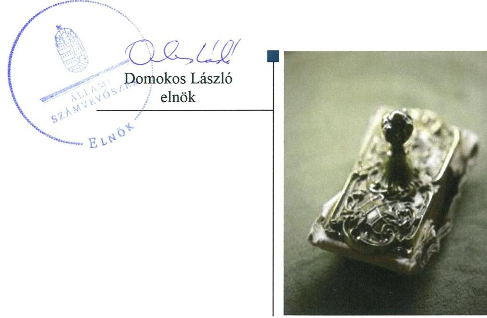
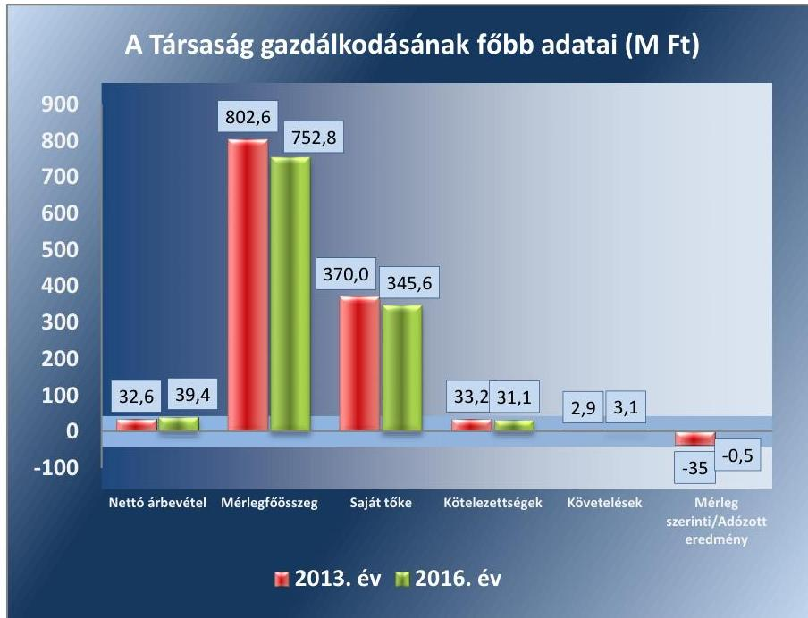
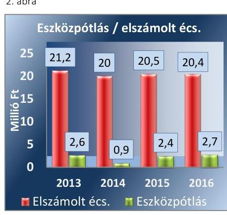
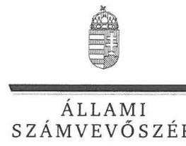
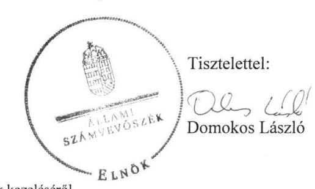
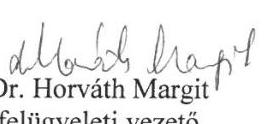

# Jelentés 

## Az önkormányzatok gazdasági társaságai

Az önkormányzatok többségi tulajdonában lévő gazdasági társaságok gazdálkodásának ellenőrzése - Észak-Balatoni Regionális Konferencia Központ Kereskedelmi és Szolgáltató Kft.
2018. június hó 12. nap

---

# AZ ELLENŐRZÉST FELÜGYELTE:

DR. HORVÁTH MARGIT felügyeleti vezető

# AZ ELLENŐRZÉST VEZETTE ÉS A VÉGREHAJTÁSÁÉRT FELELŐS:

GÖRGÉNYI GÁBOR ellenőrzésvezető

# A PROGRAM ÖSSZEÁLLÍTÁSÁÉRT FELELŐS:

TÓTPÁL SZABOLCS osztályvezető

IKTATÓSZÁM: EL-0217-036/2018.

TÉMASZÁM: 2447

ELLENŐRZÉS-AZONOSÍTÓ SZÁM: V079375

Jelentéseink az Országgyűlés számítógépes hálózatán és az Interneten a www.asz.hu címen is olvashatóak.

---

# TARTALOMJEGYZÉK 

■ ÖSSZEGZÉS ..... 5
■ AZ ELLENŐRZÉS CÉLJA ..... 6
■ AZ ELLENŐRZÉS TERÜLETE ..... 7
■ AZ ELLENŐRZÉS HÁTTERE, INDOKOLTSÁGA ..... 9
■ A JELENTÉS LÉNYEGES KÉRDÉSKÖREI ..... 10
■ AZ ELLENŐRZÉS HATÓKÖRE ÉS MÓDSZEREI ..... 11
■ MEGÁLLAPÍTÁSOK ..... 13
■ JAVASLATOK ..... 16
■ MELLÉKLETEK ..... 19
I. sz. melléklet: Értelmező szótár ..... 19
II. sz. melléklet: Pénzügyi adatok ..... 20
■ FÜGGELÉK: ÉSZREVÉTELEK ..... 21
■ RÖVIDÍTÉSEK JEGYZÉKE ..... 27

---

.

---

# ÖSSZEGZÉS 

Balatonfüred Város Önkormányzata a tulajdonosi joggyakorlás kereteit szabályszerűen alakította ki, a tulajdonosi jogait szabályszerűen gyakorolta a Társaság felett. Az Észak-Balatoni Regionális Konferencia Központ Kereskedelmi és Szolgáltató Kft. gazdálkodásának szabályozottsága megfelelt a jogszabályi előírásoknak, azonban a Társaság gazdálkodása és a vagyongazdálkodási tevékenysége nem volt szabályszerű. A Társaság a beszámolási kötelezettségének eleget tett, a személyzeti és gazdálkodási adatok közzétételi kötelezettségének azonban nem tett eleget.

## Az ellenőrzés társadalmi indokoltsága

Magyarországon az önkormányzatok kötelező és önként vállalt feladataik vonatkozásában is egyre szélesebb körben alkalmazzák a költségvetésen kívüli feladatellátást. Helyi szinten ennek legfontosabb szereplői az önkormányzati tulajdonban lévő gazdasági társaságok, amelyek ellenőrzése kiemelten fontos a közfeladat ellátása, a közvagyon megőrzése, megóvása érdekében.

Az Állami Számvevőszék kiemelt célja, hogy ellenőrzéseivel hozzájáruljon ahhoz, hogy a közpénzeket az államháztartáson kívül működő szervezetek is átlátható, rendezett módon használják fel.

Az Állami Számvevőszék céljaival és a társadalmi igénnyel összhangban, valamint a gazdasági társaságok kiemelt fontosságú szerepe miatt került sor az Észak-Balatoni Regionális Konferencia Központ Kereskedelmi és Szolgáltató Kft. ellenőrzésére.

Az Állami Számvevőszék által az Észak-Balatoni Regionális Konferencia Központ Kft-nél végzett ellenőrzést további társadalmi elvárás indokolja a feladatellátásából adódóan. Balatonfüred városában 2013-2016. között az Észak-Balatoni Regionális Konferencia Központ Kereskedelmi és Szolgáltató Kft. saját tulajdonú ingatlan bérbeadási, üzemeltetési feladatok mellett rendezvények szervezésével foglalkozott. Az Állami Számvevőszék az ellenőrzése során arra kereste a választ, hogy 2013-2016. között szabályszerű volt-e a Társaság gazdálkodása és az Önkormányzat Társaság feletti tulajdonosi joggyakorlása.

## Főbb megállapítások, következtetések, javaslatok

Balatonfüred Város Önkormányzatnál a tulajdonosi joggyakorlás kereteinek kialakítása és a Társaság feletti tulajdonosi jogok gyakorlása szabályszerű volt.

Az Észak-Balatoni Regionális Konferencia Központ Kereskedelmi és Szolgáltató Kft. gazdálkodásának szabályozottsága megfelelt a jogszabályi előírásoknak.

A Társaság gazdálkodási tevékenysége nem volt szabályszerű, mert a személyi jellegű ráfordítások elszámolása nem szabályszerűen történt a gazdasági események számviteli bizonylattal történő alátámasztásának hiányosságai, valamint a bizonylatok megőrzésére vonatkozó jogszabályi előírások megsértése miatt.

Az előírt beszámolási kötelezettségét a Társaság teljesítette, azonban a személyzeti és gazdálkodási adatokra vonatkozó közzétételi kötelezettségének nem tett eleget.

A Társaság vagyongazdálkodási tevékenysége a vagyonnyilvántartás hiányosságai miatt nem volt szabályszerű. A Társaság az éves beszámolóiban szerepeltetett vagyonelemek állományát leltárral alátámasztotta, azonban a számviteli törvényben és a belső szabályozásban foglaltak ellenére a nagy értékű tárgyi eszközök esetében nem végzett mennyiségi leltárfelvételt, azokat egyeztetéssel leltározta. A kis értékű tárgyi eszközök nyilvántartásba vétele során az üzembe helyezést hitelt érdemlően nem dokumentálta. A Társaság nem tett eleget a saját vagyon értékmegőrzési kötelezettségének sem.

---

# AZ ELLENŐRZÉS CÉLJA 

AZ ELLENŐRZÉS CÉLJA annak értékelése volt, hogy az önkormányzat vagyongazdálkodási tevékenysége során szabályszerűen gyakorolta-e tulajdonosi jogait; a gazdasági társaság szabályozottsága, gazdálkodása és vagyongazdálkodási tevékenysége, bevételeinek és ráfordításainak elszámolása megfelelt-e a jogszabályi és tulajdonosi előírásoknak; a gazdasági társaság kötelezettségállománya jelentett-e kockázatot a működésre; valamint a gazdálkodás átláthatósága és elszámoltathatósága biztosított volt-e.

---

# **AZ ELLENŐRZÉS TERÜLETE**

## **Balatonfüred Város Önkormányzata és a kizárólagos tulajdonában lévő Észak-Balatoni Regionális Konferencia Központ Kereskedelmi és Szolgáltató Kft.**

Balatonfüred Város Önkormányzata 2003. augusztus 19-től 100%-os tulajdonosa az Észak-Balatoni Regionális Konferencia Központ Kereskedelmi és Szolgáltató Kft.-nek. Az ellenőrzött időszakban a Polgármester¹ és a Jegyző² személyében nem történt változás.

A Társaság³ főtevékenysége – sportesemények, kulturális és céges rendezvények, valamint konferenciák céljára – saját tulajdonú ingatlan bérbeadása, üzemeltetése, valamint saját szervezésű rendezvények lebonyolítása volt. A Társaság által végzett tevékenységek nem minősültek a Mötv.⁴ 13. § előírásai szerinti közfeladatok körében ellátandó helyi önkormányzati feladatnak.

Az ellenőrzött időszakban az Ügyvezető⁵ személye nem változott. A Társaságnál az ellenőrzött időszakban háromtagú Felügyelőbizottság⁶, valamint választott könyvvizsgáló működött. A Társaságnál a foglalkoztatottak átlagos statisztikai létszáma 2013-ban 6 fő, a 2014-2016. években pedig 5 fő volt.

A Társaság 2013. és 2016. évi gazdálkodásának főbb adatait az 1. ábra, az éves beszámolók részletesebb adatait a II. sz. melléklet tartalmazza.

1. ábra

*Forrás: A Társaság 2013-2016. évi beszámolói*

---

Társaság jegyzett tőkéje 2013. január 1-jén 494,8 M Ft volt, melyet pénzbeli hozzájárulással 2013. február 20-án 522,3 M Ft-ra emelte az Önkormányzat⁷. A Társaság mérleg szerinti, illetve adózott eredménye az ellenőrzött időszakban negatív, így a gazdálkodása veszteséges volt.

Az Önkormányzatnak a Társaság tevékenységével kapcsolatban rendeletalkotási kötelezettsége nem volt. Az Önkormányzatnak a Társaság veszteséges gazdálkodásával kapcsolatban intézkedési kötelezettsége nem volt. A Társaság működéséhez és fejlesztési feladataihoz a 2013-2016. években 3,8 M Ft; 28,4 M Ft; 33,0 M Ft; 35,6 M Ft vissza nem térítendő működési- és céltámogatást nyújtott.

A Társaság az ellenőrzött időszakban nem rendelkezett más gazdasági társaságban tulajdonosi részesedéssel. A Társaság nem tartozott a kormányzati szektorba sorolt egyéb szervezetek körébe. A Társaság a Számv. tv.⁸ alapján nem volt önköltségszámításra kötelezett.

---

# AZ ELLENŐRZÉS HÁTTERE, INDOKOLTSÁGA 

AZ ÖNKORMÁNYZATOK TÖBBSÉGI TULAJDONÁBAN ÁLLÓ GAZDASÁGI TÁRSASÁGOK ellenőrzése kiemelten fontos a vagyon megőrzése, megóvása érdekében. A feladatellátás költségeinek, ráfordításainak alakulása a lakosság széles rétegét érinti.

Ellenőrzéseink feltárhatják, hogy az önkormányzat a feladatellátásához rendelt vagyon működtetését a tulajdonostól elvárható gondossággal végezte-e, a feladatot ellátó gazdasági társaság a létesítő okiratban, szolgáltatási szerződésben foglaltak betartásával biztosította-e a feladat ellátását. Az ellenőrzés eredményeképp meghatározhatóvá válnak a költségvetési hiányt befolyásoló szervezetek kockázatai, lehetővé válik ezen kockázatok csökkentése. Az ellenőrzés rávilágíthat arra, hogy a gazdasági társaság a vagyon használatával biztosította-e a szolgáltatás folytatásának feltételeit, az önkormányzat tulajdonosi felügyelete hozzájárult-e a szabályszerű gazdálkodáshoz és feladatellátáshoz. A megállapítások alapján megfogalmazott számvevőszéki javaslatok hasznosítása elősegítheti a meglévő hibák megszüntetését. A jó gyakorlatok bemutatásával az ÁSZ⁹ hozzájárulhat a követendő megoldások megismertetéséhez, terjesztéséhez.

---

# A JELENTÉS LÉNYEGES KÉRDÉSKÖREI 

1.- Az Önkormányzat tulajdonosi joggyakorlása szabályszerű volt-e?
2.- A Társaság szabályozottsága megfelelt-e a jogszabályi előírásoknak, a gazdálkodási tevékenysége szabályszerű volt-e?
3.- A Társaság vagyongazdálkodási tevékenysége szabályszerű volt-e?

---

# AZ ELLENŐRZÉS HATÓKÖRE ÉS MÓDSZEREI 

## Az ellenőrzés típusa

Megfelelőségi ellenőrzés

## Az ellenőrzött időszak

2013. január 1-jétől 2016. december 31-ig tartó időszak.

## Az ellenőrzés tárgya

Balatonfüred Város Önkormányzata 100%-os tulajdonában álló Észak-Balatoni Regionális Konferencia Központ Kereskedelmi és Szolgáltató Kft. feletti tulajdonosi joggyakorlása, valamint a Társaság gazdálkodásának szabályozottsága és szabályszerűsége.

Az ellenőrzés kiterjedt minden olyan körülményre és adatra, amely az ÁSZ jogszabályban meghatározott feladatainak teljesítéséhez, valamint a program végrehajtása folyamán felmerült újabb összefüggések feltárásához szükséges.

## Az ellenőrzött szervezet

Balatonfüred Város Önkormányzata, valamint az Észak-Balatoni Regionális Konferencia Központ Kereskedelmi és Szolgáltató Kft.

## Az ellenőrzés jogalapja

Az ellenőrzés jogszabályi alapját az Állami Számvevőszékről szóló 2011. évi LXVI. törvény 1. § (3) bekezdése és 5. § (3)-(5) bekezdései képezték.

## Az ellenőrzés módszerei

Az ellenőrzést a nemzetközi standardokat irányadónak tekintve az ellenőrzési program ellenőrzési kérdései, az ellenőrzött időszakban hatályos jogszabályok, az ellenőrzés szakmai szabályok és módszertanok figyelembe vételével végeztük.

Az ellenőrzés ideje alatt az ellenőrzött szervezettel történő kapcsolattartást az ÁSZ Szervezeti és Működési Szabályzatának vonatkozó előírásai alapján biztosítottuk.

---

Az ellenőrzési kérdések megválaszolásához szükséges bizonyítékok megszerzése a következő ellenőrzési eljárások alkalmazásával történt: megfigyelés, kérdésfeltevés (információkérés), összehasonlítás, valamint elemző eljárás. Az ellenőrzési bizonyítékként felhasználható adatforrások közé tartoztak egyrészt az ellenőrzési programban felsorolt adatforrások, másrészt adatforrás lehetett még minden - az ellenőrzés folyamán - feltárt, az ellenőrzés szempontjából információkat tartalmazó dokumentum. Az ellenőrzést a kérdésekre adott válaszok kiértékelésével, valamint a megjelölt adatforrások, a csatolt tanúsítványok felhasználásával, továbbá az adott időszakban hatályos jogszabályok figyelembe vételével folytattuk le.

A bevételek és ráfordítások elszámolását, és a vagyonnyilvántartás terén a szabályszerű működést véletlen mintavétellel ellenőriztük. A mintavétellel ellenőrzött területek esetében minden egyes tétel vonatkozásában szabályszerűségre vonatkozó kérdéseket tettünk fel, amelyek a számviteli törvény, illetve a tulajdonosi követelményeknek és az ellenőrzött szervezet belső szabályozásai előírásainak betartására vonatkoztak. A jogszabályoknak és a belső előírásoknak megfelelőnek tekintettük az adott területet, amennyiben a minta ellenőrzésének eredménye alapján 95%-os bizonyossággal a teljes sokaságban a hibaarány kisebb volt, mint 10%, nem megfelelőnek értékeltük, ha a hibaarány a 10%-ot meghaladta. A ráfordítások elszámolására és a vagyonnyilvántartásra vonatkozó véletlen mintavételt kockázati alapú kiválasztással egészítettük ki, amelynek során évente a három legnagyobb összegű tételt választottuk ki.

---

# 1. Az Önkormányzat tulajdonosi joggyakorlása szabályszerű volt-e? 

Összegző megállapítás Az Önkormányzat tulajdonosi joggyakorlása szabályszerű volt.

A TULAJDONOSI JOGGYAKORLÁS KERETEIT az Önkormányzat a vagyonrendeletében¹⁰, a Társasággal kötött támogatási szerződésekben¹¹, az Alapító okirat₁₋₆¹², valamint Társasági SZMSZ₁₋₃¹³ útján szabályszerűen alakította ki.

A Társaság Felügyelőbizottságát a Taktv.¹⁴ előírásai alapján hozta létre az Önkormányzat, tagjait a Képviselő-testület¹⁵ választotta meg. A Felügyelőbizottság a Gt.¹⁶ 34. § (4) bekezdésében, valamint a Ptk.¹⁷ 3:122. § (3) bekezdésében foglaltak ellenére nem állapította meg az ügyrendjét. A Felügyelőbizottság feladatait, beszámolási kötelezettségét az Alapító okirat₁₋₆ tartalmazta.

Az Önkormányzat megalkotta a Társaság Taktv. előírásainak megfelelő javadalmazási szabályzatát¹⁸.

A TULAJDONOSI JOGOK GYAKORLÁSA szabályszerű volt. Az Alapító¹⁹ a Gt. és a Ptk. előírásainak megfelelően a könyvvizsgáló és a Felügyelőbizottság írásbeli jelentései birtokában határozott a Társaság éves beszámolóinak elfogadásáról.

Az Alapító a Társasági SZMSZ₁₋₃-ban a kizárólagos hatáskörei között írta elő az éves üzleti terv jóváhagyását. A Társaság üzleti terveit, évközi beszámolóit, valamint a várható éves eredményét a Felügyelőbizottság és az Alapító megtárgyalta, határozataiban döntött azok jóváhagyásáról. Az Önkormányzat a Társaság vonatkozásában kialakított monitoring rendszert a jogszabályi előírásoknak megfelelően működtette.

Tulajdonosi ellenőrzést az Önkormányzat belső ellenőrzését ellátó Társulás²⁰ az Áht.²¹-ban biztosított lehetőségével élve a 2016. évben végzett a Társaságnál, amelyeknek a célja az Önkormányzat által nyújtott 2015. évi támogatás felhasználásának ellenőrzése volt. Az ellenőrzés javaslatai alapján a Társaság elkészítette intézkedési tervét, az abban foglaltak hasznosultak.

---

# 2. A Társaság szabályozottsága megfelelt-e
 a jogszabályi előírásoknak, a gazdálkodási tevékenysége szabályszerű volt-e? 

Összegző megállapítás

A Társaság szabályozottsága megfelelt a jogszabályi előírásoknak. A gazdálkodási tevékenység nem volt szabályszerű a személyi jellegű ráfordítások elszámolásának hiányosságai miatt. A személyzeti és gazdálkodási adatok közzétételi kötelezettségének a Társaság nem tett eleget.

A TÁRSASÁG SZABÁLYOZOTTSÁGA megfelelt a jogszabályi előírásoknak. A Társaság elkészítette a Számviteli politikát ${ }_{1,2,3}{ }^{22}$, illetve annak részeként a számlarendet, a bizonylati rendet, az eszközök és források értékelési szabályait, elkészítette továbbá a Pénzkezelési szabályzatot ${ }_{1-3}{ }^{23}$, amelyek megfeleltek a Számv. tv. előírásainak.

A leltározási szabályzat ${ }_{1,2}{ }^{24}$ a Számv. tv 69. § (3) bekezdésében foglalt legalább három év ellenére öt évben határozta meg az ingatlanok és a lealapozott gépek leltározási gyakoriságát. A további eszközök és források esetében a szabályzat megfelelt a jogszabályi előírásoknak.

## A SZEMÉLYI JELLEGŰ RÁFORDÍTÁSOK ELSZÁ-

MOLÁSA nem volt szabályszerű, a Számv. tv. 166. § (1)-(2) bekezdésében foglalt előírásokkal ellentétben a Társaság a bér és egyéb jövedelmek számviteli elszámolását nem támasztotta alá a meglévő bizonylat, annak adatai nem voltak helytállóak, mert a munkaszerződésekben rögzített alapbér összege és a számfejtett alapbér összege nem egyezett meg. Az Ügyvezető részére 2013-ban számfejtett cafetéria összege eltért a belső szabályozásban meghatározott kerettől. Egy foglalkoztatott esetében a Számv. tv. 169. § (2) bekezdésében előírt bizonylat (bérnyilvántartó lap) megőrzési kötelezettségének a Társaság nem tett eleget.

A BEVÉTELEK, AZ ANYAGJELLEGŰ ÉS EGYÉB RÁFORDÍTÁSOK ELSZÁMOLÁSA a Számv. tv. előírásainak megfelelően, szabályszerűen történt.

AZ ÉRTÉKCSÖKKENÉS ELSZÁMOLÁSA szabályszerű volt, megfelelt Számv. tv. és a belső szabályzatok előírásainak.

A TÁRSASÁG LEJÁRT KÖTELEZETTSÉGEI az Önkormányzat által nyújtott rövid lejáratú kölcsönökből és a szállítói kötelezettségekből tevődtek össze, amely 31,7 M Ft-ról 26,3 M Ft-ra - 16,9%-kal csökkent az ellenőrzött időszakban. Ezen belül a lejárt szállítói kötelezettségek állománya, 4,3 M Ft-ról 1,2 M Ft-ra - 72,1%-kal - csökkent.

A TERVEZÉSI, BESZÁMOLÁSI KÖTELEZETTSÉGÉT a Társaság teljesítette. Az üzleti terveit, a szakmai beszámolóit, valamint a Számv. tv. szerinti éves beszámolóit jóváhagyásra benyújtotta az Alapító részére. Az éves beszámolókat a Társaság a Számv. tv. előírásainak megfelelően letétbe helyezte és közzétette.

---

A KÖZÉRDEKBŐL NYILVÁNOS személyi és gazdálkodási adatokat a Társaság nem tette közzé a Taktv. 2. § (1)-(3) bekezdéseiben foglaltak ellenére.

# 3. A Társaság vagyongazdálkodási tevékenysége szabályszerű volt-e? 

Összegző megállapítás

2. ábra

A Társaság vagyongazdálkodási tevékenysége a vagyonnyilvántartás hiányosságai miatt nem volt szabályszerű.

A Z ÉVES BESZÁMOLÓK mérlegsorait a Társaság leltárral alátámasztotta, azonban a Számv. tv. 69. § (3) bekezdésében foglaltak ellenére mennyiségi leltárfelvételt az ingatlanok, egyéb berendezések, felszerelések esetében nem végzett.

A VAGYONNYILVÁNTARTÁS nem volt szabályszerű, mert a tárgyi eszközök nyilvántartásba vétele során a Számv. tv. 52. § (2) bekezdésében előírtak ellenére az üzembe helyezést a kis értékű tárgyi eszközök esetében hitelt érdemlően nem dokumentálták szabályszerű bizonylattal.

A SAJÁT VAGYON ÉRTÉKÉNEK MEGŐRZÉSE az Nvtv. ${ }^{25}$ 7. § (2) bekezdésében foglaltak ellenére nem volt biztosított, mert az évenként elszámolt értékcsökkenés minden évben meghaladta az eszközök felújítására, pótlására fordított összeget, amely a 2. ábrán látható.

---

# JAVASLATOK 

Az ÁSZ tv. 33. § (1) bekezdésében foglaltak értelmében az ellenőrzött szervezet vezetője köteles a jelentésben foglalt megállapításokhoz kapcsolódó intézkedési tervet összeállítani és azt a jelentés kézhezvételétől számított 30 napon belül az ÁSZ részére megküldeni. Amennyiben az ellenőrzött szervezet vezetője nem küldi meg határidőben az intézkedési tervet, vagy továbbra sem elfogadható intézkedési tervet küld, az Állami Számvevőszék elnöke az ÁSZ tv. 33. § (3) bekezdése a) és b) pontjaiban foglaltakat érvényesítheti.

Javaslataink célja az Észak-Balatoni Regionális Konferencia Központ Kereskedelmi és Szolgáltató Kft. gazdálkodása szabályszerűségének és gyakorlatának javítása annak érdekében, hogy a szabályozási környezet és az alkalmazott gyakorlat megfelelően tudja támogatni az átlátható működést.

## Észak-Balatoni Regionális Konferencia Központ Kereskedelmi és Szolgáltató Kft. ügyvezetőjének

1. Intézkedjen a leltározási szabályzat Számv. tv. előírásának megfelelő módosítására az ingatlanok és a lealapozott gépek leltározási gyakoriságára vonatkozóan.
(2. sz. megállapítás 2. bekezdése alapján)
2. Intézkedjen a személyi jellegű ráfordítások elszámolásának a Számv. tv. előírásainak megfelelő számviteli bizonylattal történő alátámasztásáról.
(2. sz. megállapítás 3. bekezdése alapján)
3. Intézkedjen az Taktv. szerinti közzétételi kötelezettség teljes körű teljesítéséről.
(2. sz. megállapítás 8. bekezdése alapján)
4. Intézkedjen az éves beszámoló mérlegének alátámasztása érdekében a nagy értékű tárgyi eszközök mennyiségi felvétellel történő leltározásának végrehajtásáról a leltározási szabályzatban és a Számv. tv.-ben meghatározottaknak megfelelően.
(3. sz. megállapítás 1. bekezdése alapján)

---

5. Intézkedjen a kis értékű tárgyi eszközök üzembe helyezésének dokumentálásáról a Számv. tv. előírásainak megfelelően.
(3. sz. megállapítás 2. bekezdése alapján)

# Javaslataink célja az Önkormányzat szabályszerű működésének elősegítése, továbbá az önkormányzati tulajdonosi joggyakorlás kontrolljainak erősítése. 

## Balatonfüred Város Önkormányzata polgármesterének

1. Kezdeményezze a Felügyelő Bizottság elnökénél a Felügyelő Bizottság ügyrendjének elkészítését és gondoskodjon annak alapítói jóváhagyása érdekében.
(1. sz. megállapítás 3. bekezdés 2. mondata alapján)
2. Intézkedjen
a) a leltározási szabályzat hiányossága,
b) a nagy értékű tárgyi eszközök mennyiségi felvétellel történő leltározásának hiánya,
c) a közzétételi kötelezettség teljesítésének hiányossága,
d) a személyi jellegű ráfordítások, a kis értékű tárgyi eszközök üzembe helyezése dokumentálásának hiányosságai,
miatti felelősség tisztázása érdekében, és szükség szerint intézkedjen a felelősség érvényesítéséről.
(2. sz. megállapítás 2. bekezdése, 2. számú megállapítás 4. bekezdése, 2. számú megállapítás 8. bekezdése, 3. megállapítás 1. bekezdése, 3. megállapítás 2. bekezdése alapján)

---

.

---

# MELLÉKLETEK 

- I. SZ. MELLÉKLET: ÉRTELMEZŐ SZÓTÁR
gazdasági társaság
gazdálkodó szervezet
kormányzati szektorba sorolt egyéb szervezet
nemzeti vagyon

Ptk. 3:88. § (1) bekezdése szerint „a gazdasági társaságok üzletszerű közös gazdasági tevékenység folytatására, a tagok vagyoni hozzájárulásával létrehozott, jogi személyiséggel rendelkező vállalkozások, amelyekben a tagok a nyereségből közösen részesednek, és a veszteséget közösen viselik".
A Ptk. 685. § c) pontja szerint gazdálkodó szervezet: „az állami vállalat, az egyéb állami gazdálkodó szerv, a szövetkezet, a lakásszövetkezet, az európai szövetkezet, a gazdasági társaság, az európai részvénytársaság, az egyesülés, az európai gazdasági egyesülés, az európai területi együttműködési csoportosulás, az egyes jogi személyek vállalata, a leányvállalat, a vízgazdálkodási társulat, az erdő birtokossági társulat, a végrehajtói iroda, az egyéni cég, továbbá az egyéni vállalkozó." (2014. 03.15-ig hatályos)
az Áht. 3. § (2) és (3) bekezdésében foglaltakon kívül az Európai Közösséget létrehozó szerződéshez csatolt, a túlzott hiány esetén követendő eljárásról szóló jegyzőkönyv alkalmazásáról szóló 2009. május 25-i 479/2009/EK rendelet (a továbbiakban: 479/2009/EK rendelet) szerint a kormányzati szektorba sorolt szervezet (Áht. 1. § (12))
Nvtv. 1. § (2) bekezdése szerint többek között:
„az állam vagy a helyi önkormányzat kizárólagos tulajdonában álló dolgok, az a) pont hatálya alá nem tartozó, állam vagy a helyi önkormányzat tulajdonában lévő dolog,
az állam vagy a helyi önkormányzat tulajdonában lévő pénzügyi eszközök, továbbá az államot vagy a helyi önkormányzatot megillető társasági részesedések, az államot vagy a helyi önkormányzatot megillető bármely vagyoni értékkel rendelkező jogosultság, amelyet jogszabály vagyoni értékű jogként nevesít."

---

# II. SZ. MELLÉKLET: PÉNZÜGYI ADATOK

## AZ ÉSZAK-BALATONI REGIONÁLIS KONFERENCIA KÖZPONT KERESKEDELMI ÉS SZOLGÁLTATÓ KFT. ÉVES BESZÁMOLÓINAK ADATAI (M FT)

|  Mérleg | 2013.01.01. | 2013.12.31. | 2014.12.31. | 2015.12.31. | 2016.12.31.  |
| --- | --- | --- | --- | --- | --- |
|  A. Befektetett eszközök | 817,4 | 798,7 | 779,4 | 761,1 | 747,1  |
|  I. IMMATERIÁLIS JAVAK | 0 | 0 | 0 | 0 | 0  |
|  II. TÁRGYI ESZKÖZÖK | 817,4 | 798,7 | 779,4 | 761,1 | 747,1  |
|  III. BEFEKTETETT PÉNZÜGYI ESZKÖZÖK | 0 | 0 | 0 | 0 | 0  |
|  B. Forgóeszközök | 3,7 | 3,1 | 3,9 | 2,3 | 3,6  |
|  I. KÉSZLETEK | 0 | 0 | 0 | 0 | 0  |
|  II. KÖVETELÉSEK | 3,0 | 2,9 | 3,6 | 2,0 | 3,1  |
|  III. ÉRTÉKPAPÍROK | 0 | 0 | 0 | 0 | 0  |
|  IV. PÉNZESZKÖZÖK | 0,7 | 0,2 | 0,3 | 0,3 | 0,5  |
|  C. Aktív időbeli elhatárolások | 0,6 | 0,8 | 0,5 | 1,2 | 2,1  |
|  ESZKÖZÖK ÖSSZESEN | 821,7 | 802,6 | 783,8 | 764,6 | 752,8  |
|  D. Saját tőke | 377,5 | 370,0 | 359,7 | 346,1 | 345,6  |
|  I. JEGYZETT TŐKE | 494,8 | 522,3 | 522,3 | 522,3 | 522,3  |
|  II. JEGYZETT, DE MÉG BE NEM FIZETETT TŐKE (-) | 0 | 0 | 0 | 0 | 0  |
|  III. TÖKETARTALÉK | 0 | 0 | 0 | 0 | 0  |
|  IV. EREDMÉNYTARTALÉK | $-182,8$ | $-221,4$ | $-256,4$ | $-266,7$ | $-280,3$  |
|  V. LEKÖTÖTT TARTALÉK | 104,1 | 104,1 | 104,1 | 104,1 | 104,1  |
|  VI. ÉRTÉKELÉSI TARTALÉK | 0 | 0 | 0 | 0 | 0  |
|  VII. MÉRLEG SZERINTI EREDMÉNY | $-38,6$ | $-35,0$ | $-10,3$ | $-13,6$ | $-0,5$  |
|  E. Céltartalékok | 0 | 0 | 0 | 0 | 0  |
|  F. Kötelezettségek | 35,7 | 33,2 | 33,5 | 34,8 | 31,1  |
|  I. HÁTRASOROLT KÖTELEZETTSÉGEK | 0 | 0 | 0 | 0 | 0  |
|  II. HOSSZÚ LEJÁRATÚ KÖTELEZETTSÉGEK | 0 | 0 | 0 | 0 | 0  |
|  III. RÖVID LEJÁRATÚ KÖTELEZETTSÉGEK | 35,7 | 33,2 | 33,5 | 34,8 | 31,1  |
|  G. Passzív időbeli elhatárolások | 408,5 | 399,4 | 390,6 | 383,7 | 376,1  |
|  FORRÁSOK ÖSSZESEN | 821,7 | 802,6 | 783,8 | 764,6 | 752,8  |
|  Eredménykimutatás |  | 2013. év | 2014. év | 2015. év | 2016. év  |
|  Értékesítés nettó árbevétele | - | 32,6 | 29,9 | 30,5 | 39,4  |
|  Egyéb bevételek | - | 3,5 | 27,6 | 29,4 | 42,4  |
|  Anyagjellegű ráfordítások | - | 43,1 | 42,8 | 45,2 | 44,3  |
|  Személyi jellegű ráfordítások | - | 15,6 | 15,9 | 16,4 | 16,6  |
|  Értékcsökkenési leírás | - | 21,2 | 20,2 | 20,6 | 20,8  |
|  Egyéb ráfordítások | - | 0,6 | 0,6 | 0,8 | 0,5  |
|  Üzemi tevékenység eredménye | - | $-44,4$ | $-22,0$ | $-23,1$ | $-0,4$ 
 |
|  Mérleg szerinti eredmény/adózott eredmény* | - | $-35,0$ | $-10,3$ | $-13,6$ | $-0,5$  |

- A 2013-2015. években az adózott eredmény és a mérleg szerinti eredmény megegyezett. A Számv. tv. 2015. július 4-től hatályos módosítása alapján a mérleg szerinti eredmény tétel megszűnt. A 2016. évi éves beszámoló eredménykimutatásában az adózott eredmény levezetését kellett kimutatni.

---

# FÜGGELÉK: ÉSZREVÉTELEK 

A jelentéstervezetet a Számvevőszék 15 napos észrevételezésre megküldte az ellenőrzött szervezetek vezetőinek az ÁSZ tv. 29. § (1) bekezdése előírásának megfelelően.

A jelentés függeléke tartalmazza az Észak-Balatoni Regionális Konferencia Központ Kereskedelmi és Szolgáltató Kft. ügyvezetője észrevételeit és azok kezeléséről szóló válaszlevelet. Balatonfüred Város Önkormányzatának polgármestere a jelentéstervezettel kapcsolatban nem tett észrevételt.

[^0]
[^0]:    * 29. § (1) Az Állami Számvevőszék az ellenőrzési megállapításait megküldi az ellenőrzött szervezet vezetőjének vagy az általa megbízott személynek, és annak, akinek személyes felelősségét állapította meg.
    (2) Az ellenőrzött szervezet vezetője és a felelősként megjelölt személy az ellenőrzés megállapításaira tizenöt napon belül írásban észrevételt tehet.
    (3) Az Állami Számvevőszék az észrevételre a beérkezésétől számított harminc napon belül írásban válaszol. A figyelembe nem vett észrevételeket köteles a jelentésben feltüntetni, és megindokolni, hogy azokat miért nem fogadta el.

---

# Észak-Balatoni Regionális Konferencia Központ Kft. 

## Állami Számvevőszék Budapest

Tisztelt Számvevőszék!

Ikt.sz. 120180515
Tárgy: Észrevétel Számvevőszéki jelentés tervezetre

## Állami Számvevőszék

ÜGYVITELI IRODA
2E - $28477 / 40811$
20180515

Alulírott Majer Tamás, mint az Észak-Balatoni Regionális Konferencia Központ Kft. ügyvezetője az alábbi észrevételeket teszem az EL-0476-027/2018 sz. levelének mellékletét képező Számvevőszéki jelentés tervezetre:

## 1.) A Társaság szabályozottsága:

-A leltározási szabályzatban valóban tévesen állapította meg a társaság az ingatlanok és lealapozott gépek leltározásának idejét, mennyiségi leltárfelvételt nem készített, de a mennyiségi számbavétel évente megtörtént egyeztetéssel.
-Kisértékű tárgyi eszközök állományba helyezése vegyes bizonylat alapján történik és felvezetésre került a kisértékű eszközök nyilvántartásába.

## 2.) Személyi jellegű ráfordítások elszámolása:

- A társaság bér és személyi jövedelem elszámolásának hiányosságait a Számvevőszéki jelentés tervezet nem részletezte, így konkrét adatok hiányában nem tud a Kft. érdemben reagálni.
- Cafetéria elszámolása 2013 évben az ügyvezető részére meghaladta 40.000 Ft-tal a szabályzat alapján adható SZÉP-kártya keretet, mely visszafizetését a 2014 évi keret csökkentésével rendezte a társaság.
-Kérjük a konkrét információt dolgozó személyére ill. az évre vonatkozóan, annak érdekében, hogy a bérnyilvántartó lapot pótolni tudja a Kft.
3.) A Számvevőszéki jelentés tervezet szerint a Társaság közérdekből nyilvános személyi és gazdálkodási adatokat nem tett közzé. A Társaság 2009. év óta minden év elején gondoskodik a közzétételi szabályzatban foglalt kötelezettségéről a társaság www.balatonkozpont.hu honlapján „közzététel" menüpont alatt a honlap alsó felében.
4.) A saját vagyon értékének megőrzését a Társaság nem tudja teljesíteni a sajátos finanszírozása miatt, mert olyan mértékű saját bevételekkel nem rendelkezik, mely biztosítaná erre a fedezetet, a Tulajdonostól pedig nem kap ilyen arányban juttatást.

Balatonfüred, 2018. május 15.

Tisztelettel:

Észak-Balatoni Regionális Konferencia Központ KFT
0230 Balatonfüred, Horváth M. u. 08/2 hrsz.
Adószám: 11670683-2-19
Tel: +3687480106
Majer Tamás
ügyvezető

---

ELNÖK

Ikt.szám: EL-0476-033/2018.

# Majer Tamás úr 

ügyvezető

Észak-Balatoni Regionális Konferencia Központ Kereskedelmi és Szolgáltató Kft.

## Balatonfüred

## Tisztelt Ügyvezető Úr!

Köszönettel vettem „Az önkormányzatok gazdasági társaságai - Az önkormányzatok többségi tulajdonában lévő gazdasági társaságok gazdálkodásának ellenőrzése - Észak-Balatoni Regionális Konferencia Központ Kereskedelmi és Szolgáltató Kft." címmel készített számvevőszéki jelentéstervezetre megküldött észrevételét.
Az Állami Számvevőszék észrevételre vonatkozó álláspontját a felügyeleti vezető által készített részletes tájékoztatás tartalmazza, amelyet levelemhez mellékeltem.
Tájékoztatom Ügyvezető urat, hogy az Állami Számvevőszék a figyelembe nem vett észrevételeket az Állami Számvevőszékről szóló 2011. évi LXVI. törvény 29. § (3) bekezdésében előírtak szerint köteles a jelentésében feltüntetni és megindokolni, hogy azokat miért nem fogadta el.

Budapest, 2018. június
hó 20. nap

Melléklet: Tájékoztatás az észrevételek kezeléséről

---

# Tájékoztatás az észrevételek kezeléséről 

Megköszönöm Ügyvezető úrnak „Az önkormányzatok gazdasági társaságai - Az önkormányzatok többségi tulajdonában lévő gazdasági társaságok gazdálkodásának ellenőrzése - Észak-Balatoni Regionális Konferencia Központ Kereskedelmi és Szolgáltató Kft." címmel készített jelentéstervezetre tett észrevételeit. Az észrevételek kezeléséről az alábbi tájékoztatást adom.

## 1. számú észrevétel:

Az 1. számú észrevétel a jelentéstervezet a 2. számú megállapítás 2. bekezdését, a 3. számú megállapítás 1-2. bekezdéseit, valamint az ügyvezetőnek címzett 1. és 4-5. számú javaslatokat érintette.

## ,, 1.) A Társaság szabályozottsága:

-A leltározási szabályzatban valóban tévesen állapította meg a társaság az ingatlanok és lealapozott gépek leltározásának idejét, mennyiségi leltárfelvételt nem készített, de a mennyiségi számbavétel évente megtörtént egyeztetéssel.

- Kis értékű tárgyi eszközök állományba helyezése vegyes bizonylat alapján történik és felvezetésre került a kis értékű eszközök nyilvántartásába."
Ügyvezető úr észrevételének első részében arról tájékoztatott, hogy a leltározási szabályzat azt a hiányosságot hordozza, amit a jelentéstervezet is rögzített. Igazolja továbbá a jelentéstervezetnek a mennyiségi leltárfelvétel hiányával kapcsolatos megállapítását. Erre tekintettel a jelentéstervezet 2. számú megállapítás 2. bekezdését, a 3. számú megállapítás 1. bekezdését, valamint az ügyvezetőnek címzett 1. és 4. számú javaslatot nem módosítom.

Az észrevétel második részében, a kis értékű tárgyi eszközök nyilvántartásba vételével kapcsolatban tájékoztatom Ügyvezető urat, hogy e területen a szabályszerű működést véletlen mintavétellel ellenőriztük. A mintavétellel ellenőrzött területek esetében minden egyes tétel vonatkozásában a szabályszerűségre vonatkozó kérdéseket tettünk fel, amelyek eredményét összesítettük. Megfelelőnek értékeltünk egy ellenőrzött területet, amennyiben 95%-os bizonyossággal a teljes sokaságban az átlagos hibaarány legfeljebb 10%, nem megfelelőnek, amennyiben 10%-nál magasabb arányt képviselt. A Társaság által az ellenőrzés számára rendelkezésre bocsátott mintatételek esetében a fenti eljárás alapján a kis értékű tárgyi eszközök nyilvántartásba vételével kapcsolatban olyan nagyságrendű hiányos dokumentálást - előfordult az üzembe helyezési jegyzőkönyvek hiánya, egyedi nyilvántartó lapokon az eszköz egyedi nyilvántartásához hozzárendelt nyilvántartási szám hiánya - találtunk, amely szerint a 3. számú megállapítás 2. bekezdésében rögzítetteknek megfelelően a vagyonnyilvántartás elszámolása nem minősült szabályszerűnek. Erre tekintettel a jelentéstervezet a 3. számú megállapítás 2. bekezdését, valamint az ügyvezetőnek címzett 5. számú javaslatot nem módosítom.

## 2. számú észrevétel:

A 2. számú észrevétel a jelentéstervezet a 2. számú megállapítás 3. bekezdését, valamint az ügyvezetőnek címzett 2. számú javaslatot érintette.

---

# „2.) Személyi jellegű ráfordítások elszámolása: 

- A társaság bér és személyi jövedelem elszámolásának hiányosságait a Számvevőszéki jelentés tervezet nem részletezte, így konkrét adatok hiányában nem tud a Kft. érdemben reagálni. - Cafetéria elszámolása 2013 évben az ügyvezető részére meghaladta 40.000 Ft-tal a szabályzat alapján adható SZÉP-kártya keretet, mely visszafizetését a 2014 évi keret csökkentésével rendezte a társaság.
- Kérjük a konkrét információt dolgozó személyére ill. az évre vonatkozóan, annak érdekében, hogy a bérnyilvántartó lapot pótolni tudja a Kft."

Ügyvezető úr észrevételében leírtak alapján a jelentéstervezet a 2. számú megállapítás 3. bekezdését, valamint az ügyvezetőnek címzett 2. számú javaslatot nem módosítom az alábbiak miatt:

Az észrevételben hivatkozott személyi jellegű ráfordítások elszámolása esetében a szabályszerű működést véletlen mintavétellel ellenőriztük. A mintavétellel ellenőrzött területek esetében minden egyes tétel vonatkozásában a szabályszerűségre vonatkozó kérdéseket tettünk fel, amelyek eredményét összesítettük. Megfelelőnek értékeltünk egy ellenőrzött területet, amennyiben 95%-os bizonyossággal a teljes sokaságban az átlagos hibaarány legfeljebb 10%, nem megfelelőnek, amennyiben 10%-nál magasabb arányt képviselt. A Társaság által az ellenőrzés számára rendelkezésre bocsátott mintatételek esetében a fenti eljárás alapján olyan nagyságrendű hiányos dokumentálást találtunk, amely szerint a 2. számú megállapítás 3. bekezdésében rögzítetteknek megfelelően a személyi jellegű ráfordítások elszámolása, nem minősült szabályszerűnek. A személyi jellegű ráfordítások elszámolásának hiányossága túlnyomórészt abból adódott, hogy a mintatételek dokumentumai nem tartalmazták a könyvelés módjára, és az érintett könyvviteli számlákra történő hivatkozást, előfordult, hogy nem állt rendelkezésre bérnyilvántartó lap, illetve egyes munkaszerződésekben rögzített alapbér és a számfejtett alapbér eltért egymástól. Így az észrevétel első és harmadik részéhez illeszkedően a jelentéstervezet megállapításai megalapozottak, azt nem módosítom.

Az észrevétel második részében az ügyvezető Cafetéria elszámolásával kapcsolatban jelzett eljárást tudomásul veszem. A jelentéstervezetet nem módosítom, tekintettel arra, hogy az ÁSZ a megállapításait a Társaság által az előírt adatszolgáltatási határidőre az ellenőrzés rendelkezésére bocsátott dokumentumok, adatok, információk alapján tette meg. Az észrevételben jelzett eljárás végrehajtásáról az ellenőrzést végzők nem tudtak meggyőződni, ezért az ellenőrzési dokumentumként nem vehető figyelembe.

## 3. számú észrevétel:

A 3. számú észrevétel a jelentéstervezet 2. számú megállapítás 8. bekezdését, valamint az ügyvezetőnek címzett 3. számú javaslatot érintette.
„3.) A Számvevőszéki jelentés tervezet szerint a Társaság közérdekből nyilvános személyi és gazdálkodási adatokat nem tett közzé. A Társaság 2009. év óta minden év elején gondoskodik a közzétételi szabályzatban foglalt kötelezettségéről a társaság www.balatonkozpont.hu honlapján „közzététel" menüpont alatt a honlap alsó felében."
Ügyvezető úr észrevételében leírtak alapján a jelentéstervezet 2. számú megállapítás 8. bekezdését, valamint az ügyvezetőnek címzett 3. számú javaslatot nem módosítom az alábbiak miatt:

---

Az ÁSZ az ellenőrzött időszakra vonatkozó megállapításait a Társaság által az előírt adatszolgáltatási határidőre az ellenőrzés rendelkezésére bocsátott dokumentumok, adatok, információk alapján tette meg. A jelen észrevételben jelzettetek az ellenőrzött időszakot követően, a 2018. évben közzétett adatokra utalnak, ezért azok ellenőrzési dokumentumként nem vehetők figyelembe.

# 4. számú észrevétel: 

A 4. számú észrevétel a jelentéstervezet 3. számú megállapítás 3. bekezdését érintette, javaslathoz nem kapcsolódott.
„4.) A saját vagyon értékének megőrzését a Társaság nem tudja teljesíteni a sajátos finanszírozása miatt, mert olyan mértékű saját bevételekkel nem rendelkezik, mely biztosítaná erre a fedezetet, a Tulajdonostól pedig nem kap ilyen arányban juttatást. "

Ügyvezető úr észrevétele tájékoztatást ad a vagyonvesztés okáról, a jelentéstervezet megállapítását nem vitatja. Így a megállapítás továbbra is helytálló, a jelentéstervezetet nem módosítom.

Budapest, 2018. június hó 8. nap

---

# RÖVIDÍTÉSEK JEGYZÉKE 

${ }^{1}$ Polgármester
${ }^{2}$ Jegyző
${ }^{3}$ Társaság
${ }^{4}$ Mötv.
${ }^{5}$ Ügyvezető
${ }^{6}$ Felügyelőbizottság
${ }^{7}$ Önkormányzat
${ }^{8}$ Számv. tv.
${ }^{9}$ ÁSZ
${ }^{10}$ vagyonrendelet
${ }^{11}$ támogatási szerződések
${ }^{12}$ Alapító okirat1-6
${ }^{13}$ Társasági SZMSZ ${ }_{1-3}$
${ }^{14}$ Taktv.
${ }^{15}$ Képviselő-testület
${ }^{16}$ Gt.
${ }^{17}$ Ptk.
${ }^{18}$ javadalmazási szabályzat
${ }^{19}$ Alapító

Balatonfüred Város Önkormányzatának polgármestere
Balatonfüred Város Önkormányzatának jegyzője
Észak-Balatoni Regionális Konferencia Központ Kereskedelmi és Szolgáltató Kft.
2011. évi CLXXXIX. törvény Magyarország helyi önkormányzatairól (hatályos 2012. január 1-jétől)
Észak-Balatoni Regionális Konferencia Központ Kereskedelmi és Szolgáltató Kft. ügyvezetője
Észak-Balatoni Regionális Konferencia Központ Kereskedelmi és Szolgáltató Kft. Felügyelőbizottsága
Balatonfüred Város Önkormányzata
a számvitelről szóló 2000. évi C. törvény (hatályos: 2001. január 1-től)
Állami Számvevőszék
Balatonfüred Város Önkormányzat Képviselő-testületének 17/2012. (III. 5.) rendelete az önkormányzat vagyonáról (hatályos 2012. március 5-étől)
Balatonfüred Város Önkormányzata és az Észak-Balatoni Regionális Konferencia Központ Kereskedelmi és Szolgáltató Kft. között 2013. január 1. és 2016. december 31. között létrejött támogatási szerződések (összesen 14 db)

Észak-Balatoni Regionális Konferencia Központ Kereskedelmi és Szolgáltató Kft. alapító okirata (hatályos: 2012. április 16-tól)
Észak-Balatoni Regionális Konferencia Központ Kereskedelmi és Szolgáltató Kft. alapító okirata (hatályos: 2013. január 22-tól)
Észak-Balatoni

 Regionális Konferencia Központ Kereskedelmi és Szolgáltató Kft. alapító okirata (hatályos: 2013. február 20-tól)
Észak-Balatoni Regionális Konferencia Központ Kereskedelmi és Szolgáltató Kft. alapító okirata (hatályos: 2014. január 23-tól)
Észak-Balatoni Regionális Konferencia Központ Kereskedelmi és Szolgáltató Kft. alapító okirata (hatályos: 2015. március 23-tól)
Észak-Balatoni Regionális Konferencia Központ Kereskedelmi és Szolgáltató Kft. alapító okirata (hatályos: 2016. január 7-től)
Észak-Balatoni Regionális Konferencia Központ Kereskedelmi és Szolgáltató Kft. Szervezeti és Működési Szabályzata (hatályos: 2008. november 24-től)
Észak-Balatoni Regionális Konferencia Központ Kereskedelmi és Szolgáltató Kft. Szervezeti és Működési Szabályzata (hatályos: 2014. január 2-től)
Észak-Balatoni Regionális Konferencia Központ Kereskedelmi és Szolgáltató Kft. Szervezeti és Működési Szabályzata (hatályos: 2016. június 6-tól)
2009. évi CXXII. törvény a köztulajdonban álló gazdasági társaságok takarékosabb működéséről (hatályos: 2009. december 4-től)
Balatonfüred Város Önkormányzatának Képviselő-testülete
2006. évi IV. törvény a gazdasági társaságokról (hatálytalan: 2014. március 15-étől)
2013. évi V. törvény a Polgári Törvénykönyvről (hatályos: 2014. március 15-étől)

Észak-Balatoni Regionális Konferencia Központ Kereskedelmi és Szolgáltató Kft. javadalmazási szabályzata (hatályos: 2011. június 9-től)
Balatonfüred Város Önkormányzata

---

${ }^{20}$ Társulás
${ }^{21}$ Áht.
${ }^{22}$ számviteli politika $_{1,2,3}$
${ }^{23}$ Pénzkezelési szabályzat ${ }_{1-3}$
${ }^{24}$ leltározási szabályzat ${ }_{1,2}$
${ }^{25}$ Nvtv. Balatonfüredi Többcélú Társulás
2011. évi CXCV. törvény az államháztartásról (hatályos: 2011. december 31-től)
Észak-Balatoni Regionális Konferencia Központ Kereskedelmi és Szolgáltató Kft. számviteli politikája (hatályos: 2012. január 1-től)
Észak-Balatoni Regionális Konferencia Központ Kereskedelmi és Szolgáltató Kft. számviteli politikája (hatályos: 2014. január 1-től)
Észak-Balatoni Regionális Konferencia Központ Kereskedelmi és Szolgáltató Kft. számviteli politikája (hatályos: 2016. március 23-tól)
Észak-Balatoni Regionális Konferencia Központ Kereskedelmi és Szolgáltató Kft. PÉNZKEZELÉSI SZABÁLYZAT ${ }_{1}$ 2013 (hatályos: 2013. január 1-től)
Észak-Balatoni Regionális Konferencia Központ Kereskedelmi és Szolgáltató Kft. PÉNZKEZELÉSI SZABÁLYZAT ${ }_{2}$ 2016 (hatályos: 2016. január 1-től)
Észak-Balatoni Regionális Konferencia Központ Kereskedelmi és Szolgáltató Kft. PÉNZKEZELÉSI SZABÁLYZAT ${ }_{3}$ 2016.06.02. (hatályos: 2016. június 2-től)
Észak-Balatoni Regionális Konferencia Központ Kereskedelmi és Szolgáltató Kft. leltározási szabályzata (hatályos: 2012. január 1-től)
Észak-Balatoni Regionális Konferencia Központ Kereskedelmi és Szolgáltató Kft. leltározási szabályzata (hatályos: 2016. január 1-től)
2011. évi CXCVI. törvény a nemzeti vagyonról (hatályos: 2011. december 31-től)

---

ÁLLAMI SZÁMVEVŐSZÉK
1052 Budapest, Apáczai Csere János utca 10.
Levélcím: 1364 Budapest 4. Pf. 54
Telefon: +36 14849100 Telefax: +36 14849200
www.asz.hu
