# Jelentés 

## Állami tulajdonú gazdasági társaságok

Az állami tulajdonban lévő gazdálkodó szervezetek vagyonmegőrzési és gazdálkodási tevékenységének ellenőrzése Kincsem Nemzeti Lóverseny és Lovas Stratégiai Kft.
2018.

---

# Jelentés 

## Állami tulajdonú gazdasági társaságok

Az állami tulajdonban lévő gazdálkodó szervezetek vagyonmegőrzési és gazdálkodási tevékenységének ellenőrzése Kincsem Nemzeti Lóverseny és Lovas Stratégiai Kft.
2018.  július hó 10. nap
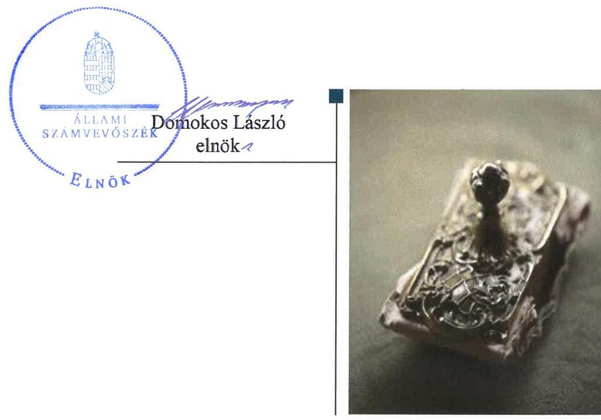

---

# AZ ELLENŐRZÉST FELÜGYELTE:

DR. HORVÁTH MARGIT felügyeleti vezető

## AZ ELLENŐRZÉST VEZETTE ÉS A VÉGREHAJTÁSÁÉRT FELELŐS:

- JOÓ ERIKA ellenőrzésvezető
- A PROGRAM ÖSSZEÁLLÍTÁSÁÉRT FELELŐS:
- JANIK JÓZSEF osztályvezető

**IKTATÓSZÁM:** EL-0428-030/2018

**TÉMASZÁM:** 2390

**ELLENŐRZÉS-AZONOSÍTÓ SZÁM:** V-075927

Jelentéseink az Országgyűlés számítógépes hálózatán és az Interneten a www.asz.hu címen is olvashatóak.

---

# TARTALOMJEGYZÉK 

■ ÖSSZEGZÉS ..... 5
■ AZ ELLENŐRZÉS CÉLJA ..... 6
■ AZ ELLENŐRZÉS TERÜLETE ..... 7
■ AZ ELLENŐRZÉS HÁTTERE, INDOKOLTSÁGA ..... 10
■ A JELENTÉS LÉNYEGES KÉRDÉSKÖREI ..... 11
■ ELLENŐRZÉS HATÓKÖRE ÉS MÓDSZEREI ..... 12
■ MEGÁLLAPÍTÁSOK ..... 14
■ JAVASLATOK ..... 22
■ MELLÉKLETEK ..... 25
I. sz. melléklet: Értelmező szótár ..... 25
II. sz. melléklet: A Társaság mérleg és eredménykimutatás adatainak változása (adatok millió Ft) ..... 29
■ FÜGGELÉK: ÉSZREVÉTELEK ..... 31
■ RÖVIDÍTÉSEK JEGYZÉKE ..... 47

---

.

---

# ÖSSZEGZÉS 

A Kincsem Nemzeti Lóverseny és Lovas Stratégiai Kft. feletti tulajdonosi jogokat 2014. július 15-ig a Magyar Fejlesztési Bank Zrt., azt követően a Magyar Nemzeti Vagyonkezelő Zrt. szabályszerűen gyakorolta. A Társaság működésének szabályozottsága nem felelt meg az előírásoknak. A bevételek és ráfordítások elszámolása - a személyi jellegű ráfordítások kivételével - szabályszerű volt. A beszámolási, adatszolgáltatási és a közzétételi kötelezettségek teljesítése az előírásoknak megfelelt. A vagyongazdálkodás a vagyonkezelt vagyon tekintetében nem volt szabályszerű.

## Az ellenőrzés társadalmi indokoltsága

Az Állami Számvevőszék a stratégiáját megvalósítva ellenőrzéseivel segíti az átláthatóságot és az elszámoltathatóságot a közpénzekkel, a közvagyonnal való gazdálkodásban. Ellenőrzési témaválasztása során kiemelt figyelmet fordít a korábban ellenőrizetlen területekre.

Ellenőrzési tervének megfelelően a 2012-2015 közötti ellenőrzött időszakra az Állami Számvevőszék folytatja az állami tulajdonban (résztulajdonban) lévő gazdálkodó szervezetek vagyonmegőrzési és gazdálkodási tevékenységének ellenőrzését.

Az állami tulajdonú gazdasági társaságok a nemzeti vagyon részei. A Nemzeti Lovas Program megvalósításának érdekében a szükséges feltételrendszer kialakításához az Állami Számvevőszék ellenőrzésének megállapításai, javaslatai is hozzájárulhatnak. A nemzeti hagyományok megőrzésében egyedülálló tevékenységet végző gazdasági társaság ellenőrzésének megállapításai közérdeklődésre tarthatnak számot.

## Főbb megállapítások, következtetések, javaslatok

A Kincsem Nemzeti Lóverseny és Lovas Stratégiai Kft. felett 2014. július 15-éig a Magyar Fejlesztési Bank Zrt., azt követően a Magyar Nemzeti Vagyonkezelő Zrt. szabályszerűen gyakorolta a tulajdonosi jogokat. A felügyelőbizottság megalakítása és működése, az üzleti tervek és az éves beszámolók elfogadása megfelelt az előírásoknak.

A Kincsem Nemzeti Lóverseny és Lovas Stratégiai Kft. által elkészített szabályzatok a jogszabályi előírások ellenére a vagyonkezelt vagyon vonatkozásában nem tartalmaztak előírásokat. A jogszabályi előírások ellenére önköltségszámítási szabályzatot nem készítettek és a versenyszervezési és bérleti díjakat önköltségszámítással nem támasztották alá. A bevételek és ráfordítások számviteli elszámolása - a vezető tisztségviselők járandósága elszámolásának kivételével - a jogszabályi előírásoknak és a belső szabályzatoknak megfelelő volt.

A beszámolási és adatszolgáltatási kötelezettségeinek a Társaság a jogszabályokban és a tulajdonosi joggyakorlók előírásainak megfelelően szabályszerűen eleget tett, közzétételi kötelezettségeit a jogszabályi előírásoknak megfelelően teljesítette.

A Kincsem Nemzeti Lóverseny és Lovas Stratégiai Kft. vagyonnyilvántartása a vagyonkezelt vagyon tekintetében nem volt szabályszerű, mert tételes adatokat nem tartalmazott, valamint a 2015. éves beszámoló mérlegében vagyonkezelésből kikerült ingatlan is szerepelt.

---

# AZ ELLENŐRZÉS CÉLJA 

Az ellenőrzés célja annak értékelése volt, hogy a tulajdonosi jogok gyakorlása szabályszerű volt-e; a gazdálkodó szervezet szabályozottsága, gazdálkodása és vagyongazdálkodási tevékenysége megfelelt-e a jogszabályi és a tulajdonosi előírásoknak; biztosítva volt-e a közfeladatok átláthatósága és elszámoltathatósága érdekében a közszolgáltatás díjának megalapozottsága szabályszerű önköltségszámítással; a vagyonváltozást eredményező döntések esetében a tulajdonosi jogok gyakorlója és a gazdálkodó szervezet szabályszerűen jártak-e el.

---

# AZ ELLENŐRZÉS TERÜLETE 

## Kincsem Nemzeti Lóverseny és Lovas Stratégiai Kft., a Magyar Fejlesztési Bank Zrt. és a Magyar Nemzeti Vagyonkezelő Zrt.

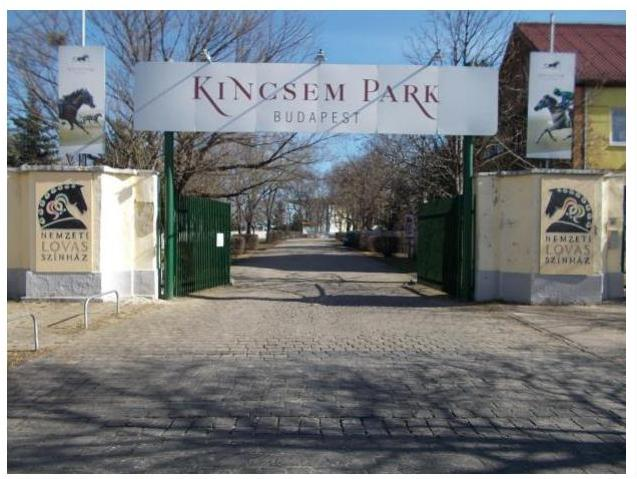

1. táblázat

| A TÖRZSTÖKE EMELÉSE (MILLIÓ FT) |  |  |
| :-- | :--: | :--: |
| alapító | összeg | változás időpontja |
| MFB Zrt. | 400,0 | 2012. január 23. |
| MFB Zrt. | 300,0 | 2012. augusztus 28. |
| MFB Zrt. | 200,0 | 2013. február 7. |

Forrás: 2012- 2013. éves beszámolók, alapító okirat

A 100%-os állami tulajdonú Kincsem Nemzeti Lóverseny és Lovas Stratégiai Korlátolt Felelősségű Társaság 2011. november 30-án jött létre átalakulással. Az MFB Zrt. ${ }^{1}$ az Agrárgazdasági Vagyonkezelő Kft. (jogelőd ${ }_{1}{ }^{2}$ ) valamint a Nemzeti Lóverseny Kft. (jogelőd ${ }_{2}$ ) társaság feletti tulajdonosi jogok gyakorlójaként 2011. július 25-én a két társaság egyesüléséről döntött.

A jogutód társaság feletti tulajdonosi jogokat a Vtv. ${ }^{3}$ 3. § (1) bekezdés előírásai szerint 2014. július 15-ig az MFB Zrt., 2014. július 16-tól az MNV Zrt ${ }^{4}$. gyakorolta. Az MFB Zrt. az összeolvadó társaságok és a Társaság végleges vagyonmérlegét a 4/2012. (II. 28.) sz. alapítói határozatával fogadta el.

Az átalakulás során létrejött Társaság ${ }^{5}$ törzstőkéje 6000 millió Ft, 2015. december 31-én 6900 millió Ft volt, a 2012. január 23-tól 2013. február 7-ig a Társaság középtávú stratégiájában rögzített feladatok és célkitűzések megvalósulása érdekében történt 900 millió Ft tőkeemelés következtében. A törzstőke változását az 1. táblázat mutatja be.

A Társaság közfeladatot nem látott el, fő tevékenysége Magyarországon kizárólagosan, a lóversenyfogadáshoz kapcsolódó galopp- és ügető versenyek szervezése, lebonyolítása. A Társaság a Magyar Lóversenyfogadást - szervező Kft. részére szerződés alapján végezte a versenyszervezési szolgáltatást. A Társaság és az MLFSZ ${ }^{6}$ az ügyvezetés egyezőségére tekintettel az Art. ${ }^{7}$ rendelkezése alapján kapcsolt vállalkozásnak minősült.

A Társaság a lóversenyszervezéshez kapcsolódóan üzemeltette a Kincsem park ${ }^{8}$ területén lévő, saját tulajdonú versenypálya és ügető tréningtelepet, valamint vagyonkezelőként a Dunakeszi-Alagon lévő, műemlékvédelem alatt álló galopp tréningtelepet. Az MNV Zrt. és a jogelőd ${ }_{2}{ }^{9}$ között 2010. augusztus 31-én vagyonkezelési szerződés ${ }^{10}$ jött létre a Dunakeszi-Alagon található galopp tréningtelepre.

A Társaság - saját tulajdonú és vagyonkezelésbe vett - bérlakás üzemeltetési és fenntartási tevékenységet, továbbá a jogelőd ${ }_{1}$ jogutódaként követeléskezelési tevékenységet is végzett, amely tizenkét agrárgazdaság értékesítésére kötött szerződések szerinti halasztott fizetési konstrukcióból eredő követelés-állomány - az átalakuláskor a befektetett pénzügyi eszközök mérlegsoron, tartósan adott kölcsönként nyilvántartott 6390,2 millió Ft - kezelését jelentette. A 2021. évig fennálló konstrukció alapján az éves vételár-törlesztés 712,8 millió Ft volt az ellenőrzött időszakban.

A Kormány 2012. február 29-én fogadta el a Nemzeti Lovas Programot ${ }^{11}$, amelyben fő célként tűzték ki a hazai lóversenyzés feltételeinek javítását, a fenntarthatóság alapjainak megteremtését, valamint a nemzetközi lóversenyzéshez való kapcsolódást. A Nemzeti Lovas Program célul tűzte ki továbbá a lovas ágazathoz kapcsolódó jelentős épített örökségi helyszínek teljes körű feltárását, valamint - többek között - a Kincsem Park fejlesztésére rendelkezésre álló források körének felmérését.

A Társaság az ellenőrzött időszakban a helyi műemlékvédelem alatt álló ingatlanjain végzett beruházásokhoz az MFB Zrt. részéről 2012-ben 500 millió Ft, az MNV Zrt. részéről 2014-ben 500 millió Ft és 2015-ben 310 millió Ft összegű vissza nem térítendő támogatásban részesült.

Az MNV Zrt. 2015. december 18-án 1500 millió Ft összegű, hat éves futamidejű kölcsönt folyósított a Társaság részére. A kölcsön célja az MLFSZ felé fennálló kölcsön törlesztése, az „Ötösbefutó játék" MLFSZ-szel közösen történő piaci bevezetése kapcsán felmerülő beruházás jellegű kiadások, valamint a piaci bevezetéstől várt többletbevételek realizálásáig szükségszerűen felmerülő működési jellegű kiadások finanszírozása volt.

A 2012-2015. éves beszámolók mérlegfőösszegeit a 2. táblázat mutatja be.

A Társaság működése az ellenőrzött időszak minden évében veszteséges volt. A Társaság által végzett versenyszervezés díjai nem fedezték a versenyszervezés költségeit, valamint a különböző bérleti díjak nem fedezték az ingatlanok fenntartásával kapcsolatos ráfordításokat. Az ügyvezető és a felügyelőbizottság tagjai 2014 októberéig nem részesültek díjazásban, azt követően a felügyelőbizottság tagjai az MNV Zrt. által alapítói határozatban ${ }^{12}$ meghatározott díjazásban részesültek. A gazdálkodási adatokat az 1. ábra, a mérleg és az eredménykimutatás adatait a II. számú melléklet mutatja be.

1. ábra
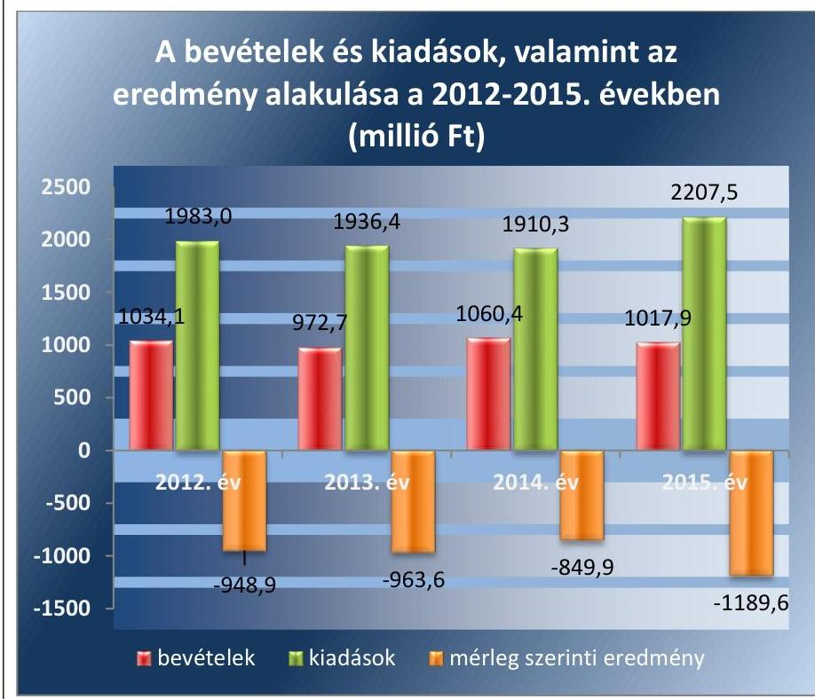

Forrás: 2012-2015. éves beszámolók

---

A Társaság az ellenőrzött időszakban nem volt kormányzati szektorba sorolt.

Az átlagos állományi létszám az ellenőrzött időszakban 54 fő volt.
A könyvvizsgáló személye az ellenőrzött időszakban nem változott, az ügyvezető személye 2014. október 1-jén változott, a jelenlegi ügyvezető 2014. október 1-jétől tölti be tisztségét.

---

# AZ ELLENŐRZÉS HÁTTERE, INDOKOLTSÁGA 

AZ ÁLLAMI TULAJDONÚ GAZDÁLKODÓ SZERVEZETEK ellenőrzése kiemelten fontos a nemzeti vagyon megőrzése, megóvása érdekében. Gazdálkodásuk jellemzően a közérdeklődés és a média figyelmének középpontjában áll, amihez hozzájárul a gazdálkodásuk körébe tartozó - közvetlen vagy közvetett állami tulajdonú - vagyon nagysága, illetve az általuk ellátott közszolgáltatások minősége és hatékonysága. A szolgáltatási/közszolgáltatási árképzés megalapozottsága és az éves elszámoltatás feltételeinek kialakítása az ellenőrzés során nagy hangsúlyt kap. A szolgáltatás/közszolgáltatás árában és annak támogatásában meg kell jelennie az önköltségszámítás szempontjainak, amely biztosítja a működés fenntarthatóságát (eszközpótlást) is. Az ellenőrzés rámutathat az állami tulajdonú gazdálkodó szervezetek gazdálkodási tevékenységével kapcsolatos jó gyakorlatokra és szabálytalanságokra. Felhívhatja a figyelmet a jogszabályi követelmények teljesítéséhez szükséges feltételek hiányosságaira, hozzájárulhat az államháztartáson kívüli, de (közvetlenül vagy közvetve) állami vagyont használó gazdálkodó szervezetek tevékenységének átláthatóságához. Ellenőrzésünk eredményeképpen megállapításainkkal hozzájárulhatunk a nemzeti vagyonnal való gazdálkodás átláthatóságának, elszámoltathatóságának javításához.

---

# A JELENTÉS LÉNYEGES KÉRDÉSKÖREI 

1. A tulajdonosi jogok gyakorlása szabályszerű volt-e?
2. A társaság működésének szabályozottsága megfelelt-e az előírásoknak?
3. A társaságnál a pénzügyi-számviteli, adatszolgáltatási és ellenőrzési feladatok ellátása szabályszerű volt-e?
4. A társaság vagyongazdálkodása szabályszerű volt-e?

---

# ELLENŐRZÉS HATÓKÖRE ÉS MÓDSZEREI 

## Az ellenőrzés típusa

Megfelelőségi ellenőrzés.

## Az ellenőrzött időszak

Az ellenőrzött időszak 2012. január 1-jétől 2015. december 31-ig tart.

## Az ellenőrzés tárgya

A Kincsem Nemzeti Lóverseny és Lovas Stratégiai Kft. feletti tulajdonosi joggyakorlás, valamint a gazdasági társaság gazdálkodása - kiemelten vagyongazdálkodási tevékenysége - szabályozottsága és szabályszerűsége.

Az ellenőrzés kiterjed minden olyan körülményre és adatra, amely az ÁSZ ${ }^{13}$ jogszabályban meghatározott feladatainak teljesítéséhez, valamint a program végrehajtása folyamán felmerült újabb összefüggések feltárásához szükséges.

## Az ellenőrzött szervezet

Kincsem Nemzeti Lóverseny és Lovas Stratégiai Kft., Magyar Fejlesztési Bank Zrt., Magyar Nemzeti Vagyonkezelő Zrt.

## Az ellenőrzés jogalapja

Az ellenőrzés jogalapját az ÁSZ tv. ${ }^{14} 1 . \S$ (3) bekezdése és 5. § (3)-(5) bekezdése képezi.

## Az ellenőrzés módszerei

Az ellenőrzést a nemzetközi standardokat irányadónak tekintve az ellenőrzési program ellenőrzési kérdései, az ellenőrzött időszakban hatályos jogszabályok,

 az ellenőrzés szakmai szabályok és módszertanok figyelembevételével végeztük.

Az ellenőrzés ideje alatt az ellenőrzött szervezettel történő kapcsolattartást az ÁSZ Szervezeti és Működési Szabályzatának vonatkozó előírásai alapján biztosítottuk.

---

Az ellenőrzési program szerinti feladatokat a gazdálkodó szervezetnél (társaságnál), valamint a tulajdonosi jogok gyakorlójánál kellett végrehajtani.

Az ellenőrzési kérdések megválaszolásához szükséges bizonyítékok megszerzése a következő ellenőrzési eljárások alkalmazásával történt: megfigyelés, kérdésfeltevés (információkérés), összehasonlítás, mintavételezés, valamint elemző eljárás. Az ellenőrzési bizonyítékként felhasználható adatforrások közé tartoznak egyrészt az ellenőrzési programban felsorolt adatforrások, másrészt adatforrás lehet még minden - az ellenőrzés folyamán - feltárt, az ellenőrzés szempontjából információkat tartalmazó dokumentum.

Az ellenőrzést a kérdésekre adott válaszok kiértékelésével, valamint a megjelölt adatforrások, a csatolt tanúsítványok felhasználásával, továbbá az adott időszakban hatályos jogszabályok figyelembevételével folytattuk le.

A Társaságnál a bevételek és ráfordítások elszámolása, valamint a vagyonnyilvántartás terén a szabályszerű működést véletlen mintavétellel és irányított kiválasztással ellenőriztük. A jogszabályoknak és a belső előírásoknak megfelelőnek, azaz szabályszerűnek tekintettük az adott területet, amennyiben a minta ellenőrzésének eredménye alapján 95%-os bizonyossággal a teljes sokaságban a hibaarány kisebb volt, mint 10%, nem megfelelőnek értékeltük, ha a hibaarány a 10%-ot meghaladta.

A Társaságnál az MLFSZ vonatkozásában megállapított bevételek és ráfordítások elszámolása és nyilvántartása, valamint a kimutatott követelései és kötelezettségei megállapítása és nyilvántartása szabályszerűségét a bekért dokumentumok értékelése alapján, éves szinten összevontan végeztük el.

A vezető tisztségviselői megbízatás és a felügyelőbizottsági tagság ellátása alapján járó javadalmazás elszámolásának szabályszerűségét az ellenőrzött időszakban juttatott valamennyi kifizetés tételes ellenőrzése alapján minősítettük.

---

# 1. A tulajdonosi jogok gyakorlása szabályszerű volt-e? 

Összegző megállapítás

Az MFB Zrt. és az MNV Zrt. tulajdonosi joggyakorlása szabályszerű volt.

A TULAJDONOSI JOGOK GYAKORLÓI a Társaság feletti tulajdonosi joggyakorlás rendjét a Gt. ${ }^{15}$, valamint a Ptk. ${ }^{16}$ előírásainak megfelelően meghatározták és a Társaság feletti tulajdonosi jogokat és kötelezettségeket az előírásoknak megfelelően gyakorolták.

Az alapító okirat ${ }_{1-11}{ }^{17}$ tartalmazta a tulajdonosi jogok gyakorlói rendelkezéseit az ügyvezető, a felügyelőbizottság és a könyvvizsgáló megválasztásának módjáról, díjazása megállapításáról. A felügyelőbizottság megalakítása és működése megfelelt a Gt. és a Ptk. előírásainak. A Társaság kezelésében, használatában lévő nemzeti vagyon feletti tulajdonosi joggyakorlás szabályszerű volt.

Az alapító okirat ${ }_{1-11}$-ban a tulajdonosi jogok gyakorlói meghatározták, hogy a vagyon változásához kapcsolódó döntések közül az alapító kizárólagos hatáskörébe az 50 millió Ft értékhatárt meghaladó üzletrész, vagyoni értékű jog megszerzésével, az 500 millió Ft értékhatárt meghaladó tárgyi eszköz beszerzésével és elidegenítésével, továbbá az 500 millió Ft értékhatárt meghaladó hitelügyletekkel kapcsolatos döntések tartoztak. 2015. április hó 20. napjáig az 50 millió Ft értékhatár alatti ügyletekre vonatkozó döntés az ügyvezető hatáskörébe tartozott, míg az 50 millió Ft és 500 millió Ft közötti ügyletekre vonatkozó döntéshez a felügyelőbizottság előzetes jóváhagyására volt szükség. Az ügyvezető hatáskörébe 2015. április 20-tól az 500 millió Ft alatti döntések tartoztak.

Értéknövelő beruházások esetében 50 millió Ft feletti szerződéskötésre 2014-ben és 2015. februárban került sor, amely kötelezettségvállalásokhoz a felügyelőbizottság az előzetes jóváhagyást megadta. A 2012. és 2014. évben az 1000 millió Ft összegű folyószámlahitelhez kapcsolódó, valamint 2015-ben az 1500 millió Ft összegű kölcsönhöz kapcsolódó ügyleteket a tulajdonosi joggyakorlók az előírásoknak megfelelően alapítói határozatban hagyták jóvá.

A SAJÁT TÖKE értéke a folyamatos veszteséges működés következtében 2015. december 31-ére 32%-kal, 4939 millió Ft-tal csökkent az ellenőrzött időszak kezdő napjához viszonyítva. A jelentős mértékű csökkenés ellenére a $\mathrm{Ptk}_{2}$ 3:189. § (1) bekezdés a) pontjában előírt alapítói beavatkozást igénylő - a jegyzett tőke 50%-ánál alacsonyabb - összeget a saját tőke összege a 2012-2015. években meghaladta.

A jegyzett tőke és a saját tőke alakulását a 2. ábra mutatja be.
ÜZLETI TERV készítési kötelezettség vonatkozásában az alapító okirat ${ }_{1-11}$ és az SZMSZ ${ }_{1-2}{ }^{18}$ tartalmazott előírásokat. A Társaság minden évben

---

elkészítette az üzleti tervet, amelyet a tulajdonosi jogok gyakorlói a felügyelőbizottság véleményének figyelembevételével fogadtak el. Az éves üzleti tervekben a vagyongazdálkodással kapcsolatos fejlesztési tervek a Nemzeti Lovas Program célkitűzéseivel összhangban voltak.

AZ ÉVES BESZÁMOLÓKAT a tulajdonosi jogok gyakorlói a felügyelőbizottság írásbeli jelentésének birtokában, valamint a könyvvizsgáló jelentése ismeretében fogadták el.

MONITORING RENDSZER működtetésével kísérték figyelemmel a Társaság tevékenységét a tulajdonosi joggyakorlók, valamint gondoskodtak a társaság folyamatos beszámoltatásáról. Az MFB Zrt. adatszolgáltatásra vonatkozó elnök-vezérigazgatói utasításban ${ }^{19}$, az MNV Zrt. monitoring szabályzatban ${ }^{20}$ rögzítette az adatszolgáltatások rendjét.

A JAVADALMAZÁSI SZABÁLYZATOT az MFB Zrt. a Taktv. ${ }^{21}$ 5. § (3) bekezdésben foglalt előírásoknak megfelelően 2013. szeptember 30-án kiadta. A javadalmazási szabályzat a társaság vezetői és a felügyelőbizottsági tagok javadalmazási és juttatási rendszeréről rendelkezett. A 2013. szeptember 30. előtti időszakban a jogelőd társaság 7/2011.(07. 22.) sz. alapítói határozattal jóváhagyott szabályzata volt érvényben.

# 2. A társaság működésének szabályozottsága megfelelt-e az előírásoknak? 

Összegző megállapítás

A Társaság működésének szabályozottsága a saját vagyon vonatkozásában megfelelt, a kezelt vagyon tekintetében azonban nem felelt meg a jogszabályi előírásoknak.

SZERVEZETI ÉS MŰKÖDÉSI SZABÁLYZATTAL rendelkezett a Társaság. Az SZMSZ1-2-ben meghatározták a Társaság működésére jellemző alapvető elveket és előírásokat, a szervezeti felépítését, irányítási rendszerét, a vezető és ellenőrző szervek feladatait és jogkörét, valamint a dolgozók jogait és kötelezettségeit.

A SZÁMVITELI POLITIKÁVAL az előírásoknak megfelelően rendelkezett a Társaság. A számviteli politika $1.{ }^{22}$ a Számv. tv. ${ }^{23}$ előírásainak megfelelő tartalommal készült el, azonban annak kialakítása nem felelt meg a Vhr. ${ }^{24}$ 14. § (1) bekezdésben foglalt előírásoknak, mert nem biztosította a vagyonkezelt vagyon vonatkozásában az adatszolgáltatás pontosságát és ellenőrizhetőségét. A Számv. tv. 14. § (11) bekezdés előírásai ellenére törvénymódosítás esetén a változásokat a Társaság nem vezette át a számviteli politikán:
$\longrightarrow$ a Számv. tv. 3. § (3) bekezdés 3. pontjában meghatározott jelentős összegű hiba 2013. január 1-jei változását, ugyanakkor - az előírásoknak megfelelően - a számviteli politika ${ }_{2}$ szigorúbb szabályt alkalmazott a törvényi előírásnál;
$\longrightarrow$ a Számv. tv. 3. § (3) bekezdés 5. pontjában foglalt - a megbízható és valós képet lényegesen befolyásoló hibára vonatkozó - előírás 2013.

---

január 1-jétől hatálytalan, ennek ellenére a Társaság nem vezette ki a hivatkozást a számviteli politikából; előírásai közül;
$\longrightarrow$ a Számv. tv. 14. § (4) bekezdésének előírása ellenére a Társaság nem rögzítette a számviteli politika keretében a 2015. július 4-ei hatállyal bevezetett kivételes nagyságú vagy előfordulású bevétel, költség és ráfordítás fogalmát.

A PÉNZKEZELÉSI szabályzatot ${ }^{25}$, a leltározási szabályzatot ${ }^{26}$, valamint az eszközök és források értékelési szabályzatát ${ }^{27}$ a Számv. tv. 14. § (11) bekezdés előírásai ellenére a megalakulást követő kilencven napon túl, késedelmesen készítette el és helyezte hatályba a Társaság 2012. június 1-jén.

A LELTÁROZÁSI SZABÁLYZAT nem tartalmazta a vagyonkezelési szerződés 7.2 - 7.4. pontjában meghatározott adatszolgáltatási kötelezettséghez kapcsolódó leltározási kötelezettség teljesítésének rendjét a vagyonkezelt vagyon vonatkozásában.

A SZÁMLARENDET ${ }^{28}$ a számviteli politika függelékeként elkészítették. A Társaság belső szabályai a Számv. tv. 161/A. § (2) bekezdésben rögzítettek ellenére nem tartalmazták a vagyonkezelt ingatlanok esetében a nyilvántartási (könyvvezetési) rendszer olyan továbbrészletezését, hogy a vonatkozó külön jogszabályban meghatározott adatok rendelkezésre álljanak.

ÖNKÖLTSÉGSZÁMÍTÁSI SZABÁLYZATOT a Számv. tv. 14. § (5) bekezdés c.) pontja előírásai ellenére nem készített a Társaság.

# 3. A társaságnál a pénzügyi-számviteli, adatszolgáltatási és ellenőrzési feladatok ellátása szabályszerű volt-e? 

Összegző megállapítás

A Társaságnál a pénzügyi-számviteli, adatszolgáltatási és ellenőrzési feladatok ellátása szabályszerű volt, de a vezető tisztségviselők járandóságainak elszámolása nem az előírásoknak megfelelően történt. A jogszabályi előírások ellenére önköltségszámítást nem végeztek.
3.1. számú megállapítás

A bevételek és ráfordítások elszámolása - a személyi jellegű ráfordítások kivételével - szabályszerű volt. A különböző díjakat önköltségszámítással nem támasztották alá.

A BEVÉTELEK ÉS RÁFORDÍTÁSOK, valamint a beruházások elszámolása a Számv. tv. és a belső szabályzatok előírásainak megfelelően történt, de az ügyvezetők részére teljesített kifizetések nem voltak szabályszerűek. A Társaság vezető tisztségviselője 2014. szeptember 30-ig az ügyvezetői feladatok ellátásáért díjazásban nem részesült. A 2012. január és 2013. március közötti időszakban az ügyvezető számára elszámolt

---

3. táblázat

VEVŐKÖVETELÉSEK ALAKULÁSA 2012.12.31. ÉS 2015.12.31.

|  vevőkövetelés | 2012. | 2015.  |
| --- | --- | --- |
|  összesen (millió Ft) | 118,4 | 223,6  |
|  lejárt (millió Ft) | 84,4 | 161,8  |
|  lejárt követelések | $71,3 \%$ | $72,4 \%$  |
|  aránya |  |   |

Forrás: 2012. évi és 2015. éves beszámoló költségtérítések számviteli elszámolását, valamint az ügyvezetői megbízatással rendelkező munkavállaló részére 2014. október 1. és 2015. december 31. között elszámolt munkabért és egyéb béren kívüli juttatások elszámolását a Számv. tv. 165. § (2) bekezdésében foglalt előírások ellenére nem támasztották alá szabályszerű számviteli bizonylattal.

A vezető tisztségviselők díjazására vonatkozóan a 2014. éves beszámoló kiegészítő mellékletében bemutatott előző évi és tárgyévi adatok nem feleltek meg a Számv. tv. 15. § (3) bekezdésében foglalt előírásnak, mert a 2013. évi kiegészítő mellékletben a vezető tisztségviselők díjazásaként 0 Ft-ot, a 2014. évi kiegészítő mellékletben a vezető tisztségviselők előző évi díjazásaként 18,0 millió Ft összeget tüntettek fel. A rendelkezésre álló dokumentumok alapján az ügyvezető 2013-ban nem részesült díjazásban a Társaságnál. A 2014. évben az ügyvezető nem részesült díjazásban szeptember 30-áig, október 1-jétől a kiegészítő mellékletben feltüntetett 18,5 millió Ft-tal szemben 3,6 millió Ft munkabért számolt el a Társaság ilyen címen.

A KAPCSOLT VÁLLALKOZÁSNAK minősülő MLFSZ adatait - elnevezését, székhelyét (telephelyét) és adóazonosító számát - az Art. 23. § (4) bekezdés b) pontja rendelkezései ellenére a Társaság nem jelentette be az állami adóhatósághoz.

A VEVŐKÖVETELÉSEK állománya és azon belül a lejárt követelések aránya a követelések behajtására tett intézkedések ellenére közel kétszeresére növekedett. A Társaság a Számv. tv. előírásainak megfelelően részletes nyilvántartást vezetett a vevőkövetelésekről. A vevőkövetelések alakulását a 3. táblázat mutatja be.

ÖNKÖLTSÉGSZÁMÍTÁST a Számv. tv. 14. § (7) bekezdés rendelkezései ellenére a Társaság nem végzett, a versenyszervezési díjat, valamint a különböző bérleti díjakat utókalkulációval nem állapította meg, ugyanakkor az MLFSZ számára végzett versenyszervezés szolgáltatásra vonatkozóan a Társaság utólag, minden évben költségbecslést készített. Az éves költségbecslések alapján a kiszámlázott díjak mindössze a bekerülési költségek 35-45%-át fedezték, amely minden ellenőrzött évben jelentős veszteséget eredményezett a Társaságnál. A versenyszervezés 2013-2016. évi eredményének alakulását a 4. táblázat mutatja be. 4. táblázat

|  A VERSENYSZERVEZÉS EREDMÉNYE A 2013-2016. ÉVEKBEN (MILLIÓ FT) |  |  |  |   |
| --- | --- | --- | --- | --- |
|  megnevezés | 2012. | 2013. | 2014. | 2015.  |
|  versenyszervezés becsült költségei | 675,2 | 746,7 | 760,5 | 871,5  |
|  szerződés
 szerinti díjbevétel | 302,0 | 302,0 | 302,0 | 310,0  |
|  versenyszervezés eredménye | $-373,2$ | $-444,7$ | $-458,5$ | $-561,5$  |
|   |  | Forrás: a Társaság 2012-2015. évi kimutatásai |  |   |

A Társaság és az MLFSZ Kft. között a Kincsem Parkra vonatkozóan helyiségbérleti és területhasználati szerződés jött létre. A 2013. évben a Társaság által a bérleti és területhasználati díjról kiállított számla a szerződéstől eltérően nem tartalmazta az előzetesen felszámított forgalmi adó összegét.

---

# 3.2. számú megállapítás 

A Társaság az előírásoknak megfelelően teljesítette a tervezési, beszámolási, adatszolgáltatási kötelezettségét.

TERVEZÉSI, BESZÁMOLÁSI, ADATSZOLGÁLTATÁSI kötelezettségeit a Társaság a tulajdonos által az alapító okirat 1-11-ben és az SZMSZ ${ }_{1,2}$-ben, valamint jogszabályi előírásoknak megfelelően teljesítette. Az éves beszámolókat a Számv. tv. előírásainak megfelelően, határidőben elkészítette, azokat a tulajdonosi jogok gyakorlói - a felügyelőbizottság előzetes írásbeli javaslatának, a könyvvizsgáló jelentésének ismeretében - jóváhagyták.

KÖZZÉTÉTELI kötelezettségeinek a Taktv. 2. § (1)-(4) előírásai szerinti adatok vonatkozásában a Társaság eleget tett, továbbá az éves beszámolókat a jogszabályi előírásoknak megfelelően tette közzé.
3.3. számú megállapítás

Az ellenőrzésekkel kapcsolatos feladatok ellátása megfelelő volt.
5. táblázat

KÜLSŐ ELLENŐRZÉSEK
A 2012-2015. ÉVEKBEN

| ellenőrző szerv | ellenőrzé- sek száma |
| :-- | :--: |
| NAV | 3 |
| Munkaügyi Szakig. Szerv | 2 |
| NÉBIH | 3 |
| KEHI | 7 |
| KDB | 1 |
| GVH | 1 |
| külső ellenőrzés összesen | 17 |

Forrás: Társaság adatszolgáltatása

BELSŐ ELLENŐRZÉST a Bkr. ${ }^{29}$. előírásainak megfelelően - megbízási szerződés keretében - működtetett a Társaság. Az éves belső ellenőrzési terveket, valamint a terveknek megfelelően lefolytatott ellenőrzések jelentéseit a felügyelőbizottság jóváhagyta. Az ellenőrzések intézkedést igénylő megállapítást nem tettek.

TULAJDONOSI ELLENŐRZÉS keretében az MFB Zrt. a vagyonnyilvántartással kapcsolatban egy alkalommal - 2012-ben - végzett ellenőrzést. Az ellenőrzés a függő kötelezettségek nyilvántartásával kapcsolatban fogalmazott meg javaslatot. A Társaság az ellenőrzés javaslatainak megfelelően intézkedett.

Az MNV Zrt. tulajdonosi joggyakorlóként 2015-ben az alapítói határozatok végrehajtásával és a felügyelőbizottság 2014. évi tevékenységével kapcsolatban három ellenőrzést végzett, amelyekben javaslatot nem fogalmazott meg.

KÜLSŐ ELLENŐRZÉST végző szervek ${ }^{30}$ nem tettek intézkedést igénylő megállapításokat. A külső ellenőrzéseket végző szerveket és az ellenőrzéseik számát az 5. táblázat mutatja be.

---

# 4. A társaság vagyongazdálkodása szabályszerű volt-e? 

## Összegző megállapítás

### 4.1. számú megállapítás

A Társaság vagyongazdálkodása nem volt szabályszerű, mert a vagyonkezelt vagyon nyilvántartása, a befektetett pénzügyi eszközök értékelése nem felelt meg az előírásoknak. A vagyonkezelt vagyon vonatkozásában a jogszabályi előírásoknak megfelelő leltárt nem készítettek.

A vagyon értékének megőrzését, gyarapítását szolgáló feltételeket a saját vagyont érintően kialakították, azonban a vagyonkezelésbe vett vagyon vonatkozásában nem alakították ki. A vagyon változását eredményező döntések megfeleltek az előírásoknak.

A SAJÁT VAGYON értékének megőrzését, gyarapítását szolgáló szabályszerű vagyongazdálkodás feltételeit kialakította, szabályozta a Társaság a számviteli politika ${ }_{1-2}$-ben, a számlarendben, az eszközök és források leltárkészítési és leltározási szabályzatában, az értékelési szabályzatban, valamint a pénzkezelési szabályzatban.

A VAGYONKEZELÉSBE VETT VAGYON változását eredményező döntések előkészítésével kapcsolatos követelményeket a tulajdonosi jogok gyakorlói az alapító okirat ${ }_{3-11}$-ben és a vagyonkezelési szerződésben meghatározták. A vagyonváltozást eredményező döntések az előírásoknak megfeleltek.

A VAGYONKEZELÉSI SZERZŐDÉS az átadott eszközök tételes, egyedi azonosítására alkalmas felsorolást nem tartalmazott. A vagyonelemek helyrajzi számonként kerültek rögzítésre, viszont a földterületeken lévő épületeket, építményeket tételesen nem tartalmazta a vagyonkezelési szerződés, az eszközök egyedi értékének meghatározására a vagyonkezelésbe adáskor nem került sor, ezért a Vhr. 17. § (1) bekezdés szerinti nyilvántartási kötelezettség, illetve a Vhr. 14. § (1) bekezdés előírásai szerinti tételes adatszolgáltatási kötelezettség teljesítéséhez szükséges adatokat a vagyonkezelési szerződés nem biztosította.

## A VAGYONKEZELÉSI SZERZŐDÉS MÓDOSÍTÁSA

nem történt meg:
a Társaság a 2015. évben 201,9 millió Ft aktivált értékű értéknövelő beruházást hajtott végre a vagyonkezelt ingatlanokon, de a Vhr. 18. § (1) bekezdés c) pontjában, valamint a vagyonkezelési szerződés 5.8. pontjában foglaltakkal ellentétben a szerződés módosítására nem került sor.

---

### 4.2. számú megállapítás

Társaság vagyonkezelésében lévő állami vagyon nyilvántartása, a befektetett pénzügyi eszközök értékelése, valamint a vagyonkezelt eszközök leltározása nem felelt meg a jogszabályi előírásoknak. A saját vagyon nyilvántartása megfelelt a jogszabályi előírásoknak.

A VAGYONKEZELT VAGYONT összértékben elkülönítette a Társaság a saját vagyonától, de a nyilvántartás nem felelt meg a jogszabályi előírásoknak, mert
$\longrightarrow$ a könyveiben kizárólag külterületi és belterületi ingatlan megbontásban mutatta ki, azonban a Vhr. 17. § (1) bekezdése ellenére az egyes ingatlanokon lévő építmények egyedi nyilvántartását, valamint a spottelepeken lévő épületek és építmények után a Számv. tv. 52. § (1) bekezdés szerinti értékcsökkenés elszámolási kötelezettség szabályszerű teljesítését nem biztosította;
$\longrightarrow$ a nyilvántartás nem tartalmazta vagyoni elemenként tételesen az átvett vagyon könyv szerinti bruttó és nettó értékét, valamint az elszámolt értékcsökkenést, ezzel a nyilvántartás nem felelt meg a Vhr. 17. § (1) bekezdésben foglaltaknak, valamint a Számv. tv. 15. § (3) bekezdésben, 16. § (1) és 16. § (3) bekezdésekben rögzített valódiság elvének, egyedi értékelés elvének és a tartalom elsődlegessége elvének;
A Számv. tv. 15. § (3) bekezdés előírásai ellenére a 2015. évi beszámolóban a Társaság mérlegfordulónapon meglévő eszközei mellett a 2015 márciusában a Társaság vagyonkezeléséből kikerült belterületi ingatlan is szerepelt.

A Társaság a jogelőd ${ }_{1}$ megszűnése miatt a Vhr. 7. § (2) bekezdés előírásai ellenére - a vagyonkezelő személyében bekövetkezett változás miatt az ingatlan-nyilvántartási bejegyzés módosítását nem kezdeményezte.

A saját vagyon nyilvántartása szabályszerű volt.
A BEFEKTETETT PÉNZÜGYI ESZKÖZÖK között kimutatott - a jogelőd ${ }_{2}$ társaság által a 12 agrárgazdaság 20 éves halasztott fizetéssel értékesített részvényeiből származó - egy éven túl esedékes vételár-követeléseket értékvesztéssel csökkentett összegben mutatta ki éves beszámolóiban a Társaság. A teljes vételár-követelés után a jogelőd ${ }_{2}$ társaság által elszámolt értékvesztés nyilvántartásának okai már nem álltak fenn, a Számv. tv. 57.§ (2) bekezdés előírásai ellenére a nyilvántartott értékvesztést visszaírással nem szüntette meg a Társaság, így a 2015. évi mérlegében a befektetett pénzügyi eszközöket 472,4 millió Ft-tal alacsonyabb értéken mutatta ki. A visszaírás elmulasztásának következtében a Társaság 472,4 millió Ft-tal alacsonyabb összegű bevételt számolt el, ekkora összeggel csökkentve a gazdálkodás eredményét, azaz növelve a veszteségét.

LELTÁRRAL kizárólag a saját tulajdonú vagyona tekintetében támasztotta alá a Társaság az éves beszámolók mérlegtételeit.

A Társaság a vagyonkezelt eszközökről a vagyonkezelési szerződés 7.3 és 7.4 pontjában előírt adatszolgáltatási kötelezettséget megalapozó, valamint a Számv. tv. 69. § (1) bekezdése előírásainak megfelelő leltárt nem készített.

---

### 4.3. számú megállapítás

6. táblázat

VAGYONKEZELT VAGYON UTÁN ELSZÁMOLT ÉCS ÉS VISSZAPÓTLÁS 2012 - 2015. ÉVEK (MILLIÓ FT)

|  év | elszámolt écs | visszapótlás écs  |
| --- | --- | --- |
|  2012. | 5,2 | 9,2  |
|  2013. | 5,2 | 0,0  |
|  2014. | 5,2 | 2,4  |
|  2015. | 5,2 | 0,4  |
|  összesen | 20,8 | 12,0  |

Forrás: 2012-2015. éves beszámolók és adatszolgáltatás

A vagyonkezelt eszközök nyilvántartásával és leltározásával kapcsolatos szabálytalanságok ellenére a könyvvizsgáló az ellenőrzött időszakban korlátozás nélküli hitelesítő záradékkal látta el a beszámolókat.

AZ MLFSZ vonatkozásában kimutatott követeléseiről és kötelezettségeiről a Számv. tv. 159. §-ban előírtak ellenére nem vezetett olyan nyilvántartást a Társaság, amely a változásokat a valóságnak megfelelően, folyamatosan, zárt rendszerben, áttekinthetően mutatja be.

## A Társaság a kezelt vagyonnal kapcsolatos visszapótlási kötelezettségének nem tett eleget.

A VISSZAPÓTLÁSI KÖTELEZETTSÉGRE vonatkozó előírásokat a vagyonkezelésbe vett vagyonelemek tekintetében a 2013-2015. években a Társaság a vagyonkezelési szerződés 7.7. és 14.3. pontjában foglaltak ellenére nem teljesítette.

A vagyonkezelt vagyon vonatkozásában az elszámolt értékcsökkenést és a visszapótlást a 6. táblázat mutatja be.

---

# JAVASLATOK 

Az ÁSZ tv. 33. § (1) bekezdésében foglaltak értelmében az ellenőrzött szervezet vezetője köteles a jelentésben foglalt megállapításokhoz kapcsolódó intézkedési tervet összeállítani és azt a jelentés kézhezvételétől számított 30 napon belül az ÁSZ részére megküldeni. Amennyiben az ellenőrzött szervezet vezetője nem küldi meg határidőben az intézkedési tervet, vagy továbbra sem elfogadható intézkedési tervet küld, az Állami Számvevőszék elnöke az ÁSZ tv. 33. § (3) bekezdés a) és b) pontjaiban foglaltakat érvényesítheti.
Javaslataink célja a Kincsem Nemzeti Lóverseny és Lovas Stratégiai Kft. gazdálkodása szabályszerűségének és gyakorlatának javítása annak érdekében, hogy a szabályozási környezet és az alkalmazott gyakorlat megfelelően tudja támogatni az átlátható működést.

## A Kincsem Nemzeti Lóverseny és Lovas Stratégiai Kft. ügyvezetőjének

1. Intézkedjen a számviteli szabályzatok módosításáról a hatályos Számv. tv.-ben előírtaknak megfelelően.
(2. sz. megállapítás 2. és 4-5. bekezdései alapján)
2. Intézkedjen az önköltségszámítási szabályzat elkészítéséről a Számv. tv. előírásainak megfelelően.
(2. sz. megállapítás 6. bekezdése alapján)
3. Intézkedjen az ügyvezetői megbízatással rendelkező munkavállaló részére munkabér és egyéb béren kívüli juttatások elszámolásának a Számv. tv.-ben foglaltaknak megfelelő számviteli bizonylattal történő alátámasztásáról.
(3. 1. sz. megállapítás 1. bekezdése alapján)
4. Intézkedjen az önköltségszámítás utókalkulációval történő végrehajtásáról a versenyeztetési díjak, valamint a bérleti díjak esetében a Számv. tv. előírásainak megfelelően.
(3. 1. sz. megállapítás 5. bekezdése alapján)
5. Intézkedjen arról, hogy a vagyonkezelt ingatlanok egyedi nyilvántartása, értékcsökkenésének elszámolása, vagyonelemenkénti tételes bruttó és nettó értékének meghatározása megfeleljen a Számv. tv.-ben, és a Vhr.-ben foglalt előírásoknak.
(4.2. sz. megállapítás 1. bekezdése alapján)

---

6. Intézkedjen a vagyonkezelésből kikerült belterületi ingatlan számviteli nyilvántartásból való törléséről és az ingatlan-nyilvántartási bejegyzés módosításáról a Számv. tv. és a Vhr. előírásainak megfelelően.
(4.2. sz. megállapítás 2. és 3. bekezdései alapján)
7. Intézkedjen a befektetett pénzügyi eszközök között kimutatott halasztott fizetéssel értékesített részvényekből származó vételár-követelés értékvesztésének a Számv. tv.-nek megfelelő elszámolásáról.
(4.2. sz. megállapítás 5. bekezdése alapján)
8. Intézkedjen a vagyonkezelt eszközök vagyonkezelési szerződésben előírt adatszolgáltatási kötelezettséget megalapozó, valamint a Számv. tv. előírásainak megfelelő leltárának elkészítéséről.
(4.2. sz. megállapítás 7. bekezdése alapján)
9. Intézkedjen a kapcsolt vállalkozás vonatkozásában kimutatott követeléseiről és kötelezettségeiről a Számv. tv. előírásainak megfelelően nyilvántartás vezetéséről.
(4.2. sz. megállapítás 9. bekezdése alapján)
10. Intézkedjen a vagyonkezelt vagyon tekintetében a visszapótlási kötelezettség teljesítéséről a vagyonkezelési szerződésnek megfelelően.
(4.3. sz. megállapítás 1. bekezdése alapján)

---

# Javaslataink célja a tulajdonosi joggyakorló MNV Zrt. szabályszerű működésének elősegítése, továbbá a tulajdonosi joggyakorlás kontrolljainak erősítése. 

## Az MNV Zrt. vezérigazgatójának

1. Intézkedjen a vagyonkezelési szerződés módosításáról a vagyonkezelt eszközök Vhr. előírásainak megfelelő felsorolása, egyedi értékének meghatározása, továbbá a nyilvántartási és adatszolgáltatási kötelezettség teljesítése tekintetében, valamint az értéknövelő beruházás megfelelő kezelése érdekében.
(4.1. sz. megállapítás 3-4. bekezdései alapján)
2. Intézkedjen
a) a számviteli szabályzatok hiányosságai,
b) az önköltségszámítási szabályzat hiánya,
c) a munkabér és egyéb béren kívüli juttatások elszámolásának hiányossága,
d) az önköltségszámítás végrehajtásának hiánya,
e) a Társaság által kezelt vagyon nyilvántartásának, kezelésének hiányosságai,
f) a vagyonkezelésből kikerült ingatlan számviteli nyilvántartásának hibája, ingatlan-nyilvántartási bejegyzésének elmaradása,
g) a halasztott fizetéssel értékesített részvényekből származó vételárkövetelés értékvesztése elszámolásának hiányossága,
h) a

 vagyonkezelt eszközök leltárának hiánya,
i) a kapcsolt vállalkozással kapcsolatos követelések és kötelezettségek nyilvántartásának hiánya,
j) a vagyonkezelt eszközök visszapótlási kötelezettségének elmulasztása
miatti felelősség tisztázása érdekében, és szükség szerint intézkedjen a felelősség érvényesítéséről.
(2. sz. megállapítás 2., 4-6. bekezdései, 3. 1. sz. megállapítás 1., 5. bekezdései, 4.2. sz. megállapítás 1-3., 5., 7., 9. bekezdései, 4.3. sz. megállapítás 1. bekezdése alapján)

---

# MELLÉKLETEK 

## I. SZ. MELLÉKLET: ÉRTELMEZŐ SZÓTÁR

állami vagyon
a) Az állam tulajdonában lévő dolog, valamint a dolog módjára hasznosítható természeti erő,
b) az a) pont hatálya alá nem tartozó mindazon vagyon, amely vonatkozásában törvény az állam kizárólagos tulajdonjogát nevesíti,
c) az állam tulajdonában lévő tagsági jogviszonyt megtestesítő értékpapír, illetve az államot megillető egyéb társasági részesedés,
d) az államot megillető olyan immateriális, vagyoni értékkel rendelkező jogosultság, amelyet jogszabály vagyoni értékű jogként nevesít.
Forrás: Vtv. 1. § (2) bekezdése
2012. november 10-től az állami vagyon fogalma kiegészül a következő ponttal:
e) az állam tulajdonában lévő pénzügyi eszközök

Forrás: Vtv. 1. § (2) bekezdése
2013. június 27-ig:

Az állami vagyont az MNV Zrt. maga kezeli, vagy szerződés - így különösen bérlet, haszonbérlet, megbízás - alapján központi költségvetési szervnek, természetes vagy jogi személynek, vagy jogi személyiséggel nem rendelkező gazdálkodó szervezetnek hasznosításra átengedi. Az állami vagyonra vonatkozóan az MNV Zrt. kizárólag az Nvtv.-ben meghatározott személyekkel köthet vagyonkezelési szerződést.
Forrás: Vtv. 23. § (1), 27. § (1)
2013. június 28-ától:

Az állami vagyonnal az MNV Zrt. maga gazdálkodik, vagy szerződés - így különösen bérlet, haszonbérlet, megbízás - alapján központi költségvetési szervnek, természetes vagy jogi személynek, vagy jogi személyiséggel nem rendelkező gazdálkodó szervezetnek hasznosításra átengedi, illetőleg vagyonkezelésbe, haszonélvezetbe adja. Az állami vagyonra vonatkozóan az MNV Zrt. kizárólag az Nvtv.-ben meghatározott személyekkel köthet vagyonkezelési szerződést.
Forrás: Vtv. 23. § (1), 27. § (1)
A Ptk. 3:88. § (1) bekezdése szerint „a gazdasági társaságok üzletszerű közös gazdasági tevékenység folytatására, a tagok vagyoni hozzájárulásával létrehozott, jogi személyiséggel rendelkező vállalkozások, amelyekben a tagok a nyereségből közösen részesednek, és a veszteséget közösen viselik".
2014. március 14-ig:

A Ptk. ³¹ 685. § c) pontja szerint gazdálkodó szervezet: „az állami vállalat, az egyéb állami gazdálkodó szerv, a szövetkezet, a lakásszövetkezet, az európai szövetkezet, a gazdasági társaság, az európai részvénytársaság, az egyesülés, az európai gazdasági egyesülés, az európai területi együttműködési csoportosulás, az egyes jogi személyek vállalata, a leányvállalat, a vízgazdálkodási társulat, az erdő birtokossági társulat, a végrehajtói iroda, az egyéni cég, továbbá az egyéni vállalkozó."
2014. március 15-től:

A gazdasági társaság, az európai részvénytársaság, az egyesülés, az európai gazdasági egyesülés, az európai területi együttműködési csoportosulás, a szövetkezet, a lakásszövetkezet, az európai szövetkezet, a vízgazdálkodási társulat, az erdőbirtokossági társulat, az állami vállalat, az egyéb állami gazdálkodó szerv, az egyes jogi személyek vállalata, a közös vállalat, a végrehajtói iroda, a közjegyzői iroda, az ügyvédi iroda, a szabadalmi ügyvivői iroda, az önkéntes kölcsönös biztosító pénztár, a magánnyugdíjpénztár, az egyéni cég, továbbá az egyéni vállalkozó. Az állam, a helyi önkormányzat, a költségvetési szerv, az egyesület, a köztestület, valamint az alapítvány gazdálkodó tevékenységével összefüggő polgári jogi kapcsolataira is a gazdálkodó szervezetre vonatkozó rendelkezéseket kell alkalmazni.
Forrás: Ptk. 396. §
2003. évi XCII. törvény az adózás rendjéről
178. § 17. kapcsolt vállalkozás:
f) az adózó és más személy, ha köztük az ügyvezetés egyezőségére tekintettel az üzleti és pénzügyi politikára vonatkozó döntő befolyásgyakorlás valósul meg,
2014. március 14-ig:

A befolyással rendelkező akkor rendelkezik egy jogi személyben meghatározó befolyással, ha annak tagja, illetve részvényese és
a) jogosult e jogi személy vezető tisztségviselői vagy felügyelőbizottsága tagjai többségének megválasztására, illetve visszahívására, vagy
b) a jogi személy más tagjaival, illetve részvényeseivel kötött megállapodás alapján egyedül rendelkezik a szavazatok több mint ötven százalékával.
A meghatározó befolyás akkor is fennáll, ha a befolyással rendelkező számára az előzőek szerinti jogosultságok közvetett módon biztosítottak. A befolyással rendelkezőnek egy jogi személyben a szavazatok több mint ötven százalékával közvetett módon való rendelkezése vagy egy jogi személyben közvetetten fennálló meghatározó befolyása megállapítása során a jogi személyben szavazati joggal rendelkező más jogi személyt (köztes vállalkozást) megillető szavazatokat meg kell szorozni a befolyással rendelkezőnek a köztes vállalkozásban, illetve vállalkozásokban fennálló szavazatával. Ha a köztes vállalkozásban fennálló szavazatok mértéke az ötven százalékot meghaladja, akkor azt egy egészként kell figyelembe venni.
Forrás: Ptk. 685/8. § (2)-(3) bekezdések
2014. március 15-től:

A befolyással rendelkező akkor rendelkezik egy jogi személyben meghatározó befolyással, ha annak tagja vagy részvényese, és
a) jogosult e jogi személy vezető tisztségviselői vagy felügyelőbizottsága tagjai többségének megválasztására, illetve visszahívására; vagy
b) a jogi személy más tagjai, illetve részvényesei a befolyással rendelkezővel kötött megállapodás alapján a befolyással rendelkezővel azonos tartalommal szavaznak, vagy a befolyással rendelkezőn keresztül gyakorolják szavazati jogukat, feltéve, hogy együtt a szavazatok több mint felével rendelkeznek.
Forrás: Ptk. 8:2. § (2) bekezdés
Az állami vagyon felett, a Magyar államot megillető tulajdonosi jogok és kötelezettségek összességét - a hatályos szabályozás szerint - az állami vagyon felügyeletéért felelős miniszter (jelenleg a nemzeti fejlesztési miniszter) gyakorolja. A miniszter feladatát nagy részben az MNV Zrt., mint tulajdonosi joggyakorló szervezet útján látja el.
az állam vagy a helyi önkormányzat kizárólagos tulajdonában álló dolgok, az a) pont hatálya alá nem tartozó, állam vagy a helyi önkormányzat tulajdonában lévő dolog,
az állam vagy a helyi önkormányzat tulajdonában lévő pénzügyi eszközök, továbbá az államot vagy a helyi önkormányzatot megillető társasági részesedések, az államot vagy a helyi önkormányzatot megillető bármely vagyoni értékkel rendelkező jogosultság, amelyet jogszabály vagyoni értékű jogként nevesít, Magyarország határa által körbezárt terület feletti légtér,

---

rábízott vagyon
tulajdonosi ellenőrzés
tulajdonosi jogok gyakorlója
az üvegházhatású gázok kibocsátási egységeinek kereskedelméről szóló törvény szerint kibocsátási egység és légiközlekedési kibocsátási egység, valamint az ENSZ Éghajlatváltozási Keretegyezménye és annak Kiotói Jegyzőkönyve végrehajtási keretrendszeréről szóló törvény szerinti kiotói egység,
állami vagy helyi önkormányzati fenntartású közgyűjtemény (muzeális intézmény, levéltár, közgyűjteményként működő kép- és hangarchívum, valamint könyvtár) saját gyűjteményében nyilvántartott kulturális javak körébe tartozó dolog, kivéve, ha az állami vagy önkormányzati tulajdon jogszerű létrejötte kétséget kizáró módon nem bizonyítható és a dologra nézve más a tulajdonjogát bizonyítja vagy a kulturális javakra vonatkozó jogszabályokban meghatározott eljárás keretében valószínűsíti (g. pont módosult 2013. december 7-től),
a régészeti lelet,
a nemzeti adatvagyon körébe tartozó állami nyilvántartások fokozottabb védelméről szóló törvény szerinti nemzeti adatvagyon.
Forrás: Nvtv. 1. § (2)
Egyrészt minden a Vtv. alkalmazásában állami vagyonnak minősülő vagyon, amit az MNV Zrt. kezel és nyilvántart.
Másrészt az a vagyon, amely felett a Magyar Állam nevében az MFB Zrt. gyakorolja a tulajdonosi jogokat.
Forrás: MFB tv. 3. § (9)
A rábízott vagyon a tulajdonosi jogokat gyakorló szervezetek saját vagyonától elkülönítendő.
Forrás: Vtv. 22. § (6)
2014. március 14-ig:

Az állami vagyon kezelőjét, haszonélvezőjét, használóját megillető jogok gyakorlását, annak szabályszerűségét, célszerűségét az MNV Zrt. - szükség szerint területi szervei útján - ellenőrzi.
2014. március 15-től:

Az állami vagyon használóját, vagyonkezelőjét és haszonélvezőjét megillető jogok gyakorlását, annak szabályszerűségét, a kötelezettségek teljesítését, valamint a vagyon rendeltetése szerinti célszerűségét a tulajdonosi joggyakorló rendszeresen ellenőrzi.
Forrás: Vhr. 20. § (1)
1.
2013. június 27-ig:

Az állami vagyon felett a Magyar államot megillető tulajdonosi jogok és kötelezettségek összességét - ha törvény eltérően nem rendelkezik - az állami vagyon felügyeletéért felelős miniszter (a továbbiakban: miniszter) gyakorolja, aki e feladatát a Magyar Nemzeti Vagyonkezelő Zártkörűen Működő Részvénytársaság (a továbbiakban: MNV Zrt.), a Magyar Fejlesztési Bank, illetve a tulajdonosi joggyakorló szervezet útján látja el. A miniszter miniszteri rendeletben, a törvényben meghatározott állami vagyoni kör tekintetében, meghatározott időtartamra, a joggyakorlás egyes szabályainak meghatározásával - az őt megillető tulajdonosi jogok és kötelezettségek összességének, illetve azok meghatározott részének gyakorlóját az Áht. szerinti központi költségvetési szervek, ezek intézménye, továbbá a 100%-ban állami tulajdonban álló gazdasági társaságok közül kijelölheti.
Forrás: Vtv. 3. § (1) és (2)
2013. június 28-ától:

A rábízott állami vagyon felett az államot megillető tulajdonosi jogok és kötelezettségek összességét tulajdonosi joggyakorlóként:

---

a) ha törvény vagy miniszteri rendelet eltérően nem rendelkezik, a Magyar Nemzeti Vagyonkezelő Zártkörűen Működő Részvénytársaság (a továbbiakban: MNV Zrt.),
b) törvényben kijelölt személy vagy
c) az állami vagyon felügyeletéért felelős miniszter (a továbbiakban: miniszter) által rendeletben kijelölt személy gyakorolja.
[...] A miniszter e törvény felhatalmazása alapján - a meghatározott célok hatékonyabb elérése érdekében, miniszteri rendeletben, az ott meghatározott állami vagyoni kör tekintetében, meghatározott időtartamra - e törvény keretei között, a joggyakorlás egyes szabályainak meghatározásával - az államot megillető tulajdonosi jogok és kötelezettségek összességének, illetve azok meghatározott részének gyakorlóját az Áht. szerinti központi költségvetési szervek, ezek intézménye, továbbá a 100%-ban állami tulajdonban álló gazdasági társaságok közül kijelölheti.
Forrás: Vtv. 3. § (1) és (2)
2.
Aki a nemzeti vagyon felett az államot vagy a helyi önkormányzatot megillető tulajdonosi jogok és kötelezettségek összességének gyakorlására jogosult
Forrás: Nvtv. 3. § (1) 17. pontja
2013. június 27-től:

A vagyonkezelő köteles a vagyontárgy értékét megőrizni, állagának megóvásáról, jó karban tartásáról, működtetéséről gondoskodni, továbbá - a központi költségvetési szervek kivételével - díjat fizetni vagy a szerződésben előírt más kötelezettséget teljesíteni.
Forrás: Vtv. 27. § (2)
2013. június 28-ától december 31-ig:

A vagyonkezelő köteles a vagyontárgy állagának megóvásáról, jó karbantartásáról, működtetéséről gondoskodni, továbbá - a központi költségvetési szervek kivételével - díjat fizetni, jogszabályban és szerződésben előírt más kötelezettségét teljesíteni, valamint a vagyontárgyat jogszabályban vagy szerződésben meghatározott célnak megfelelően használni. Amennyiben a vagyonkezelő ezen kötelezettségének nem tesz eleget, a tulajdonosi joggyakorló jogosult a szerződést azonnali hatállyal felmondani.
Forrás: Vtv. 27. § (2)
2014. január 1-jétől:

A vagyonkezelő köteles a vagyontárgy állagának megóvásáról, jó karbantartásáról, működtetéséről gondoskodni, jogszabályban és szerződésben előírt más kötelezettségét teljesíteni, valamint a vagyontárgyat jogszabályban vagy szerződésben meghatározott célnak megfelelően használni.
A vagyonkezelő - a központi költségvetési szervek és a kizárólag közfeladatot ellátó nem központi költségvetési szerv vagyonkezelők kivételével - köteles díjat fizetni, jogszabályban és szerződésben előírt más kötelezettségét teljesíteni, valamint a vagyontárgyat jogszabályban vagy szerződésben meghatározott célnak megfelelően használni. Amennyiben a vagyonkezelő ezen kötelezettségeinek nem tesz eleget, a tulajdonosi joggyakorló jogosult a szerződést azonnali hatállyal felmondani.
Forrás: Vtv. 27. § (2), (2a)

---

II. SZ. MELLÉKLET: A TÁRSASÁG MÉRLEG ÉS EREDMÉNYKIMUTATÁS ADATAINAK VÁLTOZÁSA (ADATOK MILLIÓ FT)

| Megnevezés | 2012.12.31. | 2013.12.31. | 2014.12.31. | 2015.12.31. |
| :--: | :--: | :--: | :--: | :--: |
| A. Befektetett eszközök | 23015,1 | 22556,0 | 19233,1 | 20807,5 |
| II. TÁRGYI ESZKÖZÖK | 17337,7 | 17591,4 | 14974,1 | 17246,2 |
| B. Forgóeszközök | 1901,0 | 1956,1 | 2550,4 | 2328,9 |
| I. KÉSZLETEK | 15,8 | 13,6 | 13,5 | 19,3 |
| II. KÖVETELÉSEK | 831,3 | 853,8 | 1001,0 | 911,7 |
| IV. PÉNZESZKÖZÖK |

 1053,9 | 1088,6 | 1535,8 | 1397,9 |
| C. Aktív időbeli elhatárolások | 128,0 | 125,7 | 89,9 | 73,0 |
| ESZKÖZÖK (AKTÍVÁK) ÖSSZESEN | 25044,0 | 24637,8 | 21873,3 | 23209,4 |
| D. SAJÁT TÖKE | 14526,8 | 14052,7 | 10386,1 | 10499,2 |
| I. JEGYZETT TÖKE | 6700,0 | 6900,0 | 6900,0 | 6900,0 |
| F. Kötelezettségek | 9412,9 | 9501,1 | 9895,7 | 10779,0 |
| III. RÖVID LEJÁRATÚ KÖTELEZETTSÉGEK | 1505,0 | 1597,3 | 1991,8 | 1374,2 |
| G. Passzív időbeli elhatárolások | 1053,4 | 1042,5 | 1540,9 | 1877,7 |
| FORRÁSOK (PASSZÍVÁK) ÖSSZESEN | 25044,0 | 24637,8 | 21873,3 | 23209,4 |

| Megnevezés | 2012.12.31. | 2013.12.31. | 2014.12.31. | 2015.12.31. |
| :--: | :--: | :--: | :--: | :--: |
| Értékesítés nettó árbevétele | 556,6 | 605,3 | 570,4 | 647,2 |
| Egyéb bevételek | 171,0 | 102,3 | 266,8 | 201,7 |
| Anyagjellegű ráfordítások | 458,6 | 496,8 | 463,1 | 761,5 |
| Személyi jellegű ráfordítások | 292,5 | 307,5 | 304,3 | 294,0 |
| Értékcsökkenési leírás | 93,3 | 100,9 | 113,0 | 137,9 |
| Egyéb ráfordítások | 915,0 | 859,6 | 855,7 | 850,7 |
| A. Üzemi (üzleti) tevékenység eredménye | $-1021,9$ | $-1057,2$ | $-898,9$ | $-1195,2$ |
| Pénzügyi műveletek bevételei | 296,3 | 264,9 | 210,5 | 168,2 |
| Pénzügyi műveletek ráfordításai | 222,6 | 170,4 | 169,3 | 163,4 |
| B. Pénzügyi műveletek eredménye | 73,7 | 94,5 | 41,2 | 4,8 |
| C. Szokásos vállalkozási eredmény | $-948,2$ | $-962,7$ | $-857,6$ | $-1190,4$ |
| Rendkívüli bevételek | 0,2 | 0,3 | 12,6 | 0,8 |
| Rendkívüli ráfordítások | 1,0 | 1,2 | 4,9 | 0,0 |
| D. Rendkívüli eredmény | $-0,7$ | $-0,9$ | 7,7 | 0,8 |
| E. Adózás előtti eredmény | $-948,9$ | $-963,6$ | $-849,9$ | $-1189,6$ |
| F. Mérleg szerinti eredmény | $-948,9$ | $-963,6$ | $-849,9$ | $-1189,6$ |

---

.

---

# FÜGGELÉK: ÉSZREVÉTELEK 

A jelentéstervezetet a Számvevőszék 15 napos észrevételezésre megküldte az ellenőrzött szervezetek vezetőinek az ÁSZ tv. 29. § (1) bekezdése előírásának megfelelően.

A jelentés függeléke tartalmazza a Kincsem Nemzeti Lóverseny és Lovas Stratégiai Kft. ügyvezetőjének és a Magyar Nemzeti Vagyonkezelő Zrt. vezérigazgatójának jelentéstervezettel kapcsolatos észrevételeit és az azok kezeléséről szóló válaszleveleket.

[^0]
[^0]:    * 29. § (1) Az Állami Számvevőszék az ellenőrzési megállapításait megküldi az ellenőrzött szervezet vezetőjének vagy az általa megbízott személynek, és annak, akinek személyes felelősségét állapította meg.
    (2) Az ellenőrzött szervezet vezetője és a felelősként megjelölt személy az ellenőrzés megállapításaira tizenöt napon belül írásban észrevételt tehet.
    (3) Az Állami Számvevőszék az észrevételre a beérkezésétől számított harminc napon belül írásban válaszol. A figyelembe nem vett észrevételeket köteles a jelentésben feltüntetni, és megindokolni, hogy azokat miért nem fogadta el.

---

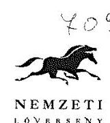

Homélle M.

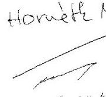

Állami Számvevőszék
Domokos László
elnök

Tisztelt Elnök Úr!

Kézhez vettem az Állami Számvevőszék jelentéstervezetét a Kincsem Nemzeti Kft. 2012-2015. évekre vonatkozó vagyonmegőrzési és gazdálkodási tevékenysége tárgyában. A jelentéstervezettel alapvetően egyetértek, ezért észrevételemben csupán néhány részletkérdésre szorítkozom, illetve a későbbi hatékonyabb munkavégzés érdekében pontosítást, kiegészítést szeretnék kérni.

Észrevételeimet a megállapítások sorrendjében teszem meg.

### 3.1.sz. megállapítás

Az ügyvezetők részére történő kifizetésekkel kapcsolatos szabálytalanságot a Társaság a megállapítás és a jogszabályi hivatkozás ellenére sem tudja pontosan beazonosítani, így kérjük a Tisztelt Számvevőszéket a szabálytalanság részletesebb kifejtésére annak esetleges kijavítása, illetve jövőben történő elkerülése érdekében.

A helyiségbérleti számlák azért nem tartalmaztak áfát, mert a Társaság 2013. évben az általános szabályok szerint állapította meg az áfa összegét. A szerződésben szereplő „+áfa” kitétel álláspontunk szerint a mindenkor hatályos áfa összegére vonatkozik, mely a kérdéses évben „0 %” volt.

### 4.2.sz. megállapítás

A Magyar Lóversenyfogadást-szervező Kft. vonatkozásában kimutatott követelésekkel és kötelezettségekkel kapcsolatos szabálytalanságot a Társaság a megállapítás és a jogszabályi hivatkozás ellenére sem tudja pontosan beazonosítani, így kérjük a Tisztelt Számvevőszéket a szabálytalanság részletesebb kifejtésére annak esetleges kijavítása, illetve jövőben történő elkerülése érdekében.

A konkrét észrevételeimen túl tájékoztatni szeretném a Tisztelt Számvevőszéket, hogy részben a Számvevőszék által tartott ellenőrzés okán Társaságunk

-a 3.1. sz. megállapításban szereplő hiányosságot a kapcsolt vállalkozás Art. szerinti bejelentését pótolta,

-a 4.2.sz. megállapításban jelzett hiányosságot, a befektetett pénzügyi eszközök kapcsán elszámolt értékvesztést megszüntette, a vagyonkezelt eszközök vonatkozásában a Társaság a 2017. évi beszámoló során az eddigi helytelen gyakorlatot kijavítva azt leltárral támasztotta alá.

---

**Kincsem Nemzeti Kft.**

H-1101 Budapest, Albertírsai út 2-4.
Tel: (36) 1/433-0520
Fax: (36) 433-0556

---

# NEMZETI 

Az Állami Számvevőszék Társaságunkat érintő ellenőrzésében közreműködő valamennyi munkatársa segítő közreműködését tisztelettel köszönöm, különös tekintettel a helyszíni ellenőrzésben közreműködők esetében, akik számtalan praktikus segítséget nyújtottak mind az ellenőrzés, mind a szabályszerű gazdálkodás kapcsán. Társaságunk a több mint 190 éves hazai lóversenyzés hagyományai felett őrködik, és őszintén hiszem, hogy a rendszerváltás környékén leszálló ágba került ágazat munkánknak köszönhetően a közeljövőben meg tud újulni és a régmúlt értékeinek átmentésével értékes eleme lesz modern Magyarországunknak.

Budapest, 2018. május 22.
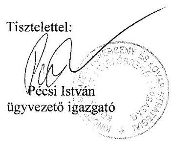

---

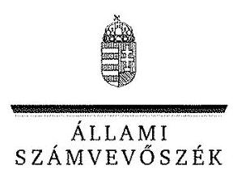

ELNÖK

Ikt.szám: EL-0428-023/2018.

# Pécsi István úr 

ügyvezető

Kincsem Nemzeti Lóverseny és Lovas Stratégiai Kft.

## Budapest

## Tisztelt Ügyvezető Úr!

Köszönettel vettem „Állami tulajdonú gazdasági társaságok - Az állami tulajdonban (résztulajdonban) lévő gazdálkodó szervezetek vagyonmegőrzési és gazdálkodási tevékenységének ellenőrzése - Kincsem Nemzeti Lóverseny és Lovas Stratégiai Kft." címmel készített számvevőszéki jelentéstervezetre megküldött észrevételét.
Az Állami Számvevőszék észrevételre vonatkozó álláspontját a felügyeleti vezető által készített részletes tájékoztatás tartalmazza, amelyet levelemhez mellékeltem.
Tájékoztatom Ügyvezető urat, hogy az Állami Számvevőszék a figyelembe nem vett észrevételeket az Állami Számvevőszékről szóló 2011. évi LXVI. törvény 29. § (3) bekezdésében előírtak szerint köteles a jelentésében feltüntetni és megindokolni, hogy azokat miért nem fogadta el.

Budapest, 2018. június
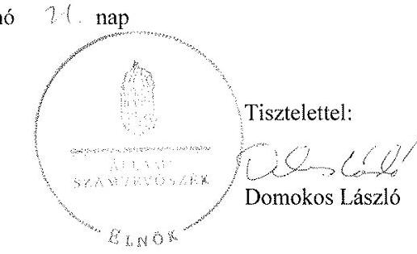

Melléklet: Tájékoztatás az észrevételek kezeléséről

---

# Tájékoztatás az észrevételek kezeléséről 

Megköszönöm Ügyvezető úrnak az „Állami tulajdonú gazdasági társaságok ellenőrzése - Az állami tulajdonban (résztulajdonban) lévő gazdálkodó szervezetek vagyonmegőrzési és gazdálkodási tevékenységének ellenőrzése - Kincsem Nemzeti Lóverseny és Lovas Stratégiai Kft. "címmel készített jelentés-tervezetre tett észrevételeit. Az észrevételek kezeléséről az alábbi tájékoztatást adom.

## 1. számú észrevétel:

Az észrevétel a jelentéstervezet 3.1. számú megállapítás 1. és 6. bekezdéseit, valamint az ügyvezetőnek címzett 3. számú javaslatot érintette.

## „3.1. sz. megállapítás

Az ügyvezetők részére történő kifizetésekkel kapcsolatos szabálytalanságot a Társaság a megállapítás és a jogszabályi hivatkozás ellenére sem tudja pontosan beazonosítani, így kérjük a Tisztelt Számvevőszéket a szabálytalanság részletesebb kifejtésére annak esetleges kijavítása, illetve jövőben történő elkerülése érdekében.

A helyiségbérleti számlák azért nem tartalmaztak áfát, mert a Társaság 2013. évben az általános szabályok szerint állapította meg az áfa összegét. A szerződésben szereplő „+áfa” kitétel álláspontunk szerint a mindenkor hatályos áfa összegére vonatkozik, mely a kérdéses évben „0%” volt.”

Ügyvezető úr észrevételében leírtak alapján a jelentéstervezet 3.1. számú megállapítás 1. és 6. bekezdéseit, valamint az ügyvezetőnek címzett 3. számú javaslatot nem módosítom az alábbiak miatt:

Az ÁSZ az ellenőrzést a V-1136-004/2016. iktatószámú ellenőrzési program, az ellenőrzött időszakban hatályos jogszabályok, az ellenőrzés szakmai szabályok és módszertanok figyelembe vételével végezte. A jelentéstervezetben a 3.1. számú megállapítás 1. bekezdésében tett megállapítást az ÁSZ az ellenőrzött időszakra vonatkozóan az előírt adatszolgáltatási határidőre az ellenőrzés rendelkezésére bocsátott dokumentumok, adatok, információk alapján tette meg, a részkérdések megválaszolása, a hiányosságok rögzítése után, a kiértékelést követően.

Az észrevétel első részéhez kapcsolódóan:
Az Állami Számvevőszék (ÁSZ) az EL-0428-001/2017. iktatószámú adatbekérő levele 2. számú melléklet (dokumentumjegyzék) 1.1. pontjában, annak alpontjaiban részletezettek szerint kérte a vezető tisztségviselők javadalmazásának dokumentumait. A 2017. november 30-án kelt Teljességi és hitelességi nyilatkozatban Ügyvezető úr az ügyvezetők részére történt személyi jellegű kifizetések dokumentumainak teljességéről és hiánytalanságáról nyilatkozott. E nyilatkozatban az átadott

---

dokumentumokra a 2.a melléklet 1-5. pontjai hivatkoztak. A rendelkezésre bocsátott dokumentumok ismételt áttekintését követően megállapítottuk, hogy az ellenőrzés számára nem állt rendelkezésre az (előző) ügyvezetőnek a 2012. január - 2013. március hó közötti időszakban a szállásköltség-térítés kifizetését alátámasztó dokumentum. Az ügyvezető 2014. október 1. és 2015. december 31. között elszámolt munkabére tekintetében a 2014. évben munkaszerződés, megbízási szerződés, a teljes időszakban munkaidő elszámolás nem állt rendelkezésre, a 2014. évben a bérszámfejtési lap tartalmilag hiányos volt, 2014 októberében a kiküldetési rendelvény és az elszámolás dokumentuma hiányzott.

Az észrevétel második részéhez kapcsolódóan:
Az ÁSZ az EL-0428-001/2017. iktatószámú adatbekérő levele 2. számú melléklet (dokumentumjegyzék) 1.2.6. pontjában részletezettek szerint kérte a Társaság kapcsolt vállalkozással kötött szerződések teljesítésével kapcsolatos elszámolások dokumentumait. A 2017. november 30-án kelt Teljességi és hitelességi nyilatkozatban Ügyvezető úr a kapcsolt vállalkozással kötött szerződések teljesítésével kapcsolatos elszámolások dokumentumainak teljességéről és hiánytalanságáról nyilatkozott. E nyilatkozatban az átadott dokumentumokra a 2.a melléklet 45-139. pontjai hivatkoznak. Az ellenőrzés számára átadott dokumentumok ismételt áttekintést követően megállapítottuk, hogy a Magyar Lóversenyfogadást-szervező Kft. felé kiszámlázott 2013. évi bérleti díjra vonatkozó számla a 2013. évben hatályos bérleti szerződésben megjelöltek ellenére nem tartalmazta az általános forgalmi adó összegét.

A fentiek alapján a jelentéstervezet 3.1. számú megállapítás 1. és 6. számú bekezdéseiben foglalt megállapítások és az ügyvezetőnek címzett 3. számú javaslat továbbra is helytálló, megalapozott.

# 2. számú észrevétel: 

Az észrevétel a jelentéstervezet 4.2. számú megállapítás 9. bekezdését, valamint az ügyvezetőnek címzett 9. számú javaslatot érintette.

## „4.2. sz. megállapítás

A Magyar Lóversenyfogadást-szervező Kft. vonatkozásában kimutatott követelésekkel és kötelezettségekkel kapcsolatos szabálytalanságot a Társaság a megállapítás és a jogszabályi hivatkozás ellenére sem tudja pontosan beazonosítani, így kérjük a Tisztelt Számvevőszéket a szabálytalanság részletesebb kifejtésére annak esetleges kijavítása, illetve jövőben történő elkerülése érdekében.”

Ügyvezető úr észrevételében leírtak alapján a jelentéstervezet 4.2. számú megállapítás 9. bekezdését, valamint az ügyvezetőnek címzett 9. számú javaslatot nem módosítom az alábbiak miatt:

Az ÁSZ az EL-0428-001/2017. iktatószámú adatbekérő levele 2. számú melléklet (dokumentumjegyzék) 1.2. pontjában, annak alpontjaiban részletezettek szerint kérte a Társaság

---

kapcsolt vállalkozásában nyilvántartott követeléseivel és kötelezettségeivel kapcsolatos dokumentumokat. A 2017. november 30-án kelt Teljességi és hitelességi nyilatkozatban Ügyvezető úr a kapcsolt vállalkozással összefüggő követelések és kötelezettségek dokumentumainak teljességéről és hiánytalanságáról nyilatkozott. Ügyvezető úr 2017. november 29-én tett nyilatkozata szerint a társaság nem rendelkezett az adatbekérő levelünk 1.2.2.-1.2.4 és 1.2.6.5. pontjaiban felsorolt dokumentumokkal (a szokásos piaci árral kapcsolatos nyilvántartások, valamint a kapcsolt vállalkozások vonatkozásában követelés elengedés, behajthatatlan követelés és leírás dokumentumai, megállapodások a követelés elengedésről). A rendelkezésre bocsátott dokumentumok ismételt áttekintését követően megállapítottuk, hogy az ellenőrzés számára olyan nyilvántartás állt rendelkezésre, amely a kapcsolt vállalkozással szembeni követelések és kötelezettségek áttekintését nem tette lehetővé.
A fentiek alapján a jelentéstervezet 4.2. számú megállapítás 9. bekezdését, valamint az ügyvezetőnek címzett 9. számú javaslat továbbra
 is helytálló, megalapozott.

Megköszönöm Ügyvezető úr észrevételeinek záró részében a feltárt hiányosságok kezelésével kapcsolatban tervezett intézkedésekről adott tájékoztatását.

Budapest, 2018. június hó 24. nap
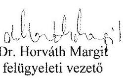

---

# Állami Számvevőszék 

## Domokos László

## elnök

1052 Budapest
Apáczai Cs. J. u. 10.

Ikt. sz.: MNV/01/31544/4/2018.
Hiv. sz.: EL-0428-015/2018.

Tisztelt Elnök Úr!
Tájékoztatom, hogy a 2018. május 9. napján, „Az állami tulajdonban (résztulajdonban) lévő gazdálkodó szervezetek vagyonmegőrzési és gazdálkodási tevékenységének ellenőrzése - Kincsem Nemzeti Lóverseny és Lovas Stratégiai Kft." tárgyában kézhez vett, EL-0428-015/2018. ikt. sz. levél mellékleteként megküldött Jelentés-tervezetre az alábbi észrevételeket tesszük.
„4.1. számú megállapítás" / 19. oldal 4. bekezdés 1. pont és „Az MNV Zrt. vezérigazgatójának" 1. sz. javaslat / 24. oldal:

A megállapítással összefüggésben szükségesnek tartjuk rögzíteni, hogy a vonatkozó, a vizsgált időszakban is hatályos jogszabályi előírások alapján a vagyonkezelt vagyonon végrehajtott értéknövelő beruházásokra is kiterjed a fennálló vagyonkezelői jogviszony, e tekintetben a vagyonkezelési szerződés módosítása nem szükséges. Ezen álláspontunk alátámasztható a nemzeti vagyonról szóló 2011. évi CXCVI. törvény (a továbbiakban: Nvtv.) 11. § (6a) bekezdésével, amely szerint „a felek eltérő megállapodásának hiányában a vagyonkezelői jog e törvény erejénél fogva kiterjed arra a vagyonelemre is - ideértve a tartozékot és az alkotórészt is -, amely a vagyonkezelői jogviszony fennállása alatt válik a vagyon részévé", valamint az állami vagyonnal való gazdálkodásról szóló 254/2007. (X. 4.) Korm. rendelet (a továbbiakban: Vhr.) 18. § (3c) bekezdésében foglaltakkal, miszerint „Az Nvtv. 11. § (6a) bekezdésére figyelemmel azokban az esetekben, ahol a felújítás, beruházás eredményére a meglévő vagyon részeként a vagyonkezelői jog a törvény erejénél fogva kiterjed, nincs szükség a vagyonkezelési szerződés módosítására. Ez esetben a számviteli szabályok szerinti elszámolásra a vagyonkezelő (3) bekezdésben meghatározott adatszolgáltatásának a tulajdonosi joggyakorló írásbeli elfogadása alapján kerül sor."

Az előzőekben írtak szerint tehát a Kincsem Nemzeti Lóverseny és Lovas Stratégia Kft. (a továbbiakban: Kincsem Kft.) beruházása kapcsán a Vhr. 18. § (3c) bekezdése alkalmazandó, amelyre figyelemmel kérjük törölni a „4.1. számú megállapítás" 4. bekezdés 1. pontja szerinti megállapítást, valamint „az MNV Zrt. Vezérigazgatójának" 1. sz. javaslatában szereplő „valamint az értéknövelő beruházás megfelelő kezelése érdekében" szövegrészt.

Jelezni kívánjuk egyúttal, hogy a Kincsem Kft.-vel Társaságunk részéről már hosszabb ideje folyamatban van az értéknövelő beruházásokra vonatkozó ún. elszámolási megállapodás megkötésének előkészítése,

---

amelyet követően sor kerül a vagyonkezelési szerződés módosítására is, összhangban a Jelentéstervezetben az Állami Számvevőszék által rögzíteni kívánt javaslattal.

# „4.1. számú megállapítás" / 19. oldal 4. bekezdés 2. pont: 

A Dunakeszi 3169 helyrajzi számú ingatlanra vonatkozó megállapítással összefüggésben szükséges megjegyezni, hogy az SZT-103420 számú szerződés IV.4. pontja kifejezetten rögzíti, hogy az MNV Zrt. és a Kincsem Kft. között létrejött SZT-35123 számú szerződés ezen ingatlan tekintetében külön rendelkezés nélkül részlegesen megszűnik, valamint a vagyonkezelési szerződés változatlan tartalommal továbbra is hatályban marad. Az SZT-103420 számú szerződés IV. 4. pontja szerinti rendelkezés összhangban áll a Vhr. 12. § (1) bekezdés c) pontjában írtakkal.

Az előzőekben írtakra figyelemmel e kérdéskörben sem indokolt a SZT-35123 számú szerződés módosítása, amelyre tekintettel e megállapítást is kérjük törölni.
„4.3. számú megállapítás" / 21. oldal 1. bekezdés és „Az MNV Zrt. vezérigazgatójának" 2. j) sz. javaslat / 24. oldal:

A megállapítással összefüggésben szükségesnek tartjuk előzetesen rögzíteni, hogy az MNV Zrt. álláspontja szerint a vagyonkezelési szerződés nem írja elő, hogy a Kincsem Kft.-nek a vagyonkezelt vagyonelemek értékcsökkenéséből eredő visszapótlási kötelezettséget minden évben teljesítenie szükséges, valamely kötelezettség évenkénti mértékének meghatározása nem jelent évenkénti teljesítési kötelezettséget. Ilyen irányú rendelkezés az általános számviteli és vagyongazdálkodási elvekkel is ellentétes lenne.

A 4.3. számú megállapításhoz kapcsolódó részletezés már maga is arra utal, hogy a Kincsem Kft. a vizsgált időszakban nem végzett az elszámolt értékcsökkenést elérő mértékű beruházást (ezen időszakban nem tett eleget a visszapótlási kötelezettségnek). A 4.3. számú megállapításhoz kapcsolódó részletezés szövegezése megegyezik az MNV Zrt. álláspontjával, azaz függetlenül attól, hogy a Kincsem Kft. a vizsgált időszakban a visszapótlási kötelezettségének megfelelő beruházást nem teljesített, sem a Társaságot, sem az MNV Zrt.-t e kérdéskörben mulasztás nem terheli, mivel a visszapótlási kötelezettséget nem szükséges és korábban sem kellett minden évben teljesíteni, az a vagyonkezelési jogviszony során folyamatosan teljesíthető, vagy a jogviszony megszűnését követően a vagyonkezelő azt pénzben kifejezhető összegben is megfizetheti az MNV Zrt. felé.

Az előzőekben írtakra figyelemmel javasoljuk a 4.3. számú megállapítás, valamint „az MNV Zrt. Vezérigazgatójának" 2. j) sz. javaslatában szereplő „vagyonkezelt eszközök visszapótlási kötelezettségének elmulasztása" szövegrész pontosítását, amely alapján megállapítható, hogy a Kincsem Kft. a vizsgált időszakban nem tett eleget a visszapótlási kötelezettségének, ugyanakkor a visszapótlási kötelezettség megfelelő teljesítésére a vagyonkezelési jogviszony során folyamatosan lehetősége van, így e kérdésben a feleket intézkedési kötelezettség nem terheli.

Kérem Elnök Urat, hogy a jelentés véglegesítése során jelen észrevételeinket szíveskedjenek figyelembe venni.

Budapest, 2018. május 3.
Üdvözlettel:
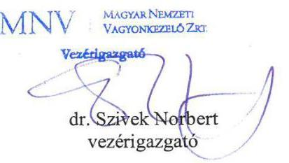

---

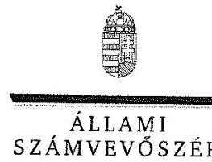

ELNÖK

Ikt. szám: EL-0428-025/2018.

# Dr. Szivek Norbert úr 

vezérigazgató
Magyar Nemzeti Vagyonkezelő Zrt.

## Budapest

## Tisztelt Vezérigazgató Úr!

Köszönettel vettem „Állami tulajdonú gazdasági társaságok - Az állami tulajdonban (résztulajdonban) lévő gazdálkodó szervezetek vagyonmegőrzési és gazdálkodási tevékenységének ellenőrzése - Kincsem Nemzeti Lóverseny és Lovas Stratégiai Kft." címmel készített számvevőszéki jelentéstervezetre megküldött észrevételét.
Az Állami Számvevőszék észrevételre vonatkozó álláspontját a felügyeleti vezető által készített részletes tájékoztatás tartalmazza, amelyet levelemhez mellékeltem.
Tájékoztatom Vezérigazgató urat, hogy az Állami Számvevőszék a figyelembe nem vett észrevételeket az Állami Számvevőszékről szóló 2011. évi LXVI. törvény 29. § (3) bekezdésében előírtak szerint köteles a jelentésében feltüntetni és megindokolni, hogy azokat miért nem fogadta el.

Budapest, 2018. június
hó 19. nap
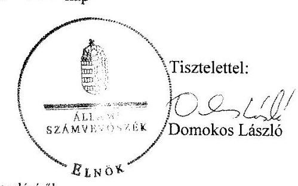

Melléklet: Tájékoztatás az észrevételek kezeléséről

---

# Tájékoztatás az észrevételek kezeléséről 

Megköszönöm Vezérigazgató úrnak az „Állami tulajdonú gazdasági társaságok ellenőrzése - Az állami tulajdonban (résztulajdonban) lévő gazdálkodó szervezetek vagyonmegőrzési és gazdálkodási tevékenységének ellenőrzése - Kincsem Nemzeti Lóverseny és Lovas Stratégiai Kft."címmel készített jelentéstervezetre tett észrevételeit. Az észrevételek kezeléséről az alábbi tájékoztatást adom.

## 1. számú észrevétel:

Az észrevétel a jelentéstervezet 4.1. számú megállapítás 4. bekezdés 1. francia bekezdését, valamint a Magyar Nemzeti Vagyonkezelő Zrt. (MNV Zrt.) vezérigazgatójának címzett 1. számú javaslatot érintette.
„4.1. számú megállapítás" / 19. oldal 4. bekezdés 1. pont és „Az MNV Zrt. vezérigazgatójának" 1. sz.
javaslat/ 24. oldal:
A megállapítással összefüggésben szükségesnek tartjuk rögzíteni, hogy a vonatkozó, a vizsgált időszakban is hatályos jogszabályi előírások alapján a vagyonkezelt vagyonon végrehajtott értéknövelő beruházásokra is kiterjed a fennálló vagyonkezelői jogviszony, e tekintetben a vagyonkezelési szerződés módosítása nem szükséges. Ezen álláspontunk alátámasztható a nemzeti vagyonról szóló 2011. évi CXCVI. törvény (a továbbiakban: Nvtv.) 11. § (6a) bekezdésével, amely szerint „a felek eltérő megállapodásának hiányában a vagyonkezelői jog e törvény erejénél fogva kiterjed arra a vagyonelemre is - ideértve a tartozékot és az alkotórészt is - amely a vagyonkezelői jogviszony fennállása alatt válik a vagyon részévé", valamint az állami vagyonnal való gazdálkodásról szóló 254/2007. (X. 4.) Korm. rendelet (a továbbiakban: Vhr.) 18. § (3c) bekezdésében foglaltakkal, miszerint „Az Nvtv. 11. § (6a) bekezdésére figyelemmel azokban az esetekben, ahol a felújítás, beruházás eredményére a meglévő vagyon részeként a vagyonkezelői jog a törvény erejénél fogva kiterjed, nincs szükség a vagyonkezelési szerződés módosítására. Ez esetben a számviteli szabályok szerinti elszámolásra a vagyonkezelő (3) bekezdésben meghatározott adatszolgáltatásának a tulajdonosi joggyakorló írásbeli elfogadása alapján kerül sor."
Az előzőekben írtak szerint tehát a Kincsem Nemzeti Lóverseny és Lovas Stratégiai Kft. (a továbbiakban: Kincsem Kft.) beruházása kapcsán a Vhr. 18. § (3c) bekezdése alkalmazandó, amelyre figyelemmel kérjük törölni a „4.1. számú megállapítás" 4. bekezdés 1. pontja szerinti megállapítást, valamint „az MNV Zrt. Vezérigazgatójának" 1. sz. javaslatában szereplő „valamint az értéknövelő beruházás megfelelő kezelése érdekében" - részét nem módosítom az alábbiak miatt:

Az észrevétel az Nvtv. 11. § (6a) bekezdésére, továbbá a Vhr. 18. § (3c) bekezdésében foglaltakra hivatkozással kérte törölni a jelentéstervezet vonatkozó megállapítását és javaslatát. Az Nvtv. 11. §

---

(6a) bekezdésében rögzített előírás azonban csak a felek eltérő megállapodása hiányában terjeszti ki a vagyonkezelői jogot arra a vagyonelemre is, amely a vagyonkezelői jogviszony fennállása alatt válik a vagyon részévé. A Kincsem Kft. (Társaság) és az MNV Zrt. között azonban az ellenőrzött időszak alatt hatályban volt a Nemzeti Lóverseny Korlátolt Felelősségű Társaság (a Társaság egyik jogelődje) és az MNV Zrt. között megkötött SZT-35123 számú, 2010. augusztus 31-én kelt (ezt követően nem módosított) vagyonkezelési szerződés (Vagyonkezelési szerződés), amelynek 5.8. pontja szerint a vagyonkezelési szerződés módosítására lett volna szükség az értéknövelő beruházással összefüggésben.

Vagyonkezelési szerződés 5.8. pont: „Amennyiben a Vagyonkezelő a vagyonkezelésbe kapott ingatlanon az MNV Zrt. 5.4. pontban foglaltak alapján kiadott előzetes, írásbeli hozzájárulása alapján értéknövelő beruházást, felújítást hajt végre, illetve új - állami vagyonba tartozó - eszközt hoz létre saját pénzeszközei, vagy más külső forrás felhasználásával, vagy az értékcsökkenési leírásának visszaforgatásával, úgy a beruházás megvalósulását követően felek a jelen vagyonkezelési szerződést módosítják és azt a módosításban foglalt feltételekkel, a beruházás értékén Vagyonkezelő vagyonkezelésébe adják. A ténylegesen megvalósított értéknövelő beruházásra, felújításra, illetve új eszköz létrehozására fordított összegeket eszközönként, pénzügyi forrásonként a Vagyonkezelő köteles részletezni."

Az eltérő megállapodásra tekintettel a jelentéstervezetben az észrevételben hivatkozott Nvtv. 11. § (6a) és Vhr. 18. § (3c) bekezdés nem alkalmazható. A megállapítás megtételénél megalapozottan vettük figyelembe Vhr. 18. § (1) bekezdés c) pontjában foglaltakat, mely szerint az egyéb vagyonkezelővel kötött vagyonkezelési szerződést a vagyonnövekedés számviteli szabályok szerinti elszámolása érdekében módosítani kell, ha a vagyonkezelő a vagyonkezelésében lévő állami vagyonon - a tulajdonosi joggyakorló előzetes hozzájárulásával - értéknövelő beruházást, felújítást hajt végre, illetve új - állami vagyonba tartozó - eszközt hoz létre elszámolási kötelezettséggel kapott külső forrásból.

A fentiekre tekintettel a jelentéstervezetben a 4.1. számú megállapítás 4. bekezdés 1. francia bekezdését kiegészítem az ellenőrzött időszakban hatályban lévő vagyonkezelési szerződés előírására történő hivatkozással az alábbiak szerint. A javaslat ugyanakkor továbbra is megalapozott, azt nem módosítom.

# A vagyonkezelési szerződés módosítása nem történt meg: 

- a Társaság a 2015. évben 201,9 millió Ft aktivált értékű értéknövelő beruházást hajtott végre a vagyonkezelt ingatlanokon, de a Vhr. 18. § (1) bekezdés c) pontjában, valamint a vagyonkezelési szerződés 5.8. pontjában foglaltakkal ellentétben a szerződés módosítására nem került sor;

---

Az észrevétel utolsó részében az értéknövelő beruházások elszámolására vonatkozó megállapodás előkészítésével kapcsolatos tájékoztatást tudomásul veszem. A tájékoztatás a jelentéstervezet lényeges megállapításait nem befolyásolja.

# 2. számú észrevétel: 

Az észrevétel a jelentéstervezet 4.1. számú megállapítás 4. bekezdés 2. francia bekezdését érintette.

## „4.1. számú megállapítás" /19. oldal 4. bekezdés 2. pont:

A Dunakeszi 3169 helyrajzi számú ingatlanra vonatkozó megállapítással összefüggésben szükséges megjegyezni, hogy az SZT-103420 számú szerződés IV.4. pontja kifejezetten rögzíti,
 hogy az MNV Zrt. és a Kincsem Kft. között létrejött SZT-35123 számú szerződés ezen ingatlan tekintetében külön rendelkezés nélkül részlegesen megszűnik, valamint a vagyonkezelési szerződés változatlan tartalommal továbbra is hatályban marad. Az SZT-103420 számú szerződés IV. 4. pontja szerinti rendelkezés összhangban áll a Vhr. 12. § (1) bekezdés c) pontjában írtakkal.
Az előzőekben írtakra figyelemmel e kérdéskörben sem indokolt a SZT-35123 számú szerződés módosítása, amelyre tekintettel e megállapítást is kérjük törölni.
Vezérigazgató úr észrevételét elfogadom, a jelentéstervezet 4.1. számú megállapítás 4. bekezdés 2. francia bekezdésében foglaltakat törlöm az alábbiak szerint:
Jelentéstervezet a 4.1. számú megállapítás 4. bekezdés 2. francia bekezdés:
A vagyonkezelési szerződés módosítása nem történt meg:
$\cdot$ a 19 millió Ft nyilvántartási értékű belterületi ingatlant az MNV Zrt. 2015
márciusában ingyenesen átruházta harmadik fél részére az SZT 103420 számú
megállapodással, ezzel az ingatlan kikerült a Társaság vagyonkezeléséből. A
vagyonkezelési szerződés módosítására nem került sor.
A módosítás a jelentéstervezet lényeges megállapításait nem befolyásolja.

## 3. számú észrevétel:

Az észrevétel a jelentéstervezet 4.3. számú megállapítás 1. bekezdését, a Társaság ügyvezetőjének címzett 10. számú és az MNV Zrt. vezérigazgatójának címzett 2. j) számú javaslatot érintette.
„4.3. számú megállapítás" / 21. oldal 1. bekezdés és „Az MNV Zrt. vezérigazgatójának" 2. j) sz. javaslat / 24. oldal:

A megállapítással összefüggésben szükségesnek tartjuk előzetesen rögzíteni, hogy az MNV Zrt. álláspontja szerint a vagyonkezelési szerződés nem írja elő, hogy a Kincsem Kft.-nek a vagyonkezelt vagyonelemek értékcsökkenéséből eredő visszapótlási kötelezettséget minden évben teljesítenie

---

szükséges, valamely kötelezettség évenkénti mértékének meghatározása nem jelent évenkénti teljesítési kötelezettséget. Ilyen irányú rendelkezés az általános számviteli és vagyongazdálkodási elvekkel is ellentétes lenne.
A 4.3. számú megállapításhoz kapcsolódó részletezés már maga is arra utal, hogy a Kincsem Kft. a vizsgált időszakban nem végzett az elszámolt értékcsökkenést elérő mértékű beruházást (ezen időszakban nem tett eleget a visszapótlási kötelezettségnek). A 4.3. számú megállapításhoz kapcsolódó részletezés szövegezése megegyezik az MNV Zrt. álláspontjával, azaz függetlenül attól, hogy a Kincsem Kft. a vizsgált időszakban a visszapótlási kötelezettségének megfelelő beruházást nem teljesített, sem a Társaságot, sem az MNV Zrt.-t e kérdéskörben mulasztás nem terheli, mivel a visszapótlási kötelezettséget nem szükséges és korábban sem kellett minden évben teljesíteni, az a vagyonkezelési jogviszony során folyamatosan teljesíthető, vagy a jogviszony megszűnését követően a vagyonkezelő azt pénzben kifejezhető összegben is megfizetheti az MNV Zrt. felé.
Az előzőekben írtakra figyelemmel javasoljuk a 4.3. számú megállapítás, valamint „az MNV Zrt. vezérigazgatójának" 2. j) sz. javaslatában szereplő „vagyonkezelt eszközök visszapótlási kötelezettségének elmulasztása" szövegrész pontosítását, amely alapján megállapítható, hogy a Kincsem Kft. a vizsgált időszakban nem tett eleget a visszapótlási kötelezettségének, ugyanakkor a visszapótlási kötelezettség megfelelő teljesítésére a vagyonkezelési jogviszony során folyamatosan lehetősége van, így e kérdésben a feleket intézkedési kötelezettség nem terheli.

Vezérigazgató úr észrevételét tudomásul veszem, részben elfogadom az alábbiak szerint:
A Vhr. 9. § (9) bekezdés d) pontjában foglalt előírás a vagyonkezelési szerződésben rendeli meghatározni az értékcsökkenés visszapótlásával kapcsolatos elszámolás végrehajtásának gyakoriságát, annak érdekében, hogy a vagyonkezelésbe vett vagyonelemek köre után előírt visszapótlási kötelezettség teljesítése megállapítható legyen.

Vhr. 9. § (9) bekezdés, d) pont: „Az államháztartás alrendszerébe nem tartozó egyéb vagyonkezelő köteles továbbá: ... a vagyonkezelési szerződésben meghatározott gyakorisággal az értékcsökkenés visszapótlásával kapcsolatos elszámolást elvégezni úgy, hogy a vagyonkezelésbe vett vagyonelemek köre után előírt visszapótlási kötelezettségének teljesítése megállapítható legyen."

Vezérigazgató úr észrevételével szemben a Vagyonkezelési szerződés 7.7. pontja, illetve a 14.3. pontja az értékcsökkenés visszapótlási kötelezettség teljesítésének gyakoriságát meghatározza, és a Vhr. 9. § (9) bekezdésével összhangban a visszapótlási kötelezettség teljesítését is. Erre tekintettel a visszapótlási kötelezettség nem teljesítésével összefüggő hiányosságot a vagyonkezelői szerződés megalapozza.

Vagyonkezelési szerződés 7.7. pont: „...Vagyonkezelő köteles továbbá az értékcsökkenés elszámolásában érintett vagyonelemek tekintetében az évi elszámolt értékcsökkenéssel megegyező összegben visszapótlást teljesíteni."

---

Vagyonkezelési szerződés 14.3. pont: „Vagyonkezelő a vagyonkezelt eszközök értékcsökkenéséről és az értéket növelő beruházásokról, felújításokról évente összesített tájékoztatást ad, külön indokolva, ha az értékcsökkenés mértéke meghaladja az értéknövekményt."

A Vhr. 9. § (9) bekezdés, d) pontjának előírása szerint a vagyonkezelési szerződésben meghatározott gyakorisággal az értékcsökkenés elszámolását úgy kellett volna elvégeznie a társaságnak, hogy a vagyonelemek köre után előírt visszapótlási kötelezettség teljesítése megállapítható legyen. E jogszabályi kötelezettségnek tett eleget az MNV Zrt. és a társaság, amikor a vagyonkezelési szerződésben rögzítették az értékcsökkenés elszámolásában érintett vagyonelemek tekintetében az évi elszámolt értékcsökkenéssel megegyező összegben történő visszapótlási kötelezettség teljesítését. Továbbá rögzítették a nem teljesítés esetére a tulajdonos felé történő tájékoztatási kötelezettséget, amennyiben az értékcsökkenés meghaladja az értéknövekményt. Erre tekintettel a jelentéstervezet 4.3. számú megállapítás 1. bekezdésből a jogszabályi hivatkozást törlöm, ugyanakkor kiegészítem a vagyonkezelési szerződésre történő hivatkozással, továbbá a megállapítás szövegét pontosítom az alábbiak szerint:

- A VISSZAPÓTLÁSI KÖTELEZETTSÉGRE vonatkozó előírásokat a vagyonkezelésbe vett vagyonelemek tekintetében - nem tartotta be a Társaság, mert a 2013-2015. években a Társaság a vagyonkezelési szerződés 7.7. és 14.3. pontjában foglaltak Vtv. 27. § (7) bekezdés rendelkezései ellenére nem teljesítette - végzett a vagyonkezelt vagyonhoz kapcsolódóan az elszámolt értékcsökkenést elérő mértékű beruházást.

A Társaság ügyvezetőjének címzett 10. számú javaslatból a jogszabályi hivatkozást törlöm, valamint kiegészítem a vagyonkezelési szerződésre történő hivatkozással az alábbiak szerint:

- Intézkedjen a vagyonkezelt vagyon tekintetében a visszapótlási kötelezettség teljesítéséről a vagyonkezelési szerződésnek Vtv. előírásainak megfelelően.

Az MNV Zrt. vezérigazgatójának címzett 2. j) számú javaslatot nem módosítom.
A módosítás a jelentéstervezet lényeges megállapításait és javaslatait érdemben nem befolyásolja.

Budapest, 2018. június hó 15. nap

Dr. Horváth Margit
felügyeleti vezető

---

.

---

# RÖVIDÍTÉSEK JEGYZÉKE 

${ }^{1}$ MFB Zrt.
${ }^{2}$ jogelőd:
${ }^{3}$ Vtv.
${ }^{4}$ MNV Zrt.
${ }^{5}$ Társaság
${ }^{6}$ MLFSZ
${ }^{7}$ Art.
${ }^{8}$ Kincsem Park
${ }^{9}$ jogelőd:
${ }^{10}$ vagyonkezelési szerződés
${ }^{11}$ Nemzeti Lovas Program
${ }^{12}$ alapítói határozat
${ }^{13}$ ÁSZ
${ }^{14}$ ÁSZ tv.
${ }^{15}$ Gt.
${ }^{16}$ Ptk. 2
${ }^{17}$ alapító okirat1-11

Magyar Fejlesztési Bank Zrt.
Agrárgazdasági Vagyonkezelő Korlátolt Felelősségű Társaság
2007. évi CVI. törvény az állami vagyonról (hatályos: 2007. szeptember 25-től)

Magyar Nemzeti Vagyonkezelő Zrt.
Kincsem Nemzeti Lóverseny és Lovas Stratégiai Kft.
Magyar Lóversenyfogadást - szervező Kft.
az adózás rendjéről szóló 2003. évi XCII. törvény (hatályos: 2017. december 31-ig)
a Budapest X. Albertirsai út 2-4. szám alatti lóversenypálya
Nemzeti Lóverseny Korlátolt Felelősségű Társaság
Az MNV Zrt. és a jogelőd: között létrejött SZT-35123 számú vagyonkezelési szerződés
A Kormány által 2012. február 29-én elfogadott program és az 1061/2012.(III.12.) Korm. határozat a Nemzeti Lovas Programban meghatározott feladatokról és a kiemelt feladatok végrehajtásához szükséges intézkedésekről
az MNV Zrt 539/2014. (IX. 22.) számú alapítói határozata a felügyelőbizottság tagjainak díjazásáról
Állami Számvevőszék
2011. évi LXVI. törvény az Állami Számvevőszékről (hatályos: 2011. július 1-jétől) 2006. évi IV. törvény a gazdasági társaságokról (hatálytalan: 2014. március 15-től) 2013. évi V. törvény a Polgári Törvénykönyvről (hatályos: 2014. március 15-től) alapító okirat: a Kincsem Nemzeti Lóverseny és Lovas Stratégiai Kft. alapító okirata, hatályos 2011. december 30-tól 2012. május 20-ig;
alapító okirat2: a Kincsem Nemzeti Lóverseny és Lovas Stratégiai Kft. alapító okirata, hatályos 2012. május 21-től 2012. augusztus 6-ig;
alapító okirat3: a Kincsem Nemzeti Lóverseny és Lovas Stratégiai Kft. alapító okirata, hatályos 2012. augusztus 7-től 2012. december 27-ig;
alapító okirat4: a Kincsem Nemzeti Lóverseny és Lovas Stratégiai Kft. alapító okirata, hatályos 2012. december 28-tól 2013. május 23-ig;
alapító okirat5: a Kincsem Nemzeti Lóverseny és Lovas Stratégiai Kft. alapító okirata, hatályos 2013. május 24-től 2014. május 28-ig;
alapító okirat6: a Kincsem Nemzeti Lóverseny és Lovas Stratégiai Kft. alapító okirata, hatályos 2014. május 29-től 2014. augusztus 6-ig;
alapító okirat7: a Kincsem Nemzeti Lóverseny és Lovas Stratégiai Kft. alapító okirata, hatályos 2014. augusztus 6-tól 2014. október 1-ig;
alapító okirat8: a Kincsem Nemzeti Lóverseny és Lovas Stratégiai Kft. alapító okirata, hatályos 2014. október 2-től 2014. december 11-ig;
alapító okirat9: a Kincsem Nemzeti Lóverseny és Lovas Stratégiai Kft. alapító okirata, hatályos 2014. december 11-től 2014. április 20-ig;
alapító okirat10: a Kincsem Nemzeti Lóverseny és Lovas Stratégiai Kft. alapító okirata, hatályos 2014. április 20-tól 2014. május 18-ig;
alapító okirat11: a Kincsem Nemzeti Lóverseny és Lovas Stratégiai Kft. alapító okirata, hatályos 2015. május 18-tól 2015. december 31-én is

---

${ }^{18} \mathrm{SZMSZ}_{1-2}$
${ }^{19}$ adatszolgáltatás rendje
${ }^{20}$ monitoring szabályzat
${ }^{21}$ Taktv.
${ }^{22}$ számviteli politika $1-2$
${ }^{23}$ Számv. tv.
${ }^{24} \mathrm{Vhr}$.
${ }^{25}$ pénzkezelési szabályzat
${ }^{26}$ leltározási szabályzat
${ }^{27}$ eszközök és források értékelési szabályzata
${ }^{29} \mathrm{Bkr}$.
${ }^{30}$ külső ellenőrzést végző szervek
${ }^{31} \mathrm{Ptk}_{1}$

SZMSZ1 a Kincsem Nemzeti Lóverseny és Lovas Stratégiai Korlátolt Felelősségű Társaság Szervezeti és Működési Szabályzata, hatályos: 2012. március 28-tól 2014. szeptember 30-ig
SZMSZ2 a Kincsem Nemzeti Lóverseny és Lovas Stratégiai Korlátolt Felelősségű Társaság Szervezeti és Működési Szabályzata, hatályos: 2014. október 1-jétől
MFB Zrt. 9/2012. Elnök-vezérigazgatói utasítás A Stratégiai csoport adatszolgáltatásának eljárási rendje
51/2013. Vezérigazgatói utasítás az MNV Zrt. portfóliójába tartozó többségi állami tulajdonú társaságok negyedéves tulajdonosi értekezleteiről (Társasági Monitoring Szabályzat) (hatályos: 2013. december 19-től)
2009. évi CXXII. törvény a köztulajdonban álló gazdasági társaságok takarékosabb működéséről (hatályos: 2009. december 4-től)
számviteli politika 1 hatályos 2012. január 1-jétől
számviteli politika2 hatályos 2012. december 1-jétől
a számvitelről szóló 2000. évi C. törvény
az állami vagyonnal való gazdálkodásról szóló 254/2007. (X. 4.) Korm. rendelet
pénzkezelési szabályzat1: a Nemzeti Lóverseny Kft. pénzkezelési szabályzata, hatályos: 2009. október 1-jétől
pénzkezelési szabályzat2: a Kincsem Nemzeti Lovas Stratégiai Kft. pénzkezelési szabályzata, hatályos 2012. június 1-jétől
leltározási szabályzat1: a Nemzeti Lóverseny Kft. 2005. június 1-jétől hatályos szabályzata;
leltározási szabályzat2, a Kincsem Nemzeti Lóverseny és Lovas Stratégiai Kft. szabályzata, hatályos 2012. június 1-jétől
eszközök és források értékelési szabályzata eszközök és források értékelési szabályzata1: a Nemzeti Lóverseny Kft. 2005. június 1-jétől hatályos szabályzata;
eszközök és források értékelési szabályzata2, a Kincsem Nemzeti Lóverseny és Lovas Stratégiai Kft. szabályzata, hatályos 2012. június 1-jétől
számlarend 1 hatályos 2012. január 1-jétől
számlarend2 hatályos 2012. december 1-jétől
370/2011. (XII. 31.) Korm. rendelet a költségvetési szervek belső kontrollrendszeréről és belső ellenőrzéséről (hatályos: 2012. január 1-jétől)
NAV Nemzeti Adó- és Vámhivatal
Munkaügyi Szaki. szerv - Budapest Fővárosi Kormányhivatal Munkavédelmi és Munkaügyi Szakigazgatási Szerve
NÉBIH - Nemzeti Élelmiszerlánc-biztonsági Hivatal
KEHI - Kormányzati Ellenőrzési Hivatal
KDB - Közbeszerzési Hatóság Közbeszerzési Döntőbizottság
GVH - Gazdasági Versenyhivatal
1959. évi IV. törvény a Polgári Törvénykönyvről (hatálytalan: 2014. március 15-től)

---

ÁLLAMI SZÁMVEVŐSZÉK
1052 Budapest, Apáczai Csere János utca 10.
Levélcím: 1364 Budapest 4. Pf. 54
Telefon: +36 1 4849100 Telefax: +36 1 4849200
www.asz.hu

