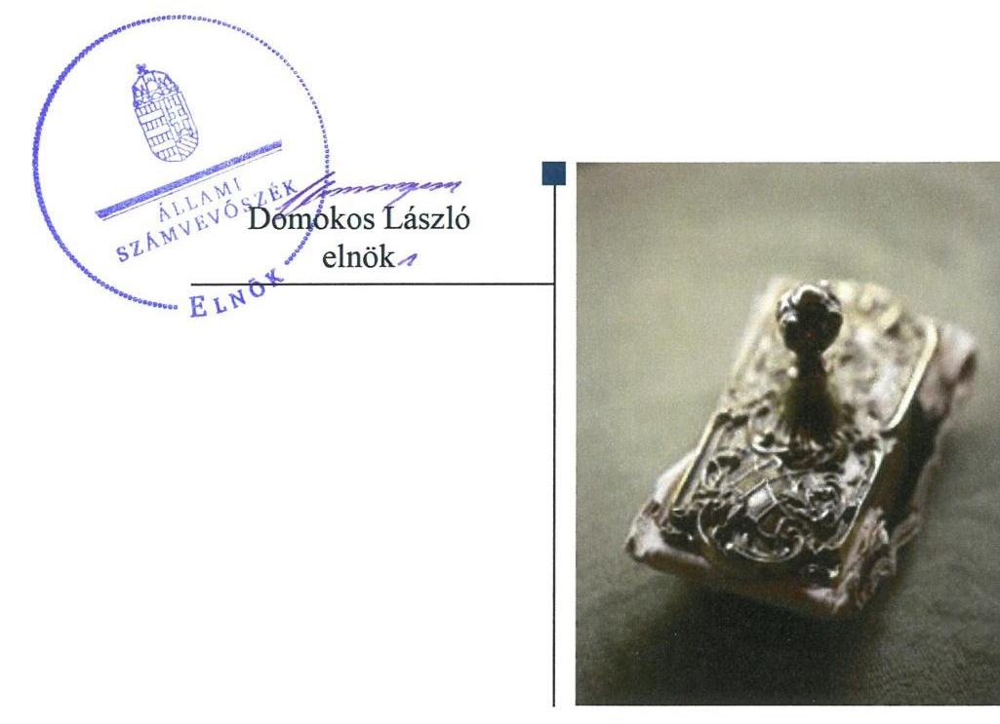
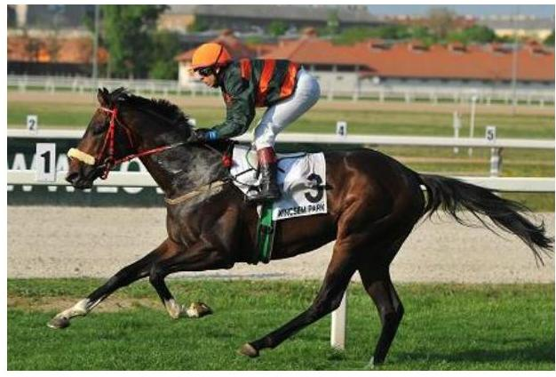
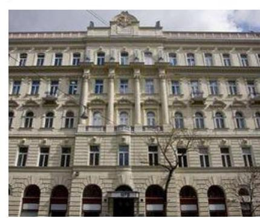
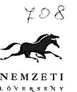
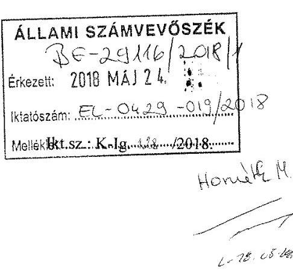
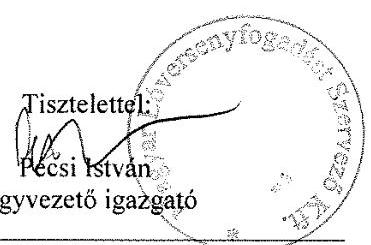
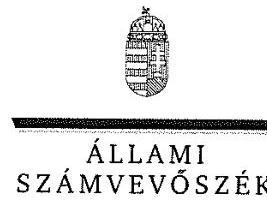
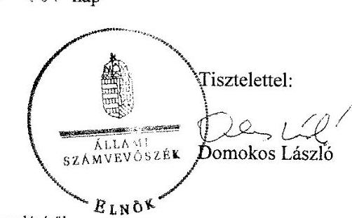

# Jelentés 

## Állami tulajdonú gazdasági társaságok

Az állami tulajdonban lévő gazdálkodó szervezetek vagyonmegőrzési és gazdálkodási tevékenységének ellenőrzése - Magyar Lóversenyfogadás-szervező Kft. 2018.

---

# Jelentés 

## Állami tulajdonú gazdasági társaságok

Az állami tulajdonban lévő gazdálkodó szervezetek vagyonmegőrzési és gazdálkodási tevékenységének ellenőrzése - Magyar Lóversenyfogadás-szervező Kft. 2018. augusztus 10. nap

---

# AZ ELLENŐRZÉST FELÜGYELTE:

DR. HORVÁTH MARGIT felügyeleti vezető

## AZ ELLENŐRZÉST VEZETTE ÉS A VÉGREHAJTÁSÁÉRT FELELŐS:

- JOÓ ERIKA ellenőrzésvezető
- A PROGRAM ÖSSZEÁLLÍTÁSÁÉRT FELELŐS:
- JANIK JÓZSEF LÁSZLÓ osztályvezető

**IKTATÓSZÁM:** EL-0429-024/2018.

**TÉMASZÁM:** 2402

**ELLENŐRZÉS-AZONOSÍTÓ SZÁM:** V075939

Jelentéseink az Országgyűlés számítógépes hálózatán és az Interneten a www.asz.hu címen is olvashatóak.

---

# TARTALOMJEGYZÉK 

■ ÖSSZEGZÉS ..... 5
■ AZ ELLENŐRZÉS CÉLJA ..... 6
■ AZ ELLENŐRZÉS TERÜLETE ..... 7
■ AZ ELLENŐRZÉS HÁTTERE, INDOKOLTSÁGA ..... 9
■ A JELENTÉS LÉNYEGES KÉRDÉSKÖREI ..... 10
■ ELLENŐRZÉS HATÓKÖRE ÉS MÓDSZEREI ..... 11
■ MEGÁLLAPÍTÁSOK ..... 13
■ JAVASLATOK ..... 17
■ MELLÉKLETEK ..... 19
I. sz. melléklet: Értelmező szótár ..... 19
■ FÜGGELÉK: ÉSZREVÉTELEK ..... 23
■ RÖVIDÍTÉSEK JEGYZÉKE ..... 29

---

.

---

# ÖSSZEGZÉS 

A Magyar Lóversenyfogadás-szervező Kft. feletti tulajdonosi jogokat 2014. július 15-ig a Magyar Fejlesztési Bank Zrt., azt követően a Magyar Nemzeti Vagyonkezelő Zrt. szabályszerűen gyakorolta. A Magyar Lóversenyfogadás-szervező Kft. belső szabályozottsága nem felelt meg a vonatkozó jogszabályi előírásoknak. A vagyongazdálkodás nem volt szabályszerű. A bevételek és ráfordítások elszámolása - a személyi jellegű ráfordítások elszámolási hiányosságai mellett - megfelelt az előírásoknak.

## Az ellenőrzés társadalmi indokoltsága

Az állami tulajdonú gazdálkodó szervezetek a nemzeti vagyon részét képezik. Az állami vagyonnal való gazdálkodást illetően a tulajdonosi joggyakorlás és vagyongazdálkodás feladata az állami vagyon átlátható, rendeltetésszerű és felelős használatának biztosítása. Minden közpénzt, közvagyont használó szervezettel szemben társadalmi igény, hogy tevékenységéről elszámoljon.

A Magyar Lóversenyfogadás-szervező Kft. ellenőrzésére vagyonának nagysága és tevékenységének speciális jellege miatt került sor a 2012-2015. évek vonatkozásában. Az ellenőrzés megállapításai közérdeklődésre tarthatnak számot, a javaslatok hozzájárulhatnak a Nemzeti Lovas Program eredményes megvalósításához.

## Főbb megállapítások, következtetések

A Magyar Lóversenyfogadás-szervező Kft. felett a tulajdonosi jogokat az alapító nevében 2014. július 15-ig a Magyar Fejlesztési Bank Zrt., ezt követően a Magyar Nemzeti Vagyonkezelő Zrt. szabályszerűen gyakorolta.

A Magyar Lóversenyfogadás-szervező Kft. működésének szabályozottsága nem volt megfelelő, mivel a gazdálkodására jellemző, a lóversenyfogadást népszerűsítő sajátos elszámolási szabályokat nem rögzítették belső szabályzataikban, továbbá nem készítették el a törvény által előírt valamennyi szabályzatot. A számviteli politika és a számlarend tartalmi hiányosságai hozzájárultak ahhoz, hogy a vagyon nyilvántartása, az értékcsökkenés elszámolása az iparjogvédelemben nem részesülő kereskedelmi márkanevek szellemi termékek közé sorolása következtében nem felelt meg az előírásoknak, ami jelentős összegű hibát eredményezett az éves beszámolókban. A vagyongazdálkodás a jogszabályi előírásoktól eltérő vagyonnyilvántartás következtében nem volt szabályszerű, ugyanakkor a vagyonváltozást eredményező döntések szabályszerűek voltak.

A bevételeket és ráfordításokat - a személyi jellegű ráfordítások kivételével - a jogszabályi előírásoknak megfelelően számolták el. Az előírt adatszolgáltatási, közzétételi kötelezettséget teljesítették, de a 2012. éves beszámoló közzététele nem a jogszabályi előírásoknak megfelelően történt.

---

# AZ ELLENŐRZÉS CÉLJA 

Az ellenőrzés célja annak értékelése volt, hogy a tulajdonosi jogok gyakorlása szabályszerű volt-e; a gazdálkodó szervezet szabályozottsága, gazdálkodása és vagyongazdálkodási tevékenysége megfelelt-e a jogszabályi és a tulajdonosi előírásoknak; biztosítva volt-e a közfeladatok átláthatósága és elszámoltathatósága érdekében a közszolgáltatás díjának megalapozottsága szabályszerű önköltségszámítással; a vagyonváltozást eredményező döntések esetében a tulajdonosi jogok gyakorlója és a gazdálkodó szervezet szabályszerűen jártak-e el.

---

# **AZ ELLENŐRZÉS TERÜLETE**

## **Magyar Lóversenyfogadás – szervező Kft., a Magyar Fejlesztési Bank Zrt. és a Magyar Nemzeti Vagyonkezelő Zrt.**

A Társaság^{1} a Lóversenyfogadás – szervező Vállalat jogutódjaként jött létre 1993. február 15-én, tulajdonosa 100%-ban a Magyar Állam volt. A tulajdonosi jogokat és kötelezettségeket 2014. július 15-ig az MFB Zrt.^{2}, azt követően az MNV Zrt.^{3} gyakorolta a 2014. évi XXXV. tv.^{4} 1. számú mellékletének rendelkezése alapján. Egyszemélyes jellegéből adódóan a Társaságnál taggyűlés nem működött, a legfőbb szerv hatáskörébe tartozó kérdésekben az alapító által kijelölt tulajdonosi joggyakorló döntött.

A MLFSZ^{5} közfeladatot nem látott el, kizárólagos tevékenysége állami játékszervezőként a lóversenyfogadás szervezése volt. A Nemzeti Lovas Program^{6} célkitűzése a lóverseny fogadási rendszer és –hálózat fejlesztése, ennek részeként a nemzetközi játékokhoz való kapcsolódás lehetőségének megteremtése, a lovas ágazati marketing erősítése volt.

A lóversenyfogadáshoz kapcsolódó galopp- és ügető versenyek szervezését, lebonyolítását a Kincsem Kft.^{7} végezte a Társaság részére. A Társaság és Kincsem Kft. az ügyvezetés egyezőségére tekintettel az Art.^{8} rendelkezése alapján kapcsolt vállalkozásnak minősült.

A MLFSZ feladatait saját eszközeivel látta el, vagyonkezelésbe vett állami vagyonnal, más társaságban részesedéssel nem rendelkezett. Az ügyvezető 2014. szeptemberéig részesült a feladat ellátásáért díjazásban, a felügyelőbizottság nem részesült díjazásban. Az éves beszámolók kiemelt adatairól az 1. táblázat ad tájékoztatást.

1. táblázat

|  AZ ÉVES BESZÁMOLÓK KIEMELT ADATAI (M FT) |  |  |  |   |
| --- | --- | --- | --- | --- |
|  Megnevezés | 2012. | 2013. | 2014. | 2015.  |
|   | XII. 31. | XII. 31. | XII. 31. | XII. 31.  |
|  Mérlegfőösszeg | 2304,1 | 1990,7 | 1775,9 | 1620,2  |
|  Mérleg szerinti eredmény | 4,8 | - 114,8 | - 228,7 | - 237,8  |
|  Jegyzett tőke | 2000,0 | 2000,0 | 2000,0 | 2000,0  |
|  Saját tőke | 2017,4 | 1902,6 | 1673,9 | 1436,1  |
|  Kötelezettségek | 267,7 | 70,6 | 68,6 | 147,4  |
|  Követelések | 952,5 | 953,5 | 807,5 | 629,3  |
|  Értékesítés nettó árbevétele | 688,5 | 706,0 | 978,3 | 1107,4  |
|  Ráfordítások | 939,7 | 977,7 | 1287,6 | 1434,6  |

*Forrás: a Társaság 2012-2015. évi éves beszámolói*

A ráfordítások közül a legmagasabb összegű tételt, a fizetendő nyereményeket a Szerencsejáték törvény^{9} határozta meg, a fogadások összegének minimum 68%-ában. A ráfordítások nagyságrendjének alakulását továbbá a Kincsem Kft. részére fizetett versenyszervezési díj határozta meg.

---

A ráfordítások meghaladták a bevételeket a 2013. évtől kezdően, veszteséget számoltak el. A veszteség miatt csökkent a saját tőke, de annak mértéke nem keletkeztetett Gt. ${ }^{10}$ illetve Ptk. ${ }^{11}$ szerinti intézkedési kötelezettséget.

A jelenlegi ügyvezető 2014. október 1-től látja el feladatát. Az átlagos statisztikai létszám 2015-ben 16 fő volt.

Az ellenőrzött időszak alatt a könyvvizsgáló társaság, és a kijelölt könyvvizsgáló személye egyszer változott.

---

# AZ ELLENŐRZÉS HÁTTERE, INDOKOLTSÁGA 

Az állami tulajdonú gazdálkodó szervezetek ellenőrzése kiemelten fontos a nemzeti vagyon megőrzése, megóvása érdekében. Gazdálkodásuk jellemzően a közérdeklődés és a média figyelmének középpontjában áll, amihez hozzájárul a gazdálkodásuk körébe tartozó - közvetlen vagy közvetett állami tulajdonú - vagyon nagysága.

Az ÁSZ ${ }^{12}$ középtávra szóló stratégiájában megfogalmazta, hogy az államháztartáson kívülre nyújtott költségvetési támogatások és ingyenes vagyonjuttatások, valamint az államháztartáson kívül működő közfeladat-ellátó rendszerek ellenőrzéseivel hozzájárul ahhoz, hogy a közpénzeket az államháztartáson kívül működő szervezetek is átlátható, rendezett módon használják fel.

Az ellenőrzés megállapításai és javaslatai hozzájárulhatnak a nemzeti vagyonnal való gazdálkodás átláthatóságának, elszámoltathatóságának javításához. Az ellenőrzési tapasztalatok segítik és erősítik az ÁSZ hozzáadott értéket teremtő tevékenységét és tanácsadó szerepét is, mivel az ellenőrzés rámutathat az állami tulajdonú gazdálkodó szervezetek gazdálkodási tevékenységével kapcsolatos jó gyakorlatokra és szabálytalanságokra, felhívhatja a figyelmet a jogszabályi követelmények teljesítéséhez szükséges feltételek hiányosságaira.

---

# A JELENTÉS LÉNYEGES KÉRDÉSKÖREI 

1.     - A tulajdonosi jogok gyakorlása szabályszerű volt-e?
2.     - A társaság működésének szabályozottsága megfelelt-e az előírásoknak?
3.     - A társaságnál a pénzügyi-számviteli, adatszolgáltatási és ellenőrzési feladatok ellátása szabályszerű volt-e?
4.     - A társaság vagyongazdálkodása szabályszerű volt-e?

---

# ELLENŐRZÉS HATÓKÖRE ÉS MÓDSZEREI 

## Az ellenőrzés típusa

Megfelelőségi ellenőrzés.

## Az ellenőrzött időszak

A 2012. január 1-jétől 2015. december 31-ig tartó időszak.

## Az ellenőrzés tárgya

Az állami tulajdonban (résztulajdonban) lévő gazdasági társaság gazdálkodása, kiemelten vagyongazdálkodási tevékenysége, a tulajdonosi jogok gyakorlása.

Az ellenőrzés kiterjed minden olyan körülményre és adatra, amely az ÁSZ jogszabályban meghatározott feladatainak teljesítéséhez, valamint a program végrehajtása folyamán felmerült újabb összefüggések feltárásához szükséges.

## Az ellenőrzött szervezet

Magyar Lóversenyfogadás-szervező Kft., valamint a Magyar Fejlesztési Bank Zrt. és a Magyar Nemzeti Vagyonkezelő Zrt., mint a Társaság feletti tulajdonosi joggyakorlók ${ }^{13}$.

## Az ellenőrzés jogalapja

Az ellenőrzés jogalapját az ÁSZ tv. ${ }^{14} 1. § (3) és az 5. § (3)-(5) bekezdései képezik.

## Az ellenőrzés módszerei

Az ellenőrzést a nemzetközi standardokat irányadónak tekintve az ellenőrzési program ellenőrzési kérdései, az ellenőrzött időszakban hatályos jogszabályok, az ellenőrzés szakmai szabályok és módszertanok figyelembe vételével végeztük el.

Az ellenőrzési kérdések megválaszolásához szükséges bizonyítékok megszerzése az ellenőrzött szervezetek által rendelkezésre bocsátott, továbbá az ellenőrzés által feltárt releváns információkat tartalmazó dokumentumokra és adatokra alapozott megfigyelés, kérdésfelvetés, összehasonlítás, elemzés, továbbá mintavételezés ellenőrzési eljárások útján történt.

Az ellenőrzött szervezetek az ellenőrzés lefolytatásához tanúsítványok kitöltésével, valamint az ÁSZ által kért dokumentumok megküldésével szolgáltattak adatokat.

A bevételek és ráfordítások elszámolása, valamint a vagyonnyilvántartás terén a szabályszerű működést véletlen mintavétellel és irányított kiválasztással ellenőriztük. A jogszabályoknak és a belső előírásoknak megfelelőnek, azaz szabályszerűnek tekintettük az adott területet, amennyiben a minta ellenőrzésének eredménye alapján 95%-os bizonyossággal a teljes sokaságban a hibaarány kisebb volt, mint 10%, nem megfelelőnek értékeltük, ha a hibaarány a 10%-ot meghaladta.

A vagyon értékének, állagának megőrzését megfelelőnek minősítettük, ha az eszközök pótlása az értékcsökkenési leírással arányosan történt meg.

A Társaságnál a Kincsem Kft. vonatkozásában megállapított bevételek és ráfordítások elszámolása és nyilvántartása, valamint a kimutatott követelései és kötelezettségei megállapítása és nyilvántartása szabályszerűségét a bekért dokumentumok értékelése alapján, éves szinten összevontan végeztük el.

A vezető tisztségviselői megbízatás és a felügyelőbizottsági tagság ellátása alapján járó javadalmazás elszámolásának szabályszerűségét az ellenőrzött időszakban juttatott valamennyi kifizetés tételes ellenőrzése alapján minősítettük.

---

# 1. A tulajdonosi jogok gyakorlása szabályszerű volt-e? 

Összegző megállapítás

Az MFB Zrt. és az MNV Zrt. szabályszerűen gyakorolta a tulajdonosi jogokat.

A TULAJDONOSI JOGGYAKORLÁSRA vonatkozó előírásokat 2014. július 15-ig az MFB Zrt. SZMSZ ${ }^{15}$-ében, ezt követően az MNV Zrt. SZMSZ ${ }^{16}$-ában, és belső szabályzataikban, továbbá a Társaság alapító okiratában ${ }_{1,2}{ }^{17}$ rögzítették. Az alapító okiratban meghatározták az alapító kizárólagos hatáskörébe tartozó döntések körét, rendelkeztek a tulajdonosi joggyakorló képviseletéről az FB ${ }^{18}$-ban, és a könyvvizsgáló személyéről. Az FB a Gt.-nek és a Ptk. ${ }^{19}$-nek megfelelően jóváhagyott ügyrendje szerint működött, tagjainak száma három fő volt, összhangban a Taktv. ${ }^{20}$ és Ptk. ${ }_{2}$ előírásaival.

AZ ÜZLETI TERVEK elkészítéséhez mind az MFB Zrt., mind az MNV Zrt. tervezési irányelveket adott ki. A Társaság minden évben elkészítette
 azokat, amelyek megfeleltek az irányelvekben foglaltaknak. A terveket az FB hozzájárulását követően a tulajdonosi joggyakorlók jóváhagyták.

Az üzleti tervek tartalmazták a célok eléréséhez végrehajtandó tárgyévi feladatokat.

A számviteli beszámolókat - az FB előzetes írásbeli jelentése ismeretében - a tulajdonosi joggyakorlók a Gt.-ben, illetve a Ptk. ${ }_{2}$-ben előírtaknak megfelelően, a könyvvizsgálói jelentések birtokában fogadták el.

A monitoring rendszer keretében a tulajdonosi joggyakorlók a Társaságot meghatározott gyakoriságú adatszolgáltatásra kötelezték a mérleg, az eredmény-kimutatás terv és tényadatairól, kiegészítve egyéb gazdasági információkkal, melyet az MFB Zrt. adatszolgáltatásra vonatkozó elnök-vezérigazgatói utasítása ${ }^{21}$, az MNV Zrt. monitoring szabályzata ${ }^{22}$ írt elő.

## 2. A társaság működésének szabályozottsága megfelelt-e az előírásoknak?

Összegző megállapítás

A Társaság működésének szabályozottsága nem felelt meg az előírásoknak a belső szabályzatok kialakításának hiányosságai miatt.

A Társasági SZMSZ ${ }^{23}$-t az ügyvezető az alapító okirat 8.2.2 a) pontjának előírása ellenére nem aktualizálta, így az nem az alapító

---

okiratban rögzítettek szerint tartalmazta az ügyvezető saját hatáskörében, továbbá az FB előzetes hozzájárulásával meghozható döntések körét.

A számviteli politikában ${ }^{24}$ nem foglalták írásba a Társaság sajátos működéséhez, a lóversenyfogadás népszerűsítéséhez kapcsolódó előírásokat, módszereket a Számv. tv. ${ }^{25} 14. § (3) bekezdése ellenére. A Számviteli politikában ${ }_{1-3}$ Számv. tv. 14. § (11) bekezdése ellenére a 2013. január 1-jével hatályba lépett - Számv. tv. 3. § (3) bekezdésében meghatározott jelentős összegű hiba, valamint a megbízható és valós képet lényegesen befolyásoló hiba fogalmát érintő - változásokat nem vezették keresztül.

A Számviteli politika keretében elkészítették a Leltárkészítési és leltározási szabályzatot ${ }_{1-3}{ }^{26}$, az Értékelési szabályzatot ${ }_{1-3}{ }^{27}$, a Pénzkezelési szabályzatot ${ }_{1-3}{ }^{28}$, amelyek megfelelőek voltak, tartalmazták a vagyon megőrzését, védelmét biztosító előírásokat. Az önköltségszámítás rendjére vonatkozó belső szabályzatot nem készítettek a Számv. tv. 14. § (5) bekezdés c) pontjában előírtak ellenére.

A számlarend ${ }^{29}$ nem tartalmazta a Számv. tv. 161. § (2) bekezdés b-c) pontjai ellenére a számla értéke növekedésének és csökkenésének jogcímeit, más számlákkal való kapcsolatát, a főkönyvi számla és az analitikus nyilvántartás kapcsolatát, továbbá a d) pontja ellenére a bizonylati rendet.

A javadalmazási szabályzatot ${ }^{30}$ megalkották. A szabályzatban a Taktv. előírásainak megfelelően rendelkeztek a vezető tisztségviselők, FB tagok, valamint a vezető állású munkavállalók javadalmazása, a jogviszony megszűnése esetére biztosított juttatások módjának, mértékének elveiről, annak rendszeréről.

# 3. A társaságnál a pénzügyi-számviteli, adatszolgáltatási és ellenőrzési feladatok ellátása szabályszerű volt-e? 

Összegző megállapítás

A pénzügyi-számviteli, adatszolgáltatási és ellenőrzési feladatok ellátása szabályszerű volt, de a személyi jellegű ráfordítások elszámolása nem az előírásoknak megfelelően történt.

### 3.1. számú megállapítás

A bevételek és a ráfordítások elszámolása - a személyi jellegű ráfordítások kivételével - az előírások szerint történt.

A bevételek - az értékesítés nettó árbevétele, az egyéb, a rendkívüli és pénzügyi műveletek bevételei - számviteli elszámolása a Számv. tv., illetve a belső szabályzatokban foglaltak betartásával történt.

A lóversenyfogadással kapcsolatos tétek kizárólag készpénzben tehetők, ezért vevőköveteléssel nem rendelkeztek. A hátralékos követelésállomány a Kincsem Kft. részére nyújtott kölcsönnel kapcsolatban keletkezett, amely az ellenőrzött időszakban folyamatosan csökkent.

A ráfordításokat - a személyi jellegű ráfordítások kivételével - a jogszabályi előírásoknak megfelelően számolták el. A ráfordításokat

---

számviteli bizonylatok alapján, igazolt teljesítést követően a megfelelő főkönyvi számlákon vették nyilvántartásba.

A személyi jellegű ráfordítások elszámolásait a 2012. január és 2014. szeptember közötti időszakban a Számv. tv. 165. § (2) bekezdésében foglalt előírások ellenére nem támasztották alá szabályszerű számviteli bizonylatokkal.

A kapcsolt vállalkozásnak minősülő Kincsem Nemzeti Lóverseny és Lovas Stratégiai Kft. adatait - elnevezését, székhelyét (telephelyét) és adóazonosító számát - az Art. 23. § (4) bekezdés b) pontja rendelkezései ellenére a Társaság nem jelentette be az állami adóhatósághoz.
3.2. számú megállapítás

Az adatszolgáltatási és beszámolási kötelezettségeket teljesítette, a közzétételi kötelezettségét a 2012. évben nem a jogszabályi előírásoknak megfelelően teljesítette a Társaság.

Az adatszolgáltatásokat a tulajdonosi joggyakorlók előírásainak megfelelően teljesítették, a közérdekből nyilvános adatokat közzétették.

Az éves beszámolók letétbe helyezéséről és közzétételéről - a 2012. éves beszámoló kivételével - határidőben gondoskodtak. A 2012. éves beszámoló vonatkozásában a Számv. tv. 154. § (1) bekezdésében foglalt közzétételi kötelezettségét nem a Számv. tv. 19. § (1) bekezdésében foglalt előírásoknak megfelelően teljesítette a Társaság, mert a 2013. május 29-én közzétett beszámoló részeként a kiegészítő mellékletet nem tette közzé.

A belső ellenőrzés rendszerét a Társaság kialakította, annak működtetéséről külső szolgáltató bevonásával gondoskodtak. A munkaterv szerinti ellenőrzések az ellenőrzött időszakot megelőzően végrehajtott tőkeemelésből származó pénzeszköz felhasználására, a gazdálkodás szabályszerűségére irányultak. A vizsgálatok eredményéről az FB tájékoztatást kapott, javaslatok megfogalmazására nem került sor.

Külső ellenőrzést a 2012. és a 2013-2014. évben a NAV Szerencsejáték Felügyeleti Főosztálya végzett, a 2014. évben munkaügyi ellenőrzés volt. A jegyzőkönyvek intézkedést igénylő megállapítást nem tartalmaztak.

---

# 4. A társaság vagyongazdálkodása szabályszerű volt-e? 

## Összegző megállapítás

A Társaság vagyongazdálkodása nem volt szabályszerű, mert a vagyonelemek nyilvántartásában a szellemi termékek kimutatása, valamint az értékcsökkenés elszámolása nem felelt meg a jogszabályi előírásoknak.

A vagyongazdálkodáshoz kapcsolódó követelményeket, feladat-, hatásköröket, felelősségi viszonyokat az alapító okirat, továbbá a Társaság belső szabályzatai rögzítették.

## A vagyonváltozást eredményező dönté-

sek szabályszerűek voltak. A tervezett beruházások tekintetében rendelkeztek a tulajdonosi joggyakorló valamint az FB előzetes hozzájárulásával. A beruházások hozzájárultak a stratégiai célok megvalósításához, az új fogadási rendszer kiépítéséhez. A selejtezésről - a hatáskörében eljárva az ügyvezető döntött.

A vagyonnyilvántartás hiányosságai következtében a 2013-2015. évi éves beszámolók vagyonra vonatkozó tételei nem feleltek meg az előírásoknak, mert a Számv. tv. 25. § (7) bekezdés a) pontjában foglaltakat megsértve olyan kereskedelmi márkaneveket soroltak a szellemi termékek - immateriális javak - közé, amelyek nem részesültek a 1997. évi XI. törvény ${ }^{31}$ szerinti iparjogvédelemben. Ezzel az érintett évek beszámolóiban a Számv. tv. 3. § (3) bekezdés 3. pontja szerinti jelentős összegű hiba keletkezett, sérült a Számv. tv. 15. § (3) bekezdése szerinti valódiság elve. Ennek ellenére a könyvvizsgáló az éves beszámolókat korlátozás nélküli hitelesítő záradékkal látta el.

Az értékcsökkenési leírás elszámolása nem volt megfelelő, mert nem számoltak el terven felüli értékcsökkenést a Számv. tv. 53. § (1) bekezdés b) pontja ellenére a tevékenység változása miatt feleslegessé vált immateriális jószág (weboldal) után.

A Kincsem Kft. vonatkozásában kimutatott követeléseiről és kötelezettségeiről a Számv. tv. 159. § előírásai ellenére nem vezetett olyan nyilvántartást a Társaság, amely a változásokat a valóságnak megfelelően, folyamatosan, zárt rendszerben, áttekinthetően mutatja.

A leltározás a Számv. tv. és a Leltárkészítési és leltározási szabályzat szerint történt. A beszámolóban szereplő eszközök és források állományát folyamatosan vezetett mennyiségi nyilvántartások, illetve a csak értékben kimutatható mérlegsorokat érintően az elvégzett egyeztetések támasztották alá. Mennyiségi felvétellel történő tételes leltározásra minden évben sor került. A mérleg tételeinek leltárral való alátámasztása megfelelt a Számv. tv. 69. § (1) bekezdésében foglaltaknak.

---

# JAVASLATOK 

Az ÁSZ tv. 33. § (1) bekezdésében foglaltak értelmében az ellenőrzött szervezet vezetője köteles a jelentésben foglalt megállapításokhoz kapcsolódó intézkedési tervet összeállítani és azt a jelentés kézhezvételétől számított 30 napon belül az ÁSZ részére megküldeni. Amennyiben az ellenőrzött szervezet vezetője nem küldi meg határidőben az intézkedési tervet, vagy továbbra sem elfogadható intézkedési tervet küld, az Állami Számvevőszék elnöke az ÁSZ tv. 33. § (3) bekezdés a) és b) pontjaiban foglaltakat érvényesítheti.

## A Magyar Lóversenyfogadást - szervező Kft. ügyvezetőjének

1. Intézkedjen, hogy a társasági SZMSZ az alapító okiratban rögzítettek szerint tartalmazza az ügyvezető saját hatáskörében, továbbá az FB előzetes hozzájárulásával meghozható döntések körét.
(2. sz. megállapítás 1. bekezdése alapján)
2. Intézkedjen a jelentős összegű hiba, valamint a megbízható és valós képet lényegesen befolyásoló hiba fogalmát érintő jogszabályi változások számviteli politikán történő átvezetéséről a Számv. tv.-nek megfelelően.
(2. sz. megállapítás 2. bekezdés 2. mondata alapján)
3. Intézkedjen az önköltségszámítás rendjére vonatkozó belső szabályzat elkészítéséről a Számv. tv. előírásai szerint.
(2. sz. megállapítás 3. bekezdés 2. mondata alapján)
4. Intézkedjen arra vonatkozóan, hogy a számlarend tartalmazza a Számv. tv. által előírt tartalmi elemeket.
(2. sz. megállapítás 4. bekezdése alapján)
5. Intézkedjen, hogy a szellemi termékek közé kizárólag a Számv. tv. előírásainak megfelelő tételek kerüljenek besorolásra.
(4. sz. megállapítás 3. bekezdése alapján)
6. Intézkedjen terven felüli értékcsökkenés Számv. tv. előírásainak megfelelő elszámolásáról a tevékenység változása miatt feleslegessé vált immateriális jószág után.
(4. sz. megállapítás 4. bekezdése alapján)

---

7. Intézkedjen a Kincsem Kft. vonatkozásában kimutatott követeléseiről és kötelezettségeiről a Számv. előírásainak megfelelően nyilvántartás vezetéséről.
(4. sz. megállapítás 5. bekezdése alapján)

# Az MNV Zrt. vezérigazgatójának 

1. Intézkedjen
a) a társasági SZMSZ hiányosságai,
b) számviteli politika, számlarend hiányosságai,
c) az önköltségszámítási szabályzat hiánya,
d) a terven felüli értékcsökkenés elszámolásának hiányossága,
e) az eszközök besorolásának hiányossága,
f) a Kincsem Kft.-vel kapcsolatos követelések és kötelezettségek nyilvántartásának hiánya
miatti felelősség tisztázása érdekében, és szükség szerint intézkedjen a felelősség érvényesítéséről.
(2. sz. megállapítás 1-2. bekezdései, 3. bekezdés 2. mondata és 4. bekezdése; 4. sz. megállapítás 3.-5. bekezdései alapján)

---

# MELLÉKLETEK 

- I. SZ. MELLÉKLET: ÉRTELMEZŐ SZÓTÁR
állami vagyon

2012. november 9-ig:
a) Az állam tulajdonában lévő dolog, valamint a dolog módjára hasznosítható természeti erő,
b) Az a) pont hatálya alá nem tartozó mindazon vagyon, amely vonatkozásában törvény az állam kizárólagos tulajdonjogát nevesíti,
c) az állam tulajdonában lévő tagsági jogviszonyt megtestesítő értékpapír, illetve az államot megillető egyéb társasági részesedés,
d) az államot megillető olyan immateriális, vagyoni értékkel rendelkező jogosultság, amelyet jogszabály vagyoni értékű jogként nevesít.
Forrás: Vtv. 1. § (2) bekezdése
2012. november 10-től az állami vagyon fogalma kiegészül a következő ponttal:
e) az állam tulajdonában lévő pénzügyi eszközök

Forrás: Vtv. 1. § (2) bekezdése
2013. június 30-ig gazdálkodó szervezet:
Az állami vállalat, az egyéb állami gazdálkodó szerv, a szövetkezet, a la-kás-szövetkezet, az európai szövetkezet, a gazdasági társaság, az európai rész-vénytársaság, az egyesülés, az európai gazdasági egyesülés, az európai területi együttműködési csoportosulás, az egyes jogi személyek vállalata, a leányvállalat, a vízgazdálkodási társulat, az erdőbirtokossági társulat, a végrehajtói iroda, az egyéni cég, továbbá az egyéni vállalkozó.
Forrás: Ptk. ${ }^{32}$ 685. § c) pontja
2013. július 1-jétől gazdálkodó szervezet:
Az állami vállalat, az egyéb állami gazdálkodó szerv, a szövetkezet, a lakásszövetkezet, az európai szövetkezet, a gazdasági társaság, az európai részvénytársaság, az egyesülés, az európai gazdasági egyesülés, az európai területi együttműködési csoportosulás, az egyes jogi személyek vállalata, a leányvállalat, a vízgazdálkodási társulat, az erdőbirtokossági társulat, a végrehajtói iroda, az egyéni cég, továbbá az egyéni vállalkozó. Az állam, a helyi önkormányzat, a költségvetési szerv, az egyesület, a köztestület, valamint az alapítvány gazdálkodó tevékenységével összefüggő polgári jogi kapcsolataira is a gazdálkodó szervezetre vonatkozó rendelkezéseket kell alkalmazni, kivéve, ha a törvény e jogi személyekre eltérő rendelkezést tartalmaz; a 292/A-292/B. §, 301/A-301/B. §, 405. § (1) bekezdés, valamint a 407/A. § (1) bekezdés tekintetében nem minősül gazdálkodó
 szervezetnek az, aki a közbeszerzésekről szóló törvény értelmében ajánlatkérő (szerződő hatóság).
Forrás: Ptk. 685. § c) pontja
2014. március 15-től gazdálkodó szervezet:

A gazdasági társaság, az európai részvénytársaság, az egyesülés, az európai gazdasági egyesülés, az európai területi együttműködési csoportosulás, a szövetkezet, a lakásszövetkezet, az európai szövetkezet, a vízgazdálkodási társulat, az erdőbirtokossági társulat, az állami vállalat, az

---

egyéb állami gazdálkodó szerv, az egyes jogi személyek vállalata, a közös vállalat, a végrehajtói iroda, a közjegyzői iroda, az ügyvédi iroda, a szabadalmi ügyvivői iroda, az önkéntes kölcsönös biztosító pénztár, a magánnyugdíjpénztár, az egyéni cég, továbbá az egyéni vállalkozó. Az állam, a helyi önkormányzat, a költségvetési szerv, az egyesület, a köztestület, valamint az alapítvány gazdálkodó tevékenységével összefüggő polgári jogi kapcsolataira is a gazdálkodó szervezetre vonatkozó rendelkezéseket kell alkalmazni.
Forrás: Ppt. ${ }^{33} 396$. §
gazdasági társaság
tulajdonosi ellenőrzés
tulajdonosi jogok gyakorlója
A Ptk. 3:88. § (1) bekezdése szerint „a gazdasági társaságok üzletszerű közös gazdasági tevékenység folytatására, a tagok vagyoni hozzájárulásával létrehozott, jogi személyiséggel rendelkező vállalkozások, amelyekben a tagok a nyereségből közösen részesednek, és a veszteséget közösen viselik".
2014. március 14-ig:

Az állami vagyon kezelőjét, haszonélvezőjét, használóját megillető jogok gyakorlását, annak szabályszerűségét, célszerűségét az MNV Zrt. szükség szerint területi szervei útján ellenőrzi.

## 2014. március 15-től:

Az állami vagyon használóját, vagyonkezelőjét és haszonélvezőjét megillető jogok gyakorlását, annak szabályszerűségét, a kötelezettségek teljesítését, valamint a vagyon rendeltetése szerinti célszerűségét a tulajdonosi joggyakorló rendszeresen ellenőrzi.
Forrás: Vhr. 20. §.(1)
1 .
2013. június 27-ig:

Az állami vagyon felett a Magyar Államot megillető tulajdonosi jogok és kötelezettségek összességét - ha törvény eltérően nem rendelkezik - az állami vagyon felügyeletéért felelős miniszter (a továbbiakban: miniszter) gyakorolja, aki e feladatát a Magyar Nemzeti Vagyonkezelő Zártkörűen Működő Részvénytársaság (a továbbiakban: MNV Zrt.), a Magyar Fejlesztési Bank, illetve a tulajdonosi joggyakorló szervezet útján látja el. A miniszter miniszteri rendeletben, a törvényben meghatározott állami vagyoni kör tekintetében, meghatározott időtartamra, a joggyakorlás egyes szabályainak meghatározásával - az őt megillető tulajdonosi jogok és kötelezettségek összességének, illetve azok meghatározott részének gyakorlóját az Áht. szerinti központi költségvetési szervek, ezek intézménye, továbbá a 100%-ban állami tulajdonban álló gazdasági társaságok közül kijelölheti.
Forrás: Vtv. 3. § (1) és (2)
2013. június 28-ától:

A rábízott állami vagyon felett az államot megillető tulajdonosi jogok és kötelezettségek összességét tulajdonosi joggyakorlóként:
ha törvény vagy miniszteri rendelet eltérően nem rendelkezik, a Magyar Nemzeti Vagyonkezelő Zártkörűen Működő Részvénytársaság (a továbbiakban: MNV Zrt.),
törvényben kijelölt személy vagy
az állami vagyon felügyeletéért felelős miniszter (a továbbiakban: miniszter) által rendeletben kijelölt személy gyakorolja.

---

[...] A miniszter e törvény felhatalmazása alapján - a meghatározott célok hatékonyabb elérése érdekében, miniszteri rendeletben, az ott meghatározott állami vagyoni kör tekintetében, meghatározott időtartamra - e törvény keretei között, a joggyakorlás egyes szabályainak meghatározásával - az államot megillető tulajdonosi jogok és kötelezettségek összességének, illetve azok meghatározott részének gyakorlóját az Áht. szerinti központi költségvetési szervek, ezek intézménye, továbbá a 100%-ban állami tulajdonban álló gazdasági társaságok közül kijelölheti.
Forrás: Vtv. 3. § (1) és (2)
2.

Aki a nemzeti vagyon felett az államot vagy a helyi önkormányzatot megillető tulajdonosi jogok és kötelezettségek összességének gyakorlására jogosult.
Forrás: Nvtv. 3. § (1) 17. pontja

---

.

---

# FÜGGELÉK: ÉSZREVÉTELEK 

A jelentéstervezetet a Számvevőszék 15 napos észrevételezésre megküldte az ellenőrzött szervezetek vezetőinek az ÁSZ tv. 29. § (1) bekezdése előírásának megfelelően.

A jelentés függeléke tartalmazza a Magyar Lóversenyfogadás-szervező Kft. ügyvezetőjének észrevételeit és azok kezeléséről szóló válaszlevelet. A Magyar Nemzeti Vagyonkezelő Zrt. vezérigazgatója a jelentéstervezettel kapcsolatban nem tett észrevételt.

[^0]
[^0]:    * 29. § (1) Az Állami Számvevőszék az ellenőrzési megállapításait megküldi az ellenőrzött szervezet vezetőjének vagy az általa megbízott személynek, és annak, akinek személyes felelősségét állapította meg.
    (2) Az ellenőrzött szervezet vezetője és a felelősként megjelölt személy az ellenőrzés megállapításaira tizenöt napon belül írásban észrevételt tehet.
    (3) Az Állami Számvevőszék az észrevételre a beérkezésétől számított harminc napon belül írásban válaszol. A figyelembe nem vett észrevételeket köteles a jelentésben feltüntetni, és megindokolni, hogy azokat miért nem fogadta el.

---

Állami Számvevőszék
Domokos László
elnök

Tisztelt Elnök Úr!

Kézhez vettem az Állami Számvevőszék jelentéstervezetét a Magyar Lóversenyfogadás-szervező Kft. 2012-2015. évekre vonatkozó vagyonmegőrzési és gazdálkodási tevékenysége tárgyában. A jelentéstervezettel alapvetően egyetértek, ezért észrevételemben csupán néhány részletkérdésre szorítkozom, illetve a későbbi hatékonyabb munkavégzés érdekében pontosítást, kiegészítést szeretnék kérni.

Észrevételeimet a megállapítások sorrendjében teszem meg.

# 3.1.sz. megállapítás 

A személyi jellegű ráfordításokkal kapcsolatos szabálytalanságot a Társaság a megállapítás és a jogszabályi hivatkozás ellenére sem tudja pontosan beazonosítani, így kérjük a Tisztelt Számvevőszéket a szabálytalanság részletesebb kifejtésére annak esetleges kijavítása, illetve jövőben történő elkerülése érdekében.

## 4.sz. megállapítás

A Kincsem Nemzeti Kft. vonatkozásában kimutatott követelésekkel és kötelezettségekkel kapcsolatos szabálytalanságot a Társaság a megállapítás és a jogszabályi hivatkozás ellenére sem tudja pontosan beazonosítani, így kérjük a Tisztelt Számvevőszéket, a szabálytalanság részletesebb kifejtésére annak esetleges kijavítása, illetve jövőben történő elkerülése érdekében.

A konkrét észrevételeimen túl tájékoztatni szeretném a Tisztelt Számvevőszéket, hogy részben a Számvevőszék által tartott ellenőrzés okán Társaságunk a 3.1. sz. megállapításban szereplő hiányosságot a kapcsolt vállalkozás Art. szerinti bejelentését pótolta.

A 4.sz. megállapításban a vagyonnyilvántartás szabálytalansága kapcsán meg kívánom jegyezni, hogy Társaságunk azt a számviteli módszert kereste, mely az egyszerre jelentkező, de több év gazdálkodását befolyásoló költségeket kívánta az érintett évek között szétosztani.

Az Állami Számvevőszék Társaságunkat érintő ellenőrzésében közreműködő valamennyi munkatársa segítő közreműködését tisztelettel köszönöm, különös tekintettel a helyszíni ellenőrzésben közreműködők esetében, akik számtalan praktikus segítséget nyújtottak mind az ellenőrzés, mind a szabályszerű gazdálkodás kapcsán.
Társaságunk a több mint 190 éves hazai lóversenyzés hagyományai felett őrködik, és őszintén hiszem, hogy a rendszerváltás környékén leszálló ágba került ágazat munkánknak köszönhetően a közeljövőben meg tud újulni és a régmúlt értékeinek átmentésével értékes eleme lesz modern Magyarországunknak.

Budapest, 2018. május 22.

Magyar Lóversenyfogadás-szervező Kft.
H-1101 Budapest, Albertirsai út 2-4.
Tel: (36) 1/433-0520
Fax: (36) 433-0556

---

ELNÖK

Ikt.szám: EL-0429-021/2018.

# Pécsi István úr 

ügyvezető

Magyar Lóversenyfogadás - szervező Kft.

## Budapest

## Tisztelt Ügyvezető Úr!

Köszönettel vettem „Állami tulajdonú gazdasági társaságok - Az állami tulajdonban (résztulajdonban) lévő gazdálkodó szervezetek vagyonmegőrzési és gazdálkodási tevékenységének ellenőrzése - Magyar Lóversenyfogadás - szervező Kft." címmel készített számvevőszéki jelentéstervezetre megküldött észrevételét.
Az Állami Számvevőszék észrevételre vonatkozó álláspontját a felügyeleti vezető által készített részletes tájékoztatás tartalmazza, amelyet levelemhez mellékeltem.
Tájékoztatom Ügyvezető urat, hogy az Állami Számvevőszék a figyelembe nem vett észrevételeket az Állami Számvevőszékről szóló 2011. évi LXVI. törvény 29. § (3) bekezdésében előírtak szerint köteles a jelentésében feltüntetni és megindokolni, hogy azokat miért nem fogadta el.

Budapest, 2018. június
hó

Melléklet: Tájékoztatás az észrevételek kezeléséről

---

# Tájékoztatás az észrevételek kezeléséről 

Megköszönöm Ügyvezető úrnak az „Állami tulajdonú gazdasági társaságok ellenőrzése - Az állami tulajdonban (résztulajdonban) lévő gazdálkodó szervezetek vagyonmegőrzési és gazdálkodási tevékenységének ellenőrzése - Magyar Lóversenyfogadás - szervező Kft." címmel készített jelentéstervezetre tett észrevételeit. Az észrevételek kezeléséről az alábbi tájékoztatást adom.

## 1. számú észrevétel:

Az észrevétel a jelentéstervezet 3.1. számú megállapítás 4. bekezdését érintette. Az észrevételhez javaslat nem kapcsolódott.

## ,3.1.sz. megállapítás

A személyi jellegű ráfordításokkal kapcsolatos szabálytalanságot a Társaság a megállapítás és a jogszabályi hivatkozás ellenére sem tudja pontosan beazonosítani, így kérjük a Tisztelt Számvevőszéket a szabálytalanság részletesebb kifejtésére annak esetleges kijavítása, illetve jövőben történő elkerülése érdekében."

Ügyvezető úr észrevételében leírtak alapján a jelentéstervezet 3.1. számú megállapítás 4. bekezdését nem módosítom az alábbiak miatt:
Az ÁSZ az ellenőrzést a V-1136-004/2016. iktatószámú ellenőrzési program, az ellenőrzött időszakban hatályos jogszabályok, az ellenőrzés szakmai szabályok és módszertanok figyelembe vételével végezte. A jelentéstervezetben a 3.1. számú megállapítás 4. bekezdésében tett megállapítást az ÁSZ az ellenőrzött időszakra vonatkozóan az előírt adatszolgáltatási határidőre az ellenőrzés rendelkezésére bocsátott dokumentumok, adatok, információk alapján tette meg, a részkérdések megválaszolása, a hiányosságok rögzítése után, a kiértékelést követően.
Az Állami Számvevőszék (ÁSZ) az EL-0429-001/2017. iktatószámú, 2017. november 21-én kelt adatbekérő levele 2. számú melléklet (dokumentumjegyzék) 1.1. pontjában, annak alpontjaiban részletezettek szerint kérte a vezető tisztségviselők javadalmazásának dokumentumait. A 2017. november 30-án kelt Teljességi és hitelességi nyilatkozatban Ügyvezető úr a személyi jellegű kifizetések dokumentumainak teljességéről és hiánytalanságáról nyilatkozott. E nyilatkozatban az átadott dokumentumokra a 2.a melléklet 87-146. pontjai hivatkoztak. A rendelkezésre bocsátott dokumentumok ismételt áttekintését követően megállapítottuk, hogy az ellenőrzés számára nem állt rendelkezésre a 2012. január - 2014. szeptember hó közötti időszakban az (előző) ügyvezető feladatellátását igazoló jelenléti ív, a járandóságok számfejtési bizonylata teljes körűen, továbbá nem voltak teljes körűek a járandóságok kifizetését igazoló bizonylatok.

---

A fentiek alapján a jelentéstervezet 3.1. számú megállapítás 4. számú bekezdésében foglalt megállapítás továbbra is helytálló, megalapozott.

# 2. számú észrevétel: 

Az észrevétel a jelentéstervezet 4. számú megállapítás 5. bekezdését, valamint az ügyvezetőnek címzett 7. számú javaslatot érintette.

## „4. sz. megállapítás

„A Kincsem Nemzeti Kft. vonatkozásában kimutatott követelésekkel és kötelezettségekkel kapcsolatos szabálytalanságot a Társaság a megállapítás és a jogszabályi hivatkozás ellenére sem tudja pontosan beazonosítani, így kérjük a Tisztelt Számvevőszéket, a szabálytalanság részletesebb kifejtésére annak esetleges kijavítása, illetve jövőben történő elkerülése érdekében."
Ügyvezető úr észrevételében leírtak alapján a jelentéstervezet 4. számú megállapítás 5. bekezdését, valamint az ügyvezetőnek címzett 7. számú javaslatot nem módosítom az alábbiak miatt:

Az ÁSZ az EL-0429-001/2017. iktatószámú adatbekérő levele 2. számú melléklet (dokumentumjegyzék) 1.2. pontjában, annak alpontjaiban részletezettek szerint kérte a Társaság kapcsolt vállalkozásában nyilvántartott követeléseivel és kötelezettségeivel kapcsolatos dokumentumokat. A 2017. november 30-án kelt Teljességi és hitelességi nyilatkozatban Ügyvezető úr a kapcsolt vállalkozással összefüggő követelések és kötelezettségek dokumentumainak teljességéről és hiánytalanságáról nyilatkozott. A 2017. november 29-én tett nyilatkozat szerint a társaság nem rendelkezett az adatbekérő levelünk 1.2.2.-1.2.4 és 1.2.6.5. pontjaiban felsorolt dokumentumokkal (a szokásos piaci árral kapcsolatos nyilvántartások, valamint a kapcsolt vállalkozások vonatkozásában követelés elengedés, behajthatatlan követelés és leírás dokumentumai, megállapodások a követelés elengedésről). A rendelkezésre bocsátott dokumentumok ismételt áttekintését követően megállapítottuk, hogy az ellenőrzés számára olyan nyilvántartás állt rendelkezésre, amely a kapcsolt vállalkozással szembeni követelések és kötelezettségek áttekintését nem tette lehetővé.
A fentiek alapján a jelentéstervezet megállapítása, valamint az ügyvezetőnek címzett javaslat továbbra is helytálló, megalapozott.

## 3. számú észrevétel:

Az észrevétel a jelentéstervezet 4. számú megállapítás 3. bekezdését és az ügyvezetőnek címzett 5. számú javaslatot érintette.
„A 4.sz. megállapításban a vagyonnyilvántartás szabálytalansága kapcsán meg kívánom jegyezni, hogy Társaságunk azt a számviteli módszert kereste, mely az egyszerre jelentkező, de több év gazdálkodását befolyásoló költségeket kívánta az érintett évek között szétosztani."

---

Ügyvezető úrnak a vagyonnyilvántartás szabálytalansága vonatkozó jelzését tudomásul veszem. Az észrevétel a jelentésben foglalt megállapítás tartalmát nem kifogásolja, így a megállapítás és a javaslat továbbra is helytálló, azt nem módosítom.

Megköszönöm Ügyvezető úr észrevételének 5. bekezdésében a feltárt hiányosság kezelésével kapcsolatban tett intézkedésről adott tájékoztatását.

Budapest,

 2018. június hó 15. nap

Dr. Horváth Margit felügyeleti vezető

---

# RÖVIDÍTÉSEK JEGYZÉKE 

${ }^{1}$ Társaság
${ }^{2}$ MFB Zrt.
${ }^{3}$ MNV Zrt.
${ }^{4}$ 2014. évi XXXV. tv.
${ }^{5}$ MLFSZ
${ }^{6}$ Nemzeti Lovas Program
${ }^{7}$ Kincsem Kft.
${ }^{8}$ Art.
${ }^{9}$ Szerencsejáték törvény
${ }^{10}$ Gt.
${ }^{11}$ Ptk. 2
${ }^{12}$ ÁSZ
${ }^{13}$ tulajdonosi joggyakorlók
${ }^{14}$ ÁSZ tv.
${ }^{15}$ MFB Zrt. SZMSZ-e
${ }^{16}$ MNV Zrt. SZMSZ-e
${ }^{17}$ alapító okirat ${ }_{1,2}$
${ }^{18}$ FB
${ }^{19}$ Ptk.
${ }^{20}$ Taktv.
${ }^{21}$ adatszolgáltatásra vonatkozó elnök-vezérigazgatói utasítás
${ }^{22}$ Monitoring szabályzat
${ }^{23}$ társasági SZMSZ
${ }^{24}$ Számviteli politika ${ }_{1-3}$
${ }^{25}$ Számv. tv.

Magyar Lóversenyfogadást-szervező Korlátolt Felelősségű Társaság
Magyar Fejlesztési Bank Zártkörűen Működő Részvénytársaság
Magyar Nemzeti Vagyonkezelő Zártkörűen Működő Részvénytársaság
2014. évi XXXV. törvény az egyes törvényeknek a kormányzati szerkezetalakítással összefüggő módosításáról (hatályos: 2014. július 15-től 2014. december 30-ig)
Magyar Lóversenyfogadást-szervező Korlátolt Felelősségű Társaság
A Kormány által 2012. február 29-én elfogadott program és az 1061/2012.(III.12.) Korm. határozat a Nemzeti Lovas Programban meghatározott feladatokról és a kiemelt feladatok végrehajtásához szükséges intézkedésekről
Kincsem Nemzeti Lóverseny és Lovas Stratégiai Korlátolt Felelősségű Társaság
2003. évi XCII. törvény az adózás rendjéről (hatályos: 2017. december 31-ig)
1991. évi XXXIV. törvény a szerencsejáték szervezéséről
2006. évi IV. törvény a gazdasági társaságokról (hatálytalan 2014. március 15-től)
2006. évi IV. törvény a gazdasági társaságokról (hatálytalan 2014. március 15-től)
Állami Számvevőszék
MFB Zrt. és MNV Zrt.
2011. évi LXVI. törvény az Állami Számvevőszékről (hatályos 2011. július 1-jétől)

MFB Zrt. 315/2011. (X. 18.) számú Igazgatósági határozattal elfogadott Szervezeti és Működési Szabályzata és az azután következők (hatályos 2011. október 19-től)
Magyar Nemzeti Vagyonkezelő Zrt. 301/2011.(V.30.) IG Határozattal kiadott Szervezeti és Működési Szabályzata és annak módosításai (hatályos 2012. január 1-jétől)
A Magyar Lóversenyfogadást-szervező Korlátolt Felelősségű Társaság alapító okirata ${ }_{1}$ és annak módosításai (hatályos 2013. március 5-ig)
A Magyar Lóversenyfogadást-szervező Korlátolt Felelősségű Társaság alapító okirata ${ }_{2}$ és annak módosításai (hatályos 2013. március 6-tól)
felügyelőbizottság
2013. évi V. törvény a Polgári Törvénykönyvről (hatályos: 2014. március 15-től)
2009. évi CXXII. törvény a köztulajdonban álló gazdasági társaságok takarékosabb működéséről (hatályos: 2009. december 4-től)

9/2012. Elnök-vezérigazgatói utasítás A Stratégiai csoport adatszolgáltatásának eljárási rendje
51/2013. Vezérigazgatói utasítás az MNV Zrt. portfóliójába tartozó többségi állami tulajdonú társaságok negyedéves tulajdonosi értekezleteiről (Társasági Monitoring Szabályzat) (hatályos: 2013. december 19-től)
Szervezeti és Működési Szabályzat (hatályos: 2012.03.28-tól 2014. szeptember 30-ig)
Szervezeti és Működési Szabályzat (hatályos: 2014.10.01-től)
MLFSZ Kft. Számviteli politika ${ }_{1}$ (hatálytalan: 2012. június 30-tól)
MLFSZ Kft. Számviteli politika ${ }_{2}$ (hatályos: 2012. június 30-tól 2012. november 25-ig)
MLFSZ Kft. Számviteli politika ${ }_{3}$ (hatályos: 2012. november 26-tól)
2000. évi C. törvény a számvitelről

---

${ }^{26}$ Leltárkészítési és leltározási szabályzat ${ }_{1-3}$
${ }^{27}$ Értékelési szabályzat ${ }_{1-3}$
${ }^{28}$ Pénzkezelési szabályzat ${ }_{1-3}$
${ }^{29}$ Számlarend ${ }_{1-3}$
${ }^{30}$ Javadalmazási szabályzat
${ }^{31}$ 1997. évi XI. törvény
${ }^{32}$ Ptk ${ }_{1}$
${ }^{33}$ Ppt.
MLFSZ Kft. Számviteli politika 4. függeléke ${ }_{1}$ (hatálytalan: 2012. június 30-tól)
MLFSZ Kft. Számviteli politika 4. függeléke ${ }_{2}$ (hatályos: 2012. június 30-tól november 25-ig)
MLFSZ Kft. Számviteli politika 4. függeléke ${ }_{3}$ (hatályos: 2012. november 26-tól)
MLFSZ Kft. Számviteli politika 6. függeléke ${ }_{1}$ (hatálytalan: 2012. június 30-tól)
MLFSZ Kft. Számviteli politika 6. függeléke ${ }_{2}$ (hatályos: 2012. július 1-jétől 2012. november 25-ig)
MLFSZ Kft. Számviteli politika 5. függeléke ${ }_{3}$ (hatályos: 2012. november 26-tól)
MLFSZ Kft. Számviteli politika 3. függeléke ${ }_{1}$ (hatálytalan: 2012. június 30-tól)
MLFSZ Kft. Számviteli politika 3. függeléke ${ }_{2}$ (hatályos: 2012. június 30-tól 2012. november 25-ig)
MLFSZ Kft. Számviteli politika 3. függeléke ${ }_{3}$ (hatályos: 2012. november 26-tól)
MLFSZ Kft. Számviteli politika 1. függeléke ${ }_{1}$ (hatálytalan: 2012. június 30-tól)
MLFSZ Kft. Számviteli politika 2. függeléke ${ }_{2}$ (hatályos: 2012. június 30-tól 2012. november 25-ig)
MLFSZ Kft. Számviteli politika 2. függeléke ${ }_{3}$ (hatályos: 2012. november 26-tól)
MFB Zrt. 7/2011. (VII.22.) Alapítói Határozatával jóváhagyott MLFSZ Kft. javadalmazási szabályzat
1997. évi XI. törvény a védjegyek és a földrajzi árujelzők oltalmáról
1959. évi IV. törvény a Polgári Törvénykönyvről (hatálytalan 2014. március 15-től)
1952. évi III. törvény a polgári perrendtartásról

---

# ÁLLAMI SZÁMVEVŐSZÉK 

1052 Budapest, Apáczai Csere János utca 10.
Levélcím: 1364 Budapest 4. Pf. 54
Telefon: +36 14849100 Telefax: +36 14849200
www.asz.hu
