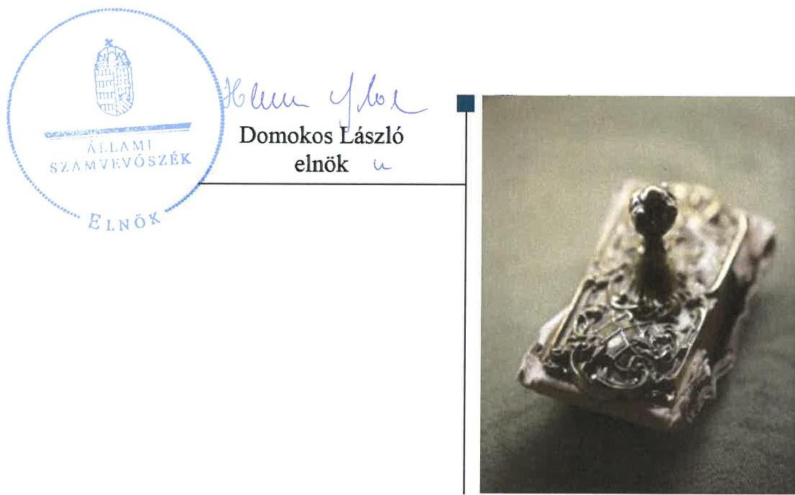
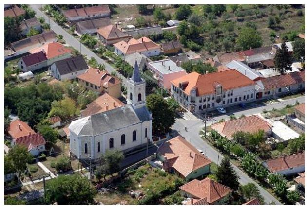
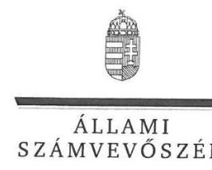
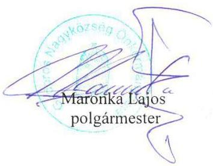
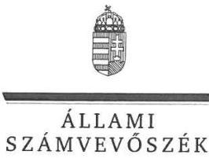
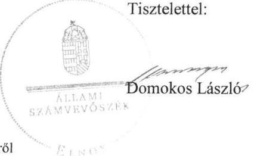
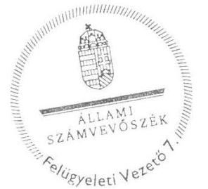

# Jelenetés 

## Az önkormányzatok gazdasági társaságai

Az önkormányzatok többségi tulajdonában lévő gazdasági társaságok gazdálkodásának ellenőrzése - PROGÁDOR Településüzemeltető és Szolgáltató Nonprofit Kft.
2018.

---

# Jelentés 

## Az önkormányzatok gazdasági társaságai

Az önkormányzatok többségi tulajdonában lévő gazdasági társaságok gazdálkodásának ellenőrzése - PROGÁDOR Településüzemeltető és Szolgáltató Nonprofit Kft.
2018. 4. hó 5. nap

---

# AZ ELLENŐRZÉST FELÜGYELTE:

DR. HORVÁTH MARGIT felügyeleti vezető

## AZ ELLENŐRZÉST VEZETTE ÉS A VÉGREHAJTÁSÁÉRT FELELŐS:

- ÁRPÁSI TIBOR ellenőrzésvezető
- A PROGRAM ÖSSZEÁLLÍTÁSÁÉRT FELELŐS:
  - TÓTPÁL SZABOLCS osztályvezető

IKTATÓSZÁM: EL-0194-092/2018.

TÉMASZÁM: 2447

ELLENŐRZÉS-AZONOSÍTÓ SZÁM: V079361

Jelentéseink az Országgyűlés számítógépes hálózatán és az Interneten a www.asz.hu címen is olvashatóak.

---

# TARTALOMJEGYZÉK 

■ ÖSSZEGZÉS ..... 5
■ AZ ELLENŐRZÉS CÉLJA ..... 6
■ AZ ELLENŐRZÉS TERÜLETE ..... 7
■ AZ ELLENŐRZÉS HÁTTERE, INDOKOLTSÁGA ..... 8
■ A JELENTÉS LÉNYEGES KÉRDÉSKÖREI ..... 9
■ AZ ELLENŐRZÉS HATÓKÖRE ÉS MÓDSZEREI ..... 10
■ MEGÁLLAPÍTÁSOK ..... 12
■ JAVASLATOK ..... 15
■ MELLÉKLETEK ..... 17
I. sz. melléklet: Értelmező szótár ..... 17
■ FÜGGELÉK: ÉSZREVÉTELEK ..... 19
■ RÖVIDÍTÉSEK JEGYZÉKE ..... 27

---

.

---

# ÖSSZEGZÉS 

Gádoros Nagyközség Önkormányzata a tulajdonosi joggyakorlás kereteit szabályszerűen alakította ki, azonban a tulajdonosi joggyakorlás nem volt szabályszerű. A PROGÁDOR Településüzemeltető és Szolgáltató Nonprofit Kft. szabályozottsága megfelelt a jogszabályi előírásoknak, viszont a gazdálkodása, a vagyongazdálkodási tevékenysége nem volt szabályszerű, mivel a Társaságnál az éves beszámolók és az elszámolások nem feleltek meg a törvényi előírásoknak. A feltárt hiányosságok, szabálytalanságok következtében nem volt biztosított a Társaság elszámoltathatósága, működésének átláthatósága.

## Az ellenőrzés társadalmi indokoltsága

Az Állami Számvevőszék kiemelt célja, hogy a helyi önkormányzatok gazdálkodásában rejlő pénzügyi kockázatok feltárásával, az államháztartáson kívülre nyújtott költségvetési támogatások és ingyenes vagyonjuttatások, valamint az államháztartáson kívül működő feladatellátó rendszerek ellenőrzéseivel hozzájáruljon ahhoz, hogy a közpénzeket az államháztartáson kívül működő szervezetek is átlátható, rendezett módon használják fel.

Magyarországon az önkormányzatok kötelező és önként vállalt feladataik vonatkozásában is egyre szélesebb körben alkalmazzák a költségvetésen kívüli feladatellátást, ezáltal - a nonprofit szervezetek mellett - az önkormányzati tulajdonú gazdasági társaságok is kiemelt fontosságú szerephez jutottak. Az Állami Számvevőszék céljaival és a társadalmi igénnyel összhangban, valamint a gazdasági társaságok kiemelt fontosságú szerepe miatt került sor a PROGÁDOR Településüzemeltető és Szolgáltató Nonprofit Kft. ellenőrzésére. Az Állami Számvevőszék az ellenőrzése során arra kereste a választ, hogy 2013-2016. között szabályszerű volt-e a Társaság gazdálkodása és a tulajdonos önkormányzat ehhez kapcsolódó tulajdonosi joggyakorlása.

## Főbb megállapítások, következtetések, javaslatok

Az Önkormányzat a tulajdonosi joggyakorlás kereteit szabályszerűen kialakította, a tulajdonosi jogokat a Társaság felett azonban nem szabályszerűen gyakorolta. A Társaság 2015-2016. évi egyszerűsített beszámolóit a felügyelőbizottság írásbeli jelentése nélkül hagyta jóvá. A javadalmazási szabályzatot a Társaság legfőbb szerve nem alkotta meg.

A PROGÁDOR Településüzemeltető és Szolgáltató Nonprofit Kft. szabályozottsága megfelelt a jogszabályi előírásoknak, a Társaság rendelkezett az előírt számviteli politikával és az ahhoz kapcsolódó kötelezően elkészítendő szabályzatokkal. Ugyanakkor a számviteli politika nem tartalmazta az értékcsökkenési leírás meghatározásának módját.

A Társaság gazdálkodási, vagyongazdálkodási tevékenysége nem volt szabályszerű, mert a Társaság 2013-2016. évi egyszerűsített éves beszámolóit nem támasztották alá főkönyvi kivonattal, ezzel megsértették a Számv. tv. előírásait. Továbbá a Társaság 2013-2015. évi egyszerűsített éves beszámolóinak kiegészítő mellékletei sem feleltek meg a jogszabályi előírásoknak, nem tartalmazták a kapcsolt vállalkozással kapcsolatos elszámolásokat és követelések állományát. A pénzügyi-számviteli feladatok ellátása során a számviteli törvény előírásait nem tartották be, mert a bevételek, ráfordítások, beruházások, valamint az értékcsökkenés elszámolása nem felelt meg a törvényi előírásoknak. A Társaság nem képzett értékvesztést a Számviteli törvény előírása ellenére a kapcsolt vállalkozással szemben fennálló többéves követelésekre.

A személyi és gazdálkodási adatokat a Társaság a Taktv. előírásainak megfelelően közzétette.

---

# AZ ELLENŐRZÉS CÉLJA 

Az ellenőrzés célja annak értékelése volt, hogy az önkormányzat vagyongazdálkodási tevékenysége során szabályszerűen gyakorolta-e tulajdonosi jogait; a gazdasági társaság szabályozottsága, gazdálkodása és vagyongazdálkodási tevékenysége, bevételeinek és ráfordításainak elszámolása megfelelt-e a jogszabályi és tulajdonosi előírásoknak; a gazdasági társaság kötelezettségállománya jelent-e kockázatot a működésre, valamint a gazdálkodás átláthatósága és elszámoltathatósága érdekében biztosítva volt-e a szolgáltatás díjának megalapozottsága szabályszerű önköltségszámítással.

---

# AZ ELLENŐRZÉS TERÜLETE 

## Gádoros Nagyközség Önkormányzata és a kizárólagos tulajdonában lévő PROGÁDOR Településüzemeltető és Szolgáltató Nonprofit Kft.

A PROGÁDOR Településüzemeltető és Szolgáltató Közhasznú Társaság 2003. január 1-ével kezdte meg működését, amely társaságot a kizárólagos tulajdonos Gádoros Nagyközség Önkormányzata 2009. június 26-tól nonprofit gazdasági társasággá alakított PROGÁDOR Településüzemeltető és Szolgáltató Nonprofit Kft. néven. A Társaság ${ }^{1}$ alapító okirata ${ }^{2}$ szerint közhasznú tevékenysége elsődlegesen kulturális tevékenység, azonban cégkivonatából 2013. február 11-ével a közhasznú minősítés törlésre került.

A Társaság könyvvizsgálatra nem volt kötelezett, a felügyelőbizottság ${ }^{3}$ három tagból állt, a tagok díjazásban nem részesültek.

A Társaság főtevékenysége az Önkormányzat ${ }^{4}$ területén televízió és rádió műsorszolgáltatás, vezetékes távközlés, vezeték nélküli távközlés, műholdas távközlés volt. A Társaság közfeladatot nem látott el.

A Társaság feladatait saját tulajdonú eszközökkel, kábeltelevízió- és internethálózattal látta el, önkormányzati vagyont nem kezelt, nem üzemeltetett. Az Önkormányzat a Társasággal feladatellátási szerződést nem kötött. Az Önkormányzatnak rendeletalkotási kötelezettsége a Társaság működésére, tevékenységére vonatkozóan nem volt.

A Társaság 58 M Ft összegű jegyzett tőkéje a 2013-2016. években nem változott. A Társaság 2013. évben 4 főt, a 2016. évben 3 főt foglalkoztatott.

A Társaság kormányzati szektorba sorolt egyéb szervezetnek nem minősült. A Társaság kapcsolt vállalkozásként egy turizmussal foglalkozó társaságban kizárólagos részesedéssel rendelkezett.

Az ellenőrzött időszakban mind a település polgármesterének ${ }^{5}$, jegyzőjének ${ }^{6}$ és a társaság ügyvezetőjének ${ }^{7}$ személyében egy-egy alkalommal változás történt. A polgármester 2014. október 13-tól látta el feladatát, a jegyző ${ }_{2}$ közszolgálati jogviszonya 2016. december 1-jén kezdődött. A társaság ügyvezetőjének ${ }_{2}$ megbízatása 2015. július 1-jén vette kezdetét.

---

# AZ ELLENŐRZÉS HÁTTERE, INDOKOLTSÁGA 

Az önkormányzatok többségi tulajdonában álló gazdasági társaságok ellenőrzése kiemelten fontos a vagyon megőrzése, megóvása érdekében, valamint a kormányzati szektor elszámolásaiban megjelenő önkormányzati tulajdonú gazdálkodó szervezetek esetében, amelyekkel szemben alapvető követelmény, hogy gazdálkodásuk, működésük szabályszerű, az általuk szolgáltatott adatok minél megbízhatóbbak legyenek. A feladatellátás költségeinek, ráfordításainak alakulása a lakosság széles rétegét érinti.

Ellenőrzéseink feltárhatják, hogy az önkormányzat a feladatellátásához rendelt vagyon működtetését a tulajdonostól elvárható gondossággal végezte-e, a feladatot ellátó gazdasági társaság a létesítő okiratban, szolgáltatási szerződésben foglaltak betartásával biztosította-e a feladat ellátását. Az ellenőrzés eredményeképp meghatározhatóvá válnak a költségvetési hiányt befolyásoló szervezetek kockázatai, lehetővé válik ezen kockázatok csökkentése. Az ellenőrzés rávilágíthat arra, hogy a hogy a gazdasági társaság a vagyon használatával biztosította-e a szolgáltatás folytatásának feltételeit, az önkormányzat tulajdonosi felügyelete hozzájárult-e a szabályszerű gazdálkodáshoz és feladatellátáshoz. A megállapítások alapján megfogalmazott számvevőszéki javaslatok hasznosítása elősegítheti a meglévő hibák megszüntetését. A jó gyakorlatok bemutatásával az ÁSZ ${ }^{8}$ hozzájárulhat a követendő megoldások megismertetéséhez, terjesztéséhez.

---

# A JELENTÉS LÉNYEGES KÉRDÉSKÖREI 

1. Az Önkormányzat tulajdonosi joggyakorlása szabályszerű volt-e?
2. A Társaság működésének szabályozottsága és gazdálkodási tevékenysége szabályszerű volt-e?
3. A Társaság vagyongazdálkodási tevékenysége szabályszerű volt-e?

---

# AZ ELLENŐRZÉS HATÓKÖRE ÉS MÓDSZEREI 

## Az ellenőrzés típusa

Megfelelőségi ellenőrzés.

## Az ellenőrzött időszak

2013. január 1-jétől 2016. december 31-ig tartó időszak.

## Az ellenőrzés tárgya

Gádoros Nagyközség Önkormányzatának - a PROGÁDOR Településüzemeltető és Szolgáltató Nonprofit Kft. feletti - tulajdonosi joggyakorlása, valamint a PROGÁDOR Településüzemeltető és Szolgáltató Nonprofit Kft. gazdálkodásának szabályozottsága és szabályszerűsége.

Az ellenőrzés kiterjedt minden olyan körülményre és adatra, amely az ÁSZ jogszabályban meghatározott feladatainak teljesítéséhez, valamint a program végrehajtása folyamán felmerült újabb összefüggések feltárásához szükséges volt.

## Az ellenőrzött szervezet

$\longrightarrow$ Gádoros Nagyközség Önkormányzata,
$\longrightarrow$ PROGÁDOR Településüzemeltető és Szolgáltató Nonprofit Kft.

## Az ellenőrzés jogalapja

Az ellenőrzés jogszabályi alapját az ÁSZ tv. ${ }^{9}$ 1. § (3) bekezdése és 5. § (3)- (5) bekezdései képezték.

## Az ellenőrzés módszerei

Az ellenőrzést a nemzetközi standardokat irányadónak tekintve az ellenőrzési program ellenőrzési kérdései, az ellenőrzött időszakban hatályos jogszabályok, az ellenőrzés szakmai szabályok és módszertanok figyelembe vételével végeztük.

Az ellenőrzés ideje alatt az ellenőrzött szervezettel történő kapcsolattartást az ÁSZ Szervezeti és Működési Szabályzatának vonatkozó előírásai alapján biztosítottuk.

---

Az ellenőrzési kérdések megválaszolásához szükséges bizonyítékok megszerzése a következő ellenőrzési eljárások alkalmazásával történt: megfigyelés, kérdésfeltevés (információkérés), összehasonlítás, valamint elemző eljárás. Az ellenőrzési bizonyítékként felhasználható adatforrások közé tartoztak egyrészt az ellenőrzési programban felsorolt adatforrások, másrészt adatforrás volt még minden - az ellenőrzés folyamán - feltárt, az ellenőrzés szempontjából információkat tartalmazó dokumentum.

Az ellenőrzést a kérdésekre adott válaszok kiértékelésével, valamint a megjelölt adatforrások, a csatolt tanúsítványok felhasználásával, továbbá az adott időszakban hatályos jogszabályok figyelembe vételével folytattuk le.

A gazdasági társaság bevételei és ráfordításai, ezeken belül az értékcsökkenés, valamint a vagyonnyilvántartás szabályszerűségének megítéléséhez a bevételeket és a ráfordításokat, a tárgyi eszközök állományváltozásait tartalmazó adott évi főkönyvi adatbázisát vettük alapul. A minta kiválasztása során véletlen mintavételt alkalmaztunk évenkénti, elemszámmal arányos rétegezéssel a teljes időszakra vonatkozóan. A minta alapján a sokaságban előforduló hibaarányt becsültük. „Szabályszerűnek" értékeltünk egy ellenőrzött területet, amennyiben 95\%-os bizonyossággal a teljes sokaságban a hibaarány legfeljebb 10\%, „nem szabályszerűnek", amennyiben 10\%-nál magasabb arányt képviselt. A mintavételt megelőzően az anyagjellegű ráfordítások, az egyéb ráfordítások, a pénzügyi műveletek ráfordításai és a rendkívüli ráfordítások, valamint a tárgyi-eszköz növekedési tételei sokaságból évente sokaságonként kiemeltük a 3-3 legnagyobb összegű tételt annak biztosítására, hogy az ellenőrzés az egyszerű véletlen mintavétel mellett a legnagyobb értékű tételek ellenőrzésére biztosan kiterjedjen.

---

# 1. Az Önkormányzat tulajdonosi joggyakorlása szabályszerű volt-e? 

Összegző megállapítás

A tulajdonosi joggyakorlás kereteit az Alapító megfelelően kialakította, a tulajdonosi jogok gyakorlása nem volt szabályszerű.

AZ ÖNKORMÁNYZAT a Mötv. ${ }^{10}$-ben foglaltak szerint rendelkezett gazdasági programmal ${ }^{11}$, mely a Társaság vonatkozásában fontosnak tartotta az internet és kábeltelevízió szolgáltatások biztosítását és fejlesztését.

Közép- és hosszú távú vagyongazdálkodási tervkészítési kötelezettségének az Önkormányzat az Nvtv. ${ }^{12}$-ben foglaltaknak megfelelően eleget tett.

Az Nvtv. 5. § (5) bekezdés (c) pontjában foglaltak ellenére a vagyonrendelet ${ }^{13}$ 1/a. mellékletében az Önkormányzat a Társaságban birtokolt részesedését nem szerepeltette.

A tulajdonosi joggyakorlás kereteit az Önkormányzat az SZMSZ ${ }^{14}$-ben, a vagyonrendeletben és az alapító okiratban szabályszerűen kialakította.

Az Önkormányzat nyomonkövetési (monitoring) szabályzatában ${ }^{15}$ a Társaság tevékenységére, működésére vonatkozóan 2015-től éves gyakorisággal beszámolási kötelezettséget írt elő a Társaság alapító okiratában foglaltakkal összhangban.

A FELÜGYELŐBIZOTTSÁG tagjait a Társaság alapító okiratában meghatározta az Alapító, előírta a felügyelőbizottság tagjainak feladatait, beszámolási kötelezettségét.

A felügyelőbizottság a Gt. ${ }^{16}$ 34. § (4) bekezdése és a Ptk. ${ }^{17}$ 3:122. § (3) bekezdése előírásai ellenére az ellenőrzött időszakban nem rendelkezett ügyrenddel.

A TÁRSASÁG ALAPÍTÓ OKIRATA szerinti tulajdonosi jogosítványokat szabálytalanul gyakorolták. Az Alapító ${ }^{18}$ a Társaság 2015-2016. évi egyszerűsített éves beszámolóinak elfogadásáról a Ptk. 3:120. § (2) bekezdésében foglaltak ellenére a felügyelőbizottság írásbeli jelentése nélkül döntött.

Az Önkormányzat 2013-ban kezességet vállalt a Társaság hitelfelvételéhez. Az Önkormányzat az eljárás során nem tartotta be az Stabilitási
 tv. ${ }^{19}$ 10. § (1) bekezdésében foglalt előírást, a Kormány előzetes hozzájárulása nélkül kötött adósságot keletkeztető ügyletet. A hitelt a Társaság határidőben, 2015-ben visszafizette.

A vezető tisztségviselők, a felügyelőbizottsági tagok és az Mt. ${ }^{20}$ 208. § hatálya alá tartozó munkavállalók javadalmazására, valamint

---

a jogviszony megszűnése esetére biztosított juttatások módjának, mértékének legfőbb elveiről, annak rendszeréről szóló szabályzatot az Alapító a Taktv. ${ }^{21}$ 5. § (3) bekezdése előírásai ellenére nem alkotta meg.

Az Önkormányzat nem élt az Áht. ${ }^{22}$ 70. § (1) bekezdésében biztosított belső ellenőrzés lehetőségével a Társaság esetében.

# 2. A Társaság működésének szabályozottsága és gazdálkodási tevékenysége szabályszerű volt-e? 

Összegző megállapítás

A Társaság működésének szabályozottsága megfelelő volt. Gazdálkodása nem volt szabályszerű, mert beszámolóit nem támasztotta alá főkönyvi kivonattal. Bevételeinek és ráfordításainak elszámolása nem volt szabályszerű.

A SZÁMVITELI POLITIKA ${ }^{23}$ keretében elkészítendő szabályzatokkal rendelkezett a Társaság. A 2015. július 1-jétől hatályos számviteli politika ${ }_{2}$ - ellentétben a Számv. tv. 88. § (4) bekezdésében foglaltakkal - nem tartalmazta az értékcsökkenési leírás meghatározásának Társaság által alkalmazott módszerét és kulcsait.

Az eszközök és források leltárkészítési és leltározási szabályzatában ${ }^{24}$ a Társaság a Számv. tv. 69. § (3) bekezdésében foglaltak ellenére nem határozta meg a tárgyi eszközök mennyiségi felvétellel történő leltározásának gyakoriságát.

A Társaság rendelkezett pénzkezelési szabályzattal ${ }^{25}$ és számlarenddel ${ }^{26}$, amelyek tartalma megfelelt a Számv. tv. előírásainak.

BESZÁMOLÁSI KÖTELEZETTSÉGÉNEK - a 2013. évi kivételével - a Társaság a Számv. tv. szerinti egyszerűsített éves beszámolók készítésével, letétbe helyezésével és közzétételével tett eleget. Az egyszerűsített éves beszámolókat az Alapító megtárgyalta és elfogadta.

A 2013. évi egyszerűsített éves beszámoló letétbe helyezése nem felelt meg a Számv. tv. 153. § (1) bekezdésében foglaltaknak, mert az nem tartalmazta a Számv. tv. 96. § (1) bekezdésben előírt kiegészítő mellékletet.

A Társaság a 2013-2016. évi egyszerűsített éves beszámolóit főkönyvi kivonattal nem támasztotta alá, ezzel megsértette a Számv. tv. 164. § (2) bekezdésében foglaltakat.

Az üzleti tervét a Társaság évente elkészítette, azokat az Alapító jóváhagyta. Az Önkormányzat nyomonkövetési (monitoring) szabályzatában a tevékenységére, működésére vonatkozó, 2015-től előírt beszámolási kötelezettségének a Társaság eleget tett.

A SZEMÉLYI ÉS GAZDÁLKODÁSI adatokat a Taktv. előírásainak megfelelően a Társaság közzétette.

A BEVÉTELEK ÉS A RÁFORDÍTÁSOK elszámolása nem volt szabályszerű. A Társaság nem tett eleget a Számv. tv. 165. § (1)-(2) bekezdésében foglaltaknak, mivel a bevételek, ráfordítások könyvviteli elszámolását szabályszerűen kiállított bizonylatokkal nem támasztotta alá.

---

A SZOLGÁLTATÁSI DÍJAK mértékét önkormányzati, ágazati előírás nem szabályozta. Díjait a mindenkori piaci viszonyok figyelembevételével alakította ki. A kábeltelevízió szolgáltatási díjak emelését a Társaság az Önkormányzatnál 2016-ban előterjesztette, a szolgáltatási díjak változásával az Önkormányzat egyetértett.

A HATÁRIDŐN TÚLI KÖVETELÉSÁLLOMÁNY 2013-2016. évek között 0,1 M Ft-tal 1,8 M Ft-ra emelkedett. A hátralékos követelésállomány behajtása érdekében a Társaság 2015-től úgy rendelkezett, ha egy előfizetőnek legalább 30 napos díjtartozása van és a kikapcsolási értesítő átvételét követően sem rendezte hátralékát és nem adott az ÁSZF ${ }^{27}$-ben meghatározott vagyoni biztosítékot, akkor a Társaság jogosulttá vált a szolgáltatást kikapcsolni.

A Társaság - a tulajdonában lévő társaság részére az ellenőrzött időszak előtt - adott tagi kölcsönének állománya a 2013. évi 81,7 M Ft-ról 2016-ra 82,8 M Ft-ra emelkedett. A Társaság a tagi kölcsönt a Számv. tv. 55. § (1) bekezdésében foglaltak ellenére az üzleti év fordulónapjára vonatkozóan nem minősítette és nem képzett értékvesztést.

# A HOSSZÚ LEJÁRATÚ KÖTELEZETTSÉGÁLLOMÁNY a Társaságnál 2013. évi 28,7 M Ft-ról 2016. év végére 5,1 M Ft összegű tagi kölcsön tartozásra csökkent. Az Önkormányzattól az ellenőrzött időszak előtt felvett 10 M Ft összegű tagi kölcsönből 4,9 M Ft-ot fizetett vissza a Társaság 2016 végéig.

## 3. A Társaság vagyongazdálkodási tevékenysége szabályszerű volt-e?

## Összegző megállapítás

A Társaság vagyongazdálkodása nem volt szabályszerű.
A VAGYON NYILVÁNTARTÁSA a Társaságnál nem volt szabályszerű, mert a vagyonváltozások kimutatása nem történt meg, nem volt nyomon követhető az egyes tárgyi eszközök bruttó értéke, elszámolt értékcsökkenése, vagyonának változása, ezzel megsértette a Számv. tv. 167.§ (1) bekezdésének előírásait.

A Társaság a tárgyi eszköz beszerzésekhez kapcsolódóan a Számv. tv. 165. § (1)-(2) bekezdésében foglaltak ellenére nem rendelkezett a könyvelést alátámasztó bizonylatokkal.

AZ ÉRTÉKCSÖKKENÉS elszámolása nem volt szabályszerű, mert a Számv. tv. 52. § (1) bekezdésében foglaltak ellenére a Társaság az immateriális javak értéke után nem számolt el értékcsökkenést 2014-2016. években.

LELTÁRRAL A TÁRSASÁG az egyszerűsített éves beszámolóit alátámasztotta. Saját vagyont érintő fejlesztésre az elszámolt értékcsökkenésnek megfelelő összegben került sor, a Társaság immateriális jószág és tárgyi eszköz vagyonának értéke az ellenőrzött időszakban nem változott.

---

# JAVASLATOK 

Az ÁSZ tv. 33. § (1) bekezdésében foglaltak értelmében az ellenőrzött szervezet vezetője köteles a jelentésben foglalt megállapításokhoz kapcsolódó intézkedési tervet összeállítani és azt a jelentés kézhezvételétől számított 30 napon belül az ÁSZ részére megküldeni. Amennyiben az ellenőrzött szervezet vezetője nem küldi meg határidőben az intézkedési tervet, vagy továbbra sem elfogadható intézkedési tervet küld, az Állami Számvevőszék elnöke az ÁSZ tv. 33. § (3) bekezdése a) és b) pontjaiban foglaltakat érvényesítheti.
Javaslataink célja a PROGÁDOR Településüzemeltető és Szolgáltató Nonprofit Kft. gazdálkodása szabályszerűségének és gyakorlatának javítása annak érdekében, hogy a szabályozási környezet és az alkalmazott gyakorlat megfelelően tudja támogatni az átlátható működést.

## A PROGÁDOR Településüzemeltető és Szolgáltató Nonprofit Kft. ügyvezetőjének

1. Intézkedjen a számviteli politika módosításáról, hogy az a Számv. tv. előírásainak megfelelően tartalmazza az eszközök értékcsökkenési leírásának Társaság által választott módszerét és kulcsait.
(2. sz. megállapítás 1. bekezdés 2. mondata alapján)
2. Intézkedjen a leltározási szabályzat kiegészítéséről, hogy az a Számv. tv-nek megfelelően tartalmazza a tárgyi eszközök mennyiségi felvétellel történő leltározásának gyakoriságát.
(2. sz. megállapítás 2. bekezdés alapján)
3. Intézkedjen a bevételek és a ráfordítások Számv. tv. szerinti elszámolásáról.
(2. sz. megállapítás 9. bekezdés alapján)
4. Intézkedjen annak érdekében, hogy a Társaság gazdálkodását bemutató éves beszámolót főkönyvi kivonat, továbbá az elszámolásokat bemutató kiegészítő melléklet támasza alá a Számv. tv. előírásainak megfelelően.
(2. sz. megállapítás 5. és 6. bekezdései alapján)

---

# Javaslatunk célja a tulajdonosi joggyakorló Gádoros Nagyközség Önkormányzata polgármesterének a szabályszerű működésének elősegítése, továbbá a tulajdonosi joggyakorlás kontrolljainak erősítése. 

## Gádoros Nagyközség Önkormányzata polgármesterének

1. Intézkedjen annak érdekében, hogy az Önkormányzat Vagyonrendeletének 1/a melléklete az Nvtv. előírásának megfelelően tartalmazza az önkormányzati tulajdonban szereplő részesedések felsorolását.
(1. sz. megállapítás 3. bekezdés alapján)
2. Kezdeményezze a felügyelőbizottság elnökénél a Ptk. szerinti ügyrend elkészítését, ezt követően az Alapító elé jóváhagyásra történő beterjesztését.
(1. sz. megállapítás 7. bekezdés alapján)
3. Intézkedjen a Taktv. előírásainak megfelelően a Társaság vezető tisztségviselőjének, felügyelőbizottsági tagjainak, valamint az Mt. 208. §-ának hatálya alá eső munkavállalóinak javadalmazása, valamint a jogviszony megszűnése esetére biztosított juttatások módjának, mértékének elveire vonatkozó szabályzat-tervezet elkészítése és Alapító elé terjesztése érdekében.
(1. sz. megállapítás 10. bekezdés alapján)
4. Intézkedjen, hogy az Alapító a Társaság éves beszámolójáról a Ptk. vonatkozó előírásainak megfelelően a felügyelőbizottság írásbeli véleménye birtokában hozzon döntést.
(1. sz. megállapítás 8. bekezdés 2. mondata alapján)

---

# MELLÉKLETEK 

- I. SZ. MELLÉKLET: ÉRTELMEZŐ SZÓTÁR
gazdasági társaság
kezesség
közszolgáltatás
nemzeti vagyon
nonprofit gazdasági társaság

Ptk. 3:88. § (1) bekezdése szerint „a gazdasági társaságok üzletszerű közös gazdasági tevékenység folytatására, a tagok vagyoni hozzájárulásával létrehozott, jogi személyiséggel rendelkező vállalkozások, amelyekben a tagok a nyereségből közösen részesednek, és a veszteséget közösen viselik".
A kezességre vonatkozó előírásokat a Ptk. 6:416-430. §-ai tartalmazzák. Kezességi szerződéssel a kezes kötelezettséget vállal a jogosulttal szemben, hogyha a kötelezett nem teljesít, maga fog helyette a jogosultnak teljesíteni. Kezesség egy vagy több, fennálló vagy jövőbeli, feltétlen vagy feltételes, meghatározott vagy meghatározható összegű pénzkövetelés vagy pénzben kifejezhető értékkel rendelkező egyéb kötelezettség biztosítására vállalható.
A Ptk. szerint kezességet csak írásban lehet vállalni. A kezes kötelezettsége ahhoz a kötelezettséghez igazodik, amelyért kezességet vállalt. A kezes kötelezettsége nem válhat terhesebbé, mint amilyen elvállalásakor volt, kiterjed azonban a kötelezett szerződésszegésének jogkövetkezményeire és a kezesség elvállalása után esedékessé váló mellékkövetelésekre is.
Az Ebktv. ${ }^{28}$ 3. § d) pontja a következőképpen határozza meg a közszolgáltatást: „szerződéskötési kötelezettség alapján a lakosság alapvető szükségleteinek ellátására irányuló szolgáltatás, így különösen a villamos energia-, gáz-, hő-, víz-, szenny-víz- és hulladékkezelési, köztisztasági, postai és távközlési szolgáltatás, továbbá a menetrend alapján közlekedő járművekkel végzett közforgalmú személyszállítás". Nvtv. 1. § (2) bekezdése szerint többek között:
„az állam vagy a helyi önkormányzat kizárólagos tulajdonában álló dolgok, az a) pont hatálya alá nem tartozó, állam vagy a helyi önkormányzat tulajdonában lévő dolog,
az állam vagy a helyi önkormányzat tulajdonában lévő pénzügyi eszközök, továbbá az államot vagy a helyi önkormányzatot megillető társasági részesedések, az államot vagy a helyi önkormányzatot megillető bármely vagyoni értékkel rendelkező jogosultság, amelyet jogszabály vagyoni értékű jogként nevesít."
A cégnyilvánosságról, a bírósági cégeljárásról és a végelszámolásról szóló 2006. évi V. törvény (Ctv.) 9/F. § (2) bekezdése szerint „az a gazdasági társaság minősül nonprofit gazdasági társaságnak és cégnevében az a gazdasági társaság tüntetheti fel a nonprofit jelleget, amelynek létesítő okirata tartalmazza, hogy a gazdasági társaság tevékenységéből származó nyereség a tagok között nem osztható fel, hanem az a gazdasági társaság vagyonát gyarapítja." (hatályos 2014. március 15-től)

---

.

---

# FÜGGELÉK: ÉSZREVÉTELEK 

A jelentéstervezetet a Számvevőszék 15 napos észrevételezésre megküldte az ellenőrzött szervezetek vezetőinek az ÁSZ tv. 29. § (1) bekezdése előírásának megfelelően.

A jelentés függeléke tartalmazza a PROGÁDOR Településüzemeltető és Szolgáltató Nonprofit Kft. ügyvezetőjének és Gádoros Nagyközség Önkormányzata polgármesterének a jelentéstervezettel kapcsolatos észrevételeit és az azok kezeléséről szóló válaszleveleket.

[^0]
[^0]:    * 29. § (1) Az Állami Számvevőszék az ellenőrzési megállapításait megküldi az ellenőrzött szervezet vezetőjének vagy az általa megbízott személynek, és annak, akinek személyes felelősségét állapította meg.
    (2) Az ellenőrzött szervezet vezetője és a felelősként megjelölt személy az ellenőrzés megállapításaira tizenöt napon belül írásban észrevételt tehet.
    (3) Az Állami Számvevőszék az észrevételre a beérkezésétől számított harminc napon belül írásban válaszol. A figyelembe nem vett észrevételeket köteles a jelentésben feltüntetni, és megindokolni, hogy azokat miért nem fogadta el.

---

Az Állami Számvevőszék jelentéstervezetében foglalt javaslatok végrehajtására.

Dr. Horváth Margit
felügyeleti vezető részére

Ellenőrzés-azonosító: V079361

Tisztelt Dr. Horváth Margit!

A Társaság a Számvevőszék ellenőrzése során megállapított javaslataira az alábbi észrevételeket teszi:

Az Állami Számvevőszék jelentéstervezetében foglalt javaslataikkal egyetértünk.

A Határidőn túli követelésállomány kezelésével kapcsolatosan az Állami Számvevőszéktől kérnénk állásfoglalást, hogy céltartalékot képezzünk ennek rendezésére vagy értékvesztésként számoljuk el.

Az ÁSZ jelentéstervezet 2.sz. megállapításának 9. bekezdésével is egyetértünk, azonban az alábbi észrevételezést tennénk:

A Társaság Kábeltévé és Internet szolgáltatással foglalkozó kft, ebből kifolyólag speciális korszerű integrált auditált számlázó programmal rendelkezik, ami Kormányrendelet alapján előírás volt számunkra, hogy minden előfizetőnek minden hónapban elkészüljön a számlája függetlenül attól, hogy kifizeti avagy sem a számláját, és
 2013.09. hó óta ebben a programban készült minden kábel tv számla, és miután ez a rendszer feltöltésre került és kipróbálásra, így 2015.07.01.-től az internet és egyéb szolgáltatásaink számlázása is ebben a programban folytatódott. Ez nemcsak egy számlázó program, hanem egy korszerű műszaki és hibaelhárítási rendszer is, ami az összes információt rögzíti, ami egy kábel tv vagy internet előfizetéshez szükséges. Itt minden előfizető minden számlája névvel, címmel ellátva megtalálható attól az időszaktól, amelytől előfizetéssel rendelkezik a Társaságnál. Ez havi szinten kb. 1500 számlát jelent. A tételek sokasága miatt minden hónapban a program készít egy összesítést külön kábel tv és külön internet és egyéb bevételekről, és ezek valóban csak egy-egy tételként vannak lekönyvelve havi szinten. A könyvelő program a Társaságnál az RL-B program már hosszú évek óta és az ügyvezető váltás során (2015.07.01.) mi is maradtunk ennél a programnál. A Számvevőszék javaslatára illetve a Számv.tv.165.§.(1)-(2) bekezdése értelmében felvesszük a kapcsolatot az RL-B könyvelő program munkatársaival, hogy megtaláljuk azt a megoldást, hogy tételesen lássunk minden bevételt és ráfordítást, alá támasztó bizonylatot is a könyvelésünkben.

Gádoros, 2018. június 6.

PROGÁDOR: 5012. Ciadence, Kornuth u. 1.
Csl. szám: 04-09-009195 (1.)
Adószám: 21545252-2-04
Tel. Szov. Gádoros: 53500067-11093467

Farkas László

ügyvezető

---

ELNÖK

Ikt.szám: EL-0194-086/2018.

# Farkas László úr 

ügyvezető
PROGÁDOR Településüzemeltető és Szolgáltató Nonprofit Kft.

## Gádoros

## Tisztelt Ügyvezető Úr!

Köszönettel vettem „Az önkormányzatok gazdasági társaságai - Az önkormányzatok többségi tulajdonában lévő gazdasági társaságok gazdálkodásának ellenőrzése - PROGÁDOR Településüzemeltető és Szolgáltató Nonprofit Kft." című ellenőrzéséről készített számvevőszéki jelentéstervezetre megküldött észrevételét.
Az Állami Számvevőszék észrevételre vonatkozó álláspontját a felügyeleti vezető által készített részletes tájékoztatás tartalmazza, amelyet levelemhez mellékeltem.
Tájékoztatom Ügyvezető urat, hogy az Állami Számvevőszék a figyelembe nem vett észrevételeket az Állami Számvevőszékről szóló 2011. évi LXVI. törvény 29. § (3) bekezdésében előírtak szerint köteles a jelentésében feltüntetni és megindokolni, hogy azokat miért nem fogadta el.

Budapest, 2018. 07 hó 0 nap

Tisztelettel:

Melléklet: Tájékoztatás az észrevételek kezeléséről

---

# Tájékoztatás az észrevételek kezeléséről 

Megköszönöm Ügyvezető úrnak „Az önkormányzatok gazdasági társaságai - Az önkormányzatok többségi tulajdonában lévő gazdasági társaságok gazdálkodásának ellenőrzése - PROGÁDOR Településüzemeltető és Szolgáltató Nonprofit Kft." címmel készített jelentéstervezetre tett észrevételét. Az észrevétel kezeléséről az alábbi tájékoztatást adom.

Az észrevételt tartalmazó levél első részében, a határidőn túli követelésállomány kezelésével kapcsolatban megfogalmazottak tekintetében tájékoztatom Ügyvezető urat, hogy a számvitelről szóló 2000. évi C. törvény meghatározza úgy a céltartalék, mint az értékvesztés elszámolásának szabályait, amelyeket a helyi sajátosságok figyelembevételével szükséges alkalmazni a társaság számviteli szabályzataiban részletezetteknek megfelelően.

Észrevétel:Az észrevétel a jelentéstervezet 2. számú megállapítás 9. bekezdését, valamint az ügyvezetőnek címzett 3. számú javaslatot érintette:
„Az ÁSZ jelentéstervezet 2. sz. megállapításának 9.bekezdésével is egyetértünk, azonban az alábbi észrevételezést tennénk:
A Társaság Kábeltévé és Internet szolgáltatással foglalkozó kft, ebből kifolyólag speciális korszerű integrált auditált számlázó programmal rendelkezik, ami Kormányrendelet alapján előírás volt számunkra, hogy minden előfizetőnek minden hónapban elkészüljön a számlája függetlenül attól, hogy kifizeti avagy sem a számláját, és 2013.09. hó óta ebben a programban készült minden Kábel tv számla, és miután ez a rendszer feltöltésre került és kipróbálásra, így 2015.07.01.-től az internet és egyéb szolgáltatásaink számlázása is ebben a programban folytatódott. Ez nemcsak egy számlázó program, hanem egy korszerű műszaki és hibaelhárítási rendszer is, ami az összes információt rögzíti, ami egy kábel tv vagy internet előfizetéshez szükséges. Itt minden előfizető minden számlája névvel, címmel ellátva megtalálható attól az időszaktól, amelytől előfizetéssel rendelkezik a Társaságnál. Ez havi szinten kb. 1500 számlát jelent. A tételek sokasága miatt minden hónapban a program készít egy összesítést külön kábel tv és külön internet és egyéb bevételekről, és ezek valóban csak egy-egy tételként vannak lekönyvelve havi szinten. A könyvelő program a Társaságnál az RL-B program már hosszú évek óta és az ügyvezető váltás során (2015.07.01.) mi is maradtunk ennél a programnál. A Számvevőszék javaslatára illetve a Számv.tv.165.§.(1)-(2) bekezdése értelmében felvesszük a kapcsolatot az RL-B könyvelő program munkatársaival, hogy megtaláljuk azt a megoldást, hogy tételesen lássunk minden bevételt és ráfordítást, alá támasztó bizonylatot is a könyvelésünkben."

Ügyvezető úr a jelentéstervezet 2. számú megállapítás 9. bekezdésének tartalmával egyetértett. A számlázás folyamatáról szóló tájékoztatását tudomásul veszem. A leírtak a jelentéstervezet

---

megállapításait nem vitatják, ezért a jelentéstervezet 2. számú megállapítás 9. bekezdését, valamint az ügyvezetőnek címzett 3. számú javaslatot nem módosítom.

Budapest, 2018. július hó 5 nap

Dr. Horváth Margit felügyeleti vezető (1)

---

# Gádoros Nagyközség Önkormányzata 5932 Gádoros, Kossuth u.16. Telefon: 68/490 001. Pf:13. 

Ikt.szám: 1406-2/2018.

Állami Számvevőszék
Dr. Horváth Margit
felügyeleti vezető
részére

## Budapest

Pf. 54.
1364

ÁLLAMI SZÁMVEVŐSZÉK
ÜGYVÉTELI IRODA
16-55870/2618/1
20180615
Tárgy: Számvevószéki jelentéstervezet
Hiv.szám: EL-0194-081/2018
EL-0194-081/2018

Gádoros Nagyközség Önkormányzat Polgármestereként a fenti hivatkozási számú Számvevőszéki jelentéstervezetben foglalt a tulajdonosi joggyakorló Gádoros Nagyközség Önkormányzat polgármesterének írt javaslataikkal kapcsolatban az alábbi nyilatkozatot teszem:

1) Az 1. sz. megállapítás 3. bekezdés alapján a vagyonrendeletünk felülvizsgálatát 2018. december 31-ig elvégezzük, hogy az 1/a melléklete az Nvtv. előírásainak megfelelően tartalmazza az önkormányzati tulajdonban szereplő részesedések felsorolását.
2) Az 1. sz. megállapítás 7. bekezdése alapján a Progádor Kft. Felügyelő Bizottság ügyrendjét a Gádoros Nagyközség Önkormányzat Képviselő-testülete a 2018. június 12-ei ülésén tárgyalja és várhatóan elfogadja.
3) Az 1. számú megállapítás 10. bekezdése alapján 2018. december 31-éig a Taktv előírásainak megfelelően elkészül a Társaság vezető tisztségviselőjének, felügyelőbizottsági tagjainak, valamint az Mt. 208. §-ának hatálya alá eső munkavállalóinak javadalmazása, valamint jogviszony megszünése esetére biztosított juttatások módjának, mértékének elveire, vonatkozó Szabályzat tervezet, és az Alapító elé terjesztésre kerül.
4) Az 1. számú megállapítás 8. bekezdés 2. mondata alapján a Progádor Nonprofit Kft. 2017. évi éves beszámolóját a Gádoros Nagyközség Önkormányzat Képviselő-testülete a 2018. május 22-ei ülésen elfogadta, melyhez a Felügyelő Bizottság írásbeli véleménye is csatolásra került.
5) 2018. december 31-ig az önkormányzat a feladatellátási szerződést megköti a Társasággal.

Kérem nyilatkozatom szíves elfogadását.
Gádoros, 2018. június 11.
Tisztelettel:

---

ELNÖK

Ikt.szám: EL-0194-088/2018.

# Maronka Lajos úr 

polgármester
Gádoros Nagyközség Önkormányzata

## Gádoros

## Tisztelt Polgármester Úr!

Köszönettel vettem „Az önkormányzatok gazdasági társaságai - Az önkormányzatok többségi tulajdonában lévő gazdasági társaságok gazdálkodásának ellenőrzése - PROGÁDOR Településüzemeltető és Szolgáltató Nonprofit Kft." című ellenőrzéséről készített számvevőszéki jelentéstervezetre megküldött észrevételét.
Az Állami Számvevőszék észrevételre vonatkozó álláspontját a felügyeleti vezető által készített részletes tájékoztatás tartalmazza, amelyet levelemhez mellékeltem.
Tájékoztatom Polgármester urat, hogy az Állami Számvevőszék a figyelembe nem vett észrevételeket az Állami Számvevőszékről szóló 2011. évi LXVI. törvény 29. § (3) bekezdésében előírtak szerint köteles a jelentésében feltüntetni és megindokolni, hogy azokat miért nem fogadta el.

Budapest, 2018. 07 hó 03 nap

Tisztelettel:

Melléklet: Tájékoztatás az észrevételek kezeléséről

---

# Tájékoztatás az észrevételek kezeléséről 

Megköszönöm Polgármester úrnak „Az önkormányzatok gazdasági társaságai - Az önkormányzatok többségi tulajdonában lévő gazdasági társaságok gazdálkodásának ellenőrzése - PROGÁDOR Településüzemeltető és Szolgáltató Nonprofit Kft." címmel készített jelentéstervezetre tett észrevételét. Az észrevétel kezeléséről az alábbi tájékoztatást adom.

Az észrevétel a jelentéstervezet 1. számú megállapítás 3., 7., 8., 10. bekezdéseit, valamint a polgármesternek címzett 1-4. számú javaslatokat érintette:

1) ,,Az 1. sz. megállapítás 3. bekezdés alapján a vagyonrendeletünk felülvizsgálatát 2018. december 31-ig elvégezzük, hogy az 1/a melléklete az Nvtv. előírásainak megfelelően tartalmazza az önkormányzati tulajdonban szereplő részesedések felsorolását.
2) Az 1. sz. megállapítás 7. bekezdése alapján a Progádor Kft. Felügyelő Bizottság ügyrendjét a Gádoros Nagyközség Önkormányzat Képviselő-testülete a 2018. június 12-ei ülésén tárgyalja és várhatóan elfogadja.
3) Az 1. számú megállapítás 10. bekezdése alapján 2018. december 31-éig a Taktv előírásainak megfelelően elkészül a Társaság vezető tisztségviselőjének, felügyelőbizottsági tagjainak, valamint az Mt. 208. §-ának hatálya alá eső munkavállalóinak javadalmazása, valamint jogviszony megszünése esetére biztosított juttatások módjának, mértékének elveire, vonatkozó Szabályzat tervezet, és az Alapító elé terjesztésre kerül.
4) Az 1. számú megállapítás 8. bekezdés 2. mondata alapján a Progádor Nonprofit Kft. 2017. évi éves beszámolóját a Gádoros Nagyközség Önkormányzat Képviselő-testülete a 2018. május 22-ei ülésen elfogadta, melyhez a Felügyelő Bizottság írásbeli véleménye is csatolásra került.
5) 2018. december 31-ig az önkormányzat a feladatellátási szerződést megköti a Társasággal."

Az észrevétel a jelentéstervezet Polgármester úr számára megfogalmazott javaslatainak végrehajtására vonatkozóan határozott meg intézkedéseket, a jelentéstervezet megállapításainak és javaslatainak tartalmát nem vitatta, ezért a jelentéstervezet 1. számú megállapítás 3., 7., 8., 10. bekezdéseit, valamint a polgármesternek címzett 1-4. számú javaslatokat nem módosítom.

Felhívom Polgármester úr figyelmét, hogy a végleges jelentés kiadmányozását követően merül fel intézkedési terv készítési kötelezettsége. Kérem, hogy az észrevételében a jelentéstervezet javaslatai teljesítése érdekében megfogalmazott intézkedéseit a jelentés kiadmányozását követően ismételje meg, kiegészítve a határidők és felelősök megjelölésével.

Budapest, 2018. június hó 27. nap

Dr. Horváth Margit felügyeleti vezető

1052 BUDAPEST, APÁCZAI CSERE JÁNOS UTCA 10. 1364 Budapest 4. Pf. 54 telefon: 4848101 fax: 4848201

---

# RÖVIDÍTÉSEK JEGYZÉKE 

${ }^{1}$ Társaság
${ }^{2}$ alapító okirat
${ }^{3}$ felügyelőbizottság
${ }^{4}$ Önkormányzat
${ }^{5}$ polgármester
${ }^{6}$ jegyző
${ }^{7}$ ügyvezető
${ }^{8}$ ÁSZ
${ }^{9}$ ÁSZ tv.
${ }^{10}$ Mötv.
${ }^{11}$ gazdasági program
${ }^{12}$ Nvtv.
${ }^{13}$ vagyonrendelet
${ }^{14}$ SZMSZ
${ }^{15}$ nyomonkövetési (monitoring) szabályzat
${ }^{16}$ Gt.
${ }^{17}$ Ptk.
${ }^{18}$ Alapító
${ }^{19}$ Stabilitási tv.
${ }^{20}$ Mt.
${ }^{21}$ Taktv.
${ }^{22}$ Áht.
${ }^{23}$ számviteli politika

PROGÁDOR Településüzemeltető és Szolgáltató Nonprofit Kft.
A Társaság alapító okirata (kelt: 2009. augusztus 6-án)
A Társaság felügyelőbizottsága
Gádoros Nagyközség Önkormányzata
Gádoros Nagyközség Önkormányzata polgármestere
polgármester: 2014. október 12-ig
polgármester: 2014. október 13-tól
Gádoros Nagyközség Polgármesteri Hivatalának vezetője
jegyző: 2016. október 20-ig
jegyző: 2016. december 12-től
A Társaság ügyvezetője
ügyvezető: 2015. június 30-ig
ügyvezető: 2015. július 1-től
Állami Számvevőszék
2011. évi LXVI. törvény az Állami Számvevőszékről (hatályos: 2011. július 1-jétől)
2011. évi CLXXXIX. törvény Magyarország helyi önkormányzatairól (hatályos: 2012. január 1-jétől)

Gádoros Nagyközség Önkormányzata Gazdasági Programja
gazdasági program:: Gazdasági Program 2011-2014 (hatályos: 2011. február 15-étől)
gazdasági program:: Gazdasági Program 2015-2019 (hatályos: 2015. március 24-étől)
2011. évi CXCVI. törvény a nemzeti vagyonról (hatályos: 2011. december 31-étől)
Gádoros Nagyközség Önkormányzata Képviselő-testületének 2/2012. (III. 2.) önkormányzati rendelete az önkormányzati vagyonról és a vagyonnal való gazdálkodás egyes szabályairól (hatályos: 2012. március 1-jétől)
Gádoros Nagyközség Önkormányzata Képviselő-testületének 10/2013. (IX. 19.) önkormányzati rendelete Gádoros Nagyközség Önkormányzata Képviselőtestülete és Szervei Szervezeti és Működési Szabályzatáról (hatályos: 2013. május 1-jétől)

Gádoros Nagyközség Önkormányzata Polgármesteri Hivatalának Belső Kontroll Rendszere, elfogadta Gádoros Nagyközségi Önkormányzat Képviselő-testülete 135/2015. (IX. 30.) KT. számú határozatával (hatályos 2015. szeptember 30-ától) 2006. évi IV. törvény a gazdasági társaságokról (hatályos: 2014. március 14-éig) 2013. évi V. törvény a Polgári Törvénykönyvről (hatályos: 2014. március 15-étől) Gádoros Nagyközség Önkormányzata
2011. évi CXCIV. törvény Magyarország gazdasági stabilitásáról (hatályos: 2011. december 31-étől)
2012. évi I. törvény a munka törvénykönyvéről (hatályos: 2012. július 1-től)
2009. évi CXXII. törvény a köztulajdonban álló gazdasági társaságok takarékosabb működéséről (hatályos: 2009. december 4-étől)
2011. évi CXCV. törvény az államháztartásról (hatályos: 2011. december 31-étől) A Társaság számviteli politikája

---

${ }^{24}$ eszközök és források leltárkészítési és leltározási szabályzata
${ }^{25}$ pénzkezelési szabályzat
${ }^{26}$ számlarend
${ }^{27}$ ÁSZF
${ }^{28}$ Ebktv.
számviteli politika;:

 hatályos 2015. június 30-áig
számviteli politika 2: hatályos 2015. július 1-jétől
A Társaság eszközök és források leltárkészítési és leltározási szabályzata leltárkészítési és leltározási szabályzat 1: hatályos 2015. június 30-áig leltárkészítési és leltározási szabályzat 2: hatályos 2015. július 1-jétől
A Társaság pénzkezelési szabályzata
pénzkezelési szabályzat 1: hatályos: 2015. június 30-áig
pénzkezelési szabályzat 2: hatályos: 2015. július 1-jétől
A Társaság számlarendje
számlarend 3: hatályos: 2015. június 30-áig
számlarend 1: hatályos: 2015. július 1-jétől
A Társaság Általános Szerződési Feltételei internet elérési szolgáltatáshoz
2003. évi CXXV. törvény az egyenlő bánásmódról és az esélyegyenlőség előmozdításáról (hatályos: 2004. január 27-étől)

---

ÁLLAMI SZÁMVEVŐSZÉK
1052 Budapest, Apáczai Csere János utca 10.
Levélcím: 1364 Budapest 4. Pf. 54
Telefon: +36 1 4849100 Telefax: +36 1 4849200
www.asz.hu
