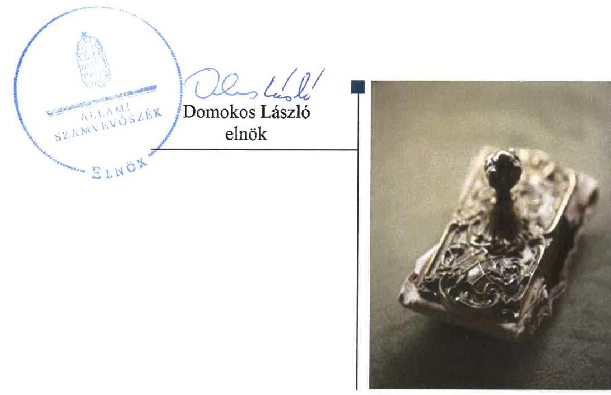
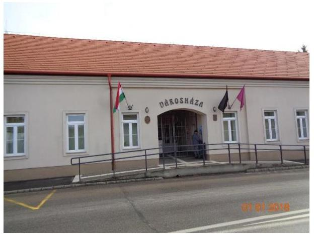
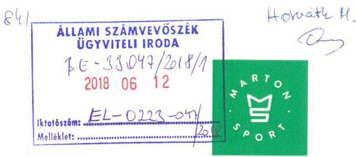
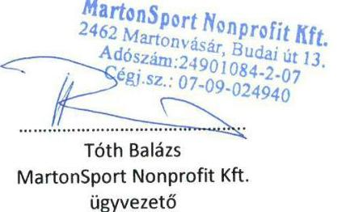
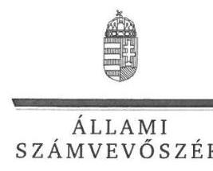
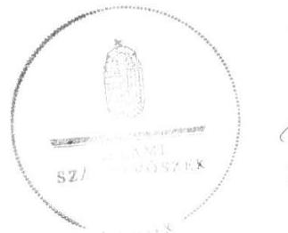
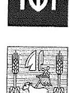
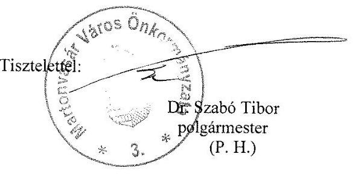
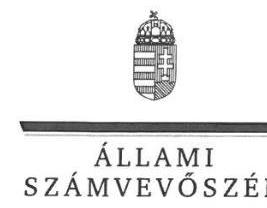
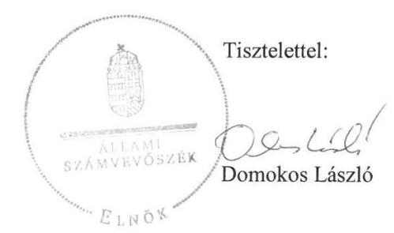

# Jelentés 

## Az önkormányzatok gazdasági társaságai

Az önkormányzatok többségi tulajdonában lévő gazdasági társaságok gazdálkodásának ellenőrzése - MartonSport Nonprofit Korlátolt Felelősségű Társaság
2018.

---

# Jelentés 

## Az önkormányzatok gazdasági társaságai

Az önkormányzatok többségi tulajdonában lévő gazdasági társaságok gazdálkodásának ellenőrzése - MartonSport Nonprofit Korlátolt Felelősségű Társaság
2018. Aapeteltet hó 5. nap

---

# AZ ELLENŐRZÉST FELÜGYELTE:

DR. HORVÁTH MARGIT felügyeleti vezető

## AZ ELLENŐRZÉST VEZETTE ÉS A VÉGREHAJTÁSÁÉRT FELELŐS:

DORMÁN ISTVÁN ellenőrzésvezető

A PROGRAM ÖSSZEÁLLÍTÁSÁÉRT FELELŐS:

TÓTPÁL SZABOLCS osztályvezető

IKTATÓSZÁM: EL-0488-022/2018.

TÉMASZÁM: 2447

ELLENŐRZÉS-AZONOSÍTÓ SZÁM: V079381

Jelentéseink az Országgyűlés számítógépes hálózatán és az Interneta a www.asz.hu címen is olvashatóak.

---

# TARTALOMJEGYZÉK 

■ ÖSSZEGZÉS ..... 5
■ AZ ELLENŐRZÉS CÉLJA ..... 6
■ AZ ELLENŐRZÉS TERÜLETE ..... 7
■ AZ ELLENŐRZÉS HÁTTERE, INDOKOLTSÁGA ..... 8
■ A JELENTÉS LÉNYEGES KÉRDÉSKÖREI ..... 9
■ AZ ELLENŐRZÉS HATÓKÖRE ÉS MÓDSZEREI ..... 10
■ MEGÁLLAPÍTÁSOK ..... 12
■ JAVASLATOK ..... 17
■ MELLÉKLETEK ..... 21
I. sz. melléklet: Értelmező szótár ..... 21
■ FÜGGELÉK: ÉSZREVÉTELEK ..... 23
■ RÖVIDÍTÉSEK JEGYZÉKE ..... 41

---

.

---

# ÖSSZEGZÉS 

Martonvásár Város Önkormányzata a 2014. évben többségi, 2015. évtől kizárólagos tulajdonában álló MartonSport Nonprofit Kft. tekintetében a tulajdonosi joggyakorlás kereteit nem szabályszerűen alakította ki, a Társaság feletti tulajdonosi jogait nem gyakorolta szabályszerűen. A Társaság müködésének szabályozottsága, gazdálkodása és vagyongazdálkodása nem volt szabályszerű. Müködésének átláthatósága nem volt biztosított, a Társaság nem teljesítette a jogszabályban előírt közzétételi kötelezettségét.

## Az ellenőrzés társadalmi indokoltsága

Magyarországon az önkormányzatok kötelező és önként vállalt feladataik vonatkozásában is egyre szélesebb körben alkalmazzák a költségvetésen kívüli feladatellátást, ezáltal - a nonprofit szervezetek mellett - az önkormányzati tulajdonú gazdasági társaságok is kiemelt fontosságú szerephez jutnak. Ezen belül kiemelt jelentőségű számos önkormányzati gazdasági társaság működése abból a szempontból is, hogy gazdálkodásának egyes elemei befolyásolják az önkormányzati alszektor hiányát és az államadósságot.

Az Állami Számvevőszék Stratégiájában foglaltakkal összhangban az ÁSZ kiemelt célja, hogy a helyi önkormányzatok gazdálkodásában rejlő pénzügyi kockázatok feltárásával, az államháztartáson kívülre nyújtott költségvetési támogatások és ingyenes vagyonjuttatások, valamint az államháztartáson kívül működő feladat-ellátó rendszerek ellenőrzéseivel hozzájáruljon ahhoz, hogy a közpénzeket az államháztartáson kívül működő szervezetek is átlátható, rendezett módon használják fel. Ezen stratégiai célkitűzéssel összhangban került sor Martonvásár Város Önkormányzat többségi, majd kizárólagos tulajdonában álló MartonSport Nonprofit Kft. szabályozottságának, gazdálkodása és vagyongazdálkodási tevékenysége szabályszerűségének, valamint az Önkormányzat tulajdonosi joggyakorlása 20142016. évi szabályszerűségének ellenőrzésére.

## Főbb megállapítások, következtetések, javaslatok

Martonvásár Város Önkormányzata 2014-2016. években a MartonSport Nonprofit Kft. tekintetében a tulajdonosi joggyakorlás kereteit nem szabályszerűen alakította ki, a tulajdonosi joggyakorlása nem volt szabályszerű. A Felügyelő Bizottság ügyrendjét nem készítette el. A Társaság legfőbb szerve az egyszerűsített éves beszámolókról a Felügyelő Bizottság írásbeli jelentései alapján döntött. A Társaság vonatkozásában a javadalmazási szabályzatot 2015. novemberig nem alkotta meg. Az Önkormányzat a Társasággal a jogszabályokban meghatározott közfeladat ellátására a közszolgáltatási keretszerződést 2016. júliusig nem kötötte meg.

A Társaság gazdálkodásának szabályozottsága nem felelt meg a jogszabályi előírásoknak. A számviteli politika keretében elkészítendő, törvényben előírt szabályzatok közül az eszközök és a források értékelési szabályzatát, a számlarendet és a bizonylati rendet a Társaság 2014. évben, a leltárkészítési és leltározási szabályzatot, valamint a pénzkezelési szabályzatot 2014-2015. években nem készítette el. A működés átláthatósága nem volt biztosított, az információs önrendelkezési jogról és az információszabadságról szóló törvényben előírt szabályzatokkal 2016. december 30-ig nem rendelkezett, és a törvényben előírt közzétételi kötelezettségét nem teljesítette.

A Társaság gazdálkodása nem volt szabályszerű. A számviteli nyilvántartásokat nem a jogszabályi előírásoknak megfelelően vezette, egyszerűsített éves beszámolóit a számvitelről szóló törvényben előírtaknak megfelelő leltárakkal nem támasztotta alá, a leltárba bekerülő adatok valódiságáról - a leltár összeállítását megelőzően - leltározással nem győződött meg. A Társaság a 2014-2015. években az egyszerűsített éves beszámolója tekintetében beszámolási kötelezettségének nem a jogszabályi előírások szerint tett eleget. A vagyongazdálkodás a saját vagyon nyilvántartásával és az értékcsökkenés elszámolásával kapcsolatos hiányosságok miatt nem volt szabályszerű.

---

# AZ ELLENŐRZÉS CÉLJA 

AZ ELLENŐRZÉS CÉLJA annak értékelése volt, hogy az önkormányzat vagyongazdálkodási tevékenysége során szabályszerűen gyakorolta-e tulajdonosi jogait; a gazdasági társaság szabályozottsága, gazdálkodása és vagyongazdálkodási tevékenysége, bevételeinek és ráfordításainak elszámolása megfelel-e a jogszabályi és tulajdonosi előírásoknak; a gazdasági társaság kötelezettségállománya jelent-e kockázatot a múködésre, valamint a gazdálkodás átláthatósága és elszámoltathatósága érdekében biztosítva volt-e a szolgáltatás dijának megalapozottsága szabályszerű önköltségszámítással.

---

# AZ ELLENŐRZÉS TERÜLETE 

## Martonvásár Város Önkormányzata és a 2014. évben többségi, 2015. évtől kizárólagos tulajdonában álló MartonSport Nonprofit Korlátolt Felelősségű Társaság

Martonvásár város Fejér megyében a Martonvásári járás székhelye, lakónépessége 2016. december 31-én 5574 fő volt.

A polgármester ${ }^{1}$ és a jegyző ${ }^{2}$ személye az ellenőrzött időszakban nem változott, 2015. január 1-től 2016. december 31ig a jegyzői feladatokat az aljegyző helyettesítéssel látta el.

A MartonSport Nonprofit Kft. 2014. március 13-án alakult, fő tevékenysége egyéb sporttevékenység volt, amely az Mötv. ${ }^{3}$ 13. § (1) bekezdés 15. pontja alapján közfeladatnak minősült. A Társaság közfeladatait 2016. július 15-től közszolgáltatási keretszerződés ${ }^{4}$ alapján látta el, melyben rögzítették az Mötv. és a Sport tv. ${ }^{5}$ alapján a helyi sporttal, utánpótlás neveléssel, a köznevelési intézményekben bevezetett „mindennapos testnevelés" keretében az általános iskolás tanulók számára a
megfelelő minőségű és mennyiségű testmozgással kapcsolatos közszolgáltatási kötelezettséget, a szolgáltatások nyújtásához kapcsolódó költségek megosztására vonatkozó szabályokat, a szerződés felmondásának és módosításának szabályait. A Társaság ${ }^{6}$ 2016. október 11-től sporttevékenység cél szerinti besorolással közhasznú jogállású szervezet volt.

A Társaságban az Önkormányzat ${ }^{7}$ 2015. február 9-ig 77,7\%-os többségi tulajdoni hányaddal rendelkezett, 2015. február 10-től a Társaság 100\%-os tulajdonosa volt.

A Társaság ügyvezetőjének személye az ellenőrzött időszakban nem változott. A Társaság a Számv. tv. ${ }^{8}$ alapján nem volt könyvvizsgálatra kötelezett, Társasági szerződésében ${ }^{9}$ és Alapító Okiratában ${ }^{10}$ foglaltak szerint választott könyvvizsgálója nem volt.

A Társaság jegyzett tőkéje az alakuláskor 0,9 M Ft ${ }^{11}$ volt, amely az Önkormányzat 200,0 M Ft-os törzstőke emelése következtében a 2015. évben 200,9 M Ft-ra emelkedett. A 2016. évben további törzstőke emelésre került sor, a jegyzett tőke összege 230,9 M Ft lett. A Társaság nettó árbevétele a 2014. év végi 0 M Ft-ról 2016. év végére 5,4 M Ft-ra, mérleg szerinti, illetve adózott eredménye -0,7 M Ft-ról 7,4 M Ft-ra, a foglalkoztatottak átlagos statisztikai létszáma 1 főről 6 főre nőtt.

A Társaság vagyonkezelésbe vagyont nem vett át, vagyonkezelési szerződést nem kötött, más gazdasági társaságban részesedéssel nem rendelkezett. A Társaság nem tartozott a kormányzati szektorba sorolt egyéb szervezetek közé.

---

# AZ ELLENŐRZÉS HÁTTERE, INDOKOLTSÁGA 

## AZ ÖNKORMÁNYZATOK TÖBBSÉGI TULAJDONÁBAN ÁLLÓ GAZDASÁGI TÁRSASÁGOK ELLENŐR-

ZÉSE kiemelten fontos a vagyon megőrzése, megóvása érdekében, valamint a kormányzati szektor elszámolásaiban megjelenő önkormányzati tulajdonú gazdálkodó szervezetek esetében, amelyekkel szemben alapvető követelmény, hogy gazdálkodásuk, múködésük szabályszerű, az általuk szolgáltatott adatok minél megbízhatóbbak legyenek. A feladatellátás költségeinek, ráfordításainak alakulása a lakosság széles rétegét érinti.

Az Állami Számvevőszék ellenőrzései feltárhatják, hogy az önkormányzat a feladatellátásához rendelt vagyon múködtetését a tulajdonostól elvárható gondossággal végezte-e, a feladatot ellátó gazdasági társaság a létesítő okiratban, szolgáltatási szerződésben foglaltak betartásával biztosí-totta-e a feladat ellátását. Az ellenőrzés eredményeképp meghatározhatóvá válnak a költségvetési hiányt befolyásoló szervezetek kockázatai, lehetővé válik ezen kockázatok csökkentése. Az ellenőrzés rávilágíthat arra, hogy a hogy a gazdasági társaság a vagyon használatával biztosította-e a szolgáltatás folytatásának feltételeit, az önkormányzat tulajdonosi felügyelete hozzájárult-e a szabályszerű gazdálkodáshoz és feladatellátáshoz. A megállapítások alapján megfogalmazott számvevőszéki javaslatok hasznosítása elősegítheti a meglévő hibák megszüntetését. A jó gyakorlatok bemutatásával az ÁSZ ${ }^{12}$ hozzájárulhat a követendő megoldások megismertetéséhez, terjesztéséhez.

---

# A JELENTÉS LÉNYEGES KÉRDÉSKÖREI 

1. Az Önkormányzat tulajdonosi joggyakorlása szabályszerű volt-e?
2. A Társaság szabályozottsága, gazdálkodási tevékenysége szabályszerű volt-e?
3. A Társaság vagyongazdálkodási tevékenysége szabályszerű volt-e?

---

# AZ ELLENŐRZÉS HATÓKÖRE ÉS MÓDSZEREI 

## Az ellenőrzés típusa

Megfelelőségi ellenőrzés.

## Az ellenőrzött időszak

2013. január 1-jétől 2016. december 31-ig tartó időszak.

## Az ellenőrzés tárgya

Martonvásár Város Önkormányzat 2015. február 9-ig többségi, 2015. február 10-től 100\%-os tulajdonában álló MartonSport Nonprofit Kft. feletti tulajdonosi joggyakorlása, valamint a Társaság gazdálkodásának szabályozottsága és szabályszerűsége.

Az ellenőrzés kiterjedt minden olyan körülményre és adatra, amely az ÁSZ jogszabályban meghatározott feladatainak teljesítéséhez, valamint a program végrehajtása folyamán felmerült újabb összefüggések feltárásához szükséges volt.

## Az ellenőrzött szervezet

$\longrightarrow$ Martonvásár Város Önkormányzata
$\longrightarrow$ MartonSport Nonprofit Kft.

## Az ellenőrzés jogalapja

Az ellenőrzés jogszabályi alapját az ÁSZ tv. ${ }^{13}$ 1. § (3) bekezdése és 5. § (3)(5) bekezdései képezték.

## Az ellenőrzés módszerei

Az ellenőrzést a nemzetközi standardokat irányadónak tekintve az ellenőrzési program ellenőrzési kérdései, az ellenőrzött időszakban hatályos jogszabályok, az ellenőrzés szakmai szabályok és módszertanok figyelembe vételével végeztük.

Az ellenőrzés ideje alatt az ellenőrzött szervezettel történő kapcsolattartást az ÁSZ Szervezeti és Müködési Szabályzatának vonatkozó előírásai alapján biztosítottuk.

---

Az ellenőrzési kérdések megválaszolásához szükséges bizonyítékok megszerzése a következő ellenőrzési eljárások alkalmazásával történt: megfigyelés, kérdésfeltevés (információkérés), összehasonlítás, valamint elemző eljárás. Az ellenőrzési bizonyítékként felhasználható adatforrások közé tartoztak egyrészt az ellenőrzési programban felsorolt adatforrások, másrészt adatforrás lehetett még minden - az ellenőrzés folyamán - feltárt, az ellenőrzés szempontjából információkat tartalmazó dokumentum. Az ellenőrzést a kérdésekre adott válaszok kiértékelésével, valamint a megjelölt adatforrások, a csatolt tanúsítványok felhasználásával, továbbá az adott időszakban hatályos jogszabályok figyelembe vételével kellett lefolytatni.

A bevételek és ráfordítások elszámolását, és a vagyonnyilvántartás terén a szabályszerű működést véletlen mintavétellel ellenőriztük. A mintavétellel ellenőrzött területek esetében minden egyes tétel vonatkozásában szabályszerűségre vonatkozó kérdéseket tettünk fel, amelyek a számviteli törvény, illetve a tulajdonosi követelményeknek és az ellenőrzött szervezet belső szabályozásai előírásainak betartására vonatkoztak. A jogszabályoknak és a belső előírásoknak megfelelőnek tekintettük az adott területet, amennyiben a minta ellenőrzésének eredménye alapján 95\%-os bizonyossággal a teljes sokaságban a hibaarány kisebb volt, mint 10\%, nem megfelelőnek értékeltük, ha a hibaarány a 10\%-ot meghaladta. A ráfordítások, ezen belül az anyagjellegú, az egyéb, a pénzügyi műveletek és a rendkívüli ráfordítások elszámolására az értékcsökkenésre és a vagyonnyilvántartásra vonatkozó véletlen mintavételt kockázati alapú kiválasztással egészítettük ki, amelynek során évente a három legnagyobb összegű tételt választottuk ki.

---

# 1. Az Önkormányzat tulajdonosi joggyakorlása szabályszerű volt-e? 

Összegző megállapítás

Az Önkormányzat tulajdonosi joggyakorlás kereteit nem szabályszerűen alakította ki, a tulajdonosi joggyakorlás nem volt szabályszerű.

AZ ÖNKORMÁNYZAT rendelkezett a Képviselő-testület által jóváhagyott fejlesztési tervvel ${ }^{14}$, koncepcióval ${ }^{15}$ és az Nvtv. ${ }^{16}$ szerinti, Középés hosszú távú vagyongazdálkodási tervvel ${ }^{17}$.

Az Önkormányzat az Mötv.-nek megfelelően a múködésének szabályait az önkormányzati SZMSZ-ben ${ }^{18}$ határozta meg. A vagyonnal való gazdálkodás, a Társaság feletti tulajdonosi joggyakorlás szabályait a vagyongazdálkodási rendeletben ${ }^{19}$, a Társasági Szerződésben és a Társaság Alapító Okiratában rögzítette. Az Önkormányzat a Társasággal az Mötv. 13. § (1) bekezdés 15. pontjában, az önkormányzati SZMSZ-ben meghatározott közfeladatot 2014. március 13-ától 2016. július 14-éig a Társaság a Társasági Szerződés és az Alapító Okirat 6.6. pontjában meghatározott közszolgáltatási szerződés nélkül látta el, a közszolgáltatási keretszerződést az Önkormányzat és a Társaság 2016. július 15-én kötötte meg.

A TULAJ DONOSOK ${ }^{20}$ a Társasági Szerződésben a Gt. ${ }^{21}$-ben és az Alapító Okiratban a Ptk. ${ }^{22}$-ban foglaltakkal összhangban előírták az $\mathrm{FB}^{23}$ megválasztását, feladatait, eljárásának szabályait, beszámolási kötelezettségét. Az FB tagokat a Gt. és a Ptk. előírásainak megfelelően a Társaság legfőbb szerve ${ }^{24}$ választotta.

Az FB az ügyrendjét az ellenőrzött időszakban nem állapította meg, amellyel megsértették a Ptk. 3:122. § (3) bekezdése előírásait. Az FB a Gt. és a Ptk. előírásainak megfelelően az előterjesztésekkel kapcsolatos álláspontját a Társaság legfőbb szerve ülésein ismertette. A Társaság egyszerűsített éves beszámolóit a Társaság legfőbb szerve a Gt. és a Ptk. előírásainak megfelelően az FB írásbeli jelentésének birtokában hagyta jóvá.

A Társaság vezető tisztségviselőinek, FB tagjainak, valamint az Mt. ${ }^{25}$ hatálya alá tartozó munkavállalóinak javadalmazási, juttatási rendszerről szóló szabályzatot a Társaság legfőbb szerve a Taktv. ${ }^{26} 5$ § (3) bekezdése előírásai ellenére 2015. november 24 -ig nem alkotta meg. A Javadalmazási szabályzat ${ }^{27} 2015$. november 25 -től került kiadásra.

A Társaság 2016. évben betartotta a Civil tv. ${ }^{28}$ előírásait, mely szerint közhasznú szervezet a gazdálkodása során elért eredményét a tagok között nem oszthatja fel.

Az Áht. ${ }^{29}$-ben biztosított belső ellenőrzés lehetőségével az Önkormányzat a 2014-2015. években nem élt. A 2016 szeptemberében indult belső ellenőrzésben az Önkormányzat ellenőrizte a Társaság 2015-2016. évi köz-

---

feladat ellátását, működését és gazdálkodását. A Társaság Alapító Okiratának, SZMSZ ${ }^{30}$-ének felülvizsgálatára, az FB ügyrendjének megalkotására, az Önkormányzat felé az adatszolgáltatások körének, határidejének rögzítésére, az éves beszámoló kiegészítő mellékletének Számv. tv. szerinti elkészítésére vonatkozó javaslatokra az intézkedési terv-készítési kötelezettségének és az intézkedési terv végrehajtásának határideje az ellenőrzött időszakon kívül esett. A Társaság belső ellenőrt a szervezetét és múködését szabályozó SZMSZ szerint nem foglalkoztatott. A Társaságnál külső ellenőrző szervezet ellenőrzést nem végzett.

# 2. A Társaság szabályozottsága, gazdálkodási tevékenysége szabályszerű volt-e? 

Összegző megállapítás

A Társaság szabályozottsága, gazdálkodási tevékenysége nem felelt meg a jogszabályi előírásoknak. A bevételek és ráfordítások elszámolása, valamint az önköltségszámítás nem volt szabályszerű.

SZÁMVITELI POLITIKÁVAL a Társaság a Számv. tv.-ben előírtak szerint rendelkezett, a Számviteli politika ${ }_{1-2}{ }^{31}$ azonban a 2014-2015. években nem volt megfelelő, a számviteli politika keretében elkészítendő szabályzatok hiánya miatt, valamint mert a Számv. tv. 20. § (2) bekezdése előírása ellenére a Társaság a Számviteli politika ${ }_{1,2} 6.2$. pontja szerint az éves beszámolót forintban készíti el. A Számv. tv. 14. § (3) bekezdése előírásai ellenére a Társaság adottságainak, körülményeinek leginkább megfelelő - a törvény végrehajtásának módszereit, eszközeit meghatározó számviteli politikát 2014-2015. években nem alakította ki. 2016. évben a Számviteli politika megfelelt a jogszabályi előírásoknak, a Számviteli politika ${ }_{4}{ }^{32}$ a Számv. tv. előírásának megfelelően a Társaság alapcél szerinti tevékenysége tekintetében a bevételek és ráfordítások elkülönített nyilvántartására vonatkozó szabályozást tartalmazta.

A SZÁMVITELI POLITIKA KERETÉBEN elkészítendő szabályzatok közül a Társaság 2014. évben a Számv. tv. 14. § (5) bekezdés b) pontja előírásai ellenére nem készítette el az eszközök és a források értékelési szabályzatát. Az Értékelési szabályzatot ${ }^{33}$ 2015. január 1-jével adta ki. Az Értékelési szabályzat 2015-2016. években megfelelt a jogszabályi előírásoknak.

2014-2015. években a Számv. tv. 14. § (5) bekezdés a) pontja előírásai ellenére nem készítette el az eszközök és a források leltárkészítési és leltározási szabályzatát, valamint a Számv. tv. 14. § (d) pontja előírásai ellenére nem készítette el a pénzkezelési szabályzatot. A Leltározási szabályzatot ${ }^{34}$ és a Pénzkezelési szabályzatot ${ }^{35}$ 2016. január 1-jével léptette hatályba. A Társaság a Leltározási szabályzatban a Számv. tv. 69. § (3) bekezdés előírásai ellenére nem határozta meg a leltározás gyakoriságának időszakát. A Pénzkezelési szabályzatban a Társaság a Számv. tv 14. § (8) bekezdésében előírtak ellenére nem rendelkezett a készpénzállományt érintő pénzmozgások eljárási rendjéről.
2014. évben a Számv. tv. 161. § (1) bekezdése előírásai ellenére a számlarendet, valamint a Számv. tv. 161. § (2) bekezdés d) pontjában előírtak

---

ellenére annak részeként a bizonylati rendet nem készítette el. A Számlarendet ${ }^{36}$ és a Bizonylati rendet ${ }^{37} 2015$. január 1-jével adta ki.

A Társaság 2016. október 11-től közhasznú jogállású volt, a Számlarend 2016. október 11-től nem felelt meg a Számv. tv. 161. § (2) bekezdés a)-b) pontjaiban előírtaknak, mivel nem tartalmazta minden alkalmazásra kijelölt számla számjelét és megnevezését, a számla tartalmát, továbbá a számla értéke növekedésének, csökkenésének jogcímeit, a számlát érintő gazdasági eseményeket, azok más számlákkal való kapcsolatát. A Számv. tv. 161. § (4) bekezdésében előírtak ellenére az ügyvezető nem gondoskodott a Számlarend folyamatos karbantartásáról.

BESZÁMOLÁSI KÖTELEZETTSÉGÉNEK a Társaság 2014-2015. években nem a jogszabályi előírásoknak megfelelően tett eleget. 2014. évben a Számv. tv. 153. § (1) és 154. § (1) bekezdésében előírtak ellenére nem az alapító által elfogadott egyszerűsített éves beszámolót tette közzé és helyezte letétbe, a 2014. évi egyszerűsített éves beszámoló aláírására a letétbe helyezés és a közzététel után került sor. A 2015. évi beszámoló készítése során nem alkalmazta a Számv. tv. 15. § (6) bekezdésében előírt folytonosság alapelvét, a 2015. évi egyszerűsített éves beszámoló előző évi adata a követelések és a rövidlejáratú kötelezettségek esetén nem egyezett a 2014. évi egyszerűsített éves beszámoló záró adataival. Az eltérés - összesen 34 ezer Ft - nem érte el a Számv. tv. 3. § (3) bekezdés 3. pontja szerinti jelentős hiba összegét.

A Társaság az egyszerűsített éves beszámolókat a 2015-2016. években a Számv. tv. előírásainak megfelelően letétbe helyezte és közzétette. A Társaság a Civil tv.-nek megfelelően a 2016. évi beszámolóval egyidejűleg elkészítette és közzétette a közhasznúsági mellékletet is.

A KÖZÉRDEKŰ ADATOK megismerésére irányuló igények teljesítésének rendjét rögzítő szabályzatot a Társaság az Info tv. ${ }^{38}$ 30. § (6) bekezdése előírásai ellenére 2016. december 30-ig nem készített, a Közérdekű adatok megismerési szabályzatot ${ }^{39}$ 2016. december 31-én adta ki. Adatvédelmi és adatbiztonsági szabályzatot a Társaság az Info tv. 24. § (3) bekezdése előírásai ellenére 2016. december 30-ig nem készített. Az Adatvédelmi szabályzat ${ }^{40}$, illetve az Informatikai biztonsági szabályzat ${ }^{41}$ kiadására 2016. december 31-ei hatállyal került sor.

A Társaság a tevékenységéhez kapcsolódóan a Taktv.-ben előírt közzétételi kötelezettségét teljesítette. A Társaság az Info tv. 37. § (1) bekezdésben és az 1. mellékletében szereplő általános közzétételi listában meghatározott adatok közül a II. Tevékenységre, múködésre vonatkozó adatok 5. pontjában előírt, a közfeladatot ellátó szerv által nyújtott vagy költségvetéséből finanszírozott közszolgáltatások megnevezését, tartalmát, a közszolgáltatások igénybevételének rendjét, a közszolgáltatásért fizetendő díj mértékét, az abból adott kedvezményeket, a II.13. pontja alapján a közérdekű adatok megismerésére irányuló igények intézésének rendjét, az illetékes szervezeti egység nevét, elérhetőségét, III. Gazdálkodási adatok 2. pontja szerinti a közfeladatot ellátó szervnél foglalkoztatottak létszámára és személyi juttatásaira vonatkozó összesített adatokat, illetve összesítve a vezetők és vezető tisztségviselők költségtérítésére, az egyéb alkalmazottaknak nyújtott juttatások fajtájára és mértékére vonatkozó adatok közzétételének a honlapján nem tett eleget.

---

A BEVÉTELEK ÉS A RÁFORDÍTÁSOK elszámolása nem volt szabályszerű. A Számv. tv. 167. § (1) bekezdés h) pont előírásai ellenére a könyvviteli elszámolást közvetlenül alátámasztó bizonylatok nem, vagy nem megfelelően tartalmazták a könyvelés módjára, az érintett könyvviteli számlákra történő hivatkozást. A személyi jellegű ráfordítások elszámolásánál a Számv. tv. 165. § (1)-(2) bekezdése előírásai ellenére a gazdasági esemény számviteli elszámolását (nyilvántartását) számviteli bizonylattal - megbízási, illetve munkaszerződéssel, teljesítésigazolással, vagy a számfejtés alapját képező fizetési jegyzékkel - nem minden esetben támasztották alá.

A Társaság a 2016. évben Civil tv. előírásainak megfelelően a számviteli nyilvántartásaiban az alapcél szerinti (közhasznú) tevékenységének és gaz-dasági-vállalkozási tevékenységének bevételeit, költségeit, ráfordításait egymástól elkülönítetten tartotta nyilván.

AZ ÖNKÖLTSÉGSZÁMÍTÁS RENDJÉRE vonatkozó szabályzat készítésére a Társaság Számv. tv. alapján nem volt kötelezett. A Közszolgáltatási keretszerződés 2016. július 15-től előírta, hogy a közfeladatok tekintetében a Társaságnak évente meg kell határoznia a tevékenységekre vonatkozó fajlagos költséget.

AZ EGYES SZOLGÁLTATÁSOK DÍJAINAK megállapítása rendjét a Társaság nem szabályozta, a Közszolgáltatási keretszerződés IV.12. pontjában előírt, a közfeladat tekintetében a tevékenységre vonatkozó fajlagos költségeket - a IV.3. pontban előírtak ellenére az egyes szolgáltatások díjainak megállapításakor az egyes tevékenységek önköltségét - nem határozta meg.

A 2014-2015. években a Társaságnak lejárt határidejű szállítói kötelezettségei nem voltak, a 2016. évben nem volt biztosított a rövid lejáratú kötelezettségek határidőben történő teljesítése, a lejárt szállítói tartozások értéke az összes szállítói tartozás $81,4 \%$-át tette ki.

# 3. A Társaság vagyongazdálkodási tevékenysége szabályszerű volt-e? 

## Összegző megállapítás

A Társaság vagyongazdálkodási tevékenysége nem felelt meg a jogszabályi előírásoknak.

A VAGYONGAZDÁLKODÁSI TEVÉKENYSÉG nem volt szabályszerű. A Társaság egyszerűsített éves beszámolói nem feleltek meg a Számv. tv. 4. § (1)-(2) bekezdésének, nem nyújtottak valós képet a Társaság vagyonáról, mivel a mérleg tételeit a Számv. tv.-ben előírtaknak megfelelő leltárral nem támasztották alá. Nem tartották be a Számv. tv. 69. § (1) bekezdése előírásait, mivel a beszámolók elkészítéséhez, a mérleg tételeinek alátámasztásához nem olyan leltárakat állítottak össze, amelyek tételesen, ellenőrizhető módon tartalmazták a mérleg fordulónapján meglévő eszközeit és forrásait mennyiségben és értékben.

A Számv. tv. 69. § (3) bekezdésében foglaltak ellenére a Társaság a leltárba bekerülő adatok valódiságáról - a leltár összeállítását megelőzően -

---

leltározással nem győződött meg, és azt legalább háromévente mennyiségi felvétellel, illetve minden üzleti év mérlegfordulónapjára vonatkozóan a csak értékben kimutatott eszközöknél és kötelezettségeknél egyeztetéssel nem végezte el.

# A SAJÁT VAGYON NYILVÁNTARTÁSA, AZ ÉRTÉK- 

CSÖKKENÉS ELSZÁMOLÁSA nem volt szabályszerű. A bekerülési érték meghatározása nem a Számv. tv. 47. § (1) bekezdés és 47. § (4) bekezdés d) pont előírásainak megfelelően történt, mert a bekerülési érték meghatározása során a beruházások tervezési díjait, közvetlen költségeit a Társaság nem osztotta fel az egyes beruházások között. A Számv. tv. 26. § (1) és 52. § (2) bekezdés előírásai ellenére a tárgyi eszközök esetében az üzembe helyezést hitelt érdemlő módon nem dokumentálták.

---

# JAVASLATOK 

Az ÁSZ tv. 33. § (1) bekezdésében foglaltak értelmében az ellenőrzött szervezet vezetője köteles a jelentésben foglalt megállapításokhoz kapcsolódó intézkedési tervet összeállítani és azt a jelentés kézhezvételétől számított 30 napon belül az ÁSZ részére megküldeni. Amennyiben az ellenőrzött szervezet vezetője nem küldi meg határidőben az intézkedési tervet, vagy továbbra sem elfogadható intézkedési tervet küld, az Állami Számvevőszék elnöke az ÁSZ tv. 33. § (3) bekezdése a) és b) pontjaiban foglaltakat érvényesítheti.

## Javaslataink célja a MartonSport Nonprofit Korlátolt Felelősségű Társaság gazdálkodása szabályszerűségének és gyakorlatának javítása annak érdekében, hogy a szabályozási környezet és az alkalmazott gyakorlat megfelelően tudja támogatni az átlátható müködést.

## MartonSport Nonprofit Korlátolt Felelősségű Társaság ügyvezetőjének

1. Intézkedjen a számviteli szabályzatok Számv. tv. előirásainak megfelelő módosításáról.
(2. sz. megállapítás 3. bekezdés 3-4. mondatai és az 5. bekezdés alapján)
2. Intézkedjen az egyszerüsített éves beszámoló Számv. tv. előirásainak megfelelő közzétételéről és letétbe helyezéséről.
(2. sz. megállapítás 6. bekezdés 2. mondata alapján)
3. Intézkedjen a közzétételi kötelezettségének teljesítéséről az Info tv. előírásainak megfelelően.
(2. sz. megállapítás 9. bekezdése 2. mondata alapján)
4. Intézkedjen a bevételek és a ráfordítások Számv. tv előírásainak megfelelő elszámolása érdekében.
(2. sz. megállapítás 10. bekezdés 1-2. mondatai alapján)
5. Intézkedjen a személyi jellegü ráfordítások Számv. tv. előírásainak megfelelő elszámolása érdekében.
(2. sz. megállapítás 10. bekezdés 3. mondata alapján)

---

6. Intézkedjen az egyes szolgáltatási díjak megállapítása rendjének szabályozásáról a Közszolgáltatási keretszerződésben foglaltaknak megfelelően.
(2. sz. megállapítás 13. bekezdés 1. mondat 1-2. tagmondatai alapján)
7. Intézkedjen a közfeladat tekintetében a tevékenységre vonatkozó fajlagos költségek meghatározásáról a Közszolgáltatási szerződésben foglaltaknak megfelelően.
(2. sz. megállapítás 13. bekezdés 1. mondat 3. tagmondata alapján)
8. Intézkedjen az egyszerüsített éves beszámoló mérlegének Számv. tv.ben elöirtaknak megfelelő leltárral történő alátámasztásáról.
(3. sz. megállapítás 1. bekezdése alapján)
9. Intézkedjen a leltározás Számv. tv.-ben elöirtaknak megfelelő gyakorisággal történő végrehajtásáról.
(3. sz. megállapítás 2. bekezdése alapján)
10. Intézkedjen az értékcsökkenés Számv. tv. előírásainak megfelelő elszámolásáról a beruházások bekerülési értékének meghatározásával, valamint a tárgyi eszközök üzembe helyezésének hitelt érdemlő módon történő dokumentálásával.
(3. sz. megállapítás 3. bekezdése alapján)

---

# Javaslataink célja az Önkormányzat szabályszerű müködésének elősegítése, továbbá az önkormányzati tulajdonosi joggyakorlás kontrolljainak erősítése. 

## Martonvásár Város Önkormányzata polgármesterének

1. Kezdeményezze a Felügyelő Bizottság elnökénél az FB ügyrendjének elkészitését, azt követően annak alapítói jóváhagyását a Ptk. előírásainak megfelelően.
(1. sz. megállapítás 4. bekezdés 1. mondata alapján)
2. Intézkedjen
a) a számviteli szabályozási hiányosságok,
b) a beszámoló közzétételének hiányossága,
c) a közzétételi kötelezettség teljesítésének hiányosságai,
d) a bevételek és a ráfordítások elszámolásának hiányosságai,
e) az egyes szolgáltatási díjak megállapítása rendjének szabályozási hiányosságai,
f) a közfeladat tekintetében a tevékenységre vonatkozó fajlagos költségek meghatározásának hiánya,
g) a leltár szabálytalanságai,
h) a leltározás hiánya,
i) az értékcsökkenés elszámolásának hiányosságai,
miatti felelősség tisztázása érdekében, és szükség szerint intézkedjen a felelősség érvényesítéséről.
(2. sz. megállapítás: 3. bekezdés 3-4. mondatai, 5. bekezdés, 6. bekezdés 2. mondata, 9. bekezdés 2. mondata, 10. bekezdés, 13. bekezdés; 3. sz. megállapítás alapján)

---

.

---

# MELLÉKLETEK 

- I. SZ. MELLÉKLET: ÉRTELMEZŐ SZÓTÁR
gazdasági társaság
kormányzati szektorba sorolt egyéb szervezet
meghatározó befolyás
minősített többséget biztosító részesedés
többségi befolyást biztosító részesedés

Ptk. 3.88. § (1) bekezdése szerint „a gazdasági társaságok üzletszerű közös gazdasági tevékenység folytatására, a tagok vagyoni hozzájárulásával létrehozott, jogi személyiséggel rendelkező vállalkozások, amelyekben a tagok a nyereségből közösen részesednek, és a veszteséget közösen viselik".
az Áht. 3. § (2) és (3) bekezdésében foglaltakon kívül az Európai Közösséget létrehozó szerződéshez csatolt, a túlzott hiány esetén követendő eljárásról szóló jegyzőkönyv alkalmazásáról szóló 2009. május 25-i 479/2009/EK rendelet (a továbbiakban: 479/2009/EK rendelet) szerint a kormányzati szektorba sorolt szervezet (Áht. 1. § (12))
A Ptk. 8:2. § (2) bekezdése szerint „A befolyással rendelkező akkor rendelkezik egy jogi személyben meghatározó befolyással, ha annak tagja vagy részvényese, és
a) jogosult e jogi személy vezető tisztségviselői vagy felügyelő bizottsága tagjai többségének megválasztására, illetve visszahívására; vagy
b) a jogi személy más tagjai, illetve részvényesei a befolyással rendelkezővel kötött megállapodás alapján a befolyással rendelkezővel azonos tartalommal szavaznak, vagy a befolyással rendelkezőn keresztül gyakorolják szavazati jogukat, feltéve, hogy együtt a szavazatok több mint felével rendelkeznek."
A minősített befolyásszerző az ellenőrzött társaságban a szavazatok legalább hetvenöt százalékával rendelkezik. (Ptk. 3:324. §)
Nvtv. 1. § (2) bekezdése szerint többek között:
„az állam vagy a helyi önkormányzat kizárólagos tulajdonában álló dolgok, az a) pont hatálya alá nem tartozó, állam vagy a helyi önkormányzat tulajdonában lévő dolog,
az állam vagy a helyi önkormányzat tulajdonában lévő pénzügyi eszközök, továbbá az államot vagy a helyi önkormányzatot megillető társasági részesedések, az államot vagy a helyi önkormányzatot megillető bármely vagyoni értékkel rendelkező jogosultság, amelyet jogszabály vagyoni értékű jogként nevesít."
A Ptk. 8:2. § (1) bekezdése szerint „többségi befolyás az olyan kapcsolat, amelynek révén természetes személy vagy jogi személy (befolyással rendelkező) egy jogi személyben a szavazatok több mint felével vagy meghatározó befolyással rendelkezik."

---

.

---

# FÜGGELÉK: ÉSZREVÉTELEK 

A jelentéstervezetet a Számvevőszék 15 napos észrevételezésre megküldte az ellenőrzött szervezetek vezetőinek az ÁSZ tv. 29. §* (1) bekezdése előírásának megfelelően.

A jelentés függeléke tartalmazza a MartonSport Nonprofit Korlátolt Felelősségű Társaság ügyvezetőjének és Martonvásár Város Önkormányzata polgármesterének a jelentéstervezettel kapcsolatos észrevételeit és az azok kezeléséről szóló válaszleveleket.

[^0]
[^0]:    * 29. § (1) Az Állami Számvevőszék az ellenőrzési megállapításait megküldi az ellenőrzött szervezet vezetőjének vagy az általa megbízott személynek, és annak, akinek személyes felelősségét állapította meg.
    (2) Az ellenőrzött szervezet vezetője és a felelősként megjelölt személy az ellenőrzés megállapításaira tizenöt napon belül írásban észrevételt tehet.
    (3) Az Állami Számvevőszék az észrevételre a beérkezésétől számított harminc napon belül írásban válaszol. A figyelembe nem vett észrevételeket köteles a jelentésben feltüntetni, és megindokolni, hogy azokat miért nem fogadta el.

---

MartonSport Nonprofit Kft.
postacím: 2462 Martonvásár, Szent László út 2. telefon: 20/488-5200
villanyposta: martonsport@martonvasar.hu honlap: www.martonsport.hu

# Domokos László úr 

elnök
Állami Számvevőszék
Budapest

## Tisztelt Elnök Úr!

Köszönettel megkaptam az általam vezetett MartonSport Nonprofit Kft.-ről készült számvevőszéki jelentéstervezetüket, mellyel kapcsolatban az alábbiakban kívánom leírni az észrevételeimet:

Az előzmények vonatkozásában szeretném az ellenőrzés körülményeit kicsit felidézni. Az ellenőrzés megkezdését két hivatalos levél előzte meg. Az elsőben tájékoztattak arról, hogy hamarosan ellenőrzés várható és készüljünk fel arra, hogy a következő értesítés után 15 alatt adatot kell szolgáltatnunk. Ezt figyelembe véve igyekeztünk megfelelően felkészülni és a legjobb szándékaink szerint mindent előkészíteni. A második levél után nyílt lehetőség megismerni a pontosan kért dokumentum listát és az erre fejlesztett rendszer használatát is ekkor tudtuk feltérképezni. Az idő rövidsége, a tetemes mennyiségű bekért adathalmaz és a személyes egyeztetés lehetőségének hiánya nehezítette az elvárásnak megfelelő adatszolgáltatást.

Sajnos nem minden esetben volt egyértelmű, mi a teendő, pontosan mi az elvárás, hiszen személyes találkozó nélkül, kizárólag írásos kommunikáció alapján igen komoly mennyiségű adatot kellett nagyon rövid határidőn belül összegyűjteni és a pontosan meghatározott formában feltölteni a felületre. A felület használatával kapcsolatban is merültek fel kérdések és adódtak nehézségek. Ha kérdésünk adódott, csak ritkán sikerült ügyintézővel beszélni, amikor sikerült, akkor sem feltétlenül kaptunk határozott válaszokat a kérdéseinkre.

Talán ebből is adódhatott pár félreértés, ami nem segítette a tisztánlátást az ellenőrzés során. Erre egy példát szeretnék kiemelni:

1. Számlák: Mivel számunkra nem derült ki, hogy a könyvelés utáni állapotot kell bemutatni, olyan számlák kerültek feltöltésre, ami a munkafolyamatunknak megfelelően rendelkezésre álltak digitálisan, de ez nem a végső állapot, hanem a beérkezési szkennelés volt. Ebből következően az a megállapítás, miszerint nincs a számlákon feltüntetve minden, amit a számviteli törvény előír, nem helytálló, csak mindössze annyi történt, hogy nem a végső fázisban lévő számlaképet látta az ellenőrzést végző személy. Ezt a melléklettel is igyekszünk alátámasztani.
2. A Bevételek és Ráfordítások elszámolásával kapcsolatban a feltárt megállapításait nem tartjuk helytállónak, mellyel kapcsolatban csatoltan küldöm a társaság könyvelője által összeállított választ is mellékletekkel együtt, melyben kifejtjük álláspontunkat.
3. A számviteli politikával kapcsolatban megemlített ténymegállapítás valóban helytálló, de a beszámoló forintban történő elkészítése (ezer forint helyett) nem eredményez semmilyen hátrányt, sőt inkább a pontosság érdekét szolgálja. Így még ha nem pontosan felelt meg a jogszabályi előírásoknak, akkor sem lehet ellentétes a tulajdonos érdekeivel és valódi kockázatot sem jelent. Ráadásul ez is csak az első két évben történt meg, 2016-ban már egy másik könyvelőirodával ez is

---

orvoslásra került. Mégis a kijelentés megfogalmazása inkább súlyos hiányosságot sugall, mintsem a valóságot, miszerint az első két évben a beszámoló pontosabb volt, mint az előírt.

Az összegzésben a fóbb megállapítás utolsó mondata kapcsán nem világos, hogy a rengeteg statisztikai adatból miért ez lett kiemelve és pont ilyen kontextusban. Hiszen a konkrét számokat megismerve a jelentősége elenyésző, ha egyáltalán megemlítésre érdemes, akkor sem a főbb megállapítások közé való. A „romlás" ugyan vitathatatlan, hiszen a megelőző két évben egyáltalán nem volt lejárt tartozásunk. 2016-ban pedig ez összeg szerint 144.203 Ft , ami 4 tételből adódott és a költségvetésünk nagyságrendjéhez és az összes számla darabszámához képest elenyésző. A 81,4\%-os arány pedig magasnak tűnhet, de csak azért, mert az összes tartozáshoz van viszonyítva és ezen kívül mindössze két tartozás tétel volt abban a pillanatban nyilvántartva, ami még le sem járt. Az összeg nagyságrendjét illetően nem ingatja meg a társaság múködését és nem jelent különösebb kockázatot különösen úgy, hogy egy pillanatnyi állapotot mutat, ami azóta rendeződött is.

A Saját vagyon nyilvántartása kapcsán tett megállapítás nem világos, hogy milyen dokumentum alkalmas a hitelt érdemlő módon történő dokumentálásra (illetve az pontosan melyik tételre vonatkozik), ha rendelkezünk számlával, teljesítés igazolással, használatba vételi engedéllyel és üzembe helyezési jegyzőkönyvvel. Ezt kérjük pontosítani.

Sok olyan hiány megállapítás történt, ami a társaság müködésének első két évére vonatkozik, amik az ellenőrzés időpontjában már nem álltak fenn, de a megállapítás ettől függetlenül egyértelműen a nem volt szabályszerű, de érzésem szerint a valóságnak jobban megfelelne, ha így hangozna: „nem teljes körűen felelt meg." Ezek után úgy érzem, hogy a megállapítások szövegezése (valamint az ebből adódóan a társaságunkról kialakuló benyomás) és a feltárt hiányosságok súlya nincs megfelelő arányban egymással. A leírt tervezet komoly problémákat sugall, holott megismerve a részleteket, a valóban feltárt hiányosságok csekély mértékűek és egyszerűen orvosolhatóak, ami már részben meg is történt.

Amennyiben az ellenőrzés célja a szabályszerű működés elősegítése, ezt a célt véleményem szerint maradéktalanul sikerült elérni, - még, ha a kezdeti években több hiányosságunk is volt - hiszen ez a mi szándékainkkal is egybeesik és örülünk minden építő jellegű kritikának. Szerencsére az is kiderült a vizsgálat során, hogy az ellenőrzött időszakban - ellenőrzés előtt is - javult a társaság adminisztrációjának törvényi megfelelősége, így sok esetben már a megszűntek a hiányosságok és a törvényes müködés biztosított. Természetesen azon még meglévő hiányosságok megszüntetéséről intézkedünk, amiket sem a belső ellenőrzés, sem a könyvvizsgálat nem tárt fel, viszont az ÁSZ ellenőrzés kapcsán fény derült rá. Ezen konkrét tevékenységeinket a végleges jelentés alapján egy cselekvési tervben fogjuk megfogalmazni.

Köszönöm a lehetőséget, hogy leírhattam az észrevételeimet.

Csatolmány: 1 pld. könyvelői észrevétel
1.sz. melléklet 3 db végleges számlakép
2.sz. melléklet Mérleg analitikus leltár
3.sz. melléklet Tárgyi eszköz részletes elszámolás

Martonvásár, 2018. június 7.

---

# Észtervételezés a „Bevételek és a Ráfordítások elszámolásához" 

1. A MartonSport Nonprofit Kft. eleget tesz a Számviteli tv. 167§ (1) bekezdés h) pont előírásainak. A beérkezett és lekönyvelt számlákat ellátjuk a könyvelés sorszámával (egyező és beazonosítható a főkönyvi kartonokkal, analitikákkal), kontírszámokkal és a könyvelést végzők aláírásával, valamint a „könyvelve" elnevezéssel. Mellékelünk (1.sz. Melléklet) könyvelés utáni számlamásolatokat, melyek eredeti példányai a Kft. irodahelyiségében kerülnek évenként lefűzésre és tárolásra.

A mintavételezésre megküldött számlák még a könyvelés előtti állapotot tükrözik, az iktatás első szakaszában az irodavezető által bemásolt és elmentett bejövő és kimenő számlák kerültek feltöltésre. Az idő rövidsége és a a bekért mintavételezések számának nagysága nem tette lehetővé, hogy a lekönyvelt számlákat újra beszkenneljük.
2. A személyi jellegű ráfordításoknál a MartonSport Nonprofit Kft. eleget tesz a Számviteli tv. 165§ (1)-(2) bekezdésének megfelelően a személyi jellegű ráfordítások elszámolásának bizonylatolási kötelezettségének.
A munkaviszonyban lévő alkalmazottak elszámolása a havi munkaidőjegyzék (jelenléti ív), és a meglévő munkaszerződésben foglaltaknak megfelelően kerülnek számfejtésre
A megbízási jogviszonyban lévő munkatársak esetében a meglévő megbízási szerződés, és a teljesítési igazolás alapján van számfejtve a díjazásuk.
Minden alkalmazott átutalással kapja a bérét, erről bérjegyzéket állítunk ki, melyek 1 aláírt pld-a lefűzve a Kft. irodahelyiségében kerülnek tárolásra.

## Észrevételezés „A vagyongazdálkodási tevékenységhez"

A MartonSport Nonprofit Kft. a mérleghez minden évben leltárat készít, melynek részletezése a kiegészítő mellékletben is megtalálható, illetve a mérleg mellékleteként lefűzésre kerül. Megküldjük az általunk elkészített és használt 2014-2016 évi mérleget alátámasztó leltárt áttanulmányozásra és segítő véleményezésükre (2/A. sz. melléklet).

A Számviteli tv. 69.§ (3) bekezdésében foglaltaknak megfelelően a MartonSport Nonprofit Kft. ügyvezetője leltározással és egyeztetéssel meggyőződött a leltárba került eszközök valódiságáról. A Kft. 2015. évtől vett nyilvántartásba először tárgyi eszközöket, melyek háromévenkénti mennyiségi és értékelési felvétele még nem volt 2016. év végén aktuális. Mellékeljük a leltározási ütemtervet és a tárgyi eszközökről a főkönyvi számos részletes összesítőt 2015-2016 évre (2/B. sz. melléklet).

## Észrevételezés „A saját vagyon nyilvántartása, az értékcsökkenés elszámolása" megállapításhoz

A MartonSport Nonprofit Kft. a beruházásokhoz hozzárendelte és megosztotta a megfelelő közvetlen költségeit a megfelelő munkaszámok segítségével. Mellékeljük (3.sz. melléklet) a felosztásról az analitikus kimutatást.

Kérjük, a felülvizsgálatuk során a fentiek figyelembe vételét és segítő közreműködésüket.
Szüts Péterné Záhorszky Gyárgyné
könyvelő reg. mérlegkepés könyvelő
Tóth Balázs
ügyvezető

---

# Tóth Balázs Károly úr 

ügyvezető
MartonSport Nonprofit Korlátolt Felelősségű Társaság

## Martonvásár

## Tisztelt Ügyvezető Úr!

Köszönettel vettem „Az önkormányzatok gazdasági társaságai - Az önkormányzatok többségi tulajdonában lévő gazdasági társaságok gazdálkodásának ellenőrzése - MartonSport Nonprofit Korlátolt Felelösségü Társaság" címủ ellenőrzésről készített számvevőszéki jelentéstervezetre - 2018. június 07-i keltezésű levelével - megküldött észrevételeit.
Az Állami Számvevőszék észrevételekre vonatkozó álláspontját a felügyeleti vezető által készített részletes tájékoztatás tartalmazza, amelyet levelemhez mellékeltem.
Tájékoztatom Ügyvezető urat, hogy az Állami Számvevőszék a figyelembe nem vett észrevételeket az Állami Számvevőszékről szóló 2011. évi LXVI. törvény 29. § (3) bekezdésében előírtak szerint köteles a jelentésében feltüntetni és megindokolni, hogy azokat miért nem fogadta el.

Budapest, 2018. 07 . hó 05 nap

Tisztelettel:

Domokos László

Melléklet: Tájékoztatás az észrevételek kezeléséről

---

# Tájékoztatás az észrevételek kezeléséről 

Megköszönöm Ügyvezető úrnak „Az önkormányzatok gazdasági társaságai - Az önkormányzatok többségi tulajdonában lévő gazdasági társaságok gazdálkodásának ellenörzése - MartonSport Nonprofit Korlátolt Felelösségü Társaság" címmel készített jelentés-tervezetre tett észrevételeit, és az ahhoz csatolt és mellékelt - 1 pld. könyvelői észrevétel, 3 db végleges számlakép, Mérleg analitikus leltár, Tárgyi eszköz részletes elszámolás megnevezésủ - dokumentumokat. Az észrevételek kezeléséről az alábbi tájékoztatást adom.

Ügyvezető úr észrevételének 2. és 3. bekezdése az ellenőrzéshez kapcsolódó adatbekéréssel összefüggésben, az annak teljesítése során adódott technikai, értelmezési nehézségeikről általános jelleggel - nem a jelentéstervezet megállapításaihoz kötötten - ad tájékoztatást.

Ügyvezető úr észrevételének 2. és 3. bekezdéseiben adott tájékoztatását köszönettel tudomásul vettük, ugyanakkor megállapítottuk, hogy az abban foglaltak a jelentéstervezetben tett megállapítások és javaslatok helytállóságát nem érintik, ezért azokat nem módosítom.

Az észrevétel 4. bekezdése - a jelentéstervezet kifogásolt megállapításainak, javaslatainak konkrét megjelölése nélkül - 1-3. alpontjaiban példákat hoz - az Ügyvezető úr véleménye szerint - az adatbekéréssel összefüggő félreértésekből adódott megállapításokra, az alábbiak szerint:
„1. Számlák: Mivel számunkra nem derült ki, hogy a könyvelés utáni állapotot kell bemutatni, olyan számlák kerültek feltöltésre, ami a munkafolyamatunknak megfelelően rendelkezésre álltak digitálisan, de ez nem a végső állapot, hanem a beérkezési szkennelés volt. Ebből következően az a megállapítás, miszerint nincs a számlákon feltüntetve minden, amit a számviteli törvény elöir, nem helytálló, csak mindössze annyi történt, hogy nem a végső fázisban lévő számlaképet látta az ellenőrzést végző személy. Ezt a melléklettel is igyekszünk alátámasztani.
2. A Bevételek és Ráfordítások elszámolásával kapcsolatban a feltárt megállapításait nem tartjuk helytállónak, mellyel kapcsolatban csatoltan küldöm a társaság könyvelöje által összeállított választ is mellékletekkel együtt, melyben kifejtjük álláspontunkat.
3. A számviteli politikával kapcsolatban megemlített ténymegállapítás valóban helytálló, de a beszámoló forintban történő elkészitése (ezer forint helyett) nem eredményez semmilyen hátrányt, sőt inkább a pontosság érdekét szolgálja. igy még ha nem pontosan felelt meg a jogszabályi elöírásoknak, akkor sem lehet ellentétes a tulajdonos érdekeivel és valódi kockázatot sem jelent. Ráadásul ez is csak az első két évben történt meg, 2016-ban már egy másik könyvelöirodával ez is orvoslásra került. Mégis a kijelentés megfogalmazása inkább súlyos hiányosságot sugall, mintsem a valóságot, miszerint az első két évben a beszámoló pontosabb volt, mint az elöirt."

---

Az észrevétel 4. bekezdés 1. alpontjában foglaltak - tartalmuk alapján - a jelentéstervezet 2. sz. megállapítás 10 . bekezdés $1-2$. mondatában tett megállapításhoz és annak 4. javaslatához kapcsolódnak. Az észrevétel 4. bekezdés 1. alpontjához kapcsolódtak még - tartalmuk alapján - a könyvelői észrevétel 1. és 2. bekezdésben foglalt alábbi észrevételek is, amelyekre vonatkozó álláspontunkat szintén az észrevétel 4. bekezdés 1. alpontjával összefüggő tájékoztatásunk tartalmazza.
„1. A MartonSport Nonprofit Kft. eleget tesz a Számviteli tv. 167§ (1) bekezdés h) pont elöirásainak. A beérkezett és lekönyvelt számlákat ellátjuk a könyvelés sorszámával (egyezö és beazonosítható a fökönyvi kartonokkal, analitikákkal), kontirszámokkal és a könyvelést végzök aláirásával, valamint a „könyvelve" elnevezéssel. Mellékelünk (l.sz. Melléklet) könyvelés utáni számlamásolatokat, melyek eredeti példányai a Kft. irodahelyiségében kerülnek évenként lefüzésre és tárolásra.

A mintavételezésre megküldött számlák még a könyvelés elötti állapotot tükrözik, az iktatás első szakaszában az irodavezető által bemásolt és elmentett bejövő és kimenő számlák kerültek feltöltésre. Az idő rövidsége és a a bekért mintavételezések számának nagysága nem tette lehetővé, hogy a lekönyvelt számlákat újra beszkenneljük."

A Társaság ügyvezetője észrevételének 4. bekezdés 1. alpontjában foglaltakat nem fogadom el, a jelentés-tervezetet nem módosítom a következők miatt. Az ÁSZ az ellenőrzéshez kapcsolódó dokumentumok bekérése tárgyában EL-0223-023/2017. iktatószámmal a Társaság részére kiküldött levelében - annak 3. sz. mellékletében felsoroltak szerint - az ellenőrzés mintatételeihez kapcsolódóan bekérte a Társaság bevételeinek és ráfordításainak szabályszerű elszámolását alátámasztó dokumentumokat, így a számlákat, az elszámolást alátámasztó számviteli bizonylatokat is.

A Társaság ügyvezetője - a EL-0223-023/2017. iktatószámú levélben bekért adatokra vonatkozóan 2017. december 12-i keltezéssel tett Teljességi és hitelességi nyilatkozata szerint a nyilatkozatban részletezett dokumentumok, adatok megbízhatóak és a bekért adatokra, dokumentumokra - így a Társaság bevételeinek és ráfordításainak szabályszerű elszámolását alátámasztó dokumentumokra (számlák, elszámolást alátámasztó számviteli bizonylatok) - vonatkozóan teljes körủ információt tartalmaztak. A benyújtott könyvviteli elszámolást közvetlenül alátámasztó bizonylatok azonban - az ellenőrzés megállapításai szerint - nem, vagy nem Számv. tv. 167. § (1) bekezdés h) pont előírásainak megfelelően tartalmazták a könyvelés módjára, az érintett könyvviteli számlákra történő hivatkozást. Az észrevételben leírtakhoz csak példa jelleggel csatolt 3 db számla valóban megfelel a Számv. tv. 167. § (1) bekezdés h) pont előírásainak, azonban az ÁSZ megállapításait az ellenőrzés során rendelkezésére bocsátott dokumentumok alapján teszi meg - az észrevételhez csatolt dokumentumok hitelességéről utólag nem tudunk meggyőződni - a mintatételek vonatkozásában pedig nem álltak a számvevők rendelkezésére a szabályszerű elszámolást igazoló dokumentumok, ezért az ellenőrzés vonatkozó megállapításait nem módosítom.

---

Az előbbiek alapján a jelentéstervezet 2. sz. megállapítás 10. bekezdés 1-2. mondatában tett megállapítását nem módosítom, a jelentéstervezet megállapításhoz kapcsolódó ügyvezetőnek címzett 4. javaslatát továbbiakban is fenntartom, azt nem módosítom.

Az észrevétel 4. bekezdés 2. alpontjában foglaltak - tartalmuk alapján - a jelentéstervezet 2. sz. megállapítás 10. bekezdés 3. mondatában tett megállapításhoz és annak 5. javaslatához kapcsolódnak. Az észrevétel 4. bekezdés 2. alpontjához kapcsolódtak még - tartalmuk alapján - a könyvelői észrevétel 3-6. bekezdéseiben foglalt alábbi észrevételek is, amelyekre vonatkozó álláspontunkat szintén az észrevétel 4. bekezdés 2. alpontjával összefüggő tájékoztatásunk tartalmazza.
„2. A személyi jellegü ráfordításoknál a MartonSport Nonprofit Kft. eleget tesz a Számviteli tv. 165§ (l)-(2) bekezdésének megfelelően a személyi jellegü ráfordítások elszámolásának bizonylatolási kötelezettségének.

A munkaviszonyban lévő alkalmazottak elszámolása a havi munkaidőjegyzék (jelenléti iv), és a meglévő munkaszerződésben foglaltaknak megfelelően kerülnek számfejtésre A megbizási jogviszonyban lévő munkatársak esetében a meglévő megbizási szerződés, és a teljesitési igazolás alapján van számfejtve a dijazásuk.

Minden alkalmazott átutalással kapja a bérét, erről bérjegyzéket állítunk ki, melyek 1 aláirt pld-a lefüzve a Kft. irodahelyiségében kerülnek tárolásra."

A Társaság ügyvezetője észrevételének 4. bekezdés 2. alpontjában foglaltakat nem fogadom el, a jelentés-tervezetet nem módosítom a következők miatt. Az ÁSZ az ellenőrzéshez kapcsolódó dokumentumok bekérése tárgyában EL-0223-023/2017. iktatószámmal a Társaság részére kiküldött levelében - annak 3. sz. mellékletében felsoroltak szerint - az ellenőrzés mintatételeihez kapcsolódóan bekérte a Társaság személyi jellegủ ráfordításainak szabályszerű elszámolását alátámasztó dokumentumokat, így a megbízási, illetve munkaszerződéseket, teljesítésigazolásokat, a számfejtés alapját képező dokumentumokat (fizetési jegyzék).

A Társaság ügyvezetője - a EL-0223-023/2017. iktatószámú levélben bekért adatokra vonatkozóan 2017. december 12-i keltezéssel tett Teljességi és hitelességi nyilatkozata szerint a nyilatkozatban részletezett dokumentumok, adatok megbízhatóak és a bekért adatokra, dokumentumokra - így a Társaság személyi jellegủ ráfordításainak szabályszerű elszámolását alátámasztó dokumentumokra, a megbízási, illetve munkaszerződésekre, teljesítésigazolásokra, a számfejtés alapját képező dokumentumokra (fizetési jegyzék) - vonatkozóan teljes körű információt tartalmaztak. A benyújtott dokumentumok azonban a személyi jellegủ ráfordítások elszámolásánál a Számv. tv. 165. § (1)-(2) bekezdése előírásai ellenére a gazdasági esemény számviteli elszámolását (nyilvántartását) számviteli bizonylattal - megbízási, illetve munkaszerződéssel, teljesítésigazolással, vagy a számfejtés alapját képező fizetési jegyzékkel - 30 mintatételből kilenc esetében nem támasztották alá. Az ÁSZ megállapításait az ellenőrzés során rendelkezésére bocsátott dokumentumok alapján teszi meg és a mintatételeket nem megfelelőnek értékeltük, mert az ellenőrzési módszertan szerint

---

kiszámított hibaarány döntő részben a személyi jellegű ráfordítások elszámolását igazoló dokumentum hiánya miatt meghaladta a $10 \%$-ot.

Az előbbiek alapján a jelentéstervezet 2. sz. megállapítás 10. bekezdés 3. mondatában tett megállapítását nem módosítom, a jelentéstervezet megállapításhoz kapcsolódó ügyvezetőnek címzett 5. javaslatát továbbiakban is fenntartom, azt nem módosítom.

Az észrevétel 4. bekezdés 3. alpontjában foglaltak a jelentéstervezet 2. sz. megállapítás 1. bekezdés 1. mondatában - a beszámoló forintban történő elkészítését meghatározó számviteli politikával összefüggésben - tett megállapításhoz kapcsolódó magyarázatokat tartalmaznak, a megállapításokat nem vitatják, ellenőrzési javaslatot nem érintenek.

Az előbbiek alapján a jelentéstervezetben tett megállapítások változatlanul helytállóak, ezért annak 2. sz. megállapítás 1 . bekezdés 1 . mondatában tett megállapítását nem módosítom.

Az észrevétel 5. bekezdése a jelentéstervezet Főbb megállapítások, követekeztetések, javaslatok rész 3. bekezdés - Társaság fizetőképességének romlását megállapító - utolsó mondatával kapcsolatban a következőket rögzíti:
„Az összegzésben a föbb megállapítás utolsó mondata kapcsán nem világos, hogy a rengeteg statisztikai adatból miért ez lett kiemelve és pont ilyen kontextusban. Hiszen a konkrét számokat megismerve a jelentősége elenyésző, ha egyáltalán megemlitésre érdemes, akkor sem a föbb megállapítások közé való. A „romlás" ugyan vitathatatlan, hiszen a megelőző két évben egyáltalán nem volt lejárt tartozásunk. 2016-ban pedig ez összeg szerint 144.203 Ft, ami 4 tételből adódott és a költségvetésünk nagyságrendjéhez és az összes számla darabszámához képest elenyésző. A 81,4\%-os arány pedig magasnak tünhet, de csak azért, mert az összes tartozáshoz van viszonyitva és ezen kivül mindössze két tartozás tétel volt abban a pillanatban nyilvántartva, ami még le sem járt. Az összeg nagyságrendjét illetően nem ingatja meg a társaság müködését és nem jelent különösebb kockázatot különösen úgy, hogy egy pillanatnyi állapotot mutat, ami azóta rendeződött is."

Az észrevétel 5. bekezdése a jelentéstervezet Főbb megállapítások, követekeztetések, javaslatok rész 3. bekezdés utolsó mondatában rögzítettek helytállóságát nem vitatja, azonban a Társaság fizetőképességének romlását megállapító mondat főbb megállapítások között szerepeltetését - a megállapítás megalapozásaként hivatkozott lejárt számlák Társaság működését nem veszélyeztetően csekély összege miatt - nem tartja indokoltnak. Az észrevétel 5. bekezdésében foglaltakhoz ellenőrzési javaslat nem kapcsolódott.

Az ellenőrzés rendelkezésére álló dokumentumokat újra áttanulmányoztuk, és ennek alapján észrevétel 5. bekezdésében foglaltak figyelembe vételével a jelentéstervezetből a Főbb megállapítások, következtetések, javaslatok rész 3. bekezdés utolsó mondatát töröljük. A jelentéstervezet mondatának törlése ellenőrzési javaslatot nem érint.

---

Az észrevétel 6. bekezdése - a jelentéstervezet kifogásolt megállapításainak, javaslatainak konkrét megjelölése nélkül - a jelentéstervezet saját vagyon nyilvántartásával összefüggő megállapításainak pontosítását kéri az alábbiak szerint:
„A Saját vagyon nyilvántartása kapcsán tett megállapítás nem világos, hogy milyen dokumentum alkalmas a hitelt érdemlő módon történő dokumentálásra (illetve az pontosan melyik tételre vonatkozik), ha rendelkeztünk számlával, teljesités igazolással, használatba vételi engedéllyel és üzembe helyezési jegyzőkönyvvel. Ezt kérjük pontosítani."

Az észrevétel 6. bekezdésében foglaltak - tartalmuk alapján - a jelentéstervezet 3. sz. megállapítás 3. bekezdésében tett megállapításhoz és annak 10. javaslatához kapcsolódnak. Az észrevétel 4. bekezdés 2. alpontjához kapcsolódtak még - tartalmuk alapján - a könyvelői észrevétel 9. bekezdésében foglalt alábbi észrevételek is, amelyekre vonatkozó álláspontunkat szintén az észrevétel 6. bekezdésével összefüggő tájékoztatásunk tartalmazza.
„A MartonSport Nonprofit Kft. a beruházásokhoz hozzárendelte és megosztotta a megfelelő közvetlen költségeit a megfelelő munkaszámok segítségével. Mellékeljük (3.sz. melléklet) a felosztásról az analitikus kimutatást."

A Társaság ügyvezetője észrevételének 6. bekezdésében foglaltakat nem fogadom el, a jelentéstervezetet nem módosítom a következők miatt.

Az ellenőrzés rendelkezésére bocsátott dokumentumokat újra áttanulmányozva megállapítottam, hogy az ellenőrzés megállapítása - mely szerint a bekerülési érték meghatározása nem a Számv. tv. 47. § (1) bekezdés és 47 . § (4) bekezdés d) pont előírásainak megfelelően történt, mert a bekerülési érték meghatározása során a beruházások tervezési díjait, közvetlen költségeit a Társaság nem osztotta fel az egyes beruházások között - változatlanul helytálló. Ugyanis - a 8. sz. munkalapban rögzítettek tanúsága szerint - az aktivált beruházások, felújítások, értékcsökkenés elszámolása vonatkozásában az ellenőrzött 16 mintatételből három esetében (Deák F. utcai parkoló kialakítása, Szent László úti parkoló, Sportcsarnok) a bekerülési érték meghatározása során a Társaság a tervezési költséget nem osztotta fel az egyes beruházások között.

Az ellenőrzés rendelkezésére bocsátott dokumentumokat újra áttanulmányozva megállapítottam továbbá, hogy az ellenőrzés megállapítása - mely szerint a Számv. tv. 26. § (1) és 52. § (2) bekezdés előírásai ellenére a tárgyi eszközök esetében az üzembe helyezést hitelt érdemlő módon nem dokumentálták - változatlanul helytálló. Ugyanis - a 8. sz. munkalapban rögzítettek tanúsága szerint - az aktivált beruházások, felújítások, értékcsökkenés elszámolása vonatkozásában az ellenőrzött 16 mintatételből öt esetében (Deák F. utcai parkoló kialakítása, Szent László úti parkoló, Sportcsarnok, Sportközpont, riasztó rendszer kiépítése a Sportközponthoz) az üzembe helyezési okmányban szereplő időpont eltért az azt alátámasztó dokumentumokban (teljesítés igazolás, műszaki átadásátvétel, építési napló) szereplő időpontoktól, kettő esetben (Sportcsarnok, Sportközpont) a meghatározott bekerülési érték is eltért az alátámasztó dokumentumokban rögzítettektől.

---

Az ÁSZ megállapításait az ellenőrzés során rendelkezésére bocsátott dokumentumok alapján teszi meg - az észrevételhez csatolt dokumentumok hitelességéről utólag nem tudunk meggyőződni - ami alapján, a mintatételeket nem megfelelőnek értékeltük, mert az ellenőrzési módszertan szerint kiszámított hibaarány az aktivált beruházások, felújítások, értékcsökkenés elszámolása vonatkozásában - az előbbiekben leírtak miatt - meghaladta a $10 \%$-ot.

Előbbiek alapján a jelentéstervezet 3. sz. megállapítás 3. bekezdésében tett megállapítását nem módosítom, a jelentéstervezet megállapításhoz kapcsolódó ügyvezetőnek címzett 10. javaslatát továbbiakban is fenntartom, azt nem módosítom.

Ügyvezető úr észrevételének 7. bekezdése a jelentéstervezet hiányosságokat rögzítő megállapításaival összefüggő értékelésekkel kapcsolatban általánosságban - a hiányosságok csekély súlyára és az ellenőrzött időszakban javuló tendenciára hivatkozással - azt a véleményt fogalmazza meg, hogy a valóságnak jobban megfelelne a „nem teljes körűen felelt meg" értékelés. Az észrevétel 8. bekezdése egyrészt szintén a Társaság működésének időben javuló szabályszerűségét alátámasztó dolgokat rögzít, egyben utal az ÁSZ ellenőrzés által feltártak alapján szükséges jövőbeli intézkedések megtételére. Az észrevétel 7. és 8 . bekezdéseiben a jelentéstervezetben - a Társaság működésére vonatkozóan - feltárt szabályszerűségi hiányosságok helytállóságát nem vitatták.

Ügyvezető úr észrevételének 7. és 8. bekezdéseiben leírtakat köszönettel tudomásul vettük, ugyanakkor megállapítottuk, hogy az abban foglaltak a jelentéstervezetben tett megállapítások és javaslatok helytállóságát nem érintik, azok értékelésére a jelen ellenőrzésre vonatkozó ÁSZ módszertani útmutatóban foglaltak szerint került sor, ezért azokat nem módosítom.

Az észrevételhez csatolt könyvelői észrevétel 7. és 8. bekezdései a jelentéstervezet Társaság vagyongazdálkodási tevékenységével kapcsolatos, annak 3. számú megállapítás 1-2. bekezdéseiben tett megállapításaival, valamint 8. és 9. javaslatával összefüggésben a következőket rögzítik:
„Észrevételezés „A vagyongazdálkodási tevékenységhez"
A MartonSport Nonprofit Kft. a mérleghez minden évben leltárát készít, melynek részletezése a kiegészítő mellékletben is megtalálható, illetve a mérleg mellékleteként lefűzésre kerül. Megküldjük az általunk elkészített és használt 2014-2016 évi mérleget alátámasztó leltárt áttanulmányozásra és segitő véleményezésükre (2/A. sz. melléklet).

A Számviteli tv. 69.§ (3) bekezdésében foglaltaknak megfelelően a MartonSport Nonprofit Kft. ügyvezetője leltározással és egyeztetéssel meggyőződött a leltárba került eszközök valódiságáról. A Kft. 2015. évtől vett nyilvántartásba először tárgyi eszközöket, melyek háromévenkénti mennyiségi és értékelési felvétele még nem volt 2016. év végén aktuális. Mellékeljük a leltározási ütemtervet és a tárgyi eszközökről a fökönyvi számos részletes összesítőt 2015-2016 évre (2/B. sz. melléklet)."

Az észrevételhez csatolt könyvelői észrevétel 7. és 8. bekezdéseiben foglaltakat nem fogadom el, a jelentés-tervezetet nem módosítom a következők miatt.

---

Az ÁSZ megállapításait az ellenőrzés során rendelkezésére bocsátott dokumentumok alapján teszi meg - az észrevételhez csatolt leltár dokumentumok hitelességéről utólag nem tudunk meggyőződni - ami alapján a leltárra vonatkozó megállapításunk változatlanul helytálló, azaz a Társaság nem tartotta be a Számv. tv. 69. § (1) bekezdése előírásait, mivel a beszámolók elkészítéséhez, a mérleg tételeinek alátámasztásához nem olyan leltárakat állított össze, amelyek tételesen, ellenőrizhető módon tartalmazták a mérleg fordulónapján meglévő eszközeit és forrásait mennyiségben és értékben.

A Számv. tv. 69.§ (3) bekezdése szerint a vállalkozó a leltárba bekerülő adatok valódiságáról - a leltár összeállítását megelőzően - leltározással köteles meggyőződni, és azt az eszközök és a források leltárkészítési és leltározási szabályzatában meghatározott időszakonként, de legalább háromévente mennyiségi felvétellel kell elvégeznie. A Számv. tv. 69.§ (3) bekezdése a mennyiségi felvétellel történő leltározás legalább három évente történő végrehajtásához - az észrevételben leírtakból következő - kiegészítő feltételeket nem határoz meg, ezért azt a Társaságnak 2016. évre vonatkozóan - mivel az már a 3. üzleti éve volt - a tárgyi eszközök nyilvántartásba vételének évétől függetlenül el kellett volna végeznie.

Előbbiek alapján a jelentéstervezet 3. sz. megállapítás 1-2. bekezdéseiben tett megállapításait nem módosítom, a jelentéstervezet megállapításokhoz kapcsolódó ügyvezetőnek címzett 8. és 9. javaslatát továbbiakban is fenntartom, azokat nem módosítom.

Budapest, 2018. június 29

Dr. Horváth Margit felügyeleti vezető

---

# MARTONVÁSÁR VÁROS ÖNKORMÁNYZATA 

Tárgy: a MartonSport Np. Kft-t érintő ÁSZ ellenőrzési jelentés észrevételezése

| Iktatószám: | 3017-2/2018. |
| :-- | :-- |
| Úgyintéző: | Miklósné Pető Rita |
| Telefonszám: | $06-22 / 569-220$ |
| E-mail: | aljegyzo@martonvasar.hu |
| Hivatkozási szám: | EL-0488-012/2018. |

## Domokos László

elnök

## Állami Számvevőszék

1364 Budapest 4.
Pf.: 54

## Tisztelt Elnök Úr!

Fent hivatkozott számon - a MartonSport Nonprofit Korlátolt Felelősségủ Társaság számvevőszéki ellenőrzése tárgyában - részünkre megküldött jelentéstervezetben foglalt megállapításokra nézve, Martonvásár Város Önkormányzatának képviseletében, mint az ellenőrzéssel érintett gazdasági társaság tulajdonosa az alábbi észrevételeket teszem.

A számvevőszéki ellenőrzés az erre a célra kialakított elektronikus rendszeren történő adatszolgáltatás módszerével történt, a típusos adatszolgáltatás teljesítése során felmerült egyéni kérdéseinkhez kapcsolódóan - a változó személyủ, a konkrét ellenőrzéssel nem mindig teljes mértékben tisztában lévő ellenőrökkel, ügyintézőkkel - folytatott telefonos megerősítés lehetőségével. Ez a körülmény - meglátásom szerint - nem tette lehetővé a beküldött igen nagy mennyiségủ irat és bizonylat megismerésén túl a vonatkozó gyakorlati problémák és az életszerű körülmények teljesebb feltárását. Ebből fakadóan néhány esetben a beküldött dokumentumok - így utólag, a jelentés megállapításait nézve - nem bizonyultak teljes körűnek, illetőleg a tett megállapítások súlyozása nem minden esetben tűnik reálisnak.
Fentiekre tekintettel szükségesnek tartom, hogy tájékoztassam a jelentéstervezet egyes megállapításihoz kapcsolódóan a dokumentumok keletkezésének körülményeiről is.

A megküldött Számvevőszéki jelentéstervezet 5. oldalán tett megállapításhoz, miszerint „Az Önkormányzat a Társasággal a jogszabályokban meghatározott közfeladat ellátására a közszolgáltatási keretszerződést 2016. júliusáig nem kötötte meg.", valamint a 12. oldalon tett megállapításhoz, miszerint „Az Önkormányzat a Társasággal az Mötv. 13. § (1) bekezdés 15. pontjában, az önkormányzati SZMSZ-ben meghatározott közfeladatot 2014. március 13-ától 2016. július 14-éig a Társaság a Társasági Szerződés és az Alapitó Okirat 6.6. pontjában meghatározott

---

közszolgáltatási szerződés nélkül látta el, a közszolgáltatási keretszerződést az Önkormányzat és a Társaság 2016. július 15-én kötötte meg. " kapcsolódóan az alábbi kiegészitést teszem:
A Magyarország helyi önkormányzatairól szóló 2011. évi CLXXXIX. törvény (a továbbiakban: Mötv.) 10. § (1) bekezdése alapján a helyi önkormányzat ellátja a törvényben meghatározott kötelező és az általa önként vállalt feladat- és hatásköröket. Az Mötv. 13. § (1) bekezdése meghatározza a helyi közügyek, valamint a helyben biztosítható közfeladatok körében ellátandó helyi önkormányzati feladatokat, így a 15. pontban a sport, ifjúsági ügyeket, melyet a sport törvényben meghatározottak szerint kell biztosítania a helyi önkormányzatoknak. Martonvásár Város Önkormányzata biztosította és jelenleg is biztosítja mindezen feladatok ellátását.
A 2014. március 13-ával létrehívott többségi tulajdonban álló önkormányzati cég létrehívásának egyik alapgondolata éppen arra irányult, hogy ezen feladatait jobb színvonalon tudná megoldani az önkormányzat, ha erre megfelelő infrastruktúra állna rendelkezésére, melyre támaszkodva sportszakmai fötevékenységet is ellátó cég szerveződhetne a feladatellátásra. Így a MartonSport Nonprofit Kft. (a továbbiakban: Kft.) beruházásait követően kötött csak közfeladat-ellátási szerződést önkormányzatunk a Kft-vel, hiszen addig nem állt rendelkezésre a cégnél a szükséges infrastruktúra. Ez időtől került sor az önkormányzati tulajdonban álló és ezen közfeladat ellátását szolgáló létesítmények és infrastruktúra használatba adására is, míg korábban a Kft. nem látott el a gyakorlatban közfeladatot, kizárólag önálló sporttevékenységet végzett, illetőleg a beruházások megvalósításával foglalkozott. Önkormányzati részről közfeladat-ellátásához kapcsolódó pénzeszköz átadására a szerződéskötésig nem került sor. Sporttevékenysége tekintetében a társaság csak olyan (egyedi önkormányzati döntésen alapuló támogatási szerződés szerinti) támogatásban részesült, mint más helyi, sporttal foglalkozó szervezet.

A megküldött Számvevőszéki jelentéstervezet 5. oldalán tett megállapításhoz, miszerint „A fizetőképesség az ellenőrzött időszak végére romlott, a 2016. évben a lejárt szállitóó tartozások az összes szállitóó tartozás $81,4 \%$-át tették ki. " kapcsolódóan az alábbi kiegészittést teszem:
Nem vitatom, hogy a ténymegállapítás helytálló, de a számok ismeretében a feltárt probléma messze nem olyan jelentőségü, mint amelyet a sarkos kijelentés sugall. Míg a társaságnak a megelőző két évben egyáltalán nem volt lejárt tartozása, addig 2016-ban volt - összeg szerint 144.203.-Ft -, mely azonban mindösszesen 4 tételből adódott. Ez a költségvetés 6340 e Ft-os nagyságrendjéhez és az összes számla darabszámához képest elenyésző. A $81 \%$ lejárt tartozás soknak tűnik, de ez az arány az összes tartozáshoz mérten került viszonyításra, mely - a lejárt tartozáson túl - igen alacsony összegủ és mindösszesen még két kisebb tételt jelent, 32.700.-Ft összegben, oka pedig a szállitó késedelmes teljesítéséből fakad, miszerint az alvállalkozók kifizetését időben nem igazolta.

Egyebekben az ellenőrzési jelentés-tervezet vonatkozásában nem kívánok észrevétellel élni, egyidejűleg megköszönöm az ellenőrzéshez kapcsolódóan segítő közreműködésüket és végzett munkájukat.

Martonvásár, 2018. június 6.

---

# Dr. Szabó Tibor úr 

polgármester

Martonvásár Város Önkormányzata

## Martonvásár

## Tisztelt Polgármester Úr!

Köszönettel vettem „Az önkormányzatok gazdasági társaságai - Az önkormányzatok többségi tulajdonában lévő gazdasági társaságok gazdálkodásának ellenőrzése - MartonSport Nonprofit Korlátolt Felelősségü Társaság" címủ ellenőrzésről készített számvevőszéki jelentéstervezetre - 3017-2/2018. iktatószámú, 2018. június 06 -i keltezésú levelével megküldött észrevételeit.
Az Állami Számvevőszék észrevételekre vonatkozó álláspontját a felügyeleti vezető által készített részletes tájékoztatás tartalmazza, amelyet levelemhez mellékeltem.
Tájékoztatom Polgármester urat, hogy az Állami Számvevőszék a figyelembe nem vett észrevételeket az Állami Számvevőszékről szóló 2011. évi LXVI. törvény 29. § (3) bekezdésében előírtak szerint köteles a jelentésében feltüntetni és megindokolni, hogy azokat miért nem fogadta el.

Budapest, 2018. június
hó 25 nap

Melléklet: Tájékoztatás az észrevételek kezeléséről

---

# Tájékoztatás az észrevételek kezeléséről 

Megköszönöm Polgármester úrnak „Az önkormányzatok gazdasági társaságai - Az önkormányzatok többségi tulajdonában lévő gazdasági társaságok gazdálkodásának ellenőrzése - MartonSport Nonprofit Korlátolt Felelősségü Társaság" címmel készített jelentés-tervezetre tett észrevételeit. Az észrevételben foglaltak szerint Polgármester úr a jelentéstervezet megállapításait nem vitatta, az abban rögzítettekhez két pontban kiegészítést tett. Az észrevételek kezeléséről az alábbi tájékoztatást adom.

## 1. számú észrevétel:

Az észrevétel a jelentéstervezet Főbb megállapítások, következtetések, javaslatok rész 1. bekezdés 5. mondatához és az 1. számú megállapítás 2. bekezdés 3. mondatát érinti:
„Az Önkormányzat a Társasággal a jogszabályokban meghatározott közfeladat ellátására a közszolgáltatási keretszerződést 2016. júliusig nem kötötte meg. "
„Az Önkormányzat a Társasággal az Mötv. 13. § (1) bekezdés 15. pontjában, az önkormányzati SZMSZ-ben meghatározott közfeladatot 2014. március 13-ától 2016. július 14-éig a Társaság a Társasági Szerződés és az Alapító Okirat 6.6. pontjában meghatározott közszolgáltatási szerződés nélkül látta el, a közszolgáltatási keretszerződést az Önkormányzat és a Társaság 2016. július 15-én kötötte meg."

Polgármester úr a megállapításra észrevételében a következő kiegészítést tette:
„A Magyarország helyi önkormányzatairól szóló 2011. évi CLXXXIX. törvény (a továbbiakban: Mötv.) 10. § (1) bekezdése alapján a helyi önkormányzat ellátja a törvényben meghatározott kötelezö és az általa önként vállalt feladat- és hatásköröket. Az Mötv. 13. § (1) bekezdése meghatározza a helyi közügyek, valamint a helyben biztosítható közfeladatok körében ellátandó helyi önkormányzati feladatokat, igy a 15. pontban a sport, ifjúsági ügyeket, melyet a sport törvényben meghatározottak szerint kell biztositania a helyi önkormányzatoknak. Martonvásár Város Önkormányzata biztositotta és jelenleg is biztositja mindezen feladatok ellátását.

A 2014. március 13-ával létrehivott többségi tulajdonban álló önkormányzati cég létrehivásának egyik alapgondolata éppen arra irányult, hogy ezen feladatait jobb színvonalon tudná megoldani az önkormányzat, ha erre megfelelő infrastruktúra állna rendelkezésére, melyre támaszkodva sportszakmai fötevékenységet is ellátó cég szervezödhetne a feladatellátásra. igy a MartonSport Nonprofit Kft. (a továbbiakban: Kft.) beruházásait követően kötött csak közfeladat-ellátási szerzödést Önkormányzatunk a Kft-vel, hiszen addig nem állt rendelkezésre a cégnél a szükséges infrastruktúra. Ez időtől került sor az Önkormányzati tulajdonban álló és ezen közfeladat ellátását szolgáló létesítmények és infrastruktúra használatba adására is, míg korábban a Kft. nem látott el a gyakorlatban közfeladatot, kizárólag önálló sporttevékenységet végzett, illetőleg a beruházások

---

megvalósitásával foglalkozott. Önkormányzati részről közfeladat-el látásához kapcsolódó pénzeszköz átadására a szerződéskötésig nem került sor. Sporttevékenysége tekintetében a társaság csak olyan (egyedi önkormányzati döntésen alapuló támogatási szerződés szerinti) támogatásban részesült, mint más helyi, sporttal foglalkozó szervezet."

Polgármester úr észrevételben foglalt kiegészítése a jelentéstervezet Főbb megállapítások, következtetések, javaslatok rész 1. bekezdés 5. mondatának és az 1. számú megállapítás 2. bekezdés 3. mondatának megállapításait nem vitatta, azok helytállósága változatlanul fennáll, módosításuk nem szükséges. A megállapításokhoz ellenőrzési javaslat nem kapcsolódott.

# 2. számú észrevétel 

Az észrevétel a jelentéstervezet Főbb megállapítások, következtetések, javaslatok rész 3. bekezdés 5. mondatához és a 2. számú megállapítás 14. bekezdését érinti:
„A fizetőképesség az ellenőrzött időszak végére romlott, a 2016. évben a lejárt szállitói tartozások az összes szállitói tartozás $81,4 \%$-át tették ki."
„A 2014-2015. években a Társaságnak lejárt határidejü szállitói kötelezettségei nem voltak, a 2016. évben nem volt biztositott a rövid lejáratú kötelezettségek határidőben történő teljesitése, a lejárt szállitói tartozások értéke az összes szállitói tartozás $81,4 \%$-át tette ki."

Polgármester úr a megállapításra észrevételében a következő kiegészítést tette:
„Nem vitatom, hogy a ténymegállapítás helytálló, de a számok ismeretében a feltárt probléma messze nem olyan jelentőségü, mint amelyet a sarkos kijelentés sugall. Míg a társaságnak a megelőző két évben egyáltalán nem volt lejárt tartozása, addig 2016-ban volt - összeg szerint 144.203.-Fi -, mely azonban mindösszesen 4 tételből adódott. Ez a költségvetés 6340 e Ft-os nagyságrendjéhez és az összes számla darabszámához képest elenyésző. A $81 \%$ lejárt tartozás soknak tünik, de ez az arány az összes tartozáshoz mérten került viszonyitásra, mely - a lejárt tartozáson túl - igen alacsony összegü és mindösszesen még két kisebb tételt jelent, 32.700.-Fi összegben, oka pedig a szállitó késedelmes teljesitéséből fakad, miszerint az alvállalkozók kifizetését idöben nem igazolta."

Polgármester úr észrevételben foglalt kiegészítése a jelentéstervezet Főbb megállapítások, következtetések, javaslatok rész 3. bekezdés 5. mondatának és az 2. számú megállapítás 14. bekezdésének megállapításait nem vitatta, azok helytállósága változatlanul fennáll, módosításuk nem szükséges. A megállapításokhoz ellenőrzési javaslat nem kapcsolódott.

Budapest, 2018. június 25
Dr. Horváth Margit felügyeleti vezető

---

.

---

# RÖVIDÍTÉSEK JEGYZÉKE 

${ }^{1}$ polgármester
${ }^{2}$ jegyző
${ }^{3}$ Mötv.
${ }^{4}$ közszolgáltatási keretszerződés
${ }^{5}$ Sport tv.
${ }^{6}$ Társaság
${ }^{7}$ Önkormányzat
${ }^{8}$ Számv. tv.
${ }^{9}$ Társasági Szerződés
${ }^{10}$ Alapító Okirat
${ }^{11} \mathrm{M} \mathrm{Ft}$
${ }^{12}$ ÁSZ
${ }^{13}$ ÁSZ tv.
${ }^{14}$ fejlesztési terv
${ }^{15}$ koncepció
${ }^{16} \mathrm{Nvtv}$.
${ }^{17}$ vagyongazdálkodási terv
${ }^{18}$ önkormányzati SZMSZ
${ }^{19}$ vagyongazdálkodási rendelet
${ }^{20}$ Tulajdonosok
${ }^{21}$ Gt.
${ }^{22}$ Ptk.
${ }^{23} \mathrm{FB}$
${ }^{24}$ legfőbb szerv
${ }^{25} \mathrm{Mt}$.
${ }^{26}$ Taktv.

Martonvásár Város polgármestere
Martonvásár Város jegyzője
2011. évi CLXXXIX. törvény Magyarország helyi önkormányzatairól (hatályos: 2012. január 1-jétől)
az Önkormányzat és a Társaság között 2016. július 15-én a közfeladat ellátására kötött szerződés
2004. évi I. törvény a sportról (hatályos: 2004. március 3-tól)

MartonSport Nonprofit Kft.
Martonvásár Város Önkormányzata
2000. évi C. törvény a számvitelről (hatályos: 2001. január 1-jétől)

MartonSport Nonprofit Kft. 2014. március 13-án kelt, a Képviselő-testület 58/2014. (III. 13.) számú határozatával elfogadott társasági szerződés
MartonSport Nonprofit Kft. 2015. február 10-én, a Képviselő-testület 16/2015. (II. 10.) határozatával elfogadott alapító okirata, MartonSport Nonprofit Kft. 2015. június 30-án, a Képviselő-testület 125/2015. (VI. 30) számú határozatával elfogadott alapító okirata egységes szerkezetben, MartonSport Nonprofit Kft. 2016. október 11-én, a Képviselőtestület 166/2016. (X. 11.) számú határozatával módosított alapító okirata egységes szerkezetben
millió forint
Állami Számvevőszék
2011. évi LXVI. törvény az Állami Számvevőszékről (hatályos 2011. július 1-jétől)

Martonvásár Város Önkormányzat Képviselő-testületének 223/2012. (XII. 18.) számú határozatával elfogadott fejlesztési terv, a Dreher Jenő Városfejlesztési Program
Martonvásár Város Önkormányzat Képviselő-testületének 46/2011. (III. 29.) számú határozatával elfogadott Sportkoncepció
2011. évi CXCVI. törvény a nemzeti vagyonról (hatályos: 2011. december 31-től)

Martonvásár Város Önkormányzat Képviselő-testületének 38/2013. (II. 26.) számú határozatával elfogadott Közép- és hosszú távú vagyongazdálkodási terve
Martonvásár Város Önkormányzat Képviselő-testülete és szervei szervezeti és működési szabályzata
Martonvásár Város Önkormányzat Képviselő-testületének 2/2012. (II. 28.) rendelete és az ellenőrzött időszakban hatályos módosításai
2014. március 13-tól 2015. február 9-ig Martonvásár Város Önkormányzata 77,7\%-os tulajdoni hányaddal, a Mustang Sportegyesület és a Martonvásári OLIMPIA DiákSportegyesület további összesen 22,3\%-os tulajdoni hányaddal. 2015. február 10-től Martonvásár Város Önkormányzata 100\%-os tulajdoni hányaddal
2006. évi IV. törvény a gazdasági társaságokról (hatályos 2014. március 14-ig)
a Polgári Törvénykönyvről szóló 2013. évi V. törvény (hatályos: 2014. március 15-től)
Felügyelő Bizottság
2014. március 13. és 2015. február 9. között a taggyűlés, 2015. február 10-től az Alapító Önkormányzat Képviselő-testülete
2012. évi I. törvény a munka törvénykönyvéről (hatályos: 2012. július 1-jétől)
2009. évi CXXII. törvény a köztulajdonban álló gazdasági társaságok takarékosabb müködéséről (hatályos: 2009. december 4-től)

---

${ }^{27}$ Javadalmazási szabályzat
${ }^{28}$ Civil tv.
${ }^{29}$ Áht.
${ }^{30}$ SZMSZ
${ }^{31}$ Számviteli politika $1-2$
${ }^{32}$ Számviteli politika4
${ }^{33}$ Értékelési szabályzat
${ }^{34}$ Leltározási szabályzat
${ }^{35}$ Pénzkezelési Szabályzat
${ }^{36}$ Számlarend
${ }^{37}$ Bizonylati rend
${ }^{38}$ Info tv.
${ }^{39}$ Közérdekú adatok megismerési szabályzata
${ }^{40}$ Adatvédelmi szabályzat
${ }^{41}$ Informatikai biztonsági szabályzat

MartonSport Nonprofit Kft. 2015. november 25-től hatályos, a Képviselő-testület 224/2015. (XI. 24.) számú határozatával elfogadott SZMSZ-ének 2. számú melléklete
2011. évi CLXXV. törvény az egyesülési jogról, a közhasznú jogállásról, valamint a civil szervezetek múködéséről és támogatásáról (hatályos: 2011. december 22-től)
2011. évi CXCV. törvény az államháztartásról (hatályos: 2011. december 31-től)

MartonSport Nonprofit Kft. 2015. november 25-től hatályos, a Képviselő-testület 224/2015. (XI. 24.) Kt. határozatával elfogadott Szervezeti és Múködési Szabályzata

MartonSport Nonprofit Kft. Számviteli politikája hatályos 2014. március 13-tól 2014. december 31-ig; MartonSport Nonprofit Kft. Számviteli politikája hatályos 2015. január 1-jétől
MartonSport Nonprofit Kft. 2015. január 1-jétől hatályos Számviteli politikájának 2016. október 11-től hatályos kiegészítése
MartonSport Nonprofit Kft. Értékelési szabályzata, hatályos 2015. január 1-jétől
MartonSport Nonprofit Kft. Leltározási szabályzata, hatályos 2016. január 1-jétől
MartonSport Nonprofit Kft. Pénzkezelési szabályzata, hatályos 2016. január 1-jétől
MartonSport Nonprofit Kft. Számlarendje, hatályos 2015. január 1-jétől
MartonSport Nonprofit Kft. Bizonylati rendje, hatályos 2015. január 1-jétől
2011. évi CXII. törvény az információs önrendelkezési jogról és az információszabadságról

MartonSport Nonprofit Kft. Közérdekú adatok megismerésére irányuló kérelmek intézésének, továbbá a kötelezően közzéteendő adatok nyilvánosságra hozatalának rendjéről szóló szabályzata, hatályos: 2016. december 31-től
MartonSport Nonprofit Kft. Adatvédelmi szabályzata hatályos: 2016. december 31-től
MartonSport Nonprofit Kft. Informatikai biztonsági szabályzata hatályos: 2016. december 31-től

---

ÁLLAMI SZÁMVEVŐSZÉK
1052 Budapest, Apáczai Csere János utca 10.
Levélcím: 1364 Budapest 4. Pf. 54
Telefon: +36 14849100 Telefax: +36 14849200
www.asz.hu