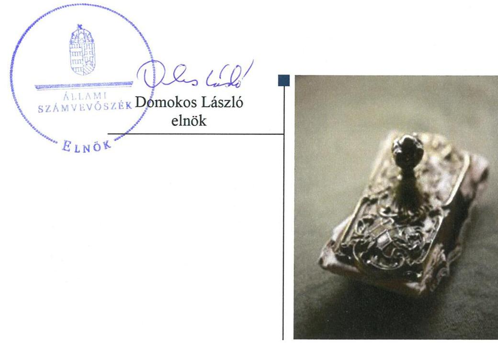
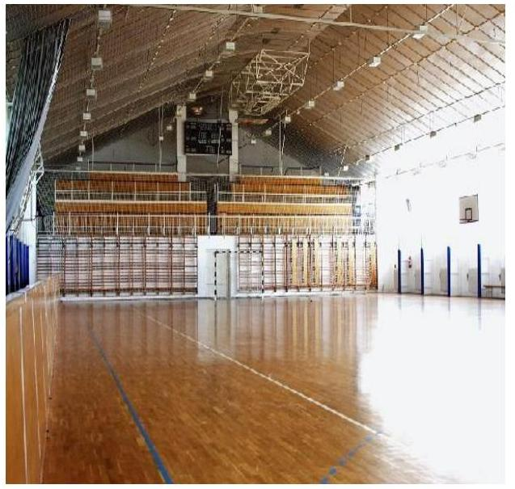

# Jelentés 

## Az önkormányzatok gazdasági társaságai

Az önkormányzatok többségi tulajdonában lévő gazdasági társaságok gazdálkodásának ellenőrzése - Csömöri Sport és Szabadidőszervező Nonprofit Korlátolt Felelősségű Társaság
2018.

---

# Jelentés 

## Az önkormányzatok gazdasági társaságai

Az önkormányzatok többségi tulajdonában lévő gazdasági társaságok gazdálkodásának ellenőrzése - Csömöri Sport és Szabadidőszervező Nonprofit Korlátolt Felelősségű Társaság
2018. 08. hó 14. nap

---

# AZ ELLENŐRZÉST FELÜGYELTE:

DR. HORVÁTH MARGIT felügyeleti vezető

## AZ ELLENŐRZÉST VEZETTE ÉS A VÉGREHAJTÁSÁÉRT FELELŐS:

DORMÁN ISTVÁN ellenőrzésvezető

A PROGRAM ÖSSZEÁLLÍTÁSÁÉRT FELELŐS:

TÓTPÁL SZABOLCS osztályvezető

IKTATÓSZÁM: EL-0662-013/2018.

TÉMASZÁM: 2447

ELLENŐRZÉS-AZONOSÍTÓ SZÁM: V079362

Jelentéseink az Országgyűlés számítógépes hálózatán és az Interneta a www.asz.hu címen is olvashatóak.

---

# TARTALOMJEGYZÉK 

■ ÖSSZEGZÉS ..... 5
■ AZ ELLENŐRZÉS CÉLJA ..... 6
■ AZ ELLENŐRZÉS TERÜLETE ..... 7
■ AZ ELLENŐRZÉS HÁTTERE, INDOKOLTSÁGA ..... 9
■ A JELENTÉS LÉNYEGES KÉRDÉSKÖREI ..... 10
■ AZ ELLENŐRZÉS HATÓKÖRE ÉS MÓDSZEREI ..... 11
■ MEGÁLLAPÍTÁSOK ..... 13
■ JAVASLATOK ..... 16
■ MELLÉKLETEK ..... 19
I. sz. melléklet: Értelmező szótár ..... 19
II. sz. melléklet: Pénzügyi adatok ..... 21
■ FÜGGELÉK: ÉSZREVÉTELEK ..... 23
■ RÖVIDÍTÉSEK JEGYZÉKE ..... 25

---

.

---

# ÖSSZEGZÉS 

Csömör Nagyközség Önkormányzatának a kizárólagos tulajdonában álló Csömöri Sport és Szabadidő-szervező Nonprofit Korlátolt Felelősségű Társaság feletti tulajdonosi joggyakorlása nem volt szabályszerű. A Társaság müködésének szabályozottsága, gazdálkodása és vagyongazdálkodása szabályszerű volt. Jogszabályban előírt közzétételi kötelezettségének nem tett eleget, müködésének átláthatósága nem volt biztositott.

## Az ellenőrzés társadalmi indokoltsága

Magyarországon az önkormányzatok kötelező és önként vállalt feladataik vonatkozásában is egyre szélesebb körben alkalmazzák a költségvetésen kívüli feladatellátást, ezáltal - a nonprofit szervezetek mellett - az önkormányzati tulajdonú gazdasági társaságok is kiemelt fontosságú szerephez jutnak. Ezen belül kiemelt jelentőségű számos önkormányzati gazdasági társaság müködése abból a szempontból is, hogy gazdálkodásának egyes elemei befolyásolják az önkormányzati alszektor hiányát és az államadósságot.

Az Állami Számvevőszék Stratégiájában foglaltakkal összhangban az ÁSZ kiemelt célja, hogy a helyi önkormányzatok gazdálkodásában rejlő pénzügyi kockázatok feltárásával, az államháztartáson kívülre nyújtott költségvetési támogatások és ingyenes vagyonjuttatások, valamint az államháztartáson kívül múködő feladatellátó rendszerek ellenőrzéseivel hozzájáruljon ahhoz, hogy a közpénzeket az államháztartáson kívül múködő szervezetek is átlátható, rendezett módon használják fel. Ezen stratégiai célkitűzéssel összhangban került sor Csömör Nagyközség Önkormányzata kizárólagos tulajdonában álló Csömöri Sport és Szabadidő-szervező Nonprofit Korlátolt Felelősségű Társaság szabályozottságának, gazdálkodása és vagyongazdálkodási tevékenysége szabályszerűségének, valamint az Önkormányzat tulajdonosi joggyakorlása 2013-2016. évi szabályszerűségének ellenőrzésére.

## Főbb megállapítások, következtetések, javaslatok

Csömör Nagyközség Önkormányzata a 2013-2016. években kizárólagos tulajdonában álló Csömöri Sport és Szabad-idő-szervező Nonprofit Korlátolt Felelősségű Társaság feletti tulajdonosi joggyakorlás kereteit nem szabályszerűen alakította ki. A jogszabályi előírások ellenére az Önkormányzat nem készített gazdasági programot, vagyongazdálkodási tervet és hosszú távú fejlesztési tervet. Az Önkormányzat, mint Alapító a Társaságot müködéséről, valamint vagyoni és pénzügyi helyzetéről rendszeresen beszámoltatta, a 2015. évben belső ellenőrzése keretében ellenőrizte. Az Önkormányzat a jogszabályi előírás ellenére a Társaságnál a 2013-2015. években felügyelőbizottság nem működött, a felügyelőbizottság a 2016. évben ügyrendjét nem készítette el. A Társaság legfőbb szerve a javadalmazási szabályzatot 2016. január 19-ig nem alkotta meg.

A Társaság múködésének szabályozottsága, gazdálkodása szabályszerű volt, a számvitelről szóló törvényben előírt szabályzatokat elkészítette, azok megfeleltek a jogszabályi előírásoknak. A bevételek és ráfordítások elszámolása szabályszerű volt, a sportlétesítmények bérbeadási díjainak megállapítása megfelelt az előírásoknak. A beszámolási kötelezettségét 2014-2016. években a jogszabályi előírásoknak megfelelően teljesítette, azonban 2013. évben nem a legfőbb szerve által elfogadott egyszerűsített éves beszámolót tette közzé és helyezte letétbe. Egyszerűsített éves beszámolóit a jogszabályi előírásoknak megfelelő leltárral alátámasztotta. A müködés átláthatósága nem volt biztosított, az információs önrendelkezési jogról és az információszabadságról szóló törvényben előírt szabályzatokkal nem rendelkezett, és a törvényben előírt közzétételi kötelezettségét nem teljesítette.

A vagyongazdálkodás, a saját vagyon nyilvántartása és az értékcsökkenés elszámolása szabályszerű volt.

---

# AZ ELLENŐRZÉS CÉLJA 

AZ ELLENŐRZÉS CÉLJA annak értékelése volt, hogy az önkormányzat vagyongazdálkodási tevékenysége során szabályszerűen gyakorolta-e a tulajdonosi jogait; a gazdasági társaság szabályozottsága, gazdálkodása és vagyongazdálkodási tevékenysége, bevételeinek és ráfordításainak elszámolása megfelel-e a jogszabályi és tulajdonosi előírásoknak; a gazdasági társaság kötelezettségállománya jelent-e kockázatot a múködésre, valamint a gazdálkodás átláthatósága és elszámoltathatósága érdekében biztosítva volt-e a szolgáltatás dijának megalapozottsága szabályszerű önköltségszámítással.

---

# **A Z ELLENŐRZÉS TERÜLETE**

## **Csömör Nagyközség Önkormányzata és a kizárólagos tulajdonában álló Csömöri Sport és Szabadidő-szervező Nonprofit Kft.**

Csömör Nagyközség Pest megyében, a Gödöllői Járásban található, lakónépessége a 2016. december 31-én 9413 fő volt. Csömör Nagyközség Önkormányzata kilenc tagú Képviselő-testületének^{1} munkáját négy állandó bizottság^{2} segítette. A polgármester^{3} és a jegyző^{4} személyében az ellenőrzött időszakban változás nem történt.

A Csömöri Sport és Szabadidő-szervező Nonprofit Korlátolt Felelősségű Társaság az Önkormányzat^{5} 100%-os tulajdonában álló nonprofit gazdasági társaság volt. Az Önkormányzat 2011. május 24-én alapította a Társaságot^{6} 0,5 M Ft^{7} törzstőkével, 2016. évben a Társaság törzstőkéjét 3,0 M Ft-ra emelte. Az Önkormányzat önként vállalt közfeladatként látta el az egészséges életmód és a szabadidősport gyakorlása feltételeinek megteremtését Társaság fenntartásával. A Társaság fő tevékenysége egyéb sporttevékenység volt, melynek keretében a helyi polgárok sportolási lehetőségét, sportversenyek szervezését, a helyi utánpótlás bázis növelését biztosította. A Társaság az ellenőrzött időszakban az Mötv.^{8} 13. § (1) bekezdés 15. pontja és az önkormányzati SZMSZ^{9} alapján közfeladatot látott el és önkormányzati, illetve a Tao. tv.^{10} alapján biztosított támogatásokból működött. A 2013-2015. években nyereséges gazdálkodást folytatott, a 2016. évben veszteséggel zárt, ekkor az adózott eredménye -2,0 M Ft volt. A Társaság főbb gazdálkodási adatait a 2013-2016. években az 1. táblázat szemlélteti, a vagyoni helyzetét bemutató főbb mérleg és eredménykimutatás adatokat a II. számú melléklet részletezi.

1. táblázat

|  Összeg (M Ft) | 2014. | 2015. | 2016.  |
| --- | --- | --- | --- |
|  Saját tőke | 5,7 | 6,3 | 6,7  |
|  Jegyzett tőke | 0,5 | 0,5 | 3,0  |
|  Mérlegfőösszeg | 102,2 | 191,0 | 339,8  |
|  Kötelezettségek | 2,9 | 4,0 | 194,2  |
|  Nettó árbevétel | 12,8 | 10,4 | 8,7  |
|  Mérleg szerinti eredmény | 0,5 | 0,5 | -2,0  |
|  **Fő** | **2014.** | **2015.** | **2016.**  |
|  Foglalkoztatottak átlagos statisztikai állományi létszáma | 8 | 11 | 12  |

*Forrás: A Társaság egyszerűsített éves beszámolói*

A Társaság ügyvezetőjének^{11} személye az ellenőrzött időszakban nem változott. A számviteli feladatokat vállalkozási szerződés keretében külső

---

szolgáltató látta el. A Társaság a Számv. tv. ${ }^{12}$ alapján nem volt könyvvizsgálatra kötelezett, az ellenőrzött időszakban választott könyvvizsgálója volt.

Az Önkormányzat az ellenőrzött időszakban a Társasággal vagyonkezelői jogot nem létesített, a Társaság vagyonkezelésbe vett vagyonnal nem rendelkezett. Önköltségszámítási szabályzat készítésére a Társaság a Számv. tv. alapján nem volt kötelezett.

Az Önkormányzat a Társaság feladat-ellátásához az ellenőrzött időszakot megelőzően határozatlan idejű Használati jogot alapító szerződéssel ${ }^{13}$ ingatlant (sportcsarnok, műfüves pálya, szabadtéri sportcentrum) bocsátott a Társaság rendelkezésére. A szerződést az Önkormányzat 2016. júniusban módosította a Magyar Lab darúgó Szövetséggel kötött együttmúködési megállapodás alapján.

A Társaság 2015. május 27-ig 2\%-os részesedéssel rendelkezett a Csömöri Települési Szolgáltató Nonprofit Korlátolt Felelősségú Társaságban.

A Társaság nem tartozott a kormányzati szektorba sorolt egyéb szervezetek közé.

---

# AZ ELLENŐRZÉS HÁTTERE, INDOKOLTSÁGA 

## AZ ÖNKORMÁNYZATOK TÖBBSÉGI TULAJDONÁBAN ÁLLÓ GAZDASÁGI TÁRSASÁGOK ELLENŐR-

ZÉSE kiemelten fontos a vagyon megőrzése, megóvása érdekében, valamint a kormányzati szektor elszámolásaiban megjelenő önkormányzati tulajdonú gazdálkodó szervezetek esetében, amelyekkel szemben alapvető követelmény, hogy gazdálkodásuk, múködésük szabályszerű, az általuk szolgáltatott adatok minél megbízhatóbbak legyenek. A feladatellátás költségeinek, ráfordításainak alakulása a lakosság széles rétegét érinti.

Az Állami Számvevőszék ellenőrzései feltárhatják, hogy az önkormányzat a feladatellátásához rendelt vagyon múködtetését a tulajdonostól elvárható gondossággal végezte-e, a feladatot ellátó gazdasági társaság a létesítő okiratban, szolgáltatási szerződésben foglaltak betartásával biztosí-totta-e a feladat ellátását. Az ellenőrzés eredményeképp meghatározhatóvá válnak a költségvetési hiányt befolyásoló szervezetek kockázatai, lehetővé válik ezen kockázatok csökkentése. Az ellenőrzés rávilágíthat arra, hogy a gazdasági társaság a vagyon használatával biztosította-e a szolgáltatás folytatásának feltételeit, az önkormányzat tulajdonosi felügyelete hozzájárult-e a szabályszerű gazdálkodáshoz és feladatellátáshoz. A megállapítások alapján megfogalmazott számvevőszéki javaslatok hasznosítása elősegítheti a meglévő hibák megszüntetését. A jó gyakorlatok bemutatásával az ÁSZ ${ }^{14}$ hozzájárulhat a követendő megoldások megismertetéséhez, terjesztéséhez.

---

# A JELENTÉS LÉNYEGES KÉRDÉSKÖREI 

1.     - Az Önkormányzat tulajdonosi joggyakorlása szabályszerű volt-e?
2.     - A Társaság szabályozottsága, gazdálkodási tevékenysége, bevételeinek és ráfordításainak elszámolása, az árképzés szabályszerű volt-e?
3.     - A Társaság vagyongazdálkodási tevékenysége szabályszerű volt-e?

---

# AZ ELLENŐRZÉS HATÓKÖRE ÉS MÓDSZEREI 

## Az ellenőrzés típusa

Megfelelőségi ellenőrzés.

## Az ellenőrzött időszak

2013. január 1-jétől 2016. december 31-ig tartó időszak.

## Az ellenőrzés tárgya

Csömör Nagyközség Önkormányzata kizárólagos tulajdonában álló Csömöri Sport Nonprofit Korlátolt Felelősségű Társaság feletti tulajdonosi joggyakorlása, valamint a Társaság gazdálkodásának szabályozottsága és szabályszerűsége.

Az ellenőrzés kiterjed minden olyan körülményre és adatra, amely az ÁSZ jogszabályban meghatározott feladatainak teljesítéséhez, valamint a program végrehajtása folyamán felmerült újabb összefüggések feltárásához szükséges.

## Az ellenőrzött szervezet

Csömör Nagyközség Önkormányzata és a
Csömöri Sport és Szabadidő-szervező Nonprofit Korlátolt Felelősségű Társaság

## Az ellenőrzés jogalapja

Az ellenőrzés jogszabályi alapját az ÁSZ tv. ${ }^{15}$ 1. § (3) bekezdése és 5. § (3)- (5) bekezdései képezték.

## Az ellenőrzés módszerei

Az ellenőrzést a nemzetközi standardokat irányadónak tekintve az ellenőrzési program ellenőrzési kérdései, az ellenőrzött időszakban hatályos jogszabályok, az ellenőrzés szakmai szabályok és módszertanok figyelembe vételével végeztük.

Az ellenőrzés ideje alatt az ellenőrzött szervezettel történő kapcsolattartást az ÁSZ Szervezeti és Múködési Szabályzatának vonatkozó előírásai alapján biztosítottuk.

---

Az ellenőrzési kérdések megválaszolásához szükséges bizonyítékok megszerzése a következő ellenőrzési eljárások alkalmazásával történt: megfigyelés, kérdésfeltevés (információkérés), összehasonlítás, valamint elemző eljárás. Az ellenőrzési bizonyítékként felhasználható adatforrások közé tartoztak egyrészt az ellenőrzési programban felsorolt adatforrások, másrészt adatforrás lehetett még minden - az ellenőrzés folyamán - feltárt, az ellenőrzés szempontjából információkat tartalmazó dokumentum.

Az ellenőrzést a kérdésekre adott válaszok kiértékelésével, valamint a megjelölt adatforrások, a csatolt tanúsítványok felhasználásával, továbbá az adott időszakban hatályos jogszabályok figyelembe vételével folytattuk le.

A bevételek és ráfordítások elszámolását, és a vagyonnyilvántartás terén a szabályszerű működést véletlen mintavétellel ellenőriztük. A mintavétellel ellenőrzött területek esetében minden egyes tétel vonatkozásában a szabályszerűségre vonatkozó kérdéseket tettünk fel, amelyek a számviteli törvény, illetve a tulajdonosi követelményeknek és az ellenőrzött szervezet belső szabályozásai előírásainak betartására vonatkoztak. A jogszabályoknak és a belső előírásoknak megfelelőnek tekintettük az adott területet, amennyiben a minta ellenőrzésének eredménye alapján 95\%-os bizonyossággal a teljes sokaságban a hibaarány kisebb volt, mint 10\%, nem megfelelőnek értékeltük, ha a hibaarány a 10\%-ot meghaladta. A ráfordítások, ezen belül az anyagjellegú, az egyéb, a pénzügyi műveletek és a rendkívüli ráfordítások elszámolására az értékcsökkenésre és a vagyonnyilvántartásra vonatkozó véletlen mintavételt kockázati alapú kiválasztással egészítettük ki, amelynek során évente a három legnagyobb összegű tételt választottuk ki.

---

# 1. Az Önkormányzat tulajdonosi joggyakorlása szabályszerű volt-e? 

Összegző megállapítás

Az Önkormányzat tulajdonosi joggyakorlása nem volt szabályszerű.

AZ ÖNKORMÁNYZAT nem rendelkezett az Nvtv. ${ }^{16}$ 9. § (1) bekezdés szerinti közép- és hosszú távú vagyongazdálkodási tervvel és az Mötv. 116. § (1) bekezdésben előírt gazdasági programmal.

Az Önkormányzat elkészítette a 2012-2016. évekre vonatkozó középtávú Fejlesztési tervet ${ }^{17}$, amely tartalmazta a sportfejlesztéssel kapcsolatos elképzeléseket.

Az Önkormányzat az Mötv. 116. § (1)-(2) bekezdése előírásai ellenére hosszú távú fejlesztési elképzeléseit fejlesztési tervben nem rögzítette.

Az önkormányzati vagyonnal való gazdálkodás, a Társaság feletti tulajdonosi joggyakorlás szabályait a Vagyongazdálkodási rendeletben ${ }^{18}$, és a Társaság Alapító Okiratában ${ }^{19}$ rögzítette.

A Társaság által alkalmazott szolgáltatási díjakkal összefüggésben az Önkormányzatnak rendeletalkotási kötelezettsége nem volt, az Önkormányzat nem írt elő a Társaság számára az árképzéssel összefüggő szabályokat.

A TULAJDONOSI JOGGYAKORLÓ ${ }^{20}$ az Alapító Okiratban meghatározta a Társaság törvényes képviseletét ellátó ügyvezető feladatait, az összeférhetetlenségi szabályokat. Az Alapító ${ }^{21}$ 2013-2015. években a Taktv. ${ }^{22}$ 4. §-ban és a Ptk. ${ }^{23}$ 3:26. § (1) bekezdésében foglaltak ellenére a Társaságnál $\mathrm{FB}^{24}$ létrehozásáról nem döntött. Az Alapító az Alapító okiratban 2016. január 1-jétől rendelkezett háromtagú FB létrehozásáról, azonban 2016. évben az FB a Ptk. 3:122. § (3) bekezdésében foglaltak ellenére ügyrendjét nem állapította meg. 2016. évben az FB a Ptk. 3:27. § előírásai ellenére az Alapító döntéshozó szerve elé kerülő előterjesztéseket nem vizsgálta meg, és ezekkel kapcsolatos álláspontját a döntéshozó szerv ülésén nem ismertette.

A Társaság vezető tisztségviselőinek, FB tagjainak, az Mt. ${ }^{25}$ hatálya alá tartozó munkavállalóinak javadalmazási, juttatási rendszerről szóló szabályzatot az Alapító a Taktv. 5. § (3) bekezdése előírásai ellenére 2016. január 19-ig nem alkotta meg. A Javadalmazási szabályzatot ${ }^{26}$ az Alapító 2016. január 20-ával adta ki.

A Társaság 2013-2016. évi egyszerűsített éves beszámolóit a Gt. ${ }^{27}$ 35. § (3) bekezdése és a Ptk. 3:120. § (2) bekezdés előírásai ellenére az Alapító nem az FB írásbeli jelentésének birtokában hagyta jóvá.

Az Áht. 70. § (1) bekezdés d) pontjában biztosított ellenőrzési lehetőségével az Önkormányzat 2013-2014. és 2016. években nem élt. 2015. évben

---

a belső ellenőrzése ellenőrizte a Társaság múködését, gazdálkodását és szabályozottságát. A feltárt szabálytalanságok megszüntetésére - többek között a Társaság SZMSZ-ének kiadására, FB létrehozására- a Társaságnak intézkedési terv-készítési kötelezettsége, végrehajtásáról az Önkormányzat és a belső ellenőrzés felé beszámolási kötelezettsége volt, amelynek eleget tett.

# 2. A Társaság szabályozottsága, gazdálkodási tevékenysége, bevételeinek és ráfordításainak elszámolása, az árképzés szabályszerű volt-e? 

Összegző megállapítás

A Társaság szabályozottsága, gazdálkodási tevékenysége, a bevételek és ráfordítások elszámolása, valamint a szolgáltatási díjak megállapítása szabályszerű volt.

SZERVEZETI ÉS MŰKÖDÉSI SZABÁLYZATA a Társaságnak 2015. december 18-án lépett hatályba.

SZÁMVITELI POLITIKÁVAL a Társaság a Számv. tv.-ben előírtak szerint rendelkezett, a Számviteli politika ${ }_{1-4}{ }^{28}$ megfelelt a Számv. tv. előírásainak.

A Számviteli politika keretében elkészítendő szabályzatokkal - Leltározási szabályzattal ${ }_{1-4}{ }^{29}$, Eszközök és források értékelési szabályzatával ${ }_{1-4}{ }^{30}$, Pénzkezelési szabályzattal ${ }_{1-2}{ }^{31}$-, illetve számlarenddel és bizonylati renddel a Számv. tv. előírásainak megfelelően a Társaság rendelkezett. A szabályzatokat a Számv. tv. előírásaival összhangban készítették el.

BESZÁMOLÁSI KÖTELEZETTSÉGÉNEK a Társaság 2013. évben nem a jogszabályi előírásoknak megfelelően tett eleget, a Számv. tv. 153. § (1) és 154. § (1) bekezdésében előírtak ellenére nem a legfőbb szerv, mint jóváhagyásra jogosult testület által elfogadott egyszerűsített éves beszámolót tette közzé és helyezte letétbe, a 2013. évi egyszerűsített éves beszámoló aláírására a letétbe helyezés és a közzététel után került sor. A 2014-2016. években a Társaság a legfőbb szerv által jóváhagyott egyszerűsített éves beszámolóit a Számv. tv.-ben és a Ctv.-ben ${ }^{32}$ előírt határidőig letétbe helyezte és közzétette.

A könyvvizsgáló a 2014-2016. évek egyszerűsített éves beszámolóira korlátozás nélküli hitelesítő záradékot adott.

A KÖZÉRDEKŰ ADATOK megismerésére irányuló igények teljesítésének rendjét a Társaság az Info tv. ${ }^{33}$ 30. § (6) bekezdésében foglaltak ellenére az ellenőrzött időszakban nem szabályozta. A Társaság, mint az Info tv. 35. § (1)-(2) bekezdései szerinti adatfelelős és adatközlő, a kötelezettség teljesítésének részletes szabályait az Info. tv. 35. § (3) bekezdésében előírtakkal ellentétben belső szabályzatban nem állapította meg.

A Társaság az Info tv. 37. § (1) bekezdés előírásai ellenére az Info tv. 1. melléklete szerinti általános közzétételi listában meghatározott adatok közzétételének a honlapján nem tett eleget. A Taktv. 2. § (1) bekezdésében előírt adatok közzétételének eleget tett.

---

A BEVÉTELEK ÉS RÁFORDÍTÁSOK elszámolása szabályszerű volt.

AZ ÁRKÉPZÉSRE vonatkozó szabályokat a Társaság a Szolgáltatási díjszabályzatokban ${ }_{1-3}{ }^{34}$ rögzítette. A bérleti szerződésekben rögzített árak a Szolgáltatási díjszabályzatokban előírtaknak megfelelően kerültek meghatározásra.

# 3. A Társaság vagyongazdálkodási tevékenysége szabályszerű volt-e? 

Összegző megállapítás A Társaság vagyongazdálkodási tevékenysége szabályszerű volt.

A SAJÁT VAGYON nyilvántartása szabályszerű volt. Az egyszerűsített éves beszámolókban és a számviteli nyilvántartásokban szereplő vagyonelemek állományát év végén a Számv. tv.-ben előírtaknak megfelelő leltárral támasztották alá.

Az Önkormányzat a Társaság feladat-ellátásához az ellenőrzött időszakot megelőzően határozatlan idejű Használati jogot alapító szerződéssel ${ }^{35}$ ingatlant (sportcsarnok, múfüves pálya, szabadtéri sportcentrum) bocsátott a Társaság rendelkezésére. Az Társaság a használatba vett sportcentrum vonatkozásában a használati jogot alapító szerződésből eredő kötelezettségeit teljesítette.

AZ ÉRTÉKCSÖKKENÉS ELSZÁMOLÁSA a jogszabályoknak megfelelően történt.

---

# JAVASLATOK 

Az ÁSZ tv. 33. § (1) bekezdésében foglaltak értelmében az ellenőrzött szervezet vezetője köteles a jelentésben foglalt megállapításokhoz kapcsolódó intézkedési tervet összeállítani és azt a jelentés kézhezvételétől számított 30 napon belül az ÁSZ részére megküldeni. Amennyiben az ellenőrzött szervezet vezetője nem küldi meg határidőben az intézkedési tervet, vagy továbbra sem elfogadható intézkedési tervet küld, az Állami Számvevőszék elnöke az ÁSZ tv. 33. § (3) bekezdése a) és b) pontjaiban foglaltakat érvényesítheti.
Javaslataink célja a Csömöri Sport és Szabadidő-szervező Nonprofit Korlátolt Felelősségű Társaság gazdálkodása szabályszerűségének és gyakorlatának javítása annak érdekében, hogy a szabályozási környezet és az alkalmazott gyakorlat megfelelően tudja támogatni az átlátható múködést.

## Csömöri Sport és Szabadidő-szervező Nonprofit Korlátolt Felelősségű Társaság ügyvezetőjének

1. Intézkedjen a közérdekü adatok megismerésére irányuló igények teljesítésének rendjét rögzítő szabályzat készítéséről az Info tv. előírásainak megfelelően.
(2. sz. megállapítás 6. bekezdés 1. mondata alapján)
2. Intézkedjen a közérdekü adatok közzétételére vonatkozó kötelezettség teljesítésének belső szabályzatban történő meghatározásáról Info tv. előírásainak megfelelően.
(2. sz. megállapítás 6. bekezdés 2. mondata alapján)
3. Intézkedjen a közzétételi kötelezettségének teljesítéséről az Info tv. előírásainak megfelelően.
(2. sz. megállapítás 7. bekezdés 1. mondata alapján)

---

# Javaslataink célja az Önkormányzat szabályszerű működésének elősegítése, továbbá az önkormányzati tulajdonosi joggyakorlás kontrolljainak erősítése. 

## Csömör Nagyközség Önkormányzata polgármesterének

1. Intézkedjen az Nvtv. előírásainak megfelelően az Önkormányzat középés hosszú távú vagyongazdálkodási tervének elkészitéséről.
(1. sz. megállapítás 1. bekezdése alapján)
2. Intézkedjen, hogy az Önkormányzat hosszú távú fejlesztési elképzeléseit fejlesztési tervben rögzítse az Mötv. előírásának megfelelően.
(1. sz. megállapítás 3. bekezdése alapján)
3. Kezdeményezze a Felügyelő Bizottság elnökénél a Ptk. előírásai szerinti FB ügyrend elkészitését, azt követően annak alapítói jóváhagyását.
(1. sz. megállapítás 6. bekezdés 3. mondata alapján)
4. Gondoskodjon arról, hogy az Alapitó a Társaság egyszerüsített éves beszámolóját a Ptk. előírásainak megfelelően, a Felügyelő Bizottság írásbeli jelentésének birtokában hagyja jóvá.
(1. sz. megállapítás 8. bekezdése alapján)

---

.

---

# MELLÉKLETEK 

- I. SZ. MELLÉKLET: ÉRTELMEZŐ SZÓTÁR
gazdasági társaság
gazdálkodó szervezet
kormányzati szektorba sorolt egyéb szervezet
közszolgáltatás
nemzeti vagyon
nonprofit gazdasági társaság
vagyonkezelő

Ptk 3.88. § (1) bekezdése szerint „a gazdasági társaságok üzletszerű közös gazdasági tevékenység folytatására, a tagok vagyoni hozzájárulásával létrehozott, jogi személyiséggel rendelkező vállalkozások, amelyekben a tagok a nyereségből közösen részesednek, és a veszteséget közösen viselik".
A Ptk. 685. § c) pontja szerint gazdálkodó szervezet: „az állami vállalat, az egyéb állami gazdálkodó szerv, a szövetkezet, a lakásszövetkezet, az európai szövetkezet, a gazdasági társaság, az európai részvénytársaság, az egyesülés, az európai gazdasági egyesülés, az európai területi együttműködési csoportosulás, az egyes jogi személyek vállalata, a leányvállalat, a vízgazdálkodási társulat, az erdő birtokossági társulat, a végrehajtói iroda, az egyéni cég, továbbá az egyéni vállalkozó." (2014. 03.15-ig hatályos) az Áht. 3. § (2) és (3) bekezdésében foglaltakon kívül az Európai Közösséget létrehozó szerződéshez csatolt, a túlzott hiány esetén követendő eljárásról szóló jegyzőkönyv alkalmazásáról szóló 2009. május 25-i 479/2009/EK rendelet (a továbbiakban: 479/2009/EK rendelet) szerint a kormányzati szektorba sorolt szervezet (Áht. 1. § (12))
Az Ebktv. ${ }^{36}$ 3. § d) pontja a következőképpen határozza meg a közszolgáltatást: „szerződéskötési kötelezettség alapján a lakosság alapvető szükségleteinek ellátására irányuló szolgáltatás, így különösen a villamos energia-, gáz-, hő-, víz-, szennyvíz- és hulladékkezelési, köztisztasági, postai és távközlési szolgáltatás, továbbá a menetrend alapján közlekedő járművekkel végzett közforgalmú személyszállítás".
Nvtv. 1. § (2) bekezdése szerint többek között:
„az állam vagy a helyi önkormányzat kizárólagos tulajdonában álló dolgok, az a) pont hatálya alá nem tartozó, állam vagy a helyi önkormányzat tulajdonában lévő dolog,
az állam vagy a helyi önkormányzat tulajdonában lévő pénzügyi eszközök, továbbá az államot vagy a helyi önkormányzatot megillető társasági részesedések,
az államot vagy a helyi önkormányzatot megillető bármely vagyoni értékkel rendelkező jogosultság, amelyet jogszabály vagyoni értékű jogként nevesít."
Civil tv. 9/F. § (2) bekezdése szerint „az a gazdasági társaság minősül nonprofit gazdasági társaságnak és cégnevében az a gazdasági társaság tüntetheti fel a nonprofit jelleget, amelynek létesítő okirata tartalmazza, hogy a gazdasági társaság tevékenységéből származó nyereség a tagok között nem osztható fel, hanem az a gazdasági társaság vagyonát gyarapítja." (hatályos 2014. március 15 -től)
vagyonkezelő:
a) az állam tulajdonában álló nemzeti vagyon tekintetében:
aa) költségvetési szerv,
ab) helyi önkormányzat, önkormányzati társulás,
ac) önkormányzati intézmény,
ad) köztestület,

---

ae) az állam, az aa)-ac) alpontban meghatározott személyek együtt vagy kü-lön-külön 100\%-os tulajdonában álló gazdálkodó szervezet,
af) az ae) alpont szerinti gazdálkodó szervezet 100\%-os tulajdonában álló gazdálkodó szervezet,
ag) a törvény által kijelölt egyedileg meghatározott jogi személy.
b) a helyi önkormányzat tulajdonában álló nemzeti vagyon tekintetében:
ba) önkormányzati társulás,
bb) költségvetési szerv vagy önkormányzati intézmény,
bc) köztestület,
bd) az állam, a helyi önkormányzat, a ba)-bb) alpontban meghatározott személyek együtt vagy külön-külön 100\%-os tulajdonában álló gazdálkodó szervezet,
be) a bd) alpont szerinti gazdálkodó szervezet 100\%-os tulajdonában álló gazdálkodó szervezet.
c) * az egyházi jogi személy a tevékenysége ellátásához szükséges nemzeti vagyon tekintetében. (Forrás: Nvtv. 3. § (1) bekezdés 19. pontja)

---

# CSÖMÖRI SPORT ÉS SZABADIDŐ-SZERVEZŐ NONPROFIT KORLÁTOLT FELELŐSSÉGŰ TÁRSASÁG EGYSZERŰSÍTETT ÉVES BESZÁMOLÓINAK ADATAI (EZER FORINT) 

| Megnevezés | 2014.12.31. | 2015.12.31 | 2016.12.31. |
| :--: | :--: | :--: | :--: |
| Befektetett eszközök | 78728 | 85497 | 182230 |
| Immateriális javak | 0 | 0 | 0 |
| Tárgyi eszközök | 78428 | 85497 | 182230 |
| Befektetett pénzügyi eszközök | 300 | 0 | 0 |
| Forgóeszközök | 23426 | 105512 | 157563 |
| Készletek | 0 | 0 | 0 |
| Követelések | 1158 | 4995 | 5263 |
| Értékpapírok | 0 | 0 | 0 |
| Pénzeszközök | 22268 | 100517 | 152300 |
| Aktív időbeli elhatárolások | 0 | 4 | 0 |
| Saját tőke | 5739 | 6272 | 6749 |
| Jegyzett tőke | 500 | 500 | 3000 |
| Tóketartalék | 0 | 0 | 0 |
| Eredménytartalék | 4188 | 5239 | 5772 |
| Lekötött tartalék | 600 | 0 | 0 |
| Értékelési tartalék | 0 | 0 | 0 |
| Mérleg szerinti eredmény | 451 | 533 | $-2023$ |
| Céltartalék | 0 | 0 | 0 |
| Kötelezettségek | 2887 | 4034 | 194172 |
| Hosszú lejáratú kötelezettségek | 0 | 0 | 0 |
| Rövid lejáratú kötelezettségek | 2887 | 4034 | 194172 |
| Passzív időbeli elhatárolás | 93528 | 180707 | 138872 |
| MÉRLEG FŐÖSSZEG | 102154 | 191013 | 339793 |
| Értékesítés nettó árbevétele | 12828 | 10361 | 8719 |
| Aktivált saját teljesítmények értéke | 0 | 0 | 0 |
| Egyéb bevételek | 70545 | 100244 | 123287 |
| Anyagjellegú ráfordítások | 50669 | 59303 | 78887 |
| Személyi jellegú ráfordítások | 27766 | 42464 | 43132 |
| Értékcsökkenési leírás | 6369 | 7527 | 11470 |
| Egyéb ráfordítások | 31 | 556 | 273 |
| Üzemi tevékenység eredménye | $-1462$ | 755 | $-1756$ |
| Pénzügyi műveletek eredménye | $-3$ | $-1$ | $-3$ |
| Rendkívüli eredmény | 2084 | - | - |
| Adózott eredmény | 451 | 533 | $-2023$ |
| Átlagos állományi létszám [fő] | 8 | 11 | 12 |

---

.

---

# FÜGGELÉK: ÉSZREVÉTELEK 

A jelentéstervezetet a Számvevőszék 15 napos észrevételezésre megküldte az ellenőrzött szervezetek vezetőinek az ÁSZ tv. 29. §* (1) bekezdése előírásának megfelelően.
Az ellenőrzött szervezetek vezetői nem éltek észrevételezési jogukkal, az ellenőrzés megállapításaira

nem tettek észrevételt.

[^0]
[^0]:    * 29. § (1) Az Állami Számvevőszék az ellenőrzési megállapításait megküldi az ellenőrzött szervezet vezetőjének vagy az általa megbízott személynek, és annak, akinek személyes felelősségét állapította meg.
    (2) Az ellenőrzött szervezet vezetője és a felelősként megjelölt személy az ellenőrzés megállapításaira tizenöt napon belül írásban észrevételt tehet.
    (3) Az Állami Számvevőszék az észrevételre a beérkezésétől számított harminc napon belül írásban válaszol. A figyelembe nem vett észrevételeket köteles a jelentésben feltüntetni, és megindokolni, hogy azokat miért nem fogadta el.

---

.

---

# RÖVIDÍTÉSEK JEGYZÉKE 

${ }^{1}$ Képviselő-testület
${ }^{2}$ négy állandó bizottság
${ }^{3}$ polgármester
${ }^{4}$ jegyző
${ }^{5}$ Önkormányzat
${ }^{6}$ Társaság
${ }^{7} \mathrm{M} \mathrm{Ft}$
${ }^{8}$ Mötv.
${ }^{9}$ SZMSZ
${ }^{10}$ Tao. tv.
${ }^{11}$ ügyvezető
${ }^{12}$ Számv. tv.
${ }^{13}$ Használati jogot alapító szerződés
${ }^{14}$ ÁSZ
${ }^{15}$ ÁSZ tv.
${ }^{16}$ Nvtv.
${ }^{17}$ Fejlesztési terv
${ }^{18}$ Vagyongazdálkodási rendelet
${ }^{19}$ Alapító Okirat

Csömör Nagyközség Önkormányzat Képviselő-testülete
Pénzügyi, Ellenőrző és Vállalkozói Bizottság, Ügyrendi és Közbiztonsági Bizottság, Oktatási, Sport és Kulturális Bizottság és Népjóléti Bizottság. (2014. október 27-ig)
Pénzügyi, Ellenőrző és Vállalkozói Bizottság, Ügyrendi, Sport és Közbiztonsági Bizottság, Népjóléti és Kulturális Bizottság, Településfejlesztési és Környezetvédelmi Bizottság. (2014. október 27-tól)

Csömör Nagyközség polgármestere
Csömör Nagyközség Önkormányzata jegyzője
Csömör Nagyközség Önkormányzata
Csömöri Sport és Szabadidő-szervező Nonprofit Korlátolt Felelősségű Társaság millió forint
2011. évi CLXXXIX. törvény Magyarország helyi önkormányzatairól (hatályos: 2012. január 1-jétől)

Csömör Nagyközség Önkormányzat Képviselő-testületének 10/2011 (IV.29.) önkormányzati rendelete a Szervezeti és Müködési Szabályzatáról (hatályos: 2014. október 26-ig); Csömör Nagyközség Önkormányzat Képviselő-testületének 18/2014. (X.28.) önkormányzati rendelete a Szervezeti és Müködési Szabályzatáról
1996. évi LXXXI. törvény a társasági adóról és az osztalékadóról (hatályos: 1997. január 1-jétől)

Csömöri Sport és Szabadidő-szervező Nonprofit Korlátolt Felelősségű Társaság irányításáért felelős vezető tisztségviselője
2000. évi C. törvény a számvitelről (hatályos: 2001. január 1-jétől)

Használati jogot alapító szerződés létrejött Csömör Nagyközség Önkormányzat és a Csömöri Sport és Szabadidő-szervező Nonprofit Korlátolt Felelősségű Társaság között 2011. július 1-én, módosítva 2016. június 10-én

Állami Számvevőszék
2011. évi LXVI. törvény az Állami Számvevőszékről, (hatályos: 2011. július 1-jétől) 2011. évi CXCVI. törvény a nemzeti vagyonról

Közösségi tér- és közterület-fejlesztési program 2012-2016. (Fejlesztési tervek összefoglalása)

Csömör Nagyközség Önkormányzat Képviselő-testületének 29/2013. (X.24.) rendelete az önkormányzat nemzeti vagyonáról; Csömör Nagyközség Önkormányzat Képviselő-testületének 4/2014. (I.16.) önkormányzati rendelete az önkormányzat nemzeti vagyonáról szóló 29/2013. (X.24.) önkormányzati rendelet módosításáról (hatályos 2014. február 20-tól, hatályon kívül helyezve 2014. február 21-én).

Csömöri Sport és Szabadidő-szervező Nonprofit Korlátolt Felelősségű Társaság Alapító Okirata (2011. május 24. a 2013. január 22-én elfogadott módosításokkal egységes szerkezetben, hatályos: 2015. december 16-ig); Csömöri Sport és

---

${ }^{20}$ Tulajdonosi joggyakorló
${ }^{21}$ Alapító
${ }^{22}$ Taktv.
${ }^{23}$ Ptk.
${ }^{24} \mathrm{FB}$
${ }^{25} \mathrm{Mt}$.
${ }^{26}$ Javadalmazási szabályzat
${ }^{27} \mathrm{Gt}$.
${ }^{28}$ Számviteli Politika:4
${ }^{29}$ Leltározási szabályzat:4
${ }^{30}$ Eszköz-forrás értékelési szabályzata:4
${ }^{31}$ Pénzkezelési szabályzat:2
${ }^{32}$ Ctv.
${ }^{33}$ Info tv.
${ }^{34}$ Szolgáltatási díjszabályzatok:3

Szabadidő-szervező Nonprofit Korlátolt Felelősségű Társaság Alapító Okirata (hatályos: 2015. december 17-től).
Csömör Nagyközség Önkormányzata
Csömör Nagyközség Önkormányzata
2009. évi CXXII. törvény a köztulajdonban álló gazdasági társaságok takarékosabb müködéséről (hatályos: 2009. december 4-től)
2013. évi V. törvény a Polgári Törvénykönyvről (hatályos: 2014. március 15-től)

Csömöri Sport és Szabadidő-szervező Nonprofit Korlátolt Felelősségű Társaság felügyelő bizottsága
2012. évi I. törvény a munka törvénykönyvéről (hatályos: 2012. július 1-jétől)

Csömöri Sport és Szabadidő-szervező Nonprofit Korlátolt Felelősségű Társaság Javadalmazási szabályzata (hatályos: 2016.01.20-tól)
2006. évi IV. törvény - a gazdasági társaságokról, (hatálytalan: 2014. március. 15-től)

Csömöri Sport és Szabadidő-szervező Nonprofit Korlátolt Felelősségű Társaság Számviteli Politika: (hatályos: 2013. január 1-jétől); Csömöri Sport és Szabadidőszervező Nonprofit Korlátolt Felelősségű Társaság Számviteli Politika: (hatályos 2014. január 1-jétől); Csömöri Sport és Szabadidő-szervező Nonprofit Korlátolt Felelősségű Társaság Számviteli Politika: (hatályos: 2015. január 1-jétől); Csömöri Sport és Szabadidő-szervező Nonprofit Korlátolt Felelősségű Társaság Számviteli Politika: (hatályos: 2016. január 1-jétől).

Csömöri Sport és Szabadidő-szervező Nonprofit Korlátolt Felelősségű Társaság Leltározási szabályzata: (hatályos: 2013. január 1-jétől); Csömöri Sport és Szabadidő-szervező Nonprofit Korlátolt Felelősségű Társaság Leltározási szabályzata: (hatályos: 2014. január 1-jétől); Csömöri Sport és Szabadidőszervező Nonprofit Korlátolt Felelősségű Társaság Leltározási szabályzata: (hatályos: 2015. január 1-jétől); Csömöri Sport és Szabadidő-szervező Nonprofit Korlátolt Felelősségű Társaság Leltározási szabályzata: (hatályos:2016. január 1-jétől).

Csömöri Sport és Szabadidő-szervező Nonprofit Korlátolt Felelősségű Társaság Eszköz-forrás értékelési szabályzata: (hatályos: 2013. január 1-jétől); Csömöri Sport és Szabadidő-szervező Nonprofit Korlátolt Felelősségű Társaság Eszközforrás értékelési szabályzata: (hatályos: 2014. január 1-jétől); Csömöri Sport és Szabadidő-szervező Nonprofit Korlátolt Felelősségű Társaság Eszköz-forrás értékelési szabályzata: (hatályos: 2015. január 1-jétől);Csömöri Sport és Szabadidő-szervező Nonprofit Korlátolt Felelősségű Társaság Észközforrás értékelési szabályzata: (hatályos: 2016. január 1-jétől).

Csömöri Sport és Szabadidő-szervező Nonprofit Korlátolt Felelősségű Társaság Pénzkezelési szabályzat: (hatályos: 2013. január 1-jétől), Pénzkezelési szabályzat (hatályos: 2014. január 1-jétől); Pénzkezelési szabályzat: (hatályos: 2015. január 1-jétől); Pénzkezelési szabályzat (hatályos: 2016. január 1-jétől)
2006. évi V. törvény a cégnyilvánosságról, a bírósági cégeljárásról és a végelszámolásról (hatályos: 2006. január 4-étől)
2011. évi CXII. törvény az információs önrendelkezési jogról és az információszabadságról (hatályos: 2011. július 27-től)
Csömöri Sport és Szabadidő-szervező Nonprofit Kft. Szolgáltatási díjszabályzat: (hatályos: 2011. július 4-től); Szolgáltatási díjszabályzat: (hatályos: 2013. január 2-től); Szolgáltatási díjszabályzat: (hatályos: 2015. január 4-től).

---

${ }^{35}$ Használati jogot alapító szerződés
${ }^{36}$ Ebktv.

Használati jogot alapító szerződés létrejött Csömör Nagyközség Önkormányzat és a Csömöri Sport és Szabadidő-szervező Nonprofit Korlátolt Felelősségű Társaság között 2011. július 1-én, módosítva 2016. június 10-én
2003. évi CXXV. törvény az egyenlő bánásmódról és az esélyegyenlőség előmozdításáról (hatályos: 2004. január 27-től)

---

# ÁLLAMI SZÁMVEVŐSZÉK 

1052 Budapest, Apáczai Csere János utca 10.
Levélcím: 1364 Budapest 4. Pf. 54
Telefon: +36 14849100 Telefax: +36 14849200
www.asz.hu