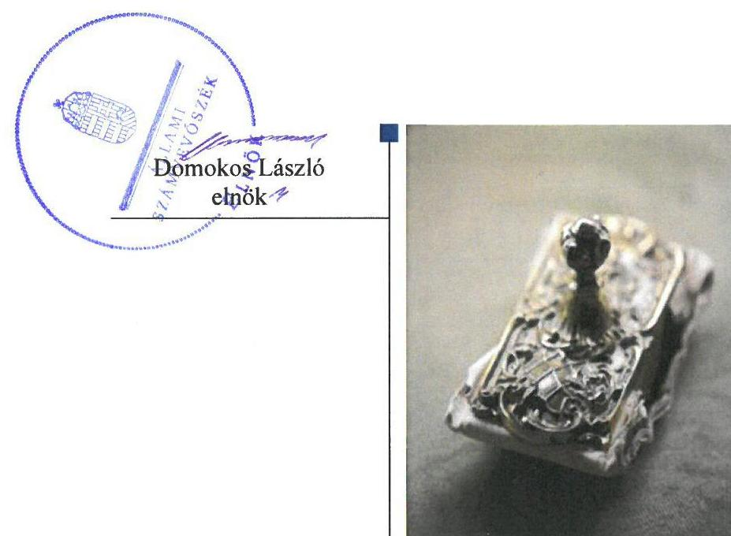
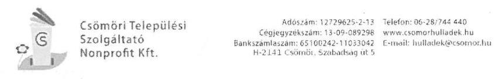
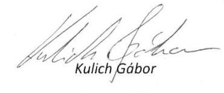
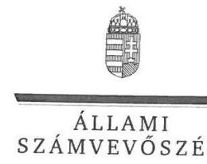
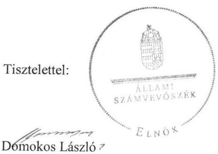

# Jelentés 

## Az önkormányzatok gazdasági társaságai

Az önkormányzatok többségi tulajdonában lévő gazdasági társaságok gazdálkodásának ellenőrzése - Csömöri Települési Szolgáltató Nonprofit Kft.

2018

---

# Jelentés 

## Az önkormányzatok gazdasági társaságai

Az önkormányzatok többségi tulajdonában lévő gazdasági társaságok gazdálkodásának ellenőrzése - Csömöri Települési Szolgáltató Nonprofit Kft.
2018. O\&. hó O\&. nap

---

# AZ ELLENŐRZÉST FELÜGYELTE:

DR. HORVÁTH MARGIT felügyeleti vezető

## AZ ELLENŐRZÉST VEZETTE ÉS A VÉGREHAJTÁSÁÉRT FELELŐS:

DORMÁN ISTVÁN ellenőrzésvezető

A PROGRAM ÖSSZEÁLLÍTÁSÁÉRT FELELŐS:

TÓTPÁL SZABOLCS osztályvezető

IKTATÓSZÁM: EL-0661-021/2018.

TÉMASZÁM: 2447

ELLENŐRZÉS-AZONOSÍTÓ SZÁM: V079366

Jelentéseink az Országgyűlés számítógépes hálózatán és az Interneta a www.asz.hu címen is olvashatóak.

---

# TARTALOMJEGYZÉK 

■ ÖSSZEGZÉS ..... 5
■ AZ ELLENŐRZÉS CÉLJA ..... 7
■ AZ ELLENŐRZÉS TERÜLETE ..... 8
■ AZ ELLENŐRZÉS HÁTTERE, INDOKOLTSÁGA ..... 9
■ A JELENTÉS LÉNYEGES KÉRDÉSKÖREI ..... 10
■ AZ ELLENŐRZÉS HATÓKÖRE ÉS MÓDSZEREI ..... 11
■ MEGÁLLAPÍTÁSOK ..... 13
■ JAVASLATOK ..... 17
■ MELLÉKLETEK ..... 19
I. sz. melléklet: Értelmező szótár ..... 19
■ FÜGGELÉK: ÉSZREVÉTELEK ..... 23
■ RÖVIDÍTÉSEK JEGYZÉKE ..... 31

---

.

---

# ÖSSZEGZÉS 

Csömör Nagyközség Önkormányzata a 2015. május 27-ig többségi, ezt követően kizárólagos tulajdonában álló Csömöri Települési Szolgáltató Nonprofit Korlátolt Felelősségű Társaság tekintetében a tulajdonosi joggyakorlás kereteit nem szabályszerűen alakította ki, tulajdonosi jogait nem szabályszerűen gyakorolta. A Társaság müködésének szabályozottsága nem felelt meg a jogszabályi előírásoknak. Gazdálkodása, vagyongazdálkodása nem volt szabályszerű. A Társaság müködésének átláthatósága nem volt biztosított, a jogszabályokban előírt közzétételi kötelezettségét nem teljesítette.

## Az ellenőrzés társadalmi indokoltsága

Magyarországon az önkormányzatok kötelező és önként vállalt feladataik vonatkozásában is egyre szélesebb körben alkalmazzák a költségvetésen kívüli feladatellátást, ezáltal - a nonprofit szervezetek mellett - az önkormányzati tulajdonú gazdasági társaságok is kiemelt fontosságú szerephez jutnak. Ezen belül kiemelt jelentőségű számos önkormányzati gazdasági társaság működése abból a szempontból is, hogy gazdálkodásának egyes elemei befolyásolják az önkormányzati alszektor hiányát és az államadósságot.

Az Állami Számvevőszék Stratégiájában foglaltakkal összhangban az ÁSZ kiemelt célja, hogy a helyi önkormányzatok gazdálkodásában rejlő pénzügyi kockázatok feltárásával, az államháztartáson kívülre nyújtott költségvetési támogatások és ingyenes vagyonjuttatások, valamint az államháztartáson kívül működő feladatellátó rendszerek ellenőrzéseivel hozzájáruljon ahhoz, hogy a közpénzeket az államháztartáson kívül működő szervezetek is átlátható, rendezett módon használják fel. Ezen stratégiai célkitűzéssel összhangban került sor Csömör Nagyközség Önkormányzata többségi, majd kizárólagos tulajdonában álló Csömöri Települési Szolgáltató Nonprofit Korlátolt Felelősségű Társaság szabályozottságának, gazdálkodása és vagyongazdálkodási tevékenysége szabályszerűségének, valamint az Önkormányzat tulajdonosi joggyakorlása 2013-2016. évi szabályszerűségének ellenőrzésére.

## Főbb megállapítások, következtetések, javaslatok

Csömör Nagyközség Önkormányzata a 2013-2016. években a 2015. május 27-ig többségi, ezt követően kizárólagos tulajdonában álló Csömöri Települési Szolgáltató Nonprofit Korlátolt Felelősségű Társaság tekintetében a tulajdonosi joggyakorlás kereteit nem szabályszerűen alakította ki, tulajdonosi jogait nem szabályszerűen gyakorolta. Az Önkormányzat a jogszabályi előírások ellenére nem készített vagyongazdálkodási tervet és hosszú távú fejlesztési tervet. A Társaság legfőbb szerve a javadalmazási szabályzatot 2013. október 31-ig nem alkotta meg, a Társaság 2013. november 1-jétől rendelkezett javadalmazási szabályzattal. Az ellenőrzött időszakban a felügyelőbizottság nem rendelkezett ügyrenddel. A Társaság 2015-2016. évi egyszerűsített éves beszámolóit a Társaság legfőbb szerve a törvényi előírások ellenére nem a Felügyelő Bizottság írásbeli jelentésének birtokában hagyta jóvá. Az Önkormányzat az államháztartásról szóló törvényben előírt lehetőséggel nem élt, belső ellenőrzése a Társaságot nem ellenőrizte.

A Társaság működésének szabályozottsága nem felelt meg a jogszabályi előírásoknak. A törvényben előírt számviteli szabályzatok közül a számviteli politikán és a számlarendben a jogszabályi változásokat az előírt határidőn belül nem vezette át. Pénzkezelési szabályzata nem felelt meg a jogszabályi előírásoknak. 2014. évtől a Társaság a számviteli szabályzataiban nem vezette át a hulladékról szóló törvény előírásait. Gazdálkodása és vagyongazdálkodási tevékenysége nem volt szabályszerű. A beszámolási kötelezettségét 2013. évben nem a jogszabályi előírásoknak megfelelően teljesítette, az ellenőrzött időszakban egyszerűsített éves beszámolóit a számvitelről szóló törvényben előírtaknak megfelelő leltárakkal nem támasztotta alá. A számviteli nyilvántartásokat a Társaság nem a jogszabályi előírásoknak megfelelően vezette, 2014. évtől nem vezetett a hulladékról szóló törvény előírásai szerinti elkülönült nyilvántartást. A bevételek, a ráfordítások és az értékcsökkenés elszámolása nem volt szabályszerű. A saját vagyonhoz

---

kapcsolódó nyilvántartásokat a Társaság nem megfelelően vezette. Közzétételi kötelezettségét nem teljesítette, ezáltal az elszámoltatható és átlátható gazdálkodás feltételeit nem biztosította.

---

# AZ ELLENŐRZÉS CÉLJA 

AZ ELLENŐRZÉS CÉLJA annak értékelése volt, hogy az önkormányzat vagyongazdálkodási tevékenysége során szabályszerűen gyakorolta-e tulajdonosi jogait; a gazdasági társaság szabályozottsága, gazdálkodása és vagyongazdálkodási tevékenysége, bevételeinek és ráfordításainak elszámolása megfelelt-e a jogszabályi és tulajdonosi előírásoknak; a gazdasági társaság kötelezettségállománya jelent-e kockázatot a múködésre, valamint a gazdálkodás átláthatósága és elszámoltathatósága érdekében biztosítva volt-e a szolgáltatás dijának megalapozottsága szabályszerű önköltségszámítással.

---

# **A Z ELLENŐRZÉS TERÜLETE**

## **Csömör Nagyközség Önkormányzata és a Csömöri Települési Szolgáltató Nonprofit Korlátolt Felelősségű Társaság**

Csömör Nagyközség Pest megyében, a Gödöllői Járásban található, lakónépessége 2016. december 31-én 9413 fő volt. Csömör Nagyközség Önkormányzata kilenc tagú Képviselő-testületének1 munkáját négy állandó bizottság2 segítette. A polgármester3 és a jegyző4 személyében az ellenőrzött időszakban változás nem történt.

A Csömöri Települési Szolgáltató Nonprofit Korlátolt Felelősségű Társaság a 2001. október 10-én alapított Csömöri Sport Nonprofit Korlátolt Felelősségű Társaság névváltozásával 2013. október 31-én jött létre. 2015. május 27-ig a Társaság5 többségi tulajdonosa (98%-os tulajdoni hányaddal), 2015. május 28-tól kizárólagos tulajdonosa az Önkormányzat6 volt. A Társaság fő tevékenysége 2013. október 31-től 2016. december 31-ig nem veszélyes hulladék gyűjtése, szemétszállítás volt, amely a Ht.7 alapján közszolgáltatásnak8 minősült. 2015. évtől az Önkormányzat megbízta a Társaságot települési szolgáltatási feladatok ellátásával.

A Társaság jegyzett tőkéje az ellenőrzött időszakban nem változott, 15,4 M Ft volt.

A Társaság 2013. évben nem végzett bevételszerző tevékenységet. 2014. évben a nettó árbevétele 68,7 M Ft-ról 2015. év végére 7,8%-kal növekedett, 2016. év végére 13,1%-kal csökkent a 2014. év végi adatokhoz képest, mivel a Ht. 2016. április 1-jei módosításával a hulladékgazdálkodási közszolgáltatás díjak szedésére a Társaság már nem volt jogosult. 2014-2016. években nettó árbevétele megoszlásában a legnagyobb arányt a hulladékszállítási főtevékenysége (97,7-92,4%) képezte, emellett hulladékzsák értékesítési (2,3-6,5%), települési szolgáltatási (1,8-0,1%), bérbeadási tevékenységet (0,7-1,0%) látott el Csömör nagyközség illetékességi területén belül.

A Társaságnak az ellenőrzött időszakban vagyonkezelésbe vett vagyona nem volt, tevékenységét a saját vagyonával és bérelt eszközökkel látta el.

Az ügyvezető9 személye az ellenőrzött időszakban két alkalommal változott. A Társaság a Számv. tv.10 alapján nem volt könyvvizsgálatra kötelezett, azonban a Ht. előírásai értelmében 2014. évtől a hulladékszolgáltatási tevékenység végzése miatt könyvvizsgálatra kötelezetté vált. A Társaság 2013-2016. években nem rendelkezett tulajdonosi részesedéssel más társaságban. A Társaság nem minősült kormányzati szektorba sorolt egyéb szervezetnek.

---

# AZ ELLENŐRZÉS HÁTTERE, INDOKOLTSÁGA 

## AZ ÖNKORMÁNYZATOK TÖBBSÉGI TULAJDONÁBAN ÁLLÓ GAZDASÁGI TÁRSASÁGOK ELLENŐR-

ZÉSE kiemelten fontos a vagyon megőrzése, megóvása érdekében, valamint a kormányzati szektor elszámolásaiban megjelenő önkormányzati tulajdonú gazdálkodó szervezetek esetében, amelyekkel szemben alapvető követelmény, hogy gazdálkodásuk, múködésük szabályszerű, az általuk szolgáltatott adatok minél megbízhatóbbak legyenek. A feladatellátás költségeinek, ráfordításainak alakulása a lakosság széles rétegét érinti.

Az Állami Számvevőszék ellenőrzései feltárhatják, hogy az önkormányzat a feladatellátásához rendelt vagyon múködtetését a tulajdonostól elvárható gondossággal végezte-e, a feladatot ellátó gazdasági társaság a létesítő okiratban, szolgáltatási szerződésben foglaltak betartásával biztosí-totta-e a feladat ellátását. Az ellenőrzés eredményeképp meghatározhatóvá válnak a költségvetési hiányt befolyásoló szervezetek kockázatai, lehetővé válik ezen kockázatok csökkentése. Az ellenőrzés rávilágíthat arra, hogy a gazdasági társaság a vagyon használatával biztosította-e a szolgáltatás folytatásának feltételeit, az önkormányzat tulajdonosi felügyelete hozzájárult-e a szabályszerű gazdálkodáshoz és feladatellátáshoz. A megállapítások alapján megfogalmazott számvevőszéki javaslatok hasznosítása elősegítheti a meglévő hibák megszüntetését. A jó gyakorlatok bemutatásával az ÁSZ ${ }^{11}$ hozzájárulhat a követendő megoldások megismertetéséhez, terjesztéséhez.

---

# A JELENTÉS LÉNYEGES KÉRDÉSKÖREI 

1- Az Önkormányzat tulajdonosi joggyakorlása szabályszerű volt-e?
2. A Társaság szabályozottsága, gazdálkodási tevékenysége, bevételeinek és ráfordításainak elszámolása, az önköltségszámitás és árképzés szabályszerű volt-e?
3. A Társaság vagyongazdálkodási tevékenysége szabályszerű volt-e?

---

# AZ ELLENŐRZÉS HATÓKÖRE ÉS MÓDSZEREI 

## Az ellenőrzés típusa

Megfelelőségi ellenőrzés.

## Az ellenőrzött időszak

2013. január 1-től 2016. december 31-ig tartó időszak.

## Az ellenőrzés tárgya

Csömör Nagyközség Önkormányzata és a 2015. május 27-ig többségi, 2015. május 28-tól kizárólagos tulajdonában álló Csömöri Települési Szolgáltató Nonprofit Korlátolt Felelősségű Társaság feletti tulajdonosi joggyakorlása, valamint a Társaság gazdálkodásának szabályozottsága és szabályszerűsége.

Az ellenőrzés kiterjedt minden olyan körülményre és adatra, amely az ÁSZ jogszabályban meghatározott feladatainak teljesítéséhez, valamint a program végrehajtása folyamán felmerült újabb összefüggések feltárásához szükséges volt.

## Az ellenőrzött szervezet

Csömör Nagyközség Önkormányzata és a
Csömöri Települési Szolgáltató Nonprofit Korlátolt Felelősségű Társaság

## Az ellenőrzés jogalapja

Az ellenőrzés jogszabályi alapját az ÁSZ tv. ${ }^{12} 1 . \S$ (3) bekezdése és 5. § (3)-(4)-(5) bekezdései képezték.

## Az ellenőrzés módszerei

Az ellenőrzést a nemzetközi standardokat irányadónak tekintve az ellenőrzési program ellenőrzési kérdései, az ellenőrzött időszakban hatályos jogszabályok, az ellenőrzés szakmai szabályok és módszertanok figyelembe vételével végeztük.

Az ellenőrzés ideje alatt az ellenőrzött szervezettel történő kapcsolattartást az ÁSZ Szervezeti és Működési Szabályzatának vonatkozó előírásai alapján biztosítottuk.

---

Az ellenőrzési kérdések megválaszolásához szükséges bizonyítékok megszerzése a következő ellenőrzési eljárások alkalmazásával történt: megfigyelés, kérdésfeltevés (információkérés), összehasonlítás, valamint elemző eljárás. Az ellenőrzési bizonyítékként felhasználható adatforrások közé tartoztak egyrészt az ellenőrzési programban felsorolt adatforrások, másrészt adatforrás lehetett még minden - az ellenőrzés folyamán - feltárt, az ellenőrzés szempontjából információkat tartalmazó dokumentum.

Az ellenőrzést a kérdésekre adott válaszok kiértékelésével, valamint a megjelölt adatforrások, a csatolt tanúsítványok felhasználásával, továbbá az adott időszakban hatályos jogszabályok figyelembe vételével folytattuk le.

A bevételek és ráfordítások elszámolását, és a vagyonnyilvántartás terén a szabályszerű működést véletlen mintavétellel ellenőriztük. A mintavétellel ellenőrzött területek esetében minden egyes tétel vonatkozásában szabályszerűségre vonatkozó kérdéseket tettünk fel, amelyek a számviteli törvény, illetve a tulajdonosi követelményeknek és az ellenőrzött szervezet belső szabályozásai előírásainak betartására vonatkoztak. A jogszabályoknak és a belső előírásoknak megfelelőnek tekintettük az adott területet, amennyiben a minta ellenőrzésének eredménye alapján 95\%-os bizonyossággal a teljes sokaságban a hibaarány kisebb volt, mint 10\%, nem megfelelőnek értékeltük, ha a hibaarány a 10\%-ot meghaladta. A ráfordítások, ezen belül az anyagjellegű, az egyéb, a pénzügyi műveletek és a rendkívüli ráfordítások elszámolására az értékcsökkenésre és a vagyonnyilvántartásra vonatkozó véletlen mintavételt kockázati alapú kiválasztással egészítettük ki, amelynek során évente a három legnagyobb összegű tételt választottuk ki.

---

# 1. Az Önkormányzat tulajdonosi joggyakorlása szabályszerű volt-e? 

Összegző megállapítás

Az Önkormányzat a tulajdonosi joggyakorlás kereteit nem szabályszerűen alakította ki, a tulajdonosi jogokat nem szabályszerűen gyakorolta.

AZ ÖNKORMÁNYZAT nem rendelkezett az Nvtv. ${ }^{13} 9 . \S$ (1) bekezdés szerinti közép- és hosszú távú vagyongazdálkodási tervvel.

Az Önkormányzat elkészítette a 2012-2016. évekre vonatkozó Fejlesztési tervét ${ }^{14}$, mely Társaság által ellátott feladatokra vonatkozó célkitűzéseket is tartalmazta.

Az Önkormányzat az Mötv. 116. § (1)-(2) bekezdése előírásai ellenére hosszú távú fejlesztési elképzeléseit fejlesztési tervben nem rögzítette.

Az Önkormányzat müködésének szabályait az önkormányzati SZMSZ ${ }^{15}$ ben határozta meg. A vagyonnal való gazdálkodás, a Társaság feletti tulajdonosi joggyakorlás szabályait a Vagyonrendeletben ${ }^{16}$, Társasági szerződésben ${ }^{17}$ és az Alapító okiratban ${ }^{18}$ rögzítette. A Társaság feladatellátásához kapcsolódóan a hulladékgazdálkodási Közszolgáltatási szerződésben ${ }^{19}$ és a Közszolgáltatási keretszerződésekben ${ }^{20}$ határozott meg követelményeket.

Az Önkormányzat a Ht. előírásai szerinti rendeletalkotási kötelezettségének a Hulladékgazdálkodási rendelet ${ }^{21}$ elfogadásával eleget tett.

A Társaság legfőbb szerve a Taktv. ${ }^{22}$ 5. § (3) bekezdésében előírtak ellenére 2013. január 1. és 2013. október 31. között a Társaság vezető tisztségviselőinek, FB tagjainak és az Mt. ${ }^{23}$ hatálya alá tartozó munkavállalóinak javadalmazási, juttatási rendszerről szóló szabályzatot nem alkotta meg. A Javadalmazási szabályzat ${ }^{24} 2013$. november 1-jével került kiadásra.

A TULAJ DONOSI JOGGYAKORLÓ ${ }^{25}$ a Társasági szerződésben a Gt. ${ }^{26}$-ben, az Alapító a Társaság Alapító okiratában a Ptk. ${ }^{27}$-ban foglaltakkal összhangban előírta az $\mathrm{FB}^{28}$ megválasztását, feladatait, eljárásának szabályait, beszámolási kötelezettségét. Az ellenőrzött időszakban 2013. október 31-ével és 2015. december 17-ével változás történt az FB tagjaiban. Az FB tagokat a Gt. és a Ptk. előírásainak megfelelően a Társaság legfőbb szerve ${ }^{29}$ választotta.

Az FB a Gt. 34. § (4) bekezdésében és a Ptk. 3:122. § (3) bekezdésében előírtak ellenére nem rendelkezett ügyrenddel. A Társaság 2013-2014. évi egyszerűsített éves beszámolóit a Társaság legfőbb szerve a Gt. és a Ptk. előírásainak megfelelően az FB írásbeli jelentésének birtokában hagyta jóvá. A Társaság 2015-2016. évi egyszerűsített éves beszámolóit a Társaság legfőbb szerve a Ptk. 3:120. § (2) bekezdés előírásai ellenére nem az FB írásbeli jelentésének birtokában hagyta jóvá.

---

Az Önkormányzat belső ellenőrzése az Áht. ${ }^{30}$ szerinti ellenőrzés lehetőségével nem élt, a Társaságnál ellenőrzést nem végzett. A Társaságnál 2015. évben külső ellenőrző szervezet ${ }^{31}$ végzett ellenőrzést, szabálytalanságot nem állapított meg, a Társaságnak intézkedési-terv készítési kötelezettsége nem volt.

# 2. A Társaság szabályozottsága, gazdálkodási tevékenysége, bevételeinek és ráfordításainak elszámolása, az önköltségszámítás és árképzés szabályszerű volt-e? 

Összegző megállapítás

A Társaság szabályozottsága nem felelt meg a jogszabályi előírásoknak. Gazdálkodása, bevételeinek, és ráfordításainak elszámolása nem volt szabályszerű.

A TÁRSASÁG A SZÁMV. TV. SZERINTI SZABÁLYZATAIT az ellenőrzött időszakban elkészítette. A Társaság a Számv. tv. 14. § (11) bekezdésében előírtak ellenére a Számv. tv. 2013. január 1-jével hatályba lépett változásait - jelentős összegű hiba fogalmának változása, megbízható és valós képet lényegesen befolyásoló hiba fogalmának törlése - a Számviteli politika ${ }^{32}$-ben 2015. június 1-jéig nem vezette át. A Számlarend ${ }_{2}^{33}$ nem felelt meg a Számv. tv. előírásainak, a Számv. tv. 161. § (2) bekezdés a) pontjában foglalt előírások ellenére nem tartalmazta minden alkalmazásra kijelölt számla számjelét és megnevezését.

A Pénzkezelési szabályzat ${ }^{34}$ ben a Számv. tv. 14. § (8) bekezdésben foglalt előírások ellenére a Társaság 2013. december 31-ig nem rendelkezett a pénzforgalom (készpénzben, illetve bankszámlán történő) lebonyolításának rendjéről, a készpénzben és a bankszámlán tartott pénzeszközök közötti forgalomról, a készpénzállományt érintő pénzmozgások jogcímeiről és eljárási rendjéről, a készpénzállomány ellenőrzésekor követendő eljárásról, az ellenőrzés gyakoriságáról, a pénzszállítás feltételeiről, a pénzkezeléssel kapcsolatos bizonylatok rendjéről és a pénzforgalommal kapcsolatos nyilvántartási szabályokról.
2014. évtől a Társaság a Számv. tv. szerinti szabályzataiban nem vezette át a Ht. 50. § (2)-(3) bekezdés előírásait, belső szabályzatai nem tartalmazták az elkülönített nyilvántartásra vonatkozó előírásokat. A Társaság, mint hulladékgazdálkodási közszolgáltatás körébe nem tartozó tevékenységet is végző közszolgáltató 2014. évtől a Ht. 50. § (2) bekezdés előírásai ellenére az egyes tevékenységeire nem vezetett olyan elkülönült nyilvántartást, amely biztosítja az egyes tevékenységek átláthatóságát, valamint kizárja a keresztfinanszírozást. Továbbá a Ht. 50. § (3) bekezdés előírásai ellenére a hulladékgazdálkodási közszolgáltatás nyújtása érdekében végzett tevékenységét éves beszámolója kiegészítő mellékletében nem oly módon mutatta be, mintha azt önálló vállalkozás keretében végezte volna, a tevékenység elkülönült bemutatására legalább önálló mérleget és eredménykimutatást nem készített. A Számv. tv. 161/A. (1) bekezdés előírásai ellenére a könyvvezetésre, a bizonylatolásra vonatkozó részletes belső szabályait nem úgy alakította ki, hogy az a mérleg és az eredménykimutatás alátámasztásán túlmenően a kiegészítő melléklet adatainak közvetlen alátámasztására is alkalmas legyen.

---

BESZÁMOLÁSI KÖTELEZETTSÉGÉT a Társaság 2013. évben nem a jogszabályi előírásoknak megfelelően teljesítette a Számv. tv. 153. § (1) és 154. § (1) bekezdésében előírtak ellenére nem a legfőbb szerv, mint jóváhagyásra jogosult testület által elfogadott egyszerűsített éves beszámolót tette közzé és helyezte letétbe. A Társaság a 2014-2016. évi egyszerűsített éves beszámolókat a Számv. tv. előírásainak megfelelően letétbe helyezte és közzétette.

A Társaság a tulajdonosi joggyakorló által a Közszolgáltatási keretszerződések 7.6. pontjában előírt féléves és éves adatszolgáltatási kötelezettségét nem teljesítette.

A KÖZÉRDEKŰ ADATOK megismerésére irányuló igények teljesítésének rendjét rögzítő szabályzatot a Társaság az Info tv. ${ }^{35}$ 30. § (6) bekezdésben foglaltak ellenére nem készített. A Társaság, mint az Info tv. 35. § (1)-(2) bekezdései szerinti adatfelelős és adatközlő, a kötelezettség teljesítésének részletes szabályait az Info. tv. 35. § (3) bekezdésében előírtakkal ellentétben belső szabályzatban nem állapította meg. A Társaság az Info tv. 37. § (1) bekezdésében és az 1. melléklete szerinti általános közzétételi listában a közfeladatot ellátó szervezetre, a tevékenységre, működésre és a gazdálkodásra, valamint a Taktv. 2. § (1) és (3) bekezdésében a köztulajdonban álló gazdasági társaságra meghatározott adatokat honlapján nem tette közzé.

# A BEVÉTELEK ÉS A RÁFORDÍTÁSOK ELSZÁMOLÁSA nem volt szabályszerű. A Számv. tv. 167. § (1) bekezdés h) pontjában foglaltak ellenére a könyvelést alátámasztó bizonylatok nem tartalmazták a könyvelés módjára, az érintett könyvviteli számlákra történő hivatkozást. Továbbá a Számv. tv. 165. § (1)-(2) bekezdés előírásai ellenére a gazdasági esemény számviteli elszámolását (nyilvántartását) számviteli bizonylattal nem minden esetben támasztották alá. 

A TÁRSASÁG KÖTELEZETTSÉGÁLLOMÁNYA 2016. év végére 14,4 M Ft-ra növekedett, a határidőn túli szállítói kötelezettségek aránya 2016. évre 50,0\%-ra nőtt.

A HULLADÉKGAZDÁLKODÁSI KÖZSZOLGÁLTATÁSI DÍJHÁTRALÉK behajtása érdekében a Társaság a Ht. 52. § (1)-(3) bekezdése előírásai ellenére nem tett intézkedéseket.

ÖNKÖLTSÉGSZÁMÍTÁSI SZABÁLYZATOT ${ }^{36}$ a Társaság 2015. június 1-től készített. A Társaság a 64/2008. (III. 28.) Korm. rendelet ${ }^{37}$ 5. § előírásai ellenére nem rendelkezett a 2014-2016. években alkalmazott díjak alapjául szolgáló kalkulációkkal.

---

# 3. A Társaság vagyongazdálkodási tevékenysége szabályszerű volt-e? 

Összegző megállapítás

A Társaságnál vagyongazdálkodási tevékenysége nem volt szabályszerű.

A SAJÁT VAGYONHOZ KAPCSOLÓDÓ NYILVÁNTARTÁSOKAT a Társaság az ellenőrzött időszakban nem megfelelően vezette. A vagyongazdálkodási tevékenység nem volt szabályszerű. A Társaság 2013. évi egyszerűsített éves beszámolója nem felelt meg a Számv. tv. 4. § (1)-(2) bekezdésének, nem nyújtott valós képet a Társaság vagyonáról, mivel a Számv. tv. 69. § (1) bekezdése előírásai ellenére a beszámolók elkészítéséhez, a mérleg tételeinek alátámasztásához leltárt nem állított össze.

Az ellenőrzött időszakban a Számv. tv. 69. § (3) bekezdés előírásai ellenére a leltárba bekerülő adatok valódiságáról a tárgyi eszközök kivételével - a leltár összeállítását megelőzően - leltározással nem győződött meg, és azt Leltározási szabályzatában meghatározott időszakonként, de legalább háromévente mennyiségi felvétellel a csak értékben kimutatott eszközöknél és kötelezettségeknél nem végezte el.

A Társaság könyvvizsgálója a feltárt hiányosságok ellenére a 2014-2016. évi egyszerűsített éves beszámolókra korlátozás nélküli hitelesítő záradékot adott.

A Társaság a 204/2013. (X.10.) Kt. számú határozat alapján az ellenőrzött időszakban saját tulajdonú és bérelt eszközökkel látta el tevékenységét, vagyonkezelésbe vett vagyonnal nem rendelkezett.

AZ ÉRTÉKCSÖKKENÉS ELSZÁMOLÁSA és a tárgyi eszközök nyilvántartásba vétele nem volt szabályszerű. A Számv. tv. 52. § (2) bekezdésében előírtak ellenére a tárgyi eszközök üzembe helyezését hitelt érdemlően nem dokumentálták, számviteli bizonylattal nem támasztották alá.

---

# JAVASLATOK 

Az ÁSZ tv. 33. § (1) bekezdésében foglaltak értelmében az ellenőrzött szervezet vezetője köteles a jelentésben foglalt megállapításokhoz kapcsolódó intézkedési tervet összeállítani és azt a jelentés kézhezvételétől számított 30 napon belül az ÁSZ részére megküldeni. Amennyiben az ellenőrzött szervezet vezetője nem küldi meg határidőben az intézkedési tervet, vagy továbbra sem elfogadható intézkedési tervet küld, az Állami Számvevőszék elnöke az ÁSZ tv. 33. § (3) bekezdése a) és b) pontjaiban foglaltakat érvényesítheti.
Javaslataink célja a Csömöri Települési Szolgáltató Nonprofit Korlátolt Felelősségű Társaság gazdálkodása szabályszerűségének és gyakorlatának javítása annak érdekében, hogy a szabályozási környezet és az alkalmazott gyakorlat megfelelően tudja támogatni az átlátható múködést.

## Csömöri Települési Szolgáltató Nonprofit Korlátolt Felelősségű Társaság ügyvezetőjének

1. Intézkedjen a Ht. előírásai szerint a hulladékgazdálkodási közszolgáltatás nyújtása érdekében végzett tevékenysége bemutatásáról az éves beszámoló kiegészitő mellékletében.
(2. sz. megállapítás 3. bekezdés 3. mondata alapján)
2. Intézkedjen a belső szabályozás kiegészítéséről, ennek során az egyes tevékenységei elkülönült nyilvántartása vezetése szabályainak meghatározásáról, továbbá az elkülönített nyilvántartás vezetéséről a Ht.ben foglaltaknak megfelelően.
(2. sz. megállapítás 3. bekezdése 1-2. mondata alapján)
3. Intézkedjen a Közszolgáltatási keretszerződésben előirt éves és féléves adatszolgáltatás teljesitéséről.
(2. sz. megállapítás 5. bekezdése alapján)
4. Intézkedjen a közérdekü adatok megismerésére irányuló igények teljesitésének rendjét rögzítő szabályzat készítéséről, valamint a közzététellel kapcsolatos kötelezettségek teljesitésére vonatkozó részletes szabályok meghatározásáról az Info tv. előírásainak megfelelően.
(2. sz. megállapítás 6. bekezdés 1-2. mondata alapján)

---

5. Intézkedjen a közzétételi kötelezettségének teljes körü teljesitéséről az Info tv. és a Takt. tv. előírásainak megfelelően.
(2. sz. megállapítás 6. bekezdés 3. mondata alapján)
6. Intézkedjen a bevételek és a ráfordítások szabályszerű, a Szám. tv. előírásainak megfelelő elszámolásáról.
(2. sz. megállapítás 7. bekezdése alapján)
7. Tegyen eleget a követelésállomány csökkentése érdekében a Ht. tv. előírásai szerinti intézkedési kötelezettségeknek.
(2. sz. megállapítás 9. bekezdése alapján)
8. Intézkedjen az egyszerüsített éves beszámoló mérleg tételeinek leltárral történő alátámasztásáról a Számv. tv.-ben elöirtaknak megfelelően.
(3. sz. megállapítás 1. bekezdése alapján)

Javaslataink célja az Önkormányzat szabályszerű működésének elősegítése, továbbá az önkormányzati tulajdonosi joggyakorlás kontrolljainak erősítése.

# Csömör Nagyközség Önkormányzata polgármesterének 

1. Intézkedjen az Önkormányzat közép- és hosszú távú vagyongazdálkodási tervének elkészitéséről az Nvtv. előírásainak megfelelően.
(1. sz. megállapítás 1. bekezdése alapján)
2. Kezdeményezze a Felügyelő Bizottság elnökénél az FB ügyrendjének elkészitését, azt követően annak alapítói jóváhagyását a Ptk. előírásainak megfelelően.
(1. sz. megállapítás 8. bekezdés 1. mondata alapján)
3. Intézkedjen annak érdekében, hogy az FB írásbeli jelentése az éves beszámoló elfogadásához a legföbb szerv rendelkezésére álljon a Ptk. előírásainak megfelelően.
(1. sz. megállapítás 8. bekezdése 3. mondata alapján)

---

# MELLÉKLETEK 

- I. SZ. MELLÉKLET: ÉRTELMEZŐ SZÓTÁR
gazdasági társaság
gazdálkodó szervezet
kormányzati szektorba sorolt egyéb szervezet
közszolgáltatás
közszolgáltató
közszolgáltató

Ptk 3.88. § (1) bekezdése szerint „a gazdasági társaságok üzletszerű közös gazdasági tevékenység folytatására, a tagok vagyoni hozzájárulásával létrehozott, jogi személyiséggel rendelkező vállalkozások, amelyekben a tagok a nyereségből közösen részesednek, és a veszteséget közösen viselik".
A Ptk. 685. § c) pontja szerint gazdálkodó szervezet:
„az állami vállalat, az egyéb állami gazdálkodó szerv, a szövetkezet, a lakásszövetkezet, az európai szövetkezet, a gazdasági társaság, az európai részvénytársaság, az egyesülés, az európai gazdasági egyesülés, az európai területi együttműködési csoportosulás, az egyes jogi személyek vállalata, a leányvállalat, a vízgazdálkodási társulat, az erdő birtokossági társulat, a végrehajtói iroda, az egyéni cég, továbbá az egyéni vállalkozó." (2014. 03.15-ig hatályos)
az Áht. 3. § (2) és (3) bekezdésében foglaltakon kívül az Európai Közösséget létrehozó szerződéshez csatolt, a túlzott hiány esetén követendő eljárásról szóló jegyzőkönyv alkalmazásáról szóló 2009. május 25-i 479/2009/EK rendelet (a továbbiakban: 479/2009/EK rendelet) szerint a kormányzati szektorba sorolt szervezet (Áht. 1. § (12))
Az Ebktv. ${ }^{38}$ 3. § d) pontja a következőképpen határozza meg a közszolgáltatást: „szerződéskötési kötelezettség alapján a lakosság alapvető szükségleteinek ellátására irányuló szolgáltatás, így különösen a villamos energia-, gáz-, hő-, víz-, szennyvíz- és hulladékkezelési, köztisztasági, postai és távközlési szolgáltatás, továbbá a menetrend alapján közlekedő járművekkel végzett közforgalmú személyszállítás".
Az a hulladékgazdálkodási közszolgáltatási engedéllyel rendelkező és a Ht. szerint minősített gazdálkodó szervezet, amely a települési önkormányzattal kötött hulladékgazdálkodási közszolgáltatási szerződés alapján hulladékgazdálkodási közszolgáltatást lát el. (Forrás: 2013 január 1-jétől 2013 július 11-ig a Ht. 2. § (1) bekezdés 37. pont)
Az a hulladékgazdálkodási közszolgáltatási engedéllyel rendelkező és a hulladékgazdálkodási közszolgáltatási tevékenység minősítéséről szóló 2013. évi CXXV. törvény szerint minősített gazdálkodó szervezet, amely a települési önkormányzattal kötött hulladékgazdálkodási közszolgáltatási szerződés alapján hulladékgazdálkodási közszolgáltatást lát el. (Forrás: 2013 július 122013 december 31-ig a Ht. 2. § (1) bekezdés 37. pont)
Az a hulladékgazdálkodási közszolgáltatási engedéllyel rendelkező és a hulladékgazdálkodási közszolgáltatási tevékenység minősítéséről szóló 2013. évi CXXV. törvény szerint minősített nonprofit gazdasági társaság, amely a települési önkormányzattal kötött hulladékgazdálkodási közszolgáltatási szerződés alapján hulladékgazdálkodási közszolgáltatást lát el. (Forrás: 2014 január 1-2015 június 30-i a Ht. 2. § (1) bekezdés 37. pont)
Az a hulladékgazdálkodási közszolgáltatási tevékenység minősítéséről szóló 2013. évi CXXV. törvény szerint minősített nonprofit gazdasági társaság, amely a települési önkormányzattal kötött hulladékgazdálkodási közszolgáltatási szerződés alapján hulladékgazdálkodási közszolgáltatást lát el. (Forrás: 2015 július 1-től a Ht. 2. § (1) bekezdés 37. pont)

---

meghatározó befolyás
minősített többséget biztosító részesedés
nemzeti vagyon
nonprofit gazdasági társaság
többségi befolyást biztosító részesedés
vagyonkezelő

A Ptk. 8:2. § (2) bekezdése szerint „A befolyással rendelkező akkor rendelkezik egy jogi személyben meghatározó befolyással, ha annak tagja vagy részvényese, és
a) jogosult e jogi személy vezető tisztségviselői vagy felügyelőbizottsága tagjai többségének megválasztására, illetve visszahívására; vagy
b) a jogi személy más tagjai, illetve részvényesei a befolyással rendelkezővel kötött megállapodás alapján a befolyással rendelkezővel, azonos tartalommal szavaznak, vagy a befolyással rendelkezőn keresztül gyakorolják szavazati jogukat, feltéve, hogy együtt a szavazatok több mint felével rendelkeznek."
A minősített befolyásszerző az ellenőrzött társaságban a szavazatok legalább hetvenöt százalékával rendelkezik. (Ptk. 3:324. §)
Nvtv. 1. § (2) bekezdése szerint többek között:
„az állam vagy a helyi önkormányzat kizárólagos tulajdonában álló dolgok, az a) pont hatálya alá nem tartozó, állam vagy a helyi önkormányzat tulajdonában lévő dolog,
az állam vagy a helyi önkormányzat tulajdonában lévő pénzügyi eszközök, továbbá az államot vagy a helyi önkormányzatot megillető társasági részesedések,
az államot vagy a helyi önkormányzatot megillető bármely vagyoni értékkel rendelkező jogosultság, amelyet jogszabály vagyoni értékű jogként nevesít."
Civil tv. 9/F. § (2) bekezdése szerint „az a gazdasági társaság minősül nonprofit gazdasági társaságnak és cégnevében az a gazdasági társaság tüntetheti fel a nonprofit jelleget, amelynek létesítő okirata tartalmazza, hogy a gazdasági társaság tevékenységéből származó nyereség a tagok között nem osztható fel, hanem az a gazdasági társaság vagyonát gyarapítja." (hatályos 2014. március 15-től)

A Ptk. 8:2. § (1) bekezdése szerint „többségi befolyás az olyan kapcsolat, amelynek révén természetes személy vagy jogi személy (befolyásal rendelkező) egy jogi személyben a szavazatok több mint felével vagy meghatározó befolyással rendelkezik."
vagyonkezelő:
a) az állam tulajdonában álló nemzeti vagyon tekintetében:
aa) költségvetési szerv,
ab) helyi önkormányzat, önkormányzati társulás,
ac) önkormányzati intézmény,
ad) köztestület,
ae) az állam, az aa)-ac) alpontban meghatározott személyek együtt vagy kü-lön-külön 100\%-os tulajdonában álló gazdálkodó szervezet,
af) az ae) alpont szerinti gazdálkodó szervezet 100\%-os tulajdonában álló gazdálkodó szervezet,
ag) a törvény által kijelölt egyedileg meghatározott jogi személy.
b) a helyi önkormányzat tulajdonában álló nemzeti vagyon tekintetében:
ba) önkormányzati társulás,
bb) költségvetési szerv vagy önkormányzati intézmény,
bc) köztestület,
bd) az állam, a helyi önkormányzat, a ba)-bb) alpontban meghatározott személyek együtt vagy külön-külön 100\%-os tulajdonában álló gazdálkodó szervezet,

---

be) a bd) alpont szerinti gazdálkodó szervezet 100\%-os tulajdonában álló gazdálkodó szervezet.
c) * az egyházi jogi személy a tevékenysége ellátásához szükséges nemzeti vagyon tekintetében. (Forrás: Nvtv. 3. § (1) bekezdés 19. pontja)

---

.

---

# FÜGGELÉK: ÉSZREVÉTELEK 

A jelentéstervezetet a Számvevőszék 15 napos észrevételezésre megküldte az ellenőrzött szervezet vezetőjének az ÁSZ tv. 29. §* (1) bekezdése előírásának megfelelően.

A Csömöri Települési Szolgáltató Nonprofit Kft. ügyvezetőjének észrevételeit és azok kezeléséről szóló válaszlevelet a jelentés függeléke tartalmazza.
Az észrevétel alapján a jelentés nem módosult. Csömör Nagyközség Önkormányzatának polgármestere a jelentéstervezettel kapcsolatban nem tett észrevételt.

[^0]
[^0]:    * 29. § (1) Az Állami Számvevőszék az ellenőrzési megállapításait megküldi az ellenőrzött szervezet vezetőjének vagy az általa megbízott személynek, és annak, akinek személyes felelősségét állapította meg.
    (2) Az ellenőrzött szervezet vezetője és a felelősként megjelölt személy az ellenőrzés megállapításaira tizenöt napon belül írásban észrevételt tehet.
    (3) Az Állami Számvevőszék az észrevételre a beérkezésétől számított harminc napon belül írásban válaszol. A figyelembe nem vett észrevételeket köteles a jelentésben feltüntetni, és megindokolni, hogy azokat miért nem fogadta el.

---

Aldozám: 12729625-2-12 Telefon: 06-28/744 440
Cégjegyzékszám: 12-09-089298 www.csomorifulladok.hu
Sanktáérteszem: 05/00242-11010042 E-mail: fulladok@csomori.hu
H-2141 Csömör, Szabadsag út 5

ÁLLAMI SZÁMVEVŐSZÉK
26-34659/2017
Érkezett: 2018 JÓN 19.
Iktatószám: E2_0661-019219
Mérdéset: 2018 JÓN 19.

Tárgy: jelentéstervezet észrevételezése

TISZTELT Állami Számvevőszék!

Alulírott Kulich Gábor, mint a Csömöri Települési Szolgáltató Nonprofit Kft. (Cg13-09-089298;
Társaság") cégjegyzésre jogosult képviselője, a társaság ellenőrzéséről készült számvevőszéki
jelentéstervezetben az alábbi észrevételeket teszem:

„Javaslatok a társaság ügyvezetőjének"

1. „Intézkedjen a Ht. előírásai szerint a hulladékgazdálkodási közszolgáltatás nyújtása
érdekében végzett tevékenysége bemutatásáról az éves beszámoló kiegészítő
mellékletében" (2.sz. megállapítás 3. bekezdés 3. mondat alapján)

Észrevétel:

A társaság 2017. május 15-ig folytatott hulladékgazdálkodási közszolgáltatást, ennek okán nem látom
relevánsnak az éves beszámolóhoz kapcsolódó intézkedési javaslatot.

2. „Intézkedjen a belső szabályozás kiegészítéséről, ennek során az egyes tevékenységei
elkülönült nyilvántartása vezetése szabályainak meghatározásáról, továbbá az elkülönített
nyilvántartás vezetéséről a Ht. -ben foglaltaknak megfelelően (2.sz. megállapítás 3.
bekezdése 1-2 mondata alapján)

Észrevétel:

A könyvelés során gyűjtőkódokon elkülönült a hulladékgazdálkodás tevékenysége. 2016-tól a Magyar
Energetikai és Közmű-szabályozási Hivatal ajánlása alapján valósult meg a társaság egyes
tevékenységeinek elkülönült nyilvántartása.

A társaság 2017. május 15-ig folytatott hulladékgazdálkodási közszolgáltatást, ennek okán nem látom
relevánsnak az intézkedési javaslatot.

---

8. „Intézkedjen az egyszerűsített éves beszámoló mérleg tételeinek leltárral történő alátámasztásáról a Számv. tv-ben előírtaknak megfelelően. (3. sz. megállapítás 1. bekezdése alapján)

# Észrevétel: 

2013-ban a társaság nem rendelkezett saját eszközökkel, berendezésekkel ennek okán nem volt releváns leltárt, és arról feljegyzést készíteni.

Az év végi mérleget alátámasztó leltárak elkészültek, illetve a könyvvizsgálat Leltár dokumentációt készített, melyben az analitikák és a főkönyvek egyeztetése igazolásra kerültek.

Csömör, 2018. június 14.

Tisztelettel:

ügyvezető
tel.:06-30-427-47-75
email: csotesz.ugyvezeto@csomor.hu
Csömöri Települési
Szolgáltató Nonprofit Kft.
2141 Csomör, Szabadság út 5.
Adószám: 12729625-2-12
Bankszint: 65100242 -11033042

---

# Kulich Gábor úr 

ügyvezető
Csömöri Települési Szolgáltató Nonprofit Korlátolt Felelősségủ Társaság

## Csömör

## Tisztelt Ügyvezető Úr!

Köszönettel vettem ,,Az önkormányzatok gazdasági társaságai - Az önkormányzatok többségi tulajdonában lévő gazdasági társaságok gazdálkodásának ellenörzése - Csömöri Települési Szolgáltató Nonprofit Kft." címủ ellenőrzésről készített számvevőszéki jelentéstervezetre megküldött észrevételeit.
Az Állami Számvevőszék észrevételekre vonatkozó álláspontját a felügyeleti vezető által készített részletes tájékoztatás tartalmazza, amelyet levelemhez mellékeltem.
Tájékoztatom Ügyvezető urat, hogy az Állami Számvevőszék a figyelembe nem vett észrevételeket az Állami Számvevőszékről szóló 2011. évi LXVI. törvény 29. § (3) bekezdésében előírtak szerint köteles a jelentésében feltüntetni és megindokolni, hogy azokat miért nem fogadta el.

Budapest, 2018. 07 hó 10 nap

Melléklet: Tájékoztatás az észrevételek kezeléséről

---

# Tájékoztatás az észrevételek kezeléséről 

Megköszönöm Ügyvezető úrnak „Az önkormányzatok gazdasági társaságai - Az önkormányzatok többségi tulajdonában lévő gazdasági társaságok gazdálkodásának ellenörzése - Csömöri Települési Szolgáltató Nonprofit Kft." címmel készített jelentés-tervezetre tett észrevételeit. Az észrevételek kezeléséről az alábbi tájékoztatást adom.

## 1. számú észrevétel:

Az 1. számú észrevétel a jelentéstervezet a 2. számú megállapítás 3. bekezdés 3. mondatát, valamint az 1. számú javaslatot érinti:
„Továbbá a Ht. 50. § (3) bekezdés elöirásai ellenére a hulladékgazdálkodási közszolgáltatás nyújtása érdekében végzett tevékenységét éves beszámolója kiegészitő mellékletében nem oly módon mutatta be, mintha azt önálló vállalkozás keretében végezte volna, a tevékenység elkülönült bemutatására legalább önálló mérleget és eredménykimutatást nem készített. "
„Intézkedjen a Ht. elöírásai szerint a hulladékgazdálkodási közszolgáltatás nyújtása érdekében végzett tevékenysége bemutatásáról az éves beszámoló kiegészitő mellékletében."

Ügyvezető úr a megállapításra a következő észrevételt tette:
„A társaság 2017. május 15-ig folytatott hulladékgazdálkodási közszolgáltatást, ennek okán nem látom relevánsnak az éves beszámolóhoz kapcsolódó intézkedési javaslatot."

Ügyvezető úr észrevételében leírtak alapján a jelentéstervezet 2. számú megállapítás 3. bekezdés 3. mondatát, valamint az Ügyvezető úrnak címzett 1. számú javaslatot nem módosítom az alábbiak miatt:

Ügyvezető úrnak a Társaság hulladékgazdálkodási közszolgáltatásával kapcsolatos tájékoztatását mely szerint ezt a tevékenységet 2017. május 15 -ig végezték - köszönettel tudomásul vettem, azonban azok alapján a jelentéstervezetet nem módosítom, mivel az ellenőrzés lefolytatására az EL-0047-001/2017. iktatószámú Ellenőrzési programban foglaltak alapján a a 2013-2016. évek közötti időszakra vonatkozóan került sor. Az ÁSZ megállapításait és azokon alapuló javaslatait az ellenőrzött időszak vonatkozásában, az adatbekérések alapján rendelkezésére bocsátott adatok alapján teszi meg, amely alapján az ellenőrzési megállapítások változatlanul helytállóak. Az ellenőrzött időszakot követően, a megállapításokat érintően bekövetkezett változások az előbbiekből következően nem vehetők figyelembe a jelentés elkészítése során. Az ellenőrzött időszakot követő változások az ellenőrzési javaslatok kapcsán a Társaság által elkészítendő intézkedési tervnél érvényesíthetők.

---

Mindezek alapján a jelentéstervezet a 2. számú megállapítás 3. bekezdés 3. mondatának megállapításai változatlanul helytállóak, amiből következően az Ügyvezető úrnak címzett 1. számú javaslatot sem módosítom.

# 2. számú észrevétel 

A 2. számú észrevétel a jelentéstervezet a 2. számú megállapítás 3. bekezdés 1-2. mondatát, valamint 2. számú javaslatot érinti:
„2014. évtől a Társaság a Számv. tv. szerinti szabályzataiban nem vezette át a Ht. 50. § (2)-(3) bekezdés előirásait, belső szabályzatai nem tartalmazták az elkülönített nyilvántartásra vonatkozó előirásokat. A Társaság, mint hulladékgazdálkodási közszolgáltatás körébe nem tartozó tevékenységet is végző közszolgáltató 2014. évtől a Ht. 50. § (2) bekezdés előirásai ellenére az egyes tevékenységeire nem vezetett olyan elkülönült nyilvántartást, amely biztositja az egyes tevékenységek átláthatóságát, valamint kizárja a keresztfinanszírozást."
„Intézkedjen a belső szabályozás kiegészitéséről, ennek során az egyes tevékenységei elkülönült nyilvántartása vezetése szabályainak meghatározásáról, továbbá az elkülönitett nyilvántartás vezetéséről a Ht.-ben foglaltaknak megfelelően."

Ügyvezető úr a megállapításra a következő észrevételt tette:
„A könyvelés során gyüjtőkódokon elkülönült a hulladékgazdálkodás tevékenysége. 2016-tól a Magyar Energetikai és Közmü-szabályozási Hivatal ajánlása alapján valósult meg a társaság egyes tevékenységeinek elkülönült nyilvántartása.

A társaság 2017. május 15-ig folytatott hulladékgazdálkodási közszolgáltatást, ennek okán nem látom relevánsnak az intézkedési javaslatot."

Ügyvezető úr észrevételében leírtak alapján a jelentéstervezet 2. számú megállapítás 3. bekezdés 1-2. mondatát, valamint az Ügyvezető úrnak címzett 2. számú javaslatot nem módosítom az alábbiak miatt:

Ügyvezető úr észrevételében leírtak az ellenőrzés által megállapított - elkülönített nyilvántartással összefüggő - szabályozási hiányossággal kapcsolatban új tényt nem tartalmaznak, az abban foglaltak a Társaság tevékenységeinek elkülönült nyilvántartásának megvalósításáról - annak szabályozásáról azonban nem - adnak tájékoztatást. Az észrevétel az előbbieken kívül a Társaság hulladékgazdálkodási közszolgáltatásával kapcsolatban tájékoztat arról, hogy ezt a tevékenységet 2017. május 15 -ig végezték. Az észrevételben foglaltak alapján a jelentéstervezetet nem módosítom, mivel abban a szabályozási hiányosságokkal kapcsolatban új tény nem szerepel. Az ellenőrzési javaslat nem releváns voltával kapcsolatos észrevétellel kapcsolatban Ügyvezető urat tájékoztatom, hogy az ellenőrzés lefolytatására az EL-0047-001/2017. iktatószámú Ellenőrzési programban

---

foglaltak alapján a a 2013-2016. évek közötti időszakra vonatkozóan került sor. Az ÁSZ megállapításait és azokon alapuló javaslatait az ellenőrzött időszak vonatkozásában, az adatbekérések során rendelkezésére bocsátott adatok alapján teszi meg, ami alapján az ellenőrzési megállapítások változatlanul helytállóak. Az ellenőrzött időszakot követően, a megállapításokat érintően bekövetkezett változások az előbbiekből következően nem vehetők figyelembe a jelentés elkészítése során. Az ellenőrzött időszakot követő változások az ellenőrzési javaslatok kapcsán a Társaság által elkészítendő intézkedési tervnél érvényesíthetők.

Mindezek alapján a jelentéstervezet 2. számú megállapítás 3. bekezdése 1-2. mondatának megállapításai változatlanul helytállóak, amiből következően az Ügyvezető úrnak címzett 2. számú javaslatot sem módosítom.

# 3. számú észrevétel 

A 3. számú észrevétel a jelentéstervezet a 3. számú megállapítás 1. bekezdését, valamint 8. számú javaslatot érinti:
„Intézkedjen az egyszerüsített éves beszámoló mérleg tételeinek leltárral történő alátámasztásáról a Számv. tv.-ben elöirtaknak megfelelöen."
„A saját vagyonhoz kapcsolódó nyilvántartásokat a Társaság az ellenőrzött időszakban nem megfelelően vezette. A vagyongazdálkodási tevékenység nem volt szabályszerű. A Társaság 2013. évi egyszerüsített éves beszámolója nem felelt meg a Számv. tv. 4. § (1)-(2) bekezdésének, nem nyújtott valós képet a Társaság vagyonáról, mivel a Számv. tv. 69. § (1) bekezdése elöírásai ellenére a beszámolók elkészitéséhez, a mérleg tételeinek alátámasztásához leltárt nem állított össze."

Ügyvezető úr a megállapításra a következő észrevételt tette:
„2013-ban a társaság nem rendelkezett saját eszközökkel, berendezésekkel ennek okán nem volt releváns leltárt, és arról feljegyzést készíteni.

Az év végi mérleget alátámasztó leltárak elkészültek, illetve a könyvvizsgálat Leltár dokumentációt készített, melyben az analitikák és a fökönyvek egyeztetése igazolásra kerültek."

Ügyvezető úr észrevételében leírtak alapján a jelentéstervezet 3. számú megállapítás 1. bekezdését, valamint az Ügyvezető úrnak címzett 8. számú javaslatot nem módosítom az alábbiak miatt:

Ügyvezető úr észrevételében - a Társaság leltározásával kapcsolatban - adott tájékoztatását köszönettel tudomásul vettem, az abban foglaltak az ellenőrzés 2013. évi leltár hiányára vonatkozó megállapításának helytállóságát nem vitatják. Az észrevétel 2013. évi beszámoló leltárának hiányával kapcsolatos magyarázata - mely szerint a társaság nem rendelkezett saját eszközökkel, berendezésekkel - véleményünk szerint nem helytálló, mert a Társaság leltár készítési kötelezettsége a Számv. tv. 69. § (1) bekezdése alapján a mérleg tételei tekintetében akkor is fennállt, ha nem rendelkezett saját eszközökkel, berendezésekkel. Az ellenőrzés során a Társaság részére kiküldött

---

EL-0199-003/2017. iktatószámú adatbekérő levél 2. számú melléklete részletesen tartalmazta az ellenőrzéshez kért dokumentumokat, így - egyebek mellett - az ÁSZ bekérte a gazdasági társaság ellenőrzött időszakban készített éves beszámolóit, közte a leltárt, a leltárt alátámasztó dokumentumokat. Az ÁSZ a megállapításait a Társaság által az előírt adatszolgáltatási határidőre az ellenőrzés rendelkezésére bocsátott dokumentumok, adatok, információk alapján, az adatokból következő értékeléseket a módszertani útmutatóban előírtak figyelembe vételével tette meg.

Mindezek alapján a jelentéstervezet 3. számú megállapítás 1. bekezdése megállapításai változatlanul helytállóak, amiből következően az Ügyvezető úrnak címzett 8. számú javaslatot sem módosítom.

Budapest, 2018. 07. hó 10. nap

Dr. Horváth Margit felügyeleti vezető

---

# RÖVIDÍTÉSEK JEGYZÉKE 

${ }^{1}$ Képviselő-testület
${ }^{2}$ négy állandó bizottság
${ }^{3}$ polgármester
${ }^{4}$ jegyző
${ }^{5}$ Társaság
${ }^{6}$ Önkormányzat
${ }^{7} \mathrm{Ht}$.
${ }^{8}$ közszolgáltatás
${ }^{9}$ ügyvezető
${ }^{10}$ Számv. tv.
${ }^{11}$ ÁSZ
${ }^{12}$ ÁSZ tv.
${ }^{13}$ Nvtv.
${ }^{14}$ Fejlesztési terv
${ }^{15}$ SZMSZ
${ }^{16}$ Vagyonrendelet
${ }^{17}$ Társasági szerződés
${ }^{18}$ Alapító okirat
${ }^{19}$ Közszolgáltatási szerződés

Csömör Nagyközség Önkormányzat Képviselő-testülete
Pénzügyi, Ellenőrző és Vállalkozói Bizottság, Ügyrendi és Közbiztonsági Bizottság, Oktatási, Sport és Kulturális Bizottság és Népjóléti Bizottság. (2014. október 27-ig)
Pénzügyi, Ellenőrző és Vállalkozói Bizottság, Ügyrendi, Sport és Közbiztonsági Bizottság, Népjóléti és Kulturális Bizottság, Településfejlesztési és Környezetvédelmi Bizottság. (2014. október 27-tól)
Csömör Nagyközség polgármestere
Csömör Nagyközség Önkormányzata jegyzője
Csömöri Települési Szolgáltató Nonprofit Korlátolt Felelősségű Társaság
Csömör Nagyközség Önkormányzata
2012. évi CLXXXV. törvény a hulladékról (hatályos: 2013. január 1-jétől)

Csömör településen a Képviselő-testület 79/2017. (IV.27.) Kt. számú határozata alapján a Csömöri Települési Szolgáltató Nonprofit Korlátolt Felelősségű Társasággal kötött Közszolgáltatási szerződést 2017. május 14-ei hatállyal felmondta, 2017. május 15-től új közszolgáltató, a Zöld Híd B.I.G.G. Nonprofit Korlátolt Felelősségű Társaság vette át a hulladékok elszállítását, kezelését. Csömöri Települési Szolgáltató Nonprofit Korlátolt Felelősségű Társaság ügyvezetője 2015. március 2-jéig;
2016. szeptember 30-ig; 2016. október 1-jétől.
2000. évi C. törvény a számvitelről (hatályos: 2001. január 1-jétől)

Állami Számvevőszék
2011. évi LXVI. törvény az Állami Számvevőszékről, hatályos 2011. július 1-jétől
2011. évi CXCVI. törvény a nemzeti vagyonról

Közösségi tér- és közterület-fejlesztési program 2012-2016. (Fejlesztési tervek összefoglalása)
Csömör Nagyközség Önkormányzat Képviselő-testületének 10/2011. (IV. 29.) számú rendelete a Szervezeti és Müködési Szabályzatról; Csömör Nagyközség Önkormányzat Képviselő-testületének 18/2014. (X. 28.) számú rendelete a Szervezeti és Müködési Szabályzatról.
Csömör Nagyközség Önkormányzat Képviselő-testületének 29/2013. (X. 28.) számú rendelete az önkormányzat nemzeti vagyonáról;Csömör Nagyközség Önkormányzat Képviselő-testületének 4/2014. (I. 16.) számú rendelete az önkormányzat nemzeti vagyonáról szóló 29/2013. (X. 28.) számú rendelet módosításáról.
Csömöri Települési Szolgáltató Nonprofit Korlátolt Felelősségű Társaság Társasági szerződése (hatályos 2013. október 31-től 2015. február 23-ig, módosítva 2015. február 23-tól, érvényét vesztette 2015. május 28.)
Csömöri Települési Szolgáltató Nonprofit Korlátolt Felelősségű Társaság Alapító Okirata (hatályos 2015. május 28-tól 2015. december 17-ig, módosítva 2015. december 17-én)
Hulladékgazdálkodási közszolgáltatási szerződés Csömör Nagyközség Önkormányzata Csömöri Települési Szolgáltató Nonprofit Korlátolt Felelősségű Társaság 2013. december 20.; módosítása, kiegészítése 2014. szeptember 15.); módosítása, kiegészítése 2016. június 16.

---

${ }^{20}$ Közszolgáltatási keretszerződések
${ }^{21}$ Hulladékgazdálkodási rendelet
${ }^{22}$ Taktv.
${ }^{23} \mathrm{Mt}$.
${ }^{24}$ Javadalmazási szabályzat
${ }^{25}$ Tulajdonosi joggyakorló
${ }^{26}$ Gt.
${ }^{27}$ Ptk.
${ }^{28} \mathrm{FB}$
${ }^{29}$ Társaság legfőbb szerve
${ }^{30}$ Áht.
${ }^{31}$ külső ellenőrző szervezet
${ }^{32}$ Számviteli politika:
${ }^{33}$ Számlarend:
${ }^{34}$ Pénzkezelési szabályzat:
${ }^{35}$ Info tv.
36 Önköltségszámítási szabályzat
${ }^{37}$ 64/2008. (III. 28.) Korm. rendelet
${ }^{38}$ Ebktv.

Közszolgáltatási keretszerződés Csömör Nagyközség Önkormányzata Csömöri Települési Szolgáltató Nonprofit Korlátolt Felelősségű Társaság hatályos 2014. február 1-jétől, Közszolgáltatási keretszerződés hatályos 2015. június 1-jétől Közszolgáltatási keretszerződés hatályos 2016. október 1-jétől.
12/2014 (V. 30.) számú önkormányzati rendelet a településinulladékgazdálkodásról (hatályos 2014.május 30-tól), módosította a 8/2015 (III. 12.) számú rendelet (hatályos: 2015. április 1-től).
2009. évi CXXII. törvény a köztulajdonban álló gazdasági társaságok takarékosabb múködéséről (hatályos: 2009. december 4-től)
2012. évi I. törvény a munka törvénykönyvéről (hatályos: 2012. július 1-jétől)

Csömöri Települési Szolgáltató Nonprofit Korlátolt Felelősségű Társaság Javadalmazási szabályzata. (kiadva: 2013. november 1.)
2015. május 27-ig a taggyűlés, 2015. május 28-tól Csömör Nagyközség Önkormányzata
2006. évi IV. törvény a gazdasági társaságokról (hatályos 2014. március 14-ig)
2013. évi V. törvény a Polgári Törvénykönyvről (hatályos: 2014. március 15-től)

Csömöri Települési Szolgáltató Nonprofit Korlátolt Felelősségű Társaság felügyelőbizottsága
2015. május 27-ig a taggyűlés, 2015. május 28-tól Csömör Nagyközség Önkormányzat Képviselő-testülete
2011. évi CXCV. törvény az államháztartásról (hatályos: 2011. december 31-től)

Nemzeti Adó- és Vámhivatal Pest Megyei Vám- és Pénzügyőri Igazgatósága Vámés Ellenőrzési Főosztály
Csömöri Sport Korlátolt Felelősségű Társaság 2013. január 1-től hatályos Számviteli politikája
Csömöri Települési Szolgáltató Nonprofit Korlátolt Felelősségű Társaság 2015. június 1-től hatályos Számlarendje
Csömöri Sport Korlátolt Felelősségű Társaság 2013. január 1-től hatályos Pénzkezelési szabályzata
2011. évi CXII. törvény az információs önrendelkezési jogról és az információszabadságról
Csömöri Települési Szolgáltató Nonprofit Korlátolt Felelősségű Társaság 2015. június 1-től hatályos Önköltségszámítási szabályzata
64/2008. (III. 28.) Korm. rendelet a települési hulladékkezelési közszolgáltatási díj megállapításának részletes szakmai szabályairól (hatályos: 2008. március 31-től) 2003. évi CXXV. törvény az egyenlő bánásmódról és az esélyegyenlőség előmozdításáról

---

# ÁLLAMI SZÁMVEVŐSZÉK 

1052 Budapest, Apáczai Csere János utca 10.
Levélcím: 1364 Budapest 4. Pf. 54
Telefon: +36 14849100 Telefax: +36 14849200
www.asz.hu