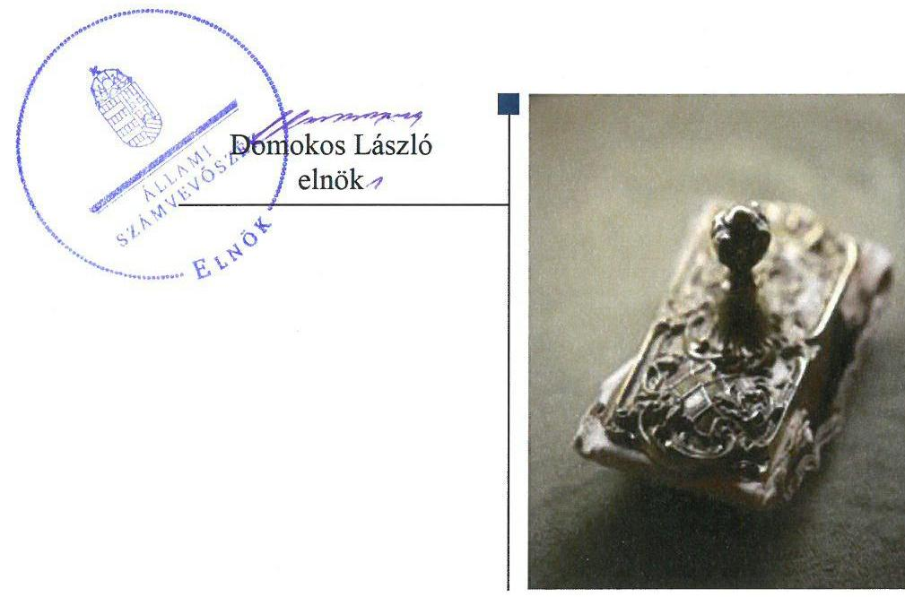
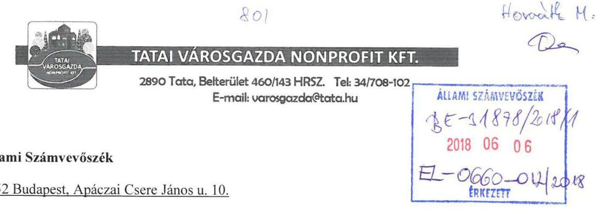
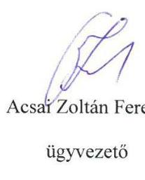
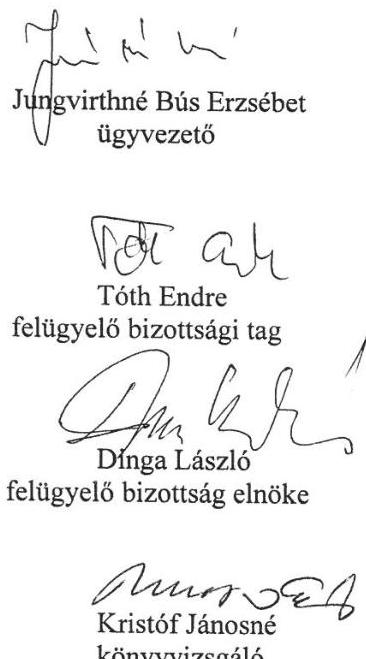
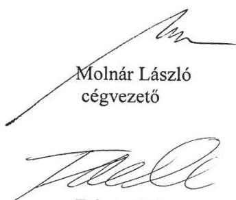
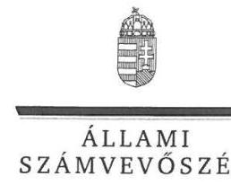
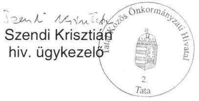
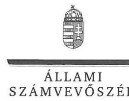
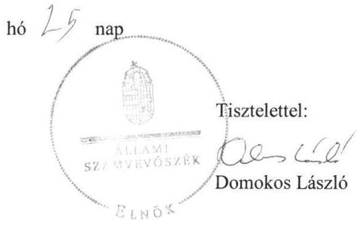

# Jelentés 

## Az önkormányzatok gazdasági társaságai

Az önkormányzatok többségi tulajdonában lévő gazdasági társaságok gazdálkodásának ellenőrzése - Tatai Városgazda Nonprofit Korlátolt Felelősségű Társaság
2018.

---

# Jelenetés 

## Az önkormányzatok gazdasági társaságai

Az önkormányzatok többségi tulajdonában lévő gazdasági társaságok gazdálkodásának ellenőrzése - Tatai Városgazda Nonprofit Korlátolt Felelősségű Társaság
2018. 08. hó 08. nap

---

# AZ ELLENŐRZÉST FELÜGYELTE:

DR. HORVÁTH MARGIT felügyeleti vezető

## AZ ELLENŐRZÉST VEZETTE ÉS A VÉGREHAJTÁSÁÉRT FELELŐS:

DORMÁN ISTVÁN ellenőrzésvezető

A PROGRAM ÖSSZEÁLLÍTÁSÁÉRT FELELŐS:

TÓTPÁL SZABOLCS osztályvezető

IKTATÓSZÁM: EL-0660-019/2018.

TÉMASZÁM: 2447

ELLENŐRZÉS-AZONOSÍTÓ SZÁM: V079386

Jelentéseink az Országgyűlés számítógépes hálózatán és az Interneta a www.asz.hu címen is olvashatóak.

---

# TARTALOMJEGYZÉK 

■ ÖSSZEGZÉS ..... 5
■ AZ ELLENŐRZÉS CÉLJA ..... 6
■ AZ ELLENŐRZÉS TERÜLETE ..... 7
■ AZ ELLENŐRZÉS HÁTTERE, INDOKOLTSÁGA ..... 9
■ A JELENTÉS LÉNYEGES KÉRDÉSKÖREI ..... 10
■ AZ ELLENŐRZÉS HATÓKÖRE ÉS MÓDSZEREI ..... 11
■ MEGÁLLAPÍTÁSOK ..... 13
■ JAVASLATOK ..... 17
■ MELLÉKLETEK ..... 21
I. sz. melléklet: Értelmező szótár ..... 21
II. sz. melléklet: Pénzügyi adatok ..... 22
■ FÜGGELÉK: ÉSZREVÉTELEK ..... 23
■ RÖVIDÍTÉSEK JEGYZÉKE ..... 41

---

.

---

# ÖSSZEGZÉS 

Tata Város Önkormányzata a kizárólagos tulajdonában álló Tatai Városgazda Nonprofit Korlátolt Felelősségű Társaság tekintetében a tulajdonosi joggyakorlás kereteit szabályszerűen alakította ki. A Társaság gazdálkodásának szabályozottsága nem felelt meg a jogszabályi előírásoknak. A Társaság gazdálkodása nem volt szabályszerű. A vagyongazdálkodás szabályszerű volt. A Társaság müködésének átláthatósága nem volt biztositott, nem tett eleget a jogszabályokban előírt közzétételi és adatszolgáltatási kötelezettségeinek.

## Az ellenőrzés társadalmi indokoltsága

Magyarországon az önkormányzatok kötelező és önként vállalt feladataik vonatkozásában is egyre szélesebb körben alkalmazzák a költségvetésen kívüli feladatellátást, ezáltal - a nonprofit szervezetek mellett - az önkormányzati tulajdonú gazdasági társaságok is kiemelt fontosságú szerephez jutnak. Ezen belül kiemelt jelentőségű számos önkormányzati gazdasági társaság működése abból a szempontból is, hogy gazdálkodásának egyes elemei befolyásolják az önkormányzati alszektor hiányát és az államadósságot.

Az Állami Számvevőszék Stratégiájában foglaltakkal összhangban az ÁSZ kiemelt célja, hogy a helyi önkormányzatok gazdálkodásában rejlő pénzügyi kockázatok feltárásával, az államháztartáson kívülre nyújtott költségvetési támogatások és ingyenes vagyonjuttatások, valamint az államháztartáson kívül működő feladatellátó rendszerek ellenőrzéseivel hozzájáruljon ahhoz, hogy a közpénzeket az államháztartáson kívül működő szervezetek is átlátható, rendezett módon használják fel. Ezen stratégiai célkitűzéssel összhangban került sor Tata Város Önkormányzata kizárólagos tulajdonában álló Tatai Városgazda Nonprofit Kft. szabályozottságának, gazdálkodása és vagyongazdálkodási tevékenysége szabályszerűségének, valamint az Önkormányzat tulajdonosi joggyakorlása 2013-2016. évi szabályszerűségének ellenőrzésére.

## Főbb megállapítások, következtetések, javaslatok

Tata Város Önkormányzata a 2013-2016. években a kizárólagos tulajdonában álló Tatai Városgazda Nonprofit Korlátolt Felelősségű Társaság tekintetében a tulajdonosi joggyakorlás kereteit a jogszabályi előírásoknak megfelelően kialakította, a tulajdonosi jogokat szabályszerűen gyakorolta. Az Alapító az éves beszámolók elfogadásáról a felügyelőbizottság és a könyvvizsgáló írásbeli jelentései alapján szabályszerűen döntött, a javadalmazási szabályzatot megalkotta. A felügyelőbizottság az ügyrendjét azonban a jogszabályi előírás ellenére az ellenőrzött időszakban nem készítette el.

A Társaság gazdálkodásának szabályozottsága nem felelt meg a jogszabályi előírásoknak. A számviteli politika keretében elkészítendő, törvényben előírt szabályzatok közül az ellenőrzött időszakban a pénzkezelési szabályzat, az eszközök és a források értékelési szabályzata, valamint a leltárkészítési és leltározási szabályzat, a számlarend nem felelt meg a jogszabályi előírásoknak. A számviteli nyilvántartásokat a Társaság nem a jogszabályi előírásoknak megfelelően vezette. A működés átláthatósága nem volt biztosított, az információs önrendelkezési jogról és az információszabadságról szóló törvényben előírt szabályzatokat a Társaság nem készítette el, a jogszabályokban előírt közzétételi kötelezettségét, valamint az Önkormányzattal kötött közhasznú Megállapodásokban és Megbízási szerződésben előírt adatszolgáltatási és beszámolási kötelezettségeit nem teljesítette.

A Társaság bevételeinek és ráfordításainak elszámolása a személyi jellegű ráfordítások kivételével szabályszerű volt. A személyi jellegű ráfordítások elszámolásánál a Társaság nem tartotta be a számvitelről szóló törvény előírásait.

A Társaság vagyongazdálkodása, a saját vagyon nyilvántartása szabályszerű volt, azonban az értékcsökkenés elszámolása, a bekerülési érték meghatározása nem felelt meg a jogszabályi előírásoknak. A Társaság fizetőképessége biztosított volt.

---

# AZ ELLENŐRZÉS CÉLJA 

AZ ELLENŐRZÉS CÉLJA annak értékelése volt, hogy az önkormányzat vagyongazdálkodási tevékenysége során szabályszerűen gyakorolta-e tulajdonosi jogait; a gazdasági társaság szabályozottsága, gazdálkodása és vagyongazdálkodási tevékenysége, bevételeinek és ráfordításainak elszámolása megfelelt-e a jogszabályi és tulajdonosi előírásoknak; a gazdasági társaság kötelezettségállománya jelent-e kockázatot a múködésre, valamint a gazdálkodás átláthatósága és elszámoltathatósága érdekében biztosítva volt-e a szolgáltatás dijának megalapozottsága szabályszerű önköltségszámítással.

---

# AZ ELLENŐRZÉS TERÜLETE 

## Tata Város Önkormányzata és a kizárólagos tulajdonában álló Tatai Városgazda Nonprofit Korlátolt Felelősségú Társaság

Tata Város Komárom-Esztergom megyében a Tatai Járás központja, lakónépessége a 2016. december 31-én 23343 fő volt. Tata Város Önkormányzata 11 tagú Képviselő-testületének ${ }^{1}$ munkáját két állandó bizottság ${ }^{2}$ segítette. Az ellenőrzött időszakban a polgármester és a jegyző személyében változás nem történt.

A Tatai Városgazda Nonprofit Korlátolt Felelősségű Társaságot az Önkormányzat ${ }^{3}$ alapította, az Önkormányzat a Társaság ${ }^{4}$ kizárólagos tulajdonosa volt. A Társaság alapításakor 2008. évben - a jegyzett tőke összege 8,8 M Ft volt, amelynek összege 2013. évben a Tatai Városfejlesztő Kft. beolvadását követően 9,3 M Ft-ra, 2014. évben a tőketartalék felhasználásával végrehajtott tőkeemelést követően 16,3 M Ft-ra nőtt. Az Önkormányzat 2016. évben 118,5 M Ft értékű vagyoni hozzájárulás ingatlan apporttal 134,8 M Ft-ra növelte a Társaság jegyzett tőkéjének összegét.

A Társaság jogállása közhasznú, fő tevékenysége hulladékgyűjtés, kezelés volt. 2013-2016. években az Önkormányzattal a kötött közhasznú Megállapodások ${ }_{1-6}{ }^{5}$ alapján zöldterületek kezelése, közutak és hidak üzemeltetése és fenntartása, nem veszélyes hulladékok gyűjtése, környezetszenynyezés csökkentésének igazgatása és városgazdálkodási szolgáltatásokat végezte. Megbízási szerződés ${ }^{6}$ alapján végezte az Önkormányzat tulajdonában lévő bérlakások és garázsok ingatlankezelését. Egyéb tevékenységként az önkormányzati tulajdonú gazdasági társaságok és intézmények számára épület- fenntartási, szállítási, üzemeltetési és karbantartási munkákat végzett.

A Társaság által végzett tevékenységek közül az Mötv. ${ }^{7}$ 13. §-a alapján a településüzemeltetés, a lakás- és helyiséggazdálkodás, valamint a helyi környezet- és természetvédelem az Önkormányzattól átvállalt közfeladat volt, továbbá a $\mathrm{Ht} .{ }^{8}$ alapján a nem veszélyes - települési - hulladékok gyűjtése közszolgáltatásnak minősült.

A Társaság ügyvezetőjének ${ }^{9}$ személyében az ellenőrzött időszakban változás történt, az ügyvezető 2015. december 31-i nyugdíjba vonulását követően az Alapító ${ }^{10}$ 2016. január 1-jétől két éves időtartamra új ügyvezetőt választott. A Társaságnak az ellenőrzött időszakban az Alapító okiratban ${ }_{1}$ ${ }^{10}{ }^{11}$ foglaltak szerint választott könyvvizsgálója volt.

A Társaság főbb gazdálkodási adatait a 2013-2016. években az 1. táblázat szemlélteti, a vagyoni helyzetét bemutató főbb mérleg és eredménykimutatás adatokat a II. számú melléklet részletezi.

---

| A TÁRSASÁG FŐBB GAZDÁLKODÁSI ADATAI 2013-2016. ÉVEKBEN |  |  |  |  |
| :--: | :--: | :--: | :--: | :--: |
| Összeg (M Ft) | 2013. | 2014. | 2015. | 2016. |
| Saját tőke | 69,4 | 70,2 | 71,0 | 190,4 |
| Jegyzett tőke | 9,3 | 16,3 | 16,3 | 134,8 |
| Mérlegfőösszeg | 200,1 | 201,1 | 188,9 | 336,2 |
| Kötelezettségek | 20,6 | 24,8 | 21,5 | 32,5 |
| Nettó árbevétel | 288,0 | 345,5 | 339,6 | 341,1 |
| Mérleg szerinti eredmény | 0,5 | 0,8 | 0,8 | 0,9 |
| Fő | 2013. | 2014. | 2015. | 2016. |
| Foglalkoztatottak átlagos statisztikai állományi létszáma | 72 | 63 | 62 | 77 |
| Forrás: A Társaság egyszerúsitett éves beszámolói |  |  |  |  |

A Társaság közhasznú tevékenységeinek bevételei a 2013. évben az öszszes bevétel 10,6\%-át, 2016. évben az összes bevétel 10,2\%-át tették ki. A Társaság átlagos állományi létszáma 2013. évben 72 fő, 2014. évben 63 fő, 2015. évben 62 fő, 2016. évben 77 fő volt.

A Társaságnak vagyonkezelésbe vett vagyona nem volt, tevékenységét a saját vagyonával látta el. A Társaság tulajdonosi részesedéssel más gazdasági társaságban nem rendelkezett. A Társaság nem minősült kormányzati szektorba sorolt egyéb szervezetnek.

---

# AZ ELLENŐRZÉS HÁTTERE, INDOKOLTSÁGA 

AZ ÖNKORMÁNYZAT TULAJDONÁBAN ÁLLÓ GAZDASÁGI TÁRSASÁGOK ELLENŐRZÉSE kiemelten fontos a vagyon megőrzése, megóvása érdekében, valamint a kormányzati szektor elszámolásaiban megjelenő önkormányzati tulajdonú gazdálkodó szervezetek esetében, amelyekkel szemben alapvető követelmény, hogy gazdálkodásuk, működésük szabályszerű, az általuk szolgáltatott adatok minél megbízhatóbbak legyenek. A feladatellátás költségeinek, ráfordításainak alakulása a lakosság széles rétegét érinti.

Az Állami Számvevőszék ellenőrzései feltárhatják, hogy az önkormányzat a feladatellátásához rendelt vagyon működtetését a tulajdonostól elvárható gondossággal végezte-e, a feladatot ellátó gazdasági társaság a létesítő okiratban, szolgáltatási szerződésben foglaltak betartásával biztosí-totta-e a feladat ellátását. Az ellenőrzés eredményeképp meghatározhatóvá válnak a költségvetési hiányt befolyásoló szervezet kockázatai, lehetővé válik ezen kockázatok csökkentése. Az ellenőrzés rávilágíthat arra, hogy a gazdasági társaság a vagyon használatával biztosította-e a szolgáltatás folytatásának feltételeit, az önkormányzat tulajdonosi felügyelete hozzájárult-e a szabályszerű gazdálkodáshoz és feladatellátáshoz. A megállapítások alapján megfogalmazott számvevőszéki javaslatok hasznosítása elősegítheti a meglévő hibák megszüntetését. A jó gyakorlatok bemutatásával az ÁSZ ${ }^{12}$ hozzájárul a követendő megoldások megismertetéséhez, terjesztéséhez.

---

# A JELENTÉS LÉNYEGES KÉRDÉSKÖREI 

1.     - Az Önkormányzat tulajdonosi joggyakorlása szabályszerű volt-e?
2.     - A Társaság szabályozottsága, gazdálkodási tevékenysége, bevételeinek és ráfordításainak elszámolása, az önköltségszámitás és árképzés szabályszerű volt-e?
3.     - A Társaság vagyongazdálkodási tevékenysége szabályszerű volt-e?

---

# AZ ELLENŐRZÉS HATÓKÖRE ÉS MÓDSZEREI 

## Az ellenőrzés típusa

Megfelelőségi ellenőrzés.

## Az ellenőrzött időszak

2013. január 1-jétől 2016. december 31-ig tartó időszak.

## Az ellenőrzés tárgya

Tata Város Önkormányzata 100\%-os tulajdonában álló Tatai Városgazda Nonprofit Kft. feletti tulajdonosi joggyakorlása, valamint a Társaság gazdálkodásának szabályozottsága és szabályszerűsége.

Az ellenőrzés kiterjedt minden olyan körülményre és adatra, amely az ÁSZ jogszabályban meghatározott feladatainak teljesítéséhez, valamint a program végrehajtása folyamán felmerült újabb összefüggések feltárásához szükséges volt.

## Az ellenőrzött szervezet

Tata Város Önkormányzata és a
Tatai Városgazda Nonprofit Kft.

## Az ellenőrzés jogalapja

Az ellenőrzés jogszabályi alapját az ÁSZ tv. ${ }^{13} 1 . \S$ (3) bekezdése és 5. § (3)(5) bekezdései képezték.

## Az ellenőrzés módszerei

Az ellenőrzést a nemzetközi standardokat irányadónak tekintve az ellenőrzési program ellenőrzési kérdései, az ellenőrzött időszakban hatályos jogszabályok, az ellenőrzés szakmai szabályok és módszertanok figyelembe vételével végeztük.

Az ellenőrzés ideje alatt az ellenőrzött szervezettel történő kapcsolattartást az ÁSZ Szervezeti és Müködési Szabályzatának vonatkozó előírásai alapján biztosítottuk.

Az ellenőrzési kérdések megválaszolásához szükséges bizonyítékok megszerzése a következő ellenőrzési eljárások alkalmazásával történt:

---

megfigyelés, kérdésfeltevés (információkérés), összehasonlítás, valamint elemző eljárás. Az ellenőrzési bizonyítékként felhasználható adatforrások közé tartoznak egyrészt az ellenőrzési programban felsorolt adatforrások, másrészt adatforrás lehet még minden - az ellenőrzés folyamán - feltárt, az ellenőrzés szempontjából információkat tartalmazó dokumentum.

Az ellenőrzést a kérdésekre adott válaszok kiértékelésével, valamint a megjelölt adatforrások, a csatolt tanúsítványok felhasználásával, továbbá az adott időszakban hatályos jogszabályok figyelembe vételével folytattuk le.

A bevételek és ráfordítások elszámolását, és a vagyonnyilvántartás terén a szabályszerű működést véletlen mintavétellel ellenőriztük. A mintavétellel ellenőrzött területek esetében minden egyes tétel vonatkozásában szabályszerűségre vonatkozó kérdéseket tettünk fel, amelyek a számviteli törvény, illetve a tulajdonosi követelményeknek és az ellenőrzött szervezet belső szabályozásai előírásainak betartására vonatkoztak. A jogszabályoknak és a belső előírásoknak megfelelőnek tekintettük az adott területet, amennyiben a minta ellenőrzésének eredménye alapján 95\%-os bizonyossággal a teljes sokaságban a hibaarány kisebb volt, mint 10\%, nem megfelelőnek értékeltük, ha a hibaarány a 10\%-ot meghaladta. A ráfordítások, ezen belül az anyagjellegű, az egyéb, a pénzügyi műveletek és a rendkívüli ráfordítások elszámolására az értékcsökkenésre és a vagyonnyilvántartásra vonatkozó véletlen mintavételt kockázati alapú kiválasztással egészítettük ki, amelynek során évente a három legnagyobb összegű tételt választottuk ki.

---

# 1. Az Önkormányzat tulajdonosi joggyakorlása szabályszerű volt-e? 

Összegző megállapítás Az Önkormányzat tulajdonosi joggyakorlása szabályszerű volt.

AZ ÖNKORMÁNYZAT az Nvtv. ${ }^{14}$ 9. § (1) bekezdésében foglaltak ellenére közép- és hosszú távú vagyongazdálkodási tervvel az ellenőrzött időszakban nem rendelkezett.

Az Önkormányzat működésének szabályait az SZMSZ1-5 ben ${ }^{15}$ határozta meg. Az önkormányzati vagyonnal való gazdálkodás szabályait - az Nvtv. előírásainak megfelelően - az ellenőrzött időszakra vonatkozó Vagyonrendelet ${ }^{16}$-ben rögzítették. Az Önkormányzat a Társaság múködésére, tevékenységére vonatkozó rendeletalkotási kötelezettségének az önkormányzati lakások bérbeadására vonatkozó rendelet ${ }^{17}$, a Háztartási szennyvíz begyűjtéséről szóló rendelet ${ }^{18}$ alkotásával, a Ht. előírásai szerinti rendeletalkotási kötelezettségének a Hulladékgazdálkodási rendelet ${ }^{19}$ elfogadásával eleget tett.

A TULAJ DONOSI JOGGYAKORLÓ ${ }^{20}$ a Gt. ${ }^{21}$ és a Ptk. ${ }^{22}$ előírásaival összhangban a Társaság Alapító okiratában előírta az $\mathrm{FB}^{23}$ megválasztását, feladatait, eljárásának szabályait, beszámolási kötelezettségét. Az FB tagokat a Gt. és a Ptk. előírásainak megfelelően az Alapító választotta. Az FB a Gt. 34. § (4) bekezdésében és a Ptk. 3:122. § (3) bekezdésében előírtak ellenére nem rendelkezett az Alapító által jóváhagyott ügyrenddel.

A Javadalmazási szabályzatot ${ }^{24}$ az Alapító a Taktv. ${ }^{25}$ előírásai szerint megalkotta.

A Társaság egyszerűsített éves beszámolóit az Alapító az FB írásos jelentése és a könyvvizsgáló jelentése ismeretében hagyta jóvá. Az Alapító a 2013-2016. években a Civil tv. ${ }^{26}$ előírásait betartva, nonprofit gazdasági társaság lévén a Társaság gazdálkodása során elért eredményét nem osztotta fel.

A könyvvizsgáló a 2014. évi egyszerűsített éves beszámolóra adott véleményét - többek között az önköltségszámítási szabályzat pótlása, a közfeladatellátási tevékenység elszámolásának szabályozása, valamint a belső ellenőrzés tekintetében - figyelemfelhívó megjegyzéssel látta el. A 2015. évi egyszerűsített éves beszámolóra a véleményét korlátozás nélkül, azonban - az önkormányzati támogatás elszámolása és a számlák tartalmi követelményei tekintetében - intézkedést igénylő megállapításokkal adta ki. A 2016. évi egyszerűsített éves beszámolóra adott véleményéhez vezetői levelet csatolt, amelyben intézkedéseket tartott szükségesnek az Önkormányzat és a Társaság számviteli politikájának összehangolása, a szabályzatok felülvizsgálata és a közhasznúsági jelentés számviteli alátámasztása tekintetében.

---

A Vagyonrendeletben előírtak szerinti éves üzleti terveket a Képviselőtestület megtárgyalta és jóváhagyta.

Az Önkormányzat az Áht. ${ }^{27}$-ben biztosított belső ellenőrzés lehetőségével 2013-2014. és 2016. évben nem élt. 2015. évben belső ellenőrzése ellenőrizte a Társaság múködését, a feladatellátás dokumentálását és az iratkezelést. A javaslatok többek között a szabályzatok aktualizálására, a Társaságra vonatkozó sajátosságokkal történő kiegészítésére, a szerződések nyilvántartásának rendszerezésére, a kintlévőségek felülvizsgálatára, és az eszköznyilvántartás pontosítására vonatkoztak.

# 2. A Társaság szabályozottsága, gazdálkodási tevékenysége, bevételeinek és ráfordításainak elszámolása, az önköltségszámítás és árképzés szabályszerű volt-e? 

## Összegző megállapítás

A Társaság szabályozottsága, gazdálkodási tevékenysége, a személyi jellegú ráfordítások elszámolása, és az árképzés nem volt szabályszerű.

SZÁMVITELI POLITIKÁVAL a Társaság Számv. tv. ${ }^{28}$-ben előírtak szerint rendelkezett, a Számviteli politika ${ }_{1-3}{ }^{29}$ megfelelt a Számv. tv. előírásainak.

A Számviteli politika keretében elkészítendő szabályzatokkal - Leltározási szabályzattal ${ }_{1-3}{ }^{30}$, Értékelési szabályzattal ${ }_{1-3}{ }^{31}$, Pénzkezelési szabályzat$\mathrm{tal}_{1-4}{ }^{32}$ - a Számv. tv. előírásainak megfelelően a Társaság rendelkezett.

A Leltározási szabályzatban a Számv. tv. 69. § (3) bekezdés előírásai ellenére a Társaság nem határozta meg a tárgyi eszközök tekintetében a mennyiségi felvétellel történő leltározás gyakoriságát.

Az Értékelési szabályzat ${ }_{1-3}$ rögzítette az eszközök értékelésének szabályait, azonban a források értékelésének szabályait nem határozta meg, ezzel megsértették a Számv. tv. 14. § (5) bekezdés b) pontjában foglaltakat.

A Pénzkezelési szabályzat ${ }_{1-3}$ a 2013-2015. években nem felelt meg a Számv. tv. 14. § (8) bekezdésében előírtaknak, mivel abban a Társaság nem rendelkezett a pénzforgalom bankszámlán történő lebonyolításának rendjéről.

A SZÁMLAREND 2013-2016. években a Számv. tv. 161. § (2) bekezdés b) pont előírásai ellenére nem tartalmazta számla tartalmát, ha az a számla megnevezéséből egyértelműen nem következik, továbbá a számla értéke növekedésének, csökkenésének jogcímeit, a számlát érintő gazdasági eseményeket, azok más számlákkal való kapcsolatát, a c) pont előírásai ellenére a főkönyvi számla és az analitikus nyilvántartás kapcsolatát, így az ellenőrzött időszakban a Társaság a Számv. tv. 161. § (1) bekezdés előírásai ellenére nem olyan számlarendet készített, amely szerinti könyvvezetés a törvényben előírt beszámoló készítését maradéktalanul biztosítja.

Bizonylati rendet ${ }^{33}$ a Társaság a Számv. tv. előírásai szerint készített.
A Társaság a Ht. 50. § (2) bekezdés előírásai ellenére az egyes tevékenységeire nem vezetett olyan elkülönült nyilvántartást, amely biztosítja az

---

egyes tevékenységek átláthatóságát, valamint kizárja a keresztfinanszírozást.

A Számv. tv. 161/A. (1) bekezdés előrásai ellenére a könyvvezetésre, a bizonylatolásra vonatkozó részletes belső szabályait nem úgy alakította ki, hogy az a mérleg és az eredménykimutatás alátámasztásán túlmenően a kiegészítő melléklet adatainak közvetlen alátámasztására is alkalmas legyen.

BESZÁMOLÁSI KÖTELEZETTSÉGÉNEK a Társaság nem a jogszabályi előírásoknak megfelelően tett eleget, a Számv. tv. szerinti egyszerűsített éves beszámolóit, valamint a Civil tv. szerinti közhasznúsági mellékleteket elkészítette, letétbe helyezte és közzétette, azonban a Ht. 50. § (1) előírásai ellenére a beszámoló összeállítására, a nyilvánosságra hozatalára és közzétételére a Számv. tv. rendelkezéseit nem a Ht. szerinti eltérésekkel alkalmazta. A Ht. 50. § (3) bekezdése előírásai ellenére - mint hulladékgazdálkodási közszolgáltatás körébe tartozó tevékenységet végző közszolgáltató - legalább önálló mérleget és eredménykimutatást nem készített.

A KÖZÉRDEKŰ ADATOK megismerésére irányuló igények teljesítésének rendjét a Társaság az Info tv. ${ }^{34}$ 30. § (6) bekezdésében foglaltak ellenére az ellenőrzött időszakban nem szabályozta.

A Társaság az Info tv. alapján adatfelelősnek minősül, az Info tv. 35. § (1) bekezdése szerinti kötelezettség teljesítésének részletes szabályait az Info. tv. 35. § (3) bekezdésében előírtakkal ellentétben belső szabályzatban nem állapította meg. A Társaság az Info tv. 37. § (1) bekezdés előírásai ellenére az Info tv. 1. melléklete szerinti általános közzétételi listában meghatározott adatok közzétételének a honlapján nem tett eleget. Tevékenységéhez kapcsolódóan a Taktv. 2. §-ban előírt közzétételi kötelezettségét nem teljesítette.

AZ ÖNKÖLTSÉGSZÁMÍTÁS RENDJÉRE vonatkozó szabályzat készítésére a Társaság Számv. tv. alapján nem volt kötelezett. A tulajdonosi joggyakorló a közhasznú Megállapodásokban a Társaság részére előírta önköltségszámítás készítését. Önköltségszámítási szabályzatot ${ }^{35}$ a Társaság 2016. évben készített, amelyben meghatározta az önköltség elemeit, illetve az egyes tevékenységek díját.

AZ ÁRMEGÁLLAPÍTÁS a 2013-2015. években szabályszerű önköltségszámítással - Önköltségszámítási szabályzat hiányában - nem volt alátámasztva. Az ármegállapítás 2016. évben nem felelt meg az Önköltségszámítási szabályzat III. 5. pontja dokumentálásra vonatkozó előírásainak és a közhasznú Megállapodás 2.2. pontjában előírt nettó költség, ésszerű nyereség feltételrendszerének.

A BEVÉTELEK ELSZÁMOLÁSA szabályszerű volt, megfelelt a Számv. tv.-ben előírtaknak.

A RÁFORDÍTÁSOK ELSZÁMOLÁSA - a személyi jellegú ráfordítások kivételével - szabályszerű volt.

---

A személyi jellegű ráfordítások elszámolása nem volt szabályszerű. A Számv. tv. 167. § (1) bekezdés h) pontjában előírtak ellenére a könyvviteli elszámolást közvetlenül alátámasztó bizonylatok nem tartalmazták a könyvelés módjára, az érintett könyvviteli számlákra történő hivatkozást.

# 3. A Társaság vagyongazdálkodási tevékenysége szabályszerű volt-e? 

## Összegző megállapítás

A Társaság vagyongazdálkodási tevékenysége szabályszerű volt. Az értékcsökkenés elszámolása nem volt szabályszerű.

EGYSZERŰSÍTETT ÉVES BESZÁMOLÓIT a Társaság 2013-2016. években a Számv. tv.-ben előírtaknak megfelelő leltárral alátámasztotta, a tárgyi eszközök mennyiségi felvétellel történő leltározása az ellenőrzött időszakban megtörtént.

A SAJÁT VAGYON nyilvántartása szabályszerű volt.
Az Önkormányzat a Társaság által ellátott feladatokhoz kapcsolódóan vagyonkezelői jogot a Társasággal nem létesített, a Társaság részére vagyonkezelésbe vagyont nem adott át. Az ellenőrzött időszakban hatályos Megállapodásokhoz, Megbízási szerződéshez nem kapcsolódott üzemeltetésre átadott eszköz vagy ingatlan. A feladatellátást a Társaság a saját tulajdonában lévő eszközeivel végezte.

Az Önkormányzat 2016. évben a Képviselő-testület 470/2015. (XII. 17.) számú határozatával a Társaság törzstőkéjének emeléséről döntött. A vagyoni hozzájárulás ingatlan apport értéke 118,5 M Ft volt.

AZ ÉRTÉKCSÖKKENÉS elszámolása nem volt szabályszerű, mivel a Számv. tv. 52. § (2) bekezdés előírásai ellenére a tárgyi eszközök esetében az üzembe helyezést nem dokumentálták.

---

# JAVASLATOK 

Az ÁSZ tv. 33. § (1) bekezdésében foglaltak értelmében az ellenőrzött szervezet vezetője köteles a jelentésben foglalt megállapításokhoz kapcsolódó intézkedési tervet összeállítani és azt a jelentés kézhezvételétől számított 30 napon belül az ÁSZ részére megküldeni. Amennyiben az ellenőrzött szervezet vezetője nem küldi meg határidőben az intézkedési tervet, vagy továbbra sem elfogadható intézkedési tervet küld, az Állami Számvevőszék elnöke az ÁSZ tv. 33. § (3) bekezdése a) és b) pontjaiban foglaltakat érvényesítheti.

Javaslataink célja a Tatai Városgazda Nonprofit Korlátolt Felelősségű Társaság gazdálkodása szabályszerűségének és gyakorlatának javítása annak érdekében, hogy a szabályozási környezet és az alkalmazott gyakorlat megfelelően tudja támogatni az átlátható müködést.

## Tatai Városgazda Nonprofit Korlátolt Felelősségű Társaság ügyvezetőjének

1. Intézkedjen a Leltározási szabályzat, az Értékelési szabályzat, a Pénzkezelési szabályzat és a Számlarend módosításáról a hatályos Számv. tv. előirásainak megfelelően.
(2. sz. megállapítás 3-6. bekezdései alapján)
2. Intézkedjen az egyes tevékenységei elkülönült nyilvántartása vezetéséről a Ht.-ben foglaltaknak megfelelően.
(2. sz. megállapítás 8. bekezdése alapján)
3. Intézkedjen a könyvvezetésre, a bizonylatolásra vonatkozó részletes belső szabályainak kialakításáról a hatályos Számv. tv. előírásainak megfelelően.
(2. sz. megállapítás 9. bekezdése alapján)
4. Intézkedjen, hogy a Társaság éves beszámolási kötelezettségét a Ht. előírásainak figyelembe vételével teljesítse.
(2. sz. megállapítás 10. bekezdése alapján)

---

5. Intézkedjen a közérdekü adatok megismerésére irányuló igények teljesitésének rendjét rögzítő szabályzat készitéséről az Info tv. előírásainak megfelelően.
(2. sz. megállapítás 11. bekezdése alapján)
6. Intézkedjen a közérdekü adatok közzétételére vonatkozó kötelezettség teljesitésének részletes szabályait rögzítő szabályzat készitéséről az Info tv. előírásainak megfelelően.
(2. sz. megállapítás 12. bekezdés 1. mondata alapján)
7. Intézkedjen a közzétételi kötelezettségének teljesitéséről az Info tv. és a Tak. tv. előírásainak megfelelően.
(2. sz. megállapítás 12. bekezdés 2. és 3. mondata alapján)
8. Intézkedjen annak érdekében, hogy az árak megállapítása az Önköltségszámítási szabályzat és a közhasznú Megállapodás előírásainak megfelelően történjen.
(2. sz. megállapítás 14. bekezdése alapján)
9. Intézkedjen annak érdekében, hogy a személyi jellegü ráfordítások és az értékcsökkenés elszámolása a Számv. tv. előírásainak megfelelően történjen.
(2. sz. megállapítás 17. és a 3. sz. megállapítás 5. bekezdései alapján)

---

# Javaslataink célja az Önkormányzat szabályszerű működésének elősegítése, továbbá az önkormányzati tulajdonosi joggyakorlás kontrolljainak erősítése. 

## Tata Város Önkormányzata polgármesterének

1. Intézkedjen az Önkormányzat közép- és hosszú távú vagyongazdálkodási tervének elkészitéséről az Nvtv. elöírásainak megfelelően.
(1. sz. megállapítás 1. bekezdése alapján)
2. Kezdeményezze a felügyelőbizottság elnökénél a felügyelőbizottság ügyrendjének elkészitését, azt követően annak alapítói jóváhagyását a Ptk. elöírásainak megfelelően.
(1. sz. megállapítás 3. bekezdés 3. mondata alapján)

---

.

---

# MELLÉKLETEK 

- I. SZ. MELLÉKLET: ÉRTELMEZŐ SZÓTÁR
gazdasági társaság
kormányzati szektorba sorolt egyéb szervezet
közszolgáltatás
meghatározó befolyás
nemzeti vagyon
nonprofit gazdasági társaság
többségi befolyást biztosító részesedés

Ptk 3.88. § (1) bekezdése szerint „a gazdasági társaságok üzletszerű közös gazdasági tevékenység folytatására, a tagok vagyoni hozzájárulásával létrehozott, jogi személyiséggel rendelkező vállalkozások, amelyekben a tagok a nyereségből közösen részesednek, és a veszteséget közösen viselik".
az Áht. 3. § (2) és (3) bekezdésében foglaltakon kívül az Európai Közösséget létrehozó szerződéshez csatolt, a túlzott hiány esetén követendő eljárásról szóló jegyzőkönyv alkalmazásáról szóló 2009. május 25-i 479/2009/EK rendelet (a továbbiakban: 479/2009/EK rendelet) szerint a kormányzati szektorba sorolt szervezet (Áht. 1. § (12))
Az Ebktv. ${ }^{36}$ 3. § d) pontja a következőképpen határozza meg a közszolgáltatást: „szerződéskötési kötelezettség alapján a lakosság alapvető szükségleteinek ellátására irányuló szolgáltatás, így különösen a villamos energia-, gáz-, hő-, víz-, szennyvíz- és hulladékkezelési, köztisztasági, postai és távközlési szolgáltatás, továbbá a menetrend alapján közlekedő járművekkel végzett közforgalmú személyszállítás".
A Ptk. 8:2. § (2) bekezdése szerint „A befolyással rendelkező akkor rendelkezik egy jogi személyben meghatározó befolyással, ha annak tagja vagy részvényese, és
a) jogosult e jogi személy vezető tisztségviselői vagy felügyelőbizottsága tagjai többségének megválasztására, illetve visszahívására; vagy
b) a jogi személy más tagjai, illetve részvényesei a befolyással rendelkezővel kötött megállapodás alapján a befolyással rendelkezővel, azonos tartalommal szavaznak, vagy a befolyással rendelkezőn keresztül gyakorolják szavazati jogukat, feltéve, hogy együtt a szavazatok több mint felével rendelkeznek."
Nvtv. 1. § (2) bekezdése szerint többek között:
„az állam vagy a helyi önkormányzat kizárólagos tulajdonában álló dolgok, az a) pont hatálya alá nem tartozó, állam vagy a helyi önkormányzat tulajdonában lévő dolog,
az állam vagy a helyi önkormányzat tulajdonában lévő pénzügyi eszközök, továbbá az államot vagy a helyi önkormányzatot megillető társasági részesedések,
az államot vagy a helyi önkormányzatot megillető bármely vagyoni értékkel rendelkező jogosultság, amelyet jogszabály vagyoni értékű jogként nevesít." Civil tv. 9/F. § (2) bekezdése szerint „az a gazdasági társaság minősül nonprofit gazdasági társaságnak és cégnevében az a gazdasági társaság tüntetheti fel a nonprofit jelleget, amelynek létesítő okirata tartalmazza, hogy a gazdasági társaság tevékenységéből származó nyereség a tagok között nem osztható fel, hanem az a gazdasági társaság vagyonát gyarapítja." (hatályos 2014. március 15-től)

A Ptk. 8:2. § (1) bekezdése szerint „többségi befolyás az olyan kapcsolat, amelynek révén természetes személy vagy jogi személy (befolyással rendelkező) egy jogi személyben a szavazatok több mint felével vagy meghatározó befolyással rendelkezik."

---

# II. SZ. MELLÉKLET: PÉNZÜGYI ADATOK

TATAI VÁROSGAZDA NONPROFIT KFT. EGYSZERŰSÍTETT ÉVES BESZÁMOLÓINAK ADATAI (MILLIÓ FORINT)

|  Megnevezés | 2013.01.01. | 2013.12.31. | 2014.12.31. | 2015.12.31. | 2016.12.31.  |
| --- | --- | --- | --- | --- | --- |
|  Befektetett eszközök | 143,7 | 142,4 | 146,4 | 154,5 | 284,3  |
|  Immateriális javak | 0,0 | 0,0 | 0,0 | 0,8 | 0,6  |
|  Tárgyi eszközök | 143,7 | 142,2 | 146,4 | 153,7 | 283,7  |
|  Befektetett pénzügyi eszközök | 0,0 | 0,0 | 0,0 | 0,0 | 0,0  |
|  Forgóeszközök | 32,5 | 55,8 | 52,5 | 31,8 | 50,5  |
|  Készletek | 1,6 | 0,2 | 0,7 | 5,8 | 1,3  |
|  Követelések | 9,4 | 23,0 | 30,5 | 9,9 | 43,2  |
|  Értékpapírok | 0,0 | 0,0 | 0,0 | 0,0 | 0,0  |
|  Pénzeszközök | 21,4 | 32,6 | 21,3 | 16,1 | 6,0  |
|  Aktív időbeli elhatárolások | 0,03 | 1,9 | 2,2 | 2,6 | 1,4  |
|  Saját tőke | 69,1 | 69,4 | 70,2 | 71,0 | 190,4  |
|  Jegyzett tőke | 8,8 | 9,3 | 16,3 | 16,3 | 134,8  |
|  Töketartalék | 0,0 | 7,0 | 0,0 | 0,0 | 0,0  |
|  Eredménytartalék | 60,0 | 52,6 | 53,1 | 53,9 | 54,7  |
|  Lekötött tartalék | 0,0 | 0,0 | 0,0 | 0,0 | 0,0  |
|  Értékelési tartalék | 0,0 | 0,0 | 0,0 | 0,0 | 0,0  |
|  Mérleg szerinti eredmény | 0,3 | 0,5 | 0,8 | 0,8 | 0,9  |
|  Céltartalék | 1,5 | 8,0 | 4,0 | 0,0 | 0,0  |
|  Kötelezettségek | 4,2 | 20,6 | 24,8 | 21,5 | 32,5  |
|  Hosszú lejáratú kötelezettségek | 0,0 | 0,0 | 0,0 | 0,0 | 0,0  |
|  Rövid lejáratú kötelezettségek | 4,2 | 20,6 | 24,8 | 21,5 | 32,5  |
|  Passzív időbeli elhatárolás | 101,4 | 102,1 | 102,1 | 96,4 | 113,4  |
|  MÉRLEG FŐOSSZEG | 176,2 | 200,1 | 201,1 | 188,9 | 336,2  |
|  Értékesítés nettó árbevétele | 167,2 | 288,0 | 345,5 | 339,6 | 341,1  |
|  Aktivált saját teljesítmények értéke | 0,0 | 0,0 | 0,0 | 11,2 | 0,0  |
|  Egyéb bevételek | 81,6 | 142,9 | 150,0 | 180,2* | 183,3  |
|  Anyagjellegú ráfordítások | 127,1 | 236,4 | 299,2 | 302,0 | 280,4  |
|  Személyi jellegú ráfordítások | 106,8 | 171,7 | 170,3 | 211,0 | 223,5  |
|  Értékcsökkenési leírás | 14,0 | 13,4 | 11,9 | 10,8 | 17,2  |
|  Egyéb ráfordítások | 3,4 | 11,0 | 15,6 | 8,9 | 2,6  |
|  Üzemi tevékenység eredménye | $-2,6$ | $-1,5$ | $-1,5$ | $-1,7^{ }$ | 0,7  |
|  Pénzügyi műveletek eredménye | 0,8 | 0,3 | 0,2 | 0,1 | 0,1  |
|  Rendkívüli eredmény | 2,1 | 2,4 | 2,4 | 2,4*** | -  |
|  Adózott eredmény | 0,3 | 0,5 | 0,8 | 0,8 | 0,9  |
|  Átlagos állományi létszám [fő] | 40 | 72 | 63 | 62 | 77  |

A 2016. évi beszámolóban a módosított szerkezetű eredmény-kimutatásnak megfelelő 2015. évi adat: Egyéb bevételek*182,6 M Ft Üzemi tevékenység eredménye ** $+0,7 \mathrm{MFt}$ Rendkívüli eredmény *** -

---

# FÜGGELÉK: ÉSZREVÉTELEK 

A jelentéstervezetet a Számvevőszék 15 napos észrevételezésre megküldte az ellenőrzött szervezet vezetőjének az ÁSZ tv. 29. §* (1) bekezdése előírásának megfelelően.

A Tatai Városgazda Nonprofit Korlátolt Felelősségü Társaság ügyvezetőjének, valamint Tata Város Önkormányzata polgármesterének észrevételeit és azok kezeléséről szóló válaszleveleket a jelentés függeléke tartalmazza.
Az észrevételek alapján a jelentés nem módosult.

[^0]
[^0]:    * 29. § (1) Az Állami Számvevőszék az ellenőrzési megállapításait megküldi az ellenőrzött szervezet vezetőjének vagy az általa megbízott személynek, és annak, akinek személyes felelősségét állapította meg.
    (2) Az ellenőrzött szervezet vezetője és a felelősként megjelölt személy az ellenőrzés megállapításaira tizenöt napon belül írásban észrevételt tehet.
    (3) Az Állami Számvevőszék az észrevételre a beérkezésétől számított harminc napon belül írásban válaszol. A figyelembe nem vett észrevételeket köteles a jelentésben feltüntetni, és megindokolni, hogy azokat miért nem fogadta el.

---

# Domokos László elnök úr részére 

Tisztelt Elnök Úr!

Köszönettel vettük az észrevételezés céljából Társaságunk részére megküldött EL-0660007/2018. számú jelentéstervezetet, melyhez az alábbi észrevételeket szeretnénk füzni:
1., A Társaság által végzett nem veszélyes (települési) hulladék gyüjtése a mi meglátásunk szerint nem minősül közszolgáltatásnak, így a 2012. évi CLXXXV. törvény sem vonatkozik ránk.

A 2012. évi CLXXXV. törvény szerint közszolgáltató az a hulladékgazdálkodási tevékenység minősítéséről szóló törvény szerint minősített nonprofit gazdasági társaság, amely a települési önkormányzattal kötött hulladékgazdálkodási közszolgáltatási szerződése alapján hulladékgazdálkodási közszolgáltatást lát el.

Társaságunk nem kötött közszolgáltatási szerződést a tulajdonos önkormányzattal, a tevékenység végzését a Képviselő-testület által elfogadott közhasznú megállapodás alapján végezzük. A hulladékgazdálkodás Társaságunknál csak a hulladék közterületről történő begyűjtését és szállítását (tovább más hulladékkezeléssel foglalkozó gazdasági társaság hulladéklerakó helyére) jelenti.

A 2013. évi CXXV. törvény alapján a közszolgáltatási tevékenységet végző vagy végezni kívánó gazdálkodó szervezetnek minősítési kérelmet kell benyújtania közigazgatási eljárásra, de Társaságunk kérelmet nem nyújtott be, minősítéssel nem rendelkezik.
2., Feltöltésre került az Alapítás dokumentumai közül a „lista az alapítói/tulajdonosi határozatokról", melyben szerepel az Alapító által 167/2015. (IV.30.) határozatszámon jóváhagyott Felügyelő Bizottsági ügyrend.

---

Áttekintve az Önök által küldött EL-0228-013/2017 iktatószámú adatbekérő levelüket és az általunk feltöltött egyéb dokumentumok pont alatt lévő tételeket, csak a felügyelő bizottsági jegyzőkönyvek, jelentések szerepeltek adatszolgáltatási kötelezettségként, a felügyelő bizottság ügyrendje nem, ezért levelünk mellékleteként küldjük a Felügyelő Bizottság ügyrendjét.

Kérjük szíveskedjenek fentieket figyelembe venni a végleges jelentés elkészítésekor.

Tata, 2018. május 30.

Ácsár Zoltán Ferenc

Ügyvezető

Melléklet:

- Felügyelő Bizottság Ügyrendje
- Felügyelő Bizottság jegyzőkönyve
- Alapitói határozat a Felügyelői Bizottság Ügyrendjének elfogadásáról.

---

# JEGYZŐKÖNYV 

Készült a Tatai Városgazda Nonprofit Kft. hivatalos helyiségében, 2015. április 13-án a Felügyelő Bizottság üléséről.

Jelen vannak: Jungvirthné Bús Erzsébet ügyvezető
Molnár László cégvezető
Dinga László felügyelő bizottsági elnök
Tóth Endre felügyelő bizottsági tag
Fekete Béla felügyelő bizottsági tag
Kristóf Jánosné könyvvizsgáló
Molnárné Szücs Valéria gazdasági vezető
Jegyzökönyv vezető: Csejtei Judit

Az előzetes napirendi pontokhoz képest az elnök javaslatot tett a napirendi pontok változtatására.
A 4. napirendi pont szerepel elsőként.

1. Felügyelő Bizottság ügyrendjének módosítását a jelenlévő tagok egyhangúlag elfogadták .
2. A 2014. évi Közhasznúsági Jelentést Kristóf Jánosné könyvvizsgáló asszony jónak és teljes értékűnek tartja. A Felügyelő Bizottság a jelentést egyhangúlag elfogadta.
3. A Felügyelő Bizottság megtárgyalta a 2014. gazdasági évi beszámolót. A Bizottság megállapította, hogy a szervezet megfelelően gazdálkodott és nyereségesen zárta az évet.
A korlátozás nélküli hitelesítő záradékkal ellátott 2014. évi éves egyszerűsített beszámolót a Felügyelő Bizottság részére elfogadásra javasolja. A Felügyelő Bizottság az előbbiek alapján a 2014. évi gazdasági beszámolót egyhangúlag elfogadta.
4. 2015. évi üzlet terv

Az ügyvezető szóbeli tájékoztatást adott a 2015. gazdasági évi tervekről.
Ismertette az elkövetkezendő három évre tervezett beruházásokat, a 2015. évi létszám növekedést (12 fő). Egy integrált könyvelési program beszerzését és üzembe állítását, melyet a könyvvizsgáló asszony évek óta indokoltnak tart.
A Felügyelő Bizottság a könyvvizsgáló által reálisnak és végrehajthatónak tartott 2015. évi üzleti tervet kiegészítésekkel együtt egyhangúlag elfogadta.
5. A Tatai Városgazda Nonprofit Kft Szervezeti és Müködési Szabályzatát módosítását a Felügyelő Bizottság levette a napirendről, a következő Felügyelő Bizottsági ülésen újratárgyalja.
6. Alapító Okirat módosítása

Az ügyvezetés két pontban javasolja módosítani a társaság alapító okiratát:

- a társaság székhelyének megváltoztatása, a tényleges müködés helyszínére, mely jelenleg a Széles csapás dűlőn található. Ez a módosítás még kérdéses, az Önkormányzat döntésével összefüggő utca név elnevezéstől függ, mivel csak akkor hajtható végre az Alapítói Okirat módosítása, ha az Önkormányzat határozatban dönt az utca név változásáról, amely

---

ismereteink szerint folyamatban van.

- Az Alapító Okirat 7. pontja tartalmazza az alapító kizárólagos hatáskörébe tartozó döntési kompetenciát, amelynek k.) pontjában a szerződési értékhatárnak jelenlegi szabályozás szerinti törzstöke bizonyos hányadához való viszonyítása helyett nettó 25.000.000,- forintos értékhatárhoz javasolt kötni az ezen ügyleti érték feletti szerződések megkötésének Önkormányzat általi engedélyezését.
A Felügyelő Bizottság az ügyvezetés javaslatát indokoltnak tartja és egyhangúlag támogatja.

7. A Felügyelő Bizottság ismételten javaslatot tesz a tulajdonos felé, hogy a Bajcsy Zs. úti ingatlant véglegesen adja tulajdonba a Tatai Városgazda Nonprofit Kft-nek.
k.m.f

Fekete Béla
felügyelő bizottsági tag
Molnáne Szücs Valéria gazdasági vezető

Dr. Varga József
társaság jogi képviselöje

---

ELNÖK

Ikt.szám: EL-0660-016/2018.

# Acsai Zoltán Ferenc úr 

ügyvezető
Tatai Városgazda Nonprofit Korlátolt Felelősségű Társaság

## Tata

## Tisztelt Ügyvezető Úr!

Köszönettel vettem „Az önkormányzatok gazdasági társaságai - Az önkormányzatok többségi tulajdonában lévő gazdasági társaságok gazdálkodásának ellenőrzése - Tatai Városgazda Nonprofit Korlátolt Felelősségü Társaság" címủ ellenőrzésről készített számvevőszéki jelentéstervezetre megküldött észrevételeit.
Az Állami Számvevőszék észrevételekre vonatkozó álláspontját a felügyeleti vezető által készített részletes tájékoztatás tartalmazza, amelyet levelemhez mellékeltem.
Tájékoztatom Ügyvezető urat, hogy az Állami Számvevőszék a figyelembe nem vett észrevételeket az Állami Számvevőszékről szóló 2011. évi LXVI. törvény 29. § (3) bekezdésében előírtak szerint köteles a jelentésében feltüntetni és megindokolni, hogy azokat miért nem fogadta el.

Budapest, 2018. 07 hó 07 nap

Tisztelettel:

Melléklet: Tájékoztatás az észrevételek kezeléséről.

---

# Tájékoztatás az észrevételek kezeléséről 

Megköszönöm Ügyvezető úrnak „Az önkormányzatok gazdasági társaságai - Az önkormányzatok többségi tulajdonában lévő gazdasági társaságok gazdálkodásának ellenőrzése - Tatai Városgazda Nonprofit Korlátolt Felelősségü Társaság" címmel készített jelentés-tervezetre tett észrevételeit. Az észrevételek kezeléséről az alábbi tájékoztatást adom.

## 1. számú észrevétel:

Az 1. számú észrevétel tartalma alapján a jelentéstervezet a 2. számú megállapítás 8. és a 10. bekezdésben tett - a hulladékról szóló 2012. évi CLXXXV. törvényben (Ht.) előírt nyilvántartási kötelezettség hiányával; a beszámoló összeállítására, nyilvánosságra hozatalára és közzétételre vonatkozó Ht.-ben előírt eltérések alkalmazására, illetve a hulladékgazdálkodási közszolgáltatás körébe tartozó közszolgáltató önálló mérleg és eredménykimutatás készítésére vonatkozó megállapításait, továbbá az ügyvezetőnek címzett 2. és 4. számú javaslatokat érinti.

Ügyvezető úr a következő észrevételt tette:
„, A Társaság által végzett nem veszélyes (települési) hulladék gyüjtése a mi meglátásunk szerint nem minősül közszolgáltatásnak, igy a 2012. évi CLXXXV. törvény sem vonatkozik ránk.
A 2012. évi CLXXXV. törvény szerint közszolgáltató az a hulladékgazdálkodási tevékenység minősitéséről szóló törvény szerint minősitett nonprofit gazdasági társaság, amely a települési önkormányzattal kötött hulladékgazdálkodási közszolgáltatási szerződése alapján hulladékgazdálkodási közszolgáltatást lát el.
Társaságunk nem kötött közszolgáltatási szerzödést a tulajdonos önkormányzattal, a tevékenység végzését a Képviselő-testület által elfogadott közhasznú megállapodás alapján végezzük. A hulladékgazdálkodás Társaságunknál csak a hulladék közterületről történő begyüjtését és szállitását (tovább más hulladékkezeléssel foglalkozó gazdasági társaság hulladéklerakó helyére) jelenti.
A 2013. évi CXXV. törvény alapján a közszolgáltatási tevékenységet végző vagy végezni kivánó gazdálkodó szervezetnek minősitési kérelmet kell benyújtania közigazgatási eljárásra, de Társaságunk kérelmet nem nyújtott be, minősitéssel nem rendelkezik.."
Ügyvezető úr észrevételében leírtak alapján a jelentéstervezet 2. számú megállapítás 8. és a 10. bekezdésében tett megállapításokat, valamint az Ügyvezető úrnak címzett 2. és 4. számú javaslatot nem módosítom az alábbiak miatt:

Az ellenőrzött időszakban hatályos alapító okiratai szerint a Társaság főtevékenysége a Nem veszélyes hulladék gyüjtése (TEÁOR 3811) volt. A Ht. 2. § (1) bekezdés 27. pontja szerint a nem veszélyes hulladék gyüjtése hulladékgazdálkodási közszolgáltatásnak minősül, így a hulladékgazdálkodási közszolgáltatásra vonatkozó szabályok a Társaság - nem veszélyes hulladékgyüjtési - tevékenységére is vonatkoznak. Az ellenőrzés rendelkezésére bocsátott dokumentumok ismételt áttekintését követően megállapítottam, hogy a Társaság és az Önkormányzat között megkötött közszolgáltatási szerződés nem áll rendelkezésre, azonban az évente megkötött közhasznú megállapodások szerint a Társaság nem veszélyes (települési hulladék) hulladékgyüjtés közszolgáltatást végzett.

Mindezek alapján a jelentéstervezet megállapításai változatlanul helytállóak, így Ügyvezető úrnak címzett javaslatokat sem módosítom.

---

# 2. számú észrevétel 

A 2. számú észrevétel a jelentéstervezet a 1 számú megállapítás 3. bekezdés 3. mondatát, valamint a Tata Város Polgármesterének címzett 2. számú javaslatot érinti:

Ügyvezető úr a következő észrevételt tette:
„Feltöltésre került az Alapitás dokumentumai közül a „lista az alapitóitulajdonosi határozatokról", melyben szerepel az Alapitó által 167/2015. (IV.30.) határozatszámon jóváhagyott Felügyelö Bizottsági ügyrend.
Áttekintve az Önök által küldött EL-0228-013/2017 iktatószámú adatbekérő levelüket és az általunk feltöltött egyéb dokumentumok pont alatt lévő tételeket, csak a felügyelő bizottsági jegyzőkönyvek, jelentések szerepeltek adatszolgáltatási kötelezettségként, a felügyelő bizottság ügyrendje nem, ezért levelünk mellékleteként küldjük a Felügyelő Bizottság ügyrendjét."
Ügyvezető úr észrevételében leírtak alapján a jelentéstervezet a 1 számú megállapítás 3. bekezdés 3. mondatát, valamint a Tata Város Polgármesterének címzett 2. számú javaslatot nem módosítom az alábbiak miatt:

Tata Város Önkormányzata (Önkormányzat) számára megküldött EL-0228-014/2017. iktatószámú adatbekérő levelünkben kértük a tulajdonosi joggyakorlás rendjére vonatkozó szabályzatokat, ügyrendeket. Az Önkormányzat polgármestere által 2017. november 20 -án tett nyilatkozat szerint ilyen dokumentumok nem készültek. E tárgykörben az Önkormányzat egyéb dokumentumot nem adott át az ellenőrzés számára.
Ügyvezető úr észrevételében hivatkozott dokumentum - lista az alapitóitulajdonosi határozatokról tartalmaz egy határozatszámot az ügyrend jóváhagyásával kapcsolatban, azonban ehhez az ügyrend átadása nem történt meg. A határozat száma önmagában ellenőrzési bizonyítékként nem fogadható el. Az ÁSZ a megállapításait az elóírt adatszolgáltatási határidőre az ellenőrzés rendelkezésére bocsátott dokumentumok, adatok, információk alapján, az adatokból következő értékeléseket a módszertani útmutatóban elóirtak figyelembe vételével tette meg. Erre tekintettel az utólagosan beküldött dokumentum nem vehető figyelembe a jelentés elkészitése során.
Mindezek alapján a jelentéstervezet megállapítása változatlanul helytálló, így a javaslatot sem módosítom.

Budapest, 2018. július hó 9. nap

Dr. Horváth Margit
felügyeleti vezető

---

# Tata Város Polgármesterétől 

H-2890 Tata, Kossuth tér 1. : (36) (34) 588-611 Fax: (36) (34) 586-480 E-mail: polgarmester@tata.hu Szám: VI-384-1/2018.

Tárgy: Tájékoztatás
Ügyintéző: Bakos Zsolt
Hiv. sz.: EL-0660-008/2018.
Tel.:34/588-659

Állami Számvevőszék
1364 Budapest 4., Pf. 54.
Domokos László elnök

## Tisztelt Elnök Úr!

Köszönettel megkaptam jelentéstervezetüket az önkormányzat kizárólagos tulajdonában álló Tatai Városgazda Nonprofit Kft.-nél lefolytatott ellenőrzés kapcsán, melyre az önkormányzat, mint tulajdonos képviseletében az alábbi észrevételt teszem.

A jelentéstervezetükben javaslatként fogalmazzák meg, hogy kezdeményezzem a kft. felügyelő bizottságának elnökénél a felügyelő bizottság ügyrendjének elkészítését és annak alapító általi jóváhagyását. Tájékoztatom, hogy a felügyelő bizottság az ügyrendjét korábban elkészítette és azt Tata Város Önkormányzat Képviselő-testülete, mint a kft. kizárólagos tulajdonosa a 167/2015. (IV.30.) Tata Kt. határozatával jóváhagyta. Így a felügyelő bizottság rendelkezik a tulajdonos által jóváhagyott ügyrenddel.
Mellékelten megküldöm az erre vonatkozó képviselő-testületi előterjesztés másolatát és az elfogadott határozatot további szíves felhasználásra.
Kérem, hogy jelentéstervezetükből ezen javaslatot törölni szíveskedjenek.

Ellenőrzési munkájukat ezúton is köszönöm.
Tata, 2018. május 25.

Tisztelettel:
Michl József

---

# KIVONAT 

Tata Város Önkormányzat Képviselő-testületének 2015. április 29-én megtartott ülésének jegyzőkönyvéből

## Tata Város Önkormányzat Képviselő- testületének 167/2015. (IV.30.) Tata Kt. határozata   A Tatai Városgazda Nonprofit Kft. felügyelő bizottsága ügyrendjének jóváhagyásáról

Tata Város Önkormányzat Képviselő-testülete, mint a Tatai Városgazda Nonprofit Kft. kizárólagos tulajdonosa jóváhagyja a I/10-103/2015. számú elöterjesztés 3. számú mellékletét képező, Tatai Városgazda Nonprofit Kft. Felügyelő Bizottságának ügyrendjét.

Határidő: értesítésre: 2015. május 5.
Felelős: Michl József polgármester

Kmf.

Michl József sk. $\quad$ dr. Kórósi Emőke sk. polgármester

jegyzö

A kivonat az eredetivel mindenben megegyező.
T a t a, 2018. május 22.

---

# Tata Város Polgármesterétől 

H-2890 Tata, Kossuth tér 1. (36) (34) 588-600 Fax: (36) (34) 586-480 E-mail: polgarmester@tata.hu
Szám: $1 / 10-5 \div 2015$.

## ELÖTERJESZTÉS   Tata Város Önkormányzati Képviselő-testületének 2015. április 29-i ülésére

Tárgy: Az önkormányzati tulajdonú gazdasági társaságok felügyelő bizottsági ügyrendjeinek jóváhagyása
Előterjesztő: Michl József polgármester
Előadó: dr. Fogarasi Richárd városüzemeltetési és vagyongazdalkodási csoportvezető
Előterjesztést előzetesen véleményezi: Pénzügyi és Városfejlesztési Bizottság
Meghívott: Varga László, a Tatai Fényes Fürdő Felügyelő bizottságának elnöke
Krámerné Kozicz Mariann, a Tatai Fényes Fürdő Kft. ügyvezetője
Fesselné Harsányi Marietta, a Tatai Városkapu Zrt. Felügyelő Bizottságának elnöke
Berczelly Attila, a Tatai Városkapu Zrt. vezérigazgatója
Dinga László, a a Tatai Városgazda Kft. Felügyelő Bizottságának elnöke
Jungvirthné Bús Erzsébet, a Tatai Városgazda Kft. ügyvezetője

## Tisztelt Képviselő-testület!

## I.

Tata Város Önkormányzatának 100\%-os tulajdonában áll a Fényes-fürdőt üzemeltető Tatai Fényes Fürdő Kft.

A kft. felügyelő bizottságának megbízatási ideje 2014. december 31. napjával lejárt, így Tata Város Önkormányzat Képviselö-testülete a 420/2014. (XII.18.) Tata Kt. határozatával döntött az új felügyelő bizottsági tagok megbízatásáról és ezzel összefüggésben az alapító okirat módosításáról és egységes szerkezetbe foglalásáról.

Az újonnan megválasztott felügyelő bizottság alakuló ülését 2015. február 17-én megtartotta. Egyúttal az új felügyelő bizottság elfogadta az ügyrendjét. Az ügyrenddel kapcsolatban a Polgári Törvénykönyvröl szóló 2013. évi V. törvény (továbbiakban: Pik.) 3:122 § (4) bekezdése kimondja, hogy „A felügyelőbizottság ügyrendjét maga állapítja meg, és azt a gazdasági társaság legfőbb szerve hagyja jóvá."

---

A fentiek alapján szükséges az ügyrend jóváhagyásáról szóló döntés meghozatala. A felügyelő bizottság ügyrendje az előterjesztés 1. számú mellékletét képezi.

Kérem a T. Képviselő-testületet az előterjesztés megtárgyalására és az alábbi határozati javaslat elfogadására.

# II. 

Tata Város Önkormányzat Képviselő-testülete a 2014. május 28-i ülésén módosította a Tatai Városkapu Zrt. alapító okiratát, az alábbiakkal:
„A vezérigazgató a döntéshozatalt megelőzően - a személyi döntéseket kivéve - köteles beszerezni a felügyelő bizottság és a felelős személyek írásbeli véleményét (véleményezési jog). A vezérigazgató a véleményezési jog gyakorlásával összefüggésben a felügyelő bizottság és a felelős személyek részére köteles megküldeni a döntéssel kapcsolatos szöveges tájékoztató anyagot azzal a felhívással, hogy a felügyelő bizottság és a felelős személyek a tervezett döntéssel kapcsolatos véleményüket a tájékoztató anyag átvételétől számított 8 (nyolc) napon belül írásban küldhetik meg a vezérigazgató részére. Amennyiben a felügyelő bizottság és a felelős személyek az írásba foglalt véleményüket a felhívásban foglalt 8 (nyolc) napon belül, vagy egyáltalán nem küldik meg írásban a vezérigazgató részére akkor a vezérigazgató a tervezett döntését a vélemények bevárása nélkül is meghozhatja. Az írásos vélemények nyilvánosak, amelyeket a vezérigazgató köteles a társaság iratai között éves bontásban és időrendi sorrendben megőrizni."

Ezzel kapcsolatban a 191/2014. (V.29.) Tata Kt. határozatával a Képviselő-testület felkérte a Tatai Városkapu Zrt. felügyelő bizottságát, hogy a fenti véleményezési jogkör rendjét az ügyrendjében határozza meg.
A fentiekkel kiegészített ügyrend egységes szerkezetbe foglalva az előterjesztés 2. számú mellékletét képezi. Így szükséges az ügyrend elfogadásáról szóló döntés meghozatala.

---

# III. 

Tata Város Önkormányzatának 100\%-os tulajdonában áll a Tatai Városgazda Nonprofit Kft. A kft. mellett, tulajdonosi ellenörzés érdekében felügyelő bizottság múködik.

A bizottság múködése úgyend alapján történik, melynek módosítása volt szükséges a 2014. március 15. napjával hatályba lépett új Polgári Törvénykönyv miatt. Az ügyrend az elóterjesztés 3. számú mellékletét képezi.

A fentiek alapján kérem a T. Képviselő-testületet, hogy az egyes gazdasági társaságainknál múködő felügyelő bizottság ügyrendjeinek jóváhagyásáról szóló döntést meghozni szíveskedjen.

Tata, 2015. április 15.

Michl József polgármester
dr. Fogarasi Richárd csoportvezető

---

# Határozati javaslat 

I.

Tata Város Önkormányzat Képviselö- testületének
$\qquad$ 2015. (III. ....) Tata Kt. határozata
A Tatai Fényes Fürdö Kft. felügyelö bizottsága ügyrendjének jóváhagyásáról:

Tata Város Önkormányzat Képviselö-testülete, mint a Tatai Fényes Fürdö Kft. kizárólagos tulajdonosa jóváhagyja a I/10- 2015. számú elöterjesztés 1. számú mellékletét képező, Tatai Fényes Fürdö Kft. Felügyelő Bizottságának ügyrendjét.

Határidő: értesítésre: 2015. május 5.
Felelős: Michl József polgármester
II.

Tata Város Önkormányzat Képviselö- testületének
$\qquad$ 2015. (III. ....) Tata Kt. határozata
A Tatai Városkapu Zrt. felügyelő bizottsága ügyrendjének jóváhagyásáról:

Tata Város Önkormányzat Képviselö-testülete, mint a Tatai Városkapu Zrt. kizárólagos tulajdonosa jóváhagyja a I/10- 2015. számú elöterjesztés 2. számú mellékletét képező, Tatai Városkapu Zrt. Felügyelő Bizottságának ügyrendjét.

Határidő: értesítésre: 2015. május 5.
Felelős: Michl József polgármester

---

# III. 

Tata Város Önkormányzat Képviselő- testületének
2015. (III. ....) Tata Kt. határozata

A Tatai Városgazda Nonprofit Kft. felügyelő bizottsága ügyrendjének jóváhagyásáról:

Tata Város Önkormányzat Képviselő-testülete, mint a Tatai Városgazda Nonprofit Kft. kizárólagos tulajdonosa jóváhagyja a I/10- 2015. számú előterjesztés 3. számú mellékletét képező, Tatai Városgazda Nonprofit Kft. Felügyelő Bizottságának ügyrendjét.

Határidő: értesítésre: 2015. május 5.
Felelős: Michl József polgármester

---

ELNÖK

Ikt.szám: EL-0660-013/2018.

# Michl József úr 

polgármester

Tata Város Önkormányzata

## Tata

## Tisztelt Polgármester Úr!

Köszönettel vettem „Az önkormányzatok gazdasági társaságai - Az önkormányzatok többségi tulajdonában lévő gazdasági társaságok gazdálkodásának ellenőrzése - Tatai Városgazda Nonprofit Korlátolt Felelősségü Társaság" címmel készített számvevőszéki jelentéstervezetre megküldött észrevételét.
Az Állami Számvevőszék észrevételre vonatkozó álláspontját a felügyeleti vezető által készített részletes tájékoztatás tartalmazza, amelyet levelemhez mellékeltem.
Tájékoztatom Polgármester urat, hogy az Állami Számvevőszék a figyelembe nem vett észrevételeket az Állami Számvevőszékről szóló 2011. évi LXVI. törvény 29. § (3) bekezdésében előírtak szerint köteles a jelentésében feltüntetni és megindokolni, hogy azokat miért nem fogadta el.

Budapest, 2018.

Melléklet: Tájékoztatás az észrevételek kezeléséről

---

# Tájékoztatás az észrevételek kezeléséről 

Megköszönöm Polgármester úrnak „Az önkormányzatok gazdasági társaságai - Az önkormányzatok többségi tulajdonában lévő gazdasági társaságok gazdálkodásának ellenörzése - Tatai Városgazda Nonprofit Korlátolt Felelősségü Társaság" címmel készített jelentéstervezetre tett észrevételét. Az észrevétel kezeléséről az alábbi tájékoztatást adom.

Az észrevétel a jelentéstervezet 1. számú megállapítás 3. bekezdésének harmadik mondatát és a Tata Város Önkormányzata polgármesterének címzett 2. számú javaslatot érinti:
„Az FB a Gt. 34. § (4) bekezdésében és a Ptk. 3:122. § (3) bekezdésében elöirtak ellenére nem rendelkezett az Alapitó által jóváhagyott ügyrenddel."
„Kezdeményezze a felügyelőbizottság elnökénél a felügyelőbizottság ügyrendjének elkészitését, azt követően annak alapitói jóváhagyását a Ptk. elöirásainak megfelelően."

Polgármester úr a megállapításra a következő észrevételt tette:
„A jelentéstervezetükben javaslatként fogalmazzák meg, hogy kezdeményezzem a kft. felügyelő bizottságának elnökénél a felügyelő bizottság ügyrendjének elkészitését és annak alapitó általi jóváhagyását. Tájékoztatom, hogy a felügyelő bizottság az ügyrendjét korábban elkészítette és azt Tata Város Önkormányzat Képviselötestülete. mint a kft. kizárólagos tulajdonosa a 167/2015. (IV.30.) Tata Kt. határozatával jóváhagyta. igy a felügyelő bizottság rendelkezik a tulajdonos által jóváhagyott ügyrenddel.
Mellékelten megküldöm az erre vonatkozó képviselő-testületi előterjesztés másolatát és az elfogadott határozatot további szives felhasználásra.

Kérem, hogy jelentéstervezetükböl ezen javaslatot törölni szíveskedjenek.."
Polgármester úr észrevételében leírtak alapján a jelentéstervezet 1. számú megállapítás 3. bekezdésének harmadik mondatát és a Tata Város Önkormányzata polgármesterének címzett 2. számú javaslatot nem módosítom az alábbiak miatt:

Az ÁSZ az ellenőrzést az EL-0047-001/2017. iktatószámú ellenőrzési program, az ellenőrzött időszakban hatályos jogszabályok, az ellenőrzés szakmai szabályok és módszertanok figyelembe vételével végezte. Az Önkormányzat az EL-0228-014/2017. iktatószámú kiértesítő levélben kapott tájékoztatást arról, hogy az ellenőrzés a mellékelt ellenőrzési program alapján kerül lefolytatásra.

---

Az ÁSZ ellenőrzéshez az EL-0228-002/2017. iktatószámú, 2017. augusztus 09-én és az EL-0228014/2017. iktatószámú, 2017. november 10-én kelt adatbekérő leveleknek 2. számú mellékletei (dokumentumjegyzék) szerint az önkormányzat rendeletei, határozatai a tulajdonosi joggyakorlás kialakításának módjára vonatkozóan, valamint a tulajdonosi jogok gyakorlásának rendjére vonatkozó szabályzatok, ügyrendek - így a felügyelő bizottság ügyrendje és az Önkormányzat ennek jóváhagyásáról szóló döntésének dokumentuma - bekérésre kerültek az Önkormányzattól.

Polgármester úr 2017. november 20-án kelt Teljességi és hitelességi nyilatkozatában a bekért adatokra vonatkozóan kijelentette, hogy az Állami Számvevőszék részére átadott és a nyilatkozatban részletezett - önkormányzati határozatokat, a tulajdonosi jogok gyakorlásának rendjére vonatkozó szabályzatokat, ügyrendeket is magukba foglaló - dokumentumok, adatok megbízhatóak és a bekért adatokra, dokumentumokra vonatkozóan teljes körű információt tartalmaztak. A Teljességi és hitelességi nyilatkozat 2. a. mellékletében a megküldött dokumentumok között a felügyelő bizottság ügyrendje és az Önkormányzat ennek jóváhagyásáról szóló döntésének dokumentuma nem szerepelt. A Teljességi és hitelességi nyilatkozat 2. b. melléklet szerint nem készültek a Társaságra vonatkozóan, annak 1. pontja alapján az önkormányzatnak rendeletei, határozatai a tulajdonosi joggyakorlás kialakításának módjára vonatkozóan, annak 2. pontja alapján a tulajdonosi jogok gyakorlásának rendjére vonatkozó szabályzatok, ügyrendek.

Az adatbekérés során az ellenőrzés rendelkezésre bocsátott dokumentumok ismételt áttekintését követően megállapítottuk, hogy az ellenőrzés számára nem állt rendelkezésre a felügyelő bizottság ügyrendje és az Önkormányzat ennek jóváhagyásáról szóló döntésének dokumentuma, azaz azokat az adatszolgáltatási határidőn belül a Társaság nem bocsátotta az ÁSZ rendelkezésére. Az ÁSZ a megállapításait az Önkormányzat által az előírt adatszolgáltatási határidőre az ellenőrzés rendelkezésére bocsátott dokumentumok, adatok, információk alapján tette meg, a megtett Teljességi és hitelességi nyilatkozattal ellentétben, utólagosan megküldött dokumentumok valódiságáról az ellenőrzést végzők nem tudtak meggyőződni, ezért azok ellenőrzési dokumentumként nem vehetők figyelembe.

A fentiek alapján a jelentéstervezet 1. számú megállapítás 3. bekezdésének harmadik mondata és a Tata Város Önkormányzata polgármesterének címzett 2. számú javaslat továbbra is helytálló, megalapozott.

Budapest, 2018. június hó 22 . nap

Dr. Horváth Margit felügyeleti vezető

---

# RÖVIDÍTÉSEK JEGYZÉKE 

${ }^{1}$ Képviselő-testület
${ }^{2}$ két állandó bizottság
${ }^{3}$ Önkormányzat
${ }^{4}$ Társaság
${ }^{5}$ Megállapodások $1-6$
${ }^{6}$ Megbízási szerződés
${ }^{7}$ Mötv.
${ }^{8} \mathrm{Ht}$.
${ }^{9}$ ügyvezető
${ }^{10}$ Alapító
${ }^{11}$ Alapító okirat $1-10$
${ }^{12}$ ÁSZ
${ }^{13}$ ÁSZ tv.
${ }^{14}$ Nvtv.
${ }^{15} \mathrm{SZMSZ}_{1-5}$
${ }^{16}$ Vagyonrendelet

Tata Város Önkormányzata Képviselő-testülete
Humán és Ügyrendi Bizottság és Pénzügyi és Városfejlesztési Bizottság
Tata Város Önkormányzata
Tatai Városgazda Nonprofit Korlátolt Felelősségű Társaság. A 2008-ban alapított Társaság jogelődje az 1997. március 1-jén alapított Tatai Városgazda Közhasznú Társaság.
Megállapodás a közhasznú tevékenység ellátásának feltételeiről Tata Város Önkormányzata Tatai Városgazda Nonprofit Korlátolt Felelősségű Társaság Megállapodás ${ }_{1}$ hatályos: 2013.03.04., Megállapodás ${ }_{2}$ hatályos: 2014.03.03., Megállapodás ${ }_{3}$ hatályos: 2015.03.02., Megállapodás ${ }_{4}$ hatályos: módosítva 2015.12.17., Megállapodás ${ }_{5}$ hatályos: 2016.02.10., Megállapodás ${ }_{6}$ hatályos:módosítva 2016.08.11.
Megbízási szerződés Tata Város Önkormányzatának tulajdonában lévő bérlakások és garázsok kezelői feladatainak ellátására Tata Város Önkormányzata Tatai Városgazda Közhasznú Társaság 2007. december 3.
2011. évi CLXXXIX. törvény Magyarország helyi önkormányzatairól (hatályos 2012. január 1-jétől)
2012. évi CLXXXV. Törvény a hulladékról (hatályos: 2013. január 1-jétől)

Tatai Városgazda Nonprofit Korlátolt Felelősségű Társaság. irányításáért felelős vezető tisztségviselője 2015. december 31-ig; Tatai Városgazda Nonprofit Korlátolt Felelősségű Társaság irányításáért felelős vezető tisztségviselője 2016. január 1-jétől
Tata Város Önkormányzata
A Tatai Városgazda Nonprofit Korlátolt Felelősségű Társaság alapító okirata (Alapító okirat ${ }_{1}$ hatályos: 2012.09.27., Alapító okirat ${ }_{2}$ hatályos: 2013.03.27., Alapító okirat ${ }_{3}$ hatályos: 2013.11.28., Alapító okirat ${ }_{4}$ hatályos: 2014.04.30., Alapító okirat ${ }_{5}$ hatályos: 2014.05.05., Alapító okirat ${ }_{6}$ hatályos: 2014.07.09., Alapító okirat ${ }_{7}$ hatályos: 2014.12.18., Alapító okirat ${ }_{8}$ hatályos: 2015.12.17., Alapító okirat ${ }_{9}$ hatályos: 2016.05.26., Alapító okirat ${ }_{10}$ hatályos: 2016.06.29.)
Állami Számvevőszék
2011. évi LXVI. törvény az Állami Számvevőszékről, (hatályos: 2011. július 1-jétől)
2011. évi CXCVI. törvény a nemzeti vagyonról (hatályos: 2012. január 1-jétől)

SZMSZ1: Tata Városi Önkormányzat Szervezeti és Müködési Szabályzata: Tata Városi Önkormányzat 28/1999. (VII. 10.) számú önkormányzati rendelettel jóváhagyott SZMSZ-e (hatályos 2013. december 31-ig); SZMSZ2: Tata Városi Önkormányzat 35/2013.(XII. 19.) számú önkormányzati rendelettel jóváhagyott SZMSZ-e (hatályos 2014. január 1-jétől); SZMSZ3: Tata Városi Önkormányzat 25/2014. (XII. 18.) számú önkormányzati rendelettel jóváhagyott SZMSZ-e (hatályos 2015. január 1-jétől); SZMSZ4: Tata Városi Önkormányzat 25/2015. (X. 2) számú önkormányzati rendelettel jóváhagyott SZMSZ-e (hatályos volt 2016. január 1-jétől); SZMSZ5: Tata Városi Önkormányzat 5/2016.(II.25.) számú önkormányzati rendelettel jóváhagyott SZMSZ-e (hatályos volt 2016. március 1-jétől).
Tata Város Önkormányzat Képviselő-testületének 31/2012. (XI.29.) önkormányzati rendelete az Önkormányzat vagyonáról, a vagyonnal való gazdálkodás szabályairól és az ezzel összefüggő tulajdonosi jogok gyakorlásáról

---

${ }^{17}$ önkormányzati lakások bérbeadására vonatkozó rendelet
${ }^{18}$ Háztartási szennyvíz begyűjtéséről szóló rendelet
${ }^{19}$ Hulladékgazdálkodási rendelet
${ }^{20}$ tulajdonosi joggyakorló
${ }^{21} \mathrm{Gt}$.
${ }^{22}$ Ptk.
${ }^{23} \mathrm{FB}$
${ }^{24}$ Javadalmazási szabályzat
${ }^{25}$ Taktv.
${ }^{26}$ Civil tv.
${ }^{27}$ Áht.
${ }^{28}$ Számv. tv.
${ }^{29}$ Számviteli politika $_{1-3}$
${ }^{30}$ Leltározási szabályzat ${ }_{1-3}$
${ }^{31}$ Értékelési szabályzat ${ }_{1-3}$
${ }^{32}$ Pénzkezelési szabályzat ${ }_{1-4}$

Tata Város Önkormányzat Képviselő-testületének 13/2016(IV.28.) önkormányzati rendelete az önkormányzat tulajdonában lévő lakások és helyiségek bérletéről, a lakbérek mértékéről, valamint az elidegenítésükre vonatkozó szabályokról
Tata Városi Önkormányzat Képviselő-testületének 29/2013. (X. 31.) számú önkormányzati rendelete a háztartási szennyvíz begyűjtéséről
Tata Város Önkormányzat Képviselő-testületének 30/2013.(X.31.) önkormányzati rendelete a települési hulladékkal kapcsolatos közszolgáltatás ellátásának és igénybevételének szabályairól (Hatályos:2013. november 15-től 2016. április 30-ig, módosítása hatályos:2016. május 1-től)
Tata Város Önkormányzata
2006. évi IV. törvény a gazdasági társaságokról (hatályos: 2014. március 14-ig)
1959. évi IV. törvény a Polgári Törvénykönyvről (hatályos: 2014. március 15-től)

Tatai Városgazda Nonprofit Korlátolt Felelősségű Társaság felügyelőbizottsága
Javadalmazási szabályzat (hatályos: 2010. január 27.)
2009. évi CXXII. törvény a köztulajdonban álló gazdasági társaságok takarékosabb müködéséről (hatályos: 2009. december 4-től)
2011. évi CLXXV. törvény az egyesülési jogról, a közhasznú jogállásról, valamint a civil szervezetek müködéséről és támogatásáról (hatályos: 2011. december 22-től)
2011. évi CXCV. törvény az államháztartásról (hatályos: 2011. december 31-től) 2000. évi C. törvény a számvitelről (hatályos: 2001. január 1-jétől)

Számviteli politika1: Tatai Városgazda Nonprofit Korlátolt Felelősségű Társaság Számviteli Politika (hatályos: 2013.01.01-2013.12.31.);
Számviteli politika2: Tatai Városgazda Nonprofit Korlátolt Felelősségű Társaság Számviteli Politika (hatályos: 2014.01.01-2015.12.31.);
Számviteli politika3: Tatai Városgazda Nonprofit Korlátolt Felelősségű Társaság Számviteli Politika (hatályos: 2016.01.01-től)
Leltározási szabályzat ${ }_{1}$ : Tatai Városgazda Nonprofit Korlátolt Felelősségű Társaság Leltározási szabályzata (hatályos: 2013.01.01-2013.12.31.);
Leltározási szabályzat ${ }_{2}$ : Tatai Városgazda Nonprofit Korlátolt Felelősségű Társaság Leltározási szabályzata Hatályos: 2014.01.01-2015.12.31.;
Leltározási szabályzat ${ }_{3}$ : Tatai Városgazda Nonprofit Korlátolt Felelősségű Társaság Leltározási szabályzata Hatályos: 2016.01.01-től
Értékelési szabályzat ${ }_{1}$ : Tatai Városgazda Nonprofit Korlátolt Felelősségű Társaság Eszközök és Források Értékelési szabályzata Hatályos: 2013.01.01-2013.12.31.; Értékelési szabályzat ${ }_{2}$ : Tatai Városgazda Nonprofit Korlátolt Felelősségű Társaság. Eszközök és Források Értékelési szabályzata (hatályos: 2014.01.01-2015.12.31.); Értékelési szabályzat ${ }_{3}$ : Tatai Városgazda Nonprofit Korlátolt Felelősségű Társaság. Eszközök és Források Értékelési szabályzata Hatályos: 2016.01.01-től.
Pénzkezelési szabályzat ${ }_{1}$ Tatai Városgazda Nonprofit Korlátolt Felelősségű Társaság Pénzkezelési szabályzata (hatályos: 2013.01.01-2013.12.31.);
Pénzkezelési szabályzat ${ }_{2}$ Tatai Városgazda Nonprofit Korlátolt Felelősségű Társaság Pénzkezelési szabályzata Hatályos: 2014.01.01-2014.12.31.;
Pénzkezelési szabályzat ${ }_{3}$ Tatai Városgazda Nonprofit Korlátolt Felelősségű Társaság Pénzkezelési szabályzata Hatályos: 2015.01.01-2015.12.31.;
Pénzkezelési szabályzat ${ }_{4}$ Tatai Városgazda Nonprofit Korlátolt Felelősségű Társaság Pénzkezelési szabályzata Hatályos: 2016.01.01-től

---

${ }^{33}$ Bizonylati rend
${ }^{34}$ Info tv.
${ }^{35}$ Önköltségszámítási szabályzat
${ }^{36}$ Ebktv.

Tatai Városgazda Nonprofit Korlátolt Felelősségű Társaság. Bizonylati rend 2013.01.01., Tatai Városgazda Nonprofit Korlátolt Felelősségű Társaság. Bizonylati rend 2014.01.01., Tatai Városgazda Nonprofit Korlátolt Felelősségű Társaság. Bizonylati rend 2016.03.05., érvényben 2016. január 1. napjától 2011. évi CXII. törvény az információs önrendelkezési jogról és az információszabadságról (hatályos: 2011. július 27-től)
Tatai Városgazda Nonprofit Korlátolt Felelősségű Társaság. Önköltségszámítási szabályzata (kiadva 2016. március 25-én, hatályos 2016. január 1-jétől) 2003. évi CXXV. törvény az egyenlő bánásmódról és az esélyegyenlőség előmozdításáról (hatályos: 2004. január 27-től)

---

# ÁLLAMI SZÁMVEVŐSZÉK 

1052 Budapest, Apáczai Csere János utca 10.
Levélcím: 1364 Budapest 4. Pf. 54
Telefon: +36 14849100 Telefax: +36 14849200
www.asz.hu