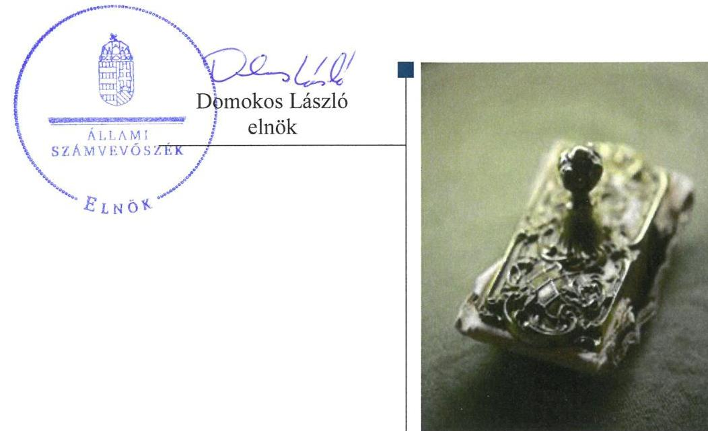
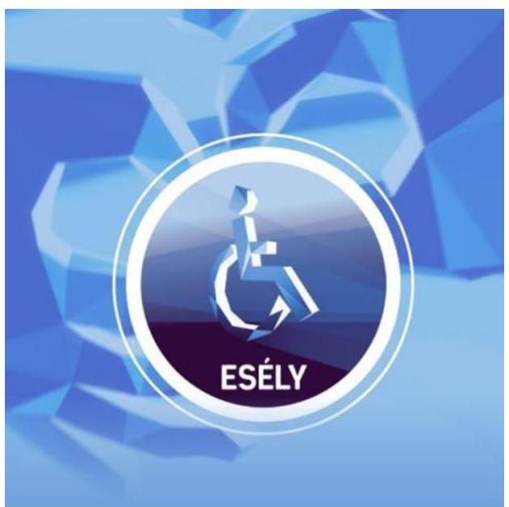
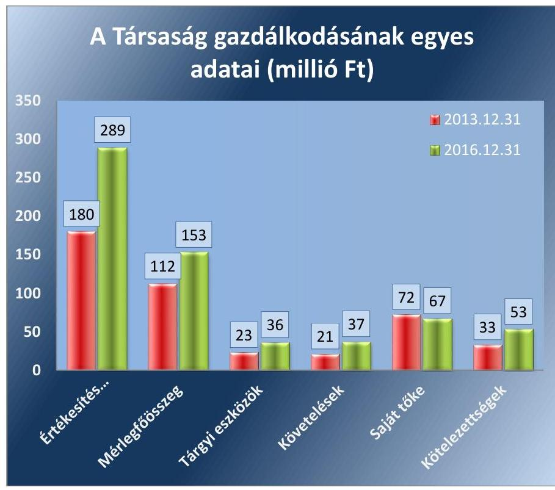
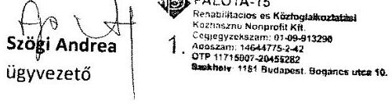
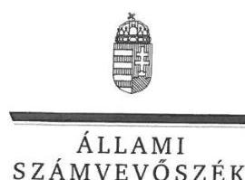
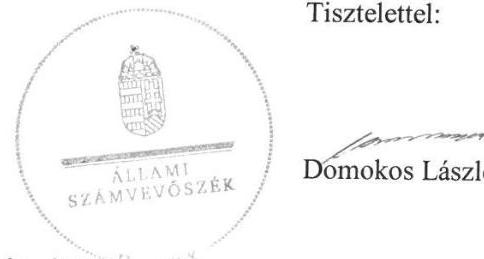
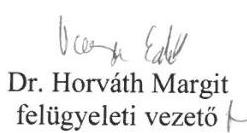

# Jelentés 

## Az önkormányzatok gazdasági társaságai

Az önkormányzatok többségi tulajdonában lévő gazdasági társaságok gazdálkodásának ellenőrzése - Palota-15 Rehabilitációs és Közfoglalkoztatási Közhasznú Nonprofit Korlátolt Felelősségű Társaság
2018.

---

# Jelenetés 

## Az önkormányzatok gazdasági társaságai

Az önkormányzatok többségi tulajdonában lévő gazdasági társaságok gazdálkodásának ellenőrzése - Palota-15 Rehabilitációs és Közfoglalkoztatási Közhasznú Nonprofit Korlátolt Felelősségű Társaság
2018. 08. hó 14. nap

---

# AZ ELLENŐRZÉST FELÜGYELTE:

DR HORVÁTH MARGIT felügyeleti vezető

## AZ ELLENŐRZÉST VEZETTE ÉS A VÉGREHAJTÁSÁÉRT FELELŐS:

SIPOSNÉ DÓCZI KLÁRA ellenőrzésvezető

## A PROGRAM ÖSSZEÁLLÍTÁSÁÉRT FELELŐS:

TÓTPÁL SZABOLCS osztályvezető

IKTATÓSZÁM: V-1401-104/2016.

TÉMASZÁM: 2447

ELLENŐRZÉS-AZONOSÍTÓ SZÁM: V079354

Jelentéseink az Országgyűlés számítógépes hálózatán és az Interneta a www.asz.hu címen is olvashatóak.

---

# TARTALOMJEGYZÉK 

■ ÖSSZEGZÉS ..... 5
■ AZ ELLENŐRZÉS CÉLJA ..... 6
■ AZ ELLENŐRZÉS TERÜLETE ..... 7
■ AZ ELLENŐRZÉS HÁTTERE, INDOKOLTSÁGA ..... 9
■ A JELENTÉS LÉNYEGES KÉRDÉSKÖREI ..... 10
■ AZ ELLENŐRZÉS HATÓKÖRE ÉS MÓDSZEREI ..... 11
■ MEGÁLLAPÍTÁSOK ..... 13
■ JAVASLATOK ..... 17
■ MELLÉKLETEK ..... 19
I. sz. melléklet: Értelmező szótár ..... 19
II. sz. melléklet: Pénzügyi adatok ..... 21
■ FÜGGELÉK: ÉSZREVÉTELEK ..... 23
■ RÖVIDÍTÉSEK JEGYZÉKE ..... 31

---

.

---

# ÖSSZEGZÉS 

Budapest Főváros XV. Kerület Rákospalota, Pestújhely, Újpalota Önkormányzata a tulajdonosi joggyakorlás kereteit szabályszerűen alakította ki, tulajdonosi jogait az előírásoknak megfelelően gyakorolta. A Palota-15 Rehabilitációs és Közfoglalkoztatási Közhasznú Nonprofit Korlátolt Felelősségű Társaság számviteli szabályozása nem felelt meg a jogszabályi előírásoknak. A Társaság vagyonnyilvántartása és vagyongazdálkodása szabályszerű volt. A közérdekü adatok nyilvánosságát, gazdálkodásának átláthatóságát nem biztositotta.

## Az ellenőrzés társadalmi indokoltsága

Magyarországon az intézmény-centrikus közfeladat-ellátás jellemző, de az önkormányzatok kötelező és önként vállalt feladataik ellátása során egyre szélesebb körben alkalmazzák a költségvetési szerveken kívüli feladatellátást. Helyi szinten ennek meghatározó szereplői az önkormányzati tulajdonban lévő gazdasági társaságok, amelyek ezáltal kiemelt fontosságú szerephez jutnak a lakossági szolgáltatások biztosításában. Az önkormányzatok többségi tulajdonában álló gazdasági társaságok ellenőrzése kiemelt jelentőségű, mivel működésük hatással van a tulajdonos önkormányzat gazdálkodására, gazdálkodásának egyes elemei befolyásolják az önkormányzati szektor hiányát és az államadósságot. Ezért alapvető követelmény, hogy gazdálkodásuk, múködésük szabályszerű és átlátható legyen.

Az Állami Számvevőszék által az egyéb szociális ellátást, valamint közfoglalkoztatási közfeladatot ellátó Társaságnál végzett ellenőrzést további társadalmi elvárás indokolja sajátos feladatellátásából adódóan, mivel tevékenységén keresztül Budapest XV. kerületi lakosságának széles köre kerül kapcsolatba a Társasággal, valamint az általa nyújtott szolgáltatásokkal.

## Főbb megállapítások, következtetések, javaslatok

Budapest Főváros XV. Kerület Rákospalota, Pestújhely, Újpalota Önkormányzata a tulajdonosi joggyakorlás kereteit a jogszabályi előírásoknak megfelelően alakította ki. A tulajdonosi joggyakorlás szabályszerű volt. A közfeladat ellátását évente megújított szerződésekkel biztosította az Önkormányzat.

A Palota-15 Rehabilitációs és Közfoglalkoztatási Közhasznú Nonprofit Korlátolt Felelősségű Társaság számviteli szabályozása a számlarend hiányossága miatt nem biztosította a bevételek és az anyagjellegú ráfordítások elszámolásának szabályszerűségét, ugyanakkor a személyi jellegű ráfordításokat szabályszerűen számolta el. Vagyongazdálkodása szabályszerű volt, vagyonához kapcsolódó nyilvántartásait a jogszabályi előírások szerint vezette. Az eszközöket és a forrásokat szabályszerű leltározással vették számba. A Társaság az előírt tervezési, beszámolási, adatszolgáltatási kötelezettségeit határidőben teljesítette. A Társaság az egyszerűsített éves beszámolók és a közhasznúsági mellékletek elkészítésére, valamint azok közzétételére vonatkozó előírásoknak az előírt határidőre és adattartalommal eleget tett. Ugyanakkor a közérdekú adatok közzétételi kötelezettségének nem tett eleget a Társaság.

---

# AZ ELLENŐRZÉS CÉLJA 

Az ellenőrzés célja annak értékelése volt, hogy az önkormányzat vagyongazdálkodási tevékenysége során szabályszerűen gyakorolta-e tulajdonosi jogait; a gazdasági társaság szabályozottsága, gazdálkodása és vagyongazdálkodási tevékenysége, bevételeinek és ráfordításainak elszámolása megfelelt-e a jogszabályi és tulajdonosi előírásoknak; a gazdasági társaság kötelezettségállománya jelentett-e kockázatot a múködésre, valamint a gazdálkodás átláthatósága és elszámoltathatósága érdekében biztosítva volt-e a szolgáltatás dijának megalapozottsága szabályszerű önköltségszámítással.

---

# **A Z ELLENŐRZÉS TERÜLETE**

## **Budapest Főváros XV. kerület Rákospalota, Pestújhely, Újpalota Önkormányzata és kizárólagos tulajdonában álló Palota-15 Rehabilitációs és Közfoglalkoztatási Közhasznú Nonprofit Korlátolt Felelősségű Társaság**

### **Budapest Főváros XV. kerület Rákospalota, Pestújhely, Újpalota Önkormányzata**

2009. február 1-én 12,9 millió forint alaptőkével alapította a 100%-os tulajdonában álló Palota-15 Rehabilitációs és Közfoglalkoztatási Közhasznú Nonprofit Kft-t, hogy a megszüntetett Budapest Főváros XV. kerületi Önkormányzat Szociális Foglalkoztatója által végzett feladat ellátás helyébe lépjen, így támogatva az Önkormányzat¹ közfeladat ellátását. A Társaság² tulajdonosi szerkezete az ellenőrzött időszakban nem változott. A törzstőke összege 2011. október 26-án 22,9 millió forintra nőtt, mely 12,2 millió forint pénzbeli és 10,7 millió forint nem pénzbeli hozzájárulásból állt.

### **A Palota-15 Rehabilitációs és Közfoglalkoztatási Közhasznú Nonprofit Kft.**

Fő tevékenysége az Önkormányzat közfeladat ellátásában közreműködő szervezetként végzett egyéb szociális ellátás, valamint a megváltozott munkaképességűek, az alacsony jövedelemmel rendelkező időskorúak, gondozásra szoruló családtagjai miatt üzemi keretek között munkát vállalni nem tudók foglalkoztatását biztosító munkahelyek üzemeltetése, fenntartása volt. 2015-ben a Társaságon belül megkezdte működését a Reintegrációs Központ, ahol új feladatként a hátrányos helyzetű munkavállalók munkához, munkahelyi környezethez való alkalmazkodásának elősegítése, és egyes szakmák oktatása történt. A Központ működése a vagyon szerkezetét nem befolyásolta.

A Társaság az Önkormányzattól vagyonkezelésbe, üzemeltetésre nem vett át vagyont, tevékenységét saját eszközeivel látta el.

Az ellenőrzött időszakban a Társaság irányítási feladatait ügyvezető igazgató, ellenőrzését három tagú Felügyelőbizottság³ látta el. A Társaság ügyvezetőjének személye az ellenőrzött időszakban nem változott. A Felügyelőbizottság személyi összetétele az ellenőrzött időszakon belül egy alkalommal, 2014 november 19-i hatállyal módosult. A Társaság számviteli beszámolóit független könyvvizsgáló auditálta a közhasznú tevékenységre tekintettel kötelező jelleggel.

A Társaság nem rendelkezett tulajdonosi részesedéssel más gazdasági társaságban. Önköltség számítási szabályzat készítésére a Szám. tv.⁴ előírásai szerint nem volt kötelezett. Árképzés módszertani kötelezettséget a Társaság szolgáltatásaira vonatkozóan sem jogszabály sem önkormányzati rendelet nem írt elő. Az ellenőrzött években nem tartozott a kormányzati

---

szektorba sorolt gazdálkodó szervezetek közé. A Társaságnál a foglalkoztatottak átlagos statisztikai létszáma 2013-ban 143 fő volt, mely 2016 év végére 198 főre emelkedett.

A Társaság gazdálkodásának egyes adatai a 2013. és 2016. évek vonatkozásában az 1. ábra szemlélteti, részleteiben a II. számú melléklet mutatja be.

1. ábra

Forrás: a Társaság 2013. és 2016. évi egyszerúsített éves beszámolói

A Társaság nettó árbevétele a 2013. évi 180 millió forintról 2016. év végére 289 millió forintra nőtt a növekvő mértékű közfeladat ellátás következtében. Eredményessége a kapott támogatások és az adott évi feladatellátás függvényében nagy különbségeket mutatott. A 2013. évi 0,3 millió forintról 5 millió forint veszteségre, majd 11 millió forint nyereségre végül 2016-ban 11 millió forint veszteségre változott. Osztalék kifizetésére a Civil tv ${ }^{5}$. előírásának megfelelően egyik évben sem került sor.

A Társaság eszközei illetve forrásai a 2013. év végi 112 millió forintról a 2016. év végére 152 millió forintra nőttek. Az eszközökön belül a forgóeszközök, a forrásokon belül a saját tőke összege volt a meghatározó. A követelések nagysága 2013-ban 21 millió forintot, 2016-ban 37 millió forintot tett ki. A rövid lejáratú kötelezettségek állománya 2013-ban 33 millió forint, 2016-ban 53 millió forint volt. Ugyanakkor a Társaság kötelezettségeinek alakulása nem jelentett kockázatot a múködésre, a szerződésen, jogszabályon alapuló rövid lejáratú kötelezettségek teljesítése biztosított volt.

Az ellenőrzött időszakban a tulajdonos önkormányzat a Társaság múködéséhez 82 millió forint támogatást nyújtott.

Az Önkormányzat polgármesterének személye az ellenőrzött időszakban egy alkalommal, a 2014. évi önkormányzati választásokat követően változott, a jegyző személyében 2014. november 20-án történt változás.

---

# AZ ELLENŐRZÉS HÁTTERE, INDOKOLTSÁGA 

Az önkormányzatok többségi tulajdonában álló gazdasági társaságok ellenőrzése kiemelten fontos a vagyon megőrzése, megóvása érdekében. A feladatellátás költségeinek, ráfordításainak alakulása a lakosság széles rétegét érinti.

Az Ász ellenőrzései feltárják, hogy az önkormányzat a feladatellátásához rendelt vagyon működtetését a tulajdonostól elvárható gondossággal végezte-e, a feladatot ellátó gazdasági társaság a létesítő okiratban, szolgáltatási szerződésben foglaltak betartásával biztosította-e a feladat ellátását. Az ellenőrzés rávilágít arra, hogy a gazdasági társaság a vagyon használatával biztosította-e a szolgáltatás folytatásának feltételeit, az önkormányzat tulajdonosi felügyelete hozzájárult-e a szabályszerű gazdálkodáshoz és feladatellátáshoz.

A megállapítások alapján megfogalmazott számvevőszéki javaslatok hasznosítása elősegíti a meglévő hibák megszüntetését. A jó gyakorlatok bemutatásával az ÁSZ ${ }^{6}$ hozzájárul a követendő megoldások megismertetéséhez, terjesztéséhez.

---

# A JELENTÉS LÉNYEGES KÉRDÉSKÖREI 

1.- Az önkormányzat tulajdonosi joggyakorlása szabályszerű volt-e?
2.- A gazdasági társaság gazdálkodása és vagyongazdálkodási tevékenysége, bevételeinek és ráfordításainak elszámolása szabályszerű volt-e?

---

# AZ ELLENŐRZÉS HATÓKÖRE ÉS MÓDSZEREI 

## Az ellenőrzés típusa

Megfelelőségi ellenőrzés

## Az ellenőrzött időszak

2013. január 1-jétől 2016. december 31-ig tartott.

## Az ellenőrzés tárgya

Budapest Főváros XV. Kerület Rákospalota, Pestújhely, Újpalota Önkormányzatának tulajdonosi joggyakorlása, valamint a Palota-15 Rehabilitációs és Közfoglalkoztatási Nonprofit Közhasznú Korlátolt Felelősségű Társaság gazdálkodásának szabályozottsága és szabályszerűsége.

Az ellenőrzés kiterjedt minden olyan körülményre és adatra, amely az ÁSZ jogszabályban meghatározott feladatainak teljesítéséhez, valamint a program végrehajtása folyamán felmerült újabb összefüggések feltárásához szükséges.

## Az ellenőrzött szervezet

- Budapest Főváros XV. Kerület Rákospalota, Pestújhely, Újpalota Önkormányzata
- Palota-15 Rehabilitációs és Közfoglalkoztatási Nonprofit Közhasznú Korlátolt Felelősségű Társaság

## Az ellenőrzés jogalapja

Az ellenőrzés jogszabályi alapját az ÁSZ tv. ${ }^{7} 1 . \S$ (3) bekezdése és az 5. § (3) - (5) bekezdései képezték.

## Az ellenőrzés módszerei

Az ellenőrzést a nemzetközi standardokat irányadónak tekintve az ellenőrzési program ellenőrzési kérdései, az ellenőrzött időszakban hatályos jogszabályok, az ellenőrzés szakmai szabályok és módszertanok figyelembe vételével végeztük.

---

Az ellenőrzés ideje alatt az ellenőrzött szervezettel történő kapcsolattartást az ÁSZ Szervezeti és Múködési Szabályzatának ${ }^{6}$ vonatkozó előírásai alapján biztosítottuk.

Az ellenőrzési kérdések megválaszolásához szükséges bizonyítékok megszerzése a következő ellenőrzési eljárások alkalmazásával történt: megfigyelés, kérdésfeltevés (információkérés), összehasonlítás, valamint elemző eljárás. Az ellenőrzési bizonyítékként felhasználható adatforrások közé tartoztak egyrészt a szakmai programban felsorolt adatforrások, másrészt minden, az ellenőrzés folyamán feltárt, az ellenőrzés szempontjából információkat tartalmazó dokumentum.

A gazdasági társaság bevételeinek és ráfordításainak elszámolása, valamint a vagyonnyilvántartás terén a szabályszerű múködést véletlen mintavétellel és irányított kiválasztással ellenőriztük. A mintatételek értékelése alapján egyrészt a sokaságban előforduló hibás tételek arányát becsültük, másrészt az irányítottan kiválasztott tételeket értékeltük. A jogszabályoknak és a belső eljárásoknak megfelelőnek, azaz szabályszerűnek tekintettük az adott területet, amennyiben a minta ellenőrzésének eredménye alapján 95\%-os bizonyossággal a teljes sokaságban a hibaarány kisebb volt, mint 10\%. Nem megfelelőnek értékeltük, ha a hibaarány a $10 \%$-ot meghaladta. A ráfordítások, azon belül az anyagjellegú-, a személyi jellegú-, az egyéb- és a pénzügyi ráfordítások elszámolására és a vagyonnyilvántartásra vonatkozó véletlen mintavételt kockázati alapú kiválasztással egészítettük ki, amelynek során évente a három legnagyobb összegű tételt választottuk ki. Az ellenőrzést a nemzetközi standardokat irányadónak tekintve az ellenőrzési program ellenőrzési kérdései, az ellenőrzött időszakban hatályos jogszabályok, az ellenőrzés szakmai szabályok és módszertanok figyelembe vételével végeztük.

Az ellenőrzést a kérdésekre adott válaszok kiértékelésével, valamint a megjelölt adatforrások, a tanúsítványok felhasználásával, továbbá az adott időszakban hatályos jogszabályok figyelembe vételével folytattuk le.

---

# 1. Az önkormányzat tulajdonosi joggyakorlása szabályszerű volt-e? 

Összegző megállapítás A tulajdonosi joggyakorlás szabályszerű volt.

A TULAJ DONOSI JOGGYAKORLÁS KERETEIT az Önkormányzat Képviselő-testülete ${ }^{9}$, mint a Társaság alapítója és annak Taggyúlési hatáskörben eljáró legfőbb szerve a Társaság Alapító okirat ${ }_{15}{ }^{10}$ ben, az önkormányzati SZMSZ ${ }^{11}$-ben, valamint a Vagyonrendeletben ${ }^{12}$ továbbá az évenkénti költségvetési ${ }^{13}$-és zárszámadási rendeleteiben ${ }^{14}$ a jogszabályi előírásoknak megfelelően határozta meg. A közfeladat ellátásának feltételeit az Önkormányzat és a Társaság között évente megújított Fel-adat-ellátási szerződések ${ }^{15}$ tartalmazták.

Az Alapító ${ }^{16}$ a Taktv. ${ }^{17}$-ben foglaltaknak megfelelően szabályzatban rendelkezett a vezető tisztségviselők, a felügyelő-bizottsági tagok, valamint az Mt. ${ }^{18}$ 208. § hatálya alá tartozó munkavállalók javadalmazásának, valamint jogviszonyuk megszűnése esetére biztosított juttatások módjának, mértékének elveiről, annak rendszeréről.

A TULAJ DONOSI JOGOKAT az Alapító a Gt. ${ }^{19}$, illetve annak hatálybalépését követően a Ptk. ${ }^{20}$, valamint a Civil tv. előírásainak megfelelően gyakorolta.

Az Alapító a tulajdonosi ellenőrzést valamint a Gt. illetve a Ptk. előírásai szerinti tulajdonosi joggyakorlást a Felügyelő-bizottságon keresztül, valamint az éves üzleti terv, az évközi és az éves beszámolók elfogadásával, az éves eredmény felhasználásáról szóló döntéseivel biztosította. Az Alapító a Felügyelő-bizottság jelentését és a könyvvizsgáló írásos véleményét figyelembe véve határozatokban döntött a Társaság egyszerűsített éves beszámolóinak elfogadásáról, valamint az adózott eredmény eredménytartalékba történő helyezéséről. Az Alapító a Civil tv. előírásainak megfelelően az éves beszámolók elfogadásával egyidejűleg fogadta el a Társaság közhasznú működését bemutató közhasznúsági mellékleteket.

Az Önkormányzat 2014-ben élt az Áht. ${ }^{21}$-ban számára biztosított lehetőséggel, hogy ellenőrizze a Társaságot. A működés- és a gazdálkodás szabályszerűségét érintő, az önkormányzati ellenőrzés által megfogalmazott javaslatokra ${ }^{22}$ vonatkozóan megtett intézkedésekről a Társaság beszámolt az Alapítónak.

---

# 2. A gazdasági társaság gazdálkodása és vagyongazdálkodási tevékenysége, bevételeinek és ráfordításainak elszámolása szabályszerű volt-e? 

Összegző megállapítás

A Társaság számviteli szabályozása nem biztosította az elszámolások szabályszerűségét. A Társaság vagyongazdálkodása szabályszerű volt az ellenőrzött időszakban. A bevételek és a ráfordítások elszámolása a személyi jellegú ráfordítások elszámolása kivételével nem volt szabályszerű, valamint nem gondoskodott a közérdekú adatok közzétételéről.
2.1. számú megállapítás

A Társaság a kötelező számviteli szabályzatokkal rendelkezett, azonban szabályozottsága a szabályzatok hiányosságai miatt nem felelt meg a jogszabályi előírásoknak.

SZÁMVITELI SZABÁLYZATOKKAL, Számviteli politikával ${ }^{23}$, annak részeként Számlarenddel ${ }^{24}$, az Eszközök és források leltárkészítési és leltározási szabályzatával ${ }^{25}$, az Eszközök és források értékelési szabályzatával ${ }^{26}$, valamint Pénzkezelési szabályzattal ${ }^{27}$ rendelkezett a Társaság, ezzel megfelelt a Számv. tv. 14. § (5) bekezdésében előírtaknak.

AZ ESZKÖZÖK ÉS FORRÁSOK ÉRTÉKELÉSI SZABÁLYZATA az értékcsökkenési leírás egyösszegú elszámolhatóságát a 200 ezer Ft egyedi értékhatárt el nem érő eszközökre engedélyezte, amivel a Társaság megsértette a Számv. tv. 80. § (2) bekezdésében előírtakat.

A PÉNZKEZELÉSI SZABÁLYZAT nem szabályozta a készpénzforgalom lebonyolításának szabályai keretén belül a pénzkezelés személyi feltételeit, valamint a készpénz ellenőrzésének eljárásrendjét, amivel a Társaság megsértette a Számv. tv. 14. § (8) bekezdésében előírtakat.

A SZÁMLAREND nem felelt meg a Számv. tv. 161. § (2) bekezdés b) és c) pontjaiban előírtaknak, mert nem minden, a Társaság által alkalmazott számla - köztük a közhasznú tevékenységhez kapcsolódó elkülönített nyilvántartásra alkalmazott számla - esetében tartalmazta a számla értéke növekedésének, csökkenésének jogcímeit, a számlát érintő gazdasági eseményeket, azok más számlákkal való kapcsolatát, valamint a főkönyvi számla és az analitikus nyilvántartás kapcsolatát. Ezzel a Társaság nem teljesítette a Civil tv. 19. §-ának és a Számv. tv. 161/A. § (2) bekezdésének előírásait.

A Számviteli politika, az Eszközök és források leltárkészítési és leltározási szabályzata megfelelt a Számv. tv. rendelkezéseinek.

---

2.2. számú megállapítás

A bevételek és ráfordítások elszámolása a személyi jellegú ráfordítások valamint az értékcsökkenés elszámolásának kivételével nem volt szabályszerű. A Társaság vagyongazdálkodási tevékenysége megfelelt a jogszabályi rendelkezéseknek.

A számviteli elszámolásokra kihatott, hogy a Számlarend nem felelt meg a Számv. tv. előírásainak.

A BEVÉTELEK ELSZÁMOLÁSA nem volt szabályszerű, mivel a Társaság megsértette a Számv. tv. 167. § (1) bekezdés h) pontjának előírásait, mert nem volt megfelelő az érintett könyvviteli számlákra történő hivatkozás.

A RÁFORDÍTÁSOK ELSZÁMOLÁSÁN belül a személyi jellegű ráfordítások elszámolása szabályszerű volt. Ugyanakkor az anyagjellegű ráfordítások elszámolása nem volt szabályszerű, mivel a Társaság megsértette a Számv. tv. 167. § (1) bekezdés h) pontjának előírásait, mert nem volt megfelelő az érintett könyvviteli számlákra történő hivatkozás.

A TÁRSASÁG VAGYONGAZDÁLKODÁSA megfelelt a jogszabályi rendelkezéseknek és a belső előírásoknak. A Társaság a vagyonnyilvántartását a Számv. tv. előírásaival és belső szabályzataival összhangban vezette, eszközeinek értékcsökkenését szabályszerűen számolta el.

AZ ESZKÖZÖK ÉS FORRÁSOK LELTÁROZÁSA szabályszerű volt. A Számv. tv-ben és a Leltározási szabályzatban foglaltak szerint leltároztak, és támasztották alá az éves beszámolók mérlegtételeit.

A Társaság rövid lejáratú szerződésen és jogszabályon alapuló kötelezettségeinek teljesítése az ellenőrzött időszakban biztosított volt, a kötelezettségállomány alakulása nem jelentett kockázatot a múködésre.
2.3. számú megállapítás

A Társaság az egyszerűsített éves beszámolókra valamint a közhasznú tevékenységre vonatkozó közzétételi kötelezettségeinek eleget tett, ugyanakkor a közérdekú adatok közzétételéről nem gondoskodott.

AZ ÜZLETI TERV KÉSZÍTÉSÉVEL kapcsolatos előírásokat a Társaság Szervezeti és Müködési Szabályzata ${ }_{1,2}{ }^{28}$ tartalmazta. Az üzleti terveit a Társaság minden évben elkészítette, az Alapító az SZMSZ ${ }_{1,2}$ előírásának megfelelően az éves terveket határozattal jóváhagyta.

A BESZÁMOLÓK KÖZZÉTÉTELI KÖTELEZETTSÉGÉNEK a Társaság a tulajdonosi joggyakorló által elfogadott egyszerűsített éves beszámolók valamint a közhasznúsági mellékletek megfelelő határidőben történő letétbe helyezésével és közzétételével a Számv. tv.-ben és a Civil tv.-ben foglaltak szerint tett eleget.

A KÖZÉRDEKŰ ADATOK megismerésére irányuló igények teljesítésének rendjét rögzítő szabályzatát a Társaság nem alkotta meg, ezzel megsértették az Info tv. 30. § (6) bekezdésében előírtakat. A Társaság nem tartotta be az Info. tv. 35. § (3) bekezdés előírásait, mert a közzétételi szabályzata ${ }^{29}$ nem tartalmazta az adatfelelős szervre vonatkozó, az

---

Info. tv. 37. §-ban meghatározott közzétételi listákon szereplő adatok pontos, naprakész és folyamatos közzétételére vonatkozó kötelezettség teljesítésének részletes szabályait. A Társaság megsértette az Info tv. 33. § (1) és (3) bekezdéseinek valamint a 37. §-nak az előírásait, mert nem tette közzé a törvény 1. melléklet I. Szervezeti, személyzeti adatok részben, valamint a III. Gazdálkodási adatok részben a közfeladatot ellátó Társaságra meghatározott szervezeti, tevékenységi, működési és gazdálkodási adatokat. Ugyanakkor a Társaság a vezető tisztségviselőkre és a felügyelőbizottsági tagokra vonatkozó adatokat a Taktv.-ben előírt tartalommal a honlapján közzétette.

---

# JAVASLATOK 

Az ÁSZ tv. 33. § (1) bekezdésében foglaltak értelmében az ellenőrzött szervezet vezetője köteles a jelentésben foglalt megállapításokhoz kapcsolódó intézkedési tervet összeállítani és azt a jelentés kézhezvételétől számított 30 napon belül az ÁSZ részére megküldeni. Amennyiben az ellenőrzött szervezet vezetője nem küldi meg határidőben az intézkedési tervet, vagy továbbra sem elfogadható intézkedési tervet küld, az Állami Számvevőszék elnöke az ÁSZ tv. 33. § (3) bekezdése a) és b) pontjaiban foglaltakat érvényesitheti.
Javaslataink célja a Palota-15 Rehabilitációs és Közfoglalkoztatási Közhasznú Nonprofit Korlátolt Felelősségű Társaság gazdálkodása szabályszerűségének és gyakorlatának javítása annak érdekében, hogy a szabályozási környezet és az alkalmazott gyakorlat megfelelően tudja támogatni az átlátható müködést.

## Palota-15 Rehabilitációs és Közfoglalkoztatási Közhasznú Nonprofit Korlátolt Felelősségű Társaság ügyvezetőjének

1. Intézkedjen a számviteli szabályzatok módosításáról a hatályos Számv. tv. előirásainak megfelelően.
(2.1. sz. megállapítás 2-4. bekezdései alapján)
2. Intézkedjen a bevételek Számv. tv előírásainak megfelelő elszámolása érdekében.
(2.2. sz. megállapítás 2. bekezdése alapján)
3. Intézkedjen az anyagjellegü ráfordítások Számv. tv. előírásainak megfelelő elszámolása érdekében.
(2.2. sz. megállapítás 3. bekezdés 2. mondata alapján)
4. Intézkedjen a közérdekü adatok megismerésére irányuló igények teljesittési rendjének szabályozásáról az Info tv. előírásainak megfelelően.
(2.3. sz. megállapítás 3. bekezdés 1. mondata alapján)
5. Intézkedjen a közzétételi szabályzat módosításáról az Info tv. előírásainak megfelelően.
(2.3. sz. megállapítás 3. bekezdés 2. mondata alapján)
6. Intézkedjen a közzétételi kötelezettségének teljesítéséről az Info tv. előírásainak megfelelően.
(2.3. sz. megállapítás 3. bekezdés 3. mondata alapján)

---

.

---

# MELLÉKLETEK 

- I. SZ. MELLÉKLET: ÉRTELMEZŐ SZÓTÁR
gazdasági társaság
gazdálkodó szervezet
meghatározó befolyás
minősített többséget biztosító részesedés
nemzeti vagyon
nonprofit gazdasági társaság
többségi befolyást biztosító részesedés
vagyonkezelő

Ptk 3.88. § (1) bekezdése szerint „a gazdasági társaságok üzletszerű közös gazdasági tevékenység folytatására, a tagok vagyoni hozzájárulásával létrehozott, jogi személyiséggel rendelkező vállalkozások, amelyekben a tagok a nyereségből közösen részesednek, és a veszteséget közösen viselik".
A Ptk. 685. § c) pontja szerint gazdálkodó szervezet: „az állami vállalat, az egyéb állami gazdálkodó szerv, a szövetkezet, a lakásszövetkezet, az európai szövetkezet, a gazdasági társaság, az európai részvénytársaság, az egyesülés, az európai gazdasági egyesülés, az európai területi együttműködési csoportosulás, az egyes jogi személyek vállalata, a leányvállalat, a vízgazdálkodási társulat, az erdő birtokossági társulat, a végrehajtói iroda, az egyéni cég, továbbá az egyéni vállalkozó." (2014. 03.15-ig hatályos)

A Ptk. 8:2. § (2) bekezdése szerint „A befolyással rendelkező akkor rendelkezik egy jogi személyben meghatározó befolyással, ha annak tagja vagy részvényese, és
a) jogosult e jogi személy vezető tisztségviselői vagy felügyelőbizottsága tagjai többségének megválasztására, illetve visszahívására; vagy
b) a jogi személy más tagjai, illetve részvényesei a befolyással rendelkezővel kötött megállapodás alapján a befolyással rendelkezővel azonos tartalommal szavaznak, vagy a befolyással rendelkezőn keresztül gyakorolják szavazati jogukat, feltéve, hogy együtt a szavazatok több mint felével rendelkeznek."
A minősített befolyásszerző az ellenőrzött társaságban a szavazatok legalább hetvenöt százalékával rendelkezik. (Ptk. 3:324. §)
Nvtv. 1. § (2) bekezdése szerint többek között: „az állam vagy a helyi önkormányzat kizárólagos tulajdonában álló dolgok,
az a) pont hatálya alá nem tartozó, állam vagy a helyi önkormányzat tulajdonában lévő dolog,
az állam vagy a helyi önkormányzat tulajdonában lévő pénzügyi eszközök, továbbá az államot vagy a helyi önkormányzatot megillető társasági részesedések,
az államot vagy a helyi önkormányzatot megillető bármely vagyoni értékkel rendelkező jogosultság, amelyet jogszabály vagyoni értékű jogként nevesít."
Civil tv. 9/F. § (2) bekezdése szerint „az a gazdasági társaság minősül nonprofit gazdasági társaságnak és cégnevében az a gazdasági társaság tüntetheti fel a nonprofit jelleget, amelynek létesítő okirata tartalmazza, hogy a gazdasági társaság tevékenységéből származó nyereség a tagok között nem osztható fel, hanem az a gazdasági társaság vagyonát gyarapítja." (hatályos 2014. március 15-től)
A Ptk. 8:2. § (1) bekezdése szerint „többségi befolyás az olyan kapcsolat, amelynek révén természetes személy vagy jogi személy (befolyással rendelkező) egy jogi személyben a szavazatok több mint felével vagy meghatározó befolyással rendelkezik."
vagyonkezelő:
a) az állam tulajdonában álló nemzeti vagyon tekintetében:
aa) költségvetési szerv,
ab) helyi önkormányzat, önkormányzati társulás,
ac) önkormányzati intézmény,
ad) köztestület,

---

ae) az állam, az aa)-ac) alpontban meghatározott személyek együtt vagy külön-külön 100\%-os tulajdonában álló gazdálkodó szervezet,
af) az ae) alpont szerinti gazdálkodó szervezet 100\%-os tulajdonában álló gazdálkodó szervezet,
ag) a törvény által kijelölt egyedileg meghatározott jogi személy.
b) a helyi önkormányzat tulajdonában álló nemzeti vagyon tekintetében:
ba) önkormányzati társulás,
bb) költségvetési szerv vagy önkormányzati intézmény,
bc) köztestület,
bd) az állam, a helyi önkormányzat, a ba)-bb) alpontban meghatározott személyek együtt vagy külön-külön 100\%-os tulajdonában álló gazdálkodó szervezet,
be) a bd) alpont szerinti gazdálkodó szervezet 100\%-os tulajdonában álló gazdálkodó szervezet.
c) az egyházi jogi személy a tevékenysége ellátásához szükséges nemzeti vagyon tekintetében. (Forrás: Nvtv. 3. § (1) bekezdés 19. pontja)

---

# A TÁRSASÁG EGYSZERŰSÍTETT ÉVES BESZÁMOLÓINAK ADATAI (MILLIÓ FORINT) 

| Megnevezés | 2013.01.01. | 2013.12.31. | 2014.12.31. | 2015.12.31. | 2016.12.31. |
| :--: | :--: | :--: | :--: | :--: | :--: |
| Befektetett eszközök | 27 | 24 | 28 | 32 | 38 |
| Immateriális javak | 0 | 1 | 0 | 0 | 2 |
| Tárgyi eszközök | 27 | 23 | 28 | 32 | 36 |
| Befektetett pénzügyi eszközök | 0 | 0 | 0 | 0 | 0 |
| Forgóeszközök | 47 | 77 | 79 | 104 | 105 |
| Készletek | 8 | 12 | 11 | 16 | 18 |
| Követelések | 17 | 21 | 14 | 22 | 37 |
| Értékpapírok | 0 | 0 | 0 | 0 | 0 |
| Pénzeszközök | 22 | 44 | 54 | 66 | 50 |
| Aktív időbeli elhatárolások | 6 | 11 | 14 | 13 | 8 |
| Saját tőke | 72 | 72 | 67 | 78 | 67 |
| Jegyzett tőke | 23 | 23 | 23 | 23 | 23 |
| Töketartalék | 17 | 17 | 17 | 17 | 17 |
| Eredménytartalék | 32 | 32 | 32 | 27 | 38 |
| Lekötött tartalék | 0 | 0 | 0 | 0 | 0 |
| Értékelési tartalék | 0 | 0 | 0 | 0 | 0 |
| Mérleg szerinti eredmény |  | 0 | $-5$ | 11 | $-11$ |
| Céltartalék | 0 | 0 | 0 | 0 | 0 |
| Kötelezettségek | 8 | 33 | 40 | 42 | 53 |
| Hosszú lejáratú kötelezettségek | 0 | 0 | 0 | 0 | 0 |
| Rövid lejáratú kötelezettségek | 8 | 33 | 40 | 42 | 53 |
| Passzív időbeli elhatárolás | 0 | 7 | 14 | 29 | 32 |
| MÉRLEG FŐÓSSZEG | 80 | 112 | 121 | 149 | 152 |
| Értékesítés nettó árbevétele | - | 180 | 240 | 263 | 289 |
| Egyéb bevételek | - | 88 | 117 | 124 | 156 |
| Anyagjellegú ráfordítások | - | 46 | 78 | 58 | 84 |
| Személyi jellegú ráfordítások | - | 214 | 271 | 305 | 354 |
| Értékcsökkenési leírás | - | 7 | 8 | 11 | 15 |
| Egyéb ráfordítások | - | 1 | 5 | 2 | 3 |
| Üzemi tevékenység eredménye | - | 0 | $-5$ | 11,0 | $-11-$ |
| Pénzügyi műveletek eredménye | - | 0 | 0 | 0 | 0 |
| Rendkívüli eredmény | - | 0 | 0 | 0 | - |
| Mérleg szerinti eredmény* | - | 0,3 | $-5$ | 11 | $-11^{*}$ |

* A 2016. évtől adózott eredmény.

---

.

---

# FÜGGELÉK: ÉSZREVÉTELEK 

A jelentéstervezetet a Számvevőszék 15 napos észrevételezésre megküldte az ellenőrzött szervezetek vezetőinek az ÁSZ tv. 29. §* (1) bekezdése előírásának megfelelően.

A Palota-15 Rehabilitációs és Közfoglalkoztatási Közhasznú Nonprofit Korlátolt Felelősségű Társaság ügyvezetőjének észrevételeit, azok kezeléséről szóló válaszlevelet, a felügyeleti vezetői tájékoztatást a jelentés függeléke tartalmazza.
Az észrevételek alapján a jelentés nem módosult. Budapest Főváros XV. kerület Rákospalota, Pestújhely, Újpalota Önkormányzatának polgármestere nem tett észrevételt.

[^0]
[^0]:    * 29. § (1) Az Állami Számvevőszék az ellenőrzési megállapításait megküldi az ellenőrzött szervezet vezetőjének vagy az általa megbízott személynek, és annak, akinek személyes felelősségét állapította meg.
    (2) Az ellenőrzött szervezet vezetője és a felelősként megjelölt személy az ellenőrzés megállapításaira tizenöt napon belül írásban észrevételt tehet.
    (3) Az Állami Számvevőszék az észrevételre a beérkezésétől számított harminc napon belül írásban válaszol. A figyelembe nem vett észrevételeket köteles a jelentésben feltüntetni, és megindokolni, hogy azokat miért nem fogadta el.

---

# A KOMPLEX MEGOLDÁSOK HELYE 

Iktatószám: ad EGY- 00337

## Állami Számvevőszék

1052 Budapest, Apáczai Csere János u. 10.
Siposné Dóczi Klára
ellenőrzésvezető részére

Tárgy: észrevétel számvevőszéki jelentéstervezetre
Ellenőrzés-azonosító szám: V079354

ÁLLAMI SZÁMVEVŐSZÉK
ÜGYVITELI IRODA
B6-34559/2018/1
20180619
hivatkozám: U-1401-100/2016
Hozzááza:

## Tisztelt Állami Számvevőszék!

Az önkormányzatok többségi tulajdonában lévő gazdasági társaságok gazdálkodásának ellenőrzése témakörében a PALOTA-15 Nonprofit Kft.-t (Társaságunkat) Tisztelt Állami Számvevőszék a 2013-2016. gazdálkodási évek vonatkozásában ellenőrizte. Hivatkozással a 2018. május 31-én kézhez kapott Számvevőszéki jelentéstervezetben foglaltakra Társaságunk az alábbi észrevételeket kívánja tenni.

A megállapítások alapján megfogalmazott számvevőszéki javaslatok hasznosságát tisztelettel fogadtuk, és mindent megteszünk a feltárt hiányosságok kijavítására.

## 1. számú észrevétel:

hivatkozással a számvevőszéki jelentéstervezet 2.1. számú megállapításában foglaltakra, valamennyi a Számviteli törvény (Sztv.) által kötelezően elkészítendő szabályzatunkat, közte az eszközök és források értékelési szabályzatát, a pénzkezelési szabályzatot, illetve a számlarendet Társaságunk a vonatkozó hatályos jogszabályoknak történő maradéktalan megfelelés figyelembevétele mellett a 2017. gazdálkodási évben új, egységes szerkezetben elkészítette.

Kérjük, T. Számvevőszéket, hogy a végleges Számvevőszéki jelentésben szíveskedjék figyelembe venni ez irányú jogszabálykövető törekvéseinket, miszerint a hiányosságokat már kijavítottuk.

## 2. számú észrevétel:

hivatkozással a számvevőszéki jelentéstervezet 2.2. számú megállapításában foglaltakra, Társaságunk is szembesült a számviteli bizonylatok kontírozásának szabályszerűségét érintő hiányosságaival, azonban összhangban a 1. számú észrevételünkben foglaltakban leírtakra, számlarendünket a Számviteli törvény 167. § (1) h) pontjában foglalt előírások betartása mellett alakítottuk ki, így mind a bevételek, mind a ráfordítások számviteli elszámolása során figyelünk T. Számvevőszék megállapításában foglaltak kijavítására.

---

Mindemelett, mivel nem pontosan világos Táraságunk számára, hogy konkrétan mely gazdálkodási éveket érinti a megállapítás, kérjük T. Számvevőszéket, hogy jelölje meg az érintett gazdasági évet, amelyben megsértettük a Sztv. 167. § (1) h) pontját.

Kérjük, T. Számvevőszéket, hogy a végleges Számvevőszéki jelentésben szíveskedjék figyelembe venni ez irányú jogszabálykövető törekvéseinket, miszerint a hiányosságokat már kijavítottuk.

# 3. számú észrevétel: 

hivatkozással a számvevőszéki jelentéstervezet 2.3. számú megállapításában foglaltakra, észrevételezzük, hogy Társaságunk rendelkezik a közérdekú adatok nyilvános megismerhetőségére irányuló szabályzattal, melyet „Közzététel rendje" címmel a vizsgálat során a Számvevőszék rendelkezésére bocsájtottunk. Társaságunk a közzététel rendjére vonatkozó szabályzata jelenleg felülvizsgálat, átdolgozás alatt áll..

Kérjük, T. Számvevőszéket, hogy a végleges Számvevőszéki jelentésben szíveskedjék figyelembe venni jogszabálykövető törekvéseinket, miszerint a hiányosságokat már kijavítottuk és észrevételeinket a jelentésben feltüntetni szíveskedjenek.

Ezúton köszönjük meg T. Számvevőszék Társaságunkra fordított munkáját és a megfogalmazott javaslatokat.

Budapest, 2018.06.13.

## Tisztelettel:

---

ELNÖK

Ikt.szám: V-1401-101/2016.

# Szögi Andrea úrhölgy 

ügyvezető
PALOTA-15 Rehabilitációs és Közfoglalkoztatási Közhasznú Nonprofit Korlátolt Felelősségű Társaság

## Budapest

## Tisztelt Ügyvezető Úrhölgy!

Köszönettel vettem „Az önkormányzatok gazdasági társaságai - Az önkormányzatok többségi tulajdonában lévő gazdasági társaságok gazdálkodásának ellenőrzése - Palota-15 Rehabilitációs és Közfoglalkoztatási Közhasznú Nonprofit Korlátolt Felelősségü Társaság" című ellenőrzésről készített számvevőszéki jelentéstervezetre megküldött észrevételeit.
Az Állami Számvevőszék észrevételekre vonatkozó álláspontját a felügyeleti vezető által készített részletes tájékoztatás tartalmazza, amelyet levelemhez mellékeltem.
Tájékoztatom Ügyvezető úrhölgyet, hogy az Állami Számvevőszék a figyelembe nem vett észrevételeket az Állami Számvevőszékről szóló 2011. évi LXVI. törvény 29. § (3) bekezdésében előírtak szerint köteles a jelentésében feltüntetni és megindokolni, hogy azokat miért nem fogadta el.

Budapest, 2018. 07 hó 74 nap

Melléklet: Tájékoztatás az észrevételek kezeléséről

---

# Tájékoztatás az észrevételek kezeléséről 

Megköszönöm Ügyvezető úrhölgynek „Az önkormányzatok gazdasági társaságai - Az önkormányzatok többségi tulajdonában lévő gazdasági társaságok gazdálkodásának ellenőrzése -Palota-15 Rehabilitációs és Közfoglalkoztatási Közhasznú Nonprofit Korlátolt Felelősségü Társaság" címmel készített jelentés-tervezetre tett észrevételeit. Az észrevételek kezeléséről az alábbi tájékoztatást adom.

## 1. számú észrevétel:

Az 1. számú észrevétel a jelentéstervezet 2.1. számú megállapítás 2-4. bekezdésben tett megállapításokat, továbbá az ügyvezetőnek címzett 1. számú javaslatot érintette.

Ügyvezető úrhölgy a következő észrevételt tette:
,,hivatkozással a számvevőszéki jelentéstervezet 2.1. számú megállapításában foglaltakra, valamennyi a Számviteli törvény (Sztv.) által kötelezően elkészítendő szabályzatunkat, közte az eszközök és források értékelési szabályzatát, a pénzkezelési szabályzatot, illetve a számlarendet Társaságunk a vonatkozó hatályos jogszabályoknak történő maradéktalan megfelelés figyelembevétele mellett a 2017. gazdálkodási évben új, egységes szerkezetben elkészítette.
Kérjük, T. Számvevőszéket, hogy a végleges Számvevőszéki jelentésben szíveskedjék figyelembe venni ez irányú jogszabálykövető törekvéseinket, miszerint a hiányosságokat már kijavítottuk."
Ügyvezető úrhölgy észrevételében leírtak alapján a 2.1. számú megállapítás 2-4. bekezdésben tett megállapításokat, továbbá az ügyvezetőnek címzett 1. számú javaslatot nem módosítom az alábbiak miatt:

Ügyvezető úrhölgy a jelentéstervezetben foglalt megállapítások helytállóságát nem vitatja, arról tájékoztat, hogy az ellenőrzési időszakot követően megtörtént a szabályzatok hiányosságainak kiküszöbölése. Az ellenőrzés lefolytatására az EL-0047-001/2017. iktatószámú ellenőrzési programban foglaltak alapján a 2013-2016. évek közötti időszakot érintően került sor. Az Állami Számvevőszék (ÁSZ) megállapításait és javaslatait az ellenőrzött időszakra vonatkozóan, az adatbekérés során rendelkezésre bocsátott adatok alapján tette meg. Így a jelentésben az ellenőrzött időszakot követően tett intézkedések, azok eredménye nem vehető figyelembe. Az ellenőrzött időszakot követő intézkedések az ellenőrzési javaslataink kapcsán a Társaság által készítendő intézkedési tervbe beépíthetők.

Mindezek alapján a jelentéstervezet megállapításai változatlanul helytállóak, így Ügyvezető úrhölgynek tett javaslatot sem módosítom.

## 2. számú észrevétel:

A 2. számú észrevétel a jelentéstervezet 2.2. számú megállapítás 2. és 3. bekezdéseket, valamint az ügyvezetőnek címzett 2. és 3. számú javaslatot érintette:

Ügyvezető úrhölgy a következő észrevételt tette:
,,hivatkozással a számvevőszéki jelentéstervezet 2.2. számú megállapításában foglaltakra, Társaságunk is szembesült a számviteli bizonylatok kontírozásának szabályszerűségét érintő

---

hiányosságaival, azonban összhangban a 1. számú észrevételünkben foglaltakban leírtakra, számlarendünket a Számviteli törvény 167. § (1) h) pontjában foglalt elöirások betartása mellett alakitottuk ki, igy mind a bevételek, mind a ráforditások számviteli elszámolása során figyelünk T. Számvevôszék megállapításában foglaltak kijavitására.
Mindemellett, mivel nem pontosan világos Táraságunk számára, hogy konkrétan mely gazdálkodási éveket érinti a megállapítás, kérjük T. Számvevőszéket, hogy jelölje meg az érintett gazdasági évet, amelyben megsértettük a Sztv. 167. § (1) h) pontját.
Kérjük, T. Számvevôszéket, hogy a végleges Számvevôszéki jelentésben szíveskedjék figyelembe venni ez irányú jogszabálykövetô törekvéseinket, miszerint a hiányosságokat már kijavitottuk."
Ügyvezető úrhölgy észrevételében leírtak alapján a 2.2. számú megállapítás 2. és 3. bekezdéseit, valamint az ügyvezetőnek címzett 2. és 3. számú javaslatot nem módosítom az alábbiak miatt:

Ügyvezető úrhölgy a jelentéstervezetben foglalt megállapítások helytállóságát nem vitatja, arról tájékoztat, hogy az ellenőrzési időszakot követően megtörtént a számlarend hiányosságainak kiküszöbölése. Az ellenőrzés lefolytatására az EL-0047-001/2017. iktatószámú ellenőrzési programban foglaltak alapján a 2013-2016. évek közötti időszakot érintően került sor. Az ÁSZ megállapításait és javaslatait az ellenőrzött időszakra vonatkozóan, az adatbekérés során rendelkezésre bocsátott adatok alapján tette meg. Így a jelentésben az ellenőrzött időszakot követően tett intézkedések, azok eredménye nem vehető figyelembe. Az ellenőrzött időszakot követő intézkedések az ellenőrzési javaslataink kapcsán a Társaság által készítendő intézkedési tervbe beépíthetők.

Az ellenőrzés során a szabályszerű működést véletlen mintavétellel ellenőriztük. A mintavétellel ellenőrzött területek esetében minden egyes tétel vonatkozásában a szabályszerűségre vonatkozó kérdéseket tettünk fel, amelyek eredménye összesítésre került. Megfelelőnek értékeltünk egy ellenőrzött területet, amennyiben $95 \%$-os bizonyossággal a teljes sokaságban az átlagos hibaarány legfeljebb $10 \%$, nem megfelelőnek, amennyiben $10 \%$-nál magasabb arányt képviselt. A Társaság által az ellenőrzés számára rendelkezésre bocsátott mintatételek esetében a fenti eljárás alapján olyan nagyságrendű hiányos dokumentálást találtunk, amely szerint a bevételek és az anyagi jellegủ ráfordítások elszámolása összességében nem minősült szabályszerűnek. Tájékoztatom Ügyvezető úrhölgyet, hogy az ellenőrzött időszakban a bevételek és a ráfordítások fökönyvi számlája nem szerepelt a számlarendben, mely miatt nem volt megállapítható, hogy a megfelelő főkönyvi számlákra történt-e az elszámolás.

Mindezek alapján a jelentéstervezet megállapításai változatlanul helytállóak, így Ügyvezető úrhölgynek tett javaslatokat sem módosítom.

# 3. számú észrevétel: 

A 3. számú észrevétel a jelentéstervezet 2.3. számú megállapítás 3. bekezdését, valamint az ügyvezetőnek címzett 4. számú javaslatot érintette:

Ügyvezető úrhölgy a következő észrevételt tette:
„hivatkozással a számvevőszéki jelentéstervezet 2.3. számú megállapításában foglaltakra, észrevételezzük, hogy Társaságunk rendelkezik a közérdekü adatok nyilvános megismerhetőségére irányuló szabályzattal, melyet „Közzététel rendje" címmel a vizsgálat során a Számvevőszék

---

rendelkezésére bocsájtottunk. Társaságunk a közzététel rendjére vonatkozó szabályzata jelenleg felülvizsgálat, átdolgozás alatt áll."

Ügyvezető úrhölgy észrevételében leírtak alapján a 2.3. számú megállapítás 3. bekezdését, valamint az ügyvezetőnek címzett 4. számú javaslatot nem módosítom az alábbiak miatt:

Az ellenőrzés rendelkezésére bocsátott dokumentumok ismételt felülvizsgálatát követően megállapítottam, hogy a Társaság által az ellenőrzés rendelkezésére bocsátott - „A közzététel rendje" elnevezésủ - dokumentum nem tartalmazza a közérdekủ adatok megismerésére irányuló igények teljesítésének rendjét. Így a jelentéstervezet megállapítása változatlanul helytálló, ezért a javaslatot sem módosítom.

Tájékoztatom Ügyvezető úrhölgyet, hogy észrevételének utolsó részében jelzettek figyelembe vétele megtörténik a végleges számvevőszéki jelentésben, mert az Ön által tett észrevételeket és az arra adott választ a jelentés függelékében feltüntetjük.

Budapest, 2018. július hó 11 . nap

---

.

---

# RÖVIDÍTÉSEK JEGYZÉKE 

${ }^{1}$ Önkormányzat
${ }^{2}$ Társaság
${ }^{3}$ Felügyelőbizottság
${ }^{4}$ Számv. tv.
${ }^{5}$ Civil tv.
${ }^{6}$ ÁSZ
${ }^{7}$ ÁSZ tv.
${ }^{8}$ ÁSZ Szervezeti és Müködési Szabályzat
${ }^{9}$ Képviselő-testület
${ }^{10}$ Alapító okirat ${ }_{1-5}$
${ }^{11}$ önkormányzati SZMSZ
${ }^{12}$ vagyonrendelet
${ }^{13}$ költségvetési rendeletek

Budapest Főváros XV. Kerület Rákospalota, Pestújhely Újpalota Önkormányzata Palota-15 Rehabilitációs és Közfoglalkoztatási Közhasznú Nonprofit Korlátolt Felelősségű Társaság
Budapest Főváros XV. Kerület Rákospalota, Pestújhely Újpalota Önkormányzatának Felügyelőbizottsága
2000. évi C. törvény a számvitelről (hatályos: 2001. január 01-től)
2011. évi CLXXV. törvény az egyesülési jogról, a közhasznú jogállásról, valamint a civil szervezetek müködéséről és támogatásáról (hatályos: 2011. december 22től)
Állami Számvevőszék
2011. évi LXVI törvény az Állami Számvevőszékről (hatályos: 2011. július 1-jétől)

Az Állami Számvevőszék elnökének 3/2016. (XII. 29.) ÁSZ utasítása az Állami Számvevőszék Szervezeti és Müködési Szabályzatáról (hatályos: 2017. január 1.2017. december 31. között)

Budapest Főváros XV. Kerület Rákospalota, Pestújhely Újpalota Önkormányzatának Képviselő-testülete
Palota-15 NKft. Alapító okirata ${ }_{1}$ (hatályos: 2013. március 27.-2013. május 31. között)

Palota-15 NKft. Alapító okirata ${ }_{2}$ (hatályos: 2013. június 1.-2015. január 13. között)

Palota-15 NKft. Alapító okirata ${ }_{3}$ (hatályos: 2015. január 14.-2016. május 10. között)

Palota-15 NKft. Alapító okirata ${ }_{4}$ (hatályos: 2016. május 11.-2016. július 31. között)

Palota-15 NKft. Alapító okirata ${ }_{5}$ (hatályos: 2016. augusztus 1-jétől)
Budapest Főváros XV. kerület Önkormányzat Képviselő-testületének többször módosított 28/2012. (VII. 2.) számú önkormányzati rendelete a Képviselőtestület és szervei Szervezeti és Müködési Szabályzatáról (hatályos:2012. július 2. - 2017. január 31. között)
Budapest Főváros XV. kerület Önkormányzat Képviselő-testületének többször módosított 33/2013. (IX. 30.) számú önkormányzati rendelete az Önkormányzat vagyonáról és a vagyongazdálkodás szabályairól (hatályos: 2013. október 1-jétől)
Budapest Főváros XV. kerület Rákospalota, Pestújhely, Újpalota Önkormányzat Képviselő-testületének 12/2013. (III. 13.) önkormányzati rendelete a 2013. évi költségvetésről
Budapest Főváros XV. kerület Rákospalota, Pestújhely, Újpalota Önkormányzat Képviselő-testületének 6/2014. (II. 21.) önkormányzati rendelete a 2014. évi költségvetésről
Budapest Főváros XV. kerület Rákospalota, Pestújhely, Újpalota Önkormányzat Képviselő-testületének 6/2015. (II. 20.) önkormányzati rendelete a 2015. évi költségvetésről
Budapest Főváros XV. kerület Rákospalota, Pestújhely, Újpalota Önkormányzat Képviselő-testületének 5/2016. (II. 29.) önkormányzati rendelete a 2016. évi költségvetésről

---

${ }^{14}$ zárszámadási rendelet
${ }^{15}$ Feladat-ellátási szerződések
${ }^{16}$ Alapító
${ }^{17}$ Taktv.
${ }^{18}$ MT.
${ }^{19} \mathrm{Gt}$.
${ }^{20}$ Ptk.
${ }^{21}$ Áht.
${ }^{22}$ ellenőrzési javaslatok
${ }^{23}$ Számviteli politika
${ }^{24}$ Számlarend
${ }^{25}$ Eszközök és források leltárkészítési és leltározási szabályzata
${ }^{26}$ Eszközök és források értékelési szabályzata
${ }^{27}$ Pénzkezelési szabályzat
${ }^{28}$ társasági SZMSZ1,2
${ }^{29}$ közzétételi szabályzat

Budapest Főváros XV. kerület Rákospalota, Pestújhely, Újpalota Önkormányzat Képviselő-testületének 14/2014. (V. 15.) önkormányzati rendelete a 2013. évi költségvetésről szóló 12/2013. (III. 13.) önkormányzati rendelet végrehajtásáról Budapest Főváros XV. kerület Rákospalota, Pestújhely, Újpalota Önkormányzat Képviselő-testületének 21/2015. (V. 4.) önkormányzati rendelete a 2014. évi költségvetésről szóló 6/2014. (II. 21.) önkormányzati rendelet végrehajtásáról Budapest Főváros XV. kerület Rákospalota, Pestújhely, Újpalota Önkormányzat Képviselő-testületének 9/2016. (V. 04.) önkormányzati rendelete a 2015. évi költségvetésről szóló 6/2015. (II. 20.) önkormányzati rendelet végrehajtásáról Budapest Főváros XV. kerület Rákospalota, Pestújhely, Újpalota Önkormányzat Képviselő-testületének 11/2017. (V. 3.) önkormányzati rendelete a 2016. évi költségvetésről szóló 5/2016. (II. 29.) önkormányzati rendelet végrehajtásáról
Feladat-ellátási szerződés a 2013. évre (alárrva 2013. április 2.)
Feladat-ellátási szerződés a 2014. évre (alárrva 2014. március 25.)
Feladat-ellátási szerződés a 2015. évre (alárrva 2015. március 20.)
Feladat-ellátási szerződés-módosítás a 2015. évre (alárrva 2015. szeptember 25.)
Feladat-ellátási szerződés a 2016. évre (alárrva 2016. május 17.)
Budapest Főváros XV. kerület Önkormányzat Képviselő-testülete
2009. évi CXXII. törvény a köztulajdonban álló gazdasági társaságok takarékosabb müködéséről ((hatályos: 2009. december 4-től)
2012. évi I. törvény a munka törvénykönyvéről (hatályos: 2012. július 1-jétől)
2006. évi IV. törvény a gazdasági társaságokról (hatálytalan: 2014. március 15től)
2013. évi V. törvény a Polgári törvénykönyvről (hatályos: 2014. március 15-től)
2011. évi CXCV. törvény az államháztartásról (hatályos: 2011.december 31-től)

2014-ben a Budapest Főváros XV. Kerület Rákospalota, Pestújhely Újpalotai Polgármesteri Hivatal Belső Ellenőrzési Osztálya rendszerellenőrzést végzett a 2013. - 2014. I. félévére kiterjedően.

Palota-15 Rehabilitációs és Közfoglalkoztatási Közhasznú Nonprofit Kft. számviteli politikája és számlarendje (hatályos: 2012. január 1-jétől)
Palota-15 Rehabilitációs és Közfoglalkoztatási Közhasznú Nonprofit Kft. számviteli politikája és számlarendje (hatályos: 2012. január 1jétől)

Palota-15 Rehabilitációs és Közfoglalkoztatási Közhasznú Nonprofit Kft. Eszközök és források leltárkészítési és leltározási szabályzata (hatályos: 2012. január 1jétől)

Palota-15 Rehabilitációs és Közfoglalkoztatási Közhasznú Nonprofit Kft. Eszközök és források értékelési szabályzata (hatályos: 2012. január 1-jétől)
Palota-15 Rehabilitációs és Közfoglalkoztatási Közhasznú Nonprofit Kft. Pénzkezelési Szabályzat (hatályos: 2011. február 28-tól)
Palota-15 Rehabilitációs és Közfoglalkoztatási Közhasznú Nonprofit Kft. Szervezeti és Müködési Szabályzata (hatályos:2012. december 14.2014. augusztus 18. között),

Palota-15 Rehabilitációs és Közfoglalkoztatási Közhasznú Nonprofit Kft. Szervezeti és Müködési Szabályzata (hatályos: 2014 augusztus 19-től)
Palota-15 Rehabilitációs és Közfoglalkoztatási Közhasznú Nonprofit Kft. Közzététel rendje (hatályos: 2013. január 1-től)

---

# ÁLLAMI SZÁMVEVŐSZÉK 

1052 Budapest, Apáczai Csere János utca 10.
Levélcím: 1364 Budapest 4. Pf. 54
Telefon: +36 14849100 Telefax: +36 14849200
www.asz.hu