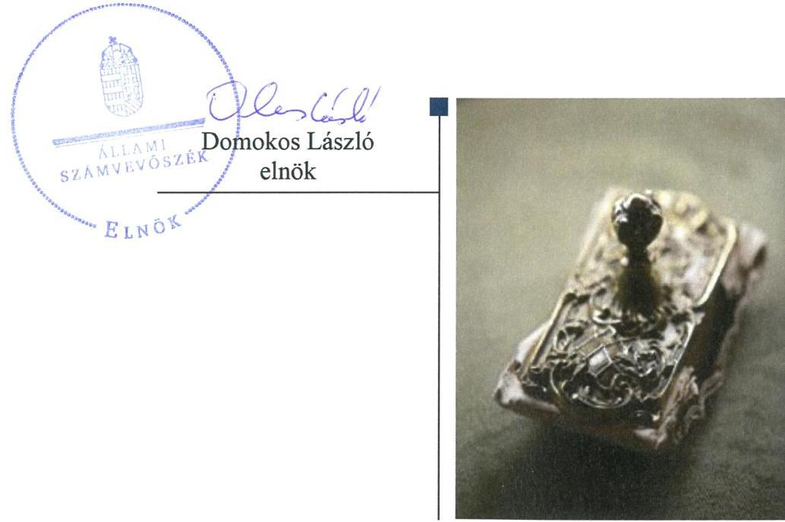
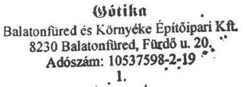
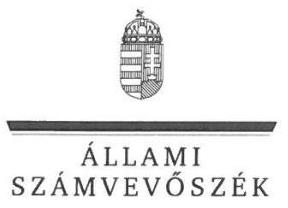
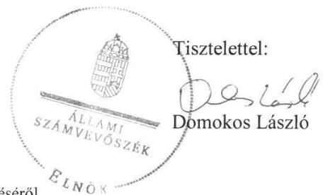
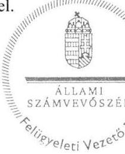
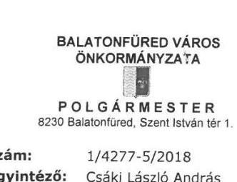
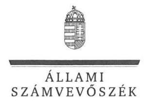
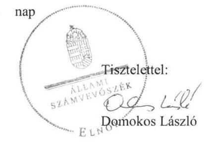

# Jelentés 

## Az önkormányzatok gazdasági társaságai

Az önkormányzatok többségi tulajdonában lévő gazdasági társaságok gazdálkodásának ellenőrzése - "GÓTIKA" Balatonfüred és Környéke Építőipari Kft.
2018.

---

# Jelentés 

## Az önkormányzatok gazdasági társaságai

Az önkormányzatok többségi tulajdonában lévő gazdasági társaságok gazdálkodásának ellenőrzése - "GÓTIKA" Balatonfüred és Környéke Építőipari Kft.
2018. október 5. nap

---

# AZ ELLENŐRZÉST FELÜGYELTE:

DR. HORVÁTH MARGIT felügyeleti vezető

# AZ ELLENŐRZÉST VEZETTE ÉS A VÉGREHAJTÁSÁÉRT FELELŐS:

GÖRGÉNYI GÁBOR ellenőrzésvezető

# A PROGRAM ÖSSZEÁLLÍTÁSÁÉRT FELELŐS:

TÓTPÁL SZABOLCS osztályvezető

IKTATÓSZÁM: EL-0474-050/2018

TÉMASZÁM: 2447

ELLENŐRZÉS-AZONOSÍTÓ SZÁM: V079388

Jelentéseink az Országgyűlés számítógépes hálózatán és az Interneten a www.asz.hu címen is olvashatóak.

---

# TARTALOMJEGYZÉK 

■ ÖSSZEGZÉS ..... 5
■ AZ ELLENŐRZÉS CÉLJA ..... 6
■ AZ ELLENŐRZÉS TERÜLETE ..... 7
■ AZ ELLENŐRZÉS HÁTTERE, INDOKOLTSÁGA ..... 9
■ A JELENTÉS LÉNYEGES KÉRDÉSKÖREI ..... 10
■ AZ ELLENŐRZÉS HATÓKÖRE ÉS MÓDSZEREI ..... 11
■ MEGÁLLAPÍTÁSOK ..... 13
■ JAVASLATOK ..... 16
■ MELLÉKLETEK ..... 19
I. sz. melléklet: Értelmező szótár ..... 19
II. sz. melléklet: Pénzügyi adatok ..... 20
■ FÜGGELÉK: ÉSZREVÉTELEK ..... 21
■ RÖVIDÍTÉSEK JEGYZÉKE ..... 33

---

.

---

# ÖSSZEGZÉS 

Balatonfüred Város Önkormányzata nem alakította ki szabályszerűen a tulajdonosi joggyakorlás kereteit és a tulajdonosi jogait nem gyakorolta szabályszerűen a Társaság felett. A "GÓTIKA" Balatonfüred és Környéke Építőipari Kft. gazdálkodásának szabályozottsága, gazdálkodása és vagyongazdálkodási tevékenysége nem volt szabályszerű. A Társaságnál a közvagyonnal való felelős gazdálkodás, a vagyonnal való elszámoltathatóság és a közpénzek felhasználásának átláthatósága nem volt biztosított.

## Az ellenőrzés társadalmi indokoltsága

Magyarországon az önkormányzatok kötelező és önként vállalt feladataik vonatkozásában is egyre szélesebb körben alkalmazzák a költségvetésen kívüli feladatellátást. Helyi szinten ennek legfontosabb szereplői az önkormányzati tulajdonban lévő gazdasági társaságok, amelyek ellenőrzése kiemelten fontos a közvagyon megőrzése, megóvása érdekében. Alapvető követelmény tehát, hogy működésük, gazdálkodásuk szabályszerű legyen.

Az Állami Számvevőszék kiemelt célja, hogy a helyi önkormányzatok gazdálkodásában rejlő pénzügyi kockázatok feltárásával, az államháztartáson kívülre nyújtott költségvetési támogatások és ingyenes vagyonjuttatások, valamint az államháztartáson kívül működő feladat-ellátó rendszerek ellenőrzéseivel hozzájáruljon ahhoz, hogy a közpénzeket az államháztartáson kívül működő szervezetek is átlátható, rendezett módon használják fel.

Az Állami Számvevőszék céljaival és a társadalmi igénnyel összhangban, valamint a gazdasági társaságok fontos szerepe miatt került sor a "GÓTIKA" Balatonfüred és Környéke Építőipari Kft. ellenőrzésére. Az ellenőrzést a Társaság feladatellátásából adódó további társadalmi elvárás is indokolta. A Társaság Balatonfüred városában a 2013-2016. években lakó- és nem lakó épületek építőipari kivitelezését végezte.

## Főbb megállapítások, következtetések, javaslatok

Balatonfüred Város Önkormányzatánál a tulajdonosi joggyakorlás kereteinek kialakítása nem volt szabályszerű. Az Alapító nem hozott létre és nem működtetett felügyelőbizottságot, nem választotta meg a Társaság könyvvizsgálóját és nem alkotta meg a Társaság javadalmazási szabályzatát. A tulajdonosi joggyakorlás nem volt szabályszerű, mert a felügyelőbizottság megválasztásának elmaradása miatt az nem tölthette be a törvényben előírt ellenőrzési funkcióját.

A "GÓTIKA" Balatonfüred és Környéke Építőipari Kft. gazdálkodásának szabályozottsága nem felelt meg a jogszabályi előírásoknak, mert a Társaság által a számviteli törvény alapján kötelezően elkészítendő számviteli politika, pénzkezelési szabályzat és leltározási szabályzat nem tartalmazta teljes körűen az előírt tartalmi elemeket.

A Társaság gazdálkodása nem volt szabályszerű, mert a bevételek és a személyi jellegű ráfordítások elszámolása nem szabályszerűen történt. A Társaság elkészítette üzleti terveit, az előírt beszámolási kötelezettségét teljesítette, azonban a közérdekű adatokra vonatkozó közzétételi kötelezettségének nem tett eleget.

A Társaság vagyongazdálkodási tevékenysége nem volt szabályszerű a vagyonnyilvántartás hiányosságai miatt. A beszámoló mérlegének adatait a Társaság nem támasztotta alá a törvénynek megfelelő leltárral.

Az Állami Számvevőszék a Társaság ügyvezetőjének 8, a polgármesternek 4 javaslatot fogalmazott meg annak érdekében, hogy a szabálytalanságok, hiányosságok megszüntetésre kerüljenek.

---

# AZ ELLENŐRZÉS CÉLJA 

AZ ELLENŐRZÉS CÉLJA annak értékelése volt, hogy az önkormányzat vagyongazdálkodási tevékenysége során szabályszerűen gyakorolta-e tulajdonosi jogait; a gazdasági társaság szabályozottsága, gazdálkodása és vagyongazdálkodási tevékenysége, bevételeinek és ráfordításainak elszámolása megfelelt-e a jogszabályi és tulajdonosi előírásoknak; a gazdasági társaság kötelezettségállománya jelent-e kockázatot a működésre, valamint a gazdálkodás átláthatósága és elszámoltathatósága biztosított volt-e.

---

# **AZ ELLENŐRZÉS TERÜLETE**

## **Balatonfüred Város Önkormányzata és a kizárólagos tulajdonában lévő "GÓTIKA" Balatonfüred és Környéke Építőipari Kft.**

Balatonfüred Város Önkormányzata 2013. július 22-étől 100%-os tulajdonosa a "GÓTIKA" Balatonfüred és Környéke Építőipari Kft.-nek, azt megelőzően nem rendelkezett tulajdonrésszel.

Az ellenőrzött időszakban a Polgármester¹ és a Jegyző² személyében nem történt változás.

A Társaság³ főtevékenysége lakó- és nem lakó épület építése volt. A Társaság által végzett tevékenységek a Mótv.⁴ alapján nem minősültek közfeladatnak.

Az Ügyvezető⁵ személye az ellenőrzött időszakban nem változott. A Társaságnál az ellenőrzött időszakban felügyelőbizottság nem működött. A Társaság a Számv tv.⁶ alapján a 2015. és a 2016. évi egyszerűsített éves beszámolók könyvvizsgálatára volt kötelezett.

A Társaság 2013-2016. évi gazdálkodásának néhány jellemző adatát az 1. táblázat, az egyszerűsített éves beszámolók részletesebb adatait a II. sz. melléklet tartalmazza.

1. táblázat

|  A TÁRSASÁG FŐBB GAZDÁLKODÁSI ADATAI 2013-2016. ÉVEKBEN |  |  |  |   |
| --- | --- | --- | --- | --- |
|  Összeg (M Ft) | 2013. | 2014. | 2015. | 2016.  |
|  Nettó árbevétel | 113,4 | 723,0 | 371,0 | 793,1  |
|  Üzemi tevékenység eredménye | 3,0 | 32,1 | 40,3 | 14,3  |
|  Adózott eredmény | 2,8 | 29,0 | 36,1 | 14,3  |
|  Fő | 2013. | 2014. | 2015. | 2016.  |
|  Foglalkoztatottak száma (átlagos statisztikai létszám) | 12 | 17 | 19 | 17  |

*Forrás: A Társaság 2013-2016. évi egyszerűsített éves beszámolói*

A Társaság a 2013-2016. években nyereségesen gazdálkodott, az Önkormányzatnak⁷ főképótlési kötelezettsége nem volt.

Az Önkormányzat a Társaság feladatellátásához a 2013-2016. években nem nyújtott támogatást. Az Önkormányzat 2015-ben 6,0 M Ft pénzbetéttel megemelte a Társaság jegyzett tőkéjét, továbbá fejlesztési célra 30,0 M Ft tagi kölcsönt nyújtott a Társaságnak. A 2016. évben az Önkormányzat további 100,0 M Ft tagi kölcsönt nyújtott a Társaság részére, annak érdekében, hogy a Társaság tagi kölcsönt nyújtson a 15%-os tulajdonában lévő részvénytársaság⁸ részére egy építési beruházás (kempingfejlesztés) céljából.

A Társaság nem tartozott a kormányzati szektorba sorolt egyéb szervezetek körébe. A Társaság által végzett szolgáltatások vonatkozásában az Önkormányzatnak díj-meghatározási kötelezettsége nem volt. A Társaság

---

vagyonkezelésbe vett állami, vagy önkormányzati vagyonnal nem rendelkezett, tevékenységét saját vagyonával látta el. A Társaság a Számv. tv. alapján nem volt önköltségszámításra kötelezett.

---

# AZ ELLENŐRZÉS HÁTTERE, INDOKOLTSÁGA 

AZ ÖNKORMÁNYZATOK TÖBBSÉGI TULAJDONÁBAN ÁLLÓ GAZDASÁGI TÁRSASÁGOK ellenőrzése kiemelten fontos a vagyon megőrzése, megóvása érdekében. A feladatellátás költségeinek, ráfordításainak alakulása a lakosság széles rétegét érinti. Ellenőrzéseink feltárhatják, hogy az önkormányzat a feladatellátásához rendelt vagyon működtetését a tulajdonostól elvárható gondossággal végezte-e, a feladatot ellátó gazdasági társaság a létesítő okiratban, szolgáltatási szerződésben foglaltak betartásával biztosította-e a feladat ellátását. Az ellenőrzés eredményeképp meghatározhatóvá válnak a költségvetési hiányt befolyásoló szervezetek kockázatai, lehetővé válik ezen kockázatok csökkentése. Az ellenőrzés rávilágíthat arra, hogy a gazdasági társaság a vagyon használatával biztosította-e a szolgáltatás folytatásának feltételeit, az önkormányzat tulajdonosi felügyelete hozzájárult-e a szabályszerű gazdálkodáshoz és feladatellátáshoz. A megállapítások alapján megfogalmazott számvevőszéki javaslatok hasznosítása elősegítheti a meglévő hibák megszüntetését. A jó gyakorlatok bemutatásával az ÁSZ⁹ hozzájárulhat a követendő megoldások megismertetéséhez, terjesztéséhez.

---

# A JELENTÉS LÉNYEGES KÉRDÉSKÖREI 

1.- Az Önkormányzat tulajdonosi joggyakorlása szabályszerű volt-e?
2.- A Társaság működésének szabályozottsága megfelelt-e a jogszabályi előírásoknak, a gazdálkodási tevékenysége szabályszerű volt-e, fizetőképessége biztosított volt-e a gazdálkodás során?
3.- A Társaság vagyongazdálkodási tevékenysége szabályszerű volt-e?

---

# AZ ELLENŐRZÉS HATÓKÖRE ÉS MÓDSZEREI 

## Az ellenőrzés típusa

Megfelelőségi ellenőrzés

## Az ellenőrzött időszak

2013. július 22-étől 2016. december 31-ig tartó időszak.

## Az ellenőrzés tárgya

Balatonfüred Város Önkormányzata 100%-os tulajdonában álló "GÓTIKA" Balatonfüred és Környéke Építőipari Kft. feletti tulajdonosi joggyakorlása, valamint a Társaság gazdálkodásának szabályozottsága és szabályszerűsége.

Az ellenőrzés kiterjedt minden olyan körülményre és adatra, amely az ÁSZ jogszabályban meghatározott feladatainak teljesítéséhez, valamint a program végrehajtása folyamán felmerült újabb összefüggések feltárásához szükséges.

## Az ellenőrzött szervezet

Balatonfüred Város Önkormányzata, valamint a "GÓTIKA" Balatonfüred és Környéke Építőipari Kft.

## Az ellenőrzés jogalapja

Az ellenőrzés jogszabályi alapját az az Állami Számvevőszékről szóló 2011. évi LXVI. törvény 1. § (3) bekezdése és 5. § (3)-(5) bekezdései képezték.

## Az ellenőrzés módszerei

Az ellenőrzést a nemzetközi standardokat irányadónak tekintve az ellenőrzési program ellenőrzési kérdései, az ellenőrzött időszakban hatályos jogszabályok, az ellenőrzés szakmai szabályok és módszertanok figyelembe vételével végeztük.

Az ellenőrzés ideje alatt az ellenőrzött szervezettel történő kapcsolattartást az ÁSZ Szervezeti és Működési Szabályzatának vonatkozó előírásai alapján biztosítottuk.

---

Az ellenőrzési kérdések megválaszolásához szükséges bizonyítékok megszerzése a következő ellenőrzési eljárások alkalmazásával történt: megfigyelés, kérdésfeltevés (információkérés), összehasonlítás, valamint elemző eljárás. Az ellenőrzési bizonyítékként felhasználható adatforrások közé tartoztak egyrészt az ellenőrzési programban felsorolt adatforrások, másrészt adatforrás lehetett még minden - az ellenőrzés folyamán - feltárt, az ellenőrzés szempontjából információkat tartalmazó dokumentum. Az ellenőrzést a kérdésekre adott válaszok kiértékelésével, valamint a megjelölt adatforrások, a csatolt tanúsítványok felhasználásával, továbbá az adott időszakban hatályos jogszabályok figyelembe vételével folytattuk le.

A bevételek és ráfordítások elszámolását, és a vagyonnyilvántartás terén a szabályszerű működést véletlen mintavétellel ellenőriztük. A mintavétellel ellenőrzött területek esetében minden egyes tétel vonatkozásában szabályszerűségre vonatkozó kérdéseket tettünk fel, amelyek a számviteli törvény, illetve a tulajdonosi követelményeknek és az ellenőrzött szervezet belső szabályozásai előírásainak betartására vonatkoztak. A jogszabályoknak és a belső előírásoknak megfelelőnek tekintettük az adott területet, amennyiben a minta ellenőrzésének eredménye alapján 95%-os bizonyossággal a teljes sokaságban a hibaarány kisebb volt, mint 10%, nem megfelelőnek értékeltük, ha a hibaarány a 10%-ot meghaladta. A ráfordítások elszámolására és a vagyonnyilvántartásra vonatkozó véletlen mintavételt kockázati alapú kiválasztással egészítettük ki, amelynek során évente a három legnagyobb összegű tételt választottuk ki.

---

# 1. Az Önkormányzat tulajdonosi joggyakorlása szabályszerű volt-e? 

Összegző megállapítás

Az Önkormányzat a tulajdonosi joggyakorlás kereteit nem szabályszerűen alakította ki, a tulajdonosi jogok gyakorlása nem volt szabályszerű.

Az Önkormányzat SZMSZ¹⁰-ében foglaltak alapján a tulajdonosi joggyakorlás kereteit az Önkormányzat a Vagyonrendelet¹¹, valamint az Alapító okirat¹² útján alakította ki.

A TULAJDONOSI JOGGYAKORLÁS KERETEIT az Önkormányzat nem szabályszerűen alakította ki. Az Alapító¹³ nem hozott létre felügyelőbizottságot, illetve nem jelölte ki a felügyelőbizottsági tagokat a Társaságnál, amellyel megsértette a Taktv.¹⁴ 4. § (1) bekezdésében, a Gt. 19. § (4) bekezdésében, továbbá a Ptk.¹⁵ 3:26. § (4) bekezdésében foglaltakat.

Az Alapító a Taktv. 5. § (3) bekezdés előírásai ellenére nem alkotott szabályzatot a Társaság vezető tisztségviselői, a felügyelőbizottsági tagok és az Mt.¹⁶ 208. §-ának hatálya alá eső munkavállalók javadalmazása, valamint a jogviszony megszűnése esetére biztosított juttatások módjának, mértékének elveiről, annak rendszeréről.

A Társaság a Számv. tv. 155. § (2) bekezdése alapján a 2015.
 és a 2016. évi egyszerűsített éves beszámolók könyvvizsgálatára volt kötelezett, azonban a Számv. tv. 155. § (6) bekezdésében és a Ptk. 3:130. § (1) bekezdésében előírtak ellenére az Alapító könyvvizsgálót nem választott.

A TULAJDONOSI JOGOK GYAKORLÁSA nem volt szabályszerű, mert az egyszerűsített éves beszámolók jóváhagyásáról az Alapító a felügyelőbizottság Taktv.-t sértő kijelölésének hiányában felügyelőbizottság nélkül döntött.

Az Alapító évközi beszámolási, valamint üzleti terv készítési kötelezettséget nem írt elő a Társaság számára. A Társaság 2014., 2015., és 2016. évekre vonatkozóan készített üzleti terveket, amelyeket az Alapító megtárgyalt és határozataiban döntött azok jóváhagyásáról.

---

# 2. A Társaság működésének szabályozottsága megfelelt-e a jogszabályi előírásoknak, a gazdálkodási tevékenysége szabályszerű volt-e, fizetőképessége biztosított volt-e a gazdálkodás során? 

Összegző megállapítás

A Társaság működésének szabályozottsága nem felelt meg a jogszabályi előírásoknak. A gazdálkodási tevékenység nem volt szabályszerű a bevételek és a személyi jellegű ráfordítások elszámolásának hiányosságai miatt. A közérdekből nyilvános adatok közzétételi kötelezettségének a Társaság nem tett eleget.

## A TÁRSASÁG MŰKÖDÉSÉNEK SZABÁLYOZOTTSÁGA nem felelt meg a jogszabályi előírásoknak. A Társaság rendelkezett a Számv. tv. szerinti Számviteli politikával ${ }_{1-4}{ }^{17}$, de a Számv. tv. 14. § (4) bekezdésében foglaltak ellenére az nem tartalmazta, hogy a törvényben biztosított választási, minősítési lehetőségek közül melyeket, milyen feltételek fennállása esetén alkalmaz, valamint nem tartalmazta a Társaság által alkalmazott amortizációs kulcsokat. Továbbá a Számviteli Politika nem tartalmazta azokat a Társaságra jellemző szabályokat, előírásokat, módszereket, amelyekkel meghatározza, hogy mit tekint kivételes nagyságú vagy előfordulású bevételnek, költségnek, ráfordításnak.

A Pénzkezelési szabályzat ${ }_{1-2}{ }^{18}$ a Számv. tv 14. § (8) bekezdésében foglaltak ellenére nem rendelkezett a pénzszállítás feltételeiről. A Pénzkezelési szabályzat ${ }_{1}$-ben a Számv. tv 14. § (8) bekezdésben foglaltak ellenére nem rendelkeztek a pénzkezelés felelősségi szabályairól, mert a banki utalásra, befizetésre, készpénzfelvételre kijelölt ügyvezetőnek nem a Társaság aktuális, hanem egy korábbi ügyvezetője volt megjelölve.

A Leltározási szabályzatban ${ }^{19}$ a Számv. tv. 69. § (3) bekezdésében foglaltakkal szemben nem határozták meg a mennyiségi leltározás gyakoriságát a tárgyi eszközök vonatkozásában.

A Társaság rendelkezett a jogszabályi előírások szerinti Számlarend ${ }_{1-2}$ $\mathrm{del}^{20}$ és Értékelési szabályzattal ${ }^{21}$.

A BEVÉTELEK elszámolása nem volt szabályszerű, mert:
azokat nem alapozta meg a Számv. tv. 165. § (1)-(2) bekezdésének megfelelő számviteli bizonylat, így a számviteli nyilvántartásokban bizonylat hiányában rögzítettek adatokat, illetve
$\longrightarrow$ a meglévő bizonylatok a Számv. tv. 166. § (1)-(2) bekezdésében foglalt előírásokkal ellentétben nem támasztották alá a bevételek számviteli elszámolását, mert a Társaság által kibocsátott számlák a Számv. tv. 167. § (1) bekezdés e) pontjában, illetve az Áfa tv. ${ }^{22} 169$. § f) bekezdésében foglaltak ellenére nem tartalmazták a megtörtént gazdasági műveletek tartalmának leírását, illetve a nyújtott szolgáltatás megnevezését.

---

A SZEMÉLYI JELLEGŰ RÁFORDÍTÁSOK ELSZÁMOLÁSA nem volt szabályszerű, mert a Számv. tv. 165. § (1)-(2) bekezdésében foglalt előírásokkal ellentétben a bér és egyéb jövedelmek számviteli elszámolását nem támasztották alá a bizonylatok.

AZ ANYAGJELLEGŰ ÉS EGYÉB RÁFORDÍTÁSOK elszámolása a Számv. tv. előírásainak megfelelően, szabályszerűen történt.

A TÁRSASÁG LEJÁRT KÖTELEZETTSÉGEINEK értéke - amely teljes egészében lejárt szállítói kötelezettségekből tevődött össze - közel 4,5-szeresére, 25,1 M Ft-ról 112,7 M Ft-ra növekedett.

BESZÁMOLÁSI KÖTELEZETTSÉGÉT a Társaság teljesítette. A 2014-2016. évekről az üzleti terveit és a Számv. tv. szerinti egyszerűsített éves beszámolóit jóváhagyásra benyújtotta az Alapító részére. Az Alapító határozataiban döntött a beszámolók és az üzleti tervek jóváhagyásáról. Az egyszerűsített éves beszámolókat a Társaság letétbe helyezte és közzétette a Számv. tv. előírásainak megfelelően.

A KÖZÉRDEKBŐL NYILVÁNOS személyi és gazdálkodási adatokat a Társaság nem tette közzé a Taktv. 2. § (1)-(3) bekezdéseiben foglaltak ellenére.

# 3. A Társaság vagyongazdálkodási tevékenysége szabályszerű volt-e? 

Összegző megállapítás

A Társaság vagyongazdálkodási tevékenysége nem volt szabályszerű.

A TÁRSASÁG AZ EGYSZERŰSÍTETT ÉVES BESZÁMOLÓINAK MÉRLEG TÉTELEIT a Számv. tv. 69. § (1) bekezdésében foglaltak ellenére a törvénynek megfelelő leltárral nem támasztotta alá, ebből eredően a mérlegtételek vonatkozásában nem volt biztosított a Számv. tv. 15. § (3) bekezdésében foglalt valódiság elve. A Számv. tv. 46. § (3) bekezdésében foglaltak ellenére elmaradt a mennyiségi felvétellel történő leltározás. A leltározás hiányossága ellenére a Társaság ügyvezetője által megbízott könyvvizsgáló a 2015-2016. évi beszámolókat korlátozás nélküli hitelesítő záradékkal látta el.

A VAGYON NYILVÁNTARTÁSA ÉS AZ ÉRTÉKCSÖKKENÉS ELSZÁMOLÁSA nem volt szabályszerű, mert a tárgyi eszközök nyilvántartásba vétele során a Számv. tv. 52. § (2) bekezdésében előírtak ellenére az üzembe helyezést hitelt érdemlően nem dokumentálták, arról a Számv. tv. 165. § (1)-(2) bekezdésének megfelelő bizonylatot nem állítottak ki.

---

# JAVASLATOK 

Az ÁSZ tv. 33. § (1) bekezdésében foglaltak értelmében az ellenőrzött szervezet vezetője köteles a jelentésben foglalt megállapításokhoz kapcsolódó intézkedési tervet összeállítani és azt a jelentés kézhezvételétől számított 30 napon belül az ÁSZ részére megküldeni. Amennyiben az ellenőrzött szervezet vezetője nem küldi meg határidőben az intézkedési tervet, vagy továbbra sem elfogadható intézkedési tervet küld, az Állami Számvevőszék elnöke az ÁSZ tv. 33. § (3) bekezdése a) és b) pontjaiban foglaltakat érvényesítheti.
Javaslataink célja a „GÓTIKA" Balatonfüred és Környéke Építőipari Kft. gazdálkodása szabályszerűségének és gyakorlatának javítása annak érdekében, hogy a szabályozási környezet és az alkalmazott gyakorlat megfelelően tudja támogatni az átlátható működést.

## „GÓTIKA" Balatonfüred és Környéke Építőipari Kft. ügyvezetőjének

1. Intézkedjen annak érdekében, hogy a számviteli politika feleljen meg a hatályos Számv. tv előírásainak.
(2. sz. megállapítás 1. bekezdése alapján)
2. Intézkedjen a pénzkezelési szabályzat Számv. tv. előírásának megfelelő módosításáról.
(2. sz. megállapítás 2. bekezdése alapján)
3. Intézkedjen a leltározási szabályzat Számv. tv. előírásának megfelelő módosítására a tárgyi eszközök leltározási gyakoriságára vonatkozóan.
(2. sz. megállapítás 3. bekezdése alapján)
4. Intézkedjen annak érdekében, hogy a bevételek elszámolása a Számv. tv. és az Áfa tv. előírásainak megfelelő számviteli bizonylatok alapján történjen.
(2. sz. megállapítás 5. bekezdése alapján)
5. Intézkedjen a személyi jellegű ráfordítások elszámolásának a Számv. tv. előírásainak megfelelő számviteli bizonylattal történő alátámasztásáról.
(2. sz. megállapítás 6. bekezdése alapján)

---

6. Intézkedjen a Taktv. szerinti közzétételi kötelezettség teljes körű teljesítéséről.
(2. sz. megállapítás 10. bekezdése alapján)
7. Intézkedjen az egyszerűsített éves beszámoló mérlegtételeinek jogszabályi előírásoknak megfelelő leltárral való alátámasztásáról.
(3. sz. megállapítás 1. bekezdése alapján)
8. Intézkedjen az eszközök üzembe helyezésének a Számv. tv. előírásainak megfelelő dokumentálásáról.
(3. sz. megállapítás 2. bekezdése alapján)

Javaslataink célja az Önkormányzat szabályszerű működésének elősegítése, továbbá az önkormányzati tulajdonosi joggyakorlás kontrolljainak helyreállítása.

# Balatonfüred Város Önkormányzata polgármesterének 

1. Intézkedjen annak érdekében, hogy az Alapító a Társaság felügyelőbizottságát hozza létre a Taktv.-ben, illetve a Ptk.-ban előírtaknak megfelelően.
(1. sz. megállapítás 2. bekezdése alapján)
2. Intézkedjen annak érdekében, hogy az Alapító a jogszabályban előírt, a vezető tisztségviselők, felügyelőbizottsági tagok, valamint az Mt. 208. §-ának hatálya alá eső munkavállalók javadalmazására, valamint a jogviszony megszünése esetére biztosított juttatások módjának, mértékének elveiről, annak rendszeréről szóló szabályzatot alkossa meg.
(1. sz. megállapítás 3. bekezdése alapján)
3. Intézkedjen annak érdekében, hogy az Alapító a Társaság könyvvizsgálóját a jogszabályi előírásoknak megfelelően válassza meg.
(1. sz. megállapítás 4. bekezdése alapján)

---

4. Intézkedjen
a) a számviteli szabályozási hiányosságok,
b) az éves beszámoló mérlegsorait alátámasztó megfelelő leltár hiánya,
c) a közzétételi kötelezettség teljesítésének hiányosságai,
d) a bevételek, a személyi jellegű ráfordítások, a tárgyi eszközök üzembe helyezésének számviteli bizonylattal történő alátámasztásának és dokumentálásának hiányosságai
miatti felelősség tisztázása érdekében, és szükség szerint intézkedjen a felelősség érvényesítéséről.
(2. sz. megállapítás 1-3. bekezdései, 2. sz. megállapítás 5-6. bekezdései, 2. sz. megállapítás 10. bekezdése, 3. sz. megállapítás 1. bekezdése, 3. sz. megállapítás 2. bekezdése alapján)

---

# MELLÉKLETEK 

- I. SZ. MELLÉKLET: ÉRTELMEZŐ SZÓTÁR
gazdasági társaság
gazdálkodó szervezet
kormányzati szektorba sorolt egyéb szervezet
nemzeti vagyon

Ptk. 3:88. § (1) bekezdése szerint „a gazdasági társaságok üzletszerű közös gazdasági tevékenység folytatására, a tagok vagyoni hozzájárulásával létrehozott, jogi személyiséggel rendelkező vállalkozások, amelyekben a tagok a nyereségből közösen részesednek, és a veszteséget közösen viselik".
A Ptk. 685. § c) pontja szerint gazdálkodó szervezet: „az állami vállalat, az egyéb állami gazdálkodó szerv, a szövetkezet, a lakásszövetkezet, az európai szövetkezet, a gazdasági társaság, az európai részvénytársaság, az egyesülés, az európai gazdasági egyesülés, az európai területi együttműködési csoportosulás, az egyes jogi személyek vállalata, a leányvállalat, a vízgazdálkodási társulat, az erdő birtokossági társulat, a végrehajtói iroda, az egyéni cég, továbbá az egyéni vállalkozó." (2014. 03.15-ig hatályos)
az Áht. ${ }^{23} 3$. § (2) és (3) bekezdésében foglaltakon kívül az Európai Közösséget létrehozó szerződéshez csatolt, a túlzott hiány esetén követendő eljárásról szóló jegyzőkönyv alkalmazásáról szóló 2009. május 25-i 479/2009/EK rendelet (a továbbiakban: 479/2009/EK rendelet) szerint a kormányzati szektorba sorolt szervezet (Áht. 1. § (12))
Nvtv. ${ }^{24} 1 . \S$ (2) bekezdése szerint többek között:
„az állam vagy a helyi önkormányzat kizárólagos tulajdonában álló dolgok, az a) pont hatálya alá nem tartozó, állam vagy a helyi önkormányzat tulajdonában lévő dolog,
az állam vagy a helyi önkormányzat tulajdonában lévő pénzügyi eszközök, továbbá az államot vagy a helyi önkormányzatot megillető társasági részesedések, az államot vagy a helyi önkormányzatot megillető bármely vagyoni értékkel rendelkező jogosultság, amelyet jogszabály vagyoni értékű jogként nevesít."

---

# A "GÓTIKA" BALATONFÜRED ÉS KÖRNYÉKE ÉPÍTŐIPARI KFT. EGYSZERŰSÍTETT ÉVES BESZÁMOLÓINAK ADATAI (M FT) 

| Eredménykimutatás | 2013. év | 2014. év | 2015. év | 2016. év |
| :--: | :--: | :--: | :--: | :--: |
| Értékesítés nettó árbevétele | 113,4 | 723,0 | 371,0 | 793,1 |
| Aktivált saját teljesítmények értéke | 21,3 | $-20,4$ | $-3,7$ | 18,7 |
| Egyéb bevételek | 1,5 | 1,1 | 0,4 | 0,1 |
| Anyagjellegű ráfordítások | 102,3 | 608,9 | 251,3 | 708,3 |
| Személyi jellegű ráfordítások | 28,0 | 57,3 | 68,1 | 79,8 |
| Értékcsökkenési leírás | 2,0 | 2,5 | 5,2 | 7,2 |
| Egyéb ráfordítások | 0,9 | 2,9 | 2,8 | 2,3 |
| Üzemi tevékenység eredménye | 3,0 | 32,1 | 40,3 | 14,3 |
| Mérleg szerint eredmény/Adózott eredmény* | 2,8 | 29,0 | 36,1 | 14,3 |

* A 2013-2015. években az adózott eredmény és a mérleg szerinti eredmény megegyezett. A Számv. tv. 2015. július 4-től hatályos módosítása alapján a mérleg szerinti eredmény tétel megszűnt. A 2016. évi egyszerűsített éves beszámoló eredménykimutatásában az adózott eredmény levezetését kellett kimutatni.

---

# FÜGGELÉK: ÉSZREVÉTELEK 

A jelentéstervezetet a Számvevőszék 15 napos észrevételezésre megküldte az ellenőrzött szervezetek vezetőinek az ÁSZ tv. 29. § (1) bekezdése előírásának megfelelően.

A jelentés függeléke tartalmazza a "GÓTIKA" Balatonfüred és Környéke Építőipari Kft. ügyvezetőjének és Balatonfüred Város Önkormányzata polgármesterének a jelentéstervezettel kapcsolatos észrevételeit és az azok kezeléséről szóló válaszleveleket.

[^0]
[^0]:    *29. § (1) Az Állami Számvevőszék az ellenőrzési megállapításait megküldi az ellenőrzött szervezet vezetőjének vagy az általa megbízott személynek,

 és annak, akinek személyes felelősségét állapította meg.
    (2) Az ellenőrzött szervezet vezetője és a felelősként megjelölt személy az ellenőrzés megállapításaira tizenöt napon belül írásban észrevételt tehet.
    (3) Az Állami Számvevőszék az észrevételre a beérkezésétől számított harminc napon belül írásban válaszol. A figyelembe nem vett észrevételeket köteles a jelentésben feltüntetni, és megindokolni, hogy azokat miért nem fogadta el.

---

# (G)ütika 

Balatonfüred és környéke ÉPÍTŐIPARI Kft.

Állami Számvevőszék

## Dr. Horváth Margit

felügyeleti vezető

## Budapest

Apáczai Csere János u. 10.
1052
Tárgy: észrevételek

## Tisztelt Felügyeleti Vezető Asszony!

A „GÓTIKA" Balatonfüred és Környéke Építőipari Kft. törvényes képviseletében eljárva, hivatkozva az Állami Számvevőszékről szóló 2011. évi LXVI. törvény 29. § (2) bekezdésében foglaltakra, a fenti számon Társaságunk részére 2018. június 20. napján kézbesített jelentéstervezetükben (a továbbiakban: Tervezet) foglalt megállapításokra az alábbi észrevételeket teszem.
I. Az Önkormányzat tulajdonosi joggyakorlásának szabályszerűsége (Megállapítások 1. pont)

1. A felügyelőbizottságot a tulajdonos létrehozta, első tagjait megválasztotta.
2. JAVADALMAZÁSI SZABÁLYZAT vezető tisztségviselőre vonatkozó részét pótoltuk, a szabályzat 2015. december 17-től hatályos!
3. Könyvvizsgáló megbízása az ügyvezető által - alapítói jóváhagyással - történt 2016. évben, a képviselő-testület jóváhagyásának igazolását pótoljuk. Az állandó könyvvizsgálót az alapító megválasztotta, a cégbíróság felé a bejelentés megtörtént.
II. A társaság működésének szabályozottsága (Megállapítások 2. pont):

1/ A Számviteli Politika tartalmazza az amortizációra vonatkozó szabályokat, az amortizációs kulcsokat nem, de azt a Sztv. nem írja elő. A kivételes nagyságú bevételek és ráfordítások az adottságoknak és körülményeknek megfelelően az ellenőrzés időszakában nehezen meghatározhatóak, az elmúlt 3 év számadatai alapján ezek már meghatározhatóak, a számviteli politikánkat módosítjuk.

2/ A Pénzkezelési Szabályzatban lévő hiányosságot, a pénz szállítás feltételeit pótoljuk.

3/ A tárgyi eszközökről felvett mennyiségi- és értékbeli leltárból kitűnik, hogy minden eszközből egyegy darab van, ezért a mennyiségi felvételt egyeztetéssel - nem tartottuk indokoltnak! A leltározás hiányossága a könyvvizsgálattal alátámasztott 2015-2016. évi beszámolót nem érintette! A leltározási szabályzatot ezzel kiegészítjük.

---

# (5) otika   Balatonfüred és környéke ÉPÍTŐIPARI Kft. 

8230 BALATONFÜRED, Fürdő u. 20.
a 06 87/580 606
E-mail: gotika@gotikakft.hu
www.gotikakft.hu

4/ A bevételek elszámolásának szabályszerűtlenségére vonatkozó megállapítás indokolását tartjuk szükségesnek, mivel álláspontunk szerint az elszámolások a vizsgált időszakban szabályszerűek voltak. Bevételeinkről a NAV-nál nyilvántartott INFOTÉKA KALMÁR NET számlázó szoftverrel készítünk bizonylatot, azok alakilag, tartalmilag hitelesek, megbízhatóak és helytállóak. A gazdasági művelet leírása limitált karakter, a pályázatokhoz (is) előírt megnevezést tartalmazza, az áfa tv-nek megfelelően, melyet a NAV rendszeresen ellenőriz a fordított áfa miatti visszaigénylések során.

5/ Álláspontunk szerint a személyi jellegű ráfordítások elszámolása Társaságunknál minden tekintetben az Sztv. előírásainak megfelelően történik, ezért kérjük annak részletezését, hogy az ellenőrzés mire alapította a Tervezet vonatkozó megállapításait. A személyi jellegű ráfordítások elszámolása Társaságunknál az INFOTÉKA BÉR SZOFTVER által előállított bizonylatok alapján történik, (Bérlista, Fizetési bizonylat, Bérfeladás) minden gazdasági esemény rögzített, egyezőségek fennállnak, a számviteli elszámolást alátámasztják.

6/ A közérdekből nyilvános személyi és gazdálkodási adatok közzétételét pótoljuk.
7/ A tárgyi eszközökről felvett mennyiségi leltározást a 3. pontban említettek alapján pótoljuk.
8/ A tárgyi eszközök aktiválása a vizsgált időszakban vegyes bizonylaton történt, minden esetben az üzembe helyezés időpontja megegyezik a rendeltetésszerű hasznosítás kezdő időpontjával. Ez a bizonylat álláspontunk szerint hitelt érdemlő, de 2018. évtől áttértünk a kézi nyilvántartásról a tárgyi eszközök gépi nyilvántartására, ahol minden üzembe helyezésről program által jegyzőkönyvet tudunk nyomtatni. A Sztv. nem részletezi, hogy melyik bizonylat tekinthető hitelt érdemlőnek.

Kérem a Tisztelt Felügyeleti Vezető Asszonyt, hogy az Állami Számvevőszékről szóló 2011. évi LXVI. törvény 29. § (3) bekezdésében foglaltaknak megfelelően szíveskedjen intézkedni a fenti észrevételeink 30 napon belül írásban történő megválaszolása és az ellenőrzési jelentés elkészítése során történő figyelembe vétele, illetve a figyelembe vétel mellőzése esetén ennek megindokolása tekintetében.

Megköszönjük segítőkész munkájukat, amivel hozzájárulnak a további törvényszerű működésünkhöz!

Balatonfüred, 2018. július 03.

Tisztelettel:

Horváth Tamás ügyvezető

---

ELNÖK

Ikt.szám: EL-0474-043/2018.

# Horváth Tamás úr 

ügyvezető
„GÓTIKA" Balatonfüred és Környéke Építőipari Kft.

## Balatonfüred

## Tisztelt Ügyvezető Úr!

Köszönettel vettem „Az önkormányzatok gazdasági társaságai - Az önkormányzatok többségi tulajdonában lévő gazdasági társaságok gazdálkodásának ellenőrzése - "GÓTIKA" Balatonfüred és Környéke Építőipari Kft." címmel készített számvevőszéki jelentéstervezetre megküldött észrevételét.
Az Állami Számvevőszék észrevételre vonatkozó álláspontját a felügyeleti vezető által készített részletes tájékoztatás tartalmazza, amelyet levelemhez mellékeltem.
Tájékoztatom Ügyvezető urat, hogy az Állami Számvevőszék a figyelembe nem vett észrevételeket az Állami Számvevőszékről szóló 2011. évi LXVI. törvény 29. § (3) bekezdésében előírtak szerint köteles a jelentésében feltüntetni és megindokolni, hogy azokat miért nem fogadta el.

Budapest, 2018.  hó 07. nap

Melléklet: Tájékoztatás az észrevételek kezeléséről

---

# Tájékoztatás az észrevételek kezeléséről 

Megköszönöm Ügyvezető úrnak „Az önkormányzatok gazdasági társaságai - Az önkormányzatok többségi tulajdonában lévő gazdasági társaságok gazdálkodásának ellenőrzése - "GÓTIKA" Balatonfüred és Környéke Építőipari Kft." címmel készített jelentéstervezetre tett észrevételeit. Az észrevételek kezeléséről az alábbi tájékoztatást adom.

Ügyvezető úr észrevételének első részében Balatonfüred Város Önkormányzata (Önkormányzat) tulajdonosi joggyakorlásának szabályszerűségével kapcsolatos megállapításokhoz kapcsolódóan (jelentéstervezet 1. számú megállapítás) három témakörben tett észrevételt. Az észrevétel a jelentéstervezet 1. sz. megállapítás 2-4. bekezdését, továbbá az Önkormányzat polgármesterének címzett 1-3. számú javaslatot érintette.

Ügyvezető úr a megállapításokra és a javaslatokra a következő észrevételt tette:

## „1. Az Önkormányzat tulajdonosi joggyakorlásának szabályszerűsége (Megállapítások 1. pont)

1. A felügyelőbizottságot a tulajdonos létrehozta, első tagjait megválasztotta.
2. JAVADALMAZÁSI SZABÁLYZAT vezető tisztségviselőre vonatkozó részét pótoltuk, a szabályzat 2015. december 17-től hatályos!
3. Könyvvizsgáló megbízása az ügyvezető által - alapítói jóváhagyással - történt 2016. évben, a képviselő-testület jóváhagyásának igazolását pótoljuk. Az állandó könyvvizsgálót az alapító megválasztotta, a cégbíróság felé a bejelentés megtörtént."
Ügyvezető úr észrevételében leírtak alapján a jelentéstervezet 2-4. bekezdéseit, továbbá az Önkormányzat polgármesterének címzett 1-3. számú javaslatot nem módosítom az alábbiak miatt:

Az ÁSZ az ellenőrzést az EL-0047-001/2017. iktatószámú ellenőrzési program, az ellenőrzött időszakban hatályos jogszabályok, az ellenőrzés szakmai szabályok és módszertanok figyelembe vételével végezte. Az ÁSZ ellenőrzéshez az EL0230-002/2017. iktatószámú, 2017. augusztus 9-én kelt, továbbá az EL-0230-013/2017. iktatószámú, 2017. november 10-én kelt adatbekérő levél 2. számú mellékletei szerint az önkormányzat rendeletei, határozatai a tulajdonosi joggyakorlás kialakításának módjára vonatkozóan, valamint a tulajdonosi jogok gyakorlásának rendjére vonatkozó szabályzatok, ügyrendek bekérésre kerültek az Önkormányzattól.

Az Önkormányzat polgármestere 2017. november 22-én kelt Teljességi és hitelességi nyilatkozatában a bekért adatokra vonatkozóan kijelentette, hogy az Állami Számvevőszék részére átadott és a nyilatkozatban részletezett dokumentumok, adatok megbízhatóak és a bekért adatokra, dokumentumokra vonatkozóan teljes körű információt tartalmaztak. A Teljességi és hitelességi nyilatkozat mellékletében a megküldött dokumentumok között a "GÓTIKA" Balatonfüred és Környéke Építőipari Kft. (Társaság) felügyelőbizottságának létrehozásával, a könyvvizsgáló választásával, a javadalmazási szabályzat elfogadásával kapcsolatos dokumentum nem szerepelt. Az adatbekérés során az ellenőrzés rendelkezésre bocsátott dokumentumok ismételt áttekintését követően megállapítottuk, hogy az ellenőrzés számára nem állt rendelkezésre a Társaság felügyelőbizottságának létrehozásával, a könyvvizsgáló 2016. évi választásával, továbbá a 2015. december 17-től hatályos javadalmazási szabályzatot elfogadó, a Társaság legfőbb szerve (Önkormányzat Képviselő-testülete) által meghozott döntés.

---

Az ÁSZ a megállapításait az előírt adatszolgáltatási határidőre az ellenőrzés rendelkezésre bocsátott dokumentumok, adatok, információk alapján tette meg. Ezért Ügyvezető úr észrevételében jelzett, a könyvvizsgáló megválasztásával kapcsolatos utólagos igazolás értékelésére nincs mód.

A fentiek alapján a jelentéstervezet 1. sz. megállapítás 2-4. bekezdés, továbbá az Önkormányzat polgármesterének címzett 1-3. számú javaslat továbbra is helytálló, megalapozott.

Ügyvezető úr észrevételének második része a Társaság működésének szabályozottságával és a vagyongazdálkodási tevékenység szabályszerűségével kapcsolatos megállapításokhoz kapcsolódóan (jelentéstervezet 2. és 3. számú megállapítás) nyolc témakörben tett észrevételt. Az észrevétel a jelentéstervezet 2. sz. megállapítás 1-3. 5-6. 10., a 3. sz. megállapítás 1-2. bekezdéseit, továbbá a Társaság ügyvezetőjének címzett 1-8. számú javaslatot érintette.

Ügyvezető úr a megállapításokra és a javaslatokra a következő észrevételt tette:

# „II. A társaság működésének szabályozottsága (Megállapítások 2. pont): 

1/ A Számviteli Politika tartalmazza az amortizációra vonatkozó szabályokat, az amortizációs kulcsokat nem, de azt a Sztv. nem írja elő. A kivételes nagyságú bevételek és ráfordítások az adottságoknak és körülményeknek megfelelően az ellenőrzés időszakában nehezen meghatározhatóak, az elmúlt 3 év számadatai alapján ezek már meghatározhatóak, a számviteli politikánkat módosítjuk.
2/ A Pénzkezelési Szabályzatban lévő hiányosságot, a pénz szállítás feltételeit pótoljuk.
3/ A tárgyi eszközökről felvett mennyiségi- és értékbeli leltárból kitűnik, hogy minden eszközből egyegy darab van, ezért a mennyiségi felvételt egyeztetéssel - nem tartottuk indokoltnak! A leltározás hiányossága a könyvvizsgálattal alátámasztott 2015-2016. évi beszámolót nem érintette! A leltározási szabályzatot ezzel kiegészítjük.
4/ A bevételek elszámolásának szabályszerűtlenségére vonatkozó megállapítás indokolását tartjuk szükségesnek, mivel álláspontunk szerint az elszámolások a vizsgált időszakban szabályszerűek voltak. Bevételeinkről a NAV-nál nyilvántartott INFOTÉKA KALMÁR NET számlázó szoftverrel készítünk bizonylatot, azok alakilag, tartalmilag hitelesek, megbízhatóak és helytállóak. A gazdasági művelet leírása limitált karakter, a pályázatokhoz (is) előírt megnevezést tartalmazza, az áfa tv-nek megfelelően, melyet a NAV rendszeresen ellenőriz a fordított áfa miatti visszaigénylések során.
5/Álláspontunk szerint a személyi jellegű ráfordítások elszámolása Társaságunknál minden tekintetben az Sztv. előírásainak megfelelően történik, ezért kérjük annak részletezését, hogy az ellenőrzés mire alapította a Tervezet vonatkozó megállapításait. A személyi jellegű ráfordítások elszámolása Társaságunknál az INFOTÉKA BÉR SZOFTVER által előállított bizonylatok alapján történik, (Bérlista, Fizetési bizonylat, Bérfeladás) minden gazdasági esemény rögzített, egyezőségek fennállnak, a számviteli elszámolást alátámasztják.
6/ A közérdekből nyilvános személyi és gazdálkodási adatok közzétételét pótoljuk.
7/ A tárgyi eszközökről felvett mennyiségi leltározást a 3. pontban említettek alapján pótoljuk.
8/ A tárgyi eszközök aktiválása a vizsgált időszakban vegyes bizonylaton történt, minden esetben az üzembe helyezés időpontja megegyezik a rendeltetésszerű hasznosítás kezdő időpontjával. Ez a bizonylat álláspontunk szerint hitelt érdemlő, de 2018. évtől áttértünk a kézi nyilvántartásról a tárgyi eszközök gépi nyilvántartására, ahol minden üzembe helyezésről program által jegyzőkönyvet tudunk nyomtatni. A Sztv. nem részletezi, hogy melyik bizonylat tekinthető hitelt érdemlőnek."

---

Ügyvezető úr észrevételében leírtak alapján a jelentéstervezet 2. sz. megállapítás 1-3. 5-6. 10., a 3. sz. megállapítás 1-2. bekezdéseit, továbbá a Társaság ügyvezetőjének címzett 1-8. számú javaslatot nem módosítom az alábbiak miatt:

Az észrevétel II/1. pontjában foglaltakhoz: Az ellenőrzés rendelkezésre bocsátott dokumentumok ismételt áttekintését követően megállapítottam, hogy a Társaság ellenőrzött időszakban hatályos számviteli politikái az amortizációra vonatkozóan nem tartalmaznak teljes körű információt, mivel azokban a Számvitelről szóló 2000. évi törvény (Számv. tv.) 14. § (4) bekezdésében foglaltak ellenére a Társaság a választási lehetőségek körében nem határozta meg az alkalmazandó amortizációs kulcsokat. Erre tekintettel a jelentéstervezet megállapítása, és az ügyvezetőnek címzett 1. számú javaslat továbbra is helytálló. Az észrevétel második részében, a kivételes nagyságú bevételek és ráfordítások meghatározásával összefüggő tájékoztatást tudomásul veszem. A tájékoztatás a jelentéstervezet megállapítását és a javaslatokat nem befolyásolja.
Az észrevétel II/2. pontjában foglaltakhoz: A pénzkezelési szabályzatban lévő hiányosság és a pénz szállítás
 feltételeinek pótolásával kapcsolatos tájékoztatást tudomásul veszem. E tájékoztatás a jelentéstervezet megállapítását és a javaslatokat nem befolyásolja.
Az észrevétel II/3. pontjában foglaltakhoz: A Társaság a Számv. tv. 69. § (3) bekezdésében foglaltak ellenére a leltározási szabályzatában nem határozta meg a tárgyi eszközök leltározásának gyakoriságát. E jogszabályi előírás végrehajtása tekintetében a Számv. tv. nem ad választási lehetőséget, azaz a Társaság nem mérlegelheti a leltározás gyakorisága meghatározásának indokoltságát. Továbbá a Számv. tv. 69. § (3) bekezdése szerint a leltározás végrehajtása is kötelezettséget jelentett a Társaság számára, amelynek hiánya a beszámoló valódiságát is befolyásolja. Mindezekre tekintettel a jelentéstervezet 2. sz. megállapítás 3. bekezdésében, és a 3. sz. megállapítás 1. bekezdésében, valamint az ügyvezetőnek címzett 3. és 7. számú javaslatban foglaltak továbbra is helytállók, megalapozottak. A leltározási szabályzat kiegészítésére vonatkozó tájékoztatást tudomásul veszem.

Az észrevétel II/4. pontjában foglaltakhoz: Az ellenőrzés során a szabályszerű működést véletlen mintavétellel ellenőriztük. A mintavétellel ellenőrzött területek esetében minden egyes tétel vonatkozásában a szabályszerűségre vonatkozó kérdéseket tettünk fel, amelyek eredménye összesítésre került. Megfelelőnek értékeltünk egy ellenőrzött területet, amennyiben 95%-os bizonyossággal a teljes sokaságban az átlagos hibaarány legfeljebb 10%, nem megfelelőnek, amennyiben 10%-nál magasabb arányt képviselt. A Társaság által az ellenőrzés számára rendelkezésre bocsátott mintatételek esetében a fenti eljárás alapján olyan nagyságrendű hiányos dokumentálást találtunk, amely szerint a bevételek elszámolása összességében nem minősült szabályszerűnek. Az ellenőrzött mintatételek körében több esetben hiányzott a számlázott szolgáltatást megalapozó szerződés, továbbá a Társaság számlái több esetben nem tartalmazták a szolgáltatás besorolás szerinti megnevezését, így a Társaság által kiállított számlák alapján nem volt megállapítható, hogy milyen szolgáltatást nyújtott. Mindezekre tekintettel a jelentéstervezet 2. sz. megállapítás 5. bekezdésében, valamint az ügyvezetőnek címzett 4. számú javaslatban foglaltak továbbra is helytállók, megalapozottak.

Az észrevétel II/5. pontjában foglaltakhoz: Az ellenőrzés során a szabályszerű működést véletlen mintavétellel ellenőriztük. A mintavétellel ellenőrzött területek esetében minden egyes tétel vonatkozásában a szabályszerűségre vonatkozó kérdéseket tettünk fel, amelyek eredménye összesítésre került. Megfelelőnek értékeltünk egy ellenőrzött területet, amennyiben 95%-os

---

bizonyossággal a teljes sokaságban az átlagos hibaarány legfeljebb 10%, nem megfelelőnek, amennyiben 10%-nál magasabb arányt képviselt. A Társaság által az ellenőrzés számára rendelkezésre bocsátott mintatételek esetében a fenti eljárás alapján olyan nagyságrendű hiányos dokumentálást találtunk, amely szerint a személyi jellegű ráfordítások elszámolása összességében nem minősült szabályszerűnek. Az ellenőrzött mintatételek körében előfordult, hogy a főkönyvi rögzítését alátámasztó bizonylatot a Társaság nem adott át az ellenőrzés számára, így az analitikus nyilvántartás és a számviteli elszámolás logikai kapcsolata nem volt ellenőrizhető, hiányzott a főkönyvi számlákra történő hivatkozás. Mindezekre tekintettel a jelentéstervezet 2. sz. megállapítás 6. bekezdésében, valamint az ügyvezetőnek címzett 5. számú javaslatban foglaltak továbbra is helytállók, megalapozottak.

Az észrevétel II/6. pontjában foglaltakhoz: A közérdekből nyilvános személyi és gazdálkodási adatok közzétételével kapcsolatos tájékoztatást tudomásul veszem. A tájékoztatás a jelentéstervezet 2. sz. megállapítás 10. bekezdését és az ügyvezetőnek címzett 6. számú javaslatot nem befolyásolja.

Az észrevétel II/7. pontjában foglaltakhoz: A tárgyi eszközökről felvett mennyiségi leltározással kapcsolatos tájékoztatást tudomásul veszem. A tájékoztatás a jelentéstervezet 3. sz. megállapítás 1. bekezdését és az ügyvezetőnek címzett 7. számú javaslatot nem befolyásolja.

Az észrevétel II/8. pontjában foglaltakhoz: Az ellenőrzés során a szabályszerű működést véletlen mintavétellel ellenőriztük. A mintavétellel ellenőrzött területek esetében minden egyes tétel vonatkozásában a szabályszerűségre vonatkozó kérdéseket tettünk fel, amelyek eredménye összesítésre került. Megfelelőnek értékeltünk egy ellenőrzött területet, amennyiben 95%-os bizonyossággal a teljes sokaságban az átlagos hibaarány legfeljebb 10%, nem megfelelőnek, amennyiben 10%-nál magasabb arányt képviselt. A Társaság által az ellenőrzés számára rendelkezésre bocsátott mintatételek esetében a fenti eljárás alapján olyan nagyságrendű hiányos dokumentálást találtunk, amely szerint a vagyon nyilvántartása összességében nem minősült szabályszerűnek. A mintatételek körében előfordult, hogy a beszerzéséhez kapcsolódó aktiválási dokumentumok hiányosak voltak, mivel a Társaság az aktiválás dokumentumaként csak a gazdasági események listáját csatolta. Mindezekre tekintettel a jelentéstervezet 3. sz. megállapítás 2. bekezdésében, valamint az ügyvezetőnek címzett 8. számú javaslatban foglaltak továbbra is helytállók, megalapozottak. Ügyvezető úrnak a 2018. évtől bevezetett, üzembehelyezési jegyzőkönyvet is előállítani képes programmal kapcsolatos tájékoztatását tudomásul veszem. A tájékoztatás a jelentéstervezet megállapítását és a javaslatokat nem befolyásolja.

Kérem Ügyvezető urat, hogy észrevételében jelzett, az ellenőrzött időszak után tett intézkedéseket a számvevőszéki jelentés kiadását követően összeállítandó intézkedési tervében ismét rögzítse, kiegészítve a felelősök és határidők megjelölésével.

Budapest, 2018. ápr. 4. hó 07. nap

Dr. Horváth Margit
felügyeleti vezető

---

|  |  |
| :-- | :-- |
| ÁLLAMI SZÁMVEVŐSZÉK |  |
| BE-39280/2018/1 |  |
| Érkezeit: 2010 JÚL 11 |  |
| Iktatószám: $\underline{\underline{EL}-0474-042 / 2018}$ |  |
| Melléklet: |  |

polgarmester@balatonfured.com

|  |  |
| :-- | :-- |
| Ügyintéző: Csáki László András | Címzett: Állami Számvevőszék |
| Tárgy: Észrevételezés a „GÓTIKA" Balatonfüred és Környéke Építőipari Kft ellenőrzéséről kiadott Állami Számvevőszéki jelentéstervezetre | Domokos László elnök dr. Horváth Margit felügyeleti vezető Görgényi Gábor ellenőrzésvezető |
| Melléklet: | Tótoál Szabolcs osztályvezető |

Hív. szám: EL-0474-036/2018.

# Tisztelt Címzettek! 

Az Önkormányzat többségi tulajdonában lévő gazdasági társaságok gazdálkodásának ellenőrzése- „GÓTIKA" Balatonfüred és Környéke Építőipari Kft.- címú számvevőszéki jelentéstervezettel kapcsolatban az alábbiakról tájékoztatom.

- Balatonfüred Város Önkormányzata, mint Alapító, a Társaság felügyelőbizottságát a Taktv.-ben, illetve a Ptk.-ban előírtaknak megfelelően létrehozta.
- A Társaságnak volt könyvvizsgálója, a jogszabályi előírásoknak megfelelő kiválasztás megtörtént.

Kérem tájékoztatásom szíves tudomásulvételét.

Balatonfüred, 2018. július 05.

Üdvözlettel:
dr. Bóka István polgármester

---

ELNÖK

Ikt.szám: EL-0474-044/2018.

Dr. Bóka István úr
polgármester

Balatonfüred Város Önkormányzata

# Balatonfüred 

## Tisztelt Polgármester Úr!

Köszönettel vettem „Az önkormányzatok gazdasági társaságai - Az önkormányzatok többségi tulajdonában lévő gazdasági társaságok gazdálkodásának ellenőrzése - "GÓTIKA" Balatonfüred és Környéke Építőipari Kft." címmel készített számvevőszéki jelentéstervezetre megküldött észrevételét.
Az Állami Számvevőszék észrevételre vonatkozó álláspontját a felügyeleti vezető által készített részletes tájékoztatás tartalmazza, amelyet levelemhez mellékeltem.
Tájékoztatom Polgármester urat, hogy az Állami Számvevőszék a figyelembe nem vett észrevételeket az Állami Számvevőszékről szóló 2011. évi LXVI. törvény 29. § (3) bekezdésében előírtak szerint köteles a jelentésében feltüntetni és megindokolni, hogy azokat miért nem fogadta el.

Budapest, 2018. aug. hó 7. nap

Melléklet: Tájékoztatás az észrevételek kezeléséről

---

# Tájékoztatás az észrevételek kezeléséről 

Megköszönöm Polgármester úrnak „Az önkormányzatok gazdasági társaságai - Az önkormányzatok többségi tulajdonában lévő gazdasági társaságok gazdálkodásának ellenőrzése - "GÓTIKA" Balatonfüred és Környéke Építőipari Kft." címmel készített jelentéstervezetre tett észrevételét. Az észrevétel kezeléséről az alábbi tájékoztatást adom.

Az észrevétel a jelentéstervezet 1. sz. megállapítás 2. és 4. bekezdését, továbbá Balatonfüred Város Önkormányzata polgármesterének címzett 1. és 3. számú javaslatait érintette:
Polgármester úr a megállapításokra és a javaslatokra a következő észrevételt tette:
,,Az Önkormányzat többségi tulajdonában lévő gazdasági társaságok gazdálkodásának ellenőrzése „GÓTIKA" Balatonfüred és Környéke Építőipari Kft.- címü számvevőszéki jelentéstervezettel kapcsolatban az alábbiakról tájékoztatom.

- Balatonfüred Város Önkormányzata, mint Alapító, a Társaság felügyelőbizottságát a Taktv.-ben, illetve a Ptk.-ban előírtaknak megfelelően létrehozta.
- A Társaságnak volt könyvvizsgálója, a jogszabályi előírásoknak megfelelő kiválasztás megtörtént.
Kérem tájékoztatásom szíves tudomásulvételét."
Polgármester úr észrevételében leírtak alapján az 1. sz. megállapítás 2. és 4. bekezdését, továbbá Balatonfüred Város Önkormányzata polgármesterének címzett 1. és 3. számú javaslatot nem módosítom az alábbiak miatt:

Az ÁSZ az ellenőrzést az EL-0047-001/2017. iktatószámú ellenőrzési program, az ellenőrzött időszakban hatályos jogszabályok, az ellenőrzés szakmai szabályok és módszertanok figyelembe vételével végezte. Az ÁSZ ellenőrzéshez az EL0230-002/2017. iktatószámú, 2017. augusztus 9-én kelt, továbbá az EL-0230-013/2017. iktatószámú, 2017. november 10-én kelt adatbekérő levél 2. számú mellékletei szerint az önkormányzat rendeletei, határozatai a tulajdonosi joggyakorlás kialakításának módjára vonatkozóan, valamint a tulajdonosi jogok gyakorlásának rendjére vonatkozó szabályzatok, ügyrendek bekérésre kerültek az Önkormányzattól.

Polgármester úr 2017. november 22-én kelt Teljességi és hitelességi nyilatkozatában a bekért adatokra vonatkozóan kijelentette, hogy az Állami Számvevőszék részére átadott és a nyilatkozatban részletezett dokumentumok, adatok megbízhatóak és a bekért adatokra, dokumentumokra vonatkozóan teljes körű információt tartalmaztak. A Teljességi és hitelességi nyilatkozat mellékletében a megküldött dokumentumok között a "GÓTIKA" Balatonfüred és Környéke Építőipari Kft. (Társaság) felügyelőbizottságának létrehozásával, a könyvvizsgáló választásával kapcsolatos dokumentum nem szerepelt. Az adatbekérés során az ellenőrzés rendelkezésre bocsátott dokumentumok ismételt áttekintését követően megállapítottuk, hogy az ellenőrzés számára nem állt rendelkezésre a Társaság felügyelőbizottságának létrehozásával, valamint a könyvvizsgáló Társaság legfőbb szerve általi választásával kapcsolatos dokumentum.

---

Polgármester úr észrevételében nem nevezte meg a felügyelőbizottság létrehozásának dátumát és a könyvvizsgáló megbízásának dátumát, időszakát. Így nem állapítható meg, hogy a felügyelőbizottság létrehozása, és a könyvvizsgáló megbízása kapcsán tett nyilatkozat az ellenőrzött időszakra, vagy az ellenőrzött időszakot követő időszakra vonatkozott-e.

Az ÁSZ a megállapításait az Önkormányzat által az előírt adatszolgáltatási határidőre az ellenőrzés rendelkezésére bocsátott dokumentumok, adatok, információk alapján tette meg. Polgármester úr észrevételében, az utólagosan tett nyilatkozatban foglaltak tartalmáról az ellenőrzést végzők nem tudtak meggyőződni, ezért azok ellenőrzési dokumentumként nem vehetők figyelembe.

A fentiek alapján a jelentéstervezet 1. sz. megállapítás 2. és 4. bekezdés, továbbá Balatonfüred Város Önkormányzata polgármesterének címzett 1. és 3. számú javaslat továbbra is helytálló, megalapozott.

Budapest, 2018. 08. hó 01. nap

Dr. Horváth Margit
felügyeleti vezető

---

# RÖVIDÍTÉSEK JEGYZÉKE 

${ }^{1}$ Polgármester
${ }^{2}$ Jegyző
${ }^{3}$ Társaság
${ }^{4}$ Mötv.
${ }^{5}$ Ügyvezető
${ }^{6}$ Számv. tv.
${ }^{7}$ Önkormányzat
${ }^{8}$ részvénytársaság
${ }^{9}$ ÁSZ
${ }^{10}$ Önkormányzat SZMSZ ${ }_{1-2}$

## ${ }^{11}$ Vagyonrendelet

${ }^{12}$ Alapító okirat ${ }_{1}$
Alapító okirat $_{2}$
${ }^{13}$ Alapító
${ }^{14}$ Taktv.
${ }^{15}$ Ptk.
${ }^{16} \mathrm{Mt}$.
${ }^{17}$ Számviteli politika $_{1-4}$
${ }^{18}$ Pénzkezelési szabályzat ${ }_{1-3}$
${ }^{19}$ Leltározási szabályzat

Balatonfüred Város Önkormányzatának polgármestere
Balatonfüred Város Önkormányzatának jegyzője
"GÓTIKA" Balatonfüred és Környéke Építőipari Kft.
2011. évi CLXXXIX. törvény Magyarország helyi önkormányzatairól (hatályos 2012. január 1-jétől)
"GÓTIKA" Balatonfüred és Környéke Építőipari Kft. Ügyvezetője
a számvitelről szóló 2000. évi C. törvény (hatályos: 2001. január 1-től)
Balatonfüred Város Önkormányzata
VEX HOLDING Zrt.
Állami Számvevőszék
Balatonfüred Város Önkormányzat Képviselő-testületének 1/2013. (II. 08) rendelete a Képviselő-testület és szervei Szervezeti és Működési Szabályzatáról (hatályos: 2013. február 11-től, módosítva: 34/2013. (XII. 31.) rendelettel: hatályos: 2014. január 1-től)
Balatonfüred Város Önkormányzat Képviselő-testületének 12/2015. (V. 04) rendelete a Képviselő-testület és szervei Szervezeti és Működési Szabályzatáról (hatályos: 2015. 05. 05.)
Balatonfüred Város Önkormányzat Képviselő-testületének 17/2012. (III. 5.) rendelete az önkormányzat vagyonáról (hatályos 2012. március 5-étől)
"GÓTIKA" Balatonfüred és Környéke Építőipari Kft. alapító okirata (hatályos: 2013. július 22-től)
"GÓTIKA" Balatonfüred és Környéke Építőipari Kft. alapító okirata2 (hatályos: 2015. december 17-től)

Balatonfüred Város Önkormányzata
2009. évi CXXII. törvény a köztulajdonban álló gazdasági társaságok takarékosabb működéséről (hatályos: 2009. december 4-től)
2013. évi V. törvény a Polgári Törvénykönyvről (hatályos 2014. március 15-től) 2012. évi I. törvény a Munka Törvénykönyvéről (hatályos: 2012. július 1-től)

GÓTIKA Balatonfüred és Környéke Építőipari Kft. Számviteli Politika ${ }_{1}$ (hatályos: 2013. január 1-től)

GÓTIKA Balatonfüred és Környéke Építőipari Kft. Számviteli
 Politika ${ }_{2}$ (hatályos: 2014. január 1-től)

GOTIKA Balatonfüred és Környéke Építőipari Kft. Számviteli Politika ${ }_{3}$ (hatályos: 2015. január 1-től)

GOTIKA Balatonfüred és Környéke Építőipari Kft. Számviteli Politika ${ }_{4}$ (hatályos: 2016. január 1-től)

GOTIKA Balatonfüred és Környéke Építőipari Kft. Pénzkezelési szabályzata (hatályos: 2009. január 1-től)
GOTIKA Balatonfüred és Környéke Építőipari Kft. Pénzkezelési szabályzata (hatályos: 2015. január 1-től)
GOTIKA Balatonfüred és Környéke Építőipari Kft. Pénzkezelési szabályzata (hatályos: 2016. január 1-től)
GOTIKA Balatonfüred és Környéke Építőipari Kft. Leltárkészítési szabályzata (hatályos: 2012. október 1-től)

---

${ }^{20}$ Számlarend $2-2$
${ }^{21}$ Értékelési szabályzat
${ }^{22}$ Áfa tv.
${ }^{23}$ Áht.
${ }^{24} \mathrm{Nvtv}$.

---

ÁLLAMI SZÁMVEVŐSZÉK
1052 Budapest, Apáczai Csere János utca 10.
Levélcím: 1364 Budapest 4. Pf. 54
Telefon: +36 1 484 9100 Telefax: +36 1 484 9200
www.asz.hu
