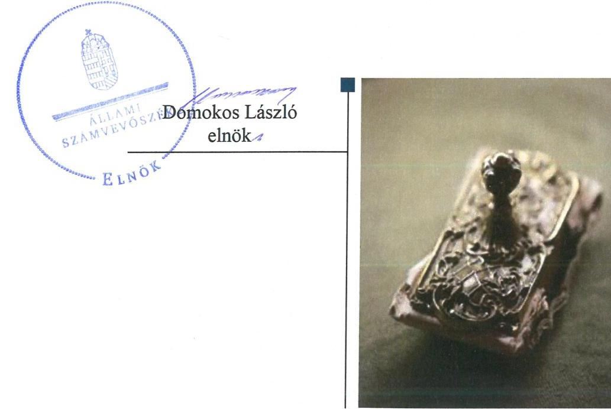
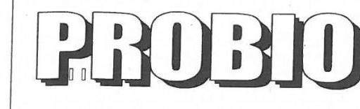
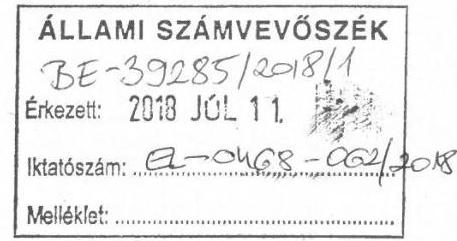
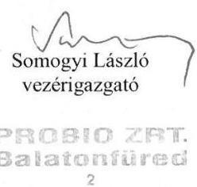
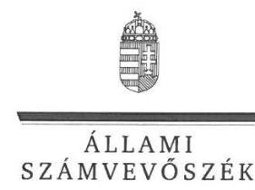
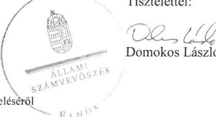
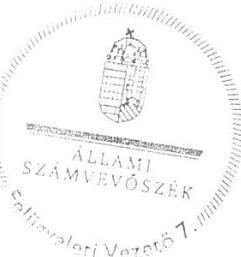

# Jelentés 

## Az önkormányzatok gazdasági társaságai

Az önkormányzatok többségi tulajdonában lévő gazdasági társaságok gazdálkodásának ellenőrzése - PROBIO Balatonfüredi
Településüzemeltetési Zártkörűen Működő Részvénytársaság
2018.

---

# Jelentés 

## Az önkormányzatok gazdasági társaságai

Az önkormányzatok többségi tulajdonában lévő gazdasági társaságok gazdálkodásának ellenőrzése - PROBIO Balatonfüredi
Településüzemeltetési Zártkörűen Működő Részvénytársaság
2018. 10. hó 04. nap

---

# AZ ELLENŐRZÉST FELÜGYELTE:

DR. HORVÁTH MARGIT felügyeleti vezető

## AZ ELLENŐRZÉST VEZETTE ÉS A VÉGREHAJTÁSÁÉRT FELELŐS:

GÖRGÉNYI GÁBOR ellenőrzésvezető

## A PROGRAM ÖSSZEÁLLÍTÁSÁÉRT FELELŐS:

TÓTPÁL SZABOLCS osztályvezető

IKTATÓSZÁM: EL-0468-067/2018.

TÉMASZÁM: 2447

ELLENŐRZÉS-AZONOSÍTÓ SZÁM: V079372

Jelentéseink az Országgyűlés számítógépes hálózatán és az Interneta a www.asz.hu címen is olvashatóak.

---

# TARTALOMJEGYZÉK 

■ ÖSSZEGZÉS ..... 5
■ AZ ELLENŐRZÉS CÉLJA ..... 6
■ AZ ELLENŐRZÉS TERÜLETE ..... 7
■ AZ ELLENŐRZÉS HÁTTERE, INDOKOLTSÁGA ..... 9
■ A JELENTÉS LÉNYEGES KÉRDÉSKÖREI ..... 10
■ AZ ELLENŐRZÉS HATÓKÖRE ÉS MÓDSZEREI ..... 11
■ MEGÁLLAPÍTÁSOK ..... 13
■ JAVASLATOK ..... 17
■ MELLÉKLETEK ..... 19
I. sz. melléklet: Értelmező szótár ..... 19
II. sz. melléklet: Pénzügyi adatok ..... 20
■ FÜGGELÉK: ÉSZREVÉTELEK ..... 21
■ RÖVIDÍTÉSEK JEGYZÉKE ..... 35

---

.

---

# ÖSSZEGZÉS 

Balatonfüred Város Önkormányzata nem alakította ki szabályszerűen a tulajdonosi joggyakorlás kereteit, de a tulajdonosi jogait szabályszerűen gyakorolta a Társaság felett. A PROBIO Balatonfüredi Településüzemeltetési Zártkörüen Müködő Részvénytársaság gazdálkodásának szabályozottsága, gazdálkodása és vagyongazdálkodási tevékenysége nem volt szabályszerű. A Társaságnál a közvagyonnal való felelős gazdálkodás és a közpénzek felhasználásának átláthatósága sem volt biztositott.

## Az ellenőrzés társadalmi indokoltsága

Magyarországon az önkormányzatok kötelező és önként vállalt feladataik vonatkozásában is egyre szélesebb körben alkalmazzák a költségvetésen kívüli feladatellátást. Helyi szinten ennek legfontosabb szereplői az önkormányzati tulajdonban lévő gazdasági társaságok, amelyek ellenőrzése kiemelten fontos a közfeladat ellátása, a közvagyon megőrzése, megóvása érdekében. Alapvető követelmény tehát, hogy müködésük, gazdálkodásuk szabályszerű legyen.

Az Állami Számvevőszék kiemelt célja, hogy a helyi önkormányzatok gazdálkodásában rejlő pénzügyi kockázatok feltárásával, az államháztartáson kívülre nyújtott költségvetési támogatások és ingyenes vagyonjuttatások, valamint az államháztartáson kívül müködő feladat-ellátó rendszerek ellenőrzéseivel hozzájáruljon ahhoz, hogy a közpénzeket az államháztartáson kívül müködő szervezetek is átlátható, rendezett módon használják fel.

Az Állami Számvevőszék céljaival és a társadalmi igénnyel összhangban, valamint a gazdasági társaságok fontos szerepe miatt került sor a PROBIO ZRT. ellenőrzésére. Az ellenőrzést a Társaság feladatellátásából adódó további társadalmi elvárás is indokolta. Balatonfüred városában és a környező településeken 2013. évben a PROBIO ZRT. látta el a hulladékgazdálkodási közszolgáltatási feladatokat. Emellett a 2013-2016. években ingatlan- és városüzemeltetési, továbbá a parkok- és egyéb közterületek fenntartásával, a köztemető, a strandok, valamint a parkolók üzemeltetéssel kapcsolatos feladatokat végzett.

## Főbb megállapítások, következtetések, javaslatok

Balatonfüred Város Önkormányzatánál a tulajdonosi joggyakorlás kereteinek kialakítása nem volt szabályszerű a Társaság feladatellátására vonatkozó közszolgáltatási szerződés hiánya, valamint a Társaság javadalmazási szabályzata megalkotásának elmaradása miatt. A tulajdonosi joggyakorlás ugyanakkor szabályszerű volt.

A PROBIO Balatonfüredi Településüzemeltetési Zártkörűen Müködő Részvénytársaság gazdálkodásának szabályozottsága nem felelt meg a jogszabályi előírásoknak. A Társaság 2013-2015. években a számviteli törvényben előírt szabályzatokat elkészítette, de a számviteli politika, a számlarend, a pénzkezelési, valamint az önköltség számítási szabályzat nem felelt meg a jogszabályi előírásoknak. A Társaság nem rendelkezett a közérdekú adatok közzétételének rendjét rögzítő szabályzattal.

A Társaság gazdálkodási tevékenysége nem volt szabályszerű, mert a személyi jellegű, az anyagjellegű és egyéb ráfordások, továbbá a bevételek elszámolása nem szabályszerűen történt. A Társaság elkészítette üzleti terveit, az előírt beszámolási kötelezettségét teljesítette, azonban a közérdekú adatokra vonatkozó közzétételi kötelezettségének nem tett eleget.

A Társaság vagyongazdálkodási tevékenysége nem volt szabályszerű, mert a tárgyi eszközök nyilvántartásba vételét nem dokumentálták, továbbá a beszámoló mérlegének adatait a Társaság nem támasztotta alá leltárral.

Az Állami Számvevőszék a Társaság vezérigazgatójának 7, a polgármesternek 3 javaslatot fogalmazott meg annak érdekében, hogy a szabálytalanságok, hiányosságok megszüntetésre kerüljenek.

---

# AZ ELLENŐRZÉS CÉLJA 

Az ellenőrzés célja annak értékelése volt, hogy az önkormányzat vagyongazdálkodási tevékenysége során szabályszerűen gyakorolta-e tulajdonosi jogait; a gazdasági társaság szabályozottsága, gazdálkodása és vagyongazdálkodási tevékenysége, bevételeinek és ráfordításainak elszámolása megfelelt-e a jogszabályi és tulajdonosi előírásoknak; a gazdasági társaság kötelezettségállománya jelent-e kockázatot a múködésre, valamint a gazdálkodás átláthatósága és elszámoltathatósága érdekében biztosítva volt-e a szolgáltatás dijának megalapozottsága szabályszerű önköltségszámítással.

---

# **AZ ELLENŐRZÉS TERÜLETE**

## **Balatonfüred Város Önkormányzata és a kizárólagos tulajdonában lévő PROBIO ZRT.**

Balatonfüred Város Önkormányzata 1991. április 1-jén alapította a Balatonfüredi Városgazdálkodási Vállalat átalakításával a PROBIO Balatonfüredi Településüzemeltetési Részvénytársaságot, amelynek neve 2005. augusztus 18-tól PROBIO Balatonfüredi Településüzemeltetési Zártkörűen Működő Részvénytársaságra, rövid nevén PROBIO ZRT.-re változott. A Társaság^{1} egyedüli részvényese az Önkormányzat^{2}. Az ellenőrzött időszakban a Polgármester^{3} és a Jegyző^{4} személyében nem történt változás.

A Társaság főtevékenysége 2013. október 31. előtt nem veszélyes hulladék gyűjtése volt, majd azt követően zöldterületkezelés lett. A Társaság a Mötv.^{5} szerinti közfeladatok közül településüzemeltetési feladatokat, ezen belül köztemető üzemeltetést, közutak, közparkok és egyéb közterületek fenntartását, gépjárművek parkolóhelyeinek üzemeltetését, valamint a 2013. évben hulladékkezelés közszolgáltatási tevékenységet végzett; vállalkozási tevékenység keretében lakás- és helyiséggazdálkodással kapcsolatos feladatokat, városi strandok, vásárcsarnok és látogatóközpont üzemeltetését látta el.

A Társaság 5 tagból álló igazgatóságának^{6} összetétele egy tag esetében változott, a vezérigazgató^{7} személyében nem történt változás. A Társaságnál háromtagú felügyelőbizottság^{8} és választott könyvvizsgáló működött.

A Társaság 2013. és 2016. évi gazdálkodásának főbb adatait az 1. táblázat, az éves beszámolók részletesebb adatait a II. sz. melléklet tartalmazza.

1. táblázat

|  A TÁRSASÁG FŐBB GAZDÁLKODÁSI ADATAI 2013-2016. ÉVEKBEN |  |  |  |   |
| --- | --- | --- | --- | --- |
|  Összeg (M Ft) | 2013. | 2014. | 2015. | 2016.  |
|  Nettó árbevétel | 1009,9 | 752,5 | 792,7 | 817,0  |
|  Üzemi tevékenység eredménye | 59,8 | 49,0 | 43,4 | 64,9  |
|  Adózott eredmény | 40,5 | 34,0 | 35,9 | 56,0  |
|  Fő | 2013. | 2014. | 2015. | 2016.  |
|  Foglalkoztatottak száma (átlagos statisztikai létszám) | 119 | 98 | 102 | 98  |

*Forrás: A Társaság 2013-2016. évi beszámolói*

A Társaság a 2013-2016. években nyereségesen gazdálkodott, saját tőkéje folyamatosan nőtt. A vállalkozási tevékenységből származó bevételek 2013-ban a nettó árbevétel 40%-át, míg 2016-ban annak 51%-át tették ki. Az Önkormányzatnak tőkepótlási kötelezettsége nem volt.

A Társaság alapításkori jegyzett tőkéje 2013. január 1-jén 400,5 M Ft volt, amely az Önkormányzat által végrehajtott alaptőke emelések eredményeként 2014. május 22-től 426,5 M Ft-ra, majd 2015. április 30-től 485,3 M Ft-ra emelkedett.

---

Az Önkormányzat a Társaság feladatellátásához a 2013-2016. években 2,1 M Ft, 2,4 M Ft, 2,4 M Ft és 3,4 M Ft eseti működési célú, illetve 2016. évben 12,0 M Ft fejlesztési célú támogatást nyújtott.

A Társaságnak 2013. évben három, 2014-2016. években négy gazdasági társaságban volt tulajdonosi részesedése, két társaságban 100,0\%-os tulajdonosi részaránnyal, a további kettőben 26,0\%-os, illetve 25,0\%-os tulajdonosi részaránnyal rendelkezett.

A Társaság vagyonkezelésbe vett állami, vagy önkormányzati vagyonnal nem rendelkezett, tevékenységét saját vagyonával látta el. A Társaság nem tartozott a kormányzati szektorba sorolt egyéb szervezetek körébe.

---

# AZ ELLENŐRZÉS HÁTTERE, INDOKOLTSÁGA 

AZ ÖNKORMÁNYZATOK TÖBBSÉGI TULAJDONÁBAN ÁLLÓ GAZDASÁGI TÁRSASÁGOK ellenőrzése kiemelten fontos a vagyon megőrzése, megóvása érdekében. A feladatellátás költségeinek, ráfordításainak alakulása a lakosság széles rétegét érinti. Ellenőrzéseink feltárhatják, hogy az önkormányzat a feladatellátásához rendelt vagyon múködtetését a tulajdonostól elvárható gondossággal vé-gezte-e, a feladatot ellátó gazdasági társaság a létesítő okiratban, szolgáltatási szerződésben foglaltak betartásával biztosította-e a feladat ellátását. Az ellenőrzés eredményeképp meghatározhatóvá válnak a költségvetési hiányt befolyásoló szervezetek kockázatai, lehetővé válik ezen kockázatok csökkentése. Az ellenőrzés rávilágíthat arra, hogy a gazdasági társaság a vagyon használatával biztosította-e a szolgáltatás folytatásának feltételeit, az önkormányzat tulajdonosi felügyelete hozzájárult-e a szabályszerű gazdálkodáshoz és feladatellátáshoz. A megállapítások alapján megfogalmazott számvevőszéki javaslatok hasznosítása elősegítheti a meglévő hibák megszüntetését. A jó gyakorlatok bemutatásával az ÁSZ ${ }^{9}$ hozzájárulhat a követendő megoldások megismertetéséhez, terjesztéséhez.

---

# A JELENTÉS LÉNYEGES KÉRDÉSKÖREI 

1.- Az Önkormányzat tulajdonosi joggyakorlása szabályszerű volt-e?
2.- A Társaság müködésének szabályozottsága megfelelt-e a jogszabályi előírásoknak, a gazdálkodási tevékenysége szabályszerű volt-e, fizetőképessége biztositott volt-e a gazdálkodás során?
3.- A Társaság vagyongazdálkodási tevékenysége szabályszerű volt-e?

---

# AZ ELLENŐRZÉS HATÓKÖRE ÉS MÓDSZEREI 

## Az ellenőrzés típusa

Megfelelőségi ellenőrzés

## Az ellenőrzött időszak

2013. január 1-jétől 2016. december 31-ig tartó időszak.

## Az ellenőrzés tárgya

Balatonfüred Város Önkormányzata 100\%-os tulajdonában álló PROBIO Balatonfüredi Településüzemeltetési Zártkörűen Működő Részvénytársaság feletti tulajdonosi joggyakorlása, valamint a Társaság gazdálkodásának szabályozottsága és szabályszerűsége.

Az ellenőrzés kiterjedt minden olyan körülményre és adatra, amely az ÁSZ jogszabályban meghatározott feladatainak teljesítéséhez, valamint a program végrehajtása folyamán felmerült újabb összefüggések feltárásához szükséges.

## Az ellenőrzött szervezet

Balatonfüredi Város Önkormányzata, valamint a PROBIO Balatonfüredi Településüzemeltetési Zártkörűen Működő Részvénytársaság.

## Az ellenőrzés jogalapja

Az ellenőrzés jogszabályi alapját az az Állami Számvevőszékről szóló 2011. évi LXVI. törvény 1. § (3) bekezdése és 5. § (3)-(5) bekezdései képezték.

## Az ellenőrzés módszerei

Az ellenőrzést a nemzetközi standardokat irányadónak tekintve az ellenőrzési program ellenőrzési kérdései, az ellenőrzött időszakban hatályos jogszabályok, az ellenőrzés szakmai szabályok és módszertanok figyelembe vételével végeztük.

Az ellenőrzés ideje alatt az ellenőrzött szervezettel történő kapcsolattartást az ÁSZ Szervezeti és Múködési Szabályzatának vonatkozó előírásai alapján biztosítottuk.

---

Az ellenőrzési kérdések megválaszolásához szükséges bizonyítékok megszerzése a következő ellenőrzési eljárások alkalmazásával történt: megfigyelés, kérdésfeltevés (információkérés), összehasonlítás, valamint elemző eljárás. Az ellenőrzési bizonyítékként felhasználható adatforrások közé tartoztak egyrészt az ellenőrzési programban felsorolt adatforrások, másrészt adatforrás lehetett még minden - az ellenőrzés folyamán - feltárt, az ellenőrzés szempontjából információkat tartalmazó dokumentum. Az ellenőrzést a kérdésekre adott válaszok kiértékelésével, valamint a megjelölt adatforrások, a csatolt tanúsítványok felhasználásával, továbbá az adott időszakban hatályos jogszabályok figyelembevételével folytattuk le.

A bevételek és ráfordítások elszámolását, és a vagyonnyilvántartás terén a szabályszerű működést véletlen mintavétellel ellenőriztük. A mintavétellel ellenőrzött területek esetében minden egyes tétel vonatkozásában szabályszerűségre vonatkozó kérdéseket tettünk fel, amelyek a számviteli törvény, illetve a tulajdonosi követelményeknek és az ellenőrzött szervezet belső szabályozásai előírásainak betartására vonatkoztak. A jogszabályoknak és a belső előírásoknak megfelelőnek tekintettük az adott területet, amennyiben a minta ellenőrzésének eredménye alapján 95\%-os bizonyossággal a teljes sokaságban a hibaarány kisebb volt, mint 10\%, nem megfelelőnek értékeltük, ha a hibaarány a 10\%-ot meghaladta. A ráfordítások elszámolására és a vagyonnyilvántartásra vonatkozó véletlen mintavételt kockázati alapú kiválasztással egészítettük ki, amelynek során évente a három legnagyobb összegű tételt választottuk ki.

---

# 1. Az Önkormányzat tulajdonosi joggyakorlása szabályszerű volt-e? 

Összegző megállapítás

Az Önkormányzat a tulajdonosi joggyakorlás kereteit nem szabályszerűen alakította ki. A tulajdonosi joggyakorlás szabályszerű volt.

Az Önkormányzat a tulajdonosi joggyakorlás kereteit az Önkormányzat SZMSZ ${ }^{10}$-ében foglaltak alapján a vagyonrendelet ${ }^{11}$, az Alapszabály ${ }_{1-7}{ }^{12}$, a Társasági SZMSZ ${ }_{1-7}{ }^{13}$, valamint a Társasággal az ellátott közfeladatokkal és vállalkozási tevékenységekkel kapcsolatban megkötött vállalkozási, kegyeleti, üzemeltetési, megbízási és bérleti szerződések ${ }^{14}$ útján alakította ki.

A TULAJDONOSI JOGGYAKORLÁS KERETEIT az Önkormányzat nem szabályszerűen alakította ki. A 2013. évi hulladékgazdálkodási feladatok ellátására az Önkormányzat a Ht. ${ }^{15}$ 33. § (1) bekezdésében foglalt előírások ellenére nem kötött a Társasággal hulladékkezelési közszolgáltatási szerződést.

A Társaság - Alapító ${ }^{16}$ által elfogadott - javadalmazási szabályzata ${ }^{17}$ a Taktv. ${ }^{18}$ S. § (3) bekezdésében előírtak ellenére nem terjedt ki az Mt. 208. $\S$-ának hatálya alá eső vezető állású munkavállalókra.

A TULAJDONOSI JOGOK GYAKORLÁSA szabályszerű volt. Az Alapító - a Gt. ${ }^{19}$ és a Ptk. ${ }^{20}$ előírásaival összhangban - az Alapszabály ${ }_{1-7}$-ban előírta az Igazgatóság számára a Társaság ügyvezetéséről, vagyoni helyzetéről és üzletpolitikájáról szóló jelentésének háromhavonta a felügyelőbizottság, illetve évente legalább egyszer az Alapító elé történő terjesztését. Az Alapító az Alapszabályban és a Társasági SZMSZ-ben beszámolási, valamint üzleti terv készítési kötelezettséget írt elő a Társaság számára.

A Társaság Számv. tv. szerinti éves beszámolóiról az Alapító a Gt. és a Ptk. előírásainak megfelelően a könyvvizsgáló és a felügyelőbizottság írásbeli jelentései birtokában hozta meg elfogadó döntését. Az Alapító megtárgyalta és jóváhagyta továbbá a Társaság üzleti terveit és évente beszámoltatta a Társaságot a feladatellátásáról.

A felügyelőbizottság az Ügyrend ${ }^{21}$ 7. pontjában foglaltak ellenére a negyedéves beszámolók ellenőrzését nem látta el teljes körűen.

---

# 2. A Társaság múködésének szabályozottsága megfelelt-e a jogszabályi előírásoknak, a gazdálkodási tevékenysége szabályszerű volt-e, fizetőképessége biztosított volt-e a gazdálkodás során? 

Összegző megállapítás

A Társaság múködésének szabályozottsága nem felelt meg a jogszabályi előírásoknak. A gazdálkodási tevékenység nem volt szabályszerű. A közérdekú adatok közzétételi kötelezettségének a Társaság nem tett eleget.

A TÁRSASÁG SZABÁLYOZOTTSÁGA nem felelt meg a jogszabályi előírásoknak. A Számviteli politika ${ }_{1-2}{ }^{22}$ a Számv. tv. 14. § (4) bekezdésében foglaltak ellenére 2015. július 4-től nem tartalmazta a kivételes nagyságú vagy előfordulású bevételek, költségek, ráfordítások meghatározását. A Számlarend ${ }^{23}$ nem tartalmazta a Számv. tv. 161. § (2) bekezdése c) pontjában előírtak ellenére a főkönyvi számla és az analitikus nyilvántartás kapcsolatát.

A Pénzkezelési szabályzat ${ }_{1-5}{ }^{24}$ a Számv. tv. 14. § (8) bekezdésében foglaltak ellenére nem rendelkezett a pénzforgalom bankszámlán történő lebonyolítása rendjéről, valamint a készpénzben és a bankszámlán tartott pénzeszközök közötti forgalomról.

Az Önköltség számítási szabályzat ${ }^{25}$ a Számv. tv. 14. § (7) bekezdésében foglaltak ellenére nem szabályozta a lakás és nem lakás céljára szolgáló ingatlanok és bérlemények bérleti dijainak a Számv. tv. 51. § szerinti önköltségének megállapítását.

A Társaság rendelkezett Leltározási szabályzattal ${ }^{26}$ amely megfelelt a jogszabályi előírásoknak. Az eszközök és források jogszabályi előírásoknak megfelelő értékelési szabályait a Számviteli politika tartalmazta.

A BEVÉTELEK elszámolása nem volt szabályszerű, mert a Számv. tv. 166. § (2) bekezdésében foglaltak ellenére a meglévő bizonylatok nem támasztották alá a bevételek elszámolását.

A SZEMÉLYI JELLEGŰ RÁFORDÍTÁSOK elszámolása nem volt szabályszerű. A Számv. tv. 166. § (2) bekezdésében foglalt előírásokkal ellentétben a Társaság a bér és egyéb jövedelmek számviteli elszámolását nem támasztotta alá a meglévő számviteli bizonylat, annak adatai nem voltak helytállóak. A munkaszerződésekben rögzített alapbér és a számfejtett alapbér összege nem egyezett meg, a Cafeteria kifizetések pedig eltértek a nyilatkozatban rögzített összegtől. A jutalom elszámolását a Számv. tv. 165. § (2) bekezdésében foglaltak ellenére nem támasztotta alá szabályszerű bizonylat.

AZ ANYAGJELLEGŰ ÉS AZ EGYÉB RÁFORDÍTÁ-
SOK elszámolása nem volt szabályszerű. Az anyagjellegú ráfordítások esetében a Számv. tv. 167. § (1) bekezdés h) pontjaiban foglaltak ellenére a könyvviteli elszámolást alátámasztó bizonylatokról hiányzott, vagy nem volt megfelelő az érintett könyvviteli számlákra történő hivatkozás. Az

---

egyéb ráfordításoknál elszámolt behajthatatlan követelések leírását a Számv. tv. 166. § (2) bekezdésében foglaltak ellenére a meglévő bizonylat nem támasztotta alá, mert nem igazolta, hogy a leírt követelések megfeleltek a Számv. tv. 3. § (4) bekezdés 10. pont a)-g) pontjai szerinti kritérium(ok)nak, továbbá a bizonylatok nem tartalmazták a vezérigazgató engedélyét a Leltározási szabályzat 3.5. pontjában foglaltak ellenére.

A TÁRSASÁG LEJÁRT KÖTELEZETTSÉGEINEK értéke - amely teljes egészében rövid lejáratú kötelezettségekből tevődött össze - 27,5 M Ft-ról 53,8 M Ft-ra, közel kétszeresére növekedett az ellenőrzött időszakban.

# A KÖTELEZŐEN KÖZZÉTEENDŐ KÖZÉRDEKŰ 

ADATOKAT a Társaság az Info tv. ${ }^{27}$ 33. § (1) bekezdésében előírtak ellenére nem tette hozzáférhetővé, mert az Info tv. 37. § (1) pontjában foglaltak ellenére az Info tv. 1. melléklete szerinti, a szervezetre, annak tevékenységére és gazdálkodásra vonatkozó adatokat nem tette közzé. Nem tette közzé továbbá a Taktv. 2. § (1-3) bekezdéseiben előírt személyzeti és gazdálkodási adatokat. A Társaság, mint adatfelelős az Info tv. 35. § (3) bekezdésében foglaltak ellenére a közzétételi kötelezettség teljesítésének részletes szabályait belső szabályzatban nem állapította meg.

## A TERVEZÉSI, BESZÁMOLÁSI KÖTELEZETTSÉ-

GÉT a Társaság teljesítette, az üzleti terveit, a szakmai beszámolóit, valamint éves beszámolóit jóváhagyásra benyújtotta az Alapító részére. Az éves beszámolók jóváhagyásakor rendelkezésre álltak a felügyelőbizottsági és könyvvizsgálói jelentések. Az üzleti terveket a felügyelőbizottság megtárgyalta és azokat határozataiban elfogadta. Az Alapító határozataiban döntött a beszámolók és az üzleti tervek jóváhagyásáról. Az éves beszámolókat a Társaság a Számv. tv. előírásainak megfelelően letétbe helyezte és közzétette.

A TÁRSASÁG ÁLTAL ALKALMAZOTT DÍJ AK megállapítása - a hulladékszállítási szolgáltatások díjai kivételével - szabályszerű volt. A Számv. tv. 14. § (7) bekezdésében, valamint az Önköltség számításiszabályzat 4. pontjában foglaltak ellenére azonban a végzett szolgáltatások önköltségét nem állapították meg utókalkuláció módszerével.

A díjak megállapítása a kegyeleti szolgáltatások, a parkoló üzemeltetés és az önkormányzati lakások bérleti díjai esetében az ágazati jogszabályokban kapott felhatalmazás alapján önkormányzati hatáskörben történt, a Társaság által alkalmazott díjakat önkormányzati rendeletek tartalmazták. A köztisztasági, parkfenntartási, útkarbantartási munkák esetében az Önkormányzattal kötött szerződésekben rögzített díjakat alkalmazta a Társaság. A strandok, valamint a látogató központ belépőjegyei esetében alkalmazott árakat piaci alapon határozták meg. A 2013. évi hulladékgazdálkodási feladatok esetében a Ht. alapján nem volt az Önkormányzatnak árszabályozási jogköre.

A 2013. évi hulladékszállítási szolgáltatások díjai megállapításának értékelését korlátozta a díjmegállapítást megalapozó adatokat tartalmazó dokumentumok hiánya, valamint a hulladék-kezelési közszolgáltatási szerző-

---

dés megkötésének elmaradása. Ebből eredően a 2013. évi hulladékszállítási szolgáltatások díjainak megállapítása nem felelt meg a Ht. 91. § (1)-(2) bekezdés előírásainak.

# 3. A Társaság vagyongazdálkodási tevékenysége szabályszerű volt-e? 

Összegző megállapítás

A Társaság vagyongazdálkodási tevékenysége nem volt szabályszerű.

A TÁRSASÁG AZ ÉVES BESZÁMOLÓINAK MÉR-
LEG TÉTELEIT a Számv. tv. 69. § (1) bekezdésében foglaltak elle-
nére-leltározás és leltár hiányában - a törvénynek megfelelő leltárral nem
támasztotta alá, ebből eredően a mérlegtételek vonatkozásában nem volt
biztosított a Számv. tv. 15. § (3) bekezdésében foglalt valódiság elve. A
Számv. tv. 69. § (3) bekezdésében foglaltak ellenére elmaradt a mennyiségi
felvétellel történő leltározás. A törvénynek megfelelő leltár hiánya ellenére
a könyvvizsgáló a beszámolót korlátozás nélküli hitelesítő záradékkal látta
el.

A VAGYON NYILVÁNTARTÁSA ÉS AZ ÉRTÉK-
CSÖKKENÉS ELSZÁMOLÁSA nem volt szabályszerű, mert a
tárgyi eszközök nyilvántartásba vétele során a Számv. tv. 52. § (2) bekez-
désében előírtak ellenére az üzembe helyezést hitelt érdemlően nem do-
kumentálták. A Társaság a Számv. tv. 165. § (2) bekezdésében foglaltak el-
lenére az üzembe helyezésről a törvénynek megfelelő bizonylatot nem állított ki.

---

# JAVASLATOK 

Az ÁSZ tv. 33. § (1) bekezdésében foglaltak értelmében az ellenőrzött szervezet vezetője köteles a jelentésben foglalt megállapításokhoz kapcsolódó intézkedési tervet összeállítani és azt a jelentés kézhezvételétől számított 30 napon belül az ÁSZ részére megküldeni. Amennyiben az ellenőrzött szervezet vezetője nem küldi meg határidőben az intézkedési tervet, vagy továbbra sem elfogadható intézkedési tervet küld, az Állami Számvevőszék elnöke az ÁSZ tv. 33. § (3) bekezdése a) és b) pontjaiban foglaltakat érvényesítheti.

## PROBIO Balatonfüredi Településüzemeltetési Zrt. vezérigazgatójának

1. Intézkedjen a számviteli politika, a pénzkezelési szabályzat, valamint az önköltség számítási szabályzat módosításáról a hatályos Számv. tv.ben elöirtaknak megfelelően.
(2. sz. megállapítás 1-2. és 3. bekezdései alapján)
2. Intézkedjen a bevételek, valamint a személyi jellegü ráfordítások elszámolásának a Számv. tv. előirásainak megfelelő számviteli bizonylattal történő alátámasztásáról.
(2. sz. megállapítás 5. és 6. bekezdései alapján)
3. Intézkedjen az anyagjellegü és egyéb ráfordítások elszámolásának a Számv. tv. előirásainak megfelelő számviteli bizonylattal történő alátámasztásáról és a behajthatatlan követeléseknek a Számv. tv.-ben és a leltározási szabályzatban elöirtak szerinti leírásáról.
(2. sz. megállapítás 7. bekezdése alapján)
4. Intézkedjen az Info tv., valamint a Taktv. szerinti közzétételi kötelezettség teljesítéséről, továbbá a közzétételi kötelezettség teljesitésének részletes szabályait rögzítő szabályzat elkészítéséről az Info tv. előirásainak megfelelően.
(2. sz. megállapítás 9. bekezdése alapján)
5. Intézkedjen a végzett szolgáltatások önköltségének a Számv. tv.-ben és az önköltség számítási szabályzatban elöirtak szerinti megállapításáról.
(2. sz. megállapítás 11. bekezdése alapján)

---

6. Intézkedjen az éves beszámoló mérlegtételeinek a Számv. tv. előírásainak megfelelő leltárral való alátámasztásáról.
(3. sz. megállapítás 1. bekezdése alapján)
7. Intézkedjen az eszközök üzembe helyezésének a Számv. tv. előírásainak megfelelő számviteli bizonylattal történő dokumentálásáról.
(3. sz. megállapítás 2. bekezdése alapján)

# Balatonfüred Város Önkormányzata polgármesterének 

1. Kezdeményezze az Alapítónál a javadalmazási szabályzat módosítását annak érdekében, hogy annak hatálya terjedjen ki az Mt. 208. 5 -ának hatálya alá eső munkavállalókra is.
(1. sz. megállapítás 3. bekezdése alapján)
2. Kezdeményezze az FB elnökénél a Felügyelő Bizottság ügyrendjében elrendelt feladatok teljesitését.
(1. sz. megállapítás 6. bekezdése alapján)
3. Intézkedjen
a) a számviteli szabályozási hiányosságok,
b) a társaság által végzett valamennyi szolgáltatás önköltségének Számv. tv. és önköltség számítási szabályzat előírásai szerinti megállapításának elmaradása,
c) az éves beszámoló mérlegsorait alátámasztó megfelelő leltár hiánya,
d) a közzétételi kötelezettség teljesitésének hiányosságai,
e) a közzétételi kötelezettség teljesitésének részletes szabályait rögzítő szabályzat elkészitésének elmulasztása,
f) a behajthatatlan követelések nem szabályszerű leírása,
g) az anyagjellegü és egyéb ráfordításoknak, a személyi jellegü ráfordításoknak, a tárgyi eszközök üzembe helyezésének számviteli bizonylattal történő dokumentálásának hiányosságai
miatti felelősség tisztázása érdekében, és szükség szerint intézkedjen a felelősség érvényesitéséről.
(2. sz. megállapítás 1-2. és 3. bekezdései, 2. sz. megállapítás 5-7. bekezdései, 2. sz. megállapítás 9. bekezdése, 2. sz. megállapítás 11. bekezdése, 3. sz. megállapítás 1. bekezdése, 3. sz. megállapítás 2. bekezdése alapján)

---

# MELLÉKLETEK 

- I. SZ. MELLÉKLET: ÉRTELMEZŐ SZÓTÁR
gazdasági társaság
gazdálkodó szervezet
kormányzati szektorba sorolt egyéb szervezet
közszolgáltatás
nemzeti vagyon

Ptk. 3:88. § (1) bekezdése szerint „a gazdasági társaságok üzletszerű közös gazdasági tevékenység folytatására, a tagok vagyoni hozzájárulásával létrehozott, jogi személyiséggel rendelkező vállalkozások, amelyekben a tagok a nyereségből közösen részesednek, és a veszteséget közösen viselik".
A Ptk. 685. § c) pontja szerint gazdálkodó szervezet: „az állami vállalat, az egyéb állami gazdálkodó szerv, a szövetkezet, a lakásszövetkezet, az európai szövetkezet, a gazdasági társaság, az európai részvénytársaság, az egyesülés, az európai gazdasági egyesülés, az európai területi együttmúködési csoportosulás, az egyes jogi személyek vállalata, a leányvállalat, a vízgazdálkodási társulat, az erdő birtokossági társulat, a végrehajtói iroda, az egyéni cég, továbbá az egyéni vállalkozó." (2014. 03.15-ig hatályos)
az Áht. ${ }^{28}$ 3. § (2) és (3) bekezdésében foglaltakon kívül az Európai Közösséget létrehozó szerződéshez csatolt, a túlzott hiány esetén követendő eljárásról szóló jegyzőkönyv alkalmazásáról szóló 2009. május 25-i 479/2009/EK rendelet (a továbbiakban: 479/2009/EK rendelet) szerint a kormányzati szektorba sorolt szervezet (Áht. 1. § (12) bekezdés)

Az Ebktv. ${ }^{29}$ 3. § d) pontja a következőképpen határozza meg a közszolgáltatást: „szerződéskötési kötelezettség alapján a lakosság alapvető szükségleteinek ellátására irányuló szolgáltatás, így különösen a villamos energia-, gáz-, hő-, víz-, szenny-víz- és hulladékkezelési, köztisztasági, postai és távközlési szolgáltatás, továbbá a menetrend alapján közlekedő járművekkel végzett közforgalmú személyszállítás".
Nvtv. 1. § (2) bekezdése szerint többek között:
„az állam vagy a helyi önkormányzat kizárólagos tulajdonában álló dolgok, az a) pont hatálya alá nem tartozó, állam vagy a helyi önkormányzat tulajdonában lévő dolog,
az állam vagy a helyi önkormányzat tulajdonában lévő pénzügyi eszközök, továbbá az államot vagy a helyi önkormányzatot megillető társasági részesedések, az államot vagy a helyi önkormányzatot megillető bármely vagyoni értékkel rendelkező jogosultság, amelyet jogszabály vagyoni értékű jogként nevesít."

---

# A PROBIO BALATONFÜREDI TELEPÜLÉSÜZEMELTETÉSI ZÁRTKÖRŰEN MŰKÖDŐ RÉSZVÉNYTÁRSASÁG ÉVES BESZÁMOLÓINAK ADATAI (M Ft)

|  Eredménykimutatás | 2013. év | 2014. év | 2015. év | 2016. év  |
| --- | --- | --- | --- | --- |
|  Értékesítés nettó árbevétele | 1009,9 | 752,5 | 792,7 | 817,0  |
|  Egyéb bevételek | 51,5 | 96,6 | 50,7 | 92,9  |
|  Anyagjellegú ráfordítások | 506,1 | 343,4 | 364,4 | 356,4  |
|  Személyi jellegú ráfordítások | 356,0 | 299,9 | 311,5 | 323,0  |
|  Értékcsökkenési leírás | 111,2 | 115,5 | 114,6 | 116,1  |
|  Egyéb ráfordítások | 37,0 | 35,9 | 23,7 | 62,3  |
|  Üzemi tevékenység eredménye | 59,8 | 49,0 | 43,4 | 64,9  |
|  Mérleg szerint eredmény/Adózott eredmény* | 40,5 | 34,0 | 35,9 | 56,0  |

- A 2013-2015. években az adózott eredmény és a mérleg szerinti eredmény megegyezett. A Számv. tv. 2015. július 4-től hatályos módosítása alapján a mérleg szerinti eredmény tétel megszűnt. A 2016. évi egyszerűsített éves beszámoló eredménykimutatásában az adózott eredmény levezetését kellett kimutatni.

---

# FÜGGELÉK: ÉSZREVÉTELEK 

A jelentéstervezetet a Számvevőszék 15 napos észrevételezésre megküldte az ellenőrzött szervezetek vezetőinek az ÁSZ tv. 29. §* (1) bekezdése előírásának megfelelően.

A jelentés tartalmazza az ellenőrzött PROBIO Balatonfüredi Településüzemeltetési Zrt. vezérigazgatójától érkezett észrevételeket, illetve az el nem fogadott észrevételek elutasításának indokolását. Balatonfüred Város Önkormányzatának polgármestere - az ÁSZ tv. 29. § (2) bekezdésében foglaltak szerinti - észrevételezési jogával nem élt, az ellenőrzés megállapításaira nem tett észrevételt.

[^0]
[^0]:    * 29. § (1) Az Állami Számvevőszék az ellenőrzési megállapításait megküldi az ellenőrzött szervezet vezetőjének vagy az általa megbízott személynek, és annak, akinek személyes felelősségét állapította meg.
    (2) Az ellenőrzött szervezet vezetője és a felelősként megjelölt személy az ellenőrzés megállapításaira tizenöt napon belül írásban észrevételt tehet.
    (3) Az Állami Számvevőszék az észrevételre a beérkezésétől számított harminc napon belül írásban válaszol. A figyelembe nem vett észrevételeket köteles a jelentésben feltüntetni, és megindokolni, hogy azokat miért nem fogadta el.

---

# AOHG

## Hovatch M.

BALATONFÜREDI TELEPÜLÉSÜZEMELTETÉSI ZÁRTKÖRÜEN MÜKÖDŐ RÉSZVÉNYTÁRSASÁG
8230 Balatonfüred, Fürdő u. 20. Pf. 265
Ügyfélszolgálat: (87) 342-633, fax: (87) 342-380
Cg 19-10-500007, Adó ig. sz.: 10556007-2-19
e-mail: 0 HYPERLINK "mailto:probiort@probiort.hu"

## Állami Számvevőszék

**Domokos László**
**elnők**

## Budapest

Apáczai Csere János u. 10.
1052

## Tisztelt Elnök Úr!

Hiv. szám: EL-0468-057/2018
Iktatószám: 0225001/1001/2018
Kelt: Balatonfüred, 2018.07.03.
Tárgy: észrevétel

A PROBIO Balatonfüredi Településüzemeltetési Zrt. törvényes képviseletében eljárva, hivatkozva az Állami Számvevőszékről szóló 2011. évi LXVI. törvény 29. § (2) bekezdésében foglaltakra, a fenti számon Társaságunk részére 2018. június 22. napján kézbesített jelentéstervezetükben (a továbbiakban: Tervezet) foglalt megállapításokra az alábbi észrevételeket teszem.

## I. Megállapítások 2. pont:

1. A Számviteli Politika 2015. július 4-től nem tartalmazza a kivételes nagyságú vagy előfordulású bevételek, költségek, ráfordítások meghatározását.

Az erre vonatkozó megállapítást elismerjük, pótoljuk.

2. A Számlarend nem tartalmazza a Számv.tv. 161.§. (2) bekezdése c) pontjában előírtak ellenére a főkönyvi számla és az analitikus nyilvántartás kapcsolatát.

A Tervezet megállapításával szemben a feltöltött Számlarend tartalmazza - a hivatkozott jogszabályi rendelkezésnek megfelelően - a főkönyvi és az analitikus nyilvántartás kapcsolatát.

3. A Pénzkezelési szabályzat a Számv.tv. 14. § (8) bekezdésében foglaltak ellenére nem rendelkezett a pénzforgalom bankszámlán történő lebonyolítása rendjéről, valamint a készpénzben és a bankszámlán tartott pénzeszközök közötti forgalomról.

A megállapítást elismerjük, pótoljuk.

4. A Társaság a Számv.tv. 161/A. § (2) bekezdésében foglaltak ellenére a 2013. évi belső szabályozásában nem részletezte tovább a 2013. évben végzett hulladékgazdálkodási közszolgáltatási közfeladat bevételeinek és ráfordításainak elkülönített könyvelésének szabályrendszerét.

Társaságunknál a számlatükör úgy került kialakításra, hogy az biztosítja az elkülönített könyvelést.

---

5. Az Önköltség számítási szabályzat a Számv.tv. 14. § (7) bekezdésében foglaltak ellenére nem szabályozta a lakás és nem lakás céljára szolgáló ingatlanok és bérlemények bérleti dijainak a Számv.tv. 51. § szerinti önköltségének megállapítását.

Társaságunknál az egyes tevékenységekről negyedévente kimutatás készül.
6. A bevételek elszámolása nem volt szabályszerü, mert a Számv.tv. 166. § (2) bekezdésében foglaltak ellenére a meglévő bizonylatok nem támasztották alá a bevételek elszámolását.

A bevételekről szerződés, megállapodás, ezek hiányában jogszabály alapján (hulladékszállítási tevékenység) vagy szállítólevél, menetlevél alapján készül a számla. Egyéb szolgáltatásoknál (pl. kivitelezés) teljesítésigazolás a számla melléklete. Készpénzes kifizetésnél pénztárgép nyugtaösszesítő vagy készpénzfizetési számla készül. Egyéb bevételek bankbizonylat, vegyes bizonylat alapján kerül elszámolásra. A fentiekre tekintettel a megállapítást vitatjuk, mivel Társaságunknál a bevételek elszámolása minden esetben alátámasztott.
7. A személyi jellegü ráfordítások elszámolása nem volt szabályszerü. A Számv.tv. 166. § (2) bekezdésében foglalt elöirásokkal ellentétben a Társaság a bér és egyéb jövedelmek számviteli elszámolását nem támasztotta alá a meglévő számviteli bizonylat, annak adatai nem voltak helytállóak. A munkaszerzödésekben rögzített alapbér és a számfejtett alapbér összege nem egyezett meg, a Cafeteria kifizetések pedig eltértek a nyilatkozatban rögzített összegtől. A jutalom elszámolását a Számv.tv. 165. § (2) bekezdésében foglaltak ellenére nem támasztotta alá szabályszerü bizonylat.

Az ellenőrzésre beküldött 50 fős mintavételből 17 esetben csak a munkaviszony létesítésekor megkötött munkaszerződés került beküldésre, az aktuális évre vonatkozó besorolási bért módosító munkaszerződés módosítást nem csatoltuk be, mivel az Állami Számvevőszék vonatkozó adatkérése - álláspontunk szerint - nem volt egyértelmü.
Az eltérés okai:

- Újonnan belépő munkavállalók foglalkoztatásának első 6 hónapjában csak fix összegủ Erzsébet utalvány juttatásra volt jogosult, a Cafetéria nyilatkozat szerinti választásra ezután vált jogosulttá, így az éves kifizetés nem egyenlő a nyilatkozattal.
- Azon munkavállaló esetében, aki határozatlan idejű munkaszerződést kötött, de a próbaidő alatt megszűnt a munkaviszonya, értelemszerủen nincs Cafetéria nyilatkozat, de volt Erzsébet utalvány kifizetés.
- Ha a munkavállaló egyéb béren kívüli juttatásként adózó Cafetéria juttatást kért, az egyéb béren kívüli és a béren kívüli juttatás adóterhe közötti különbséggel csökkentettük a kifizetendő összeget. Ez a különbség szintén mutatkozhat a bérkartonon szereplő és a Cafetéria nyilatkozaton szereplő összegek között.
- Határozott idejű munkaviszonyban foglalkoztatott munkavállaló Erzsébet utalvány juttatást kapott Cafetéria nyilatkozat nélkül a Társaság munkaügyi szabályzatunk értelmében.
- A beküldött 50 fős iratanyagból három munkavállalónál nem csatoltunk cafetéria nyilatkozatot, holott az rendelkezésre állt.
A Cafetéria kifizetés elöírásait tartalmazó Munkaügyi Szabályzatot nem kérték be az ellenőrzés során, holott ezen szabályzat ismeretének hiányában a munkaügyi kérdések ellenőrzése körében megalapozott megállapítások csak korlátozottan tehetők.

---

A jutalom kifizetése a bérjegyzéken külön soron fel van tüntetve, amely szabályszerű bizonylatként alátámasztja az elszámolást.
7. Az anyagjellegü ráfordítások esetében a Számv.tv. 167. § (1) bekezdés h) pontjában foglaltak ellenére a könyvviteli elszámolást alátámasztó bizonylatokról hiányzott, vagy nem volt megfelelő az érintett könyvviteli számlákra történő hivatkozás.

Minden esetben kontírozunk minden bizonylatot. A bizonylatok főkönyvi könyvelése is két lépcsőben történik: A kontírozást végző munkavállaló könyveli, majd egy másik munkavállaló jóváhagyja a főkönyvben. A folyamat során a szükséges mellékletek ellenőrzése megtörténik.
8. Az egyéb ráfordításoknál elszámolt behajthatatlan követelések leírását a Számv.tv. 166. § (2) bekezdésében foglaltak ellenére a meglévő bizonylat nem támasztotta alá, mert nem igazolta, hogy a leírt követelések megfeleltek a Számv.tv. 3. § (4) bekezdés 10. pont a)-g) pontjai szerinti kritériumoknak, továbbá a bizonylatok nem tartalmazták a vezérigazgató engedélyét a Leltározási szabályzat 3.5. pontjában foglaltak ellenére.

Az elszámolást a Számv.tv. vonatkozó előírásainak megfelelően végezzük, minősítve a követelést, melyről feljegyzést készítünk az indoklással, mellékletben a szükséges okírattal, amely a végrehajtó, vagy a felszámoló nyilatkozata. A leírást a gazdasági igazgató engedélyezi, a vezérigazgatóval történt egyeztetés után.
9. A kötelezően közzéteendő közérdekü adatokat a Társaság az Info tv. 33. § (1) bekezdésében elöirtak ellenére nem tette hozzáférhetővé, mert az Info tv. 37. § (1) pontjában foglaltak ellenére az Info tv. 1. melléklete szerinti, a szervezetre, annak tevékenységére és gazdálkodására vonatkozó adatokat nem tette közzé. Nem tette közzé továbbá a Taktv. 2. § (1-3) bekezdéseiben elöirt személyzeti és gazdálkodási adatokat. A Társaság, mint adatfelelős az Info tv. 35. § (3) bekezdésétében foglaltak ellenére a közzétételi kötelezettség teljesitésének részletes szabályait belső szabályzatban nem állapította meg.

A megállapítást elismerjük, pótoljuk.
10. A Társaság által alkalmazott díjak megállapítása - a hulladékszállítási szolgáltatások díjai kivételével - szabályszerű volt. A Számv.tv. 14. § (7) bekezdésében, valamint az Önköltség számítási szabályzat 4. pontjában foglaltak ellenére azonban a végzett szolgáltatások önköltségét nem állapították meg utókalkuláció módszerével.

A vizsgált időszakban már a hulladékról szóló 2012. évi CLXXXV. törvény által előírt hulladékszállítási díjat kellett alkalmazni.

# II. Megállapítások 3. pont: 

1. A Társaság az éves beszámolóinak mérleg tételeit a Számv.tv. 69. § (1) bekezdésében foglaltak ellenére - leltározás és leltár hiányában - a törvénynek megfelelő leltárral nem támasztotta alá, ebből eredően a mérlegtételek vonatkozásában nem volt biztositott a Számv.tv. 15. § (3) bekezdésében foglalt valódiság elve. A Számv.tv. 69. §. (3) bekezdésében foglaltak ellenére elmarad a mennyiségi felvétellel történő leltározás. A törvénynek megfelelő leltár hiánya ellenére a könyvvizsgáló a beszámolót korlátozás nélküli hitelesitő záradékkal látta el.

---

Társaságunknál minden évvégén leltározzuk:

- a készleteket,
- a tárgyi eszközöket,
-a pénztárak készpénz készletét.
Tárgyi eszközök esetében 2012-tól 3 évente kell leltározni, ami 2014. évben meg is történt, a készletleltárhoz hasonlóan leltáríven. A leltárral kapcsolatos dokumentumokat az ellenőrzés rendelkezésére bocsátottuk, ezért minden tekintetben megalapozatlannak tartjuk a Tervezet vonatkozó megállapítását.

2. A vagyon nyilvántartása és az értékcsökkenés elszámolása nem volt szabályszerű, mert a tárgyi eszközök nyilvántartásba vétele során a Számv.tv. 32. § (2) bekezdésében elöirtak ellenére az üzembe helyezést hitelt érdemlő́en nem dokumentálták. A Társaság a Számv. tv. 165. § (29 bekezdésében foglaltak ellenére az üzembe helyezésről a törvénynek megfelelő bizonylatot nem állított ki.

Minden esetben kiállítjuk az üzembe helyezésről a szükséges bizonylatot, amelyeket az ellenőrzés rendelkezésére bocsátottunk. Erre tekintettel a Tervezet vonatkozó megállapítását teljes mértékben megalapozatlannak tatjuk.

Kérem a Tisztelt Elnök Urat, hogy az Állami Számvevőszékről szóló 2011. évi LXVI. törvény 29. § (3) bekezdésében foglaltaknak megfelelően szíveskedjen intézkedni a fenti észrevételeink írásban történő megválaszolása és az ellenőrzési jelentés elkészítése során történő figyelembe vétele érdekében.

Tisztelettel:

---

ELNÖK

Ikt.szám: EL-0468-063/2018.

# Somogyi László Csaba úr 

vezérigazgató
PROBIO Balatonfüredi Településüzemeltetési Zártkörüen Müködő Részvénytársaság

## Balatonfüred

## Tisztelt Vezérigazgató Úr!

Köszönettel vettem „Az önkormányzatok gazdasági társaságai - Az önkormányzatok többségi tulajdonában lévő gazdasági társaságok gazdálkodásának ellenőrzése - PROBIO Balatonfüredi Településüzemeltetési Zártkörüen Müködő Részvénytársaság" címmel készített számvevőszéki jelentéstervezetre megküldött észrevételét.
Az Állami Számvevőszék észrevételre vonatkozó álláspontját a felügyeleti vezető által készített részletes tájékoztatás tartalmazza, amelyet levelemhez mellékeltem.
Tájékoztatom Vezérigazgató urat, hogy az Állami Számvevőszék a figyelembe nem vett észrevételeket az Állami Számvevőszékről szóló 2011. évi LXVI. törvény 29. § (3) bekezdésében előírtak szerint köteles a jelentésében feltüntetni és megindokolni, hogy azokat miért nem fogadta el.

Budapest, 2018. 08 hó nap

Tisztelettel:

Melléklet: Tájékoztatás az észrevételek kezelésérő

---

# Tájékoztatás az észrevételek kezeléséről 

Megköszönöm Vezérigazgató úrnak „Az önkormányzatok gazdasági társaságai - Az önkormányzatok többségi tulajdonában lévő gazdasági társaságok gazdálkodásának ellenörzése - PROBIO Balatonfüredi Településüzemeltetési Zártkörüen Müködő Részvénytársaság" címmel készített jelentéstervezetre tett észrevételeit. Az észrevételek kezeléséről az alábbi tájékoztatást adom.

Vezérigazgató úr észrevételének első része (I. Megállapítások 2. pont) a jelentéstervezet 2. számú megállapítás 1-4., 6-8., 10. és 12. bekezdéseit, valamint a PROBIO Balatonfüredi Településüzemeltetési Zártkörüen Müködő Részvénytársaság (Társaság) vezérigazgatójának címzett 1-5. számú javaslatot érintette. Az észrevételek második része (II. Megállapítások 3. pont) a jelentéstervezet 3. számú megállapítás 1-2. bekezdéseit, valamint a Társaság vezérigazgatójának címzett 6-7. számú javaslatot érintette.
Az észrevételek alapján a 2. sz. megállapítás 3. bekezdését törlöm. A jelentéstervezet további bekezdésekben tett megállapításokat és a vezérigazgatónak címzett javaslatokat nem módosítom, az alábbiak miatt:

## I. Megállapítások 2. pont:

## 1. sz. észrevétel:

„1. A Számviteli Politika 2015. július 4-től nem tartalmazta a kivételes nagyságú vagy elöfordulású bevételek, költségek, ráforditások meghatározását.
Az erre vonatkozó megállapítást elismerjük, pótoljuk."
Vezérigazgató úr tájékoztatását tudomásul veszem. A tájékoztatás a jelentéstervezet 2. sz. megállapítás 1. bekezdés 2. mondatában foglaltakat, valamint a vezérigazgatónak címzett 1. számú javaslatot nem befolyásolja.

## 2. sz. észrevétel:

„2. Számlarend nem tartalmazta a Számv.tv. 161.§. (2) bekezdése c) pontjában elöirtak ellenére a fökönyvi számla és az analitikus nyilvántartás kapcsolatát.
A Tervezet megállapításával szemben a feltöltött Számlarend tartalmazza - a hivatkozott jogszabályi rendelkezésnek megfelelően - a fökönyvi és az analitikus nyilvántartás kapcsolatát."
Az Állami Számvevőszék (ÁSZ) megállapításait és javaslatait az ellenőrzött időszakra vonatkozóan, az adatbekérés során rendelkezésre bocsátott adatok alapján tette meg. Így a jelentésben az ellenőrzött időszakot követően tett intézkedések, azok eredménye nem vehető figyelembe.
Az ellenőrzés rendelkezésére bocsátott dokumentumok ismételt áttekintését követően megállapítottam, hogy a Társaság ellenőrzött időszakban (2013. január 1. - 2016. december 31.) hatályos számlarendje (hatályba lépett 2003. augusztus 1.) nem tartalmazta a fökönyvi és az analitikus nyilvántartás kapcsolatát. Az ellenőrzés számára átadott, az ellenőrzött időszakot követően módosított (2017. november 1-től hatályos) számlarend tartalma nem vehető figyelembe. Az ellenőrzött időszakot követő intézkedések az ellenőrzési javaslataink kapcsán a Társaság által készítendő intézkedési tervbe beépíthetők.
Mindezekre tekintettel a jelentéstervezet 2. sz. megállapítás 1. bekezdés 3. mondatában, valamint a vezérigazgatónak címzett 1. számú javaslatban foglaltak továbbra is helytállók, megalapozottak.

---

# 3. sz. észrevétel: 

„3. A Pénzkezelési szabályzat a Számv. tv. 14. § (8) bekezdésében foglaltak ellenére nem rendelkezett a pénzforgalom bankszámlán történő lebonyolítása rendjéről, valamint a készpénzben és a bankszámlán tartott pénzeszközök közötti forgalomról.
A megállapítást elismerjük, pótoljuk."
Vezérigazgató úr tájékoztatását tudomásul veszem. A tájékoztatás a jelentéstervezet 2. sz. megállapítás 2. bekezdésben foglaltakat, valamint a vezérigazgatónak címzett 1. számú javaslatot nem befolyásolja.

## 4. sz. észrevétel:

„A. A Társaság a Számv. tv. 161/A. § (2) bekezdésében foglaltak ellenére a 2013. évi belső szabályozásában nem részletezte tovább a 2013. évben végzett hulladékgazdálkodási közszolgáltatási közfeladat bevételeinek és ráfordításainak elkülönített könyvelésének szabályrendszerét.
Társaságunknál a számlatükör úgy került kialakításra, hogy az biztositja az elkülönített könyvelést."

Az ellenőrzés rendelkezésére bocsátott dokumentumok ismételt áttekintését követően megállapítottam, hogy a Társaság 2013. évben hatályos számlatükrében megtörtént a hulladékgazdálkodási közszolgáltatási közfeladat bevételeinek és ráfordításainak elkülönítése. Erre tekintettel az észrevétel figyelembe vétele mellett a 2. sz. megállapítás 3. bekezdését törlöm. Az észrevételhez javaslat nem kapcsolódott.

A Társaság a Számv. tv. 161/A. § (2) bekezdésében foglaltakat ellené re a 2013. évi belső szabályozásában nem részletezte tovább a 2013. évben végzett hulladékgazdálkodási közszolgáltatási közfeladat bevételeinek és ráfordításainak elkülönített könyvelésének szabályrendszerét.

## 5. sz. észrevétel:

„5. Az Önköltség számítási szabályzat a Számv. tv. 14. § (7) bekezdésében foglaltak ellenére nem szabályozta a lakás és nem lakás céljára szolgáló ingatlanok és bérlemények bérleti díjainak a Számv. tv. 51. § szerinti önköltségének megállapítását.
Társaságunknál az egyes tevékenységekről negyedévente kimutatás készül."
Vezérigazgató úr észrevételében nem vitatja a jelentéstervezet önköltségszámítási szabályzat hiányosságával kapcsolatos megállapítását. Az egyes tevékenységekről szóló negyedéves kimutatás készítésével kapcsolatos tájékoztatását tudomásul veszem. A tájékoztatás a jelentéstervezet 2. sz. megállapítás 4. bekezdésben foglaltakat, valamint a vezérigazgatónak címzett 1. számú javaslatot nem befolyásolja.

## 6. sz. észrevétel:

„6. A bevételek elszámolása nem volt szabályszerü, mert a Számv. tv. 166. § (2) bekezdésében foglaltak ellenére a meglévő bizonylatok nem támasztották alá a bevételek elszámolását.
A bevételekről szerzödés, megállapodás, ezek hiányában jogszabály alapján (hulladékszállitási tevékenység) vagy szállitólevél, menetlevél alapján készül a számla. Egyéb szolgáltatásoknál (pl. kivitelezés) teljesitésigazolás a számla melléklete. Készpénzes kifizetésnél pénztárgép nyugtaösszesitő vagy készpénzfizetési számla készül. Egyéb bevételek bankbizonylat, vegyes bizonylat alapján kerül elszámolásra. A fen-

---

# tiekere tekintettel a megállapitást vitatjuk, mivel Társaságunknál a bevételek elszámolása minden esetben alátámasztott." 

Az ellenőrzés során a szabályszerű működést véletlen mintavétellel ellenőriztük. A mintavétellel ellenőrzött területek esetében minden egyes tétel vonatkozásában a szabályszerűségre vonatkozó kérdéseket tettünk fel, amelyek eredménye összesítésre került. Megfelelőnek értékeltünk egy ellenőrzött területet, amennyiben $95 \%$-os bizonyossággal a teljes sokaságban az átlagos hibaarány legfeljebb $10 \%$, nem megfelelőnek, amennyiben $10 \%$-nál magasabb arányt képviselt. A Társaság által az ellenőrzés számára rendelkezésre bocsátott mintatételek esetében a fenti eljárás alapján olyan nagyságrendű hiányos dokumentálást találtunk, amely szerint a bevételek elszámolása összességében nem minősült szabályszerűnek. A hiányosságok alapvetően abból adódtak, hogy nem álltak rendelkezésre olyan bizonylatok, amelyek alátámasztották volna a kiszámlázott díjak megfelelőségét. Mindezekre tekintettel a jelentéstervezet 2. sz. megállapítás 6. bekezdésében, valamint a vezérigazgatónak címzett 2. számú javaslatban foglaltak továbbra is helytállók, megalapozottak.

## 7. sz. észrevétel:

„7. A személyi jellegü ráfordítások elszámolása nem volt szabályszerű. A Számv. tv. 166. § (2) bekezdésében foglalt elöírásokkal ellentétben a Társaság a bér és egyéb jövedelmek számviteli elszámolását nem támasztotta alá a meglévő számviteli bizonylat, annak adatai nem voltak helytállóak. A munkaszerződésekben rögzített alapbér és a számfejtett alapbér összege nem egyezett meg, a Cafeteria kifizetések pedig eltértek a nyilatkozatban rögzített összegtől. A jutalom elszámolását a Számv. tv. 165. § (2) bekezdésében foglallak ellenére nem támasztotta alá szabályszerű bizonylat.
Az ellenőrzésre beküldött 50 fős mintavételből 17 esetben csak a munkaviszony létesítésekor megkötött munkaszerződés került beküldésre, az aktuális évre vonatkozó besorolási bért módosító munkaszerződés módosítást nem csatoltuk be, mivel az Állami Számvevőszék vonatkozó adatkérése - álláspontunk szerint - nem volt egyértelmü.

Az eltérés okai:

- Újonnan belépő munkavállalók foglalkoztatásának első 6 hónapjában csak fix összegü Erzsébet utalvány juttatásra volt jogosult, a Cafetéria nyilatkozat szerinti választásra ezután vált jogosulttá, így az éves kifizetés nem egyenlő a nyilatkozattal.
- Azon munkavállaló esetében, aki határozatlan idejü munkaszerződést kötött, de a próbaidő alatt megszünt a munkaviszonya, értelemszerüen nincs Cafetéria nyilatkozat, de volt Erzsébet utalvány kifizetés.
- Ha a munkavállaló egyéb béren kivüli juttatásként adózó Cafetéria juttatást kért, az egyéb béren kivüli és a béren kivüli juttatás adóterhe közötti különbséggel csökkentettük a kifizetendő összeget. Ez a különbség szintén mutatkozhat a bérkartonon szereplő és a Cafetéria nyilatkozaton szereplő összegek között.
- Határozott idejü munkaviszonyban foglalkoztatott munkavállaló Erzsébet utalvány juttatást kapott Cafetéria nyilatkozat nélkül a Társaság munkaügyi szabályzatunk értelmében.
- A beküldött 50 fös iratanyagból három munkavállalónál nem csatoltunk cafetéria nyilatkozatot, holott az rendelkezésre állt.
A Cafetéria kifizetés elöírásait tartalmazó Munkaügyi Szabályzatot nem kérték be az ellenőrzés során, holott ezen szabályzat ismeretének hiányában a munkaügyi kérdések ellenörzése körében megalapozott megállapítások csak korlátozottan tehetök.
A jutalom kifizetése a bérjegyzéken külön soron fel van tüntetve, amely szabályszerű bizonylatként alátámasztja az elszámolást."

---

Az ellenőrzés során a szabályszerű működést véletlen mintavétellel ellenőriztük. A mintavétellel ellenőrzött területek esetében minden egyes tétel vonatkozásában a szabályszerűségre vonatkozó kérdéseket tettünk fel, amelyek eredménye összesítésre került. Megfelelőnek értékeltünk egy ellenőrzött területet, amennyiben $95 \%$-os bizonyossággal a teljes sokaságban az átlagos hibaarány legfeljebb $10 \%$, nem megfelelőnek, amennyiben $10 \%$-nál magasabb arányt képviselt. A Társaság által az ellenőrzés számára rendelkezésre bocsátott mintatételek esetében a fenti eljárás alapján olyan nagyságrendű hiányos dokumentálást találtunk, amely szerint a személyi jellegű ráfordítások elszámolása összességében nem minősült szabályszerűnek.
Az ellenőrzéshez az EL-0205-043/2017. iktatószámú, 2017. december 18-án kelt adatbekérő levél 3. sz. mellékletének 1.3.6. pontjában kértük az egyéb juttatás, költségtérítés kérvényezését, meghatározását és kifizetését alátámasztó belső dokumentációt. Ennek alapján lehetőség volt megküldeni vezérigazgató úr észrevételében jelzett Munkaügyi Szabályzatot, amelyet a Társaság a mintatételekhez adott 2018. január 4-én kelt teljességi és hitelességi nyilatkozat szerint nem tett meg. Mindezekre tekintettel a jelentéstervezet 2. sz. megállapítás 7. bekezdésében, valamint a vezérigazgatónak címzett 2 . számú javaslatban foglaltak továbbra is helytállók, megalapozottak.

# 8. sz. észrevétel: 

„7. Az anyagjellegü ráforditások esetében a Számv. tv. 167. § (1) bekezdés h) pontjában foglaltak ellenére a könyvviteli elszámolást alátámasztó bizonylatokról hiányzott, vagy nem volt megfelelö az érintett könyvviteli számlákra történő hivatkozás.
Minden esetben kontírozunk minden bizonylatot. A bizonylatok fókönyvi könyvelése is két lépcsőben történik: A kontírozást végző munkavállaló könyveli, majd egy másik munkavállaló jóváhagyja a fókönyvben. A folyamat során a szükséges mellékletek ellenörzése megtörténik."

Az ellenőrzés során a szabályszerű működést véletlen mintavétellel ellenőriztük. A mintavétellel ellenőrzött területek esetében minden egyes tétel vonatkozásában a szabályszerűségre vonatkozó kérdéseket tettünk fel, amelyek eredménye összesítésre került. Megfelelőnek értékeltünk egy ellenőrzött területet, amennyiben $95 \%$-os bizonyossággal a teljes sokaságban az átlagos hibaarány legfeljebb $10 \%$, nem megfelelőnek, amennyiben $10 \%$-nál magasabb arányt képviselt. A Társaság által az ellenőrzés számára rendelkezésre bocsátott mintatételek esetében a fenti eljárás alapján olyan nagyságrendủ hiányos dokumentálást találtunk, amely szerint az anyagjellegủ (és egyéb) ráfordítások elszámolása összességében nem minősült szabályszerűnek. Az ellenőrzött mintatételek körében előfordult, hogy a könyvviteli elszámolást alátámasztó bizonylatokról hiányzott, vagy nem volt megfelelő az érintett könyvviteli számlákra történő hivatkozás. Mindezekre tekintettel a jelentéstervezet 2. sz. megállapítás 8. bekezdés 2. mondatában, valamint a vezérigazgatónak címzett 3. számú javaslatban foglaltak továbbra is helytállók, megalapozottak.

## 9. sz. észrevétel:

„8. Az egyéb ráforditásoknál elszámolt behajthatatlan követelések leírását a Számv. tv. 166. § (2) bekezdésében foglaltak ellenére a meglévő bizonylat nem támasztotta alá, mert nem igazolta, hogy a leírt követelések megfeleltek a Számv. tv. 3. § (4) bekezdés 10. pont a)-g) pontjai szerinti kritériumoknak, továbbá a bizonylatok nem tartalmazták a vezérigazgató engedélyét a Leltározási szabályzat 3.5. pontjában foglaltak ellenére.
Az elszámolást a Számv. .tv. vonatkozó elöírásainak megfelelöen végezzük, minösitve a követelést, melyről feljegyzést készítünk az indoklással, mellékletben a szükséges okirattal, amely a végrehajtó, vagy a felszámoló nyilatkozata. A leírást a gazdasági igazgató engedélyezi, a vezérigazgatóval történt egveztetés után."

---

Az ÁSZ megállapításait és javaslatait az ellenőrzött időszakra vonatkozóan, az adatbekérés során rendelkezésre bocsátott adatok alapján tette meg. Az ellenőrzéshez az EL-0205-043/2017. iktatószámú, 2017. december 18-án kelt adatbekérő levél 3. sz. mellékletének 1.1.6. pontjában kértük az elszámolást megalapozó dokumentumok, szerződések, számlák, a ráfordítás elszámolását alátámasztó számviteli bizonylatokat. Ennek alapján lehetőség volt megküldeni vezérigazgató úr észrevételében jelzett dokumentumokat, amelyet a Társaság a mintatételekhez adott 2018. január 4-én kelt teljességi és hitelességi nyilatkozat szerint nem tett meg. Így Vezérigazgató úr észrevételében hivatkozott dokumentumok a megállapítás megtételénél nem voltak figyelembe vehetők. Mindezekre tekintettel a jelentéstervezet 2. sz. megállapítás 8. bekezdés 3. mondatában, valamint a vezérigazgatónak címzett 3. számú javaslatban foglaltak továbbra is helytállók, megalapozottak.

# 10. sz. észrevétel: 

„9. A kötelezően közzéteendő közérdekü adatokat a Társaság az Info tv. 33. § (1) bekezdésében elöirtak ellenére nem tette hozzáférhetővé, mert az Info tv. 37. § (1) pontjában foglaltak ellenére az Info tv. 1. melléklete szerinti, a szervezetre, annak tevékenységére és gazdálkodására vonatkozó adatokat nem tette közzé. Nem tette közzé továbbá a Taktv. 2. § (1-3) bekezdéseiben elöirt személyzeti és gazdálkodási adatokat. A Társaság, mint adatfelelős az Info tv. 35. § (3) bekezdésében foglaltak ellenére a közzétételi kötelezettség teljesitésének részletes szabályait belső szabályzatban nem állapította meg.
A megállapítást elismerjük, pótoljuk."
Vezérigazgató úr tájékoztatását tudomásul veszem. A tájékoztatás a jelentéstervezet 2. sz. megállapítás 10. bekezdésben foglaltakat, valamint a vezérigazgatónak címzett 4. számú javaslatot nem befolyásolja.

## 11. sz. észrevétel:

„10. A Társaság által alkalmazott dijak megállapítása - a hulladékszállítási szolgáltatások dijai kivételével - szabályszerü volt. A Számv. tv. 14. § (7) bekezdésében, valamint az Önköltség számítási szabályzat 4. pontjában foglaltak ellenére azonban a végzett szolgáltatások önköltségét nem állapították meg utókalkuláció módszerével.
A vizsgált idöszakban már a hulladékról szóló 2012. évi CLXXXV. törvény által elöirt hulladékszállítási dijat kellett alkalmazni."
A Számvitelről szóló 2000. évi C. törvény (Számv. tv.) 14. § (7) bekezdése szerint, ,,amennyiben az értékesitésnek az eladott áruk beszerzési értékével, a közvetitett szolgáltatások értékével csökkentett nettó árbevétele valamely üzleti évben az egymilliárd forintot vagy a költségnemek szerinti költségek együttes összege az ötszázmillió forintot meghaladja, az ezt követő évtől kezdődően a saját előállítású termékek, a végzett szolgáltatások 51. § szerinti önköltségét az önköltségszámitás rendjére vonatkozó belső szabályzat szerinti utókalkuláció módszerével kell megállapítani. Ezen kötelezettsége alól a vállalkozó a későbbiek során - a feltételek ismételt teljesülése esetén - sem mentesül." E jogszabályi előírás szerint Vezérigazgató úr észrevételében hivatkozott, a hulladékról szóló 2012. évi CLXXXV. törvény által előirt hulladékszállítási díjak alkalmazása mellett, a végzett szolgáltatások önköltségét az önköltségszámítás rendjére vonatkozó belső szabályzat szerinti utókalkulációval szükséges megállapítani. Mindezekre tekintettel a jelentéstervezet 2. sz. megállapítás 12. bekezdésében, valamint a vezérigazgatónak címzett 5. számú javaslatban foglaltak továbbra is helytállók, megalapozottak.

## II. Megállapítások 3. pont:

12. sz. észrevétel:

---

„1. A Társaság az éves beszámolóinak mérleg tételeit a Számv. tv. 69. § (1) bekezdésében foglaltak ellenére - leltározás és leltár hiányában - a törvénynek megfelelő leltárral nem támasztotta alá, ebből eredően a mérlegtételek vonatkozásában nem volt biztositott a Számv. tv. 15. § (3) bekezdésében foglalt valódiság elve. A Számv. tv. 69. §. (3) bekezdésében foglaltak ellenére elmaradt a mennyiségi felvétellel történő leltározás. A törvénynek megfelelő leltár hiánya ellenére a könyvvizsgáló a beszámolót korlátozás nélküli hitelesitő záradékkal látta el.
Társaságunknál minden évvégén leltározzuk:

- a készleteket,
- a tárgyi eszközöket,
- -a pénztárak készpénz készletét.

Tárgyi eszközök esetében 2012-től 3 évente kell leltározni, ami 2014. évben meg is történt, a készletleltárhoz hasonlóan leltáríven. A leltárral kapcsolatos dokumentumokat az ellenörzés rendelkezésére bocsátottuk, ezért minden tekintetben megalapozatlannak tartjuk a Tervezet vonatkozó megállapítását."
Az ellenőrzés számára rendelkezésre bocsátott dokumentumokat ismételten áttanulmányoztam, melynek során megállapítottam, hogy a leltár a Számv. tv. 69. § (1) bekezdésében foglaltak ellenére nem tartalmazta tételesen és ellenőrizhető módon az eszközöket és forrásokat mennyiségben és értékben. A jogszabályi előírás alapján a tételes és ellenőrizhető kritériumoknak nem felelt meg a leltár, mivel a leltáraknak egyértelműen, visszakereshető módon alá kell támasztani a könyvviteli mérleg sorait értékben, illetve mennyiségben is. Mindez a beküldött leltár dokumentumok alapján nem volt biztosított. A beszámoló alátámasztásaként megküldött dokumentumok nem tartalmaztak a fordulónapra vonatkozóan minden eszközt, követelést, saját tőkét, céltartalékokat, aktív és passzív időbeli elhatárolást és kötelezettséget.

Megállapítottam továbbá, hogy az immateriális javak és tárgyi eszközök 2014. évi mennyiségi leltárfelvételének dokumentáltsága hiányos volt, mivel a Társaság leltárkiértékelést nem készített. A raktári készletek mennyiségi leltározása dokumentumai esetében a 2013. és 2014. évben leltárkiértékelést nem készítettek, egyes üzemeltetett eszközök (temető, látogatóközpont) szerződésben előírt mennyiségi leltárfelvétele nem történt meg. Mindezek alapján a jelentéstervezet 3. számú megállapítás 1. bekezdésében és a vezérigazgatónak címzett 6 . számú javaslatban foglaltak továbbra is helytállók, megalapozottak.

# 13. sz. észrevétel: 

„2. A vagyon nyilvántartása és az értékcsökkenés elszámolása nem volt szabályszerű, mert a tárgyi eszközök nyilvántartásba vétele során a Számv. tv. 52. § (2) bekezdésében elöirtak ellenére az üzembe helyezést hitelt érdemlően nem dokumentálták. A Társaság a Számv. tv. 165. § (2) bekezdésében foglaltak ellenére az üzembe helyezésről a törvénynek megfelelő bizonylatot nem állitott ki.
Minden esetben kiállitjuk az üzembe helyezésről a szükséges bizonylatot, amelyeket az ellenörzés rendelkezésére bocsátottunk. Erre tekintettel a Tervezet vonatkozó megállapítását teljes mértékben megalapozatlannak tatjuk."

Az ellenőrzés során a szabályszerű működést véletlen mintavétellel ellenőriztük. A mintavétellel ellenőrzött területek esetében minden egyes tétel vonatkozásában a szabályszerűségre vonatkozó kérdéseket tettünk fel, amelyek eredménye összesítésre került. Megfelelőnek értékeltünk egy ellenőrzött területet, amennyiben $95 \%$-os bizonyossággal a teljes sokaságban az átlagos hibaarány legfeljebb $10 \%$, nem megfelelőnek, amennyiben $10 \%$-nál magasabb arányt képviselt. A Társaság által az ellenőrzés számára rendelkezésre bocsátott mintatételek esetében a fenti eljárás alapján olyan nagyságrendű hiányos dokumentálást találtunk, amely szerint a vagyon nyilvántartása és az értékcsökkenés elszámolása összességében nem minősült szabályszerűnek. A beszerzéséhez kapcsolódó aktiválási dokumentumok hiányosak voltak, mivel előfordult, hogy az állományba vétel elrendelése megtörtént, azonban az üzembe helyezést nem rendelték el (nem csatolták), annak ellenére, hogy az állományba vételi bizonylaton az üzembe helyezés

---

időpontját feltüntették, az állományba vételi bizonylat két különböző üzembe helyezés elrendelési dátumot tartalmazott, az állományba vétel nem az üzembe helyezés napjával történt, a csatolt dokumentumok nem támasztották alá a bekerülési értéket, továbbá egyes mintatételekhez dokumentumot nem csatoltak. Mindezek alapján a jelentéstervezet 3. számú megállapítás 2. bekezdésében és a vezérigazgatónak címzett 7. számú javaslatban foglaltak továbbra is helytállók, megalapozottak.

Budapest, 2018. 05 hónap " 10 ".

---

.

---

# RÖVIDÍTÉSEK JEGYZÉKE 

${ }^{1}$ Társaság
${ }^{2}$ Önkormányzat
${ }^{3}$ Polgármester
${ }^{4}$ Jegyző
${ }^{5}$ Mötv.
${ }^{6}$ Igazgatóság
${ }^{7}$ vezérigazgató
${ }^{8}$ felügyelőbizottság
${ }^{9}$ ÁSZ
${ }^{10}$ Önkormányzati SZMSZ
${ }^{11}$ vagyonrendelet
${ }^{12}$ Alapszabályz-7
${ }^{13}$ Társasági SZMSZ ${ }_{1,2}$

PROBIO Balatonfüredi Településüzemeltetési Zártkörűen Működő Részvénytársaság/ PROBIO ZRT.
Balatonfüred Város Önkormányzata
Balatonfüred Város Önkormányzatának polgármestere
Balatonfüred Város Önkormányzatának jegyzője
2011. évi CLXXXIX. törvény Magyarország helyi önkormányzatairól (hatályos 2012. január 1-től)

PROBIO ZRT. Igazgatósága
PROBIO ZRT. vezérigazgatója
PROBIO ZRT. felügyelőbizottsága
Állami Számvevőszék
Balatonfüred Város Önkormányzat Képviselő-testületének 1/2013. (II.08) rendelete a Képviselő-testület és szervei Szervezeti és Működési Szabályzatáról (hatályos: 2013. február 11-től, módosítva: 34/2013. (XII.31.) rendelettel: hatályos: 2014. január 1-től)
Balatonfüred Város Önkormányzat Képviselő-testületének 12/2015. (V.04) rendelete a Képviselő-testület és szervei Szervezeti és Működési Szabályzatáról (hatályos: 2015. december 5-től)
Balatonfüred Város Önkormányzat Képviselő-testületének 17/2012. (III.5.) rendelete az önkormányzat vagyonáról (hatályos 2012. március 5-étől)
Alapító okirata a zártkörű alapítású, egyszemélyes PROBIO Balatonfüredi Településüzemeltetési Zártkörűen Múködő Részvénytársaságnak ${ }_{1}$ (hatályos: 2012. január 25-től)

Alapító okirata a zártkörű alapítású, egyszemélyes PROBIO Balatonfüredi Településüzemeltetési Zártkörűen Múködő Részvénytársaságnak ${ }_{2}$ (hatályos: 2013. március 1-től)

Alapító okirata a zártkörű alapítású, egyszemélyes PROBIO Balatonfüredi Településüzemeltetési Zártkörűen Múködő Részvénytársaságnak ${ }_{3}$ (hatályos: 2013. április 1-től)

Alapító okirata a zártkörű alapítású, egyszemélyes PROBIO Balatonfüredi Településüzemeltetési Zártkörűen Múködő Részvénytársaságnak ${ }_{3}$ (hatályos: 2013. október 31-től)

A zártkörű alapítású, egyszemélyes PROBIO Balatonfüredi Településüzemeltetési Zártkörűen Múködő Részvénytársaság Alapszabálya ${ }_{5}$ (2014. május 22-től)
A zártkörű alapítású, egyszemélyes PROBIO Balatonfüredi Településüzemeltetési Zártkörűen Múködő Részvénytársaság Alapszabálya ${ }_{6}$ (hatályos: 2014. szeptember 11-től)
A zártkörű alapítású, egyszemélyes PROBIO Balatonfüredi Településüzemeltetési Zártkörűen Múködő Részvénytársaság Alapszabálya ${ }_{7}$ (hatályos: 2015. április 30tól)
PROBIO ZRt. Szervezeti és Múködési Szabályzata ${ }_{1}$ (hatályos: 2009. október 30tól)
PROBIO ZRt. Szervezeti és Múködési Szabályzata ${ }_{2}$ (hatályos: 2016. szeptember 20-tól)

---

${ }^{14}$ Társasággal megkötött szerződések
${ }^{15} \mathrm{Ht}$.
${ }^{16}$ Alapító
${ }^{17}$ Javadalmazási szabályzat
${ }^{18}$ Taktv.
${ }^{19} \mathrm{Gt}$.
${ }^{20}$ Ptk.
${ }^{21}$ Ügyrend
${ }^{22}$ Számviteli politika $1-2$
${ }^{23}$ Számlarend
${ }^{24}$ Pénzkezelési szabályzat1-5
${ }^{25}$ Önköltség számítási szabályzat
${ }^{26}$ Leltározási szabályzat
${ }^{27}$ Info tv.
${ }^{28}$ Áht.
${ }^{29}$ Ebktv.

Balatonfüred Város Önkormányzata és a PROBIO ZRT. között a parkfenntartási tevékenységre, köztisztasági feladatok ellátására, közutak, kerékpárutak, járdák és közterületek karbantartására, hulladéklerakó működtetésére, parkolási rendszer üzemeltetésére, önkormányzati bérlakások kezelői feladatainak ellátására, Ökoturisztikai Látogatóközpont üzemeltetésére, vásárcsarnok üzemeltetésére, mélygarázs fizető parkolóként történő üzemeltetésére megkötött szerződések (összesen 10 db )
2012. évi CLXXXV. törvény a hulladékról (hatályos: 2013. január 1-től)

Balatonfüred Város Önkormányzata
A PROBIO Balatonfüredi Településüzemeltetési ZRt. szabályzata a részvénytársaság vezető tisztségviselői, a felügyelő bizottság tagjai javadalmazása módjának, mértékének főbb elveiről, annak rendszeréről (hatályos: 2004. február 26-tól)
2009. évi CXXII. törvény a köztulajdonban álló gazdasági társaságok takarékosabb múködéséről (hatályos: 2009. december 4-től)
2006. évi IV. törvény a gazdasági társaságokról (hatálytalan: 2014. március 15étől)
2013. évi V. törvény a Polgári Törvénykönyvről (hatályos 2014. március 15-től)

A PROBIO Balatonfüredi Településüzemeltetési Részvénytársaság Felügyelő Bizottságának ügyrendje
PROBIO Rt. SZÁMVITELI POLITIKA1 (hatályos: 2008 május 22-től)
PROBIO Rt. SZÁMVITELI POLITIKA2 (hatályos: 2016. január 1-től)
PROBIO RÉSZVÉNYTÁRSASÁG Számlarend (hatályos: 2003. augusztus 1-től)
Probio Balatonfüredi Településüzemeltetési Zártkürűen Múködő
Részvénytársaság PÉNZKEZELÉSI SZABÁLYZATA (hatályos: 2012. szeptember 28tól)
Probio Balatonfüredi Településüzemeltetési Zártkürűen Múködő
Részvénytársaság PÉNZKEZELÉSI SZABÁLYZATA (hatályos: 2013. február 1-től)
Probio Balatonfüredi Településüzemeltetési Zártkürűen Múködő
Részvénytársaság PÉNZKEZELÉSI SZABÁLYZATA (hatályos: 2014. június 1-től)
Probio Balatonfüredi Településüzemeltetési Zártkürűen Múködő
Részvénytársaság PÉNZKEZELÉSI SZABÁLYZATA (hatályos: 2014. június 30-tól)
Probio Balatonfüredi Településüzemeltetési Zártkürűen Múködő
Részvénytársaság PÉNZKEZELÉSI SZABÁLYZATA (hatályos: 2016. június 1-től)
PROBIO ZRT. ÖNKÖLTSÉG SZÁMÍTÁSI SZABÁLYZATA (hatályos 2010. január 30tól)
Probio Balatonfüredi Településüzemeltetési Zártkürűen Múködő
Részvénytársaság LELTÁROZÁSI SZABÁLYZATA (hatályos: 2009. szeptember 15től)
2011. évi CXII. törvény az információs önrendelkezési jogról és az információszabadságról
2011. évi CXCV. törvény az államháztartásról (hatályos 2011. december 31-től) 2003. évi CXXV. törvény az egyenlő bánásmódról és az esélyegyenlőség előmozdításáról (hatályos: 2004. január 27-től)

---

# ÁLLAMI SZÁMVEVŐSZÉK 

1052 Budapest, Apáczai Csere János utca 10.
Levélcím: 1364 Budapest 4. Pf. 54
Telefon: +36 14849100 Telefax: +36 14849200
www.asz.hu