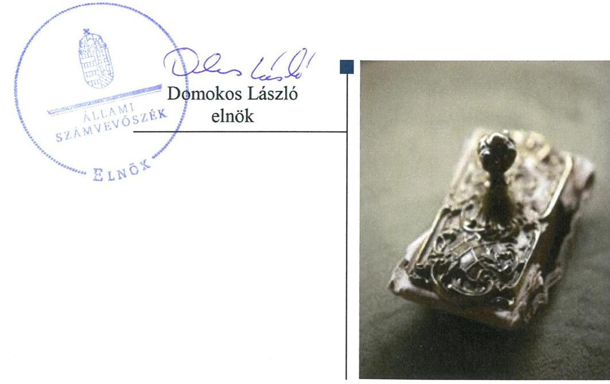
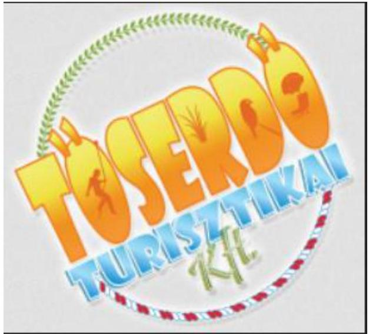
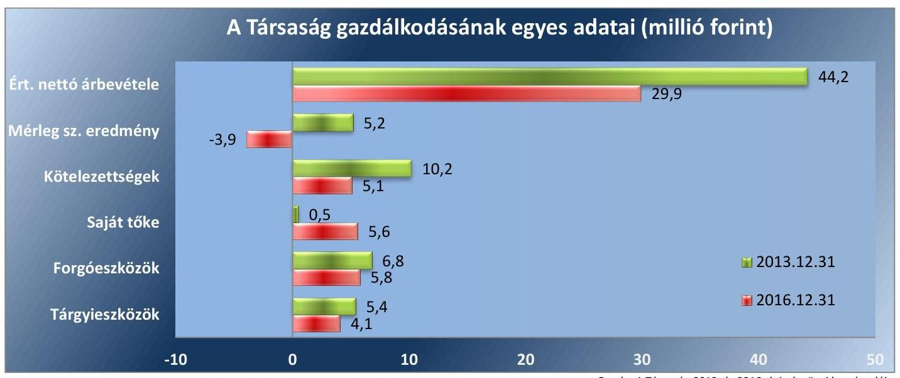

# Jelentés 

## Az önkormányzatok gazdasági társaságai

Az önkormányzatok többségi tulajdonában lévő gazdasági társaságok gazdálkodásának ellenőrzése - TŐSERDŐ Turisztikai Nonprofit Korlátolt Felelősségű Társaság 2018.

---

# Jelentés 

## Az önkormányzatok gazdasági társaságai

Az önkormányzatok többségi tulajdonában lévő gazdasági társaságok gazdálkodásának ellenőrzése - TÖSERDŐ Turisztikai Nonprofit Korlátolt Felelősségű Társaság 2018. 09. hó 05. nap

---

# AZ ELLENŐRZÉST FELÜGYELTE:

DR HORVÁTH MARGIT felügyeleti vezető

## AZ ELLENŐRZÉST VEZETTE ÉS A VÉGREHAJTÁSÁÉRT FELELŐS:

SIPOSNÉ DÓCZI KLÁRA ellenőrzésvezető

## A PROGRAM ÖSSZEÁLLÍTÁSÁÉRT FELELŐS:

TÓTPÁL SZABOLCS osztályvezető

IKTATÓSZÁM: EL-0197-073/2018.

TÉMASZÁM: 2447

ELLENŐRZÉS-AZONOSÍTÓ SZÁM: V079364

Jelentéseink az Országgyűlés számítógépes hálózatán és az Interneta a www.asz.hu címen is olvashatóak.

---

# TARTALOMJEGYZÉK 

■ ÖSSZEGZÉS ..... 5
■ AZ ELLENŐRZÉS CÉLJA ..... 6
■ AZ ELLENŐRZÉS TERÜLETE ..... 7
■ AZ ELLENŐRZÉS HÁTTERE, INDOKOLTSÁGA ..... 9
■ A JELENTÉS LÉNYEGES KÉRDÉSKÖREI ..... 10
■ ELLENŐRZÉS HATÓKÖRE ÉS MÓDSZEREI ..... 11
■ MEGÁLLAPÍTÁSOK ..... 13
■ JAVASLATOK ..... 16
■ MELLÉKLETEK ..... 19
I. sz. melléklet: Fogalomtár ..... 19
II. sz. melléklet: Pénzügyi adatok ..... 21
■ FÜGGELÉK: ÉSZREVÉTELEK ..... 23
■ RÖVIDÍTÉSEK JEGYZÉKE ..... 25

---

.

---

# ÖSSZEGZÉS 

A TÖSERDŐ Turisztikai Nonprofit Korlátolt Felelősségű Társaság müködésének szabályozottsága nem felelt meg a jogszabályi előírásoknak. A Társaság gazdálkodása és vagyongazdálkodása nem volt szabályszerú. A Társaság az éves beszámolási kötelezettségének a jogszabályi előírások szerint eleget tett. Ugyanakkor a köztulajdonban álló gazdasági társaságok számára előírt közzétételi kötelezettségnek nem tett eleget, ezáltal az átláthatóságot nem biztositotta.

## Az ellenőrzés társadalmi indokoltsága

Magyarországon az intézmény-centrikus közfeladat-ellátás jellemző, de az önkormányzatok kötelező és önként vállalt feladataik ellátása során egyre szélesebb körben alkalmazzák a költségvetési szerveken kívüli feladatellátást. Helyi szinten ennek meghatározó szereplői az önkormányzati tulajdonban lévő gazdasági társaságok, amelyek ezáltal kiemelt fontosságú szerephez jutnak a lakossági szolgáltatások biztosításában. Az önkormányzatok többségi tulajdonában álló gazdasági társaságok ellenőrzése kiemelt jelentőségű, mivel működésük hatással van a tulajdonos önkormányzat gazdálkodására, gazdálkodásának egyes elemei befolyásolják az önkormányzati szektor hiányát és az államadósságot. Ezért alapvető követelmény, hogy gazdálkodásuk, müködésük szabályszerű és átlátható legyen.

Az Állami Számvevőszék által az önkormányzati tulajdont múködtető Társaságnál végzett ellenőrzést további társadalmi elvárás indokolja sajátos tevékenységéből adódóan, mivel müködésén keresztül a térség lakosságának széles köre kerül kapcsolatba a Társasággal, valamint az általa nyújtott szolgáltatásokkal.

## Főbb megállapítások, következtetések, javaslatok

Lakitelek Önkormányzata a tulajdonosi joggyakorlás kereteit az SZMSZ ben, a Vagyonrendeletben valamint a Társaság Alapító okiratában a jogszabályi előírásoknak megfelelően határozta meg. A tulajdonosi jogok gyakorlása szabályszerű volt.

A TÖSERDŐ Turisztikai Nonprofit Korlátolt Felelősségű Társaság nem rendelkezett az ellenőrzött időszakban a szabályszerű múködéséhez szükséges számlarenddel. A Társaság gazdálkodása nem volt szabályszerű a bevételek- és a ráfordítások elszámolásának hiányosságai miatt. Vagyongazdálkodása nem volt szabályszerű az eszközök nyilvántartásának szabálytalanságai miatt. A Társaság a beszámolási kötelezettségét a jogszabályi előírásoknak megfelelően teljesítette. A Társaság a köztulajdonban álló gazdasági társaságokra a jogszabályban előírt adatok közzétételi kötelezettségét nem teljesítette.

---

# AZ ELLENŐRZÉS CÉLJA 

Az ellenőrzés célja annak értékelése volt, hogy az önkormányzat vagyongazdálkodási tevékenysége során sza-bály-szerűen gyakorolta-e tulajdonosi jogait; a gazdasági társaság szabályozottsága, gazdálkodása és vagyongazdálkodási tevékenysége, bevételeinek és ráfordításainak elszámolása megfelelt-e a jogszabályi és tulajdonosi előírásoknak; a gazdasági társaság kötelezettségállománya jelentett-e kockázatot a múködésre, valamint a gazdálkodás átláthatósága és elszámoltathatósága érdekében biztosítva volt-e a szolgáltatás dijának megalapozottsága szabályszerű önköltségszámítással.

---

# **AZ ELLENŐRZÉS TERÜLETE**

## **Lakitelek Önkormányzata és a kizárólagos tulajdonában lévő TŐSERDŐ Turisztikai Nonprofit Korlátolt Felelősségű Társaság**

**LAKITELEK ÖNKORMÁNYZATA** 2011. december 5-én alapította a TŐSERDŐ Turisztikai Korlátolt Felelősségű Társaságot azzal a céllal, hogy a település turizmusát fejlessze. Lakitelek település lakosainak száma az ellenőrzött években megközelítően 4500 fő volt. A nagyközség Budapesttől 120 km távolságra fekszik, fő nevezetessége a termál-és élményfürdője.

A TŐSERDŐ Turisztikai Korlátolt Felelősségű Társaság (2017. április 26-tól TŐSERDŐ Turisztikai Nonprofit Korlátolt Felelősségű Társaság) Lakitelek Önkormányzata 100%-os tulajdonában állt az ellenőrzött időszakban, jegyzett tőkéje az alapításkor 0,5 millió forint volt, mely alapítói tőkeemeléssel 2014-ben 3,0 millió forintra, 2016-ban 4,0 millió forintra emelkedett.

**A TÁRSASÁG** fő tevékenysége 2013. február 17-től máshová nem sorolt egyéb szórakoztatás, szabadidős tevékenység keretében a helyi termál- és élményfürdő valamint szabadidőpark üzemeltetése volt. Egyéb tevékenység keretében vízi szállítóeszköz kölcsönzést és kempingszolgáltatást végzett. A Társaság más gazdasági társaságban tulajdoni hányaddal nem rendelkezett, közfeladatot nem látott el.

Átlagos statisztikai állományi létszáma 2013-ban nyolc fő volt, amely az ellenőrzött időszak végére hat főre csökkent.

Az ellenőrzött években a Társaság irányítási feladatait az ügyvezető, ellenőrzését a három tagú felügyelőbizottság látta el. A Társaság ügyvezetőjének személye kétszer, 2013. február 15-én majd 2016. július 15-én változott. A Társaság számviteli beszámolóit az Önkormányzat előírásának megfelelően független könyvvizsgáló auditálta, kinek személye nem változott az ellenőrzött időszakban.

A TŐSERDŐ Turisztikai Nonprofit Korlátolt Felelősségű Társaság az Önkormányzattól2 vagyonkezelésbe nem vett át vagyont, tevékenységét saját eszközeivel valamint az Önkormányzat tulajdonában álló eszközök üzemeltetésével látta el. Az ellenőrzött időszakban a tulajdonos önkormányzat a Társaság működéséhez 28,5 millió forint támogatást nyújtott.

A Társaság nem rendelkezett tulajdonosi részesedéssel más gazdasági társaságban. Önköltség számítási szabályzat készítésére nem volt kötelezett. Az ellenőrzött években nem tartozott a kormányzati szektorba sorolt gazdálkodó szervezetek közé.

---

A Társaság gazdálkodásának egyes adatai a 2013. és 2016. évek vonatkozásában az 1. ábra, részleteiben a II. számú melléklet mutatja be.

1. ábra

*Forrás: A Társaság 2013. és 2016. évi pénzügyi beszámolói*

Az értékesítés nettó árbevétele a 2013. évről 2016-ra több mint 30%kal csökkent. A Társaság tárgyi eszközeinek az értéke az ellenőrzött években 25%-kal csökkent. Az eszközök mintegy 50%-át a forgóeszközök tették ki, melyekben 15%-os volt a csökkenés. A forrásokon belül a saját tőke öszszege 2013. december 31-jén 0,5 millió forint, 2016. év végén 5,6 millió forint volt a tőkeemelések hatására. A kötelezettségek állománya a 2013 év végi 10,2 millió forintról 2016 év végére 5,1 millió forintra csökkent. A mérleg szerinti eredmény 2013-ban 5,2 millió forint, 2016-ban - 3,9 millió forint volt.

Lakitelek polgármesterének személye az ellenőrzött időszakban egy alkalommal, a 2014. évi önkormányzati választásokat követően változott, a jegyző személyében 2015. április 13-án történt változás. Az Önkormányzatnak nem volt rendeletalkotási kötelezettsége a Társaság tevékenységéhez, az általa alkalmazott árakhoz kapcsolódóan.

---

# AZ ELLENŐRZÉS HÁTTERE, INDOKOLTSÁGA 

Az önkormányzatok többségi tulajdonában álló gazdasági társaságok ellenőrzése kiemelten fontos a vagyon megőrzése, megóvása érdekében. A feladatellátás költségeinek, ráfordításainak alakulása a lakosság széles rétegét érinti.

Az Állami Számvevőszék ellenőrzései feltárhatják, hogy az önkormányzat a feladatellátásához rendelt vagyon működtetését a tulajdonostól elvárható gondossággal végezte-e, a feladatot ellátó gazdasági társaság a létesítő okiratban, szolgáltatási szerződésben foglaltak betartásával biztosí-totta-e a feladat ellátását. Az ellenőrzés rávilágíthat arra, hogy a gazdasági társaság a vagyon használatával biztosította-e a szolgáltatás folytatásának feltételeit, az önkormányzat tulajdonosi felügyelete hozzájárult-e a szabályszerű gazdálkodáshoz és feladatellátáshoz.

A megállapítások alapján megfogalmazott számvevőszéki javaslatok hasznosítása elősegítheti a meglévő hibák megszüntetését. A jó gyakorlatok bemutatásával az ÁSZ ${ }^{3}$ hozzájárulhat a követendő megoldások megismertetéséhez, terjesztéséhez.

---

# A JELENTÉS LÉNYEGES KÉRDÉSKÖREI 

1.- Az önkormányzat tulajdonosi joggyakorlása szabályszerű volt-e?
2.- A gazdasági társaság müködésének szabályozottsága, gazdálkodása, vagyongazdálkodása, valamint az árképzés szabályszerű volt-e?

---

# ELLENŐRZÉS HATÓKÖRE ÉS MÓDSZEREI 

## Az ellenőrzés típusa

Megfelelőségi ellenőrzés

## Az ellenőrzött időszak

2013. január 1-jétől 2016. december 31-ig tartott.

## Az ellenőrzés tárgya

Lakitelek Önkormányzatának tulajdonosi joggyakorlása, valamint a TŐSERDŐ Turisztikai Nonprofit Korlátolt Felelősségű Társaság gazdálkodásának szabályozottsága és szabályszerűsége.

Az ellenőrzés kiterjedt minden olyan körülményre és adatra, amely az ÁSZ jogszabályban meghatározott feladatainak teljesítéséhez, valamint a program végrehajtása folyamán felmerült újabb összefüggések feltárásához szükséges.

## Az ellenőrzött szervezet

Lakitelek Önkormányzata
TŐSERDŐ Turisztikai Nonprofit Korlátolt Felelősségű Társaság

## Az ellenőrzés jogalapja

Az ellenőrzés jogszabályi alapját az ÁSZ tv. ${ }^{4}$ 1. § (3) bekezdése és az 5. § (3) - (5) bekezdései képezték.

## Az ellenőrzés módszerei

Az ellenőrzést a nemzetközi standardokat irányadónak tekintve az ellenőrzési program ellenőrzési kérdései, az ellenőrzött időszakban hatályos jogszabályok, az ellenőrzés szakmai szabályok és módszertanok figyelembe vételével végeztük.

Az ellenőrzés ideje alatt az ellenőrzött szervezettel történő kapcsolattartást az ÁSZ Szervezeti és Működési Szabályzatának ${ }^{5}$ vonatkozó előírásai alapján biztosítottuk.

---

Az ellenőrzési kérdések megválaszolásához szükséges bizonyítékok megszerzése a következő ellenőrzési eljárások alkalmazásával történt: megfigyelés, kérdésfeltevés (információkérés), összehasonlítás, valamint elemző eljárás. Az ellenőrzési bizonyítékként felhasználható adatforrások közé tartoztak egyrészt a szakmai programban felsorolt adatforrások, másrészt minden, az ellenőrzés folyamán feltárt, az ellenőrzés szempontjából információkat tartalmazó dokumentum.

A gazdasági társaság bevételeinek és ráfordításainak elszámolása terén a szabályszerű működést véletlen mintavétellel és irányított kiválasztással ellenőriztük. A mintatételek értékelése alapján egyrészt a sokaságban előforduló hibás tételek arányát becsültük, másrészt az irányítottan kiválasztott tételeket értékeltük. A jogszabályoknak és a belső eljárásoknak megfelelőnek, azaz szabályszerűnek tekintettük az adott területet, amennyiben a minta ellenőrzésének eredménye alapján 95\%-os bizonyossággal a teljes sokaságban a hibaarány kisebb volt, mint 10\%. Nem megfelelőnek értékeltük, ha a hibaarány a 10\%-ot meghaladta. A ráfordítások, azon belül az anyagjellegú-, a személyi jellegű-, az egyéb- és a pénzügyi ráfordítások elszámolására vonatkozó véletlen mintavételt kockázati alapú kiválasztással egészítettük ki, amelynek során évente a három legnagyobb összegű tételt választottuk ki. A vagyonnyilvántartást és az eszközök értékcsökkenésének elszámolását tételesen ellenőriztük. Az ellenőrzést a nemzetközi standardokat irányadónak tekintve az ellenőrzési program ellenőrzési kérdései, az ellenőrzött időszakban hatályos jogszabályok, az ellenőrzés szakmai szabályok és módszertanok figyelembe vételével végeztük.

Az ellenőrzést a kérdésekre adott válaszok kiértékelésével, valamint a megjelölt adatforrások, a csatolt tanúsítványok felhasználásával, továbbá az adott időszakban hatályos jogszabályok figyelembe vételével folytattuk le.

---

# 1. Az önkormányzat tulajdonosi joggyakorlása szabályszerű volt-e? 

Összegző megállapítás Az Önkormányzat tulajdonosi joggyakorlása szabályszerű volt.

A TULAJ DONOSI JOGGYAKORLÁS KERETEIT az Önkormányzat Képviselő-testülete ${ }^{6}$, mint a Társaság alapítója és annak Taggyúlési hatáskörben eljáró legfőbb szerve az önkormányzat SZMSZ ${ }_{1,2}{ }^{7}$-ben, a Vagyonrendelet ${ }_{1}{ }^{8}$-ben valamint a Társaság Alapító okirat ${ }_{1-4}{ }^{9}$-ában a jogszabályi előírásoknak megfelelően határozta meg.

A Társaság SZMSZ ${ }^{10}$-ében rögzítették a Társaság múködésének alapvető szabályait: az irányítási rendszert, a szervezeti felépítést, az általános múködési rendelkezéseket, a belső szabályozást, a vezető és ellenőrző szerveket, azok feladatait és jogkörét, a dolgozók jogait és kötelezettségeit. A Gt. ${ }^{11}$ és a Ptk. ${ }^{12}$ előírásai szerint megválasztották, és az Alapító okirat ${ }_{1-4}$-ban rögzítették a Felügyelőbizottság ${ }^{13}$ tagjait, az ügyvezető kinevezését valamint a független könyvvizsgáló kijelölését és meghatározták feladataikat. A Felügyelőbizottság 2015. januárjától rendelkezett a Társaság legfőbb szerve által elfogadott ügyrenddel.

Az Alapító ${ }^{14}$ a Taktv. ${ }^{15}$ 5. § (3) bekezdésében foglaltak ellenére a vezető tisztségviselők, a felügyelőbizottsági tagok, valamint az Mt. ${ }^{16}$ 208. § hatálya alá tartozó munkavállalók javadalmazásának, valamint jogviszonyuk megszűnése esetére biztosított juttatások módjának, mértékének elveiről, annak rendszeréről nem alkotott szabályzatot.

A TULAJ DONOSI JOGOKAT az Alapító a Gt. illetve a Ptk. előírásainak megfelelően gyakorolta.

Az Önkormányzat a tulajdonosi ellenőrzést, valamint a Gt. illetve a Ptk. előírásai szerinti tulajdonosi joggyakorlást a Felügyelőbizottságon keresztül, valamint az éves beszámolók elfogadásával, az éves eredmény felhasználásáról szóló döntéseivel biztosította. Az Önkormányzat Képviselő-testülete alapítói jogkörben eljárva az ellenőrzött időszakban a Felügyelőbizottság és a könyvvizsgáló írásos jelentésének birtokában, a Gt. illetve a Ptk. előírásaira figyelemmel határozatokban döntött a Társaság egyszerűsített éves beszámolóinak elfogadásáról, a veszteség rendezésének módjáról, az eredmény felhasználásról, továbbá határozatot hozott minden, az Alapító okirat ${ }_{1-4}$-ben az Alapító hatáskörébe tartozó kérdésben. A könyvvizsgáló a 2014. évi és 2015. évi egyszerűsített éves beszámoló könyvvizsgálói jelentésében figyelemfelhívásban tájékoztatta a tulajdonost, hogy a negatív saját tőke és magas kötelezettségállomány miatt tulajdonosi döntés szükséges. Az Alapító a 144/2016. (VII. 14.) számú határozatában - a Ptk. előírásának megfelelően - a beszámoló elfogadását követően, a Ptk. 3:133. § (2) bekezdésében meghatározott határidőn belül tőkepótló befizetésről döntött, és a tőkepótlást ${ }^{17}$ 2016-ban, a döntésnek megfelelően a Társaság rendelkezésére bocsájtotta.

---

Az Önkormányzat 2013-ban élt az Áht ${ }^{18}$-ban számára biztosított lehetőséggel, hogy ellenőrizze a Társaságot. Az önkormányzati ellenőrzés a gazdálkodás során keletkezett bizonylatokra, belső szabályzatokra és nyilvántartásokra terjedt ki, melynek során az ellenőrzés négy javaslatot fogalmazott meg. A Társaság intézkedési terv készítése nélkül hajtotta végre a javaslatokban foglaltakat.

# 2. A gazdasági társaság múködésének szabályozottsága, gazdálkodása, vagyongazdálkodása, valamint az árképzés szabályszerű volt-e? 

Összegző megállapítás

A Társaság múködésének szabályozása a számlarend hiánya miatt nem felelt meg a jogszabály előírásainak. A Társaság gazdálkodása nem volt szabályszerű a bevételek és a ráfordítások elszámolásának szabálytalanságai miatt. A Társaság vagyongazdálkodása nem volt szabályszerű az eszközök nyilvántartásba vételének hiányosságai miatt. A Társaság az éves beszámolási kötelezettségét teljesítette. A Társaság nem gondoskodott a Taktv.-ben a számára előírt adatok közzétételéről.
2.1. számú megállapítás

A Társaság múködésének szabályozottsága a számlarend hiánya miatt nem felelt meg a jogszabályi előírásoknak.

SZÁMVITELI SZABÁLYZATOKKAL, a Számv. tv. ${ }^{19}$ előírásainak megfelelő tartalmú Számviteli politikával ${ }^{20}$, annak részeként Eszközök és források leltárkészítési és leltározási szabályzatával ${ }^{21}$, Eszközök és források értékelési szabályzatával ${ }^{22}$, valamint Pénzkezelési szabályzattal ${ }^{23} 2013$. április 1-től kezdődően rendelkezett a Társaság. A szabályzatok megfeleltek az előírásoknak.

Ugyanakkor a Társaság nem rendelkezett Számlarenddel, amivel megsértette a Számv. tv. 161. § (1) bekezdésében foglaltakat.
2.2. számú megállapítás

A Társaság gazdálkodása nem felelt meg a jogszabályi előírásoknak, mivel a bevételek és a ráfordítások elszámolása nem volt szabályszerű. A Társaság vagyongazdálkodása az eszközök nyilvántartásba vételének szabálytalansága miatt nem felelt meg a jogszabályi előírásoknak.

A BEVÉTELEK ÉS A RÁFORDÍTÁSOK elszámolása nem volt szabályszerű, mivel a Társaság megsértette a Számv. tv. 167. § (1) bekezdés h) pontjának előírásait, mert az elszámolások nem tartalmazták az érintett könyvviteli számlákra történő hivatkozást.

A TÁRSASÁGNÁL AZ ESZKÖZÖK NYILVÁNTARTÁSBA VÉTELE nem volt szabályszerű, mivel a Társaság megsér-

---

tette a Számv. tv. 167. § (1) bekezdés h) pontjának előírásait, mert az elszámolások nem tartalmazták az érintett könyvviteli számlákra történő hivatkozást.

AZ ESZKÖZÖK ÉS FORRÁSOK LELTÁROZÁSA szabályszerű volt. A Számv. tv-ben és az Eszközök és források leltárkészítési és leltározási szabályzatában foglaltaknak megfelelően egyeztetéssel, a tárgyi eszközök és készletek esetében évente mennyiségi felvétellel leltároztak, és támasztották alá leltárral az egyszerűsített éves beszámolót és annak mérlegtételeit.
2.3. számú megállapítás

A Társaság a beszámolási tevékenységét szabályszerűen végezte. A Társaság a Taktv.-ben előírt adatok közzétételéről nem gondoskodott.

A TERVEZÉSI TEVÉKENYSÉGET a Társaság Szervezeti és Működési Szabályzata tartalmazta. A társasági SZMSZ 3. pontjában rögzítettek szerint az Alapító „évente legalább egyszer megtárgyalja és jóváhagyja a Társaság üzletpolitikáját, üzleti tervét és ellenőrzi annak végrehajtását." Ezen előírásnak a Társaság a 2013-ban készített üzleti tervvel eleget tett, de 2014-re, 2015-re és 2016-ra vonatkozóan a társasági SZMSZ előírásától eltérően nem készítette el azokat.

## A SZÁMVITELI BESZÁMOLÁSI ÉS KÖZZÉTÉTELI KÖTELEZETTSÉGÉNEK a Társaság a tulajdonosi joggyakorló által elfogadott éves egyszerűsített beszámolók megfelelő határidőben történő elkészítésével, letétbe helyezésével és közzétételével a Számv. tv.ben foglaltak szerint eleget tett.

A Társaság a Taktv 2.§ (1) bekezdésében szereplő, a köztulajdonban álló gazdasági társaságok számára előírt adatok nyilvánosságra hozatalát az ellenőrzött időszak alatt nem teljesítette. Nem tette közzé az Mt. ${ }^{24}$ 208. § szerinti vezető állású munkavállalók nevét, munkakörét, a munkaviszony vagy kinevezés kezdetét és végét, az alkalmazás minőségét, személyi alapbérét, az egyéb juttatását, a felmondási időt, illetve a végkielégítés mértékét, valamint a Felügyelőbizottság tagjainak nevét, tisztségét, a megbízás kezdetét és végét, az alkalmazás minőségét és megbízási diját.

---

# JAVASLATOK 

Az ÁSZ tv. 33. § (1) bekezdésében foglaltak értelmében az ellenőrzött szervezet vezetője köteles a jelentésben foglalt megállapításokhoz kapcsolódó intézkedési tervet összeállítani és azt a jelentés kézhezvételétől számított 30 napon belül az ÁSZ részére megküldeni. Amennyiben az ellenőrzött szervezet vezetője nem küldi meg határidőben az intézkedési tervet, vagy továbbra sem elfogadható intézkedési tervet küld, az Állami Számvevőszék elnöke az ÁSZ tv. 33. § (3) bekezdése a) és b) pontjaiban foglaltakat érvényesítheti.
Javaslataink célja a TÖSERDŐ Turisztikai Nonprofit Korlátolt Felelősségű Társaság gazdálkodása szabályszerűségének és gyakorlatának javítása annak érdekében, hogy a szabályozási környezet és az alkalmazott gyakorlat megfelelően tudja támogatni az átlátható működést.

## TÖSERDŐ Turisztikai Nonprofit Korlátolt Felelősségű Társaság ügyvezetőjének

1. Intézkedjen a hatályos Számv. tv. előírásainak megfelelő számlarend elkészitése érdekében.
(2.1. sz. megállapítás 2. bekezdése alapján)
2. Intézkedjen a bevételek és a ráfordítások Számv. tv. előírásainak megfelelő elszámolása érdekében.
(2.2. sz. megállapítás 1. bekezdése alapján)
3. Intézkedjen a tárgyi eszközök Számv. tv. előírásainak megfelelő elszámolása érdekében.
(2.2. sz. megállapítás 2. bekezdése alapján)
4. Intézkedjen az üzleti terv elkészítéséről az SZMSZ-ben előírtaknak megfelelően.
(2.3 sz. megállapítás 1. bekezdése alapján)
5. Intézkedjen a közzétételi kötelezettség teljesítéséről a Taktv. előírásainak megfelelően.
(2.3. sz. megállapítás 3. bekezdése alapján)

---

# Javaslataink célja az Önkormányzat szabályszerű működésének elősegítése, továbbá az önkormányzati tulajdonosi joggyakorlás kontrolljainak erősítése. 

## Lakitelek Önkormányzata polgármesterének

1. Kezdeményezze az Alapitónál a vezető tisztségviselői, a felügyelő bizottsági tagok, az Mt. 208. §-ának hatálya alá eső munkavállalók javadalmazása, valamint a jogviszony megszünése esetére biztositott juttatások módjának, mértékének elveire, annak rendszerére vonatkozó szabályzat megalkotását a Taktv.-ben elöirtaknak megfelelően.
(1. sz. megállapítás 3. bekezdése alapján)

---

.

---

# MELLÉKLETEK 

- I. SZ. MELLÉKLET: FOGALOMTÁR
gazdasági társaság
gazdálkodó szervezet
meghatározó befolyás
minősített többséget biztosító részesedés
nemzeti vagyon
többségi befolyást biztosító részesedés
vagyonkezelő

Ptk 3.88. § (1) bekezdése szerint „a gazdasági társaságok üzletszerű közös gazdasági tevékenység folytatására, a tagok vagyoni hozzájárulásával létrehozott, jogi személyiséggel rendelkező vállalkozások, amelyekben a tagok a nyereségből közösen részesednek, és a veszteséget közösen viselik".
A Ptk. 685. § c) pontja szerint gazdálkodó szervezet: „az állami vállalat, az egyéb állami gazdálkodó szerv, a szövetkezet, a lakásszövetkezet, az európai szövetkezet, a gazdasági társaság, az európai részvénytársaság, az egyesülés, az európai gazdasági egyesülés, az európai területi együttműködési csoportosulás, az egyes jogi személyek vállalata, a leányvállalat, a vízgazdálkodási társulat, az erdő birtokossági társulat, a végrehajtói iroda, az egyéni cég, továbbá az egyéni vállalkozó." (2014. 03.15-ig hatályos)

A Ptk. 8:2. § (2) bekezdése szerint „A befolyással rendelkező akkor rendelkezik egy jogi személyben meghatározó befolyással, ha annak tagja vagy részvényese, és
a) jogosult e jogi személy vezető tisztségviselői vagy felügyelőbizottsága tagjai többségének megválasztására, illetve visszahívására; vagy
b) a jogi személy más tagjai, illetve részvényesei a befolyással rendelkezővel kötött megállapodás alapján a befolyással rendelkezővel azonos tartalommal szavaznak, vagy a befolyással rendelkezőn keresztül gyakorolják szavazati jogukat, feltéve, hogy együtt a szavazatok több mint felével rendelkeznek."
A minősített befolyásszerző az ellenőrzött társaságban a szavazatok legalább hetvenöt százalékával rendelkezik. (Ptk. 3:324. §)
Nvtv. 1. § (2) bekezdése szerint többek között: „az állam vagy a helyi önkormányzat kizárólagos tulajdonában álló dolgok,
az a) pont hatálya alá nem tartozó, állam vagy a helyi önkormányzat tulajdonában lévő dolog,
az állam vagy a helyi önkormányzat tulajdonában lévő pénzügyi eszközök, továbbá az államot vagy a helyi önkormányzatot megillető társasági részesedések,
az államot vagy a helyi önkormányzatot megillető bármely vagyoni értékkel rendelkező jogosultság, amelyet jogszabály vagyoni értékű jogként nevesít."
A Ptk. 8:2. § (1) bekezdése szerint „többségi befolyás az olyan kapcsolat, amelynek révén természetes személy vagy jogi személy (befolyással rendelkező) egy jogi személyben a szavazatok több mint felével vagy meghatározó befolyással rendelkezik."
vagyonkezelő:
a) az állam tulajdonában álló nemzeti vagyon tekintetében:
aa) költségvetési szerv,
ab) helyi önkormányzat, önkormányzati társulás,
ac) önkormányzati intézmény,
ad) köztestület,
ae) az állam, az aa)-ac) alpontban meghatározott személyek együtt vagy külön-külön 100\%-os tulajdonában álló gazdálkodó szervezet,
af) az ae) alpont szerinti gazdálkodó szervezet 100\%-os tulajdonában álló gazdálkodó szervezet,
ag) a törvény által kijelölt egyedileg meghatározott jogi személy.

---

b) a helyi önkormányzat tulajdonában álló nemzeti vagyon tekintetében:
ba) önkormányzati társulás,
bb) költségvetési szerv vagy önkormányzati intézmény,
bc) köztestület,
bd) az állam, a helyi önkormányzat, a ba)-bb) alpontban meghatározott személyek együtt vagy külön-külön 100\%-os tulajdonában álló gazdálkodó szervezet,
be) a bd) alpont szerinti gazdálkodó szervezet 100\%-os tulajdonában álló gazdálkodó szervezet.
c) az egyházi jogi személy a tevékenysége ellátásához szükséges nemzeti vagyon tekintetében. (Forrás: Nvtv. 3. § (1) bekezdés 19. pontja)

---

| EGYSZERÜSÍTETT ÉVES BESZÁMOLÓK ADATAI (MILLIÓ FORINT) |  |  |  |  |  |
| :--: | :--: | :--: | :--: | :--: | :--: |
| Megnevezés | 2013.01.01. | 2013.12.31. | 2014.12.31. | 2015.12.31. | 2016.12.31.* |
| Befektetett eszközök | 6,6 | 5,4 | 5,6 | 5,1 | 4,2 |
| Immateriális javak | 0,06 | 0,05 | 0,04 | 0,04 | 0,03 |
| Tárgyi eszközök | 6,6 | 5,4 | 5,6 | 5,0 | 4,1 |
| Befektetett pénzügyi eszközök | 0 | 0 | 0 | 0 | 0 |
| Forgóeszközök | 7,9 | 6,8 | 7,1 | 5,6 | 5,8 |
| Készletek | 0,4 | 0,1 | 0,08 | 0,06 | 0,06 |
| Követelések | 5,5 | 0,4 | 6,5 | 0,4 | 1,2 |
| Értékpapírok | 0 | 0 | 0 | 0 | 0 |
| Pénzeszközök | 1,9 | 6,2 | 0,5 | 5,2 | 4,5 |
| Aktív időbeli elhatárolások | 0,2 | 0,1 | 0,1 | 0,1 | 1,2 |
|  |  |  |  |  |  |
| Saját tőke | $-4,7$ | 0,5 | $-4,7$ | $-12,4$ | 5,6 |
| Jegyzett tőke | 0,5 | 0,5 | 3,0 | 3,0 | 4,0 |
| Töketartalék | 0 | 0 | 0 | 0 | -* |
| Eredménytartalék | $-0,9$ | $-5,2$ | 0 | $-7,7$ | $-15,5$ |
| Lekötött tartalék | 0 | 0 | 0 | 0 | 0 |
| Értékelési tartalék | 0 | 0 |  | 0 | 0 |
| Mérleg szerinti eredmény | $-4,3$ | 5,2 | 7,7 | $-7,8$ | $-3,9 *$ |
| Céltartalék | 0 | 0 | 0 | 0 | 0 |
| Kötelezettségek | 19,0 | 10,2 | 15,6 | 21,4 | 5,1 |
| Hosszú lejáratú kötelezettségek | 0 | 4,0 | 0 | 0 | 0 |
| Rövid lejáratú kötelezettségek | 19,0 | 6,2 | 15,6 | 21,4 | 5,1 |
| Passzív időbeli elhatárolás | 0,4 | 1,6 | 1,9 | 1,8 | 0,5 |
| MÉRLEG FŐÖSSZEG | 14,7 | 12,3 | 12,8 | 10,8 | 11,2 |
|  |  |  |  |  |  |
| Értékesítés nettó árbevétele | 42,8 | 44,2 | 39,9 | 34,7 | 29,9 |
| Egyéb bevételek | - | 10,3 | 2,0 | 1,1 | 4,3 |
| Anyagjellegú ráfordítások | - | 26,5 | 27,7 | 23,4 | 17,8 |
| Személyi jellegú ráfordítások | - | 18,0 | 20,4 | 18,8 | 16,9 |
| Értékcsökkenési leírás | - | 1,2 | 0,6 | 0,7 | 0,7 |
| Egyéb ráfordítások | - | 1,9 | 1,4 | 0,5 | 2,4 |
| Üzemi tevékenység eredménye | - | 6,9 | $-8,2$ | $-7,5$ | - |
| Pénzügyi múveletek eredménye | - | 0 | $-0,3$ | $-0,2$ | $-0,2$ |
| Rendkívüli eredmény | - | 0 | 0,8 | 0 | - |
| Mérleg szerinti eredmény* | $-4,3$ | 5,2 | $-7,7$ | $-7,8$ | $-3,9 *$ |

* 2016-ban adózott eredmény.

---

.

---

# FÜGGELÉK: ÉSZREVÉTELEK 

A jelentéstervezetet a Számvevőszék 15 napos észrevételezésre megküldte az ellenőrzött szervezetek vezetőinek az ÁSZ tv. 29. §* (1) bekezdése előírásának megfelelően.

A TŐSERDŐ Turisztikai Nonprofit Korlátolt Felelősségű Társaság ügyvezetője és Lakitelek Önkormányzata polgármestere az ÁSZ tv. 29. § (2) bekezdésében foglalt észrevételezési jogával nem élt, a jelentéstervezetre észrevételt nem tett.

[^0]
[^0]:    * 29. § (1) Az Állami Számvevőszék az ellenőrzési megállapításait megküldi az ellenőrzött szervezet vezetőjének vagy az általa megbízott személynek, és annak, akinek személyes felelősségét állapította meg.
    (2) Az ellenőrzött szervezet vezetője és a felelősként megjelölt személy az ellenőrzés megállapításaira tizenöt napon belül írásban észrevételt tehet.
    (3) Az Állami Számvevőszék az észrevételre a beérkezésétől számított harminc napon belül írásban válaszol. A figyelembe nem vett észrevételeket köteles a jelentésben feltüntetni, és megindokolni, hogy azokat miért nem fogadta el.

---

.

---

# RÖVIDÍTÉSEK JEGYZÉKE 

${ }^{1}$ Társaság
${ }^{2}$ Önkormányzat
${ }^{3}$ ÁSZ
${ }^{4}$ ÁSZ törvény
${ }^{5}$ ÁSZ Szervezeti és Müködési Szabályzata
${ }^{6}$ Képviselő-testület
${ }^{7}$ SZMSZ ${ }_{1,2}$
${ }^{8}$ Vagyonrendelet ${ }_{1}$
${ }^{9}$ Alapító okirat ${ }_{1-4}$
${ }^{10}$ társasági SZMSZ
${ }^{11}$ Gt.
${ }^{12}$ Ptk.
${ }^{13}$ Felügyelőbizottság
${ }^{14}$ Alapító
${ }^{15}$ Taktv.
${ }^{16} \mathrm{Mt}$.
${ }^{17}$ tőkepótlás
${ }^{18}$ Áht.
${ }^{19}$ Számv. tv.

TŐSERDŐ Turisztikai Nonprofit Korlátolt Felelősségű Társaság (az ellenőrzött időszakban TŐSERDŐ Turisztikai Korlátolt Felelősségű Társaság)
Lakitelek Önkormányzata
Állami Számvevőszék
2011. évi LXVI törvény az Állami Számvevőszékről (hatályos: 2011. július 1-jétől)

Az Állami Számvevőszék elnökének 3/2016. (XII. 29.) ÁSZ utasítása az Állami Számvevőszék Szervezeti és Müködési Szabályzatáról (hatályos: 2017. január 1.2017. december 31.)

Lakitelek Önkormányzata Képviselő-testülete
Lakitelek Nagyközség Képviselő-testületének 6/2007. (III. 21.) rendelete az Önkormányzat Szervezeti és Müködési Szabályzatáról (hatályos: 2007. március 21.-2013. szeptember 6. között)

Lakitelek Önkormányzat Képviselő-testületének 18/2013. (IX. 06.) önkormányzati rendelete az Önkormányzat Szervezeti és Müködési Szabályzatáról (hatályos:2013. szeptember 7-től)
Lakitelek Önkormányzat Képviselő-testületének 22/2013. (X. 04.) számú rendelete az Önkormányzat vagyonáról és a vagyongazdálkodás szabályairól (hatályos: 2013. december 1-től)
Lakitelek Önkormányzat Képviselő-testületének 35/2014. (XI. 14.) számú rendelete az Önkormányzat vagyonáról és a vagyongazdálkodás szabályairól szóló 22/2013. (X.04.) számú önkormányzati rendelet módosításáról
Lakitelek Önkormányzat Képviselő-testületének 15/2016. (V. 27.) számú rendelete az Önkormányzat vagyonáról és a vagyongazdálkodás szabályairól szóló 22/2013. (X. 04.) számú önkormányzati rendelet módosításáról
TŐSERDŐ Turisztikai Korlátolt Felelősségű Társaság Alapító okirata
módosítva: 2013. február 15.
módosítva: 2014. április 3.
módosítva: 2016. július 14.
módosítva: 2016. augusztus 31.
TŐSERDŐ Turisztikai Korlátolt Felelősségű Társaság Szervezeti és Müködési Szabályzata (hatályos: 2014. április 4-től)
2006. évi IV. törvény a gazdasági társaságokról (hatályon kívül helyezve: 2014. március 15 -től)
2013. évi V. törvény a Polgári Törvénykönyvről (hatályos: 2014. március 15-től) TŐSERDŐ Turisztikai Korlátolt Felelősségű Társaság Felügyelőbizottsága Lakitelek Önkormányzat Képviselő-testülete
2009. évi CXXII. törvény a köztulajdonban álló gazdasági társaságok takarékosabb müködéséről (hatályos: 2009. október 3-tól)
2012. évi I. törvény a munka törvénykönyvéről (hatályos: 2012. július 1-től) a 2016. évi beszámoló alapján a Társaság jegyzett tőkéje egy millió forinttal emelkedett, ezzel egyidejűleg az Alapító 20,9 millió forintot tőketartalékba helyezett
2011. évi CXCV. törvény az államháztartásról (hatályos: 2011. december 31-től) 2000. évi C. törvény a számvitelről (hatályos: 2001. január 1-től)

---

${ }^{20}$ Számviteli politika
${ }^{21}$ Eszközök és források leltárkészítési és leltározási szabályzata
${ }^{22}$ Eszközök és források értékelési szabályzata
${ }^{23}$ Pénzkezelési szabályzat
${ }^{24} \mathrm{Mt}$.

TŐSERDŐ Turisztikai Korlátolt Felelősségű Társaság Számviteli Politika (hatályos: 2013. április 1-jétől)
Kiegészítés a 2013. 04.01-től érvényes Számviteli politikához (hatályos:2016. szeptember 1-jétől)

TŐSERDŐ Turisztikai Korlátolt Felelősségű Társaság Eszközök és források leltárkészítési és leltározási szabályzata (hatályos: 2013. április 1-jétől)

TŐSERDŐ Turisztikai Korlátolt Felelősségű Társaság Eszközök és források értékelési szabályzata (hatályos: 2013. április 1-jétől)
TŐSERDŐ Turisztikai Korlátolt Felelősségű Társaság Pénzkezelési szabályzat (hatályos: 2013. április 1-jétől)
2012. évi I. törvény a munka törvénykönyvéről (hatályos:2012. július 1-től)

---

# ÁLLAMI SZÁMVEVŐSZÉK 

1052 Budapest, Apáczai Csere János utca 10.
Levélcím: 1364 Budapest 4. Pf. 54
Telefon: +36 14849100 Telefax: +36 14849200
www.asz.hu