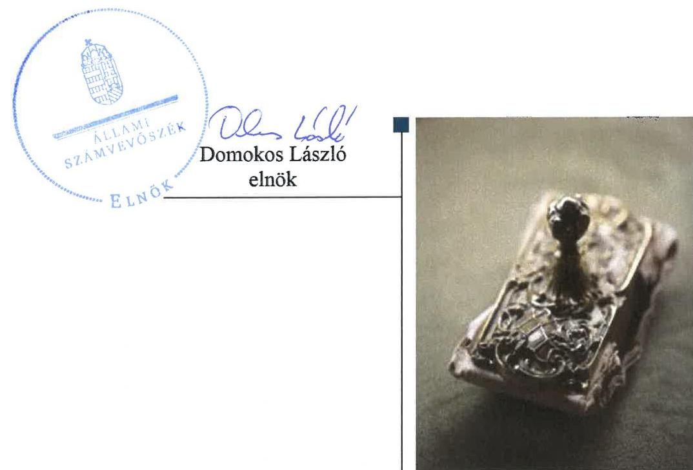
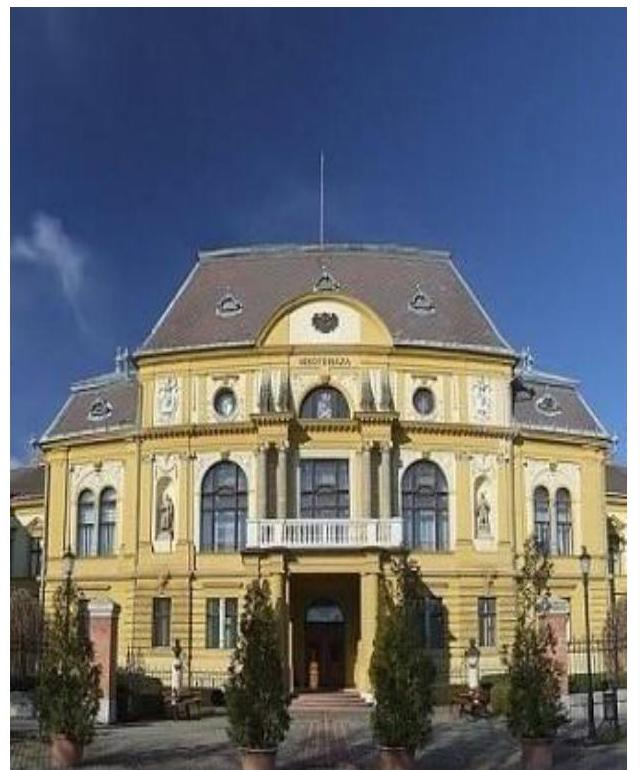

# Jelenetés 

## Az önkormányzatok gazdasági társaságai

Az önkormányzatok többségi tulajdonában lévő gazdasági társaságok gazdálkodásának ellenőrzése - „KÖLCSEY" Televízió Músorszolgáltató Nonprofit Kft.
2018.

---

# Jelentés 

## Az önkormányzatok gazdasági társaságai

Az önkormányzatok többségi tulajdonában lévő gazdasági társaságok gazdálkodásának ellenőrzése - „KÖLCSEY" Televízió Músorszolgáltató Nonprofit Kft.
2018. szeptember 5. nap

---

# AZ ELLENŐRZÉST FELÜGYELTE:

DR. HORVÁTH MARGIT felügyeleti vezető

## AZ ELLENŐRZÉST VEZETTE ÉS A VÉGREHAJTÁSÁÉRT FELELŐS:

DR. NAGY JUDIT ellenőrzésvezető

## A PROGRAM ÖSSZEÁLLÍTÁSÁÉRT FELELŐS:

TÓTPÁL SZABOLCS osztályvezető

IKTATÓSZÁM: EL-0151-052/2018

TÉMASZÁM: 2447

ELLENŐRZÉS-AZONOSÍTÓ SZÁM: V079341

Jelentéseink az Országgyűlés számítógépes hálózatán és az Interneten a www.asz.hu címen is olvashatóak.

---

# TARTALOMJEGYZÉK 

■ ÖSSZEGZÉS ..... 5
■ AZ ELLENŐRZÉS CÉLJA ..... 6
■ AZ ELLENŐRZÉS TERÜLETE ..... 7
■ AZ ELLENŐRZÉS HÁTTERE, INDOKOLTSÁGA ..... 8
■ A JELENTÉS LÉNYEGES KÉRDÉSKÖREI ..... 9
■ AZ ELLENŐRZÉS HATÓKÖRE ÉS MÓDSZEREI ..... 10
■ MEGÁLLAPÍTÁSOK ..... 12
■ JAVASLATOK ..... 15
■ MELLÉKLETEK ..... 17
I. sz. melléklet: Értelmező szótár ..... 17
■ FÜGGELÉK: ÉSZREVÉTELEK ..... 19
■ RÖVIDÍTÉSEK JEGYZÉKE ..... 21

---

.

---

# ÖSSZEGZÉS 

A "KÖLCSEY" Televízió Músorszolgáltató Nonprofit Kft. szabályozottsága megfelelt a jogszabályi előírásoknak. A Társaság gazdálkodása és vagyongazdálkodása nem volt szabályszerű. A közvagyonnal való felelős gazdálkodás nem volt biztosított. Közzétételi kötelezettségének nem tett eleget, ezért tevékenysége nem volt átlátható.

## Az ellenőrzés társadalmi indokoltsága

Magyarországon az önkormányzatok kötelező és önként vállalt feladataik ellátása során egyre szélesebb körben alkalmazzák a költségvetési szerveken kívüli feladatellátást, ezáltal az önkormányzati tulajdonú gazdasági társaságok is kiemelt fontosságú szerephez jutnak a lakossági szolgáltatások biztosításában. Az önkormányzatok többségi tulajdonában álló gazdasági társaságok ellenőrzése kiemelt jelentőségű, mivel működésük hatással van a tulajdonos önkormányzat gazdálkodására, gazdálkodásának egyes elemei befolyásolják az önkormányzati alszektor hiányát és az államadósságot. Az Állami Számvevőszék kiemelt célja, hogy a helyi önkormányzatok gazdálkodásában rejlő pénzügyi kockázatok feltárásával, az államháztartáson kívülre nyújtott költségvetési támogatások és ingyenes vagyonjuttatások, valamint az államháztartáson kívül működő feladatellátó rendszerek ellenőrzéseivel hozzájáruljon ahhoz, hogy a közpénzeket az államháztartáson kívül működő szervezetek is átlátható, rendezett módon használják fel.

A Szabolcs-Szatmár-Bereg megye kulturális, természeti és építészeti értékeinek megismertetését folytató Társaságnál végzett ellenőrzés azért is volt indokolt, mert a tevékenysége keresztül a megye lakosságának széles köre kerülhetett kapcsolatba a Társaság által nyújtott szolgáltatásokkal.

## Főbb megállapítások, következtetések, javaslatok

A Szabolcs-Szatmár-Bereg Megyei Önkormányzat a tulajdonosi jogait szabályszerűen gyakorolta, azonban a Felügyelőbizottság nem rendelkezett ügyrenddel.

A "KÖLCSEY" Televízió Músorszolgáltató Nonprofit Kft. szabályozottsága megfelelt a jogszabályi előírásoknak. Gazdálkodása nem volt szabályszerű, mivel a bevételek és ráfordítások elszámolása nem felelt meg a jogszabályoknak. A Társaság vagyongazdálkodása nem volt szabályszerű, mivel a Társaság az ellenőrzött időszakban nem leltározott, beszámolóit nem támasztotta alá a Számv. tv. előírásainak megfelelő leltárral. Így a Társaság beszámolói nem mutattak valós képet a Társaság gazdálkodásáról, ezzel megsértették a Számv. tv-t.

A társaság közérdekű adatokra vonatkozó közzétételi kötelezettségét nem teljesítette.
Az Állami Számvevőszék a jelentésben foglalt megállapítások alapján öt javaslatot fogalmazott meg a "KÖLCSEY" Televízió Músorszolgáltató Nonprofit Kft. ügyvezetőjének, valamint három javaslatot Szabolcs-Szatmár-Bereg Megyei Közgyűlés Elnökének a szabályszerű működés javítása érdekében. A javaslatokat megalapozó megállapításokra az érintetteknek 30 napon belül intézkedési tervet kell készíteniük.

---

# AZ ELLENŐRZÉS CÉLJA 

Az ellenőrzés célja annak értékelése, hogy az önkormányzat vagyongazdálkodási tevékenysége során szabályszerűen gyakorolta-e tulajdonosi jogait. A gazdasági társaság szabályozottsága, gazdálkodása és vagyongazdálkodási tevékenysége, bevételeinek és ráfordításainak elszámolása megfelelt-e a jogszabályi és tulajdonosi előírásoknak. A gazdasági társaság kötelezettségállománya jelentett-e kockázatot a működésre, valamint a gazdálkodás átláthatósága és elszámoltathatósága érdekében biztosítva volt-e a szolgáltatás díjának megalapozottsága szabályszerű önköltségszámítással. Az ellenőrzés célja továbbá annak megítélése, hogy az önkormányzatok többségi tulajdonában lévő gazdasági társaságok gazdálkodásának a kormányzati szektor hiányára és az államadósságra befolyással bíró elemei a jogszabályi előírásoknak megfelelnek-e.

---

# AZ ELLENŐRZÉS TERÜLETE 

## Szabolcs-Szatmár-Bereg Megyei Önkormányzat és a "KÖLCSEY" Televízió Músorszolgáltató Nonprofit Kft.

A "KÖLCSEY" Televízió Músorszolgáltató Nonprofit Kft.-t 2009. május 7-én, kizárólagos tulajdonosként alapította a Szabolcs-Szatmár-Bereg Megyei Önkormányzat 5 M Ft jegyzett tőkével, amely az ellenőrzött időszak alatt nem változott.

A Társaság ¹ alapításának célja Szabolcs-Szatmár-Bereg Megye kulturális, építészeti és természeti értékeinek megőrzése és egyben megismertetése volt a térség és az ország lakosaival. Fő tevékenysége televízió-műsor összeállítása, szolgáltatása volt.

A Társaság az Mötv. ² 13. § (1) bekezdés 7. pontja alapján, a kulturális örökség helyi védelme tekintetében, közfeladatot látott el. Közhasznú jogállását 2009. július 16-án szerezte meg és azt a Civil tv. ³ 75. § (5) bekezdése alapján 2014. június 1-től továbbra is megtartotta.

A Társaság a közhasznú tevékenységen túl vállalkozási tevékenységet is végzett, amelynek keretében napilap-, folyóirat-, időszaki kiadvány kiadást, film-, video- és televízióműsor-gyártást végzett.

A Társaság vagyonkezelésbe vagyont nem kapott, tulajdonosi részesedéssel más gazdasági társaságban nem rendelkezett.

A Nemzetgazdasági Miniszter a Társaságot 2015. év végén a kormányzati szektorba sorolt egyéb szervezetek ⁴ között nyilvántartásba vette.

A Társaság az önköltség-számítási szabályzat készítési kötelezettség alól a Számv. tv. 14. § (6) bekezdése előírása alapján mentesült. Árképzéssel kapcsolatos tulajdonosi elvárás, ágazati előírás nem volt a Társaság felé.

Az Ügyvezető ⁵ személye 2014. május 5-én változott. Az Elnök ⁶ 2008-tól töltötte be hivatalát, a Jegyző ⁷ 2013. július 15-ig, a Jegyző ⁸ 2013. július 16-tól látta el feladatait.

---

# AZ ELLENŐRZÉS HÁTTERE, INDOKOLTSÁGA 

AZ ÖNKORMÁNYZATI TULAJDONÚ GAZDASÁGI TÁRSASÁGOK ellenőrzése kiemelten fontos a vagyon megőrzése, megóvása érdekében, valamint a kormányzati szektor elszámolásaiban megjelenő önkormányzati tulajdonú gazdálkodó szervezetek esetében, amelyekkel szemben alapvető követelmény, hogy gazdálkodásuk, működésük szabályszerű, az általuk szolgáltatott adatok minél megbízhatóbbak legyenek.

A feladat-ellátás költségeinek, ráfordításainak alakulása a lakosság széles rétegét érinti. Az ellenőrzés várható hasznosulásaként ellenőrzéseink feltárhatják, hogy az önkormányzat a feladatellátásához rendelt vagyon működtetését a tulajdonostól elvárható gondossággal végezte-e, a feladatot ellátó gazdasági társaság a létesítő okiratban, szolgáltatási szerződésben foglaltak betartásával biztosította-e a feladat ellátását. Az ellenőrzés rávilágíthat arra, hogy a gazdasági társaság a vagyon használatával biztosította-e a szolgáltatás folytatásának feltételeit, az önkormányzat által végzett tulajdonosi ellenőrzés hozzájárult-e a szabályszerű gazdálkodáshoz és feladatellátáshoz.

A megállapítások alapján megfogalmazott számvevőszéki javaslatok hasznosítása elősegítheti a meglévő hibák megszüntetését. A jó gyakorlatok bemutatásával az Állami Számvevőszék hozzájárul a követendő megoldások megismertetéséhez, terjesztéséhez.

---

# A JELENTÉS LÉNYEGES KÉRDÉSKÖREI 

1. Az önkormányzati tulajdonosi joggyakorlás szabályszerű volt-e?
2. A gazdasági társaság szabályozottsága, gazdálkodása, vagyongazdálkodása szabályszerű volt-e, a kormányzati szektor hiányára és az államadósságra befolyással bíró gazdasági események megfeleltek-e a jogszabályi előírásoknak?

---

# AZ ELLENŐRZÉS HATÓKÖRE ÉS MÓDSZEREI 

## Az ellenőrzés típusa

Megfelelőségi ellenőrzés.

## Az ellenőrzött időszak

2013. január 1-jétől 2016. december 31-ig.

## Az ellenőrzés tárgya

Szabolcs-Szatmár-Bereg Megyei Önkormányzat tulajdonosi joggyakorlása, valamint a "KÖLCSEY" Televízió Músorszolgáltató Nonprofit Kft. gazdálkodásának szabályozottsága és szabályszerűsége.

Az ellenőrzés kiterjedt minden olyan körülményre és adatra, amely az ÁSZ ⁹ jogszabályban meghatározott feladatainak teljesítéséhez, valamint a program végrehajtása folyamán felmerült újabb összefüggések feltárásához szükséges.

## Az ellenőrzött szervezet

"KÖLCSEY" Televízió Músorszolgáltató Nonprofit Kft. és a kizárólagos tulajdonos Szabolcs-Szatmár-Bereg Megyei Önkormányzat

## Az ellenőrzés jogalapja

Az ellenőrzés jogszabályi alapját az ÁSZ tv. 1.§ (3) bekezdése és 5. § (3)(5) bekezdései képezik.

## Az ellenőrzés módszerei

Az ellenőrzést a nemzetközi standardokat irányadónak tekintve az ellenőrzési program ellenőrzési kérdései, az ellenőrzött időszakban hatályos jogszabályok, az ellenőrzés szakmai szabályok és módszertanok figyelembe vételével végeztük.

Az ellenőrzés ideje alatt az ellenőrzött szervezettel történő kapcsolattartást az ÁSZ Szervezeti és Működési Szabályzatának vonatkozó előírásai alapján biztosítottuk.

Az ellenőrzési kérdések megválaszolásához szükséges bizonyítékok megszerzése a következő ellenőrzési eljárások alkalmazásával történt:

---

megfigyelés, kérdésfeltevés (információkérés), összehasonlítás, valamint elemző eljárás. Az ellenőrzési bizonyítékként felhasználható adatforrások közé tartoztak egyrészt az ellenőrzési programban felsorolt adatforrások, másrészt adatforrás lehet még minden - az ellenőrzés folyamán - feltárt, az ellenőrzés szempontjából információkat tartalmazó dokumentum.

Az ellenőrzést a kérdésekre adott válaszok kiértékelésével, valamint a megjelölt adatforrások, a csatolt tanúsítványok felhasználásával, továbbá az adott időszakban hatályos jogszabályok figyelembe vételével folytattuk le.

---

# 1. Az önkormányzati tulajdonosi joggyakorlás szabályszerű volt-e? 

Összegző megállapítás

Az Alapító ¹⁰ a tulajdonosi joggyakorlás kereteit szabályszerűen alakította ki, de a Felügyelőbizottság ügyrenddel nem rendelkezett. Az Alapító a tulajdonosi jogait szabályszerűen gyakorolta.

Az Önkormányzat ¹¹ a Gazdasági program ¹²-ját az Mötv. 116. § (1)-(4) bekezdéseiben foglaltaknak megfelelően elkészítette, a 2015-2019. évekre szóló program III. 4. B. pontja tartalmazta a Társaság fejlesztésére vonatkozó célkitűzéseket.

Az Önkormányzat - az Nvtv. ¹³ 9. § (1) bekezdés előírása, valamint a Vagyongazdálkodási rendelet ¹⁴ 5. § előírása ellenére - nem készített közép- és hosszú távú vagyongazdálkodási tervet.

A TULAJDONOSI JOGGYAKORLÁS KERETEIT az Alapító a Társaságra vonatkozóan az Alapító okirat ¹⁵-ban, valamint 2014. május 29-től a Közszolgáltatási szerződés ¹⁶-ben rögzítette.

A Vagyongazdálkodási Rendelet 4. fejezete rendelkezett a tulajdonosi joggyakorlás általános szabályairól, 7. §-a - a jogszabályok szerint - rögzítette, hogy a taggyűlés hatáskörébe tartozó jogokat az Alapító közvetlenül gyakorolta.

A Közszolgáltatási Szerződés 2. pontjában rögzítették, hogy a Társaság a Kult.örök. tv. ¹⁷ szabályaival összhangban látott el kulturális örökségvédelmi közfeladatokat.

Az Alapító az Alapító Okirat ¹² 12. pontjában kijelölte a Felügyelőbizottság ¹⁸ tagjait, meghatározta a Felügyelőbizottság hatáskörét és működési körét, ezzel eleget téve a Gt. ¹⁹ 19. § (4) bekezdése és a Taktv. ²⁰ 4. § előírásainak. A Felügyelőbizottság ügyrendjét a Gt. 34. § (4) bekezdése illetve, a Ptk. ²¹ 3:122. § (3) bekezdése előírása ellenére nem állapította meg.

Könyvvizsgálatra a Társaság a Számv. tv. ²² 155. § (3) bekezdése alapján nem volt kötelezett, azonban a könyvvizsgálatot és a könyvvizsgáló személyét az Alapító az Alapító Okirat ¹⁷-ben meghatározta.

AZ ALAPÍTÓ TULAJDONOSI JOGAIT szabályszerűen gyakorolta.

Az Alapító a Közszolgáltatási szerződésben közvetve előírt üzleti terv készítési kötelezettséget, amelynek a Társaság eleget tett. Az Önkormányzat a kulturális örökségvédelmi közfeladatok finanszírozásához szükséges forrást a Társaság elfogadott üzleti tervei ²³ alapján a költségvetési rendeletében határozta meg. A Társaság által kapott évenkénti támogatások összegét az 1. ábra mutatja be.

---

# A TÁRSASÁG EGYSZERŰSÍTETT ÉVES BESZÁMOLÓIT az Alapító a Gt. 35. § (3) bekezdése, a Ptk. 3:120. § (2) bekezdése, 

valamint Alapító Okirat ¹² 12. pontja előírásainak megfelelően a Felügyelőbizottság írásbeli jelentése birtokában fogadta el. ²⁴

Az eredmény felhasználásáról az Alapító a Civil tv. ²⁵ 42. § (1) bekezdése és az Alapító Okirat ¹² 9. pontjában foglaltaknak megfelelően döntött, azt nem osztotta fel, közhasznú feladatokra fordította.

Az Alapító nem élt ellenőrzési jogaival, amelyeket az Áht. ²⁶ 70. § (1) bekezdés d) pontja biztosított, az önkormányzati belső ellenőrzés nem végzett ellenőrzést a Társaság gazdálkodására vonatkozóan.

A vezető tisztségviselők, a felügyelőbizottsági tagok és az Mt. ²⁷ 208. § hatálya alá tartozó munkavállalók javadalmazásáról, valamint a jogviszony megszűnése esetére biztosított juttatások módjának, mértékének legfőbb elveiről, annak
 rendszeréről az Alapító nem alkotott szabályzatot a Taktv. 5. § (3) bekezdése előírásai szerint.

## 2. A gazdasági társaság szabályozottsága, gazdálkodása, vagyongazdálkodása szabályszerű volt-e, a kormányzati szektor hiányára és az államadósságra befolyással bíró gazdasági események megfeleltek-e a jogszabályi előírásoknak?

Összegző megállapítás

A Társaság működését megfelelően szabályozta, ugyanakkor gazdálkodása, vagyongazdálkodása nem volt szabályszerű. Közzétételi kötelezettségeit nem teljesítette.
2.1. számú megállapítás

A Társaság gazdálkodása nem volt szabályszerű, mivel a bevételek és ráfordítások elszámolása nem felelt meg a jogszabályoknak. A Társaság nem rendelkezett az ellenőrzött időszakban a Számv. tv. szerinti beszámolókkal. Vagyongazdálkodása sem volt szabályszerű, mert beszámolóit leltárakkal nem támasztotta alá és leltározási tevékenységet nem folytatott.

A Társaság SZMSZ28-szal rendelkezett, amelynek C.5. pontja alapján, annak mellékleteként, a Számv. tv. 14. § (3) és (5) bekezdése előírásának megfelelően, elkészítette számviteli szabályzatait.

A Társaság rendelkezett Számviteli Politikával29 a Számv. tv. 14. § (3) bekezdésének megfelelően.

A Társaság a Számv. tv. 14. § (5) bekezdése előírásai szerint rendelkezett Értékelési szabályzat1,2-tal30, Leltározási szabályzat1,2-tal31, Pénzkezelési szabályzat1,2-tal32, amelyek megfeleltek a Számv. tv. előírásainak. A mennyiségi felvétellel történő leltározás esetén a Leltározási Szabályzat1 legalább 3 éves gyakoriságot, a Leltározási Szabályzat2 éves gyakoriságot ír elő, a Számv. tv. 69. § (3) bekezdés előírásai szerint.

A Társaság a Számv. tv. 161. § (1) bekezdésében előírtakkal összhangban rendelkezett Számlarend1-333-del.

---

Az Alapító Okirat1-7 3.3 pontjában előírták közhasznú és a vállalkozási gazdasági tevékenység árbevételének elkülönítését, azonban az elkülönítés rendjét a számviteli szabályozásban nem rögzítették, ezzel a Társaság megsértette a Számv. tv. 161/A § (2) bekezdésében foglalt előírásokat.

A Társaságra - mint kormányzati szektorba sorolt egyéb szervezetre -, kiterjedt a Bkr. hatálya. A Bkr. 10. § és 54/A. §-ban foglaltak ellenére 2016. évben a Társaság nem alakított ki a tevékenységének és a célok megvalósításának nyomon követését biztosító rendszert.

A Társaság gazdálkodása nem volt szabályszerű, mert az ellenőrzött időszakban nem rendelkezett a Számv. tv szerinti, leltárral alátámasztott beszámolóval. Ezzel nem tett eleget a Számv. tv. 4. § (1) bekezdése szerinti kötelezettségének.

A bevételek és ráfordítások elszámolása a vagyonnyilvántartás hiányosságai miatt nem felelt meg a Számv. tv. 165. § (1) bekezdésében foglaltaknak.

Vagyongazdálkodása nem volt szabályszerű, mert a Társaság nem leltározott, az egyszerűsített éves beszámolói alátámasztásához leltárakkal nem rendelkezett, ezzel nem tett eleget a Számv. tv. 69. § (1),(3) bekezdései, továbbá a Leltározási Szabályzat1-2 1. fejezete előírásainak. Ezért az ellenőrzött időszakra vonatkozó számviteli beszámolói nem nyújtottak megbízható és valós képet a Társaság vagyoni helyzetéről és a működés eredményéről. A leltározás hiánya ellenére a könyvvizsgáló az ellenőrzött időszakra vonatkozó beszámolókat korlátozás nélküli hitelesítő záradékkal látta el.

# 2.2. számú megállapítás 

A Társaság a közérdekű adatokra vonatkozó közzétételi kötelezettségét nem teljesítette. A kormányzati szektorba tartozás miatt előírt adatszolgáltatási kötelezettségének nem tett eleget.

A Társaság, - mint közfeladatot ellátó - az Info tv.34 30. § (6) bekezdésében foglaltaknak 2015. július 1-től eleget tett a közérdekű adatok megismerésére irányuló igények teljesítésének rendjét meghatározó Közzétételi Szabályzat35 megalkotásával.

A Társaság az Info. tv. 24. § (3) bekezdésében foglaltak szerint elkészítette Adatvédelmi szabályzat36-át.

A Társaság az Info tv. 37. § (1) bekezdése előírásait — és 2015. július 1-től a Közzétételi Szabályzat 4.3. pontját — figyelmen kívül hagyva, honlapján nem tette közzé az Info tv. 1. mellékletében meghatározott szervezeti, személyzeti, tevékenységre, működésre, gazdálkodási adatokat.

A Társaság az Áht. 107. § (1) bekezdése alapján 2015. december 30-tól az Ávr.37 5. számú melléklete 23. pontjai szerinti adatszolgáltatás teljesítésére volt kötelezett, amelynek nem tett eleget.

A Társaság a Stabilitási tv. szerinti adósságot keletkeztető ügyletet 2016. évben nem kötött.

A Társaságnak a kormányzati szektor hiányára és az államadósságra befolyással bíró ügylete 2016-ban nem volt.

---

# JAVASLATOK 

Az ÁSZ tv. 33. § (1) bekezdésében foglaltak értelmében az ellenőrzött szervezet vezetője köteles a jelentésben foglalt megállapításokhoz kapcsolódó intézkedési tervet összeállítani és azt a jelentés kézhezvételétől számított 30 napon belül az ÁSZ részére megküldeni. Amennyiben az ellenőrzött szervezet vezetője nem küldi meg határidőben az intézkedési tervet, vagy továbbra sem elfogadható intézkedési tervet küld, az Állami Számvevőszék elnöke az ÁSZ tv. 33. § (3) bekezdése a) és b) pontjaiban foglaltakat érvényesítheti.

Javaslataink célja a „KÖLCSEY" Televízió Műsorszolgáltató Nonprofit Kft. gazdálkodása szabályszerűségének és gyakorlatának javítása annak érdekében, hogy a szabályozási környezet és az alkalmazott gyakorlat megfelelően tudja támogatni az átlátható működést.

## „KÖLCSEY" Televízió Műsorszolgáltató Nonprofit Kft. ügyvezetőjének

1. Intézkedjen a közhasznú és a vállalkozási tevékenység elkülönítésének szabályozásáról az Alapító Okiratban foglaltaknak és a Számv. tv. előírásainak megfelelően.
(2.1. sz. megállapítás 5. bekezdése alapján)
2. Intézkedjen a Bkr. előírásainak megfelelően a célok megvalósulását, a tevékenység nyomon követését biztosító rendszer kialakításáról.
(2.1. sz. megállapítás 6. bekezdése alapján)
3. Intézkedjen az egyszerűsített éves beszámoló mérlegének alátámasztásáról a Számv. tv.-ben és a leltározási szabályzatban előírtaknak megfelelő leltározás végrehajtásával, leltár összeállításával.
(2.1. sz. megállapítás 7. bekezdése alapján)
4. Intézkedjen a közzétételi kötelezettségének teljesítéséről a közzétételi szabályzat és az Info tv. előírásainak megfelelően.
(2.2. sz. megállapítás 3. bekezdése alapján)
5. Intézkedjen az Ávr. előírásai szerinti adatszolgáltatási kötelezettség teljesítéséről.
(2.2. sz. megállapítás 4. bekezdése alapján)

---

# Javaslataink célja az Önkormányzat szabályszerű működésének elősegítése, továbbá az önkormányzati tulajdonosi joggyakorlás kontrolljainak erősítése. 

## Szabolcs-Szatmár-Bereg Megyei Közgyűlés elnökének

1. Intézkedjen az Önkormányzat közép- és hosszú távú vagyongazdálkodási tervének elkészítéséről az Nvtv., valamint a Vagyongazdálkodási Rendelet előírásainak megfelelően.
(1. sz. megállapítás 2. bekezdése alapján)
2. Hívja fel a felügyelőbizottság elnökét az FB ügyrendjének megalkotására a Ptk. előírásának megfelelően.
(1. sz. megállapítás 6. bekezdés 2. mondata alapján)
3. Kezdeményezze az Alapítónál a Társaság vezető tisztségviselői, a felügyelő bizottsági tagok, az Mt. 208. §-ának hatálya alá eső munkavállalók javadalmazása, valamint a jogviszony megszünése esetére biztosított juttatások módjának, mértékének elveire, annak rendszerére vonatkozó szabályzat megalkotását a Taktv.-ben előírtaknak megfelelően.
(1. sz. megállapítás 13. bekezdése alapján)

---

# MELLÉKLETEK 

- I. SZ. MELLÉKLET: ÉRTELMEZŐ SZÓTÁR
gazdasági társaság
kormányzati szektorba sorolt egyéb szervezet
közszolgáltatás
nemzeti vagyon
nonprofit gazdasági társaság

Ptk. 3.88. § (1) bekezdése szerint „a gazdasági társaságok üzletszerű közös gazdasági tevékenység folytatására, a tagok vagyoni hozzájárulásával létrehozott, jogi személyiséggel rendelkező vállalkozások, amelyekben a tagok a nyereségből közösen részesednek, és a veszteséget közösen viselik".
az Áht. 3. § (2) és (3) bekezdésében foglaltakon kívül az Európai Közösséget létrehozó szerződéshez csatolt, a túlzott hiány esetén követendő eljárásról szóló jegyzőkönyv alkalmazásáról szóló 2009. május 25-i 479/2009/EK rendelet (a továbbiakban: 479/2009/EK rendelet) szerint a kormányzati szektorba sorolt szervezet (Áht. 1. § (12))
Az Ebktv.38 3. § d) pontja a következőképpen határozza meg a közszolgáltatást: „szerződéskötési kötelezettség alapján a lakosság alapvető szükségleteinek ellátására irányuló szolgáltatás, így különösen a villamos energia-, gáz-, hő-, víz-, szenny-víz- és hulladékkezelési, köztisztasági, postai és távközlési szolgáltatás, továbbá a menetrend alapján közlekedő járművekkel végzett közforgalmú személyszállítás". Nvtv. 1. § (2) bekezdése szerint többek között:
„az állam vagy a helyi önkormányzat kizárólagos tulajdonában álló dolgok, az a) pont hatálya alá nem tartozó, állam vagy a helyi önkormányzat tulajdonában lévő dolog,
az állam vagy a helyi önkormányzat tulajdonában lévő pénzügyi eszközök, továbbá az államot vagy a helyi önkormányzatot megillető társasági részesedések, az államot vagy a helyi önkormányzatot megillető bármely vagyoni értékkel rendelkező jogosultság, amelyet jogszabály vagyoni értékű jogként nevesít."
Civil tv. 9/F. § (2) bekezdése szerint „az a gazdasági társaság minősül nonprofit gazdasági társaságnak és cégnevében az a gazdasági társaság tüntetheti fel a nonprofit jelleget, amelynek létesítő okirata tartalmazza, hogy a gazdasági társaság tevékenységéből származó nyereség a tagok között nem osztható fel, hanem az a gazdasági társaság vagyonát gyarapítja." (hatályos 2014. március 15-től)

---

.

---

# FÜGGELÉK: ÉSZREVÉTELEK 

A jelentéstervezetet a Számvevőszék 15 napos észrevételezésre megküldte az ellenőrzött szervezetek vezetőinek az ÁSZ tv. 29. §*(1) bekezdése előírásának megfelelően.

A „KÖLCSEY" Televízió Műsorszolgáltató Nonprofit Kft. ügyvezetője és a Szabolcs-Szatmár-Bereg Megyei Közgyűlés elnöke az ÁSZ tv. 29. § (2) bekezdésében foglalt észrevételi jogával nem élt, a jelentéstervezetre észrevételt nem tett.

[^0]
[^0]:    * 29. § (1) Az Állami Számvevőszék az ellenőrzési megállapításait megküldi az ellenőrzött szervezet vezetőjének vagy az általa megbízott személynek, és annak, akinek személyes felelősségét állapította meg.
    (2) Az ellenőrzött szervezet vezetője és a felelősként megjelölt személy az ellenőrzés megállapításaira tizenöt napon belül írásban észrevételt tehet.
    (3) Az Állami Számvevőszék az észrevételre a beérkezésétől számított harminc napon belül írásban válaszol. A figyelembe nem vett észrevételeket köteles a jelentésben feltüntetni, és megindokolni, hogy azokat miért nem fogadta el.

---

.

---

# RÖVIDÍTÉSEK JEGYZÉKE 

1 Társaság
2 Mötv.
3 Civil tv.
4 Kormányzati szektorba sorolt egyéb szervezetek
5 Ügyvezető
6 Elnök
7 Jegyző1
8 Jegyző2
9 ÁSZ
10 Alapító
11 Önkormányzat
12 Gazdasági programok:
Gazdasági program1
Gazdasági program2
13 Nvtv.
14 Vagyongazdálkodási rendelet
15 Alapító okiratok:
Alapító okiratok1
Alapító okiratok2
Alapító okiratok3
Alapító okiratok4
Alapító okiratok5
Alapító okiratok6
Alapító okiratok7
16 Közszolgáltatási szerződés
"KÖLCSEY" Televízió Műsorszolgáltató Nonprofit Kft.
2011. évi CLXXXIX. törvény Magyarország helyi önkormányzatairól (részben hatályos: 2012. január 1-jétől)
2011. évi CLXXV. törvény az egyesülési jogról, a közhasznú jogállásról, valamint a civil szervezetek működéséről és támogatásáról (a 75.§ hatályos: 2012. január 1-től)

A 2015. december 30-án megjelent Hivatalos Értesítő (2015/66. szám) I. rész B. Helyi önkormányzatok alszektorba tartozó szervezetek 3. számú helyén. KÖLCSEY" Televízió Műsorszolgáltató Nonprofit Kft. ügyvezetője Szabolcs-Szatmár-Bereg Megyei Közgyűlés Elnöke (2008-tól) Szabolcs-Szatmár-Bereg Megyei Önkormányzat jegyzője (2013. július 15-ig) Szabolcs-Szatmár-Bereg Megyei Önkormányzat jegyzője (2013. július 16-tól) Állami Számvevőszék
Szabolcs-Szatmár-Bereg Megyei Önkormányzat Közgyűlése
Szabolcs-Szatmár-Bereg Megyei Önkormányzat

Szabolcs-Szatmár-Bereg Megyei Önkormányzat 2011-2014 évi gazdasági programja
Szabolcs-Szatmár-Bereg Megyei Önkormányzat 2015-2019. évi gazdasági programja (elfogadta 19/2015. (IV. 24.) számú önkormányzati határozat) 2011. évi CXCVI. törvény a nemzeti vagyonról (hatályos: 2012. január 1-től) Szabolcs-Szatmár-Bereg Megye Közgyűlésének 12/2012. (VI. 29.) önkormányzati rendelete Szabolcs-Szatmár-Bereg Megyei Önkormányzat vagyonáról és a vagyongazdálkodás szabályairól (hatályos: 2012. június 29-től)
"KÖLCSEY" Televízió Műsorszolgáltató Nonprofit Kft. Alapító Okirata (hatályos: 2012. december 19-től 2013.december 19-ig)
"KÖLCSEY" Televízió Műsorszolgáltató Nonprofit Kft. Alapító Okirata (hatályos: 2013. december 19-től 2014. május 29-ig)
"KÖLCSEY" Televízió Műsorszolgáltató Nonprofit Kft. Alapító Okirata (hatályos: 2014. május 29-től 2014. november 26-ig)
"KÖLCSEY" Televízió Műsorszolgáltató Nonprofit Kft. Alapító Okirata (hatályos: 2014. november 26-tól 2014.december 19-ig)
"KÖLCSEY" Televízió Műsorszolgáltató Nonprofit Kft. Alapító Okirata (hatályos: 2014. december 19-től 2015. június 30-ig)
"KÖLCSEY" Televízió Műsorszolgáltató Nonprofit Kft. Alapító Okirata (hatályos: 2015. június 30-tól 2016. június 30-ig)
"KÖLCSEY" Televízió Műsorszolgáltató Nonprofit Kft. Alapító Okirata (hatályos: 2016. június
 30-tól)

Szabolcs-Szatmár-Bereg Megyei Önkormányzat és a "KÖLCSEY" Televízió Műsorszolgáltató Nonprofit Kft. között létrejött, a Közgyűlés 38/2014. (V. 29.) számú határozatával jóváhagyott szerződés

---

${ }^{17}$ Kult.örök. tv.
${ }^{18}$ Felügyelőbizottság
${ }^{19}$ Gt.
${ }^{20}$ Taktv.
${ }^{21}$ Ptk.
${ }^{22}$ Számv. tv.
${ }^{23}$ A Társaság elfogadott üzleti tervei
${ }^{24}$ Az egyszerűsített éves beszámolókat elfogadó határozatok
${ }^{25}$ Civil tv.
${ }^{26}$ Áht.
${ }^{27} \mathrm{Mt}$.
${ }^{28}$ Társasági SZMSZ
${ }^{29}$ Számviteli Politika
${ }^{30}$ Értékelési szabályzatok:
Értékelési szabályzat;
Értékelési szabályzat: ${ }_{2}$
2001. évi LXIV. törvény a kulturális örökség védelméről (hatályos: 2001. október 8-tól)
"KÖLCSEY" Televízió Műsorszolgáltató Nonprofit Kft. felügyelőbizottsága
2006. évi IV. törvény - a gazdasági társaságokról (hatályos: 2006. július 1-től 2014. március 14-ig)
2009. évi CXXII. törvény - a köztulajdonban álló gazdasági társaságok takarékosabb működéséről (hatályos: 2009. december 4-től)
2013. évi V. törvény a Polgári Törvénykönyvről (hatályos: 2014. március 15-től) 2000. évi C. törvény a számvitelről (hatályos: 2001. január 1-től)

Szabolcs-Szatmár-Bereg Megyei Önkormányzat Közgyűlésének 35/2013 (IV. 24.) határozata a "KÖLCSEY" Televízió Műsorszolgáltató Nonprofit Kft. 2013. évi üzleti tervének elfogadásáról
Szabolcs-Szatmár-Bereg Megyei Önkormányzat Közgyűlésének 36/2014 (V. 29.) határozata a "KÖLCSEY" Televízió Műsorszolgáltató Nonprofit Kft. 2014. évi üzleti tervének elfogadásáról
Szabolcs-Szatmár-Bereg Megyei Önkormányzat Közgyűlésének 23/2015. (IV. 28.) határozata a "KÖLCSEY" Televízió Műsorszolgáltató Nonprofit Kft. 2015. évi üzleti tervének elfogadásáról
Szabolcs-Szatmár-Bereg Megyei Önkormányzat Közgyűlésének 26/2016. (V. 18.) határozata a "KÖLCSEY" Televízió Műsorszolgáltató Nonprofit Kft. 2016. évi üzleti tervének elfogadásáról

Szabolcs-Szatmár-Bereg Megyei Önkormányzat Közgyűlésének 35/2014. (V. 29.) határozata a "KÖLCSEY" Televízió Műsorszolgáltató Nonprofit Kft. 2013. évi beszámolójának elfogadásáról
Szabolcs-Szatmár-Bereg Megyei Önkormányzat Közgyűlésének 23/2015. (IV. 28.) határozata a "KÖLCSEY" Televízió Műsorszolgáltató Nonprofit Kft. 2014. évi beszámolójának elfogadásáról
Szabolcs-Szatmár-Bereg Megyei Önkormányzat Közgyűlésének 26/2016. (V. 18.) határozata a "KÖLCSEY" Televízió Műsorszolgáltató Nonprofit Kft. 2015. évi beszámolójának elfogadásáról
Szabolcs-Szatmár-Bereg Megyei Önkormányzat Közgyűlésének 59/2017. (V. 24.) határozata a "KÖLCSEY" Televízió Műsorszolgáltató Nonprofit Kft. 2016. évi beszámolójának elfogadásáról
2011. évi CLXXV. törvény az egyesülési jogról, a közhasznú jogállásról, valamint a civil szervezetek működéséről és támogatásáról (hatályos: 2011. december 22-től)
2011. évi CXCV. törvény az államháztartásról (hatályos: 2011. december 30-tól) 2012. évi I. törvény a munka törvénykönyvéről (hatályos: 2012. július 1-től)
"KÖLCSEY" Televízió Műsorszolgáltató Nonprofit Kft. Szervezeti és Működési Szabályzata (hatályos: 2015. 07. 01-től)
"KÖLCSEY" Televízió Műsorszolgáltató Nonprofit Korlátolt Felelősségű Társaság számviteli politikája (hatályos: 2013. 01. 01-től)
"KÖLCSEY" Televízió Műsorszolgáltató Nonprofit Kft. Értékelési szabályzata (hatályos: 2013)
"KÖLCSEY" Televízió Műsorszolgáltató Nonprofit Kft. Eszközök és források értékelési szabályzata (hatályos: 2015. július 1-jétől)

---

${ }^{31}$ Leltározási szabályzatok:
Leltározási szabályzat ${ }_{1}$

Leltározási szabályzat ${ }_{2}$
${ }^{32}$ Pénzkezelési szabályzatok:
Pénzkezelési szabályzat ${ }_{1}$

Pénzkezelési szabályzat ${ }_{2}$
${ }^{33}$ Számlarendek:
Számlarend ${ }_{1}$

Számlarend $_{2}$
Számlarend $_{3}$
${ }^{34}$ Info tv.
${ }^{35}$ Közzétételi szabályzat
${ }^{36}$ Adatvédelmi szabályzat
${ }^{37}$ Ávr.
${ }^{38}$ Ebktv.
"KÖLCSEY" Televízió Műsorszolgáltató Nonprofit Kft. Leltározási szabályzata (hatályos: 2013. január 1-jétől)
"KÖLCSEY" Televízió Műsorszolgáltató Nonprofit Kft. Leltározási szabályzata (hatályos: 2015. július 1-jétől)
"KÖLCSEY" Televízió Műsorszolgáltató Nonprofit Kft. Pénzkezelési szabályzata (hatályos: 2013. január 1-jétől)
"KÖLCSEY" Televízió Műsorszolgáltató Nonprofit Kft. Pénzkezelési szabályzata (hatályos: 2016. október 20-tól)
"KÖLCSEY" Televízió Műsorszolgáltató Nonprofit Kft. számlarendje (hatályos: 2013-tól)
"KÖLCSEY" Televízió Műsorszolgáltató Nonprofit Kft. számlarendje (hatályos: 2015. 01. 01-től)
"KÖLCSEY" Televízió Műsorszolgáltató Nonprofit Kft. számlarendje (hatályos: 2016. 01. 01-től)
2011. évi CXII. törvény az információs önrendelkezési jogról és az információszabadságról (hatályos: 2011. július 27-től)
"KÖLCSEY" Televízió Műsorszolgáltató Nonprofit Kft. Szabályzat a közérdekű adatok közzétételi kötelezettségének teljesítéséről (hatályos: 2015. július 1-jétől)
"KÖLCSEY" Televízió Műsorszolgáltató Nonprofit Kft. Adatvédelmi és adatbiztonsági szabályzat (hatályos: 2015. július 1-jétől)
368/2011. (XII. 31.) Korm. rendelet az államháztartásról szóló törvény végrehajtásáról
2003. évi CXXV. törvény az egyenlő bánásmódról és az esélyegyenlőség előmozdításáról (hatályos: 2004. július 27-től)

---

ÁLLAMI SZÁMVEVŐSZÉK
1052 Budapest, Apáczai Csere János utca 10.
Levélcím: 1364 Budapest 4. Pf. 54
Telefon: +36 14849100 Telefax: +36 14849200
www.asz.hu
