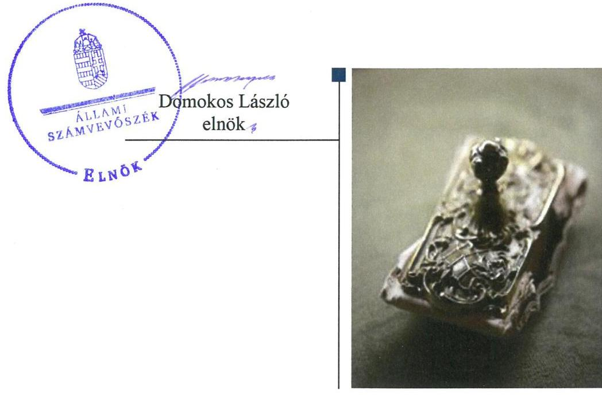
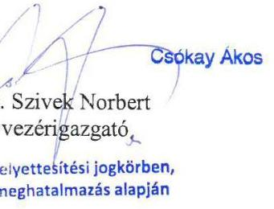
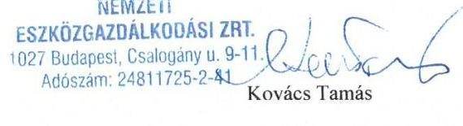
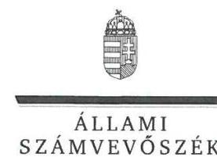
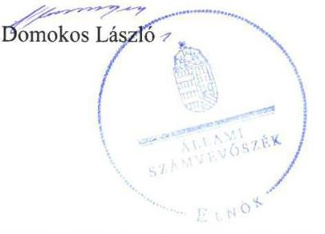
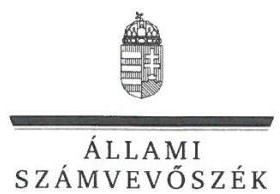

# Jelenetés 

## Az állami tulajdonú gazdasági társaságok ellenőrzése

Nemzeti Eszközgazdálkodási Zrt. 2018.

---

# Jelenetés 

## Az állami tulajdonú gazdasági társaságok ellenőrzése

Nemzeti Eszközgazdálkodási Zrt.
2018. július 23. nap

---

# AZ ELLENŐRZÉST FELÜGYELTE:

DR. NAGY IMRE felügyeleti vezető

# AZ ELLENŐRZÉST VEZETTE ÉS A VÉGREHAJTÁSÁÉRT FELELŐS:

KORSÓSNÉ VIGH ANDREA ellenőrzésvezető

# A PROGRAM ÖSSZEÁLLÍTÁSÁÉRT FELELŐS:

TÓTPÁL SZABOLCS osztályvezető

---

IKTATÓSZÁM: EL-0389-021/2018.

TÉMASZÁM: 2469

ELLENŐRZÉS-AZONOSÍTÓ SZÁM: V081410

---

Jelentéseink az Országgyűlés számítógépes hálózatán és az Interneten a www.asz.hu címen is olvashatóak.

---

# TARTALOMJEGYZÉK 

■ ÖSSZEGZÉS ..... 5
■ AZ ELLENŐRZÉS CÉLJA ..... 7
■ AZ ELLENŐRZÉS TERÜLETE ..... 8
■ AZ ELLENŐRZÉS HÁTTERE, INDOKOLTSÁGA ..... 9
■ A JELENTÉS LÉNYEGES KÉRDÉSKÖREI ..... 10
■ AZ ELLENŐRZÉS HATÓKÖRE ÉS MÓDSZEREI ..... 11
■ MEGÁLLAPÍTÁSOK ..... 13
■ JAVASLATOK ..... 17
■ MELLÉKLETEK ..... 19
I. sz. melléklet: Értelmező szótár ..... 19
■ FÜGGELÉK: ÉSZREVÉTELEK ..... 23
■ RÖVIDÍTÉSEK JEGYZÉKE ..... 31

---

.

---

# ÖSSZEGZÉS 

A Magyar Nemzeti Vagyonkezelő Zrt. a tulajdonosi joggyakorlás kereteit a jogszabályi előírásokkal összhangban alakította ki és szabályszerűen gyakorolta. A Nemzeti Eszközgazdálkodási Zrt. a működésének szabályait megfelelően kialakította, beszámolási és adatszolgáltatási kötelezettségeinek eleget tett. A Társaság pénzügyi-számviteli feladatellátása és vagyongazdálkodása nem volt szabályszerű. A köztulajdonban álló gazdasági társaságokra előírt átláthatósági követelmények nem érvényesültek, mert a közzétételi kötelezettségnek nem tett eleget.

## Az ellenőrzés társadalmi indokoltsága

Az állami tulajdonú gazdálkodó szervezetek ellenőrzése kiemelten fontos a vagyon megőrzése, megóvása érdekében, valamint a kormányzati szektor elszámolásaiban megjelenő állami tulajdonú gazdálkodó szervezetek esetében, amelyekkel szemben alapvető követelmény, hogy gazdálkodásuk, működésük szabályszerű, az általuk szolgáltatott adatok minél megbízhatóbbak legyenek. A kiegyensúlyozott, átlátható és fenntartható költségvetési gazdálkodás érvényesítésének elvét az Alaptörvény rögzíti, a nemzeti vagyon megőrzésének, védelmének és a nemzeti vagyonnal való felelős gazdálkodásnak a követelményeit sarkalatos törvény határozza meg.

A Nemzeti Eszközgazdálkodási Zrt-t 2013-ban a Nyugdíjreform és Adósságcsökkentő Alap kezeléséből a Magyar Nemzeti Vagyonkezelő Zrt-nek átadásra került nem likvid pénzügyi eszközök kezelésére és eredményes, időtálló befektetésére alapította a Magyar Állam alapítói részvényes nevében a Magyar Nemzeti Vagyonkezelő Zrt. A Nemzeti Eszközgazdálkodási Zrt. ellenőrzését a mintegy 40 Mrd Ft értékű - döntően az alapító által apportként rendelkezésre bocsátott értékpapír portfólióból álló - vagyon nagyságrendje indokolta.

## Főbb megállapítások, következtetések, javaslatok

A Magyar Nemzeti Vagyonkezelő Zrt. a Nemzeti Eszközgazdálkodási Zrt. tekintetében a jogszabályi előírásokkal összhangban kialakította a tulajdonosi joggyakorlás kereteit és szabályszerűen gyakorolta a tulajdonosi jogokat.

A Nemzeti Eszközgazdálkodási Zrt. a jogszabályi előírások és a tulajdonosi elvárásoknak megfelelően alakította ki a pénzügyi-számviteli feladatellátás és a vagyongazdálkodás szabályait, a tevékenysége sajátosságaira is figyelemmel. A pénzügyi-számviteli feladatellátás nem volt szabályszerű, mert a ráfordítások elszámolása során a számviteli bizonylatokra vonatkozó törvényi előírásokat nem érvényesítették, így ezen a területen az elszámoltathatóság nem volt biztosított. A bevételek elszámolása szabályszerű volt. A vagyongazdálkodás nem volt szabályszerű, mert a saját vagyon nyilvántartása - az eszközök bekerülési értékének a megállapítása, az értékcsökkenés elszámolása, a befektetett pénzügyi eszközöknél elszámolt értékvesztés indokoltságának bizonylatokkal történő alátámasztása - nem felelt meg a jogszabályi követelményeknek. A mérlegadatok leltárral történő alátámasztása, a vagyon változását eredményező döntéshozatal a jogszabályokkal, illetve a belső szabályokkal összhangban történt. A Társaság teljesítette a jogszabályok és a tulajdonos által előírt tervezési, beszámolási és adatszolgáltatási kötelezettségeket. Az éves beszámolókat az előírások szerint közzétették, a letétbe helyezési kötelezettségnek a 2014-2015. években a törvényben előírt határidőben, 2016-ban a törvényi határidőn túl tettek eleget.

A köztulajdonban álló gazdasági társaságokra előírt közzétételi kötelezettségeket nem teljesítették a vezető tisztségviselőkkel, a felügyelőbizottság tagjaival és a gazdálkodással összefüggő adatok tekintetében.

A megállapított szabálytalanságokkal összefüggésben az ÁSZ a Nemzeti Eszközgazdálkodási Zrt. vezérigazgatójának öt javaslatot fogalmazott meg. A javaslatok az értékpapírok értékelésének bizonylattal történő alátámasztására, a személyi jellegű ráfordítások elszámolása során a jogszabályi előírások betartására, a beszerzett tárgyi eszközök bekerülési értékének szabályszerű megállapítására, a közérdekű és a közérdekből nyilvános adatok közzétételére,

---

valamint a Társaság tevékenysége és a célok megvalósítása nyomon követését biztosító rendszer kialakítására irányultak.

---

# AZ ELLENŐRZÉS CÉLJA 

Az ellenőrzés célja annak értékelése volt, hogy a tulajdonosi jogok gyakorlása szabályszerű volt-e. A gazdálkodó szervezet szabályozottsága, gazdálkodása és vagyongazdálkodási tevékenysége megfelelt-e a jogszabályi és a tulajdonosi előírásoknak. A vagyonváltozást eredményező döntések esetében a tulajdonosi jogok gyakorlója és a gazdálkodó szervezet szabályszerűen jártak-e el. Az ellenőrzés célja továbbá annak megítélése volt, hogy a kormányzati szektorba sorolt állami tulajdonban (résztulajdonban) lévő gazdálkodó szervezetek gazdálkodásának a kormányzati szektor hiányára és az államadósságra befolyással bíró elemei a jogszabályi előírásoknak megfeleltek-e.

---

# AZ ELLENŐRZÉS TERÜLETE 

## Nemzeti Eszközgazdálkodási Zrt. és a tulajdonosi jogokat gyakorló Magyar Nemzeti Vagyonkezelő Zrt.

A Társaságot ${ }^{1}$ a Magyar Állam nevében az MNV Zrt. ${ }^{2}$ alapította 2013. december 16-án a tulajdonos által rábízott pénzügyi eszközök kezelése és befektetése céljából.

Az alapítás előzménye a Nyugdíjreform és Adósságcsökkentő Alap Irányító testületének 2013. májusban hozott határozata volt, mely szerint az Alap kezelésében lévő nem likvid pénzügyi eszközök átadásra kerültek az MNV Zrt-nek. A nemzeti fejlesztési miniszter 2013. október 28-án kelt határozatában hagyta jóvá, hogy az MNV Zrt. a Nyugdíjreform és Adósságcsökkentő Alaptól átvett pénzügyi eszközök hatékony kezelése érdekében a Magyar Állam 100%-os tulajdonában álló egyszemélyes zártkörűen működő részvénytársaságot hozzon létre és gondoskodjon a Társaság megalapításáról. A nemzeti fejlesztési miniszter határozatában rögzítette a jegyzett tőke és a tőketartalék rendelkezésre bocsátásának kondícióit is.

A Társaság a cégjegyzékbe 2014. február 20-án került bejegyzésre. Az alapítás és a bejegyzés közötti időszakról a Társaság a Számv. tv. ${ }^{3}$ szerint előtársasági, a bejegyzést követően éves beszámolót volt köteles készíteni. A Társaság az ellenőrzött időszakban a Magyar Állam kizárólagos tulajdonában volt, az alapítói, részvényest megillető tulajdonosi jogköröket az MNV Zrt. gyakorolta.

A Társaság bejegyzésekor 34 434,2 M Ft - meghatározó részben az apportált értékpapírokból álló - vagyonnal rendelkezett, amely 2016. december 31-re 7297,1 M Ft-tal (21,2%-kal) emelkedett. A Társaság az ellenőrzött időszakban nyereséggel zárta az üzleti éveket, a 2014-2015-2016. évek éves beszámolóiban 2545,5 - 3810,0 - 1788,7 M Ft mérleg szerinti eredményt mutatott ki. Követelés és rövid lejáratú kötelezettség állománya elhanyagolható - a mérleg főösszeg 1%-át el nem érő - volt. A Társaság az ellenőrzött időszakban kezelt vagyonnal nem rendelkezett, árbevételre nem tett szert, hosszú lejáratú kötelezettsége nem keletkezett.

A Társaság ügyvezető szerve a 3 főből álló igazgatóság volt, az operatív vezetést - a Társaság munkavállalójaként - a vezérigazgató látta el. A foglalkoztatottak átlagos statisztikai létszáma 2014-ben két fő, 2015-ben négy fő, 2016-ban öt fő volt, a számviteli feladatokat külső szervezet útján látták el.

A Magyar Iparfejlesztési Holding Zrt.-ben - mely főtevékenységként üzletviteli, egyéb vezetési tanácsadási feladatokat látott el - 2014. október 10-étől 50,0%, 2015. június 8-ától 100,0% részesedéssel rendelkezett.

A Társaság 2015. december 31-től tartozik a kormányzati szektorba besorolt egyéb szervezetek közé a nemzetgazdasági miniszter közleménye szerint. 2016. december 31-ig a Társaságnak a kormányzati szektor hiányára és az államadósságra befolyással bíró adósságot keletkeztető ügylete nem volt.

---

# AZ ELLENŐRZÉS HÁTTERE, INDOKOLTSÁGA 

Az ellenőrzés rámutathat az állami tulajdonú gazdálkodó szervezetek gazdálkodási tevékenységével kapcsolatos jó gyakorlatokra és szabálytalanságokra. Felhívhatja a figyelmet a jogszabályi követelmények teljesítéséhez szükséges feltételek hiányosságaira, hozzájárulhat az államháztartáson kívüli, de (közvetlenül vagy közvetve) állami vagyont használó gazdálkodó szervezetek tevékenységének átláthatóságához. Ellenőrzésünk eredményeképpen javaslatainkkal, megállapításainkkal hozzájárulhatunk a nemzeti vagyonnal való gazdálkodás átláthatóságának, elszámoltathatóságának a javításához.

---

# A JELENTÉS LÉNYEGES KÉRDÉSKÖREI 

1.- A tulajdonosi jogok gyakorlása szabályszerű volt-e?
2.- A társaság pénzügyi-számviteli feladatellátása és vagyongazdálkodása szabályszerű volt-e?

---

# AZ ELLENŐRZÉS HATÓKÖRE ÉS MÓDSZEREI 

## Az ellenőrzés típusa

Megfelelőségi ellenőrzés.

## Az ellenőrzött időszak

Az ellenőrzött időszak a Társaság bejegyzésétől, 2014. február 21-től 2016. december 31-ig, illetve a 2016. évi beszámoló jóváhagyásáig tartó időszak.

## Az ellenőrzés tárgya

Az állami tulajdonban (résztulajdonban) lévő gazdasági társaságok gazdálkodása, kiemelten vagyongazdálkodási tevékenysége, a tulajdonosi jogok gyakorlása, továbbá a kormányzati szektorba sorolt gazdasági társaságok gazdálkodásának a kormányzati szektor hiányára és az államadósságra befolyással bíró elemei.

## Az ellenőrzött szervezet

A Nemzeti Eszközgazdálkodási Zrt. és a tulajdonosi jogokat gyakorló Magyar Nemzeti Vagyonkezelő Zrt.

## Az ellenőrzés jogalapja

Az ellenőrzés jogalapját az ÁSZ tv. ${ }^{4} 1$. § (3) bekezdése és az 5. § (3)-(5) bekezdései képezték.

## Az ellenőrzés módszerei

Az ellenőrzést az ellenőrzési program ellenőrzési kérdései, az ellenőrzött időszakban hatályos szabályok, az ellenőrzés szakmai szabályok és módszertanok figyelembe vételével végeztük el.

Az ellenőrzött szervezetek az ellenőrzés lefolytatásához tanúsítványok kitöltésével, valamint az ÁSZ által kért dokumentumok megküldésével szolgáltattak adatokat.

A bevételek és ráfordítások közül az anyagjellegű ráfordítások, az értékesítés nettó árbevétele, az egyéb, rendkívüli és pénzügyi műveletek ráfordításai és bevételei továbbá a személyi jellegű ráfordítások elszámolása,

---

valamint az immateriális javak és tárgyi eszközök esetében a vagyonnyilvántartás és az értékcsökkenési leírás esetében a szabályszerű működést véletlen mintavétellel ellenőriztük.

A fenti sokaságok esetében a mintavétel azokra a legnagyobb értékű tételekre - a lényeges sokaságra - terjedt ki, melyek összértéke elérte a teljes sokaság összértékének 50%-át. A személyi jellegű ráfordítások esetében a mintavétel a teljes sokaságból történt. Amennyiben valamely ellenőrzött sokaság elemszáma kisebb volt, mint az előírt minta elemszám, az ellenőrzött sokaságot tételesen ellenőriztük.

A mintavétellel ellenőrzött területek esetében minden egyes tétel vonatkozásában a szabályszerűségre vonatkozó kérdéseket tettünk fel, amelyek eredménye összesítésre került. „Szabályszerűnek" értékeltünk egy ellenőrzött területet, amennyiben 95%-os bizonyossággal az ellenőrzött sokaságban az átlagos hibaarány legfeljebb 10%, „nem szabályszerűnek", amennyiben 10%-nál magasabb arányt képviselt.

---

# 1. A tulajdonosi jogok gyakorlása szabályszerű volt-e? 

Összegző megállapítás

Az MNV Zrt. szabályszerűen kialakította a tulajdonosi joggyakorlás rendjét és szabályszerűen gyakorolta a tulajdonosi jogokat.

AZ EGYSZEMÉLYES TÁRSASÁGNÁL a Gt. ${ }^{5}$ és a Ptk. ${ }^{6}$ előírásai szerint a legfőbb szerv hatáskörébe tartozó kérdésekben az alapító MNV Zrt. döntött.

AZ MNV ZRT. szabályszerűen kialakította a részesedés feletti tulajdonosi joggyakorlás rendjét:
—_ belső szabályzataiban rögzítette - többek között - a hatásköri és felelősségi szabályokat, a tulajdonosi ellenőrzés, a monitoring adatszolgáltatás, a döntések előkészítésének rendjét, a könyvvizsgáló kiválasztására, a negyedéves tulajdonosi értekezletre vonatkozó előírásokat;
—_ a Társaság Alapító okiratában, illetve az Alapszabály ${ }_{1-3}$-ban meghatározta az alapító kizárólagos hatásköreit, az igazgatóság, a felügyelőbizottság tagjait és hatáskörét, a vezérigazgató személyét és feladatait, kijelölte a könyvvizsgálót.
A felügyelőbizottság szabályszerűen, az MNV Zrt. által jóváhagyott ügyrend ${ }^{7}$ alapján működött, az üzleti tervekről, az éves beszámolókról, továbbá az ügyrendben meghatározott körben írásbeli jelentése az MNV Zrt. döntését megelőzően rendelkezésre állt. Félévenkénti rendszerességgel ellenőrizte az alapítói határozatok végrehajtását, megtárgyalta az ügyvezetésről a Társaság vagyoni helyzetéről, üzletpolitikájáról készített negyedéves jelentéseket.

Az MNV Zrt. az Alapító okirat, illetve az Alapszabály ${ }_{1-3}$ rendelkezése szerint jóváhagyta a Társaság üzleti terveit, Vagyongazdálkodási Stratégiáját ${ }^{8}$, a Gt., illetve a Ptk. előírásait betartva, a könyvvizsgáló írásbeli jelentése birtokában megtárgyalta és elfogadta
 a Társaság éves beszámolóit. Döntött a Társaság eredményére vonatkozóan, valamint elfogadta a Taktv. ${ }^{9}$ előírásának megfelelő tartalommal a Társaság javadalmazási szabályzatát. Az MNV Zrt. az Alapszabály ${ }^{3}$ előírásainak megfelelően hozott döntést a Társaság saját vagyona változásáról.

A Társaság tevékenységének nyomon követését a monitoring adatszolgáltatási kötelezettség, az igazgatóság ${ }^{10}$ beszámolási, a felügyelőbizottság tájékoztatási kötelezettségének előírása, valamint a negyedéves tulajdonosi értékelő értekezletek útján biztosította. Ezen túl az MNV Zrt. Ellenőrzési Igazgatósága 2014-2016. között három alkalommal ellenőrizte a Társaság gazdálkodását: a gazdálkodás szabályozottságát, a döntések szabályszerűségét, a tevékenység eredményét.

---

# 2. A társaság pénzügyi-számviteli feladatellátása és vagyongazdálkodása szabályszerű volt-e? 

## Összegző megállapítás

2.1. számú megállapítás
2.2. számú megállapítás

A pénzügyi-számviteli feladatellátás és a vagyongazdálkodás nem volt szabályszerű. A közérdekű és közérdekből nyilvános adatok közzétételére vonatkozó előírásokat a Társaság nem teljesítette.

A Társaság pénzügyi-számviteli feladatellátása és vagyongazdálkodása a jogszabályi előírásoknak megfelelően szabályozott volt.

A Társaság az ellenőrzött időszakban a Számv. tv. előírásaival összhangban szabályozta a számviteli politikát ${ }^{11}$, továbbá rendelkezett leltározási ${ }^{12}$, értékelési ${ }^{13}$, pénzkezelési ${ }^{14}$ szabályzattal és számlarenddel ${ }^{15}$.

A Társaság a befektetési portfóliójába tartozó pénzügyi eszközökkel kapcsolatos speciális szabályokat az üzletkötési ${ }^{16}$, valamint az eszközértékelési ${ }^{17}$ szabályzatokban rögzítette, melyeket az Alapító okirat, illetve az Alapszabály ${ }^{1-3}$ előírása szerint az igazgatóság hagyott jóvá.

A Társaság az Alapító okirat, illetve az Alapszabály ${ }^{1-3}$, továbbá az SZMSZ ${ }^{18}$ rendelkezésének eleget téve a befektetési politikáját és a vagyongazdálkodási irányelveit az évente felülvizsgált és az MNV Zrt. által jóváhagyott Vagyongazdálkodási Stratégiában határozta meg.

A Társaság a bevételeit szabályszerűen számolta el, a ráfordítások elszámolása, a saját vagyon nyilvántartása és az értékcsökkenés elszámolása nem volt szabályszerű.

A BEVÉTELEK elszámolása szabályszerű volt.
AZ ANYAGJELLEGŰ, EGYÉB, RENDKIVÜLI ÉS PÉNZÜGYI MŰVELETEK RÁFORDÍTÁSAINAK elszámolása nem volt szabályszerű, mert:
-2014-ben egy hitelviszonyt megtestesítő, egy évnél hosszabb lejáratú értékpapírt érintően a szakértői értékelésben megállapított 401,8 M Ft értékvesztéssel szemben 696,9 M Ft értékvesztést számoltak el. A 295,1 M Ft-tal magasabb összegű értékvesztés elszámolást nem támasztotta alá bizonylat, a Számv. tv. 165. § (1)-(2) bekezdések előírása ellenére. Nem volt számviteli dokumentumokkal alátámasztott az értékpapír könyv szerinti értéke és a piaci értéke közötti veszteség jellegű, tartós különbözet 295,1 M Ft értékben, az, hogy az értékvesztés elszámolás megfelelt-e a Számv. tv. 54. § (4) bekezdés előírásának, valamint az értékelési szabályzat 9.1 pontjában rögzített értékelési szabályoknak.
-2016-ban kettő hitelviszonyt megtestesítő, egy évnél hosszabb lejáratú értékpapírt érintően, előző évek önrevíziója keretében történt 2072,1 M Ft összegű értékvesztés elszámolást nem támasztotta alá bizonylat, a Számv. tv. 165. § (1)-(2) bekezdések előírása ellenére. Nem volt dokumentumokkal alátámasztott az értékpapírok piaci ér-

---

tékének megállapítása, a könyv szerinti érték és a piaci érték különbözete, annak tartós veszteség jellege, így az értékvesztés elszámolásnak Számv. tv. 54. § (4) bekezdés előírásának és az értékelési szabályzat 9.1 pontjában rögzített értékelési szabályoknak való megfelelés.

A SZEMÉLYI JELLEGŰ RÁFORDÍTÁSOK elszámolása nem volt szabályszerű, mert:

- a gépkocsi költségtérítés és külföldi kiküldetések elszámolásait nem támasztotta alá bizonylat a Számv. tv. 165. § (1)-(2) bekezdésében foglalt előírások ellenére;
- egy teljes munkaidős munkaviszonyban foglalkoztatott munkavállaló nem rendelkezett a munkaviszony létrejöttét, valamint a munkabér kifizetésre való jogosultságot igazoló, a Munka tv. ${ }^{19}$ 42. § (1)(2) bekezdéseiben előírt munkaszerződéssel, így több havi munkabér és cafetéria kifizetés nem volt bizonylattal alátámasztott a Számv. tv. 165. § (1)-(2) bekezdésben foglalt előírások ellenére;
- általános hiba volt, hogy a bérköltség, bérjárulékok, személyi jellegű egyéb kifizetések elszámolását megalapozó számviteli bizonylatok nem tartalmazták az utalványozó és a rendelkezés végrehajtását igazoló személy aláírását a Számv. tv. 167. § (1) bekezdés c) pontjában, továbbá az érintett főkönyvi számlákra történő hivatkozást a Számv. tv. 167. § (1) bekezdés h) pontjában foglalt előírás ellenére.

# A SAJÁT VAGYON NYILVÁNTARTÁSA ÉS AZ ÉRTÉKCSÖKKENÉS ELSZÁMOLÁSA nem volt szabályszerű. 

A 2016. évi személygépjármű beszerzésnél a bekerülési érték meghatározása nem volt szabályszerű, mert az adásvételhez kapcsolódó vagyonszerzési illetéket nem tekintették a bekerülési érték részének a Számv. tv. 47. § (2) bekezdés a) pont előírása ellenére, így a hibás bekerülési érték alapján számított értékcsökkenés sem volt szabályszerű.

A beszerzett tárgyi eszközöknél az állományba vételt üzembe helyezési okmánnyal dokumentálták, a beszerzett eszközök megtalálhatók voltak a tárgyévi leltárban.

Az éves beszámolók mérlegadatait a Társaság a Számv. tv. és a leltározási szabályzat előírásainak megfelelő leltárral alátámasztotta.

A saját vagyon változását eredményező döntések megfeleltek tulajdonosi előírásoknak.

### 2.3. számú megállapítás

A Társaság teljesítette a tervezési és adatszolgáltatási kötelezettségeit. Az éves beszámolók letétbe helyezése 2014-2015-ben határidőben, 2016-ban késedelmesen történt meg.

AZ ÉVES ÜZLETI TERVEKET a Társaság az Alapító okirat, illetve az Alapszabály ${ }^{1-3}$ előírása szerint, az MNV Zrt. által évente kiadott tervezési irányelvek alapján elkészítette, azokat az igazgatóság útján jóváhagyásra az MNV Zrt.-nek előterjesztette.

AZ ÉVES BESZÁMOLÓKAT a 2014-2015. üzleti évek tekintetében a Társaság elkészítette és az MNV Zrt.-nek jóváhagyásra előterjesz-

---

tette, jóváhagyást követően a Számv. tv-ben előírt határidőben letétbe helyezte és közzétette. A 2016. évi beszámoló 2017. augusztus 15-i dátummal készült el, amelyet az MNV Zrt. a 443/2017. (VIII.23.) számú Alapítói Határozatával fogadott el, a Társaság 2017. augusztus 24-én letétbe helyezte és közzétette. A 2016. évi beszámoló letétbe helyezése a Számv. tv. 153. § (1) bekezdésében előírt határidőn - az adott üzleti év mérleg fordulónapját követő ötödik hónap utolsó napja - túl történt.

# AZ MNV ZRT. ÁLTAL ELŐÍRT ADATSZOLGÁLTATÁSI, beszámolási kötelezettségeinek a Társaság eleget tett: havonta monitoring adatszolgáltatást teljesített, továbbá negyedéves jelentés formában beszámolt az ügyvezetésről, a Társaság vagyoni helyzetéről, az üzleti befektetési döntésekről az Alapító okirat, illetve az Alapszabály ${ }^{1-3}$ előírásának megfelelően. 

2.4. számú megállapítás

A közérdekű és közérdekből nyilvános adatok közzétételére vonatkozó törvényi kötelezettségének a Társaság nem tett eleget. Nem alakították ki a szervezet tevékenysége és a célok megvalósítása nyomon követésének jogszabályban előírt rendszerét.

## A KÖZÉRDEKŰ ÉS KÖZÉRDEKBŐL NYILVÁNOS

ADATOK közzétételére vonatkozó kötelezettségének a Társaság nem tett eleget a Taktv. 2. § (1)-(3) bekezdéseiben foglaltak ellenére, a vezető tisztségviselőivel, a felügyelőbizottság tagjaival és a gazdálkodásával összefüggő adatok tekintetében.

## A KORMÁNYZATI SZEKTORBA SOROLT EGYÉB

SZERVEZET vezérigazgatója nem alakította ki a Társaság tevékenységének és a célok megvalósítása nyomon követését biztosító rendszert a 2016. évben a Bkr. ${ }^{20}$ 10. § előírása ellenére, a Bkr. 1. § (2) bekezdés d) pontjában, valamint a Bkr. 54/A. §-ában foglalt előírásokra figyelemmel.

---

# JAVASLATOK 

Az ÁSZ tv. 33. § (1) bekezdésében foglaltak értelmében az ellenőrzött szervezet vezetője köteles a jelentésben foglalt megállapításokhoz kapcsolódó intézkedési tervet összeállítani és azt a jelentés kézhezvételétől számított 30 napon belül az ÁSZ részére megküldeni. Amennyiben az ellenőrzött szervezet vezetője nem küldi meg határidőben az intézkedési tervet, vagy továbbra sem elfogadható intézkedési tervet küld, az Állami Számvevőszék elnöke az ÁSZ tv. 33. § (3) bekezdés a) és b) pontjaiban foglaltakat érvényesítheti.

## A Nemzeti Eszközgazdálkodási Zrt. vezérigazgatójának

1. Biztosítsa, hogy a hitelviszonyt megtestesítő, egy évnél hosszabb lejáratú értékpapírok értékvesztését a jogszabályi előírások szerinti szabályszerű bizonylatok alapján számolják el, valamint hogy az értékpapírok piaci értékének megállapítása dokumentumokkal alátámasztottan történjen.
(2.2. sz. megállapítás 2. bekezdése alapján)
2. Biztosítsa a személyi jellegű ráfordítások elszámolása során a jogszabályi előírások betartását.
(2.2. sz. megállapítás 3. bekezdése alapján)
3. Intézkedjen a beszerzett tárgyi eszközök bekerülési értékének jogszabályi előírások szerinti meghatározásáról, az értékcsökkenés szabályszerű elszámolásáról.
(2.2. sz. megállapítás 4. bekezdése alapján)
4. Gondoskodjon az Taktv. előírásai alapján a közérdekű és a közérdekből nyilvános adatok közzétételéről.
(2.4. sz. megállapítás 1. bekezdése alapján)
5. Tegyen eleget a Társaság tevékenységének és a célok megvalósítása nyomon követését biztosító rendszer kialakításának, a vonatkozó jogszabály szerinti előírásának megfelelően.
(2.4. sz. megállapítás 2. bekezdése alapján)

---

.

---

# MELLÉKLETEK 

- I. SZ. MELLÉKLET: ÉRTELMEZŐ SZÓTÁR
állami vagyon
illikvid eszköz
gazdasági társaság
gazdálkodó szervezet
kapcsolt vállalkozás
a) Az állam tulajdonában lévő dolog, valamint a dolog módjára hasznosítható természeti erő,
b) az a) pont hatálya alá nem tartozó mindazon vagyon, amely vonatkozásában törvény az állam kizárólagos tulajdonjogát nevesíti,
c) az állam tulajdonában lévő tagsági jogviszonyt megtestesítő értékpapír, illetve az államot megillető egyéb társasági részesedés,
d) az államot megillető olyan immateriális, vagyoni értékkel rendelkező jogosultság, amelyet jogszabály vagyoni értékű jogként nevesít.
Forrás: Vtv. ${ }^{21}$ 1. § (2) bekezdése
e) az állam tulajdonában lévő pénzügyi eszközök
Forrás: Vtv. 1. § (2) bekezdése
Illikvidnek minősül az az eszköz, amely az adott piaci körülmények között nem, vagy a piaci forgalomnak a szokásos feltételekhez képest jelentős visszaesése miatt csak aránytalanul nagy veszteséggel lenne értékesíthető.
Forrás: Bef.tv. ${ }^{22}$ 103. § (2) bekezdés, Bef.tv. ${ }^{23}$ 128. § (2) bekezdés
A Ptk. ${ }^{2}$ 3:88. § (1) bekezdése szerint „a gazdasági társaságok üzletszerű közös gazdasági tevékenység folytatására, a tagok vagyoni hozzájárulásával létrehozott, jogi személyiséggel rendelkező vállalkozások, amelyekben a tagok a nyereségből közösen részesednek, és a veszteséget közösen viselik".
2014. március 14-ig:
A Ptk. ${ }^{24}$ 685. § c) pontja szerint gazdálkodó szervezet:
„az állami vállalat, az egyéb állami gazdálkodó szerv, a szövetkezet, a lakásszövetkezet, az európai szövetkezet, a gazdasági társaság, az európai részvénytársaság, az egyesülés, az európai gazdasági egyesülés, az európai területi együttműködési csoportosulás, az egyes jogi személyek vállalata, a leányvállalat, a vízgazdálkodási társulat, az erdő birtokossági társulat, a végrehajtói iroda, az egyéni cég, továbbá az egyéni vállalkozó."
2014. március 15-től:

A gazdasági társaság, az európai részvénytársaság, az egyesülés, az európai gazdasági egyesülés, az európai területi együttműködési csoportosulás, a szövetkezet, a lakásszövetkezet, az európai szövetkezet, a vízgazdálkodási társulat, az erdőbirtokossági társulat, az állami vállalat, az egyéb állami gazdálkodó szerv, az egyes jogi személyek vállalata, a közös vállalat, a végrehajtói iroda, a közjegyzői iroda, az ügyvédi iroda, a szabadalmi ügyvivői iroda, az önkéntes kölcsönös biztosító pénztár, a magánnyugdíjpénztár, az egyéni cég, továbbá az egyéni vállalkozó. Az állam, a helyi önkormányzat, a költségvetési szerv, az egyesület, a köztestület, valamint az alapítvány gazdálkodó tevékenységével összefüggő polgári jogi kapcsolataira is a gazdálkodó szervezetre vonatkozó rendelkezéseket kell alkalmazni.
Forrás: Ppt. ${ }^{25}$ 396. §
Az anyavállalat és a leányvállalat és a közös vezetésű vállalkozások (fölérendelt anyavállalat esetében a minősítést a fölérendelt anyavállalat szempontjából kell elvégezni)
Forrás: Számv. tv. 3. § (2) 7. pont

---

kormányzati szektorba sorolt egyéb szervezet
közszolgáltatás

MNV Zrt.
nemzeti vagyon
tulajdonosi ellenőrzés

Az a szervezet, amely az Áht. alapján nem része az államháztartásnak, azonban az Európai Közösséget létrehozó szerződéshez csatolt, a túlzott hiány esetén követendő eljárásról szóló jegyzőkönyv alkalmazásáról szóló 2009. május 25-i 479/2009/EK rendelet szerint a kormányzati szektorba tartozik. A nemzetgazdasági miniszter 2013. június 26-án megjelent Közleményben tette közé ezen szervezetek listáját.
Az Ebktv ${ }^{26}$. 3. § d) pontja a következőképpen határozza meg

 a közszolgáltatást: „szerződéskötési kötelezettség alapján a lakosság alapvető szükségleteinek ellátására irányuló szolgáltatás, így különösen a villamos energia-, gáz-, hő-, víz-, szennyvíz- és hulladékkezelési, köztisztasági, postai és távközlési szolgáltatás, továbbá a menetrend alapján közlekedő járművekkel végzett közforgalmú személyszállítás".
Az állami vagyon felett, a Magyar Államot megillető tulajdonosi jogok és kötelezettségek összességét - a hatályos szabályozás szerint - az állami vagyon felügyeletéért felelős miniszter (jelenleg a nemzeti fejlesztési miniszter) gyakorolja. A miniszter feladatát nagy részben az MNV Zrt., mint tulajdonosi joggyakorló szervezet útján látja el.
a) az állam vagy a helyi önkormányzat kizárólagos tulajdonában álló dolgok,
b) az a) pont hatálya alá nem tartozó, állam vagy a helyi önkormányzat tulajdonában lévő dolog,
c) az állam vagy a helyi önkormányzat tulajdonában lévő pénzügyi eszközök, továbbá az államot vagy a helyi önkormányzatot megillető társasági részesedések,
d) az államot vagy a helyi önkormányzatot megillető bármely vagyoni értékkel rendelkező jogosultság, amelyet jogszabály vagyoni értékű jogként nevesít,
e) Magyarország határa által körbezárt terület feletti légtér,
f) az üvegházhatású gázok kibocsátási egységeinek kereskedelméről szóló törvény szerint kibocsátási egység és légiközlekedési kibocsátási egység, valamint az ENSZ Éghajlatváltozási Keretegyezménye és annak Kiotói Jegyzőkönyvének végrehajtási keretrendszeréről szóló törvény szerinti kiotói egység,
g) állami vagy helyi önkormányzati fenntartású közgyűjtemény (muzeális intézmény, levéltár, közgyűjteményként működő kép- és hangarchívum, valamint könyvtár) saját gyűjteményében nyilvántartott kulturális javak körébe tartozó dolog, kivéve, ha az állami vagy önkormányzati tulajdon jogszerű létrejötte kétséget kizáró módon nem bizonyítható és a dologra nézve más a tulajdonjogát bizonyítja vagy a kulturális javakra vonatkozó jogszabályokban meghatározott eljárás keretében valószínűsíti (g. pont módosult 2013. december 7-től),
h) a régészeti lelet,
i) a nemzeti adatvagyon körébe tartozó állami nyilvántartások fokozottabb védelméről szóló törvény szerinti nemzeti adatvagyon.
Forrás: Nvtv. ${ }^{27}$ 1. § (2)
2014. március 14-ig:

Az állami vagyon kezelőjét, haszonélvezőjét, használóját megillető jogok gyakorlását, annak szabályszerűségét, célszerűségét az MNV Zrt. - szükség szerint területi szervei útján - ellenőrzi.
2014. március 15-től:

Az állami vagyon használóját, vagyonkezelőjét és haszonélvezőjét megillető jogok gyakorlását, annak szabályszerűségét, a kötelezettségek teljesítését, valamint a vagyon rendeltetése szerinti célszerűségét a tulajdonosi joggyakorló rendszeresen ellenőrzi.
Forrás: Vtv.vhr. ${ }^{28}$ 20. § (1)

---

tulajdonosi jogok gyakorlója 1.

# 2013. június 27-ig: 

Az állami vagyon felett a Magyar Államot megillető tulajdonosi jogok és kötelezettségek összességét - ha törvény eltérően nem rendelkezik - az állami vagyon felügyeletéért felelős miniszter (a továbbiakban: miniszter) gyakorolja, aki e feladatát a Magyar Nemzeti Vagyonkezelő Zártkörűen Működő Részvénytársaság (a továbbiakban: MNV Zrt.), a Magyar Fejlesztési Bank, illetve a tulajdonosi joggyakorló szervezet útján látja el. A miniszter miniszteri rendeletben, a törvényben meghatározott állami vagyoni kör tekintetében, meghatározott időtartamra, a joggyakorlás egyes szabályainak meghatározásával - az őt megillető tulajdonosi jogok és kötelezettségek összességének, illetve azok meghatározott részének gyakorlóját az Áht. szerinti központi költségvetési szervek, ezek intézménye, továbbá a 100%-ban állami tulajdonban álló gazdasági társaságok közül kijelölheti.
Forrás: Vtv. 3. § (1) és (2)
2013. június 28-ától:

A rábízott állami vagyon felett az államot megillető tulajdonosi jogok és kötelezettségek összességét tulajdonosi joggyakorlóként:
a) ha törvény vagy miniszteri rendelet eltérően nem rendelkezik, a Magyar Nemzeti Vagyonkezelő Zártkörűen Működő Részvénytársaság (a továbbiakban: MNV Zrt.),
b) törvényben kijelölt személy vagy
c) az állami vagyon felügyeletéért felelős miniszter (a továbbiakban: miniszter) által rendeletben kijelölt személy gyakorolja.
[...] A miniszter e törvény felhatalmazása alapján - a meghatározott célok hatékonyabb elérése érdekében, miniszteri rendeletben, az ott meghatározott állami vagyoni kör tekintetében, meghatározott időtartamra - e törvény keretei között, a joggyakorlás egyes szabályainak meghatározásával - az államot megillető tulajdonosi jogok és kötelezettségek összességének, illetve azok meghatározott részének gyakorlóját az Áht. szerinti központi költségvetési szervek, ezek intézménye, továbbá a 100%-ban állami tulajdonban álló gazdasági társaságok közül kijelölheti.
Forrás: Vtv. 3. § (1) és (2)
2.

Aki a nemzeti vagyon felett az államot vagy a helyi önkormányzatot megillető tulajdonosi jogok és kötelezettségek összességének gyakorlására jogosult
Forrás: Nvtv. 3. § (1) 17. pontja

---

.

---

# FÜGGELÉK: ÉSZREVÉTELEK 

A jelentéstervezetet a Számvevőszék 15 napos észrevételezésre megküldte az ellenőrzött szervezetek vezetőinek az ÁSZ tv. 29. § (1) bekezdése előírásának megfelelően.

Az ÁSZ a jelentéstervezetet a Magyar Nemzeti Vagyonkezelő Zrt. vezérigazgatójának és a Nemzeti Eszközgazdálkodási Zrt. vezérigazgatójának küldte meg.

A Magyar Nemzeti Vagyonkezelő Zrt. vezérigazgatója a jelentéstervezettel kapcsolatban nem tett észrevételt. A Nemzeti Eszközgazdálkodási Zrt. vezérigazgatójának - mellékletek nélküli - észrevételeit és azokra adott választ a jelentés függeléke tartalmazza.

[^0]
[^0]:    * 29. § (1) Az Állami Számvevőszék az ellenőrzési megállapításait megküldi az ellenőrzött szervezet vezetőjének vagy az általa megbízott személynek, és annak, akinek személyes felelősségét állapította meg.
    (2) Az ellenőrzött szervezet vezetője és a felelősként megjelölt személy az ellenőrzés megállapításaira tizenöt napon belül írásban észrevételt tehet.
    (3) Az Állami Számvevőszék az észrevételre a beérkezésétől számított harminc napon belül írásban válaszol. A figyelembe nem vett észrevételeket köteles a jelentésben feltüntetni, és megindokolni, hogy azokat miért nem fogadta el.

---

# MNV   Magyar Nemzeti   VAGYONKEZELŐ ZRT   VEZÉRIGAZGATÓ 

Állami Számvevőszék

## Domokos László

elnök

1052 Budapest
Apáczai Cs. J. u. 10.

Ikt. sz.: MNV/01/8484/ 4 /2018.
Hiv. sz.: EL-0590-030/2018.

Tisztelt Elnök Úr!
Tájékoztatom, hogy az MNV Zrt. a 2018. május 31. napján „Az állami tulajdonú gazdasági társaságok Az állami tulajdonban (résztulajdonban) lévő gazdálkodó szervezetek vagyonmegőrzési és gazdálkodási tevékenységének ellenőrzése - Nemzeti Eszközgazdálkodási Zrt." tárgyában kézhez vett, EL-0590030/2018. ikt. sz. Jelentés-tervezetre nem kíván észrevételt tenni.

Budapest, 2018. június „ " "

Üdvözlettel:

---

# 161 

## NEMZETI ESZKÖZGAZDÁLKODÁSI ZRT. 1027 BUDAPEST, CSALOGÁNY U. 9-11.

## ÁLLAMI SZÁMVEVŐSZÉK

1052 Budapest, Apáczai Csere János u. 10.
1034 Budapest 4, Pf. 54

## Domonkos László Elnök Úr részére

Hiv. szám: EL-0590-031/2018

Tisztelt Elnök Úr!
2018. május 28-án kelt, EL-0590-031/2018. iktatószámú levelével megküldött, a Nemzeti Eszközgazdálkodási Zrt. ellenőrzéséről az Állami Számvevőszék által összeállított jelentéstervezetre a Nemzeti Eszközgazdálkodási Zrt. képviseletében az alábbi észrevételeket tesszük:
2.2. számú megállapítás, Az anyagjellegű, egyéb, rendkívüli és pénzügyi műveletek ráfordítások című rész (14. oldal):

Az anyagjellegű, egyéb, rendkívüli és pénzügyi műveletek ráfordításainak elszámolásával kapcsolatban az Állami Számvevőszék jelentéstervezete két pontban tesz észrevételt.

Társaságunk véleménye szerint az értékvesztések elszámolása mindkét pontban említett ügycsoportban szabályosan, az értékpapírok akkori értékének és a rendelkezésre álló releváns információknak, valamint a számviteli törvény által előírtaknak megfelelően történt.

- Az első ponttal kapcsolatos, 295,1 M Ft értékkülönbözetű ügyben a 2014 évi beszámolóban egy ingatlan befektetési jeggyel kapcsolatosan a fordulónapra elkészített piaci értékeléshez képest a Társaság a mérlegkészítés időpontját követően a kibocsátótól kapott információk alapján értékelte le a befektetési jegyeket 0 Ft értékre. A kibocsátótól kapott új, írásban közölt információ szerint a 2015 májusában lejáró bankhitel meghosszabbításával kapcsolatos tárgyalások sikertelenek voltak. Ezen információ, a befektetési jegyek akkori nettó eszközértéke, az ingatlanok piaci ára és a befektetési alap hitelállománya együttesen valószínűsítette, hogy az esetleges banki követelés érvényesítését követően a befektetési jegyek tulajdonosainak nem marad majd felosztható vagyon, így az értékpapír értékét veszti.
- A második ponttal kapcsolatosan, a 2016. évi beszámolóban az önrevízióban érintett két strukturált hitelviszonyt megtestesítő értékpapír esetében - a rendelkezésre álló piaci értéket megállapító, a Társaság által készíttetett - független írásbeli szakértői jelentéssel összhangban és azzal megegyezően történt az értékvesztések megállapítása az önellenőrzési jegyzőkönyv releváns hivatkozásaival összhangban. Az önellenőrzés a Számv. tv. 54 §(4) előírásainak megfelelően került elszámolásra, a rendelkezésre álló, piaci értéket megállapító jelentéssel összhangban és azzal megegyezően történt az értékvesztések megállapítása. A 2014-2015. évi értékelések és kifizetések korrekciója a Barclays Bank, mint kibocsátó által megküldött helyesbítéseknek is megfelelően történt. Az önellenőrzés a Számv.tv. 165 § (1)-(2) bekezdésében foglalt előírásoknak megfelelően, dokumentumokkal alátámasztott. Az önellenőrzés értékmódosításai feljegyzés illetve az önellenőrzési jegyzőkönyv biztosítja a megfelelő alátámasztást, mely dokumentumok jelen levélhez csatolásra kerültek.

---

A jelentéstervezet 2.3. számú megállapításában jelzett, a Társaság 2016. évi éves beszámolójának törvényi határidő túli elfogadása és letétbe helyezése a fent említett két értékpapírral volt kapcsolatban. A 2014-2016. üzleti évekre ezen értékpapírokkal kapcsolatos bevételek helyes jogcímeit és az értékpapírok helyes értékét érintő kibocsátói hibát találtunk, melyet csak a május 31. határidőt követően sikerült megfelelő vizsgálatokkal és javított bizonylatokkal, értékelésekkel kijavíttatni, illetve kijavítani.

# 2.2. számú megállapítás, A személyi jellegű ráfordítások című rész (15. oldal): 

A Társaság valamennyi munkavállalója rendelkezik és tudomásunk szerint korábban is rendelkezett aláírt munkaszerződéssel, ezért nem lehet beazonosítani, hogy milyen körülményen alapul, illetve milyen időszakra vonatkozik az a megállapítás, amely arra utal, hogy egy teljes munkaidős munkavállaló nem rendelkezett aláírt munkaszerződéssel.

A külföldi kiküldetés, illetve gépkocsi költségtérítéshez kapcsolódó megjegyzéshez szeretnénk hozzáfüzni, hogy a NESZG Zrt a külföldi kiküldetés költségeinek elszámolása során alkalmazta a „Külföldi kiküldetési rendelvény és költségelszámolás" nyomtatványt, illetve útnyilvántartás alapján történt a gépkocsi költségtérítés elszámolása.

A Társaság munkavállalói részére a Kft. végzi a bérszámfejtést a Kulcs bérprogrammal. A Kft. a Kulcs bérprogrammal a számviteli törvény mindenkori rendelkezéseivel összhangban biztosítja a Társaság számára bérszámfejtést. A bérrendszer jogcímkódokat használ a munkabér számfejtése során, mely jogcímkódok kontírozásával biztosítható, hogy a bérfeladás (könyvelés) során a megfelelő főkönyvi számlákra történjen a könyvelés.

Kérjük, hogy a fentiek alapján a jelentéstervezetet pontosítani, és ezzel összhangban a NESZG Zrt. vezetése számára meghatározott 1. és 2. javaslatot törölni szíveskedjenek.

Egyebekben a jelentéstervezetre Társaságunk további észrevételt nem tesz.

Budapest, 2018. június 12.

Tisztelettel,

Nemzeti Eszközgazdálkodási Zrt.

Mellékletek: önellenőrzési jegyzőkönyv, feljegyzés értékmódosításról

---

# Kovács Tamás úr 

vezérigazgató

Nemzeti Eszközgazdálkodási Zrt.

## Budapest

## Tisztelt Vezérigazgató Úr!

„Az állami tulajdonú gazdasági társaságok ellenőrzése - Nemzeti Eszközgazdálkodási Zrt." címmel készített számvevőszéki jelentéstervezetre tett észrevételeit köszönettel megkaptam.
Az Állami Számvevőszék észrevételekre vonatkozó álláspontjáról a felügyeleti vezető által készített részletes tájékoztatást csatoltan megküldöm.
Tájékoztatom Vezérigazgató Urat, hogy a számvevőszéki jelentésben - az Állami Számvevőszékről szóló 2011. évi LXVI. törvény 29. § (3) bekezdése alapján - a figyelembe nem vett észrevételeket szerepeltetjük, annak megindoklásával, hogy azokat miért nem fogadtuk el.

Budapest, 2018. 07 hó 09 nap

Tisztelettel:

Melléklet: Tájékoztatás az észrevételek kezeléséről

1052 BUDAPEST, APÁCZAI CSERE JÁNOS UTCA 10. 1364 Budapest 4. Pf. 54 telefon: 4849101 fax 4849201

---

FELÜGYELETI VEZETŐ

Melléklet
Ikt.szám: EL-0590-035/2018.

# Tájékoztatás   az észrevételek kezeléséről 

„Az állami tulajdonú gazdasági társaságok ellenőrzése - Nemzeti Eszközgazdálkodási Zrt. "című jelentéstervezetre 2018.június 12-én tett (az Állami Számvevőszékhez 2018. június 15-én érkezett) észrevételét áttekintettük, annak kezelésével kapcsolatban a következő tájékoztatást adom.

## 1. A jelentéstervezet 2.2. számú megállapítás 2. bekezdés első pontjára vonatkozó észrevétel:

Az észrevételben leírt álláspontjuk szerint az anyagjellegű, egyéb, rendkívüli és pénzügyi műveletek ráfordításainak elszámolása szabályosan, az értékpapírok akkori értékének és a rendelkezésre álló releváns információknak, valamint a számviteli törvény által előírtaknak megfelelően történt. A jelentéstervezet 2.2. számú javaslatot megalapozó megállapítására a 2014. évben elszámolt 295,1 M Ft értékvesztés indoklásaként az észrevételükben jelezték, hogy ,,egy ingatlan
 befektetési jeggyel kapcsolatosan a fordulónapra elkészített piaci értékeléshez képest a Társaság a mérlegkészítés időpontját követően a kibocsátótól kapott információk alapján értékelte le a befektetési jegyet 0 Ft értékre.

Az indoklásukban elismerten, a mérlegkészítés időpontját követően kapott információ alapján elszámolt értékvesztés ellentétes a számvitelről szóló 2000. évi C. törvény (Számv. tv.) 46. § (4) bekezdésében foglaltakkal. A Számv. tv. 46. § (4) bekezdése alapján ,,a mérlegtételek értékelése során figyelembe kell venni - az 52-56. §-ban foglaltak alapján - minden olyan értékcsökkenést, értékvesztést, amely a mérleg fordulónapján meglévő eszközöket érinti, és amely a mérlegkészítés időpontjáig ismertté vált". Az elszámolás nem felelt meg a Számv. tv. 165. § (1) bekezdésében foglaltaknak, mivel az elszámolást alátámasztó dokumentumként az ellenőrzés folyamatában átadott bizonylatok nem a 0 Ft-ra történő leértékelést, hanem éppen a $295,1 \mathrm{M}$ Ft valós (=piaci) értéken történő értékelést támasztották alá. Az észrevétel mellékleteként csatolt önellenőrzési jegyzőkönyvek 2017. május 10-ei, valamint 2017. május 24-ei keltezésűek, az ellenőrzött időszakot és az ellenőrzött évek mérlegkészítési időpontját követően keletkezett dokumentumok, amelyek nem relevánsak.
Az észrevételt nem fogadjuk el. A jelentéstervezet megállapításának és javaslatának módosítása nem indokolt.
2. A jelentéstervezet 2.2. számú megállapítás 2. bekezdés második pontjára és a 2.3. számú megállapítás 2. bekezdés 2. mondatára vonatkozó észrevétel:

A jelentéstervezet javaslatot megalapozó 2.2. számú megállapítás második pontjára - a 2016. évben a 2072,1 M Ft értékvesztés szabálytalan elszámolására - vonatkozó észrevételben jelezték, hogy 2016. évi beszámolóban elszámolt értékvesztés megállapítása a Társaság által készített, a rendelkezésre álló piaci értéket megállapító önellenőrzési jegyzőkönyv alapján történt. A 2016.

évi éves beszámoló törvényi határidőn túli elfogadása és letétbe helyezése az érintett értékpapírok értékelésével kapcsolatos vizsgálatokkal volt összefüggésben.

Az észrevétel mellékleteként megküldött dokumentumokat egyrészt az ellenőrzés időszakában nem adták át, másrészt azok információi a dokumentumok keltezésük (2017. május 10.; valamint 2017. május 24.) alapján nem relevánsak a 2016. évi beszámoló mérlegtételeinek értékelése tekintetében. A Számv. tv. 46.§ (4) bekezdése értelmében a mérlegkészítés időpontjáig ismertté vált információkat kell figyelembe venni a mérlegtételek értékelése során, a Nemzeti Eszközgazdálkodási Zrt. hatályos Számviteli politikája 4.1. A mérlegkészítés időpontja, az üzleti év c. fejezetben a mérlegkészítés időpontjaként a tárgyévet követő év február 28-át határozza meg. Erre figyelemmel a 2016. évi éves beszámoló törvényi határidőn túli elfogadását és közzétételét sem alapozza meg az értékpapírok értékelésével kapcsolatos vizsgálat 2017. májusi befejezése.

Az észrevételt nem fogadjuk el. A jelentéstervezet megállapításainak és javaslatának módosítása nem indokolt.

# 3. A jelentéstervezet 2.2. számú megállapítás 3. bekezdésére vonatkozó észrevételek: 

Az észrevételben leírtak szerint a Társaság valamennyi munkavállalója rendelkezik aláirt munkaszerződéssel, továbbá a külföldi kiküldetések és gépkocsi költségtérítéshez kapcsolódó elszámolás során alkalmazzák a „Külföldi kiküldetési rendelvény és költségelszámolás" nyomtatványt. Bérprogram alkalmazásával végzik a bérszámfejtést, amely a számviteli törvény mindenkori rendelkezéseivel összhangban, jogcímkódok használatával biztosítja a bérfeladás megfelelő főkönyvi számlákra történő könyvelését.

A jelentéstervezet megállapítását a személyi jellegű ráfordítások elszámolásának szabályszerűségi ellenőrzéséhez a kiválasztott mintatételek átadott dokumentumai alapozták meg. A személyi jellegű ráfordítások elszámolását megalapozó munkaszerződéseket nem biztosították teljes körűen az ellenőrzés részére (pl.: a 2016. évi SZ_14_16_1.pdf; SZ_14_17_1.pdf; SZ_14_17_2.pdf; SZ_14_17_3.pdf; SZ_14_18_1.pdf; SZ_16_P_1 mintatételek esetében). Bizonylat alátámasztásával nem igazolták a saját gépjármű hivatalos használatáért kifizetett és elszámolt költségtérítés összegének szabályszerűségét (SZ_14_9_1.pdf). A bérköltség, bérjárulékok, személyi jellegű egyéb kifizetések átadott bizonylatai nem tartalmazták a Számv. tv. 167. § (1) bekezdés c) pontjában előírtaknak megfelelően az utalványozó és a rendelkezés végrehajtását igazoló személy aláírását.

Az észrevételt nem fogadjuk el. A jelentéstervezet megállapításainak és javaslatának módosítása nem indokolt.

Budapest, 2018. 37. hó 9 nap

Dr. Nagy Imre felügyeleti vezető

.

# RÖVIDÍTÉSEK JEGYZÉKE 

${ }^{1}$ Társaság
${ }^{2}$ MNV Zrt.
${ }^{3}$ Számv. tv.
${ }^{4}$ ÁSZ tv.
${ }^{5}$ Gt.
${ }^{6}$ Ptk. 2
${ }^{7}$ ügyrend
${ }^{8}$ Vagyongazdálkodási Stratégia
${ }^{9}$ Taktv.
${ }^{10}$ igazgatóság
${ }^{11}$ számviteli politika
${ }^{12}$ leltározási szabályzat
${ }^{13}$ értékelési szabályzat
${ }^{14}$ pénzkezelési szabályzat
${ }^{15}$ számlarend
${ }^{16}$ üzletkötési szabályzat
${ }^{17}$ eszközértékelési szabályzat
${ }^{18}$ SZMSZ
${ }^{19}$ Munka tv.
${ }^{20}$ Bkr.
${ }^{21}$ Vtv.
${ }^{22}$ Bef.tv. 1
${ }^{23}$ Bef.tv. 2

Nemzeti Eszközgazdálkodási Zártkörűen Működő Részvénytársaság Magyar Nemzeti Vagyonkezelő Zártkörűen Működő Részvénytársaság 2000. évi C. törvény a számvitelről
2011. évi LXVI. törvény az Állami Számvevőszékről
2006. évi IV. törvény a gazdasági társaságokról, hatályos 2014. március 14-éig 2013. évi V. törvény a Polgári Törvénykönyvről (hatályos:2014. március 15-től) Nemzeti Eszközgazdálkodási Zrt. Felügyelőbizottság Ügyrendje (jóváhagyta a 47/2014. (II.24.) Alapítói Határozat
Nemzeti Eszközgazdálkodási Zrt. Vagyongazdálkodási Stratégia 2014. (jóváhagyta a 31/2014. (II.7.) Alapítói Határozat);
Nemzeti Eszközgazdálkodási Zrt. Befektetési Politika és Vagyongazdálkodási Stratégia 2015. (jóváhagyta az 1/2015. (I.12.) Alapítói Határozat);
Nemzeti Eszközgazdálkodási Zrt. Befektetési Politika és Vagyongazdálkodási Stratégia 2016. (jóváhagyta a 409/2016. (V.31.) Alapítói Határozat)
2009. évi CXXII. törvény a köztulajdonban álló gazdasági társaságok takarékosabb működéséről
Nemzeti Eszközgazdálkodási Zrt. Igazgatósága
Nemzeti Eszközgazdálkodási Zrt. Számviteli politika és módosításai (1/2014, 2/2014, 2/2016, 4/2016 számú vezérigazgatói határozat 1. sz. melléklete)
Nemzeti Eszközgazdálkodási Zrt. Leltárkészítési és leltározási szabályzat (2/2014. vezérigazgatói határozat 5. sz. melléklete)
Nemzeti Eszközgazdálkodási Zrt. eszközök és források értékelési szabályzat és módosítása (1/2014, 2/2014. számú vezérigazgatói határozat 2. sz. melléklete)
Nemzeti Eszközgazdálkodási Zrt. pénzkezelési szabályzat (2/2014. számú vezérigazgatói határozat 6. számú melléklete)
Nemzeti Eszközgazdálkodási Zrt. Számlarend és módosítása (1/2014. vezérigazgatói határozat 2, 3. számú, valamint a 2/2014. vezérigazgatói határozat 3. számú mellékletei)

Nemzeti Eszközgazdálkodási Zrt. Üzletkötési Szabályzat és módosítása (jóváhagyta a 14/2014. (III.4.), valamint az 5/2016. (II.8.) Ig. számú határozat) Nemzeti Eszközgazdálkodási Zrt. Eszközértékelési szabályzat és módosítása (jóváhagyta a 12/2014. (III.4), valamint a 6/2016. (II.8) Ig. számú határozat) Nemzeti Eszközgazdálkodási Zrt. Szervezeti és Működési Szabályzata és módosítása (jóváhagyta a 13/2014. (III.4). Ig. számú és 4/2016. (II.8) Ig. számú határozatokkal)
2010. évi I. törvény a munka törvénykönyvéről

370/2011. (XII. 31.) Korm. rendelet a költségvetési szervek belső
kontrollrendszeréről és belső ellenőrzéséről
2007. évi CVI. törvény az állami vagyonról
2011. évi CXCIII. törvény a befektetési alapkezelőkről és a kollektív befektetési formákról (hatálytalan. 2014. március 15-től)
2014. évi XVI. törvény a kollektív befektetési formákról és kezelőikről, valamint egyes pénzügyi tárgyú törvények módosításáról (hatályos: 2014. március 15-től)

${ }^{24}$ Ptk. 1
${ }^{25}$ Ppt.
${ }^{26}$ Ebktv.
${ }^{27}$ Nvtv.
${ }^{28}$ Vtv.vhr.
1959. évi IV. törvény a Polgári Törvénykönyvről (hatálytalan: 2014. március 15-től)
1952. évi III. törvény a polgári perrendtartásról
2003. évi CXXV. törvény az egyenlő bánásmódról és az esélyegyenlőség előmozdításáról
2011. évi CXCVI. törvény a nemzeti vagyonról

254/2007. (X.4.) Korm. rendelet az állami vagyonnal való gazdálkodásról

# ÁLLAMI SZÁMVEVŐSZÉK 

1052 Budapest, Apáczai Csere János utca 10.
Levélcím: 1364 Budapest 4. Pf. 54
Telefon: +36 14849100 Telefax: +36 14849200
www.asz.hu
