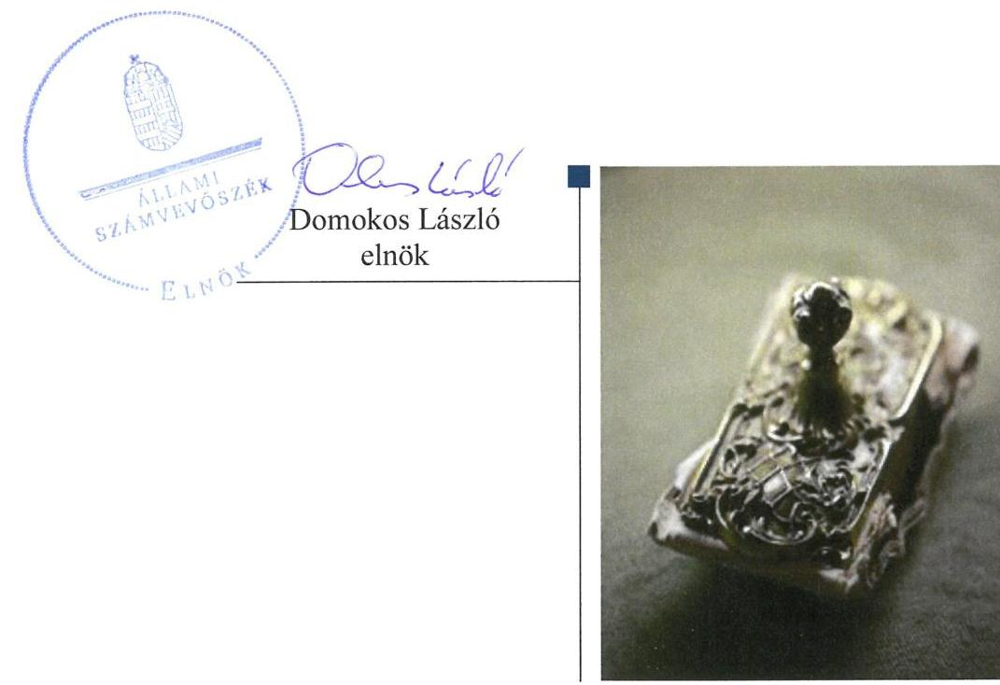
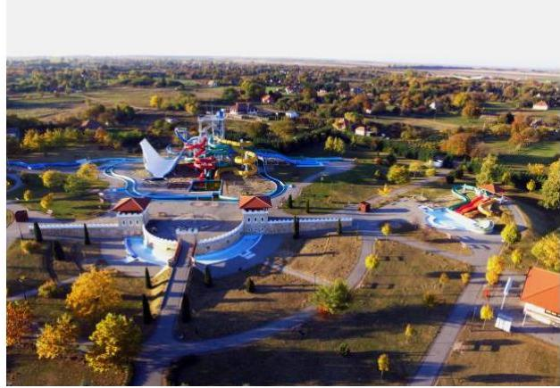
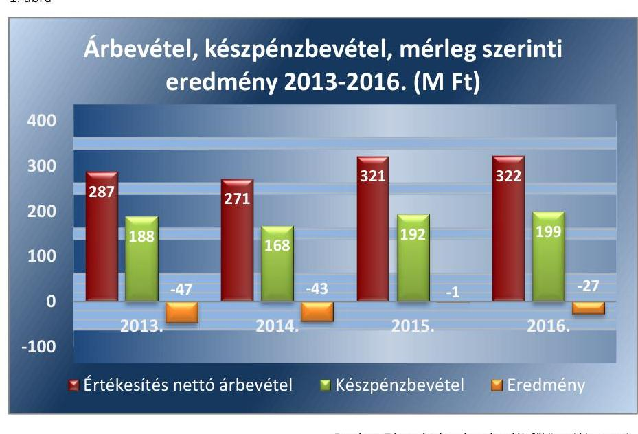
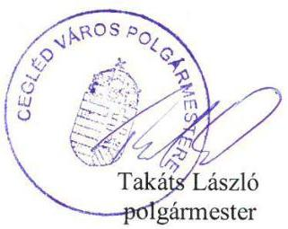
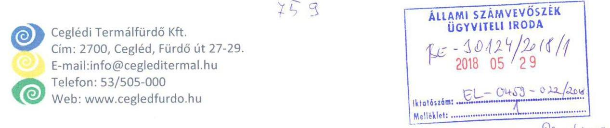
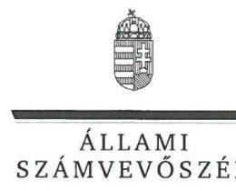
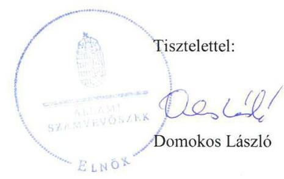
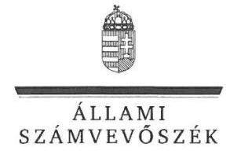

# Jelentés 

## Az önkormányzatok gazdasági társaságai

Az önkormányzatok többségi tulajdonában lévő gazdasági társaságok gazdálkodásának ellenőrzése - Ceglédi Termálfürdő Üzemeltető Kft.
2018.

---

# Jelenetés 

## Az önkormányzatok gazdasági társaságai

Az önkormányzatok többségi tulajdonában lévő gazdasági társaságok gazdálkodásának ellenőrzése - Ceglédi Termálfürdő Üzemeltető Kft.
2018. 07. hó 12. nap

---

# AZ ELLENŐRZÉST FELÜGYELTE:

DR. NAGY IMRE felügyeleti vezető

# AZ ELLENŐRZÉST VEZETTE ÉS A VÉGREHAJTÁSÁÉRT FELELŐS:

KORSÓSNÉ VIGH ANDREA ellenőrzésvezető

# A PROGRAM ÖSSZEÁLLÍTÁSÁÉRT FELELŐS:

TÓTPÁL SZABOLCS osztályvezető

---

**IKTATÓSZÁM:** EL-0232-037/2018

**TÉMASZÁM:** 2447

**ELLENŐRZÉS-AZONOSÍTÓ SZÁM:** V079390

---

Jelentéseink az Országgyűlés számítógépes hálózatán és az Interneta a www.asz.hu címen is olvashatóak.

---

# TARTALOMJEGYZÉK 

■ ÖSSZEGZÉS ..... 5
■ AZ ELLENŐRZÉS CÉLJA ..... 6
■ AZ ELLENŐRZÉS TERÜLETE ..... 7
■ AZ ELLENŐRZÉS HÁTTERE, INDOKOLTSÁGA ..... 8
■ A JELENTÉS LÉNYEGES KÉRDÉSKÖREI ..... 9
■ AZ ELLENŐRZÉS HATÓKÖRE ÉS MÓDSZEREI ..... 10
■ MEGÁLLAPÍTÁSOK ..... 12
■ JAVASLATOK ..... 16
■ MELLÉKLETEK ..... 19
I. sz. melléklet: Értelmező szótár ..... 19
■ FÜGGELÉK: ÉSZREVÉTELEK ..... 21
■ RÖVIDÍTÉSEK JEGYZÉKE ..... 31

---

.

---

# ÖSSZEGZÉS 

A Ceglédi Termálfürdő Üzemeltető Kft. gazdálkodása és vagyongazdálkodása nem volt a jogszabályi előírásoknak megfelelően szabályozott és nem volt szabályszerű, az elszámoltathatóság nem volt biztositott. A Társaság folyamatos vesztesége miatt a tulajdonos Cegléd Város Önkormányzatát tőkepótlási kötelezettség terhelte, továbbá a Társaság fizetőképessége önkormányzati támogatás hatására javult. A köztulajdonban álló gazdasági társaságokra előirt átláthatósági követelmények nem érvényesültek.

## Az ellenőrzés társadalmi indokoltsága

Magyarországon az önkormányzatok kötelező és önként vállalt feladataik vonatkozásában is egyre szélesebb körben alkalmazzák a költségvetésen kívüli feladatellátást, ezáltal - a nonprofit szervezetek mellett - az önkormányzati tulajdonú gazdasági társaságok is kiemelt fontosságú szerephez jutottak.

A Ceglédi Termálfürdő Üzemeltető Kft. fő tevékenységeként fürdő- és strandszolgáltatást végzett, az általa ellátott szolgáltatások a tulajdonos Cegléd Város Önkormányzata önként vállalt feladatai körébe tartoztak. Az Állami Számvevőszék az ellenőrzése során arra kereste a választ, hogy szabályszerű volt-e a Társaság gazdálkodása és az ehhez kapcsolódó tulajdonosi joggyakorlás.

## Főbb megállapítások, következtetések, javaslatok

Cegléd Város Önkormányzata a Ceglédi Termálfürdő Üzemeltető Kft. tekintetében a jogszabályi előírások szerint kialakította a tulajdonosi joggyakorlás kereteit és szabályszerűen gyakorolta a tulajdonosi jogokat.

A Ceglédi Termálfürdő Üzemeltető Kft. nem a jogszabályi előírásoknak megfelelően alakította ki a gazdálkodás és vagyongazdálkodás szabályait. Nem szabályozta a pénzkezelés rendjét, ennek hiányában a pénzforgalma meghatározó részét kitevő készpénzes, bankkártyás és utalványos pénzforgalomban az elszámoltathatóság nem volt biztosított. A pénzkezelés szabályozásának hiánya magas kockázatot jelent a készpénzben befolyó bevételekkel kapcsolatos visszaélések tekintetében. E kockázat bekövetkezésével összefüggő további társadalmi veszélyt jelent, amennyiben a visszaélésből fakadó veszteséget közpénzből finanszírozzák. A számlarend - hiányosságai miatt - nem biztosította a törvényi előírásoknak megfelelő beszámoló készítést. A számviteli politika, az eszközök és források értékelési, valamint a leltározás szabályozása megfelelő volt. A Ceglédi Termálfürdő Üzemeltető Kft. gazdálkodása és vagyongazdálkodása nem volt szabályszerű, mert a bevételek, a ráfordítások, az értékcsökkenés elszámolása, a vagyonnyilvántartás nem felelt meg a jogszabályi követelményeknek, továbbá a mérleg nem volt leltárral alátámasztva.

Cegléd Város Önkormányzata az éves költségvetéseiben jóváhagyott pótbefizetésekkel biztosította a Társaság törvényben előírt tőkemegfelelését. A Ceglédi Termálfürdő Üzemeltető Kft. fizetőképessége a 2015-2016. években az Önkormányzat támogatásával javult.

A köztulajdonban lévő gazdálkodó szervezetekre előírt közzétételi kötelezettségeket nem teljesítették. A beszámolókat az előírások szerint közzétették.

A megállapított szabálytalanságokkal összefüggésben az ÁSZ a Ceglédi Termálfürdő Üzemeltető Kft. Ügyvezetőjének 13, Cegléd Város Önkormányzata Polgármesterének egy javaslatot fogalmazott meg. A javaslatok a pénzkezelési szabályzat elkészítésére; a számlarend kiegészítésére, a bevételek, ráfordítások, valamint a készpénzforgalmat érintő gazdasági események elszámolása során a jogszabályi előírások betartására; az üzembe helyezés hitelt érdemlő dokumentálására; a számviteli elszámolások szabályszerű bizonylattal történő alátámasztására; a vagyonnyilvántartás során az egyedi értékelés elvének alkalmazására; az SZMSZ-ben előírt döntési jogosultságok betartására; a beszámoló mérlegadatai leltárral való alátámasztására; a közzétételi kötelezettségek teljesítésére; a feltárt szabálytalanságokkal összefüggésben a felelősség tisztázására és kivizsgálására irányultak.

---

# AZ ELLENŐRZÉS CÉLJA 

AZ ELLENŐRZÉS CÉLJA annak értékelése volt, hogy az önkormányzat vagyongazdálkodási tevékenysége során szabályszerűen gyakorolta-e tulajdonosi jogait; a gazdasági társaság szabályozottsága, gazdálkodása és vagyongazdálkodási tevékenysége, bevételeinek és ráfordításainak elszámolása megfelelt-e a jogszabályi és tulajdonosi előírásoknak; a gazdasági társaság kötelezettségállománya jelentett-e kockázatot a múködésre, valamint a gazdálkodás átláthatósága és elszámoltathatósága érdekében biztosított volt-e a szolgáltatás dijának megalapozottsága szabályszerű önköltségszámítással.

---

# AZ ELLENŐRZÉS TERÜLETE 

## Ceglédi Termálfürdő Üzemeltető Kft. és a tulajdonosi jogokat gyakorló Cegléd Város Önkormányzata

1. táblázat

AZ ÖNKORMÁNYZAT ÁLTAL TELJESÍTETT PÓTBEFIZETÉS ÖSSZEGE

| Gyök | M Ft |
| :--: | :--: |
| 2013. | 69 |
| 2014. | 59 |
| 2015. | 48 |
| 2016. | 30 |

Forrás: önkormányzati tanúsítvány

A Ceglédi Termálfürdő Üzemeltető Kft.-t 2002. október 10-én alapította Cegléd Város Önkormányzata. Az alapítás óta a Társaság ${ }^{1}$ kizárólagos tulajdonosa az Önkormányzat ${ }^{2}$ volt. A Társaság törzstőkéje 2013. január 1-én 78,6 M Ft volt, amely az ellenőrzött időszakban nem változott.

A Társaság fő tevékenysége fizikai közérzetjavító szolgáltatás keretében fürdő- és strandszolgáltatás volt. Egyéb tevékenységként kemping és egyéb szálláshely szolgáltatást, egyéb humán-egészségügyi ellátást és szakorvosi járóbeteg-ellátást is végeztek. A Társaság által végzett tevékenység az Önkormányzat önként vállalt feladata volt.

A Társaság a feladatát saját tulajdonú, valamint Üzemeltetési szerződés ${ }^{3}$ és Bérleti szerződés ${ }^{4}$ alapján üzemeltetésre átvett önkormányzati tulajdonú eszközökkel látta el.

A Társaság mérleg szerinti vagyona a 2013. év végi közel 100 M Ft-ról a 2016. év végére közel 140 M Ft-ra növekedett. A Társaság mérleg szerinti/adózott eredménye a 2013. évben 47 M Ft, a 2014. évben 43 M Ft, a 2015. évben 1 M Ft és a 2016. évben 27 M Ft veszteség volt. A Társaság müködéséhez a Képviselő-testület ${ }^{5}$ által jóváhagyott pótbefizetés összegét a 2013-2016. évek vonatkozásában a 1. táblázat mutatja be. Ezen kívül az Önkormányzat a 2014. évben 6 M Ft fejlesztési célú, 2015. évben 17 M Ft működési célú, a 2016. évben 12 M Ft fejlesztési célú támogatást nyújtott a Társaságnak.

A tulajdonosi joggyakorló Önkormányzat polgármestere ${ }^{6}$ a 2014. évi önkormányzati választások óta tölti be tisztségét. A jegyző ${ }^{7}$ és a társaság ügyvezetőjének ${ }^{8}$ személye az ellenőrzött időszakban nem változott.

A foglalkoztatottak átlagos statisztikai létszáma a 2013. évi 38 főről 32 főre csökkent a 2016. évben.

---

# AZ ELLENŐRZÉS HÁTTERE, INDOKOLTSÁGA 

Az önkormányzatok többségi tulajdonában álló gazdasági társaságok ellenőrzése kiemelten fontos a vagyon megőrzése, megóvása érdekében. A feladatellátás költségeinek, ráfordításainak alakulása a lakosság széles rétegeit érinti.

Ellenőrzéseink feltárhatják, hogy az önkormányzat a feladatellátáshoz rendelt vagyon működtetését a tulajdonostól elvárható gondossággal vé-gezte-e, a feladatot ellátó gazdasági társaság a létesítő okiratban, szolgáltatási szerződésben foglaltak betartásával biztosította-e a feladatok ellátását. Az ellenőrzés rávilágíthat arra, hogy a gazdasági társaság a vagyon használatával biztosította-e a szolgáltatás folytatásának feltételeit, az önkormányzat tulajdonosi felügyelete hozzájárult-e a szabályszerű gazdálkodáshoz és feladatellátáshoz. A megállapítások alapján megfogalmazott számvevőszéki javaslatok hasznosulása elősegítheti a meglévő hibák megszüntetését. A jó gyakorlatok bemutatásával az ÁSZ ${ }^{\circledR}$ hozzájárulhat a követendő megoldások megismertetéséhez, terjesztéséhez.

---

# A JELENTÉS LÉNYEGES KÉRDÉSKÖREI 

1. Az önkormányzat tulajdonosi joggyakorlása szabályszerű volt-e?
2. A társaság gazdálkodása és vagyongazdálkodása szabályszerű volt-e?

---

# AZ ELLENŐRZÉS HATÓKÖRE ÉS MÓDSZEREI 

## Az ellenőrzés típusa

Megfelelőségi ellenőrzés

## Az ellenőrzött időszak

Az ellenőrzött időszak 2013. január 1-jétől 2016. december 31-ig tart.

## Az ellenőrzés tárgya

Cegléd Város Önkormányzata tulajdonosi joggyakorlása, valamint a Ceglédi Termálfürdő Üzemeltető Kft. gazdálkodásának szabályozottsága és szabályszerűsége.

Az ellenőrzés kiterjedt minden olyan körülményre és adatra, amely az ÁSZ jogszabályban meghatározott feladatainak teljesítéséhez, valamint a program végrehajtása folyamán felmerül újabb összefüggések feltárásához szükséges.

## Az ellenőrzött szervezet

Ceglédi Termálfürdő Üzemeltető Kft., Cegléd Város Önkormányzata

## Az ellenőrzés jogalapja

Az ellenőrzés jogszabályi alapját az ÁSZ tv. ${ }^{10} 1 . \S$ (3) bekezdése és 5. § (3)(4)-(5) bekezdései képezték.

## Az ellenőrzés módszerei

Az ellenőrzést az ellenőrzési program ellenőrzési kérdései, az ellenőrzött időszakban hatályos szabályok, az ellenőrzés szakmai szabályok és módszertanok figyelembe vételével végeztük el.

Az ellenőrzött szervezetek az ellenőrzés lefolytatásához tanúsítványok kitöltésével, valamint az ÁSZ által kért dokumentumok megküldésével szolgáltattak adatokat.

A bevételek és ráfordítások elszámolását, továbbá a vagyonnyilvántartás területén a szabályszerű múködést véletlenszerű mintavétellel ellenőriztük. A mintavétellel ellenőrzött területek esetében minden egyes tétel

---

vonatkozásában szabályszerűségre vonatkozó kérdéseket tettünk fel, amelyek eredménye összesítésre került. A jogszabályoknak és a belső előírásoknak megfelelőnek tekintettük az adott területet, amennyiben a minta ellenőrzésének eredménye alapján 95\%-os bizonyossággal a teljes sokaságban a hibaarány kisebb volt, mint 10\%, nem megfelelőnek értékeltük, ha a hibaarány a 10\%-ot meghaladta. A ráfordítások elszámolására és a vagyonnyilvántartásra vonatkozó véletlen mintavételt kockázati alapú kiválasztással egészítettük ki, amelynek során évente a három legnagyobb öszszegű tételt választottuk ki.

---

# 1. Az önkormányzat tulajdonosi joggyakorlása szabályszerű volt-e? 

Összegző megállapítás

Az Önkormányzat a jogszabályi előírásoknak megfelelően alakította ki a tulajdonosi joggyakorlás kereteit és szabályszerűen gyakorolta a tulajdonosi jogokat.

AZ EGYSZEMÉLYES TÁRSASÁGNÁL a Gt. ${ }^{11}$ és a Ptk. ${ }^{12}$ előírásai szerint a legfőbb szerv hatáskörébe tartozó kérdésekben az alapító Önkormányzat döntött.

A TULAJDONOSI JOGGYAKORLÁS szabályait az Önkormányzat az SZMSZ ${ }_{1-2}{ }^{13}$-ben, a Vagyongazdálkodási rendelet ${ }_{1-2}{ }^{14}$-ben és az Alapító okirat ${ }_{1-5}{ }^{15}$-ben a jogszabályoknak megfelelően rögzítette. A feladatellátásra vonatkozó követelményeket az Üzemeltetési és Bérleti szerződésekben rögzítették. A Társaság legfőbb szerve a Taktv. ${ }^{16}$ előírásának megfelelően megalkotta a Javadalmazási szabályzat ${ }_{1-2}{ }^{17}$-t.

Az $\mathrm{FB}^{18}$ tagjait és a könyvvizsgálót a jogszabályi előírásokkal összhangban az Alapító ${ }^{19}$ jelölte ki. A számviteli beszámolókat - az FB előzetes írásbeli véleményezését követően - az Alapító szabályszerűen a független könyvvizsgálói jelentések birtokában fogadta el.

A Társaság tevékenységének nyomon követését az Alapító által előírt negyedéves adatszolgáltatási kötelezettség biztosította. Az Önkormányzat belső ellenőrzése az Áht. ${ }^{20}$-ban foglalt lehetőség alapján a 2014. évben ellenőrizte a Társaság 2013. évi gazdálkodását. Az ellenőrzés keretében megfogalmazott, a szabályszerűség javítását célzó javaslatokra intézkedési terv készítési kötelezettséget írtak elő, amelynek az ügyvezető határidőben eleget tett.

Az Alapítónak a 2013-2014. években a Társaság tekintetében a Gt. 143. § (3) bekezdés, illetve a Ptk. 3:189. § (2) bekezdés szerinti intézkedési kötelezettsége keletkezett - mivel a Társaság saját tőkéje veszteség folytán a törzstőke felére csökkent -, amelynek eleget tett. A 2013-2014. évi költségvetési rendeletekben jóváhagyott pótbefizetés - a Társaság évközi mérlegbeszámolói alapján - biztosította a jogszabályban előírt saját tőke/jegyzett tőke arányt.

---

# 2. A társaság gazdálkodása és vagyongazdálkodása szabályszerű volt-e? 

Összegző megállapítás

2.1. számú megállapítás

A Társaság gazdálkodása és vagyongazdálkodása nem volt a jogszabályi követelményeknek megfelelően szabályozott. A bevételek és ráfordítások elszámolása, továbbá a vagyongazdálkodás nem volt szabályszerű.

A Társaság gazdálkodása és vagyongazdálkodása nem volt a jogszabályi előírásoknak megfelelően szabályozott.

Pénzkezelési szabályzattal a Társaság az ellenőrzött időszakban nem rendelkezett a Számv. tv. ${ }^{21} 14 . \S$ (5) bekezdés d) pont előírása ellenére. Pénzkezelési szabályzat hiányában a társaság pénzforgalmának az ellenőrzött időszakban háromnegyedét kitevő készpénzes, bank- és egyéb kártyás, utalványos pénzforgalma tekintetében az elszámoltathatóság nem volt biztosított.

Az értékesítés nettó árbevétel, készpénzbevétel, valamint a mérleg szerinti eredmény 2013-2016. évi alakulását az 1. ábra szemlélteti.

A pénzkezelés, ezen belül a készpénzkezelés szabályozásának (többek között: a napi készpénz záró állomány, a pénzszállítás feltételei, az ellenőrzés gyakorisága és eljárásrendje, a nyilvántartás szabályai, bizonylatolása meghatározásának) hiánya magas kockázatot jelent a készpénzben befolyó - az árbevétel 60-65\%-át kitevő - bevételekkel kapcsolatos visszaélések tekintetében. E kockázat bekövetkezésével összefüggő további társadalmi veszélyt jelent, amennyiben a visszaélésből fakadó veszteséget közpénzből finanszírozzák.

A SZÁMLAREND ${ }_{1-3}{ }^{22}$ a Számv. tv. 161. § (2) bekezdés b) pontjában foglaltak ellenére nem tartalmazta minden alkalmazott számla vonatkozásában a számla értéke növekedésének, csökkenésének jogcímeit, a számlát

---

érintő gazdasági eseményeket, azok más számlákkal való kapcsolatát. A bizonylati rend ${ }_{1-3}{ }^{23}$-et nem a számlarend részeként készítették el és annak tartalma nem támasztotta alá a számlarendben foglaltakat, ezért nem felelt meg a Számv. tv. 161. § (2) bekezdés d) pontjában foglalt előírásnak. E hiányosságok miatt a Társaság számlarend ${ }_{1-3}$ szerinti könyvvezetése a Számv. tv. 161. § (1) bekezdés előírása ellenére nem biztosította a Számv. tv. előírásainak megfelelő beszámoló-készítést.

A Társaság elkészítette a számviteli politikát ${ }_{1-3}{ }^{24}$ és annak részeként a leltározási, valamint az eszközök és források értékelési szabályzatát ${ }^{25}$ a Számv. tv. előírásaival összhangban.
2.2. számú megállapítás

A Társaság nem szabályszerűen számolta el a bevételeit és a ráfordításait, ezáltal a gazdálkodása nem volt szabályszerű. A vagyongazdálkodás nem felelt meg a jogszabályi követelményeknek a vagyonnyilvántartásnál feltárt hibák és a mérleg leltári alátámasztásának hiánya miatt.

A BEVÉTELEK elszámolása nem volt szabályszerű, mivel a Számv tv. 165. § (1)-(2) bekezdésében foglaltak ellenére a bevételek elszámolását alátámasztó bizonylatok nem álltak rendelkezésre. A Társaság a Számv. tv. 165. § (3) bekezdés a) pontjában foglaltak ellenére a készpénzforgalmat érintő gazdasági eseményeket nem rögzítette a pénzmozgással egyidejűleg a könyvekben.

AZ ANYAG JELLEGŰ RÁFORDÍTÁSOK elszámolása nem volt szabályszerű. A bizonylatok nem feleltek meg a Számv. tv. 167. § (1) bekezdés c) és h) pontjában foglalt előírásoknak, mivel nem tartalmazták az utalványozó és a rendelkezés végrehajtását igazoló személy aláírását, valamint az érintett könyvviteli számlákra történő hivatkozást. A Társaság az SZMSZ-e ${ }^{26}$ 2.2.3. pontja szerinti írásbeli tulajdonosi jóváhagyással nem rendelkezett a 10 M Ft feletti beszerzések során.

A SZEMÉLYI JELLEGŰ RÁFORDÍTÁSOK elszámolása nem volt szabályszerű. A számfejtett kifizetéseket alátámasztó bizonylatok (jelenléti ív, munkába járással kapcsolatos költségtérítés elszámolása) nem feleltek meg a Számv. tv. 167. § (1) bekezdés c) pontjában foglalt előírásnak, mivel nem tartalmazták az utalványozó és a rendelkezés végrehajtását igazoló személy aláírását. A béren kívüli juttatások és a kiküldetések elszámolása a Számv. tv. 165. § (1)-(2) bekezdéseiben foglaltak ellenére bizonylatokkal nem volt alátámasztva.

AZ ÉRTÉKCSÖKKENÉS elszámolása nem volt szabályszerű. Az állományba vett eszközöknél az üzembe helyezés a Számv. tv. 52. § (2) bekezdés előírása ellenére nem volt hitelt érdemlően dokumentált, így nem volt megállapítható az értékcsökkenés elszámolásának kezdő időpontja.

## A TÁRSASÁG SAJÁT VAGYONÁNAK NYILVÁNTARTÁSA nem volt szabályszerű, mert a tárgyi eszközöket a Számv. tv. 16. §

(1) bekezdésében foglalt egyedi értékelés elvével ellentétesen nem egyedileg értékelték.

---

# Megállapítások 

Az egyszerűsített éves beszámolók mérlegadatait alátámasztó leltárt a Társaság nem készített, a Számv. tv. 69. § (1) bekezdésében és a leltározási szabályzat ${ }_{1-3}{ }^{27}$-ban - a leltár tartalmi követelményei rész 1. bekezdésében foglalt előírásoknak ellenére. A tárgyi eszközök és a készletek mennyiségi felvétellel történő leltározását a Társaság a jogszabályi előírások szerint elvégezte, azonban a követelések, pénzeszközök, a saját tőke elemei, a kötelezettségek, valamint az aktív és passzív időbeli elhatárolások 2013-2016. évi mérlegösszegeit nem leltározta. A Társaság nem biztosította a könyvvezetés és a beszámolás során a Számv. tv. 15. § (3) bekezdésében előírt valódiság elvének az érvényesülését.

A FIZETŐKÉPESSÉG biztosítása, a lejárt határidejű tartozások rendezése érdekében a Társaság a 2013. évben több közszolgáltatóval részletfizetési megállapodást kötött. A 2013-2014. évi szállítói tartozások meghatározó része az Önkormányzattal szembeni bérleti díjtartozás volt, amely rendezéséhez a 2015. évben az Önkormányzat támogatást biztosított.
2.3. számú megállapítás

A Társaság adatszolgáltatási kötelezettségét teljesítette. A köztulajdonban álló gazdasági társaságokra előírt közzétételi kötelezettségének nem tett eleget.

AZ EGYSZERŰSÍTETT ÉVES BESZÁMOLÓKAT a Társaság a Számv. tv. által előírt formában és határidőben elkészítette, az alapítói jóváhagyást követően a jogszabályi előírásoknak megfelelően letétbe helyezte és közzétette.

A könyvvizsgáló annak ellenére korlátozás nélküli hitelesítő záradékkal látta el az egyszerűsített 2013-2016. évi beszámolókat, hogy a Társaság a beszámolók mérlegadatait alátámasztó leltárt a Számv. tv. 69. § (1) bekezdés előírása ellenére nem készített.

A Társaság eleget tett az Alapító által előírt évközi beszámolási és negyedéves adatszolgáltatási kötelezettségeinek.

A Társaság a Taktv. 2. § (1)-(3) bekezdéseiben foglaltak ellenére a vezető tisztségviselőivel, az FB tagjaival és a gazdálkodásával összefüggő adatokat honlapján nem tette közzé.

---

# JAVASLATOK 

Az ÁSZ tv. 33. § (1) bekezdésében foglaltak értelmében az ellenőrzött szervezet vezetője köteles a jelentésben foglalt megállapításokhoz kapcsolódó intézkedési tervet összeállítani és azt a jelentés kézhezvételétől számított 30 napon belül az ÁSZ részére megküldeni. Amennyiben az ellenőrzött szervezet vezetője nem küldi meg határidőben az intézkedési tervet, vagy továbbra sem elfogadható intézkedési tervet küld, az Állami Számvevőszék elnöke az ÁSZ tv. 33. § (3) bekezdése a) és b) pontjaiban foglaltakat érvényesítheti.

## Ceglédi Termálfürdő Üzemeltető Kft. Ügyvezetőjének

1. Intézkedjen a jogszabályban foglaltaknak megfelelően a pénzkezelési szabályzat elkészitéséről.
(2.1. számú megállapítás 1. bekezdése alapján)
2. Intézkedjen a számlarend jogszabályban foglaltaknak megfelelő kiegészitéséről.
(2.1. számú megállapítás 4. bekezdése alapján)
3. Intézkedjen, hogy a bevételek elszámolása a jogszabályban foglaltaknak megfelelően történjen.
(2.2. számú megállapítás 1. bekezdés 1. mondata alapján)
4. Biztosítsa, hogy a készpénzforgalmat érintő gazdasági események bizonylatai a jogszabályban elöirt határidőn belül a könyvekben rögzitésre kerüljenek.
(2.2. számú megállapítás 1. bekezdés 2. mondata alapján)
5. Biztosítsa az anyagjellegü ráfordítások elszámolása során a jogszabályi elöírások érvényesülését.
(2.2. számú megállapítás 2. bekezdés 2. mondata alapján)
6. Gondoskodjon a tulajdonos írásbeli jóváhagyásához kötött szerződések esetében a Társaság SZMSZ-ében elöirtak betartásáról.
(2.2. számú megállapítás 2. bekezdés 3. mondata alapján)

---

7. Biztosítsa a személyi jellegü ráfordítások elszámolása során a jogszabályi előírások betartását.
(2.2. számú megállapítás 3. bekezdés 2.-3. mondata alapján)
8. Biztosítsa az állományba vett eszközök üzembe helyezésének hitelt érdemlő dokumentálását.
(2.2. számú megállapítás 4. bekezdés 2. mondata alapján)
9. Biztosítsa vagyonnyilvántartásában a jogszabályokban elöírt egyedi értékelés elvének alkalmazását.
(2.2. számú megállapítás 5. bekezdés alapján)
10. Gondoskodjon jogszabályokban és a leltározási szabályzatban foglalt előírások szerint az egyszerüsített éves beszámoló mérleg tételeinek leltárral való alátámasztásáról.
(2.2. számú megállapítás 6. bekezdés alapján)
11. Gondoskodjon a Taktv. előírásai alapján a közzétételi kötelezettség teljesítéséről.
(2.3. számú megállapítás 4. bekezdés alapján)
12. Intézkedjen a Társaságnál feltárt szabálytalanságok tekintetében a felelősség tisztázásáról, és szükség szerint a felelősség érvényesítéséről.
(2.2. számú megállapítás 5-6. bekezdései alapján)

# Cegléd Város Önkormányzata Polgármesterének 

1. Kezdeményezze a Társaságnál feltárt szabálytalanságok tekintetében a felelősség tisztázását, és szükség szerint intézkedjen a felelősség érvényesítéséről.
(2.1. számú megállapítás 1. és 4. bekezdései, a 2.2. számú megállapítás 1-6. bekezdései, a 2.3. számú megállapítás 4. bekezdése alapján)

---

.

---

# MELLÉKLETEK 

- I. SZ. MELLÉKLET: ÉRTELMEZŐ SZÓTÁR
belső ellenőrzés
gazdasági társaság
tulajdonosi joggyakorló

Független, tárgyilagos bizonyosságot adó és tanácsadó tevékenység, amelynek célja, hogy az ellenőrzött szervezet működését fejlessze és eredményességét növelje, az ellenőrzött szervezet céljai elérése érdekében rendszerszemléletű megközelítéssel és módszeresen értékeli, illetve fejleszti az ellenőrzött szervezet irányítási és belső kontrollrendszerének hatékonyságát. (Bkr. 2. § b) pont) Ptk. 3:88. § (1) bekezdése szerint „a gazdasági társaságok üzletszerű közös gazdasági tevékenység folytatására, a tagok vagyoni hozzájárulásával létrehozott, jogi személyiséggel rendelkező vállalkozások, amelyekben a tagok a nyereségből közösen részesednek, és a veszteséget közösen viselik".
Aki a nemzeti vagyon felet az államot vagy a helyi önkormányzatot megillető tulajdonosi jogok és kötelezettségek összességének gyakorlására jogosult. (Nvtv. 3. § (1) bekezdés 17. pont)

---

.

---

# FÜGGELÉK: ÉSZREVÉTELEK 

A jelentéstervezetet a Számvevőszék 15 napos észrevételezésre megküldte az ellenőrzött szervezetek vezetőinek az ÁSZ tv. 29. §* (1) bekezdése előírásának megfelelően.

Az ÁSZ a jelentéstervezetet észrevételezésre megküldte Cegléd Város Önkormányzata polgármesterének és a Ceglédi Termálfürdő Üzemeltető Kft. ügyvezetőjének.
Cegléd Város Önkormányzata polgármestere a jelentéstervezetre nemleges észrevételt tett. A függelék tartalmazza a Ceglédi Termálfürdő Üzemeltető Kft. ügyvezetőjének észrevételét, illetve az el nem fogadott észrevételek elutasításának indoklását.

[^0]
[^0]:    * 29. § (1) Az Állami Számvevőszék az ellenőrzési megállapításait megküldi az ellenőrzött szervezet vezetőjének vagy az általa megbízott személynek, és annak, akinek személyes felelősségét állapította meg.
    (2) Az ellenőrzött szervezet vezetője és a felelősként megjelölt személy az ellenőrzés megállapításaira tizenöt napon belül írásban észrevételt tehet.
    (3) Az Állami Számvevőszék az észrevételre a beérkezésétől számított harminc napon belül írásban válaszol. A figyelembe nem vett észrevételeket köteles a jelentésben feltüntetni, és megindokolni, hogy azokat miért nem fogadta el.

---

# Cegléd Város Polgármesterétől 2700 Cegléd, Kossuth tér 1.   Levélem: 2701 Cegléd, Pf.: 85.   Tel.: 06/53/511-400 

Úgyiratszám: C/6976-4/2018.
Úgyintéző: Mótyánné dr. Szentpéteri Katalin

Tárgy: Ceglédi Termálfürdő Üzemeltető Kft. jelentéstervezete
Hiv.szám: EL-0459-019/2018.

## Domokos László Elnök Úr részére

Állami Számvevőszék
1364 Budapest 4. Pf. 54.

ÁLLAMI SZÁMVEVÖSZÉK
$3 E-23434 / 2018 / 1$
Ekszelt: 2018 MAJ 28.
Iktarászám: EL-0459-024/2014
Meléklet: $\qquad$

## Tisztelt Elnök Úr!

Köszönettel vettem „Az önkormányzatok gazdasági társaságai - Az önkormányzatok többségi tulajdonában lévő gazdasági társaságok gazdálkodásának ellenőrzése - Ceglédi Termálfürdő Üzemeltető Kft. " címmel készült számvevőszékű jelentéstervezetük előzetes megküldését.

A jelentéstervezetben foglaltakkal összefüggésben észrevételt nem teszek.
Ezúton megköszönöm az Állami Számvevőszék munkatársainak munkáját és szakmai iránymutatásait.

Tisztelettel
Cegléd, 2018. május 22.

---

Tárgy: Észrevételek Számvevőszéki Jelentéstervezethez

Szűcs Ádám, a Ceglédi Termálfürdő Kft. ügyvezetője a következő észrevételeket teszem az Állami Számvevőszék 2018. május 7-én kelt, EL-0459-020/2018. számú jelentéstervezethez:

Nem értünk egyet a feltárt hiányosságok általánosításával, annak összegzésben tett megállapításaival.

# Részletezve: 

2. sz. megállapítás: A Társaság gazdálkodása és vagyongazdálkodása és vagyongazdálkodása nem volt a jogszabályi követelményeknek megfelelően szabályozott. A bevételek és ráfordítások elszámolása, továbbá a vagyongazdálkodás nem volt szabályszerű.

## 2.1. sz. megállapítás:

A társaság gazdálkodása és vagyongazdálkodása nem volt a jogszabályi előírásoknak megfelelően szabályozott.

## Észrevétel:

A Társaságunk már a 2013-2016. időszakban is rendelkezett pénzkezelési szabályzattal, mely a 2017. november 22-i adatszolgáltatással megküldésre került Önöknek. (Teljességi és hitelességi nyilatkozat 7. oldal 18-21. pontjai tartalmazzák) A társaság pénzgazdálkodása a szabályzatnak megfelelően történt.

A Társaságunk számlarendje a rendelkező jogszabályoknak megfelelően lett elkészítve, melyben minden egyes gazdasági esemény felsorolása lehetetlen lenne, de az irányadó keretelveket rögzíti, ami alapján eldönthető, hogy mit, hogyan kerül könyvelésre.
2.2. sz. megállapítás: A társaság nem szabályszerűen számolta el a bevételeit és a ráfordításait, ezáltal a gazdálkodása nem volt szabályszerű. A vagyongazdálkodás nem felet meg a jogszabályi követelmények a vagyonnyilvántartásnál feltárt hibák és a mérleg leltári alátámasztásának hiánya miatt.

---

Ceglédi Termálfürdő Kft.
Cím: 2700, Cegléd, Fürdő út 27-29.
E-mail:info@cegleditermal.hu
Telefon: 53/505-000
Web: www.cegledfurdo.hu

# Észrevétel: 

Társaságunknál a készpénzmozgással egy időben készül a gazdasági esemény rögzítése, már nap végi pénztárzáráskor a pénztáros gondoskodik róla. Az erről készült bizonylatokat a 2017. november 22-i adatszolgáltatással megküldtük Önöknek. (Teljességi és hitelességi nyilatkozat tartalmazza a tételeket)

Az anyagi jellegű ráfordítások bizonylatain minden esetben feltüntetésre kerül az érintett könyvviteli számlára hivatkozás, viszont azt a Társaság székhelyén történő másolás után a megbízott könyvelőirodában írják rá a számlákra. A mintavételezés során küldött tájékoztató szerint az adatgyűjtés a tervezéstől a jelentés kiadványozásáig tart, kérem biztosítsanak lehetőséget az eredeti számlák - feldolgozás utáni állapotának - bemutatására.

Társaságunk a tárgyi eszközök üzembe helyezés bizonylatai minden esetben a jogszabályi előírásoknak megfelelően, hitelt érdemlő módon készülnek el. A bekért üzembe helyezési okmányokat maradéktalanul megküldtük Önöknek a 2017. december 22-i adatszolgáltatás során. (Teljességi és hitelességi nyilatkozat tartalmazza a tételeket)

Társaságunknál minden egyes tárgyi eszköz egyedileg értékelt volt, értékük önálló tárgyi eszköz kartonon van vezetve. A bekért eszközök nyilvántartási kartonja a 2017. december 22-i adatszolgáltatással megküldtük Önöknek. (Teljességi és hitelességi nyilatkozat tartalmazza a tételeket)

Társaságunknál a mérlegadatokat alátámasztó leltárak minden évben a jogszabályi előírásoknak megfelelően elkészültek. A követeléseket egyenlegközlőkkel alátámasztott vevő analitika, egyéb követelés analitika támasztja mindenkor alá, valamint a kötelezettségeket ugyanígy egyenlegközlőkkel alátámasztott szállító analitika, adófolyószámla, egyéb analitika támasztja alá. Ezen leltárak a 2017. november 22-i adatszolgáltatással megküldtünk Önöknek. (Teljességi és hitelességi nyilatkozat 5. oldal 26-29. pontjai tartalmazzák)
2.3. sz. megállapítás: A Társaság adatszolgáltatási kötelezettségét teljesítette. A köztulajdonban álló gazdasági társaságokra előírt kötelezettségeinek nem tett eleget.

## Észrevétel:

A Társaság és a Társaság könyvvizsgálója is rendelkezik az éves beszámolót alátámasztó leltárakkal, így a korlátozás nélküli záradék megadásakor ezen információk figyelembevételével tudta a záradékot megadni. A leltárakat a 2017. november 22-i adatszolgáltatással megküldtük Önöknek. (Teljességi és hitelességi nyilatkozat 5. oldal 26-29. pontjai tartalmazzák) Ezen pont miatt a Társaság

---

Ceglédi Termálfürdő Kft.
Cím: 2700, Cegléd, Fürdő út 27-29.
E-mail:info@cegleditermal.hu
Telefon: 53/505-000
Web: www.cegledfurdo.hu
megküldte a Számvevőszéki jelentéstervezetet észrevételezésre a könyvvizsgálatot végző cégnek, mely eredményét csatoltan megküldöm Önnek.

A Társaság a vezető tisztségviselőivel, FB tagjaival és a gazdálkodásával összefüggő adatokat a honlapján közzétette.

Az adatok az alábbi linken megtalálhatóak:
http://cegledfurdo.hu/kotelezo/

Kérem a fent kirészletezett, valamint csatolt észrevételek figyelembevételét a jelentéstervezet véglegesítése során.

Cegléd, 2018. május 24.

Ceglédi Termálfürdő Kft.
2700 Cegléd, Fürdő út 27-29.
Adószám: 12919400-2-13
Bank: 11784009-70903179
Szuć
Szűcs Ádám
Ceglédi Termálfürdő Kft.
ügyvezető

---

ELNÖK

# Szücs Ádám úr 

ügyvezető

Ceglédi Termálfürdő Üzemeltető Kft.

## Cegléd

## Tisztelt Ügyvezető Úr!

,,Az önkormányzatok gazdasági társaságai - Az önkormányzatok többségi tulajdonában lévő gazdasági társaságok gazdálkodásának ellenörzése - Ceglédi Termálfürdő Üzemeltető Kft." címmel készített számvevőszéki jelentéstervezetre tett észrevételeit köszönettel megkaptam.
Az Állami Számvevőszék észrevételekre vonatkozó álláspontjáról a felügyeleti vezető által készített részletes tájékoztatást csatoltan megküldöm.
Tájékoztatom Ügyvezető urat, hogy a számvevőszéki jelentésben - az Állami Számvevőszékről szóló 2011. évi LXVI. törvény 29. § (3) bekezdése alapján - a figyelembe nem vett észrevételeket szerepeltetjük annak megindoklásával, hogy azokat miért nem fogadtuk el.

Budapest, 2018. 06 . hó 15 . nap

Melléklet: Tájékoztatás az észrevételek kezeléséről

---

FELÜGYELETI VEZETŐ

Melléklet
Ikt.szám: EL-0459-024/2018.

# Tájékoztatás   az észrevételek kezeléséről 

„Az önkormányzatok gazdasági társaságai - Az önkormányzatok többségi tulajdonában lévő gazdasági társaságok gazdálkodásának ellenörzése - Ceglédi Termálfürdő Üzemeltető Kft." címü jelentéstervezetre 2018. május 24-én tett (az Állami Számvevőszékhez 2018. május 29-én érkezett) észrevételeit áttekintettük, azok kezelésével kapcsolatban a következő tájékoztatást adom.

1. A jelentéstervezet 2.1. számú megállapítására és a 2.1. számú megállapítás 1. és 4. bekezdéseire vonatkozó észrevétel:

Az észrevétel szerint a Társaság a 2013-2016. időszakban rendelkezett pénzkezelési szabályzattal, amelyet az Állami Számvevőszék rendelkezésére bocsátottak. A Társaság számlarendje a jogszabályoknak megfelelően lett elkészítve, melyben minden gazdasági esemény felsorolása lehetetlen, de az irányadó elveket rögzíti.
Az észrevétel nem megalapozott, azt nem fogadom el. Az ellenőrzés rendelkezésére bocsátott „PÉNZKEZELÉSI SZABÁLYZAT" című dokumentumokat a felelős vezető nem írta alá, nem látta el bélyegző lenyomattal, tehát a Társaság az ellenőrzött időszakban érvényes, a pénzkezelés rendjére vonatkozó szabályzattal nem rendelkezett.
A számvitelről szóló 2000. évi C. törvény (a továbbiakban: Sztv.) 161. § (2) bekezdése értelmében a számlarend tartalmazza minden alkalmazásra kijelölt számla számjelét és megnevezését, a számla tartalmát, ha az a számla megnevezéséből egyértelműen nem következik, továbbá a számla értéke növekedésének, csökkenésének jogcímeit, a számlát érintő gazdasági eseményeket, azok más számlákkal való kapcsolatát, a főkönyvi számla és az analitikus nyilvántartás kapcsolatát és a számlarendben foglaltakat alátámasztó bizonylati rendet. A Társaság számlarendje nem tartalmazta minden alkalmazott számla vonatkozásában a számla értéke növekedésének, csökkenésének jogcímeit, a számlát érintő gazdasági eseményeket, azok más számlákkal való kapcsolatát.
2. A jelentéstervezet 2.2. számú megállapítására és a 2.2.. számú megállapítás 1. bekezdés 2. mondatára, 2. bekezdés 1-2. mondatára, 4. bekezdés 2. mondatára, 5. bekezdésre, 6. bekezdésre vonatkozó észrevétel:

Az észrevételben leírtak szerint a Társaságnál a készpénzmozgással egy időben készül a gazdasági esemény rögzítése, már nap végi pénztárzáráskor a pénztáros gondoskodik róla. Az anyagi jellegű ráfordítások bizonylatain minden esetben feltüntetésre került az érintett könyvviteli számlára hivatkozás, de azt a Társaság székhelyén történő másolás után a megbízott könyvelőirodában írják rá a számlákra. Lehetőséget kérnek az eredeti számlák feldolgozás utáni állapotának bemutatására. A Társaságnál a tárgyi eszközök üzembe helyezés bizonylatai minden esetben a jogszabályi előírásoknak megfelelően, hitelt érdemlő módon készültek el, és a bekért üzembe helyezési okmányokat maradéktalanul megküldték az Állami Számvevőszéknek (a továbbiakban: ÁSZ). A Társaság minden egyes tárgyi eszközt egyedileg értékelt, értékük önálló tárgyi eszköz kartonon van vezetve. A bekért eszközök nyilvántartási kartonját megküldték az ÁSZ-nak.

---

Az észrevétel szerint a Társaság a mérlegadatokat alátámasztó leltárak minden évben a jogszabályi előírásoknak megfelelően elkészítette. A követeléseket egyenlegközlőkkel alátámasztott vevő analitika, egyéb követelés analitika támasztja alá, valamint a kötelezettségeket ugyanígy egyenlegközlőkkel alátámasztott szállító analitika, adófolyószámla, egyéb analitika támasztja alá. A könyvvizsgáló is rendelkezik az éves beszámolót alátámasztó leltárakkal.
Az észrevételek nem megalapozottak, azokat nem fogadom el.
A Sztv. 165. § (3) bekezdés a) pontja értelmében a bizonylatok feldolgozási rendjének kialakításakor figyelembe kell venni, hogy a pénzeszközöket érintő gazdasági műveletek, események bizonylatainak adatait késedelem nélkül, készpénzforgalom esetén a pénzmozgással egyidejűleg a könyvekben rögzíteni kell. Azonban az ellenőrzés rendelkezésére bocsátott dokumentum szerint a Társaság az árbevételét havonta egyszer, egy összesítő alapján könyvelte.

Az ÁSZ 2017. december 12-ai keltezésű, EL-0232-027/2017. iktatószámú adatbekérő levelében szerepelt, hogy az Állami Számvevőszékről szóló 2011. évi LXVI. törvény 28. § (1)-(2) bekezdésében foglaltak alapján a levél mellékletében szereplő dokumentumok, bizonylatok, valamint a teljességi és hitelességi nyilatkozat feltöltését a levél kézhezvételét követően soron kívül, de legkésőbb öt munkanapon belül kell teljesíteni. Ön a 2017. december 22-én kelt Teljességi és hitelességi nyilatkozatában nyilatkozott arról, hogy az adatbekérő levélben kért adatok kapcsán az ÁSZ részére átadott adatok, dokumentumok, a bekért adatokra, dokumentumokra vonatkozóan teljes körű információt tartalmaznak, az átadott dokumentumok, adatok hiánytalanok.

A tárgyi eszközök üzembe helyezése dokumentálása esetében az észrevételben jelzettekkel ellentétben nem kerültek maradéktalanul megküldésre az üzembehelyezési okmányok, emiatt az értékcsökkenési leírás elszámolásának kezdő időpontja nem volt megállapítható. A jogszabályoknak és a belső előírásoknak megfelelőnek tekintettük az adott területet, amennyiben a minta ellenőrzésének eredménye alapján $95 \%$-os bizonyossággal a teljes sokaságban a hibaarány kisebb volt, mint $10 \%$, nem megfelelőnek értékeltük, ha a hibaarány a $10 \%$-ot meghaladta.

A Sztv. 16. § (1) bekezdése értelmében az eszközöket és a kötelezettségeket a könyvvezetés és a beszámoló elkészítése során egyedileg kell rögzíteni és értékelni. Az észrevételben jelzettekkel ellentétben a Társaság nem minden egyes tárgyi eszközt értékelt egyedileg. A jogszabályoknak és a belső előírásoknak megfelelőnek tekintettük az adott területet, amennyiben a minta ellenőrzésének eredménye alapján $95 \%$-os bizonyossággal a teljes sokaságban a hibaarány kisebb volt, mint $10 \%$, nem megfelelőnek értékeltük, ha a hibaarány a $10 \%$-ot meghaladta.

A Sztv. 69. § (1) bekezdése értelmében a könyvek üzleti év végi zárásához, a beszámoló elkészítéséhez, a mérleg tételeinek alátámasztásához olyan leltárt kell összeállítani és megőrizni, amely tételesen, ellenőrizhető módon tartalmazza a vállalkozónak a mérleg fordulónapján meglévő eszközeit és forrásait mennyiségben és értékben. Az ellenőrzés rendelkezésére bocsátott dokumentumok alátámasztják, illetve az észrevétel sem cáfolja, hogy a Társaság a pénzeszközök, a saját tőke elemei, valamint az aktív és passzív időbeli elhatárolások 2013-2016. évi mérlegösszegeit nem leltározta. Így a leltárral alá nem támasztott eszközök és források tekintetében az analitikában, a fökönyvben és a mérlegben kimutatott eszköz, illetve forrás érték valódisága nem volt alátámasztott, bizonyított. Az észrevételben hivatkozott dokumentumok a követelések és a kötelezettségek alátámasztottságát nem igazolják.

---

# 3. A jelentéstervezet 2.3. számú megállapítás 2. mondatára és a 2.3. számú megállapítás 4. bekezdésére vonatkozó észrevétel: 

Az észrevételében jelezte, hogy a vezető tisztségviselőivel, az FB tagjaival és a gazdálkodásával összefüggő adatokat a honlapján közzétette.

Az észrevétel nem megalapozott, azt nem fogadom el. A köztulajdonban álló gazdasági társaságok takarékosabb müködéséről szóló 2009. évi CXXII. törvény 2.§ (1)-(3) bekezdései értelmében a köztulajdonban álló gazdasági társaság a közzététel időpontjában fennálló adatok alapján közzéteszi a vezető tisztségviselők, a felügyelőbizottsági tagok, a munka törvénykönyvéről szóló 2012. évi I. törvény 208. §-a szerint vezető állású munkavállalók, valamint az önállóan cégjegyzésre vagy a bankszámla feletti rendelkezésre jogosult munkavállalók nevét, tisztségét vagy munkakörét, munkaviszonyban álló személy esetében a munkavállaló részére a munkaviszonya alapján közvetlenül vagy közvetve nyújtott pénzbeli juttatásokat, ezen belül külön feltüntetve alapbérét, egyéb időbérét, teljesítménybérét, valamint az időbért megalapozó időtartamot, illetve a teljesítménybért megalapozó teljesítménykövetelményeket, az Mt. kollektív szerződés, illetve a munkaszerződés alapján járó mértéket megjelölve a munkavállalóra irányadó végkielégités, illetve felmondási idő időtartamát,az Mt. 228. § alapján kikötött időtartamot és a kötelezettség vállalásának ellenértékét, a gazdasági társaságokról szóló 2006. évi IV. törvény 22. § (2) bekezdés a) pontja szerinti jogviszony, valamint a felügyelőbizottsági tagok esetén a megbízási díjat, a megbízási díjon felüli egyéb járandóságokat, a jogviszony megszünése esetén járó pénzbeli juttatásokat. A (2) bekezdés értelmében a köztulajdonban álló gazdasági társaság a közzététel időpontjában fennálló adatok alapján a másokkal együttesen cégjegyzésre vagy a bankszámla feletti rendelkezésre jogosult munkavállalók, valamint a munkáltató müködése szempontjából meghatározó jelentőségű egyéb munkavállalók esetében az (1) bekezdés b)-c) pontjában meghatározott adatokat teszi közzé. A (3) bekezdés értelmében a 7/I. §-ban foglaltak kivételével a köztulajdonban álló gazdasági társaság a közzététel időpontjában fennálló adatok alapján gondoskodik a pénzeszközei felhasználásával, a gazdasági társaság vagyonával történő gazdálkodással összefüggő - az egyszerű közbeszerzési eljárás értékhatárát elérő vagy azt meghaladó értékủ - árubeszerzésre, építési beruházásra, szolgáltatás megrendelésre, vagyonértékesítésre, vagyonhasznosításra, vagyon vagy vagyoni értékủ jog átadására, valamint koncesszióba adásra vonatkozó szerződések megnevezésének (típusának), tárgyának, a szerződést kötő felek nevének, a szerződés értékének, határozott időre kötött szerződés esetében annak időtartamára vonatkozó adatoknak, valamint az említett adatok változásainak közzétehetővé tételéről. Az ÁSZ az ellenőrzés során az észrevételben jelzett honlapon vizsgálta a közzétételi kötelezettség teljesítését és azt állapította meg, hogy a fent hivatkozott adatok közzétételére nem került sor. Az észrevételében foglaltak az ellenőrzött időszakra vonatkozóan nem cáfolják a megállapítás helytállóságát, ezért a megállapítás módosítása, illetve törlése nem indokolt.
Budapest, 2018. 06. hó 11. nap

Dr. Nagy Imre felügyeleti vezető

---

.

---

# RÖVIDÍTÉSEK JEGYZÉKE 

${ }^{1}$ Társaság
${ }^{2}$ Önkormányzat
${ }^{3}$ Üzemeltetési szerződés
${ }^{4}$ Bérleti szerződés
${ }^{5}$ Képviselő-testület
${ }^{6}$ polgármester
${ }^{7}$ jegyző
${ }^{8}$ ügyvezető
${ }^{9}$ ÁSZ
${ }^{10}$ ÁSZ tv.
${ }^{11}$ Gt.
${ }^{12}$ Ptk.
${ }^{13}$ SZMSZ $_{1-2}$
${ }^{14}$ Vagyongazdálkodási rendelet ${ }_{1-2}$
${ }^{15}$ Alapító okirat ${ }_{1-5}$
${ }^{16}$ Taktv.
${ }^{17}$ Javadalmazási szabályzat ${ }_{1-2}$
${ }^{18} \mathrm{FB}$
${ }^{19}$ Alapító

Ceglédi Termálfürdő Üzemeltető Kft.
Cegléd Város Önkormányzata
Cegléd Város Önkormányzata és a Ceglédi Termálfürdő Kft. között létrejött, 2003. október 10. napján kelt, határozatlan időre szóló üzemeltetési szerződés

Cegléd Város Önkormányzata és a Ceglédi Termálfürdő Kft. között létrejött, 2007. október 9. napján kelt, határozatlan időre szóló bérleti szerződés

Cegléd Város Önkormányzata Képviselő-testülete
Cegléd Város Önkormányzata polgármestere
Ceglédi Közös Önkormányzati Hivatal jegyzője
Ceglédi Termálfürdő Üzemeltető Kft. ügyvezetője
Állami Számvevőszék
2011. évi LXVI. törvény az Állami Számvevőszékről
2006. évi IV. törvény a gazdasági társaságokról, hatályos 2014. március 14-éig 2013. évi V. törvény a Polgári Törvénykönyvről, hatályos 2014. március 15-étől

Cegléd Város Önkormányzata Képviselő-testületének a Képviselő-testület és szervei szervezeti és müködési szabályzatáról szóló 19/2011. (IV. 29.) önkormányzati rendelete, hatályos 2014. december 31-ig
Cegléd Város Önkormányzata 32/2014. (XII. 23.) önkormányzati rendelete a Képviselő-testület és szervei szervezeti és müködési szabályzatáról, hatályos 2015. január 1-től

Cegléd Város Önkormányzata Képviselő-testületének az Önkormányzat vagyonáról és a vagyonnal való gazdálkodás szabályairól szóló 9/2001. (III. 29.) Ök. rendelete, hatályos 2013. május 2-ig
Cegléd Város Önkormányzata 15/2013. (V. 2.) önkormányzati. rendelete a vagyongazdálkodásról, hatályos 2013. május 3-tól
Ceglédi Termálfürdő Üzemeltető Kft, módosításokkal egységes szerkezetbe foglalt alapító okirata, hatályos 2012. november.15. napjától
Ceglédi Termálfürdő Üzemeltető Kft, módosításokkal egységes szerkezetbe foglalt alapító okirata, hatályos 2013. január 9. napjától
Ceglédi Termálfürdő Üzemeltető Kft, módosításokkal egységes szerkezetbe foglalt alapító okirata, hatályos 2013. július 16. napjától
Ceglédi Termálfürdő Üzemeltető Kft, módosításokkal egységes szerkezetbe foglalt alapító okirata, hatályos 2014. július 10. napjától
Ceglédi Termálfürdő Üzemeltető Kft, módosításokkal egységes szerkezetbe foglalt alapító okirata, hatályos 2014. július 10. napjától
Ceglédi Termálfürdő Üzemeltető Kft, módosításokkal egységes szerkezetbe foglalt alapító okirata, hatályos 2014. december 16. napjától
2009. évi CXXII. törvény a köztulajdonban álló gazdasági társaságok takarékosabb müködéséről
Cegléd Város Önkormányzata Képviselő-testületének 22/2010. (I. 28.) Ök. határozata a Ceglédi Termálfürdő Üzemeltető Kft. javadalmazási szabályzatáról
Cegléd Város Önkormányzata Képviselő-testületének 96/2015. (IV. 23.) Ök. határozata az önkormányzati tulajdonban lévő gazdasági társaságok javadalmazási szabályzatáról
Ceglédi Termálfürdő Üzemeltető Kft. Felügyelő Bizottsága
Cegléd Város Önkormányzata Képviselő-testülete

---

${ }^{20}$ Áht.
${ }^{21}$ Számv. tv.
${ }^{22}$ számlarend $_{3-3}$
${ }^{23}$ bizonylati rend
${ }^{24}$ számviteli politika $_{1-3}$
${ }^{26}$ Társaság SZMSZ-e
${ }^{27}$ leltározási szabályzat $_{1-3}$

2011. évi CXCV. törvény az államháztartásról
2000. évi C. törvény a számvitelről
Ceglédi Termálfürdő Üzemeltető Kft. számviteli politika részeként kialakított számlarendje, kelt 2013. január 9-én
Ceglédi Termálfürdő Üzemeltető Kft. számviteli politika részeként kialakított számlarendje, kelt 2015. január 12-én
Ceglédi Termálfürdő Üzemeltető Kft. számviteli politika részeként kialakított számlarendje, kelt 2016. január 12-én
Ceglédi Termálfürdő Üzemeltető Kft. számviteli politika részeként kialakított bizonylati rend, kelt 2013. január 9-én
Ceglédi Termálfürdő Üzemeltető Kft. számviteli politika részeként kialakított bizonylati rend, kelt 2015. január 12-én
Ceglédi Termálfürdő Üzemeltető Kft. számviteli politika részeként kialakított bizonylati rend, kelt 2016. január 12-én
Ceglédi Termálfürdő Üzemeltető Kft. számviteli politikája, kelt 2013. január 9-én
Ceglédi Termálfürdő Üzemeltető Kft. számviteli politikája, kelt 2015. január 12-én
Ceglédi Termálfürdő Üzemeltető Kft. számviteli politikája, kelt 2016. január 12-én
Ceglédi Termálfürdő Üzemeltető Kft. számviteli politika részeként kialakított eszközök és források értékelési szabályzata, kelt 2013. január 9-én
Ceglédi Termálfürdő Üzemeltető Kft. számviteli politika részeként kialakított eszközök és források értékelési szabályzata, kelt 2015. január 12-én
Ceglédi Termálfürdő Üzemeltető Kft. számviteli politika részeként kialakított eszközök és források értékelési szabályzata, kelt 2016. január 12-én
Ceglédi Termálfürdő Üzemeltető Kft. Szervezeti és Múködési Szabályzata, hatályos 2004. április 1-étől
Ceglédi Termálfürdő Üzemeltető Kft. számviteli politika részeként kialakított leltározási szabályzata, kelt 2013. január 9-én
Ceglédi Termálfürdő Üzemeltető Kft. számviteli politika részeként kialakított leltározási szabályzata, kelt 2015. január 12-én
Ceglédi Termálfürdő Üzemeltető Kft. számviteli politika részeként kialakított leltározási szabályzata, kelt 2016. január 12-én

---

# ÁLLAMI SZÁMVEVŐSZÉK 

1052 Budapest, Apáczai Csere János utca 10.
Levélcím: 1364 Budapest 4. Pf. 54
Telefon: +36 14849100 Telefax: +36 14849200
www.asz.hu