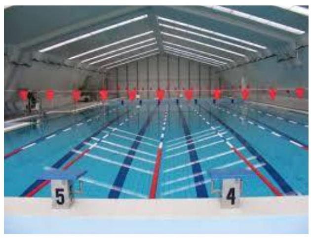
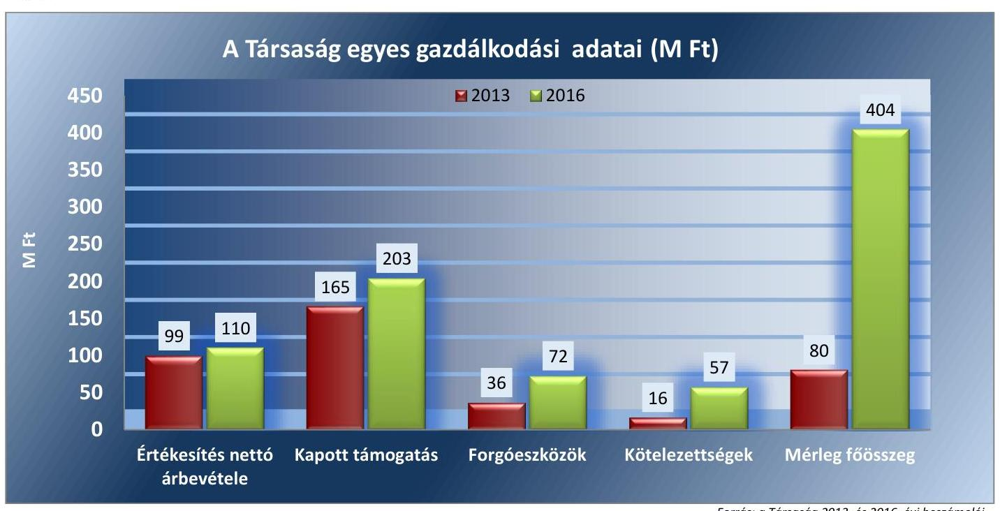
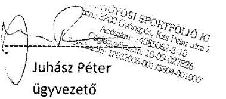
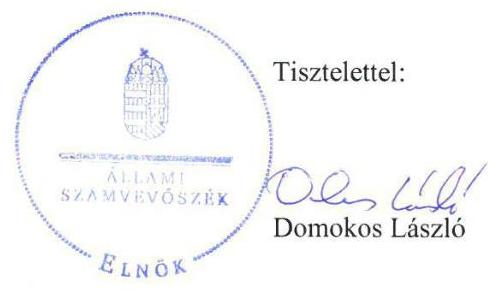

# Jelentés 

## Az önkormányzatok gazdasági társaságai

Az önkormányzatok többségi tulajdonában lévő gazdasági társaságok gazdálkodásának ellenőrzése - Gyöngyösi Sportfólió Nonprofit Korlátolt Felelősségű Társaság 2018.

---

# Jelentés 

## Az önkormányzatok gazdasági társaságai

Az önkormányzatok többségi tulajdonában lévő gazdasági társaságok gazdálkodásának ellenőrzése - Gyöngyösi Sportfólió Nonprofit Korlátolt Felelősségű Társaság 2018.  júce hó 17 nap

18170
www.asz.hu

---

# AZ ELLENŐRZÉST FELÜGYELTE:

- **DR NAGY IMRE** felügyeleti vezető
- **AZ ELLENŐRZÉST VEZETTE ÉS A VÉGREHAJTÁSÁÉRT FELELŐS:**
  - **SIPOSNÉ DÓCZI KLÁRA** ellenőrzésvezető
  - **A PROGRAM ÖSSZEÁLLÍTÁSÁÉRT FELELŐS:**
    - **TÓTPÁL SZABOLCS** osztályvezető

**IKTATÓSZÁM:** EL-0156-100/2018

**TÉMASZÁM:** 2447

**ELLENŐRZÉS-AZONOSÍTÓ SZÁM:** V079346

---

Jelentéseink az Országgyűlés számítógépes hálózatán és az Interneten a www.asz.hu címen is olvashatóak.

---

# TARTALOMJEGYZÉK 

■ ÖSSZEGZÉS ..... 5
■ AZ ELLENŐRZÉS CÉLJA ..... 6
■ AZ ELLENŐRZÉS TERÜLETE ..... 7
■ AZ ELLENŐRZÉS HÁTTERE, INDOKOLTSÁGA ..... 9
■ A JELENTÉS LÉNYEGES KÉRDÉSKÖREI ..... 10
■ ELLENŐRZÉS HATÓKÖRE ÉS MÓDSZEREI ..... 11
■ MEGÁLLAPÍTÁSOK ..... 13
■ JAVASLATOK ..... 16
■ MELLÉKLETEK ..... 19
I. sz. melléklet: Értelmező szótár ..... 19
II. sz. melléklet: Pénzügyi adatok ..... 21
■ FÜGGELÉK: ÉSZREVÉTELEK ..... 23
■ RÖVIDÍTÉSEK JEGYZÉKE ..... 29

---

.

---

# ÖSSZEGZÉS 

A Gyöngyös Városi Önkormányzat a tulajdonosi joggyakorlás kereteit szabályszerűen alakította ki, tulajdonosi jogait az előírások szerint gyakorolta. A Gyöngyösi Sportfólió Nonprofit Korlátolt Felelősségű Társaság számviteli szabályozása nem felelt meg a jogszabályi előírásoknak. A bevételek és a ráfordítások elszámolása nem volt szabályszerű. A Társaság vagyonnyilvántartása és vagyongazdálkodása szabályszerű volt. A közérdekű adatok nyilvánosságát, gazdálkodásának átláthatóságát nem biztosította.

## Az ellenőrzés társadalmi indokoltsága

Magyarországon az intézmény-centrikus közfeladat-ellátás jellemző, de az önkormányzatok kötelező és önként vállalt feladataik ellátása során egyre szélesebb körben alkalmazzák a költségvetési szerveken kívüli feladatellátást. Helyi szinten ennek meghatározó szereplői az önkormányzati tulajdonban lévő gazdasági társaságok, amelyek ezáltal kiemelt fontosságú szerephez jutnak a lakossági szolgáltatások biztosításában. Az önkormányzatok többségi tulajdonában álló gazdasági társaságok ellenőrzése kiemelt jelentőségű, mivel működésük hatással van a tulajdonos önkormányzat gazdálkodására, gazdálkodásának egyes elemei befolyásolják az önkormányzati alszektor hiányát és az államadósságot. Ezért alapvető követelmény, hogy gazdálkodásuk, működésük szabályszerű és átlátható legyen.

Az Állami Számvevőszék által a közfeladatot ellátó Társaságnál végzett ellenőrzést további társadalmi elvárás indokolja sajátos feladatellátásából adódóan, mivel tevékenysége keresztül Gyöngyös város és a környező települések lakosságának széles köre kerül kapcsolatba a Társasággal, az általa nyújtott szolgáltatásokkal.

## Főbb megállapítások, következtetések, javaslatok

A Gyöngyös Városi Önkormányzat a tulajdonosi joggyakorlás kereteit a jogszabályi előírásoknak megfelelően alakította ki, tulajdonosi joggyakorlása szabályszerű volt.

A Gyöngyösi Sportfólió Nonprofit Korlátolt Felelősségű Társaság számviteli szabályozása nem biztosította a bevételek, köztük a kormányzati szektor hiányát befolyásoló bevételek és az anyagjellegű-, valamint a kormányzati szektor hiányát befolyásoló ráfordítások elszámolásának szabályszerűségét. A bevételek és a ráfordítások elszámolása nem volt szabályszerű. Vagyongazdálkodása szabályszerű volt, vagyonához kapcsolódó nyilvántartásait a jogszabályi előírások szerint vezette. Az eszközöket és a forrásokat szabályszerű leltározással vették számba. A Társaság az előírt tervezési, beszámolási, adatszolgáltatási kötelezettségeit határidőben, beszámolási kötelezettségét előírás szerint teljesítette, ugyanakkor a közérdekű adatok közzétételi kötelezettségének sem a saját, sem az Önkormányzat honlapján nem tett eleget.

Kormányzati szektorba sorolt gazdálkodó szervezetként 2016-ban a szervezet tevékenységének, a célok megvalósításának nyomon követését biztosító rendszert nem alakított ki.

Az Állami Számvevőszék a jelentésben foglalt megállapítások alapján a Gyöngyösi Sportfólió Nonprofit Korlátolt Felelősségű Társaság ügyvezetőjének a számviteli elszámolással, a szabályozottsággal, a közzétételi kötelezettség, valamint a kormányzati szektorba sorolt szervezet követelményének teljesítésével kapcsolatosan hat javaslatot fogalmazott meg. Gyöngyös Városi Önkormányzat Polgármesterének egy javaslatot tett az Állami Számvevőszék a javadalmazási szabályzattal összefüggésben. A javaslatokat megalapozó megállapításokra az érintetteknek 30 napon belül intézkedési tervet kell készíteniük.

---

# AZ ELLENŐRZÉS CÉLJA 

Az ellenőrzés célja annak értékelése, hogy az önkormányzat vagyongazdálkodási tevékenysége során szabályszerűen gyakorolta-e tulajdonosi jogait; a gazdasági társaság szabályozottsága, gazdálkodása és vagyongazdálkodási tevékenysége, bevételeinek és ráfordításainak elszámolása megfelelt-e a jogszabályi és tulajdonosi előírásoknak; a gazdasági társaság kötelezettségállománya jelent-e kockázatot a működésre. Az ellenőrzés célja továbbá annak megítélése, hogy a kormányzati szektorba sorolt önkormányzati tulajdonban (résztulajdonban) lévő gazdálkodó szervezetek gazdálkodásának a kormányzati szektor hiányára és az államadósságra befolyással bíró elemei a jogszabályi előírásoknak megfeleltek-e.

---

# **AZ ELLENŐRZÉS TERÜLETE**

## **Gyöngyös Városi Önkormányzat és a kizárólagos tulajdonában lévő Gyöngyösi Sportfólió Nonprofit Korlátolt Felelősségű Társaság**

### **A GYÖNGYÖS VÁROSI ÖNKORMÁNYZAT**

2007. október 25-én alapította a Gyöngyösi Sportfólió Nonprofit Kft.1-t.

A Gyöngyösi Sportfólió Nonprofit Kft. a Gyöngyös Városi Önkormányzat 100%-os tulajdonában állt az ellenőrzött időszakban, jegyzett tőkéje az alapításkor 0,5 millió forint volt, mely a GYÖNGYÖS–TORNACSARNOK Ingatlan-hasznosító Nonprofit Kft. 2016. évi beolvadásával emelkedett 4,5 millió forintra.

### **A GYÖNGYÖSI SPORTFÓLIÓ NONPROFIT KFT.**

Fő tevékenysége közfeladat ellátás keretében a sportlétesítmény működtetése volt. A Társaság más gazdasági társaságban tulajdoni hányaddal nem rendelkezett, átlagos statisztikai állományi létszáma 2013-ban 100 fő volt, mely az ellenőrzött időszak végére 82 főre csökkent. A Társaság az ellenőrzött időszakon belül 2013-ban közhasznú szervezetként működött, közhasznú minősítése 2014. évben törlésre került.

A Nemzetgazdasági Miniszter 2015. december 30-án kelt közleményében sorolta a Társaságot a kormányzati szektorba tartozó egyéb szervezetek közé. A Társaságnak az ellenőrzött időszakban nem volt olyan adósságot keletkeztető ügylete, amely az államadósságra hatással lett volna, továbbá a kormányzati szektor hiányát osztalékfizetés nem befolyásolta.

Az ellenőrzött időszakban a Társaság irányítási feladatait az ügyvezető, ellenőrzését három tagú felügyelő bizottság végezte. A felügyelő bizottsági feladatokat kettő ciklusban, összesen öt fő látta el. A Társaság számviteli beszámolóit könyvvizsgáló auditálta, kinek személye nem változott az ellenőrzött időszakban.

A Gyöngyösi Sportfólió Nonprofit Kft. az Önkormányzattól vagyonkezelésbe nem vett át vagyont. Az Alapító a jegyzett tőkén túli mellékszolgáltatásként biztosította a Társaság számára az ingatlanai használatát. Ezen túl a Társaság a tevékenységét saját eszközeivel látta el. Gazdálkodásának egyes adatait 2013 és 2016 vonatkozásában az 1. ábra szemlélteti.

---

*Forrás: a Társaság 2013. és 2016. évi beszámolói*

A Társaság eszközeinek állománya a 2013. december 31-i 80 millió forintról 2016. december 31-re 404 millió forintra emelkedett a GYÖNGYÖSTORNACSARNOK Kft. beolvadása következtében. A kötelezettség állománya 2013 év eleje és 2016 év vége között több mint háromszorosára növekedett a követelések állományának megduplázódása mellett. A kötelezettségek növekedést a szállító-állomány növekedése okozta. A Gyöngyösi Sportfólió Nonprofit Kft. működésének főbb jellemzőit a II. számú melléklet mutatja be.

Az ellenőrzött időszakban a tulajdonos önkormányzat a Társaság működéséhez valamint fejlesztéseihez 771,3 millió forint támogatást nyújtott.

Gyöngyös Város polgármesterének személye az ellenőrzött időszakban egy alkalommal, a 2014. évi önkormányzati választásokat követően változott. A Gyöngyösi Polgármesteri Hivatalt 2003 óta irányítja a Jegyző.

---

# AZ ELLENŐRZÉS HÁTTERE, INDOKOLTSÁGA 

Az önkormányzatok többségi tulajdonában álló gazdasági társaságok ellenőrzése kiemelten fontos a vagyon megőrzése, megóvása érdekében, valamint a kormányzati szektor elszámolásaiban megjelenő önkormányzati tulajdonú gazdálkodó szervezetek esetében, amelyekkel szemben alapvető követelmény, hogy gazdálkodásuk, működésük szabályszerű, az általuk szolgáltatott adatok minél megbízhatóbbak legyenek. A feladatellátás költségeinek, ráfordításainak alakulása a lakosság széles rétegét érinti.

Ellenőrzéseink feltárhatják, hogy az önkormányzat a feladatellátásához rendelt vagyon működtetését a tulajdonostól elvárható gondossággal végezte-e, a feladatot ellátó gazdasági társaság a létesítő okiratban, szolgáltatási szerződésben foglaltak betartásával biztosította-e a feladat ellátását. Az ellenőrzés eredményeképp meghatározhatóvá válnak a költségvetési hiányt befolyásoló szervezetek kockázatai, lehetővé válik ezen kockázatok csökkentése. Az ellenőrzés rávilágíthat arra, hogy a gazdasági társaság a vagyon használatával biztosította-e a szolgáltatás folytatásának feltételeit, az önkormányzat tulajdonosi felügyelete hozzájárult-e a szabályszerű gazdálkodáshoz és feladatellátáshoz.

A megállapítások alapján megfogalmazott számvevőszéki javaslatok hasznosítása elősegítheti a meglévő hibák megszüntetését. A jó gyakorlatok bemutatásával az ÁSZ hozzájárulhat a követendő megoldások megismertetéséhez, terjesztéséhez.

---

# A JELENTÉS LÉNYEGES KÉRDÉSKÖREI 

1.- Az önkormányzat tulajdonosi joggyakorlása szabályszerű volt-e?
2.- A gazdasági társaság vagyongazdálkodása, bevételeinek és ráfordításainak elszámolása, a kormányzati szektor hiányát befolyásoló bevételek és ráfordítások elszámolása szabályszerű volt-e?

---

# ELLENŐRZÉS HATÓKÖRE ÉS MÓDSZEREI 

## Az ellenőrzés típusa

Megfelelőségi ellenőrzés.

## Az ellenőrzött időszak

2013. január 1-jétől 2016. december 31-éig

## Az ellenőrzés tárgya

A Gyöngyös Városi Önkormányzat tulajdonosi joggyakorlása, valamint a Gyöngyösi Sportfólió Nonprofit Korlátolt Felelősségű Társaság gazdálkodásának szabályozottsága és szabályszerűsége, továbbá gazdálkodásának a kormányzati szektor hiányára és az államadósságra befolyással bíró elemei.

Az ellenőrzés kiterjed minden olyan körülményre és adatra, amely az ÁSZ jogszabályban meghatározott feladatainak teljesítéséhez, valamint a program végrehajtása folyamán felmerült újabb összefüggések feltárásához szükséges.

## Az ellenőrzött szervezet

- Gyöngyös Városi Önkormányzat,
- Gyöngyösi Sportfólió Nonprofit Korlátolt Felelősségű Társaság

## Az ellenőrzés jogalapja

Az ellenőrzés jogszabályi alapját az ÁSZ tv. ${ }^{2}$ 1. § (3) bekezdése és 5. § (3)-(4)-(5) bekezdései képezték.

## Az ellenőrzés módszerei

Az ellenőrzést a nemzetközi standardokat irányadónak tekintve az ellenőrzési program ellenőrzési kérdései, az ellenőrzött időszakban hatályos jogszabályok, az ellenőrzés szakmai szabályok és módszertanok figyelembe vételével végeztük.

Az ellenőrzés ideje alatt az ellenőrzött szervezettel történő kapcsolattartást az ÁSZ Szervezeti és Működési Szabályzatának vonatkozó előírásai alapján biztosítottuk.

---

Az ellenőrzési kérdések megválaszolásához szükséges bizonyítékok megszerzése a következő ellenőrzési eljárások alkalmazásával történt: megfigyelés, kérdésfeltevés (információkérés), összehasonlítás, valamint elemző eljárás. Az ellenőrzési bizonyítékként felhasználható adatforrások közé tartoztak egyrészt a szakmai programban felsorolt adatforrások, másrészt minden, az ellenőrzés folyamán feltárt, az ellenőrzés szempontjából információkat tartalmazó dokumentum.

Az ellenőrzést a kérdésekre adott válaszok kiértékelésével, valamint a megjelölt adatforrások, a csatolt tanúsítványok felhasználásával, továbbá az adott időszakban hatályos jogszabályok figyelembe vételével folytattuk le.

A bevételek és ráfordítások elszámolása, valamint a vagyonnyilvántartás terén a szabályszerű működést véletlen mintavétellel ellenőriztük. A mintavétellel ellenőrzött területek esetében minden egyes tétel vonatkozásában a szabályszerűségre vonatkozó kérdéseket tettünk fel, amelyek eredménye összesítésre került. Megfelelőnek értékeltünk egy ellenőrzött területet, amennyiben 95%-os bizonyossággal a teljes sokaságban az átlagos hibaarány legfeljebb 10%, nem megfelelőnek, amennyiben 10%-nál magasabb arányt képviselt. A ráfordítások elszámolására és a vagyonnyilvántartásra vonatkozó véletlen mintavételt kockázati alapú kiválasztással egészítettük ki, amelynek során évente a három legnagyobb összegű tételt választottuk ki.

---

# 1. Az önkormányzat tulajdonosi joggyakorlása szabályszerű volt-e? 

Összegző megállapítás A tulajdonosi joggyakorlás szabályszerű volt.

A TULAJDONOSI JOGGYAKORLÁS KERETEIT az Önkormányzat Képviselő-testülete ${ }^{3}$ mint a Társaság alapítója és annak Taggyűlési hatáskörben eljáró legfőbb szerve az SZMSZ ${ }_{1-2}{ }^{4}$-ben, a Vagyonrendelet ${ }_{1-3}{ }^{5}$-ben, valamint a Társaság ${ }^{6}$ Alapító okirat ${ }_{1-4}{ }^{7}$-ban, továbbá az évenkénti költségvetési ${ }^{8}$ - és zárszámadási rendeleteiben ${ }^{9}$ a jogszabályi előírásoknak megfelelően határozta meg.

Az Alapító ${ }^{10}$ a vezető tisztségviselők, felügyelő-bizottsági tagok javadalmazásának, valamint jogviszonyuk megszűnése esetére biztosított juttatások módjának, mértékének elveiről, annak rendszeréről megalkotta a Társaság Javadalmazási szabályzatát ${ }^{11}$, azonban az nem tartalmazott az Mt. ${ }^{12}$ 208. §-ának hatálya alá eső munkavállalókra vonatkozó szabályokat, megsértve ezzel a Taktv. ${ }^{13}$ 5. § (3) bekezdésében foglaltakat.

A TULAJDONOSI JOGOKAT az Alapító a Gt. ${ }^{14}$ és a Ptk. ${ }^{15}$ előírásainak megfelelően gyakorolta.

Az Alapító a tulajdonosi ellenőrzést, valamint a Gt. és a Ptk. előírásai szerinti tulajdonosi joggyakorlást a Felügyelő bizottságon
 ${ }^{16}$ keresztül, továbbá az éves üzleti terv, az éves számviteli-, valamint az önkormányzati támogatások felhasználásáról szóló beszámolók elfogadásával, az éves adózott eredmény felosztásáról szóló döntéseivel biztosította. Az Önkormányzat Képviselő-testülete az ellenőrzött időszakban a Felügyelő bizottság és a könyvvizsgáló írásos véleményének birtokában határozataiban döntött a Társaság egyszerűsített éves beszámolóinak az elfogadásáról, valamint az adózott eredmény felhasználásáról. Az Alapító a Társaság közhasznú szervezeti működésének során, 2013-ban a Civil tv. ${ }^{17}$ előírásainak megfelelően fogadta el a beszámolóval egyidejűleg a közhasznúsági mellékletet.

Az Önkormányzat 2013-ban élt az Áht. ${ }^{18}$-ban számára biztosított lehetőséggel, hogy ellenőrizze a Társaságot. A vagyongazdálkodás szabályszerűségére vonatkozóan az önkormányzati ellenőrzés által megfogalmazott javaslatokra ${ }^{19}$ a Társaság intézkedési tervet készített.

---

# 2. A gazdasági társaság vagyongazdálkodása, bevételeinek és ráfordításainak elszámolása, a kormányzati szektor hiányát befolyásoló bevételek és ráfordítások elszámolása szabályszerű volt-e? 

Összegző megállapítás

2.1. számú megállapítás

A Társaság Számlarendje nem biztosította a számviteli elszámolások szabályszerűségét. A Társaság vagyongazdálkodása szabályszerű volt az ellenőrzött időszakban. Ugyanakkor a bevételek és ráfordítások elszámolása, a személyi jellegű ráfordítások elszámolása kivételével, nem volt szabályszerű, valamint nem gondoskodott a közérdekű adatok közzétételéről.

A Társaság a kötelező számviteli szabályzatokkal rendelkezett, azonban szabályozottsága a Számlarend és a Leltározási szabályzat hiányosságai miatt nem felelt meg a jogszabályi előírásoknak.

SZÁMVITELI SZABÁLYZATOKKAL - Számviteli politikával ${ }^{20}$, Eszközök és források értékelési szabályzatával, Eszközök és források leltárkészítési és leltározási szabályzatával, valamint Pénzkezelési szabályzattal ${ }^{21}$ - rendelkezett a Társaság, ezzel megfelelt a Számv. tv. ${ }^{22}$ 14. § (5) bekezdésében előírtaknak.

SZÁMLARENDDEL ${ }^{23}$ a teljes ellenőrzött időszakban rendelkezett a Társaság, ugyanakkor az nem felelt meg a Számv. tv. 161. § (2) bekezdés a) és b) pontjaiban foglaltaknak, mivel nem tartalmazta a bevételek, a költségek, valamint a ráfordítások elszámolására kijelölt számlák számjelét, megnevezését, a számla tartalmát.

A Leltározási szabályzat ${ }^{24}$ az ingatlanok vonatkozásában a mennyiségi leltárfelvétel gyakoriságát nem a Számv. tv. 69. § (3) bekezdésében foglalt előírásoknak megfelelően rögzítette, mert a mennyiségi leltárfelvétel gyakoriságát - a jogszabályi előírásban szereplő legalább háromévenkénti gyakoriság ellenére - öt éves gyakorisággal határozta meg.

A Számviteli politika, a Pénzkezelési szabályzat és az Értékelési szabályzat ${ }^{25}$ megfelelt a Számv. tv. rendelkezéseinek.

A Társaság a 2015. december 30-ától hatályos kormányzati szektorba sorolását követően, a Bkr. ${ }^{26}$ 10. §-ában előírtak ellenére nem alakított ki a szervezet tevékenységének, a célok megvalósításának nyomon követését biztosító rendszert, valamint 2016. szeptember 30-áig belső ellenőrzést.
2.2. számú megállapítás

A bevételek és a ráfordítások elszámolása nem volt szabályszerű. A Társaság vagyongazdálkodási tevékenysége megfelelt a jogszabályi rendelkezéseknek.

A BEVÉTELEK ELSZÁMOLÁSA, ideértve a kormányzati szektor hiányát befolyásoló bevételek elszámolását is, nem volt szabályszerű, mivel a Társaság megsértette a Számv. tv. 167. § (1) bekezdés h) pontjának előírásait, mert a bizonylatok nem tartalmazták az érintett könyvviteli számlákra történő hivatkozást.

---

A RÁFORDÍTÁSOK ELSZÁMOLÁSÁN belül a személyi jellegű ráfordítások elszámolása szabályszerű volt. Ugyanakkor az anyagjellegű ráfordítások elszámolása, valamint a kormányzati szektor hiányát befolyásoló ráfordítások elszámolása nem volt szabályszerű, mivel a Társaság megsértette a Számv. tv. 167. § (1) bekezdés h) pontjának előírásait, mert a bizonylatok nem tartalmazták az érintett könyvviteli számlákra történő hivatkozást.

A TÁRSASÁG VAGYONGAZDÁLKODÁSA megfelelt a jogszabályi rendelkezéseknek és a belső előírásoknak. A Társaság a vagyonnyilvántartását a Számv. tv. előírásaival és belső szabályzataival összhangban vezette, a tárgyi eszközökre az értékcsökkenési leírást szabályosan számolta el.

AZ ESZKÖZÖK ÉS A FORRÁSOK LELTÁROZÁSA szabályszerű volt. A Számv. tv.-ben előírtaknak megfelelően évente egyeztetéssel illetve mennyiségi felvétellel leltároztak és támasztották alá az egyszerűsített éves beszámolók mérlegtételeit.
2.3. számú megállapítás

A Társaság a számviteli beszámolókra, valamint a közhasznú tevékenységre vonatkozó közzétételi kötelezettségeinek eleget tett, ugyanakkor a közérdekű adatok közzétételéről nem gondoskodott.

A BESZÁMOLÁSI ÉS TERVEZÉSI TEVÉKENYSÉGET a Társaság részére az Alapító okiratban ${ }^{27}$ és a pénzeszköz átadásáról szóló Megállapodásban ${ }^{28}$ szabályozta az Alapító, mely előírásoknak a Társaság az éves üzleti tervekkel, valamint az éves számviteli- és a támogatások, pénzeszközök felhasználásáról szóló beszámolókon keresztül az előírásoknak megfelelően tett eleget.

A SZÁMVITELI BESZÁMOLÓK KÖZZÉTÉTELI KÖTELEZETTSÉGÉNEK a Társaság a tulajdonosi joggyakorló által elfogadott éves egyszerűsített beszámolók és 2013-ban a Közhasznúsági melléklet megfelelő határidőben történő letétbe helyezésével és közzétételével, a Számv. tv.-ben és a Civil tv.-ben foglaltak szerint tett eleget.

# A KÖZÉRDEKŰ ADATOK KÖZZÉTÉTELÉNEK 

RENDJÉT rögzítő szabályzatát a Társaság nem alkotta meg, ezzel nem tartotta be az Info. tv. ${ }^{29}$ 35. § (3) bekezdés előírásait. A Társaság nem alkotta meg a közérdekű adatok megismerésére irányuló igények teljesítésének rendjét rögzítő szabályzatát, amivel megsértették az Info tv. 30. § (6) bekezdésében előírtakat. A Társaság megsértette az Info tv. 33. § (1) és (3) bekezdéseinek, valamint a 37. § (1) bekezdésének az előírásait, mert a törvény 1. mellékletében meghatározott szervezeti, személyzeti adatok, valamint a tevékenységre, működésre és a gazdálkodására vonatkozó adatok közzétételi kötelezettségének sem a saját, sem az Önkormányzat honlapján nem tett eleget.

---

# JAVASLATOK 

Az ÁSZ tv. 33. § (1) bekezdésében foglaltak értelmében az ellenőrzött szervezet vezetője köteles a jelentésben foglalt megállapításokhoz kapcsolódó intézkedési tervet összeállítani és azt a jelentés kézhezvételétől számított 30 napon belül az ÁSZ részére megküldeni. Amennyiben az ellenőrzött szervezet vezetője nem küldi meg határidőben az intézkedési tervet, vagy továbbra sem elfogadható intézkedési tervet küld, az Állami Számvevőszék elnöke az ÁSZ tv. 33. § (3) bekezdés a) és b) pontjaiban foglaltakat érvényesítheti.

## Gyöngyösi Sportfólió Nonprofit Kft. Ügyvezetőjének

1. Intézkedjen, hogy a számlarend megfeleljen a jogszabályi rendelkezéseknek.
(2.1. sz. megállapítás 2. bekezdése alapján)
2. Intézkedjen, hogy a leltározási szabályzat az ingatlanok vonatkozásában a mennyiségi leltárfelvétel gyakoriságát a Számv. tv.-ben foglalt előírásoknak megfelelően rögzítse.
(2.1. sz. megállapítás 3. bekezdése alapján)
3. Intézkedjen a szervezet tevékenységének, a célok megvalósításának nyomon követését biztosító rendszer kialakításáról a jogszabályi előírásoknak megfelelően.
(2.1. sz. megállapítás 5. bekezdése alapján)
4. Intézkedjen a számviteli elszámolások szabályszerű végrehajtására, ezen belül a ráfordítások és a bevételek elszámolása tekintetében a jogszabályi előírások betartására.
(2.2. sz. megállapítás 1. és 2. bekezdései alapján)
5. Intézkedjen a jogszabályban foglaltak alapján a közérdekű adatok közzétételének rendjét és a közérdekű adatok megismerésére irányuló igények teljesítésének rendjét rögzítő szabályzat elkészítéséről.
(2.3. sz. megállapítás 3. bekezdés 1. és 2. mondatai alapján)
6. Gondoskodjon a közzétételi kötelezettségek jogszabályi előírásoknak megfelelő teljesítéséről.
(2.3. sz. megállapítás 3. bekezdés 3. mondata alapján)

---

# Gyöngyös Városi Önkormányzat Polgármesterének 

1. Kezdeményezze, hogy a Javadalmazási szabályzat tartalmazza az Mt. 208. §-a hatálya alá eső munkavállalókra vonatkozó szabályokat.
(1. sz. megállapítás 2. bekezdése alapján)

---

.

---

# MELLÉKLETEK 

- I. SZ. MELLÉKLET: ÉRTELMEZŐ SZÓTÁR
gazdasági társaság
gazdálkodó szervezet
kormányzati szektorba sorolt egyéb szervezet
meghatározó befolyás
minősített többséget biztosító részesedés
nemzeti vagyon
nonprofit gazdasági társaság
többségi befolyást biztosító részesedés
vagyonkezelő

A Ptk. 3:88. § (1) bekezdése szerint „a gazdasági társaságok üzletszerű közös gazdasági tevékenység folytatására, a tagok vagyoni hozzájárulásával létrehozott, jogi személyiséggel rendelkező vállalkozások, amelyekben a tagok a nyereségből közösen részesednek, és a veszteséget közösen viselik".
A Ptk. 685. § c) pontja szerint gazdálkodó szervezet: „az állami vállalat, az egyéb állami gazdálkodó szerv, a szövetkezet, a lakásszövetkezet, az európai szövetkezet, a gazdasági társaság, az európai részvénytársaság, az egyesülés, az európai gazdasági egyesülés, az európai területi együttműködési csoportosulás, az egyes jogi személyek vállalata, a leányvállalat, a vízgazdálkodási társulat, az erdő birtokossági társulat, a végrehajtói iroda, az egyéni cég, továbbá az egyéni vállalkozó." (2014. március 15-ig hatályos)
az Áht. 3. § (2) és (3) bekezdésében foglaltakon kívül az Európai Közösséget létrehozó szerződéshez csatolt, a túlzott hiány esetén követendő eljárásról szóló jegyzőkönyv alkalmazásáról szóló 2009. május 25-i 479/2009/EK rendelet (a továbbiakban: 479/2009/EK rendelet) szerint a kormányzati szektorba sorolt szervezet (Áht. 1. § (12))
A Ptk. 8:2. § (2) bekezdése szerint „A befolyással rendelkező akkor rendelkezik egy jogi személyben meghatározó befolyással, ha annak tagja vagy részvényese, és
a) jogosult e jogi személy vezető tisztségviselői vagy felügyelőbizottsága tagjai többségének megválasztására, illetve visszahívására; vagy
b) a jogi személy más tagjai, illetve részvényesei a befolyással rendelkezővel kötött megállapodás alapján a befolyással rendelkezővel azonos tartalommal szavaznak, vagy a befolyással rendelkezőn keresztül gyakorolják szavazati jogukat, feltéve, hogy együtt a szavazatok több mint felével rendelkeznek."
A minősített befolyásszerző az ellenőrzött társaságban a szavazatok legalább hetvenöt százalékával rendelkezik. (Ptk. 3:324. §)
Nvtv. 1. § (2) bekezdése szerint többek között:
„az állam vagy a helyi önkormányzat kizárólagos tulajdonában álló dolgok, az a) pont hatálya alá nem tartozó, állam vagy a helyi önkormányzat tulajdonában lévő dolog,
az állam vagy a helyi önkormányzat tulajdonában lévő pénzügyi eszközök, továbbá az államot vagy a helyi önkormányzatot megillető társasági részesedések, az államot vagy a helyi önkormányzatot megillető bármely vagyoni értékkel rendelkező jogosultság, amelyet jogszabály vagyoni értékű jogként nevesít."
Civil tv. 9/F. § (2) bekezdése szerint „az a gazdasági társaság minősül nonprofit gazdasági társaságnak és cégnevében az a gazdasági társaság tüntetheti fel a nonprofit jelleget, amelynek létesítő okirata tartalmazza, hogy a gazdasági társaság tevékenységéből származó nyereség a tagok között nem osztható fel, hanem az a gazdasági társaság vagyonát gyarapítja." (hatályos 2014. március 15-től)
A Ptk. 8:2. § (1) bekezdése szerint „többségi befolyás az olyan kapcsolat, amelynek révén természetes személy vagy jogi személy (befolyással rendelkező) egy jogi személyben a szavazatok több mint felével vagy meghatározó befolyással rendelkezik."
vagyonkezelő:
a) az állam tulajdonában álló nemzeti vagyon tekintetében:

---

aa) költségvetési szerv,
ab) helyi önkormányzat, önkormányzati társulás,
ac) önkormányzati intézmény,
ad) köztestület,
ae) az állam, az aa)-ac) alpontban meghatározott személyek együtt vagy külön-külön 100%-os tulajdonában álló gazdálkodó szervezet,
af) az ae) alpont szerinti gazdálkodó szervezet 100%-os tulajdonában álló gazdálkodó szervezet,
ag) a törvény által kijelölt egyedileg meghatározott jogi személy.
b) a helyi önkormányzat tulajdonában álló nemzeti vagyon tekintetében:
ba) önkormányzati társulás,
bb) költségvetési szerv vagy önkormányzati intézmény,
bc) köztestület,
bd) az állam, a helyi önkormányzat, a ba)-bb) alpontban meghatározott személyek együtt vagy külön-külön 100%-os tulajdonában álló gazdálkodó szervezet,
be) a bd) alpont szerinti gazdálkodó szervezet 100%-os tulajdonában álló gazdálkodó szervezet.
c) az egyházi jogi személy a tevékenysége ellátásához szükséges nemzeti vagyon tekintetében. (Forrás: Nvtv. 3. § (1) bekezdés 19. pontja)

---

# II. SZ. MELLÉKLET: PÉNZÜGYI ADATOK

|  EGYSZERÜSÍTETT ÉVES BESZÁMOLÓK ADATAI (MILLIÓ FORINT) |  |  |  |  |   |
| --- | --- | --- | --- | --- | --- |
|  Megnevezés | 2013.01.01. | 2013.12.31. | 2014.12.31. | 2015.12.31. | 2016.12.31.  |
|  Befektetett eszközök | 39,0 | 43,8 | 50,3 | 94,9 | 330,9  |
|  Immateriális javak |  |  |  |  |   |
|  Tárgyi eszközök | 39,0 | 43,8 | 50,3 |

 | 94,9 | 330,9  |
|  Befektetett pénzügyi eszközök |  |  |  |  |   |
|  Forgóeszközök | 43,9 | 35,6 | 42,8 | 44,7 | 71,8  |
|  Készletek | 0,6 | 0,8 | 3,4 | 0,4 | 0,3  |
|  Követelések | 20,0 | 21,2 | 12,9 | 29,7 | 26,3  |
|  Értékpapírok |  |  |  |  |   |
|  Pénzeszközök | 23,3 | 13,6 | 26,5 | 14,6 | 45,2  |
|  Aktív időbeli elhatárolások | 0 | 0 | 0,3 | 0,3 | 0,7  |
|  Saját tőke | 0,5 | 0,5 | 0,5 | 0,5 | 224,0  |
|  Jegyzett tőke | 0,5 | 0,5 | 0,5 | 0,5 | 4,5  |
|  Töketartalék |  |  |  |  | 2,9  |
|  Eredménytartalék | 0 | 0 | 0 | 0 | 0  |
|  Lekötött tartalék |  |  |  |  | 216,6  |
|  Értékelési tartalék |  |  |  |  |   |
|  Mérleg szerinti eredmény* | 0 | 0 | 0 | 0 | 0  |
|  Céltartalék |  |  |  |  |   |
|  Kötelezettségek | 18,5 | 15,9 | 18,8 | 28 | 56,6  |
|  Hosszú lejáratú kötelezettségek | 0,1 | 0,1 | 0,1 | 0,1 | 0,1  |
|  Rövid lejáratú kötelezettségek | 18,4 | 15,8 | 18,7 | 27,9 | 56,5  |
|  Passzív időbeli elhatárolás | 63,9 | 63,0 | 74,1 | 111,4 | 122,8  |
|  MÉRLEG FŐÖSSZEG | 82,9 | 79,4 | 93,4 | 139,9 | 403,4  |
|  Értékesítés nettó árbevétele | - | 99,2 | 108,5 | 105,3 | 110,3  |
|  Egyéb bevételek | - | 175,9 | 204 | 178,7 | 198,1  |
|  Anyagjellegű ráfordítások | - | 165,7 | 189,5 | 167,2 | 172,5  |
|  Személyi jellegű ráfordítások | - | 100,7 | 109,6 | 111,0 | 113,5  |
|  Értékcsökkenési leírás | - | 6,7 | 9,7 | 11,3 | 21  |
|  Egyéb ráfordítások | - | 0,9 | 6,5 | 1,8 | 1,7  |
|  Üzemi tevékenység eredménye | - | 1,2 | $-2,8$ | $-7,4$ | $-0,4$  |
|  Pénzügyi műveletek eredménye | - | 0,8 | 0,9 | 0,5 | 0,5  |
|  Rendkívüli eredmény | - | $-2,0$ | 2,0 | 6,9 | 0,1  |
|  Mérleg szerinti eredmény* | - | 0 | 0 | 0 | 0  |
|   |  |  |  | Forrás: a Társaság egyszerűsített éves beszámoló 2013-2016 |   |

- Mérleg szerinti eredmény, ami a 2016. évtől hatályos, a beszámolás formájában történt változások után adózott eredmény

---

.

---

# FÜGGELÉK: ÉSZREVÉTELEK 

A jelentéstervezetet a Számvevőszék 15 napos észrevételezésre megküldte az ellenőrzött szervezetek vezetőinek az ÁSZ tv. 29. § (1) bekezdése előírásának megfelelően.

Az ÁSZ a jelentéstervezetet észrevételezésre megküldte a Gyöngyös Városi Önkormányzat polgármesterének és a Gyöngyösi Sportfólió Nonprofit Kft. ügyvezetőjének.
Gyöngyös Városi Önkormányzat polgármestere a jelentéstervezetre nem tett észrevételt. A függelék tartalmazza a Gyöngyösi Sportfólió Nonprofit Kft. ügyvezetőjének észrevételét, illetve az el nem fogadott észrevétel elutasításának indoklását.

[^0]
[^0]:    * 29. § (1) Az Állami Számvevőszék az ellenőrzési megállapításait megküldi az ellenőrzött szervezet vezetőjének vagy az általa megbízott személynek, és annak, akinek személyes felelősségét állapította meg.
    (2) Az ellenőrzött szervezet vezetője és a felelősként megjelölt személy az ellenőrzés megállapításaira tizenöt napon belül írásban észrevételt tehet.
    (3) Az Állami Számvevőszék az észrevételre a beérkezésétől számított harminc napon belül írásban válaszol. A figyelembe nem vett észrevételeket köteles a jelentésben feltüntetni, és megindokolni, hogy azokat miért nem fogadta el.

---

Gyöngyösi Sportfólió Kft
Gyöngyös

Állami Számvevőszék
Budapest

Tisztelt Elnök Úr !

ÁLLAMI SZÁMVEVŐSZÉK
ÜGYVITELI IRODA
$16-34250 / 213 / 1$
$2018 \quad 06 \quad 04$
tiszteltel
EL-0166-03/213
Melléklet:
Lerigy 1.
22

Az EL-156-095/2018 iktatószámú Számvevőszéki jelentéstervezetüket megkaptuk.

Az abban foglaltakkal kapcsolatosan az alábbi észrevételt teszem:

A jelentéstervezet 2.2 számú megállapítása rögzíti, hogy a bevételek és ráfordítások elszámolása nem volt szabályszerű, mert a Társaság megsértette a Számviteli törvény 167. § (1) bek. h) pontjának előírásait mivel a bizonylatok nem tartalmazták az érintett könyvviteli számlákra való hivatkozást.

Hivatkozom a 2000. évi C. törvény ezen 167. §. (1) bek. h pontjához tartozó törvényi magyarázatra, mely a gyakorlati alkalmazáshoz a következőket tartalmazza:

A hagyományosan, papíralapon kiállított számláknál is elfogadható az a megoldás, ha a gazdálkodó az (1) bekezdés h) és i) pontjaiban foglalt követelményeknek oly módon tesz eleget, hogy az ott kötelezettségként megfogalmazott információkat egy csatolt mellékleten tünteti fel, és a csatolt melléklet elválaszthatatlan (egymásnak egyértelműen megfeleltethető) módon kerül az eredeti számlához hozzárendelésre.

Az általunk követett gyakorlat szerint a bizonylatokat (köztük a banki tételeket is) mindig azonos helyen olyan egyedi sorszámozással látjuk el, ami a fenti követelményeknek teljes egészében megfelel. Példaként csatoljuk a 2016 évi 10. havi szállítók naplójának kontírozási listájának első oldalát.
Természetesen ilyen lista minden évben és minden naplóállományra rendelkezésre áll, lehetővé téve a bizonylat és a hozzá tartozó könyvelési információk egyértelmű egymáshoz rendelését.

Ezen túlmenően a bevételi és költségbizonylatokon rögzítésre kerülnek az adott tétel könyvviteli kontírozási ellenszámla számai.

Álláspontunk szerint így a bevételek és ráfordítások elszámolásának szabályszerűsége biztosított.

A jelentéstervezet egyéb pontjaihoz észrevételt nem kívánok tenni.

Gyöngyös, 2017.05.29.

melléklet: 1db kontírozási lista

---

# Juhász Péter úr 

ügyvezető

Gyöngyösi Sportfólió Kft.

## Gyöngyös

## Tisztelt Ügyvezető Úr!

„Az önkormányzatok gazdasági társaságai - Az önkormányzatok többségi tulajdonában lévő gazdasági társaságok gazdálkodásának ellenőrzése - Gyöngyösi Sportfólió Kft. " címmel készített számvevőszéki jelentéstervezetre tett észrevételeit köszönettel megkaptam.
Az Állami Számvevőszék észrevételekre vonatkozó álláspontjáról a felügyeleti vezető által készített részletes tájékoztatást csatoltan megküldöm.
Tájékoztatom Ügyvezető urat, hogy a számvevőszéki jelentésben - az Állami Számvevőszékről szóló 2011. évi LXVI. törvény 29. § (3) bekezdése alapján - a figyelembe nem vett észrevételeket szerepeltetjük annak megindoklásával, hogy azokat miért nem fogadtuk el.

Budapest, 2018. 06. hó 21. nap

Melléklet: Tájékoztatás az észrevételek kezeléséről

---

FELÜGYELETI VEZETŐ

Melléklet
Ikt.szám: EL-0156-099/2018.

# Tájékoztatás   az észrevételek kezeléséről 

„Az önkormányzatok gazdasági társaságai - Az önkormányzatok többségi tulajdonában lévő gazdasági társaságok gazdálkodásának ellenőrzése - Gyöngyösi Sportfólió Kft." című jelentéstervezetre 2018. május 30-án tett (az Állami Számvevőszékhez 2018. június 4-én érkezett) észrevételét áttekintettük, annak kezelésével kapcsolatban a következő tájékoztatást adom.

## Észrevétel a jelentéstervezet „Megállapítások" fejezet 2.2. számú megállapítására:

Az észrevétel szerint a bevételek és a ráfordítások elszámolása során a számvitelről szóló 2000. évi C. törvény (Számv. tv.) 167.§ (1) bekezdésének h) pontjához tartozó törvényi magyarázat szerinti gyakorlatot folytatják, amely az alábbiakat tartalmazza:
,,A hagyományosan, papíralapon kiállított számláknál is elfogadható az a megoldás, ha a gazdálkodó az (1) bekezdés h) és i) pontjaiban foglalt követelményeknek oly módon tesz eleget, hogy az ott kötelezettségként megfogalmazott információkat egy csatolt mellékletben tünteti fel, és a csatolt melléklet elválaszthatatlan (egymásnak egyértelműen megfeleltethető) módon kerül az eredeti számlához hozzárendelésre."

Az alkalmazott gyakorlat szerint a bizonylatokat mindig azonos helyen olyan egyedi azonosító sorszámmal látják el. Példaként csatolták a 2016. évi 10. havi szállítók naplójának kontírozási listájának első oldalát. Ilyen lista minden évben és minden naplóállományra rendelkezésre áll, lehetővé téve a bizonylat és a hozzá tartozó könyvelési információk egyértelmű egymáshoz rendelését. Ezen túlmenően a bevételi és költségbizonylatokon rögzítésre kerülnek az adott tétel kontírozási ellenszámla számai. Álláspontjuk szerint így a bevételek és ráfordítások elszámolásának szabályszerűsége biztosított.

## Az észrevételre adott válasz:

A bevételek és a ráfordítások elszámolásának ellenőrzéséhez a Teljességi nyilatkozat 6. oldalán lévő 2. a. melléklet 3.-4. számú soraiban lévő fájl nevekkel azonosított, ellenőrzött mintatételek dokumentumai nem tartalmazták az észrevételükben jelölt és példaként bemutatott 2016. évi 10. havi szállítók naplójának kontírozási lista-részlet dokumentumot, amely a hivatkozott törvényi magyarázat értelmében a bizonylat elválaszthatatlan részét kellett képezze. A bizonylatok szabályszerűségének értékelése az ellenőrzéshez beküldött dokumentumok alapján történt.

---

A gyakorlatuk alátámasztására az észrevételhez példaként mellékelt kontírozási lista-részlet nem alapozza meg a számvevőszéki jelentéstervezet megállapításának módosítását. Az észrevétel nem megalapozott, azt nem fogadom el, így a megállapítás módosítása, illetve törlése nem indokolt.

Budapest, 2018. 06. hó 21. nap

Dr. Nagy Imre felügyeleti vezető

---

.

---

# RÖVIDÍTÉSEK JEGYZÉKE 

${ }^{1}$ Kft.
${ }^{2}$ ÁSZ tv.
${ }^{3}$ Önkormányzat Képviselő-testülete
${ }^{4}$ SZMSZ
${ }^{5}$ Vagyonrendelet
${ }^{6}$ Társaság
${ }^{7}$ Alapító okirat
${ }^{8}$ Költségvetési rendelet
${ }^{9}$ Zárszámadási rendelet
${ }^{10}$ Alapító
${ }^{11}$ Javadalmazási szabályzat
${ }^{12} \mathrm{Mt}$.
${ }^{13}$ Taktv.
${ }^{14} \mathrm{Gt}$.
${ }^{15}$ Ptk.
${ }^{16}$ Felügyelő bizottság

Korlátolt Felelősségű Társaság
2011. évi LXVI. törvény az Állami Számvevőszékről (hatályos 2011. július 1-jétől)

Gyöngyös Városi Önkormányzat Képviselő-testülete
Gyöngyös Város Önkormányzata Szervezeti és Működési Szabályzata
1.:7/2011. (III. 25) önkormányzati rendelet
2.: 15/2014. (XI. 14.) önkormányzati rendelet

Gyöngyös Városi Önkormányzat Képviselő-testületének
23/2012. (VI. 29.) önkormányzati rendelet;
8/2016. (III. 25.) önkormányzati rendelet;
28/2016. (IX. 22.) önkormányzati rendelet
Gyöngyösi Sportfólió Nonprofit Kft.
Gyöngyösi Sportfólió Nonprofit Kft. Alapító okirata
1: módosítva: 2012. április 26.
2: módosítva: 2014. május 29.
3: módosítva: 2015. június 25.
4: módosítva: 2016. március 24.
Gyöngyös Városi Önkormányzat Képviselő-testületének rendeletei a költségvetés elfogadásáról
2016. évi költségvetésről:3/2016. (II. 26.) önkormányzati rendelet, Módosításai: 22/2016. (VI. 30.); 31/2016. (X. 28.); 35/2016. (XI. 30.) önkormányzati rendeletek 2015. évi költségvetésről: 4/2015. (II. 27.) önkormányzati rendelet, Módosításai: 15/2015. (III. 27.); 23/2015. (V. 28.); 25/2015. (VI. 26.); 32/2015. (X. 26.); 36/2015. (XI. 02.); 39/2015. (XII. 18); 2/2016. (II. 26.) önkormányzati rendeletek 2014. évi költségvetésről: 3/2014. (II. 28.) önkormányzati rendelet, Módosításai: 12/2014. (VI. 27.); 16/2014. (XI. 14.); 3/2015. (II. 27.) önkormányzati rendeletek 2013. évi költségvetésről: 3/2013. (III. 01.) önkormányzati rendelet, Módosításai: 12/2013. (VI. 28.); 15/2013. (X. 25.); 2/2014. (II. 28.) önkormányzati rendeletek
Gyöngyös Városi Önkormányzat Képviselő-testületének rendeletei az önkormányzat gazdálkodásának adott évi végrehajtásáról
2016. évi gazdálkodásról: 21/2017. (V. 26.) önkormányzati rendelet
2015. évi gazdálkodásról: 15/2016. (V. 27.) önkormányzati rendelet
2014. évi gazdálkodásról: 17/2015. (V. 04.) önkormányzati rendelet
2013. évi gazdálkodásról: 9/2014. (IV. 25.) önkormányzati rendelet

Gyöngyös Városi Önkormányzat Képviselő-testülete
Gyöngyösi Sportfólió Nonprofit Kft. Javadalmazási szabályzata
2012. évi I. törvény a munka törvénykönyvéről (hatályos 2012. július 1-től)
2009. évi CXXII. törvény a köztulajdonban álló gazdasági társaságok takarékosabb működéséről (hatályos 2009. október 3-tól)
2006. évi IV. törvény a gazdasági társaságokról (hatályos 2014. március 14-ig) 2013. évi V. törvény a Polgári Törvénykönyvről (hatályos 2014. március 15-től) Gyöngyösi Sportfólió Nonprofit Kft. Felügyelő bizottsága

---

${
 }^{17}$ Civil tv.
${ }^{18}$ Áht.
${ }^{19}$ Belső ellenőrzési javaslatok
${ }^{20}$ Számviteli politika
${ }^{21}$ Pénzkezelési szabályzat
${ }^{22}$ Számv. tv.
${ }^{23}$ Számlarend
${ }^{24}$ Leltározási szabályzat
${ }^{25}$ Értékelési szabályzat
${ }^{26} \mathrm{Bkr}$.
${ }^{27}$ Támogatási szerződés
${ }^{28}$ Megállapodás
${ }^{29}$ Info tv.
2011. évi CLXXV. törvény az egyesülési jogról, a közhasznú jogállásról, valamint a civil szervezetek működéséről és támogatásáról (hatályos 2011. december 22-től)
2011. évi CXCV. törvény az államháztartásról (hatályos 2011. december 31-től)

Gyöngyös Városi Önkormányzat Belső ellenőrzésének a Gyöngyösi Sportfólió Kft. 2013. évi ellenőrzésekor megfogalmazott javaslatok

Gyöngyösi Sportfólió Nonprofit Kft. Számviteli Politika
Gyöngyösi Sportfólió Nonprofit Kft. Pénzkezelési szabályzata
2000. évi C. törvény a számvitelről (hatályos 2001. január 1-től)

Gyöngyösi Sportfólió Nonprofit Kft. Számlarendje
Gyöngyösi Sportfólió Nonprofit Kft. Eszközök és források leltárkészítési, leltározási szabályzata
Gyöngyösi Sportfólió Nonprofit Kft. Értékelési szabályzata
370/2011. (XII. 31.) Korm. rendelet a költségvetési szervek belső
kontrollrendszeréről és belső ellenőrzéséről
Gyöngyös Városi Önkormányzat és a Gyöngyösi Sportfólió Nonprofit Kft. között létrejött szerződés
1. Támogatási szerződés 2013. évre (kelt: 2013. április 4.)
2. Támogatási szerződés 2014. évre (kelt: 2014. január 13., módosítva: 2014. március 20., 2014. október 6., 2014. december 12.)
3. Támogatási szerződés 2015. évre (kelt: 2015. január 16., módosítva: 2015. március 6., 2015. október 21.)
4. Támogatási szerződés 2016. évre (kelt: 2016. január 12., módosítva: 2016. március 7., 2016. március 10.)
Gyöngyös Városi Önkormányzat és a Gyöngyösi Sportfólió Nonprofit Kft. között létrejött megállapodások végleges pénzeszköz átadásról

1. Megállapodás kelte: 2014. július 4.
2. Megállapodás kelte: 2014. július 17.
3. Megállapodás kelte: 2014. augusztus 4.
4. Megállapodás kelte: 2016. április 20.
5. Megállapodás kelte: 2016. július 7.
6. Megállapodás kelte: 2016. november 14.
2011. évi CXII. törvény az információs önrendelkezési jogról és az információszabadságról (hatályos 2011. július 27-től)

---

# ÁLLAMI SZÁMVEVŐSZÉK 

1052 Budapest, Apáczai Csere János utca 10.
Levélcím: 1364 Budapest 4. Pf. 54
Telefon: +36 14849100 Telefax: +36 14849200
www.asz.hu
