# Jelentés 

## Az önkormányzatok gazdasági társaságai

Az önkormányzatok többségi tulajdonában lévő gazdasági társaságok gazdálkodásának ellenőrzése -INTEGRIT-XX. Városüzemeltetési-, Szervező-, Fejlesztő- és Szolgáltató Kft. 2018.

---

# Jelentés 

## Az önkormányzatok gazdasági társaságai

Az önkormányzatok többségi tulajdonában lévő gazdasági társaságok gazdálkodásának ellenőrzése -INTEGRIT-XX. Városüzemeltetési-, Szervező-, Fejlesztő- és Szolgáltató Kft. 2018. 24. nap

Dómokos László
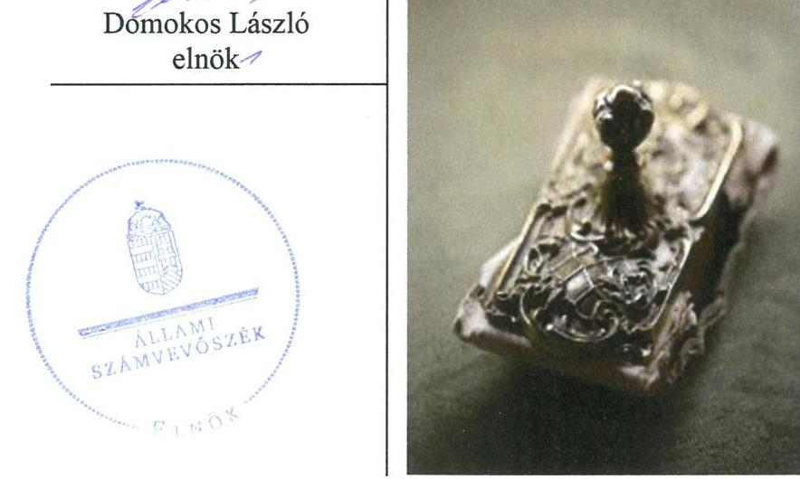

---

# AZ ELLENŐRZÉST FELÜGYELTE:

DR. NAGY IMRE felügyeleti vezető

# AZ ELLENŐRZÉST VEZETTE ÉS A VÉGREHAJTÁSÁÉRT FELELŐS:

JÁNOSI ISTVÁN ellenőrzésvezető

# A PROGRAM ÖSSZEÁLLÍTÁSÁÉRT FELELŐS:

TÓTPÁL SZABOLCS osztályvezető

IKTATÓSZÁM: V-1403-061/2016.

TÉMASZÁM: 13

# ELLENŐRZÉS-AZONOSÍTÓ SZÁM: V079356

Jelentéseink az Országgyűlés számítógépes hálózatán és az Interneta a www.asz.hu címen is olvashatóak.

---

# TARTALOMJEGYZÉK 

■ ÖSSZEGZÉS ..... 5
■ AZ ELLENŐRZÉS CÉLJA ..... 6
■ AZ ELLENŐRZÉS TERÜLETE ..... 7
■ AZ ELLENŐRZÉS HÁTTERE, INDOKOLTSÁGA ..... 9
■ A JELENTÉS LÉNYEGES KÉRDÉSKÖREI ..... 10
■ AZ ELLENŐRZÉS HATÓKÖRE ÉS MÓDSZEREI ..... 11
■ MEGÁLLAPÍTÁSOK ..... 13
■ JAVASLATOK ..... 16
■ MELLÉKLETEK ..... 17
I. sz. melléklet: Értelmező szótár ..... 17
■ FÜGGELÉK: ÉSZREVÉTELEK ..... 19
■ RÖVIDÍTÉSEK JEGYZÉKE ..... 29

---

.

---

# ÖSSZEGZÉS 

Budapest Főváros XX. kerület Pesterzsébet Önkormányzata a tulajdonosi jogait szabályszerűen gyakorolta. Az INTEGRIT-XX. Városüzemeltetési-, Szervező-, Fejlesztő- és Szolgáltató Kft. számviteli szabályozottsága és gazdálkodása nem volt szabályszerű. Vagyongazdálkodása megfelelt a jogszabályi előirásoknak. A közérdekú adatokra vonatkozó közzétételi kötelezettségének nem tett eleget, ezáltal nem biztositotta müködésének és gazdálkodásának átláthatóságát.

## Az ellenőrzés társadalmi indokoltsága

Magyarországon az intézmény-centrikus közfeladat-ellátás jellemző, de egyre jelentősebb a költségvetésen kívüli feladatellátás térnyerése. Helyi szinten ennek legfontosabb szereplői az önkormányzati tulajdonban lévő gazdasági társaságok, amelyeknek ellenőrzése kiemelten fontos a közfeladat ellátása, és a közvagyon megőrzése, megóvása érdekében. Ezért alapvető követelmény, hogy gazdálkodásuk, müködésük szabályszerű és átlátható legyen.
Az INTEGRIT-XX. Városüzemeltetési-, Szervező-, Fejlesztő- és Szolgáltató Kft-t az önkormányzati feladatok megoldásának támogatása céljából alapították.

Az Állami Számvevőszék 2013-2016. évekre kiterjedő ellenőrzése során arra kereste a választ, hogy szabályszerű volt-e a közfeladatot is ellátó társaság gazdálkodása és az ehhez kapcsolódó tulajdonosi joggyakorlás.

## Főbb megállapítások, következtetések, javaslatok

Budapest Főváros XX. kerület Pesterzsébet Önkormányzata tulajdonosi joggyakorlása szabályszerű volt, de a felügyelőbizottság az ellenőrzött időszak egy részében a jogszabályi előírások ellenére nem rendelkezett ügyrenddel.

Az INTEGRIT-XX. Városüzemeltetési-, Szervező-, Fejlesztő- és Szolgáltató Kft. a gazdálkodás jogszabályi követelményeknek megfelelő szabályozási feltételeit nem biztosította. A számviteli politikában nem határozták meg a kivételes nagyságú vagy előfordulású bevételek és ráfordítások fogalmát. A számlarend az ellenőrzött időszak első három évében nem tartalmazta egyes alkalmazásra kijelölt főkönyvi számlák számlajelét és megnevezését, a számla értéke növekedésének és csökkenésének jogcímeit.

A vagyonhoz kapcsolódó nyilvántartásokat a számviteli törvény előírásainak megfelelően vezették. Az egyszerűsített éves beszámolót a számviteli törvény előírásai alapján elkészített leltárral alátámasztották.

Az INTEGRIT-XX. Városüzemeltetési-, Szervező-, Fejlesztő- és Szolgáltató Kft.-nél a bevételek és személyi jellegű ráfordítások elszámolása nem volt szabályszerű. Az anyagjellegú, valamint az egyéb, a rendkívüli és a pénzügyi műveletek ráfordításai, továbbá az értékcsökkenés elszámolása szabályszerű volt.

Éves beszámoló készítési, letétbe helyezési és közzétételi kötelezettségeit, valamint tulajdonosi joggyakorló felé történő beszámolási kötelezettségeit teljesítette.

A közérdekú adatok jogszabályi előírás szerinti közzétételéről internetes honlapján nem gondoskodott, ezáltal nem biztosította a müködése és gazdálkodása átláthatóságát.

A szolgáltatások árának meghatározása összhangban volt a vonatkozó önkormányzati rendeletekkel és határozatokkal.

Az Állami Számvevőszék a jelentésben foglalt megállapítások alapján az INTEGRIT-XX. Városüzemeltetési-, Szer-vezö-, Fejlesztő- és Szolgáltató Kft. ügyvezetőjének a szabályozottsággal, a személyi jellegú ráfordítások és a bevételek számviteli nyilvántartásokban történő elszámolásával, a közérdekú adatok közzétételi kötelezettségével kapcsolatban négy javaslatot fogalmazott meg.

---

# AZ ELLENŐRZÉS CÉLJA 

Az ellenőrzés célja volt annak értékelése, hogy az Önkormányzat vagyongazdálkodási tevékenysége során szabályszerűen gyakorolta-e tulajdonosi jogait; a Társaság szabályozottsága, gazdálkodása és vagyongazdálkodási tevékenysége, bevételeinek és ráfordításainak elszámolása megfelelt-e a jogszabályi és tulajdonosi előírásoknak; a gazdasági társaság kötelezettségállománya jelentett-e kockázatot a múködésre, valamint a gazdálkodás átláthatósága és elszámoltathatósága érdekében biztosítva volte a szolgáltatás dijának megalapozottsága szabályszerű önköltségszámítással.

---

# **A Z ELLENŐRZÉS TERÜLETE**

## **Budapest Főváros XX. kerület Pesterzsébet Önkormányzata és az INTEGRIT-XX. Városüzemeltetési-, Szervező-, Fejlesztő- és Szolgáltató Kft.**

**BUDAPEST FŐVÁROS XX. KERÜLET PESTERZSÉBET ÖNKORMÁNYZATA** az INTEGRIT-XX. Városüzemeltetési-, Szervező-, Fejlesztő- és Szolgáltató Kft-t kizárólagos tulajdonosként 1989-ben alapította. 2003-ban az Önkormányzat1 Képviselő-testülete 2a Pesterzsébeti Városüzemeltetési Részvénytársaság Társaságba3 történő beolvadásáról határozott. A Társaság törzstőkéje alapításkor 1,0 millió forint volt, az ellenőrzött időszak alatt, 2013. január 1-je és 2016. december 31. között 96,0 M Ft-ról, 126,4 M Ft-ra változott.

**A TÁRSASÁG TEVÉKENYSÉGE** az ellenőrzött időszak alatt az Mötv.4 által meghatározott közfeladatok közül a XX. kerületi önkormányzati piacok üzemeltetése, valamint az Önkormányzat tulajdonában lévő társasházak kezelésével kapcsolatos ügyviteli feladatok ellátása volt. Az Önkormányzat a Társasággal Megbízási szerződést5 kötött, melyet az ellenőrzött időszak alatt háromszor módosított. A Társaság piaci alapon társasház kezelési és ingatlan bérbeadási tevékenységet végzett. Az Önkormányzat a Társaság részére vagyonkezelésbe nem adott át vagyont.

A Társaság gazdálkodásának egyes adatait az 1. ábra szemlélteti:

1. ábra

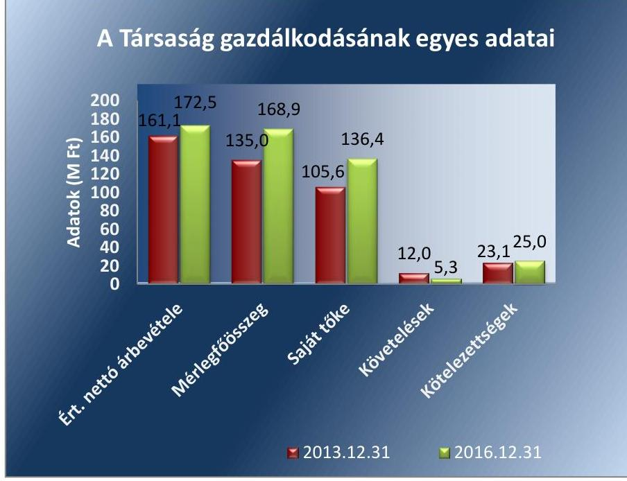

*Forrás: A Társaság 2013. és 2016. éves beszámolói*

---

A Társaság állományi létszáma a 2013-2016. között 21 fơről 16 főre csökkent.

A Társaság a 2013-2016. években nem minősült kormányzati szektorba sorolt szervezetnek.

A Társaság legfőbb szervének feladatait az Önkormányzat képviselőtestülete látta el. A Társaság élén ügyvezető áll, munkáját három tagú Felügyelőbizottság ${ }^{6}$ ellenőrizte. Az ügyvezető személye az ellenőrzött időszakban 2015. évben változott.

Az Önkormányzatnál az ellenőrzött időszakban a polgármester személye nem változott, a jegyző jogviszonya 2015. december 12-vel megszűnt, 2016. április 4-ig az aljegyző látta el a jegyzői feladatokat, az új jegyző kinevezéséig.

---

# AZ ELLENŐRZÉS HÁTTERE, INDOKOLTSÁGA 

Az önkormányzatok többségi tulajdonában álló gazdasági társaságok ellenőrzése kiemelten fontos a vagyon megőrzése, megóvása érdekében, valamint a kormányzati szektor elszámolásaiban megjelenő önkormányzati tulajdonú gazdálkodó szervezetek esetében, amelyekkel szemben alapvető követelmény, hogy gazdálkodásuk, múködésük szabályszerű, az általuk szolgáltatott adatok minél megbízhatóbbak legyenek. A feladatellátás költségeinek, ráfordításainak alakulása a lakosság széles rétegét érinti.

Ellenőrzéseink feltárhatják, hogy az önkormányzat a feladatellátásához rendelt vagyon múködtetését a tulajdonostól elvárható gondossággal vé-gezte-e, a feladatot ellátó gazdasági társaság a létesítő okiratban, szolgáltatási szerződésben foglaltak betartásával biztosította-e a feladat ellátását. Az ellenőrzés eredményeként meghatározhatóvá válnak a költségvetési hiányt befolyásoló szervezetek kockázatai, lehetővé válik ezen kockázatok csökkentése. Az ellenőrzés rávilágíthat arra, hogy a gazdasági társaság a vagyon használatával biztosította-e a szolgáltatás folytatásának feltételeit, az önkormányzat tulajdonosi felügyelete hozzájárult-e a szabályszerű gazdálkodáshoz és feladatellátáshoz. A megállapítások alapján megfogalmazott számvevőszéki javaslatok hasznosítása elősegítheti a meglévő hibák megszüntetését. A jó gyakorlatok bemutatásával az ÁSZ hozzájárulhat a követendő megoldások megismertetéséhez, terjesztéséhez.

---

# A JELENTÉS LÉNYEGES KÉRDÉSKÖREI 

1.- A tulajdonosi joggyakorlás szabályszerű volt-e?
2.- A gazdasági társaság gazdálkodása, vagyongazdálkodási tevékenysége, bevételeinek és ráfordításainak elszámolása szabályszerű volt-e?

---

# AZ ELLENŐRZÉS HATÓKÖRE ÉS MÓDSZEREI 

## Az ellenőrzés típusa

Megfelelőségi ellenőrzés.

## Az ellenőrzött időszak

2013. január 1-től 2016. december 31-ig

## Az ellenőrzés tárgya

Az önkormányzatok - többségi tulajdonában lévő gazdasági társaságok feletti - tulajdonosi joggyakorlása, valamint a gazdasági társaságok gazdálkodásának szabályozottsága és szabályszerűsége.

Az ellenőrzés kiterjedt minden olyan körülményre és adatra, amely az ÁSZ ${ }^{7}$ jogszabályban meghatározott feladatainak teljesítéséhez, valamint a program végrehajtása folyamán felmerült újabb összefüggések feltárásához szükséges volt.

## Az ellenőrzött szervezet

Budapest Főváros XX. kerület Pesterzsébet Önkormányzata és az INTEGRIT-XX. Városüzemeltetési-, Szervező-, Fejlesztő- és Szolgáltató Kft.

## Az ellenőrzés jogalapja

Az ellenőrzés jogszabályi alapját az ÁSZ tv. ${ }^{8}$ 1. § (3) bekezdése és 5. § (3)-(4)-(5) bekezdései képezte.

## Az ellenőrzés módszerei

Az ellenőrzést a nemzetközi standardokat irányadónak tekintve az ellenőrzési program ellenőrzési kérdései, az ellenőrzött időszakban hatályos jogszabályok, az ellenőrzés szakmai szabályok és módszertanok figyelembe vételével végeztük.

Az ellenőrzés ideje alatt az ellenőrzött szervezettel történő kapcsolattartást az ÁSZ Szervezeti és Müködési Szabályzatának vonatkozó előírásai alapján biztosítottuk.

Az ellenőrzési kérdések megválaszolásához szükséges bizonyítékok megszerzése a következő ellenőrzési eljárások alkalmazásával történt:

---

megfigyelés, kérdésfeltevés (információkérés), összehasonlítás, valamint elemző eljárás. Az ellenőrzési bizonyítékként felhasználható adatforrások közé tartoztak egyrészt az ellenőrzési programban felsorolt adatforrások, másrészt adatforrás lehet még minden - az ellenőrzés folyamán - feltárt, az ellenőrzés szempontjából információkat tartalmazó dokumentum.

Az ellenőrzést a kérdésekre adott válaszok kiértékelésével, valamint a megjelölt adatforrások, a csatolt tanúsítványok felhasználásával, továbbá az adott időszakban hatályos jogszabályok figyelembe vételével folytattuk le.

A bevételek és ráfordítások elszámolása, valamint a vagyonnyilvántartás terén a szabályszerű működést véletlen mintavétellel ellenőriztük.

A mintavétellel ellenőrzött területek esetében minden egyes tétel vonatkozásában a szabályszerűségre vonatkozó kérdéseket tettünk fel, amelyek eredménye összesítésre került. Az ellenőrzött minták alapján a sokaságban előforduló átlagos hibaarányt becsültük. „Szabályszerűnek" értékeltünk egy ellenőrzött területet, amennyiben 95\%-os bizonyossággal a teljes sokaságban az átlagos hibaarány legfeljebb 10\%, nem megfelelőnek, amennyiben 10\%-nál magasabb arányt képviselt. A ráfordítások elszámolására és a vagyonnyilvántartásra vonatkozó véletlen mintavételt kockázati alapú kiválasztással egészítettük ki, amelynek során évente a három legnagyobb összegű tételt választottuk ki.

---

# 1. A tulajdonosi joggyakorlás szabályszerű volt-e? 

Összegző megállapítás Az Önkormányzat tulajdonosi joggyakorlása szabályszerű volt.

A TULAJDONOSI JOGOK GYAKORLÁSÁT az Önkormányzat a Társaság Alapító Okirat ${ }_{1-7}{ }^{9}$, továbbá a feladatellátás kapcsán megkötött Megbízási szerződés keretein belül szabályozta. Az Alapító Okirat ${ }_{1-7}$, a Gt. ${ }^{10}$ és a Ptk. ${ }_{2}{ }^{11}$ jogszabályi előírásaival összhangban szabályozta a Társaság feladat és hatásköreit.

A FELÜGYELŐBIZOTTSÁG a Taktv. ${ }^{12}$ köztulajdonban álló gazdasági társaságokra vonatkozó előírásaival összhangban, ellenőrizte a Társaság gazdálkodását. A felügyelőbizottság ügyrendjét a Képviselő-testület 2015. május 7-én hagyta jóvá, így a Gt. 34. § (4) bekezdésével és a Ptk. 2 3:122. § (3) bekezdésével ellentétesen 2015. május 6-áig ügyrend nélkül működött. A felügyelőbizottság a Gt. 35. § (1) bekezdése, Ptk. 2 3:27. § (1) bekezdése alapján meghatározott ellenőrzési feladatainak eleget tett.

JAVADALMAZÁSI SZABÁLYZATTAL1-3 ${ }^{13}$ a Társaság rendelkezett, amely megfelelt a Taktv. 5. § (3) bekezdése előírásainak. A javadalmazási szabályzatot az Önkormányzat határozatban hagyta jóvá.

A TÁRSASÁG ÉVES BESZÁMOLÓIT a Képviselő-testület a Gt. és a Ptk. ${ }_{1}$ előírásaival összhangban a felügyelőbizottság írásbeli jelentésének ismeretében tárgyalta meg és alapítói határozatban döntött a beszámolók elfogadásáról és az éves eredmény felosztásáról.

A Társaságnál a Számv. tv. ${ }^{14}$ előírásai alapján nem volt kötelező könyvvizsgáló foglalkoztatása, de az Alapító Okirat ${ }_{1-7}$-ban foglaltaknak megfelelően a könyvvizsgálói feladatok ellátására a Társaság a tulajdonos által kiválasztott könyvvizsgálót alkalmazta.

AZ ÖNKORMÁNYZAT BELSŐ ELLENŐRZÉSE a 20132016. években két alkalommal ellenőrizte a Társaság tevékenységét. Az Önkormányzat az ellenőrzés megállapításaira tett intézkedéseket figyelemmel kísérte.

---

# 2. A gazdasági társaság gazdálkodása, vagyongazdálkodási tevékenysége, bevételeinek és ráfordításainak elszámolása szabályszerű volt-e? 

Összegző megállapítás

A Társaság számviteli szabályozottsága és gazdálkodása nem felelt meg a jogszabályi előírásoknak. A Társaság vagyongazdálkodása szabályszerű volt. A közérdekú adatok jogszabályi előírás szerinti közzétételéről nem gondoskodott.
2.1. számú megállapítás

A Társaság gazdálkodásának szabályozottsága nem felelt meg a jogszabályi előírásoknak.

A TÁRSASÁG SZÁMVITELI POLITIKÁVAL ${ }_{1,2}{ }^{15}$ rendelkezett, azonban a Számv. tv. 2015. július 4-étől hatályos 14. § (4) bekezdése ellenére nem határozta meg a kivételes nagyságú vagy előfordulású bevételek és ráfordítások körét.

A Társaság számlarendje ${ }_{1,2}{ }^{16}$ a 2013-2015. években a Számv. tv. 161. § (2) bekezdése ellenére nem tartalmazta egyes alkalmazásra kijelölt főkönyvi számlák számlajelét és megnevezését, a számla értéke növekedésének és csökkenésének jogcímeit.

A Társaság rendelkezett a Számv. tv. előírásainak megfelelő leltározási szabályzattal ${ }^{17}$, értékelési szabályzattal ${ }_{1,2}{ }^{18}$ és pénzkezelési szabályzat$\mathrm{tal}_{3-5}{ }^{19}$.
2.2. számú megállapítás

A Társaság gazdálkodása a személyi jellegú ráfordítások és a bevételek elszámolásának hiányosságai miatt nem volt szabályszerű. A vagyonnyilvántartások vezetése és a szolgáltatások árának meghatározása szabályszerű volt.

AZ ANYAGJELLEGŰ RÁFORDÍTÁSOK, valamint az egyéb, a rendkívüli és a pénzügyi műveletek ráfordításainak elszámolása szabályszerű volt.

A SZEMÉLYI JELLEGŰ RÁFORDÍTÁSOK elszámolása nem volt szabályszerű, mert a havi bérelszámolást több esetben nem támasztották alá a Számv. tv. 165. § (2) bekezdésének és 166. § (2) bekezdésének, valamint a számlarend ${ }_{1,2} 4 / \mathrm{a}$. melléklet Bizonylati album 4. pontjában foglaltaknak megfelelő hiteles bizonylatokkal:
$\longrightarrow$ a havi bérszámfejtés alapjául szolgáló jelenléti ív és havi bérösszesítő hiányzott, vagy nem tartalmazott vezetői igazolást,
$\longrightarrow$ a számfejtett bruttó alapbér nem felelt meg a munkaszerződésben foglalt összegnek,
$\longrightarrow$ a jutalom, valamint a túlórára elszámolt bér alapbizonylatai nem álltak rendelkezésre.

AZ ÉRTÉKCSÖKKENÉS ELSZÁMOLÁSA szabályszerű volt, megfelelt a Számv. tv. és a Számviteli politika ${ }_{1,2}$ előírásainak.

---

A BEVÉTELEK ELSZÁMOLÁSA nem volt szabályszerű, mert a közös képviseleti díjakból származó bevételek számviteli nyilvántartásba történő bejegyzésének alapjául szolgáló bizonylatok a kiszámlázott összeg tekintetében a Számv. tv. 166. § (2) bekezdésében foglaltak ellenére nem voltak megbízhatóak, ezáltal nem támasztották alá az elszámolt bevételek összegét.

A SZOLGÁLTATÁSOK ÁRÁNAK meghatározása összhangban volt a vonatkozó önkormányzati rendeletekkel és határozatokkal.

# A VAGYONHOZ KAPCSOLÓDÓ NYILVÁNTARTÁ- 

SOKAT a Számv. tv. előírásainak megfelelően vezették. Az éves beszámolóban és a számviteli nyilvántartásokban szereplő vagyonelemek állományát szabályszerűen, a Számv. tv. előírásai és a leltározási szabályzatban foglaltak alapján elkészített leltárral alátámasztották.
2.3. számú megállapítás

A Társaság éves beszámoló készítési, letétbe helyezési és közzétételi kötelezettségeit, valamint tulajdonosi joggyakorló felé történő beszámolási kötelezettségeit teljesítette. A közérdekú adatok jogszabályi előírás szerinti közzétételéről nem gondoskodott.

AZ EGYSZERŰSÍTETT ÉVES BESZÁMOLÓKAT a Társaság elkészítette, azok elfogadásakor a felügyelőbizottság írásos jelentése és a könyvvizsgálói jelentések rendelkezésre álltak. Az egyszerűsített éves beszámolókat és könyvvizsgálói jelentéseket a Társaság a Számv. tv. és az elektronikus úton történő letétbehelyezésről és közzétételről szóló rende-let ${ }^{20}$ előírásainak megfelelően határidőben letétbe helyezte és a céginformációs szolgálat honlapján közzétette.

A TEVÉKENYSÉGÉRE vonatkozó, Alapító Okirat ${ }_{1.7}$-ban és Megbízási szerződésben rögzített beszámolási kötelezettségeinek a Társaság a tulajdonosi joggyakorló felé eleget tett.

A KÖZÉRDEKŰ ADATOK közzétételére vonatkozó, az Info tv. ${ }^{21}$ 37. § (1) bekezdésében előírt közzétételi kötelezettségét a Társaság nem teljesítette, mert az Info tv. 1. mellékletének III.1. pontjában meghatározottak alapján a Számv. tv. szerinti beszámolóit sem a Társaság, sem a tulajdonos Önkormányzat internetes honlapján nem jelenítette meg.

---

# JAVASLATOK 

Az ÁSZ tv. 33. § (1) bekezdésében foglaltak értelmében az ellenőrzött szervezet vezetője köteles a jelentésben foglalt megállapításokhoz kapcsolódó intézkedési tervet összeállítani és azt a jelentés kézhezvételétől számított 30 napon belül az ÁSZ részére megküldeni. Amennyiben az ellenőrzött szervezet vezetője nem küldi meg határidőben az intézkedési tervet, vagy továbbra sem elfogadható intézkedési tervet küld, az Állami Számvevőszék elnöke az ÁSZ tv. 33. § (3) bekezdése a) és b) pontjaiban foglaltakat érvényesítheti.

## INTEGRIT-XX. Városüzemeltetési-, Szervező-, Fejlesztő- és Szolgáltató Kft Ügyvezetőjének

1. Intézkedjen, hogy a Társaság számviteli politikája a jogszabályi előírásoknak megfeleljen.
(2.1. számú megállapítás 1. bekezdése alapján)
2. Intézkedjen, hogy a személyi jellegű ráfordítások számviteli nyilvántartásokban történő elszámolása a jogszabályban és a belső szabályozásban előírt követelményeknek megfelelően történjen.
(2.2. számú megállapítás 2. bekezdése alapján)
3. Intézkedjen, hogy a bevételek számviteli nyilvántartásokban történő elszámolása a jogszabályban előírt követelményeknek megfelelő bizonylatok alapján történjen.
(2.2. számú megállapítás 4. bekezdése alapján)
4. Gondoskodjon a jogszabályban előírtak szerint a közérdekü adatok közzétételéről.
(2.3. számú megállapítás 3. bekezdése alapján)

---

# MELLÉKLETEK 

- I. SZ. MELLÉKLET: ÉRTELMEZŐ SZÓTÁR
gazdasági társaság
gazdálkodó szervezet
kormányzati szektorba sorolt egyéb szervezet
nemzeti vagyon
vagyonkezelő

A Ptk. ${ }_{2}$ 3:88. § (1) bekezdése szerint „a gazdasági társaságok üzletszerű közös gazdasági tevékenység folytatására, a tagok vagyoni hozzájárulásával létrehozott, jogi személyiséggel rendelkező vállalkozások, amelyekben a tagok a nyereségből közösen részesednek, és a veszteséget közösen viselik".
A Ptk. ${ }^{22}$ 685. § c) pontja szerint gazdálkodó szervezet:
„az állami vállalat, az egyéb állami gazdálkodó szerv, a szövetkezet, a lakásszövetkezet, az európai szövetkezet, a gazdasági társaság, az európai részvénytársaság, az egyesülés, az európai gazdasági egyesülés, az európai területi együttmüködési csoportosulás, az egyes jogi személyek vállalata, a leányvállalat, a vízgazdálkodási társulat, az erdő birtokossági társulat, a végrehajtói iroda, az egyéni cég, továbbá az egyéni vállalkozó." (2014. 03.15-ig hatályos)
Az Áht. ${ }^{23}$ 3. § (2) és (3) bekezdésében foglaltakon kívül az Európai Közösséget létrehozó szerződéshez csatolt, a túlzott hiány esetén követendő eljárásról szóló jegyzőkönyv alkalmazásáról szóló 2009. május 25-i 479/2009/EK rendelet (a továbbiakban: 479/2009/EK rendelet) szerint a kormányzati szektorba sorolt szervezet (Áht. 1. § (12)) Nvtv. ${ }^{24}$ 1. § (2) bekezdése szerint többek között:
„az állam vagy a helyi önkormányzat kizárólagos tulajdonában álló dolgok, az a) pont hatálya alá nem tartozó, állam vagy a helyi önkormányzat tulajdonában lévő dolog,
az állam vagy a helyi önkormányzat tulajdonában lévő pénzügyi eszközök, továbbá az államot vagy a helyi önkormányzatot megillető társasági részesedések, az államot vagy a helyi önkormányzatot megillető bármely vagyoni értékkel rendelkező jogosultság, amelyet jogszabály vagyoni értékű jogként nevesít."
Az Nvtv. 3. § (1) bekezdés 19. pontja szerint:
vagyonkezelő:
a) az állam tulajdonában álló nemzeti vagyon tekintetében:
aa) költségvetési szerv,
ab) helyi önkormányzat, önkormányzati társulás,
ac) önkormányzati intézmény,
ad) köztestület,
ae) az állam, az aa)-ac) alpontban meghatározott személyek együtt vagy külön-külön 100\%-os tulajdonában álló gazdálkodó szervezet,
af) az ae) alpont szerinti gazdálkodó szervezet 100\%-os tulajdonában álló gazdálkodó szervezet,
ag) a törvény által kijelölt egyedileg meghatározott jogi személy.
b) a helyi önkormányzat tulajdonában álló nemzeti vagyon tekintetében:
ba) önkormányzati társulás,
bb) költségvetési szerv vagy önkormányzati intézmény,
bc) köztestület,
bd) az állam, a helyi önkormányzat, a ba)-bb) alpontban meghatározott személyek együtt vagy külön-külön 100\%-os tulajdonában álló gazdálkodó szervezet,
be) a bd) alpont szerinti gazdálkodó szervezet 100\%-os tulajdonában álló gazdálkodó szervezet.
c) az egyházi jogi személy a tevékenysége ellátásához szükséges nemzeti vagyon tekintetében.

---

.

---

# FÜGGELÉK: ÉSZREVÉTELEK 

A jelentéstervezetet a Számvevőszék 15 napos észrevételezésre megküldte az ellenőrzött szervezetek vezetőinek az ÁSZ tv. 29. §* (1) bekezdése előirásának megfelelően.

Az ÁSZ a jelentéstervezetet észrevételezésre megküldte Budapest Főváros XX. kerület Pesterzsébet Önkormányzata polgármesterének, valamint az INTEGRIT-XX. Városüzemeltetési-, Szervező-, Fejlesztő- és Szolgáltató Kft. ügyvezetőjének.
Budapest Főváros XX. kerület Pesterzsébet Önkormányzata polgármestere a jelentéstervezetre nem tett észrevételt.
A függelék - mellékletek nélkül - tartalmazza az INTEGRIT-XX. Városüzemeltetési-, Szervező-, Fejlesztő- és Szolgáltató Kft. ügyvezetőjének észrevételeit, illetve az el nem fogadott észrevételek elutasitásának indoklását.

[^0]
[^0]:    * 29. § (1) Az Állami Számvevőszék az ellenőrzési megállapításait megküldi az ellenőrzött szervezet vezetőjének vagy az általa megbízott személynek, és annak, akinek személyes felelősségét állapította meg.
    (2) Az ellenőrzött szervezet vezetője és a felelősként megjelölt személy az ellenőrzés megállapításaira tizenöt napon belül írásban észrevételt tehet.
    (3) Az Állami Számvevőszék az észrevételre a beérkezésétől számított harminc napon belül írásban válaszol. A figyelembe nem vett észrevételeket köteles a jelentésben feltüntetni, és megindokolni, hogy azokat miért nem fogadta el.

---

INTEGRIT-XX. Kft.
Ügyintézés helyszíne: 1204. Bp. Tátra téri új vásárcsarnok
Levelezési cím: PE1 1725. Pf. 39.
Telefon (06 1) 285-3081
Fax (06 1) 285-1691
E-mail info@integritxx.hu
Web www.integritxx.hu
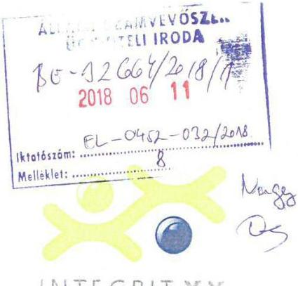

Ikt.szám : IG-551281/2018

# Állami Számvevőszék   Domonkos László   Elnök úr részére 

## Budapest

Apáczai Csere János u. 10.
1052
Tárgy: EL-0452-029/2018. iktatószámú számvevőszéki jelentéstervezetre észrevétel
Tisztelt Elnök Úr!
Az EL-0452-029/2018. iktatószámú, „Az önkormányzatok gazdasági társaságai- Az önkormányzatok többségi tulajdonában lévő gazdasági társaságok gazdálkodásának ellenőrzése- INTEGRIT-XX. Városüzemeltetési-, Szervező-, Fejlesztő- és Szolgáltató Kft. „ címmel készült számvevőszéki jelentéstervezet megállapításira az alábbi észrevételeket tesszük.

### 2.1. számú megállapítás

A Társaság gazdálkodásának szabályozottsága nem felelt meg a jogszabályi előírásoknak. A Társaság Számviteli Politikával rendelkezett, azonban a Számv.tv.2015. július 4-étől hatályos 14. §. (4) bekezdése ellenére nem határozta meg a kivételes nagyságú vagy előfordulású bevételek és ráfordítások körét.

A megállapítással nem értünk egyet, mert a Társaság 2016.január 1-jól hatályos Számviteli politikájának 7. pontja (11. oldal) már tartalmazza a kivételes nagyságú vagy előfordulású bevételek és ráfordítások körét.

A Társaság számlarendje a 2013-2015. években a Számv. tv. 161. §. (2) bekezdése ellenére nem tartalmazta egyes alkalmazásra kijelölt főkönyvi számlák számlajelét és megnevezését, a számla értéke növekedésének és csökkenésének jogcímeit.

A megállapítással nem értünk egyet, mivel a Társaság 2013-2015. években hatályos Számlarendje teljesen megegyező formában tartalmazza a 2016. január 1-jétől hatályos

---

Számlarendhez hasonlóan a főkönyvi számlák számlajelét, a számla értéke növekedésének és csökkenésének jogcímeit, mint számlaösszefüggések.

# 2.2 számú megállapítás

A személyi jellegű ráfordítások elszámolása nem volt szabályszerű, mert a havi bérelszámolást több esetben nem támasztották alá a Számv. tv. 165. §. (2) bekezdésének és 166. §. (2) bekezdésének, valamint a számlarend 4/a melléklet Bizonylati album 4. pontjában foglaltaknak megfelelő hiteles bizonylatokkal:

|  no. | néc. | bekért
tólózat | bruttó
havi
alapjául | bruttó
jutalom | bruttó
külön | meglapzás | munkaszerződés
/másbaltás
tólózata | jelenléti | önállozásitól | túlóra
elszámolás | jutalom
bizonylata  |
| --- | --- | --- | --- | --- | --- | --- | --- | --- | --- | --- | --- |
|  2013.01 |  |  |  |  |  |  |  |  |  |  |   |
|  1 |  | 2013.01 | 161000 |  |  |  | 2012.08.16 |  |  |  |   |
|  2 |  | 2013.01 | 986000 |  |  |  | 2013.12.20 |  |  |  |   |
|  3 |  | 2013.01 | 110000 |  |  |  | 2013.01.17 |  |  |  |   |
|  4 |  | 2013.04 | 180000 |  |  |  | 2012.08.01 |  |  |  |   |
|  5 |  | 2013.06 | 188000 |  |  |  | 2013.01.30 |  |  |  |   |
|  6 |  | 2013.06 | 170000 |  |  |  | 2013.01.17 |  |  |  |   |
|  7 |  | 2013.06 | 110000 |  |  |  | 2013.01.17 |  |  |  |   |
|  8 |  | 2013.08 | 180000 |  |  |  | 2013.12.20 |  |  |  |   |
|  9 |  | 2013.10 | 206000 |  |  |  | 2013.12.20 |  |  |  |   |
|  10 |  | 2013.10 | 220000 |  |  |  | 2012.08.01 |  |  |  |   |
|  2014.01 |  |  |  |  |  |  |  |  |  |  |   |
|  11 |  | 2014.01 | 220000 |  |  |  | 2012.08.01 |  |  |  |   |
|  12 |  | 2014.03 | 110000 |  |  |  | 2013.01.17 |  |  |  |   |
|  13 |  | 2014.08 | 150000 |  |  |  | 2013.12.01 |  |  |  |   |
|  14 |  | 2014.09 | 170000 |  |  |  | 2013.10.01 |  |  |  |   |
|  15 |  | 2014.10 | 270000 |  |  |  | 2014.10.10 |  |  |  |   |
|  16 |  | 2014.10 | 280000 |  |  |  | 2013.01.21 |  |  |  |   |
|  17 |  | 2014.11 | 290000 |  |  |  | 2014.02.21 |  |  |  |   |
|  18 |  | 2014.11 | 198000 |  |  |  | 2013.01.30 |  |  |  |   |
|  19 |  | 2014.12 | 30000 |  |  |  | 2014.02.20 |  |  |  |   |
|  2015.01 |  |  |  |  |  |  |  |  |  |  |   |
|  21 |  | 2015.01 | 290000 |  |  |  | 2014.02.21 |  |  |  |   |
|  22 |  | 2015.01 | 188000 |  |  |  | 2013.01.30 |  |  |  |   |
|  23 |  | 2015.02 | 270000 |  |  |  | 2014.02.21 |  |  |  |   |
|  24 |  | 2015.03 | 55000 |  |  |  | 2014.02.27 |  |  |  |   |
|  25 |  | 2015.04 | 80002 |  |  |  | 2013.01.21 |  |  |  |   |
|  26 |  | 2015.05 | 180000 |  |  |  | 2013.01.11 |  |  |  |   |
|  27 |  | 2015.05 | 25000 |  |  |  | 2013.01.17 |  |  |  |   |
|  28 |  | 2015.06 | 290000 |  |  |  | 2013.01.03 |  |  |  |   |
|  29 |  | 2015.06 | 450000 |  |  |  | 2013.01.03 |  |  |  |   |
|  30 |  | 2015.11 | 220000 |  |  |  | 2014.02.27 |  |  |  |   |
|  31 |  |  |  |  |  |  | 2014.02.19 |  |  |  |   |
|  32 |  | 2016.01 | 258000 |  |  |  | 2014.06.30 |  |  |  |   |
|  33 |  | 2016.09 | 275000 |  |  |  | 2014.06.30 |  |  |  |   |
|  34 |  | 2016.11 | 270000 |  |  |  | 2014.02.19 |  |  |  |   |
|  35 |  | 2016.11 | 310000 |  |  |  | 2014.06.30 |  |  |  |   |
|  36 |  | 2016.12 | 258000 |  |  |  | 2013.12.20 |  |  |  |   |
|  37 |  | 2016.12 | 275000 |  |  |  | 2014.06.30 |  |  |  |   |

- havi bérszámfejtés alapjául szolgáló jelenléti ív és havi bérösszesítő hiányzott, vagy nem tartalmazott vezetői igazolást

A bekért 38 db bérjegyzék és annak alapbizonylatai közül a havi bérszámfejtés alapjául szolgáló jelenléti ívről kizárólag az ügyvezető igazgató és a mellékállásban, részmunkaidőben foglalkoztatott 3 fő hiányzott.

Az ügyvezető igazgató, Potoczky Attila munkaszerződésének 5. pontja szerint kötetlen munkarend szerint látja el feladatait, így jelenléti ív vezetésére az Mt. 96.§. (3) bekezdése szerint nem kötelezett, az ügyvezető a feltöltött óraösszesítőn szerepel.

---

A 3 fő mellékállásban alkalmazott munkavállaló nem írta alá a jelenléti ívet és közülük 2 fő nem szerepelt az óraösszesítőn.

Vezetői igazolást a jelenléti íven a Mt. 134. §. nem írja elő. A bérszámfejtés jogosságát a kifizetés alapbizonylatának utalványozása igazolja. A jövőben gondoskodunk a vezetői aláírás meglétéről a jelenléti íveken.

- a számfejtett bruttó alapbér nem felelt meg a munkaszerződésben foglalt összegnek.

A feltöltött 17 db munkaszerződés közül két esetben, munkavállaló esetében a munkaszerződés módosítások szkennelési hiba miatt nem hiánytalanul lettek feltöltve. A két munkavállaló munkaszerződését és a hiányzó módosítást mellékeljük, ami alapján látszik, hogy a bekért időszakban a munkaszerződésnek megfelelő bruttó alapbér került számfejtésre.

- a jutalom, valamint a túlórára elszámolt bér alapbizonylatai nem álltak rendelkezésre.

A feltöltött 35 db bérjegyzék közül 2 db tartalmazott túlórát és 3 db jutalmat.

# Túlóra elszámolás: 

2015.06.havi munkabér elszámolása tartalmazott túlóra elszámolást, melynek alapbizonylata a 2015.05.31-ig munkaidőn túl megtartott társasházi közgyűlések túlóráinak összesítése, vezetői aláírással ellátva. Ez a dokumentum a bérjegyzékkel együtt feltöltésre került.

## Jutalom elszámolás:

A 2015. év végi jutalom kifizetésének alapbizonylatát, a jutalom kifizetés listáját, mint alapbizonylat feltöltöttük, azonban nem a vezető által aláírt példányt, ezt most pótoljuk és mellékeljük egyéni értesítőjét is. A kifizetés bizonylata feltöltésre került a többi bizonylattal.

A 2016. év végi jutalom kifizetésének alapbizonylatának csatolása szkennelési hiba miatt lemaradt, most pótoljuk és mellékeljük . . . egyéni értesítőjét is. A kifizetés bizonylata feltöltésre került a többi bizonylattal.

---

A bevételek elszámolása nem volt szabályszerű, mert a közös képviseleti díjakból származó bevételek számviteli nyilvántartásba történő bejegyzésének alapjául szolgáló bizonylatok a kiszámlázott összeg tekintetében a Számv. tv. 166. §. (2) bekezdésében foglaltak ellenére nem voltak megbízhatóak, ezáltal nem támasztották alá az elszámolt bevételek összegét.

|  Szz. | társasház neve | 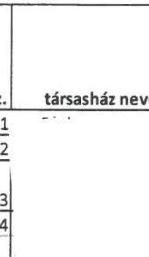 | megbizási szerződésben szereplő nettó képviseleti dij | 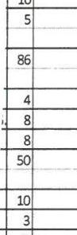 | nettó számított összeg | 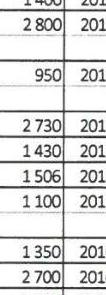 | képviselő dij elfogadás kezdete | 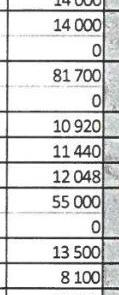 | számlázási hónap | nettó eltérés  |
| --- | --- | --- | --- | --- | --- | --- | --- | --- | --- | --- |
|  1 |  | 10 | 1000 | 2016.05.23. | 10000 | 2014.06.01. | 9470 | 2015.11. | 520 |   |
|  2 |  | 7 | 1917 | 2016.03.10. | 13410 | 2013.01.01. | 11160 | 2015.12. | 1910 |   |
|   |  |  |  |  |  |  | 14000 | 2016.03. |  |   |
|  3 |  | 10 | 1400 | 2016.05.31. | 14000 | 2016.01.15. | 21000 | 2016.01.15-02.29. | 0 |   |
|  4 |  | 5 | 2800 | 2016.03.16. | 14000 |  | 14000 | 2016.03. | 0 |   |
|   |  |  |  |  | 0 | 2016.01.01. | 3500 | 2016.01-02. |  |   |
|  5 |  | 86 | 950 | 2016.03.02. | 81700 |  | 81700 | 2016.03. | 0 |   |
|   |  |  |  |  | 0 | 2016.01.01. | 20810 | 2016.01-02. |  |   |
|  6 |  | 4 | 2730 | 2016.03.30. | 10920 |  | 10920 | 2016.04. | 0 |   |
|  7 |  | 8 | 1430 | 2016.04.19. | 11440 |  | 11440 | 2016.07. | 0 |   |
|  8 |  | 8 | 1506 | 2016.02.23. | 12040 |  | 12050 | 2016.06. | 2 |   |
|  9 |  | 50 | 1100 | 2016.04.07. | 55000 |  | 55000 | 2016.06. | 0 |   |
|   |  |  |  |  | 0 | 2016.01.01. | 25000 | 2016.01-05. |  |   |
|  10 |  | 10 | 1350 | 2016.03.30. | 13500 |  | 13500 | 2016.11. | 0 |   |
|  11 |  | 3 | 2700 | 2016.04.04. | 8100 | 2013.06.01. | 7100 | 2014.02. | $-820$ |   |
|  12 |  | 7 | 1486 | 2016.04.27. | 10402 |  | 10400 | 2014.08. | $-3$ |   |
|  13 |  | 3 | 2500 | 2016.03.17. | 7500 | 2012.06.01. | 6760 | 2014.08. | $-740$ |   |

Társaságunk mindig ügyel arra, hogy számviteli bizonylatai a Számv. tv. 166. §. (2) bekezdésében foglaltaknak megfeleljen, azok hitelesek és megbízhatóak legyenek. A kiszámlázott képviseleti díjak minden esetben a Társasházak által elfogadott éves költségvetés tervezet alapján kerülnek kiszámlázásra. A feltöltésre került 60 db bevételi bizonylat és alapbizonylatai közül 13 db , ami közös képviseleti díj számlázásra vonatkozik. Ezekhez a számlákhoz a kifizetést igazoló bankszámla kivonat, illetve pénztárbizonylat valamint a társasházzal kötött Megbízási szerződések lettek csatolva. A 2016.évben az önkormányzati ellenőrzés hatására utólag (nem az eredeti megválasztáskor) írásba foglalt Megbízási szerződések az akkor, 2016.évben hatályos albetétenkénti képviseleti díjat tartalmazzák. Természetesen a korábbi években, 2013-2015. években kiállított számlák a díjemelések miatt eltérhetnek a 2016. évi díjaktól, ez a feltöltött számlák közül 4 eset.

A Társaság számlázási gyakorlata szerint 2012. decemberéig a Kft. által fejlesztett és folyamatosan karbantartott Integrált Számviteli rendszer alapján a képviseleti díj számlák tömeges elkészítése úgynevezett ismétlődő számlák automatikus havi generálása alapján történt. Az esetleges díjmódosítások pedig az adott ház kezelőjének feladása alapján történtek, mely feladásokat a képviselő az általa megtartott közgyűlések jegyzőkönyveiből állította össze. 2013. januárjától a Integrált Számviteli Rendszer a havi ismétlődő számlákat (képviseleti díjak, bérleti díjak) már Szerződés nyilvántartásba vette és abból havonta tömegesen generálja mindaddig, míg a szerződés egy jegyzőkönyv, illetve szerződés módosítás alapján nem változik.

- 0003595/15. sorszámú,

Társasház nevére kiállított számlán a 2014.évben elfogadott terv szerinti $11.982 \mathrm{Ft} /$ hó bruttó összeg szerepel, az éves elfogadott költség tervezetben pedig ennek tizenkétszerese kerekítve, 143.800 Ft .

---

- 0000530/14. sorszámú,

Társasház nevére kiállított számlán a 2012.évben elfogadott terv szerinti $9.246 \mathrm{Ft} /$ hó bruttó összeg szerepel, az éves elfogadott költség tervezetben pedig ennek tizenkétszerese kerekítve, 111.000 Ft.

- 0003732/15. sorszámú,

Társasház nevére kiállított számlán a 2012. évben elfogadott terv szerinti $14.605 \mathrm{Ft} /$ hó bruttó összeg szerepel, az éves elfogadott költség tervezetben pedig ennek tizenkétszerese kerekítve, 111.000 Ft.

- 0002578/14. sorszámú, nevére kiállított számlán a 2012. évben elfogadott terv szerinti $8.585 \mathrm{Ft} /$ hó bruttó összeg szerepel, az éves elfogadott költség tervezetben pedig ennek tizenkétszerese kerekítve, 103.000 Ft.
- Mellékeljük még a ${ }^{1}$ közös képviselő által kezelt házak összesítőjét is, melyen a képviseleti díj változásokat adta fel a számlázás részére.

A 3 db 2016. évi számla esetén pedig a különbözetek visszamenőlegesen 2016.01.01-től vannak leszámlázva, a változás elfogadásának időpontjától.

- 0001838/16. sorszámú,

Társasház nevére kiállított számlán a 100 Ft/albetét+ÁFA emelés lett visszamenőleg 2016.01.01-től elszámolva külön sorban.

- 0000666/16. sorszámú,

Társasház nevére kiállított számlán a 242 Ft/albetét+ÁFA emelés lett visszamenőleg 2016.01.01-től elszámolva külön sorban.

- 0000778/16. sorszámú,

Társasház nevére kiállított számlán a 350 Ft/albetét+ÁFA emelés lett visszamenőleg 2016.01.01-től elszámolva külön sorban.

# 2.3 számú megállapítás 

A közérdekü adatok közzétételére vonatkozó, az Info tv. 37. §. (1) bekezdésében előírt közzétételi kötelezettségét a Társaság nem teljesítette, mert az Info tv. 1. sz. mellékletének III. 1. pontjában meghatározottak alapján a Számv. tv. szerinti beszámolóit sem a Társaság, sem a tulajdonos Önkormányzat internetes honlapján nem jelenítette meg.

A Társaság saját honlapján a Számv. tv. szerinti beszámolóinak megjelenítését az www.ebeszamolo.hu honlapra való közvetlen eléréssel (linkkel) teljesítette eddig, de a jövőben gondosodunk, hogy a beszámolók közvetlenül a honlapon megjelenjenek.

Kérjük észrevételeink figyelembe vételét és ezek alapján a jelentéstervezet módosítását.

Budapest, 2018. június 4.
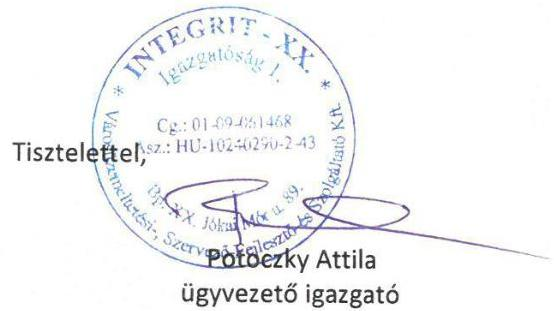

---

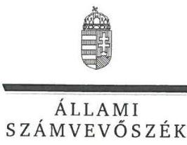

ELNÖK

Ikt.szám: EL-0452-034/2018.

# Potoczky Attila úr 

ügyvezető

INTEGRIT-XX. Városüzemeltetési-, Szervező-, Fejlesztő- és Szolgáltató Kft.

## Budapest

## Tisztelt Ügyvezető Úr!

„Az önkormányzatok gazdasági társaságai - Az önkormányzatok többségi tulajdonában lévő gazdasági társaságok gazdálkodásának ellenőrzése - INTEGRIT-XX. Városüzemeltetési-, Szer-vezö-, Fejlesztő- és Szolgáltató Kft. " címmel készített számvevőszéki jelentéstervezetre tett észrevételeit köszönettel megkaptam.
Az Állami Számvevőszék észrevételekre vonatkozó álláspontjáról a felügyeleti vezető által készített részletes tájékoztatást csatoltan megküldöm.
Tájékoztatom Ügyvezető urat, hogy a számvevőszéki jelentésben - az Állami Számvevőszékről szóló 2011. évi LXVI. törvény 29. § (3) bekezdése alapján - a figyelembe nem vett észrevételeket szerepeltetjük annak megindoklásával, hogy azokat miért nem fogadtuk el.

Budapest, 2018. 06 . hó 29 nap
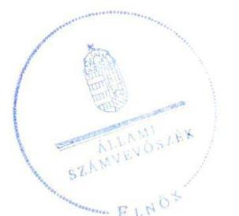

Tisztelettel:

Domokos László

Melléklet: Tájékoztatás az észrevételek kezeléséről

---

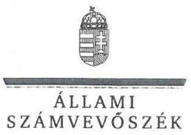

FELÜGYELETI VEZETŐ

Melléklet
Ikt.szám: EL-0452-034/2018.

# Tájékoztatás   az észrevételek kezeléséről 

„Az önkormányzatok gazdasági társaságai - Az önkormányzatok többségi tulajdonában lévő gazdasági társaságok gazdálkodásának ellenörzése - INTEGRIT-XX. Városüzemeltetési-, Szervezö-, Fejlesztő- és Szolgáltató Kft." címü jelentéstervezetre 2018. június 4-én tett (az Állami Számvevőszékhez 2018. június 11-én érkezett) észrevételeit áttekintettük, azok kezelésével kapcsolatban a következő tájékoztatást adom.

## 1. A jelentéstervezet 2.1. számú megállapítás 1. bekezdésére vonatkozó észrevétel:

Az észrevétel szerint a Társaság 2016. január 1-jétől hatályos Számviteli politikája tartalmazza a kivételes nagyságú vagy előfordulású bevételek és ráfordítások körét.
Az észrevétel nem megalapozott, azt nem fogadom el. A Társaság 2016. január 1-től hatályos Számviteli politikájának hivatkozott szakasza a számvitelről szóló 2000 . évi C. törvény (a továbbiakban: Számv. tv.) 14.§ (4) bekezdésében foglalt szabályozásnak nem felel meg, az nem a Számv. tv. tartalmi előírásainak megfelelő tartalmat rögzít, mivel csak a kivételes nagyságú bevételek, költségek, ráfordítások körét szabályozza, de a kivételes előfordulású bevételek, költségek, ráfordítások körét nem. A Társaság Számviteli politikájának szabályozása „a kivételes nagyságú vagy elöfordulású bevétel, költség, ráfordítás az a tétel, amely egyazon vevőtől, illetve szállítótól származik és egy éven belül eléri vagy meghaladja a nettó 18 millió forintot" meghatározást tartalmazza, tehát a szállítókkal és vevőkkel kapcsolatos értékösszeget rögzíti, ugyanakkor nem rendelkezik azon eseményekről, amelyek előfordulása kivételes, amelyek nem a szokásos üzletmenet részét képezik.

## 2. A jelentéstervezet 2.1. számú megállapítás 2. bekezdésére vonatkozó észrevétel:

Az észrevételben leírtak szerint a Társaság 2013-2015. években hatályos Számlarendje teljesen megegyező formátumban tartalmazza a 2016. január 1-től hatályos Számlarenddel a fökönyvi számlák számlajelét, a számla értéke növekedésének és csökkenésének jogcímeit.
Az észrevétel nem megalapozott, azt nem fogadom el. A Társaság 2013-2015. években hatályos Számlarendje nem tartalmazta egyes alkalmazásra kijelölt főkönyvi számlák számlajelét és megnevezését, a számla értéke növekedésének és csökkenésének jogcímeit. Nem tartalmazta például a 225 Irodaszerek fökönyvi számlát, melyet a Társaság ténylegesen használt a 2013-2015. években. A hiányosság a 2016. január 1-től hatályos számlarendben rendezésre került.

## 3. A jelentéstervezet 2.2. számú megállapítás 2. bekezdésére vonatkozó észrevételek:

Az észrevételben leírtak szerint a havi bérszámfejtés alapjául szolgáló jelenléti ívról az ügyvezető és a részmunkaidőben foglalkoztatott három fő hiányzott, közülük kettő nem szerepelt az óraöszszesítőn. Az ügyvezető jelenléti ív vezetésére nem kötelezett. A vezetői igazolást a jelenléti íven a munka törvénykönyvéről szóló 2012. évi I. törvény (a továbbiakban: Munka tv.) 134.§-a nem írja elő. A bérszámfejtés jogosságát a kifizetés alapbizonylatának utalványozása igazolja. Két

---

munkavállaló munkaszerződése nem hiánytalanul lett feltöltve, a hiányzó módosításokat mellékelik. A jutalom elszámolása során a vezető által aláirt példány, illetve az alapbizonylat csatolása lemaradt, most pótolják. A túlóra-elszámolás dokumentációja feltöltésre került.
Az észrevételek nem megalapozottak, azokat nem fogadom el. A Számv. tv. 165. § (2) bekezdése értelmében a számviteli (könyvviteli) nyilvántartásokba csak szabályszerűen kiállított bizonylat alapján szabad adatokat bejegyezni. A Számv. tv. 166. § (2) bekezdése értelmében a számviteli bizonylat adatainak alakilag és tartalmilag hitelesnek, megbízhatónak és helytállónak kell lennie. A munkaidő-nyilvántartás a személyi jellegű kifizetések teljesítésigazolásának alapdokumentuma, mivel ez alapján lehet megállapítani és ellenőrizni az adott napon, az adott hónapban vagy az adott időszakban teljesített munkaórák mértékét. Az észrevétel nem cáfolta, hanem megerősítette a megállapítást, ezért annak törlése, vagy módosítása nem indokolt.
A jelentéstervezet nem tartalmaz arra nézve megállapítást, hogy az ügyvezetőnek jelenléti ívet kellett volna vezetnie. A Munka tv. 134. § (1) bekezdése a munkáltató kötelezettségévé teszi a munkaidő-nyilvántartás vezetését. Amennyiben a munkáltató átengedi a napi teljesített munkaidő vezetését a dolgozónak, akkor a munkaidő-nyilvántartás szabályszerű vezetésének ellenőrzése is a munkáltató kompetenciájába esik, a munkáltatónak a munkavállaló által vezetett adatokat ellenőriznie kell és el kell fogadnia (pl. aláímia). Ennek megfelelően a Társaság számlarendje 4. számú, a Számviteli bizonylatokról szóló melléklete meghatározza, hogy a jelenléti íveken történik a munkaidő igazolása. Az alkalmazott jelenléti ív formanyomtatványa szerint a munkavállalók adott napi jelenlétét az igazolónak aláírásával kellett volna ellátnia.
Az ÁSZ a V-1403-046/2016. iktatószámú, 2017. december 14-ai adatbekérő levele 2. mellékletében a személyi jellegű ráfordítások mintatételeinek ellenőrzéséhez kérte a kapcsolódó dokumentumokat. Ön a 2018. január 3-án kelt Teljességi és hitelességi nyilatkozatában nyilatkozott arról, hogy az adatbekérő levélben kért adatok kapcsán az ÁSZ részére átadott adatok, dokumentumok megbízhatóak, a bekért adatokra, dokumentumokra vonatkozóan teljes körű információt tartalmaznak, az átadott dokumentumok, adatok hiánytalanságáért teljes felelősséget vállalt.
Az észrevétellel szemben másik munkavállaló túlóra igazoló dokumentumainak hiányát állapította meg az ellenőrzés, így mivel az ellenőrzés számára nem került átadásra valamennyi bizonylat, a szabálytalanságot megállapítottuk.

# 4. A jelentéstervezet 2.2. számú megállapítás 4. bekezdésére vonatkozó észrevétel: 

Az észrevételben leírtak szerint a Társaság 2016-ban az önkormányzati ellenőrzés hatására utólag írásba foglalta a Megbízási szerződéseket, így a 2013-2015. években kiállított számlák eltérhetnek a 2016. évi díjaktól. Továbbá a Társaság számlázási gyakorlatáról tájékoztatott.
Az észrevétel nem megalapozott, azt nem fogadom el. A mintatételekhez mellékelt szerződésekben szerepelt, hogy a lakások közös képviseletének díja „albetét" egység alapján fizetendő. A közös képviseleti díjak kiküldött számláin azonban nem került feltüntetésre, hogy hány albetét alapján történt a számlázás, így a számla nem tartalmazta az összesítés alapjául szolgáló, a szerződésben meghatározott albetétek számát. A bizonylatok a kiszámlázott összeg tekintetében a Számv. tv. 166. § (2) bekezdésében foglaltak ellenére nem voltak megbízhatóak, ezáltal nem támasztották alá az elszámolt bevételek összegét.

---

# 5. A jelentéstervezet 2.3. számú megállapítás 3. bekezdésére vonatkozó észrevétel: 

Az észrevételben leírtak szerint a Társaság a Számv. tv. szerinti beszámolóinak megjelenítését a www.ebeszamolo.hu honlapra való közvetlen eléréssel teljesítette.
Az észrevétel nem megalapozott, azt nem fogadom el. Az információs önrendelkezési jogról és az információszabadságról szóló 2011. évi CXII. törvény 37. § (1) bekezdése értelmében a 33. § (3) bekezdésében meghatározott szervek tevékenységükhöz kapcsolódóan az 1. melléklet szerinti általános közzétételi listában meghatározott adatokat az 1. mellékletben foglaltak szerint közzéteszik. Az észrevétel nem cáfolta, hanem megerősítette a megállapítást, ezért annak törlése, vagy módosítása nem indokolt.
Tájékoztatom, hogy az ÁSZ megállapításai az Állami Számvevőszékről szóló 2011. évi LXVI. törvénynek megfelelően az ellenőrzés során bekért és az adatszolgáltatásra rendelkezésre álló határidőn belül rendelkezésre bocsátott dokumentumokon alapulnak. A bekért adatokra vonatkozó, 2018. január 3-ai keltezésű, az ügyvezető által adott teljességi és hitelességi nyilatkozat szerint az Állami Számvevőszék részére átadott dokumentumok a bekért adatokra, dokumentumokra vonatkozóan teljes körű információt tartalmaznak. Erre tekintettel a jelentéstervezetre adott észrevétele mellékleteként megküldött dokumentumokat a jelentésben nem tudjuk figyelembe venni, az intézkedést igénylő megállapítás módosítása, illetve törlése nem indokolt.
Budapest, 2018. OC hó 20 nap

Dr. Nagy Imre felügyeleti vezető

---

# RÖVIDÍTÉSEK JEGYZÉKE 

[^0]Budapest Főváros XX. kerület Pesterzsébet Önkormányzata
Budapest Főváros XX. kerület Pesterzsébet Önkormányzatának Képviselőtestülete
INTEGRIT-XX. Városüzemeltetési-, Szervező-, Fejlesztő- és Szolgáltató Kft.
Magyarország helyi önkormányzatairól szóló 2011. évi CLXXXIX. törvény (hatályos: 2012. január 1-jétől)
A Társaság és az Önkormányzat által kötött megbízási szerződés és módosításai a kényszerkezett társasházak ügyviteli feladatainak ellátásáról, valamint a piacüzemeltetési feladatok ellátásáról (hatályos: 2011. július 15-től)
A Társaság felügyelőbizottsága
Állami Számvevőszék
2011. évi LXVI. törvény az Állami Számvevőszékről (hatályos: 2011. július 1-jétől)

A Társaság Alapító okirata: (hatályos: 2012.október 16-tól, 2013.április 19-étől, 2013. május 1-jétől, 2014. december 1-jétől, 2015. június 5-étől, 2016. június 1-jétől, illetve 2016. június 15-étől)
2006. évi IV. törvény a gazdasági társaságokról (hatályos 2014. március 14-éig) 2013. évi V. törvény a Polgári Törvénykönyvről (hatályos: 2014. március 15-étől) 2009. évi CXXII. törvény a köztulajdonban álló gazdasági társaságok takarékosabb müködéséről (hatályos 2009. december 4-étől)
A Társaság javadalmazási szabályzata (hatályos 2011. június 1-jétől, 2013. szeptember 12-étől, illetve 2016. május 27-étől)
2000. évi C törvény a számvitelről (hatályos: 2001. január 1-jétől)

A Társaság számviteli politikája (hatályos 2010. július 1-jétől, illetve 2016. január 1-jétől)
A Társaság számlarendje (hatályos 2010. július 1-jétől, illetve 2016. január 1-jétől)
A Társaság leltározási szabályzata (hatályos 2012. július 1-jétől)
A Társaság értékelési szabályzata (hatályos 2011. július 1-jétől, illetve 2016. január 1-jétől)
A Társaság pénzkezelési szabályzata (hatályos 2012. december 1-jétől, 2015. április 1-jétől, hatályos 2015. június 30-ától, 2016. május 1-jétől, illetve 2016. október 6-ától)
11/2009. (IV. 28.) IRM-MeHVM-PM együttes rendelet a számviteli törvény szerinti beszámoló elektronikus úton történő letétbe helyezéséről és közzétételéről (hatályos: 2009. május 1-jétől)
2011. évi CXII. törvény az információs önrendelkezési jogról és az információszabadságról (hatályos: 2011. július 27-től)
1959. évi IV. törvény a Polgári Törvénykönyvről (közlönyállapot: 1959.VIII.11.) 2011. évi CXCV. törvény az államháztartásról (hatályos: 2011. december 31-étől) 2011. évi CXCVI. törvény a nemzeti vagyonról (hatályos: 2011. december 31-étől)

[^0]:    ${ }^{1}$ Önkormányzat
    ${ }^{2}$ Képviselő-testület
    ${ }^{3}$ Társaság
    ${ }^{4}$ Mótv.
    ${ }^{5}$ Megbízási szerződés
    ${ }^{6}$ felügyelőbizottság
    ${ }^{7}$ ÁSZ
    ${ }^{8}$ ÁSZ tv.
    ${ }^{9}$ Alapító Okirat ${ }_{1-7}$
    ${ }^{10}$ Gt.
    ${ }^{11}$ Ptk. 2
    ${ }^{12}$ Taktv.
    ${ }^{13}$ javadalmazási szabályzat ${ }_{1-3}$
    ${ }^{14}$ Számv. tv.
    ${ }^{15}$ számviteli politika ${ }_{1,2}$
    ${ }^{16}$ számlarend ${ }_{1,2}$
    ${ }^{17}$ leltározási szabályzat
    ${ }^{18}$ értékelési szabályzat ${ }_{1,2}$
    ${ }^{19}$ pénzkezelési szabályzat ${ }_{2-5}$
    ${ }^{20}$ elektronikus úton történő letétbehelyezésről és közzétételről szóló rendelet
    ${ }^{21}$ Info tv.
    ${ }^{22}$ Ptk. 1
    ${ }^{23}$ Áht.
    ${ }^{24}$ Nvtv.

---

ÁLLAMI SZÁMVEVŐSZÉK
1052 Budapest, Apáczai Csere János utca 10.
Levélcím: 1364 Budapest 4. Pf. 54
Telefon: +36 14849100 Telefax: +36 14849200
www.asz.hu