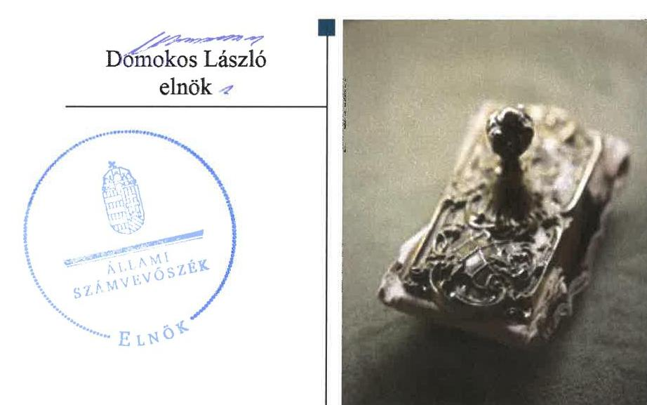
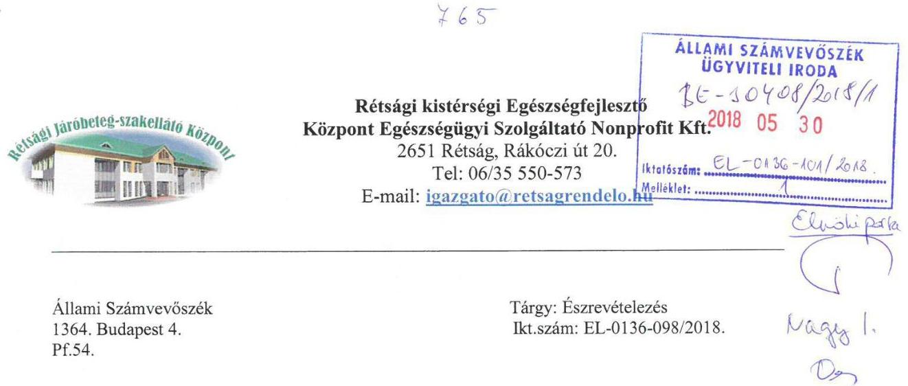
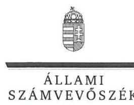
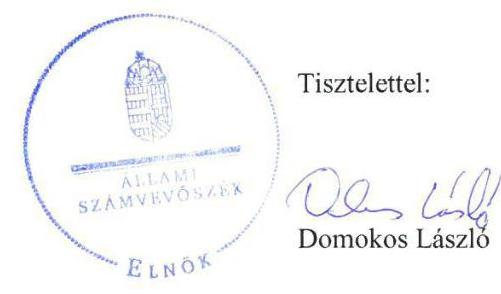
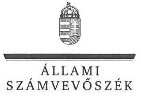

# Jelentés 

## Az önkormányzatok gazdasági társaságai

Az önkormányzatok többségi tulajdonában lévő gazdasági társaságok gazdálkodásának ellenőrzése - Rétsági kistérségi Egészségfejlesztő Központ Egészségügyi Szolgáltató Nonprofit Kft. 2018.

---

# Jelentés 

## Az önkormányzatok gazdasági társaságai

Az önkormányzatok többségi tulajdonában lévő gazdasági társaságok gazdálkodásának ellenőrzése - Rétsági kistérségi Egészségfejlesztő Központ Egészségügyi Szolgáltató Nonprofit Kft. 2018. augusztus 4.

---

# AZ ELLENŐRZÉST FELÜGYELTE:

DR. NAGY IMRE felügyeleti vezető

# AZ ELLENŐRZÉST VEZETTE ÉS A VÉGREHAJTÁSÁÉRT FELELŐS:

DR. NAGY JUDIT ellenőrzésvezető

# A PROGRAM ÖSSZEÁLLÍTÁSÁÉRT FELELŐS:

TÓTPÁL SZABOLCS osztályvezető

---

**IKTATÓSZÁM:** EL-0136-104/2018

**TÉMASZÁM:** 2067

**ELLENŐRZÉS-AZONOSÍTÓ SZÁM:** V079326

---

Jelentéseink az Országgyűlés számítógépes hálózatán és az Interneten a www.asz.hu címen is olvashatóak.

---

# TARTALOMJEGYZÉK 

■ ÖSSZEGZÉS ..... 5
■ AZ ELLENŐRZÉS CÉLJA ..... 6
■ AZ ELLENŐRZÉS TERÜLETE ..... 7
■ AZ ELLENŐRZÉS HÁTTERE, INDOKOLTSÁGA ..... 8
■ A JELENTÉS LÉNYEGES KÉRDÉSKÖREI ..... 9
■ AZ ELLENŐRZÉS HATÓKÖRE ÉS MÓDSZEREI ..... 10
■ MEGÁLLAPÍTÁSOK ..... 12
■ JAVASLATOK ..... 15
■ MELLÉKLETEK ..... 17
I. sz. melléklet: Értelmező szótár ..... 17
■ FÜGGELÉK: ÉSZREVÉTELEK ..... 19
■ RÖVIDÍTÉSEK JEGYZÉKE ..... 25

---

.

---

# ÖSSZEGZÉS 

Rétság Város Önkormányzata a tulajdonosi joggyakorlás kereteit nem alakította ki és jogait nem gyakorolta szabályszerűen. A Rétsági kistérségi Egészségfejlesztő Központ Egészségügyi Szolgáltató Nonprofit Korlátolt Felelősségű Társaság gazdálkodása, vagyongazdálkodása nem volt szabályozott és szabályszerű. A társaság a kormányzati szektorba tartozott, azonban jogállásából fakadó adatszolgáltatási és a közérdekből nyilvános adatokra vonatkozó közzétételi kötelezettségének nem tett eleget a jogszabályi előírások szerint, így nem biztosította a működésének és gazdálkodásának átláthatóságát.

## Az ellenőrzés társadalmi indokoltsága

Magyarországon az intézmény-centrikus közfeladat-ellátás jellemző, de egyre jelentősebb a költségvetésen kívüli feladatellátás térnyerése. Helyi szinten ennek legfontosabb szereplői az önkormányzati tulajdonban lévő gazdasági társaságok, amelyeknek ellenőrzése kiemelten fontos a közfeladat ellátása és a közvagyon megőrzése, megóvása érdekében. Ezért alapvető követelmény, hogy gazdálkodásuk, működésük szabályszerű és átlátható legyen.

A Rétsági kistérségi Egészségfejlesztő Központ Egészségügyi Szolgáltató Nonprofit Korlátolt Felelősségű Társaságot Rétság Város Önkormányzata egészségügyi szolgáltatási feladatok ellátására alapította. A 2013. június 28-ától kormányzati szektorba sorolt társaság a Rétsági kistérség területén a szakorvosi járóbeteg-ellátását biztosítja. Az Állami Számvevőszék 2013-2016 évekre kiterjedő ellenőrzése során arra kereste a választ, hogy szabályszerű volt-e az egészségügyi szolgáltatást, mint közfeladatokat is ellátó társaság gazdálkodása és az ehhez kapcsolódó tulajdonosi joggyakorlás.

## Főbb megállapítások, következtetések

Rétság Város Önkormányzata a tulajdonosi joggyakorlás kereteit nem szabályszerűen alakította ki és nem szabályszerűen gyakorolta. A Felügyelőbizottság nem rendelkezett ügyrenddel. Az egyszerűsített éves beszámolót a taggyűlési elfogadás előtt, a jogszabályi előírások ellenére, a Képviselő-testület előzetesen nem tárgyalta.

A Rétsági kistérségi Egészségfejlesztő Központ Egészségügyi Szolgáltató Nonprofit Kft. működését megalapozó szabályozottsága és a gazdálkodási tevékenysége, a bevételek és a ráfordítások elszámolása nem volt szabályszerű.

Számviteli beszámolói nem voltak leltárral alátámasztottak.
Nem alakította ki a tevékenységének és a célok megvalósításának nyomon követését biztosító rendszert, amelyre a kormányzati szektorba tartozás miatt volt kötelezett. A Rétsági kistérségi Egészségfejlesztő Központ Egészségügyi Szolgáltató Nonprofit Kft. a közérdekből nyilvános adatainak közzétételi kötelezettségét nem teljesítette. A kormányzati szektorba tartozásból eredő adatszolgáltatási kötelezettségének nem tett eleget.

Az Állami Számvevőszék a jelentésben foglalt megállapítások alapján Rétsági kistérségi Egészségfejlesztő Központ Egészségügyi Szolgáltató Nonprofit Kft. ügyvezetőjének a szabályozottsággal, a számviteli elszámolásokkal, a mérleg leltárral való alátámasztásával, a közzétételi kötelezettségekkel, valamint a kormányzati szektorba sorolt szervezeteknek előírt követelmények teljesítésével kapcsolatban 10 javaslatot fogalmazott meg. Rétság Város Önkormányzata polgármesterének két javaslatot tett az Állami számvevőszék a felügyelő bizottsági ügyrenddel, és a tulajdonosi jogkör képviselet útján történő ellátásával összefüggésben. A javaslatokat megalapozó megállapításokra az érintetteknek 30 napon belül intézkedési tervet kell készíteniük.

---

# AZ ELLENŐRZÉS CÉLJA 

Az ellenőrzés célja annak értékelése, hogy az önkormányzat vagyongazdálkodási tevékenysége során szabályszerűen gyakorolta-e tulajdonosi jogait. A gazdasági társaság szabályozottsága, gazdálkodása és vagyongazdálkodási tevékenysége, bevételeinek és ráfordításainak elszámolása megfelelt-e a jogszabályi és tulajdonosi előírásoknak. A gazdasági társaság kötelezettségállománya jelentett-e kockázatot a működésre. Az ellenőrzés célja továbbá annak megítélése, hogy az önkormányzatok többségi tulajdonában lévő gazdasági társaságok gazdálkodásának a kormányzati szektor hiányára és az államadósságra befolyással bíró elemei a jogszabályi előírásoknak megfelelnek-e.

---

# AZ ELLENŐRZÉS TERÜLETE 

## Rétság Város Önkormányzata és a Rétsági kistérségi Egészségfejlesztő Központ Egészségügyi Szolgáltató Nonprofit Kft.

Rétság város Nógrád megyében a Rétsági járásában található, lakossága 2016. január 1-jén 2722¹ fő volt. A Társaságot ² Rétság Város Önkormányzata alapította 2008. szeptember 4-én 0,5 M Ft készpénz törzstőkével egyszemélyes társaságként, a Rétsági kistérségi járóbeteg-szakellátó központ pályázat szerinti megvalósítására és működtetésére.
2008. október 1-től üzletrész felosztással és tizenhét Nógrád megyei települési önkormányzat tulajdonosi körbe vonásával a Társaság nonprofit társasággá alakult. Törzstőkéjét 90 M Ft-ra emelték, mely 2,7 M Ft készpénzből és 87,3 M Ft apportból (ingatlan) állt. Ennek megfelelően a társasági szerződés ³ 10.1 pontjában a Ctv. ⁴ 9/F. § (2) bekezdése és a Civil tv. ⁵ 42. § (1) bekezdésével egyezően rendelkezett a nyereség fel nem oszthatóságáról. A Társaság legnagyobb tulajdonosa Rétság Város Önkormányzata 96,6%-os tulajdoni aránnyal, a többi önkormányzat 0,2-0,2% tulajdonrésszel bírt.

A Társaság 2011. április 1-én kezdte meg járóbeteg-ellátással kapcsolatos tevékenységét. 2010. december 27-ei dátummal keltezett határozatlan időre szóló működési engedéllyel rendelkezett. Az éves átlagos betegszám 2013-ban 62065 eset volt ⁶, melyet átlagosan 23 fővel láttak el.

A Társaság 2011. szeptember 6-ától közhasznú jogállású volt. A Nemzetgazdasági Miniszter a Társaságot 2013-ban a kormányzati szektorba sorolt egyéb szervezetek közé sorolta ⁷, ezért a Bkr. ⁸ 1. §. (2) bekezdésének e) alpontja alapján 2014. január 1-jétől a Társaság a Bkr. alanyává vált.

Könyvvizsgálatra a Társaság a Számv. tv. ⁹ 155. § (3) bekezdése alapján nem volt kötelezett, azonban már az alakulástól könyvvizsgáló ellenőrizte a Társaság egyszerűsített éves beszámolóját. A könyvvizsgáló személyét a tagok a társasági szerződésben meghatározták. A Társaság vagyonkezelésre, üzemeltetésre, használatba nem vett át eszközöket.

A Társaság gazdálkodását az ellenőrzött időszakban az értékesítés nettó árbevételének növekedése 130,6 M Ft-ról 145,4 M Ft-ra jellemezte, a mérlegfőösszeg 2016. december 31-én 735,2 M Ft volt az egyszerűsített éves beszámolók adatai alapján.

Az ügyvezető1 2010. október 29-étől, az ügyvezető2 2015. október 26-ától látta el feladatait. A polgármester₁ a 2014. évi önkormányzati választások előtt, a polgármester₂ pedig ezt követően töltötte be tisztségét. A jegyző személye három alkalommal változott az ellenőrzött időszakban: a jegyző₁ 2013. január 6-áig, a jegyző₂ 2013. február 28-ig helyettesítésben, majd 2013. június 5-éig főállásban, a jegyző₃ 2013. december 8-áig, a jegyző₄ 2013. december 9-étől látta el a feladatait.

---

# AZ ELLENŐRZÉS HÁTTERE, INDOKOLTSÁGA 

AZ ÖNKORMÁNYZATOK TÖBBSÉGI TULAJDONÁBAN ÁLLÓ GAZDASÁGI TÁRSASÁGOK ellenőrzése kiemelten fontos a vagyon megőrzése, megóvása érdekében, valamint a kormányzati szektor elszámolásaiban megjelenő önkormányzati tulajdonú gazdálkodó szervezetek esetében, amelyekkel szemben alapvető követelmény, hogy gazdálkodásuk, működésük szabályszerű, az általuk szolgáltatott adatok minél megbízhatóbbak legyenek.

A feladat-ellátás költségeinek, ráfordításainak alakulása a lakosság széles rétegét érinti. Az ellenőrzés várható hasznosulásaként ellenőrzéseink feltárhatják, hogy az önkormányzat a feladatellátásához rendelt vagyon működtetését a tulajdonostól elvárható gondossággal végezte-e, a feladatot ellátó gazdasági társaság a létesítő okiratban, szolgáltatási szerződésben foglaltak betartásával biztosította-e a feladat ellátását. Az ellenőrzés rávilágíthat arra, hogy a gazdasági társaság a vagyon használatával biztosította-e a szolgáltatás folytatásának feltételeit, az önkormányzat által végzett tulajdonosi ellenőrzés hozzájárult-e a szabályszerű gazdálkodáshoz és feladatellátáshoz.

A megállapítások alapján megfogalmazott számvevőszéki javaslatok hasznosítása elősegítheti a meglévő hibák megszüntetését. A jó gyakorlatok bemutatásával az Állami Számvevőszék hozzájárul a követendő megoldások megismertetéséhez, terjesztéséhez.

---

# A JELENTÉS LÉNYEGES KÉRDÉSKÖREI 

1. Az önkormányzati tulajdonosi joggyakorlás szabályszerű volt-e?
2. A kormányzati szektorba sorolt gazdasági társaság szabályozottsága, gazdálkodása, valamint vagyongazdálkodása szabályszerű volt-e?

---

# AZ ELLENŐRZÉS HATÓKÖRE ÉS MÓDSZEREI 

## Az ellenőrzés típusa

Megfelelőségi ellenőrzés.

## Az ellenőrzött időszak

2013. január 1-jétől 2016. december 31-ig.

## Az ellenőrzés tárgya

Rétság Város Önkormányzata tulajdonosi joggyakorlása, valamint a Rétsági kistérségi Egészségfejlesztő Központ Egészségügyi Szolgáltató Nonprofit Kft. gazdálkodásának szabályozottsága és szabályszerűsége.

Az ellenőrzés kiterjedt minden olyan körülményre és adatra, amely az ÁSZ ¹⁰ jogszabályban meghatározott feladatainak teljesítéséhez, valamint a program végrehajtása folyamán felmerült újabb összefüggések feltárásához szükséges.

## Az ellenőrzött szervezet

Rétsági kistérségi Egészségfejlesztő Központ Egészségügyi Szolgáltató Nonprofit Kft. és a többségi tulajdonos Rétság Város Önkormányzata

## Az ellenőrzés jogalapja

Az ellenőrzés jogszabályi alapját az ÁSZ tv. 1.§ (3) bekezdése és 5. § (3)(5) bekezdései képezték.

## Az ellenőrzés módszerei

Az ellenőrzést a nemzetközi standardokat irányadónak tekintve az ellenőrzési program ellenőrzési kérdései, az ellenőrzött időszakban hatályos jogszabályok, az ellenőrzés szakmai szabályok és módszertanok figyelembe vételével végeztük.

Az ellenőrzés ideje alatt az ellenőrzött szervezettel történő kapcsolattartást az ÁSZ Szervezeti és Működési Szabályzatának vonatkozó előírásai alapján biztosítottuk.

Az ellenőrzési kérdések megválaszolásához szükséges bizonyítékok megszerzése a következő ellenőrzési eljárások alkalmazásával történt:

---

megfigyelés, kérdésfeltevés (információkérés), összehasonlítás, valamint elemző eljárás. Az ellenőrzési bizonyítékként felhasználható adatforrások közé tartoztak egyrészt az ellenőrzési programban felsorolt adatforrások, másrészt adatforrás lehet még minden - az ellenőrzés folyamán - feltárt, az ellenőrzés szempontjából információkat tartalmazó dokumentum.

Az ellenőrzést a kérdésekre adott válaszok kiértékelésével, valamint a megjelölt adatforrások, a csatolt tanúsítványok felhasználásával, továbbá az adott időszakban hatályos jogszabályok figyelembe vételével folytattuk le.

A bevételek és ráfordítások elszámolása, valamint a vagyonnyilvántartás terén a szabályszerű működést véletlen mintavétellel ellenőriztük.

A mintavétellel ellenőrzött területek esetében minden egyes tétel vonatkozásában a szabályszerűségre vonatkozó kérdéseket tettünk fel, amelyek eredménye összesítésre került. Az ellenőrzött minták alapján a sokaságban előforduló átlagos hibaarányt becsültük. „Szabályszerűnek" értékeltünk egy ellenőrzött területet, amennyiben 95%-os bizonyossággal a teljes sokaságban az átlagos hibaarány legfeljebb 10%, nem megfelelőnek, amennyiben 10%-nál magasabb arányt képviselt. Abban az esetben, ha a teljes sokaság tekintetében a 10%-os hibaarányhoz való viszony megítélésének megbízhatósága nem érte el a 95%-ot, annak elérése érdekében értékelésünket további szempontokkal egészítettük ki, és figyelembe vettük a feltárt hibák típusát és súlyát. A ráfordítások elszámolására és a vagyonnyilvántartásra vonatkozó véletlen mintavételt kockázati alapú kiválasztással egészítettük ki, amelynek során a három legnagyobb összegű tételt választottuk ki.

---

# 1. Az önkormányzati tulajdonosi joggyakorlás szabályszerű volt-e? 

Összegző megállapítás

A tulajdonosi joggyakorlás kereteinek kialakítása és a tulajdonosi jogok gyakorlása nem volt szabályszerű. Az Önkormányzat ¹¹ tulajdonosi jogait nem szabályszerűen gyakorolta.

Az Önkormányzat az Alapítói határozatában ¹² és a tagok a társasági szerződés 14. pontjában kijelölték a Felügyelőbizottság ¹³ tagjait, ezzel eleget téve a Gt. ¹⁴ 19. § (4) bekezdése és a Taktv. 4. § (1) bekezdése előírásainak. A Felügyelőbizottság ügyrenddel Gt. 34. § (4) bekezdése és a Ptk. ¹⁵ 3:122. § (3) bekezdése előírásai ellenére nem rendelkezett.

Az Önkormányzat a tulajdonosi joggyakorlás során az egyszerűsített éves beszámolók elfogadásához kapcsolódóan, nem tartotta be az Mótv. ¹⁶ 41. §
 (4) bekezdésében foglalt hatáskör átruházásra vonatkozó szabályokat.

A Felügyelőbizottság a Társaság 2013-2016. évi egyszerűsített éves beszámolóit megtárgyalta, elfogadásra javasolta.

A Társaság 2016. július 22-én fűtéskorszerűsítési beruházás tárgyában támogatási megállapodást írt alá Rétság Város Önkormányzatával, amelyhez, mint a Társaság tagjával kötött szerződéshez a Ptk. 3:188. § (2) bekezdése ellenére nem volt taggyűlési határozat.

## 2. A kormányzati szektorba sorolt gazdasági társaság szabályozottsága, gazdálkodása, valamint vagyongazdálkodása szabályszerű volt-e?

## Összegző megállapítás

2.1. számú megállapítás

A Társaság vagyongazdálkodása nem volt szabályszerű és nem tett eleget a kormányzati szektorba tartozás miatt előírt kötelezettségeinek. Közzétételi kötelezettségeit nem teljesítette.

A Társaság szabályozottsága nem felelt meg a jogszabályi előírásoknak. Nem működtetett független belső ellenőrzést, tevékenységének és a célok megvalósításának nyomon követését biztosító rendszert.

A Társaság a Számv. tv. 14. § (3) bekezdése előírásának megfelelően rendelkezett Számviteli politika1718-val, de a számviteli politika2 nem tartalmazta az értékelés szempontjából, kivételes nagyságú vagy előfordulású bevétel, ráfordítás meghatározását, a Számv.tv. 14. § (4) bekezdése ellenére.

---

A számlarend119220 nem felelt meg a Számv. tv. 161. § (2) bekezdése a) pontjának, mert nem tartalmazta minden alkalmazásra kijelölt főkönyvi számla számjelét és megnevezését.

A Társaság Számlarend1,2-ben, nyilvántartásaiban, a Számv. tv. 161/A § (2) bekezdése ellenére, nem különítette el az alapcél szerinti (ezen belül közhasznú) és a gazdasági-vállalkozási tevékenységei ráfordításait, bevételeit, valamint eredményét. Ezért nem volt biztosított a közhasznúsági melléklet és a számviteli beszámoló összhangja, a Korm. rendelet21 1. § (4) bekezdése alapján, a 12. § (3) bekezdése előírásai ellenére.

A Társaság Leltározási Szabályzattal22 rendelkezett, amely megfelelt a Számv. tv. 14. § (5) bekezdés a) pontjában és a 69. §-ban foglaltaknak.

A Társaság 2016. március 16-áig nem készített pénzkezelési szabályzatot, a Számv. tv. 14.§ (5) bekezdés d) pontjának előírásai ellenére. Továbbá a Társaság 2015. október 26-áig nem rendelkezett iratkezelési szabályzattal, ezzel megsértette az Ltv.23 9. § (4) bekezdése előírásait.

A közérdekű adatok megismerésére irányuló igények teljesítésének rendjét meghatározó szabályzatot nem hozott létre a Társaság, így nem tett eleget az Info. tv.24 30. § (6) bekezdésében foglaltaknak.

A Társaság 2015. október 26.-ig nem tett eleget az ágazati jogszabály25 32. § (2) bekezdése h) pontjában előírt adatvédelmi szabályzatkészítési kötelezettségének.

A Bkr. 10. § és 54/A. §-ban foglaltak ellenére 2016. évben a Társaság nem alakította ki a tevékenységének és a célok megvalósításának nyomon követését biztosító rendszerét.

A vezető tisztségviselők, a felügyelőbizottsági tagok és az Mt.26 208. § hatálya alá tartozó munkavállalók javadalmazására, valamint a jogviszony megszűnése esetére biztosított juttatások módjának, mértékének legfőbb elveiről, annak rendszeréről a Taggyűlés27 a Taktv.28 5. § (3) bekezdése előírásai szerinti javadalmazási szabályzat29 alkotott.

# 2.2. számú megállapítás 

## A Társaság gazdálkodási tevékenysége nem volt szabályszerű, mivel egyszerűsített éves beszámolói leltárral nem voltak alátámasztottak.

A Társaság egyszerűsített éves beszámolóit a Számv. tv. 69. § (1) bekezdése, valamint a Leltározási Szabályzat előírásainak megfelelő leltárral nem támasztotta alá. Ennek ellenére a könyvvizsgáló az egyszerűsített éves beszámolókat korlátozás nélküli hitelesítő záradékkal - figyelemfelhívás nélkül - látta el.

## A Társaság bevételeinek és ráfordításainak elszámolása nem volt szabályszerű.

A Társaságnál a bevételek elszámolása nem volt szabályszerű. A Társaság nem rendelkezett a térítési díjak megállapításának, nyilvánosságra hozatalának és befizetésének rendjére, valamint a szolgáltató által megállapított térítési díj mérséklésére, illetve elengedésére vonatkozó szabályzattal a térítésidíj-rendelet30 1. § (6) bekezdésében foglaltak ellenére. A térítési díjakból származó bevételek számviteli nyilvántartásba történő bejegyzésének alapjaként megküldött bizonylatok a kiszámlázott összeg tekintetében

---

a Számv. tv. 166. § (2) bekezdésében foglaltak ellenére nem voltak megbízhatóak, ezáltal nem támasztották alá a térítési díjként elszámolt bevételek összegét.

A ráfordítások elszámolása nem volt szabályszerű, mert az anyagjellegű ráfordítások számviteli nyilvántartásba történő bejegyzésének alapjaként megküldött bizonylatok a Számv. tv. 167. § (1) bekezdés c) pontja ellenére nem tartalmazták a rendelkezés végrehajtását igazoló személy aláírását.

Az értékcsökkenés elszámolása nem volt szabályszerű, mert a Számviteli Politika1,2 előírásainak és a Számv. tv. 52. § (2) bekezdése előírása ellenére az üzembe helyezések nem kerültek hitelt érdemlően dokumentálásra.

A személyi jellegű ráfordítások elszámolása nem volt szabályszerű, mert a könyvviteli elszámolást közvetlenül alátámasztó bizonylatok nem feleltek meg a Számv. tv. 167. § (1) bekezdés h) pontja előírásainak, mivel nem tartalmazták a könyvelés módjára, az érintett főkönyvi számlákra történő hivatkozást.

# 2.4. számú megállapítás 

## A Társaság az előírt közzétételi kötelezettségét nem teljesítette. A kormányzati szektorba tartozás miatt előírt adatszolgáltatási kötelezettségének nem tett eleget.

A Társaság az Áht.31 13. § (3) és 107. § (1) bekezdései alapján 2013. június 28-ától az Ávr. 7. sz. melléklete 2., 28. és 29. pontjai, 2015. január 1-től az Ávr. 5. sz. melléklete 23. pontja szerinti adatszolgáltatás teljesítésére volt kötelezett az államháztartásért felelős miniszter felé, amelynek azonban nem tett eleget.

A Taktv. 2. § (1) bekezdésének ca) pontjában előírtak ellenére a Társaság vezető tisztségviselőinek és az Mt. 208. §-a szerinti vezető állású munkavállalóinak nyújtott pénzbeli juttatásokat nem tette közzé.

A Társaság nem tett eleget az Info. tv. 37. § (1) bekezdésében előírt közzétételi kötelezettségének.

---

# JAVASLATOK 

Az ÁSZ tv. 33. § (1) bekezdésében foglaltak értelmében az ellenőrzött szervezet vezetője köteles a jelentésben foglalt megállapításokhoz kapcsolódó intézkedési tervet összeállítani és azt a jelentés kézhezvételétől számított 30 napon belül az ÁSZ részére megküldeni. Amennyiben az ellenőrzött szervezet vezetője nem küldi meg határidőben az intézkedési tervet, vagy továbbra sem elfogadható intézkedési tervet küld, az Állami Számvevőszék elnöke az ÁSZ tv. 33. § (3) bekezdés a) és b) pontjaiban foglaltakat érvényesítheti.

## Rétsági kistérségi Egészségfejlesztő Központ Egészségügyi Szolgáltató Nonprofit Kft. Ügyvezetőjének

1. Intézkedjen a számviteli politika jogszabályban foglaltak szerinti módosításáról.
(2.1. sz. megállapítás 1. bekezdése alapján)
2. Intézkedjen, hogy a számlarend a jogszabályi előírásoknak megfelelően tartalmazza az alkalmazott főkönyvi számlák számát, megnevezését, valamint a számlarend feleljen meg a Számv. tv.-ben meghatározott továbbrészletezési követelménynek.
(2.1. sz. megállapítás 2. és 3. bekezdései alapján)
3. Intézkedjen a jogszabályi előírásoknak megfelelően a közérdekű adatok megismerésére irányuló igények teljesítésének rendjét meghatározó szabályzat elkészítéséről.
(2.1. sz. megállapítás 6. bekezdése alapján)
4. Tegyen eleget a Társaság tevékenységének és a célok megvalósítása nyomon követését biztosító rendszer kialakításának, a vonatkozó jogszabály szerinti előírásának megfelelően.
(2.1. sz. megállapítás 8. bekezdése alapján)
5. Biztosítsa a jogszabályi előírások szerint, a Társaság egyszerűsített éves beszámolója mérlegének szabályszerű leltárakkal való alátámasztását.
(2.2. sz. megállapítás 1. bekezdése alapján)

---

6. Biztosítsa, hogy a bevételek elszámolását a jogszabályi előírásoknak megfelelő, a szolgáltató hatáskörében megállapítható térítési díjak nyilvánosságra hozatalának és befizetésének rendjét meghatározó, jóváhagyott szabályzat alapján kiállított, szabályszerű bizonylatok támaszszák alá.
(2.3. sz. megállapítás 1. bekezdése alapján)
7. Biztosítsa az anyagjellegű, a személyi jellegű ráfordítások elszámolásainak bizonylatai jogszabályi előírásoknak való megfelelőségét, valamint az értékcsökkenés elszámolását megalapozó üzembe helyezések dokumentálását.
(2.3. sz. megállapítás 2-4. bekezdései alapján)
8. Intézkedjen arról, hogy a Társaság a jogszabályi előírásoknak megfelelően tegyen eleget a kormányzati szektorba sorolt egyéb szervezetek részére előírt adatszolgáltatási kötelezettségének.
(2.4. sz. megállapítás 1. bekezdése alapján)
9. Gondoskodjon az Taktv. előírásai alapján a közérdekből nyilvános adatok közzétételéről.
(2.4. sz. megállapítás 2. bekezdése alapján)
10. Gondoskodjon az Info tv. előírásának megfelelően a közzétételi kötelezettsége teljesítéséről.
(2.4. sz. megállapítás 3. bekezdése alapján)

# Rétság Város Önkormányzata Polgármesterének 

1. Kezdeményezze a felügyelőbizottsági ügyrend elkészítését és jóváhagyását.
(1. sz. megállapítás 1. bekezdés 2. mondata alapján)
2. Gondoskodjon a tulajdonosi jogok gyakorlása során a jogszabályi előírások betartásáról.
(1. sz. megállapítás 2. bekezdése alapján)

---

# MELLÉKLETEK 

- I. SZ. MELLÉKLET: ÉRTELMEZŐ SZÓTÁR
gazdasági társaság
kormányzati szektorba sorolt egyéb szervezet
közszolgáltatás
nemzeti vagyon
nonprofit gazdasági társaság

Ptk. 3:88. § (1) bekezdése szerint „a gazdasági társaságok üzletszerű közös gazdasági tevékenység folytatására, a tagok vagyoni hozzájárulásával létrehozott, jogi személyiséggel rendelkező vállalkozások, amelyekben a tagok a nyereségből közösen részesednek, és a veszteséget közösen viselik".
az Áht. 3. § (2) és (3) bekezdésében foglaltakon kívül az Európai Közösséget létrehozó szerződéshez csatolt, a túlzott hiány esetén követendő eljárásról szóló jegyzőkönyv alkalmazásáról szóló 2009. május 25-i 479/2009/EK rendelet (a továbbiakban: 479/2009/EK rendelet) szerint a kormányzati szektorba sorolt szervezet (Áht. 1. § (12))
Az Ebktv.32 3. § d) pontja a következőképpen határozza meg a közszolgáltatást: „szerződéskötési kötelezettség alapján a lakosság alapvető szükségleteinek ellátására irányuló szolgáltatás, így különösen a villamos energia-, gáz-, hő-, víz-, szenny-víz- és hulladékkezelési, köztisztasági, postai és távközlési szolgáltatás, továbbá a menetrend alapján közlekedő járművekkel végzett közforgalmú személyszállítás". Nv. tv. 1. § (2) bekezdése szerint többek között:
„az állam vagy a helyi önkormányzat kizárólagos tulajdonában álló dolgok, az a) pont hatálya alá nem tartozó, állam vagy a helyi önkormányzat tulajdonában lévő dolog,
az állam vagy a helyi önkormányzat tulajdonában lévő pénzügyi eszközök, továbbá az államot vagy a helyi önkormányzatot megillető társasági részesedések, az államot vagy a helyi önkormányzatot megillető bármely vagyoni értékkel rendelkező jogosultság, amelyet jogszabály vagyoni értékű jogként nevesít."
Ctv. 9/F. § (2) bekezdése szerint „az a gazdasági társaság minősül nonprofit gazdasági társaságnak és cégnevében az a gazdasági társaság tüntetheti fel a nonprofit jelleget, amelynek létesítő okirata tartalmazza, hogy a gazdasági társaság tevékenységéből származó nyereség a tagok között nem osztható fel, hanem az a gazdasági társaság vagyonát gyarapítja." (hatályos 2014. március 15-től)

---

.

---

# FÜGGELÉK: ÉSZREVÉTELEK 

A jelentéstervezetet a Számvevőszék 15 napos észrevételezésre megküldte az ellenőrzött szervezetek vezetőinek az ÁSZ tv. 29. §*(1) bekezdése előírásának megfelelően.

Az ÁSZ a jelentéstervezetet észrevételezésre megküldte Rétság Város Önkormányzata polgármesterének, valamint a Rétsági kistérségi Egészségfejlesztő Központ Egészségügyi Szolgáltató Nonprofit Kft. ügyvezetőjének.
Rétság Város Önkormányzata polgármestere nem tett észrevételt. A függelék tartalmazza a Rétsági kistérségi Egészségfejlesztő Központ Egészségügyi Szolgáltató Nonprofit Kft. ügyvezetőjének észrevételeit, illetve az el nem fogadott észrevételek elutasításának indoklását.

[^0]
[^0]:    * 29. § (1) Az Állami Számvevőszék az ellenőrzési megállapításait megküldi az ellenőrzött szervezet vezetőjének vagy az általa megbízott személynek, és annak, akinek személyes felelősségét állapította meg.
    (2) Az ellenőrzött szervezet vezetője és a felelősként megjelölt személy az ellenőrzés megállapításaira tizenöt napon belül írásban észrevételt tehet.
    (3) Az Állami Számvevőszék az észrevételre a beérkezésétől számított harminc napon belül írásban válaszol. A figyelembe nem vett észrevételeket köteles a jelentésben feltüntetni, és megindokolni, hogy azokat miért nem fogadta el.

---

# Tisztelt Állami Számvevőszék! 

Hivatkozva a megküldött „Az Önkormányzatok gazdasági társaságai - Az önkormányzatok többségi tulajdonában lévő gazdasági társaságok gazdálkodásának ellenőrzése - Rétsági kistérségi Egészségfejlesztő Központ Egészségügyi Szolgáltató Nonprofit Kft" - címmel készült jelentéstervezettel kapcsolatosan az alábbi észrevételeket szeretném tenni:

Az
 ellenőrzés területe címszó alatt (7. oldal) 3.bekezdés:
A Társaság főtevékenysége általános járóbeteg ellátás, melynek keretébe nem tartozik bele a háziorvosi általános orvosi ellátás. A járóbeteg szakellátással kapcsolatos feladatok az önkormányzat önként vállalt feladatai közé tartozik.

Megállapítások (14.oldal) 4.bekezdés:
A Társaság rendelkezik 2016. március 16. előtt is Pénzkezelési Szabályzattal, beküldve az utolsó módosított szabályzat lett. A fedőlapon látható, hogy ez a 4. módosított verzió.
Mentségünkre legyen, nem tudtuk, hogy a már nem érvényes szabályzatokat is be kell küldeni.
2.2. megállapítás (14.oldal):

A tárgyi eszközök leltározása során a tárgyi eszközök értékben a Tárgyi eszközök listáján szerepelnek. A Tárgyi eszközök listájának analitikája pedig az egyéni nyilvántartó karton.
A pénzeszközök leltározása a december 31-i bankszámlakivonat, illetve a pénztárjelentés alapján történik, amelyet a könyvvizsgáló a főkönyvi kartonokkal egyeztetve szigorúan ellenőriz.
A vevők-szállítók egyeztetése folyószámla alapján történik. A társaságunknál történt személyes ÁSZ ellenőrzés során az ellenőrök tájékoztattak, hogy milyen formában kérik a pénzeszköz leltárt, amelyet a 2017. évi beszámoló során már alkalmaztunk.

### 2.3. megállapítás (15.oldal) 3.bekezdés:

Tárgyi eszköz üzembehelyezése alkalmával minden esetben kiállításra kerül az egyedi tárgyi eszköz nyilvántartó karton, üzembehelyezési okmány. Az igaz, hogy a megküldött számlák némelyike mellé nem lett becsatolva az összes dokumentum.

---

# 2.3. megállapítás (15. oldal) 4.bekezdés: 

Személyi jellegű ráfordítások esetében (munkabér) könyvelése során nem a személyenkénti bérlapok kerülnek egyenként könyvelésre, hanem a bérösszesítő. A bérösszesítő tartalmazza főkönyvi számra történő hivatkozással a könyvelendő tételeket.

Az egyéb megállapításokra vonatkozó javaslatokra intézkedési terv készül, melyet ezen levelemmel együtt megküldök.

Köszönjük az Állami Számvevőszék részéről megfogalmazott javaslatokat, mellyel a meglévő hibákat javítani tudjuk, hogy működésünk szabályszerű és átlátható legyen.

Tisztelettel:
Rétsági kistérségi
Egészségfejlesztő Központ
Nonprofit Kft.
2651 Rétság, Rákóczi u. 20.
Adószám: 14459191-2-12
Nábelek Anna
ügyvezető ig.

Rétság, 2018. május 25.

---

ELNÖK

Ikt.szám: EL-0136-102/2018.

# Nábelek Anna úrhölgy 

ügyvezető

Rétsági kistérségi Egészségfejlesztő Központ Egészségügyi Szolgáltató Nonprofit Kft.

## Rétság

## Tisztelt Ügyvezető Úrhölgy!

„Az önkormányzatok gazdasági társaságai - Az önkormányzatok többségi tulajdonában lévő gazdasági társaságok gazdálkodásának ellenőrzése - Rétsági kistérségi Egészségfejlesztő Központ Egészségügyi Szolgáltató Nonprofit Kft." címmel készített számvevőszéki jelentéstervezetre tett észrevételeit köszönettel megkaptam.
Az Állami Számvevőszék észrevételekre vonatkozó álláspontjáról a felügyeleti vezető által készített részletes tájékoztatást csatoltan megküldöm.
Tájékoztatom Ügyvezető úrhölgyet, hogy a számvevőszéki jelentésben - az Állami Számvevőszékről szóló 2011. évi LXVI. törvény 29. § (3) bekezdése alapján - a figyelembe nem vett észrevételeket szerepeltetjük annak megindoklásával, hogy azokat miért nem fogadtuk el.

Budapest, 2018. O. G.
hó 4 t. nap

Melléklet: Tájékoztatás az észrevételek kezeléséről

---

FELÜGYELETI VEZETŐ

Melléklet
Ikt.szám: EL-0136-102/2018.

# Tájékoztatás   az észrevételek kezeléséről 

„Az önkormányzatok gazdasági társaságai - Az önkormányzatok többségi tulajdonában lévő gazdasági társaságok gazdálkodásának ellenőrzése - Rétsági kistérségi Egészségfejlesztő Központ Egészségügyi Szolgáltató Nonprofit Kft. " címú jelentéstervezetre 2018. május 25 -én tett (az Állami Számvevőszékhez 2018. május 30 -án érkezett) észrevételeit áttekintettük, azok kezelésével kapcsolatban a következő tájékoztatást adom.

## 1. A jelentéstervezet 7. oldal 3. bekezdésére vonatkozó észrevétel:

Az észrevétel szerint a Társaság főtevékenysége általános járóbeteg ellátás, melynek keretébe nem tartozik bele a háziorvosi általános ellátás. A járóbeteg szakellátás az önkormányzat önként vállalt feladatai közé tartozik.
Az észrevételt elfogadom, a dokumentumok ismételt áttekintése alapján a jelentéstervezet 7. oldal 3. bekezdés mondatát töröljük.

## 2. A jelentéstervezet 2.1. számú megállapítás 5. bekezdés 1. mondatára vonatkozó észrevétel:

Az észrevételben leírtak szerint a Társaság 2016. március 16. előtt is rendelkezett Pénzkezelési Szabályzattal, de azt nem küldték be az ellenőrzés részére.
Az észrevétel nem megalapozott, azt nem fogadom el. Az ÁSZ EL-0136-007/2017. iktatószámú, 2017. szeptember 19-ei adatbekérő levelében szerepelt, hogy a Társaság esetében az ellenőrzött időszak 2013. január 1.-2016. december 31.-e, és az ellenőrzött időszakot lefedően kértük a Társaság pénzkezelési szabályzatát. Ön a 2017. szeptember 27-én kelt Teljességi és hitelességi nyilatkozatában nyilatkozott arról, hogy az adatbekérő levélben kért adatok kapcsán az ÁSZ részére átadott adatok, dokumentumok megbízhatóak, a bekért adatokra, dokumentumokra vonatkozóan teljes körű információt tartalmaznak, az átadott dokumentumok, adatok hiánytalanságáért teljes felelősséget vállalt.

## 3. A jelentéstervezet 2.2. számú megállapítás 1. bekezdésére vonatkozó észrevétel:

Az észrevételben leírtak szerint a tárgyi eszközök leltározása során a tárgyi eszközök értékben szerepeltek a Tárgyi eszközök listáján, melynek analitikája az egyéni nyilvántartó karton. A pénzeszközök leltározása bankszámlakivonat és pénztárjelentés alapján történik. A vevők-szállítók egyeztetése folyószámla alapján történik.
Az észrevétel nem megalapozott, azt nem fogadom el. A megállapítás a számvitelről szóló 2000. évi C. törvény (a továbbiakban: Sztv.) 69. § (1) bekezdése megszegésére irányult. Hivatkozott jogszabály értelmében a könyvek üzleti év végi zárásához, a beszámoló elkészítéséhez, a mérleg tételeinek alátámasztásához olyan leltárt kell összeállítani és megőrizni, amely tételesen, ellenőrizhető módon tartalmazza a vállalkozónak a mérleg fordulónapján meglévő eszközeit és forrásait mennyiségben és értékben. Az ellenőrzés rendelkezésére bocsátott dokumentumok azt támasztják alá, hogy a törvény és a Leltározási szabályzat előírásainak megfelelő leltárt egyik ellenőrzött évben sem készített a Társaság, mivel az ellenőrzési dokumentáció részeként benyújtott leltárak nem tételesek, nem ellenőrizhető módon tartalmazzák a Társaság mérleg fordulónapján meglévő eszközeit és forrásait és nem tartalmazzák azokat mennyiségben és értékben egyaránt. Az Sztv. 69. § (3) bekezdése értelmében a vállalkozó a leltárba bekerülő adatok valódiságáról - a leltár összeállítását megelőzően - leltározással köteles meggyőződni, mellyel kapcsolatban a jelentéstervezet megállapítást nem tartalmazott.

# 4. A jelentéstervezet 2.3. számú megállapítás 4. bekezdésére vonatkozó észrevétel: 

Az észrevételben leírtak szerint a Társaság a tárgyi eszköz üzembehelyezése alkalmával minden esetben kiállítja az üzembehelyezési okmányt, de nem mindegyiket küldték be az ellenőrzés részére.

Az észrevétel nem megalapozott, azt nem fogadom el. Az ÁSZ rendelkezésére bocsátott, a tárgyi eszközök üzembehelyezése dokumentálására beküldött bizonylatoknál több esetben az üzembehelyezési okmány hiányzott, amit az észrevétel sem vitat. Az ÁSZ az EL-0136-033/2017. iktatószámú, 2017. november 8 -ai adatbekérő levele 2. mellékletében a vagyonnyilvántartások és értékcsökkenési leírás mintatételei ellenőrzéséhez kérte a beszerzett eszközök üzembehelyezési okmányait. Ön a 2017. november 22 -én kelt Teljességi és hitelességi nyilatkozatában nyilatkozott arról, hogy az adatbekérő levélben kért adatok kapcsán az ÁSZ részére átadott adatok, dokumentumok megbízhatóak, a bekért adatokra, dokumentumokra vonatkozóan teljes körű információt tartalmaznak, az átadott dokumentumok, adatok hiánytalanságáért teljes felelősséget vállalt.

## 5. A jelentéstervezet 2.3. számú megállapítás 5. bekezdésére vonatkozó észrevétel:

Az észrevételben leírtak szerint a Társaságnál a munkabér könyvelése a bérösszesítő alapján történik, amely tartalmazza a főkönyvi számlára történő hivatkozással a könyvelendő tételeket.

Az észrevétel nem megalapozott, azt nem fogadom el. Az ÁSZ az EL-0136-033/2017. iktatószámú, 2017. november 8 -ai adatbekérő levele 2. mellékletében a személyi jellegű ráfordítások mintatételeinek ellenőrzéséhez kérte a bérfizetést és a költségelszámolást megalapozó dokumentumokat, analitikus nyilvántartásokat, bérszámfejtési dokumentumokat. Ön a 2017. november 22-én kelt Teljességi és hitelességi nyilatkozatában nyilatkozott arról, hogy az adatbekérő levélben kért adatok kapcsán az ÁSZ részére átadott adatok, dokumentumok megbízhatóak, a bekért adatokra, dokumentumokra vonatkozóan teljes körű információt tartalmaznak, az átadott dokumentumok, adatok hiánytalanságáért teljes felelősséget vállalt.

Budapest, 2018. 06. hó 21. nap

Dr. Nagy Imre felügyeleti vezető

---

# RÖVIDÍTÉSEK JEGYZÉKE 

${ }^{1}$ Forrás
${ }^{2}$ Társaság
${ }^{3}$ Társasági szerződés
${ }^{4}$ Ctv.
${ }^{5}$ Civil tv.
${ }^{6}$ Éves betegszám
${ }^{7}$ Kormányzati szektorba sorolás
${ }^{8}$ Bkr.
${ }^{9}$ Számv. tv.
${ }^{10}$ ÁSZ
${ }^{11}$ Önkormányzat
${ }^{12}$ Alapítói határozat
${ }^{13}$ Felügyelőbizottság
${ }^{14}$ Gt.
${ }^{15}$ Ptk.
${ }^{16}$ Mötv.
${ }^{17}$ Számviteli politika:
${ }^{18}$ Számviteli politika:
${ }^{19}$ Számlarend:
${ }^{20}$ Számlarend:
${ }^{21}$ Korm. rendelet
${ }^{22}$ Leltározási Szabályzat:
${ }^{23}$ Ltv. tv.
${ }^{24}$ Info tv.

Magyarország Közigazgatási Helynévkönyve 2016. január 1., kiadja a KSH
Rétsági kistérségi Egészségfejlesztő Központ Egészségügyi Szolgáltató Kft. (2008. október 1-ig), Rétsági kistérségi Egészségfejlesztő Központ Egészségügyi Szolgáltató Nonprofit Kft. (2008. október 1-től)
Rétsági kistérségi Egészségfejlesztő Központ Egészségügyi Szolgáltató Nonprofit Korlátolt Felelősségű Társaság társasági szerződése, kelt 2008. október 1-én 2006. évi V. törvény a cégnyilvánosságról, a bírósági cégeljárásról és a végelszámolásról
2011. évi CLXXV. törvény az egyesülési jogról, a közhasznú jogállásról, valamint a civil szervezetek működéséről és támogatásáról (hatályba lépés a kihirdetést követő 8. napon)
Rétsági kistérségi Egészségfejlesztő Központ Egészségügyi Szolgáltató Nonprofit Korlátolt Felelősségű Társaság Közhasznúsági Melléklet 2013.
A 2013. június 28-án megjelent Hivatalos Értesítő I. rész B. Helyi önkormányzatok 67. sz,, 2013.december 16-án megjelent értesítőben az előző tagolás szerint 73., a 2015. december 30-án megjelent értesítőben az előző tagolás 142. helyén. 370/2011. (XII. 31.) Korm. rendelet a költségvetési szervek belső kontrollrendszeréről és belső ellenőrzéséről (hatályos: 2012. január 1-től) 2000. évi C. törvény a számvitelről

Állami Számvevőszék
Rétság Város Önkormányzata
Rétság Város Önkormányzatának alapítói határozata, kelt 2008. szeptember 4-én
Rétsági kistérségi Egészségfejlesztő Központ Egészségügyi Szolgáltató Nonprofit Korlátolt Felelősségű Társaság Felügyelőbizottsága
2006. évi IV. törvény a gazdasági társaságokról (hatálytalan 2014. március 15-től) 2013. évi V. törvény a Polgári Törvénykönyvről (hatályos 2014. március 15-től) 2011. évi CLXXXIX. törvény Magyarország helyi önkormányzatairól (hatályos 2012. január 1-től)

Rétsági kistérségi Egészségfejlesztő Központ Egészségügyi Szolgáltató Nonprofit Korlátolt Felelősségű Társaság Számviteli politikája (hatályos 2011. április 1-től) Rétsági kistérségi Egészségfejlesztő Központ Egészségügyi Szolgáltató Nonprofit Korlátolt Felelősségű Társaság Számviteli politikája hatályos (2016. január 1-től) A Társaság számviteli politikájában megtalálható számlarend, hatályossága megegyezik a számviteli politika:
A Társaság számviteli politikájában megtalálható számlarend, hatályossága megegyezik a számviteli politika; hatályosságával
350/2011. (XII. 30.) Korm. rendelet a civil szervezetek gazdálkodása, az adománygyűjtés, és a közhasznúság egyes kérdéseiről
Rétsági kistérségi Egészségfejlesztő Központ Egészségügyi Szolgáltató Nonprofit Korlátolt Felelősségű Társaság Leltározási Szabályzata (hatályos 2011. április 1-től)
1995. évi LXVI. törvény a köziratokról, a közlevéltárakról és a magánlevéltári anyag védelméről
2011. évi CXII. törvény az információs önrendelkezési jogról és az információszabadságról

---

${ }^{25}$ Ágazati jogszabály
${ }^{26} \mathrm{Mt}$.
${ }^{27}$ Taggyűlés
${ }^{28}$ Taktv.
${ }^{29}$ Javadalmazási szabályzat
${ }^{30}$ Térítésidíj-rendelet
${ }^{31}$ Áht.
${ }^{32}$ Ebktv.
1997. évi XLVII törvény az egészségügyi és hozzájuk kapcsolódó személyes adatok kezeléséről és védelméről
2012. évi I. törvény a munka törvénykönyvéről

Rétsági kistérségi Egészségfejlesztő Központ Egészségügyi Szolgáltató Kft. legfőbb döntést hozó szerve, taggyűlése
2009. évi CXXII. törvény a köztulajdonban álló gazdasági társaságok takarékosabb működéséről
Rétsági kistérségi Egészségfejlesztő Központ Egészségügyi Szolgáltató Nonprofit Korlátolt Felelősségű Társaság Javadalmazási szabályzata (hatályos 2011. február 11-től)
284/1997. (XII. 23) Korm. rendelet a térítési díj ellenében igénybe vehető egyes egészségügyi szolgáltatások térítési díjáról
2011. évi CXCV. törvény az államháztartásról (hatályos 2011. december 31-től)
2003. évi CXXV. törvény az egyenlő bánásmódról és az esélyegyenlőség előmozdításáról (hatályos: 2004. január 27-től)

---

# ÁLLAMI SZÁMVEVŐSZÉK 

1052 Budapest, Apáczai Csere János utca 10.
Levélcím: 1364 Budapest 4. Pf. 54
Telefon: +36 14849100 Telefax: +36 14849200
www.asz.hu

