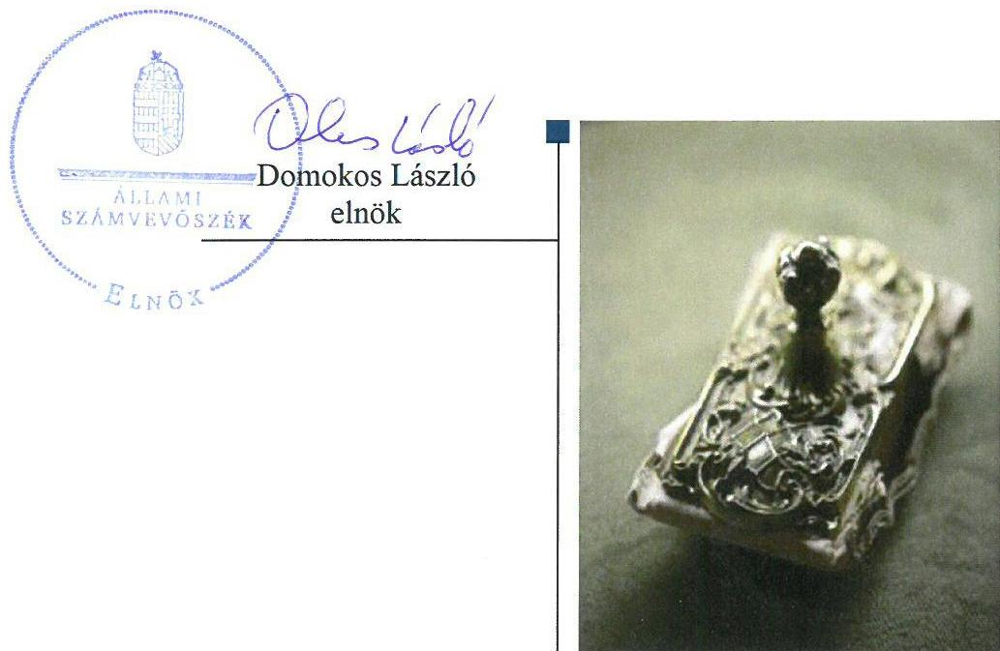
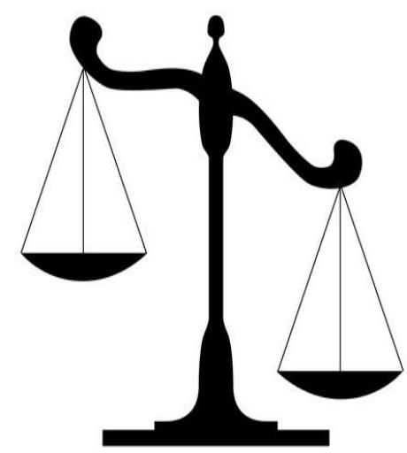
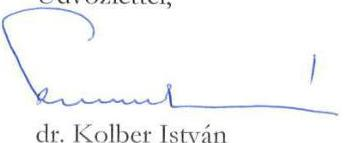
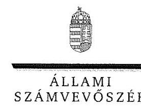

# Jelentés

A költségvetési támogatásban részesülő pártalapítványok 2015–2016. évi gazdálkodása törvényességének ellenőrzése

Új Köztársaságért Alapítvány 2018.

18173 www.asz.hu

---

# Jelentés 

## A költségvetési támogatásban részesülő pártalapítványok 2015-2016. évi gazdálkodása törvényességének ellenőrzése

Új Köztársaságért Alapítvány
2018. O6. hó 28. nap

---

# AZ ELLENŐRZÉST FELÜGYELTE:

- **HOLMAN MAGDOLNA JULIANNA** felügyeleti vezető
- **AZ ELLENŐRZÉST VEZETTE ÉS A VÉGREHAJTÁSÁÉRT FELELŐS:**
  - **DR. GYŐRI GABRIELLA** ellenőrzésvezető
- **A PROGRAM ÖSSZEÁLLÍTÁSÁÉRT FELELŐS:**
  - **TÓTPÁL SZABOLCS** osztályvezető
- **IKTATÓSZÁM:** EL-0336-043/2018
- **TÉMASZÁM:** 2465
- **ELLENŐRZÉS-AZONOSÍTÓ SZÁM:** V081004

Jelentéseink az Országgyűlés számítógépes hálózatán és az Interneta a www.asz.hu címen is olvashatóak.

---

# TARTALOMJEGYZÉK 

- ÖSSZEGZÉS ..... 5
- AZ ELLENŐRZÉS CÉLJA ..... 6
- AZ ELLENŐRZÉS TERÜLETE ..... 7
- AZ ELLENŐRZÉS HÁTTERE, INDOKOLTSÁGA ..... 8
- A JELENTÉS LÉNYEGES KÉRDÉSKÖREI ..... 9
- AZ ELLENŐRZÉS HATÓKÖRE ÉS MÓDSZEREI ..... 10
- MEGÁLLAPÍTÁSOK ..... 12
- JAVASLATOK ..... 15
- MELLÉKLETEK ..... 17
I. sz. melléklet: Értelmező szótár ..... 17
- FÜGGELÉK: ÉSZREVÉTELEK ..... 19
- RÖVIDÍTÉSEK JEGYZÉKE ..... 23

---

.

---

# ÖSSZEGZÉS 

Az Új Köztársaságért Alapítvány a szabályszerű gazdálkodás feltételeit megteremtette, a könyvvezetés és a gazdálkodás során a jogszabályi előírásokat betartotta. A 2014. és 2016. évi tevékenységről szóló jelentéseket a jogszabályi előírásoknak megfelelően készítette el. A vagyoni helyzetet bemutató 2015-2016. évekre vonatkozó egyszerűsített éves beszámolókat a jogszabályi előírásoknak megfelelő leltárral nem támasztotta alá, így nem érvényesült a számviteli törvény szerinti valódiság elve. A 2014. és 2016. években nem a jogszabályi előírások alapján teljesítette a közzétételi kötelezettséget, emiatt az átláthatóság sérült.

## Az ellenőrzés társadalmi indokoltsága

A politikai kultúra fejlesztése érdekében tudományos, ismeretterjesztő, kutatási, oktatási tevékenység folytatása céljából a pártok költségvetési támogatásra jogosult alapítványt hozhatnak létre. Jogszabályi előírások alapján a pártalapítványok gazdálkodása törvényességének ellenőrzésére az Állami Számvevőszék jogosult, ezért kétévente ellenőrzi a költségvetésből támogatásban részesülő pártalapítványoknak a gazdálkodását.

Az Állami Számvevőszék stratégiájában megfogalmazta, hogy az államháztartáson kívülre nyújtott költségvetési támogatások és az ingyenes vagyonjuttatás ellenőrzésével hozzájárul ahhoz, hogy a közpénzeket a civil szervezetek is átlátható módon használják fel. A pártalapítványok gazdálkodása szabályszerűségének bemutatásával az ellenőrzés értékteremtő módon járul hozzá az Állami Számvevőszék stratégiai céljainak megvalósításához, a nyilvánosság megfelelő tájékoztatásához.

## Főbb megállapítások, következtetések, javaslatok

Az Új Köztársaságért Alapítvány alapító okirata és a gazdálkodásra vonatkozó belső szabályozás megfelelt a jogszabályi előírásoknak, ami megteremtette a közpénzekkel való átlátható és ellenőrizhető gazdálkodás alapjait.

A kapott támogatások elszámolása megfelelt a jogszabályi előírásoknak, a ráfordítások elszámolása szabályszerű volt.

Az Új Köztársaságért Alapítvány a 2014. és 2016. évi tevékenységről szóló jelentéseket a jogszabályi előírásoknak megfelelően készítette el. A 2015-2016. évekre vonatkozó éves számviteli beszámolók adatainak valódiságát a jogszabályi előírásoknak megfelelő leltárral nem támasztotta alá. A közzétételi kötelezettségnek az Új Köztársaságért Alapítvány a 2014. és 2016. években nem tett eleget, mert az egyszerűsített éves beszámolóját a jogszabályi előírás ellenére május 31-ig nem tette közzé.

---

# AZ ELLENŐRZÉS CÉLJA 

Az ellenőrzés célja annak megállapítása volt, hogy a pártalapítvány törvényesen gazdálkodott-e, az éves számviteli beszámolók és a tevékenységéről szóló éves jelentések a jogszabályi előírásoknak megfeleltek-e, a könyvvezetés és gazdálkodás során a vonatkozó jogszabályi rendelkezéseket és belső előírásokat betartották-e.

---

# AZ ELLENŐRZÉS TERÜLETE 

## Új Köztársaságért Alapítvány

Az ellenőrzés a Párt tv. ${ }^{1}$ alapján a politikai kultúra fejlesztése érdekében tudományos, ismeretterjesztő, kutatási, oktatási tevékenység folytatása céljából, a Ptk. ${ }^{2}$ szerinti létesítő/alapító okiraton alapuló bírósági nyilvántartásba vétellel létrejött pártalapítványok gazdálkodására terjedt ki. A pártalapítványok törvényes gazdálkodásának (könyvvezetése, beszámolása, jelentéstétele) szabályait alapvetően a Pártalapítványi tv. ${ }^{3}$-en túl, a Számv. tv. ${ }^{4}$ és annak a végrehajtási rendelete a Számviteli vhr. ${ }^{5}$ határozták meg.

A Demokratikus Koalíció - a Párt tv.-ben és a Pártalapítványi tv.-ben biztosított lehetőséggel élve - 2014-ben megalapította az Új Köztársaságért Alapítványt. A Pártalapítványt ${ }^{6}$ a Fővárosi Törvényszék a 83.Pk.60.479/2014/5-I. számú - 2014. december 10-én jogerőre emelkedett - végzésével vette nyilvántartásba.

A Pártalapítvány alapító okirata ${ }^{7}$ szerinti célja: a politikai kultúra fejlesztése érdekében történő politikai képzés, kutatás, tudományos és ismeretterjesztő tevékenység támogatása. Az induló vagyon összegét az Alapító ${ }^{8}$ 0,2 M Ft-ban határozta meg, ami az ellenőrzött időszakban változatlan maradt.

A Pártalapítvány a törvényi előírásoknak megfelelően a 2014. évben 10,1 M Ft, a 2015-2016. években 40,2-40,2 M Ft költségvetési támogatásban részesült, egyéb támogatást nem kapott. A Pártalapítvány az ellenőrzött időszakban gazdasági-vállalkozási tevékenységet nem végzett. A Pártalapítvány - a Ptk. rendelkezéseit betartva - az ellenőrzött időszakban nem volt korlátlan felelősségű tagja más jogalanynak, nem létesített alapítványt és nem csatlakozott alapítványhoz. A Pártalapítványnál az ellenőrzött időszakban külső ellenőrzés lefolytatására nem került sor.

---

# AZ ELLENŐRZÉS HÁTTERE, INDOKOLTSÁGA 

Társadalmi elvárás a közpénzek értékelvű, rendeltetésszerű felhasználása, a közpénzekből nyújtott támogatások átláthatóságának megteremtése, amelyhez az ÁSZ ${ }^{8}$ az államháztartásból nyújtott támogatások ellenőrzésével kíván hozzájárulni. A Párt tv. 9/A § (1) bekezdése alapján a politikai kultúra fejlesztése érekében tudományos, ismeretterjesztő, kutatási, oktatási tevékenység folytatása céljából létrehozott pártalapítványok gazdálkodása törvényességének ellenőrzése - Pártalapítványi tv. 4. § (2) bekezdése értelmében - az ÁSZ feladata. E törvény 4. § (4) bekezdése alapján az ÁSZ kétévente - kötelező jelleggel - ellenőrzi azoknak a pártalapítványoknak a gazdálkodását, amelyek költségvetési támogatásban részesültek.

Az ÁSZ, mint az Országgyűlés ellenőrző szerve a pártalapítványok gazdálkodása törvényességének/szabályszerűségének értékelésével hozzájárul ahhoz, hogy a társadalom objektív képet alkothasson a pártalapítványok működéséről. Az ellenőrzés eredményeinek célzott felhasználói a nyilvánosság, a jogalkotó, továbbá a pártalapítványok esetén azok alapítója és szervei. A jelentésben foglalt megállapítások, következtések és javaslatok alapján a törvényalkotók konkrét lépéseket tehetnek a pártalapítványokra vonatkozó szabályozások megváltoztatása, átláthatóbbá, ellenőrizhetőbbé tétele irányába. Az ellenőrzött szervezetek szintjén a hiányosságok, szabálytalanságok feltárása, az ennek kapcsán megfogalmazott megállapítások elősegíthetik a pártalapítványok szabályszerű gazdálkodását.

---

# A JELENTÉS LÉNYEGES KÉRDÉSKÖREI 

1. Az Új Köztársaságért Alapítvány gazdálkodásának törvényessége biztositott volt-e?
2. Az Új Köztársaságért Alapítvány könyvvezetése és gazdálkodása során a vonatkozó jogszabályi rendelkezéseket és belső elöírásokat betartották-e?
3. Az Új Köztársaságért Alapítvány tevékenységéről szóló éves jelentések, az éves számviteli beszámolók a jogszabályi elöírásoknak megfeleltek-e?

---

# AZ ELLENŐRZÉS HATÓKÖRE ÉS MÓDSZEREI 

## Az ellenőrzés típusa

Szabályszerúségi ellenőrzés.

## Az ellenőrzött időszak

2014. október 1 - 2016. december 31.

## Az ellenőrzés tárgya

Az ellenőrzés tárgyát képezte a pártalapítvány gazdálkodása, a könyvezetés szabályozása és gyakorlata szabályszerűsége, az éves számviteli beszámolókra és a pártalapítvány tevékenységéről szóló éves jelentésekre vonatkozó kötelezettség teljesítése.

Az ellenőrzés kiterjedt minden olyan körülményre és adatra, amely az ÁSZ jogszabályban meghatározott feladatainak teljesítéséhez, valamint a program végrehajtása folyamán felmerült újabb összefüggések feltárásához szükséges volt.

## Az ellenőrzött szervezet

Új Köztársaságért Alapítvány

## Az ellenőrzés jogalapja

Az Alaptörvény ${ }^{10}$ 43. cikk (1) bekezdése, ÁSZ tv. ${ }^{11}$ 1. § (3) bekezdése, 5. § (3) bekezdése, a Pártalapítványi tv. 4. § (2) és (4) bekezdései.

## Az ellenőrzés módszerei

Az ellenőrzést az ÁSZ az Ellenőrzési program szempontjai, az ellenőrzött időszakban hatályos jogszabályok, a jelen ellenőrzésre irányadó ÁSZ módszertan figyelembe vételével végezte.

A pártalapítvány tevékenységéről szóló éves jelentési-, beszámoló- és közzétételi kötelezettséget a 2014. évben létrehozott alapítványok esetében a 2014. év tekintetében is ellenőrizte az ÁSZ. A 2014. évben alapított pártalapítványok esetében az alapítás szabályszerűségét is értékelte.

Az ellenőrzés ideje alatt az ellenőrzött szervezettel történő kapcsolattartás az ÁSZ SZMSZ ${ }^{12}$-ének vonatkozó előírásai alapján történt.

---

Az ellenőrzési kérdések megválaszolásához szükséges bizonyítékok megszerzése az ellenőrzött által rendelkezésre bocsátott dokumentumokra, adatokra alapozva megfigyelés, szemle (szemrevételezés), kérdésfeltevés (információkérés), mintavételezés, valamint elemző eljárás útján történt. A mintavételezés véletlen mintavételi eljárással történt.

Az ellenőrzési bizonyítékként felhasználható adatforrások közé tartoztak egyrészt az Ellenőrzési program részletes szempontjainál felsorolt adatforrások, másrészt minden egyéb - az ellenőrzés folyamán - feltárt, az ellenőrzés szempontjából információt tartalmazó dokumentum.

Az ellenőrzés lefolytatásához az ellenőrzött a tanúsítványok elektronikus kitöltésével, valamint az ÁSZ által kért dokumentumok elektronikus megküldésével szolgáltatott adatokat. Az így rendelkezésre bocsátott adatok, információk, a tanúsítványok adati valódiságának kontrollja az ellenőrzés keretében történt.

---

# 1. Az Új Köztársaságért Alapítvány gazdálkodásának törvényessége biztosított volt-e? 

Összegző megállapítás

A Pártalapítvány a szabályszerű gazdálkodás feltételeit kialakította.

### 1.1. számú megállapítás

A Pártalapítvány gazdálkodása szervezeti kereteinek kialakítása a jogszabályokban előírtaknak megfelelt.

Az alapító okirat - a Ptk., a Párt tv. és a Pártalapítványi tv. rendelkezéseivel összhangban - rögzítette a Pártalapítvány célját, az induló vagyont, a vagyon felhasználásnak módját és kezelésének szabályait, a gazdasági-vállalkozási tevékenység végzésének lehetőségét, valamint a Pártalapítvány ügyvezető szervének hatáskörét és eljárási szabályait.

Az ügyvezető szerv (Kuratórium ${ }^{13}$ ) munkáját a Titkárság ${ }^{14}$ támogatta, amely múködésének szabályait az SZMSZ ${ }_{1-2}{ }^{15}$-ben rögzítették.

A Pártalapítvány beszámolási kötelezettségét a Számviteli vhr.-ben foglaltaknak megfelelően egyszerűsített éves beszámoló elkészítésével teljesítette, amelyet kettős könyvvitel vezetésével támasztott alá.

### 1.2. számú megállapítás

A Pártalapítvány gazdálkodására vonatkozó belső szabályozás megfelelt a Számv. tv. előírásainak.

A Pártalapítvány Számviteli politikáját ${ }^{16}$, Értékelési szabályzatát ${ }^{17}$, Leltározási szabályzatát ${ }^{18}$, Pénzkezelési szabályzatát ${ }^{19}$ és Számlarendjét ${ }^{20}$ a megalakulásának időpontjától - 2014. december 10-től - számított 90 napon belül - a Számv. tv. 14. § (11) bekezdésének és 161. § (5) bekezdésének előírása ellenére - nem készítette el, azokat a Kuratórium 2015. március 26-án hagyta jóvá. A Számv. tv. alapján kötelezően elkészítendő - előzőekben megjelölt - szabályzatok megfeleltek a Számv. tv. előírásainak. A Pártalapítvány gazdálkodására vonatkozó további szabályok az alapító okiratban és az SZMSZ ${ }_{1-2}$-ben kerültek meghatározásra.

A Pártalapítvány a 2015-2016. években nem alakította ki - az Info. tv. ${ }^{21}$ 7. § (2) bekezdésének előírása ellenére - az adatok biztonságának és védelmének érvényre juttatásához szükséges eljárási szabályokat.

---

# 2. Az Új Köztársaságért Alapítvány könyvvezetése és gazdálkodása során a vonatkozó jogszabályi rendelkezéseket és belső előírásokat betartották-e? 

Összegző megállapítás

2.1. számú megállapítás

2.2. számú megállapítás

A Pártalapítvány könyvvezetése és gazdálkodása megfelelt a vonatkozó jogszabályi rendelkezéseknek.

A Pártalapítvány által az ellenőrzött időszakban elfogadott támogatások számviteli elszámolása megfelelt a jogszabályi előírásoknak.

A támogatások számviteli elszámolása és nyilvántartása megfelelt a Számv. tv., a Számviteli vhr., a Számviteli politika, valamint a Számlarend előírásainak. A Pártalapítvány a kapott támogatásokról az éves jelentésekben beszámolt.

A Pártalapítvány ráfordításainak elszámolása az ellenőrzött időszakban szabályszerű volt.

A Pártalapítvány ráfordításainak elszámolása az ellenőrzött időszakban - a Számv. tv., a Számviteli politika, a Számlarend, az SZMSZ ${ }_{1-2}$, és a Pénzkezelési szabályzat előírásainak megfelelően - szabályszerűen történt.

A Pártalapítvány a 2015-2016. években harmadik fél részére összesen 1,95 M Ft cél szerinti támogatást nyújtott. A támogatások elbírálása megfelelt az SZMSZ ${ }_{1-2}$ és a Pályázati szabályzat ${ }^{22}$ előírásainak, a támogatások kifizetését a Számv. tv. alapján a számviteli nyilvántartásokban rögzítették.

A Pártalapítvány a Párt tv. rendelkezéseit betartva az alapító párt részére vagyoni hozzájárulást nem nyújtott.

## 3. Az Új Köztársaságért Alapítvány tevékenységéről szóló éves jelentések, az éves számviteli beszámolók a jogszabályi előírásoknak megfeleltek-e?

Összegző megállapítás

A Pártalapítvány 2014. és 2016. évi tevékenységéről szóló éves jelentések elkészítése megfelelt a jogszabályi előírásoknak. A 2015-2016. évekre vonatkozó számviteli beszámolók adatainak valódiságát a Számv. tv.-nek megfelelő leltárral nem támasztotta alá. A Pártalapítvány a 2014. és 2016. évekre vonatkozó közzétételi kötelezettségét nem a jogszabályi előírások szerint teljesítette.

A Pártalapítvány tevékenységéről szóló 2014. és 2016. évi éves jelentések elkészítése megfelelt a Pártalapítványi tv. előírásainak. A 2015. évi éves jelentés hiányossága volt, hogy - a Pártalapítványi tv. 3/A. § (3) bekezdés d) pontjának rendelkezése ellenére - a cél szerinti juttatások kimutatását nem tartalmazta, csak a támogatottak megnevezését.

---

A Pártalapítvány a 2014. évi tevékenységéről szóló éves jelentését a Magyar Közlöny mellékleteként megjelenő Hivatalos Értesítőben - a Pártalapítványi tv. 3/A. § (5) bekezdésének előírása ellenére - nem tette közzé.

A Pártalapítvány a 2015-2016. évi beszámolók elkészítéséhez, a mérlegtételek alátámasztásához - a Számv. tv. 69. § (1) bekezdésében foglaltak ellenére - nem állított össze olyan leltárt, amely tételesen, ellenőrizhető módon tartalmazta a mérleg fordulónapján meglévő eszközöket és forrásokat mennyiségben és értékben. A saját tőke egyeztetéssel történő leltározását a Pártalapítvány - a Számv. tv. 69. § (4) bekezdésében és a Leltározási szabályzat I. fejezet 4/b) pontjában és III. fejezet 9. pontjában foglaltak ellenére - a 2015-2016. évek vonatkozásában nem végezte el.

A Pártalapítványi tv.-ben előírtaknak megfelelően a Pártalapítvány számviteli beszámolóját a Kuratórium a Számviteli vhr.-ben megjelölt május 31-i határidőt megelőzően mindhárom ellenőrzött évben jóváhagyta. A Pártalapítvány a 2014. és 2016. évi egyszerűsített éves beszámoló tekintetében nem tett eleget a közzétételi kötelezettségének, mert az egyszerűsített éves beszámolóját a Számviteli vhr. 20. § (2) bekezdése ellenére május 31-ig nem tette közzé.

---

# JAVASLATOK 

Az ÁSZ tv. 33. § (1) bekezdésében foglaltak értelmében az ellenőrzött szervezet vezetője köteles a jelentésben foglalt megállapításokhoz kapcsolódó intézkedési tervet összeállítani és azt a jelentés kézhezvételétől számított 30 napon belül az ÁSZ részére megküldeni. Amennyiben az ellenőrzött szervezet vezetője nem küldi meg határidőben az intézkedési tervet, vagy továbbra sem elfogadható intézkedési tervet küld, az Állami Számvevőszék elnöke az ÁSZ tv. 33. § (3) bekezdése a) és b) pontjaiban foglaltakat érvényesítheti.

## Az Új Köztársaságért Alapítvány Kuratóriuma elnökének

1. Intézkedjen az Info tv.-ben elöirtak érvényre juttatásához szükséges eljárási szabályok kialakítására.
(1.2. sz. megállapítás 2. bekezdése alapján)
2. Intézkedjen a könyvek üzleti év végi zárásához, a beszámoló elkészitéséhez, a mérleg tételeinek alátámasztásához a Számv. tv. által elöirt leltár összeállítására.
(3. sz. összegző megállapítás 3. bekezdése alapján)
3. Intézkedjen az egyszerüsített éves beszámoló törvényi elöírások szerinti közzétételi kötelezettségének betartására.
(3. sz. összegző megállapítás 4. bekezdése alapján)

---

.

---

# MELLÉKLETEK 

## I. SZ. MELLÉKLET: ÉRTELMEZŐ SZÓTÁR

alapítvány
gazdálkodó tevékenység
gazdasági-vállalkozási tevékenység
költségvetésből juttatott/nyújtott forrás/támogatás
pártalapítvány

Az alapítvány az alapító által az alapító okiratban meghatározott tartós cél folyamatos megvalósítására létrehozott jogi személy. Az alapító az alapító okiratban meghatározza az alapítványnak juttatott vagyont és az alapítvány szervezetét. Alapítvány nem alapítható gazdaságivállalkozási tevékenység folytatására. Az alapítvány az alapítványi cél megvalósításával közvetlenül összefüggő gazdasági tevékenység végzésére jogosult. Alapítvány nem lehet korlátlan felelősségű tagja más jogalanynak, nem létesíthet alapítványt és nem csatlakozhat alapítványhoz. (Forrás: Ptk. 3:378. §, 3:379. § (1) - (3) bekezdés)
azon tevékenységek összessége, amelyek a civil szervezet vagyoni, pénzügyi, jövedelmi helyzetére kiható gazdasági eseményt eredményeznek. (Forrás: Ectv. 2. § 10. pont.)
A jövedelem- és vagyonszerzésre irányuló vagy azt eredményező, üzletszerűen végzett gazdasági tevékenység, kivéve az adomány (ajándék) elfogadását, a létesítő okiratban meghatározott cél szerinti tevékenységet (ideértve a közhasznú tevékenységet is), - 2015. november 28 -tól - a pénzeszközök betétbe, értékpapírba, társasági részesedésbe történő elhelyezését és az ingatlan megszerzését, használatának átengedését és átruházását. (Forrás: Ectv. 2. § 11. pont.)
a pártalapítványoknak a Párt tv. 9/A. § (1) bekezdése és a Pártalapítványi tv. 1. § előírásainak értelmében, az éves költségvetési törvények szerint-jellemzően az 1. számú melléklet 1. Országgyűlés fejezet 9. Pártalapítványok támogatás címen - az állami költségvetésből juttatott forrás/támogatás.
az államháztartás központi alrendszeréből - a Tb alap kivételével - ellenérték nélkül, pénzben nyújtott költségvetési támogatás (Forrás: Áht. 1. § 14. pont)
a politikai kultúra fejlesztése érdekében, tudományos, ismeretterjesztő, kutatási és oktatási tevékenység folytatása céljából pártok által létrehozott, külön jogszabályban - a Pártalapítványi tv. 1. § és 3. § (1) bekezdésében- meghatározott, jogi személynek minősülő egyéb szervezet (Forrás: Párt tv. 9/A. § (1) bekezdés, Pártalapítványi tv. 1. §, Számv. tv. 3. § (1) bekezdése 4. pont, Számviteli vhr. 2. § (1) bekezdés k) pont, 4. § (1) bekezdés)

---

.

---

# FÜGGELÉK: ÉSZREVÉTELEK 

A jelentéstervezetet a Számvevőszék 15 napos észrevételezésre megküldte az ellenőrzött szervezet vezetőjének az ÁSZ tv. 29. §* (1) bekezdése előírásának megfelelően.
A függelék tartalmazza az ellenőrzött észrevételeit, illetve az el nem fogadott észrevételek elutasításának indoklását.

[^0]
[^0]:    * 29. § (1) Az Állami Számvevőszék az ellenőrzési megállapításait megküldi az ellenőrzött szervezet vezetőjének vagy az általa megbízott személynek, és annak, akinek személyes felelősségét állapította meg.
    (2) Az ellenőrzött szervezet vezetője és a felelősként megjelölt személy az ellenőrzés megállapításaira tizenöt napon belül írásban észrevételt tehet.
    (3) Az Állami Számvevőszék az észrevételre a beérkezésétől számított harminc napon belül írásban válaszol. A figyelembe nem vett észrevételeket köteles a jelentésben feltüntetni, és megindokolni, hogy azokat miért nem fogadta el.

---

# 724 

## 12   Új Köztársaságért Alapítvány

## Domokos László

Állami Számvevőszék elnöke

## Budapest

## Tisztelt Elnök úr!

A költségvetési támogatásban részesülö pártalapítványok 2015-2016. évi gazdálkadása törvényességének ellenörzése Új Köztársaságért Alapítvány címủ számvevőszéki jelentéstervezetet megkaptuk, a jelentéssel kapcsolatosan az alábbi észrevételt tesszük:

A jelentéstervezet szerint „A Pártalapítvány a 2014. évi tevékenységiről szülö éves jelentését a Magyar Közlöny mellékleteként megjelenö Hivatalos Értesitőben - a Pártalapítványi to. 3/A.§ (5) bekezdésének elöirása ellenére - nem tette közzé."

Az Alapítvány Kuratóriuma a megalakulása óta minden évben, májusban elfogadta az éves tartalmi- és pénzügyi beszámolóit. Május 31 -ig minden évben elküldtük a pénzügyi beszámolót a Fővárosi Törvényszékre, illetve intézkedtünk, hogy június végéig a beszámolók megjelenjenek a Magyar Közlöny mellékleteként kiadott Hivatalos Értesítőben. Így történt 2014-ben is. A Hivatalos Értesítő azonban formai változtatást kért, amely kérelem sajnálatosan elkerülte figyelmünket, így csupán 2016-ban derült fény arra, hogy mégsem jelent meg a beszámolónk. Ezt észrevételeztük és a Hivatalos Értesítő 2016. évi 26. számában (2016. VI. 24.) a 2015. évi jelentéssel együtt pótlólagosan közzé tette a 2014. éviegyébként egy hónap tényleges müködésre vonatkozó- tevékenységünkről szóló jelentést.

Az Állami Számvevőszék végleges jelentését követően az észrevételek figyelembevételével elkészítjük az Intézkedési tervünket, amelyet megküldünk az Állami Számvevőszéknek, és a jóváhagyást követően az Intézkedési tervet végrehajtjuk.

Kérem észrevételünk figyelembe vételét.

Budapest, 2018. május 24.
Üdvözlettel,

dr. Kolber István
kuratóriumi elnök
Új Köztársaságért Alapítvány

[^0]
[^0]:    1132 Budapest. Victor Hugo utca 11-15
    Tel.: 06213001111
    info.ilujkoztarsasagert.hu
    www.ujkoztarsasagert.hu

---

ELNÖK

Ikt.szám: EL-0532-007/2018.

Dr. Kolber István úr
Kuratórium elnöke
Új Köztársaságért Alapítvány

# Budapest 

## Tisztelt Elnök Úr!

Az ,,A költségvetési támogatásban részesüló pártalapitványok 2015-2016. évi gazdálkodása törvényességének ellenörzése - Új Köztársaságért Alapitvány" címủ számvevőszéki jelentéstervezetre tett észrevételét köszönettel megkaptam.

Az Állami Számvevőszék észrevételekre vonatkozó álláspontjáról a felügyeleti vezető által készített tájékoztatást csatoltan megküldöm.

Tájékoztatom Elnök urat, hogy a jelentésben - az Állami Számvevőszékről szóló 2011. évi LXVI. törvény 29. § (3) bekezdése alapján - a figyelembe nem vett észrevételt szerepeltetjük az elutasítás indokának feltüntetésével együtt.

Budapest, 2018. CC. hó $l h$. nap

Melléklet: Tájékoztatás el nem fogadott észrevételrót ${ }^{\text {T }}$ ELNÖK

---

# Tájékoztatás el nem fogadott észrevételről 

„A költségvetési támogatásban részesülö pártalapítványok 2015-2016. évi gazdálkodása törvényességének ellenörzése - Új Köztársaságért Alapitvány" címủ számvevőszéki jelentéstervezetre tett észrevételét áttekintettük, annak kezeléséről az alábbi tájékoztatást adom.
A Pártalapítvány 2014. évi tevékenységéről szóló jelentés közzétételére irányuló megállapításra tett észrevételét nem fogadtuk el. A Pártalapítványi törvény 3/A. § (5) bekezdés rendelkezése szerint az alapítvány köteles a tevékenységéről szóló jelentését a tárgyévet követő évben, legkésőbb június 30 -áig a Magyar Közlöny mellékleteként megjelenő Hivatalos Értesítőben, továbbá saját honlapján közzétenni. Észrevételében is megerősítette a számvevőszéki jelentéstervezetben foglalt megállapítást, mely szerint a Pártalapítvány a Pártalapítványi tv. 3/A. § (5) bekezdés előirása ellenére - az abban rögzített határidőben - az éves jelentést a Hivatalos Értesítőben nem tette közzé.
Ezek alapján észrevétele a megállapításhoz kiegészítő információként szolgál, a jelentés megállapításait nem módosítja.

Budapest, 2018. június hó $1 h$. nap

Holman Magdolna felügyeleti vezető

---

# RÖVIDÍTÉSEK JEGYZÉKE 

${ }^{1}$ Párt tv.
${ }^{2}$ Ptk.
${ }^{3}$ Pártalapítványi tv.
${ }^{4}$ Számv. tv
${ }^{5}$ Számviteli vhr.
${ }^{6}$ Pártalapítvány
${ }^{7}$ alapító okirat
${ }^{8}$ Alapító
${ }^{9}$ ÁsZ
${ }^{10}$ Alaptörvény
${ }^{11}$ ÁsZ tv.
${ }^{12}$ ÁsZ SZMSZ
${ }^{13}$ Kuratórium
${ }^{14}$ Titkárság
${ }^{15} \mathrm{SZMSZ}_{1}$

SZMSZ ${ }_{2}$

${ }^{16}$ Számviteli politika
${ }^{17}$ Értékelési szabályzat
${ }^{18}$ Leltározási szabályzat
${ }^{19}$ Pénzkezelési szabályzat
${ }^{20}$ Számlarend
${ }^{21}$ Info. tv.
${ }^{22}$ Pályázati szabályzat
1989. évi XXXIII. törvény a pártok működéséről és gazdálkodásáról (hatályos: 1989. október 30-tól)
2013. évi V. törvény a Polgári Törvénykönyvről (hatályos: 2014. március 15-től)
2003. évi XLVII. törvény a pártok működését segítő tudományos, ismeretterjesztő, kutatási, oktatási tevékenységet végző alapítványokról (hatályos: 2003. július 1-jétől)
2000. évi C. törvény a számvitelről (hatályos: 2001. január 1-jétől)
224/2000. (XII. 19.) Korm. rendelet a számviteli törvény szerinti egyes egyéb szervezetek beszámoló készítési és könyvvezetési kötelezettségének sajátosságairól (hatályos: 2001. január 1-jétől 2016. december 31-ig)
Új Köztársaságért Alapítvány
Új Köztársaságért Alapítvány Alapító Okirata (hatályos: 2014. október 1-jétől)
Demokratikus Koalíció
Állami Számvevőszék
Magyarország Alaptörvénye (kihirdetve: 2011. április 25-én)
2011. évi LXVI törvény az Állami Számvevőszékről (hatályos: 2011. július 1-jétől)

Állami Számvevőszák Szervezeti és Működési Szabályzata
Új Köztársaságért Alapítvány Kuratóriuma
Új Köztársaságért Alapítvány Titkársága
Új Köztársaságért Alapítvány Kuratóriuma 15/2015. (03. 26.) ÚKA számú határozatával elfogadott Szervezeti és Müködési Szabályzat (hatályos: 2015. március 26-tól)
Új Köztársaságért Alapítvány Kuratóriuma 15/2015. (03. 26.) ÚKA számú határozatával elfogadott Szervezeti és Müködési Szabályzatának a Kuratórium 2016. november 26-i ülésén elfogadott - egységes szerkezetbe foglalt módosítása (hatályos: 2016. november 26-tól)
Új Köztársaságért Alapítvány Kuratóriuma 9/2015. (03. 26.) ÚKA számú határozatával elfogadott Számviteli Politika (hatályos: 2015. március 26-tól)
Új Köztársaságért Alapítvány Kuratóriuma 11/2015. (03. 26.) ÚKA számú határozatával elfogadott Eszközök és Források Értékelési Szabályzata (hatályos: 2015. március 26-tól)
Új Köztársaságért Alapítvány Kuratóriuma 12/2015. (03. 26.) ÚKA számú határozatával elfogadott Leltározási Szabályzat (hatályos: 2015. március 26-tól)
Új Köztársaságért Alapítvány Kuratóriuma 13/2015. (03. 26.) ÚKA számú határozatával elfogadott Pénzkezelési Szabályzat (hatályos: 2015. március 26-tól)
Új Köztársaságért Alapítvány Kuratóriuma 10/2015. (03. 26.) ÚKA számú határozatával elfogadott Számlarend (hatályos: 2015. március 26-tól)
2011. évi CXII. törvény az információs önrendelkezési jogról és az információszabadságról (hatályos: 2011. július 27-től)
Új Köztársaságért Alapítvány Kuratóriuma 23/2015. (10. 22.) ÚKA számú határozatával elfogadott Pályázati Szabályzat (hatályos: 2015. október 22-től)

---

# ÁLLAMI SZÁMVEVŐSZÉK 

1052 Budapest, Apáczai Csere János utca 10.
Levélcím: 1364 Budapest 4. Pf. 54
Telefon: +36 14849100 Telefax: +36 14849200
www.asz.hu