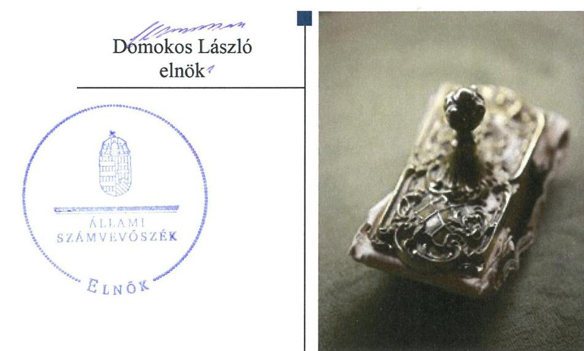
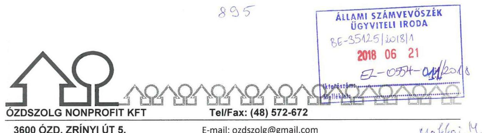
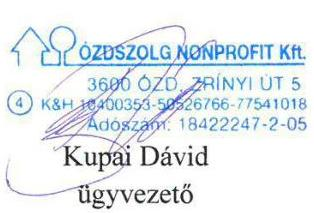
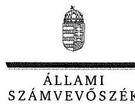
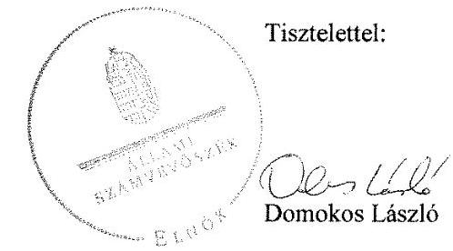

# Jelentés 

## Az önkormányzatok gazdasági társaságai

Az önkormányzatok többségi tulajdonában lévő gazdasági társaságok gazdálkodásának ellenőrzése - ÓZDSZOLG Szolgáltató Nonprofit Kft.
2018.

---

# Jelentés 

## Az önkormányzatok gazdasági társaságai

Az önkormányzatok többségi tulajdonában lévő gazdasági társaságok gazdálkodásának ellenőrzése - ÓZDSZOLG Szolgáltató Nonprofit Kft.
2018. 07. hó 12. nap

---

# AZ ELLENŐRZÉST FELÜGYELTE:

## MAKKAI MÁRIA felügyeleti vezető

## AZ ELLENŐRZÉST VEZETTE ÉS A VÉGREHAJTÁSÁÉRT FELELŐS:

### VERTKOVCZI MÁRIA ellenőrzésvezető

### A PROGRAM ÖSSZEÁLLÍTÁSÁÉRT FELELŐS:

### TÓTPÁL SZABOLCS osztályvezető

---

**IKTATÓSZÁM:** EL-0149-042/2018.

**TÉMASZÁM:** 2447

**ELLENŐRZÉS-AZONOSÍTÓ SZÁM:** V079339

---

Jelentéseink az Országgyűlés számítógépes hálózatán és az Interneta a www.asz.hu címen is olvashatóak.

---

# TARTALOMJEGYZÉK 

■ ÖSSZEGZÉS ..... 5
■ AZ ELLENŐRZÉS CÉLJA ..... 6
■ AZ ELLENŐRZÉS TERÜLETE ..... 7
■ AZ ELLENŐRZÉS HÁTTERE, INDOKOLTSÁGA ..... 8
■ A JELENTÉS LÉNYEGES KÉRDÉSKÖREI ..... 9
■ AZ ELLENŐRZÉS HATÓKÖRE ÉS MÓDSZEREI ..... 10
■ MEGÁLLAPÍTÁSOK ..... 12
■ JAVASLATOK ..... 15
■ MELLÉKLETEK ..... 17
I. sz. melléklet: Értelmező szótár ..... 17
■ FÜGGELÉK: ÉSZREVÉTELEK ..... 19
■ RÖVIDÍTÉSEK JEGYZÉKE ..... 27

---

.

---

# ÖSSZEGZÉS 

Az ÓZDSZOLG Szolgáltató Nonprofit Kft. nem biztositotta a szabályszerü müködés kereteit. Gazdálkodása, vagyongazdálkodása nem volt szabályszerü. Az éves beszámolókban szereplő eszköz, forrás értékek valódisága nem volt alátámasztott. A Társaság nem biztositotta müködésének, gazdálkodásának átláthatóságát. A szabályozási és leltár hiányosságokkal az Ügyvezető hozzájárult a korrupció feltételeinek megteremtéséhez.

## Az ellenőrzés társadalmi indokoltsága

Magyarországon az önkormányzatok kötelező és önként vállalt feladataik vonatkozásában is egyre szélesebb körben alkalmazzák a költségvetésen kívüli feladatellátást, ezáltal - a nonprofit szervezetek mellett - az önkormányzati tulajdonú gazdasági társaságok is kiemelt fontosságú szerephez jutottak. Ezen belül kiemelt jelentőségú számos önkormányzati gazdasági társaság múködése abból a szempontból is, hogy gazdálkodásának egyes elemei befolyásolják az önkormányzati alszektor hiányát és az államadósságot.

Az Állami Számvevőszék által az erdőgazdálkodáshoz, természetvédelemhez kapcsolódó tevékenységet folytató ÓZDSZOLG Szolgáltató Nonprofit Kft.-nél végzett ellenőrzést az a társadalmi elvárás indokolta, hogy a közfeladatellátásból adódóan a város lakosságának széles köre kerülhet kapcsolatba a Társasággal, az általa szervezett köz-munka-programokkal.

## Főbb megállapítások, következtetések, javaslatok

Ózd Város Önkormányzata kialakította a tulajdonosi joggyakorlás kereteit, szabályozta a Társaság feladatellátását és rendszeres beszámolási kötelezettségeket írt elő a részére. A Társaság beszámolóit szabályszerűen megtárgyalta és elfogadta, a tulajdonosi joggyakorlása szabályszerű volt.

A Társaság számviteli szabályzatai nem feleltek meg a jogszabályi előírásoknak, ezáltal nem biztosították a szabályszerű múködés kereteit. A Társaság bevételeinek, ráfordításainak elszámolása nem volt szabályszerű, a közhasznú és a vállalkozási tevékenység elszámolásainak elkülönítését a számviteli nyilvántartásaiban nem biztosította. A Társaság az éves számviteli beszámolóinak mérlegtételeit leltárral nem támasztotta alá, ezáltal a mérlegben szereplő eszköz és forrás értékek valódisága nem volt alátámasztott.

A Társaság a jogszabályban előírt közérdekú adatainak közzétételét nem teljesítette, nem alakította ki a tevékenységének nyomon követését biztosító rendszerét, ezáltal nem biztosította múködésének, gazdálkodásának az átláthatóságát. A Társaság a jogszabályban előírt a kormányzati szektorba sorolt egyéb szervezetekre vonatkozó adatszolgáltatási kötelezettségeit nem teljesítette.

A megállapítások alapján az Állami Számvevőszék Ózd Város Önkormányzata polgármesterének egy javaslatot, az ÓZDSZOLG Szolgáltató Nonprofit Kft. ügyvezetőjének tíz javaslatot fogalmazott meg.

---

# AZ ELLENŐRZÉS CÉLJA 

Az ellenőrzés célja annak értékelése volt, hogy az önkormányzat vagyongazdálkodási tevékenysége során szabályszerűen gyakorolta-e tulajdonosi jogait; a gazdasági társaság szabályozottsága, gazdálkodása és vagyongazdálkodási tevékenysége, bevételeinek és ráfordításainak elszámolása megfelelt-e a jogszabályi és tulajdonosi előírásoknak; a gazdasági társaság kötelezettségállománya jelent-e kockázatot a múködésre, valamint a gazdálkodás átláthatósága és elszámoltathatósága érdekében biztosítva volt-e a szolgáltatás dijának megalapozottsága szabályszerű önköltségszámítással. Az ellenőrzés célja továbbá annak megítélése, hogy a kormányzati szektorba sorolt önkormányzati tulajdonban (résztulajdonban) lévő gazdálkodó szervezetek gazdálkodásának a kormányzati szektor hiányára és az államadósságra befolyással bíró elemei a jogszabályi előírásoknak megfeleltek-e.

---

# AZ ELLENŐRZÉS TERÜLETE 

## ÓZDSZOLG Szolgáltató Nonprofit Kft. és a tulajdonosi jogokat gyakorló Ózd Város Önkormányzata

Ózd Város Önkormányzata 2009. évben alapította a 100\%-os tulajdonában álló ÓZDSZOLG Szolgáltató Nonprofit Kft.-t 57,0 M Ft jegyzett tőkével.

A Társaság ${ }^{1}$ közhasznú tevékenység keretében közfeladatként végzett erdőgazdálkodási és természetvédelmi tevékenységet. Ezen belül energiaerdők gondozásával, önkormányzati erdők ápolásával, szociális TÜZÉP üzemeltetésével, elhanyagolt területek rendbetételével, gyümölcskertek, szociális és csemetekertek, levendulaültetvények, illetve dísznövénykertek kialakításával foglalkozott.

Az ellenőrzött időszakban a Polgármester² személye a 2014. évtől változott, a Jegyző ${ }^{3}$ személyében nem történt változás. A Társaság Ügyvezetője ${ }^{4}$ 2015-ben változott. A foglalkoztatottak száma a Társaságnál 2013. év végén 11 fő, 2016. év végén 3 fő volt.

A Társaság az Önkormányzattól ${ }^{5}$ vagyonkezelésbe, használatra, illetve üzemeltetésre átvett, valamint saját eszközökkel látta el a tevékenységét.

Az Önkormányzat a közfeladat ellátásához szükséges vagyont Üzemeltetési Szerződés ${ }^{6}$, Vagyonkezelési Szerződés ${ }^{7}$, valamint Használati Megállapodás ${ }^{8}$ keretében biztosította a Társaság részére. Az Önkormányzat az üzemeltetési-, vagyonkezelési- és használati díjak mértékét az egyes szerződésekben szabályozta. A Társaság önköltségszámítási szabályzat készítésére nem volt kötelezett.

A Társaság 2013. június 28-ától NGM közlemény ${ }^{9}$ alapján kormányzati szektorba sorolt egyéb szervezetnek minősült. A Társaság a 2013-2016. években nem rendelkezett a Gst. hatálya alá tartozó adósságállománnyal.

---

# AZ ELLENŐRZÉS HÁTTERE, INDOKOLTSÁGA 

Az önkormányzatok többségi tulajdonában álló gazdasági társaságok ellenőrzése kiemelten fontos a vagyon megőrzése, megóvása érdekében, valamint a kormányzati szektor elszámolásaiban megjelenő önkormányzati tulajdonú gazdálkodó szervezetek esetében, amelyekkel szemben alapvető követelmény, hogy gazdálkodásuk, működésük szabályszerű, az általuk szolgáltatott adatok minél megbízhatóbbak legyenek. A feladatellátás költségeinek, ráfordításainak alakulása a lakosság széles rétegét érinti.

Az ellenőrzés feltárhatja, hogy az önkormányzat a feladatellátásához rendelt vagyon működtetését a tulajdonostól elvárható gondossággal vé-gezte-e, a feladatot ellátó gazdasági társaság a létesítő okiratban, szolgáltatási szerződésben foglaltak betartásával biztosította-e a feladat ellátását. Az ellenőrzés eredményeképp meghatározhatóvá válnak a költségvetési hiányt befolyásoló szervezetek kockázatai, lehetővé válik ezen kockázatok csökkentése. Az ellenőrzés rávilágíthat arra, hogy a gazdasági társaság a vagyon használatával biztosította-e a szolgáltatás folytatásának feltételeit, az önkormányzat tulajdonosi felügyelete hozzájárult-e a szabályszerű gazdálkodáshoz és feladatellátáshoz. A megállapítások alapján megfogalmazott számvevőszéki javaslatok hasznosítása elősegítheti a meglévő hibák megszüntetését. A jó gyakorlatok bemutatásával az ÁSZ ${ }^{10}$ hozzájárulhat a követendő megoldások megismertetéséhez, terjesztéséhez.

---

# A JELENTÉS LÉNYEGES KÉRDÉSKÖREI 

1. Az önkormányzat tulajdonosi joggyakorlása szabályszerű volt-e?
2. A gazdasági társaság szabályozottsága és gazdálkodása, vagyongazdálkodási tevékenysége szabályszerű volt-e?

---

# AZ ELLENŐRZÉS HATÓKÖRE ÉS MÓDSZEREI 

## Az ellenőrzés típusa

Megfelelőségi ellenőrzés

## Az ellenőrzött időszak

2013. január 1 - 2016. december 31.

## Az ellenőrzés tárgya

Özd Város Önkormányzata tulajdonosi joggyakorlása, valamint az ÖZDSZOLG Szolgáltató Nonprofit Kft. gazdálkodásának szabályozottsága és szabályszerűsége, továbbá az önkormányzati alszektorba sorolt gazdasági társaság gazdálkodásának a kormányzati szektor hiányára és az államadósságra befolyással bíró elemei.

Az ellenőrzés kiterjedt minden olyan körülményre és adatra, amely az ÁSZ jogszabályban meghatározott feladatainak teljesítéséhez, valamint a program végrehajtása folyamán felmerült újabb összefüggések feltárásához szükséges.

## Az ellenőrzött szervezet

- ÖZDSZOLG Szolgáltató Nonprofit Kft.
- Özd Város Önkormányzata

## Az ellenőrzés jogalapja

Az ellenőrzés jogalapját az ÁSZ tv. ${ }^{11}$ 1. § (3) bekezdése és 5. § (3)-(5) bekezdései képezték.

## Az ellenőrzés módszerei

Az ellenőrzést a nemzetközi standardokat irányadónak tekintve az ellenőrzési program ellenőrzési kérdései, az ellenőrzött időszakban hatályos jogszabályok, az ellenőrzés szakmai szabályok és módszertanok figyelembe vételével végeztük.

Az ellenőrzés ideje alatt az ellenőrzött szervezettel történő kapcsolattartást az ÁSZ Szervezeti és Müködési Szabályzatának vonatkozó előírásai alapján biztosítottuk.

---

Az ellenőrzés a tulajdonosi jogokat gyakorló önkormányzatra, és az ellenőrzött gazdasági társaságra terjedt ki.

A gazdasági társaságnál mintavétellel ellenőriztük a ráfordításokat és a bevételeket, ezen belül az anyagjellegú ráfordításokat, az egyéb ráfordításokat, a pénzügyi műveletek ráfordításait és a rendkívüli ráfordításokat, illetve az értékesítés nettó árbevételét, az egyéb bevételeket, a pénzügyi műveletek bevételeit valamint a rendkívüli bevételeket. Mintavétel történt továbbá a tárgyi eszközök növekedési tételeiből. A minták kiválasztása rétegzett mintavétel alkalmazásával történt.

Az ellenőrzési kérdések megválaszolásához szükséges bizonyítékok megszerzése a következő ellenőrzési eljárások alkalmazásával történt: megfigyelés, kérdésfeltevés (információkérés), összehasonlítás, valamint elemző eljárás. Az ellenőrzési bizonyítékként felhasználható adatforrások közé tartoztak egyrészt az ellenőrzési programban felsorolt adatforrások, másrészt adatforrás lehet még minden - az ellenőrzés folyamán - feltárt, az ellenőrzés szempontjából információkat tartalmazó dokumentum.

Az ellenőrzést a kérdésekre adott válaszok kiértékelésével, valamint a megjelölt adatforrások, a csatolt tanúsítványok felhasználásával, továbbá az adott időszakban hatályos jogszabályok figyelembe vételével folytattuk le.

A mintavétellel ellenőrzött területek esetében minden egyes tétel vonatkozásában a szabályszerűségre vonatkozó kérdéseket tettünk fel, amelyek eredménye összesítésre került. Szabályszerűnek értékeltünk egy ellenőrzött területet, amennyiben 95\%-os bizonyossággal a teljes sokaságban az átlagos hibaarány legfeljebb 10\%, nem szabályszerűnek, amennyiben 10\%-nál magasabb arányt képviselt. A ráfordítások elszámolására és a vagyonnyilvántartásra vonatkozó véletlen mintavételt kockázati alapú kiválasztással egészítettük ki, amelynek során évente a három legnagyobb összegű tételt választottuk ki.

---

# 1. Az önkormányzat tulajdonosi joggyakorlása szabályszerű volt-e? 

Összegző megállapítás Az Önkormányzat tulajdonosi joggyakorlása szabályszerű volt.

A TÁRSASÁG FELETTI TULAJDONOSI JOGOKAT az önkormányzati SZMSZ ${ }^{12}$ és a Vagyongazdálkodási rendelet ${ }^{13}$ alapján a Képviselő-testület gyakorolta. A Gt. ${ }^{14}$, a Ptk. ${ }^{15}$, valamint a Taktv. ${ }^{16}$ előírásaival összhangban az Alapító ${ }^{17}$ a Társaság Alapító Okiratában ${ }^{18}$ három tagú Felügyelő Bizottságot ${ }^{19}$ jelölt ki. A Társaság képviseletére kijelölt személyek képviselettel összefüggő feladatait, beszámolási kötelezettségét az Alapító Okirat tartalmazta.

Könyvvizsgálatra a Társaság a Számv. tv. ${ }^{20}$ alapján nem volt kötelezett, ugyanakkor az Alapító független Könyvvizsgálót ${ }^{21}$ jelölt ki az Alapító Okiratban.

A Felügyelő Bizottság a Gt. és a Ptk. előírásai alapján rendelkezett ügyrenddel.

Az Alapító a Taktv. 5. § (3) bekezdésében foglaltak ellenére nem alkotott szabályzatot a vezető tisztségviselők, Felügyelő Bizottsági tagok, valamint az Mt. ${ }^{22}$ 208. §-ának hatálya alá eső munkavállalók javadalmazása, valamint a jogviszony megszűnése esetére biztosított juttatások módjának, mértékének elveiről, annak rendszeréről.

Az Alapító a Gt., a Ptk. előírásainak megfelelően az egyszerűsített éves számviteli beszámolókkal, közhasznúsági jelentésekkel kapcsolatos elfogadó határozatát a Felügyelő Bizottság és a Könyvvizsgáló írásbeli jelentésének birtokában hozta meg.

Az Alapító tulajdonosi ellenőrzés keretében ellenőrizte a Társaság gazdálkodását. Az ellenőrzés nem tárt fel hiányosságokat.

---

# 2. A gazdasági társaság szabályozottsága és gazdálkodása, vagyongazdálkodási tevékenysége szabályszerű volt-e? 

Összegző megállapítás

A Társaság szabályozottsága és gazdálkodása, vagyongazdálkodása nem volt szabályszerű. Az egyszerűsített éves beszámolói nem voltak szabályszerűek. Az Ügyvezető a szabályozási és leltár hiányosságokkal hozzájárult a korrupció feltételeinek megteremtéséhez. A közérdekú adatainak közzétételét, a kormányzati szektorba sorolt egyéb szervezetekre vonatkozó adatszolgáltatási kötelezettségét nem teljesítette.
2.1. számú megállapítás

A Társaság számviteli szabályozottsága és a tevékenységgel kapcsolatos elszámolásai nem voltak szabályszerűek.

SZÁMVITELI POLITIKÁVAL ${ }^{23}$, és annak keretében a Számv. tv.-nek megfelelően eszközök és források Értékelési, leltárkészítési és leltározási szabályzattal a Társaság rendelkezett.

A Számv. tv. 14. § (5) bekezdés d) pontjában foglaltak ellenére a Társaság nem rendelkezett pénzkezelési szabályzattal.

A Társaság rendelkezett számlarenddel és bizonylati renddel, azonban a számlarend nem felelt meg a Számv. tv. 161. § (2) bekezdés a) pontjában foglalt előírásnak, mivel nem tartalmazta minden alkalmazásra kijelölt számla számjelét és megnevezését.

A Társaság bevételeinek, ráfordításainak elszámolása nem volt szabályszerű:
$\longrightarrow$ az Mötv. ${ }^{24}$ 109. § (7) bekezdésében, a Számv. tv. 161/A. § (2) bekezdésében foglaltak, továbbá a Vagyonkezelési szerződés előírásai ellenére nem gondoskodott a nyilvántartásaiban a vagyonkezelt eszközök használatából, múködtetéséből származó bevételek, közvetlen költségek és ráfordítások elkülönített nyilvántartásáról,
$\longrightarrow$ a Számv. tv. 167. § (1) bekezdés h) pontjában foglaltakkal ellentétben a bizonylatokon nem szerepelt a könyvelés módjára, a könyvviteli számlákra való utalás,
$\longrightarrow$ a személyi jellegú ráfordítások elszámolása esetében a Számv. tv. 165. § (1)-(2) bekezdéseivel ellentétben a számfejtett bért munkaszerződés, munkavégzést igazoló dokumentum nem támasztotta alá,
Az eszközök üzembe helyezését a Számv. tv. 52. § (2) bekezdésével ellentétben hitelt érdemlően nem dokumentálta a Társaság.

---

### 2.2. számú megállapítás

A Társaság számviteli beszámolói nem voltak szabályszerűek a mérleget alátámasztó leltár hiánya és a közhasznúsági mellékletben szereplő adatok alátámasztásának hiánya miatt. A közérdekú adatokkal kapcsolatos közzétételi kötelezettségét a Társaság nem teljesítette.

AZ EGYSZERŰSÍTETT ÉVES BESZÁMOLÓ készítési kötelezettségét a Társaság teljesítette. Az Alapító által elfogadott egyszerűsített éves beszámolókat és közhasznúsági mellékleteket a Számv. tv. és a Civil tv. előírásainak megfelelően letétbe helyezte, illetve közzé tette a Társaság.

A Számv. tv. 69. § (1)-(2) bekezdésében előírtak ellenére a mérlegtételeket leltárral nem támasztotta alá a Társaság, ezáltal a mérlegben szereplő eszköz, forrás értékek valódisága nem volt alátámasztott. A Civil tv. ${ }^{25} 46 . \S$ (1) bekezdésben, illetve a Civil. rend. ${ }^{26}$ 12. § (1) bekezdésben előírt közhasznúsági melléklet bevétel és ráfordítás adatainak átláthatósága nem volt biztosított, mivel a Társaság a Számv. tv. 161/A. § (2) bekezdésében foglaltak ellenére a közhasznú és a vállalkozási tevékenységből származó bevételeket és ráfordításokat nem különítette el. Ez alapján a Társaság megsértette a Számv. tv. 15. § (4) bekezdésében meghatározott világosság elvét.

A szabályozási és nyilvántartási hiányosságok ellenére az egyszerűsített éves beszámolókat a Könyvvizsgáló korlátozás nélküli hitelesítő záradékkal látta el.

A Társaság a Vagyonkezelési Szerződésben, Használati Megállapodásban és az Üzemeltetési Szerződésben az Alapító által előírt adatszolgáltatási kötelezettségét teljesítette.

A Társaság az Info tv. ${ }^{27}$ 30. § (6) bekezdésében előírtak ellenére a közérdekú adatok megismerésére irányuló igények teljesítésének rendjét rögzítő szabályzatot nem készítette el.

A Társaság az Info tv. 37. § (1) bekezdésében foglaltak ellenére az Info tv. 1. sz. mellékletében előírt közérdekú adatok közzétételére vonatkozó kötelezettségét nem teljesítette.
2.3. számú megállapítás

A Társaság a tevékenységének nyomon követését biztosító rendszerét nem alakította ki. A kormányzati szektorba sorolt egyéb szervezetekre vonatkozó adatszolgáltatási kötelezettségét nem teljesítette.

A Bkr. ${ }^{28}$ 2014. január 1-jétől hatályos 54/A. §-ban, továbbá a 10. §-ban foglaltak ellenére a Társaság nem alakította ki a tevékenységének és a célok megvalósításának nyomon követését biztosító rendszerét.

A kormányzati szektorba sorolt egyéb szervezetek számára az Áht. ${ }^{29}$ 107. § (1) bekezdésében előírt, az Ávr. ${ }^{30}$ 5. számú melléklet 23. pontja szerinti adatszolgáltatási kötelezettségét a Társaság nem teljesítette.

---

# JAVASLATOK 

Az ÁSZ tv. 33. § (1) bekezdésében foglaltak értelmében az ellenőrzött szervezet vezetője köteles a jelentésben foglalt megállapításokhoz kapcsolódó intézkedési tervet összeállítani és azt a jelentés kézhezvételétől számított 30 napon belül az ÁSZ részére megküldeni. Amennyiben az intézkedési tervet az ellenőrzött szervezet vezetője nem küldi meg határidőben, vagy továbbra sem elfogadható intézkedési tervet küld, az ÁSZ elnöke az ÁSZ törvény 33. § (3) bekezdés a)-b) pontjaiban foglaltakat érvényesítheti.

## Ózd Város polgármesterének

1. Kezdeményezze a vezető tisztségviselők, felügyelőbizottsági tagok, valamint az Mt. 208. §-ának hatálya alá eső munkavállalók javadalmazása, valamint a jogviszony megszünése esetére biztositott juttatások módjának, mértékének elveire, annak rendszerére vonatkozó szabályzat megalkotását.

1. sz. megállapítás 4. bekezdése alapján)

## ÓZDSZOLG Szolgáltató Nonprofit Kft. ügyvezetőjének

1. Intézkedjen a jogszabályi előírásoknak megfelelő pénzkezelési szabályzat elkészitéséről.
(2.1. sz. megállapítás 2. bekezdése alapján)
2. Intézkedjen a számlarend módosításáról, hogy az feleljen meg a hatályos Számv. tv. előírásainak.
(2.1. sz. megállapítás 3. bekezdése alapján)
3. Intézkedjen a Társaság által vagyonkezelt vagyon használatával, müködtetésével kapcsolatos elkülönített nyilvántartás jogszabályi előírásnak megfelelő vezetéséről.
(2.1.sz. megállapítás 4. bekezdés első részbekezdése alapján)
4. Intézkedjen a Társaság bevételei és ráfordításai Számv. tv. előírásainak megfelelő bizonylattal történő alátámasztásáról.
(2.1. sz. megállapítás 4. bekezdés második és harmadik részbekezdése alapján)

---

5. Intézkedjen az eszközök üzembe helyezése Számv. tv. előírásainak megfelelő dokumentálásáról.
(2.1. sz. megállapítás 5. bekezdése alapján)
6. Intézkedjen a jogszabályi előírásoknak megfelelően a mérleg tételeinek leltárral való alátámasztásáról.
(2.2. sz. megállapítás 2. bekezdés első mondata alapján)
7. Intézkedjen a Társaság nyilvántartásaiban a közhasznú és vállalkozási tevékenység jogszabályi előírásoknak megfelelő elkülönítéséről.
(2.2. sz. megállapítás 2. bekezdés második mondata alapján)
8. Intézkedjen az Info. tv. előírásainak megfelelően a közérdekü adatok megismerésére irányuló igények teljesítésének rendjét rögzítő szabályzat elkészítéséről és a közérdekü adatok közzétételéről.
(2.2. sz. megállapítás 5-6. bekezdései alapján)
9. Intézkedjen a Társaság tevékenységének és a célok megvalósításának nyomon követését biztosító rendszer kialakításáról
(2.3. sz. megállapítás 1. bekezdése alapján)
10. Intézkedjen a Társaság Áht.-ben előírt adatszolgáltatási kötelezettségének teljesitéséről
(2.3. sz. megállapítás 2. bekezdése alapján)

---

# MELLÉKLETEK 

- I. SZ. MELLÉKLET: ÉRTELMEZŐ SZÓTÁR
gazdasági társaság
gazdálkodó szervezet
kormányzati szektorba sorolt egyéb szervezet
nonprofit gazdasági társaság

Ptk 3.88. § (1) bekezdése szerint „a gazdasági társaságok üzletszerű közös gazdasági tevékenység folytatására, a tagok vagyoni hozzájárulásával létrehozott, jogi személyiséggel rendelkező vállalkozások, amelyekben a tagok a nyereségből közösen részesednek, és a veszteséget közösen viselik".
A Ptk. 685. § c) pontja szerint gazdálkodó szervezet: „az állami vállalat, az egyéb állami gazdálkodó szerv, a szövetkezet, a lakásszövetkezet, az európai szövetkezet, a gazdasági társaság, az európai részvénytársaság, az egyesülés, az európai gazdasági egyesülés, az európai területi együttműködési csoportosulás, az egyes jogi személyek vállalata, a leányvállalat, a vízgazdálkodási társulat, az erdő birtokossági társulat, a végrehajtói iroda, az egyéni cég, továbbá az egyéni vállalkozó." (2014. 03.15-ig hatályos)
az Áht. 3. § (2) és (3) bekezdésében foglaltakon kívül az Európai Közösséget létrehozó szerződéshez csatolt, a túlzott hiány esetén követendő eljárásról szóló jegyzőkönyv alkalmazásáról szóló 2009. május 25-i 479/2009/EK rendelet (a továbbiakban: 479/2009/EK rendelet) szerint a kormányzati szektorba sorolt szervezet (Áht. 1. § (12))

Civil tv. 9/F. § (2) bekezdése szerint „az a gazdasági társaság minősül nonprofit gazdasági társaságnak és cégnevében az a gazdasági társaság tüntetheti fel a nonprofit jelleget, amelynek létesítő okirata tartalmazza, hogy a gazdasági társaság tevékenységéből származó nyereség a tagok között nem osztható fel, hanem az a gazdasági társaság vagyonát gyarapítja." (hatályos 2014. március 15-től)

---

.

---

# FÜGGELÉK: ÉSZREVÉTELEK 

A jelentéstervezetet a Számvevőszék 15 napos észrevételezésre megküldte az ellenőrzött szervezetek vezetőinek az ÁSZ tv. 29. §* (1) bekezdése előírásának megfelelően.

Az ÁSZ a jelentéstervezetet észrevételezésre megküldte Ózd Város polgármesterének és az ÓZDSZOLG Szolgáltató Nonprofit Kft. ügyvezetőjének.
Ózd Város polgármestere észrevételezési jogával nem élt. Az ÓZDSZOLG Szolgáltató Nonprofit Kft. ügyvezetőjének észrevételét és az arra adott választ a függelék alább tartalmazza.

[^0]
[^0]:    * 29. § (1) Az Állami Számvevőszék az ellenőrzési megállapításait megküldi az ellenőrzött szervezet vezetőjének vagy az általa megbízott személynek, és annak, akinek személyes felelősségét állapította meg.
    (2) Az ellenőrzött szervezet vezetője és a felelősként megjelölt személy az ellenőrzés megállapításaira tizenöt napon belül írásban észrevételt tehet.
    (3) Az Állami Számvevőszék az észrevételre a beérkezésétől számított harminc napon belül írásban válaszol. A figyelembe nem vett észrevételeket köteles a jelentésben feltüntetni, és megindokolni, hogy azokat miért nem fogadta el.

---

# ÁLLAMI SZÁMVEVŐSZÉK 

## Domokos László

elnök
részére

## Budapest

Apáczai Csere János u. 10.
1052

Tisztelt Domokos László Elnök Úr!

Hivatkozva EL-0554-010/2018. iktatószámú levelükre, az alábbi észrevételeket tesszük.

## 1. megállapítás

Intézkedjen a jogszabályi elöirásoknak megfelelö pénzkezelési szabályzat elkészitéséröl.
Cégünk rendelkezik Pénzkezelési Szabályzattal, annak bemutatása szükség esetén pótolható.

## 2. megállapítás

Intézkedjen a számlarend módosításáról, hogy az feleljen meg a hatályos Számv. tv. elöirásainak.

A Számlarend módosításáról gondoskodtunk.

## 3. megállapítás

Intézkedjen a Társaság által vagyonkezelt vagyon használatával, müködtetésével kapcsolatos elkülönített nyilvántartás jogszabályi elöirásnak megfelelö vezetéséről.

A cégünk által kezelt vagyon elkülönített nyilvántartása könyvviteli szempontból megfelelő, annak dokumentumait egy előző adatszolgáltatás keretein belül rendelkezésükre bocsátottuk.

---

# 4. megállapítás 

Intézkedjen a Társaság bevételei és ráfordításai Számv. tv. elöirásainak megfelelö bizonylattal történő alátámasztásáról.

Az a megállapítás, miszerint az ÓZDSZOLG Nonprofit Kft. bizonylatain nem szerepel a könyvelés módjára, a könyvviteli számlákra való utalás, helytálló.

A személyi jellegű ráfordítások elszámolását természetesen minden alkalommal alátámasztotta munkaszerződés, munkavégzést igazoló dokumentum, amennyiben szükséges, csatoltan megküldjük.

## 5. megállapítás

Intézkedjen az eszközök üzembe helyezése Számv. tv. elöirásainak megfelelö dokumentálásáról.

Az előző adatszolgáltatások határidejének rövidsége miatt nem kerültek feltöltésre a rendelkezésre álló megfelelő dokumentumok, de cégünk minden esetben gondoskodott a beszerzésre került eszközök előírás szerinti üzembe helyezéséről.

## 6. megállapítás

Intézkedjen a jogszabályi elöírásoknak megfelelően a mérleg tételeinek leltárral való alátámasztásáról.

Társaságunk rendelkezik a mérleg tételeinek leltárral való alátámasztását igazoló dokumentumokkal, amennyiben szükséges, azok utólagos bemutatása lehetséges.

## 7. megállapítás

Intézkedjen a Társaság nyilvántartásaiban a közhasznú és vállalkozási tevékenység jogszabályi elöirásoknak megfelelő elkülönitéséröl.

A közhasznú és a vállalkozási tevékenység el volt különítve, és gondunk lesz rá, hogy a költségek és ráfordítások jelenjenek meg a számlatükörben.

## 8. megállapítás

Intézkedjen az Info. tv. elöírásainak megfelelően a közérdekü adatok megismerésére irányuló igények teljesitésének rendjét rögzítő szabályzat elkészitéséről és a közérdekü adatok közzétételéről.

Cégünk a közérdekủ adatok megismerésére irányuló igények teljesítésének rendjét rögzítő szabályzatot nem készítette el, ellenben a közérdekủ adatok közzététele minden esetben megtörtént.

---

# 9. megállapítás 

Intézkedjen a Társaság tevékenységének és a célok megvalósitásának nyomon követését biztosító rendszer kialakításáról.

Cégünk nem alakított ki tevékenységek és célok megvalósitásának nyomon követését biztosító rendszert.

## 10. megállapítás

Intézkedjen a Társaság Áht,-ben elöirt adatszolgáltatási kötelezettségének teljesitéséröl.
Cégünk az Állami Számvevőszék rendelkezésére bocsátotta a részletes fökönyvi kivonatokat éves lebontásban, melyek tartalmazzák a kért adatokat.

Özd, 2018. június 18.

Üdvözlettel:

---

ELNÖK

Ikt.szám: EL-0554-012/2018.

# Kupai Dávid Elek úr 

ügyvezető

## ÓZDSZOLG Szolgáltató Nonprofit Kft.

## Ózd

## Tisztelt Ügyvezető Úr!

„Az önkormányzatok gazdasági társaságai - Az önkormányzatok többségi tulajdonában lévő gazdasági társaságok gazdálkodásának ellenörzése - ÓZDSZOLG Szolgáltató Nonprofit Kft." címmel készített számvevőszéki jelentéstervezetre tett észrevételét köszönettel megkaptam.

Az Állami Számvevőszék észrevételre vonatkozó álláspontjáról a felügyeleti vezető által készített részletes tájékoztatást mellékelten megküldöm.

Tájékoztatom Ügyvezető urat, hogy a számvevőszéki jelentésben - az Állami Számvevőszékről szóló 2011. évi LXVI. törvény 29. § (3) bekezdése alapján - a figyelembe nem vett észrevételeket szerepeltetjük, annak indoklásával, hogy azokat az Állami Számvevőszék miért nem fogadta el.

Budapest, 2018. CG hó 23 nap

Melléklet: Tájékoztatás az észrevételek kezeléséről

---

# Tájékoztatás   az észrevételek kezeléséről 

„Az önkormányzatok gazdasági társaságai - Az önkormányzatok többségi tulajdonában lévő gazdasági társaságok gazdálkodásának ellenörzése - ÖZDSZOLG Szolgáltató Nonprofit Kft." című jelentéstervezetre 2018. június 21-én érkezett észrevételt áttekintettük, annak kezelésével kapcsolatban a következő tájékoztatást adom.

## 1. A pénzkezelési szabályzattal kapcsolatban tett észrevételre adott válasz

Tájékoztatom, hogy az Állami Számvevőszék ellenőrzési megállapításai az Állami Számvevőszékről szóló 2011. évi LXVI. törvénynek (ÁSZ tv.) megfelelően minden esetben az ellenőrzés során bekért és az arra nyitva álló határidőn belül rendelkezésre bocsátott dokumentumokon alapulnak. A Társaság adatszolgáltatása nem tartalmazta az észrevételben hivatkozott dokumentumot. Mindezek alapján az észrevételt nem fogadjuk el, az ÁSZ megállapítása helytálló, a jelentéstervezet módosítása nem indokolt.

## 2. A számlarend módosításával kapcsolatban tett észrevételre adott válasz

A jelentéstervezetben rögzített megállapítással és a kapcsolódó javaslattal összefüggésben tett intézkedésről szóló tájékoztatást köszönjük. Az észrevételben foglaltak az ellenőrzés megállapítását megerősítik, a jelentéstervezet módosítása nem indokolt.

## 3. A Társaság által vagyonkezelt vagyon használatával, müködtetésével kapcsolatos elkülönített nyilvántartással kapcsolatban tett észrevételre adott válasz

Az ÁSZ vonatkozó megállapítása a vagyonkezelt eszközök használatából, működtetéséből származó bevételek, közvetlen költségek és ráfordítások elkülönített nyilvántartásának hiányát állapította meg a Társaság által rendelkezésre bocsátott dokumentumokból. Az észrevétel a vagyonkezelt vagyon nyilvántartására vonatkozik, ami nem cáfolja az ÁSZ megállapítását. Fentiek alapján az észrevételt nem fogadjuk el, a jelentéstervezet módosítása nem indokolt.

## 4. A Társaság bevételei és ráfordításai Számv. tv. előírásainak megfelelő bizonylattal történő alátámasztásával kapcsolatban tett észrevételére adott válasz

A Társaság észrevétele megerősíti, hogy a bizonylatokon nem szerepelt a könyvelés módjára, a könyvviteli számlákra való utalás, ezért az erre vonatkozó megállapítás helytálló, annak módosítása nem indokolt. A személyi jellegű ráfordítások elszámolásának szabályszerűségére vonatkozó ÁSZ megállapítás a törvényes határidőn belül, a Társaság által rendelkezésre bocsátott, az ellenőrzéshez kiválasztott könyvelési tételeket alátámasztó dokumentáción alapulnak, amelyek között a kifogásolt dokumentumok - munkaszerződés, munkavégzést igazoló dokumentumok - nem szerepeltek. Ez alapján az ÁSZ megállapítása helytálló, nem indokolt a jelentéstervezet módosítása.
5. Az eszközök üzembe helyezése dokumentálásával kapcsolatban tett észrevételére adott válasz

---

Az ÁSZ az ellenőrzés lefolytatásához az ÁSZ. tv. 28.§ (1)-(2) bekezdése alapján kérte a Társaság adatszolgáltatását, mely szerint a közreműködésre felhívott szervezet az ÁSZ részére - annak kérésére soron kívül, de legkésőbb öt munkanapon belül - az ellenőrzés lefolytatása érdekében szükséges adatokat és dokumentumokat rendelkezésre bocsátani, illetve a kapcsolódó tájékoztatást köteles megadni. Fentiek alapján az észrevételt nem fogadjuk el, a hivatkozott dokumentumok szabályosságáról az ellenőrzés nem tudott meggyőződni, a megállapítás módosítása nem indokolt.

# 6. A jogszabályi előírásoknak megfelelően a mérleg tételeinek leltárral való alátámasztásával kapcsolatban tett észrevételére adott válasz 

A számvitelről szóló 2000 . évi C törvény 69 . § (1) bekezdése szerint a könyvek üzleti év végi zárásához, a beszámoló elkészítéséhez, a mérleg tételeinek alátámasztásához olyan leltárt kell összeállítani és e törvény előírásai szerint megőrizni, amely tételesen, ellenőrizhető módon tartalmazza - az (5) bekezdés figyelembevételével - a vállalkozónak a mérleg fordulónapján meglévő eszközeit és forrásait mennyiségben és értékben. A Társaság által rendelkezésre bocsátott dokumentumok és Ügyvezető úr által 2017.07.07-én adott Teljességi és hitelességi nyilatkozat alapján a jelentéstervezet megállapítása helytálló, módosítása nem indokolt.

## 7. A közhasznú és vállalkozási tevékenység jogszabályi előírásoknak megfelelő elkülönítésével kapcsolatban tett észrevételére adott válasz

Az ÁSZ megállapítását, mely szerint a Társaság a Számv. tv. 161/A. § (2) bekezdésében foglaltak ellenére a közhasznú és a vállalkozási tevékenységből származó bevételeket és ráfordításokat nem különítette el, az észrevétel megerősíti. A megállapítás módosítása fentiek alapján nem indokolt.

## 8. A közérdekü adatok megismerésére irányuló igények teljesítésének rendjét rögzítő szabályzat elkészítésére és a közérdekü adatok közzétételére vonatkozó észrevételére adott válasz

Az észrevétel megerősíti ÁSZ közérdekủ adatok megismerésére irányuló igények teljesítésének rendjét rögzítő szabályzat elkészítésére vonatkozóan tett megállapítását, annak módosítása nem indokolt. A Társaság az Info tv. 1. sz. melléklete általános közzétételi listában előírt közérdekủ adatait saját honlapján vagy annak hiányában az Info tv. 33.§ (3) bekezdése szerint teheti közzé. A Társaság közérdekủ adatai az Info. tv. 1. sz. mellékletében előírtak szerint internetes honlapon, digitális formában, bárki számára, személyazonosítás nélkül, korlátozástól mentesen, kinyomtatható és részleteiben is adatvesztés és -torzulás nélkül kimásolható módon, a betekintés, a letöltés, a nyomtatás, a kimásolás és a hálózati adatátvitel szempontjából is díjmentesen nem hozzáférhetőek. Fentiek alapján a megállapítás módosítása nem indokolt.

## 9. A Társaság tevékenységének és a célok megvalósításának nyomon követését biztosító rendszer kialakítására tett észrevételre adott válasz

Az észrevétel megerősíti, hogy a Társaság nem alakított ki a tevékenységek és célok megvalósításának nyomon követését biztosító rendszert, ezért az ÁSZ megállapításának módosítása nem indokolt.

---

# 10. A Társaság Áht.-ben elöírt adatszolgáltatási kötelezettségének teljesítésével kapcsolatban tett észrevételre válasz 

A Társaság 2013. június 28 -ától NGM közlemény alapján kormányzati szektorba sorolt egyéb szervezetnek minősült. A jogszabályban előírt bejelentési, adatszolgáltatási kötelezettségének teljesítésére vonatkozó dokumentumokat - melyek nem azonosak a Társaság részletes fökönyvi kivonatával, - nem bocsátották az ÁSZ rendelkezésére. Az észrevételt nem fogadjuk el, a megállapítás helytálló, módosítása nem indokolt.

Budapest, 2018. 06. hó 28 nap

Makkai Mária
félügyeleti vezető

---

# RÖVIDÍTÉSEK JEGYZÉKE 

${ }^{1}$ Társaság
${ }^{2}$ Polgármester
${ }^{3}$ Jegyző
${ }^{4}$ Ügyvezető
${ }^{5}$ Önkormányzat
${ }^{6}$ Üzemeltetési Szerződés
${ }^{7}$ Vagyonkezelési Szerződés
${ }^{8}$ Hasznosítási Megállapodás
${ }^{9}$ NGM közlemény
${ }^{10}$ ÁSZ
${ }^{11}$ ÁSZ tv.
${ }^{12}$ SZMSZ
${ }^{13}$ Vagyongazdálkodási rendelet
${ }^{14}$ Gt.
${ }^{15}$ Ptk.
${ }^{16}$ Taktv.
${ }^{17}$ Alapító
${ }^{18}$ Alapító Okirat
${ }^{19}$ Felügyelő Bizottság
${ }^{20}$ Számv. tv.
${ }^{21}$ Könyvvizsgáló
${ }^{22}$ Mt.
${ }^{23}$ Számviteli Politika
${ }^{24}$ Mötv.
${ }^{25}$ Civil tv.
${ }^{26}$ Civil rend.

ÖZDSZOLG Szolgáltató Nonprofit Kft.
Özd Város Önkormányzatának polgármestere
Özd Város Önkormányzatának jegyzője
ÖZDSZOLG Szolgáltató Nonprofit Kft. ügyvezetője
Özd Város Önkormányzata
Özd Város Önkormányzata és ÖZDSZOLG Szolgáltató Nonprofit Kft. között létrejött Üzemeltetési szerződés (hatályos 2013. január 24-étől, 2013. február 6ától, 2014. január 1-jétől)
Özd Város Önkormányzata és ÖZDSZOLG Szolgáltató Nonprofit Kft. között létrejött Vagyonkezelési szerződés, (hatályos 2013. december 19-étől)
Özd Város Önkormányzata és ÖZDSZOLG Szolgáltató Nonprofit Kft. között létrejött Hasznosítási megállapodás és módosítása (hatályos 2013. szeptember 26-ától, 2013. december 20-ától)
A kormányzati szektorba sorolt egyéb szervezetekről szóló NGM közlemény (hatályos 2013. június 28-tól, 2015. december 30-tól)
Állami Számvevőszék
Állami Számvevőszékről szóló 2011. LXVI. tv. (hatályos 2011. július 1-jétől)
Özd Város Önkormányzata Képviselő-testületének 4/2013. (II.27.) önkormányzati rendelete és módosításai a Képviselő-testület Szervezeti és Működési Szabályzatáról
Özd Város Önkormányzata Képviselő-testületének 3/2013. (II.27.) önkormányzati rendelete és módosításai az önkormányzat vagyonáról, a vagyontárgyak feletti tulajdonosi jogok gyakorlásáról
2006. évi IV. törvény a gazdasági társaságokról (hatályos 2014. március 14-éig)
2013. évi V. törvény a Polgári Törvénykönyvről (hatályos 2014. március 15-étől)
2009. évi CXXII. törvény a köztulajdonban álló gazdasági társaságok takarékosabb müködéséről
Özd Város Képviselő-testülete, a Társaság Alapítója
ÖZDSZOLG Szolgáltató Nonprofit Korlátolt Felelősségű Társaság Alapító okirata és módosításai (hatályos 2012. november 22-étől, 2014. október 28-ától, 2015. szeptember 23-ától)
ÖZDSZOLG Szolgáltató Nonprofit Kft. Felügyelő Bizottsága
2000. évi C. törvény a számvitelről (hatályos: 2001. január 1-jétől)
ÖZDSZOLG Szolgáltató Nonprofit Kft. Könyvvizsgálója
2012. évi I. törvény a munka törvénykönyvéről

ÖZDSZOLG Szolgáltató Nonprofit Kft. Számviteli politika (hatályos 2016. október 1jétől)
2011. évi CLXXXIX. törvény Magyarország helyi önkormányzatairól (hatályos: 2012. január 1-jétől)
2011. évi CLXXV. törvény az egyesülési jogról, a közhasznú jogállásról, valamint a civil szervezetek müködéséről és támogatásáról (hatályos: 2011. december 22étől)
350/2011. (XII.30.) Kormányrendelet a civil szervezetek gazdálkodása, az adománygyűjtés ás a közhasznúság egyes kérdéseiről

---

${ }^{27}$ Info tv.
${ }^{28}$ Bkr.
${ }^{29}$ Áht.
${ }^{30}$ Ávr.

Az információs önrendelkezési jogról és az információszabadságról szóló 2011. évi CXII törvény (hatályos: 2011. július 27-étől)
A költségvetési szervek belső kontrollrendszeréről és belső ellenőrzéséről szóló 370/2011. (XII.31.) Kormányrendelet (hatályos: 2011. december 31-étől)
2011. évi CXCV törvény az államháztartásról (hatályos: 2011. december 31-étől)

368/2011. (XII.31.) Kormányrendelet az államháztartásról szóló törvény végrehajtásáról

---

# ÁLLAMI SZÁMVEVŐSZÉK 

1052 Budapest, Apáczai Csere János utca 10.
Levélcím: 1364 Budapest 4. Pf. 54
Telefon: +36 14849100 Telefax: +36 14849200
www.asz.hu