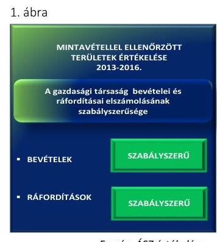
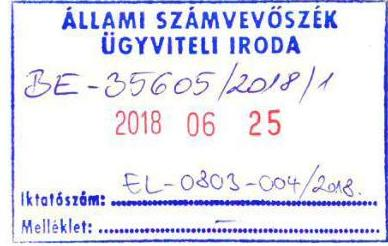
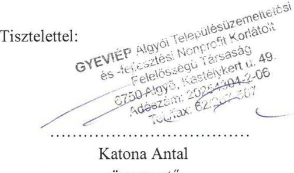
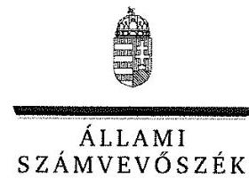
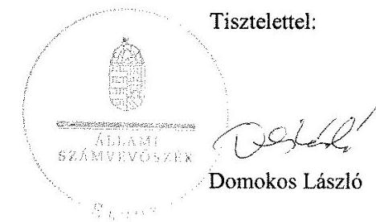

# Jelentés 

## Az önkormányzatok gazdasági társaságai

Az önkormányzatok többségi tulajdonában lévő gazdasági társaságok gazdálkodásának ellenőrzése - GYEVIÉP Algyői
Településüzemeltetési és -fejlesztési Nonprofit Kft.
2018.

---

# Jelentés 

## Az önkormányzatok gazdasági társaságai

Az önkormányzatok többségi tulajdonában lévő gazdasági társaságok gazdálkodásának ellenőrzése - GYEVIÉP Algyői
Településüzemeltetési és -fejlesztési Nonprofit Kft.
2018. 11. hó 12. nap

18175
www.asz.hu

---

# AZ ELLENŐRZÉST FELÜGYELTE:

## MAKKAI MÁRIA felügyeleti vezető

## AZ ELLENŐRZÉST VEZETTE ÉS A VÉGREHAJTÁSÁÉRT FELELŐS:

### SALI SÁNDORNÉ ellenőrzésvezető

## A PROGRAM ÖSSZEÁLLÍTÁSÁÉRT FELELŐS:

### TÓTPÁL SZABOLCS osztályvezető

---

**IKTATÓSZÁM:** EL-0160-083/2018.

**TÉMASZÁM:** 2447

**ELLENŐRZÉS-AZONOSÍTÓ SZÁM:** V079350

---

Jelentéseink az Országgyűlés számítógépes hálózatán és az Interneten a www.asz.hu címen is olvashatóak.

---

# TARTALOMJEGYZÉK 

■ ÖSSZEGZÉS ..... 5
■ AZ ELLENŐRZÉS CÉLJA ..... 6
■ AZ ELLENŐRZÉS TERÜLETE ..... 7
■ AZ ELLENŐRZÉS HÁTTERE, INDOKOLTSÁGA ..... 8
■ A JELENTÉS LÉNYEGES KÉRDÉSKÖREI ..... 9
■ AZ ELLENŐRZÉS HATÓKÖRE ÉS MÓDSZEREI ..... 10
■ MEGÁLLAPÍTÁSOK ..... 12
■ JAVASLATOK ..... 15
■ MELLÉKLETEK ..... 17
I. sz. melléklet: Értelmező szótár ..... 17
II. sz. melléklet: A Társaság bevételeinek, ráfordításainak, valamint adózott eredményének alakulása 2013-2016 között (adatok M Ft) ..... 18
■ FÜGGELÉK: ÉSZREVÉTELEK ..... 19
■ RÖVIDÍTÉSEK JEGYZÉKE ..... 25

---

.

---

# ÖSSZEGZÉS 

A GYEVIÉP Algyői Településüzemeltetési és -fejlesztési Nonprofit Kft. szabályozottsága, valamint gazdálkodása, vagyongazdálkodása nem volt szabályszerű, ezzel az elszámoltathatóság, valamint a vagyon védelme nem volt biztosított. A beszámolási és az adatszolgáltatási kötelezettségének nem az előírások szerint tett eleget. A Társaság a közérdekű adatokat nem tette közzé, ezáltal a működése nem volt átlátható.

## Az ellenőrzés társadalmi indokoltsága

Az Állami Számvevőszék kiemelt célja, hogy a helyi önkormányzatok gazdálkodásában rejlő pénzügyi kockázatok feltárásával, az államháztartáson kívülre nyújtott költségvetési támogatások és ingyenes vagyonjuttatások, valamint az államháztartáson kívül működő feladatellátó rendszerek ellenőrzéseivel hozzájáruljon ahhoz, hogy a közpénzeket az államháztartáson kívül működő szervezetek is átlátható, rendezett módon használják fel.

Az Állami Számvevőszék céljaival és a társadalmi igénnyel összhangban, valamint a gazdasági társaságok kiemelt fontosságú szerepe miatt került sor a GYEVIÉP Algyői Településüzemeltetési és -fejlesztési Nonprofit Korlátolt Felelősségű Társaság ellenőrzésére.

## Főbb megállapítások, következtetések, javaslatok

Algyő Nagyközség Önkormányzat a GYEVIÉP Algyői Településüzemeltetési és -fejlesztési Nonprofit Kft. feletti tulajdonosi jogait szabályszerűen gyakorolta.

A Társaság szabályozottsága nem felelt meg a jogszabályi előírásoknak, mert a számviteli politikát a jogszabályi változás ellenére nem módosította, a közérdekű adatigénylés teljesítésének a rendjét, valamint a közérdekű adatok közzétételét nem szabályozta, továbbá a közérdekű adatait nem tette közzé. A 2016. évtől az előírás ellenére nem alakította ki a tevékenységének, a célok megvalósításának nyomon követését biztosító rendszert.

A GYEVIÉP Algyői Településüzemeltetési és -fejlesztési Nonprofit Kft. 2013-2016. évi egyszerűsített éves beszámolói nem voltak leltárral alátámasztva, továbbá a 2014. és a 2015. évek egyszerűsített beszámolóinak mérlegeiben a kezelésében levő vagyont nem szerepeltette, ezért az egyszerűsített éves beszámolók nem adtak megbízható és valós képet a vagyoni és pénzügyi helyzetről, továbbá a leltározás elmaradása következtében a vagyon megléte, megőrzése nem volt alátámasztott. A 2014-2016. évek egyszerűsített éves beszámolói kiegészítő mellékletében a vagyonkezelésbe vett eszközök értékét nem mutatta be legalább a mérlegtételek szerinti bontásban.

A Társaság a kormányzati szektorba sorolt szervezetekre vonatkozó adatszolgáltatási kötelezettségének a 2016. évet érintően nem tett eleget.

A megállapítások alapján az Állami Számvevőszék Algyő Nagyközség Önkormányzat polgármesterének egy javaslatot, a GYEVIÉP Algyői Településüzemeltetési és -fejlesztési Nonprofit Kft. ügyvezetőjének hat javaslatot fogalmazott meg.

---

# AZ ELLENŐRZÉS CÉLJA 

Az ellenőrzés célja annak értékelése volt, hogy az önkormányzat vagyongazdálkodási tevékenysége során szabályszerűen gyakorolta-e tulajdonosi jogait; a gazdasági társaság szabályozottsága, gazdálkodása és vagyongazdálkodási tevékenysége, bevételeinek és ráfordításainak elszámolása megfelelt-e a jogszabályi és tulajdonosi előírásoknak, valamint a gazdasági társaság kötelezettségállománya jelentett-e kockázatot a működésre. Az ellenőrzés célja továbbá annak megítélése volt, hogy a kormányzati szektorba sorolt önkormányzati tulajdonban (résztulajdonban) lévő gazdálkodó szervezetek gazdálkodásának a kormányzati szektor hiányára és az államadósságra befolyással bíró elemei a jogszabályi előírásoknak megfeleltek-e.

---

# **AZ ELLENŐRZÉS TERÜLETE**

## **Algyő Nagyközség Önkormányzat és a kizárólagos tulajdonában lévő GYEVIÉP Algyői Településüzemeltetési és -fejlesztési Nonprofit Korlátolt Felelősségű Társaság**

A GYEVIÉP Településüzemeltetési és -fejlesztési Nonprofit Kft.-t Algyő Nagyközség Önkormányzat 1999. január 1-jén egyszemélyes társaságként közfeladatok ellátására alapította. A jegyzett tőke összege az alapításkor 3,0 M Ft volt, mely az alapítás óta nem változott. A Társaság közhasznú jogállású szervezetként működött.

A Társaság a településfejlesztéshez, településrendezéshez, a környezet védelméhez, a helyi közutak és közterületek fenntartásához, a köztisztaság és településtisztaság biztosításához, az egészséges életmód közösségi feltételeinek elősegítéséhez kapcsolódóan közfeladatokat látott el, valamint végezte a köztemető, továbbá kulturális- és sportlétesítmények üzemeltetését.

A közfeladat ellátását szolgáló vagyont az Önkormányzat 2013. év végéig Üzemeltetési szerződéssel, ezt követően Vagyonkezelési szerződéssel adta át a Társaságnak. Az Önkormányzat és a Társaság a közfeladatok ellátására évente kötött Megbízási szerződést és Megállapodást. Az Önkormányzat a temetői közszolgáltatások díját – az 1999. évi XLIII. törvény szerint – önkormányzati rendeletben határozta meg.

A Társaság a Számv. tv. 155. § (3) bekezdésben foglalt előírás alapján könyvvizsgálatra nem volt kötelezett, azonban az Alapító előírta számára. Az önköltségszámítási szabályzat készítése alól a Számv. tv. 14. § (6) bekezdése alapján mentesült, más gazdasági társaságban tulajdoni részesedéssel nem rendelkezett. A Társaság a 2016. évben kormányzati szektorba sorolt egyéb szervezetnek minősült.

A Társaságnál az ügyvezető személye az ellenőrzött időszak alatt nem változott, az Önkormányzat esetében a polgármester és a jegyző személye egyszer változott.

---

# AZ ELLENŐRZÉS HÁTTERE, INDOKOLTSÁGA 

AZ ÖNKORMÁNYZATOK TÖBBSÉGI TULAJDONÁBAN ÁLLÓ GAZDASÁGI TÁRSASÁGOK ellenőrzése kiemelten fontos a vagyon megőrzése, megóvása érdekében, valamint a kormányzati szektor elszámolásaiban megjelenő önkormányzati tulajdonú gazdálkodó szervezetek esetében, amelyekkel szemben alapvető követelmény, hogy gazdálkodásuk, működésük szabályszerű, az általuk szolgáltatott adatok minél megbízhatóbbak legyenek. A feladatellátás költségeinek, ráfordításainak alakulása a lakosság széles rétegét érinti.

ELLENŐRZÉS FELTÁRHATJA, hogy az önkormányzat a feladatellátásához rendelt vagyon működtetését a tulajdonostól elvárható gondossággal végezte-e, a feladatot ellátó gazdasági társaság a létesítő okiratban, szolgáltatási szerződésben foglaltak betartásával biztosította-e a feladat ellátását. Az ellenőrzés eredményeképp meghatározhatóvá válnak a költségvetési hiányt befolyásoló szervezetek kockázatai, lehetővé válik ezen kockázatok csökkentése. Az ellenőrzés rávilágíthat arra, hogy a gazdasági társaság a vagyon használatával biztosította-e a szolgáltatás folytatásának feltételeit, az önkormányzat tulajdonosi felügyelete hozzájárult-e a szabályszerű gazdálkodáshoz és feladatellátáshoz. A megállapítások alapján megfogalmazott számvevőszéki javaslatok hasznosítása elősegítheti a meglévő hibák megszüntetését. A jó gyakorlatok bemutatásával az ÁSZ $^{13}$ hozzájárulhat a követendő megoldások megismertetéséhez, terjesztéséhez.

---

# A JELENTÉS LÉNYEGES KÉRDÉSKÖREI 

1. Az Önkormányzat tulajdonosi joggyakorlása szabályszerű volt-e?
2. A Társaság szabályozottsága, valamint gazdálkodása, vagyongazdálkodása szabályszerű volt-e?

---

# AZ ELLENŐRZÉS HATÓKÖRE ÉS MÓDSZEREI 

## Az ellenőrzés típusa

Megfelelőségi ellenőrzés.

## Az ellenőrzött időszak

2013. január 1-jétől 2016. december 31-ig tartó időszak.

## Az ellenőrzés tárgya

Algyő Nagyközség Önkormányzatnak a GYEVIÉP Algyői Településüzemeltetési és -fejlesztési Nonprofit Korlátolt Felelősségű Társaság feletti tulajdonosi joggyakorlása, valamint a GYEVIÉP Algyői Településüzemeltetési és -fejlesztési Nonprofit Korlátolt Felelősségű Társaság gazdálkodásának szabályozottsága és szabályszerűsége.

Az ellenőrzés kiterjedt minden olyan körülményre és adatra, amely az ÁSZ jogszabályban meghatározott feladatainak teljesítéséhez, valamint a program végrehajtása folyamán felmerült újabb összefüggések feltárásához szükséges volt.

## Az ellenőrzött szervezet

Algyő Nagyközség Önkormányzat, valamint a GYEVIÉP Algyői Településüzemeltetési és -fejlesztési Nonprofit Korlátolt Felelősségű Társaság.

## Az ellenőrzés jogalapja

Az ellenőrzés jogszabályi alapját az az Állami Számvevőszékről szóló 2011. évi LXVI. törvény 1. § (3) bekezdése és 5. § (3)-(5) bekezdései képezték.

## Az ellenőrzés módszerei

Az ellenőrzést a nemzetközi standardokat irányadónak tekintve az ellenőrzési program ellenőrzési kérdései, az ellenőrzött időszakban hatályos jogszabályok, az ellenőrzés szakmai szabályok és módszertanok figyelembe vételével végeztük.

Az ellenőrzés ideje alatt az ellenőrzött szervezettel történő kapcsolattartást az ÁSZ Szervezeti és Működési Szabályzatának vonatkozó előírásai alapján biztosítottuk.

---

Az ellenőrzési kérdések megválaszolásához szükséges bizonyítékok megszerzése a következő ellenőrzési eljárások alkalmazásával történt: megfigyelés, kérdésfeltevés (információkérés), összehasonlítás, valamint elemző eljárás. Az ellenőrzési bizonyítékként felhasználható adatforrások közé tartoztak egyrészt az ellenőrzési programban felsorolt adatforrások, másrészt adatforrás volt még minden - az ellenőrzés folyamán - feltárt, az ellenőrzés szempontjából információkat tartalmazó dokumentum.

Az ellenőrzést a kérdésekre adott válaszok kiértékelésével, valamint a megjelölt adatforrások, a csatolt tanúsítványok felhasználásával, továbbá az adott időszakban hatályos jogszabályok figyelembevételével folytattuk le.

Mintavétellel ellenőriztük a GYEVIÉP Algyői Településüzemeltetési és -fejlesztési Nonprofit Kft.-nél a bevételek és a ráfordítások közül az anyagjellegű ráfordítások, az értékesítés nettó árbevétele, az egyéb, rendkívüli és pénzügyi műveletek ráfordításai és bevételei, továbbá a személyi jellegű ráfordítások elszámolása, valamint az immateriális javak és tárgyi eszközök esetében a vagyonnyilvántartás és az értékcsökkenési leírás szabályszerűségét. A minta alapján a sokaságban előforduló hibaarányt becsültük. „Szabályszerűnek" értékeltünk egy ellenőrzött területet, amennyiben 95%-os bizonyossággal a teljes sokaságban a hibaarány legfeljebb 10%, nem megfelelőnek, amennyiben 10%-nál magasabb arányt képviselt. Abban az esetben, ha a teljes sokaság tekintetében a 10%-os hibaarányhoz való viszony megítélésének megbízhatósága nem érte el a 95%-ot, annak elérése érdekében értékelésünket további szempontokkal egészítettük ki, és figyelembe vettük a feltárt hibák értékét.

---

# 1. Az Önkormányzat tulajdonosi joggyakorlása szabályszerű volt-e? 

Összegző megállapítás Az Önkormányzat a tulajdonosi jogait szabályszerűen gyakorolta.

A tulajdonosi joggyakorlás kereteit az Önkormányzat az SZMSZ$_{1,2}$ $^{14}$-ben és a Vagyonrendelet$_{1,2}$ $^{15}$-ben a Gt. $^{16}$ és a Ptk. $^{17}$ előírásaival összhangban alakította ki. A Társaság feletti tulajdonosi jogokat az Alapító okirat$_{1-8}$-ban foglaltaknak megfelelően az Alapító $^{18}$ szabályszerűen gyakorolta. Az Alapító az ügyvezetés ellenőrzése céljából három tagú felügyelőbizottságot hozott létre és könyvvizsgáló megbízásáról döntött. A Társaság egyszerűsített éves beszámolóinak, valamint a közhasznúsági mellékleteknek az elfogadásáról - a könyvvizsgálói jelentés és a felügyelőbizottság írásbeli véleménye alapján - az Alapító szabályszerűen határozott.

Az Alapító nem alkotta meg a Taktv. $^{19}$ 5. § (3) bekezdésében előírtak ellenére a vezető tisztségviselők, felügyelőbizottsági tagok, valamint az Mt. 208. §-ának hatálya alá eső munkavállalók javadalmazása, valamint a jogviszony megszűnése esetére biztosított juttatások módjának, mértékének elveire, annak rendszerére vonatkozó szabályzatot.

Az Önkormányzat 2015. évben jogi átvilágítást végeztetett megbízási szerződés alapján a Társaságnál. Az ellenőrzés megállapításaira 2016. évben intézkedési terv készült.

## 2. A Társaság szabályozottsága, valamint gazdálkodása, vagyongazdálkodása szabályszerű volt-e?

## Összegző megállapítás

2.1. számú megállapítás

A Társaság szabályozottsága, valamint gazdálkodása, vagyongazdálkodása nem volt szabályszerű. A beszámolási és az adatszolgáltatási kötelezettségének nem az előírások szerint tett eleget.

A Társaság szabályozottsága nem felelt meg a jogszabályi előírásoknak.

A Társaság rendelkezett SZMSZ $^{20}$-el és a Számv. tv.-ben előírt Számviteli politikával$_{1-2}$ $^{21}$, annak keretében kiadott Eszközök és források értékelési szabályzatával $^{22}$, Leltározási Szabályzattal $^{23}$, Pénzkezelési szabályzattal $^{24}$, valamint Számlarenddel $^{25}$.

A Számviteli politika$_{1-2}$ 2013. január 1. napjától nem volt összhangban a Számv. tv. 3. § (3) bekezdésében foglaltakkal, mert a jelentős hiba összeghatárának változását a Társaság nem módosította, továbbá elmulasztotta

---

# Megállapítások 

törölni a szabályzatból a megbízható és valós képet lényegesen befolyásoló hiba fogalmát.
 A Társaság a Számv. tv. 14. § (11) bekezdése szerinti kötelezettségének a 2015. július 4. napján hatályba lépő változásokat követően sem tett eleget, mert nem rendelkezett a Számv. tv. 14. § (4) bekezdése szerint a kivételes nagyságú vagy előfordulású bevételek, ráfordítások meghatározásáról.

A közérdekű adatok megismerésére irányuló igények teljesítésének rendjére vonatkozó szabályzattal a Társaság nem rendelkezett az Info tv. ${ }^{26}$ 30. § (6) bekezdésében foglaltak ellenére. A közzétételt nem szabályozta az Info tv. 35. § (3) előírásban foglaltak ellenére, továbbá nem biztosította az általános közzétételi listában szereplő adatok közzétételét az Info tv. 37. § (1) bekezdése, valamint az 1. számú mellékletben előírtak ellenére.

A Társaság a 2016. évtől a 8kr. ${ }^{27}$ 10. § és az 54/A. §-ának ellenére nem alakította ki a Társaság tevékenységének, a célok megvalósításának nyomon követését biztosító rendszert.

## 2.2. számú megállapítás

A Társaság gazdálkodása, vagyongazdálkodása nem volt szabályszerű, mert az egyszerűsített éves beszámolókat leltárral nem támasztotta alá és a kezelésbe vett eszközöket a 2014. és a 2015. évek mérlegeiben nem mutatta ki, ezáltal a vagyon védelme nem volt biztosított. A beszámolási és az adatszolgáltatási kötelezettségének nem az előírások szerint tett eleget.

Az önkormányzati vagyon részét képező eszközöket a Társaság a vagyonkezelési szerződés alapján kezelésbe vette, azonban azokat a Számv. tv. 23. § (2) bekezdésében és 42. § (5) bekezdésében foglaltakat megsértve a 2014. és a 2015. évek mérlegeiben nem mutatta ki az eszközök között és egyéb hosszú lejáratú kötelezettségként. Így az egyszerűsített éves beszámolók nem adtak valós képet a vagyoni helyzetről.

A Társaság a 2013-2016. évek egyszerűsített éves beszámolók mérlegtételeit, az eszközeit és forrásait leltárral nem támasztotta alá a Számv. tv. 69. § (1) bekezdésében, valamint a Leltározási szabályzat C.I.01.02. pontjában előírtak ellenére. Ezáltal a mérlegben szereplő eszköz és forrás értékek valódisága nem volt alátámasztott.

A kezelt vagyonnal kapcsolatos nyilvántartási hiányosságok, valamint a leltár hiánya ellenére az egyszerűsített éves beszámolókat a Könyvvizsgáló korlátozás nélküli hitelesítő záradékkal látta el.

A Társaság a 2014-2016. évek egyszerűsített éves beszámoló kiegészítő mellékleteiben a Számv. tv. 23. § (2) bekezdésében foglaltak ellenére a vagyonkezelésbe vett eszközök értékét nem mutatta be legalább mérlegtételek szerinti bontásban.

A Társaság a 2014. és 2015. években a kezelésében levő vagyonról a Vagyonrendelet 25. § (1) bekezdésében, valamint a Vagyonkezelési szerződés VIII.3. pontjában foglalt előírások ellenére nem vezetett olyan elkülönített nyilvántartást, amely tételesen tartalmazta a vagyonkezelt eszközök könyv szerinti bruttó és nettó értékét, az elszámolt értékcsökkenés összegét és a vagyonban bekövetkezett változásokat.

A Társaság a számviteli nyilvántartásaiban a főkönyvi számok alábontásával és munkaszámok alkalmazásával a közfeladat ellátáshoz, valamint a vállalkozási tevékenységhez kapcsolódó bevételek és ráfordítások elkülönített nyilvántartását biztosította.

---

Forrás: ÁSZ értékelése

A bevételek és a ráfordítások elszámolása szabályszerű volt. A Társaság gazdálkodásának a kormányzati szektor hiányára befolyással bíró elemeinek elszámolása a 2016. évben megfeleltek a jogszabályi előírásoknak. A mintavétellel ellenőrzött területek értékelését az 1. ábra mutatja.

A Társaság a Stabilitási tv. ${ }^{28}$ által meghatározott adósságot keletkeztető ügyletet nem kötött, államadósságot befolyásoló kötelezettsége nem keletkezett.

A Társaság a kormányzati szektorba sorolását követően a 2016. üzleti évet érintően az Ávr. ${ }^{29}$ 5. számú melléklet 23. pontja szerinti adatszolgáltatás teljesítésére volt kötelezett, amelynek nem tett eleget.

---

# JAVASLATOK 

Az ÁSZ tv. 33. § (1) bekezdésében foglaltak értelmében az ellenőrzött szervezet vezetője köteles a jelentésben foglalt megállapításokhoz kapcsolódó intézkedési tervet összeállítani és azt a jelentés kézhezvételétől számított 30 napon belül az ÁSZ részére megküldeni. Amennyiben az ellenőrzött szervezet vezetője nem küldi meg határidőben az intézkedési tervet, vagy továbbra sem elfogadható intézkedési tervet küld, az Állami Számvevőszék elnöke az ÁSZ tv. 33. § (3) bekezdése a) és b) pontjaiban foglaltakat érvényesítheti.

## Algyő Nagyközség polgármesterének

1. Kezdeményezze a vezető tisztségviselők, felügyelőbizottsági tagok, valamint az Mt. 208. §-ának hatálya alá eső munkavállalók javadalmazása, valamint a jogviszony megszünése esetére biztosított juttatások módjának, mértékének elveire, annak rendszerére vonatkozó szabályzat megalkotását.

1. számú megállapítás 2. bekezdése alapján)

## a GYEVIÉP Algyői Településüzemeltetési és -fejlesztési Nonprofit Kft. ügyvezetőjének

1. Intézkedjen a számviteli politika módosításáról, hogy az feleljen meg a hatályos Számv. tv. előírásainak.
(2.1. számú megállapítás 2. bekezdése alapján)
2. Intézkedjen az Info. tv. előírásának megfelelően a közérdekű adatok közzétételére és a közérdekű adatok megismerésére irányuló igények teljesítésének rendjére vonatkozó szabályzat elkészítéséről, valamint az Info. tv. 1. mellékletében előírt adatok közzétételéről.
(2.1. számú megállapítás 3. bekezdése alapján)
3. Intézkedjen a szervezet tevékenységének, a célok megvalósításának nyomon követését biztosító rendszer kialakításáról.
(2.1. számú megállapítás 4. bekezdése alapján)
4. Intézkedjen a Számv. tv. előírásainak megfelelően az egyszerűsített éves beszámolók mérlegtételeit alátámasztó leltár elkészítéséről.
(2.2. számú megállapítás 2. bekezdése alapján)

---

5. Intézkedjen az egyszerűsített éves beszámolók kiegészítő mellékleteinek Számv. tv. előírásainak megfelelő elkészítéséről.
(2.2. számú megállapítás 4. bekezdése alapján)
6. Intézkedjen a Társaság jogszabályban előírt adatszolgáltatási kötelezettségének teljesítéséről.
(2.2. számú megállapítás 9. bekezdése alapján)

---

# MELLÉKLETEK 

- I. SZ. MELLÉKLET: ÉRTELMEZŐ SZÓTÁR
gazdasági társaság
gazdálkodó szervezet
kormányzati szektorba sorolt egyéb szervezet
közszolgáltatás
nonprofit gazdasági társaság

A Ptk. 3:88. § (1) bekezdése szerint „a gazdasági társaságok üzletszerű közös gazdasági tevékenység folytatására, a tagok vagyoni hozzájárulásával létrehozott, jogi személyiséggel rendelkező vállalkozások, amelyekben a tagok a nyereségből közösen részesednek, és a veszteséget közösen viselik".
A Ptk. 685. § c) pontja szerint gazdálkodó szervezet: „az állami vállalat, az egyéb állami gazdálkodó szerv, a szövetkezet, a lakásszövetkezet, az európai szövetkezet, a gazdasági társaság, az európai részvénytársaság, az egyesülés, az európai gazdasági egyesülés, az európai területi együttműködési csoportosulás, az egyes jogi személyek vállalata, a leányvállalat, a vízgazdálkodási társulat, az erdő birtokossági társulat, a végrehajtói iroda, az egyéni cég, továbbá az egyéni vállalkozó." (2014. március 15-ig hatályos)
Az Áht. ${ }^{30}$ 3. § (2) és (3) bekezdésében foglaltakon kívül az Európai Közösséget létrehozó szerződéshez csatolt, a túlzott hiány esetén követendő eljárásról szóló jegyzőkönyv alkalmazásáról szóló 2009. május 25-i 479/2009/EK rendelet (a továbbiakban: 479/2009/EK rendelet) szerint a kormányzati szektorba sorolt szervezet (Áht. 1. § (12))
Az Ebktv. ${ }^{31}$ 3. § d) pontja a következőképpen határozza meg a közszolgáltatást: „szerződéskötési kötelezettség alapján a lakosság alapvető szükségleteinek ellátására irányuló szolgáltatás, így különösen a villamos energia-, gáz-, hő-, víz-, szenny-víz- és hulladékkezelési, köztisztasági, postai és távközlési szolgáltatás, továbbá a menetrend alapján közlekedő járművekkel végzett közforgalmú személyszállítás".
A Ctv. ${ }^{32}$ 9/F. § (2) bekezdése szerint „az a gazdasági társaság minősül nonprofit gazdasági társaságnak és cégnevében az a gazdasági társaság tüntetheti fel a nonprofit jelleget, amelynek létesítő okirata tartalmazza, hogy a gazdasági társaság tevékenységéből származó nyereség a tagok között nem osztható fel, hanem az a gazdasági társaság vagyonát gyarapítja." (hatályos 2014. március 15-től)

---

II. SZ. MELLÉKLET: A TÁRSASÁG BEVÉTELEINEK, RÁFORDÍTÁSAINAK, VALAMINT ADÓZOTT EREDMÉNYÉNEK ALAKULÁSA 2013-2016 KÖZÖTT (ADATOK M FT)

|  Megnevezés | 2013. év | 2014. év | 2015. év | 2016. év | 2016/2013
(vél. \%)  |
| --- | --- | --- | --- | --- | --- |
|  Bevételek |  |  |  |  |   |
|  Értékesítés nettó árbevétele | 161,4 | 100,2 | 117,8 | 139,9 | 86,7  |
|  Egyéb és rendkívüli bevételek, pénzügyi műveletek bevételei | 147,1 | 169,5 | 176,0 | 180,5 | 122,7  |
|  Összes bevétel | 308,5 | 269,7 | 293,8 | 320,4 | 103,9  |
|  Ráfordítások |  |  |  |  |   |
|  Anyagjellegű ráfordítások | 166,8 | 105,4 | 106,4 | 110,2 | 66,1  |
|  Személyi jellegű ráfordítások | 122,0 | 134,9 | 149,7 | 156,3 | 128,1  |
|  Értékcsökkenési leírás | 19,4 | 22,8 | 26,6 | 52,2 | 269,1  |
|  Egyéb és rendkívüli ráfordítások, pénzügyi műveletek ráfordításai | 0,2 | 0,7 | 0,4 | 0,5 | 250,0  |
|  Összes ráfordítás | 308,4 | 263,8 | 283,1 | 319,2 | 103,5  |
|  Adózott eredmény | 0,1 | 5,9 | 10,7 | 1,2 | 1200,0  |

---

# FÜGGELÉK: ÉSZREVÉTELEK 

A jelentéstervezetet a Számvevőszék 15 napos észrevételezésre megküldte az ellenőrzött szervezetek vezetőinek az ÁSZ tv. 29. § (1) bekezdése előírásának megfelelően.

Az ÁSZ a jelentéstervezetet észrevételezésre megküldte Algyő Nagyközség polgármesterének és a GYEVIÉP Algyői Településüzemeltetési és -fejlesztési Nonprofit Kft. ügyvezetőjének.
Algyő Nagyközség polgármestere észrevételezési jogával nem élt. A GYEVIÉP Algyői Településüzemeltetési és -fejlesztési Nonprofit Kft. ügyvezetőjének észrevételét és az arra adott választ a függelék alább tartalmazza.

[^0]
[^0]:    * 29. § (1) Az Állami Számvevőszék az ellenőrzési megállapításait megküldi az ellenőrzött szervezet vezetőjének vagy az általa megbízott személynek, és annak, akinek személyes felelősségét állapította meg.
    (2) Az ellenőrzött szervezet vezetője és a felelősként megjelölt személy az ellenőrzés megállapításaira tizenöt napon belül írásban észrevételt tehet.
    (3) Az Állami Számvevőszék az észrevételre a beérkezésétől számított harminc napon belül írásban válaszol. A figyelembe nem vett észrevételeket köteles a jelentésben feltüntetni, és megindokolni, hogy azokat miért nem fogadta el.

---

Állami Számvevőszék
Budapest, Apáczai Csere János utca 10. 1052

Domokos László
Elnök

Tisztelt Elnök Úr!

Ikt. sz.: K18/2018.

A GYEVIÉP Algyői Településüzemeltetési és fejlesztési Nonprofit Kft. gazdálkodásának ellenőrzéséről készített számvevőszéki jelentéstervezet megállapításaihoz, javaslataihoz az alábbi észrevételeket kívánom tenni.

1) A 2.1. számú megállapítás második bekezdésében a számviteli politika jogszabállyal való összhang hiányát állapították meg.

Meg kívánom jegyezni, hogy a szabályozási hiányosság ellenére az Nkft. a jelentős összegű hiba határának a Számv.tv.-ben előírtakat vette figyelembe, amelyet a kiegészítő jelentésében rendre rögzített is, azaz a gyakorlatban a jogszabályi előírásnak megfelelően járt el.

Kérem a rész megállapítás keretében ennek rögzítését.

# Kiegészítő jelentés: 

2.8. Jelentős összegű hibák értelmezése
„Jelentős összegűnek minősül az üzleti évben feltárt, egy üzleti évre vonatkozó hibák hatása, ha a saját tőke változásai abszolút értékének együttes összege a vizsgált üzleti évre készített beszámoló eredeti mérlegfőösszegének 2%-át, de legalább az 1 MFt, vagy ennek megfelelő devizaösszeget meghaladja.
Ebben az esetben a feltárt hibák hatása a tárgyévi beszámolóban nem a tárgyévi adatok között, hanem elkülönítetten, előző évek módosításaként kerül bemutatásra."
2) A 2.2. pont második bekezdésében rögzített azon megállapítás, hogy a mérleg tételeit leltárral nem támasztottuk alá, egyértelműen az adatszolgáltatás hiányosságára vezethető vissza. Sajnálattal tapasztaltuk, hogy az Állami Számvevőszék ellenőrzése során egyeztetésre, hiánypótlásra, hiba kiküszöbölésére nem volt lehetőség. A 2011. évi LXVI. törvény az Állami Számvevőszékről 25. § (3) bekezdésében biztosított helyszíni ellenőrzéssel nem éltek, amely során az ellenőrzési megállapítás alátámasztása biztosított lett volna. Továbbá a
 32. § (5) bekezdésében foglalt egyeztetési lehetőséggel sem éltek felénk.

---

3) A 2.2. pont harmadik bekezdésének azon megállapítása, hogy a könyvvizsgáló a nyilvántartási hiányosságok, valamint a leltár hiánya ellenére hitelesítő záradékkal látta el az éves beszámolókat, nem megalapozott, mivel a könyvvizsgálóra az ellenőrzés nem terjedt ki, így arra vonatkozó dokumentumokkal sem rendelkeznek, hogy mi alapján adta ki a záradékot.

Kérem a megállapítás törlését.
4) 2.2. pont ötödik bekezdésében kifogásolt elkülönített nyilvántartással az Nkft. rendelkezett 2014. és 2015. években is, a nullás számlaosztályban minden eszköz külön főkönyvi számon volt, záráskor minden esetben egyeztettük az önkormányzattal az elszámolt értékcsökkenést, illetve a vagyonban bekövetkezett változásokat. Az Nkft. eleget tett mind a Vagyonrendelet 25. § (1) bekezdésében, mind a Vagyonkezelési szerződés VIII.3. pontjában előírtaknak.

Kérem a megállapítás törlését.
Észrevételein figyelembe vétele esetén kérem a „Főbb megállapítások, következtetések, javaslatok” részben

- a harmadik bekezdés első mondat utolsó tagmondatának törlését kérem, mivel az Nkft. a leltárnak minden évben az előírásoknak megfelelően eleget tett, azonban az adatszolgáltatás során értelmezési problémák - egyeztetési lehetőség hiányában - miatt ezt kellően nem dokumentálta.

# A Javaslatokra vonatkozó észrevételem: 

Az észrevételeim alapján kérem a 4. javaslat felülvizsgálatát.
A leírtakat figyelembe véve tisztelettel kérem Elnök urat, hogy vegye figyelembe észrevételeimet a jelentés véglegezése során.

Algyő, 2018. június 19.

---

ELHök

Ikt.szám: EL-0803-005/2018.

# Katona Antal úr 

ügyvezető

GYEVIÉP Algyői Településüzemeltetési és -fejlesztési Nonprofit Kft.

## Algyő

## Tisztelt Ügyvezető Úr!

„Az önkormányzatok gazdasági társaságai - Az önkormányzatok többségi tulajdonában lévő gazdasági társaságok gazdálkodásának ellenőrzése - GYEVIÉP Algyői Településüzemeltetési és -fejlesztési Nonprofit Kft." címmel készített számvevőszéki jelentéstervezetre tett észrevételét köszönettel megkaptam.

Az Állami Számvevőszék észrevételre vonatkozó álláspontjáról a felügyeleti vezető által készített részletes tájékoztatást mellékelten megküldöm.

Tájékoztatom Ügyvezető urat, hogy a számvevőszéki jelentésben - az Állami Számvevőszékről szóló 2011. évi LXVI. törvény 29. § (3) bekezdése alapján - a figyelembe nem vett észrevételeket szerepeltetjük, annak indoklásával, hogy azokat az Állami Számvevőszék miért nem fogadta el.

Budapest, 2018. 06. hó 29. nap

Melléklet: Tájékoztatás az észrevétel kezeléséről

---

# Tájékoztatás   az észrevétel kezeléséről 

„Az önkormányzatok gazdasági társaságai - Az önkormányzatok többségi tulajdonában lévő gazdasági társaságok gazdálkodásának ellenőrzése - GYEVIÉP Algyői Településüzemeltetési és -fejlesztési Nonprofit Kft." címû jelentéstervezetre 2018. június 25-én érkezett észrevételt áttekintettük, annak kezelésével kapcsolatban a következő tájékoztatást adom.

1. A 2.1. számú megállapítás második bekezdésével kapcsolatban megfogalmazott észrevételre adott válasz
Az észrevétel szerint „a szabályozási hiányosság ellenére az Nkft. a jelentős összegű hiba határának a Számv. tv.-ben előírtakat vette figyelembe”. Az észrevétel az ÁSZ megállapítását megerősíti, az érintett megállapítás a szabályozás hiányosságát rögzíti, mely szerint „A Számviteli politika 2013. január 1. napjától nem volt összhangban a Számv. tv. 3. § (3) bekezdésében foglaltakkal, mert a jelentős hiba összeghatárának változását a Társaság nem módosította, továbbá elmulasztotta törölni a szabályzatból a megbízható és valós képet lényegesen befolyásoló hiba fogalmát.” Mindezek alapján az észrevételt nem fogadjuk el, az ÁSZ megállapítása helytálló, a jelentéstervezet módosítása nem indokolt.
2. A 2.2. számú megállapítás második bekezdésével kapcsolatban megfogalmazott észrevételre adott válasz
Az észrevétel rögzíti, hogy „azon megállapítás, hogy a mérleg tételeit leltárral nem támasztottuk alá, egyértelműen az adatszolgáltatás hiányosságára vezethető vissza”.
Tájékoztatom, hogy az ÁSZ megállapításai minden esetben az ellenőrzött szervezet által az arra nyitva álló határidőn belül rendelkezésre bocsátott dokumentumokon alapulnak. Az adatszolgáltatással összefüggésben Ügyvezető úr „Teljességi és hitelesség nyilatkozat”-ot állított ki, amelyben rögzítette, hogy az adatszolgáltatás teljes körű és hiteles. Az észrevételt nem fogadjuk el, a jelentéstervezet módosítása nem indokolt.

## 3. A 2.2. számú megállapítás harmadik bekezdésével kapcsolatban megfogalmazott észrevételre adott válasz

Az észrevétel szerint az ÁSZ azon megállapítása, hogy „A kezelt vagyonnal kapcsolatos nyilvántartási hiányosságok, valamint a leltár hiánya ellenére az egyszerűsített éves beszámolókat a Könyvvizsgáló korlátozás nélküli hitelesítő záradékkal látta el.” nem megalapozott, mivel a könyvvizsgálóra az ellenőrzés nem terjedt ki.
Az ÁSZ ellenőrzése a Társaság által rendelkezésre bocsátott dokumentumokon alapul, melyek tartalmazták az éves számviteli beszámolóhoz könyvvizsgáló által kiállított korlátozás nélküli záradékot. Az ellenőrzés által rögzített tényt a Társaság által rendelkezésre bocsátott dokumentumok támasztják alá. Az észrevételt nem fogadjuk el, a jelentéstervezet módosítása nem indokolt.

---

# 4. A 2.2. számú megállapítás ötödik bekezdésével kapcsolatban megfogalmazott észrevételre adott válasz 

Az észrevétel tájékoztat arról, hogy az Nkft. rendelkezett elkülönített nyilvántartással 2014. és 2015. években is, a nullás számlaosztályban.

Az ellenőrzés során az ÁSZ értékelte a rendelkezésre bocsátott adatszolgáltatások dokumentumait, amely alapján megállapította, hogy ,,A Társaság a 2014. és 2015. években a kezelésében levő vagyonról a Vagyonrendelet; 25. § (1) bekezdésében, valamint a Vagyonkezelési szerződés VIII.3. pontjában foglalt előírások ellenére nem vezetett olyan elkülönített nyilvántartást, amely tételesen tartalmazta a vagyonkezelt eszközök könyv szerinti bruttó és nettó értékét, az elszámolt értékcsökkenés összegét és a vagyonban bekövetkezett változásokat. " A megállapítás azt a tényt rögzíti, mely kötelezettségének a Társaság nem tett eleget. Az észrevételt nem fogadjuk el, az ÁSZ megállapítása helytálló.

Az észrevétel „Főbb megállapítások, következtetések, javaslatok” résszel és a javaslatokkal összefüggésben megfogalmazott pontjai az előzőekben rögzített indoklás alapján nem relevánsak, azokat nem fogadjuk el.
Budapest, 2018. 06. hó 20. nap

Makkai Mária
felügyeleti vezető

---

# RÖVIDÍTÉSEK JEGYZÉKE 

${ }^{1} \mathrm{M} \mathrm{Ft}$
${ }^{2}$ Társaság
${ }^{3}$ Önkormányzat
${ }^{4}$ Üzemeltetési szerződés
Üzemeltetési szerződés
Üzemeltetési szerződés
${ }^{5}$ Vagyonkezelési szerződés
${ }^{6}$ Megbízási szerződés
Megbízási szerződés
Megbízási szerződés
Megbízási szerződés
${ }^{7}$ Megállapodás

Megállapodás

Megállapodás

Megállapodás

${ }^{8}$ 1999. évi XLIII. törvény
${ }^{9}$ Számv. tv.
${ }^{10}$ ügyvezető
${ }^{11}$ polgármester
${ }^{12}$ jegyző
${ }^{13}$ ÁSZ
${ }^{14}$ SZMSZ
SZMSZ
${ }^{15}$ Vagyonrendelet

millió forint
GYEVIÉP Településüzemeltetési és -fejlesztési Nonprofit Kft.
Algyő Nagyközség Önkormányzat
Az Önkormányzat és a Társaság között létrejött Üzemeltetési szerződés a Lovas pálya üzemeltetésére (kelt: 2013. július 31-én)
Az Önkormányzat és a Társaság között létrejött Üzemeltetési szerződés függesztett gréder gép üzemeltetésére (kelt: 2013. augusztus 7-én)
Az Önkormányzat és a Társaság között létrejött Üzemeltetési szerződés brikettáló gép üzemeltetésére (kelt: 2013. október 15-én)
Az Önkormányzat és a Társaság között létrejött Vagyonkezelési szerződés (hatályos: 2014. január 1-jétől, módosítva a megkötésére visszamenőleges hatállyal: 2014. október 9-én és 2014. november 7-én)
Megbízási szerződés a 2013. évi közhasznú szolgáltatások ellátására (kelt: 2013. február 28-án)
Megbízási szerződés a 2014. évi közhasznú szolgáltatások ellátására (kelt: 2014. február 28-án)
Megbízási szerződés a 2015. évi közhasznú szolgáltatások ellátására (kelt: 2015. február 23-án)
Megbízási szerződés a 2016. évi közhasznú szolgáltatások ellátására (kelt: 2016. március 24-én)
Az Önkormányzat és a Társaság között létrejött Megállapodás a Társaság részére 2013. évben nyújtandó működési támogatás finanszírozási ütemezéséről (kelt: 2013. március 6-án)

Az Önkormányzat és a Társaság között létrejött Megállapodás a Társaság részére 2014. évben nyújtandó működési támogatás finanszírozási ütemezéséről (kelt: 2014. február 28-án)

Az Önkormányzat és a Társaság között létrejött Megállapodás a Társaság részére 2015. évben nyújtandó működési támogatás finanszírozási ütemezéséről (kelt: 2015. március 12-én)

Az Önkormányzat és a Társaság között létrejött Megállapodás a Társaság részére 2016. évben nyújtandó működési támogatás finanszírozási ütemezéséről (kelt: 2016. március 24-én, módosítva: 2016. november 16-án és 2016. november 30-án)

A temetőkről és a temetkezésről szóló 1999. évi XLIII. törvény
A számvitelről szóló 2000. évi C. törvény (hatályos: 2001. január 1-jétől)
GYEVIÉP Településüzemeltetési és -fejlesztési Nonprofit Kft. ügyvezetője
Algyő nagyközség Polgármestere
Algyő nagyközség Jegyzője
Állami Számvevőszék
Algyő Nagyközség Önkormányzata Szervezeti és Működési Szabályzata (hatályos: 2003. január 27-étől 2014. november 05-éig)

Algyő Nagyközség Önkormányzata Szervezeti és Működési Szabályzata (hatályos: 2014. 11. 06-ától)

Algyő Nagyközség Önkormányzata 11/2007. (VII. 5.); 29/2007. (XII.5.); 4/2008. (II. 7.); 16/2009. (VI. 30.); 19/2011. (VII. 5.); 3/2012. (III. 5.) Kt. számú rendelettel

---

| Vagyonrendelet: | módosított 20/2003. (XII. 04.) Kt. rendelete a vagyon feletti rendelkezési jog gyakorlásának feltételeiről (hatályos: 2003. december 1-től 2013. július 8-áig) |
| :--: | :--: |
| ${ }^{16} \mathrm{Kt}$. | Algyő Nagyközség Önkormányzata 14/2014. (XI. 7.) Önk. rendelettel módosított 11/2013. (VII. 08.) Önk. rendelete Algyő Nagyközség Önkormányzata vagyona feletti rendelkezési jog gyakorlásának feltételeiről (hatályos: 2013. július 9-étől) |
| ${ }^{17}$ Ptk. | A gazdasági társaságokról szóló 2006. évi IV. törvény (hatálytalan: 2014. március 15-étől) |
| ${ }^{18}$ Alapító | A Polgári Törvénykönyvről szóló 2013. évi V. törvény (hatályos: 2014. március 15-étől) |
| ${ }^{19}$ Taktv. | Algyő Nagyközség Önkormányzata/Algyő Nagyközség Önkormányzatának Képviselő-testülete |
| ${ }^{20}$ SZMSZ | A köztulajdonban álló gazdasági társaságok takarékosabb működéséről szóló 2009. évi CXXII. törvény (hatályos: 2009. december 4-étől) |
| ${ }^{21}$ Számviteli politika: | A GYEVIÉP Településüzemeltetési és -fejlesztési Nonprofit Kft Szervezeti és Működési Szabályzata (hatályos: 2013. február 1-jétől) |
| ${ }^{21}$ Számviteli politika: | A GYEVIÉP Településüzemeltetési és -fejlesztési Nonprofit Kft. Számviteli politikája (hatályos: 2011. január 1-től, módosítva nem egységes szerkezetben 2016. január 1-jétől) |
| Számviteli politika: | A GYEVIÉP Településüzemeltetési és -fejlesztési Nonprofit Kft. Számviteli politikája (kelt: 2016. július 20-án) |
| ${ }^{22}$ Eszközök és források értékelési szabályzata | A GYEVIÉP Településüzemeltetési és -fejlesztési Nonprofit Kft. Eszközök és források értékelési szabályzata (hatályos: 2011. január 1-jétől, módosítva 2016. július 20-ától) |
| ${ }^{23}$ Leltározási szabályzat | A GYEVIÉP Településüzemeltetési és -fejlesztési Nonprofit Kft. Eszközök és források leltárkészítési és leltározási szabályzata (hatályos: 2011. január 1-jétől, módosítva 2016. július 20-ától) |
| ${ }^{24}$ Pénzkezelési szabályzat | A GYEVIÉP Településüzemeltetési és -fejlesztési Nonprofit Kft. Pénzkezelési szabályzata (hatályos: 2011. január 1-jétől, módosítva 2016. július 20-ától) |
| ${ }^{25}$ Számlarend | A GYEVIÉP Településüzemeltetési és -fejlesztési Nonprofit Kft Számlarendje (hatályos: 2012. január 1-jétől) |
| ${ }^{26}$ Info tv. | Az információs önrendelkezési jogról és az információszabadságról szóló 2011. évi CXII. törvény (hatályos: 2011. július 27-étől) |
| ${ }^{27}$ Bkr. | A költségvetési szervek belső kontrollrendszeréről és belső ellenőrzéséről szóló 370/2011. (XII. 31.) Korm. rendelet (hatályos: 2012. január 1-jétől) |
| ${ }^{28}$ Stabilitási tv. | Magyarország gazdasági stabilitásáról szóló 2011. évi CXCIV. törvény (hatályos: 2011. december 30-ától) |
| ${ }^{29}$ Ávr. | Az államháztartásról szóló törvény végrehajtásáról szóló 368/2011. (XII. 31.) Korm. rendelet (hatályos: 2012. január 1-jétől) |
| ${ }^{30}$ Áht. | Az államháztartásról szóló 2011. évi CXCV. törvény (hatályos: 2011. december 31-étől) |
| ${ }^{31}$ Ebktv. | Az egyenlő bánásmódról és az esélyegyenlőség előmozdításáról szóló 2003. évi CXXV. törvény (hatályos: 2004. január 27-étől) |
| ${ }^{32}$ Ctv. | A cégnyilvánosságról, a bírósági cégeljárásról és a végelszámolásról szóló 2006. évi V. törvény (hatályos: 2006. július 1-jétől) |

---

ÁLLAMI SZÁMVEVŐSZÉK
1052 Budapest, Apáczai Csere János utca 10.
Levélcím: 1364 Budapest 4. Pf. 54
Telefon: +36 14849100 Telefax: +36 14849200
www.asz.hu

