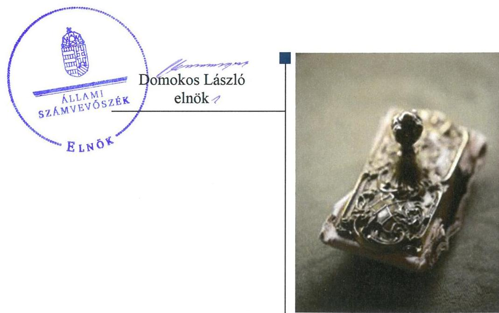
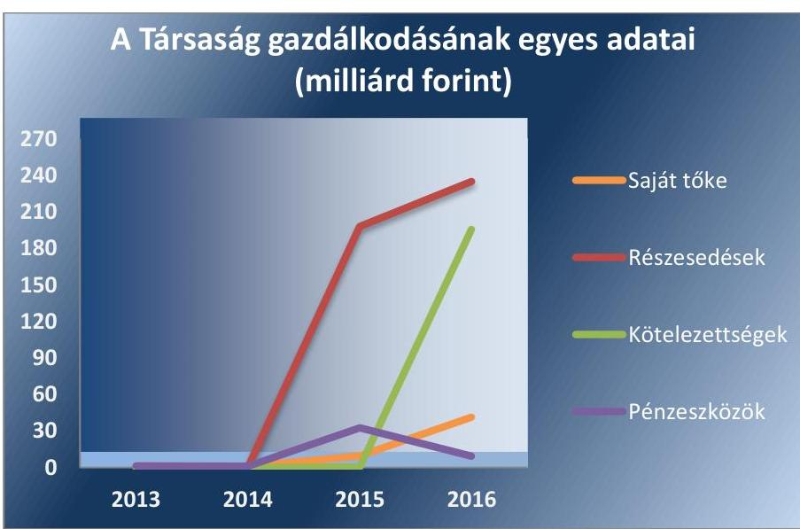

# Jelentés 

## Az állami résztulajdonú gazdasági társaságok ellenőrzése

CORVINUS Nemzetközi Befektetési Zártkörűen Működő Részvénytársaság 2018. 07. hó 23. nap

---

# AZ ELLENŐRZÉST FELÜGYELTE:

DR. PULAY GYULA ZOLTÁN felügyeleti vezető

## AZ ELLENŐRZÉST VEZETTE ÉS A VÉGREHAJTÁSÁÉRT FELELŐS:

SIPOSNÉ DÓCZI KLÁRA ellenőrzésvezető

## A PROGRAM ÖSSZEÁLLÍTÁSÁÉRT FELELŐS:

TÓTPÁL SZABOLCS osztályvezető

IKTATÓSZÁM: EL-0633-030/2018

TÉMASZÁM: 2469

ELLENŐRZÉS-AZONOSÍTÓ SZÁM: V081403

Jelentéseink az Országgyűlés számítógépes hálózatán és az Interneten a www.asz.hu címen is olvashatóak.

---

# TARTALOMJEGYZÉK 

- ÖSSZEGZÉS ..... 5
- AZ ELLENŐRZÉS CÉLJA ..... 6
- AZ ELLENŐRZÉS TERÜLETE ..... 7
- AZ ELLENŐRZÉS HÁTTERE, INDOKOLTSÁGA ..... 10
- A JELENTÉS LÉNYEGES KÉRDÉSKÖREI ..... 11
- AZ ELLENŐRZÉS HATÓKÖRE ÉS MÓDSZEREI ..... 12
- MEGÁLLAPÍTÁSOK ..... 14
- KÖVETKEZTETÉS ..... 18
- MELLÉKLETEK ..... 19
I. sz. melléklet: Értelmező szótár ..... 19
II. sz. melléklet: Az éves beszámolók adatai ..... 23
- FÜGGELÉK: ÉSZREVÉTELEK ..... 25
- RÖVIDÍTÉSEK JEGYZÉKE ..... 27

---

.

---

# ÖSSZEGZÉS 

Az MFB Magyar Fejlesztési Bank Zártkörűen Működő Részvénytársaság a tulajdonosi joggyakorlás kereteit szabályszerűen alakította ki, tulajdonosi joggyakorlása megfelelő volt. A CORVINUS Nemzetközi Befektetési Zártkörűen Működő Részvénytársaság működése, gazdálkodása és vagyongazdálkodása szabályszerű volt, beszámolási kötelezettségét az előírásoknak megfelelően teljesítette. A Társaság a gazdálkodás átláthatóságát a közérdekű adatok közzétételével biztosította.

## Az ellenőrzés társadalmi indokoltsága

Az Állami Számvevőszék kiemelt célja, hogy az államháztartáson kívülre nyújtott költségvetési támogatások és ingyenes vagyonjuttatások, valamint az államháztartáson kívül működő feladatellátó rendszerek ellenőrzéseivel hozzájáruljon ahhoz, hogy a közpénzeket az államháztartáson kívül működő szervezetek is átlátható, rendezett módon használják fel.

Az állami tulajdonú gazdálkodó szervezetek a nemzeti vagyon részét képezik. Az állami vagyonnal való gazdálkodást illetően a tulajdonosi joggyakorlás feladata az állami vagyon átlátható, rendeltetésszerű és felelős használatának biztosítása. Az állami tulajdonú gazdasági társaságok feladata az állami vagyon átlátható, hatékony, költségtakarékos működtetése, értékének megőrzése, állagának védelme, értéknövelő használata, hasznosítása.

Minden közpénzt, közvagyont használó szervezettel szemben társadalmi igény, hogy tevékenységükről elszámoljanak. Ezt figyelembe véve és az Állami Számvevőszék Stratégiájával összhangban került sor az állami résztulajdonban álló CORVINUS Nemzetközi Befektetési Zártkörűen Működő Részvénytársaság ellenőrzésére.

## Főbb megállapítások, következtetések

Az MFB Magyar Fejlesztési Bank Zártkörűen Működő Részvénytársaság a Társaság felett a tulajdonosi joggyakorlásra vonatkozó feladatokat, hatásköröket és jogosultságokat meghatározta, és azokat az előírásoknak megfelelően gyakorolta.

A CORVINUS Nemzetközi Befektetési Zártkörűen Működő Részvénytársaság rendelkezett a szabályszerű működés feltételeit megteremtő, a jogszabályi előírásoknak megfelelő belső szabályzatokkal. A bevételeket és a ráfordításokat, annak keretében a kormányzati szektor hiányát befolyásoló bevételeket és ráfordításokat szabályszerűen számolta el. A Társaság az éves beszámolókat a jogszabályi előírásoknak megfelelően elkészítette, azokat az előírt tartalommal és formában közzétette. A gazdálkodás átláthatóságát a közérdekű adatok közzétételével biztosította.

A Társaság a jogszabályi előírásoknak és a tulajdonosi joggyakorló által előírt követelményeknek megfelelően elkészítette a vagyonnal való gazdálkodásának a belső szabályozását, és abban kialakította a vagyongazdálkodás feltételeit. Az éves beszámolók leltárral alátámasztottak voltak. A Társaság meghatározta a kapcsolt társaság felé annak adatszolgáltatására vonatkozó követelményeit.

Kormányzati szektorba sorolt gazdálkodó szervezetként 2015. szeptemberétől kialakított a szervezet tevékenységének, a célok megvalósításának nyomon követését biztosító rendszert, továbbá eleget tett a jogszabályokban előírt adatszolgáltatási kötelezettségének.

---

# AZ ELLENŐRZÉS CÉLJA 

Az ellenőrzés célja annak értékelése volt, hogy a tulajdonosi jogok gyakorlása szabályszerű volt-e. A gazdálkodó szervezet szabályozottsága, gazdálkodása és vagyongazdálkodási tevékenysége megfelelt-e a jogszabályi és a tulajdonosi előírásoknak. A vagyonváltozást eredményező döntések esetében a tulajdonosi jogok gyakorlója és a gazdálkodó szervezet szabályszerűen jártak-e el. Az ellenőrzés célja továbbá annak megítélése volt, hogy a kormányzati szektorba sorolt állami tulajdonban (résztulajdonban) lévő gazdálkodó szervezetek gazdálkodásának a kormányzati szektor hiányára és az államadósságra befolyással bíró elemei a jogszabályi előírásoknak megfeleltek-e.

---

# AZ ELLENŐRZÉS TERÜLETE 

## Corvinus Nemzetközi Befektetési Zártkörűen működő Részvénytársaság, az MFB Magyar Fejlesztési Bank Zártkörűen Működő Részvénytársaság

A Corvinus Részvénytársaságot a Magyar Fejlesztési Bank, a Gazdasági Minisztérium, az Országos Műszaki Fejlesztési Bizottság, a Magyar Export - Import Bank Rt. és a Magyar Exporthitel Biztosító Rt. 1997. július 16-án alapította 1000,0 millió forintos alaptőkével a magyar vállalatok külföldi befektetéseinek elősegítésére határozatlan időre. A Társaság¹ jegyzett tőkéje az ellenőrzött időszakban 2013. március 26-ig 615,0 millió forint, majd 2016. január 3-ig 1014,7 millió forint, 2016. január 4.-2016. július 11. között 4214,7 millió forint, ezt követően 4914,7 millió forint volt.

A Társaság felett a Magyar Államot illető tulajdonosi jogokat a 2001. évi XX. törvény alapján 2010. június 17-től az MFB Zrt.² gyakorolta. A Társaság 2012. január 25-től Corvinus Nemzetközi Befektetési Zrt. néven működött.

A Társaság részvénykönyvi nyilvántartása³ szerint 2015. január 10-től az MFB Zrt. 50,735 millió forint, a Regionális Fejlesztési Holding Zártkörűen Működő Részvénytársaság 236,265 millió forint és a Magyar Állam 3 927,7 millió forint, majd 2016. augusztus 01-től 4627,7 millió forint összegű részesedést birtokolt.

A Társaság fő tevékenysége az ellenőrzött időszakban 2013. július 10-ig „üzletvezetés”, majd 2015. március 17-ig „egyéb hitelnyújtás”, ezt követően „vagyonkezelés” volt.

A Kormány az 1708/2014. (XII. 4.) számú határozatában a Társaságot jelölte ki a Budapest Bank Zrt.⁴ részvényeinek felvásárlására, melyek 195748 millió forint összegben 2015. június 29-én kerültek Társaság tulajdonába. Továbbá tulajdonosi döntés alapján, a Miniszterelnökség 27/2015. (IV. 24.) számú jóváhagyásával 2016. augusztus 11-én a Társaság (15%-os) 39046 millió forint könyv szerinti értékű részesedést szerzett az ERSTE BANK HUNGARY Zrt.⁵-ben.

A Társaság az ellenőrzött időszakban nem minősült közhasznú szervezetnek, közfeladatot nem látott el, működéséhez a tulajdonostól támogatásban nem részesült. 2015. év szeptemberétől tartozik az Áht.⁶ 1. § 12. pontjában meghatározott, kormányzati szektorba sorolt egyéb gazdálkodó szervezetek közé.

A Társaságnál a 2013-2016 időszakban igazgatóság nem működött, egyetlen választott, az ügyvezetési feladatokat ellátó vezető tisztségviselő a vezérigazgató volt, kinek személye az ellenőrzött időszakban 2014. december 18-án változott. A Társaságnál három tagú felügyelőbizottság⁷ működött, melynek személyi összetétele az ellenőrzött időszakban többször (2014. február 5-én, 2015. február 13-án és 2016. június 16-án) módosult.

---

A Társaság éves beszámolóit független könyvvizsgáló⁸ auditálta, kinek személyében 2015. május 11-én történt változás.

A Társaság 2013-ban hét főt, 2016-ban négy alkalmazottat foglalkoztatott.

Az ellenőrzött időszakban a Társaság vagyonkezelésbe vett vagyont nem birtokolt. A 2013-2016. években a Társaság ellen nem indult csődeljárási, végelszámolási, illetve felszámolási eljárás. A Budapest Bank Zrt.-ben történt tulajdonszerzést megelőzően más gazdasági társaságban nem rendelkezett tulajdonrésszel.

A Társaság a Tőkepiaci tv.⁹ előírása alapján nem minősült befektetési vállalkozónak, ezért nem vonatkoztak rá a könyvvezetésre és a beszámoló készítésére előírt különleges szabályok. A Számv. tv.¹⁰ 14. § (7) bekezdésében foglaltak alapján nem volt kötelezett önköltség-számítási szabályzat készítésére. A Társaság az MFB Stratégiai Csoport¹¹ tagja volt.

A Társaság gazdálkodásának egyes adatait az 1. ábra szemlélteti, részleteiben a II. sz. melléklet mutatja be.

1. ábra

Forrás: A Társaság 2013-2016. évi beszámolói
Az ellenőrzött időszakban a saját tőke/jegyzett tőke arány nem csökkent a Ptk.¹² -ban meghatározott mérték alá, ezért nem volt szükség a tulajdonosi joggyakorló intézkedésére.

A Társaság vagyona a 2013. évi 1265 millió forintról 2016. év végére 244315 millió forintra emelkedett, és összetétele jelentősen megváltozott, melynek fő oka a Budapest Bank Zrt. és az ERSTE BANK HUNGARY Zrt. üzletrészek megszerzése volt. A pénzeszközökről (amely a 2013. évben a teljes vagyon értékének 97,8%-a) a kapcsolt vállalkozásban levő tartós és az egyéb tartós részesedésekre (amely a 2016. évben a teljes vagyon értékének 96,2%-a) módosult az eszközök aránya.

A Társaság a 2013-2016. években lejárt követelést, vevői követeléseket nem mutatott ki, értékvesztés elszámolására nem került sor, lejárt kötelezettségei nem voltak. Az ellenőrzött időszakban a Társaság a tulajdonosi joggyakorló MFB Zrt.-től állami garanciavállalás mellett vett fel hitelt.

---

A Társaság tulajdonosi joggyakorlója, egyben tulajdonosa - az MFB Zrt. - a magyar állam kizárólagos tulajdonában lévő hitelintézet volt, melynek alapfeladata a hazai vállalkozások, illetve magánszemélyek számára kedvező konstrukciójú hitelek biztosítása olyan területeken is, ahol a kereskedelmi bankok nem tudnak hatékonyan hitelezni, valamint az állam hosszú távú gazdaságfejlesztési céljainak támogatása, azokhoz pénzpiaci források bevonása. A fejlesztési banki feladatokat szoros együttműködésben végzi a kereskedelmi hitelintézetekkel és partnerintézményeivel, kiemelten foglalkozik az európai uniós visszatérítendő források közvetítésével.

Az MFB Zrt. ellenőrzött időszakra vonatkozó jogállását, feladatait és tevékenységi körét a Magyar Fejlesztési Bank Részvénytársaságról szóló 2001. évi XX. törvény, valamint Alapszabályának rendelkezései határozták meg.

---

# AZ ELLENŐRZÉS HÁTTERE, INDOKOLTSÁGA 

Az Európai Unióban 1994. év óta hatályos túlzott hiány eljárás mindig kihívást jelentett a tagállamok számára. Az állami tulajdonú gazdálkodó szervezetek ellenőrzése kiemelten fontos a vagyon megőrzése, megóvása érdekében, valamint a kormányzati szektor elszámolásaiban megjelenő állami tulajdonú gazdálkodó szervezetek esetében, amelyekkel szemben alapvető követelmény, hogy gazdálkodásuk, működésük szabályszerű, az általuk szolgáltatott adatok minél megbízhatóbbak legyenek. Gazdálkodásuk jellemzően a közérdeklődés és a média figyelmének középpontjában áll, amihez hozzájárul a gazdálkodásuk körébe tartozó - közvetlen vagy közvetett állami tulajdonú, tehát végső soron a nemzeti vagyon részét képező - vagyon nagysága, illetve az általuk ellátott közszolgáltatások/közfeladatok minősége és hatékonysága.

Az ellenőrzés rámutathat az állami tulajdonú gazdálkodó szervezetek gazdálkodási tevékenységével jó gyakorlatokra és szabálytalanságokra. Felhívhatja a figyelmet a jogszabályi követelmények teljesítéséhez szükséges feltételek hiányosságaira, hozzájárulhat az államháztartáson kívüli, de (közvetlenül vagy közvetve) állami vagyont használó gazdálkodó szervezetek tevékenységének átláthatóságához. Ellenőrzésünk eredményeképpen javaslatainkkal, megállapításainkkal hozzájárulhatunk a nemzeti vagyonnal való gazdálkodás átláthatóságának, elszámoltathatóságának javításához.

---

# A JELENTÉS LÉNYEGES KÉRDÉSKÖREI 

1. A tulajdonosi jogok gyakorlása szabályszerű volt-e?
2. A Társaság működésének szabályozottsága megfelelt-e az előírásoknak? A Társaságnál a pénzügyi-számviteli, adatszolgáltatási és ellenőrzési feladatok ellátása szabályszerű volt-e, gazdálkodásának a kormányzati szektor hiányára befolyással bíró elemei megfeleltek-e a jogszabályi előírásoknak?
3. A társaság vagyongazdálkodása szabályszerű volt-e?

---

# AZ ELLENŐRZÉS HATÓKÖRE ÉS MÓDSZEREI 

## Az ellenőrzés típusa

Megfelelőségi ellenőrzés

## Az ellenőrzött időszak

Az ellenőrzött időszak 2013. - 2016. évek, a 2016. évi beszámoló jóváhagyásáig tartó időszak

## Az ellenőrzés tárgya

Az MFB Magyar Fejlesztési Bank Zártkörűen Működő Részvénytársaság tulajdonosi joggyakorlása, a CORVINUS Nemzetközi Befektetési Zártkörűen Működő Részvénytársaság gazdálkodása, kiemelten vagyongazdálkodási tevékenysége, továbbá gazdálkodásának a kormányzati szektor hiányára és az államadósságra befolyással bíró elemei.

## Az ellenőrzött szervezet

- MFB Magyar Fejlesztési Bank Zártkörűen Működő Részvénytársaság
- CORVINUS Nemzetközi Befektetési Zártkörűen Működő Részvénytársaság

## Az ellenőrzés jogalapja

Az ellenőrzés jogalapját az ÁSZ tv. 1. § (3) bekezdése és 5. § (3)-(5) bekezdése képezte.

## Az ellenőrzés módszerei

Az ellenőrzést a nemzetközi standardokat irányadónak tekintve az ellenőrzési program ellenőrzési kérdései, az ellenőrzött időszakban hatályos jogszabályok, az ellenőrzés szakmai szabályok és módszertanok figyelembe vételével végeztük.

Az ellenőrzés ideje alatt az ellenőrzött szervezettel történő kapcsolattartást az ÁSZ¹³ Szervezeti és Működési Szabályzatának vonatkozó előírásai alapján biztosítottuk.

---

Az ellenőrzési program szerinti feladatokat a CORVINUS Nemzetközi

 Befektetési Zrt. ${ }^{14}$-nél, valamint a tulajdonosi jogok gyakorlójánál, az MFB Magyar Fejlesztési Bank Zrt.-nél hajtottuk végre.

A gazdasági társaságnál helyszíni adatbetekintés keretében ellenőriztük a kapcsolt vállalkozás számára az adatszolgáltatás előírását, valamint annak a kapcsolt vállalkozás részéről történő teljesítését.

A személyi jellegű ráfordítások esetében az ellenőrzött tételek kijelölése véletlen mintavételi eljárás alkalmazásával történt a teljes sokaságból. A többi terület esetében az ellenőrzés azokra a legnagyobb értékű tételekre - a lényeges sokaságra - terjedt ki, melyek összértéke eléri a teljes sokaság összértékének 50\%-át.

A mintavétellel ellenőrzött területek esetében minden egyes tétel vonatkozásában a szabályszerűségre vonatkozó kérdéseket tettünk fel, amelyek eredménye összesítésre került. „Szabályszerűnek" értékeltünk egy ellenőrzött területet, amennyiben 95\%-os bizonyossággal az ellenőrzött sokaságban az átlagos hibaarány legfeljebb 10\%, "nem szabályszerűnek", amennyiben 10\%-nál magasabb arányt képviselt.

Az ellenőrzési kérdések megválaszolásához szükséges bizonyítékok megszerzése a következő ellenőrzési eljárások alkalmazásával történt: megfigyelés, kérdésfeltevés (információkérés), összehasonlítás, valamint elemző eljárás. Az ellenőrzési bizonyítékként felhasználható adatforrások közé tartoztak egyrészt az ellenőrzési programban felsorolt adatforrások, másrészt adatforrás lehetett még minden - az ellenőrzés folyamán - feltárt, az ellenőrzés szempontjából információkat tartalmazó dokumentum.

Az ellenőrzést a kérdésekre adott válaszok kiértékelésével, valamint a megjelölt adatforrások, a tanúsítványok felhasználásával, továbbá az adott időszakban hatályos jogszabályok figyelembe vételével folytattuk le.

---

# 1. A tulajdonosi jogok gyakorlása szabályszerű volt-e? 

Összegző megállapítás

A tulajdonosi joggyakorlás szabályszerű volt.

A TULAJDONOSI JOGGYAKORLÁS KERETEIT az MFB Zrt. mint a Társaság alapítója és a Magyar Állam nevében a tulajdonosi jogkör gyakorlója a Gt. ${ }^{15}$ illetve a Ptk. ${ }_{2}$ előírásainak megfelelően a Társaság Alapszabály ${ }_{1-11}{ }^{16}$-ban határozta meg, melyben rögzítették a Közgyűlés ${ }^{17}$ számára fenntartott tulajdonosi jogokat és döntési hatásköröket.

## A FELÜGYELŐBIZOTTSÁGOT ÉS A KÖNYVVIZSGÁLÓT, a Gt. illetve a Ptk. ${ }_{2}$ előírásai szerint a Közgyűlés választotta meg. A Felügyelőbizottság évente egyszer írásban számolt be a Tulajdonosi joggyakorló felé a Társaság tevékenységéről.

AZ ANYAGI ÉRDEKELTSÉGI RENDSZER elemeit az Alapszabály ${ }_{1-11}$ ban és az SZMSZ $_{1-3}{ }^{18}$-ben meghatározottak szerint a Közgyűlés által elfogadott Javadalmazási szabályzatban rögzítették, mely szabályzat megfelelt a Taktv. ${ }^{19}$ előírásainak.

AZ ÜZLETI TERVET a Társaság az MFB Zrt. Igazgatósági felhatalmazása alapján kiadott MFB Zrt. vezérigazgatói utasítás alapján készített, melyet a Felügyelőbizottság véleményezését követően a Közgyűlés hagyott jóvá.

A MONITORING RENDSZERT az MFB Zrt. a "Stratégiai csoport adatszolgáltatásának eljárási rendje" című Vezérigazgatói utasítás szerint működtette, melynek keretében negyedéves gyakorisággal követte nyomon a Társaság gazdálkodását.

A TÁRSASÁG SZÁMVITELI BESZÁMOLÓIT - a Felügyelőbizottság előzetes írásbeli jelentését követően - a Közgyűlés a Gt.-ben illetve a Ptk. ${ }_{2}$-ban előírtaknak megfelelően, a könyvvizsgálói jelentések birtokában fogadta el, azzal egyidejűleg döntött az adózott eredmény felhasználásáról.

---

# 2. A Társaság működésének szabályozottsága megfelelt-e az előírásoknak? A Társaságnál a pénzügyi-számviteli, adatszolgáltatási és ellenőrzési feladatok ellátása szabályszerű volt-e, gazdálkodásának a kormányzati szektor hiányára befolyással bíró elemei megfeleltek-e a jogszabályi előírásoknak? 

Összegző megállapítás

A Társaság működésének szabályozottsága megfelelt az előírásoknak. A Társaságnál a bevételek és a ráfordítások elszámolása, beleértve a kormányzati szektor hiányát befolyásoló bevételeket és ráfordításokat is, szabályszerű volt. A Társaság a beszámolási és a közérdekű adatok közzétételi kötelezettségeinek eleget tett.
2.1. számú megállapítás

A Társaság rendelkezett a jogszabályokban előírt kötelező szabályzatokkal, melyek megfeleltek az előírásoknak. A Társaság működtetett belső ellenőrzést.

A SZERVEZETI ÉS MŰKÖDÉSI SZABÁLYZAT ${ }_{1-3}$ a Társaság Alapszabály ${ }_{1-11}$-ban meghatározottaknak megfelelően szabályozta az ügyvezetés felelősségét és feladatait, a társaság vezetésére és a gazdálkodására vonatkozó szabályokat, a Társaság szervezeti felépítését, működését, tevékenységeit.

SZÁMVITELI SZABÁLYZATOKKAL - Számviteli Politikával ${ }_{1-1}{ }^{20}$, Számlarenddel ${ }_{1-2}{ }^{21}$ Eszközök és források értékelési szabályzattal ${ }_{1-2}{ }^{22}$, Leltározási Szabályzattal ${ }^{23}$, valamint Pénzkezelési szabályzattal ${ }_{1-3}{ }^{24}$ rendelkezett a Társaság, ezzel megfelelt a Számv. tv. 14. § (5) bekezdésében és a 161. § (1) bekezdésében előírtaknak. A szabályzatok megfeleltek a Számv. tv. előírásainak. A Leltározási szabályzat az eszközök mennyiségi felvételét három évenkénti gyakorisággal írta elő.

A szabályszerű működést segítette továbbá a Selejtezési szabályzat ${ }^{25}$ és az Iratkezelési Szabályzat ${ }^{26}$ is. A Társaság rendelkezett a gazdálkodás átláthatóságát és az adatok védelmét biztosító szabályzatokkal is. Az információk és információs rendszerek biztonságának folyamatos fenntartása érdekében megalkotta az információbiztonsági alapelveket és szabályokat tartalmazó Információbiztonsági szabályzatot ${ }^{27}$. Az Informatikai fejlesztési szabályzat ${ }^{28}$ - az 535/2013. (XII.30.) Korm. rendeletben ${ }^{29}$ foglaltaknak megfelelően - tartalmazza az informatikai fejlesztéseknek az MFB Stratégiai Csoport tagjaként elvárt módon történő megvalósításának szabályait.

A MŰKÖDÉS SZABÁLYOZÁSA a Társaságnál az üzletszerűen folytatott tevékenységről, a befektetésekről, tőkebefektetések kezeléséről szóló Befektetési szabályzat ${ }_{1-3}{ }^{30}$-tal történt. 2016-ban önálló szabályzatként beemelték az MFB csoport- Ügyfél kockázatvállalási szabályzatát ${ }^{31}$ a Társaság szabályzatai közé.

BELSŐ ELLENŐRZÉST 2013-tól az SZMSZ ${ }_{1-3}$ előírása alapján, a Belső Ellenőrzési Szabályzat ${ }_{1-3}{ }^{32}$ szerint működtetett a Társaság 2015.

---

# 2.2. számú megállapítás 

2.3. számú megállapítás

A bevételek és a ráfordítások elszámolása szabályszerű volt.

A BEVÉTELEK ÉS A RÁFORDÍTÁSOK ELSZÁMOLÁSA, ideértve a kormányzati szektor hiányára befolyással bíró bevételek és ráfordítások elszámolását is, megfeleltek az előírásoknak.

A bevételek főkönyvi számlákon történő elszámolása megfelelt a Számv. tv-ben és a belső szabályozásokban előírtaknak. Az elszámolások a számviteli bizonylatok alapján a megfelelő főkönyvi számlákon történtek.

A ráfordítások elszámolása megfelelt a Számv. tv-ben és a belső előírásokban foglaltaknak. Az elszámolásokat megalapozó dokumentumok rendelkezésre álltak. A ráfordítások elszámolása a számviteli bizonylatok alapján, a szerződés szerinti teljesítéssel, a megfelelő főkönyvi számlán történt.

A Társaság az üzleti terv készítési, beszámolási és közzétételi kötelezettségének eleget tett.

ÜZLETI TERV KÉSZÍTÉSI, valamint beszámolási kötelezettségének a Társaság az ellenőrzött időszakban a tulajdonosi joggyakorló által megfogalmazott követelményeknek megfelelően elkészített üzleti tervekkel, valamint a tulajdonosi joggyakorló által meghatározott adatszolgáltatási és tájékoztatási kötelezettségek előírásszerű teljesítésével tett eleget.

AZ ÉVES BESZÁMOLÓIT ${ }^{34}$ az ellenőrzött időszakban a Társaság a Számv. tv.-ben meghatározott módon és tartalommal elkészítette. Az éves beszámolókat leltárral szabályszerűen alátámasztotta, a könyvvizsgáló által korlátozás nélkül hitelesített beszámolók letétbe helyezési és közzétételi kötelezettségét a jogszabályi előírások szerint teljesítette a Társaság.

A KÖZÉRDEKŰ ADATOK NYILVÁNOSSÁGRA HOZATALA a Taktv. és az Info tv ${ }^{35}$ előírásainak megfelelően teljeskörűen biztosított volt. A Társaságnál a közérdekű adatok megismerésére irányuló igények teljesítésének rendjét, valamint a személyes adatok kezelésének rendjét az Info tv. előírásai szerinti Adatvédelmi szabályzat ${ }_{1-2}{ }^{36}$ tartalmazta.

## 3. A társaság vagyongazdálkodása szabályszerű volt-e?

Összegző megállapítás
3.1. számú megállapítás

A Társaság vagyongazdálkodása szabályszerű volt.
A Társaság kialakította és szabályozta a vagyongazdálkodás feltételeit, vagyonát az előírások szerint tartotta nyilván.

A VAGYONGAZDÁLKODÁS FELTÉTELEIT, a vagyonnal való gazdálkodás, ezen belül a kapcsolódó feladat- és hatáskörök, felelősségi viszonyok meghatározását a jogszabályi feltételeken túl a Társaság Alapszabály ${ }_{1-11}$ a, valamint a belső szabályzatok (SZMSZ ${ }_{1-3}$ ) tartalmazták.

---

Az Alapszabály ${ }_{1-11}$ rögzítette a kizárólagos alapítói hatáskörbe tartozó, a vagyongazdálkodással kapcsolatos döntések követelményeit, melyek teljesítéseként az MFB Zrt döntései az Alapszabály ${ }_{1-11}$-ban meghatározottak szerint minden esetben rendelkezésre álltak.

A VAGYONNYILVÁNTARTÁS szabályszerű volt. Az analitikus és a főkönyvi nyilvántartás a Számv. tv-ben és a belső szabályzatokban rögzítettek szerint biztosította a Társaság vagyonának folyamatos nyilvántartási és elszámolási kötelezettségének teljesítését.

AZ ESZKÖZÖK ÉS FORRÁSOK LELTÁROZÁSA az ellenőrzött években szabályszerű volt. A Számv. tv. 69. §-ban és a Leltározási szabályzatban foglaltak szerinti egyeztetéssel és mennyiségi felvétellel leltároztak, és leltárral alátámasztották az éves beszámolókat.

A SAJÁT VAGYON VÁLTOZÁSÁT eredményező döntéseit az Alapszabály ${ }_{1-11}$-ban meghatározottak szerint hozta meg a Társaság. Minden szükséges esetben rendelkezésre álltak a tulajdonosi jogok gyakorlójának előzetes írásbeli döntései.
3.2. számú megállapítás

A Társaság a kapcsolt vállalkozását ${ }^{37}$, mint tulajdonos a jogszabályi előírások szerint beszámoltatta.

A VAGYONGAZDÁLKODÁS KÖVETELMÉNYEIT a Budapest Bank Zrt. felé az MFB Zrt. Igazgatósági határozata alapján, a Társaság a kapcsolt vállalkozás Alapszabályában határozta meg. A Gt. illetve a Ptk. 2 rendelkezéseinek megfelelően, valamint a tulajdonosi joggyakorló határozatában foglaltakat is végrehajtva a Társaság létrehozta a kapcsolt vállalkozás felügyelőbizottságát, megválasztotta tagjait, valamint a vezérigazgatót és a könyvvizsgálót.

A Társaság a kapcsolt vállalkozást a Gt. illetve a Ptk. 2 előírásai szerint szabályszerűen beszámoltatta. A Társaság az MFB Zrt. jóváhagyását követően, a Gt. illetve a Ptk. 2 előírásai szerint alapítói határozattal fogadta el a kapcsolt vállalkozásnak a jogszabályok által előírt határidőben és adattartalommal a Társaságnak megküldött éves beszámolóit.

---

# KÖVETKEZTETÉS 

A Kormány határozata alapján a Budapest Bank Zrt. részvényeit 2015-ben felvásárló Társaság kialakította és szabályozta vagyongazdálkodása feltételeit, vagyonát az előírások szerint tartotta nyilván, a Budapest Bank Zrt. feletti tulajdonosi jogait a jogszabályi előírásoknak megfelelően gyakorolta.
(Ellenőrzés területe 5. bekezdés, valamint 3.1. pont megállapítás 1-3. bekezdése és a 3.2. sz. megállapítás 1-2. bekezdése alapján.)

---

# MELLÉKLETEK 

## I. SZ. MELLÉKLET: ÉRTELMEZŐ SZÓTÁR

állami vagyon
a) Az állam tulajdonában lévő dolog, valamint a dolog módjára hasznosítható természeti erő,
b) az a) pont hatálya alá nem tartozó mindazon vagyon, amely vonatkozásában törvény az állam kizárólagos tulajdonjogát nevesíti,
c) az állam tulajdonában lévő tagsági jogviszonyt megtestesítő értékpapír, illetve az államot megillető egyéb társasági részesedés,
d) az államot megillető olyan immateriális, vagyoni értékkel rendelkező jogosultság, amelyet jogszabály vagyoni értékű jogként nevesít.
Forrás: Vtv. 1. § (2) bekezdése
e) az állam tulajdonában lévő pénzügyi eszközök

Forrás: Vtv. 1. § (2) bekezdése
2013. június 27-ig:

Az állami vagyont az MNV Zrt. maga kezeli, vagy szerződés - így különösen bérlet, haszonbérlet, megbízás - alapján központi költségvetési szervnek, természetes vagy jogi személynek, vagy jogi személyiséggel nem rendelkező gazdálkodó szervezetnek hasznosításra átengedi.
Forrás: Vtv. 23. § (1) bekezdése
2013. június 28-ától:

Az állami vagyonnal az MNV Zrt. maga gazdálkodik, vagy szerződés - így különösen bérlet, haszonbérlet, megbízás - alapján központi költségvetési szervnek, természetes vagy jogi személynek, vagy jogi személyiséggel nem rendelkező gazdálkodó szervezetnek hasznosításra átengedi, illetőleg vagyonkezelésbe, haszonélvezetbe adja.
Forrás: Vtv. 23. § (1) bekezdése
anyavállalat
Az a vállalkozó, amely egy másik vállalkozónál (a továbbiakban: leányvállalat) közvetlenül vagy leányvállalatán keresztül közvetetten meghatározó befolyást képes gyakorolni, mert az alábbi feltételek közül legalább eggyel rendelkezik:
a) a tulajdonosok (a részvényesek) szavazatának többségével (50 százalékot meghaladóval) tulajdoni hányada alapján egyedül rendelkezik, vagy
b) más tulajdonosokkal (részvényesekkel) kötött megállapodás alapján a szavazatok többségét egyedül birtokolja, vagy
c) a társaság tulajdonosaként (részvényesként) jogosult arra, hogy a vezető tisztségviselők vagy a felügyelőbizottság tagjai többségét megválassza vagy visszahívja, vagy
d) a tulajdonosokkal (a részvényesekkel) kötött szerződés (vagy a létesítő okirat rendelkezése) alapján - függetlenül a tulajdoni hányadtól, a szavazati aránytól, a megválasztási és visszahívási jogtól - döntő irányítást, ellenőrzést gyakorol.
Forrás: Számv. tv. 3. § (2) 1. pont
gazdasági társaság
A Ptk.2. 3:88. § (1) bekezdése szerint „a gazdasági társaságok üzletszerű közös gazdasági tevékenység folytatására, a tagok vagyoni hozzájárulásával létrehozott, jogi személyiséggel rendelkező vállalkozások, amelyekben
 a tagok a nyereségből közösen részesednek, és a veszteséget közösen viselik".
2013. június 27-ig:

Az állami vagyont az MNV Zrt. maga kezeli, vagy szerződés - így különösen bérlet, haszonbérlet, megbízás - alapján központi költségvetési szervnek, természetes vagy jogi személynek, vagy jogi személyiséggel nem rendelkező gazdálkodó szervezetnek

---

kormányzati szektorba sorolt egyéb szervezet
leányvállalat
meghatározó befolyás
hasznosításra átengedi. Az állami vagyonra vonatkozóan az MNV Zrt. kizárólag az Nvtv-ben meghatározott személyekkel köthet vagyonkezelési szerződést.
Forrás: Vtv. 23. § (1), 27. § (1)
2013. június 28-ától:

Az állami vagyonnal az MNV Zrt. maga gazdálkodik, vagy szerződés - így különösen bérlet, haszonbérlet, megbízás - alapján központi költségvetési szervnek, természetes vagy jogi személynek, vagy jogi személyiséggel nem rendelkező gazdálkodó szervezetnek hasznosításra átengedi, illetőleg vagyonkezelésbe, haszonélvezetbe adja. Az állami vagyonra vonatkozóan az MNV Zrt. kizárólag az Nvtv-ben meghatározott személyekkel köthet vagyonkezelési szerződést.
Forrás: Vtv. 23. § (1), 27. § (1)
2014. március 14-ig:

A Ptk. ${ }^{18}$ 685. § c) pontja szerint gazdálkodó szervezet: „ az állami vállalat, az egyéb állami gazdálkodó szerv, a szövetkezet, a lakásszövetkezet, az európai szövetkezet, a gazdasági társaság, az európai részvénytársaság, az egyesülés, az európai gazdasági egyesülés, az európai területi együttműködési csoportosulás, az egyes jogi személyek vállalata, a leányvállalat, a vízgazdálkodási társulat, az erdő birtokossági társulat, a végrehajtói iroda, az egyéni cég, továbbá az egyéni vállalkozó."
2014. március 15-től:

A gazdasági társaság: az európai részvénytársaság, az egyesülés, az európai gazdasági egyesülés, az európai területi együttműködési csoportosulás, a szövetkezet, a lakásszövetkezet, az európai szövetkezet, a vízgazdálkodási társulat, az erdő birtokossági társulat, az állami vállalat, az egyéb állami gazdálkodó szerv, az egyes jogi személyek vállalata, a közös vállalat, a végrehajtói iroda, a közjegyzői iroda, az ügyvédi iroda, a szabadalmi ügyvivői iroda, az önkéntes kölcsönös biztosító pénztár, a magánnyugdíjpénztár, az egyéni cég, továbbá az egyéni vállalkozó. Az állam, a helyi önkormányzat, a költségvetési szerv, az egyesület, a köztestület, valamint az alapítvány gazdálkodó tevékenységével összefüggő polgári jogi kapcsolataira is a gazdálkodó szervezetre vonatkozó rendelkezéseket kell alkalmazni.
Forrás: Ptk. 396. §
Az anyavállalat és a leányvállalat és a közös vezetésű vállalkozások (fölérendelt anyavállalat esetében a minősítést a fölérendelt anyavállalat szempontjából kell elvégezni) Forrás: Számv. tv. 3. § (2) 7. pont
Az a szervezet, amely az Áht. alapján nem része az államháztartásnak, azonban az Európai Közösséget létrehozó szerződéshez csatolt, a túlzott hiány esetén követendő eljárásról szóló jegyzőkönyv alkalmazásáról szóló 2009. május 25-i 479/2009/EK rendelet szerint a kormányzati szektorba tartozik. A nemzetgazdasági miniszter 2013. június 26-án megjelent Közleményben tette közzé ezen szervezetek listáját.
Az a gazdasági társaság, amelyre az anyavállalat meghatározó befolyást képes gyakorolni
Forrás: Számv. tv. 3. § (2) 2. pont
2014. március 14-ig:

A befolyással rendelkező akkor rendelkezik egy jogi személyben meghatározó befolyással, ha annak tagja, illetve részvényese és
a) jogosult e jogi személy vezető tisztségviselői vagy felügyelőbizottsága tagjai többségének megválasztására, illetve visszahívására, vagy
b) a jogi személy más tagjaival, illetve részvényeseivel kötött megállapodás alapján egyedül rendelkezik a szavazatok több mint ötven százalékával.

---

MFB Zrt.
minősített többséget biztosító részesedés
rábízott vagyon
többségi befolyást biztosító részesedés
tulajdonosi ellenőrzés

A meghatározó befolyás akkor is fennáll, ha a befolyással rendelkező számára az előzőek szerinti jogosultságok közvetett módon biztosítottak. A befolyással rendelkezőnek egy jogi személyben a szavazatok több mint ötven százalékával közvetett módon való rendelkezése vagy egy jogi személyben közvetetten fennálló meghatározó befolyása megállapítása során a jogi személyben szavazati joggal rendelkező más jogi személyt (köztes vállalkozást) megillető szavazatokat meg kell szorozni a befolyással rendelkezőnek a köztes vállalkozásban, illetve vállalkozásokban fennálló szavazatával. Ha a köztes vállalkozásban fennálló szavazatok mértéke az ötven százalékot meghaladja, akkor azt egy egészként kell figyelembe venni.
Forrás: Ptk. 685/B. § (2)-(3) bekezdések

## 2014. március 15-től:

A befolyással rendelkező akkor rendelkezik egy jogi személyben meghatározó befolyással, ha annak tagja vagy részvényese, és
a) jogosult e jogi személy vezető tisztségviselői vagy felügyelőbizottsága tagjai többségének megválasztására, illetve visszahívására; vagy
b) a jogi személy más tagjai, illetve részvényesei a befolyással rendelkezővel kötött megállapodás alapján a befolyással rendelkezővel azonos tartalommal szavaznak, vagy a befolyással rendelkezőn keresztül gyakorolják szavazati jogukat, feltéve, hogy együtt a szavazatok több mint felével rendelkeznek.
Forrás: Ptk. 8:2. § (2) bekezdés
Az MNV Zrt. melletti másik tulajdonosi joggyakorló szervezet az állami vagyon vonatkozásában, amely 2010. június 17-től gyakorol ilyen jogokat a rábízott állami tulajdonú társasági részesedések tekintetében.
A minősített befolyásszerző az ellenőrzött társaságban a szavazatok legalább hetvenöt százalékával rendelkezik. (2014. március 14-ig: Gt. 52. § (2), 2014. március 15-től: Ptk. 3:324. §)
Egyrészt minden a Vtv. alkalmazásában állami vagyonnak minősülő vagyon, amit az MNV Zrt. kezel és nyilvántart.
Másrészt az a vagyon, amely felett a Magyar Állam nevében az MFB Zrt. gyakorolja a tulajdonosi jogokat.
Forrás: MFB tv. 3. § (9)
A rábízott vagyon a tulajdonosi jogokat gyakorló szervezetek saját vagyonától elkülönítendő.
Forrás: Vtv. 22. § (6)
2014. március 14-ig:

Többségi befolyás: az olyan kapcsolat, amelynek révén természetes személy, jogi személy vagy jogi személyiség nélküli gazdasági társaság (a továbbiakban együtt: befolyással rendelkező) egy jogi személyben a szavazatok több mint ötven százalékával vagy meghatározó befolyással rendelkezik.
Forrás: Ptk. 685/B. § (1)
2014. március 15-től:

Többségi befolyás az olyan kapcsolat, amelynek révén természetes személy vagy jogi személy (befolyással rendelkező) egy jogi személyben a szavazatok több mint felével vagy meghatározó befolyással rendelkezik.
Forrás: Ptk. 8:2. § (1)
2014. március 14-ig:

Az állami vagyon kezelőjét, haszonélvezőjét, használóját megillető jogok gyakorlását, annak szabályszerűségét, célszerűségét az MNV Zrt. - szükség szerint területi szervei útján - ellenőrzi.

---

# 2014. március 15-től: 

Az állami vagyon használóját, vagyonkezelőjét és haszonélvezőjét megillető jogok gyakorlását, annak szabályszerűségét, a kötelezettségek teljesítését, valamint a vagyon rendeltetése szerinti célszerűségét a tulajdonosi joggyakorló rendszeresen ellenőrzi.
Forrás: Vtv. 20. § (1)
tulajdonosi jogok gyakorlója 1.

### 2013. június 27-ig:

Az állami vagyon felett a Magyar Államot megillető tulajdonosi jogok és kötelezettségek összességét - ha törvény eltérően nem rendelkezik - az állami vagyon felügyeletéért felelős miniszter (a továbbiakban: miniszter) gyakorolja, aki e feladatát a Magyar Nemzeti Vagyonkezelő Zártkörűen Működő Részvénytársaság (a továbbiakban: MNV Zrt.), a Magyar Fejlesztési Bank, illetve a tulajdonosi joggyakorló szervezet útján látja el. A miniszter miniszteri rendeletben, a törvényben meghatározott állami vagyoni kör tekintetében, meghatározott időtartamra, a joggyakorlás egyes szabályainak meghatározásával - az őt megillető tulajdonosi jogok és kötelezettségek összességének, illetve azok meghatározott részének gyakorlóját az Áht. szerinti központi költségvetési szervek, ezek intézménye, továbbá a 100%-ban állami tulajdonban álló gazdasági társaságok közül kijelölheti.
Forrás: Vtv. 3. § (1) és (2)

### 2013. június 28-ától:

A rábízott állami vagyon felett az államot megillető tulajdonosi jogok és kötelezettségek összességét tulajdonosi joggyakorlóként:
a) ha törvény vagy miniszteri rendelet eltérően nem rendelkezik, a Magyar Nemzeti Vagyonkezelő Zártkörűen Működő Részvénytársaság (a továbbiakban: MNV Zrt.),
b) törvényben kijelölt személy vagy
c) az állami vagyon felügyeletéért felelős miniszter (a továbbiakban: miniszter) által rendeletben kijelölt személy gyakorolja.
[...] A miniszter e törvény felhatalmazása alapján - a meghatározott célok hatékonyabb elérése érdekében, miniszteri rendeletben, az ott meghatározott állami vagyoni kör tekintetében, meghatározott időtartamra - e törvény keretei között, a joggyakorlás egyes szabályainak meghatározásával - az államot megillető tulajdonosi jogok és kötelezettségek összességének, illetve azok meghatározott részének gyakorlóját az Áht. szerinti központi költségvetési szervek, ezek intézménye, továbbá a 100%-ban állami tulajdonban álló gazdasági társaságok közül kijelölheti.
Forrás: Vtv. 3. § (1) és (2)
2.

Aki a nemzeti vagyon felett az államot vagy a helyi önkormányzatot megillető tulajdonosi jogok és kötelezettségek összességének gyakorlására jogosult
Forrás: Nvtv. 3. § (1) 17. pontja

---

# II. SZ. MELLÉKLET: AZ ÉVES BESZÁMOLÓK ADATAI 

| ÉVES BESZÁMOLÓK ADATAI (MILLIÓ FORINT) |  |  |  |  |  |
| :--: | :--: | :--: | :--: | :--: | :--: |
| Megnevezés | 2013.01.01. | 2013.12.31. | 2014.12.31. | 2015.12.31. | 2016.12.31. |
| Befektetett eszközök | 13 | 19 | 15 | 196009 | 235049 |
| Immateriális javak |  |  |  |  |  |
| Tárgyi eszközök | 11 | 16 | 12 | 7 | 1 |
| Befektetett pénzügyi eszközök | 2 | 3 | 3 | 196002 | 235048 |
| Forgóeszközök | 1355 | 1244 | 1121 | 45167 | 9265 |
| Készletek |  |  |  |  |  |
| Követelések | 8 | 7 | 4 | 12501 | 1 |
| Értékpapírok |  |  | 60 | 60 |  |
| Pénzeszközök | 1347 | 1238 | 1056 | 32606 | 9264 |
| Aktív időbeli elhatárolások | 2 |  |  | 70 | 1 |
| Saját tőke | 737 | 1216 | 1081 | 9471 | 41392 |
| Jegyzett tőke | 615 | 1015 | 1015 | 1015 | 4915 |
| Tőketartalék | 200 | 323 | 323 | 66 | 35166 |
| Eredménytartalék | 3 |  | -121 |  | 8390 |
| Lekötött tartalék |  |  |  |  |  |
| Értékelési tartalék |  |  |  |  |  |
| Mérleg szerinti eredmény* | -81 | -121 | -135 | 8390 | -7079 |
| Céltartalék | 12 | 13 | 15 | 13 |  |
| Kötelezettségek | 604 | 4 | 6 | 227809 | 195753 |
| Hosszú lejáratú kötelezettségek |  |  |  | 195748 | 195748 |
| Rövid lejáratú kötelezettségek | 604 | 4 | 6 | 32061 | 5 |
| Passzív időbeli elhatárolás | 17 | 32 | 36 | 3953 | 7170 |
| MÉRLEG FŐÖSSZEG | 1370 | 1265 | 11137 | 241246 | 244315 |
|  |  | 2013. | 2014. | 2015. | 2016. |
| Értékesítés nettó árbevétele | - | 0 | 4 | 0 | 0 |
| Aktivált saját teljesítmény |  |  |  |  |  |
| Egyéb bevételek | - |  |  | 2 | 26 |
| Anyagjellegű ráfordítások | - | 43 | 45 | 26 | 30 |
| Személyi jellegű ráfordítások | - | 118 | 105 | 101 | 96 |
| Értékcsökkenési leírás | - | 3 | 3 | 4 | 2 |
| Egyéb ráfordítások | - | 13 | 11 | 66 | 35 |
| Üzemi tevékenység eredménye | - | -178 | -162 | -195 | -137 |
| Pénzügyi műveletek eredménye | - | 56 | 28 | 8585 |

 | $-6942$ |
| Rendkívüli eredmény | - |  |  |  | - |
| Mérleg szerinti eredmény* | - | $-121$ | $-135$ | 8390 | $-7079$ |

*2016-ban adózott eredmény

---

.

---

# FÜGGELÉK: ÉSZREVÉTELEK 

A jelentéstervezetet a Számvevőszék 15 napos észrevételezésre megküldte az ellenőrzött szervezetek vezetőinek az ÁSZ tv. 29. § (1) bekezdése előírásának megfelelően.

Az ÁSZ a jelentéstervezetet a Corvinus Nemzetközi Befektetési Zrt. vezérigazgatójának és a Magyar Fejlesztési Bank Zrt. elnök-vezérigazgatójának küldte meg.
Észrevételt az ellenőrzött szervezetek vezetői nem tettek.

[^0]
[^0]:    * 29. § (1) Az Állami Számvevőszék az ellenőrzési megállapításait megküldi az ellenőrzött szervezet vezetőjének vagy az általa megbízott személynek, és annak, akinek személyes felelősségét állapította meg.
    (2) Az ellenőrzött szervezet vezetője és a felelősként megjelölt személy az ellenőrzés megállapításaira tizenöt napon belül írásban észrevételt tehet.
    (3) Az Állami Számvevőszék az észrevételre a beérkezésétől számított harminc napon belül írásban válaszol. A figyelembe nem vett észrevételeket köteles a jelentésben feltüntetni, és megindokolni, hogy azokat miért nem fogadta el.

---

.

---

# RÖVIDÍTÉSEK JEGYZÉKE 

${ }^{1}$ Társaság
${ }^{2}$ MFB Zrt.
${ }^{3}$ részvénykönyvi nyilvántartás
${ }^{4}$ Budapest Bank Zrt.
${ }^{5}$ ERSTE BANK HUNGARY Zrt.
${ }^{6}$ Áht.
${ }^{7}$ felügyelőbizottság
${ }^{8}$ könyvvizsgáló
${ }^{9}$ Tőkepiaci tv.
${ }^{10}$ Számv. tv.
${ }^{11}$ MFB Stratégiai csoport
${ }^{12}$ Ptk. 3
${ }^{13}$ ÁSZ
${ }^{14}$ Corvinus Nemzetközi Befektetési Zrt.
${ }^{15} \mathrm{Gt}$.
${ }^{16}$ Alapszabály $_{1-11}$

CORVINUS Nemzetközi Befektetési Zártkörűen Működő Részvénytársaság MFB Magyar Fejlesztési Bank Zártkörűen Működő Részvénytársaság CORVINUS Nemzetközi Befektetési Zártkörűen Működő Részvénytársaság Részvénykönyv 1022., 1023., 1024. és 1025. sorainak bejegyzései BUDAPEST Hitel- és Fejlesztési Bank Zártkörűen Működő Részvénytársaság ERSTE BANK HUNGARY Zártkörűen Működő Részvénytársaság 2011. évi CXCV. törvény az államháztartásról

Corvinus Nemzetközi Befektetési Zrt. felügyelőbizottsága
Corvinus Nemzetközi Befektetési Zrt. választott független könyvvizsgálója 2001. évi CXX. törvény a tőkepiacról (hatályos: 2002. január 1-től) 2000. évi C. törvény a Számvitelről (hatályos: 2001. január 1-től)

Magyar Fejlesztési Bank Zrt. Szervezeti és Működési Szabályzatában meghatározottak szerinti társasági kör, melynek tagjai azon gazdálkodó szervezetek, amelyben a bank közvetlen tulajdoni részesedése meghaladja az MFB tv-ben meghatározott szavazati mértéket és/vagy az állam nevében tulajdonosi jogokat gyakorol - ebbe a körbe tartozik a Corvinus Zrt.-, valamint azon kockázati tőkealapok, amelyek által kibocsátott tőkejegyek mindegyike a bank tulajdonában van
a Polgári törvénykönyvről szóló 2013. évi V. törvény (hatályos: 2014. 03. 15-től) Állami Számvevőszék
CORVINUS Nemzetközi Befektetési Zártkörűen Működő Részvénytársaság 2006. évi IV. törvény a gazdasági társaságokról (hatályos: 2006. 07. 01-től 2014. 03. 15-ig)

CORVINUS Nemzetközi Befektetési Zrt. Alapszabálya
módosítva: 2013. 04. 05.
módosítva: 2013. 06. 28.
módosítva: 2013. 11. 25.
módosítva: 2014. 02. 05.
módosítva: 2014. 06. 03.
módosítva: 2015. 02. 13.
módosítva: 2015. 04. 01.
módosítva: 2015. 05. 20.
módosítva: 2015. 08. 31.
módosítva: 2016. 06. 16.
módosítva: 2016. 07. 12.
Corvinus Nemzetközi Befektetési Zrt. közgyűlése
Corvinus Nemzetközi Befektetési Zrt. Szervezeti és működési szabályzata (hatályos: 2013. 05. 09. - 2015. 05. 14.)
Corvinus Nemzetközi Befektetési Zrt. Szervezeti és működési szabályzata (hatályos: 2015. 05. 15. - 2016. 11. 15.)
Corvinus Nemzetközi Befektetési Zrt. Szervezeti és működési szabályzata (hatályos: 2016. 11. 16-tól)

---

${ }^{19}$ Taktv.
${ }^{20}$ Számviteli politika $_{1-5}$
${ }^{21}$ Számlarend $_{1-4}$
${ }^{22}$ Értékelési szabályzat $_{1-2}$
${ }^{23}$ Leltározási Szabályzat
${ }^{24}$ Pénzkezelési szabályzat $_{1}$
${ }^{25}$ Selejtezési szabályzat
${ }^{26}$ Iratkezelési Szabályzat
${ }^{27}$ Információbiztonsági szabályzat
${ }^{28}$ Informatikai fejlesztési szabályzat
${ }^{29}$ 535/2013.(XII.30.)Korm. rend.
${ }^{30}$ Befektetési szabályzat $_{1-3}$
${ }^{31}$ Ügyfél-kockázatvállalási szabályzat
${ }^{32}$ Belső ellenőrzési szabályzat $_{1-2}$
2009. évi CXXII. törvény a köztulajdonban álló gazdasági társaságok takarékosabb működéséről (hatályos 2009. 10. 03-tól)
Corvinus Támogatásközvetítő és Tőkebefektetési Zrt. Számviteli politika, (hatályos 2011. 01. 01. - 2013. 09. 30.)
CORVINUS Nemzetközi Befektetési Zrt. Számviteli politika (hatályos 2013. 10. 01. - 2014. 12. 02.)

CORVINUS Nemzetközi Befektetési Zrt. Számviteli politika (hatályos 2014. 12. 03. - 2016. 02. 28.)

CORVINUS Nemzetközi Befektetési Zrt. Számviteli politika (hatályos: 2016. 03. 01-től)
CORVINUS Nemzetközi Befektetési Zrt. Konszolidált Számviteli politika (hatályos: 2016. 06. 06-tól)
Corvinus Nemzetközi Befektetési Zrt. Számlarend, (hatályos: 2013. 01. 01. - 2013. 09. 30.)

Corvinus Nemzetközi Befektetési Zrt. Számlarend (hatályos: 2013. 10. 01. - 2014. 12. 02.)

Corvinus Nemzetközi Befektetési Zrt. Számlarend (hatályos: 2014. 12. 03. - 2015. 12. 31.)

Corvinus Nemzetközi Befektetési Zrt. Számlarend (hatályos: 2016. 01. 01-től)
Corvinus Támogatásközvetítő és Tőkebefektetési Zrt. Eszközök és Források Értékelési szabályzata, (hatályos: 2011. 01. 01. - 2014. 08. 31.)
Corvinus Nemzetközi Befektetési Zrt. Eszközök és források értékeléséről szóló szabályzat (hatályos: 2014. 09. 01-től)
Corvinus Nemzetközi Befektetési Zrt. Leltározási Szabályzata, (hatályos 2013. 01. 01-től)

Corvinus Támogatásközvetítő és Tőkebefektetési Zrt. Pénz és Likviditáskezelési Szabályzata, (hatályos: 2011. 01. 01. - 2014. 08. 31.)
Corvinus Nemzetközi Befektetési Zrt. Pénz és Likviditáskezelési Szabályzata (hatályos: 2014. 09. 01. - 2015. 12. 31.)
Corvinus Nemzetközi Befektetési Zrt. Pénz és Likviditáskezelési Szabályzata (hatályos: 2016. 01. 01-től)
Corvinus Nemzetközi Befektetési Zrt. Selejtezési Szabályzat, (hatályos 2013. 01. 01-től)

Corvinus Nemzetközi Befektetési Zrt. Iratkezelési Szabályzata, (hatályos 2013. 02. 14-től)

Corvinus Nemzetközi Befektetési Zrt. Információbiztonsági Szabályzat (hatályos 2014. 09. 01-től)

Corvinus Nemzetközi Befektetési Zrt. Informatikai fejlesztési Szabályzat (hatályos 2014. 09. 01-től)
a pénzügyi intézmények, a befektetési vállalkozások és az árutőzsdei szolgáltatók informatikai rendszerének védelméről szóló kormányrendelet
Corvinus Nemzetközi Befektetési Zrt. Befektetési és Kockázatvállalási Szabályzat, (hatályos 2013. 08. 01. - 2014. 04. 29.)
Corvinus Nemzetközi Befektetési Zrt. Befektetési és Kockázatvállalási Szabályzat, (hatályos: 2014. 04. 30. - 2014. 12. 02.)
Corvinus Nemzetközi Befektetési Zrt. Befektetési és Kockázatvállalási Szabályzat, (hatályos: 2014. 12. 03-tól)
MFB csoport Ügyfél-kockázatvállalási szabályzata (hatályos: 2016. 10. 31-től)
Corvinus Nemzetközi Befektetési Zrt. Belső ellenőrzési szabályzat, (hatályos 2013. 01. 01. - 2014. 08. 31.)

---

${ }^{33}$ Bkr.
${ }^{34}$ éves beszámolók
${ }^{35}$ Info tv.
${ }^{36}$ Adatvédelmi szabályzat $_{1-2}$
${ }^{37}$ kapcsolt vállalkozás
${ }^{38}$ Ptk. 1
${ }^{39} \mathrm{Ppt}$.

Corvinus Nemzetközi Befektetési Zrt. Belső ellenőrzési szabályzat, (hatályos 2014. 09. 01-től)
a költségvetési szervek belső kontrollrendszeréről és belső ellenőrzéséről szóló 370/2011.(XII. 31.) Korm. rend.
Corvinus Nemzetközi Befektetési Zrt. éves beszámoló 2013.
Corvinus Nemzetközi Befektetési Zrt. éves beszámoló 2014.
Corvinus Nemzetközi Befektetési Zrt. éves beszámoló és konszolidált éves beszámoló 2015.

Corvinus Nemzetközi Befektetési Zrt. éves beszámoló és konszolidált éves beszámoló 2016.
az információs önrendelkezési jogról és az információszabadságról szóló 2011. évi CXII. törvény
Corvinus Támogatásközvetítő és Tőkebefektetési Zrt. Adatvédelmi és Közérdekű adatok nyilvánosságra hozataláról szóló szabályzata, (hatályos 2011. 08. 16. - 2014. 08. 31.)

Corvinus Nemzetközi Befektetési Zrt. Adatvédelmi- és Közérdekű adatok nyilvánosságra hozataláról szóló szabályzat (hatályos 2014. 09. 01-től)
Budapest Bank Zrt.
a Polgári Törvénykönyvről szóló 1959. évi IV. törvény (hatályos 2014. 03. 14-ig) a polgári perrendtartásról szóló 1952. évi III. törvény

---

# ÁLLAMI SZÁMVEVŐSZÉK 

1052 Budapest, Apáczai Csere János utca 10.
Levélcím: 1364 Budapest 4. Pf. 54
Telefon: +36 14849100 Telefax: +36 14849200
www.asz.hu
